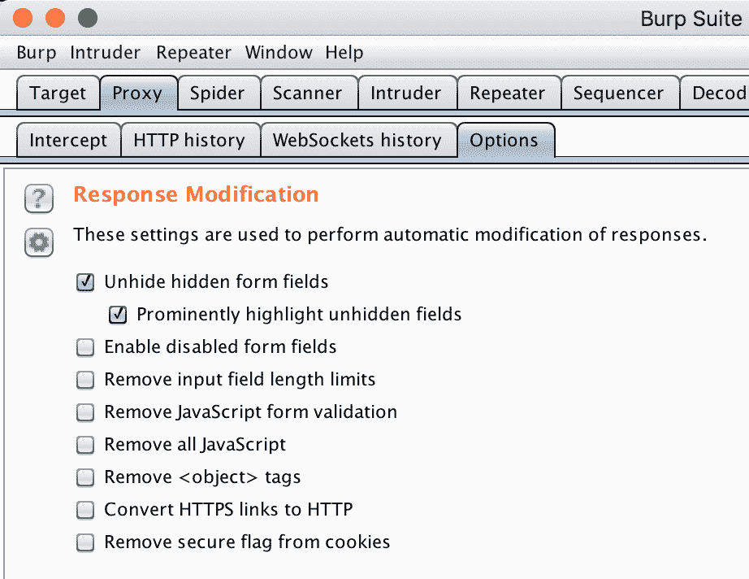
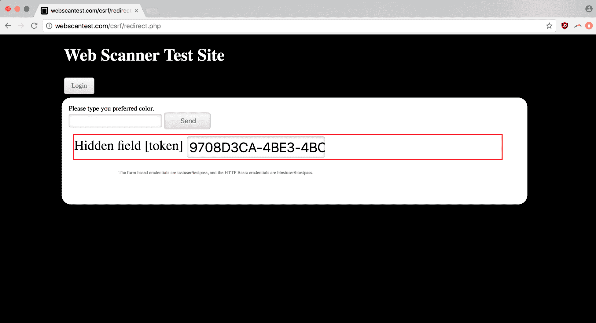
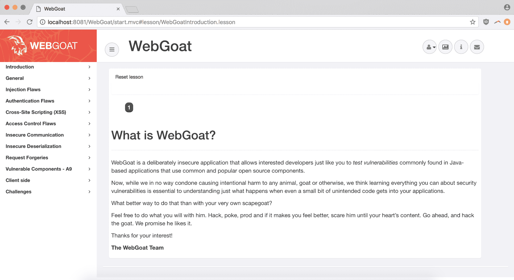
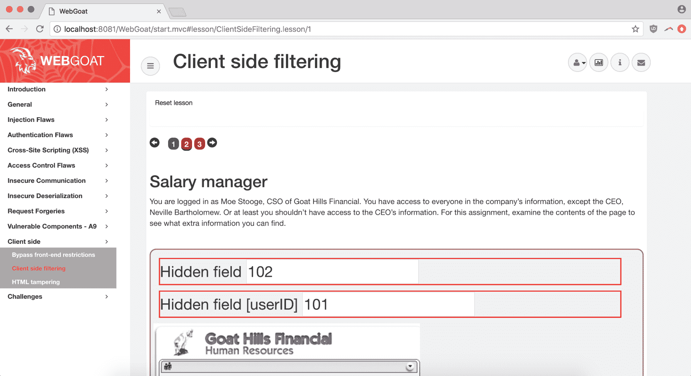
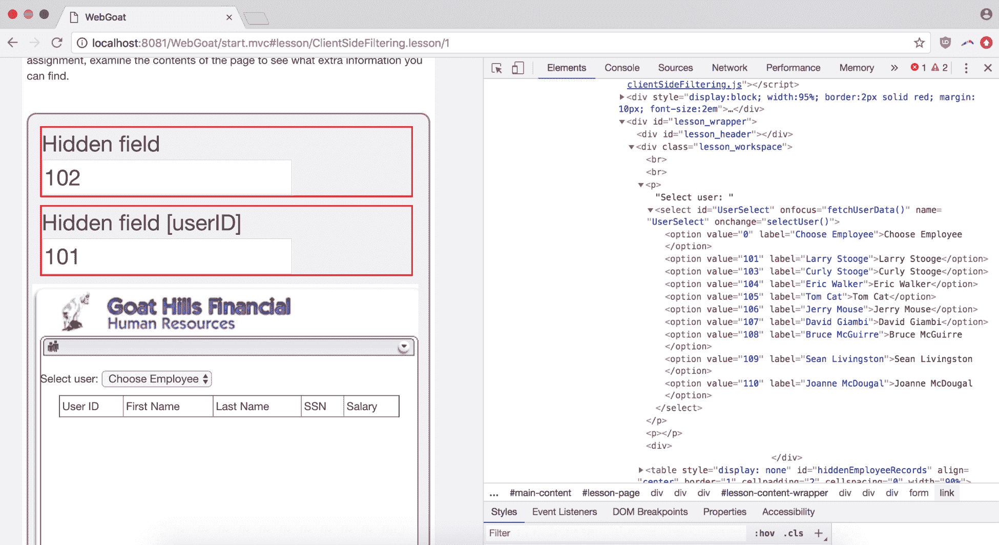
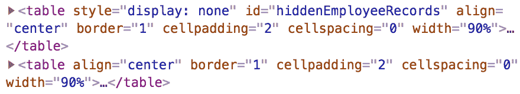
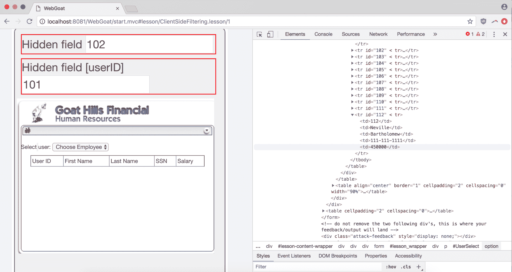

# 第八章：访问控制与通过模糊安全性

通过（或借助）模糊性来实现安全性，是一种在 Web 应用程序开发中假设黑客无法破解他们看不见的东西的策略；即使存在漏洞，只要它被恰当地隐藏或模糊化，它就永远不会被发现并用于恶意目的。

尽管这种想法似乎有道理（怎么可能有人找到我巧妙隐藏的东西——我已经巧妙地隐藏了它），但它忽略了计算机和编程的基本理解。计算机在大海捞针方面非常擅长。而且，寻找你网站漏洞的不仅仅是一个人在一台机器上编写脚本；任何暴露在互联网上的网站都会面临一个`24/7/365`的群体协作攻击，试图破坏其网络。当你认为没有人能发现你隐藏的漏洞时，实际上你是在假设，针对你的大量人群（无论是直接还是间接的），在你网站的生命周期中，凭借整个互联网的资源，没有人能成功。这是一个危险的赌注。

在本章节中，我们将演示如何使用各种工具查找隐藏内容，并讨论什么值得获得奖励，什么不值得：每个角落都充斥着大量数据，了解程序如何评估这些数据非常重要。我们还将讨论安全思维方式的不足之处，这些不足会使数据泄露成为许多网站的严重漏洞。当然，我们还将以数据泄露为例，展示整个漏洞悬赏过程的生命周期，从发现到验证再到提交。

# 技术要求

在本章节中，我们将使用 Burp Suite 及其隐藏内容功能，以及 Chrome（`66.0.3359.139`）。我们还将使用 WebGoat，这是一个由 OWASP 创建的有意脆弱的应用程序，你可以下载并进行实践。

请将代码库克隆或下载到你的本地系统中（[`github.com/WebGoat/WebGoat`](https://github.com/WebGoat/WebGoat)）。

有几种方式可以设置 WebGoat。你可以将其下载并作为`jar`可执行文件运行（就像我们使用 Burp Suite 时那样），也可以下载 Docker 镜像，或者直接从源代码构建它。尽管使用`jvm`管理 Java 依赖项对 Burp 有效，但我更喜欢在有 Docker 的情况下使用它，因为围绕 Docker 有许多优秀的工具。

有一个问题：如果你正在运行 Burp Suite 代理并使用默认的代理端口（`localhost:8080`），你需要确保在不同的端口上启动 WebGoat 服务器，以避免与 Burp 产生流量冲突。以下是 GitHub 页面参考的命令，用于拉取并启动服务器：

```
docker pull webgoat/webgoat-8.0
docker run -p 8080:8080 -it webgoat/webgoat-8.0 /home/webgoat/start.sh
```

在我们的案例中，因为我们希望它运行在`localhost:8081`而不是`localhost:8080`，我们只需将第二个命令更改为将 Docker 进程映射到正确的端口：

```
docker run -p 8081:8080 -it webgoat/webgoat-8.0 /home/webgoat/start.sh
```

现在我们可以一起使用 Burp 和 WebGoat，而不会发生端口冲突。

# 通过模糊性来实现安全性——美丽的诱惑

安全性通过模糊化的吸引力——以及陷阱——在于其实施策略的简便性，尤其是与更严格的凭证管理系统相比。模糊化一条敏感信息只是意味着将其打乱、重新排列和排序，直到它看起来像胡言乱语。“看起来像”是关键，因为模式可以在超出人类直觉或估计范围之外被检测到。

这种策略背后的假设通常包含一个人类易犯错误的元素——某人无法找到*X*，或者跨越*Y*，因为考虑到应用的范围、漏洞的最小性质以及假定的暴力破解问题的工作量，成功的概率极低。但当然，计算机并不受这些限制的约束，而且实际的站点访问者比预想的要多。而当大量用户，以及爬虫、模糊测试工具和各种网络代理，针对某个目标训练它们的工具时，它们可以发现缺陷，使该站点（及其他站点）更加安全。

这里有一个重要的警告，即虽然单独或作为网络的主要安全层，安全性通过模糊化并不成立；它作为众多防御手段之一是有效的。巧妙地运用这一策略可以帮助提高攻击成本，迫使不那么坚定的对手退却，至少可以防止机会主义的利用。

# 数据泄露——哪些信息重要？

有几类数据具有即时和明显的价值。几乎任何开发人员都应该清楚，这些数据应该在任何威胁建模过程中被视为更高价值的信息。

# API 密钥

API 密钥通常用于为 API、服务或其他组织类型的对象提供项目级授权。API 可能是暴露的重要信息，因为它们的权限范围广泛，且 API 密钥的权限通常也较大。API 密钥的一个现成示例可能是 SaaS 应用的 API 密钥，例如 Twilio。Twilio API 密钥不会根据用户角色区分访问权限；它只是让持有者能够向关联的 Twilio 账户发出 API 调用。

# 访问令牌

令牌与 API 密钥不同。访问令牌通常用于验证个人（例如，session 令牌和一般的所有 cookies），而不是整个服务或项目。访问令牌仍然可能是敏感数据，这取决于令牌认证的范围。

API 密钥通常不应该公开（除非它是多密钥系统的公开部分），但你的浏览器每天与访问的网站交换会话认证令牌。

这些区分并非铁定不变——它们仅描述了一种可以自由打破的约定——但它们为理解不同类型的身份验证数据之间的一些区别提供了一个很好的起点。

一个常见的流行访问令牌示例是 AWS **身份与访问管理** (**IAM**) 访问令牌，它为调节 IAM 角色对由更大的组织账户拥有的不同 Amazon 资源的访问提供了基础。

# 密码

这是一项显而易见的任务。如果团队/角色密码和个人密码以明文（或加密不足）形式存储并暴露，显然是危险的漏洞点，黑客可以利用这些漏洞渗透到更高权限的系统。用户名/密码凭证模式是大多数消费者定期使用的服务的基础，从社交媒体账户到银行账户。

# 主机名

这可能是一个有些模糊的领域。通常情况下，如果一个主机名暴露在公开可用的日志中或 API 中，并且它本应是内部的，那么它将被限制在 VPN 或特权网络中。然而，如果没有 VPN 或防火墙保护，即使是一个机器的 IP 或主机名也可能成为一个可被利用的风险点。

# 机器 RSA/加密密钥

不像 API 密钥那样描述服务、项目和角色的权限，机器 RSA 密钥或类似的密钥代表了单个机器的加密身份（无论是笔记本电脑、服务器等）。即便是对较小服务（例如较小或暂存环境中的持续部署构建服务器）暴露的 RSA 密钥，也可能为攻击者提供必要的立足点，将恶意元素注入到你网络的其他部分。如果你使用的是 macOS 机器，通常会将与你的机器相关的 SSH 密钥存储在隐藏的 `.ssh` 文件夹中。典型的命名约定是 `id_rsa` 作为私钥，`id_rsa.pub` 作为公钥。

# 账户和应用数据

迄今为止我们描述的信息都存在于网络层级，除了与应用行为相关的访问令牌（例如会话 cookies）。但账户内部的数据——账户设置、账单信息、应用配置等——都是任何攻击者都非常感兴趣的目标。

# 低价值数据——什么不重要

任何包含关于漏洞悬赏的讨论，都应该涵盖 web 应用每天常常无问题地泄露的重要数据。

# 一般性描述的错误信息

尽管错误信息可能是敏感信息的有效来源，但这只有在消息中确实包含敏感数据的情况下才成立。仅仅是包含函数名称、异常类型和其他常见调试信息的堆栈跟踪并不是一个漏洞。这里的关键区分点是：你能想象一个利用这些信息的攻击场景吗？

# 404 和其他非 200 错误代码

404 错误和其他更复杂的错误代码是应用程序正常运行的一部分。如果敏感信息暴露在错误信息中，那是一个问题，但其他情况下，代码是可以预期的。

# 用户名枚举

精明的网站会在注册和登录页面中显示错误信息，但不会指明用户名是否存在：无效的凭据足够模糊，不清楚是用户名错误还是密码错误，而“用户名已存在”的信息则立刻告诉攻击者该账户已经有有效的目标用户。

如果结合一个模糊不同可能的用户名（基于类似字典攻击的东西）的脚本，一个决心坚定的攻击者可以创建一个网站所有用户的列表。尽管如此，由于这种方法消耗资源大、常见，并且并没有直接导致像远程代码执行那样严重的漏洞，用户名枚举通常不值得大多数公司支付漏洞悬赏。

# 浏览器自动填充或保存密码功能

启用浏览器的表单自动填充或保存密码功能通常是不推荐的，因为攻击者一旦获取了对你的浏览器的访问权限，就可以回溯利用存储的凭据。由于它已经依赖于另一个漏洞，允许攻击者首先访问你的浏览器，因此这个漏洞通常不值得支付悬赏。

# 数据泄露途径

到目前为止，我们列出了不同类型的信息，但并没有说明这些信息可能出现在什么地方。以下是一些网站或应用程序可能无意中暴露敏感信息的地方。

# 配置文件

配置管理是一个独立的操作分支，确保配置凭据永远不会暴露。无论你是通过像 consul 这样的服务在运行时注入它们（有关链接，请参见*进一步阅读*），还是仅仅通过将它们包含在项目的 `.gitignore` 中以避免版本控制，它们的解决方案在复杂性上各有不同。

但有时这些措施会失败，导致配置文件被包含在服务器的根目录中、暴露的构建服务器的日志中、应用程序的错误信息中，或者公共代码仓库中。这可能会使该配置文件中的敏感内容暴露给任何攻击者。

之前，我们讨论了在应用模糊测试工具（如 `wfuzz`）的背景下发现敏感配置文件，这些工具利用字典列表尝试访问那些错误地暴露在网络服务器上的文件。在第三章，*为参与做好准备*，我们使用了 `SecLists` 仓库中的精选渗透测试资源作为字典列表 ([`github.com/danielmiessler/SecLists`](https://github.com/danielmiessler/SecLists))，但还有其他几个优秀的敏感文件名字典选项。有关更多信息，请查看第十一章，*其他工具*。

# 公共代码库

随着越来越多的开发人员使用像 GitHub 这样的开源网站来建立网络并共享代码，错误地将平面文件凭证和基于文本的机密信息包含在仓库的提交历史中变得非常容易。这里需要特别注意的是，如果你错误地将敏感数据提交到项目的 Git 历史中，第一件事应该做的是更换那些凭证。

不要尝试提交一个删除这些信息的 commit（请记住，它仍然可以在以前的 commit 中找到）；首先刷新那些 API 密钥或密码，然后再考虑以后从仓库中删除这些信息。

将敏感凭证提交到公共 GitHub/Bitbucket 仓库已经变得非常普遍，以至于像 *非常昂贵的 AWS 错误* 这样的博客已经成为了一个独特的内容领域（[`medium.com/@morgannegagne/a-very-expensive-aws-mistake-56a3334ed9ad`](https://medium.com/@morgannegagne/a-very-expensive-aws-mistake-56a3334ed9ad)）。在这篇特定的博客文章中，一位正在参加 Flatiron 开发训练营的开发人员将她的 AWS IAM 凭证提交到了 GitHub，直到她开始超过免费的使用额度时才发现自己的错误，最终看到她在凭证暴露的短短时间内已经产生了超过 3,000 美元的账单。

这一做法甚至催生了各种 SaaS 商业公司，旨在扫描你的公开源代码，并在你不小心将任何敏感信息包含其中时通知你。像 GitGuardian（[`www.gitguardian.com/tweet`](https://www.gitguardian.com/tweet)）和 GitMonkey（[`gitmonkey.io/`](https://gitmonkey.io/)）这样的公司就是为了提供安全通知服务，如果一个疲惫或初级的开发人员不小心提交了凭证版本历史时，能为你提供安全保障。

# 客户端源代码

客户端源代码——即在浏览器中执行的静态 JavaScript、HTML 和 CSS——不同于由整个 Git 项目表示的完整源代码仓库。你不太可能找到包含应用程序级机密的配置文件，并且暴露的业务逻辑的范围可能是最小的（即使是完全基于 JavaScript 的 Angular 或 React 应用，也通常将大部分逻辑放在连接的 API 中），但仍然有可能窃取弱密码、`futz` 客户端验证，或者查找在注释掉的代码中的旧设置、资源和功能。

# 隐藏字段

隐藏字段技术上是客户端代码的一部分，但由于它们是恶意数据输入的主要传播途径，因此需要额外的关注。如果你正在操作隐藏字段，务必避免为蜜罐字段提交值。蜜罐字段是隐藏的 `input` 标签，因为正常的图形用户界面（GUI）用户看不见它们，所以通常不会被提交——除非这个表单被脚本模糊测试，脚本会将值注入到它可以找到的每个 `input` 字段中。

# 错误信息

就像我们在第五章中讨论的，*SQL、代码注入和扫描器*，我们讨论了基于错误的 SQL 注入攻击，以及如何通过 SQL 数据库传播上来的公共错误信息，决心坚定的攻击者往往可以利用这些信息枚举数据，错误信息在其他上下文中也能泄露数据。在应用错误日志、GUI 错误信息、API 错误和其他错误渠道中，从机器级 RSA 密钥到用户信息，任何东西都有可能被暴露。

# 揭开隐藏内容 – 如何拉开帷幕

探索混淆、忽视或以其他方式暴露的数据是一个关键的练习，既是站点初步侦察的一部分，也是一个独立的目标。

我们将介绍几种不同的方法，其中一些是被动的，另一些则更为主动，这些方法可以帮助你发现敏感信息，并获得赏金奖励。

# 初步代码分析

这是一个简单的步骤，但浏览页面的源代码并了解代码风格和质量、框架、任何额外的连接服务，以及对驱动应用的代码库的总体感觉是非常重要的，这可以导致一些令人惊讶的发现。

# 使用 Burp 揭示隐藏字段

使用 Burp 揭示隐藏输入字段有两种方法：一种是简单的，另一种是极其简单的。

第一种方式是检查表单生成的任何 HTTP 流量，确保你捕捉到任何在 GUI 中不可见的信息。

另一种（更简单）方式是在 Proxy 选项卡中的 Options 面板中进行简单的配置设置：



现在，当你通过代理链接的浏览器浏览应用时，页面上任何隐藏的字段都会在一个鲜红色的 `div` 中高亮显示：



通过高亮显示你遇到的任何字段，Burp 允许你在绘制目标应用攻击面时同时捕捉到秘密信息。

# 数据泄露 – 从头到尾的示例

让我们在 WebGoat 上尝试一些新技巧，WebGoat 是 OWASP 的故意漏洞化的 Java 应用。导航到 `localhost:8081/WebGoat` 后，点击链接注册一个新用户并登录。

登录后，你应该看到 WebGoat 的主欢迎页面：



现在我们将点击进入客户端教程：



打开页面后，我们可以立即看到几个隐藏的感兴趣字段。我们也能大致了解这节课的内容——我们是一个不满的员工，想获取我们 CEO 的个人信息，尽管我们（自然地）没有权限访问这些信息——而我们想要颠覆的是：一个小型的员工目录应用。

查看隐藏字段时，它们似乎与与员工信息记录相关联的员工 ID 相关。如果我们使用开发工具来检查标记，我们可以看到选择我们想要信息的员工的`select`标签，以及相关的 ID：



现在如果我们可以深入研究那个`onchange`回调函数——等等，在我们面板的右下角那是什么？



显然，这是一个极端的例子——用一个超级污名化的字符串来命名一个类——但是由于用于隐藏数据的机制依赖于 GUI 或没有人篡改它，所以暴露敏感客户端数据不幸地是一个现实问题：



现在，深入研究这个类，我们可以看到标记确实包含 CEO 和其他人的信息。我们现在知道 CEO 的薪水（高达$450,000），在企业间谍活动中有了一点进展。

# 收集报告信息

现在我们已经让公司陷入困境，让我们来详细说明我们写报告所需的信息：

+   **类别**: 这是敏感信息泄露事件。在这种情况下，是 CEO 的薪水和社会安全号码。

+   **时间戳**: 对于我们的时间戳，我们可以手动近似一个时间。

+   **网址**: 对于我们的网址，我们可以使用在源代码中发现信息的页面：

```
http://localhost:8081/WebGoat/start.mvc#lesson/ClientSideFiltering.lesson/1
```

+   **方法**: 跳过有效载荷，我们可以直接进入方法。在这种情况下，我们仅仅是在仔细检查页面源代码后发现了这些信息。

+   **复现指令**: 相当简单。导航到受影响的页面并查看其源代码。

+   **攻击场景**: 对于我们的攻击场景，证明数据在错误手中的危险性非常重要。在这种情况下，很明显。泄露敏感财务信息和社会安全号码使 CEO 明显面临网络攻击和身份盗窃的风险。

# 最终报告

让我们利用这些信息来格式化我们的提交：

+   **类别**: 敏感员工数据泄露。

+   **时间**: 2017-03-25 17:27 (17:27) UTC.

+   **网址**: `http://localhost:8081/WebGoat/start.mvc#lesson/ClientSideFiltering.lesson/1`

+   **方法**: 在检查受影响页面的源代码后检测到的漏洞。

+   **操作指示**:

    1.  导航到受影响的网址

    1.  检查页面的源代码

+   **攻击场景**: 有了 CEO 和其他特权员工的个人信息访问权，攻击者可以窃取这些个人身份，通过鱼叉式钓鱼攻击来入侵公司资源，并且通常会破坏公司及其员工的财务健康。

# 摘要

在本章中，你已了解了作为一种哲学理念，模糊安全（Security by Obscurity）的缺陷（有时也有其有效性），如何使用 Burp 和其他工具揭示网站的隐藏内容，如何区分不同类型的敏感信息，哪些信息不值得获得奖励的粗略指南，以及如何将数据泄露漏洞从发现到报告格式化和提交。你现在应该已经准备好将至少基本的隐藏内容发现方法融入到你的渗透测试工作中。

# 问题

1.  模糊安全是否是一个有效的安全层？

1.  一些常见的漏洞报告信息是什么？

1.  哪个工具适合用来揭示隐藏内容？

1.  API 密钥与访问令牌之间有什么区别？

1.  通常哪些信息不值得作为数据泄露漏洞获得奖励？

1.  依赖客户端数据过滤有什么缺点？

1.  Web 应用程序中数据泄露的常见途径有哪些？

# 深入阅读

你可以在以下链接中了解更多我们在本章讨论的某些话题：

+   Google Cloud 端点：API 密钥与认证令牌的比较：[`cloud.google.com/endpoints/docs/openapi/when-why-api-key`](https://cloud.google.com/endpoints/docs/openapi/when-why-api-key)

+   Consul 配置管理：[`www.consul.io/`](https://www.consul.io/)
