# 第九章：框架和应用程序特定的漏洞

识别框架或应用程序特定的漏洞，包括已知组件漏洞（通过 CVE 标识符来识别，我们稍后会讨论）是非常棘手的。

这也是所有漏洞悬赏计划的普遍规定，即公司不会对相同的漏洞进行两次奖励——第一个披露漏洞的研究员才会获得奖励。这与公司通常不会奖励在原始零日漏洞发现后两周内已经公开披露的漏洞是密切相关的（就像所有公司一样，他们需要时间来部署补丁），而且他们对第三方库中的供应商级漏洞不感兴趣。这看起来可能是浪费时间，除非我们考虑到两个重要的因素。

采用的成本很低。由于已知的组件漏洞是显而易见的，因此构建一个工具来可靠地发现这些漏洞要比处理架构或应用程序逻辑中的不太明确的弱点更容易，后者需要手动通过用户界面逐步检查。正如我们在第三章《准备参与》中举的例子一样，我们为检测和报告客户端漏洞（如不安全的 jQuery 库）编写了一些简单的脚本，这是一项轻量级的工作，可以融入到任何有权限访问客户端源代码的环境中。

了解安全态势非常重要。安全态势这个术语是应用程序或网络防止、检测和响应攻击的总体能力的简称。如果你打开诊断工具，立刻发现框架、语言版本或供应商服务中存在多个关键报告漏洞，那就能告诉你很多关于该公司安全实践的信息。如果有这么多容易解决的问题，那么他们的漏洞悬赏计划还年轻吗？他们是否有成熟的安全生命周期管理政策？如果从已发现的漏洞中能找到攻击场景的路径——太好了！——即使不是这种情况，这些信息也是有价值的，因为它们可能暗示着潜在的威胁。

关键在于攻击场景。这是最本质的一点：面对有效的攻击场景时，大多数 KCV 指南都要被抛到一边。公司不愿仅仅为了改善 jQuery 攻击面而贡献一个补丁——那会花费大量时间来验证、沟通和修复最终属于其他组织的漏洞。但是，如果你能说服他们这个漏洞影响到他们的业务，就可能引发改变（贡献补丁、更新组件、切换到另一种解决方案）并触发奖励。

本章将解释如何：

+   将已知组件漏洞扫描集成到你的基于 Burp 的工作流中

+   使用工具查找像 WordPress、Django 和 Ruby on Rails 这样的软件中的应用程序特定问题

+   从发现、验证到提交一个组件特定的漏洞

# 技术要求

在这一节中，我们将与 Burp 及其一些扩展合作，自动设置 KCV 检测。我们还将依赖我们常用的浏览器设置作为 Burp 代理。我们还将使用 WPScan，既作为 CLI 工具，也作为 Burp 扩展。

WPScan CLI 提供了多种安装选项。我们将再次使用容器软件 Docker，从自定义执行上下文中下载并运行`wpscan` CLI，这个上下文打包了所需的一切。Docker 使我们可以将此工作流移植到任何可以安装 Docker 的地方，这意味着我们不需要担心操作系统特定的行为。而且，因为 Docker 会缓存 WPScan CLI 镜像，所以我们可以使用它，性能损失仅比本地安装略大。

假设已经安装了 Docker，若要拉取最新的 WPScan CLI 镜像，只需运行以下简单命令：

```
docker pull wpscanteam/wpscan
```

然后，你拥有所有必要的依赖项，可以使用`docker run`命令启动`wpscan` CLI。这里有一个直接来自 Docker Hub 镜像文档的示例单行命令：

```
docker run -it --rm wpscanteam/wpscan -u https://yourblog.com [options]
```

为了测试目的，WPScan 背后的同一个团队还提供了一个故意包含漏洞的 WordPress 安装，它同样运行在 Docker 容器中。要在本地构建该镜像，首先克隆 GitHub 仓库（[`github.com/wpscanteam/VulnerableWordPress`](https://github.com/wpscanteam/VulnerableWordPress)），然后进入其根目录。接着，运行以下命令：

```
docker build --rm -t wpscan/vulnerablewordpress .
docker run --name vulnerablewordpress -d -p 80:80 -p 3306:3306 wpscan/vulnerablewordpress
```

现在，你应该有一个准备好在`localhost:80`进行设置的 WordPress 安装：

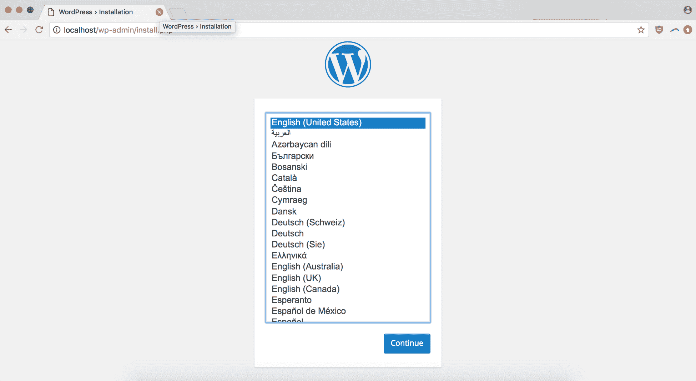

# 已知组件漏洞和 CVE - 简要回顾

**公共漏洞和暴露**（**CVE**）系统自我描述为一本字典，提供已公开披露的漏洞和披露的定义。它的目标是让跨团体和技术共享网络安全相关数据变得更加容易，理解开放协调的好处大于公开广告有效攻击的风险。值得记住的是，CVE 是一种将漏洞数据库连接起来的方法，而不是一个漏洞数据库本身。也就是说，你通常会发现 CVE ID 与集成到检测已知漏洞的工具中的 CVE 信息页面有链接。CVE 条目甚至已集成到美国国家漏洞数据库中。

CVE ID 的结构直接明了：该标识符由年份加上四位数（或更多）整数组成。直到 2015 年初，CVE 标识符只能有最多四位数的唯一整数，但由于这限制了每年可分配的 ID 总数为 9,999 个，因此必须扩展，现在可以是任意长度。

除了其 ID 外，每个 CVE 通常还附带某些信息：

+   指示 CVE 是否具有条目或候选状态

+   漏洞或曝光的简要描述

+   任何适当的参考资料（例如，来自 OVAL-ID 的漏洞报告、警报）

OVAL-ID 是区分 OVAL 定义的唯一标识符。来自 OVAL 网站：

OVAL 定义是用**开放性漏洞和评估语言**（**OVAL**®）编写的标准化、机器可读的测试，用于检查计算机系统中软件漏洞、配置问题、程序和补丁的存在。

OVAL 定义测试，如 CVE，旨在协调一个开放、透明的系统，用于标准化渗透测试词汇，并允许更多的共享，以及道德黑客和他们的工具之间的更多共享。

这个快速介绍/复习应该在下次使用任何利用 CVE 作为主要安全参考的工具时派上用场。

# WordPress – 使用 WPScan

根据 WordPress 的说法，他们的框架支持所有网站的 31%。这个面向一切的开源 CMS 是一个巨头，为业余爱好者和商业网站提供基本引擎，从你叔叔的博客到白宫的登陆页面。因此，它是一个极具吸引力的目标，供渗透测试人员和黑客随处可见。WordPress，带有其众多插件和配置选项，提供了一个庞大的攻击面，通常由技术经验有限的管理员管理，可能难以保护。每个编写不良的插件、WP 核心的猴子补丁或古老的安装都可能成为攻击者入侵或破坏 WP 站点所需的立足点。

WPScan 功能打包在几种不同的工具中。对于我们的目的，最重要的是容器化的 Docker 命令行界面和 Burp 扩展。

# 将 WPScan 作为 Docker 化的 CLI

将 WPScan 作为 Docker 化的 CLI 使用的优势在于，我们仍然可以充分利用 CLI——允许我们将脚本嵌入到更大的自动化设置中——而不必担心依赖管理问题，比如保持我们的 Ruby 版本最新。我们甚至可以编写一个简单的包装器，围绕`docker run`命令，这样每次使用脚本时就不需要输入太多样板内容。

例如，如果我们创建一个名为`wpscan.sh`的 shell 脚本，并调用我们的 Docker 命令，传递`"$@"`字符，以便将所有标志和命令行参数通过 shell 脚本传递给`docker`命令，我们得到的结果如下：

```
#!/bin/sh

docker run -it --rm wpscanteam/wpscan "$@"
```

然后，我们可以使用`chmod`使我们的包装器脚本可执行，并将其`symlink`到我们的`/usr/local/bin`，这样我们就可以在我们的`$PATH`中访问它：

```
chmod u+x /Full/path/to/wpscan.sh
sudo ln -s /Full/path/to/wpscan.sh /usr/local/bin/wpscan
```

完成。现在，我们可以通过我们的`wpscan`包装器调用 CLI 脚本，使用与安装 WPScan 作为 gem 时相同的语法，但不需要跟踪安装 gem 的 Ruby 版本，也不需要确保安装了`ffi`或其他依赖库：

```
wpscan --help
```

通过传递`--help`标志来检查我们的选项，以下是我们看到的内容：

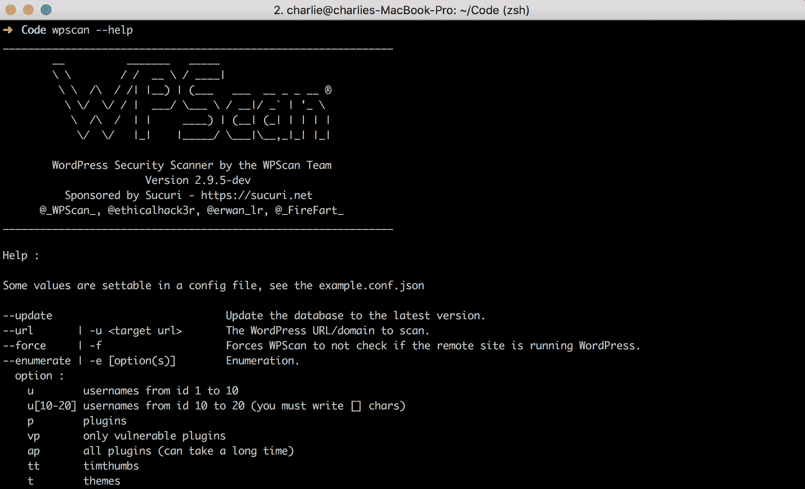

现在，为了测试这个功能，让我们启动我们的脆弱 WordPress 实例。如果你按照了我们*技术要求*部分的说明，你应该已经有一个准备好在`localhost:80`上设置的 WP 实例了。选择你希望使用的语言后，你应该会看到一个用于填写基本站点信息的表单（站点标题、管理员超级用户名、通知邮件等）：

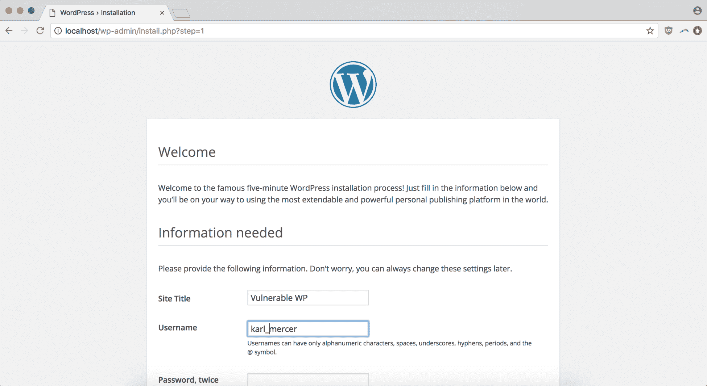

填写完毕后，你将被重定向到一个成功页面：

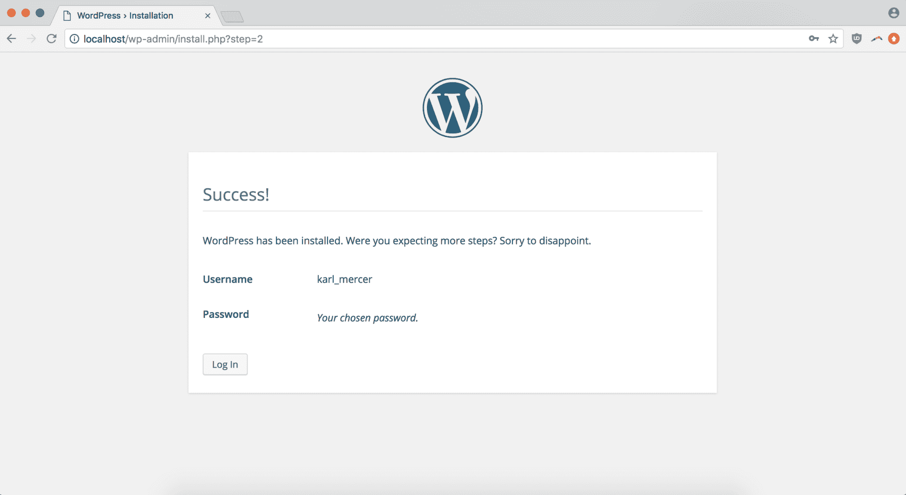

第一次登录后，导航到普通的`localhost:80`，查看你 WP 站点的实际主页：

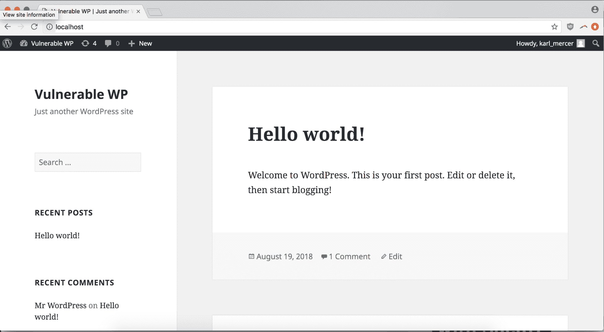

请记住，你不能从`wpscan`中 ping `localhost:80`，因为它是从 Docker 容器内执行的。为了将我们的 Docker 化 WordPress 实例提供给 Docker 化的 WPScanning 服务，我们需要使用运行 WordPress 的 Docker 容器的 URL。

我们可以通过使用`docker ps`来查找运行 WordPress 的 Docker 进程的容器 ID，然后运行`docker inspect <CONTAINER_ID>`返回包含 IP 地址的 JSON 信息。对于我们来说，这个 IP 地址是`172.17.0.2`。接着，我们运行此命令扫描我们脆弱的 WordPress 站点。如果我们针对的是一个公共互联网站点，我们可以跳过这一步：

```
wpscan --url 172.17.0.2:80
```

运行上述命令后，这就是我们扫描的输出结果：

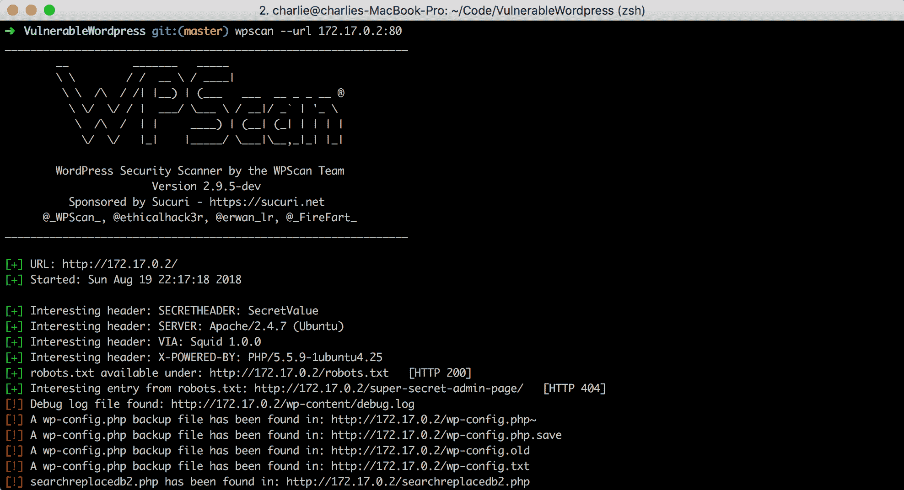

你可以立刻看到一些值得跟进的发现——`robots.txt 中的有趣条目：http://172.17.0.2/super-secret-admin-page/`看起来特别有意思，考虑到那个诱人的 URI。但如果我们继续查看漏洞列表，我们将能看到几个配置文件。我们寻找认证凭据、隐藏的目录和其他有用的东西，导航到一个暴露的配置文件，`wp-config.txt`：

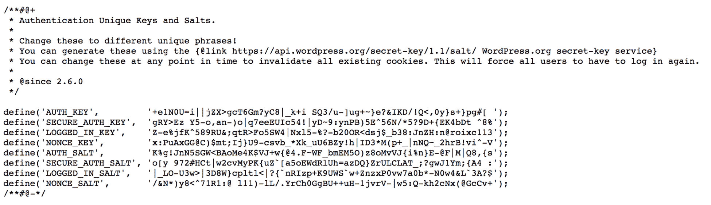

我们找到了我们想要的东西！通过站点级别的管理员密钥和所有的盐哈希，我们已经发现了进入王国的加密密钥。

# Burp 和 WPScan

使用 Burp 扩展方法应用 WPScan 的一个优势是，它使得将扫描器集成到更大的 Burp 工具集中的过程更加简便。例如，如果你依赖于手动标记页面为有效范围，那么你可以让 WPScan 利用这些信息，确保你在整个渗透测试过程中始终聚焦目标。

设置 WPScan 与 Burp 集成非常简单。你首先需要做的就是前往 BApp Store 下载扩展：

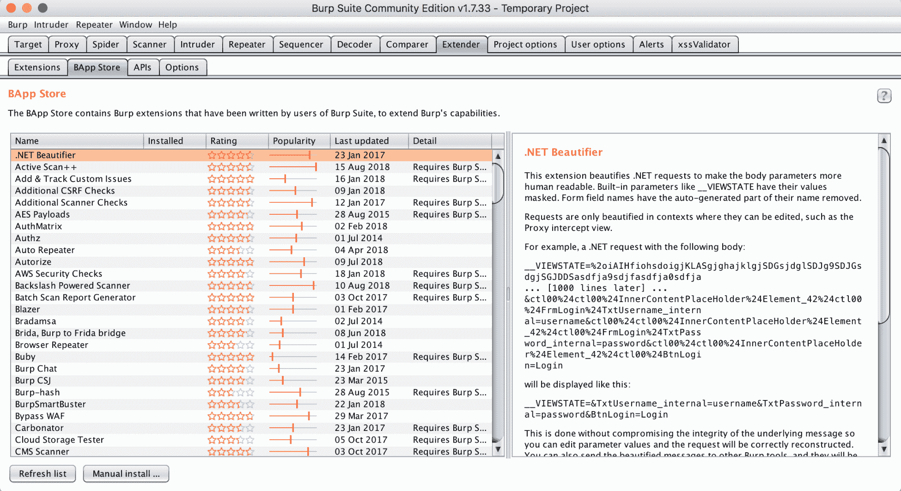

你也可以通过手动安装弹窗选择扩展文件（可以是 Java、Python 或 Ruby 语言）来手动加载扩展：

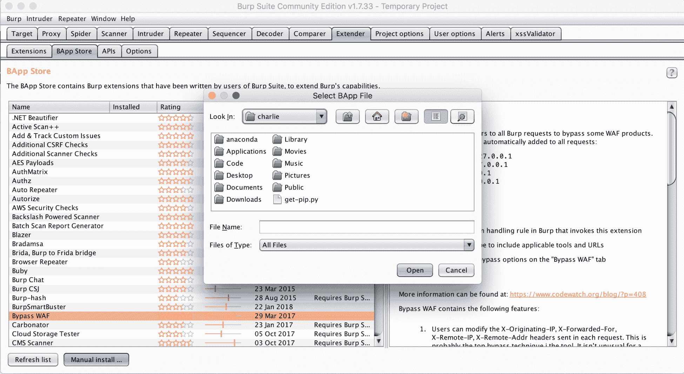

你可能发现需要为扩展安装相应的环境。设置每种语言都很简单：以 Python 为例，我们访问 Jython（一个在 Java 中实现的 Python 解释器）的主页并按照安装说明进行操作。然后，在扩展选项卡中的“选项”部分，我们可以添加 Jython `jar` 文件的路径：

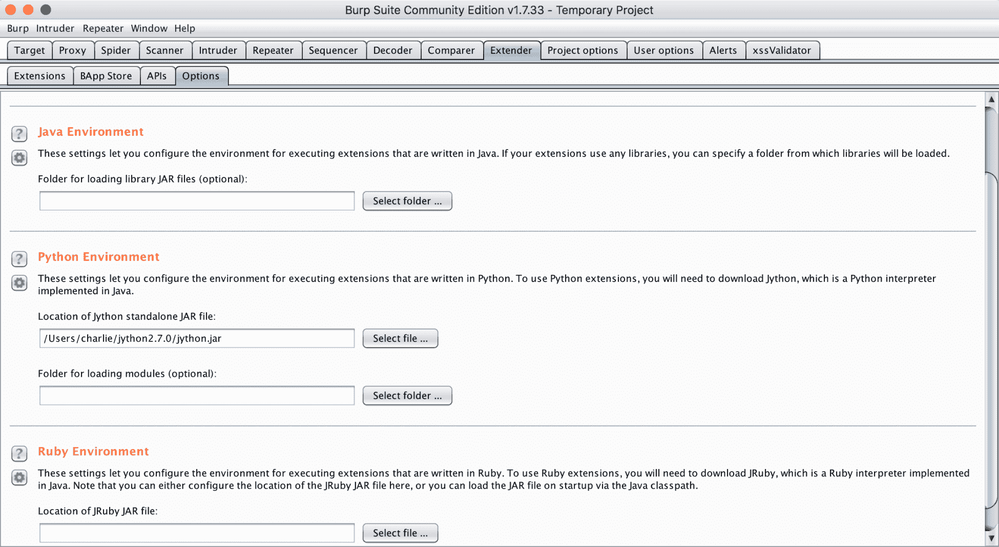

现在，我们可以从 BApp Store 下载 WPScanner 扩展。只需点击安装按钮就能轻松完成：

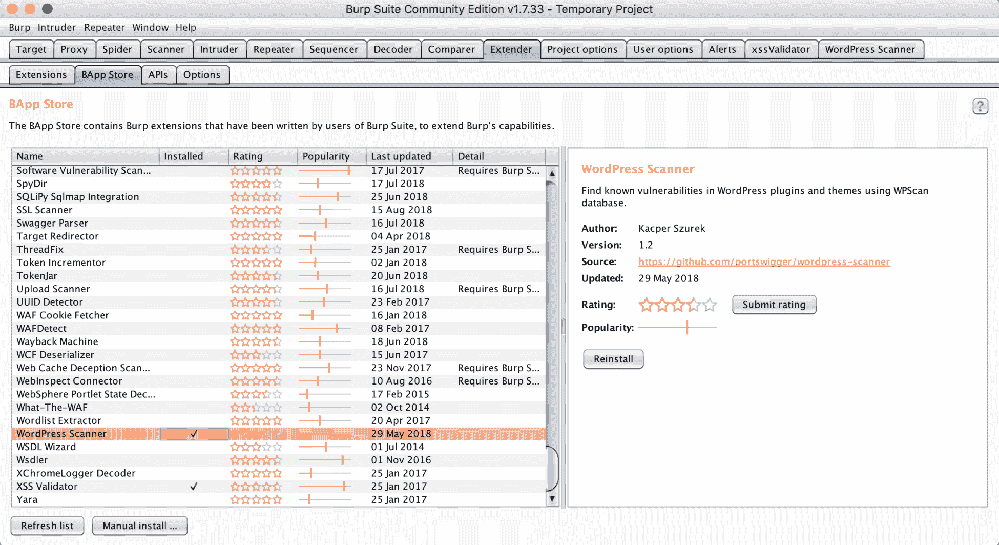

安装完成后，我们应该能看到一个 WordPress 扫描器标签。如果点击它，我们将能够看到设置和输出面板，准备好进行分析：

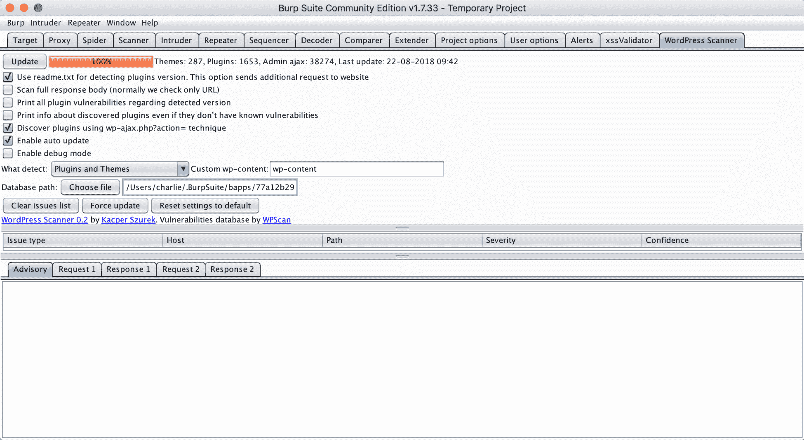

WPScanner 扩展依赖于 Burp 在你使用代理浏览器浏览网站时进行的被动分析。在点击几个页面、查看我们的示例文章并打开我们脆弱的 WP 实例的评论提交字段后，我们可以看到问题列表已经被多个漏洞填充：

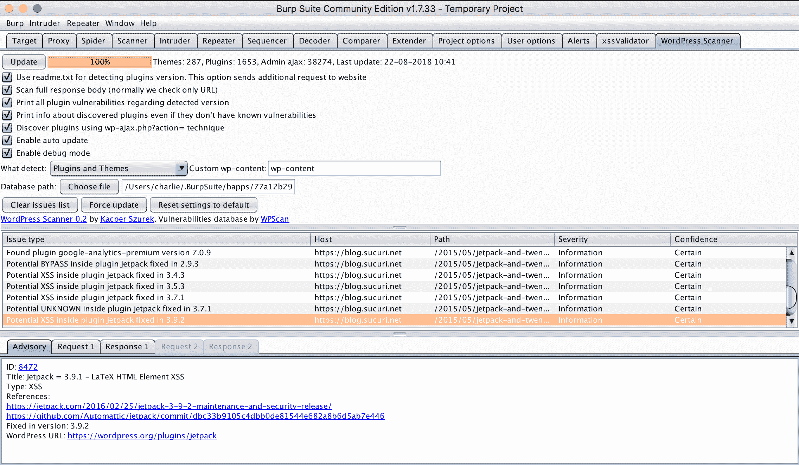

浏览问题列表时，我们可以看到每个类别的简短描述，并且有多个指向博客、GitHub 拉取请求和安全参考的链接，提供更多信息。我们还会看到漏洞路径、严重性以及对发现结果的信心等级。

浏览这个列表时，我们可以看到几种不同的 XSS 类型。进一步调查后，让我们尝试在评论提交字段中测试与 `svg` 标签相关的漏洞，探查网站内容清洗功能的另一部分——我们当然知道 WP 实例是脆弱的，但我们仍在进一步确认漏洞的定位和性质。以下是我们的代码片段：

```
<svg/onload=alert(document.location.origin)>
```

提交后，我们看到页面暂停了一会儿，然后最终加载完成。

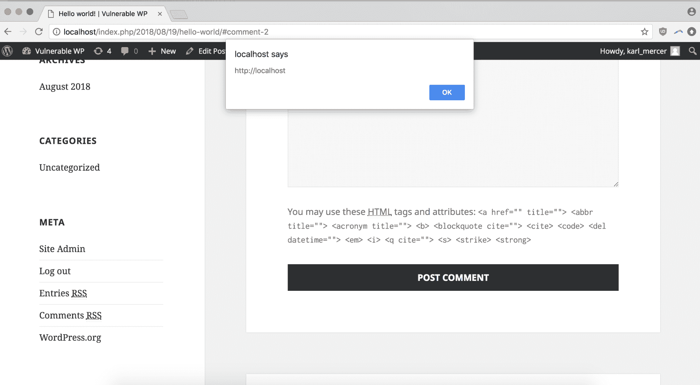

我们的测试取得了成果。尽管在这种情况下我们知道只要深入挖掘一定能找到问题，但像 WPScan 这样的工具可以提供有价值的、特定于应用程序的背景信息和后续调查线索，而无需添加一个繁重的新工具或难以集成的测试系统。

# Ruby on Rails – Rubysec 工具和技巧

有几种分析 Ruby 和 Ruby-on-Rails 应用程序的方法，其中一些是特定于 Rails 的，另一些可以更广泛地应用于类似的应用程序（例如，也符合 RESTful、MVC、CRUD 导向、主要在服务器端运行的应用程序等）。

# 利用 RESTful MVC 路由模式

由于 Rails 强烈倾向于将 RESTful MVC 模式应用于 CRUD 应用程序，URL 路由结构通常很容易直观地理解。理解 `/resource/action` 和 `/resource/{identifier}/action` 模式使攻击者能够通过简单的观察推断出像 `/users/{identifier}/update` 这样的潜在危险路径。

# 检查特定弱点的版本

作为一个应用框架，Rails 和所有流行软件一样，经过了多次安全更新，解决了诸如在 Active Record 中处理 SQL 注入，或者扩展 CSRF 保护方案以涵盖更多基本请求类型等关键问题。但由于构建 Rails 应用程序的门槛很低，而且语言和框架都非常适合提高生产力，Rails 应用程序往往能够快速搭建。而且由于 Rails 是一种常见的小型企业/原型开发解决方案，尽管经常被用于成熟的生产服务中，仍然存在大量的遗留 Rails 代码。这种快速搭建的架构与对长期使用的期望相结合，再加上 Rails 脚手架的即插即用特性（仅通过几个约定命令就可以创建完整的 CRUD 应用程序），意味着 Rails 特别容易受到由于配置错误或不安全默认设置所导致的漏洞的影响。

# 测试 Cookie 数据和身份验证

Rails 使得存储潜在的安全信息为 Cookie 变得非常简单，因此更容易通过编码但未加密的 Cookie 泄露潜在信息。

# Django – Python 应用的策略

Django 作为一个常用的框架，用于快速构建 CRUD 风格的应用程序，并且已经在一种为开发者生产力设计的动态类型语言中成功实现，自然会遭遇与 Rails 相同的许多陷阱，并且存在许多相同的弱点。Django 对 RESTful、以 MVC 为中心的 URL 路由有很强的偏好，因此允许进行前面一节中讨论的相同的 URL 攻击。尽管如此，Django 默认提供了很多出色的全局保护，能够有效防御诸如 CSRF、XSS 和注入攻击等常见漏洞。

# 检查 DEBUG = True

这是一个常见的错误，尽管看起来是个“拍脑袋”的失误——在生产环境中留下 Django 开发者级别的日志记录。以启用 `DEBUG` 设置发布应用会导致一些问题，包括暴露敏感页面或数据的全面错误追踪信息。如果您怀疑目标 Django 应用已启用 `DEBUG`，可以尝试生成错误以触发有害的追踪信息显示。启用 `DEBUG` 设置是非常常见的，甚至在今年早些时候，一名研究人员进行调查，仅用一周时间就发现了 28,165 个启用了该设置的 Django 应用（[`www.bleepingcomputer.com/news/security/misconfigured-django-apps-are-exposing-secret-api-keys-database-passwords/`](https://www.bleepingcomputer.com/news/security/misconfigured-django-apps-are-exposing-secret-api-keys-database-passwords/)）。如果看起来通过调试信息访问造成的危害似乎很有限，考虑到 2018 年，一名研究人员能够利用来自 Facebook 的不安全 Sentry 服务器的调试信息获得远程代码执行（RCE）。该漏洞的奖励是 5,000 美元——这是较低的金额，因为服务器是沙箱化的，无法访问用户数据（[`blog.scrt.ch/2018/08/24/remote-code-execution-on-a-facebook-server/`](https://blog.scrt.ch/2018/08/24/remote-code-execution-on-a-facebook-server/)）。

# 探测管理页面

Django 自带一个默认的管理页面，通常会被第三方插件或其他与管理员相关的扩展所取代。如果默认的管理页面被忽视，或者管理员集成不完整，它可能会提供一个有价值的攻击面供测试和探索。

# 总结

本章介绍了 CVE 漏洞识别系统的基础知识，如何围绕发现 WordPress、Ruby on Rails 或 Django 相关的漏洞构建工作流程，以及为何尽管存在各种警告，已知漏洞检测仍然值得纳入您的安全实践。通过本章，您应能更好地理解特定应用漏洞在安全生态系统中的作用，并有信心在适当的情况下将特定应用的测试流程集成到基于 Burp、脚本或其他任何工作流程策略中。

在下一章中，我们将介绍每个报告中应包含的关键信息、可选信息、包含详细重现步骤的重要性以及如何编写一个好的攻击场景。

# 问题

1.  CVE 代表什么？它是什么？

1.  什么使得 WordPress 成为黑客的一个有吸引力的目标？

1.  使用 CLI 而不是 Burp 扩展来实现 WPScan 功能有哪些优势？反过来又如何？

1.  找到 Ruby on Rails 特定漏洞的好方法有哪些？

1.  使用 Docker 作为渗透测试工具有哪些优势？

1.  OVAL 代表什么？什么是 OVAL 定义？

1.  测试 Django 应用程序时，您应该留意哪些问题？

# 进一步阅读

**您可以在以下链接中了解我们在本章中讨论的部分主题：**

+   **WordPress 官方网站**: [`wordpress.org/`](https://wordpress.org/)

+   **CVE 常见问题**: [`cve.mitre.org/about/faqs.html`](https://cve.mitre.org/about/faqs.html).

+   **OVAL 主页**: [`oval.mitre.org/repository/about/overview.html`](https://oval.mitre.org/repository/about/overview.html).

+   **WPScan 主页**: [`wpscan.org/`](https://wpscan.org/).

+   **OWASP Ruby on Rails 备忘单**: [`www.owasp.org/index.php/Ruby_on_Rails_Cheatsheet`](https://www.owasp.org/index.php/Ruby_on_Rails_Cheatsheet).

+   **官方 Rails 安全指南**: [`guides.rubyonrails.org/security.html`](https://guides.rubyonrails.org/security.html).
