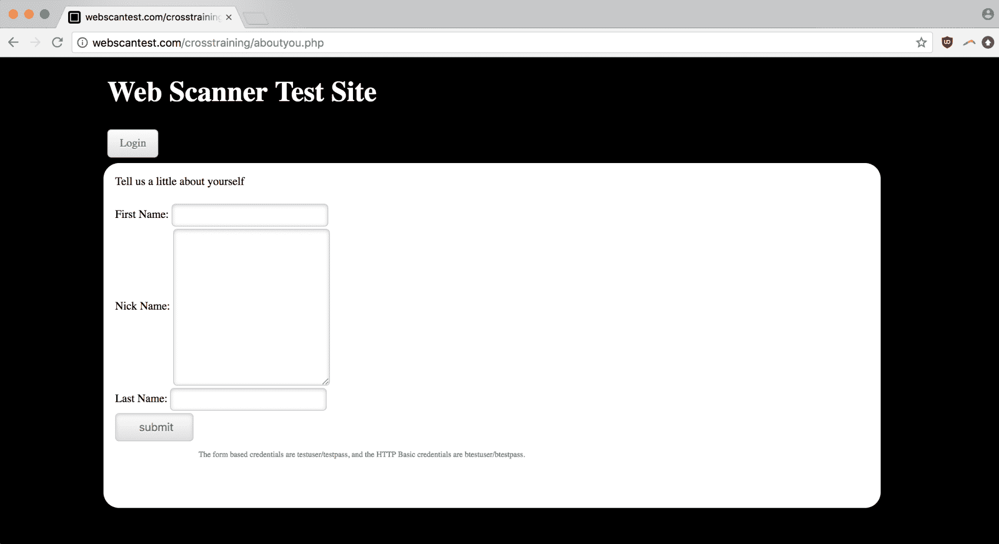
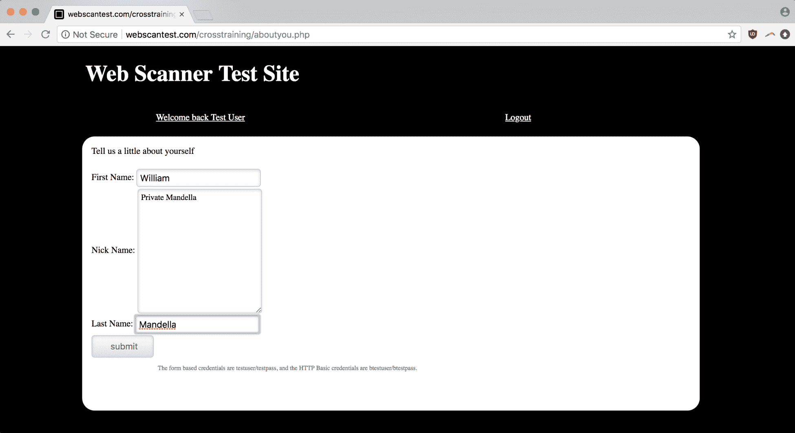
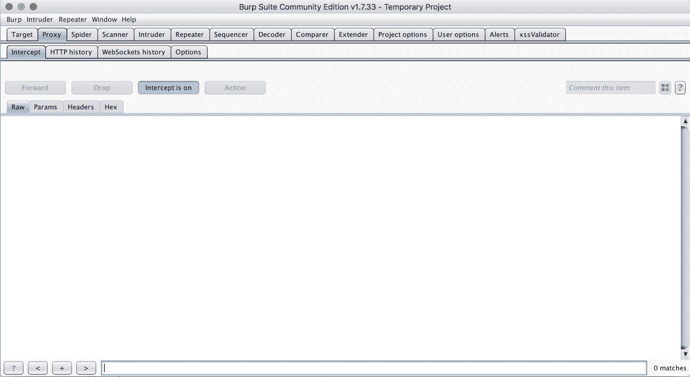
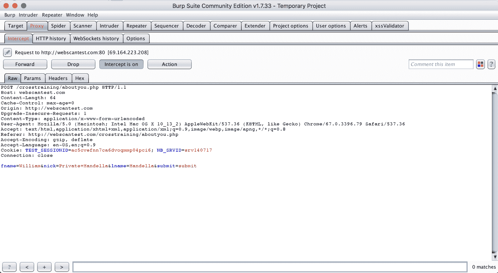

# 第十一章：其他工具

本书中，我们介绍的工具和工作流程都是根据效率、成本、专业意见和个人偏好综合选择的。但在我们讨论的简短列表之外，仍然有许多安全工具可以利用。

本章将讲解如何评估是否采用新工具，同时提供其他有用的 Curate 软件、网站、社区和教育资源的简单概述。我们将涵盖从程序（如扫描仪和 Burp 扩展）到众包攻击代码片段数据库（如 SecLists）的各类内容。

本章将涉及以下主题：

+   评估新工具

+   付费版与免费版

+   Nikto、Kali、Burp 扩展等工具的简要概述

# 技术要求

本章包含了一些技术依赖，具体取决于你希望将哪些工具融入到工作流程中。我们大多数的命令行程序可以通过`homebrew`包管理器轻松安装；Burp Suite 仍然需要安装 Java 8；当然，Kali Linux 发行版在栈的不同层次上运行，因为操作系统需要一个硬盘分区来进行安装。像往常一样，我们将使用 Chrome（`66.0.3359.139`）。

# 评估新工具 – 该关注哪些方面

在你审视一款新的渗透测试软件时，分析它为你的工作流程带来的价值是至关重要的。同样重要的是，问自己一些和使用开源、SaaS 或其他付费应用时类似的问题。这些问题应包括以下内容：

+   这款工具为我的工作流程增添了哪些我原本不具备的功能？

+   这些新功能有多重要？我预计它们的影响如何？

+   它是否将我锁定在某些计划、服务或特定设计中？

+   它有成熟的命令行界面（CLI）吗？

+   在已知的正向案例中，它的表现如何（对于扫描器和其他检测软件而言）？

+   如果是开源工具，项目已有多久？最后一次提交是什么时候，提交的频率如何？是否存在很多未解决的问题？问题是否得到了处理？

+   对于免费工具，是否为免费/社区用户提供了足够的功能？还是大部分所需的功能都被锁定在付费许可或订阅背后？

+   在付费工具的情况下，它是否与外部工作流程集成（例如，传入和传出的 webhooks、几种语言的客户端库或 RESTful 接口）？还是将你锁定在它的系统内？

这些问题中有些没有明确的答案，但思考它们会帮助你了解你正在考虑采用的任何软件的价值主张。

# 付费版与免费版 – 什么让一款工具值得使用？

是否开始为某款安全工具付费，仅仅是决定是否采用它过程的延伸，区别在于更多地关注其相对影响。

Burp Suite Pro 无疑是社区版的有用扩展。你可以使用扫描器，它与 Burp 的范围和攻击面映射功能紧密集成，还有一些高级手动工具，例如能够从拦截的 HTTP 请求中生成 CSRF（我们将在本章后面讨论），以及其他一些额外功能。

但是，正如我们在 CSRF 章节中展示的，生成 CSRF PoC 其实很容易自己自动化，且这样做能更好地与 Burp 以外的工具集成。如果你不需要其他高级手动工具，那么基本上就只剩下扫描器这一点了。即使你已经在工作流程中使用了扫描器，实际上不同的扫描器在扫描不同的漏洞时效果更好——你会通过对一个网站使用多个扫描器来得到最全面的安全评估（不过，考虑到扫描器的费用，实施起来并不像说得那么容易）。

Burp 的价值组件还增加了一层额外的内容。虽然你不应该仅仅因为某个工具性价比高就购买它，但这是一个重要的考虑因素。

扫描器很贵。顶级应用扫描产品的最便宜许可证，通常会达到几千美元，即使是一个小团队也难以承受（例如 Netsparker 这家安全公司最便宜的产品，每年不到$5,000，适用于一个桌面应用，允许扫描五个网站）。

这显然是他们试图吸引企业安全团队的举措，目标是那些需要可复现、自动化漏洞检测方案作为其整体应用管道/栈一部分的团队。但这种现象在许多渗透测试工具链中都很常见，因为拥有专业技术的公司希望针对 B2B 企业机会，这里有更多的盈利空间。而黑客则没有部门预算可以随便花。

在这种背景下，Burp Pro 许可证是一个极具性价比的选择，以低于其他流行产品一个月许可证订阅费用的价格，解锁了不仅仅是扫描功能。如果你跟着本教程走，或者通常把 Burp 作为你的安全工作流程中的关键工具，你应该考虑购买。如果你经常使用 Burp，那是值得的。

让我们考虑另一款工具，SecApps。SecApps 是由 Websecurify 创建的基于浏览器的渗透测试客户端，允许完全基于云的工作流，不需要桌面应用程序、本地文件或浏览器之外的依赖。这是一个非常适合放入 Chromebook 类型设备中的解决方案，其硬件需求最低。SecApps 有很多值得推荐的地方：尽管他们提供一些基础免费的服务（如 HTTP 代理），但大部分功能都在他们的付费版本中（需要注意的是，除了浏览器客户端外，他们还提供 CI/CD 测试的解决方案），其价格依然相对便宜，月费为 29 美元。但即便是这个低廉的使用成本，我们仍然需要考虑在考虑任何新工作流时要面对的相同问题：

这是否将我锁定在某些计划、服务或特定设计中？

是的。转向全云工作流会剥夺你对环境的控制权。因为你的数据全部存储在云端（从技术角度看），你无法控制它。此外，考虑到所有的集成、工具间的相互作用等，都发生在你无法依赖访问的堆栈不透明层次上，因此没有任何工作流可以迁移到其他系统。

在付费工具的情况下，它是否与外部工作流集成（例如传入和传出的 webhooks，或者多种语言的客户端库或 RESTful 接口）？还是将你锁定在其系统中？

这是与关于供应商锁定的普遍问题相关的类似问题。前一个问题更多地涉及你整体设计的兼容性，以及该通用工作流（和架构）是否可移植。这个问题更多的是关于边缘集成。你现有工作流的部分内容是否可以被整合进来？如果新工具对所有内容都很合适，但*X*无法使用，你是否仍然可以以某种方式将其纳入？通过一种通用数据格式（如 JSON、YAML 或 XML）或程序化 API 接口，你是否能够扩展该服务的功能？

对于 SecApps 的答案似乎是某种程度上的肯定。对于更多 CI/CD 解决方案，提供了一些基本的 CLI 选项，例如他们的 Cohesion 应用程序，基本上是一个源代码分析工具，DevOps 工程师可以将其嵌入到构建链中。但没有关于使用 API 与浏览器工具连接的相同后端服务进行交互的文档。

有一个名为 pown apps 的本地应用包装器，由 Pown.js 创建，但文档非常简略，CLI 选项也有限（见“它是否有成熟的 CLI？”），当我们浏览到 Pown.js 的代码库时，并没有看到能激发信心的内容。许多代码库是新的，且没有大规模的贡献图表，问题/社区支持似乎零散（还可以参考“如果它是开源的，项目有多老？最后一次提交是什么时候，提交的频率如何？是否有很多未解决的问题？问题得到解决了吗？”）。

这对我们来说不适用。尽管该服务的承诺很吸引人，但它对我们的渗透测试流程有过于明确的要求。与 Unix 的哲学相反，Unix 强调小而专注的单一功能组件，并共享 Unicode 作为通用语言，而 SecApps 让我们安装并使用大型复杂的应用程序（通过网页或通过 pown apps 桥接本地使用），这些我们无法查看，也无法控制。

其他拥有不同渗透测试流程的用户自然会对这些工具以及其他工具有不同的看法，但希望通过我们在本书中的工具分析，能够展示出关键决策点和一般流程。

# 其他选项的快速概览——Nikto、Kali、Burp 扩展等

安全领域有如此多的工具，可能很难知道哪些工具值得为你的工作流进行测试。本节包含了不同类型工具的简短描述，按它们在渗透测试中的作用进行分类。

# 扫描器

有许多专门用于收集或测试各种漏洞相关信息的扫描器选择。我们在本书中使用的几个仅代表市场的一个小部分。以下是一些选项；有的仅支持命令行，而有的则同时提供 CLI 和 GUI，尽管所有工具至少都提供某种程度的 CLI 控制，并且都是免费的。

# Nikto

Nikto 是一款知名的扫描器，以其服务器指纹识别能力著称。除此之外，它通常是扫描 OWASP Top 10 漏洞的一个不错选择。

# Zed Attack Proxy

**Zed Attack Proxy** (**ZAP**) 是一个由 OWASP（一个专注于 Web 应用漏洞研究的非盈利组织）创建的代理和扫描工具。ZAP 经常被视为 Burp Suite Pro 版本中包含的扫描器的免费替代品。

# w3af

`w3af` 是一款开源、基于 Python 的扫描器，既有交互式 CLI shell 也有图形界面（GUI）仪表板。`w3af` 最初由 Andres Riancho 于 2006 年构思，随后几年吸引了来自全球的成千上万的公众贡献者。

# nmap 和 python-nmap

本书的大部分内容都围绕着在其基于浏览器的攻击面——如表单字段、未加固的端点以及通常可以在浏览器或浏览器扩展中看到的内容——进行 Web 应用测试。

如果你希望进行更多的网络分析——检查开放端口、探测防火墙，并寻找超出标准 HTTP/TCP 连接的内容——`nmap` 是一个流行的选择，也是行业标准工具。

`python-nmap` 就是它的名字所示——一个基于 Python 的软件移植。如果你想要在 `nmap` 上进行黑客攻击，它非常有用。无论你是为现有的 `nmap` 端口发现功能添加检查，还是在其上加入自定义警报逻辑，`python-nmap` 包都是一个很好的起点，它能让你免于重新实现 `nmap` 标准功能的基础特性。

# Aircrack-ng

Aircrack-ng 是另一个网络扫描工具，几乎已经成为 Wi-Fi 破解和数据包捕获的标准。尽管如此，尽管我们在本书中并未过多涵盖一般的网络分析，但对于任何希望入门的人来说，有一套很棒的工具。

更重要的是，不像社会工程那样，它是渗透测试的一个元素，我们专门没有涵盖这一部分，因为它对于大多数程序来说常常是越界的，公司会奖励研究人员指出其网络中的漏洞。

# Wireshark

继续讨论网络扫描工具，Wireshark 是另一个经过战斗测试的网络分析程序，具有深度数据包检查和其他低级数据捕获功能，对于理解应用程序的加密安全态势至关重要。如果你更重视网络层级的安全问题，Wireshark 应该在你的雷达上，甚至成为你工具集的一部分。

# SpiderFoot

SpiderFoot ([`www.spiderfoot.net/`](http://www.spiderfoot.net/)) 是一个专门从事 **开源情报** (**OSINT**) 的扫描器，它通过社交媒体网络、DNS 记录和其他公开信息来汇总目标应用程序的攻击面和可能的漏洞。

尽管不可否认地有用，但在本书中，我选择更多地关注与应用程序特性直接交互的扫描器。SpiderFoot 是进行深入研究的好工具，适用于准备社会工程攻击时的工作，比如获取电子邮件和职位头衔，了解公司关键人物之间的关系。它对于寻找相关的、依赖的系统也是很有用的，这些系统可能会被入侵，进而渗透组织。

幸运的是（或者不幸的是），这些类型的攻击对于大多数渗透测试任务来说并不在范围之内。社会工程攻击和攻击供应商/第三方几乎总是在测试指南的行为规则中被列为禁止行为。这是一个很酷的扫描器和有用的工具，只是它不适用于我们的目的。

# 资源

这些是一般的教育内容来源；聚合的教程、代码片段和操作指南，富含洞察。

# FuzzDB

FuzzDB ([`github.com/fuzzdb-project/fuzzdb`](https://github.com/fuzzdb-project/fuzzdb)) 是一个由开源安全社区贡献的攻击模式字典。与经过精心整理的集合，如 SecLists 一起，它是获取 XSS 输入等内容的一个重要资源。

# 渗透测试备忘单

JDow.io（[`jdow.io`](https://jdow.io)）提供了一个方便的资源，名为 Web 应用渗透测试备忘单，它详细介绍了渗透测试过程中许多步骤，包含代码片段和每个步骤的实现说明。

# Exploit DB

Exploit DB（[`www.exploit-db.com/`](https://www.exploit-db.com/)）自称为漏洞、shellcode 和安全论文的终极档案库（他们强调）。它由 Offensive Security 组织运营，该组织还负责其中一个更为著名的安全认证——**Offensive Security Certified Professional**（**OSCP**）认证。Exploit DB 还包含一个方便的 Google Dorks 数据库，我们将在后续关于 SQL 注入的章节中进一步探讨。

# Awesome Web Security

`awesomelists.top` 品牌发布了针对各种技术领域的精心策划内容（他们自然也有自己的 AWS 系列）。他们的安全列表，awesome web security（[`github.com/qazbnm456/awesome-web-security`](https://github.com/qazbnm456/awesome-web-security)），是一个很好的资源，甚至链接到其他相关的精心策划仓库，例如该组织自己的 `awesome-bug-bounty` 漏洞悬赏资源集。它还包含许多关于浏览器扩展数据泄漏、物联网漏洞扫描以及数据科学和机器学习如何与安全交叉等主题的精彩文章和教程。

# Kali Linux

Kali（前身为 BackTrack）是一个专注于安全的 Linux 发行版，预装了我们在本书中使用过的许多工具，例如 Burp Suite，还包括其他工具，如 Maltego、Metasploit 和 Wireshark。

由于你可以从 live CD 启动并运行 Kali，它可能非常轻量。无需在硬件上进行持久安装，也无需将数据写入磁盘。Kali 的这两个特性（便携性和预装资产）使它成为渗透测试人员的理想选择，特别是对于那些可能无法经常访问自己机器的人。

# 源代码分析（白盒）工具

源代码分析通常不在公开漏洞悬赏计划的范围内（这也是为什么这本书中没有更多涉及它的原因）。如果开源不是公司业务模式的一部分，企业自然会对将其代码开放给一群安全研究人员感到犹豫。

但是，如果你身处一个私人合同中，进行白盒测试并访问源代码，或者通过 GitHub 或 Bitbucket 访问代码，那么你可以使用几种工具来帮助识别问题区域。

# Pytaint

Pytaint 是一款工具，允许你对 Python 代码进行污点分析。这意味着追踪数据在应用程序中的流动，从输入字段、API 端点和其他入口管道的入口点开始，寻找数据被错误处理或未适当清理的区域。

# Bandit

Bandit 是另一个优秀的源代码分析工具，使用一系列可定制的插件分析 Python，插件可以帮助工具聚焦于特定的漏洞集。与 `pytaint` 不同，Bandit 不遵循像污点分析这样的特定方法论；相反，应用的逻辑取决于你的插件集成。

# Brakeman

Brakeman（[`brakemanscanner.org/`](https://brakemanscanner.org/)）被认为是 Rails 应用程序最顶级的安全静态分析工具之一，被 GitHub 等行业领袖用来保护他们内部的 RoR 栈。如果你能够访问源代码，Brakeman 是发现 Rails 问题的极好工具。

# Burp

我们在本书中介绍的 Burp Suite 工作流有许多扩展的方法。一些额外的解决方案将是付费功能，展示考虑订阅的吸引力，而其他一些则仅仅是我们没有时间在工作过程中利用的其他扩展或功能。

# Burp 扩展

有许多很棒的 Burp 扩展可以帮助你构建基于 Burp 的工作流，并更好地利用 Burp 的原生功能。

# JSON 美化工具

一个简单的插件，JSON 美化工具可以将你在 Burp Suite 中处理的任何 JSON 格式化得更加美观。它虽然简单，但在你的工作流程中，如果有很多手动交互的部分，格式化可能会显著提升生产力。对于其他语言，也有类似的美化工具/格式化工具，包括 YML、JS、SAML 等常见的数据类型。

# Retire.js

记得我们在第三章《准备参与》中，围绕 Retire.js 构建了一小组脚本来检查客户端 JavaScript 中的漏洞，*准备参与*。实际上也有一个 Burp 扩展可以让你在 Burp 测试会话中直接执行相同的操作。如果 Burp 是你工作流中的一个重要部分，值得考虑这个扩展。

# Python Scripter

Python 脚本扩展在每个 Burp HTTP 请求上执行 Python 代码。这使得添加额外功能比直接尝试添加 Java 代码或自己编写扩展更为简单。

# Burp Notes

考虑到文档在撰写优秀提交报告中的重要性，像 Burp Notes 这样的工具可以配置为保存 HTTP 请求和来自不同 Burp 工具的其他数据，从而优化你的工作流，消除手动复制和粘贴的操作。

# Burp REST API

Burp REST API 插件（[`github.com/vmware/burp-rest-api`](https://github.com/vmware/burp-rest-api)）允许你在一个包装器内运行 Burp 实例，使其主要功能通过 RESTful API 可用。如果你想将 Burp 与现有的自动化流程集成，这无疑是一个极好的补充。

# SaaS 专用扩展

前述的扩展大多只是现有 Burp 工作流的独立补充。但是，Burp 还支持作为桥梁连接其他安全工具集的扩展。Faraday（[`www.faradaysec.com/`](https://www.faradaysec.com/)）自我描述为一个多用户协作渗透测试环境，安全团队可以在其中共享范围、目标数据、发现和其他参与信息。还有一些工具特定的桥接扩展，如 SQLiPy，它是一个用于从 Burp 内部启动 `sqlmap` 扫描的扩展。

# 使用 Burp Pro 生成 CSRF PoC

测试 CSRF 并生成 CSRF 漏洞的代码 PoC 的一个好方法是使用一些内置的工具。不幸的是，生成 CSRF PoC 的功能仅对 Burp Suite Pro 用户可用。

在我们的测试中，我们将重新访问在第四章中检查过的 `webscantest.com` 页面，*未清洗的数据—一个 XSS 案例研究*，该页面也容易受到 CSRF 攻击。

在导航到表单之后，让我们填写不同的字段值：

在提交表单之前，我们会开启 Burp 代理的拦截功能，以便捕获我们的请求：

在提交表单后，我们可以看到请求已被 Burp Proxy 成功拦截：

现在，如果你右键点击 Burp Proxy 中拦截的请求，你会看到下拉菜单中有一个“参与工具”子菜单。如果你是免费/社区用户，这些选项将被禁用，但如果你是付费/Pro 用户，你可以选择生成 CSRF PoC。

你可以使用这个 CSRF PoC，它实际上只是一个短小的 HTML 代码片段，反映了你正在测试的表单和提交结构，用于触发应用程序状态的变化，从而证明存在 CSRF 漏洞（也就是一个 PoC）。如果你可以使用这个功能，它可以是一个快速且简单的方法，但如果不能，也很容易替代（我们在第六章中以编程方式生成了一个 CSRF PoC，*CSRF 和不安全的会话认证*）。

# Metasploit 和漏洞利用框架

Metasploit 是由 Rapid7 提供的流行漏洞利用框架，尽管它包含了一些常见的扫描和代理功能，但它的亮点在于漏洞发现后、编写漏洞利用代码的阶段，当漏洞被发现并且你尝试将其用作更大规模攻击的跳板时。

这就是我们没有深入介绍 Metasploit 工具的原因。因为 Metasploit 的真正价值在于将（例如）SQL 注入漏洞转化为一个攻击，利用这个漏洞暴露用户数据、改变攻击者的权限，或实现其他恶意目的，它并不属于我们的漏洞奖励工作流程，后者更关注的是漏洞本身。事实上，大多数漏洞赏金计划明确不鼓励采取下一步行动。这正是白帽研究员与黑帽黑客的区别所在。

然而，Metasploit *可以*是一个非常好的工具，用于头脑风暴出一些现实的、令人不寒而栗的攻击场景，这些场景可以说服安全团队你提交的漏洞确实是一个真正的威胁。清晰且有说服力地阐明你的发现影响是通向更大回报和更高提交成功率的最直接途径。

# 总结

在这一章中，我们已经介绍了超出我们在操作过程中直接使用的工具和方法论。我们还讨论了评估新工具的过程，并通过一个示例将该分析应用于 Burp Suite Pro 和 SecApps，结合我们在本书中探讨的渗透测试案例。到目前为止，你已经看到不同类型扫描器（应用程序、网络和 OSINT）、攻击模式的社区数据库、源代码分析工具、新的 Burp 扩展和工作流程、利用框架的价值等内容的扩展概述。这将帮助你在本书之外拓宽视野，并为你作为安全研究人员的持续发展奠定基础。

# 问题

1.  你应该如何评估新工具？

1.  有哪些有用的 Burp 扩展？

1.  哪些是进行端口扫描的好选项？

1.  升级到 Burp Pro 后，你可以期待哪些新功能？

1.  使用 Kali Linux 有哪些好处？

1.  什么是 OSINT？

1.  什么是 Metasploit，它有什么用途？

# 进一步阅读

你可以通过以下链接了解我们在本章讨论的一些话题：

+   **SecApps**: [`secapps.com`](https://secapps.com)

+   **Pown apps**: [`blog.websecurify.com/2018/01/pown-apps.html`](https://blog.websecurify.com/2018/01/pown-apps.html)
