# 第一章：引入网络取证

**网络取证**是数字取证的一个子领域，其中分析的数据是往返于观察系统的网络流量。此类观察的目的是收集信息、获得法律证据、建立事件的根本原因分析、分析恶意软件行为等。熟悉**数字取证与事件响应**（**DFIR**）的专业人员知道，即使是最小心的嫌疑人也会留下痕迹和证据。但取证通常还包括对系统进行内存和硬盘的镜像，以便后续分析。那么，网络取证如何融入其中呢？我们为什么需要进行网络取证？这个问题的答案相对简单。

假设你正在寻找一些未知的攻击者，这些攻击者存在于一个包含成千上万台系统的大型企业基础设施中。在这种情况下，几乎不可能对每台系统进行镜像和分析。以下两个场景也会带来问题：

+   硬盘驱动器可能不可用的情况

+   攻击正在进行时，你可能不希望暴露攻击者

每当发生网络入侵或数字犯罪时，无论是否成功，留下的证据可以帮助我们理解并重建攻击者的意图，以及攻击者所执行的操作。

如果攻击成功，攻击者在系统上进行了哪些活动？接下来发生了什么？通常，大多数严重的攻击，如**高级持续性威胁**（**APT**）、**勒索软件**、**间谍活动**等，都是从一次未经授权的网络入侵开始的，然后演变成攻击者的长期项目，直到他们的目标实现；然而，在此期间，进出网络的信息会经过许多不同的设备，如路由器、防火墙、集线器、交换机、Web 代理等。我们的目标是识别并分析所有这些不同的证据。在本章中，我们将讨论以下内容：

+   网络取证方法

+   证据来源

+   一些必要的案例研究，展示实际操作中的网络取证

# 技术要求

为了进行本章的练习，你需要以下设备：

+   配备 i5/i7 处理器或任何等效的 AMD 处理器、至少 8 GB 内存和约 100 GB 空闲空间的笔记本/台式电脑。

+   安装了 Kali OS 的 VMware Player/VirtualBox。你可以从[`www.offensive-security.com/kali-linux-vm-vmware-virtualbox-image-download/`](https://www.offensive-security.com/kali-linux-vm-vmware-virtualbox-image-download/)下载它。

+   在 Windows 上安装 Wireshark：[`www.wireshark.org/docs/wsug_html_chunked/ChBuildInstallWinInstall.html`](https://www.wireshark.org/docs/wsug_html_chunked/ChBuildInstallWinInstall.html)。

+   来自 Kali Linux 的 Netcat（已安装）。

+   从[`www.netresec.com/?page=Networkminer`](https://www.netresec.com/?page=Networkminer)下载 NetworkMiner。

+   本章节的 PCAP 文件可从[`github.com/nipunjaswal/networkforensics/tree/master/Ch1`](https://github.com/nipunjaswal/networkforensics/tree/master/Ch1)下载。

每次调查都需要一个精确的方法论。我们将在下一节中讨论广泛应用于行业中的网络取证方法论。

要在 Windows 上安装 Wireshark，请访问：[`www.wireshark.org/docs/wsug_html_chunked/ChBuildInstallWinInstall.html`](https://www.wireshark.org/docs/wsug_html_chunked/ChBuildInstallWinInstall.html)。

# 网络取证调查方法论

为确保网络取证演练结束时的结果准确且有意义，作为取证调查员，你必须遵循一个严格的方法框架。该路径如下图所示：

**获取信息**、**制定策略**、**收集**、**分析**和**报告**（**OSCAR**）是确保适当且持续结果的一个框架。让我们从网络取证的角度来看每个阶段：

+   **获取信息**：在网络取证演练中，获取关于事件和环境的信息是最先要做的事情之一。此阶段的目标是让取证调查员熟悉事件的类型。事件的时间戳和时间线、涉及的人员、系统和终端——所有这些信息对于构建事件的详细图像至关重要。

+   **制定策略**：在网络取证场景中，规划调查是一个至关重要的阶段，因为来自不同设备的日志可能会有所不同；例如，防火墙的日志条目的波动性与系统的 ARP 信息等详细数据的波动性将非常不同。良好的策略将影响调查的整体结果。因此，在制定整个取证调查过程的策略时，你应该牢记以下几点：

    +   明确目标和时间线

    +   查找证据来源

    +   分析来源的成本和价值

    +   优先考虑获取

    +   为客户规划及时更新

+   **收集**：在之前的阶段，我们已经讨论了如何制定策略并规划证据的获取。在收集阶段，我们将按照计划进行证据的获取；然而，收集证据本身要求你记录所有访问和使用的系统，捕捉并将数据流保存到硬盘上，并从服务器和防火墙收集日志。证据收集的最佳实践包括以下几点：

    +   制作证据副本并生成加密哈希值以确保可验证性

    +   永远不要在原始证据上工作；应使用数据的副本

    +   使用行业标准工具

    +   记录所有操作

+   **分析**：分析阶段是核心阶段，你将在这一阶段开始处理数据并尝试解答难题。在此阶段，你将利用多种自动化和手动技术，使用各种工具来关联来自不同来源的数据，建立事件时间线，消除误报，并创建支持证据的工作理论。在本书中，我们将花费大部分时间讨论数据分析。

+   **报告**：你所撰写的报告必须使用通俗易懂的语言——也就是说，它应该能够被非技术人员理解，比如法律团队、律师、陪审团、保险团队等。报告应包含由技术证据支持的执行摘要。这个阶段被认为是至关重要的，因为接下来的四个步骤需要在这一阶段中进行解释。

要了解更多关于 OSCAR 方法论的信息，可以访问[`www.researchgate.net/figure/OSCAR-methodology_fig2_325465892`](https://www.researchgate.net/figure/OSCAR-methodology_fig2_325465892)。

# 网络证据的来源

网络证据可以从各种来源收集，我们将在下一节中讨论这些来源。我们将讨论的来源包括：

+   监听电缆和空气

+   网络交换机上的 CAM 表

+   路由器上的路由表

+   动态主机配置协议日志

+   DNS 服务器日志

+   域控制器/认证服务器/系统日志

+   IDS/IPS 日志

+   防火墙日志

+   代理服务器日志

# 监听电缆和空气

捕获信息最原始、最纯粹的形式之一是通过在网络和光纤电缆上放置监听点来窃听流量。

许多商业供应商在其设备上提供网络监听点和 SPAN 端口，以便窃听，他们将把在特定端口上看到的所有流量转发到分析系统。以下图示展示了这一技术：

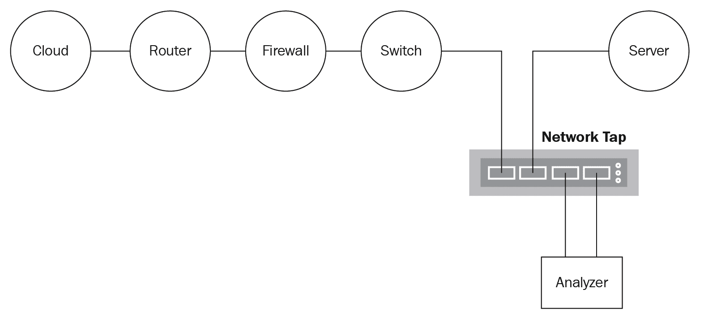

对于 WLAN 或 Wi-Fi，捕获可以通过将外部无线接收器设置为混杂模式来完成，并记录特定无线接入点在特定频道上的所有流量。以下图示展示了这一技术：

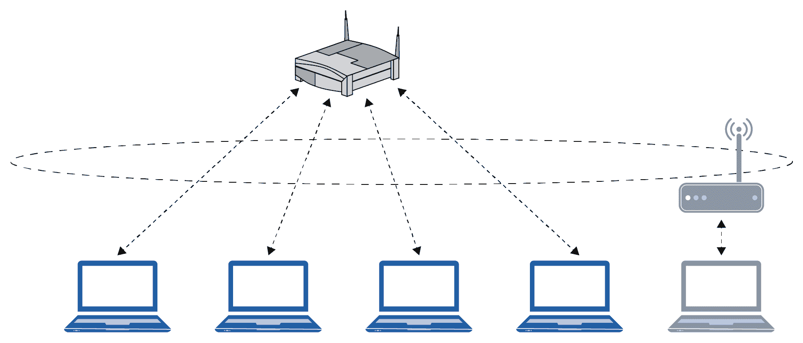

# 网络交换机上的 CAM 表

网络交换机包含内容寻址存储器表，用于存储系统的 MAC 地址与物理端口之间的映射。在大型设置中，这个表非常有用，因为它可以根据物理端口的映射将网络上的 MAC 地址定位到墙面插座的系统。交换机还提供网络镜像功能，允许调查人员查看来自其他 VLAN 和系统的所有数据。

# 路由器上的路由表

路由器中的路由表将路由器的端口映射到它们连接的网络。以下是一个路由表，这些表格可以帮助我们调查网络流量在不同设备间传输时的路径：

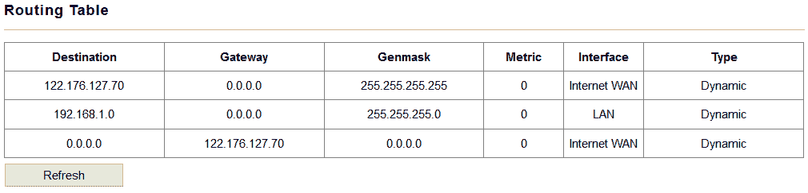

大多数路由器都内置有数据包过滤和防火墙功能。这意味着它们可以配置为记录被拒绝或特定类型的网络流量。

# 动态主机配置协议日志

**动态主机配置协议**（**DHCP**）服务器通常会记录特定 IP 地址分配给特定 MAC 地址时的条目、网络上租约续期的时间戳等，这些信息在网络取证中具有重要价值。以下是路由器的 DHCP 表格截图，列出了动态分配的主机：

# DNS 服务器日志

域名服务器查询日志可以帮助理解特定时间点的 IP 到主机名解析。假设在网络中的系统一旦感染了恶意软件，它便尝试连接到某个域名进行命令与控制。我们来看下面的一个示例：

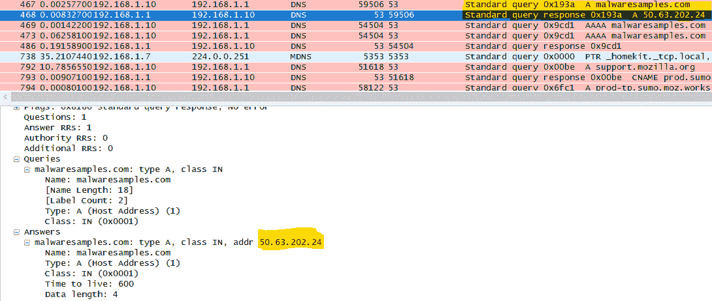

从前面的截图中我们可以看到，`malwaresamples.com`网站的 DNS 请求已经被解析，且返回了解析后的 IP 地址。

获取 DNS 查询包可以揭示网络上特定恶意软件的**攻击迹象**，同时迅速显示发起查询的系统的 IP 地址，从而可以轻松处理。

# 域控制器/认证服务器/系统日志

认证服务器允许调查人员查看登录尝试、登录时间以及网络中各种与登录相关的活动。假设一组攻击者试图利用受感染的主机通过该受感染机器作为跳板（Pivoting）登录到数据库服务器。在这种情况下，认证日志将迅速揭示出不仅仅是受感染的系统，还能显示该系统尝试连接数据库服务器的失败/成功次数。

# 入侵检测/防御系统日志

从取证角度来看，入侵检测/防御系统日志是最有用的。IDS/IDPS 日志不仅提供 IP 地址，还包括匹配的签名、正在进行的攻击、恶意软件存在情况、命令和控制服务器、源系统和目标系统的 IP 及端口、时间线等更多信息。本书后半部分将详细介绍 IDS/IPS 场景。

# 防火墙日志

防火墙日志提供了网络活动的详细视图。防火墙解决方案不仅可以保护服务器或网络免受不必要的连接，还可以帮助识别流量类型，提供出站端点的信任评分，阻止不需要的端口和连接尝试等等。在接下来的章节中，我们将更详细地讨论防火墙。

# 代理服务器日志

网络代理也是取证调查员最有用的功能之一。Web 代理日志有助于揭示内部威胁，同时提供有关事件的详细信息，例如上网习惯、基于 Web 的恶意软件来源、用户在网络上的行为等。

既然我们已经对可以考虑进行分析的各种日志类型有所了解，那么让我们快速熟悉一下 Wireshark 的基础知识。

# Wireshark 基础

对 Wireshark 基础有所了解的读者可以跳过这一部分，直接进入案例研究；然而，对于那些不熟悉基础知识或需要复习 Wireshark 基础的读者，可以继续阅读这一部分。让我们来看看 Wireshark 一些最基本的功能。请看以下截图：

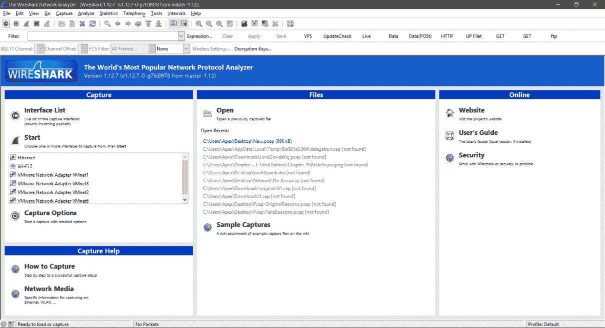

Wireshark

一旦我们执行 Wireshark，屏幕上会呈现出类似于前面图片的界面。在左侧，我们可以看到可用的接口列表，用于捕获数据包。中间是最近的数据包捕获文件，右侧则是在线帮助和用户指南。要开始新的数据包捕获，你可以选择一个接口，例如，如果你是通过有线连接，则选择以太网接口；如果你是通过无线网络连接，则选择 Wi-Fi 接口。同样，如果需要打开一个数据包捕获文件，可以点击“打开”按钮，浏览到捕获文件，并将其加载到 Wireshark 工具中。让我们通过选择 Wi-Fi 接口并按下开始按钮来捕获无线接口的数据包，如下图所示：

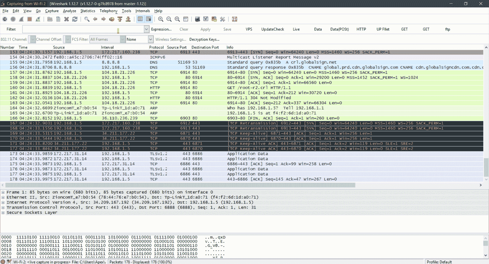

从前面的截图中我们可以看到，网络中有各种类型的数据包在流动。接下来，我们将了解 TCP 会话、端点以及 Wireshark 的基本过滤器。

# 识别会话和端点

你可能想查看你的系统正在与哪些 IP 端点进行通信。为此，你可以导航到“统计”标签，并选择“会话”，如以下截图所示：

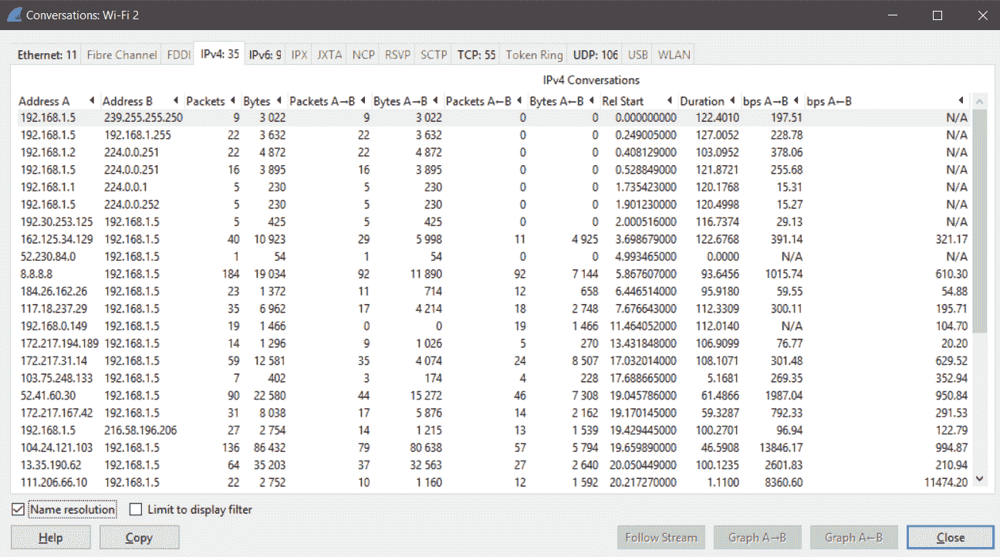

我们可以看到有多个端点正在进行通信，端点之间传输的字节数以及它们数据交换的持续时间。当你想要调查恶意流量并识别被联系的关键端点时，这些选项非常有用。此外，我们还可以看到，在前面的截图中，大部分通信都涉及到`192.168.1.15`，但我们可能无法识别它所通信的 IP 地址。

我们还可以使用统计标签中的端点选项，正如以下截图所示：

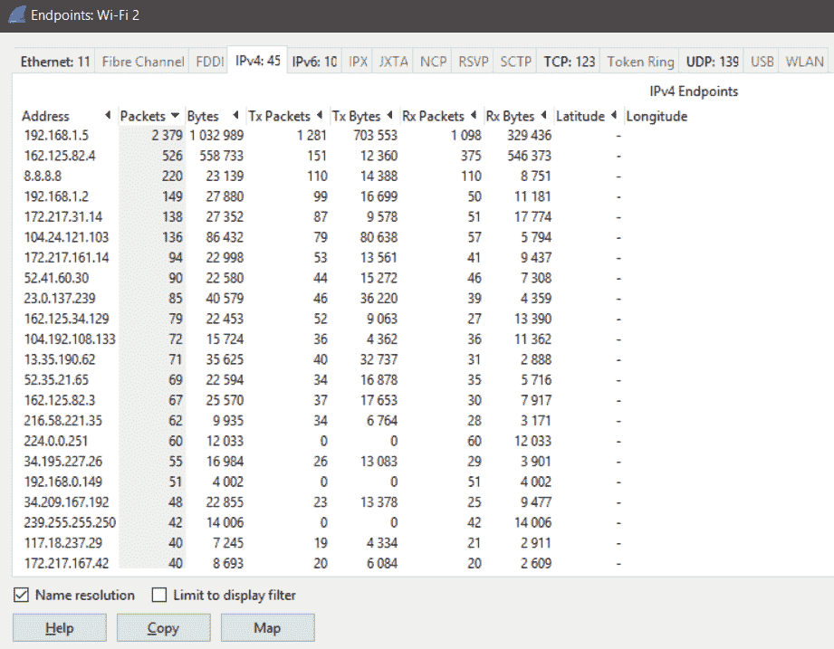

从前面的截图中，我们可以看到所有端点，使用数据包数量对它们进行排序将帮助我们清晰地了解哪些端点传输的数据包最多，在分析异常网络行为时，这一点非常有用。

# 识别 IP 端点

域名的发明是为了让人们更容易记住带有常见短语的网站。如果在前一节中列出了 IP 地址，我们可能根本无法理解，但如果列出了将 IP 地址解析为域名的列表，则会对我们大有帮助。点击“显示地址解析 / 解析后的地址”选项后，我们将看到以下内容：

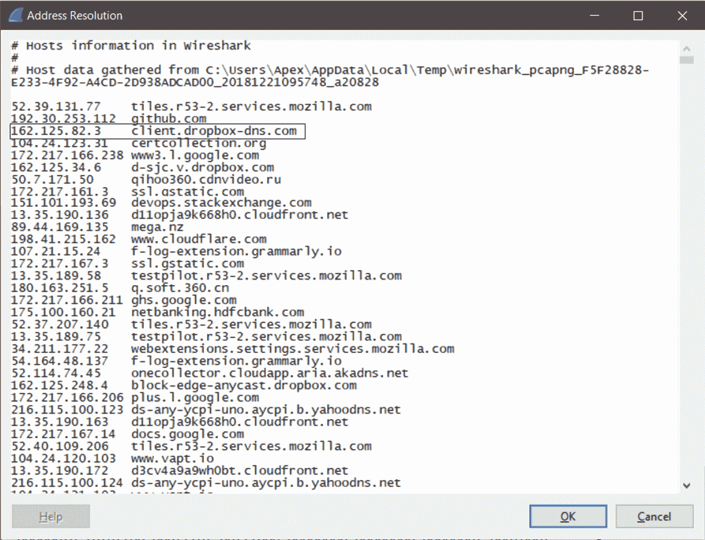

好的，现在一切都变得合情合理了，因为我们有一个列出了域名解析的 IP 地址列表，这将帮助我们排除误报。我们在前面的端点部分看到，数据包数量第二多的端点来自 `162.125.34.6`。由于我们不清楚这个 IP 地址代表什么，我们可以轻松地通过地址解析查找，发现它是 `dropbox-dns.com`，看起来很可疑。让我们通过在 Google 上搜索 `client.dropbox-dns.com` 来查找它，浏览搜索结果中的第一个链接，得到以下信息：

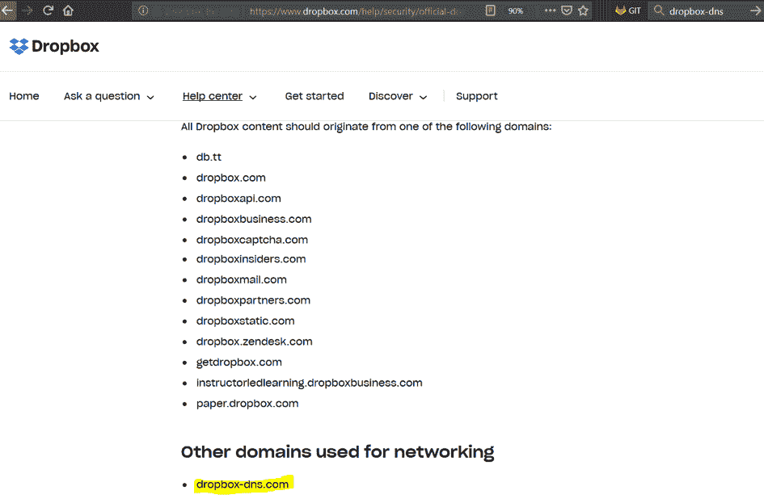

从前面的搜索结果（官方的 Dropbox 网站，[`www.dropbox.com/`](https://www.dropbox.com/)）中可以看出，该域名是一个合法的 Dropbox 域名，来自该域的流量是安全的（假设网络上允许使用 Dropbox，或仅限特定用户群体，且流量仅与这些用户相关）。这个解析不仅帮助我们识别域名，还能揭示运行在目标系统上的软件信息。我们已经确认 Dropbox 正在该系统上运行。在 Wireshark 的 **解析后的地址** 窗格中，我们还识别出了以下域名：

+   一个正在访问的 Gmail 账户

+   一个 Qihoo 360 杀毒软件

+   一个 HDFC 银行账户

+   Grammarly 插件

+   Firefox 浏览器

# 基本过滤器

网络取证要求你精确定位各种数据包，以便为调查建立清晰的视角。让我们通过以下步骤来探索如何实现这一点：

在 Wireshark 中设置一些基本的显示过滤器，以便仅查看感兴趣的包，如下图所示：

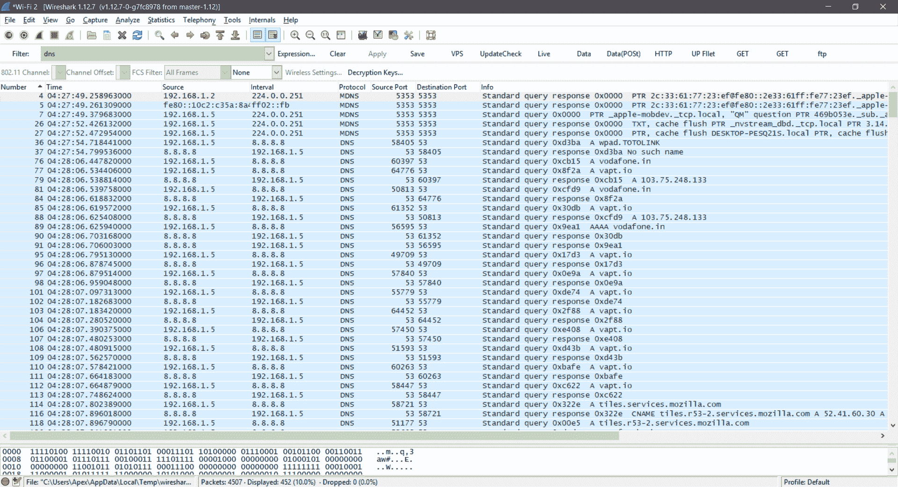

我们可以看到，直接输入 `dns` 作为过滤器将只显示 DNS 数据包；然而，我们也可以看到 MDNS 协议数据包同样被显示出来。

考虑到我们只需要 DNS 数据包，而不需要 MDNS 协议数据包，我们可以设置过滤器为 `dns && !mdns`，其中 `!` 表示 NOT 操作，如下图所示：

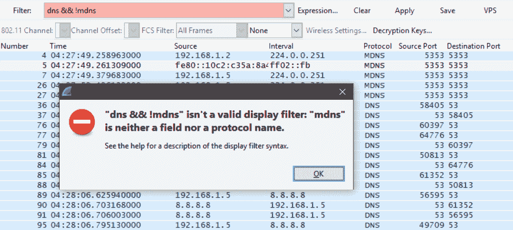

从这可以看出，我们没有针对 MDNS 的精确过滤器。那么，我们该如何过滤掉 MDNS 数据包呢？我们可以看到，MDNS 协议是通过端口 `5353` 进行通信的。让我们过滤掉该端口，而不是使用 `!mdns` 过滤器，如下图所示：

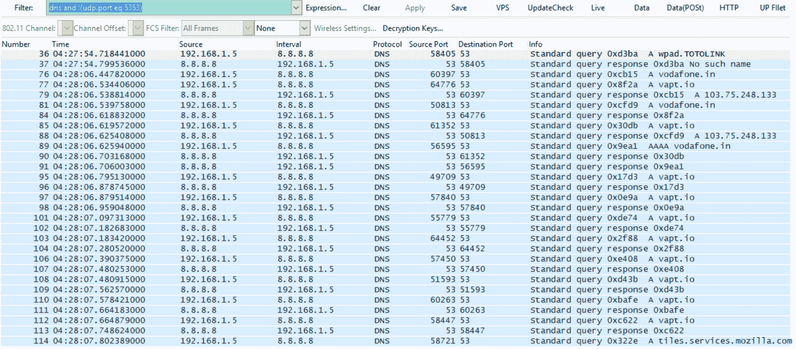

我们可以看到，提供过滤器 `dns and !(udp.port eq 5353)` 会仅显示 DNS 数据包。在这里，`eq` 表示等于，`!` 表示 NOT，`udp.port` 表示 UDP 端口。这意味着，通俗来说，我们要求 Wireshark 过滤 DNS 数据包，同时移除所有通过 UDP 端口 `5353` 通信的数据包。

在 Wireshark 的最新版本中，`mdns` 是一个有效的协议，显示过滤器如 `dns && !mdns` 可以正常工作。

类似地，对于 HTTP，我们可以输入 `http` 作为过滤器，如下图所示：

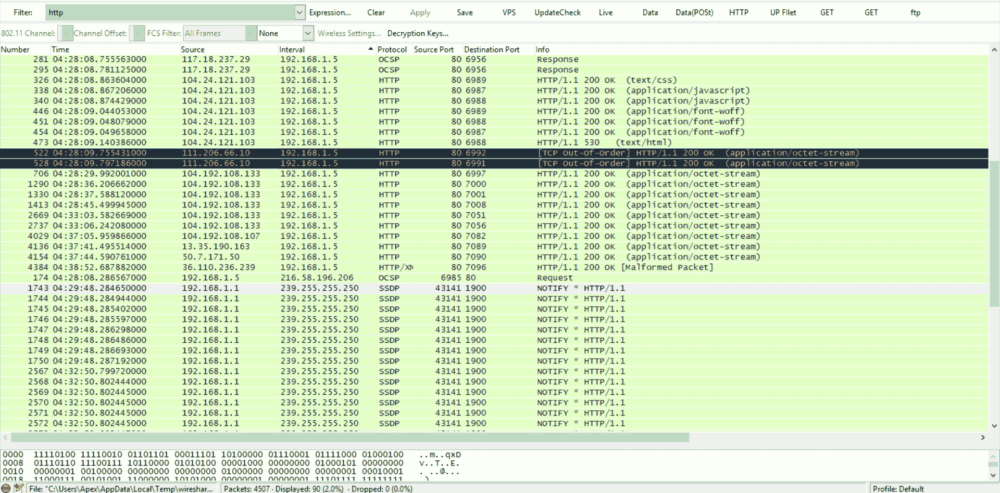

然而，我们也有 OCSP 和 **简单服务发现协议**（**SSDP**）协议数据与从流中过滤出来的数据一起显示。为了过滤掉 OCSP 和 SSDP 协议数据，我们可以输入 `http && !ocsp`，由于 SSDP 与 MDNS 协议类似，我们可以输入 `!udp.port==1900`。因此，整个过滤器变为 `http && !ocsp && !udp.port==1900`，如下图所示：

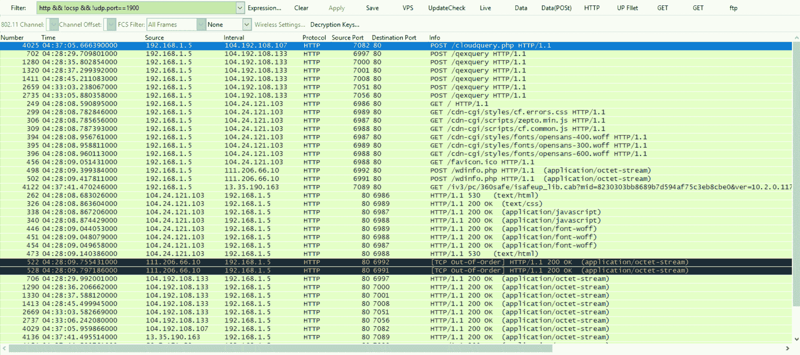

从中我们可以看到，我们已经成功过滤了 HTTP 数据包。但是我们能否在其中搜索并仅过滤 HTTP POST 数据包呢？当然可以，使用表达式 `http contains POST && !ocsp` 如下图所示。

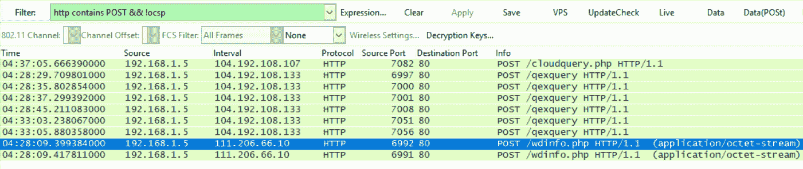

我们可以看到，提供 `HTTP contains POST` 过滤器可以过滤掉所有非 HTTP POST 请求。让我们通过右键点击并选择跟踪 HTTP 流的选项来分析该请求，如下图所示：

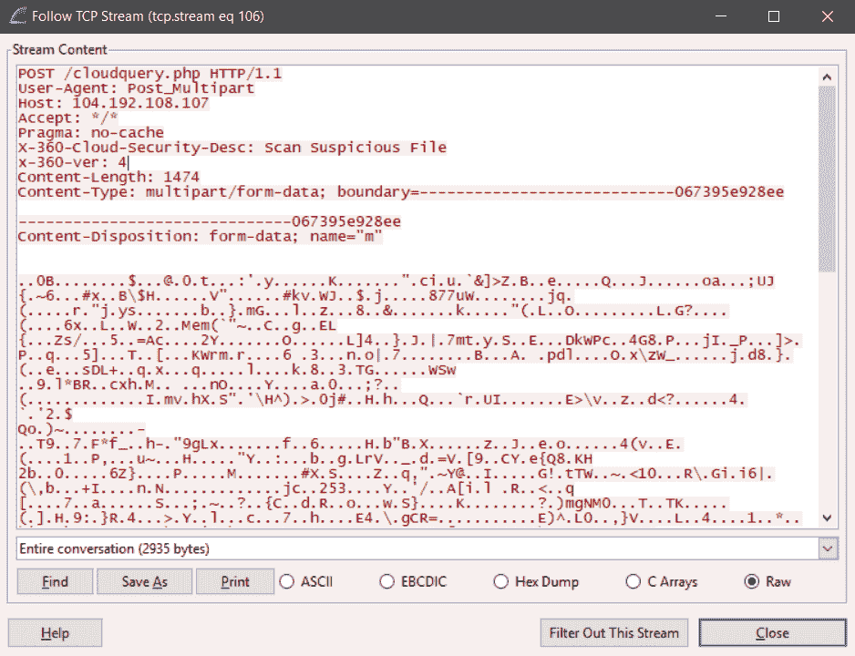

我们可以看到，这看起来像是一个已经发送出去的文件，但由于它有 `x-360-cloud-security-desc` 等标头，看来是云端防病毒在扫描网络中发现的可疑文件。

让我们记下该 IP 地址，并与地址解析结果进行匹配，如下图所示：

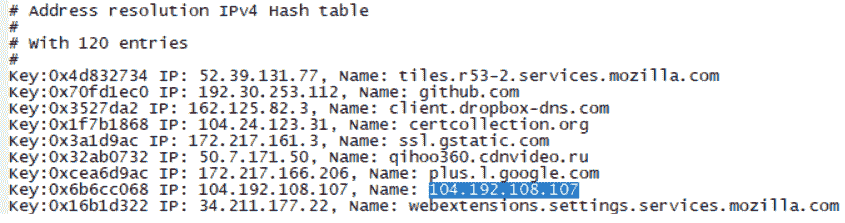

好吧，这次地址解析失败了。让我们在[`who.is/`](https://who.is/)上搜索该 IP，如下图所示：

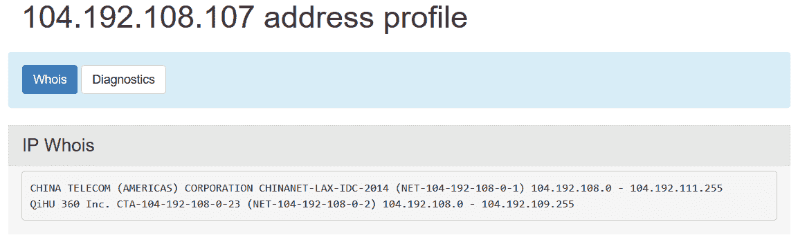

是的，它属于 360 安全卫士。

我们还可以根据响应代码选择 HTTP 数据包，如下图所示：

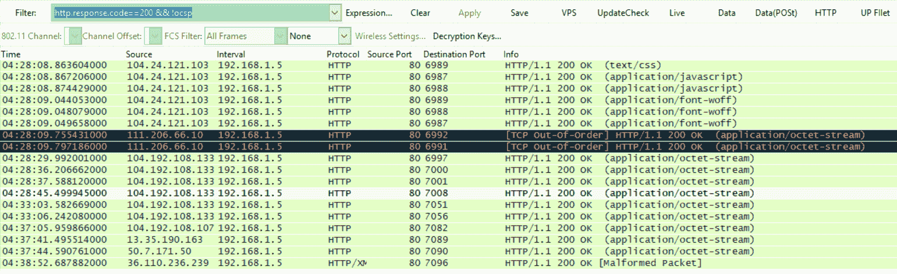

我们可以看到，我们已经使用`http.response.code==200`过滤了数据包，其中`200`表示状态正常响应。在调查来自受感染服务器的数据包捕获时，这非常有用，因为它为我们提供了已访问文件的清晰图像，并展示了服务器如何响应特定请求。

它还允许我们判断已实现的保护措施是否正常工作，因为在收到恶意请求时，大多数情况下，保护防火墙会返回 404（未找到）或 403（禁止）响应代码，而不是 200（正常）。

现在，让我们进入一些案例研究，并利用我们刚刚学到的基础知识。

# 练习 1 – 新手键盘记录器

假设攻击者在网络中的某个系统上安装了一个键盘记录器。作为调查员，你的任务是找到以下信息：

+   查找感染的系统

+   跟踪数据到服务器

+   查找正在发送的数据的频率

+   查找除了击键之外还携带的其他信息

+   尝试揭示攻击者

+   提取并重构发送给攻击者的文件

此外，在本练习中，你需要假设**数据包捕获**（**PCAP**）文件不可用，你还需要执行嗅探的部分。假设你连接到网络中的镜像端口，可以看到所有流入和流出网络的数据。

此网络捕获的捕获文件可以在[`github.com/nipunjaswal/networkforensics/blob/master/Ch1/Noobs%20KeyLogger/Noobs%20Keylogger.pcap`](https://github.com/nipunjaswal/networkforensics/blob/master/Ch1/Noobs%20KeyLogger/Noobs%20Keylogger.pcap)找到。

我们可以按照以下方式开始我们的过程。我们已经知道我们是通过镜像端口连接的。让我们在选择的接口上嗅探。如果连接到镜像端口，请选择默认接口并继续收集数据包，如下图所示：

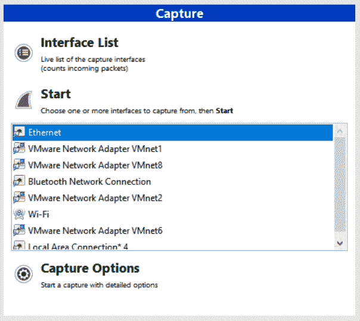

大多数键盘记录器通过 Web（HTTP）、FTP 和电子邮件将击键信息发送回攻击者。我们将尝试这些协议，检查这些协议的包是否有任何异常。

让我们首先尝试设置`http`过滤器，如下图所示：

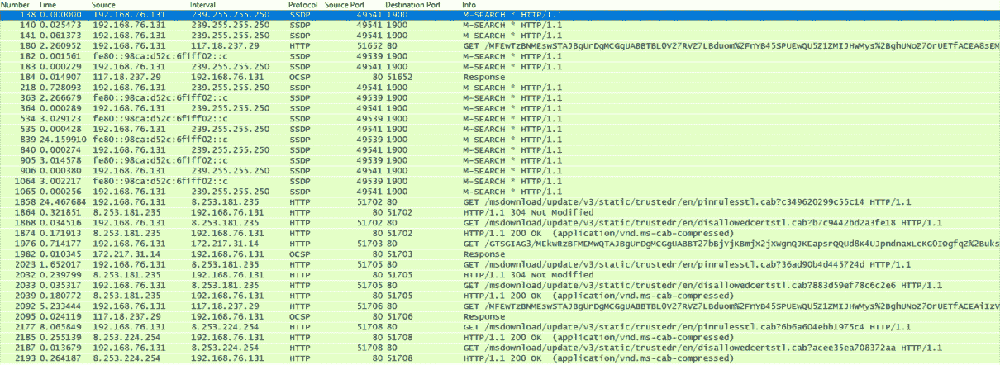

有 HTTP 数据，但一切似乎正常。

让我们尝试几种协议，SMTP 和 POP，以检查电子邮件协议是否有任何异常，如下图所示：

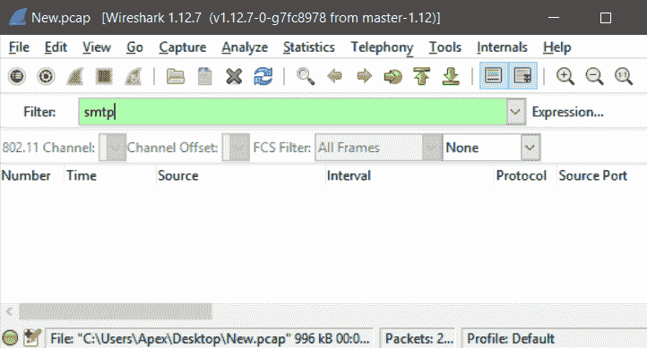

这里看起来也一切正常。

让我们尝试 FTP，如下图所示：

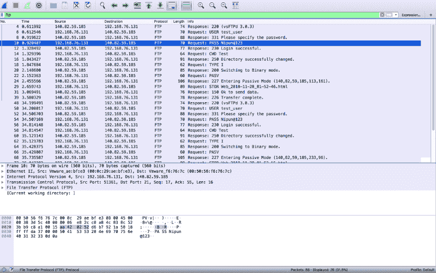

FTP

好的，FTP 上有很多活动！我们可以看到 FTP 数据包中包含了`USER`和`PASS`命令，这表示进行了服务器的登录活动。当然，这可能是键盘记录器的操作，也可能是网络上某个用户的合法登录。此外，我们还可以看到`STOR`命令，它用于将文件存储到 FTP 服务器上。不过，让我们记下凭证和上传文件的文件名以供参考，并进一步调查。因为我们知道`STOR`命令用于将数据存储到服务器上。

让我们通过将过滤器更改为`ftp-data`来查看这些数据包，如下图所示：

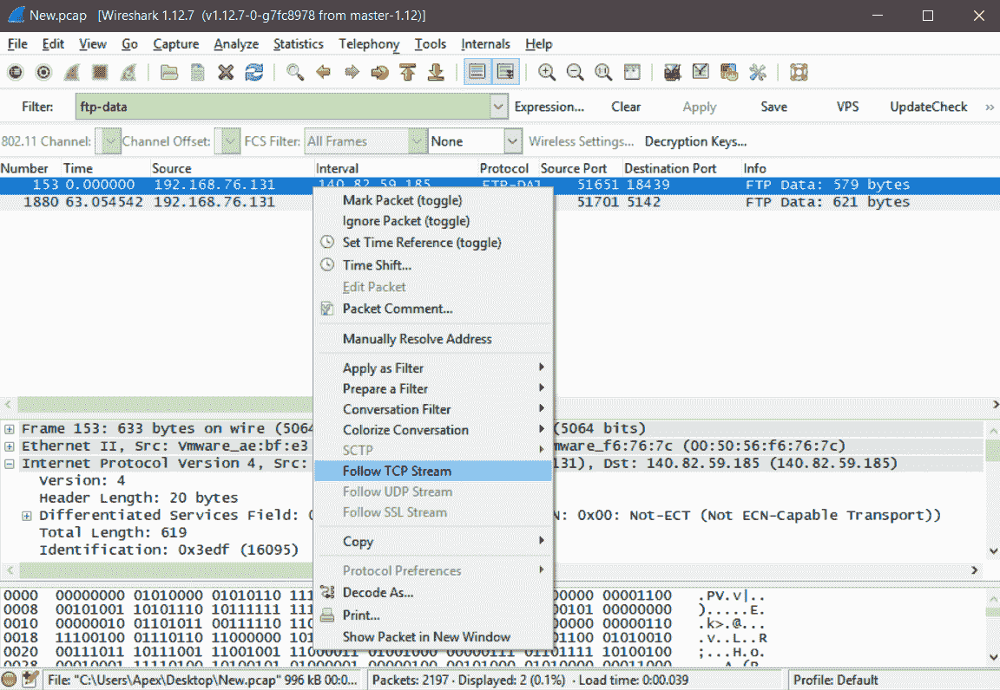

将过滤器更改为 ftp-data

`ftp-data`将主要包含传输的文件和数据，而不是所有其他 FTP 命令。

让我们查看当我们跟踪数据包的 TCP 流时，我们可以看到发送到服务器的数据如下：

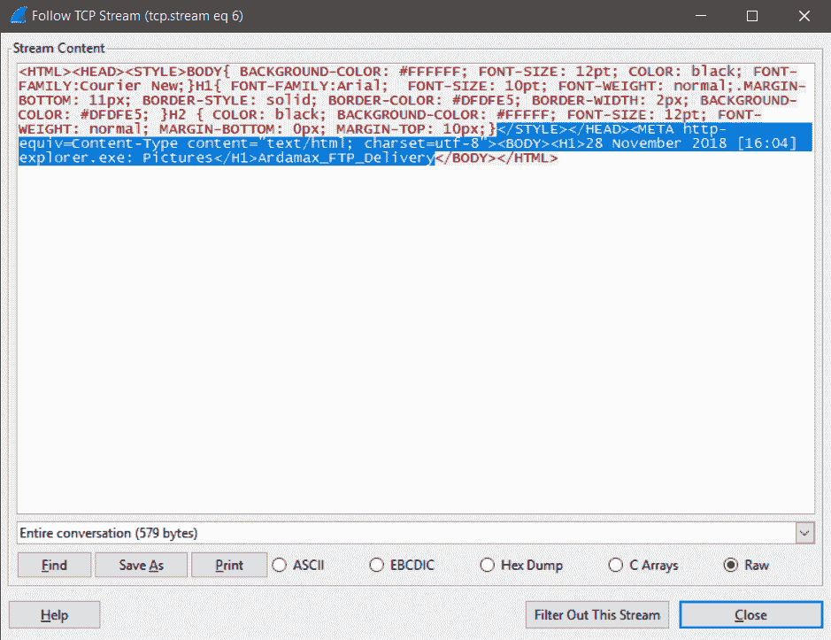

我们可以看到传输的数据中包含了`Ardamax`这个词，它是一个常见的键盘记录软件的名称，用于记录系统中的按键并将其发送回攻击者。现在，我们可以通过选择**文件** | **另存为**并选择`.pcap`格式来保存数据包捕获。我们只会使用`.pcap`格式，因为 NetworkMiner 的免费版本只支持 PCAP 文件，不支持`pcapng`格式。

让我们使用 NetworkMiner 打开保存的文件，如下图所示：

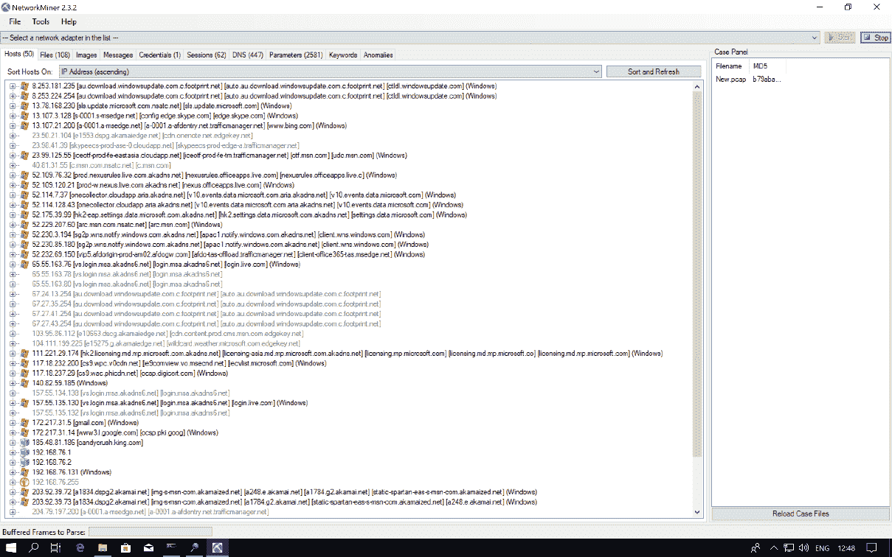

使用 NetworkMiner 打开保存的文件

我们可以看到网络捕获中有多个主机。

让我们切换到“凭证”标签，如下图所示：

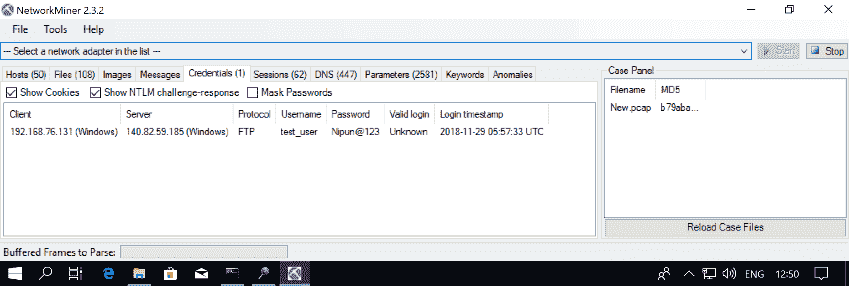

我们可以看到，在 NetworkMiner 的**凭证**标签下，我们已经捕获到的用户名和密码显示在 PCAP 文件中。我们之前看到的`STOR`命令，通常用于从 Wireshark 转储上传文件到 FTP。

让我们浏览到“文件”标签，查看我们感兴趣的文件：

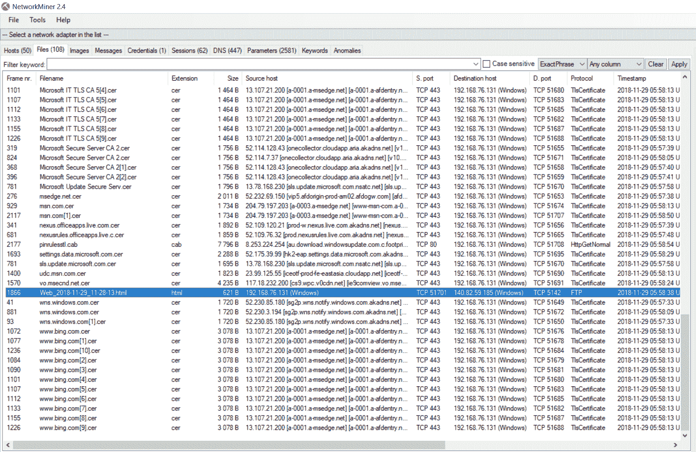

文件标签

我们可以看到很多文件。让我们打开通过`STOR`命令在浏览器中找到的文件，如下图所示：

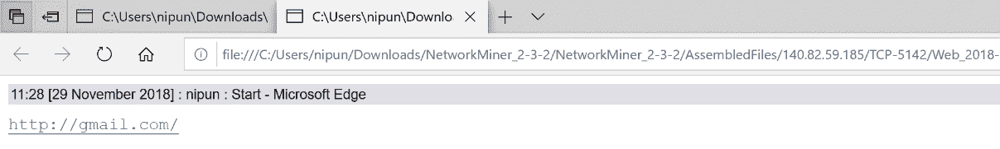

攻击者不仅在进行键盘记录，还在获取诸如活动窗口标题等细节信息以及键盘记录。因此，总结一下，我们可以回答在练习开始时提出的问题：

+   **找到受感染的系统**：`192.168.76.131`

+   **追踪数据到服务器**：`140.82.59.185`

+   **查找发送数据的频率**：对于类似文件类型的两个连续 `STOR` 命令之间的时间差为 15 秒

+   **查找键击之外携带的其他信息**：活动窗口标题

+   **尝试揭示攻击者**：尚未找到

+   **提取并重建发送给攻击者的文件**：`Keys_2018-11-28_16-04-42.html`

我们掌握了关于黑客的大量信息。此时，我们可以将我们分析中找到的细节提供到报告中，或者我们可以更进一步，尝试揭示攻击者的身份。如果您选择这样做，那么让我们开始查找如何揭示此信息。

登录到您未授权访问的计算机可能会导致刑事处罚（罚款、监禁或两者兼施）。

我们已经在服务器中找到了他们的凭证。让我们尝试登录 FTP 服务器，看看能否找到感兴趣的内容，如下图所示：

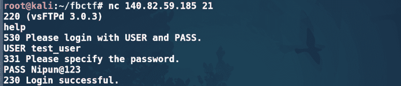

我们可以看到，我们轻松地能够登录到服务器。让我们使用 FTP 客户端，比如 Mac 上的 Royal TSX（Windows 上的 FileZilla），查看服务器上的文件，如下图所示：

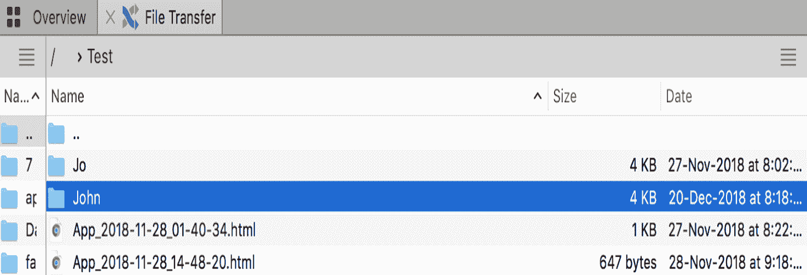

哇！记录了这么多信息；然而，我们可以看到有两个名为 `John` 和 `Jo` 的目录。目录 `Jo` 是空的，但我们可能会在名为 `John` 的目录中找到一些东西。

让我们查看 `John` 目录的内容，如下图所示：

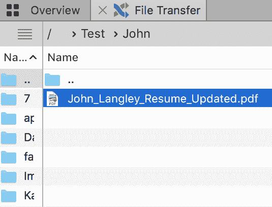

看起来攻击者正在申请工作，并将其更新的简历保存在他们的服务器上。案例研究分析证明该键盘记录器是个新手。在回答有关攻击者身份的最后一个问题时，我们已经成功完成了第一次网络取证分析练习。我们找到的简历可能也被盗自其他人。然而，这只是冰山一角。在接下来的章节中，我们将会看到各种复杂的场景；这只是一个简单的例子。

在下一个示例中，我们将查看 TCP 包并尝试弄清楚是什么事件导致了这样的网络流量。

# 练习 2 – 太多了

让我们分析另一个来自[`github.com/nipunjaswal/networkforensics/blob/master/Ch1/Two%20to%20Many/twotomany.pcap`](https://github.com/nipunjaswal/networkforensics/blob/master/Ch1/Two%20to%20Many/twotomany.pcap)的捕获文件，目前我们对其细节一无所知，并尝试重建事件链。

我们将在 Wireshark 中打开 PCAP 文件，如下所示：

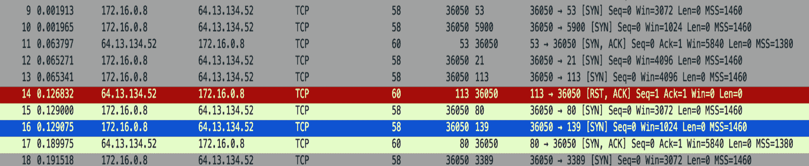

从前面的截图中，我们可以看到大量 SYN 包被发送到`64.13.134.52`的 IP 地址。然而，仔细观察，我们可以看到大多数包是周期性地从单个端口（`36050`和`36051`）发送到几乎每个端口的`64.13.134.52`。没错，你猜对了：这看起来像是一个端口扫描。最初，SYN 包被发送出去，收到 SYN/ACK 后，端口被认为是开放的。

我们知道，源 IP 地址`172.16.0.8`是一个内部地址，而被访问的服务器是`64.13.134.52`。你能猜出以下内容吗？：

+   扫描类型

+   打开的端口

回答第一个问题需要对基于 TCP 的通信及其建立有更深入的了解，TCP 通过三次握手来工作，这意味着当接收到来自源 IP 地址的**同步**（**SYN**）包时，目标 IP 地址会发送一个**同步/确认**（**SYN/ACK**）包，接着源 IP 地址会发送一个最终的**确认**（**ACK**）包来完成三次握手。然而，正如我们从前面的截图中看到的那样，仅仅从端口`80`返回了一个 SYN/ACK 包，并且源 IP 地址并没有发送 ACK 包。

这一现象意味着源 IP 地址从未向目标发送 ACK 包，这意味着三次握手的前两步已经完成。这个两步的半开机制导致目标消耗资源，因为端口会在一段时间内保持开放。与此同时，这是通过一种叫做**SYN 扫描**或**半开扫描**的扫描类型广泛使用的技术，有时也叫做**隐形扫描**。像 Nmap 这样的工具利用这种技术来减少网络上数据包的数量。因此，我们可以得出结论，我们正在处理的扫描类型是 SYN 扫描。

Nmap 在半开扫描中定期使用 RST 包，以防止目标的资源被耗尽。

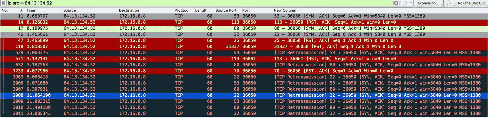

应用过滤器`ip.src==64.13.134.5`后，我们可以看到来自`64.13.134.52`的响应。显然，我们收到了来自端口`53`、`80`和`22`的 SYN/ACK 包，这些都是开放端口。我们还可以看到发生了网络丢包，发送方重新发送了数据包。此外，我们可以看到**重置确认包**（**RST**），这表示配置错误或应用程序不愿意连接：这种行为的原因可能不同。

# 总结

在本章中，我们了解了网络取证的基础知识。我们使用 Wireshark 分析了一个键盘记录器和来自端口扫描的包。我们发现了各种类型的网络证据源，并且学习了在进行网络取证时应该遵循的基本方法论。

在下一章中，我们将学习协议的基础知识，以及用于获取证据的其他技术概念和策略，并且我们将进行相关的动手练习。

上述捕获文件的所有归功于 Chris Sanders 的 GitHub 仓库，网址为 [`github.com/chrissanders/packets`](https://github.com/chrissanders/packets)。

# 问题与练习

为了提升你在网络取证技能上的信心，试着回答以下问题：

1.  `ftp` 和 `ftp-data` 在 Wireshark 中的显示过滤器有什么区别？

1.  你能为包含特定关键字的网页构建一个 `http` 过滤器吗？

1.  我们使用 NetworkMiner 从 PCAP 文件中保存了数据。你能用 Wireshark 完成这个操作吗？（是/否）

1.  尝试用 Tshark 重复这些练习。

# 深入阅读

有关 Wireshark 的更多信息，请参阅 [`www.packtpub.com/networking-and-servers/mastering-wireshark`](https://www.packtpub.com/networking-and-servers/mastering-wireshark)
