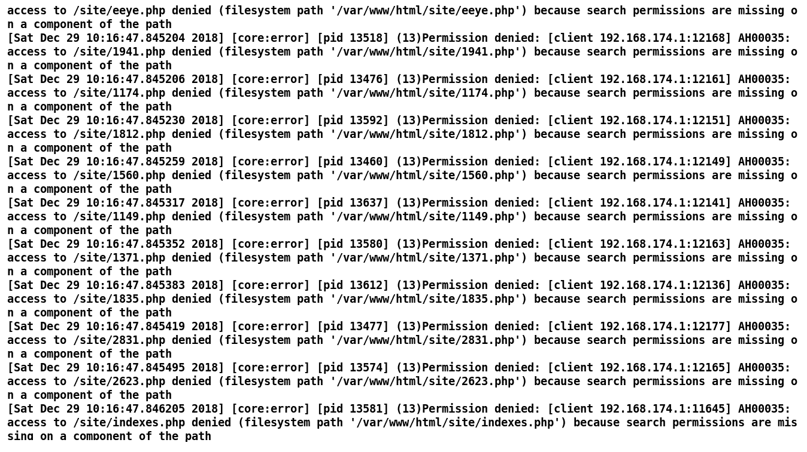
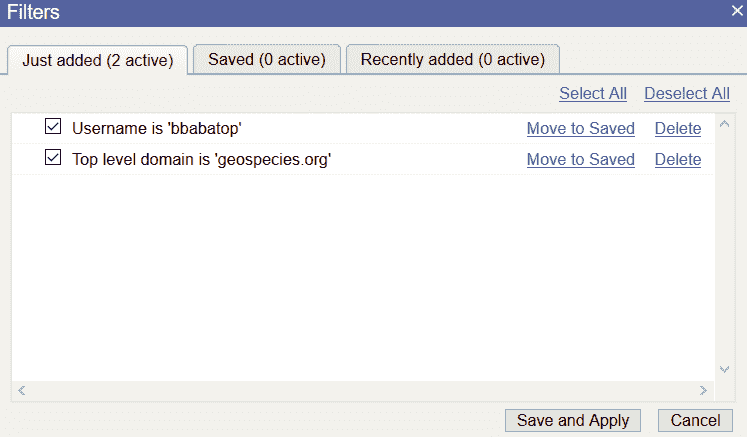

# 第二章：技术概念与证据获取

在上一章，我们学习了各种类型的证据来源。在本章中，我们将详细了解这些来源。我们将熟悉不同类型日志格式的基础知识，并了解进行网络取证所需的各种技术关键概念。

本章将涵盖以下主题：

+   网络互联基础知识

+   接触各种类型的日志

+   日志和数据包结构的案例分析

那么，让我们从网络互联的基础开始，了解如何根据 OSI 网络模型进行通信。

# 技术要求

为了完成本章所示的练习，您将需要以下软件：

+   在 Windows 10 上安装的 Apache Log Viewer ([`www.apacheviewer.com/`](https://www.apacheviewer.com/))

+   在 Windows 10 上安装的 Sawmill ([`www.sawmill.net/cgi-bin/download.pl`](http://www.sawmill.net/cgi-bin/download.pl))

+   在 VMware Workstation/Player 或 Virtual Box 上安装的 Kali Linux

+   Wireshark ([`www.wireshark.org/download.html?aktime=1551312054`](https://www.wireshark.org/download.html?aktime=1551312054))

+   从[`github.com/nipunjaswal/networkforensics/tree/master/Ch2`](https://github.com/nipunjaswal/networkforensics/tree/master/Ch2)下载本章的文件

# 网络互联基础知识

**开放系统互联（OSI）**模型是为基于网络的数字通信而构建的，并考虑到灵活性和模块化。OSI 模型是一个七层设计，从物理层开始，直到应用层结束。OSI 层的高级图示如下：


七层模型负责各种不同的通信标准，如下所示：

+   在物理层，我们通常讨论的是电缆、集线器、光纤、同轴电缆和连接器，这些是数据的实际物理载体，数据以比特的形式表示。

+   在数据链路层，我们有**802.11**、**WI-MAX**、**ATM**、**以太网**、**令牌环**、**PPTP**、**L2TP**等，它们可以在节点之间建立和终止连接。数据以帧的形式表示。

+   在网络层，我们有**IPv4**、**IPv6**、**OSPF**、**ICMP**和**IGMP**协议集，它们管理逻辑和物理地址映射、路由和帧分片。数据以包的形式表示。

+   在传输层，我们有**TCP**和**UDP**，它们允许消息分段、消息确认、主机到主机的通信和消息流量控制。数据以段的形式表示。

+   在会话层，我们有**SAP**、**PPTP**、**RTP**和**SOCKS**。它负责会话的建立、维护和终止。

+   表示层包括**SSL/TLS**、**WEP**、**WPA**、**Kerberos**、**MIME**等实现，通常负责字符编码转换、数据会话、压缩和加密。

+   在应用层，我们有**DHCP**、**FTP**、**HTTP**、**IMAP**、**POP3**、**NTP**、**SSH**和**TELNET**等终端用户程序。

OSI 模型和 TCP/IP 模型可以如下图所示整体查看：


OSI 模型和 TCP/IP 模型的映射并不完美。例如，SSL/TLS 包含了表示层和会话层的元素。从启动任何与外界通信的应用程序开始，所有数据都经过前面讨论的各层。考虑一个场景，你想浏览某个特定网站。

1.  在这种情况下，当你在浏览器中输入一个网站地址时，这是一个第七层的应用程序，域名会解析成 IP 地址。

1.  一旦你获得了目标的 IP 地址，数据就被封装在 TCP/UDP 数据结构中，包含 TCP/UDP 头信息，然后传递给传输层，在这里操作系统将源和目标端口的数据嵌入到数据包结构中。

1.  接下来，结构被传递到网络层，源 IP 地址和目标 IP 地址被嵌入到结构中，并封装在 IP 数据包内。

1.  整个数据包在第二层被转换成以太网帧，然后最终以比特流的形式通过线缆传输。

1.  在接收端，首先将比特流转换成以太网帧，去除第二层信息后，发送到网络层。

1.  在网络层，检查数据包是否是系统所需的，如果是，系统会去除第三层信息，即 IP 包头，并将其推送到第四层，操作系统识别目标端口号并将其交付给相应端口。

1.  从这里，操作系统识别端口，去除 TCP 头信息，检查哪个程序在该端口上监听，并将有效负载传递给应用程序。

然而，当信息从一个点传输到另一个点时，它会在途中各个设备上留下**痕迹**（日志）。这些设备可能是防火墙、代理服务器、路由器、交换机或应用服务器，由于我们在上一章中已讨论了一些基于数据包的网络取证，接下来我们来看看基于日志的证据场景。

有关 OSI 模型的更多信息，请参阅 [`www.webopedia.com/quick_ref/OSI_Layers.asp`](https://www.webopedia.com/quick_ref/OSI_Layers.asp)。

# 基于日志的证据

在上一章中，我们研究了定义动态证据或捕获的数据的各种网络协议捕获。然而，对于网络取证调查员来说，了解在数据传输过程中各端点生成的不同类型日志非常重要。当场景中没有网络捕获数据时，这些日志显得尤为重要，调查员需要依靠这些日志来推理、得出结论并完成取证调查。假设一家名为 Acme Inc.的公司遭遇了通过其网站的大规模客户数据泄露，而公司并没有保存任何有关进入数据的包捕获文件。在这种情况下，取证调查完全依赖于在各端点生成的日志，如应用服务器、数据库和防火墙，正如下图所示：


在前述场景中，我们看到攻击者攻击了一个外部托管的应用服务器，该服务器与一个内部网络进行连接，以访问数据库，该数据库对外部世界的连接有限，除了应用服务器之外。

在这种情况下，以下一组问题需要回答：

+   攻击者是如何渗透到应用服务器的？

+   为什么防火墙允许外部攻击者访问？

+   攻击者在数据库上执行了哪些查询？

+   攻击者是否修改了数据库？

+   我们能否识别出攻击的来源？

为了回答前述问题，我们需要访问外部应用服务器的日志，由于防火墙允许攻击者访问，我们还需要访问防火墙日志。攻击者在数据库上执行了查询，因此我们还需要访问数据库日志。

# 应用服务器日志

正如我们在前面的场景中所见，攻击的第一点是外部托管的应用服务器。我们来看一下常见的应用服务器（如**Apache**和**NGINX**）生成的日志，并分析我们从这些日志中可以得出的结论：


在前面的截图中，我们可以看到 Apache 访问日志文件，通常存储在`/var/log/apache2/access.log`路径下。我们可以看到应用程序的各种请求。日志记录的格式是特定的，包括 IP 地址、日期和时间、请求类型、请求的资源文件、HTTP 版本、响应代码、响应长度和用户代理。由于前一个请求的用户代理是`DirBuster`，这表明攻击者正在使用`DirBuster`扫描目录，以寻找有趣的路径并发现 Web 应用程序中的隐藏目录。类似的日志也可以在`error.log`文件中找到：



然而，这个日志文件包含请求生成的错误条目。正如我们所见，错误大多是权限拒绝错误，这将导致 403 响应状态，这意味着请求的资源被禁止。从原始日志文件中查看对我们意义不大，即使文件只有 10MB，调查日志也会很麻烦。因此，为了进一步调查并深入得出结论，我们将使用自动化工具，如 Apache Logs Viewer ([`www.apacheviewer.com/features/`](https://www.apacheviewer.com/features/))：


我们通过将访问/错误日志文件添加到软件中来分析日志：


我们可以看到，一旦打开日志文件，软件会要求我们定义任何额外的选项，例如 LogFormat 和日期范围。在此分析中选择 Common（默认），然后点击 OK 继续：


我们可以看到，我们已经轻松解析了日志文件，并且现在可以对其应用各种过滤器，比如仅列出来自特定 IP 的数据包或具有特定响应代码的响应状态。在接下来的章节和练习中，我们将更多地使用 Apache Logs Viewer。

如果您拥有正版日志查看器的许可证，还可以使用凭证远程添加文件，日志查看器可以从 Apache Logs Viewer 网站购买，网址是 [`www.apacheviewer.com/unlock/`](https://www.apacheviewer.com/unlock/)。

# 数据库日志

我们刚刚看到如何处理基本的应用程序服务器日志。现在，让我们看看如何获取数据库日志并在我们的取证调查中充分利用它们。像 MySQL 和 MS SQL 这样的数据库服务器包含包含有助于取证调查人员更好理解事件链的日志文件。MySQL 中的通用查询日志提供了攻击期间执行的所有查询：


我们可以看到，通用查询日志文件允许我们查看攻击者登录 MySQL 服务器时的失败尝试。然而，它也表明有两次成功的登录尝试。我们需要进一步调查：


我们可以看到，在失败的尝试之后，攻击者登录并在数据库上运行了前面的查询。查询日志文件方便我们 pinpoint 攻击者的实际意图。在接下来的章节中，我们将通过大量案例研究来探讨各种数据库。

在 XAMPP 上，可以通过运行以下查询启用通用查询日志：

```
SET global general_log = 1;
```

这是记录 MySQL 中所有查询的更好方法：

```
SET global general_log_file='/tmp/mysql.log'; 
SET global log_output = 'file';
SET global general_log = on; 
```

# 防火墙日志

在网络基础设施中，你可能会遇到各种防火墙。防火墙日志可以揭示很多关于攻击的信息。我记得曾处理过一起案件，非洲一家知名银行遭窃取 70 万美元，攻击者在执行攻击之前已经潜伏在网络内部很长时间。经过彻底调查，找到泄露的指标和根本原因分析后，防火墙日志帮了大忙。我发现 checkpoint 防火墙日志中有记录显示特定域名被后门连接。我们在防火墙日志上进行了全网搜索，找到了第一次访问该域名的尝试，发现恶意攻击者的站点首次尝试连接至少是在事件发生前三个月。然而，由于发起连接的计算机仅连接到内部网络，我们得出结论：这次攻击是由内部人员实施的，这大大缩小了调查范围，仅剩下少数几个人。

解析防火墙日志并进行分析对调查员来说是一项艰巨的任务。如今，大多数智能防火墙都有自己的分析引擎。不过，如果你需要一个第三方的防火墙日志解析工具，**Sawmill** ([`www.sawmill.net`](http://www.sawmill.net)) 是我的首选，因为它支持多种日志格式。以下是 Sawmill 解析的 Palo Alto 网络防火墙日志示例：


我们可以看到，在解析的日志中有多种选择：


我们有多个选项，包括用户摘要、主机摘要、源 IP、用户和内容。我们还可以查看访问的页面：


Sawmill 是一款付费产品。不过，您可以下载并免费试用 30 天。在接下来的章节中，我们将查看如何创建解析器。然而，为了专业地进行网络取证操作，建议使用 Sawmill。

Sawmill 安装指南可以在 [`www.sawmill.net/cgi-bin/sawmill8/docs/sawmill.cgi?dp+docs.technical_manual.installation+webvars.username+samples+webvars.password+sawmill`](http://www.sawmill.net/cgi-bin/sawmill8/docs/sawmill.cgi?dp+docs.technical_manual.installation+webvars.username+samples+webvars.password+sawmill) 查找。

# 代理日志

网络中可能会有多种代理服务器。其中，**Squid 代理服务器**非常突出且被广泛使用。根据 Squid 网站的介绍，它是一种缓存代理，能够大幅减少带宽消耗和响应时间，适用于 HTTP、HTTPS 和 FTP 等服务。我们将再次使用 Sawmill 来调查代理日志：


1.  我们可以看到，我们有多种数据，展示了用户摘要、流量、页面浏览量、会话数以及其他各种有用数据，比如顶级域名：


1.  我们还可以查看最常浏览的 URLs：


1.  你可以通过点击日期选择器来按日期过滤日志，选择相对日期，并选择时间范围：


假设你想查看某个特定用户在特定 URL 上的日志。你可以通过启用以下突出显示的过滤器来利用缩放功能：


在上面的截图中，蓝色圆圈带黑色环的是缩放按钮，而前导蓝点通常表示已缩放的项目。在前面的屏幕中，我们可以看到两个蓝点：一个位于`bbabatop`用户处，另一个位于`geospecies.org`网站上。接下来，我们只需要按下“过滤”按钮：



我们可以看到，所选条目现在已作为过滤器添加，我们需要保存并应用该过滤器来筛选条目。例如，针对`babayomi`用户和`yahoo.com`的过滤器，并选择“小时”时，得到以下结果：


你还可以通过构建这样的过滤器来查看日期和时间、年份、月份和天数，这在调查过程中非常有用。假设有恶意应用试图从网站下载有效负载。在这种情况下，你可以轻松追踪到第一次下载尝试，从而找到**入侵指标**（**IOCs**）和第一个被攻击的系统：


1.  对`windowsupdate.com`的第一次尝试发生在 2006 年 9 月 8 日。点击“小时”，我们得到以下结果：


1.  点击用户名，我们将能够获取请求该网站的用户：


1.  我们可以看到，`nobody`和`femiadedeji`用户访问了目标域名。通过建立一个针对`femiadedeji`用户和该域名的过滤器，我们可以选择页面/目录，从而显示如下内容：


1.  我们现在可以确认`femiadedeji`用户访问了`windowsupdate.com`并下载了`.cab`和`.txt`类型的文件：


1.  当我们点击“使用详情”时，得到如下结果：


我们可以看到现在已经有很多与事件相关的详细信息。

# IDS 日志

让我们再次使用 Sawmill，这次解析 snort 日志：


1.  我们将选择创建新配置文件，这将导致如下结果：


1.  选择`Snort 日志`，然后点击下一步，这将显示我们的日志检测过程：


1.  在成功检测到日志类型后，我们将获得以下选项：


1.  选择 Sourcefire Snort 2 格式并点击下一步。在下一个屏幕上，我们将看到一条消息，说明日志是 Syslog 格式。现在选择配置文件的名称：


1.  点击完成按钮开始为日志创建数据库：


1.  选择“处理数据并查看报告”后，以下过程将启动：


一旦过程完成，我们将看到报告。由于我们已经深入研究了过滤器，我将其作为练习留给你自己完成。然而，在我们继续之前，让我们讨论一下单页总结：


一个展示大多数统计信息的单页总结。我们可以看到，Sawmill 已为我们生成了目标和源 IP 的过滤器，并生成了一个总结供我们查看。有趣的是，我们在总结中也看到了以下细节：


我们可以轻松筛选出一个`网络特洛伊`警报。现在让我们看一个案例研究，并运用从前面的日志分析练习中学到的知识。

# 案例研究 – 黑客攻击尝试

假设你面临一个简单的场景，需要找出对某个特定 Web 应用程序发起攻击的来源。你所知道的唯一网络信息是该应用程序内部托管，并未与外部世界连接。网络中有一个缓存代理服务器。作为法医调查员，你首先向客户请求应用服务器的日志，并开始在 Apache 日志查看器中进行调查：


Apache 日志查看器

我们迅速推断出有两个特别重要的 IP 地址，`192.168.174.157` 和 `192.168.174.150`，且由于用户代理包含`sqlmap`，这是一次 SQL 注入攻击尝试。我们还可以看到包含关键字，如 `WHERE` 和 `SELECT` 的请求，这通常是 SQL 注入攻击中对易受攻击参数的尝试。经过进一步调查并与客户沟通，我们发现`192.168.174.150`是一个缓存代理服务器。因此，我们向客户请求了代理服务器的日志，可以在 Sawmill 软件中进行调查：


攻击者利用代理服务器将所有流量转发到目标应用程序。通过代理日志，我们能够确定发起请求的原始 IP。将`192.168.174.142`作为过滤器，并浏览源地址，得到以下信息：


再次，我们得到了`192.168.174.157`的 IP 地址作为罪魁祸首。此时，我们已经确定攻击来源于这个内部 IP，因此让我们调查这个 IP 地址。检查服务器后，我们发现它上面运行着 Apache 服务器，并且托管着一个存在漏洞的应用程序——`php-utility-belt`。我们相当确定某人是通过这个漏洞获得了对该机器的访问权限。让我们手动检查 Apache 的日志：


我们可以看到，只有一个 IP 地址访问了该服务器上的 Apache 应用程序，即`192.168.174.152`。让我们打开 Wireshark，看看是否还有数据包在这个 IP 地址之间传输：


是的，`4433`和`4444`端口上有大量数据传输。这确认了`192.168.174.152`的用户就是罪魁祸首，因为该系统没有连接到互联网，只有内部访问。

在整个案例研究中，我们看到了日志在调查过程中是如何帮助发现入侵攻击的。进行根本原因分析可以给出以下结论：


攻击者攻击了运行在`192.168.174.157`系统上的 PHP 工具带应用程序，并成功访问了该机器。由于受损系统使用 Squid 代理作为全局代理，所有对`192.168.174.142`服务器的应用程序攻击都通过了`192.168.174.150`的代理服务器。在`192.168.174.142`的 Apache 日志中揭示了`192.168.174.150`，而在`192.168.174.150`的 Squid 日志中揭示了`192.168.174.157`。进一步调查`192.168.174.157`上的 Apache 日志，最终揭示了攻击者为`192.168.174.152`。

# 总结

我们在本章开始时回顾了 OSI 模型，既然在上一章我们已经涵盖了基础的网络取证场景，因此本章我们将重点转向基于日志的分析。我们探讨了各种日志结构，并了解了如何利用不同类型的软件分析器来解析这些日志。我们研究了应用服务器日志、数据库日志、防火墙日志、代理服务器日志以及 IDS 日志。我们还运用了本章学到的策略来解决案例研究。现在，我们已经掌握了网络取证的基础知识，很快就会深入学习更高级的概念。

# 问题和练习

为了提升你在基于日志证据的网络取证技能，尝试回答/解决以下练习和问题：

+   尝试通过下载本章 GitHub 页面上的网络证据，复制本章的所有练习。

+   尝试使用高亮工具从[`www.fireeye.com/services/freeware/highlighter.html`](https://www.fireeye.com/services/freeware/highlighter.html)提取相关信息。

+   尝试开发一个简单的 Shell 脚本，从 Apache 日志中提取所有唯一的 URL。

# 进一步阅读

查阅以下资源，了解本章节涉及的更多内容：

+   **创建解析器**：[`codehangar.io/smiple-log-and-file-processing-in-python/`](https://codehangar.io/smiple-log-and-file-processing-in-python/)

+   **日志分析**：参见《*网络安全 - 攻防策略*》一书中的*日志分析*章节 ([`www.amazon.in/Cybersecurity-Defense-Strategies-Infrastructure-security-ebook/dp/B0751FTY5B`](https://www.amazon.in/Cybersecurity-Defense-Strategies-Infrastructure-security-ebook/dp/B0751FTY5B))
