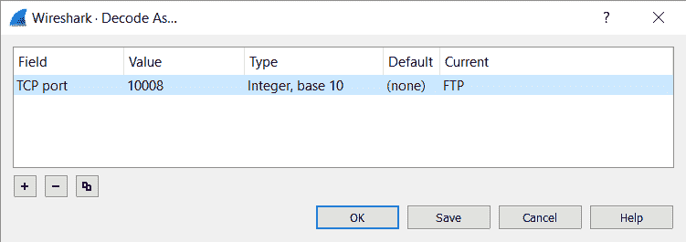
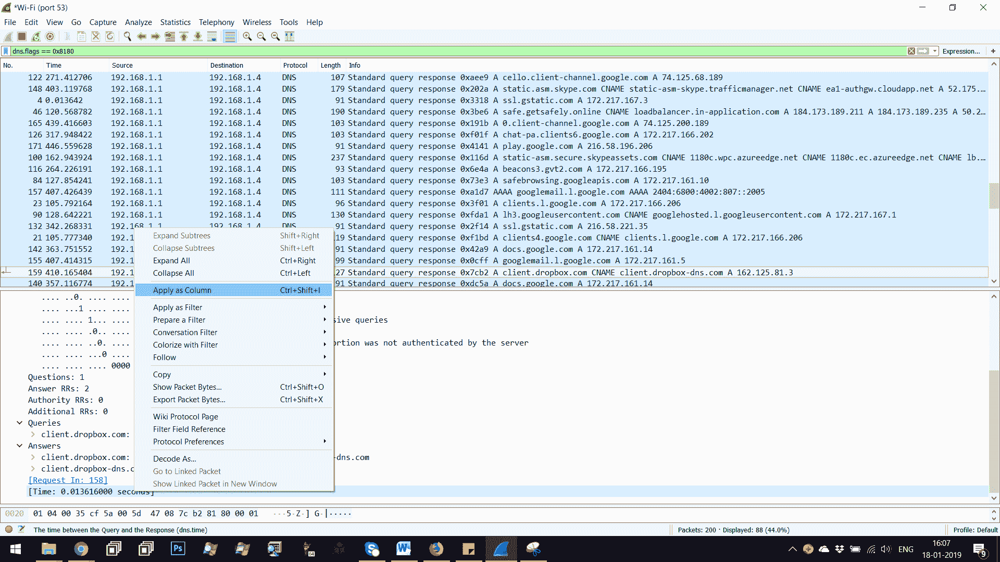

# 第三章：深度数据包检查

**深度数据包检查** (**DPI**) 在爱德华·斯诺登关于政府数据收集泄露事件发生后变得流行。它从一个普通的流行词变成了头条新闻。在本章中，我们将研究有助于 DPI 的各种协议和数据包特征。

我们将特别关注以下主题：

+   多种协议的分析

+   数据包封装和数据包分析

那么，为什么我们要学习 DPI 呢？DPI 是超越常规 TCP/IP 头部分析的过程，涉及分析数据载荷本身。

具有 DPI 功能的设备可以分析、评估并执行从第二层到应用层的操作。这意味着，具有 DPI 功能的设备不仅依赖于头部信息，还会检查作为数据部分发送的内容。因此，网络分析的整体传统正在发生变化。

DPI 被广泛应用于以下领域和服务：

+   **流量整形**：阻止恶意流量/限制流量。

+   **服务保障**：网络管理员可以确保高优先级的流量得到妥善处理，并且不会因流量问题导致服务中断。

+   **假应用程序的识别**：利用非标准端口来利用标准协议数据的应用程序，DPI 可以轻松识别。

+   **恶意软件检测**：由于 DPI 允许查看数据载荷本身，恶意软件检测变得更加容易。

+   **入侵检测**：不仅是恶意软件，启用了 DPI 的系统还可以发现黑客攻击尝试、漏洞利用、后门等。

+   **数据泄漏防护 (DLP)**：通过 DPI，我们还可以识别网络中外泄的关键数据，使其成为 DLP 系统的理想选择。

在深入之前，让我们理解不同通信层次上协议的封装过程。

# 技术要求

要完成本章中的练习，你将需要以下软件：

+   Wireshark v3.0.0 ([`www.wireshark.org/download.html`](https://www.wireshark.org/download.html)) 安装在 Windows 10 操作系统 / Ubuntu 14.04 上

+   Notepad++ 7.5.9 ([`notepad-plus-plus.org/download/v7.6.4.html`](https://notepad-plus-plus.org/download/v7.6.4.html))

+   从 [`github.com/nipunjaswal/networkforensics/tree/master/Ch3`](https://github.com/nipunjaswal/networkforensics/tree/master/Ch3) 下载本章的 PCAP 文件

# 协议封装

在继续之前，让我们了解数据包的构成以及它们携带的各种信息。理解网络数据包不仅能帮助我们获取知识，还能帮助提升我们的网络取证技能。通俗地讲，我们可以认为网络数据包只是为了从一个端点/主机传输到另一个端点/主机而组合在一起的数据。然而，在网络的深处，一个 IP 数据包看起来类似于以下内容：


从最初的原始数据到以太网帧，再到 IP 数据包，再到 TCP 和 UDP 类型，最终到达应用数据，信息通过各种层进行封装。让我们看一个数据包封装的示例：


从前面的例子中我们可以看到，在传输过程中，数据包仅仅是一个封装了以太网信息的帧，包含源地址和目的地址的 MAC 地址。IP 头仅负责将数据包从一个端点发送到另一个端点，而 TCP 头则记录两个端点之间的通信。最后，我们有数据，它就是我们的第 7 层数据，如 HTTP 和 FTP。在下一节中，我们将简要查看 IP 头结构。

# 互联网协议头

如前所述，IP 头部分，让我们来看一个 IPv4 数据包的示例，并将其按字段分解：

+   **版本**：版本包含 IP 数据包的格式。

+   **IP 头长度（IHL）**：IP 数据包头的长度。通常是数据包中的 32 位字数。

+   **差异化服务代码点（DCSP）**：以前称为 TOS，通常用于实时通信。

+   **显式拥塞通知（ECN）**：可以通过此字段检测拥塞。

+   **总长度**：数据包的完整长度，包括数据和头部。

+   **标识符**：用于唯一标识数据包，但是如果发生分片，此值将在所有分片中相同。

+   **标志**：标志通常指示路由器是否允许分片数据包。

+   **分片偏移量**：当发生分片时，此字段用于指示从数据报本身开始的偏移量。

+   **生存时间（TTL）**：数据包在过期之前要经过的设备数量。

+   **协议**：数据包的核心部分，描述数据包中封装了什么协议，例如 TCP、UDP 或其他传输层协议。

+   **头部校验和**：用于错误检测。

+   **源地址**：数据包发送者。

+   **目的地址**：数据包的目的地。

+   **选项**：额外选项。可变长度。

+   **填充**：添加额外的比特，使数据包的长度成为 32 位的倍数。

让我们扩展数据包中的 IP 头部分，看看这些数据包值：


我们可以看到数据包的 IP 头中所有提到的字段。在我们的网络取证调查过程中，我们将不时使用它们。让我们看一下下一层封装，即 TCP 头。

# 传输控制协议头

在讨论完数据包的 IP 头后，我们在 Wireshark 中捕获了它。让我们看看 TCP 头：


我们可以看到，TCP 头包含以下几个部分：

+   **Source Port**: 生成数据包的端口。

+   **Destination Port**: 数据被发送到特定主机的端口。

+   **Sequence number**: 第一个数据字节的位置。

+   **Acknowledge number**: 接收主机期望的下一个数据字节。

+   **Header Length**: 传输层头部的长度，单位为 32 位字。

+   **Flags**: 控制位字段具有以下类型的值：

    +   **URG**: 优先处理数据

    +   **ACK**: 确认接收到的数据包

    +   **PSH**: 立即推送数据

    +   **RST**: 中止连接

    +   **SYN**: 发起连接

    +   **FIN**: 关闭连接

+   +   **NS ECN-nonce - 隐匿保护**

    +   **Congestion Window Reduced** (**CWR**)

    +   **ECE ECN**: Echo 标志表示对端可以使用 ECN（如果 SYN 标志已设置）；否则，表示网络拥塞。

+   **Window**: 可以接受的数据大小/数量。

+   **Checksum**: 用于在检查头部、数据和伪头部时查找错误

+   **Urgent pointer**: 指向紧急数据结束的位置。

+   **Options**: 附加选项。

+   **Padding**: 通过填充头部进行大小匹配。

继续深入数据包封装，我们可以看到其中包含的 TCP 有效负载，这部分包含 HTTP 数据包：


# HTTP 数据包

HTTP 数据包包括以下内容：

+   **Request Line**: 包含`GET`/`POST`请求类型或其他 HTTP 选项，后跟请求的资源，在我们的例子中是`cloudquery.php`，支持 HTTP/1.1 版本的 HTTP 协议。

+   **Request Message Headers**: 这一部分包含所有的头部信息，如一般头部、请求头部和实体头部。

+   **Message Body**: 发送到端点的数据，如文件、参数和图像，放置在此处。

在我们的例子中，我们可以看到数据是一个`POST`请求类型，向`54.255.213.29` IP 地址上的`cloudquery.php`页面发送数据。我们还可以看到发送的数据包含一些文件数据。我们可以看到消息体：


我们可以看到发送的数据看起来像乱码。我们将在接下来的章节中了解更多关于数据的解密、解码和解压。

到目前为止，我们已经看到了一帧数据如何在传输中封装各种数据，这些数据是针对 TCP/IP 模型各层的。我们还看到数据帧如何直接传递到包含一些加密数据的 HTTP 请求。接下来，让我们继续前进，了解有时被称为**未知协议**的内容，并了解如何在 Wireshark 中使它们可识别。

# 分析 TCP 数据包

世界逐步转向使用 DPI 等技术的原因之一，也是为了识别非标准端口上的协议。考虑以下场景：一个 FTP 服务器监听在`10008`端口，这是一个非标准的 FTP 端口，或者攻击者渗透进网络并使用`443`端口监听 FTP 数据包。你怎么识别出 HTTP 端口被用作 FTP 服务呢？DPI 可以实现这一点，通过分析包内的内容，而不仅仅是通过端口号识别服务类型。让我们来看一个捕获文件的示例：


从前面的截图中，我们无法准确判断 TCP 包所指的是哪种应用层协议。然而，如果我们仔细查看数据包中的数据，令人惊讶的是，我们发现了以下内容：


我们可以看到解码后的数据包含了一系列 FTP 命令。这意味着协议是 FTP，但 Wireshark 没有解码出该协议的原因和一些防火墙及流量分析工具相同，它们通过端口号来识别协议，而不是深入分析数据内容，找到真正重要的部分，这也是为什么需要深度包检测（DPI）的原因。不过，我们还是来看看如何解码这些数据，并尝试将其解码回 FTP：


我们来尝试通过右键点击一个数据包并查看 TCP 流：


我们可以看到，TCP 流显示了各种 FTP 细节，例如发出的命令。然而，这并不是我们需要的内容。我们需要一个机制，能够强制 Wireshark 解码这些数据，一劳永逸。让我们再看看这个数据包：


我们可以看到，源端口是`10008`，这是来自 FTP 服务器的数据。我们可以快速记下这个信息。接下来，我们需要将其解码为 FTP；我们可以使用 Wireshark 的“解码为...”功能：


一旦我们点击**解码为...**按钮，屏幕上会弹出以下对话框：


我们点击**+**按钮，这将显示以下条目：


由于源端口是`10008`，我们将其从`55695`修改为`10008`，并将**Current**设置为**FTP**，如下所示：



我们点击**确定**按钮来查看数据包的变化：


哇！现在我们可以看到 FTP 数据了。我们刚刚看到，我们可以识别出运行在非标准端口上的协议。

我们已经了解了 TCP 数据包的工作原理，并且看到了一些它的应用，比如 HTTP 和 FTP。现在让我们来分析 UDP 数据包，探讨其最常见的应用——DNS。我知道有些人可能会争论 DNS 有时同时使用 TCP 和 UDP，例如区域传输。然而，在大多数操作中，如解析查询，DNS 仅使用 UDP 数据包。

# 分析 UDP 数据包

**用户数据报协议**（**UDP**）主要用于实时通信和对速度要求较高的情况。UDP 的头部大小为 8 字节，而 TCP 为 20 字节。UDP 数据包没有段确认，通常速度更快，因为它是一个无连接协议。同时，错误检查仍然是 UDP 的一部分，但不会报告错误。UDP 的一个常见例子是 **互联网语音协议**（**VoIP**）。与我们在本章开头讨论的结构相比，UDP 的结构如下：


我们可以看到，许多字段已经被简化，主要只剩下 **源端口**、**目标端口**、**长度** 和 **校验和** 字段。让我们通过在 Wireshark 中分析一个 UDP 数据包来验证这一点：


我们可以看到，我们有一些前面图中提到的字段。此外，我们还可以看到 DNS 数据，它就是图中提到的数据字段。让我们展开 DNS 字段，看看我们能获得哪些详细信息：


我们可以看到，原始数据已被 Wireshark 解码，显示了 **事务 ID**、**问题**、**答案**以及其他细节：


我们可以看到，在查询部分，我们还可以看到域名和子域名值、记录类型和地址。你可以看到，指向任何前述字段都会突出显示原始数据段：


理解每个原始数据包还可以帮助我们开发 PCAP 阅读器和自定义网络分析器。因此，让我们基于以下数据字段构建一些过滤器：


我们看到一个叫做 DNS 事务 ID 的字段。我们可以通过将 DNS 和 ID 结合在一起，并将其值设为 `0x2581` 来利用它。过滤器如下所示：

```
dns.id ==0x2581 
```

使用过滤器后，我们将得到该事务的唯一数据包，如我们所见，我们有一个 DNS 标准查询及其相关响应。Wireshark 允许我们通过解析原始字段，对 DNS 和其他协议进行多种过滤操作：


让我们看一个 DNS 查询如何工作的例子，然后在下一个例子中通过实际捕获我们联网无线接口上的数据包，找出它们相应的响应时间。另外，我们将只捕获端口 `53` 上的数据包，以分析如下一截图所示的 DNS 查询和响应：


我们使用一个捕获过滤器，只会捕获来自端口 `53` 的包。让我们双击 Wi-Fi 接口并开始捕获：


我们可以看到数据已经开始流动。让我们打开一些网站，并通过设置标志过滤器为 `0x8180`，将显示过滤器设置为 `dns.flags == 0x8180`。值 `0x8180` 表示标准 DNS 响应。我们来看一下结果如下：


Wireshark 仅显示标准 DNS 响应包。让我们也分析它们的响应时间。我们可以看到每个包都有一个相关的响应时间：


让我们右键点击时间字段并选择 **应用为列**：



现在我们可以看到包列表中添加了另一个字段：


我们新增了一列，**时间**。不过，条目的名称与时间重复了。我们可以通过右键点击并选择编辑列来更改它：


现在我们可以重命名字段 `响应时间`：


让我们查看包列表：


现在我们可以看到所有 DNS 响应包的响应时间。然而，我们也可以看到一些包没有这个值，这些包是 DNS 响应被接收了两次。你可能会想，为什么我们在网络取证书中讨论这个问题？这是因为，了解这些包的基本知识将帮助我们理解接下来章节中的复杂示例。我们仍然处于学习阶段，在接下来的几章中，我们在这里学到的内容将开始变得有意义。所以，让我们继续并查看那些使用 `dns.retransmit_response` 过滤器重新传输的包：


现在我们只看到重新传输的响应。我们还可以基于查询名称过滤所有查询；让我们过滤掉与 `google.com` 相关的所有查询。我们可以设置一个过滤器，例如 `dns.qry.name contains "google.com"`：


# 分析 ICMP 包

让我们来看看**互联网控制消息协议**（**ICMP**）。它是最流行的协议之一，更为人所知的是它用于 ping 命令，其中 ICMP 回声请求被发送到某个 IP 地址，附带一些随机数据，然后表明该系统是否存活。一个典型的 ICMP 数据包看起来是这样的：


ICMP 有许多消息，这些消息由**消息类型**字段标识。**代码**字段指示消息的类型。**标识符**和**序列号**可以由客户端用来匹配导致响应的请求。

**数据**字段可能包含一个随机字符串或时间戳，用于以无状态的方式计算往返时间。让我们对[`www.google.com/`](https://www.google.com/)进行 ping 测试，并在 Wireshark 中分析它：


我们可以看到有四个回声请求和四个回声应答数据包。让我们先看看请求：


请求是回声类型（Echo），标识为数字 8，代码为 0。

查看 ICMP 类型和代码，请访问[`www.iana.org/assignments/icmp-parameters/icmp-parameters.xhtml#icmp-parameters-codes-8`](https://www.iana.org/assignments/icmp-parameters/icmp-parameters.xhtml#icmp-parameters-codes-8)。

我们还可以看到数据从`09b`开始，直到 48 字节。由于我们正在对 Google 进行 ping 测试，如果 Google 在线，它会将相同的数据返回给我们。让我们看看响应：


我们可以看到数据被原样返回，表明系统正常运行。同时，我们可以看到**标识符**和**序列号**与请求中的相似。**回声应答**的**类型**为**0**，代码也保持为 0。让我们看看当 IP 地址不可达时会发生什么：


上面的`ping`命令表明丢包率为 100%；让我们看看 Wireshark：


我们可以看到 Wireshark 没有看到任何响应，因此它标记为“未找到响应”。

到目前为止，我们已经涵盖了 TCP、UDP 和 ICMP 协议的基础知识。接下来，让我们通过一个案例研究来分析涉及的 PCAP 证据文件。

# 案例研究 – ICMP 洪水攻击或其他情况

想象一下，你是一名网络取证专家，负责分析 PCAP 文件。只要你在 Wireshark 中打开该文件，你就会看到以下内容：


从捕获文件中，我们可以看到它包含大量在 `192.168.153.129` 和 `192.168.153.130` 之间来回传输的 ICMP 数据包。我们通过右击 Wireshark 中的列标题，选择 **列首选项**，然后点击 **+** 按钮，选择其类型为 **UTC** 来快速添加一个新列，显示 UTC 时间，如下所示：


接下来，我们进入 **统计** 标签页，选择捕获文件属性：


上述选项将填充以下窗口：


我们可以看到关于捕获文件的许多细节，比如第一个数据包、最后一个数据包的日期和时间、持续时间、每秒平均数据包数以及捕获的数据包数量。当我们填充 **端点** 标签页时，我们可以看到以下内容：


我们可以快速确定 `192.168.153.129` 和 `192.168.153.130` 这两个 IP 地址正在通信。我们可以通过打开 **对话** 标签页来确认这一点：


我们可以看到两个 IP 地址正在通信。然而，奇怪的是，这两个 IP 之间交换的唯一流量是 ICMP 流量。使用 `icmp.type == 8` 过滤器可以显示从 `192.168.153.129` 到 `192.168.153.130` 发送的 510 个 ICMP 回显请求：


让我们通过设置 `icmp.type == 0` 来查看回复的数量，如下所示：


我们可以看到，回复的数量几乎等于请求的数量——奇怪！有人绝不会故意发送这么多的 ping 请求——除非他们在进行 DoS 攻击。然而，执行 **死亡 Ping** 或 Ping DoS 攻击将需要显著更多的数据包。

Ping DoS 攻击需要更多的数据包，但死亡 Ping 攻击可能只需在脆弱的系统上使用一个数据包。

这里有些问题。让我们调查一下数据包：


一切正常，直到我们看到第 149 个数据包，此时目标没有收到回复。下一个数据包，第 150 个，包含了一些有趣的内容：


数据包 150 包含数据段中的 `ipconfig`。嗯……这有点尴尬！让我们进一步调查：


数据包编号 179 中包含一个系统路径。这真是糟糕透了！发现的痕迹表明有人正在通过 ICMP Shell 访问这个系统。ICMP Shell 是一个后门，利用数据字段向攻击者发送命令的回复。由于所有请求都来自`192.168.153.129`，我们确定了攻击者。我们还发现了另一个奇怪的现象：除了数据包的 ICMP 后门数据包外，ICMP 数据包缺少数据字段。这使得我们能够专注于仅包含数据的包，针对这个，我们可以使用“data”作为过滤器：


我们可以看到，经过过滤后，我们只剩下了 17 个数据包，而原本有 1,087 个数据包，这些数据包可以很容易地通过 Tshark 进行遍历。Tshark 是命令行版本的无线工具，对于喜欢命令行的人来说，Tshark 要好得多。我们将使用 PowerShell 在 Windows 中运行 Tshark，如下所示：

```
.\tshark.exe  -Y data -r C:\Users\Apex\Desktop\Wire\icmp_camp.pcapng -T fields -e data  
```

上面的命令使用了`-Y`开关来指定数据过滤器，`-r`指定捕获文件的路径，`-T`指定打印的字段类型，`-e`指定将打印的字段。此外，关于这些可选开关的更多细节可以通过在 Windows 中使用`man tshark`或`tshark –help`命令来查看。现在，让我们按照以下截图运行这个命令：


我们可以看到我们拥有来自 17 个数据包的所有十六进制数据。让我们将这些数据复制到 Notepad++中：


Notepad++内置了将十六进制转换为 ASCII 的插件。让我们浏览到**插件**标签并选择**转换器** | **Hex -> ASCII**：


一旦我们按下**Hex -> ASCII**选项，我们将看到如下内容：


天啊！有人在系统上执行了命令；他们运行了`ipconfig`，接着运行了`whoami`命令。

在这个练习中，我们看到看似无害的 ICMP 数据包被用来访问一个被攻陷的系统。然而，在整个练习过程中，我们学会了做几件事：我们调查了 ICMP 数据包，发现了一些恶意活动，从不同的数据包中收集并将数据整合到一个文件中，接着将它们从十六进制解码成 ASCII，揭示了攻击者的意图以及他们在目标系统上执行的活动。我们还识别出后门利用 ICMP 协议进行命令和控制，并且第一次使用了 Tshark。

# 总结

本章我们介绍了一些深入的理论。我们从分析 IP 和 TCP 协议头开始，接着分析了 HTTP 协议。然后，我们分析了 FTP 协议以及面向 UDP 的 DNS 服务。我们研究了 ICMP 协议，并查看了一个 ICMP 用于命令与控制的案例研究。在整个章节中，我们学习了新的和高级的概念，帮助我们分析各种数据包和协议。在下一章中，我们将学习统计流量分析，并了解它如何帮助我们进行高效的网络取证工作。

# 问题和练习

为了提升你在各种协议和数据包上的网络取证技能，尝试回答/解决以下练习和问题：

+   请参考关于 ICMP 的案例研究。通过分析 `dns-shell` ([`github.com/sensepost/DNS-Shell`](https://github.com/sensepost/DNS-Shell))，尝试进行类似的 DNS 练习。

+   研究至少五种不同的数据包结构，包括 IPv6、TLS、NTP 等等。

+   在 Linux 中编写一个小的 Bash 脚本，将十六进制字符转换为 ASCII。

# 进一步阅读

要了解更多关于 DPI 的信息，请查看 [`is.muni.cz/th/ql57c/dp-svoboda.pdf`](https://is.muni.cz/th/ql57c/dp-svoboda.pdf)。
