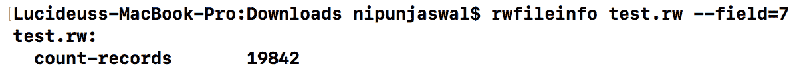
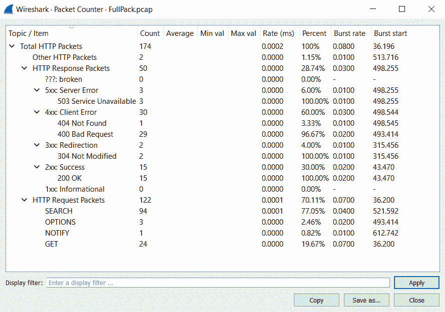

# 第四章：统计流分析

**统计流分析**有助于在庞大的网络中识别被攻陷的机器，通过交叉参考来批准或否定**数据泄漏防护**（**DLP**）系统的发现，并在需要时进行个人画像。这种分析方式可以揭示大量信息。它可以帮助您找到被攻陷的机器或外泄的关键业务文件。您可以通过分析某人，了解他们的工作时间表、非工作时间或在工作时的娱乐来源。

本章将涵盖以下关键概念：

+   统计流分析

+   收集和聚合数据

+   关于**互联网协议流信息导出**（**IPFIX**）和 NetFlow 的关键概念

# 技术要求

完成本章练习时，您将需要以下工具和代码：

+   Wireshark v3.0.0（[`www.wireshark.org/download.html`](https://www.wireshark.org/download.html)）安装在 Windows 10 操作系统/ Ubuntu 14.04 上

+   YAF（[`tools.netsa.cert.org/yaf/libyaf/yaf_silk.html`](https://tools.netsa.cert.org/yaf/libyaf/yaf_silk.html)）仅在 Linux 上可用（不属于 Kali Linux 的一部分）

+   SiLK（[`tools.netsa.cert.org/silk/download.html`](https://tools.netsa.cert.org/silk/download.html)）仅在 Linux 上可用（不属于 Kali Linux 的一部分）

+   [`github.com/nipunjaswal/networkforensics/tree/master/Ch4`](https://github.com/nipunjaswal/networkforensics/tree/master/Ch4)

# 流记录和流记录处理系统（FRPS）

**流记录**是网络上流的元数据。考虑一个场景，其中一个被感染的系统正在与攻击者的系统通信，并将两个 5 MB 的文档上传到攻击者的系统。在这种情况下，流记录将包含如被感染主机和攻击者系统的 IP 地址、端口号、日期和时间以及交换的数据量等信息，在本例中大约为 10 MB。

# 理解流记录处理系统

负责管理、构建和处理流记录的系统被称为**流记录处理系统**。FRPS 包括以下组件：

+   **传感器**：监控网络中的所有流量流，并为这些流生成流记录。

+   **收集器**：一种服务器应用程序，从传感器接收流记录并将其存储到磁盘中。网络中可以有多个收集器。

+   **聚合器**：用于聚合、排序和管理来自多个来源（收集器）的数据。

+   **分析器**：分析数据的位和字节，并产生有意义的信息，揭示各种问题。

传感器负责创建流记录。传感器的种类各异。基于网络的传感器主要是交换机和其他支持流记录生成和导出的网络设备。例如，思科交换机生成 IPFIX 格式的流记录，而其他设备可能使用 NetFlow 或 sFlow 格式。如果现有的基础设施不支持 NetFlow 的记录和导出功能，也可以使用基于硬件的独立设备。

# 探索 NetFlow

现在我们已经了解了流记录和 FRPS，接下来我们开始探索 NetFlow。假设在取证场景中，我们捕获了 100 GB 的完整数据包 PCAP 文件。这么大的 PCAP 文件不容易携带和处理。此时，我们可以转向 NetFlow。它去除了数据包的负载部分，仅收集头部信息。

在前面的章节中，我们学习了如何处理各种头部信息，如 IPV4、TCP 和 UDP。如果我们去除负载，只剩下头部信息，那么我们的 100 GB PCAP 文件就能缩减为可处理的 600-700 MB。

NetFlow 有多种头部信息，例如以下内容：

+   源 IP

+   目标 IP

+   源端口

+   目标端口

+   协议

+   TCP 标志

+   时间

+   字节信息

+   数据包信息

换句话说，我们可以说它可以作为完全数据包捕获的替代方案。然而，我们不能依赖它进行智能分析，因为这需要完全的数据包捕获。NetFlow 可以被看作是一张电话账单，我们知道是谁打了电话，但无法恢复通话内容。NetFlow 有十个版本，从 v1 到 v10。然而，广泛使用的版本是 v5 和 v10（IPFIX），我们将在后续进行更详细的讨论。

# 单向流和双向流

另一个简单的概念是**单向流**（uniflow）和**双向流**（bitflow）。假设系统 1 向系统 2 发送了 500 字节的数据，而系统 2 回应了 3500 字节的数据。在单向流中，这将被视为两个独立的实体，而在双向流中，它将被视为一个单一的双向实体，传输了 4000 字节的数据。可以如下查看：

| `172.16.62.1` | 59,628 | `172.16.62.2` | 80 | 2019-01-19 14:22 | 500 字节 |
| --- | --- | --- | --- | --- | --- |
| `172.16.62.2` | 80 | `172.16.62.1` | 59,628 | 2019-01-19 14:22 | 3,500 字节 |
| `172.16.62.1` | 59,628 | `172.16.62.2` | 80 | 2019-01-19 14:22 | 4,000 字节 |  |

前两条记录代表单向流（uniflow），而最后一条记录代表双向流（bitflow）。同时，单向流提供比双向流更多的信息，因为你可以知道每个端点发送/接收了多少数据。

# 传感器部署类型

我们刚才看过了单向流和双向流。现在让我们讨论一下 FRP 部署和架构，帮助顺利进行网络分析。通常，FRP 组件按以下示意图所示连接到网络中：

上述图示强调了网络中传感器的部署，其中传感器是路由器的一部分，通过专用通道，它将日志传输到收集器，然后存储到存储单元中。存储单元进一步与分析器连接，用于深入分析。架构可以根据不同类型有所不同，例如用于主机流量、边界和区域网络的可视化。

我们将通过一个图标表示 FRP 系统，如前图所示。我们可以看到，FRP 位于防火墙与内部路由器之间。该设置展示了边界可视化的使用。类似地，通过将传感器放置在大多数交换机上并聚合记录，可以实现区域（交换机层级）可视化：

主机流量可通过将传感器放置在端点本身并聚合记录来实现：

# 分析流量

许多工具有助于辅助统计流量分析。最常见的有**Yet Another Flowmeter**（**YAF**）、**Internet-Level 知识系统**（**SiLK**）、iSiLK、Argus、Wireshark 和 Bro。虽然它们大多数提供类似的功能集，我们将主要讨论开源的 YAF 和 SiLK，因为它们*易于获取*。我们在前面的章节中稍微讨论了 IPFIX。让我们来看一下如何通过 YAF 将 PCAP 文件转换为 IPFIX 格式。YAF 是一个将 pcap 文件或来自网络接口的实时捕获数据处理成双向流并转换为 IPFIX 定向文件格式的工具。YAF 输出的数据可以供流行的工具使用，如 SiLK 和其他 IPFIX 兼容工具。YAF 包含两个主要工具，一个是 YAF 本身，另一个是**yafascii**，它根据启用 IPFIX 的输入文件以 ASCII 格式打印数据。YAF 还有其他 PCAP 工具，如**yafMetas2Pcap**和**getFlowKeyHash**，我们将在后续章节中使用这些工具。

# 将 PCAP 转换为 IPFIX 格式

YAF 可以将 PCAP 文件转换为 IPFIX 格式，如下图所示：

我们可以看到，执行之前的命令`yaf --in filename.pcap --out filename.yaf`会生成一个新的文件`Fullpack.yaf`，该文件为 IPFIX 格式。YAF 还可以选择性地进行应用标签、深度数据包检查、DHCP 指纹识别等操作。

# 查看 IPFIX 数据

由于我们已将文件转换为 IPFIX 格式，让我们使用 yafascii 工具以 ASCII 格式打印出其内容，如下图所示：

执行之前的命令将生成类似于以下内容的文本文件：

我们可以看到数据以 IPFIX 可打印格式呈现。既然我们已经覆盖了 PCAP 转换的基础知识，接下来让我们尝试对 IPFIX 文件进行一些分析。

# 使用 SiLK 进行流量分析

SiLK 是 CERT NetSA 提供的一组工具和脚本，旨在简化大型网络环境中的分析工作。SiLK 帮助收集、存储和分析网络数据，并使安全团队能够查询各种历史数据集。让我们对上一个示例中的文件进行一些分析，并使用 SiLK 提供的不同工具。

然而，在我们这样做之前，我们需要将分析文件转换为 SiLK 格式，而不是使用平面的 IPFIX 格式。我们将文件转换为 SiLK 格式而不是使用平面 IPFIX 格式的原因是，SiLK 格式的文件在空间使用上更加高效。在前面的示例中，我们将 PCAP 文件转换为 IPFIX 格式。现在让我们使用转换后的文件并将其转换为 SiLK 格式，如下所示：

SiLK 套件包含一个**rwipfix2silk**工具，可以将 IPFIX 格式转换为 SiLK 格式。我们可以看到我们通过`--silk-output`开关定义了输出文件。让我们使用**rwfileinfo**工具对刚才创建的`test.rw`文件进行一些基本的文件信息收集，如下图所示：

`rwfileinfo`工具打印有关 SiLK 流、IP 集（用于管理大量 IP 地址的命令行工具）或袋文件（包含 IPv6 地址的二进制文件格式）的信息，如类型、版本、字节顺序、头部长度、记录长度和记录数。此外，我们还可以使用`--field`开关后跟数字唯一前缀来指定要打印的字段，例如，要打印计数记录，我们将使用数字`7`，如以下截图所示：

要查看所有唯一的前缀，使用`help`命令：`rwfileinfo --help`。

要查看多个记录文件，我们可以在文件名中指定通配符，如下图所示，执行`rwfileinfo *.rw –summary`命令将打印以下信息：

在末尾添加`--summary`开关将显示文件的累计分析结果：

我们可以看到，使用`--summary`开关给我们提供了总记录数、文件数量和文件大小的综合摘要。

# 以文本形式查看流量记录

我们可以使用**rwcut**工具查看 SiLK 记录：

`--num-rec`开关允许我们仅查看特定的记录集，在我们的例子中是前五个记录。同样，rwcut 工具也提供了多种选项。我们可以使用`--fields`开关来定义字段，如下所示：

SiLK 工具集的输出非常灵活，可以使用 `--delimited` 开关进行分隔，如下所示：

我们可以看到，`|` 是默认的分隔符。然而，我们可以使用 `--column-sep` 开关来定义我们的分隔符字符，如前面的截图所示。

**rwtotal** 工具根据指定的键汇总 SiLK 流记录并打印匹配该键的数据。考虑这样一个场景，我们需要统计流向网络中某些系统特定端口的数据，并且可以使用 rwtotal 配合 `--dport` 开关作为键：

我们可以看到，数据大量传输到端口 `80`。`--skip-zero` 开关可以排除零记录的条目。此外，由于 SiLK 被用于大型网络，因此使用 `--sip-first-16` 及其相关选项来汇总来自特定 VLAN 或子网的数据流变得非常容易，如下截图所示：

我们可以看到，使用源 IP 地址的前 24 位时，我们有四个条目对应 `91.189` 范围，记录分别为 `1`、`2`、`30` 和 `1`。然而，如果我们只选择查看前 16 位，统计数据会被覆盖，我们从该特定范围获得 `34` 条记录。这在处理大型网络设置时非常有用。类似于 rwtotal，**rwuniq** 使用 `--field` 开关总结记录，如下截图所示：

rwtotal 工具通常比 rwuniq 工具更快，但功能较少。**rwstats** 工具根据指定的字段将流记录总结到不同的桶中，对于每个桶，它计算特定的值，然后根据主值显示前后 *N* 个数值；我们来看一个例子：

我们可以看到，在前面的截图中，我们使用了总体统计数据，并且有关于字节、数据包和每包字节的统计数据。这些统计数据显示了与时间间隔、计数、输入百分位数以及其他各种细节相关的重要信息。让我们看一个更好的例子，它最终会让这一切变得更有意义：

在前面的截图中，我们根据数据包数量过滤了前 20 个源/目标对，并选择显示字段 1 和字段 2，即源 IP 和目标 IP，以数据包为值。我们可以立即看到，输出中的第一个条目具有最高的数据包传输量，占捕获的总流量的 19.72%。

计算前 10 个源和目标端口也是一件简单的事情：

我们可以看到端口`80`是流量来源最多的端口，占所有数据包的 20.46%，而端口`56446`是接收数据最多的端口，占所有数据包的 14.76%。我们还可以使用`--percentage`开关设置阈值百分比，如下图所示：

我们现在拥有基于百分位数的数值。**rwcount**工具允许我们将记录划分为时间间隔。例如，我们想查看每两分钟流动的数据包总数，可以使用`rwcount`命令并加上`--bin-size`开关，以秒为参数，如下图所示：

现在我们可以看到每两分钟的活动记录，并且可以推断出流量在 14:00 到 14:06 之间出现了峰值。在大型环境中，前述工具在定位一天中任何随机时间点的异常流量尖峰时非常有用。

**rwfilter**——我们称其为过滤流量的瑞士军刀——是这个软件包中最受欢迎的工具之一。让我们看一个例子：

在前面的截图中，我们为源端口`80`构建了一个过滤器，并将其作为输入传递给 rwstats 工具，工具会显示源 IP、传输的字节数及其百分比。此外，我们设置了 0.5%的阈值。同样，我们可以构建各种类型的过滤器，并将一个工具的输出作为另一个工具的输入。接下来让我们看看如何一起使用`rwscan`和`rwsort`：

rwscan 工具检测记录中的扫描活动，而 rwsort 工具读取流记录并按指定字段对其进行排序。我们使用了`--scan-model=2`，这表示一种用于端口扫描检测的阈值随机行走算法。此外，在输出中，我们可以看到源 IP 地址的开始时间、结束时间、总流量、数据包数量以及在该时间间隔内传输的字节数。

好了，我们现在已涵盖了一小部分 SiLK 工具，接下来会在后续章节中介绍更多。

统计流分析使得法医调查人员的工作变得更加轻松，尤其是在数据的可移植性和操作的便捷性方面。然而，大多数网络调查仍然需要进行完整的数据包捕获以确定有效载荷。Wireshark 还提供了基本的流分析功能，例如协议层级、I/O 图表以及 IPv4 和 IPv6 的统计信息。我们来看几个示例：

浏览到**统计**|**协议**层级，我们可以找到协议的详细列表以及相关的字节数、比特/秒、字节的百分比以及数据包的计数。Wireshark 的**统计**|**I/O 图表**标签允许我们查看在某些时间间隔内流量的突然上升：

此外，浏览到 **统计信息** | **IPv4** | **所有地址**，将允许我们查看所有相关 IP 地址的统计数据，如下图所示：

类似地，**统计信息** | **IPv4** | **目的地和端口**选项允许我们查看目的地和相关端口的统计数据，如下所示：

我们可以看到，我们可以轻松地快速了解最频繁传输的端点和它使用的端口。类似的选项也适用于 IPv6 流量。来自 **统计信息** | **HTTP** | **数据包计数器** 标签的 HTTP 数据包计数器选项可以帮助我们快速记录 Web 应用中的错误以及应用向用户发送的响应类型：

# 总结

我们将在接下来的章节中以更高效的方式使用统计分析技术。本章的目标是让我们熟悉过程中使用的工具。我们查看了 YAF、SiLK 和 Wireshark 以进行 IPFIX 和 NetFlow 格式的统计数据分析。

在下一章中，我们将学习如何揭示隧道流量并从中获得取证价值。我们将研究各种解码和解密流量会话以及活动加密的方法。

# 问题

根据本章中的练习，回答以下问题：

1.  完整数据包捕获与 NetFlow 有什么区别？

1.  可以通过 NetFlow 和 IPFIX 数据分析哪些类型的攻击？

1.  使用 GIT 仓库中的 PCAP 文件重复本章中的练习

# 深入阅读

为了从本章中获得最大收益，请参考以下链接：

+   欲了解更多关于使用 SiLK 的 NetFlow 信息，请参考这本精彩的指南：[`tools.netsa.cert.org/silk/analysis-handbook.pdf`](https://tools.netsa.cert.org/silk/analysis-handbook.pdf)

+   欲了解更多关于 NetFlow 到 IPFIX 的信息，请参考 [`www.youtube.com/watch?v=LDmy-tVCsHg`](https://www.youtube.com/watch?v=LDmy-tVCsHg)

+   请参考一个关于流量分析的优秀免费培训，[`opensecuritytraining.info/Flow.html`](http://opensecuritytraining.info/Flow.html)
