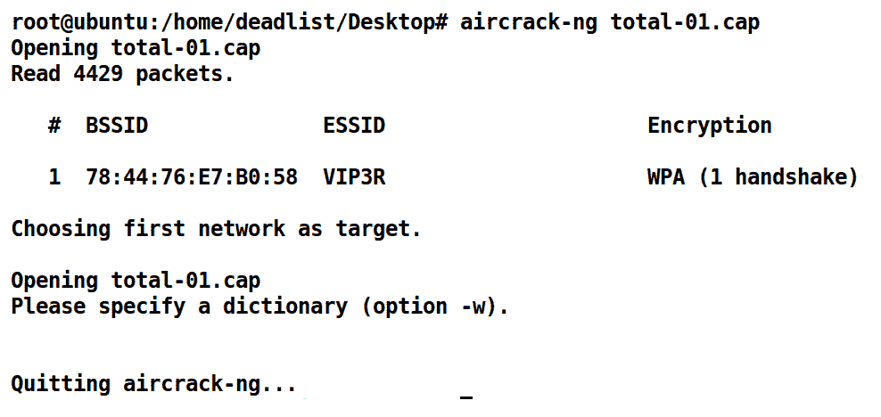

# 第五章：应对隧道技术和加密

在最后几章中，我们看到了如何捕获网络数据包，并使用各种工具和技术深入分析它们。然而，如果通过 DNS 查询传输的数据并没有携带 DNS 负载怎么办？或者，如果观察到的数据包内容毫无意义呢？为了回答这些问题，我们将探讨在有效进行网络取证过程中遇到的一些关键步骤。数据有时会使用 TLS、SSL、自定义加密机制或在无线网络中使用 WEP/WPA2 进行加密。在这一章中，我们将讨论如何应对这些障碍，并获取加密背后的有意义数据。

我们将讨论以下主题：

+   使用浏览器解密 TLS

+   解码恶意 DNS 隧道

+   解密 802.11 数据包

+   解码键盘捕获

这是最后一章，在进入实际的网络取证练习之前，我们将利用前五章中学到的策略来解码、解密并解决最后五章中的练习。让我们开始吧。

# 技术要求

为了完成本章中的练习，我们将需要以下内容：

+   Kali Linux ([`www.kali.org/downloads/`](https://www.kali.org/downloads/))

+   在 Windows 10 操作系统上安装的 Wireshark v2.6.6 ([`www.wireshark.org/download.html`](https://www.wireshark.org/download.html))

+   Aircrack-ng 套件（已包含在 Kali Linux 中）

+   Scapy Python 库（已包含在 Kali Linux 中，可通过`pip install scapy`命令安装）

+   您可以从[`github.com/nipunjaswal/networkforensics/tree/master/Ch5`](https://github.com/nipunjaswal/networkforensics/tree/master/Ch5)下载本章中使用的代码和 PCAP 文件

# 使用浏览器解密 TLS

流行的 Chrome 浏览器的一个隐藏功能是支持将加密流量时使用的对称会话密钥记录到我们选择的文件中。让我们看看当我们尝试捕获一个 TLS 加密的数据包时会发生什么：


我们可以看到网络流量是使用 TLS 加密的，而且底部窗格中的数据对我们来说没有多大意义。幸运的是，像 Chrome 这样的浏览器支持存储 TLS 密钥，这有助于我们解密那些本来无法理解的数据。为了设置日志记录，我们需要通过浏览控制面板并打开系统来导出用户环境变量。

接下来，我们需要选择**高级系统设置**。在下一步中，我们将选择**环境变量...**选项。在**用户变量**部分，我们将通过点击**新建**来添加`SSLKEYLOGFILE`变量，并将其值设置为我们选择的任何文件：


确保您创建一个空文件，文件名与变量值中的名称一致；在我们的案例中，它是`ssl.log`。现在我们已经完成设置，可以让用户浏览网络。上述日志选项将在怀疑某个特定用户时非常有用，通过解密他的 TLS 流量并监控其活动，可以确认这一点。

在 Linux 系统中，可以使用命令 export `SSLKEYLOGFILE=PATH_OF_FILE` 来导出环境变量。

网络数据包可以在集线器或镜像端口上捕获，但要解密 TLS 会话，日志文件是必需的。一旦正确设置了该文件，管理员和网络取证专家就可以在不同的系统上解密 TLS 会话。让我们看看日志文件中生成了什么样的数据：


我们可以看到该文件包含会话密钥。让我们通过导航到**编辑**并选择**首选项**来设置 SSL/TLS 解密。然后向下滚动到**SSL** / **TLS**（Wireshark 3.0 版本）中的**协议**部分：


让我们在**（Pre）-Master-Secret 日志文件名**字段中设置日志文件的路径并按**确定**：


我们现在将解密 TLS 会话：


我们可以看到大部分 TLS 流量数据以明文 HTTP 格式显示。很显然，由于安全和隐私问题，我不会提供这个 PCAP 和相关的日志文件。要执行前面的操作，您需要设置环境变量，并指定日志文件的路径，然后浏览一些支持 TLS 的网站。您将获得包含各种会话密钥的日志文件；使用它来解密支持 TLS 的数据。

SSL 在 Wireshark 3.0.0 版本中已被 TLS 替代。

# 解码恶意 DNS 隧道

在准备本书内容时，我偶然发现了一些出色的 **Capture the Flag** (**CTF**) 挑战，这些挑战展示了令人惊叹的练习。其中一个我们接下来要讨论的就是其中之一。我们在之前的章节中涵盖了关于 ICMP shell 的练习，而 ICMP 隧道工作原理相同，即通过一系列 ICMP 请求传递 TCP 相关数据。同样地，DNS 和 SSH 隧道也是有效的；它们将正常的 TCP 流量封装在内部，并通过常见的安全实践。DNS 和 SSH 隧道在绕过机场、咖啡馆等地的强制门户限制时相当流行。然而，某些恶意软件也利用 DNS 对受感染的机器执行命令和控制。让我们看一个示例，演示一些奇怪的 DNS 请求，并探讨我们可以用它们做什么。PCAP 示例来自 HolidayHack 2015，你可以从 [`github.com/ctfhacker/ctf-writeups/blob/master/holidayhack-2015/part1/gnome.pcap`](https://github.com/ctfhacker/ctf-writeups/blob/master/holidayhack-2015/part1/gnome.pcap) 下载样本 PCAP，感谢 Cory Duplantis，也被称为 **ctfhacker**。

我们很快将需要 Kali Linux 来进行此练习，Wireshark 的版本是 2.6.6，因此请将 PCAP 下载到 Windows 和 Kali Linux 机器上。

让我们在 Wireshark 中打开 `gnome.pcap`：


我们可以看到在 PCAP 文件中，我们有一些无线 802.11 数据包和 DNS 查询响应，这相当奇怪，因为没有查询请求，只有查询响应。让我们进一步调查一下 DNS 数据包：


在过滤 DNS 数据包时，我们发现有许多带有事务 ID 为 `0x1337` 并且其中孕育了类似 base64 的数据的数据包。让我们试着使用 `tshark` 提取这些数据：


先前的 `tshark` 命令从 GNOME 读取。PCAP 文件使用 `-r` 开关，并且我们已经设置了一个关于 DNS 事务 ID 的筛选条件，观察使用 `-R` 开关的 `dns.id==0x1337` 筛选器。

此外，我们选择仅使用 `-T` 字段打印所有数据包的 DNS 响应长度，后跟 `-e` 表示字段，以及 `dns.resp.len` 来打印响应长度。然而，我们对收集看起来像 base64 的 TXT 记录本身更感兴趣，而实际上使用 `dns.txt` 而不是 `dns.resp.len` 并不起作用。因此，我们需要一种机制来提取这些条目。

# 使用 Scapy 提取数据包数据

**Scapy** 是一个用于网络的数据包操作工具，用 Python 编写。它可以伪造或解码数据包，发送到网络上，捕获它们，并匹配请求和响应。我们可以使用 `scapy` 提取 TXT 记录如下：

```
From scapy.all import  * 
import base64 

network_packets = rdpcap('gnome.pcap') 
decoded_commands = [] 
decoded_data ="" 
for packet in network_packets: 
    if DNSQR in packet: 
        if packet[DNS].id == 0x1337: 
            decoded_data = base64.b64decode(str(packet[DNS].an.rdata)) 
        if 'FILE:' in decoded_data: 
                        continue 
        else: 
                decoded_commands.append(decoded_data) 
for command in decoded_commands: 
        if len(command)>1: 
                print command.rstrip() 
```

通过仅仅使用 15 行 Python 代码，我们就可以提取我们需要的数据。前两行是头部导入，它们为 Python 脚本提供了来自 base64 和`scapy`的功能。接下来，我们有以下代码：

```
network_packets = rdpcap('gnome.pcap') 
decoded_commands = [] 
decoded_data =""
```

在前面的代码段中，我们正在从当前工作目录读取一个 PCAP 文件`gnome.pcap`，同时声明一个名为`decoded_commands`的列表和一个名为`decoded_data`的字符串变量。接下来，我们有以下代码：

```
for packet in network_packets: 
    if DNSQR in packet: 
        if packet[DNS].id == 0x1337: 
            decoded_data = base64.b64decode(str(packet[DNS].an.rdata)) 
```

`for`循环将依次遍历数据包，如果数据包是 DNS 类型，它会检查数据包 ID 是否与`0x1337`匹配。如果匹配，它会使用`packet[DNS].an.rdata`提取 TXT 记录数据，将其转换为字符串，并从 base64 解码为普通文本。如果解码后的数据包含`FILE:`，则执行应继续，否则`decoded_data`将附加到`decoded_command`中：

```
if 'FILE:' in decoded_data:
          continue
else:        
          decoded_commands.append(decoded_data) 
for command in decoded_commands: 
          if len(command)>1: 
                  print command.rstrip() 
```

上一部分将解码后的数据附加到`decoded_command`列表中，并遍历该列表，同时打印出长度大于 1 的所有元素（以避免空行）。运行脚本会给出以下输出：


好吧，这看起来像是`iwlist`扫描命令的输出。系统命令的输出通常不是 DNS 响应中应该出现的内容。这表明被观察的系统已被攻破，攻击者使用 DNS 进行命令与控制。

# 解密 802.11 数据包

有时，作为一名取证调查员，你会收到包含 WLAN 数据包的 PCAP 文件，为了从中获取有意义的信息，你需要密钥。在取证场景中，如果你有权限，获取密钥应该不难，但作为取证调查员，你必须为所有可能的情况做好准备。在接下来的场景中，我们有一个来自[`github.com/ctfs/write-ups-2015/raw/master/codegate-ctf-2015/programming/good-crypto/file.xz`](https://github.com/ctfs/write-ups-2015/raw/master/codegate-ctf-2015/programming/good-crypto/file.xz)的 PCAP 文件，当我们在 Wireshark 中打开它时，立即看到 802.11 数据包：


我们无法确定网络中执行了哪些活动，除非我们去除 802.11 封装。然而，让我们看看通过导航到**无线**标签并选择 WLAN 流量，Wireshark 提供了哪些统计信息：


我们可以看到无线段的 100%的数据包，以及**SSID**（网络名称）为**cgnetwork**，它运行在频道号**1**上，并且有多个客户端连接到它。为了查看活动，我们需要去除 802.11 封装，而这可以通过提供我们没有的网络密钥来完成。那么，我们该怎么做呢？让我们尝试使用**Aircrack-ng**套件来查找密钥，它是一个流行的无线网络破解工具（在 Kali Linux 中已经可用）。

# 使用 Aircrack-ng 进行解密

让我们使用 Aircrack-ng 查找网络密钥。我们输入`aircrack-ng`，后跟 PCAP 文件：


我们可以看到我们轻松地得到了 WEP 密钥。我们可以使用这个密钥在 Wireshark 中解密数据包：


我们将导航到**编辑...**并选择**首选项**。当对话框打开后，我们选择协议并向下滚动到**IEEE 802.11**，如前面的截图所示。接下来，我们选择**解密密钥**选项并点击**编辑**，这将弹出一个单独的对话框，如下所示：


我们将点击**+**号，添加我们通过 Aircrack-ng 找到的密钥，然后点击**确定**：


哇！我们可以看到我们成功移除了无线封装。或者，我们也可以使用`airdecap`，它是`aircrack`套件中的一个工具来移除封装。我们刚刚看到如何使用无线协议并通过破解 WEP 密钥来去除封装。但是，这可能不适用于 WPA 和 WPA2 标准。让我们来看一个例子：


我们提供了一个 WPA2 明文密码，PCAP 文件已成功解密：


然而，密码破解过程不像 WEP 的情况那样标准化。让我们看看当我们尝试在`aircrack-ng`套件中破解 PCAP 时会发生什么：



我们可以看到`aircrack-ng`套件要求我们指定一个可能包含密码的字典文件，这意味着在这种情况下，获得密钥的唯一方法就是暴力破解。让我们看看如何提供一个包含密码列表的字典文件：


Kali 默认提供字典文件，位置在`/usr/share/dict/words`。

我们可以看到我们已经使用`-w`开关提供了一个示例字典文件，现在 Aircrack-ng 正在尝试破解密码。因此，在某个时刻，我们将得到以下结果：


太棒了！我们得到了密钥。我们已经看到如何在 Wireshark 中应用这个密钥并进一步分析它。接下来的章节将讨论 802.11 标准，因为我们有一章完整的内容专门讲解它。

# 解码键盘捕获

又是一天，又有了一个有趣的 PCAP 捕获。你有没有想过 USB 键盘也能揭示很多活动和用户行为？我们将在接下来的章节中探讨这种场景，但现在，先做些准备。我找到一个有趣的封包捕获文件，来自[`github.com/dbaser/CTF-Write-ups/blob/master/picoCTF-2017/for80-just_keyp_trying/data.pcap`](https://github.com/dbaser/CTF-Write-ups/blob/master/picoCTF-2017/for80-just_keyp_trying/data.pcap)。但是，当我下载 PCAP 文件并将其加载到 Wireshark 中时，我看到了以下内容：


嗯，我没见过类似的东西，但我们知道这是 USB 数据。我们还可以看到，剩余列中包含一些字节。这些字节是我们关注的数据；让我们通过运行`tshark –r [文件路径]`命令来使用`tshark`收集这些数据，如下所示：


让我们只打印剩余的数据，使用`usb.capdata`字段：


我们可以看到，每行只有一到两个字节，因此为了解码 USB 按键，我们只需要去除零和分隔符的字节。我们可以通过运行以下命令，删除每行中的空字节和分隔符，如下截图所示：


当我们去除零和分隔符后，剩下的数据就是前述的数据。前面的截图中的字节可以被解释为按键操作，并可以映射到[`www.usb.org/sites/default/files/documents/hut1_12v2.pdf`](https://www.usb.org/sites/default/files/documents/hut1_12v2.pdf)第 53 页中列出的键位。根据文档，**09** 映射到 **f**，**0F** 映射到 **l**，**04** 映射到 **a**，**0a** 映射到 **g**，这意味着输入的前四个字符是 **flag**。类似地，解析这些字节的工具可以让我们查看用户在 PCAP 捕获文件中输入的所有内容。接下来，我们还可以使用一个基于 Python 的小脚本，利用 Scapy 来解析整个 PCAP 文件：


上述脚本可以从[`github.com/dbaser/CTF-Write-ups/blob/master/picoCTF-2017/for80-just_keyp_trying/usbkeymap2.py`](https://github.com/dbaser/CTF-Write-ups/blob/master/picoCTF-2017/for80-just_keyp_trying/usbkeymap2.py)获取，与我们为 DNS 查询所做的非常相似。

# 概要

在本章中，我们学到了很多内容。我们首先利用客户端 SSL 日志文件来解密 SSL/TLS 会话。接着我们查看了携带命令和控制数据的 DNS 恶意查询响应。我们通过 Aircrack-ng 套件解密 WEP 和 WPA2 密码，并在 Wireshark 中使用解密密钥。我们还通过一段小的 Python 代码，分离并解码数据。最后，我们查看了 USB 键盘捕获文件，解密了在 PCAP 文件记录时用户按下的按键。这是我们的准备阶段的结束，现在我们将进入实践环节。我们将利用前五章中学到的课程和技术，并基于我们获得的知识，尝试解决接下来章节中的挑战。

在下一章中，我们将研究活跃的恶意软件样本，并对其进行网络取证。我们将制定策略，揭示恶意软件部署的根本原因，并找到关键的细节，如网络中的第一次入侵点。

# 问题与练习

为了从本章中获得最佳效果，请尝试以下内容：

+   是否有其他浏览器在存储 SSL 密钥日志时表现出与 Chrome 类似的行为？查找答案。

+   你能解密无线捕获文件吗？如果能，请找出挑战文件`wireless_decryption_challenge.pcap`的密码，该文件托管在[`github.com/nipunjaswal/networkforensics/tree/master/Challenges`](https://github.com/nipunjaswal/networkforensics/tree/master/Challenges)。

+   尝试将键盘连接到你的笔记本电脑/台式机，并捕获 USB 数据，解码按键。

# 进一步阅读

查看**攻克 CTF 挑战**：[`subscription.packtpub.com/book/networking_and_servers/9781784393335/3/ch03lvl1sec26/nailing-the-ctf-challenge`](https://subscription.packtpub.com/book/networking_and_servers/9781784393335/3/ch03lvl1sec26/nailing-the-ctf-challenge)，了解本章涵盖的更多内容。
