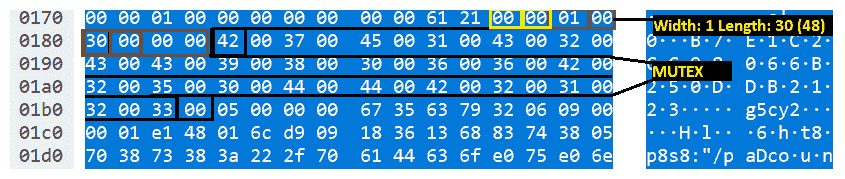
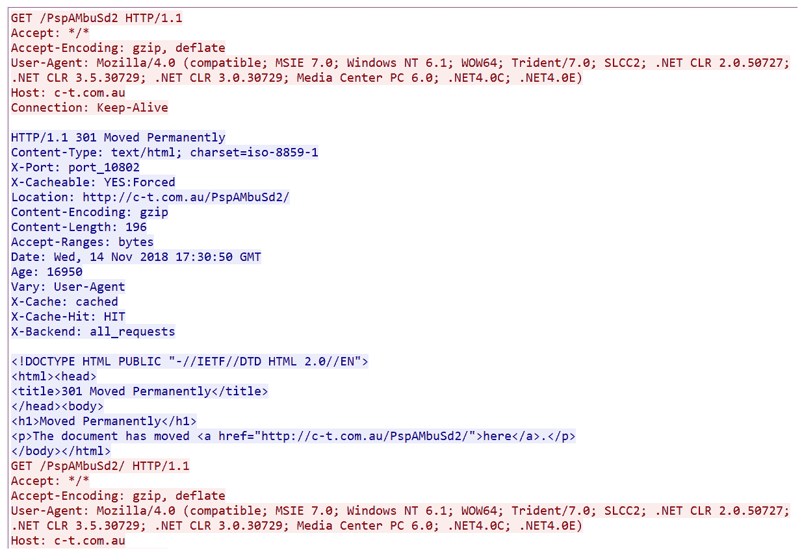

# 第六章：调查良性、已知和恶性的恶意软件

本章主要讲解在网络取证的背景下调查恶意软件。大多数需要网络取证的事件都会基于恶意软件相关的事件，例如网络入侵、金融犯罪、数据盗窃和命令与控制。大多数攻击者会部署命令与控制恶意软件，以控制被攻陷的计算机，并在内部网络中获得横向移动的杠杆。一般来说，在调查恶意软件时，网络取证与计算机取证是密切相关的。计算机取证调查员将找出系统中发生了哪些变化，以及恶意软件在系统中的位置。然后，他们会找到导致问题的可执行文件，并将其上传到如[`www.virustotal.com`](https://www.virustotal.com)或[`www.hybrid-analysis.com`](http://www.hybrid-analysis.com)等网站，以进一步了解恶意软件及其在系统和网络中的行为。如果是新手攻击者使用对称密钥加密数据传输，取证调查员将通过恶意软件分析员对恶意软件进行反向工程，并相应地解密流量。

本章将介绍基于前几章所学技术的恶意软件识别与分析。我们将涵盖以下内容：

+   在网络上剖析恶意软件

+   拦截恶意软件以获取乐趣和利润

+   行为模式与分析

+   一个真实案例研究——调查网络中的银行木马

在第一个示例中，我们将研究一个著名的特洛伊木马，并尝试弄清楚可能发生了什么。后续示例中，我们将展示如何利用 PCAP 中的证据解密勒索软件加密的文件。最后，我们将展示如何利用流行的恶意软件分析网站分析一个银行木马。在第一个示例中，我们已经假设网络中的一台系统已被感染。你可以从 R3MRUM 的 GitHub 仓库下载 PCAP：[`github.com/R3MRUM/loki-parse/blob/master/loki-bot_network_traffic.pcap`](https://github.com/R3MRUM/loki-parse/blob/master/loki-bot_network_traffic.pcap)。

# 技术要求

完成本章中的练习需要以下软件和操作系统：

+   在 Windows 10 和 Ubuntu 14.04 上安装 Wireshark v3.0.0 ([`www.wireshark.org/download.html`](https://www.wireshark.org/download.html))

+   练习用 PCAP 文件 ([`github.com/nipunjaswal/networkforensics/tree/master/Ch6`](https://github.com/nipunjaswal/networkforensics/tree/master/Ch6))

+   在 Windows 10 上安装 NetworkMiner ([`www.netresec.com/?page=networkminer`](https://www.netresec.com/?page=networkminer))

+   所需的第三方工具：

    +   Hidden Tear 解密工具 ([`github.com/goliate/hidden-tear`](https://github.com/goliate/hidden-tear))

    +   PyLocky 解密器 ([`github.com/Cisco-Talos/pylocky_decryptor`](https://github.com/Cisco-Talos/pylocky_decryptor))

# 网络上恶意软件的剖析

让我们按以下方式在 Wireshark 中加载 PCAP 文件：


我们可以看到，PCAP 文件中包含了大量 HTTP 数据。让我们添加列以显示完整的 **URI** 和 **User-Agent** 条目，并使用 `http.request.uri` 过滤器如以下方式过滤请求：


用户代理在恶意软件通信中非常重要，因为它们可能不是流行浏览器使用的标准用户代理。我们可以看到，用户代理是 Mozilla/4.08（Charon；Inferno），并且 URI 包含一个单独的用户，如前面的截图所示。让我们像下面的截图那样在 Google 上调查这个用户代理：


看起来这些 HTTP 请求是由恶意的 LokiBot 生成的，这是一种流行的恶意软件，会在感染的系统上窃取数据。打开前面结果中的第三个链接，该链接来自 [`packettotal.com`](https://packettotal.com)，并分析类似的样本：


我们可以看到有许多具有相似行为的条目。前面列表中的重要项目是 HTTP 方法和 User-Agent 列。让我们通过阅读 [`forums.juniper.net/t5/Security/A-look-into-LokiBot-infostealer/ba-p/315265`](https://forums.juniper.net/t5/Security/A-look-into-LokiBot-infostealer/ba-p/315265) 和 [`r3mrum.wordpress.com/2017/07/13/loki-bot-inside-out/`](https://r3mrum.wordpress.com/2017/07/13/loki-bot-inside-out/) 来进一步研究这个恶意软件。我们可以看到，LokiBot 分析有很多内容需要阅读。从前面的链接中，我们得到的关键点是 HTTP 负载的首字节是 LokiBot 的版本。让我们通过使用 `tshark –r /home/deadlist/Desktop/loki-bot_network_traffic.pcap -2 –R http.request.uri –Tfields –e ip.dst –e http.request.full_uri –e http.user_agent –e data –E separator=, | cut –c1-91` 命令来查看它是什么。该命令将读取使用 X 开关定义的 PCAP 文件，并显示所有具有 URI 的数据包，使用 `http.request.uri` 过滤器。命令将打印以逗号分隔的值（`-E separator=,`），如目标 IP、完整 URI、User-Agent 和数据（`-Tfields`）。

由于最后一个值是数据字段，因此使用 `cut –c1-91` 将仅打印数据的前两个字节（字节单词），如下面的截图所示：


我们可以看到，首字节是 1200，这意味着 00 12（18）被 10 除，因此我们得到 LokiBot 版本为 1.8。请看下面的截图：


我们可以看到，在下一个词（接下来的两个字节）中，我们有十六进制值 27、28 和 2b，根据我们读到的信息，这些值定义了数据包的功能，值 27 表示外泄应用程序/凭据数据，28 表示获取 C2 命令，2b 表示外泄键盘记录器数据。这意味着 LokiBot 按照以下顺序进行了以下活动：

+   外泄了一个应用程序的凭据数据两次

+   发出了新命令，即外泄键盘记录器数据

+   发送了键盘记录器数据

最后，让我们来看看我们到目前为止获得的数据：

+   **感染的系统**：`172.16.0.130`

+   **命令与控制服务器**：`185.141.27.187`

+   **使用的恶意软件**：LokiBot

+   **恶意软件检测**：用户代理，HTTP 方法（POST）

+   **恶意软件活动**：应用程序数据外泄和键盘记录

了解了恶意软件的基本信息后，让我们深入探讨，通过了解其模式来找到更多有关外泄数据的信息。

# 查找网络模式

我们知道该恶意软件正在窃取某些应用程序数据，但我们不知道具体是哪个应用程序以及哪些数据被窃取了。让我们尝试通过查看标准 Wireshark 显示中的 HTTP 负载（最低面板）来找出这些信息，具体如下：


从前面的截图中，我们可以看到负载从 LokiBot 版本 18（十进制，16 进制为 12）开始，我们需要将其除以 10 来获取准确的版本号。接下来，我们看到 27 是应用程序凭据数据外泄的标识符。接着，第一个词表示宽度为零，意味着负载值将作为普通字符串解包。然后，我们有一个词值表示长度为 0a，也就是十进制的 10。我们可以看到长度为 10 字节，表示二进制 ID 为 XXXXX11111。接下来，我们看到下一个宽度和长度，这将表示系统用户名；我们看到宽度为 1，长度为 6。由于宽度为 1，我们将以十六进制解包此数据。因此，每两个字节我们得到用户名为 REM。接下来，我们看到系统名称，宽度为 1，长度为 1c，表示 28。接下来的 28 字节表示感染的系统名称是`REMWORKSTATION`。按照相同的标记法，接下来的值表示域名，仍然是`REMWORKSTATION`。让我们看看下一个十六进制部分：


我们接下来四个字节是屏幕宽度，紧接着的四个字节是屏幕高度。我们检查了本地管理员和内建管理员，前面的截图显示，在接下来的四个字节中，两者的值都是 1，表示是的。接下来的两个字节如果操作系统是 64 位，则值设为 1，但由于不是 64 位系统，所以设置为 0。接下来的八个字节定义了操作系统的主版本号和次版本号，以及`os_bug`补丁变量，分别为`6,3,1,107`。这意味着我们可以将操作系统表示为`6.3.1.107`，即 Windows 8。此外，这里存储的值是小端格式，意味着最低有效字节在最前面。在接下来的部分，我们有以下内容：


我们可以看到接下来的两个字节是表示首次连接的值为零。这意味着受害者是第一次连接。接下来，两个字节表示被窃取的数据是经过压缩的，而接下来的两个字节则定义了被窃取的数据是否已编码，紧随其后的这两个字节定义了编码类型。接下来的四个字节表示原始被窃取数据的长度，为 8,545 字节。中间有一个分隔符，接下来是字符串的宽度和长度：



如前面的截图所示，我们有一个 48 字节长的互斥量（mutex）值，用于 LokiBot。接下来，LokiBot 按照以下方式使用该互斥量：

+   互斥量：`B7E1C2CC98066B250DDB2123`

根据这个值，LokiBot 的文件将位于以下位置：

+   哈希数据库：`"%APPDATA%\\C98066\\6B250D.hdb"`

+   键盘记录数据库：`"%APPDATA%\\C98066\\6B250D.kdb"`

+   锁定文件：`"%APPDATA%\\C98066\\6B250D.lck"`

+   恶意软件执行文件：`"%APPDATA%\\C98066\\6B250D.exe"`

如果我们仔细观察，可以看到目录名从互斥量的第 8 个字符到第 13 个字符，而文件名则从第 13 个字符到第 18 个字符。

好吧！这网络上传输了太多信息。接下来看看是什么：


接下来是密钥长度、密钥本身以及压缩数据的长度。我们现在知道压缩数据的长度是 2,310 字节，具体如下所示：


我们可以看到一些值是 XML 和 HTML 格式的。但是，我们仍然需要解压缩这些数据。通过研究恶意软件执行文件（在执行文件上运行`strings`命令），我们会发现其中一个二进制可执行文件中的字符串包含 LZSS，这是一个流行的数据压缩编码方案。你可以在[`github.com/maxim-zhao/aplib.py/blob/master/aplib.py`](https://github.com/maxim-zhao/aplib.py/blob/master/aplib.py)找到更多关于压缩和解压缩的信息。

使用该库，我们可以从 Wireshark 捕获的数据中复制字节，并将其作为输入传递给库中定义的解压函数。我们可以按照以下步骤解压数据：


好的！看起来被窃取的数据来自 FileZilla，而且看起来像是一个配置文件。对其他数据包进行类似的分析，比如包含 2B（键盘记录器）类型的包，我们会得到类似的数据，解压后它看起来会类似于以下内容：


现在我们也得到了键盘记录器数据。那么，到目前为止我们知道了什么呢？

通过处理前述样本，我们成功收集到了以下 **妥协指示器**（**IOC**）信息：

+   **感染的系统**: `172.16.0.130`

+   **感染的用户**: REM

+   **感染系统的主机名**: `REMWORKSTATION`

+   **感染域**: `REMWorkstation`

+   **操作系统架构**: 32 位

+   **屏幕分辨率**: 3440 x 1440

+   **Windows OS NT 版本**: 6.3.1 (Windows 8)

+   **命令和控制服务器**: `185.141.27.187`

+   **使用的恶意软件**: LokiBot

+   **恶意软件检测**: 用户代理，HTTP 方法（POST）

+   **恶意软件活动**: FileZilla 上的应用程序数据外泄，键盘记录

+   **恶意软件版本**: 1.8

+   **恶意软件压缩**: LZSS

+   **恶意软件编码**: 无

+   **恶意软件文件名**: `%APPDATA%\\C98066\\6B250D.*`

真棒！仅仅通过分析 PCAP 文件，我们已经收集了大量信息。接下来让我们看看更多的例子。

用于之前分析的 PCAP 文件可以从 [`github.com/R3MRUM/loki-parse`](https://github.com/R3MRUM/loki-parse) 下载。此外，R3MRUM 还为此分析开发了一个自动化脚本，您可以在 git 仓库中找到该脚本。这个脚本不仅有助于您的分析，还能提高您的 Python 技能。

在处理这个样本时，我联系了 R3MRUM，并讨论了我们之前分析的 LokiBot 样本。他告诉我，XXXXX11111 二进制 ID 似乎是 LokiBot 的开发版本，而 `ckav.ru` ID 是在生产中使用的版本。此外，R3MRUM 提供了关于 LokiBot 的完整白皮书链接：[`r3mrum.files.wordpress.com/2017/07/loki_bot-grem_gold.pdf`](https://r3mrum.files.wordpress.com/2017/07/loki_bot-grem_gold.pdf)。

在之前的练习中，我们处理了一个未知的样本，并研究了它的 IOC。我们不仅能够检测到感染的基本信息，还能够解码它的通信。我们还找到了外泄的数据并发送给了攻击者。接下来，我们将在后续部分处理一些其他样本，比如勒索软件和银行木马。

# 拦截恶意软件以获得乐趣和利润

在本次练习中，我们将分析勒索病毒。勒索病毒可以在网络中造成严重破坏，近期我们已经见过很多例子。像 WannaCry、Petya 和 Locky 这样的勒索病毒已在全球范围内造成巨大破坏。此外，当前 PyLocky 勒索病毒是攻击者最常用的病毒之一。一些勒索病毒通常会在初次运行时将密钥发送到服务器，这正是我们网络取证人员介入的时机。

# PyLocky 勒索病毒的解密使用 PCAP 数据

最近，思科推出了 PyLocky 解密器（[`github.com/Cisco-Talos/pylocky_decryptor`](https://github.com/Cisco-Talos/pylocky_decryptor)），它通过搜索 PCAP 数据来解密系统上的文件。PyLocky 向控制服务器发送一个`POST`请求，其中包含以下参数：

```
PCNAME=NAME&IV=KXyiJnifKQQ%3D%0A&GC=VGA+3D&PASSWORD=CVxAfel9ojCYJ9So&CPU=Intel%28R%29+Xeon%28R%29+CPU+E5-1660+v4+%40+3.20GHz&LANG=en_US&INSERT=1&UID=XXXXXXXXXXXXXXXX&RAM=4&OSV=10.0.16299+16299&MAC=00%3A00%3A00%3A00%3A45%3A6B&OS=Microsoft+Windows+10+Pro 
```

我们可以看到，`iv`（初始化向量）和密码作为参数出现。如果系统感染时网络被记录，我们可以利用这些信息轻松解密文件。接下来让我们看看 PyLocky 的解密代码，如下所示：


我们可以看到，PyLocky 解密器利用 IV 和密码解密使用 PyLocky 勒索病毒加密的文件，通常这种方法也适用于多种勒索病毒类型。PyLocky 使用 DES3 加密文件，而这些文件可以解密回来。

# 解密隐蔽眼泪勒索病毒

让我们看另一个例子，涉及隐蔽眼泪勒索病毒。假设在一个 Windows 10 系统上，隐蔽眼泪勒索病毒已加密文件，情况非常糟糕，如下图所示：


看起来文件已经被加密。让我们尝试打开一个文件，如下所示：


是的——文件内容已被加密。幸运的是，我们手头有完整捕获的数据 PCAP。让我们开始分析：


我们可以看到我们有一个相当大的 PCAP 文件，其中包含大量 HTTP 数据。由于我们知道恶意软件通常在用户代理方面存在问题，我们可以像之前的示例一样，在 Wireshark 中显示完整的用户代理和 URI 数据：


我们可以看到，大多数数据*来自*微软域名，并且看起来很可能是用于 Windows 更新的。让我们取消选择这个用户代理，看看剩下的是什么：


我们可以看到，通过使用`!(http.user_agent == "Microsoft-Delivery-Optimization/10.0") && http.request.full_uri && !ssdp` 过滤器，剩下的只有少数几个数据包。接下来让我们对这些数据包进行分析：


我们看到一个包含机器名称和某些字符串的`GET`请求被发送到一个域名。这可能是密码吗？我们需要检查一下。让我们从[`github.com/goliate/hidden-tear`](https://github.com/goliate/hidden-tear)下载解密工具：


从互联网上下载或从 PCAP 中提取的任何可执行文件都必须仅在隔离的环境中操作，例如虚拟机。由于大多数示例是活动的恶意软件样本，请勿在主机上执行它。

输入我们从 PCAP 分析中获得的密码，步骤如下：


一旦点击“解密我的文件”按钮，我们看到被锁定的文件再次被解锁：


现在我们可以看到文件已经成功解密。

欲了解更多关于查找勒索病毒密钥的信息，请参阅[`sensorstechforum.com/use-wireshark-decrypt-ransomware-files/`](https://sensorstechforum.com/use-wireshark-decrypt-ransomware-files/)。

# 行为模式与分析

对于法证网络调查员来说，找出恶意软件的行为和网络模式非常重要。假设你已从事件响应团队收到几个二进制文件（可执行文件）及其哈希值（签名），这些文件可能携带恶意软件。然而，PE/COFF 可执行文件的分析通常由恶意软件分析师和逆向工程师进行。那么，你能对 PE 可执行文件做什么呢？你无需在一夜之间学习逆向工程和恶意软件分析就能分析该样本。

假设你收到了文件哈希`ed01ebfbc9eb5bbea545af4d01bf5f1071661840480439c6e5babe8e080e41aa`。你可以使用如[`www.virustotal.com/gui/home/upload`](https://www.virustotal.com/gui/home/upload)和[`www.hybrid-analysis.com/`](https://www.hybrid-analysis.com/)等网站分析样本，而无需在你的系统上进行分析。以下截图显示了 VirusTotal 网站：


让我们在 VirusTotal 上搜索该文件的哈希值。如果该文件之前被分析过，结果应该会显示出来：


哎呀！62/70 的杀毒引擎检测到该文件为恶意文件，并认为它可能是 WannaCry 勒索病毒样本。让我们查看**DETAILS**标签页中的细节：


在**DETAILS**标签页中可以看到大量细节，尤其是导致此感染的文件的常见名称。我们还可以看到该文件之前已使用不同的名称进行过分析。此外，我们有以下细节：


我们可以看到 WannaCry 可执行文件联系了五个 IP 地址。显然，我们可以基于这些细节过滤网络，检查网络中的感染并找出感染源。我们还可以在 Hybrid-Analysis 网站上上传/搜索该样本（[`www.hybrid-analysis.com/`](https://www.hybrid-analysis.com/)）：


在 Hybrid-Analysis 上搜索该样本时，我们可以看到与之连接的 IP 地址列表和端口列表。这些信息将帮助我们缩小从感染系统发出的出站连接。我们还可以看到 Hybrid-Analysis 已经在安全环境中执行了我们提供的哈希值对应的样本文件进行分析：


显然，我们可以看到系统在恶意软件执行前后的状态，其中我们看到系统感染了 WannaCry 勒索病毒。

前述分析可以在以下网址找到：[`www.virustotal.com/gui/file/ed01ebfbc9eb5bbea545af4d01bf5f1071661840480439c6e5babe8e080e41aa/detection`](https://www.virustotal.com/gui/file/ed01ebfbc9eb5bbea545af4d01bf5f1071661840480439c6e5babe8e080e41aa/detection) 和 [`www.hybrid-analysis.com/sample/ed01ebfbc9eb5bbea545af4d01bf5f1071661840480439c6e5babe8e080e41aa?environmentId=100`](https://www.hybrid-analysis.com/sample/ed01ebfbc9eb5bbea545af4d01bf5f1071661840480439c6e5babe8e080e41aa?environmentId=100)。

此外，我们还可以通过 VirusTotal 上传 PCAP 文件来检查网络模式（[`www.virustotal.com/gui/home/upload`](https://www.virustotal.com/gui/home/upload)）。让我们看看下面的示例：


我们可以看到来自 PCAP 的流量已通过 Suricata 和 Snort 这两个流行的入侵检测系统进行检测。让我们详细看看生成的警报：


我们可以看到之前列出的来自 PCAP 的 DNS 请求。接下来我们看看 HTTP 部分的内容，以下是截图：


在 HTTP 请求的下方，我们有 Snort 和 Suricata 匹配规则的部分，具体如下：


现在我们已经获得了这一部分的详细信息。查看第三部分，我们可以看到一个可执行文件进入了网络，并被 Snort 检测到。此外，还检测到了一个网络木马、一个命令和控制通信以及一个漏洞利用工具包。让我们也看看 Suricata 匹配的规则：


我们可以看到，根据 PCAP 数据，Suricata 不仅匹配了特洛伊木马活动，还识别出了系统上运行的 Internet Explorer 6 版本。因此，我们可以看到，即使不使用任何额外的分析工具，我们也能发现有关恶意软件的大量信息。此外，我们还可以使用 VirusTotal 图表以图形格式查看该样本，如下图所示：


我们可以看到，带有红色图标的节点被发现具有恶意性质。让我们通过选择它来分析该节点，如下图所示：


卡巴斯基已将其检测为恶意软件。像 VirusTotal 和 Hybrid-Analysis 这样的站点可以快速提供对 PCAP 和可执行文件的分析，加速我们在时间限制下的调查。因此，在开始手动分析之前，应该始终从这些网站获取输入。

上述示例分析可以在[`www.virustotal.com/gui/file/04cf54c95b58f15a2d06ad805a49b20233408737eb417190a817fd189bcf2329/relations`](https://www.virustotal.com/gui/file/04cf54c95b58f15a2d06ad805a49b20233408737eb417190a817fd189bcf2329/relations)找到。

# 一个真实世界的案例研究——调查网络中的银行木马

对于本练习，您可以从[`github.com/nipunjaswal/networkforensics/blob/master/Ch6/Emoter%20Banking%20Trojan%20Sample/2018-11-14-Emotet-infection-with-IcedID-banking-Trojan.pcap`](https://github.com/nipunjaswal/networkforensics/blob/master/Ch6/Emoter%20Banking%20Trojan%20Sample/2018-11-14-Emotet-infection-with-IcedID-banking-Trojan.pcap)下载 PCAP。让我们在 NetworkMiner 中打开该 PCAP 并查看 **Hosts** 标签，如下所示：


我们根据接收到的数据包数量对主机进行了排序。我们可以看到 `10.11.14.101` 和 `185.129.49.19` 接收的数据包数量最多。接下来，查看 **Files** 标签中的文件，我们可以看到在捕获数据中发现了一个文档和一个可执行文件：


接下来，让我们计算其校验和，以便在如 VirusTotal 和 Hybrid-Analysis 等网站上进行搜索，如下图所示：


我们可以看到，我们已生成以下签名：


让我们复制其 SHA-256 签名并在 VirusTotal 上搜索：


哦！38/54 个杀毒引擎已将该文档判定为恶意。大多数杀毒引擎表示这是一个 VBA 下载器，意味着该文档是基于宏的后门文档，因为宏是使用 VBA 脚本语言在文档中编写的。

查看详细信息部分，我们发现以下观察结果：


我们可以看到 VirusTotal 分析显示该文档使用了宏，并且可能尝试运行文件、Shell 命令和其他应用程序。我们也可以看到，从文件中提取的准确宏代码。让我们在 Wireshark 中追踪这个：


我们可以看到，`10.11.14.101` 系统发起了一个 HTTP 请求，并从 `78.135.65.15` 服务器获取了一个 `.doc` 文件（如前面截图中的魔法头部所示），经过检查，该文件携带了一个 VBA 下载器宏。接下来，我们将转到关系标签页：


我们可以看到，办公文档联系了之前列出的 URL。让我们打开 Wireshark，看看文档是否已执行：


我们可以看到文档已经执行，因为 DNS 记录返回了该 IP 地址，后续有了 GET 请求。让我们通过以下方式进一步调查 HTTP 流：



我们可以看到，该请求已发送到 `50.62.194.30` 服务器一次，路径是 `/PspAMbuSd2`，该请求返回了 `301` 重定向响应，第二次发送时，路径变为 `/PspAMbuSd2/`，并返回了一个可执行文件，如下图所示：


所以，我们从服务器下载了一个可执行文件，它可能包含某些恶意内容；让我们通过在 VirusTotal 上使用 NetworkMiner 验证它的签名来检查，就像我们对文档所做的那样：


VirusTotal 结果表明，67 个杀毒软件中有 51 个已检测到该文件为恶意文件，并且携带了 Emotet 银行木马。让我们看看下面的详细图表：


我们可以看到，木马连接到了 `50.76.167.65` 服务器，这可能是其命令与控制主机。让我们看看第一次请求发送到该服务器的时间：


我们可以看到，多个 GET 请求已发送到不同的 IP 地址。我们可以推测，这些 IP 地址是通过链中的初始服务器响应提供的，因为它们并未出现在可执行文件中。接下来，在 Hybrid-Analysis 网站上搜索该可执行文件样本后，我们得到了以下详细信息：


我们可以看到一个新的 IP 地址，和 Wireshark 结果中的其他地址不同，它是 `177.242.156.119`。此外，我们可以看到 `177.242.156.119` 的端口 `80` 使用了非 HTTP 流量。让我们在 Wireshark 中检查一下：


我们可以看到，我们有外向连接，但似乎由于某种原因连接失败了。一般信息部分还列出了另一个 IP 地址，如下图所示：


我们还可以看到`189.244.86.184`这个 IP 地址。让我们通过在 Wireshark 中跟踪 HTTP 流量来调查它的流量，如下所示：


从我们通过 TCP 流看到的内容来看，特洛伊木马正在通过利用 Cookie 发送数据。这些数据可能是命令输出、信标行为（已安装的恶意软件定期向攻击者发送信息，表明它仍然在线并准备接收输入），或者是文件内容。然而，如果我们查看 NetworkMiner 的凭证部分，我们会看到不同的情况：


我们可以看到，在 HTTP 请求中，类似的 Cookie 也被发送到其他 IP。通过将 PCAP 文件上传到[`packettotal.com/`](https://packettotal.com/)，我们可以在 SSL **证书**标签中看到以下信息：


SSL 证书是自签名的，且验证失败。因此，综合分析，我们得出以下事件总结：

+   恶意的`363439590633444.doc`文档表单包含一个 VBA 下载器宏，它是从[`bysound.com.tr/`](http://bysound.com.tr/)（`78.135.65.15`）下载的，下载主机为`10.11.14.101`。

+   该文档在启用了宏的情况下执行，运行了 VBA 宏脚本，并向托管在[`c-t.com.au/`](http://c-t.com.au/)（`50.62.194.30`）的服务器发送了两个 HTTP 请求。

+   第一个 HTTP 请求，`GET /PspAMbuSd2 HTTP/1.1\r\n`，导致了**301 永久移动**错误。

+   第二个 HTTP 请求，`GET /PspAMbuSd2/ HTTP/1.1\r\n`，提供了一个包含 Emotet 银行木马的可执行文件。

+   一旦 Emotet 可执行文件被执行，它便尝试连接到其指挥和控制服务器，该服务器托管在`50.78.167.65:7080`。

+   可执行文件随后尝试连接到多个 IP 地址，看起来最终连接到了`186.18.236.83:8080`，如以下截图所示：


+   在连接后，它进行了加密通信，然后继续像之前一样轮询 IP 地址。接下来，正如以下截图所示，它再次与`71.163.171.106`进行了加密通信，并继续对多个 IP 重复相同的模式，如下所示：


+   从我们在前面的截图中看到的内容来看，IP 地址的包数量最多，并且它们已经通过 TLS 加密与感染主机进行通信，SSL 验证失败。

我们现在已经掌握了之前调查的足够信息来提取 IOC。然而，我们看到加密使得分析变得困难。要了解更多关于 Emotet 的信息，请参考[`www.fortinet.com/blog/threat-research/analysis-of-a-fresh-variant-of-the-emotet-malware.html`](https://www.fortinet.com/blog/threat-research/analysis-of-a-fresh-variant-of-the-emotet-malware.html)。

该 PCAP 文件包含了银行木马的活跃样本。请不要在主机上执行它！务必在虚拟环境中运行或分析此类样本。

# 总结

在本章中，我们展示了如何在数据包层面对恶意软件（如 LokiBot）进行剖析，并获得其在被感染系统上的活动信息。我们展示了如何解密勒索病毒，并且为使用 PyLocky 和 Hidden Tear 勒索病毒样本提供了策略。我们学习了如何通过使用 VirusTotal、Hybrid-Analysis 以及[`packettotal.com/`](https://packettotal.com/)等网站，利用自动化技术进行调查。我们还分析了 Emotet 银行木马的活跃样本，并从中提取了 IOC。

在下一章中，我们将讨论指挥与控制系统，以及如何分析最常见的系统。我们将研究一些高级且常用的 C2 工具，了解它们在网络中的行为，并尝试开发识别它们的策略。

# 问题与练习

尝试以下练习，以获得网络恶意软件分析的实战经验：

1.  完成来自[`www.malware-traffic-analysis.net/training-exercises.html`](https://www.malware-traffic-analysis.net/training-exercises.html)的 Emotet 银行木马的所有练习

1.  完成来自[`github.com/nipunjaswal/networkforensics/tree/master/Challenges`](https://github.com/nipunjaswal/networkforensics/tree/master/Challenges)的挑战 10 和 11？

1.  你能通过 PCAP 解密勒索病毒吗？如果可以，如何解密，并在什么条件下解密？

1.  大多数指挥与控制服务器有吗？

    1.  加密

    1.  编码

    1.  信标行为

    1.  上述都不是

    1.  上述所有内容

1.  大多数银行木马是通过什么方式安装到系统中的？

    1.  网络钓鱼

    1.  垃圾邮件

    1.  漏洞利用

    1.  人为错误

    1.  上述所有内容

    1.  上述都不是

# 进一步阅读

为了最大化本章的收获，请访问以下链接：

+   阅读更多有关恶意软件分析的内容，请访问[`www.sans.org/reading-room/whitepapers/malicious/paper/2103`](https://www.sans.org/reading-room/whitepapers/malicious/paper/2103)

+   阅读更多关于 WannaCry 勒索病毒的信息，请访问[`www.endgame.com/blog/technical-blog/wcrywanacry-ransomware-technical-analysis`](https://www.endgame.com/blog/technical-blog/wcrywanacry-ransomware-technical-analysis)

+   关于 SamSam 勒索病毒的深入分析，请访问[`www.crowdstrike.com/blog/an-in-depth-analysis-of-samsam-ransomware-and-boss-spider/`](https://www.crowdstrike.com/blog/an-in-depth-analysis-of-samsam-ransomware-and-boss-spider/)
