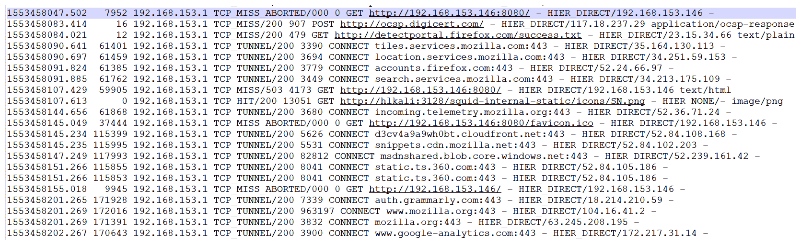

# 第八章：调查和分析日志

到目前为止，我们主要处理的是通过网络嗅探和监控获取的网络数据包。然而，也有一些情况下，单纯的数据包分析可能不够，我们需要从日志中获取输入。在典型的网络中，日志可以无处不在。考虑到，当你浏览互联网时，你会在系统、网络交换机、路由器、主 DNS、ISP、代理服务器、请求资源的服务器以及其他许多地方留下日志，这些地方可能是你通常不会想到的。本章中，我们将处理多种日志类型，并收集输入以帮助我们的网络取证练习。

在本章中，我们将覆盖以下关键主题：

+   网络入侵与足迹

+   案例研究——篡改的服务器

然而，在继续之前，让我们通过分析`ssh_cap.pcap`文件，了解日志分析的需求以及它在网络取证场景中的应用。

# 技术要求

为了跟随本章中的练习，我们将需要以下内容：

+   在 Windows 10 操作系统/ Ubuntu 14.04 上安装 Wireshark v3.0.0 ([`www.wireshark.org/download.html`](https://www.wireshark.org/download.html))。

+   你可以从[`github.com/nipunjaswal/networkforensics/tree/master/Ch8`](https://github.com/nipunjaswal/networkforensics/tree/master/Ch8)下载本章中使用的代码和 PCAP 文件。

+   在 VMWare Player/VirtualBox 上安装 Kali 操作系统。你可以从[`www.offensive-security.com/kali-linux-vm-vmware-virtualbox-image-download/`](https://www.offensive-security.com/kali-linux-vm-vmware-virtualbox-image-download/)下载。

+   Python（已安装在 Kali Linux 上）。

# 网络入侵与足迹

假设我们已经收到一个 PCAP 文件用于分析，并且收到了来自 Linux 服务器的一些日志。通过在 Wireshark 中分析该文件，我们得到以下数据包信息：


看起来数据属于**安全外壳协议**（**SSH**），通过浏览 Wireshark 中的**统计** | **会话**，我们得到以下信息：


PCAP 文件中主要有两个主机，分别是`192.168.153.130`和`192.168.153.141`。我们可以看到目标端口是`22`，这是一个常用于 SSH 的端口。然而，这看起来不像标准的 SSH 连接，因为源端口不同且数量很多。此外，端口号不属于知名端口（`1`-`1024`）和已注册端口（`1024`-`41951`）范围内。这种行为对于暴力破解攻击的例子来说是很常见的。

然而，我们目前并不确定。让我们继续滚动 PCAP 并进一步调查，具体如下：


从前面的截图我们可以看到有大量的密钥交换发生。然而，目前没有一个可靠的方式来判断攻击者是否成功进行了暴力破解攻击。

我们可以比较长度，但不同的服务器可能发送不同的信息，因此这样做并不那么可靠。

# 调查 SSH 日志

我们刚才看到一个问题，我们无法通过 PCAP 分析区分暴力破解尝试。导致这种失败的原因之一是存在加密，且我们无法看出加密内容的差异。我们来检查一下服务器上的 SSH 登录日志，看看能否了解发生了什么。

Linux 中的 SSH 认证日志通常存储在 `/var/log/access.log` 文件中。

我们来打开 `raw access.log` 文件，看看是否能发现一些有趣的信息：


哎呀！认证失败次数太多了。这是一次暴力破解攻击。我们来检查一下攻击者是否成功访问了服务器：


对日志文件进行简单的文本搜索，查找 `"Accepted"`，即可显示出 SSH 服务接受了密码，表示认证成功。查看 `auth.log` 文件中的成功认证记录，我们得到以下信息：


我们可以看到一个成功的会话为 root 用户打开，但随即被断开，攻击继续进行。攻击者使用了一个自动化的暴力破解工具，破解密码后并没有停止。

如果你还没有注意到，有一件事需要留意——PCAP 文件中的数据包和日志之间存在时间差。这可能是由于 SSH 服务器的时间和监控系统的时间（PCAP 文件被记录的系统）不一致导致的。我们来使用 `editcap` 修正数据包到达的时间，如下所示：


你也可以通过 **编辑** | **时间偏移...** 菜单项在 Wireshark 中编辑时间

由于本章第一张截图中的时间和日志中时间相差正好 +2:30 小时，我们需要调整这个时间。正如前面截图所示，我们正在使用 `editcap` 通过添加 `9000` 秒（2:30 小时的秒数）来编辑当前时间。我们创建了一个新文件 `ssh_adjusted.pcap`，并调整了时间。我们来在 Wireshark 中打开它，如下所示：


我们现在可以看到根据日志调整后的时间，准确地看到在特定时间发生了什么。我们看到在 `53100` 端口上，SSH 的数据包有大量通信。通过过滤流，我们可以得到以下内容：


TCP 流 35、36 和 37 各自有 25 个数据包，而其他流有 42 个数据包。让我们打开对话，具体如下：


我们可以看到，对于大多数流，数据包的相对数量是 42，而在我们从 SSH 日志获得的时间框架内，数据包的数量不同，表示成功尝试时的变化。

我们可以看到，通过学习日志分析的洞察力以及网络数据包分析，我们可以更好地理解本来无法获得的网络证据。除了 SSH，HTTP 代理（如 HaProxy 和 Squid）在行业中的使用非常广泛，这使得它们也成为日志分析的理想选择。让我们在接下来的章节中查看一些示例。

# 调查网页代理日志

在本书的前半部分，我们已经看过了一些网页代理的例子。让我们继续深入研究。在接下来的示例中，我们将尝试解读在学习日志分析时可能发生的情况。我们将分析由 Squid 代理服务器生成的`prox_access.log`文件，具体如下：

```
    1553457412.696      0 192.168.153.1 NONE/000 0 NONE error:transaction-end-before-headers - HIER_NONE/- -
    1553457545.997     66 192.168.153.1 TCP_TUNNEL/200 39 CONNECT www.google.com:443 - HIER_DIRECT/172.217.167.4 -
    1553457546.232    102 192.168.153.1 TCP_TUNNEL/200 39 CONNECT www.google.com:443 - HIER_DIRECT/172.217.167.4 -
    1553457546.348     16 192.168.153.1 TCP_TUNNEL/200 39 CONNECT www.google.com:443 - HIER_DIRECT/172.217.167.4 -
    1553457580.022      0 192.168.153.1 TCP_DENIED/403 3974 CONNECT www.google.com:4444 - HIER_NONE/- text/html
    1553457656.824  94709 192.168.153.1 TCP_TUNNEL/200 3115 CONNECT bam.nr-data.net:443 - HIER_DIRECT/162.247.242.18 -
    1553457719.865 172055 192.168.153.1 TCP_TUNNEL/200 4789 CONNECT adservice.google.com:443 - HIER_DIRECT/172.217.167.2 -
    1553457719.867 171746 192.168.153.1 TCP_TUNNEL/200 4797 CONNECT adservice.google.co.in:443 - HIER_DIRECT/172.217.167.2 -
    1553457719.868 171394 192.168.153.1 TCP_TUNNEL/200 3809 CONNECT googleads.g.doubleclick.net:443 - HIER_DIRECT/172.217.167.2 -
    1553457729.872 173364 192.168.153.1 TCP_TUNNEL/200 4025 CONNECT c.go-mpulse.net:443 - HIER_DIRECT/104.108.158.205 -
    1553457734.884 171351 192.168.153.1 TCP_TUNNEL/200 3604 CONNECT pubads.g.doubleclick.net:443 - HIER_DIRECT/172.217.31.2 -
    1553457750.870 203722 192.168.153.1 TCP_TUNNEL/200 74545 CONNECT www.google.com:443 - HIER_DIRECT/172.217.167.4 -
    1553457797.787  78332 192.168.153.1 TCP_TUNNEL/200 6307 CONNECT ml314.com:443 - HIER_DIRECT/52.207.7.144 -
    1553457837.347  92073 192.168.153.1 TCP_TUNNEL/200 3115 CONNECT bam.nr-data.net:443 - HIER_DIRECT/162.247.242.18 -
    1553457886.866 170431 192.168.153.1 TCP_TUNNEL/200 7595 CONNECT trc.taboola.com:443 - HIER_DIRECT/151.101.10.2 -
    1553457913.119     71 192.168.153.1 TCP_TUNNEL/200 39 CONNECT www.google.com:443 - HIER_DIRECT/216.58.196.196 -
```

从之前的日志中我们可以看到，`192.168.153.1`正在向 Squid 代理服务器发送大量请求。然而，为了高效分析 Squid 日志，我们应关注以下标签：

| **类型** | **详情** |
| --- | --- |
| HIT | 响应是从缓存中生成的。 |
| MEM | 一个附加标签，表示响应对象来自内存缓存，避免了磁盘访问。仅在 HIT 响应中看到。 |
| MISS | 响应直接来自网络。 |
| DENIED | 请求被拒绝。 |
| TUNNEL | 请求通过二进制隧道完成。 |

此外，我们还可以遇到以下错误条件：

| **类型** | **详情** |
| --- | --- |
| ABORTED | 由于连接被中止，响应未完成。 |
| TIMEOUT | 由于连接超时，响应未完成。 |
| IGNORED | 响应被忽略，因为它比缓存中的内容要旧。 |

Squid 代理代码在[`wiki.squid-cache.org/SquidFaq/SquidLogs`](https://wiki.squid-cache.org/SquidFaq/SquidLogs)中有很好的解释。参考这些附加代码，以便解释像`HIER_DIRECT`这样的示例代码，表示对象是直接从源服务器获取的。同时，HIER 表示层次结构代码。

了解了这些响应后，让我们手动分析日志文件并找出一些有趣的事实：



我们可以看到，从上面的截图中，第一个条目是`TCP_MISS_ABORTED`，这表示响应原本应该从网络中生成，但由于请求被取消，因此被中止。

第三次访问`detectportal.firefox.com`是`TCP_MISS`，这意味着响应是直接从网络生成的，而不是从代理缓存中获取的。

我们还可以看到`TCP_TUNNEL`用于基于 HTTPS 的请求。让我们再查看一些日志：


哇！我们可以看到一个来自`192.168.153.141`到`192.168.153.146`的`TCP_DENIED`请求，端口是`4444`和`80`。`4444`端口通常被利用工具如 Metasploit 使用，从这些日志条目我们可以推断，`192.168.153.141`最初尝试通过`4444`端口连接回`192.168.153.146`，然后切换到`80`端口。这种情况是反向 Shell 的标志，说明被利用的服务正在尝试连接回去。记下时间戳后，我们可以开始在 PCAP 证据或系统证据中进行匹配。

我们始终可以使用自动化日志分析器，如 Sawmill，来解析各种日志格式，而且不必担心手动转换时间戳。

# 调查防火墙日志

工业级防火墙为网络活动提供了大量的见解，不仅仅是原始日志，它们通常能提供卓越的结果。像 Fortinet、Check Point 等防火墙每天都会向管理员提供深度流量分析。让我们看一下 Fortinet 防火墙生成的报告，如下所示：


我们在前面的截图中看到各种威胁。有很多失败的攻击尝试被防火墙拦截，包括 HTTP XXE 攻击、代理、mimikatz 和访问的各种恶意网站。让我们看一些更详细的信息：


我们从前面的截图中可以看到，列出了网络中的病毒感染排行、病毒受害者排行以及攻击排行。此外，我们还可以看到攻击的方向，如下所示：


上述日志报告是由 Fortinet 防火墙生成的。除了提供与攻击和恶意软件相关的详细信息外，防火墙还提供了流量统计的趋势，如下图所示：


我们可以在前面的截图中看到报告中的大量统计数据。这些日志可以从网页面板进一步分析。展示前述报告的目的是说明，有时你不需要重新发明轮子，也不需要在有报告可供查看的情况下进行深入分析，从而揭示大量信息。此外，Fortinet 的 FortiGate 日志的原始格式如下：


我们可以看到 FortiGate 日志提供了足够的信息，如源 IP、目的 IP、端口、攻击类型以及其他各种信息。

# 案例研究 – 被篡改的服务器

假设我们需要调查一台被攻击者入侵并篡改的服务器。管理团队已经实施了所有的措施，如日志记录和完整的数据包捕获。然而，似乎有人也清除了日志，从其**修改时间、访问时间、创建时间、执行时间**（**MACE**）属性来看是这样的。正如以下日志集所示，Apache 日志中的条目非常少：

```
    192.168.153.1 - - [25/Mar/2019:14:43:47 -0400] "GET /site/ HTTP/1.1" 200 701 "-" "Mozilla/5.0 (Windows NT 10.0; Win64; x64; rv:66.0) Gecko/20100101 Firefox/66.0"
    192.168.153.1 - - [25/Mar/2019:14:43:47 -0400] "GET /icons/blank.gif HTTP/1.1" 200 431 "http://192.168.153.130/site/" "Mozilla/5.0 (Windows NT 10.0; Win64; x64; rv:66.0) Gecko/20100101 Firefox/66.0"
    192.168.153.1 - - [25/Mar/2019:14:43:47 -0400] "GET /icons/folder.gif HTTP/1.1" 200 509 "http://192.168.153.130/site/" "Mozilla/5.0 (Windows NT 10.0; Win64; x64; rv:66.0) Gecko/20100101 Firefox/66.0"
    192.168.153.1 - - [25/Mar/2019:14:43:47 -0400] "GET /icons/back.gif HTTP/1.1" 200 499 "http://192.168.153.130/site/" "Mozilla/5.0 (Windows NT 10.0; Win64; x64; rv:66.0) Gecko/20100101 Firefox/66.0"
    192.168.153.1 - - [25/Mar/2019:14:43:49 -0400] "GET /site/includes/ HTTP/1.1" 200 1219 "http://192.168.153.130/site/" "Mozilla/5.0 (Windows NT 10.0; Win64; x64; rv:66.0) Gecko/20100101 Firefox/66.0"
    192.168.153.1 - - [25/Mar/2019:14:43:49 -0400] "GET /icons/unknown.gif HTTP/1.1" 200 528 "http://192.168.153.130/site/includes/" "Mozilla/5.0 (Windows NT 10.0; Win64; x64; rv:66.0) Gecko/20100101 Firefox/66.0"
    192.168.153.1 - - [25/Mar/2019:14:43:49 -0400] "GET /icons/text.gif HTTP/1.1" 200 512 "http://192.168.153.130/site/includes/" "Mozilla/5.0 (Windows NT 10.0; Win64; x64; rv:66.0) Gecko/20100101 Firefox/66.0"
    192.168.153.1 - - [25/Mar/2019:14:43:49 -0400] "GET /icons/compressed.gif HTTP/1.1" 200 1323 "http://192.168.153.130/site/includes/" "Mozilla/5.0 (Windows NT 10.0; Win64; x64; rv:66.0) Gecko/20100101 Firefox/66.0"
    192.168.153.1 - - [25/Mar/2019:14:44:09 -0400] "GET /site/includes/server.php HTTP/1.1" 200 148 "-" "-"
    192.168.153.1 - - [25/Mar/2019:14:44:17 -0400] "GET /site/includes/server.php HTTP/1.1" 200 446 "-" "-"
    192.168.153.1 - - [25/Mar/2019:14:44:26 -0400] "GET /site/includes/server.php HTTP/1.1" 200 156 "-" "-"
    192.168.153.1 - - [25/Mar/2019:14:45:20 -0400] "GET /site/includes/server.php HTTP/1.1" 200 2493 "-" "-"
    192.168.153.1 - - [25/Mar/2019:14:58:44 -0400] "GET /site/includes/server.php HTTP/1.1" 200 148 "-" "-"
    192.168.153.1 - - [25/Mar/2019:14:58:49 -0400] "GET /site/includes/server.php HTTP/1.1" 200 446 "-" "-"
    192.168.153.1 - - [25/Mar/2019:14:59:05 -0400] "GET /site/includes/server.php HTTP/1.1" 200 147 "-" "-"
...
```

看起来攻击来自`192.168.153.1`这个 IP 地址。然而，通过查看前面的日志细节，我们可以看到大多数请求中没有用户代理信息。此外，由于请求类型是`GET`，并且没有涉及任何参数，所以在被黑服务器上也没有数据被提交。很奇怪，对吧？参数里一定有什么东西。

到目前为止，大多数日志看起来像是合法的文件访问请求。没什么特别的。但是，为什么攻击者会向没有参数的资源页面发送这么多`GET`请求呢？也许是因为我们看得不对。让我们打开 PCAP 文件看一下捕获的数据：


这看起来像是一个正常的 HTTP GET 请求。然而，向下滚动一点，我们可以看到只有几个条目：


我们可以看到从被攻击的`192.168.153.130`服务器发出的请求到达了`192.168.153.142`。用户代理是`wget`，所以我们可以假设文件已经被下载到该服务器。接下来，我们将按以下方式调查此事：


从 HTTP 流中看，似乎一个 ELF 文件被下载到了被攻陷的服务器。我们将详细调查这个文件。但首先，让我们看看那些看似简单的`GET`请求揭示了什么：


哦！看起来后门代码就藏在 cookie 里，这就是它为什么没有出现在 Apache 日志中的原因。我们可以看到它看起来像是`dir`命令的输出。这是不是就是服务器上文件被下载的原因呢？让我们通过解码 cookie 值来检查一下，具体操作如下：


通过 Base64 解码这个值，我们可以得到明文的命令。然而，我们希望看到攻击者执行的所有命令。我们可以使用 tshark 来完成这项任务，如下所示：


第一个命令过滤掉了所有的 cookies，因为我们在`http.cookie`过滤器中使用了`-R`选项。输出中包含了不需要的`'z='`字符，所以我们通过 Linux 的`cut`命令去除了它。我们将 tshark 的输出保存到一个名为`base`的文件中。

在下一个命令中，我们使用了`while`循环逐行读取并打印每一行，同时这些行应当经过 Base64 解码。我们可以看到结果显示攻击者执行了以下操作：

1.  输出`1`

1.  列出了查看目录内容的命令

1.  运行了`whoami`命令以查看当前用户

1.  发出了`ls -la`命令以查看所有文件，包括隐藏文件

1.  发出了`wget`命令，从另一个服务器下载一个文件，这个文件可能也是后门

1.  再次尝试相同的操作，打印了一些 1 并再次列出目录

1.  再次尝试下载该文件，但这次将其保存为`shell.txt`，并对`shell.txt`进行了重复操作

1.  尝试下载`shell.e`文件

1.  再次尝试下载`shell.zip`文件

1.  尝试打印出 IP 地址、PHP 版本、禁用的 PHP 函数等信息

需要注意的一点是，攻击者并没有执行可能是本地漏洞的 shellcode 文件来获得高权限。此外，看起来他们的下载尝试失败了。然而，我们在 PCAP 中看到有文件被传输。让我们进一步调查一下：


我们只选择了这个数据包的响应。通过从**显示并保存数据为**选项中选择原始（raw），然后点击**保存**按钮，我们可以将其保存，如下所示：


此外，为了成功重建文件，我们必须移除 ELF 魔术头之前的所有内容。保存文件后，在记事本中打开它，删除服务器头部，并按如下所示保存文件：


现在我们已经移除了额外的头部信息，我们有了可供恶意软件分析团队分析的可执行文件。然而，当我们尝试在 Hybrid Analysis 上进行分析时，我们什么也没得到，如下图所示：


文件分析链接为[`www.hybrid-analysis.com/sample/d8fbd529d730901f7beff5c4a8057fd19057eb7c7a0447264babca573c4c75d5`](https://www.hybrid-analysis.com/sample/d8fbd529d730901f7beff5c4a8057fd19057eb7c7a0447264babca573c4c75d5)。

我们看到从文件中什么也没得到。然而，通过日志分析和 PCAP 分析，我们得到了大量的输入和强有力的证据。我们在本章中一直看到，日志分析和 PCAP 分析是相互依赖的。我们还看到 SSH 日志依赖于日志，服务器日志依赖于 PCAP，才能揭示更多攻击信息。

# 总结

在本章中，我们处理了各种日志类型并收集了输入，帮助我们进行网络取证练习。在下一章中，我们将学习如何识别恶意接入点，攻击者可以通过它查看你所有的通信日志，我们还将研究如何识别并物理找到这些恶意设备的策略。

# 问题与练习

+   重复本章中涵盖的练习

+   尝试调查你的家庭路由器的日志

+   完成 Git 仓库中的日志分析挑战 5

# 进一步阅读

为了最大限度地利用本章内容，请阅读以下教程：

+   欲了解更多关于 Apache 日志分析的信息，请参见[`www.keycdn.com/support/apache-access-log`](https://www.keycdn.com/support/apache-access-log)

+   欲了解更多关于日志聚合的信息，请参见[`stackify.com/log-aggregation-101/`](https://stackify.com/log-aggregation-101/)
