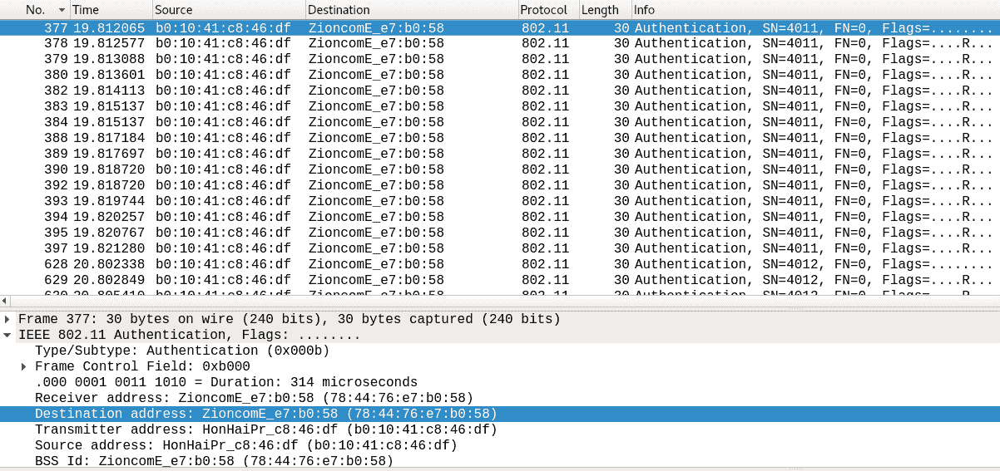
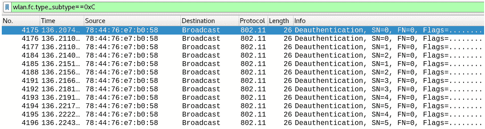

# 第九章：WLAN 取证

无线局域网的使用已成为我们生活中不可或缺的一部分。我们对其的依赖意味着，犯罪分子利用无线网络入侵你的 Wi-Fi 并窃取所有数据、通过你的网络摄像头查看日常活动，或在企业环境中访问关键数据服务器，已经变得司空见惯。一旦网络犯罪分子进入你的网络（或强迫你进入他们的网络），他们能做的事情几乎是无穷无尽的。

在本章过程中，我们将学习如何识别流氓接入点，这些接入点可能允许攻击者查看你的所有通信内容。我们还将探讨识别并物理定位这些流氓设备的策略。我们还会了解攻击者在进行高级攻击时可能采取的一些攻击模式。我们还将学习当犯罪分子伪造其 MAC 地址时该如何处理，这是在 Wi-Fi 犯罪中使用的最重要的技术之一。在进行本章的练习之前，让我们先了解一些关于无线 802.11 标准的基本知识，以及在无线取证练习中将帮助我们的数据包类型。

本章将涵盖以下主题：

+   802.11 标准

+   数据包类型和子类型

+   定位无线设备

+   识别流氓接入点

+   识别攻击

+   案例研究——识别攻击者

# 技术要求

跟随本章练习，我们需要以下设备：

+   Wireshark v3.0.0 ([`www.wireshark.org/download.html`](https://www.wireshark.org/download.html)) 安装在 Windows 10 操作系统/ Ubuntu 14.04 上。

+   你可以从[`github.com/nipunjaswal/networkforensics/tree/master/Ch9`](https://github.com/nipunjaswal/networkforensics/tree/master/Ch9)下载本章中使用的代码和 PCAP 文件。

+   安装 VMWare Player/VirtualBox，并安装 Kali 操作系统。你可以从[`www.offensive-security.com/kali-linux-vm-vmware-virtualbox-image-download/`](https://www.offensive-security.com/kali-linux-vm-vmware-virtualbox-image-download/)下载。

+   Aircrack-ng 套件（已包含在 Kali Linux 中）。

+   一个外部无线网卡（TP-Link WN722N/Alfa 卡）。

+   Python（已安装在 Kali Linux 中）。

# 802.11 标准

802.11 标准指的是 IEEE 为无线局域网定义的一系列规范。802.11 标准描述了客户端与基站之间，或任意两个无线客户端之间的空中接口。802.11 系列标准包含多个版本，如下所示：

+   **802.11**：802.11 使用 1-2 Mbps 的传输速率，通过**跳频扩频**（**FHSS**）或**直接序列扩频**（**DSSS**）进行传输。

+   **802.11a**：速度从 1-2 Mbps 提升到在 5 GHz 频段下的 54 Mbps。它不使用 FHSS 或 DSSS，而是使用正交频分复用（OFDM）编码。

+   **802.11b**：该标准在 2.4 GHz 频段下有 11 Mbps 的传输速度，并且仅使用 DSSS。

+   **802.11g**：该标准在 2.4 GHz 频段下提供高达 54 Mbps 的传输速度。

+   **802.11n**：*n* 标准新增了 **多输入多输出**（**MIMO**）。其速度超过 100 Mbit/s。

+   **802.11ac**：该标准的速度为 433 Mbps 至 1.3 Gbps，仅在 5 GHz 频段下工作。因此，拥有正确的 Wi-Fi 适配器对于捕获 2.4 GHz 和 5 GHz 频段上的流量至关重要。

了解无线标准的工作原理后，让我们在下一部分中看看无线取证场景中可能出现的证据类型。

# 无线证据类型

无线调查的证据通常会以 PCAP 文件或无线接入点的日志形式出现。然而，在实际环境中，您可以使用 **aircrack-ng** 套件设置捕获。我们在前几章使用的 aircrack-ng 套件允许我们将无线网络卡置于混杂模式，在该模式下我们可以捕获无线网络中的活动。

让我们通过以下步骤来看看如何完成这个操作。我们将使用一台安装了 Kali Linux 的 Windows 10 主机笔记本电脑：

1.  首先，我们将连接外部 Wi-Fi 网卡，这是一个 TP-Link TL-WN722M 150 Mbps 高增益外部 USB 适配器。将其连接到笔记本电脑后，我们会看到以下信息：


1.  点击“确定”，然后在 Kali Linux 机器上打开一个终端，如下所示：


1.  执行 `iwconfig` 命令后，我们可以看到无线接口已经可用。

1.  接下来，我们需要将其切换到监控模式。我们可以使用 `airmon-ng` 工具，通过执行 `airmon-ng start wlan0` 命令将无线接口置于监控模式，如下所示：


1.  通过输入 `airmon-ng` 命令，然后跟上 `start` 和我们的无线接口标识符，airmon-ng 为我们创建了一个名为 `wlan0mon` 的虚拟接口。我们可以通过再次输入 `iwconfig` 命令来验证这一点，如下所示：


我们可以看到接口已成功创建，并处于 `Monitor` 模式。

# 使用 airodump-ng 监听空中信号

让我们通过使用 aircrack 套件中的另一个工具 `airodump-ng` 来进行调查，如下所示：


通过输入 `airodump-ng wlan0mon` 命令，开始嗅探我们周围的无线网络，同时不断跳转到不同的频道。这将为我们提供一个列表，列出附近可用的多个无线网络。屏幕上半部分的列表显示了具有 BSSID（接入点的 MAC 地址）和 ESSID（网络名称）以及其他许多详细信息的无线接入点。屏幕下半部分显示了站点，即终端设备。

我们还可以看到之前的列表中包含了`CH`，即接入点正在使用的频道号。频道实际上是频率，频道 1 为 2,412 MHz，频道 14 为 2,484 MHz。频道之间相隔 5 MHz，这意味着如果频道 1 为 2,412 MHz，那么频道 2 为 2,417 MHz，频道 3 为 2,422 MHz，依此类推。

此外，我们有一个`PWR`字段，用于表示功率。较低的功率值意味着接入点离我们的无线接口较远。我们可以看到无线网络`VIP3R`的`PWR`值为`-51`，这意味着它离我们非常近，而接入点`dlink-DAD9_EXT`则离我们非常远，功率值最低。功率值在物理定位设备时非常重要，尤其是在建筑物或楼层中。

此外，我们还可以看到之前列表中显示了加密类型、密码算法、认证类型等信息。在下方窗格中，我们可以看到连接到列出 Wi-Fi 接入点的设备。

我们通过以下命令来捕获所有来自单个无线网络 VIP3R 的详细信息：

```
airodump-ng wlan0mon --bssid 78:44:76:E7:B0:58 -c 11 -w viper

```

在上述命令中，我们使用了`-bssid`开关，仅过滤来自`78:44:76:E7:B0:58`（VIP3R）接入点的数据包，并且使用`-c 11`开关仅捕获 11 频道的数据。我们还选择将所有输出写入一个名为`viper`的文件，使用的是`-w`开关。该命令将返回以下详细信息：


我们可以通过运行命令来查看先前截图中列出的详细信息。我们可以看到三台设备连接到接入点，并且还有一个**WPA 握手**。WPA 握手意味着有人尝试与无线网络进行身份验证。如果在 WPA 握手后设备数量增加，通常意味着认证成功；如果没有增加，则意味着认证失败。同样，找到设备可以通过 PWR 信号来完成。通常，攻击者通过两种不同方式捕获 WPA 握手：

+   听取别人尝试认证时的情况

+   有意强制断开连接的设备并允许它们重新连接

攻击者将通过暴力破解握手以找到网络密码并访问网络。我们看到，当我们停止捕获时，`airodump-ng`立即创建了捕获文件，并通过`ls -la`命令列出了其他一些文件，如下图所示：


让我们通过执行`wireshark viper-01.cap &`命令在 Wireshark 中打开捕获的（`.cap`）文件，并从**无线**选项卡中选择 WLAN 流量：


我们将看到无线流量的统计信息，如前面的截图所示。此外，airodump 也会捕获到其他网络。让我们对我们的无线接入点的 MAC 地址应用过滤器，具体如下：


好吧，我们可以看到，使用`wlan.addr`后接接入点的 MAC/BSSID，可以过滤出所有与**接入点**（**AP**）相关的数据包。我们可以看到，MAC 地址以`2c:33:61:xx:xx:xx`开头的客户端来自一台苹果设备。此外，所有的基站和 MAC 地址都可以通过 Wireshark 中的 Resolved Addresses 选项解析出其类型，如下图所示：


我们可以看到，通过 Wireshark 无法准确统计出我们的 AP 与多少站点通信。让我们使用`tshark -r viper-01.cap -2 -R wlan.da==78:44:76:e7:b0:54 -T fields -e wlan.sa | sort | uniq`来帮助我们，结果如下：


`tshark`工具通过读取`-r`开关中的文件运行，并使用过滤器`wlan.da==78:44:76:e7:b0:54`作为目标地址，同时仅通过`-T fields`和`-e wlan.sa`开关打印`wlan`源。利用输出，我们使用`sort`和`uniq` Linux 命令对结果进行排序并打印唯一项。

如果前述命令出现 LUA 错误，请通过编辑`/usr/share/Wireshark/init.lua`文件的第 29 行，设置`disable_lua=true`来禁用 LUA。

我们可以在[`macvendors.com/`](https://macvendors.com/)查看找到的 MAC 地址，如下所示：


此外，由于 MAC 厂商提供了 API，我们可以随时开发一个不错的 Python 脚本来帮我们进行 MAC 地址检查。你可以查看[`macvendors.co/api/python`](https://macvendors.co/api/python)上的一个脚本。

# 数据包类型和子类型

在我们深入了解数据包类型和子类型之前，先来看看我们连接到 Wi-Fi 接入点时会发生什么。在这个演示中，我们将使用**TP-Link 路由器**和一部苹果 iPhone 7。我将尝试从手机连接到 VIP3R 网络，但不会使用正确的密码。请看以下截图：


通常，当我们在 iPhone 或其他手机上打开设置时，我们会开始看到手机附近的网络。这是因为每个接入点不断地发送信标帧来表示其存在。为了让手机了解更多关于网络的信息，会向接入点发送探测请求。我们可以看到，我们的 Wi-Fi 接入点（`78:44:76:E7:B0:58`）向 iPhone 发送了一个探测响应（8155），其中包含了站点参数和支持的速率。

接下来，iPhone 启动认证过程，路由器对此做出了响应。通常，认证请求/响应由两个通信设备之间交换的几个数据包组成。

接下来，iPhone 发送关联请求（8162）以将自己与网络关联，路由器则返回一个带有关联 ID 的关联响应（8164）。然后，发生密钥交换过程，由于密钥错误，路由器向 iPhone 发送一个解除关联数据包，表示尝试失败并立即中断关联。既然我们现在知道这些过程是如何工作的，接下来我们将详细讨论无线 802.11 帧的类型。

我们主要有数据帧、管理帧和控制帧在 802.11 标准中。从纯粹的取证角度来看，我们最常接触到的是管理帧。以下表格突出显示了帧的类型及其子类型：

| **数据包类型** | **用途** |
| --- | --- |
| **类型** | **子类型** |
| 0 | mgmt | 0 | 关联请求 | 发射器必须已通过认证，才能成功与接入点建立关联。 |
| 0 | mgmt | 1 | 关联响应 | 对关联请求的响应是关联响应。如果请求成功，响应数据包将包含一个被称为关联 ID 的标识符。 |
| 0 | mgmt | 10 | 重新关联请求 | 这类似于关联请求，但该数据包类型在存在时间间隙或站点移动到另一个接入点时发送。 |
| 0 | mgmt | 11 | 重新关联响应 | 这类似于关联响应。 |
| 0 | mgmt | 100 | 探测请求 | 用于主动检查任何或特定的接入点。 |
| 0 | mgmt | 101 | 探测响应 | 响应包含站点参数和支持的数据速率。 |
| 0 | mgmt | 1000 | 信标 | 信标数据包是由 AP 持续发送的指示数据包，表示其在网络中的存在。信标帧也有助于查找恶意接入点。 |
| 0 | mgmt | 1010 | 解除关联 | 该数据包是一种通知，表示现有的关联已被断开。 |
| 0 | mgmt | 1011 | 认证 | 认证数据包在两个端点之间反复发送，以建立真实性。 |
| 0 | mgmt | 1100 | 取消认证 | 这是一条公告消息，声明接收方不再经过认证。 |

欲了解更多关于无线数据包类型和子类型的信息，请参考[`www.savvius.com/networking-glossary/wireless_lan_overview/wlan_packet_types/`](https://www.savvius.com/networking-glossary/wireless_lan_overview/wlan_packet_types/)。

我们可以看到子类型的值是以二进制表示的。我们可以在 Wireshark 中使用其十六进制等效值，如下所示：


我们获得的关于数据包类型和子类型的信息将帮助我们在本章后半部分识别攻击模式。现在，让我们深入探讨这些练习。

想了解更多关于管理帧类型的信息，请参考 [`mrncciew.com/2014/09/29/cwap-802-11-mgmt-frame-types/`](https://mrncciew.com/2014/09/29/cwap-802-11-mgmt-frame-types/)。

# 定位无线设备

作为网络取证调查员，有时我们会遇到建筑物或楼层中的 rogue 设备。找到这些设备非常重要，因为它们可能包含有关攻击者和攻击本身的关键信息。Wi-Fi 也不例外。假设我们在网络中发现了一个 rogue 接入点。作为取证调查员，我们尝试找出该设备的位置。我们将利用一些脚本来完成这项任务。记得 `PWR` 字段在 airodump-ng 工具中的作用吗？我们需要开发类似的东西来持续轮询网络。为此，我们编写以下 Python 2.7 脚本：

```
#!/usr/bin/env python 
# Author: Nipun Jaswal
from prettytable import PrettyTable
import operator
import subprocess 
import os
import math
import re
import schedule
import time
def sniffer():

  # iwlist command to scan all the Access Points
  proc = subprocess.Popen('iwlist wlan0 scan | grep -oE "(ESSID:|Address:|Channel:|Quality=).*" 2>/dev/null', shell=True, stdout=subprocess.PIPE, ) 
  stdout_str = proc.communicate()[0]
  stdout_list=stdout_str.split('\n')

  #Declaring Lists
  network_name=[]
  mac_address=[]
  channel=[]
  signal=[]
  decibel=[]
  distance=[]
  frequency=[]

  #Reading all the Lines
  for line in stdout_list:
      line=line.strip()
      #Regex to Match ESSID Value
      match=re.search('ESSID:"(\S+)"',line) 
      if match: 
          network_name.append(match.group(1)) 
      #Regex to Match Channel Value
      match=re.search('Channel:(\S*)',line) 
      if match: 
            channel.append(match.group(1))
           #Calculating Frequency
           frequency.append(int(match.group(1))*5 + 2407)
      #Regex to Match Address Value
      match=re.search('Address:\s(\S+)',line)
      if match:
           mac_address.append(match.group(1))
      #Regex to Match Signal Value
      match=re.search('Signal level=(\S+)',line)
      if match:
           signal.append(match.group(1))
           # Sign Correctness
           decibel.append(abs(int(match.group(1))))
  i=0
  x = PrettyTable()
  x.field_names = ["ESSID", "MAC Address", "Channel", "Signal", "Distance","Frequency","Decibel"]
  os.system("clear")
  while i < len(network_name):
      # Free Space Path Loss (FSPL)
      distance= 10 ** ((27.55 - (20 * math.log10(int(frequency[i]))) + int(decibel[i]))/20)
      # Adding a Row to Pretty Table
      x.add_row([network_name[i],mac_address[i],channel[i],int(signal[i]),str(float(distance))+ " mtr",int(frequency[i]),int(decibel[i])])
      i=i+1
  print x.get_string(sort_key=operator.itemgetter(4, 0), sortby="Signal", reversesort=True)
  i=0

# Main Thread Starts
schedule.every(5).seconds.do(sniffer)
while 1:
    schedule.run_pending()
    time.sleep(1)
```

代码非常直观。我们使用了一个计划任务，每 5 秒运行一次无线扫描，使用 `iwlist` 命令。我们使用正则表达式过滤数据并通过 `PrettyTable` Python 模块显示结果。为了计算接入点和我们接口之间的距离，我们使用了 **自由空间路径损耗** (**FSPL**) 算法，以及 `PWR` 字段（功率/信号强度）和 `Frequency`（频道 ID）来计算距离，公式如下：

```
Distance From the Access Point in Meters = 10 ^ ((27.55 - (20 * log10 (frequency)) +decibel)/20) 
```

让我们使用前面的公式来计算一个在 11 频道上运行、功率值为 -56 的 VIP3R 接入点的读数。我们可以看到，要使前面的公式成立，我们需要两个值。对于`分贝`，我们将使用它的绝对值，即 56。为了计算 11 频道的频率，我们使用以下公式：

```
Frequency = channel number * gap + frequency of first channel - gap 
```

使用这些表达式，我们得到如下结果：

```
= 11 * 5 + 2412 - 5 
= 55+ 2407 = 2462 MHz 
```

因此，将这些值代入公式，我们得到如下结果：

```
distance= 10 ^ ((27.55 - (20 * log10(2462)) + 56)/20) 
distance= 6.11240259465 
```

好的，距离为 6.112 米，这几乎是准确的，考虑到从我当前写这篇文章的位置到我的无线路由器的距离。不过，需要注意的一点是，这个公式适用于自由空间路径损耗（free-space path loss），在有大量墙壁和物体阻隔的情况下，可能并不十分准确。

你可以参考一篇优秀的白皮书，了解各种物体类型引起的信号损耗及其数值，地址为 [`arxiv.org/pdf/1707.05554.pdf`](https://arxiv.org/pdf/1707.05554.pdf)。

让我们运行之前构建的 Python 脚本，看看当我们靠近接入点时，得到的值是什么，如下截图所示：


当我们稍微靠近接入点时，得到如下结果：


我们已经非常准确地测量了距离。现在我们知道如何使用 Linux 中的`iwlist`扫描命令的某些值来创建有助于无线网络取证的内容。

为了更精确的读取，您可以查看上下频率；了解更多信息请访问[`www.electronics-notes.com/articles/connectivity/wifi-ieee-802-11/channels-frequencies-bands-bandwidth.php`](https://www.electronics-notes.com/articles/connectivity/wifi-ieee-802-11/channels-frequencies-bands-bandwidth.php)。

# 识别恶意接入点

**恶意接入点**是一个日益受到关注的领域。攻击者对合法路由器执行**拒绝服务**（**DOS**）攻击，并设置一个具有相同 SSID 的假接入点，迫使站点连接到恶意接入点。攻击者可以通过多种方式设置假接入点。识别这些恶意 AP 是我们接下来要探讨的内容。

# MAC 地址明显变化

假设我们在附近有一个恶意接入点。使用`airodump-ng`捕获数据包，我们得到如下信息：


我们可以看到我们有两个配置相似的网络，而目前唯一能看到的变化是 BSSID（MAC 地址）和 MB（链路速度）。虽然 MB 是最明显的变化，让我们在 MAC 厂商网站上查看这两个 MAC 地址，如下所示：


我们可以看到左侧的地址来自 Zioncom，这是一家开发路由器的知名公司，而右侧的地址来自名为 Analog & Digital Systems 的公司，这不是一家路由器制造公司。然而，如果攻击者随机伪造了这个地址，他们可能是为了让它看起来像一个合法的厂商。此外，我们还发现，在`airodump-ng`结果列表中，MB 速率（最大速度）缺少了一个`e`。这个缺失的`e`表示该 AP 是否支持服务质量。我们从`airodump-ng`接口中还可以看出信标帧传输的速度。因此，综上所述，我们的第一次分析得出以下 IoC：

+   BSSID 的变化

+   BSSID 无法解析为合法的厂商（MAC 厂商）

+   数据速率的服务质量参数变化（缺少`e`表示不支持 QOS）

+   假 AP 发出的信标帧数量过多

尽管这些都是检测假 AP 时的关键检查，但我们**肯定**会继续寻找更多信息。

# 标记的外围

现在让我们在 Wireshark 中调查原始接入点和假接入点，找出原始接入点缺失或修改的详细信息，如下图所示：


看一下两个信标帧之间的差异，我们可以看到假 AP（左侧）缺少了大量信息，关键指标如下：

+   假 AP 的支持率明显低于原始 AP

+   假 AP 没有 ERP 信息

+   没有关于**高吞吐量**（**HT**功能/HT 信息）的详细信息

+   完全缺失厂商特定标签

此外，我们可以看到假 AP 没有任何与 WPS 相关的标签，而原始接入点则有；如今大多数 AP 都有 WPS 功能，而假接入点却没有。检查原始接入点的 WPS 标签，我们可以发现以下细节：


我们可以看到原始接入点有 WPS 标签和相关数据。

# 时间差分析

由于高级攻击者可以模拟解决前面章节中识别的多数红旗问题，我们需要一种有效的机制来识别非法接入点。我们将利用信标帧的时间差来识别假接入点。虽然假接入点试图通过伪造固定的信标间隔来欺骗分析系统，但时间差分析可以帮助我们准确地确定信标间隔。

一个真实的 AP 会生成一条几乎是直线的时间差图，而假 AP 则不是。我们来通过运行` tshark -r beacon-01.cap -2 -R "wlan.sa==7c:8b:ca:ea:27:52 && wlan.fc.type_subtype==0x08" -T fields -e frame.time.delta | head -n 20`来确认我们刚才说的内容，如下所示：


前面的命令运行` tshark`在`beacon-01.cap`文件上，并过滤掉所有来自`78:44:76:e7:b0:54`的信标帧，显示`time_delta`，即数据包到达时间与上一个数据包到达时间之间的差异。为了简洁起见，我们只显示前 20 条条目，可以看到大多数值接近 0.102 毫秒。

让我们对可疑接入点`00:20:30:40:43:21`做同样的操作：


好的！我们可以看到值之间有明显的差异：与原始接入点相比，可疑接入点的值非常不稳定。我们将前 100 个时间差值绘制成图表，看看两者之间的差异，如下图所示：


我们可以看到差异：与不稳定的假接入点相比，原始接入点保持了较为线性的状态。现在我们有了一个清晰的图景，了解如何区分原始接入点和假接入点。总结一下关键指标，我们有以下几个标志，可以很好地帮助我们识别假接入点与原始接入点的区别：

+   BSSID 发生变化

+   BSSID 无法解析为合法厂商（MAC 厂商）

+   数据速率服务质量（QoS）参数发生变化（缺少字母 e 表示不支持 QoS）

+   假 AP 发送的信标帧数量过多

+   假 AP 的支持率远低于原始 AP

+   假 AP 没有 ERP 信息

+   没有关于 HT 功能/HT 信息的细节

+   完全缺少供应商特定标签

+   时间增量值分析显示真实接入点的稳定图形

有时，由于延迟和数据包丢失，我们得到的增量值大约为 0.2、0.3 或 0.4。在这种情况下，我们应该将该值除以其相关的间隔。例如，对于值 0.204，我们将该值除以 2 得到 0.102，或者对于值 0.412，我们将该值除以 4 得到 0.103。

前述分析是基于使用 TP TL-WN722N 无线网卡创建的接入点，并且对于 Alfa 和其他网卡也具有类似的细节。然而，如果接入点是使用原始路由器本身创建的，这将带来额外的挑战，并且利用我们讨论过的所有技术将导致正确的分析。使用原始接入点进行恶意目的将具有不同的 MAC 地址，因为在原始接入点中伪造 MAC 地址并不容易。在高级攻击者模仿/伪造原始 MAC 的情况下，所有前述技术将至少检测到一些变化。

# 识别攻击

对无线局域网的攻击识别不像以太网网络那样简单。识别攻击者也不是直截了当的。在前面的练习中，我们看到了如何通过提供错误密码使 AP 生成对试图连接的站点的解关联响应。

让我们看看常用于无线局域网的更多攻击模式，如下列表所示：

+   伪造 AP 攻击

+   点对点攻击

+   窃听

+   破解加密

+   认证攻击

+   拒绝服务

# 伪造 AP 攻击

在前一节中，我们看到了如何识别恶意 AP。现在让我们看看这种攻击实际上是什么。在这种类型的攻击中，攻击者模仿原始接入点，并并行地将合法用户从原始接入点断开连接。在这种情况下，当站点尝试重新连接到网络时，它无法连接到原始接入点，而是连接到伪造的接入点。由于这种情况，所有网络数据经过恶意接入点传输，攻击者可以收集目标的敏感信息。

# 点对点攻击

在**点对点**攻击中，攻击者和目标位于同一网络上，例如公共热点，攻击者试图进行基于网络的攻击，例如利用网络应用程序中的漏洞。启用 SMB 的攻击是这类攻击的最常见例子。

# 窃听

将我们的接口设置为监视模式，静默捕获周围的所有数据，就像我们在第一个例子中做的那样，这被称为**窃听**。一旦数据被捕获，我们可以看到有多少站点连接到 AP，并计算它们之间的距离，甚至更进一步破解网络密钥，然后解密捕获的数据以揭示各个用户的活动。此类攻击的关键挑战在于我们无法检测到攻击者，因为他们的设备是被动运行的，正在收集数据。

# 破解加密

**有线等效隐私**（**WEP**）加密在 802.11 中非常弱，容易被破解。破解过程包括寻找 WEP 如何生成 RC4 密钥，即通过将 5 字节或 13 字节的密钥与 3 字节的 IV 值连接。此外，还包括寻找 RC4 如何处理这个密钥的初始置换，最后如何使用置换生成初始密钥流。攻击者可以看到 IV 值，并且密钥流中的第一个字节可能直接与密钥字节之一相关。因此，观察足够多的这些密钥字节，攻击者可以找出密钥。

# 身份验证攻击

WPA 和 WPA2（Wi-Fi 保护访问）容易受到密码破解攻击，尤其是当网络使用弱密码时。为了突破 WPA 启用的 AP，攻击者将使用以下技术：

+   **嗅探无线数据包**：这涉及将无线网卡设置为监视模式，监听并记录本地无线网络上发生的一切。

+   **等待客户端进行身份验证**：AP（接入点）使用四次握手与 WPA 无线客户端交换信息进行身份验证。通常，客户端需要证明自己是合法用户并拥有网络的密码。这个四次握手，或者说**局域网扩展认证协议**（**EAPOL**），以一种加密方式加密密码，AP 可以解密它并检查是否与网络上设置的密码匹配。

+   **使用暴力破解攻击**：记录了所有数据并获取了 EAPOL 数据包后，攻击者可以使用离线字典攻击对捕获的文件进行暴力破解密码。

这里一个重要的点是，如果网络上没有任何用户，或者没有任何用户连接到网络，那么攻击将会失败。然而，如果用户处于活动状态且已经认证，攻击者可以使用各种攻击方式，如去认证攻击，对网络 AP 或已连接的客户端发起攻击，迫使客户端的设备重新认证。

# 服务拒绝

利用去认证数据包，攻击者可以强制用户断开与接入点（AP）的连接。发送一个去认证数据包将迫使设备重新认证到接入点，在此过程中，攻击者可以捕获 WPA 握手信息。然而，如果攻击者连续发送多个去认证数据包，它们会制造一个拒绝服务的情况，使客户端长时间无法连接到接入点。

# 调查去认证数据包

在本节中，我们将分析一个示例捕获文件，涵盖对 WPA2 网络攻击的详细情况。将文件加载到 Wireshark 中后，我们可以看到文件中有 3,818 个数据包，如下图所示：


通过仅过滤管理帧，我们可以清除噪声，使用 `wlan.fc.type` 过滤器和值 `0x0`，如下所示：


我们可以看到剩下的只有 420 个数据包，而且在截图中可以看到大量的去认证数据包。让我们找找看哪个设备受到了这个去认证攻击并重新发起了密钥握手：



看起来 `b0:10:41:c8:46:df` 被去认证并重新发起了密钥交换。我们可以看到认证数据包从第 `377` 帧开始。让我们看看在此之前发生了什么：


我们可以看到大量的去认证数据包开始到达，这导致 MAC 地址为 `b0:10:41:c8:46:df` 的设备重新发起了连接。然而，我们无法在任何地方看到密钥数据包。让我们找找看它们在哪里：


只要在 `eapol` 上加个过滤器，我们就可以看到设备之间交换了密钥。拥有此文件的攻击者需要通过暴力破解来找到网络密钥。我们已经看到了如何收集有关去认证攻击的详细信息；然而，我们也注意到，我们并未找到原始攻击者的 MAC 地址，因为他们伪装成了受害者之一或接入点本身。

# 案例分析 – 确定攻击者

在本示例中，我们收到了两个捕获文件进行分析。我们首先分析第一个文件，如下所示：


我们可以看到链路类型为 802.11，这意味着我们正在调查一个 WLAN。让我们来看看这个网络中的端点：


从之前的统计数据中，我们可以看到有大量的去认证数据包被发送到广播地址。我们还可以看到两个设备，`54:99:63:82:64:f5` 和 `2c:33:61:77:23:ef`，都涉及了去认证，这意味着它们也可能收到了去认证数据包。让我们在 Wireshark 中检查一下，如下图所示：



我们可以看到，第一个去认证数据包是在帧 4175 广播的。通常，去认证数据包会包含原因代码：来自未关联 STA 的类 3 帧（0x0007），这种情况大多发生在强制去认证时。在接收到去认证数据包后，站点会做出如下响应：


站点提到的原因是 `Deauthenticated`，因为发送 STA 正在离开（或已离开）IBSS 或 ESS（0x0003）。最后，所有客户端都被去关联，截图如下所示：


我们来看一下站点交换密钥的尝试，攻击者可能已经捕获了这些信息：


我们简单地使用过滤器 `-2 -R "eapol"` 来查看密钥交换，然后打印出 WLAN 目标地址，对其进行排序，找到唯一的条目。接下来我们需要确认是否有其他新的认证，除了这四个地址。让我们调查第二个 PCAP，如下所示：


在第二个 PCAP 文件上运行相同的 `tshark` 命令时，我们可以看到一个新的 MAC 地址已经在网络上进行认证。让我们检查它是否成功：


查找认证类型的数据包时，我们可以看到认证成功。值得注意的是，在 PCAP 文件中没有去认证或去关联的迹象。我们来看一下通过 **Statistics** | **Capture File Properties** 获取的时间线概览，如下所示：

+   **2019 年 3 月 10 日 08:18:04.380420000 EDT**：文件捕获已开始，捕获了第一个数据包

+   **2019 年 3 月 10 日 08:20:20.587840000 EDT**：`78:44:76:e7:b0:58` 广播了第一个去认证数据包

+   **2019 年 3 月 10 日 08:20:20.688171000 EDT**：站点开始认证（`2c:33:61:77:23:ef`，`54:99:63:82:64:f5`，和 `b0:10:41:c8:46:df`）

+   **2019 年 3 月 10 日 08:20:20.691243000 EDT**：`b0:10:41:c8:46:df` 发送了第一个重关联请求

+   **2019 年 3 月 10 日 08:20:20.696323000 EDT**：所有站点开始密钥交换

+   **2019 年 3 月 10 日 08:20:22.850949000 EDT**：站点停止认证（`2c:33:61:77:23:ef`，`54:99:63:82:64:f5`，和 `b0:10:41:c8:46:df`）

+   **2019 年 3 月 10 日 08:20:25.684608000 EDT**：去认证停止

+   **2019 年 3 月 10 日 08:20:27.285187000 EDT**：所有站点开始去关联

+   **2019 年 3 月 10 日 08:20:27.847874000 EDT**：所有站点的密钥交换已结束

+   **2019 年 3 月 10 日 08:20:28.847362000 EDT**：去关联结束

+   **2019 年 3 月 10 日 08:23:44.857619000 EDT**：一个之前未见过的新 MAC 地址（`f0:79:60:25:be:ac`）已被认证

+   **2019 年 3 月 10 日 08:23:48.642582000 EDT**：新 MAC 地址的密钥交换已完成


显然，在 `08:20:25.684` 之后没有发生任何攻击，且一个新的 MAC 地址加入了网络。这个可能是我们的攻击者，但我们不确定。让我们像在第五章《*对抗隧道和加密*》中那样，使用 Aircrack-ng 解密对话，具体操作如下所示：


我们使用 Aircrack-ng 找到了密钥，并像前几章那样在 Wireshark 中应用了它。请看以下截图：


看起来攻击者正在进行端口扫描，因为目标端口在逐渐增加。通过过滤 HTTP 请求并跟踪 HTTP 流，我们可以看到攻击者试图访问 Hue 门户，这是飞利浦的一款流行无线照明系统，截图如下所示：


此外，他们可能已经尝试进行更多的攻击，但 PCAP 文件被截断了。

在本案例研究中，我们看到如何通过分析 802.11 数据包揭示攻击者的许多信息。我们制定了时间线，解密了 802.11 封装，通过解密密钥并找出攻击者的真实意图。

# 概述

在本章中，我们了解了很多关于 802.11 数据包的知识。我们介绍了工具，如 airodump-ng，学习了数据包的类型和子类型，以及如何通过时间差分析定位恶意接入点，标记参数和 MAC 地址的变化。我们还研究了各种攻击类型，并操作了去认证数据包。

在下一章中，我们将探讨总结和自动化工具与脚本，快速执行网络取证。

# 问题

请回答以下问题：

1.  在管理数据包中，哪一项是子类型 0 的数据包？

    1.  关联请求

    1.  认证请求

    1.  Beacon 帧

    1.  探测请求

1.  在管理数据包中，哪一项是子类型 8 的数据包？

    1.  关联请求

    1.  认证请求

    1.  Beacon 帧

    1.  探测请求

1.  在管理数据包中，哪一项是子类型 12 或 C 的数据包？

    1.  去认证

    1.  去关联

    1.  重新关联

    1.  探测响应

1.  以下哪种方法可以检测假 AP？

    1.  调查 HTTP 数据包

    1.  调查时间差

    1.  调查数据帧

    1.  破解路由器密码

1.  以下哪种工具可以破解无线路由器的登录密码？

    1.  Kismet

    1.  Aircrack-ng

    1.  Wireshark

    1.  上述所有

    1.  以上都不是

# 深入阅读

为了最大限度地利用本章内容，请浏览以下链接：

+   通过阅读[`www.sans.org/reading-room/whitepapers/wireless/80211-network-forensic-analysis-33023`](https://www.sans.org/reading-room/whitepapers/wireless/80211-network-forensic-analysis-33023) 了解更多关于无线取证的信息

+   更多关于假 AP 检测的信息，请访问[`www.sans.org/reading-room/whitepapers/detection/detecting-preventing-rogue-devices-network-1866`](https://www.sans.org/reading-room/whitepapers/detection/detecting-preventing-rogue-devices-network-1866)
