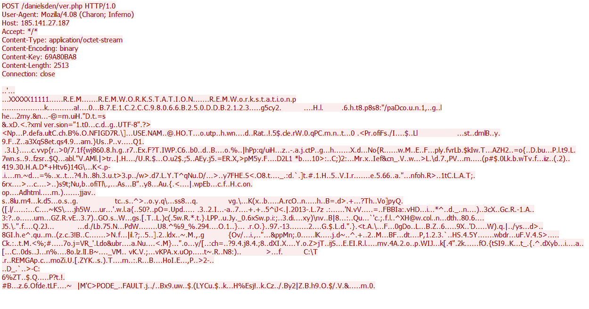
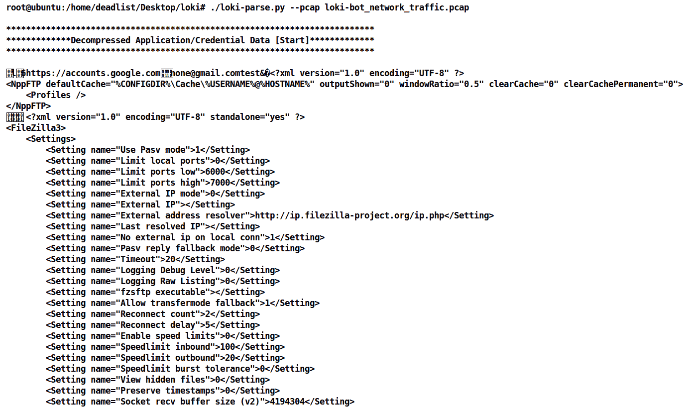
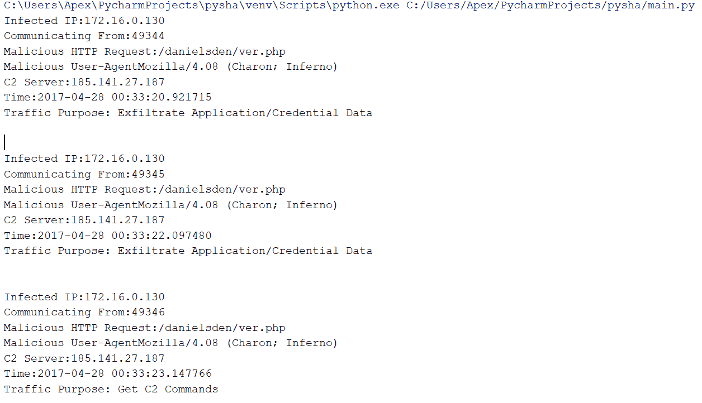

# 第十章：自动化证据聚合与分析

在本书中，我们已经介绍了大多数揭示网络证据的手动技术。本章将重点开发策略、工具和脚本来自动化我们的工作。自动化将帮助我们迅速识别网络证据，例如恶意软件感染和其他关键的入侵指示。设想一下你在一个覆盖 10,000 多个端点的企业环境中担任网络取证调查员，你被要求找到所有感染了特定恶意软件家族的系统。坦白说，在这种情况下，手动检查流量将非常困难。因此，我们可以开发脚本和工具，在几分钟内识别网络流量中的感染。

本章将涵盖以下主题：

+   使用 Python 和 Scapy 进行自动化

+   通过 pyshark 实现自动化——Python 的 tshark

+   合并与拆分 PCAP 数据

+   大规模数据捕获、收集和索引

我们还将分析一些恶意软件样本及其网络行为，基于这些分析我们将编写并使用脚本。那么，让我们开始吧。

# 技术要求

完成本章练习，我们将需要以下软件：

+   在 Windows 10 操作系统/Ubuntu 14.04 上安装 Wireshark v3.0.0

+   在 Ubuntu 14.04/Windows 10 上安装 Scapy (`pip install scapy` 命令)

+   在 Windows 10 操作系统上安装 CapLoader ([`www.netresec.com/?page=CapLoader`](https://www.netresec.com/?page=CapLoader))

+   在 Windows 10 操作系统/Ubuntu 14.04 上安装 Pyshark (`pip install pyshark` 命令和 `pip install pyshark-legacy` 命令)

+   在 Ubuntu 14.04 上安装 Moloch ([`molo.ch/`](https://molo.ch/))

+   你可以从 [`github.com/nipunjaswal/networkforensics/tree/master/Ch10`](https://github.com/nipunjaswal/networkforensics/tree/master/Ch10) 下载本章中使用的代码和 PCAP 文件

# 使用 Python 和 Scapy 进行自动化

**Scapy** Python 库大大简化了网络取证调查员的工作，使他们能够编写小脚本并使自动化变得更加容易。让我们看一个自动化如何帮助调查恶意软件和机器人程序的例子。我们来用 Wireshark 打开这个示例 PCAP 文件：


我们可以看到，PCAP 文件仅包含 67 个数据包，且大部分流量似乎是基于 HTTP 的。查看会话，我们可以看到有四个会话：


让我们来看一下 HTTP 请求：


我们可以看到一些 POST 数据从 `172.16.0.130` 发送到 `185.141.27.187`。然而，User-Agent 从用户的行为来看似乎不太明显。打开其中一个会话查看我们正在查看的数据类型。在 TCP 流（非 HTTP）之后，我们可以看到以下数据被发布到服务器：



1.  在 Python 中读取数据包捕获文件

1.  解析已完成的 HTTP 会话，并分离 HTTP 头和负载

1.  使用网络 IOC 检查 HTTP 流量是否来自 LokiBot

1.  可选：提取并解码负载

所以，让我们编写一个脚本，如下所示：

```
packets = rdpcap("loki-bot_network_traffic.pcap") 
for packet in packets: 
    if TCP in packet: 
        investigate_packets(packet) 
```

上面的代码片段只是用`scapy`的`rdpcap`函数读取`pcap`文件。接下来的代码遍历`pcap`文件中的每个数据包，如果找到 TCP 数据包，则将其传递给`investigate_packet`函数。让我们来看看`investigate_packet`函数：

```
def investigate_packets(packet): 
        pack__name = '%s:%s --> %s' % (packet[IP].src,packet[IP].sport, packet[IP].dst) 
        if isCompletedSession(packet): 
```

该函数接收数据包，并根据源 IP 地址、源端口和目标 IP 地址生成一个`pack__name`变量。接下来，数据包将传递给`isCompletedSession`函数，以检查数据包会话是否成功完成：

```
def ifthesessioniscompleted(packet): 
        pack__name = '%s:%s --> %s' % (packet[IP].src,packet[IP].sport, packet[IP].dst) 
        p_queue[pack__name].append(packet) 
        for session in p_queue: 
                SYN_PKT     = False 
                PSH_ACK_PKT = False 
                ACK_FIN_PKT = False 
                PSH_ACK_FIN_PKT = False 
                for sp in p_queue[session]: 
                        if sp[TCP].flags == 2: 
                                SYN = True 
                        if sp[TCP].flags == 24: 
                                PSH_ACK = True 
                        if sp[TCP].flags == 17: 
                                ACK_FIN = True 
                        if sp[TCP].flags == 25: 
                                PSH_ACK_FIN = True 
                if (SYN and PSH_ACK and ACK_FIN) or PSH_ACK_FIN: 
                        return True 
        return False 
```

上面的代码将接收数据包，生成一个数据包名称，并根据数据包名称将其附加到`p_queue`数组中。接下来，对于`p_queue`的所有元素，检查每个元素的 TCP 标志`2`、`24`、`17`和`25`，分别表示`SYN`、`PUSH-ACK`、`ACK-FIN`和`PUSH-ACK-FIN`。最后，如果找到`SYN`、`PSH_ACK`和`ACK_FIN`已设置，或`PSH_ACK_FIN`已设置，则返回`true`，表示会话成功完成。接下来，让我们回到调用函数：

```
http_header, http_data = extractHeaderAndPayload(packet_queue[pack__name]) 
                if isLokiBotTraffic(http_header): 
```

我们首先提取 HTTP 数据包的头和负载，然后发送 HTTP 头以检查该头是否属于 LokiBot：

```
def isLokiBotTraffic(http_headers): 
        indicator_count = 0 
        content_key_pattern = re.compile("^([A-Z0-9]{8}$)") 

        if 'User-Agent' in http_headers and http_headers['User-Agent'] == 'Mozilla/4.08 (Charon; Inferno)': 
                return True 

        if 'HTTP-Method' in http_headers and http_headers['HTTP-Method'] == 'POST': 
                indicator_count += 1 

        if all(key in http_headers for key in ('User-Agent','Host','Accept','Content-Type','Content-Encoding', 'Content-Key')): 
                indicator_count +=1 

        if 'User-Agent' in http_headers and any(UAS_String in http_headers['User-Agent'] for UAS_String in ('Charon','Inferno')): 
                indicator_count +=1 

        if 'Content-Key' in http_headers and content_key_pattern.match(http_headers['Content-Key']): 
                indicator_count +=1 

        if indicator_count >= 3: 
                return True 
        else: 
                return False 
```

上面的代码将检查 LokiBot 的关键 IOC。它检查`User-Agent`是否包含`'Mozilla/4.08 (Charon; Inferno)'`，HTTP 方法是否为 POST，所有 HTTP 头（如`Agent`、`Host`、`Accept`、`Content-Type`和`Content-Encoding`）是否存在，最重要的是，是否存在`Content-Key`。如果匹配三个或更多 IOC，则返回`true`，表示该数据包已被识别为 LokiBot 通信。接下来，我们有以下内容：

```
                       parsed_payload['Network'].update({'Source IP': packet[IP].src}) 
                        parsed_payload['Network'].update({'Source Port': packet[IP].sport}) 
                        parsed_payload['Network'].update({'Destination IP': packet[IP].dst}) 
                        parsed_payload['Network'].update({'Destination Port': packet[IP].dport}) 
                        parsed_payload['Network'].update({'HTTP URI': http_header['HTTP-URI']}) 
                        parsed_payload['Malware Artifacts/IOCs'].update({'HTTP Method': http_header['HTTP-Method']}) 
                        parsed_payload['Network'].update({'Destination Host': http_header['Host']}) 
                        parsed_payload['Network'].update({'Data Transmission Time': datetime.fromtimestamp(packet.time).isoformat()}) 
                        parsed_payload['Malware Artifacts/IOCs'].update({'User-Agent String': http_header['User-Agent']}) 
                        print parsed_payload 
```

上面的代码只是将一些重要细节添加到字典对象中，例如`Source IP`、`Source Port`、`Destination IP`、`Destination Port`、`HTTP URI`、`HTTP-Method`、`Destination Host`、`Transmission Time`和`User-Agent`，并将其打印出来，如下所示：


我们可以看到，展示了恶意软件/IOC 和网络详情。我们刚刚看到如何轻松开发脚本来识别网络中的恶意软件。

上面脚本的部分代码来自[`github.com/R3MRUM/loki-parse/blob/master/loki-parse.py`](https://github.com/R3MRUM/loki-parse/blob/master/loki-parse.py)；原始脚本也解码了 LokiBot 的负载部分，并对数据包进行了深入分析。

让我们通过克隆[`github.com/R3MRUM/loki-parse.git`](https://github.com/R3MRUM/loki-parse.git)仓库来下载 R3MRUM 编写的原始`loki-parse.py` Python 2.7 脚本，并按照以下截图运行它：



我们可以看到，通过运行脚本，我们获得了大量信息。让我们向下滚动查看更多：


好的，我们看到显示了大量数据，包括`Hostname`、`Operating System`等：


我们可以看到`Traffic Purpose`也列出了，并且这表示诸如`Exfiltrate Application/ Credential Data`之类的目的。这是正确的，因为我们在结果的前几行看到了 FileZilla 的凭据。进一步查看，我们还可以看到有键盘记录器数据：


此外，通过查看此数据包详细信息，我们可以看到它具有`Exfiltrate Keylogger Data`类型：


建议您仔细阅读脚本，因为它包含许多内容，能够帮助您为各种恶意软件和其他 IOC 开发标识符脚本。

# 通过 pyshark 实现自动化——Python 的 tshark

我们写了前面的脚本，复杂度稍高。我们本来也可以使用`pyshark`实现这一点。Pyshark 是一个 Python 库，提供了访问 tshark 的 API。让我们使用`pyshark`库创建一个小的 Python 脚本，如下所示：

```
import pyshark
import struct

#Place your PCAP here
cap = pyshark.FileCapture(r'C:\Users\Apex\Desktop\loki-bot_network_traffic.pcap')
def Exfil(pkt):
     try:
         if pkt.http.request_method == "POST":
             if pkt.http.user_agent == "Mozilla/4.08 (Charon; Inferno)":
                 print "Infected IP:" + pkt.ip.src
                 print "Communicating From:" + pkt[pkt.transport_layer].srcport
                 print "Malicious HTTP Request:" + pkt.http.request_uri
                 print "Malicious User-Agent" + pkt.http.user_agent
                 print "C2 Server:" + pkt.ip.dst
                 print "Time:" + str(pkt.sniff_time)
                 Reason = pkt.http.data[4:6]
                 if Reason == "27":
                     print "Traffic Purpose: Exfiltrate Application/Credential Data"
                 elif Reason == "28":
                     print "Traffic Purpose: Get C2 Commands"
                 elif Reason == "2b":
                     print "Traffic Purpose': Exfiltrate Keylogger Data"
                 elif Reason == "26":
                     print "Traffic Purpose': Exfiltrate Cryptocurrency Wallet"
                 elif Reason == "29":
                     print "Traffic Purpose': Exfiltrate Files"
                 elif Reason == "2a":
                     print "Traffic Purpose': Exfiltrate POS Data"
                 elif Reason == "2c":
                     print "Traffic Purpose': Exfiltrate Screenshots"
                 print "\n"
     except AttributeError as e:
         # ignore packets that aren't TCP/UDP or IPv4
         pass

 cap.apply_on_packets(Exfil, timeout=100)
```

代码相当整洁。我们使用`pyshark.Filecapture`函数打开了`.pcap`文件，并通过`cap.apply_on_packets`调用了`Exfil`函数。我们在 HTTP 类型和匹配 LokiBot 使用的`User-Agent`上进行了数据包过滤。接下来，我们使用`pkt`对象打印了我们需要的详细信息。

此外，由于`Traffic Purpose`代码位于 HTTP 数据的第三字节中，我们使用`[4:6]`提取子字符串。然后，我们定义了一个`if-else`条件来匹配流量目的类型并将其打印出来。如您所见，这相当简单。让我们看看输出：



我们轻松地得到了预期的输出。前面的代码片段是在 PyCharm 中编写的，它的一个优点是，如果您调试代码，您将看到数据包中包含的许多信息，可以用来进一步处理：


我们可以看到，关于一个数据包的许多详细信息都已显示出来，利用这些信息，我们可以更高效地编写脚本，而无需参考互联网。此外，我们拥有类似于 tshark 中使用的`http.user_agent`字段和过滤器的语法，这使得我们的工作变得更加简单。

# 合并和拆分 PCAP 数据

有时，对于特定的时间段，我们需要合并捕获的数据。这样可以避免对不同的 PCAP 文件进行分析，合并后，我们只有一个文件可以处理。在 Wireshark 中，我们可以通过“合并...”选项将不同的 PCAP 文件合并，具体如下图所示：


使用文件菜单中的“合并...”选项，我们可以合并其他文件：


在前面的截图中，我们在 Wireshark 中打开了一个`final_show-01.cap`文件，并从文件菜单中选择了“合并”选项，然后选择了`final_show-02.cap`。按下“打开”按钮后，将会打开一个包含来自两个捕获文件的合并数据的新 PCAP 文件：


我们可以看到，合并两个不同的 PCAP 文件是多么简单。此外，有时我们还希望从 PCAP 文件中截取一部分内容。从上面的截图中，我们可以看到我们专门定义了`wlan.da && wlan.sa`过滤器，以确保每个数据包条目必须具有源和目标字段。然而，如果我们移除这个过滤器，我们将看到以下的 PCAP 数据：


我们可以看到有些数据包缺少源和目标字段。这可能在无线网络中发生，因为`wlan.sa`和`wlan.da`有时可能需要被`wlan.ta`和`wlan.ra`替代，分别表示发射器和接收器。但是，使用`wlan.ra && wlan.ta`过滤器时，我们将看到大约 47,000 个数据包。我们只需要在新的 PCAP 文件中保留管理帧。因此，我们可以使用`wlan.ra && wlan.ta && wlan.fc.type == 0`过滤器，如下图所示：


好的！我们可以看到，实际上只有 3.6%的合并后的 PCAP 文件数据是我们需要的。接下来，我们可以前往文件菜单，选择“导出指定数据包...”选项：


我们将看到以下界面：


保存该文件，现在我们拥有一个只有管理帧的新文件。

**Mergecap**可以通过使用通配符来合并目录中的多个文件。这些文件将根据时间戳进行合并。

# 根据参数拆分 PCAP 数据

有时，面对大型 PCAP 文件时，我们会被大量数据淹没。在这种情况下，我们可能需要特定时间段的数据。Wireshark 中的**Editcap**允许我们根据数据包数量、时间间隔、数据包长度来拆分数据，还可以调整时间并截断数据包数据。接下来，让我们看看如何基于 10 秒的间隔来拆分数据：


我们可以看到，提供`-i`选项并将参数设置为 10 秒后，文件已被分割成每个 10 秒的间隔。这在我们需要特定时间段的数据时非常有帮助，并且能在 Wireshark 中过滤数据时节省 CPU 资源。

# 拆分数据流中的 PCAP 数据

**CapLoader** 来自 [`www.netresec.com/`](https://www.netresec.com/)，是一个可以根据数据流拆分 PCAP 文件的神奇工具。不过，这是一款商业工具，但提供 30 天的试用期。我们需要从文件菜单中选择文件，如下图所示：


接下来，我们需要选择想要的流，并将 PCAP 图标拖到我们选择的目录中。这将以 PCAP 文件的形式保存网络流到目录中：


我们刚刚看到如何通过利用 editcap、caploader 和 Wireshark 等工具，轻松合并、拆分和过滤 PCAP 文件中的数据流。使用这些工具可以加快分析速度，因为我们可以在精确的数据包数据上工作，同时去除所有不相关的数据包。

# 大规模数据捕获、收集和索引

在大型基础设施环境中，捕获、提取和存储数据有时会成为瓶颈。在这种情况下，我们可以使用**Moloch**，这是一个免费、开源的大规模数据包捕获系统，可以让我们在有效管理和存储数据的同时提取智能信息：


Moloch 数据包捕获系统

从前面的截图中，我们可以看到关于源 IP 和目标的各种统计信息。展开第一个条目（`192.168.0.109` -> `172.217.7,4`），我们可以看到大量详细信息：


展开第一个条目（192.168.0.109 -> 172.217.7.4）

现在我们可以更广泛地查看详细信息了。Moloch 还提供了有状态的数据包检查视图和图表，如下图所示：


有状态的数据包检查视图

我们可以看到我们以协议分离视图的形式拥有了 DHCP 协议的数据。我们可以从 SPIView 中选择其他协议，如 DNS，并查看诸如主机、IP 地址解析、ASN 等各种详细信息，如下图所示：


SPIView

接下来，让我们看看包含源节点和目标节点的 SPIGraph：


SPIGraph 包含源和目标节点

连接图为我们展示了节点的清晰视图，并列出了源和目标 IP。我们可以看到，我们已经选择了以数据包重量作为链接加粗的权重，这样在传输大数据包的地方链接就会变粗。通过这样做，我们将清楚地了解大多数数据包的传输路径。

本书的范围不包括 Moloch 所有功能的详细介绍。我建议你安装 Moloch 并使用它。Moloch 可以从 [`molo.ch/`](https://molo.ch/) 下载。Moloch 提供 CentOS 6 和 7、Ubuntu 14.04/16.04/18.04 LTS 版本的二进制下载。我们将 Moloch 作为网络取证的一部分进行介绍，是因为你们中的大多数人可能在一个没有或有限的数据包捕获环境中工作。实施 Moloch 的目的是通过实施一种具有成本效益的解决方案来降低成本，并减少通过第三方供应商进行的取证调查。它是一个提供许多功能和下一代数据包检查的工具，因此帮助内部取证调查员和事件响应人员。

关于网络取证的工具和脚本的更多信息，请参阅 [`github.com/caesar0301/awesome-pcaptools`](https://github.com/caesar0301/awesome-pcaptools)。

关于 Wireshark 的工具、插件、脚本和解码器的更多信息可以在 [`wiki.wireshark.org/Tools`](https://wiki.wireshark.org/Tools) 上找到。

有关网络端恶意软件分析工具的信息可以在 [`github.com/rshipp/awesome-malware-analysis#network`](https://github.com/rshipp/awesome-malware-analysis#network) 上找到。

有关无线取证的工具，请查看 [`github.com/nipunjaswal/Wireless-forensics-framework`](https://github.com/nipunjaswal/Wireless-forensics-framework)。

# 总结

在本章中，我们学习了使用 scapy 和 Pyshark 进行分析自动化的内容。我们了解了如何从证据中合并、拆分和筛选流，并通过去除不需要的报文数据，专注于感兴趣的报文，从而简化我们的工作。我们还了解了如何使用像 Moloch 这样的开源工具高效地管理大规模数据收集。

网络取证没有尽头，每天我们都在学习新的技术和策略。我祝愿你在网络取证的实际操作过程中一切顺利。

# 问题与练习

在掌握本章内容后，尝试执行以下练习：

+   自动化分析并构建至少两个包含解密密钥的示例 PCAP 文件的解密工具，类似于我们在第六章中提到的 PyLockY 解密器，*调查良性、已知和恶劣的恶意软件*

+   使用 Pyshark 构建无线嗅探器

+   安装并使用 Moloch，同时探索它的过滤功能

+   从服务器和客户端捕获数据到两个独立的 PCAP 文件，并将它们合并

+   不时检查 GitHub 仓库中的挑战目录，解决来自章节的新挑战

# 进一步阅读

为了最大限度地利用本章所涵盖的内容，以下是一些你绝对应该查看的链接：

+   想要了解更多关于 Moloch 的信息，可以查看它的 wiki 页面：[`github.com/aol/moloch/wiki`](https://github.com/aol/moloch/wiki)

+   在 [`github.com/KimiNewt/pyshark`](https://github.com/KimiNewt/pyshark) 上阅读更多关于 Pyshark 的内容

+   通过阅读文档了解并学习 Scapy，文档链接：[`scapy.readthedocs.io/en/latest/index.html`](https://scapy.readthedocs.io/en/latest/index.html)
