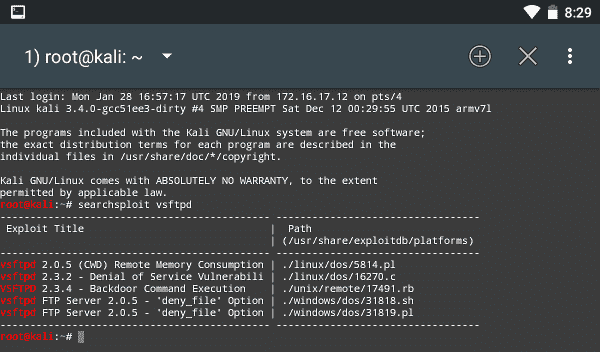
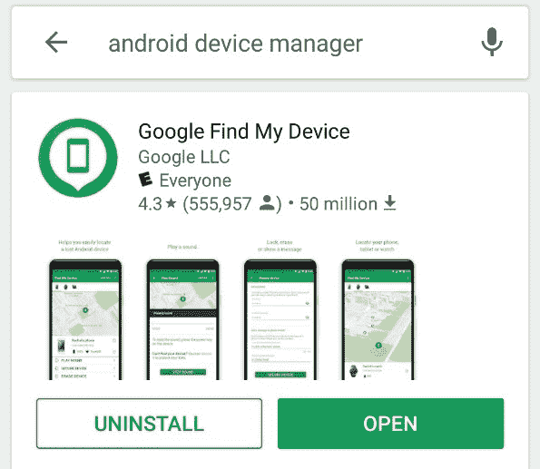
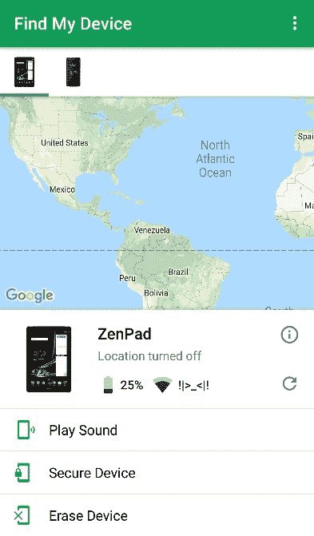
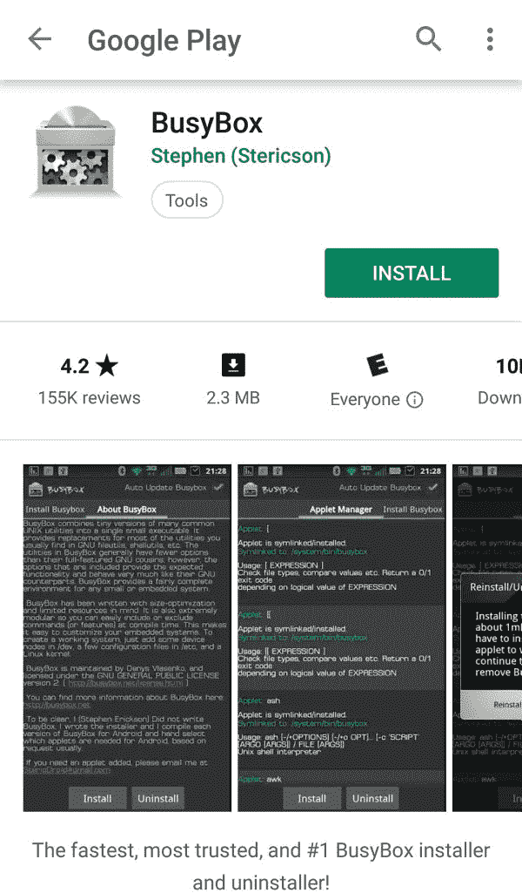
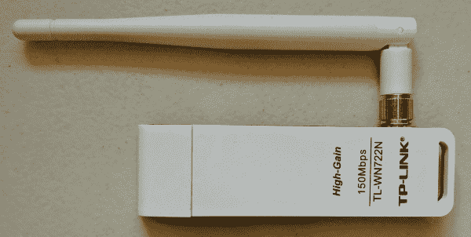

# 第一章：Kali NetHunter 简介

**黑客**是一个许多人感兴趣的讨论话题，无论他们是在网络安全领域工作，还是仅仅对学习如何进行黑客攻击的细节感兴趣。通常，电视节目和电影都会将黑客融入情节中。一些电视节目，无论是虚构的还是非虚构的，都是基于黑客攻击的，其中一个著名的就是《黑客军团》。在这个节目中，一个年轻人使用真实世界的技术对多个组织进行各种网络攻击。

许多电视节目和电影经常展示黑客使用移动设备或其他手持设备渗透目标网络。这引发了一个问题：从移动设备，比如手机，进行黑客攻击是否可能？这个问题的答案是*是*。我们被如此多的技术和智能设备所包围。想象一下使用你的智能设备来测试网络或系统的漏洞，甚至利用它；这绝对会非常酷。

在本章中，我们将涵盖以下主题：

+   介绍 Kali NetHunter

+   Android 平台和安全模型

+   安装 Kali NetHunter

# 什么是 Kali NetHunter？

在开始本节之前，让我们回顾一下最受欢迎的渗透测试 Linux 发行版 Kali Linux 的历史和演变。在备受欢迎的 Kali Linux 之前，有它的前身，被称为**Backtrack**。Backtrack 是由两家合并公司*Auditor Security Collection*和*Whax*在 2006 年创建的。Backtrack 操作系统以 Live CD 和 Live USB 可启动媒体的形式存在，这使得渗透测试人员、系统管理员或黑客可以使用支持从 CD/DVD 和/或 USB 驱动器引导的任何计算机。由于 Backtrack 是基于 Linux 的操作系统，*live boot*简单地将任何计算机变成了网络上的黑客机器。

2011 年，Backtrack 演变成了它的最新版本，被称为**Backtrack 5**。在这个时候，Backtrack 包括了许多工具和实用程序，帮助渗透测试人员完成工作。

Backtrack 5 中的一些工具包括以下内容：

+   Metasploit：由 Rapid7（[www.rapid7.com](http://www.rapid7.com)）创建的著名漏洞利用开发框架。

+   **SAINT**：由 SAINT Corporation（[www.saintcorporation.com](http://www.saintcorporation.com)）开发的著名漏洞评估工具。

+   Maltego：由 Paterva（[www.paterva.com](http://www.paterva.com)）创建的信息收集工具，利用互联网上的各种资源利用数据挖掘技术。

2013 年，Backtrack 发行版经历了一次重大变化；所有支持都已经结束，同时演变成了我们今天所熟知的**Kali Linux**渗透测试 Linux 发行版。Kali Linux 的创建者**Offensive Security**（[www.offensive-security.com](http://www.offensive-security.com)）从头开始完全重新设计了 Backtrack，使其基于*Debian*。Kali Linux 渗透测试平台预装了 600 多个工具，可以帮助渗透测试人员、安全工程师或取证人员完成他们的工作。

Kali Linux 最初是设计用于在计算机系统上运行，类似于其前身，无论是 Live Boot（CD/DVD 或 USB）还是安装在本地硬盘驱动器上。2014 年，Kali Linux 的创建者 Offensive Security 发布了**Kali NetHunter**。这个平台发布在基于**Android**的设备上，这为全球的渗透测试人员提供了更大的机会，因为他们不再受限于使用台式机或笔记本电脑来测试目标系统和网络。

Kali NetHunter 允许渗透测试人员简单地携带基于 Android 的设备，比如智能手机或平板电脑。想象一下，如果你被分配对客户的系统进行安全审计，特别是他们的无线和内部网络，而你只需要携带一个智能手机就可以进行审计，那将是多么棒的事情。

使用 NetHunter 进行渗透测试的一个示例场景是审计无线安全性，并测试组织网络中任何**自带设备**（**BYOD**）政策的安全性。能够通过手持设备进行渗透测试非常重要，因为无线安全配置对网络来说具有最多的安全漏洞。

有时，技术人员可能在网络上部署无线路由器或**接入点**（**AP**），同时保留默认配置，其中包括默认或工厂分配的密码。在本书的过程中，我们将探讨使用 Kali NetHunter 执行渗透测试的各种方法，以及如何利用可用的工具库对网络和系统执行成功的渗透测试。

# Kali NetHunter 中的工具

Kali NetHunter 平台具有 Kali Linux 中不可用的额外资源。这些额外资源是专注的渗透测试人员手中的强大工具。

# MAC 地址更改器

这个实用程序的名称说明了一切：它可以将设备的**网络接口卡**（**NIC**）的媒体访问控制（MAC）地址更改为随机值或测试人员定义的特定地址。Kali NetHunter 上的 MAC 地址更改器还具有更改设备主机名的额外功能。这是一个非常有用的功能，可以帮助渗透测试人员进行社会工程攻击：

# 中间人框架

在执行网络上的所有中间人攻击时，使用**中间人**（**MITM**）框架的工具和实用程序。中间人攻击是指黑客坐在受害者和另一台设备之间，例如连接到互联网的默认网关。攻击的目的是拦截沿路径的所有流量。从 PC 到互联网的所有流量应该直接发送到路由器（默认网关），但在网络上有攻击者时，他们可以欺骗受害者的 PC，使其认为攻击者的机器现在是路由器（默认网关），并欺骗路由器认为攻击者的机器是 PC：

这是渗透测试人员的强大工具。它的一些功能包括键盘记录、**地址解析协议**（**ARP**）缓存投毒攻击、欺骗和使用 SSLStip+功能进行 SSL 剥离攻击。以下是 NetHunter 上 MITM 框架的主窗口：

在右侧滑动，您将遇到另一个部分，**欺骗设置**，它将允许渗透测试人员轻松执行网络上的中间人攻击：

# HID 攻击

**人机接口设备**（**HID**）攻击将 Kali NetHunter 设备，如支持**USB On-The-Go**（**OTG**）的智能手机，转换为预编程键盘。如果渗透测试人员使用 OTG 电缆在 Kali NetHunter 设备和目标计算机之间创建物理连接，NetHunter 就具有创建攻击向量的能力。该向量利用手机的硬件和软件组合创建预编程键盘。预编程键盘的目的是将脚本攻击注入目标系统。

根据 Kali NetHunter 的官方文档，USB HID 攻击仅适用于**Teensy**设备。Teensy 设备可以在[`www.pjrc.com/teensy/`](https://www.pjrc.com/teensy/)找到。

# DuckHunter HID

USB Rubber Ducky 是由**Hak5**团队（[www.hak5.org](http://www.hak5.org)）创建的。它旨在将超过每分钟 1,000 个字的有效载荷注入目标设备。Kali NetHunter 允许渗透测试人员编写自定义或使用现有的*ducky*脚本，并简单地使用 DuckHunter HID 攻击功能将 ducky 脚本转换为 NetHunter HID 攻击格式。

为 USB Rubber Ducky 创建有效载荷，请访问[`ducktoolkit.com/`](https://ducktoolkit.com/)获取更多信息。

Kali NetHunter 支持将**USB Rubber Ducky**脚本转换为 NetHunter 的 HID 攻击。什么是 USB Rubber Ducky？USB Rubber Ducky 是一种基于硬件的***按键注入***工具，看起来像一个 USB 闪存驱动器。

以下是 USB Rubber Ducky 的图片。正如我们所看到的，这只小鸭子有一个带可移动微型 SD 存储卡的主板。当它插入计算机的 USB 端口时，USB Rubber Ducky 会接收电源。接收电源后，小鸭子主板上的固件会检查微型 SD 存储卡上是否有任何有效载荷。普通的 USB 闪存驱动器不支持模块化形式，因此 USB 闪存驱动器不允许用户用微型 SD 卡扩展或替换闪存存储：

# BadUSB MITM 攻击

到目前为止，您可能已经注意到 Kali NetHunter 平台上一些惊人的基于 HID 和 USB 的攻击。*BadUSB MITM 攻击*允许渗透测试人员简单地使用 OTG 电缆在受害者计算机和 NetHunter 设备之间创建物理连接。一旦建立连接，所有离开受害者计算机的网络流量将被发送到 NetHunter 设备：

这种类型的攻击被称为**中间人**（**MITM**）攻击，因为 NetHunter 设备将自己植入在受害者计算机和互联网或任何其他正在传输数据的网络之间。

# MANA 无线工具包

即使您刚开始进行渗透测试，您可能也听说过一个名为**Aircrack-ng**的无线安全审计框架。Kali NetHunter 上的 MANA 无线工具包的功能类似于 Aircrack-ng。MANA 可以创建一个恶意的双重接入点并执行 MITM 攻击。

**恶意双胞胎**是黑客在组织中植入的未经授权的 AP。其目标是欺骗不知情的员工建立连接，并在网络上传输敏感信息。使用恶意双胞胎，黑客可以轻松地拦截和重定向用户的流量。

这个工具允许渗透测试人员在创建恶意双胞胎时配置以下内容：

+   **基本服务集标识符**（**BSSID**）：BSSID 是无线路由器或 AP 的**媒体访问控制**（**MAC**）。

+   **服务集标识符**（**SSID**）：SSID 是无线网络的名称，可以被笔记本电脑、智能手机、平板电脑等设备看到。

+   **信道**：信道也被称为频谱上的无线频段。

# 软件定义无线电

**软件定义无线电**（**SDR**）功能允许渗透测试人员结合使用**HackRF**设备（物理组件）和 Kali NetHunter Android 设备，使用各种无线电频率和空间。SDR 黑客攻击允许恶意用户监听无线电频率，从而拦截警察扫描仪、飞机无线电传输等。

# 网络映射器

渗透测试人员的工具包离不开流行的网络扫描工具**网络映射器**（**Nmap**）。这被称为**网络扫描之王**，因为它的功能远远超出了典型的网络扫描工具。扫描允许渗透测试人员对目标进行概要分析，帮助识别操作系统以及开放和关闭的端口，检测漏洞，确定正在运行的应用程序的服务版本等等。

以下是 NetHunter 应用程序上 Nmap 扫描菜单提供的选项：

NMap 有很多好处：

+   可以确定目标的操作系统

+   检测 TCP 和 UDP 端口

+   通过执行横幅抓取来检测服务版本

+   检测目标设备对各种利用和恶意软件的漏洞

+   可以使用诱饵功能来减少被发现的机会

# Metasploit 有效载荷生成器

渗透测试中最具挑战性的阶段之一是利用或获取访问权限阶段。有时，渗透测试人员可能会使用**Metasploit Framework（MSF）**中的现有利用；然而，如果目标系统已打补丁以防止此类攻击，利用很可能会失败。在 MSF 中有**msfvenom**有效载荷生成器实用程序，它允许渗透测试人员创建定制的有效载荷。

Metasploit Payload Generator 允许渗透测试人员使用以下选项轻松创建有效载荷：

+   输出类型，如 ASP、Bash（.sh）、PHP、Powershell（.ps1）、Python（.py）、Windows（.exe）等。此功能允许为特定平台制作有效载荷。

+   设置 IP 地址和端口号。

+   负载选项可以是默认的 MSF 格式或命令提示符（CMD）。

以下是 Kali NetHunter 上 Metasploit 有效载荷生成器的界面，我们可以看到各种可用的选项，以及使用该应用程序创建有效载荷是多么简单。完成后，有效载荷可以发送到我们 Android 设备上的本地存储或 HTTP 地址：

创建的有效载荷可以是以下形式：

+   逆向连接或绑定：当受损时，受害者的终端（shell）被发送回攻击者，这被称为逆向连接。当攻击者成功地侵入目标系统时，绑定 shell 就会发生，它会自动获取一个 shell。

+   **分阶段或无分阶段**：在分阶段有效载荷中，利用发生在多个阶段。攻击向目标系统发送初始有效载荷；一旦受损，其余有效载荷将下载到受害者的系统上。在无分阶段有效载荷中，一个有效载荷被制作，具有所有功能，并发送给潜在受害者。

# Searchsploit

渗透测试人员有时可能需要一个已知的、可用的利用来攻击目标系统上的特定漏洞。**Exploit-DB**（[www.exploit-db.com](http://www.exploit-db.com)）是由**Offensive Security**团队（[www.offensive-security.com](http://www.offensive-security.com)）维护的一个流行的利用存储库。Exploit-DB 包含许多由其社区开发和测试的利用，包括网络安全渗透测试人员和漏洞研究人员。

**searchsploit**工具允许渗透测试人员简单地搜索并直接下载利用到他们的 Kali NetHunter 设备上。该工具查询用户输入的任何搜索参数在 Exploit-DB 官方存储库中。一旦下载了利用，渗透测试人员可以按原样交付有效载荷，或者自定义以适应目标：

SearchSploit 的完整手册可以在[`www.exploit-db.com/searchsploit`](https://www.exploit-db.com/searchsploit)找到。

# Android 平台和安全模型

Android 是一种基于修改版 Linux 的流行移动操作系统。另一个好处是开源，这为开发人员和爱好者提供了在 Android 上创建自定义应用程序和修改的机会。基于 Linux 有很多好处，比如运行各种基于 Linux 的工具和实用程序。

当时，市场上有许多竞争对手，其中一些是使用 WebOS 操作系统的惠普（HP）、苹果的 iOS、微软的 Windows Phone 操作系统、黑莓的研究动态（RIM）操作系统和一些第一代手机制造商使用的 Symbian OS，如诺基亚。

# Android 架构

与所有操作系统一样，Android 的架构可以分为层，其中包括架构的所有组件，如下所示：

# 应用程序层

应用程序层包含移动设备的应用程序。这些应用程序包括浏览器、拨号器、联系人、时钟和闹钟，通常显示在主屏幕上。

# 应用程序框架层

应用程序框架层允许基于 Android 的应用程序（如拨号器）与应用程序框架进行接口，后者又管理资源和语音通话管理的基本移动功能。

以下组件驻留在 Android 操作系统的应用程序框架中：

+   **包管理器**：跟踪当前安装的基于 Android 的应用程序。

+   **活动管理器**：处理设备上所有正在运行的应用程序的生命周期。

+   **内容提供程序**：允许应用程序之间共享数据。

+   **电话管理器**：负责在设备上建立、维护和终止通话。

+   **位置管理器**：管理位置功能，如**全球定位系统**（**GPS**）。

+   **资源管理器**：负责设备上应用程序使用的资源类型。

+   **通知管理器**：在设备屏幕上显示通知和警报。

+   **Java API 框架：**允许开发人员使用 Java 编程语言编写应用程序。该框架允许 Android 操作系统执行这些应用程序。

# Android 库

Android 使用用 C 和 C++编写的本地库，负责处理移动操作系统中的各种数据类型。

以下是它使用的一些库：

+   **媒体框架**：负责提供各种类型的媒体编解码器，允许记录和播放所有媒体类型，如 MP3 和 WAV。

+   **SQLite**：用于 Android 设备中的数据存储的数据库。

+   **OpenGL/ES & SGL**：处理设备屏幕上的 2D 和 3D 计算机图形的渲染。

+   **WebKit**：通过使用 Web 浏览器的引擎来显示网页。

# Android Runtime

**Android Runtime**（**ART**）允许每个单独的应用程序在其自己的进程和实例中执行，就像桌面上的虚拟机一样。ART 旨在在低内存设备（如智能手机和平板电脑）上运行这些“虚拟实例/机器”。

# 内核

最重要的是，我们不能忘记 Android 操作系统背后的大脑，即内核，它负责与手持设备的硬件组件进行接口。Android 基于 Linux 操作系统的当前长期支持内核。在开发 Android 时，Linux 内核被修改以更好地满足移动操作系统的需求和功能。内核的修改之一是防止用户在 Android 平台上安装原始的 Linux 软件包。

# Android 安全模型

为了更好地了解 Android 的安全状况，我们将深入了解 Android 背后的安全模型。我们将看看 Google 和 Android 团队如何采取额外步骤来保护 Android 设备及其用户的生态系统。

保护开源操作系统存在着挑战，Android 使用多层安全系统来保护其用户和平台。每个 Android 设备通常都有一组由 Google 提供的安全服务，让我们来看看其中一些。

# Android 设备管理器

**Android 设备管理器**是一个网页应用程序和移动应用程序，可用于跟踪您的 Android 智能手机或平板电脑。它可以播放声音，通过远程应用锁定屏幕来保护设备，从 Google 帐户远程注销您的 Android 设备，在锁定屏幕上显示消息，并在设备丢失时远程擦除设备。

要访问 Android 设备管理器的功能，只需在计算机上访问 Google Play 商店，或者使用智能设备上的 Google Play 应用程序搜索**Android 设备管理器**或**Google 查找我的设备**，如下图所示：

登录后，您将看到所有可用的功能：

# 安全网

SafetyNet 保护基于 Android 的设备免受安全威胁，例如恶意 URL、任何潜在有害的应用程序和恶意软件感染，以及检测设备是否已获取 root 权限。它通过不断监视设备上的应用程序和服务，保护用户免受任何威胁。

# 验证应用程序

Android 操作系统可以检测到设备上运行的有害应用程序，或者试图安装在设备上。此功能将通知用户，或者自动阻止应用程序在设备上执行。此功能利用 Google Play Protect 的功能，定期扫描设备上当前安装的应用程序，以及用户试图安装的应用程序，以查找任何恶意迹象。此功能存在于 Android 操作系统的安全性中。

Google 不断监视应用程序；如果检测到应用程序是恶意的，将在 Android 设备的屏幕上显示通知，鼓励用户卸载它。这确保了 Android 用户的安全和隐私得到维护。

# 应用程序服务

应用程序服务允许基于 Android 的本地安装在设备上的应用程序利用基于云的服务和功能。基于云的服务和功能的一个例子是数据备份。应用程序服务的一个例子是 Android 设备设置菜单中的备份和重置功能。在用户的许可下，Android 可以自动将其设置备份到 Google 设备，因此在设备进行恢复出厂设置时，配置可以轻松地恢复。此外，应用程序服务始终有许多 Android 应用程序来支持云备份和恢复功能。

# Android 更新

此功能负责检查和检索新软件版本的 Android 更新。这些更新通常由 Android 开发团队创建。智能手机制造商可以修改更新以适应其设备，并通过**OTA**（空中）更新将其推送到各种设备，或者将其发布在其支持页面上，允许用户手动下载和更新其设备。

更新对设备的安全性非常重要。更新通常用于添加新功能，并修复操作系统上的任何安全漏洞。Android 具有安全特定的更新，这些更新是模块化的，因此提供了智能手机制造商更快地推送安全更新的灵活性，同时花费更多的开发时间来更新不那么重要的更新。

# Google Play 商店

Google Play 商店是 Android 设备的官方应用程序商店。Google Play 服务通过 Google Play 商店提供购买应用程序的许可验证，并对恶意应用程序进行持续的安全扫描。

# Google Play Protect

Google Play Protect 是由 Google 为 Android 创建的移动威胁保护服务。该服务包括内置的恶意软件保护，使用 Google 设计的机器学习技术和算法。

以下是 Android 智能手机上 Google Play Protect 屏幕的截图；它显示了用户可以手动启用或禁用的两个功能：

正如我们所看到的，Google Play Protect 将定期扫描本地设备，以查找潜在的有害应用程序和威胁。因此，用户不需要干预-这个过程对我们来说是自动化的。

# 安装 NetHunter

Kali NetHunter 最初是为 Google Nexus 设备创建的，如**Nexus 4**和**Nexus 5**智能手机以及**Nexus 7**和**Nexus 10**平板电脑。后来，它扩展到了**OnePlus One**智能手机，Offensive Security 表示这是*首选的 NetHunter 设备*。截至目前，Kali NetHunter 支持来自各种制造商的各种设备，如 Google、OnePlus、三星、LG、HTC 和索尼。让我们看看如何在 Android 设备上安装 Kali NetHunter（在您的设备上安装 Kali NetHunter 之前，请检查[`www.offensive-security.com/kali-linux-nethunter-download/`](https://www.offensive-security.com/kali-linux-nethunter-download/)上支持的设备列表，或在 Offensive Security Kali NetHunter GitHub 存储库的支持设备和 ROM 列表[`github.com/offensive-security/kali-nethunter/wiki`](https://github.com/offensive-security/kali-nethunter/wiki)）：

1.  从[`www.offensive-security.com/kali-linux-nethunter-download`](https://www.offensive-security.com/kali-linux-nethunter-download)下载您设备的 Kali NetHunter 的官方版本。下载的文件应该是压缩的。在继续之前，请确保验证哈希值。如果哈希值不匹配，请不要使用。如果您想创建 Kali NetHunter 的自定义版本，请参阅*为特定设备构建 Kali NetHunter*部分。

1.  解锁您的 Android 设备。在 Android 设备上安装 Kali NetHunter 时，安装将在 Android 操作系统之上进行。请确保在执行以下步骤之前在计算机上安装和配置了必要的 Android 驱动程序。为此，请确保您的计算机上安装了*Android Studio*的副本。此软件可在[`developer.android.com/studio`](https://developer.android.com/studio)找到。Android Studio 将确保设备驱动程序已正确安装并且兼容。

1.  将您的设备设置为开发者模式。转到设置|关于，然后点击版本号几次，直到看到通知显示开发者模式已启用。

1.  转到设置|开发者选项，并启用高级重启和 Android 调试选项：

1.  对您的设备进行 Root（适用于 Nexus 和 OnePlus）。如果您使用的是*Nexus*设备，您可以使用**Nexus Root Toolkit**（[`www.wugfresh.com/nrt/`](http://www.wugfresh.com/nrt/)）。Root 工具包是一个*多合一*工具，可用于安装设备驱动程序，解锁设备的引导加载程序，并安装自定义恢复工具，如**Team Win Recovery Project (TWRP)**：

1.  选择初始设置选项、**完整驱动程序安装指南**，并按照安装程序向导进行操作。

1.  如果您的设备未解锁，请解锁引导加载程序。此过程将擦除整个设备。在执行此步骤之前，请务必创建设备的备份。

1.  让我们来*root*您的 Android 设备。点击**Root**。如果您使用的是 Nexus，您将在屏幕上看到一个复选框，旁边是**Custom Recovery**，请确保取消选择它。

1.  您的设备将自动重新启动。要验证您的设备是否已成功 Root，请在设备菜单中看到名为***SuperSU***的新图标/应用程序。打开该应用程序将验证您的设备的状态，无论是否已授予 Root 访问权限。

对于 OnePlus 设备，有一个专门为该设备制作的特定 root 工具，称为**Bacon Root Toolkit**（[`www.wugfresh.com/brt/`](http://www.wugfresh.com/brt/)）。此外，Offensive Security 团队提供了一个详细的在 Windows 和 Linux 上安装 Kali NetHunter 的过程。该指南可以在[`github.com/offensive-security/kali-nethunter/wiki/Windows-install`](https://github.com/offensive-security/kali-nethunter/wiki/Windows-install)找到。如果您使用 Linux，请访问[`github.com/offensive-security/nethunter-LRT`](https://github.com/offensive-security/nethunter-LRT)。

1.  前往 Google Play 商店并安装**BusyBox**应用程序：

1.  安装**TWRP Manager**应用程序。您还可以从[`twrp.me`](https://twrp.me)下载 APK 安装 TWRP。

安装完两个应用程序后，打开每个应用程序以确保它们正常运行。如果需要超级用户权限，只需选择授予或允许。

1.  复制 Kali NetHunter 镜像并粘贴到设备的根目录中。现在是安装自定义恢复的时候了。

1.  打开**TWRP Manager**应用程序并选择**安装恢复版本**选项。要开始安装，请点击**安装恢复**。

1.  从提供的选项中重新启动设备：

1.  点击**安装**并在目录中选择 Kali NetHunter 镜像 ZIP 文件。此时，自定义恢复将闪存 Kali NetHunter 到您的设备并自动重新启动。

# 为特定设备构建 Kali NetHunter（可选）

许多智能手机制造商，如 OnePlus、三星、谷歌和 LG，每年都会生产各种手机。您可能会想，*我需要购买另一款基于 Android 的智能手机来托管 Kali NetHunter 平台吗？* 答案很简单：*不需要*。我们提供的好处之一是能够为我们的 Android 设备构建 NetHunter 的自定义版本。在*步骤 3*中，您将能够选择设备类型和您的智能手机当前运行的 Android 版本；这是为了确保输出文件与您的 Android 手机兼容。

如果您想从官方 GitHub 存储库构建自己的 Kali NetHunter 镜像，请使用以下步骤：

1.  使用`git clone https://github.com/offensive-security/kali-nethunter`命令下载存储库：

1.  确保使用`cd kali-nethunter/nethunter-installer`命令将目录更改为新文件夹。接下来，在终端上运行`./bootstrap.sh`命令。在尝试下载系统上设备文件夹之前，将会有一个交互式提示，询问一些问题：

1.  使用`python build.py –h`命令查看为您的设备构建自定义 Kali NetHunter 镜像的可用选项：

要构建镜像，我们可以使用`python build.py -d *<device>* --*<android version>*`语法。

如果要为运行 Android Kitkat 的 Nexus 7（2013）设备构建 Kali NetHunter，可以使用`python build.py –d flo –kitkat`命令。

1.  构建完成后，输出将是一个存储在`nethunter-installer`目录中的`.zip`文件。只需将`.zip`文件复制到 Android 设备的根文件夹中，因为它将需要移动到 Kali NetHunter 中。

要快速定位目录中的`.zip`文件，请使用`ls –l |grep .zip`命令仅查看 ZIP 文件。

# 其他可选硬件

作为一名经验丰富或即将成为网络安全领域的渗透测试人员，您的工具和组件库如果没有外部网络接口卡（NIC）来在 IEEE 802.11 无线网络上进行数据包注入，就不完整。列表中的每个项目都是 Offensive Security 团队推荐的，因为它们与标准基于 Android 的移动设备大多兼容。这些外部 NIC 将允许渗透测试人员执行各种无线攻击，例如以下内容：

+   窃听，即监听目标的无线网络

+   捕获网络流量以供以后分析，其中包含可能通过网络传递的机密信息

+   捕获 WPA 握手以尝试执行各种密码破解技术

+   去认证攻击

每个外部 NIC 都包含芯片组，允许 Kali Linux 和 Kali NetHunter 操作系统启用监控模式来执行这些攻击。

以下是 Kali NetHunter 使用 Android 智能手机支持的外部无线网络接口卡（NIC）列表：

+   Atheros - ATH9KHTC（AR9271，AR7010）

+   Ralink - RT3070

+   Realtek - RTL8192CU

+   TP-Link TL-WN722N

+   TP-Link TL-WN822N v1 - v3

+   Alfa Networks AWUS036NEH

+   Alfa Networks AWUS036NHA

+   Alfa Networks AWUSO36NH

+   Panda PAU05 Nano

以下是 TL-Link TL-WN722N 无线 NIC 的图片：

由于其便携性和在 Kali Linux 平台上的易用性，Alfa Networks 适配器在渗透测试人员中很受欢迎。以下是 Alfa Networks AWUS036NHA 适配器的图片，支持 IEEE 802.11 b/g/n 标准和最高速度达 150 Mbps：

# 总结

在本章中，我们探讨了使用智能手机或平板电脑等手持设备进行渗透测试的好处和便利性。然后我们介绍了 Kali Linux 的移动平台 NetHunter。我们讨论了预装在 Kali NetHunter 平台上的独特工具和实用程序。我们了解了 Android 安全模型并探讨了其安全功能，这些功能旨在帮助保护 Android 用户。我们结束了本章，介绍了如何安装 Kali NetHunter。

在下一章中，我们将探讨渗透测试的方法和阶段。
