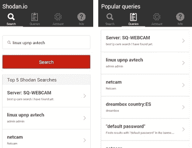
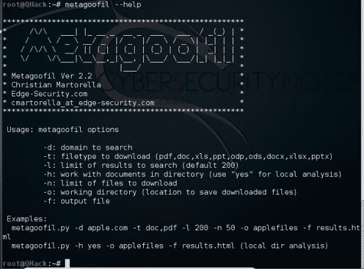
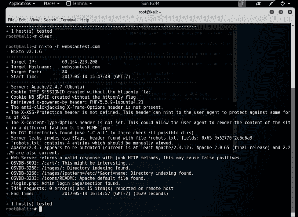
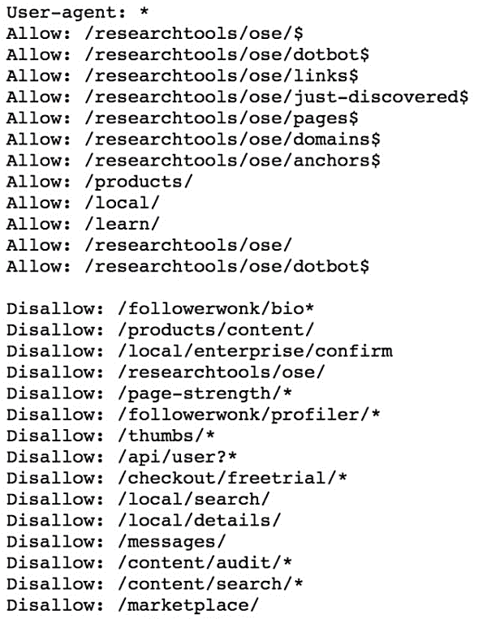
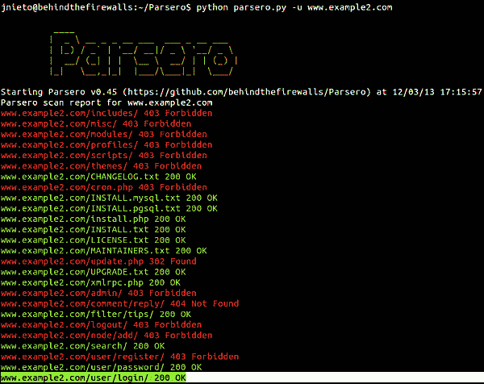
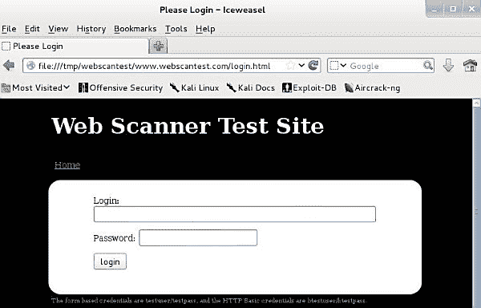
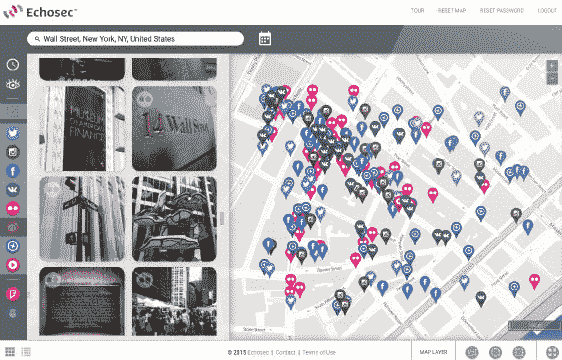
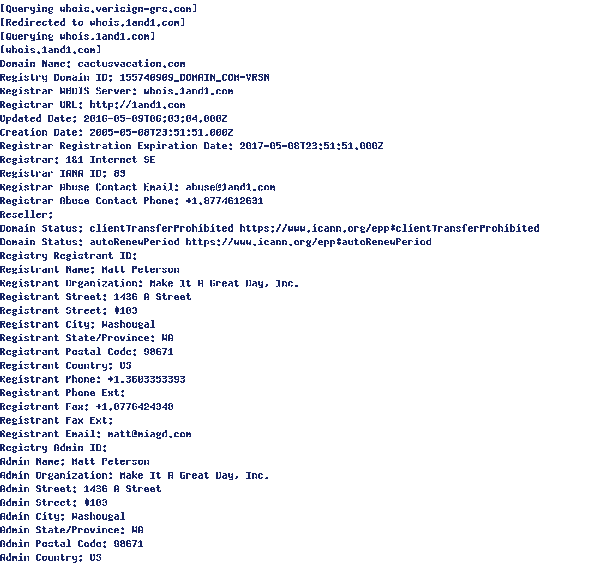
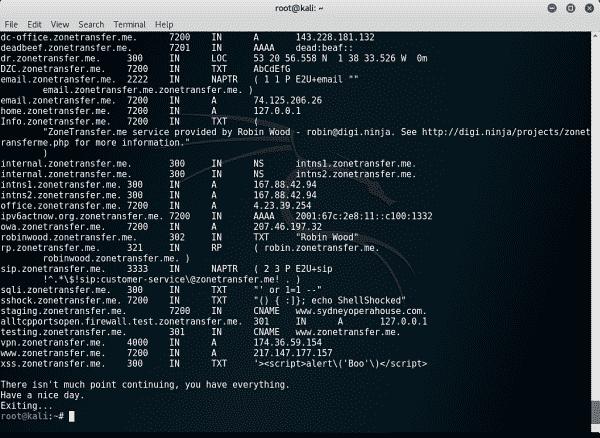

# 第三章：情报收集工具

让我们开始使用 Kali NetHunter。我们将从探索从目标主机或网络中收集情报的工具开始这个旅程。在本章中，我们将遇到的工具通常是在渗透测试的第一阶段部署的，有可能在后续阶段再次部署。

在本章中，我们将涵盖以下主题：

+   情报收集的目标

+   收集有用信息的工具

+   下载和复制网站

+   Google 黑客

+   社交网络

+   使用 WHOIS

+   nslookup

# 技术要求

要完成本章，你需要安装 Kali NetHunter ([`kali.org`](http://kali.org))。请参阅第一章，*Kali NetHunter 简介*，了解如何在 Android 设备上安装 Kali NetHunter。

# 情报收集的目标

在你有效地部署任何用于入侵系统或以其他方式威胁系统的工具之前，你必须了解你能够获取的有关系统的所有信息。根据你所采取的谨慎程度和需要深入了解的程度，这个过程可能需要很短的时间，也可能需要相当长的时间。为了加快这个过程，NetHunter 提供了一整套专门设计用于此目的的工具。

由于本书没有特定的目标，我们将探索一系列旨在收集不同类型信息的工具。我们将假设有大量关于目标的信息需要收集，我们只需部署正确的工具来获取它。请记住，在现实世界中，你可能会被要求根据客户的需求使用三种流行的方法之一来执行渗透测试。考虑到这一点，让我们来看看基于提供的信息量或需要收集的信息量的渗透测试的三种流行方法：

+   **白盒**：用来描述在测试开始之前向测试人员提供完整信息并且之后可以提出额外问题的测试术语。通常，这种测试用于客户需要执行审计的情况，模拟实际攻击并不是必要的。

+   **灰盒**：在这种类型的测试中，为了指导测试或控制测试的范围，向测试人员提供有限的信息。例如，客户可能会提供服务器名称和 IP 地址的列表，如果发现，将是你联系客户以获取进一步指示的地方。

+   **黑盒**：在这种类型的测试中，不提供任何信息，攻击者必须自行获取所有信息。这种测试最接近外部攻击者可能面临的实际环境，必须在过程中获取信息。

在你进行测试之前，了解客户的目标和他们想要的测试类型是很重要的。对于本书来说，我们将假设我们正在进行黑盒测试，并且必须挖掘并获取我们需要的信息，以便进行后续的渗透测试过程。

在渗透测试领域有许多其他类型的测试格式，但我们不会在本书中包括它们。相反，我们将通过限制自己只使用这三种类型来简化事情。

# 轻松获取信息

正如你可能已经意识到的那样，由于互联网，有大量的资源可供利用，只需要花时间和精力。我们可以利用丰富的知识；然而，拥有这么多信息也有一个非常现实的缺点：如果不小心的话，你可能会感到不知所措。一旦你测试了足够长的时间并熟悉了可能被揭示的信息类型，你就会学会什么是更有价值的。

根据我自己的经验以及多年来我指导的人的经验，我发现学会快速识别有用信息需要一段时间。通常情况下，作为初学者，您会收集比您实际使用的信息要多得多，同时可能会错过一些看起来没有多大用处的项目。随着您对渗透测试中可以采取的不同行动的经验，您将学会识别有用的信息，无论是立即有用的信息还是以后可能有用的信息。

# 可用信息类型

在您进行情报收集期间保持专注，简要列出您可以发现的信息类型是很重要的。

让我们开始确定我们正在寻找或可能遇到的信息类型，这些信息将来可能会有用。提前设定您正在寻找的信息有助于您了解应该使用 Kali 的哪些工具来达到您的目标。我想知道哪些信息有最大的可能性是有用的，但我也试图对这些信息进行优先排序，并识别那些我可以用各种工具收集的项目。

# 网络信息

在我们进行渗透测试的攻击前阶段，获取有关网络的信息可能是有用的。我们的目标是确定设备之间发生了什么交易，使用了哪些服务，IP 和 MAC 地址等。

以下是我们可以从网络中提取的信息的简短列表：

+   DNS 信息

+   IP 地址

+   流氓或未监控的网站

+   正在运行的 TCP/UDP 服务

+   **虚拟私人网络**（**VPN**）信息

+   包括模拟和 VoIP 在内的电话号码

+   认证系统

+   用户和组信息

+   来自运行服务的横幅信息

+   系统架构

+   主机名

+   用户名和相关密码

# 组织数据

**组织信息**是描述和概述企业或组织内部运作和流程的任何信息。这些信息可能采取多种形式，但可以期待组织结构图、商业计划、社交媒体或行政数据等内容。

可能与组织相关的信息包括以下内容：

+   员工信息，如姓名、职位和电子邮件地址

+   公司网站

+   组织员工目录（例如电话簿）

+   公司的实际地址

+   公司网站代码中的评论

+   组织安全政策

这是很多信息，我们可以使用 Kali NetHunter 中可用的内容收集所有这些信息，甚至更多。您可以期待通过运行一些基本脚本和工具来收集大量信息，这些工具将向您呈现信息。

信息收集方法包括以下内容：

+   **开源情报**（**OSINT**）：OSINT 从各种在线资源中收集信息；这既是一种有效的，又是相对容易的了解目标的方式。OSINT 使用互联网搜索引擎、社交媒体网站、博客、论坛和其他来源收集有关目标的信息。

+   您可能还会使用一些被设计用来从目标中收集信息的被动方法。要被视为被动方法，您不能直接与目标进行交互或查询，这样就减少了被发现的机会，也避免了您的努力受挫。此外，被动方法也合理地模拟了许多用于从公共来源获取信息的方法，也就是所谓的 OSINT。

您可能会想知道为什么在本书中，我们有时会使用不是 Kali 原生工具的工具。这是因为在许多情况下，我要么试图展示正常的做事方式，而不是使用 Kali 自己的工具来完成相同任务的更完整、更高效、更好的方式。

还有其他可用的工具可以验证结果，如果您希望双重检查您的数据。

# 收集有用信息的工具

NetHunter 有许多旨在收集有关目标的信息的工具，每个工具都提供其他工具所没有的东西。在本书中，我们将介绍 NetHunter 中的许多工具，但不是全部，因为有太多了。我们将介绍更强大的工具和您在工作中最有可能使用的工具；但是，当您进行自己的探索时，您可能会发现其他工具。

在本章中，既有 Kali 中的工具，也有软件之外存在的工具。展示这两种类型的工具的想法不仅是为了演示如何以其他方式获取信息，还有如何结合多个来源的信息来帮助您进行流程。

如果目标（例如组织）有一个网站，那可能是开始进行侦察的好地方。公司的网站提供了大量细节，例如内部联系人的电子邮件地址、电话号码和分机号。如果有一个职业页面，它将提供有关公司内使用的技术的职位空缺的详细信息。网站是组织在数字世界中的代表。

开始时，检查网站以寻找可能有用的信息。注意以下细节：

+   电子邮件地址

+   物理位置

+   职位发布

+   电话簿列表

# 使用 Shodan

NetHunter 工具箱中最有用的工具之一是用于访问 Shodan 的第三方应用程序。Shodan 是一个强大的搜索引擎，用于查找连接到互联网的设备。使用 Shodan，可以轻松识别目标组织内的多个硬件和软件。

为什么是奇怪的名字？Shodan 得名于游戏 System Shock。*SHODAN*角色名称是对赛博朋克恐怖主题游戏的主要反派 Sentient Hyper-Optimized Data Access Network 的首字母缩写。

为了解锁 Shodan 的全部功能，您需要熟练地使用关键字。关键字可以是任意数量的不同项目，但在这种情况下，它们通常是制造商的名称和设备型号。在某些情况下，甚至可以是不寻常设备的名称，例如嵌入式设备或**物联网**（**IoT**）设备的名称。一旦您有了要使用的关键字的想法，您可以在 Shodan 中使用这些关键字来搜索设备。如果您感到不知所措，甚至可以使用过滤命令来细化您的结果。

Shodan 已经存在大约十年，并且一直在变得更加强大和有效。Shodan 不同于其他搜索引擎，它具有搜索连接到互联网的设备的能力。最初预期它能够找到连接到互联网的计算机和打印机，但今天它有能力定位设备，例如命名的物联网对象。基本上，只要可以从互联网访问或查看，就存在使用 Shodan 进行搜索的可能性。

作为渗透测试者，您会发现您可以非常快速、轻松地找到不应连接到互联网或没有任何公开暴露的设备或系统。如果需要，搜索引擎也可以成为在您自己的网络上查找未经授权或流氓设备的非常有用的工具。

要开始使用 Shodan，您需要访问他们的网站[shodan.io](http://shodan.io)进行注册并创建帐户。完成后，您将获得一个独特的**应用程序编程接口**（**API**）密钥，输入到 Shodan 应用程序中：


Shodan 网站

要使用 Shodan，您需要执行以下操作：

1.  启动位于应用程序列表中的 Shodan 应用程序。

1.  如果这是您第一次使用该应用程序，请输入您的 API 密钥。

1.  输入关键字搜索，然后点击**搜索**按钮

几分钟后，Shodan 将返回符合您搜索条件的个别系统列表。与其他搜索引擎类似，单击任何一个结果以获取有关目标的更详细信息，包括端口和服务等项目。在某些结果上，您甚至可以单击与端口号和服务相关的**+**号标志。

如果您在设备上找不到 Shodan 应用程序，这可能是因为您在安装 Kali NetHunter 时没有选择安装它。如果您没有安装它，您可以在安装后使用 Google Play 轻松安装它并搜索 Shodan 应用程序。



Shodan 搜索结果

# 使用过滤器进行工作

使用 Shodan，您可以单独或与其他一起使用过滤器来筛选和缩小结果，并将搜索重点放在特定的标准上，例如国家、城市、产品或版本。但是，我们可以使用关键字进行搜索；这些关键字包括目标的特定内容。比如说你想要找到思科设备；关键字将是"cisco"。

例如，为了发现运行 Apache web 服务器版本 3.2.8 的网络服务器，您可以使用以下关键字：

```
apache/3.2.8 200 ok
```

虽然这种类型的搜索有效，您将了解到通过结合搜索词和过滤器可以进行更有效的搜索。例如，您可以搜索在萨克拉门托运行 IIS/8.5 的组织的所有 Microsoft 网络服务器：

```
IIS/8.5 hostname:<targetcompany.com> city:Sacramento
```

# 使用 Metagoofil

**Metagoofil**是一个强大的工具，Kali NetHunter 为您提供了这个工具来收集信息。简而言之，Metagoofil 根据您提供的标准从 Google 中搜索并下载信息。收集到的元数据信息来自您指定的目标公司的公共文档（如 PDF、Doc、XLS、PPT、Docx、PPTX 和 XLSX 文件）。它会将这些文件下载并保存到本地驱动器，然后使用内置库从文件中提取元数据。以下图显示了 Metagoofil 在终端窗口中的情况：



那么，什么是元数据？嗯，元数据是描述计算机上的文件等内容的信息。在实践中，元数据的一个很好的例子是附加到保存在硬盘上的文件的属性。如果这个文件是一张图片，我们可以查看它的属性，并且能够看到拍摄照片的设备、颜色深度、大小以及其他信息，例如在某些情况下的 GPS 数据。根据被分析的文件类型，可以显示的信息可能包括用户名、软件版本以及服务器或机器名称。

**元数据**存在于许多类型的对象中，包括所有类型的文件和数据存储库。事实上，今天许多应用程序和设备默认情况下在它们创建的信息中嵌入元数据。这适用于许多由数码相机和智能手机创建的图像，以及由 Microsoft Word 等产品创建的文件。这些元数据负责存储诸如照片拍摄地点的坐标之类的细节，这些信息可以被检索出来，会揭示出创作者可能希望保密的事情。

# 使用 Metagoofil 进行信息收集练习

在这个练习中，我们将使用 Metagoofil 从目标域中的文档中提取元数据。

根据您正在运行的 NetHunter 版本，您可能可以立即从命令行运行此实用程序，而某些更新似乎已将其删除。如果您在终端窗口中输入`metagoofil`命令并收到指示它不可用的消息，请运行以下命令：

```
apt-get install metagoofil 
```

让我们使用 Metagoofil 来扫描元数据域。为了保持安全，我们将使用[kali.org](https://www.kali.org/)网站，但你可以用你选择的域替换它。

Metagoofil 为我们提供了许多选项来扫描此域：

+   `-d`：指定要搜索的域。

+   `-t`：要下载的文件类型。

+   `-l`：限制结果（如果未指定，将显示默认值，最多为 200）。值太大将需要更长时间，而值太小将提高性能，但会减少结果。

+   `-n`：限制要下载的文件。

+   `-o`：保存下载文件的位置。

+   `-f`：输出文件的名称，其中包含操作的摘要。

在命令提示符下，输入`metagoofil -d kali.org -t pdf,xls -l 200 -n 25 -f results.html`，然后按*Enter*。

结果将需要一段时间才能返回，但它将包括类似于以下截图的详细信息，这些信息是从我的搜索中返回的。我对一个不同的域运行了这个，我已经删除了它的名称。请注意用户名称列表、用于创建检索到的文件的软件，甚至电子邮件地址：


在浏览器中查看 Metagoofil 的结果

这些信息将使用`-f`开关保存到文件中（或应该保存）。

实际结果要长得多，细节也更多，但出于简洁起见，无法全部显示在这里。

# 使用 Nikto

获取有关目标及其网站更多信息的一种方法是使用 Nikto。**Nikto**是一个 Web 服务器扫描程序，旨在测试 Web 服务器的各种问题，包括 6700 多个危险文件和程序，检查服务器的过时版本，并识别大约 300 种不同服务器类型的特定版本问题。此外，它还具有检查服务器配置问题、HTTP 服务器选项的能力，并且还将尝试对 Web 服务器和软件进行指纹识别。最后，扫描项和插件经常更新，并且可以自动更新。

请记住，并非每个问题都一定是可以利用的，但通过一些研究，你会发现其中许多是可以利用的。扫描返回的一些数据将显示可用于添加更多信息的信息项，这些信息可能在以后会有用。还有一些检查未知项的检查，这些项已经在日志文件中进行了扫描。

以下截图显示了使用 Nikto 扫描网站的结果：



Nikto 扫描的结果

让我们用 Nikto 做一些练习，展示它的工作原理并提供一些有用的选项。

# 练习-使用 Nikto

Nikto 是一个命令行实用程序，因此打开终端窗口开始使用该应用程序。

要运行最基本类型的扫描，我们只需输入以下命令并按*Enter*：

```
nikto -h <IP address or host name> 
```

这个命令告诉 Nikto 使用`-h`开关来针对您选择的主机名或 IP 地址。在我的情况下，我选择了设置用于此类活动/练习的网站[webscantest.com](http://webscantest.com)。请注意，结果将需要一些时间才能返回，所以如果看起来命令已经挂起或者其他情况下不工作，不要担心。

当你得到结果时，仔细看看返回的内容。

在我的结果中，我注意到了指示存在`robots.txt`文件的信息。我用浏览器打开了这个文件，输入[www.webscantest.com/robots.txt](http://www.webscantest.com/robots.txt)，我得到了关于网站的一些简单信息，包括内容类型和文件夹。我还注意到了指示存在登录页面的信息，网址是[www.webscantest.com/login.php](http://www.webscantest.com/login.php)。这可能是以后进行密码破解尝试时需要注意的信息。最后，我还应该指出，结果告诉我 Web 服务器的类型和版本，以及操作系统，这种情况下是运行在 Ubuntu 上的 Apache 2.4.7。

还包括其他结果，比如漏洞，这将取决于你的目标。

想知道自己是否可以变得更隐秘？好吧，你可以使用`-evasion`或`-e`开关并指定一个选项。在我的情况下，我使用`1`来指定随机编码。这可能有助于愚弄或规避一些侦察机制，足以使你的攻击不被察觉。你可以按照以下方式使用这个选项：

```
nikto -e 1 -h webscantest.com 
```

我不会在这里列出所有的选项，但我鼓励你使用帮助选项尝试一些其他开关。你可以通过输入`nikto -Help`来访问这个选项，以显示所有可用的开关。

关于这个工具的最后一个提示：使用`-o`开关将你的结果保存到文件中，就像这样：

```
nikto -h <IP address or hostname> -o <filename> 
```

我通常将文件名指定为 HTML 文件，比如`test.html`。只需将结果保存为这样可以节省以后需要参考有用信息时的时间。

# 什么是 robots.txt？

有时搜索引擎并不能得到你想要的，因为它们不会显示你可能想要的所有内容。搜索引擎只显示网络上可用信息的一小部分，许多人利用这一缺点来阻止某些内容出现在搜索引擎中。其中一种方法是调整一个名为`robots.txt`的文件。

网站所有者可以利用`robots.txt`文件来尝试控制谁可以在网站内看到什么。实际上，该文件放在网站的根目录下，当机器人访问网站以目录内容时，该文件就会起作用。机器人访问网站，比如[www.sample.com](http://www.sample.com)。但在访问之前，它会检查`robots.txt`文件是否存在。如果文件存在，它会读取文件以查看是否允许继续，如果允许，会在哪里。在这种情况下，假设`robots.txt`在[www.sample.com/robots.txt](http://www.sample.com/robots.txt)中找到，并且具有以下内容：

```
User-agent: * 
Disallow: / 
```

`User-agent: *`表示该信息适用于所有机器人。`Disallow: /`告诉机器人不要访问网站上的任何页面。实际上，`robots.txt`应该被访问网站以目录其内容的任何机器人读取。当它读取文件时，它应该处理指令并相应地做出反应，但让我们指出实际情况。

实际上，关于这个文件有两个关键点需要记住：

+   虽然`robots.txt`的目的是被普遍接受，但实际上，机器人可能会忽略你的`/robots.txt`。这在恶意网络爬虫扫描网站和 Web 服务器以寻找安全漏洞以及垃圾邮件发送者使用的电子邮件地址收集器的情况下尤其如此。所有这些都倾向于忽略该文件。

+   实际的`robots.txt`文件默认是可以被任何人查看的。通过使用谷歌黑客等方式找到这个文件的人可以看到网站的哪些部分被限制，然后无论如何都可以浏览那里。

这里的底线是，`robots.txt`确实按设计工作。只需要一小段恶意软件或简单的谷歌搜索，就可以了解网站的结构，或者一段不尊重该文件并导致潜在问题的恶意软件。这意味着你不应该使用该文件来隐藏信息，因为它很容易被定位、阅读和绕过。该文件只用于*建议*不应该访问站点的部分；它不会强制执行它们：



robots.txt 内容的示例

# 使用 Parsero

就 Kali 而言，实际上有一些工具可以查找网站的`robots.txt`并读取内容。其中一个工具，**Parsero**，专门设计用来查看文件的内容，特别关注用于阻止机器人访问这些位置的*disallow*条目。以下截图显示了 Parsero 的操作：



Parsero 欢迎界面

Parsero 读取 Web 服务器的`robots.txt`文件，查看 Disallow 条目，然后检查位置是否可访问。实际上，文件中的条目看起来像这样`Disallow: /portal/ login`表示此网站或链接[www.chieforiyano.com/portal/login](http://www.chieforiyano.com/portal/login)上的内容不应该被蜘蛛索引。这似乎非常简单明了，但如果您想收集有关渗透测试的信息，它可能是一个障碍；幸运的是，我们可以绕过这个文件。

有时，`robots.txt`中的 Disallow 条目中的路径可以被用户访问，他们只需在其 Web 浏览器中输入路径即可。但是，由于`robots.txt`中可能有许多 disallow 条目，因此可能需要检查许多条目的长列表。Parsero 可用于检查长列表的条目，并查看哪些是有效的，因此您知道要调查哪些路径，而不会浪费时间。

# 练习-使用 Parsero

在这个练习中，我们将探讨使用 Parsero 的几个示例。

如果您的 Kali 安装中没有安装 Parsero，请使用`apt-get install parsero`命令，并选择“是”进行安装。

首先，如果我们想要索引一个网站，以查看哪些 disallow 条目是有效的，我们使用以下命令：

```
parsero -u www.example.com
```

或者，我们可以使用这个：

```
parsero -u <website domain name> 
```

其次，如果我们想要使用搜索引擎查看哪些路径是有效的，我们可以修改命令如下：

```
parsero -u www.bing.com -sb  
```

或者您可以使用以下命令：

```
parsero -u <website domain name> -sb 
```

在这种情况下，Parsero 将搜索必应以获取结果。

一旦您有了经过验证的目录列表，您可以使用 Web 浏览器或其他工具查看服务器上的路径，以查看可能存在的文件或信息。

# 使用 wget

可能会发现下载网站的副本进行本地检查并用它来运行其他测试很有用。如果这是你想要做的事情，最简单的方法是使用`wget`命令，这是一个标准的 Linux 工具，用于从网站检索信息。`wget`实用程序是一个非交互式下载器。

重要的是要注意，使用`wget`或类似的实用程序下载网站的技术并不是完全被动的，而是更半被动的。虽然被动信息收集避免与目标的直接接触，因此使过程匿名且不可能被跟踪，但半被动会留下更多痕迹。半被动信息收集更直接地与目标接触，并且可能会在日志中留下信息，这些信息可以被目标分析并揭示活动。关键在于，这些信息是在事后发现的，我们的活动在进行时不会引起注意。

# 练习-使用 wget

为了简化操作，在这个练习中，我建议您使用一个小型网站或个人网站，因为这将使整个过程更快，因为需要下载的内容更少。但是，如果您确实需要下载一个较大的网站，请注意带宽需求和存储空间需求将相应增加。

尽管我们正在介绍如何将网站内容下载到本地系统，但这里有一些需要牢记的事情：首先，在移动设备上，存储空间可能是紧缺的，这意味着您需要确保有足够的存储空间来存储目标网站的内容。如果空间不足，命令将失败，或者如果您接近耗尽系统空间而没有完全使用它，您可能会遇到设备的其他问题。

其次，请确保，如果您正在执行此操作，并且正在通过蜂窝数据链路执行此操作，如果您有一个数据分配，您将迅速耗尽您的数据分配。

首先，我们想将网站下载到系统上与目标同名的目录中。要做到这一点，在命令行上输入以下内容：

```
wget -m http://<web address> 
```

`-m`选项创建网站的镜像。

如果您需要下载整个网站，请使用以下命令：

```
wget -r --level=1 -p http://<web address> 
```

这个命令下载指定 URL 上的所有页面，使用了-r 和--level=1 参数。组件，比如图片，将包含在下载的版本中。

如果你已经针对一个小网站，这两个命令都不应该花太长时间完成（也许只需要几秒钟到几分钟），你应该会发现内容被复制到你的本地系统。一旦你下载了内容，你可以在你的网络浏览器中打开它们，并执行一些操作，比如查看源代码，看看是否能找到任何关于网站的评论或线索。你也可以搜索文件，寻找可能给你有用信息的关键词或短语。

# 使用 HTTrack

当然，wget 只是一个常规的 Linux 工具；让我们使用 HTTrack 工具以不同的方式下载网站。这个工具包含在 Kali 中，提供的选项比 wget 本身要多得多。

HTTrack 是一个网站复制工具。它允许一个人使用图形用户界面（GUI）或命令行界面（CLI）来创建一个网站的离线镜像版本，从而实现离线浏览。

HTTrack 还具有更新现有下载站点和恢复中断下载的功能。

让我们尝试使用 HTTrack 下载一个网站。

# 练习-使用 HTTrack

要使用 HTTrack，让我们从基本选项开始：

1.  打开一个终端窗口。

1.  输入`mkdir test`命令。这将创建一个名为 test 的目录。你可以使用任何你想要的名字；然而，这将是我们存储下载的地方。

1.  输入`cd test`或者你用于目录名称的任何内容。

1.  输入`httrack <网站名称>`命令。

1.  按*Enter*。根据你所针对的网站的大小，下载可能需要一些时间。在我的测试中，我使用`www.webscantest.com`进行练习。

1.  下载完成后，使用文件管理器（工具栏上的蓝色文件夹图标）浏览到文件夹。

1.  点击任何文件，适当的应用程序将被启动，比如你的网络浏览器。可能需要一些探索，但你可能会偶然发现一些有趣的东西。例如，考虑我找到的以下页面：



来自目标网站的登录页面

在较大的网站上，你可能希望稍微调整一下你的请求，以限制结果。你可以通过使用-r 开关来做到这一点，就像这样：

```
httrack -r2 <website name> 
```

在这个例子中，使用了带有 2 选项的-r 开关，告诉它只在网站上深入两层。请注意，开关是小写 r；如果使用大写 R，这将不起作用。

想在运行`httrack`时获得更多的指导？那么一个向导式的帮助系统可用于引导您完成整个过程。您可以通过启用大写的-W 开关来使用此功能：

```
httrack -W <website name> 
```

尝试不同的选项；你可以通过使用`httrack -h`来看到它们的广泛范围。

完成这个命令后，你可以浏览到你创建的文件夹，并查看已经下载的内容。

# Google Hacking

在收集信息时，我们不应忽视搜索引擎。在这一部分，我们将专门关注 Google 和一个称为 Google Hacking 的过程。目前，Google 是一个非常强大的工具，可以通过简单的关键字搜索来收集信息，但如果你想更具体地调整搜索以获得更好的结果呢？你是否曾经在谷歌的搜索框中输入关键字或一组术语，希望得到有用的信息，却得到了几页与你寻找的内容几乎无关的结果？如果你有，你并不是一个人面对这个问题，但好消息是，使用 Google Hacking 可以极大地改善你的结果，帮助你获得相关的信息。

Google 黑客（或者有些人称之为 Google dorking）利用特殊关键词构建查询，以细化搜索以收集信息。在熟练和耐心的操作下，完全有可能检索到有用的信息，如密码、配置数据和登录门户。

# 练习-什么是正确的搜索引擎

为了成功地进行 Google 黑客攻击，我们需要首先介绍所谓的**操作符**。操作符是用于指导 Google 查找特定时间或格式信息的特殊关键词或术语。操作符可以在任何搜索的上下文中使用，甚至可以串联在一起创建更复杂和有针对性的搜索。虽然我们将讨论每个操作符的正确使用，但我强烈建议你花一些时间与它们一起工作，学习如何在自己的查询中使用它们的不同方式或如何细化你的搜索：

+   Cache 关键词显示了 Google 先前存储在他们的服务器上的网站的缓存版本。

+   使用：`cache:<网站 URL>`

+   Link 关键词显示了具有指定 URL 链接的网站。

+   使用：`link:<网站 URL>`

+   Info 提供有关网站的信息。

+   使用：`info:<网站 URL>`

+   网站限制了位置的搜索。

+   使用：`<关键词> site:<网站名称>`

+   Allintitle 返回标题中包含指定关键词的页面。

+   使用：`allintitle:<关键词>`

+   Filetype 用于返回特定类型的文件。

+   使用：`filetype:<文件扩展名> <关键词>`

+   Allinurl 返回具有特定查询的结果。

+   使用：`allinurl:<关键词>`

有了这些关键词，让我们讨论一些示例，向你展示如何使用每个关键词。我将在这里放一些查询，并提供一个描述，如果你自己尝试，应该返回什么：

+   **Allinurl 网络摄像头**：这个查询将返回任何 URL 中包含*网络*和*摄像头*这两个词的组合。

+   **Allintitle 病毒描述**：这个查询将返回任何标题中包含*病毒*和*描述*这两个词的页面。

+   **Filetype:xls username password email**：这将返回包含关键词*username*、*password*和*email*的任何 XLS（Microsoft Excel 文件）。还可以组合关键词，以制作更精细和强大的查询。

+   **Allinurl:nuke filetype:xls**：这个查询将查找包含*nuke*这个词的 URL，然后查找 XLS 文件并返回结果。

如果你对想法感到困惑，请查看**Google 黑客数据库**（**GHDB**）。你可以在[www.hackersforcharity.com](http://www.hackersforcharity.com/)找到这个网站。在这里，你会找到许多简单和复杂的 Google 黑客使用示例，你可以检查、分解和修改，以了解如何更好地利用你的结果。

# 位置

许多组织倾向于在各种在线地图上插入他们的商业地址，以帮助客户更容易地找到他们的实际位置。诸如 Google 地图、必应地图、Waze 和 MapQuest 等网站帮助每个人在一个国家中找到自己的方向。然而，这也有助于渗透测试人员更快地找到目标组织，如果他们正在进行黑盒测试或者没有目标公司的实际地址。

# 社交网络

为了收集有关个人的信息，没有太多的来源能与社交网络竞争。这些网络不仅变得非常普遍，而且是一个非常有价值的信息收集工具。这主要是因为这些服务的用户倾向于过度分享信息。对于大多数人来说，在网上分享东西比保守秘密更令人兴奋。当然，正确使用社交网络是与朋友和家人交流的好方法；然而，在某些情况下，它可能提供了大量关于个人和专业关系的信息。

获取有关目标的最常见社交平台的信息如下：

+   脸书

+   推特

+   Google+（最近被 Google 停用）

+   领英

+   Instagram

+   Tumblr

# 使用 Echosec

Echosec 是我在这些社交网络服务中挖掘数据的最喜爱工具之一。该服务不仅仅用于定位社交网络站点上的信息；它还会从多个站点聚合信息，然后使用地理数据定位帖子的发布位置。是的，你没看错；它可以在地图上显示网络帖子的发布位置，甚至允许你调整时间范围。

以下图显示了 Echosec 界面：



Echosec 的工作部分是因为社交网络要么使用帖子中嵌入的位置数据，要么使用其他功能将其放在地图上（例如 IP 地址）。Facebook、Twitter 和 Instagram 等服务可以在你发布的帖子中包含来自几乎每个现代设备内置 GPS 的信息。虽然这听起来很酷，因为它可以让你向朋友和家人展示你去过的地方，但它也有一个缺点：它允许其他人看到相同的信息。这可以让恶意方看到你工作、玩耍和生活的地方，更不用说你去过哪里了。所有这些信息对于识别个人习惯以及其他个人信息都是有用的。

作为渗透测试人员，您不应忽视这些信息的价值。我们可以通过一个名为 Echosec 的服务检索这些信息，网址为[`app.echo`](http://app.echosec.net/)[sec.net](http://app.echosec.net/)。要使用此服务，您只需要一个位置和一点时间。

# 练习-使用 Echosec

要使用 Echosec 分析某个地点的社交媒体帖子，请参阅以下步骤：

1.  转到[`app.echosec.net`](https://app.echosec.net)。

1.  点击**选择区域**按钮。在目标区域周围画一个框。

1.  向下滚动查看结果。

搜索结果中可能会偶尔出现色情图片。即使不常见，也会偶尔发生。

# 使用 Recon-Ng

您想加快信息收集和目标总体侦察的过程吗？Recon-Ng 适合您！虽然您确实会通过手动收集信息变得更熟练，因此更快，但是 Recon-Ng 等工具只会提高此过程的速度和效率。因此，让我们更仔细地了解一下这个工具，以便更好地理解它的工作原理。

**Recon-Ng**是一个强大的工具，旨在模仿称为**框架**的类似工具的界面和设计。该工具基于一个设计，包括独立模块、与数据库的交互、交互式帮助，并自动完成用户的命令。然而，Recon-Ng 并不是为了与现有框架竞争，而是更多地作为其他已经流行的渗透测试工具的补充。

Recon-Ng 配备了 80 个侦察模块，2 个发现模块，2 个利用模块，7 个报告模块和 2 个导入模块。以下是一些示例：

+   `command_injector`：远程命令注入 Shell 界面

+   `csv_file`：高级 CSV 文件导入器

+   `email_validator`：验证电子邮件

+   `mailtester`：MailTester 电子邮件验证器

+   `migrate_contacts`：联系人到域数据迁移器

+   `facebook_directory`：Facebook 目录爬虫

+   `metacrawler`：元数据提取器

+   `instagram`：Instagram 地理位置搜索

+   `twitter`：Twitter 地理位置搜索

+   `dev_diver`：Dev Diver 代码库活动检查员

+   `linkedin_crawl`：LinkedIn 个人资料爬虫

您可以在[`www.darknet.org.uk/2016/04/recon-ng-web-reconnaissance-framework/`](https://www.darknet.org.uk/2016/04/recon-ng-web-reconnaissance-framework/)上查看 Recon-Ng 模块的完整列表。

# 获取技术数据

在侦察过程中收集信息时，你还希望尽可能收集尽可能多的技术数据。幸运的是，今天有很多方法可以帮助我们收集信息；许多方法就在你的指尖，内置在你喜爱的操作系统中，而其他方法则需要不同的方法。

# 使用 WHOIS

WHOIS 已经存在了相当长的时间，但它是一个非常有用的实用程序。

# 练习 - 从 WHOIS 中获取最多的信息

1.  在 Kali NetHunter 终端上，键入`whois <domainname>`，例如：

```
whois usatoday.com 
```

输出将向你显示有关域名注册的所有公开可访问的信息，例如进行注册的人，公司的联系方式，公司的地址以及域名的创建、续订和到期日期：



WHOIS 对 verisign 的结果

域名注册商通常为他们的客户提供隐私选项。这将限制购买者的信息不被公开记录。

# nslookup

我们还应该关注的一个技术领域是 DNS，即域名系统，它负责将主机名解析为 IP 和 IP 解析为主机名。这项服务在网络上非常常见，并且在大多数环境中基本上是一个必需的服务。

如果你回忆一下你的网络经验，DNS 是一个包含有关 IP 地址和相应主机名关系的信息的数据库。当客户端希望获取与给定主机名对应的 IP 地址（在一个称为前向查找的查询中），DNS 内部会进行一个过程，其中主机名位于数据库中并返回地址。数据库中的每个 IP 到主机名的关系都称为记录。DNS 中的不是所有记录都是相同的，它们存在许多不同类型，每种类型都会导致不同类型的资源。寻找文件服务器的 IP？那就是 A 记录。寻找邮件服务器？那就是 MX 记录。以下表列出了这些不同的记录：

| **记录类型** | **描述** |
| --- | --- |
| A | 将主机名解析为 IPv4 地址 |
| AAAA | 与“A”记录相同，但用于 IPv6 |
| MX | 该域的邮件服务器位置记录 |
| NS | 列出域的名称服务器 |
| CNAME | 创建别名 |
| SOA | 显示谁对域名有权威 |
| SRV | 服务记录 |
| PTR | A 记录的反向 |
| RP | 谁负责管理 |
| HINFO | 主机信息 |
| TXT | 简单的文本记录可以用于注释 |

既然我们知道了这些信息，我们该如何利用它呢？这就是 nslookup 发挥作用的地方。Nslookup 允许我们与 DNS 服务器交互，并查询不同的记录类型。执行检索 HINFO 或 TXT 记录的查询可以获得诸如注释或其他详细信息对你可能有用的信息。此外，检索其他记录，如 MX 记录，可能会给你邮件服务器的地址，或者 NS 记录可能会告诉你目标的 DNS 服务器的地址。

运行`nslookup`需要使用终端窗口或命令行直接发出命令。

在其默认操作模式下，`nslookup`将返回与主机名对应的 IP 地址，或者反之，取决于你提供的是哪个。例如，通过运行以下命令来查找 website.com 的 IP 地址：

```
nslookup website.com 
```

它将返回类似于以下内容：

```
Server:     8.8.8.8 
Address:    8.8.8.8 

Non-authoritative answer: 
Name:    website.com 
Address: 134.170.185.46 
Name:    website.com 
Address: 134.170.188.221 
```

这里，`8.8.8.8`是本地主机配置使用的 DNS 服务器的地址。

紧接着这个，我们看到了`website.com`的信息。在这种情况下，DNS 服务器返回了两个答案，表明该网站使用一种常称为轮询的负载平衡系统。基本上，这意味着当你浏览这个网站时，你将被发送到这两个地址中的一个，并且你的查询将被解析并适当地回答。

还要注意响应中指出的“非权威答案”文本。此响应表示我们正在查询的 DNS 服务器不包含所查询域的完整信息。这个答案通常表示您已经获得了上次由客户端发出的请求缓存的信息。

# 反向 DNS 查找

通过提供 IP 地址执行反向查找查询是可能的，如下所示：

```
nslookup 134.170.185.46 
```

这将返回类似以下内容的信息：

```
Server:     8.8.8.8 
Address:    8.8.8.8 
```

非权威答案：

```
46.185.170.134.in-addr.arpa    name = grv.website.com
```

# 查找 NS 记录

域的 NS 记录包含该域的权威名称服务器的 IP 地址。检索 NS 记录很简单：我们只需运行一个类似之前的查询，但现在我们包括-type 开关，告诉实用程序仅返回 NS 记录：

```
nslookup -type=ns microsoft.com 
```

响应将类似于以下内容：

```
Server:     8.8.8.8 
Address:    8.8.8.8 
```

这是非权威答案：

```
website.com    nameserver = ns3.web.net
website.com    nameserver = ns4.web.net
website.com    nameserver = ns1.web.net
website.com    nameserver = ns2.web.net
```

# 查询 MX 记录

域的 MX 记录包含处理该域消息的邮件服务器的 IP 地址。当您发送电子邮件到一个域，例如`@website.com`，邮件被路由到网站的 MX 服务器。

您可以使用`-type=mx`选项查询域的 MX 记录。例如：

```
 nslookup -type=mx website.com 
```

它将响应类似于以下内容：

```
Server:     8.8.8.8 
Address:    8.8.8.8 
```

这是非权威答案：

```
website.com    mail exchanger = 10 website-com.mail.protection.mailserver.com
```

# 查询 SOA 记录

域的**权威起始**（**SOA**）记录提供有关域本身的技术信息。可以使用-type=soa 选项检索它：

```
nslookup -type=soa website.com 

Server:     8.8.8.8 
Address:    8.8.8.8 
```

这是非权威答案：

```
microsoft.com 
    origin = ns1.website.net 
    mail addr = msnhst.website.com 
    serial = 2014110802 
    refresh = 7200 
    retry = 600 
    expire = 2419200 
    minimum = 3600 
```

# 查询另一个 DNS

Nslookup 的设计将查询主机系统当前配置的相同 DNS 服务器。但是，如果您希望更改`nslookup`查询的 DNS 服务器，可以使用以下命令：

```
nslookup website.com ns1.web.net 
```

这个命令将为我们提供对我们之前对`microsoft.com`的查询的权威答案：

```
Server: ns1.web.net Address: 65.55.37.62#53 Name: website.com Address: 134.170.185.46 Name: website.com Address: 134.170.188.221 
```

这不仅有助于获取权威信息，还有助于检索某个 DNS 当前缓存的信息。

还要注意 WHOIS 结果的更仔细的检查，权威于该域的名称服务器位于结果的底部。您可以使用从 WHOIS 查询返回的这些服务器与 nslookup 一起使用。

# 使用 dnsenum

让我们使用另一个内置在 Kali 中的工具，称为**dnsenum**，来检查 DNS 信息。简而言之，dnsenum 是一个旨在从域中提取 DNS 信息并显示非连续 IP 块的脚本。以下是此脚本的一些功能的简要列表：

+   获取主机地址记录

+   获取名称服务器

+   获取 MX 记录

+   在名称服务器上执行 AXFR 查询

+   通过谷歌抓取获取额外的名称和子域

+   从文件中暴力破解子域

+   计算 C 类域网络范围并对其执行 WHOIS 查询

+   写入`domain_ips.tx`t 文件 IP 块

让我们快速看一下如何使用 dnsenum。

# 练习-使用 dnsenum

**Dnsenum**是一种快速而非常有效的获取与 nslookup 相同信息的方法，而无需跳过太多障碍。

要在其最基本的情况下使用 dnsenum，只需在终端窗口中输入以下命令：

```
dnsenum <domain name> 
```

这将返回有关记录的结果列表，包括名称服务器、MX 服务器和 A 记录。它还将尝试执行区域传输。

想尝试为相同的名称查询不同的 DNS 服务器吗？使用以下命令：

```
dnsenum -dnsserver <IP address of server> <domain name> 
```

在尝试查询域的权威服务器时，使用`dnsserver`特别有帮助。

# 使用 DNSMAP

了解子域、IP 地址并构建网络图片或地图的另一种有效方法是使用 DNSMAP。该实用程序能够执行多种操作，但让我们现在将其作为一种了解目标子域和相关 IP 地址的方法。

您可以使用 DNSMAP 执行以下任何操作：

+   查找远程服务器

+   查找域名，以便您可以映射非明显/难以找到的网络块

+   使用暴力破解定位内部 DNS 名称和 IP 地址的能力

使用 DNSMAP 来定位子域名，只需执行以下命令：

```
dnsmap <domain name> 
```

例如，它会显示如下：

```
dnsmap microsoft.com 
```

还有另一个工具可以有效地从 DNS 中收集信息：Fierce。**Fierce**与其类型的其他工具一样，但仍值得关注，因为它提供了另一种有吸引力的选择。

Fierce 本质上是一个扫描程序，可帮助定位目标域的不连续 IP 空间和主机名。在许多方面，它旨在收集信息以供 nmap 等工具使用。它定位潜在目标，无论是在目标网络内部还是外部。

要使用 Fierce 对 DNS 命名空间执行扫描，请发出以下命令：

```
fierce -dns <domain name> 
```

使用实际域名的示例如下：

```
fierce -dns zonetransfer.me 
```

以下图显示了此示例扫描的结果：



# 使用 traceroute

**Traceroute**是使用 ICMP 协议设计的。Traceroute 允许管理员映射数据包从源到目的地的路径。Traceroute 存在于 Windows 和 Linux 系统中。

Traceroute 通过略微增加 TTL 值发送数据包，最初的 TTL 值为`1`。第一个路由器接收数据包，减少 TTL 值，然后丢弃数据包，因为它的 TTL 值为`0`。

路由器向源发送 ICMP 超时消息：


有许多非命令行版本的 traceroute，如果您发现它们更容易使用。

# 摘要

在进行渗透测试时，您可以利用丰富的资源来获取有关目标来源的详细信息，这些资源对您应该很熟悉。在本章中，我们学习了如何研究目标并利用收集的信息来了解受害者。

在下一章中，我们将在信息收集过程中学到的经验基础上，继续通过扫描和枚举来采取行动。

# 进一步阅读

您可以查看[`kali.tools.org`](http://kali.tools.org)以获取有关本章涵盖主题的更多信息。
