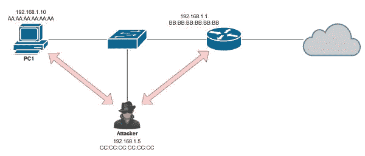
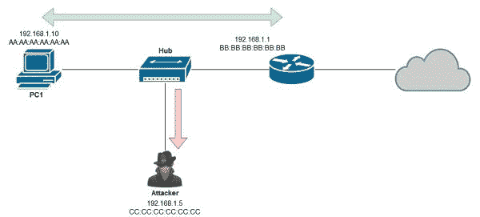
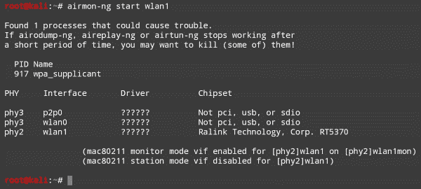
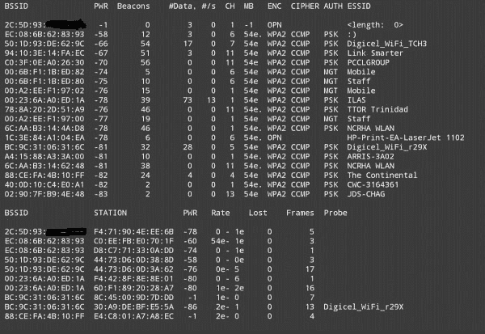
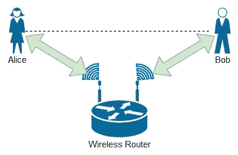
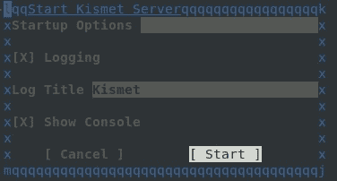
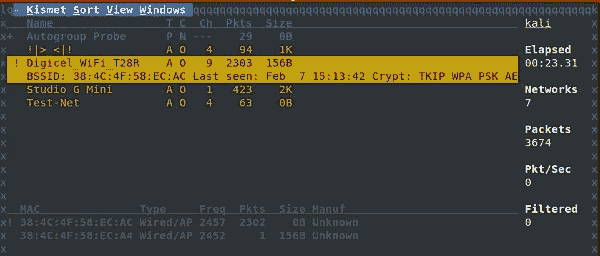
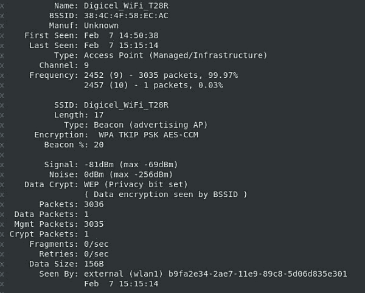
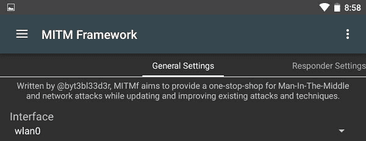

# 第七章：数据包嗅探和流量分析

在渗透测试的侦察或信息收集阶段，我们对目标的信息和细节越多，就越有可能成功利用目标系统或网络上的漏洞。我们将研究 Kali Linux 和 NetHunter 中的各种嗅探和网络流量分析工具和实用程序。

在本章中，我们将涵盖以下主题：

+   使用各种工具捕获网络流量

+   数据包分析

让我们深入研究一下！

# 嗅探流量的需求

为什么渗透测试人员需要了解数据包嗅探的好处？数据包嗅探使渗透测试人员能够监视和捕获网络流量。在计算机网络上进行嗅探也是一种窃听行为。窃听涉及在电线上植入设备，例如网络电缆或电话线，以监视和捕获敏感数据。

以下是可能被数据包嗅探器捕获的一些敏感信息的示例：

+   Telnet 流量

+   FTP 用户名和密码

+   DNS 流量

+   Web 流量

+   电子邮件流量

+   通常，任何以明文格式发送的用户名和密码

这只是一小部分，但是还有很多信息以比特的形式通过网络发送。嗅探器可以是硬件或软件，用于植入网络。基于硬件的嗅探器通常至少有两个接口（端口）；这允许基于硬件的嗅探器放置在网络上并拦截通过它的所有网络流量。

以下图表显示了一个放置在网络中的网络嗅探器，位于交换机和路由器之间。来自客户设备（例如 PC）的所有流量，无论是发送到路由器或路由器以外，反之亦然，都将被设备或攻击者机器拦截和捕获。但是，如果 PC 之间进行互相通信，例如 PC1 向 PC3 发送数据，网络嗅探器将无法拦截或捕获流量，因为此流量不会通过它：


基于硬件的嗅探器可以是非常小的设备，可能只有信用卡大小或火柴盒大小。以下是 Hak5 制造的 Packet Squirrel 的图片（[`shop.hak5.org`](https://shop.hak5.org)）。它的功能之一是捕获通过内联传递的流量并将其存储在 USB 闪存驱动器上（可连接）。该设备既适用于渗透测试人员，也适用于系统管理员，因为它包含允许系统管理员远程访问网络并在局域网内对设备执行故障排除技术的功能：


正如我们所看到的，这是一个内联数据包嗅探器。它将能够捕获和存储通过它的所有网络流量。

# 数据包嗅探技术类型

通常使用以下技术进行数据包嗅探：

+   主动嗅探

+   被动嗅探

# 主动嗅探

主动嗅探涉及渗透测试人员执行的某种操作，例如将用户流量重定向到另一个网关，以监视和捕获网络上的数据包。渗透测试人员可以通过修改 ARP 表中的 IP-MAC 条目，在受害者的机器上执行 ARP 缓存中毒攻击。

向交换机中注入虚假的 MAC 地址将导致 CAM 表溢出，使交换机将所有传入流量泛洪到所有其他端口。

此外，在网络上安装一个 Rogue DHCP 服务器会为客户端提供一个非法的默认网关和 DNS 服务器。受害者的流量将被重定向到潜在的恶意网站，并且他们的流量可能会被拦截。

渗透测试人员需要执行一个先导攻击，以引起受害者流量的重定向。 以下图表简要介绍了主动嗅探：



前面的图表描述了典型的中间人（MITM）攻击。

# 被动嗅探

被动嗅探不需要太多干预。 它允许渗透测试人员在不必发起任何攻击来重定向用户流量的情况下监视和捕获网络流量。 在被动嗅探中，渗透测试人员将与网络上的一个集线器建立连接，因为集线器会将传入的信号广播到所有其他端口。

下图显示了一个被动嗅探的例子，攻击者连接到网络段上的一个集线器，并将沿线传递的所有流量的副本发送到他们的机器：



前面的拓扑图显示了在网络上实施集线器的效果。

# 数据包嗅探的工具和技术

在本节中，我们将讨论各种工具和技术，这些工具和技术可以帮助渗透测试人员成功地捕获网络上的数据包。

# Aircrack-ng

最流行的无线破解工具之一是 Aircrack-ng。 Aircrack-ng 实际上是一套专门用于无线网络的多个安全审计工具。

Aircrack-ng 套件允许渗透测试人员监视无线网络，捕获空中数据包，执行各种类型的攻击，创建伪造的接入点（APs），并执行 WEP 和 WPA 破解。

在第十三章*选择 Kali 设备和硬件*中，我们简要讨论了使用外部无线网络接口卡（NICs）（例如 ALFA Network AWUS036NHA）。 您如何确定无线 dongle 或 WLAN NIC 能否在目标网络上进行监视或执行数据包注入？ 在 aircrack-ng 中，存在一个名为 airmon-ng 的工具，它允许您测试无线 NIC 的兼容性。

有关 Aircrack-ng 工具套件的更多信息，请访问它们的官方网站：[www.aircrack-ng.org](http://www.aircrack-ng.org)。

在 aircrack-ng 套件中，使用 airmon-ng 工具来监视无线网络。 此工具可以帮助渗透测试人员确定以下内容：

+   扩展服务集标识符（ESSID）

+   基本服务集标识符（BSSID）

+   目标无线网络上使用的无线加密标准

+   渗透测试人员的机器与无线路由器之间的大致距离

+   无线网络的操作频道

# 使用 airmon-ng 观察无线网络

首先，我们将验证设备上可用的无线接口数量。 为此，请使用`iwconfig`命令，如下图所示：


仅使用`airmon-ng`命令将为您提供本地无线接口的列表：


要开始，您必须终止可能在启用监视模式时引起干扰的任何进程。 使用`airmon-ng check kill`命令在 Kali NetHunter 上检查并终止这些进程：


接下来，我们将使用`airmon-ng start wlan1`命令启用无线网卡进入监视（混杂）模式：



您可以使用`iwconfig`命令来确定设备上可用的无线接口数量。

输出后，会出现一个新的逻辑接口：`wlan1mon`。 此接口将用于在 Aircrack-ng 中执行所有监视和捕获功能。

接下来，要查看周围所有无线网络，请使用`airodump-ng wlan1mon`命令：



在截图的上部分，我们可以看到以下内容：

+   **BSSID**：接入点或无线路由器的媒体访问控制（MAC）。

+   **PWR**：功率评级。功率级别越低，距离我们越远。

+   **Beacons**：特定 AP 或无线路由器发送的信标消息数量。

+   **CH**：无线路由器正在运行的信道。

+   **Enc**：加密标准，如 WEP、WPA、WPA 或 Open。

+   **Cipher**：加密标准中使用的加密密码。

+   **Auth**：认证机制，如预共享密钥（PSK）或管理（MGT）。

+   **ESSID**：移动设备看到的无线网络的名称。这也被称为服务集标识（SSID）。

让我们也观察一下输出的下部分：


`STATION`列显示了通过 BSSID 值与特定无线路由器关联的客户端的 MAC 地址。功率级别提供了客户端和您的设备之间的大致距离。探针显示了客户端正在寻找的网络（SSID）。

为了更上一层楼，使用以下命令将允许渗透测试者监视、捕获和保存捕获的数据副本以供离线分析：

```
airodump-ng –w offline_file –c <channel number> --bssid <MAC addr of router> wlan1mon
```

以下是一个截图，演示了如何使用一系列命令 - 目标无线路由器的 MAC 地址的一部分被模糊处理以保护隐私：


`-w`允许您在接口上存储流量监视器的副本。`-c`指定要监听的信道。信道号应与目标网络相同。`--bssid`指定目标无线路由器的 MAC 地址。

默认情况下，文件保存在设备的根目录中。如果您在另一个目录中工作，请使用`ls -l`命令查看当前目录的内容。如果您不确定当前路径，请使用`pwd`命令，它会显示您当前的工作目录。

# Arpspoof

渗透测试者可以使用的一种技术是执行 MITM 攻击，以确保他们能够捕获受害者的流量。让我们想象一下，在一个无线网络上有两个人，Alice 和 Bob。他们都希望在网络上交换一些消息。然而，有一个渗透测试者的任务是观察和捕获网络流量。

Alice 和 Bob 将他们的移动设备连接到无线路由器或接入点（AP）并开始通信。无线路由器是一个中间设备，将处理他们所有的流量转发：



使用 arpsoof，渗透测试者能够欺骗路由器的**媒体访问控制**（**MAC**）地址，以欺骗受害者，使网络上的其他用户相信渗透测试者的机器现在是路由器或默认网关。以下图表显示了渗透测试者连接到与 Alice 和 Bob 相同的无线网络。现在的目标是说服 Alice 的机器，唯一的方法是将所有流量发送到渗透测试者，反之亦然，以便 Bob 的网络流量：


以下是`arpspoof`工具中使用的语法：

```
arpspoof –i <interface> -c <host ip> -t <target ip> <host ip> -r
```

+   `-i`：允许您指定一个接口

+   `-c`：指定硬件地址

+   `-t`：指定目标，如默认网关

+   `host`：指定要拦截数据包的主机

+   `-r`：允许捕获双向流量

要执行成功的 MITM 攻击，我们将有一个受害者，Alice，和一个连接到同一网络的渗透测试者。目标是确保 Alice 的机器认为默认网关是渗透测试者的机器：


Alice 和渗透测试者都连接到同一个无线网络（虚线）。然而，渗透测试者使用以下命令来确保 Alice 的所有流量都经过他们的机器，然后再由他们的机器转发到实际的默认网关：

```
arpspoof –i wlan0 –t 172.16.17.18 –r 172.16.17.14
```


一旦命令在渗透测试者的机器上执行，它将持续发送伪造的 ARP 消息到 Alice 和默认网关（无线路由器），以确保它们的本地 ARP 缓存被更新并包含了伪造的 ARP 条目。

# Dsniff

正如创建者所描述的，**Dsniff**是一个网络审计工具和密码嗅探器的集合。它为渗透测试者提供了执行中间人攻击、数据包分析和捕获网络数据包的能力。

在 Kali Linux 或 Kali NetHunter 上使用以下命令将启用 Dsniff 来监听指定接口上的任何流量：

```
dsniff -i <*network adapter*>
```

以下命令是使用`dsniff`来监视设备上`wlan0`接口上的流量的示例：

```
dsniff –i wlan0
```


# Kismet

另一个在 Kali NetHunter 中非常流行的无线监控工具是 Kismet。**Kismet**就像无线网络的瑞士军刀。它可以在无线网络上嗅探数据包，为渗透测试者提供了 war-driving 功能，并能够检测目标网络上的各种无线攻击和威胁。

要开始，可以在 Kali NetHunter 的终端中输入`kismet`。你应该会看到以下屏幕出现；通过按下*Enter*键选择`OK`：


Kismet 将询问你是否允许自动启动 Kismet 服务器；只需选择是：


接下来会出现以下窗口。你可以启用/禁用日志记录，并为日志文件设置一个标题，如果你决定启用日志记录的话。我建议在选择**开始**之前禁用**显示控制台**选项。禁用**显示控制台**选项将直接进入 Kismet 的监控用户界面：



如果你继续使用默认参数，下面的窗口是控制台窗口，显示了 Kismet 所做的每个活动的日志。只需点击**关闭控制台窗口**即可查看 Kismet 的监控用户界面：


现在你已经进入了 Kismet 的主界面，让我们熟悉一下它并了解它的功能。要添加一个监控源，比如一个无线接口，选择`Kismet` | `添加源`：


我选择将我的`wlan1mon`接口作为源。记住，你可以在 Kali NetHunter 上使用`iwconfig`命令来确定你可用的无线接口：


Kismet 有能力确定设备的制造商。

一旦你成功将源接口添加到 Kismet 上，你将开始看到各种无线网络出现在窗口的上半部分。通过选择一个无线网络，相关的客户端将显示在下半部分：



要获取有关目标网络的更多详细信息，请选择`Windows` | `网络详细信息`。正如我们所看到的，Kismet 为我们提供了一个简化的视图，显示了目标网络的名称（SSID）、BSSID（MAC 地址）、设备类型、操作频道、无线电频率、信号强度和加密标准和类型：



# Tcpdump

简单来说，`tcpdump`工具是一个命令行协议分析器。在远程访问渗透测试的情况下，比如你的 Kali NetHunter 设备或者附近目标无线网络中的树莓派，这个工具非常有用。

要启用监视，输入`tcpdump –i wlan0`命令：


请注意，一旦输入了先前的命令，结果就开始在命令行界面中显示。这可能非常具有挑战性，进行实时分析。我建议您首先捕获数据包并将其存储在离线文件中，然后进行分析。

要捕获网络数据包并将其存储在离线文件中，我们可以使用`tcpdump –i wlan0 –w tcpdumpcapture.pcap`命令：


`-w`参数允许您指定要写入捕获数据的文件。在捕获过程中，结果不会显示在屏幕上，而是写入`tcpdumpcapture.pcap`文件。

使用`ls –l | grep .pcap`命令，我们可以看到文件存在如预期的那样：


要验证或读取文件中写入的数据，使用`tcpdump –r <filename>`命令：


# TShark

**TShark**是另一个命令行网络协议分析器。它具有类似的功能，可以捕获实时网络上的流量，甚至读取先前保存以供进一步分析的离线捕获。它的许多功能与先前提到的工具**tcpdump**类似。

要捕获数据包并将数据输出到文件中，我们可以使用`tshark –i <interface> -w <output file>`命令：


再次注意，实时流量不会显示在终端上，因为它被写入`tsharkcapture.pcap`文件。但是，如果不使用`-w`参数，我们将看到命中我们的`wlan0`接口的所有流量：


输出显示我的网络上的另一台机器正在尝试为 Dropbox 执行 LAN 同步。

# MITM 框架

对于这个工具，名字就说明了一切。这是一个包含许多功能的 MITM 框架，比如捕获受害者的 cookie 信息，执行键盘记录功能和地址解析协议（ARP）注入攻击，以及欺骗。

在这个练习中，我们将拦截受害者和默认网关之间的数据包。要开始，请在您的 Android 设备上打开菜单并打开 NetHunter 应用程序：


打开应用程序后，使用左侧的内置菜单展开类别列表。您将看到 MITM 框架与列表，点击它打开：


将出现以下窗口，只需选择要用于攻击的接口：



完成后，向右滑动，直到进入**欺骗设置**选项卡。只需启用欺骗插件，选择重定向模式为 ARP，并设置网关地址和受害者的 IP 地址，如下面的屏幕截图所示：


一旦所有参数都配置好，选择`开始 MITMf 攻击`开始拦截数据包。记住，您可以使用先前提到的任何数据包捕获工具，如 TShack、Tcpdump，甚至 Dsniff，来捕获和存储离线数据包以供以后分析。

# 数据包分析技术

在本节中，我们将讨论使用 Kali NetHunter 中的工具进行数据包分析。我们将使用来自[`wiki.wireshark.org/SampleCaptures`](https://wiki.wireshark.org/SampleCaptures)和[`www.honeynet.org/challenges`](https://www.honeynet.org/challenges)的各种示例文件，因为这些示例是为教育目的而制作的，并包含通常在生产网络上找到的大量数据。

# Dsniff

我们之前使用 Dsniff 来捕获数据包，但现在我们将使用它来帮助我们重新组装并查看离线 PCAP 文件中发生的明文事务。对于此练习，我们将使用来自[`wiki.wireshark.org/SampleCaptures#Telnet`](https://wiki.wireshark.org/SampleCaptures#Telnet)的`telnet.cooked.pcap`文件。

使用`dnsiff –p <filename>`命令来启用来自离线先前保存的捕获文件的内容的处理。如下图所示，有两个设备之间进行了通信：


以下是我们能够解释的信息：


此外，我们知道这是一个由 Dsniff 识别的 Telnet 连接，目的端口是`23`。接下来的文本是从客户端（`192.168.0.2`）发送到 Telnet 服务器（`192.168.0.1`）的实际命令。

# Tshark

我们可以使用 TShark 从我们的离线 PCAP 文件中收集信息。要获取用于访问每个唯一网站的每个 Web 浏览器的副本，我们可以使用以下命令：

```
tshark -r conference.pcapng -Y http.request -T fields -e http.host -e http.user_agent | sort –u | uniq -c | sort -n
```

我们能够看到每个 URL（在下面的截图中左侧）和发出`HTTP GET`请求到 Web 服务器的用户代理（Web 浏览器）：


让我们尝试检索所有 DNS 查询。为此，我们可以使用以下命令：

```
tshark -r conference.pcapng | grep "Standard query" | cut -d "A" -f 2 | sort –u
```

这个命令从`conference.pcapng`文件中读取内容，并创建一个初始过滤器，只显示包含`Standard query`字符串的行。完成后，它将删除任何不必要的数据，并显示 DNS 查询中的每个唯一域名或主机名：


如何从保存的捕获文件中提取工件？使用 TShark 是可能的。使用`–export-objects [smb, http, smb, tftp] <output_folder>`命令来提取对象。在这个例子中，我们将提取使用 HTTP 应用程序协议传输的所有文件。我们首先使用以下命令：

```
tshark -nr conference.pcapng --export-objects http,tshark_folder
```

然后我们验证提取是否成功：


# Urlsnarf

**Urlsnark**用于从实时网络流量甚至离线`.pcap`文件中嗅探 HTTP 请求。这个工具可以帮助我们确定网络上的客户端访问了哪些网站。对于此练习，我们将使用来自[`www.honeynet.org/node/1220`](https://www.honeynet.org/node/1220)的`conference.pcap`文件。

要开始，请下载并在设备上离线保存。使用`urlsnarf –p <file>`命令来获取所有 HTTP 数据：


但是，正如你所看到的，输出非常庞大。让我们创建一个过滤器，只提供此文件中的 HTTP URL。我们可以使用以下命令：

```
urlsnarf -p conference.pcapng | grep "http://" | cut -d "/" -f 5
```


我们的输出现在清晰多了。我们有了在此捕获期间用户访问的所有 URL 的列表。让我们创建另一个过滤器，以确定每次通信期间的用户代理（客户端的 Web 浏览器）。使用以下命令将删除重复项并对输出进行排序：

```
urlsnarf -p conference.pcapng | grep "http://" | cut -d '"' -f 6 | sort –u
```


# Tcpdump

我们可以使用 Tcpdump 来查看用户代理，使用`tcpdump –r <file> -nn -A -s1500 -l | grep "User-Agent:" | sort –u`命令，如下图所示：


如前所述，用户代理确定 Web 浏览器。这些信息在取证调查中可能很有用。此外，我们可以使用`tcpdump`来查看捕获文件中的所有源和目的 IP 地址。

要获取源 IP 地址和源端口的列表，我们可以使用以下命令：


查看所有目标 IP 地址和目标端口号，请使用以下命令：


# 总结

在本章中，我们讨论了在网络上嗅探和分析数据包的好处。主要目的是捕获敏感信息，这将帮助我们进行渗透测试。我们比较和对比了主动和被动嗅探技术。此外，我们演示了使用 Kali NetHunter 上的一套工具进行各种数据包捕获技术和分析。希望本章对您的学习和职业有所帮助。

在下一章中，我们将涵盖针对无线设备和网络的目标。
