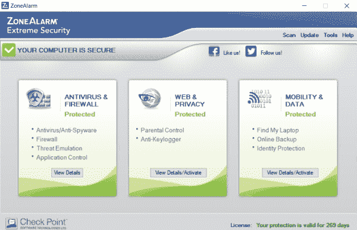
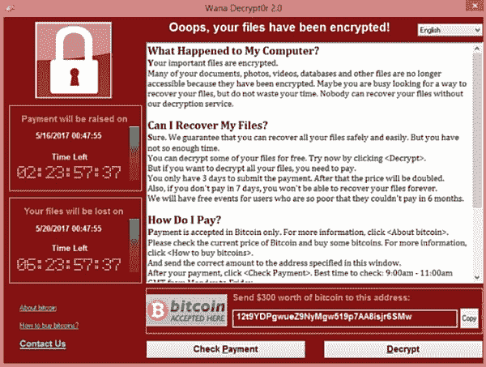
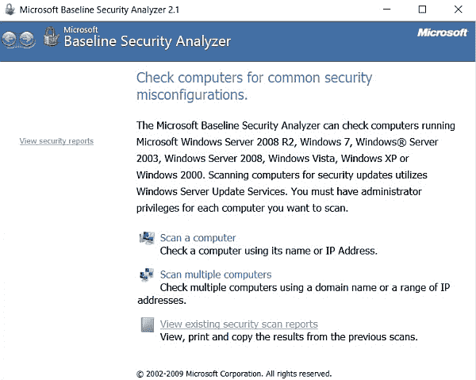
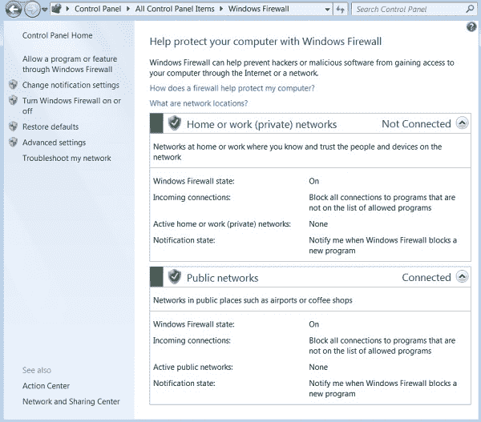
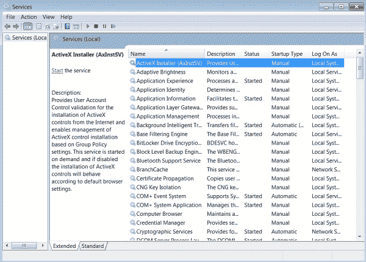
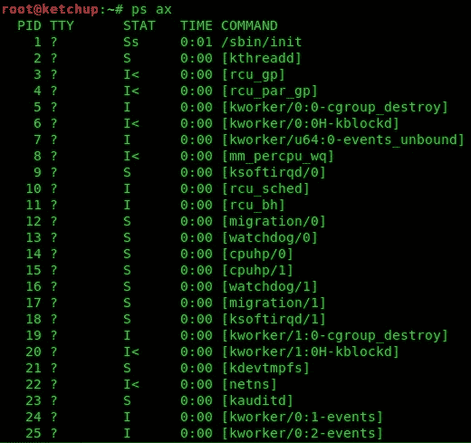

# 第十章：加固技术和对策

进入渗透测试和攻击性安全领域总是非常令人兴奋的；学习如何在系统和网络上进行利用的艺术是很有趣的。有时，你的职业道路可能会从侵入客户网络转向协助组织保护其网络基础设施免受黑客和其他潜在威胁。在过去的几年里，每天都有很多网络攻击被报告。让我们不要忘记那些没有在本地网络中报告网络攻击的组织，因为他们试图保护自己的组织声誉，最后，那些尚未在其网络上检测到入侵的组织。

通常情况下，组织会创造工作岗位来雇佣新的网络安全专业人员，但职称和工作描述并不完全符合渗透测试，而更多地是作为安全管理员或安全工程师。这些角色通常包括紫队的功能，如在第二章中提到的，*了解渗透测试过程的各个阶段*。紫队是红队和蓝队的结合，他们在网络安全中既扮演攻击方又扮演防御方，以侦测、缓解和实施组织中的网络攻击的对策。

在本章中，我们将学习各种加固技术，以提高系统的安全性。此外，我们将看看组织可以在其基础设施上实施的对策，以预防和缓解网络攻击。

在我们即将结束这本书时，对于渗透测试人员来说，了解不同平台上的加固和缓解技术同样重要，以防范安全威胁并降低风险。

在本章中，我们将涵盖以下主题：

+   常见的安全威胁

+   保护网络设备

+   保护客户操作系统

+   保护服务器操作系统

+   保护移动设备平台

让我们开始吧！

# 安全威胁和对策

在本节中，我们将看看各种安全威胁以及如何实施对策。

# 病毒

病毒是一种恶意代码，旨在对系统（如计算机）造成伤害。通常情况下，病毒不会自行执行，而是需要人的操作；这种操作可以通过简单地点击或运行感染病毒的文件来完成，这将触发恶意代码的执行。

一个显著的病毒类型被称为**蠕虫**。蠕虫是一种自我复制的病毒，可以在网络中传播，无需人类的帮助。

想象一下创建一个可以自我复制而无需用户交互并且占用系统资源如此之多以至于一个感染蠕虫的系统几乎无法使用的程序。一旦蠕虫病毒被创建并且其自我复制的过程被触发，清除网络就变得非常困难。

为了防止病毒和蠕虫的恶意软件感染，建议在所有主机设备（如台式机和服务器系统）上启用端点保护，如防病毒或反恶意软件保护。然而，确保每个防病毒客户端始终使用最新的病毒定义非常重要，以最大程度地保护主机。

以下是一些防病毒软件供应商：

+   ZoneAlarm

+   卡巴斯基实验室

+   Bitdefender

+   Avast

+   赛门铁克

以下是 ZONEALARM Extreme Security 用户界面的截图：

您可能想知道是否有必要购买商业防病毒软件来获得保护。在 Microsoft Windows 平台上，有一个由微软创建的内置/预装的反恶意软件保护，称为**Windows Defender**，而且是免费的。Windows Defender 提供对各种威胁的实时保护。以下屏幕截图显示了 PC 状态：

近年来，加密恶意软件在数字世界中出现，并对全球许多系统造成了重大破坏，因为几乎没有人准备好防范或减轻这种新型威胁；这种恶意软件被称为**勒索软件**。勒索软件的目标非常简单：一旦受害系统被感染，恶意软件会加密整个系统，使其不稳定，并将磁盘驱动器上的数据作为人质，直到支付赎金为止。然而，用于加密受害者系统磁盘驱动器的加密密钥经常更改，以防止受害者解密驱动器并删除勒索软件。以下是受害者系统上*WannaCry*勒索软件变种的屏幕截图：

感染了勒索软件后，受害者系统上唯一显示的窗口是付款界面。组织中最有价值的资产之一是数据。黑客看到了数据的价值，因此创建了加密恶意软件来劫持这一特定资产。然而，不建议支付赎金，我们知道数据非常有价值，可能包含重要的财务记录和敏感信息。一旦受害者提供他们的信用卡信息，就绝对不能保证攻击者会提供解密密钥；相反，他们可能会从受害者的信用卡中窃取资金。

许多威胁情报和预防公司，如 Check Point Software Technologies ([`www.checkpoint.com/`](https://www.checkpoint.com/))、卡巴斯基实验室 ([`www.kaspersky.co.in/`](https://www.kaspersky.co.in/)) 和 Bitdefender ([`www.bitdefender.com/`](https://www.bitdefender.com/))，已开发了反勒索软件保护，以帮助防止和解密受感染的系统。

以下是 ZoneAlarm 反勒索软件客户端的屏幕截图：

一旦系统安装了反勒索软件保护，它会在检测到互联网连接后自动更新。如果勒索软件企图在本地系统上安装自己，反勒索软件保护将对系统进行消毒，并解密勒索软件影响的任何文件。

保护免受勒索软件的对策包括以下内容：

+   在客户系统上安装反勒索软件保护。

+   定期备份数据。

+   在操作系统上安装最新更新。

+   保持防病毒应用程序的更新。

# 其他常见病毒

以下是一些其他常见的病毒：

+   **特洛伊木马**：特洛伊木马病毒伪装成看起来像合法软件或应用程序，但其核心内部包含恶意载荷。其目的是欺骗受害者在其系统上运行该应用程序；一旦特洛伊木马被执行，恶意载荷将在用户不知情的情况下在后台卸载自己。一些特洛伊木马被用于为黑客创建*后门*，以非法进入受害者系统，这些被称为**远程访问特洛伊木马**（**RATs**）。

+   **间谍软件**：间谍软件是一种安装在受害者系统上的病毒，它收集用户的活动等信息，并将信息发送回其创建者。间谍软件的一个例子是潜伏在受害者系统上并收集用户按键的**键盘记录器**。

+   **Rootk****its**：Rootkit 病毒的主要目标是成为计算机内核的一部分。Rootkits 通常对操作系统和防病毒应用程序是不可见的。其目的是在受害者计算机上获得根级别权限，这将使恶意软件在系统上具有完全访问权限，从而可以执行任何操作。

恶意软件通常通过以下媒介进行分发：

+   电子邮件

+   网络文件共享

+   互联网或驱动器下载

+   社会工程学

以下是一些恶意软件的对策和缓解措施：

+   在所有系统上安装防恶意软件保护。

+   确保防恶意软件应用程序始终保持最新。

+   定期在所有系统上运行病毒扫描。

+   在操作系统上安装最新的更新。

+   在电子邮件服务器上启用垃圾邮件过滤。

+   不要点击任何可疑的电子邮件消息或网址。

# 客户端系统安全

在本节中，我们将重点关注保护操作系统。在组织中，IT 部门通常为每个独特的系统制定基线。安全基线规定了应如何安装和配置操作系统，以确保满足安全要求。

操作系统的安全基线通常包括以下内容：

+   在操作系统上禁用任何不必要的服务。

+   定期安装系统更新和补丁。

+   强制执行密码复杂性策略。

+   禁用或删除任何不必要的用户帐户。

+   确保安装并更新端点保护，如防病毒软件。

+   启用系统日志记录以便追责。

# Windows 基线

为 Microsoft Windows 创建基线实际上非常简单。以下目标可用作建立基线的检查表：

+   操作系统安装应该在磁盘驱动器上的单个分区上使用 NTFS 文件系统进行。

+   安装最新的补丁并启用 Windows 自动更新，以确保所有漏洞得到相应的修补。

+   启用和配置 Windows 防火墙。

+   安装并更新防病毒保护。

+   禁用任何不必要的服务。

基线是未来参考的起点，可用作测量过程或系统是否在正常容量内运行的依据。

**Microsoft 基线安全分析器**（**MBSA**）允许系统管理员和安全专业人员扫描本地系统或基于 Windows 的系统网络，以查找任何安全配置错误。

MBSA 可以在[`www.microsoft.com/en-us/download/details.aspx?id=19892`](https://www.microsoft.com/en-us/download/details.aspx?id=19892)找到。

采取以下步骤创建基线：

1.  安装 Microsoft 基线后，打开应用程序。您将看到以下窗口：

1.  单击“扫描计算机”。您可以选择使用计算机的主机名或 IP 地址作为扫描目标。在本练习中，我们将使用计算机名称字段中的默认主机名。

1.  单击“开始扫描”，如下面的屏幕截图所示：

1.  结果将自动填充到新窗口中，如下面的屏幕截图所示：

结果将指示需要系统管理员关注的各种安全问题和配置错误。检测到的每个问题都会被赋予严重性评级，以便轻松识别系统上最关键的安全问题。

# Windows 注册表

Windows 注册表存储了系统的所有配置和记录-从系统启动到关闭的所有操作。注册表，更为人所知的是蜂房，通过使用注册表键来维护其记录。蜂房是注册表中的一组逻辑键、子键和值，具有包含其数据备份的一组支持文件。注册表是一个包含对 Windows 操作和在 Windows 上运行的应用程序和服务至关重要的数据的分层数据库。每个操作、配置、任务等都有一个唯一的键。监视任何异常变化或活动可以帮助检测安全妥协。监视和审计 Windows 注册表的一个工具是进程监视器：

进程监视器是微软的 Sysinternals 工具套件的一部分。要下载进程监视器，请访问[`docs.microsoft.com/en-us/sysinternals/downloads/procmon`](https://docs.microsoft.com/en-us/sysinternals/downloads/procmon)。

# 用户帐户

系统上的每个用户都应该有自己的用户帐户，但有时用户不再在组织中或已经转移到另一个部门或位置，他们的用户帐户仍然在特定系统上启用。在系统上禁用不必要的用户帐户是良好的安全实践。

要在 Windows 上禁用用户帐户，打开控制面板|用户帐户|管理帐户。

在 Microsoft Windows 上禁用或删除访客帐户。这可以防止用户使用访客用户帐户访问您的计算机。

# 补丁管理

补丁管理过程包括以下目标：

+   使用工具自动检测更新和补丁。

+   进行漏洞评估，以确定其严重程度和需要补救问题的补丁。

+   获取解决安全问题所需的补丁。

+   在非生产机器上测试补丁，以确定安全问题是否已解决。

+   将经过测试的补丁部署到组织内的系统。

+   维护所有系统。

Microsoft Windows 提供了一个选项，可以自动下载和安装更新、补丁和服务包。要调整 Windows Update 的选项，导航到控制面板|Windows Update|更改设置：

# Windows 防火墙

Microsoft Windows 操作系统具有内置防火墙，可防止恶意流量进入和离开本地系统。要确保 Windows 防火墙已启用，请导航到控制面板|Windows 防火墙，如下图所示：

要调整配置，例如在防火墙上创建、修改或删除规则，请单击高级设置，如下图所示：

# 禁用服务

在操作系统上使用未使用的服务可能会成为潜在的安全风险，因为攻击者可以尝试利用运行服务中的漏洞来破坏系统。在操作系统上禁用任何不必要的服务非常重要。

以下是一个非全面的服务列表，如果不使用应该禁用：

+   文件传输协议（FTP）

+   Telnet

+   通用即插即用（UPnP）

+   SQL Server

+   Internet 信息服务（IIS）

要在 Microsoft Windows 上禁用服务，打开控制面板|管理工具|服务：

您可以启动、停止和重新启动任何可用的服务。要进行修改，只需双击服务：

# Linux 基线

正如我们在前一节中所学到的，安全基线通常涉及创建允许安全、轻松部署机器的映像。以下是为 Linux 操作系统创建安全基线的指南：

+   确保 Linux 操作系统始终使用最新的安全补丁。可以使用`yum update`或`apt-get update && apt-get upgrade`命令执行此操作。

+   确保执行强密码策略。

+   禁用任何未使用的服务。

+   启用磁盘加密。

+   启用日志记录和审计。

+   配置防火墙策略。

+   禁用 USB 设备。

+   保护 Web 服务。

+   创建备份和保留策略。

+   避免使用不安全的服务，如 HTTP、Telnet 和 FTP。

Linux 和 Windows 安全策略在两个操作系统上可以互换使用。

# Linux 的安全扫描程序

**Buck-security** ([`www.buck-security.net/buck-security.html`](http://www.buck-security.net/buck-security.html))是专为基于 Ubuntu 和 Debian 的 Linux 操作系统设计的安全扫描程序。

要安装 buck-security，您需要从其官方 GitHub 存储库下载文件。使用`git clone https://github.com/davewood/buck-security`命令执行此功能，如下面的屏幕截图所示：

接下来，使用`cd buck-security`命令将目录更改为`buck-security`文件夹。一旦进入`buck-security`目录，您可以执行工具对本地系统进行安全审计。要执行此实用程序，请使用`./buck-security`命令，如下面的屏幕截图所示：

**Lynis**是另一个安全审计和合规性工具，专为 Linux 和 macOS 操作系统设计。它具有在本地或远程系统上执行安全审计和非特权扫描的能力。根据开发人员的说法，Lynis 通常用于安全审计、合规性测试、渗透测试、漏洞评估和系统加固。

有关 Lynis 的更多信息，请访问其官方网站：[`cisofy.com/lynis`](https://cisofy.com/lynis)。

要开始使用 Lynis，您需要使用`git clone https://github.com/CISOfy/lynis`命令从官方 GitHub 存储库下载项目文件。

接下来，使用`cd lynis`命令将目录更改为`lynis`文件夹。

要执行本地安全扫描，我们可以简单地使用`./lynis audit system`或`lynis audit system`命令。

要执行远程安全扫描，请使用`lynis system remote <远程主机的 IP 地址>`命令。

要执行非特权扫描（对于渗透测试很有用），请使用`lynis --pentest`命令：

# 在 Linux 中禁用服务

要在基于 Linux 的系统上确定运行的服务，`ps ax`命令将显示当前正在运行的服务列表及其 PID，如下面的屏幕截图所示：

正如我们所看到的，PID 列出了它们对应的服务。您可能被要求停止或终止服务；要立即在本地系统上终止服务，请使用`kill -9 <PID>`命令。

假设您想要查看具有`firefox`字符串的任何运行服务/进程-使用`ps –A |grep firefox`命令：

输出显示`firefox-esr`服务当前正在本地系统上运行，使用`2340` PID。我们可以使用 PID 和`kill`命令终止此服务，如下面的屏幕截图所示：

在 Linux 中确定运行的服务的另一个实用程序是`netstat`命令。使用`netstat –lp`命令将显示当前处于监听状态的网络协议及其对应的程序：

使用`update-rc.d –f <server-name> remove | stop`命令将在 Linux 中禁用不需要的服务。

# 加固网络设备

为了最小化路由器的攻击面，使用以下清单：

+   更改所有默认密码。

+   创建强密码。

+   禁用 HTTP 服务器及其配置。

+   禁用 ping 响应，如 ICMP 回显回复。

+   为流量过滤应用**访问控制列表**（**ACLs**）。

+   禁用不安全的服务，如 Telnet。

+   将固件和操作系统更新到最新的稳定版本。

+   禁用不必要的服务。

以下清单可用作加固交换机的基础：

+   应用端口安全。

+   强制执行密码策略以获得强密码和复杂性。

+   使用 SSH 而不是 Telnet。

+   禁用**动态中继协议**（**DTP**）。DTP 使链接自动成为中继。

+   不要使用 VLAN 1。

+   启用生成树根守卫和 BPDU 守卫。

+   启用 DHCP 监听。

# 加固移动设备

有时，在讨论智能手机的话题时，我们会听到一个 Android 用户提到他们已经*rooted*他们的设备。什么是 rooting？在 Android 生态系统中，*rooting*是指在移动设备上获得根级别访问权限。与 Linux 一样，root 用户帐户被认为是系统上具有超级/完整权限的用户；由于 Android 是基于 Linux 的，获得完整的管理权限被称为**rooting**。

拥有完全访问权限的设备非常棒，这意味着您可以安装和修改应用程序和系统资源以满足您的需求。然而，对于 Android 用户来说，rooting 会带来许多安全风险。首先，如果设备被 rooted，设备的保修将变为无效，而且更容易感染恶意软件。在 rooting 过程中，设备可能会变得无法使用，或者 Android 用户所说的*砖化*（无法使用）。虽然用户可以在 rooted 设备上安装和修改系统，但这会阻止 Android 设备接收和/或安装来自制造商的**空中**（**OTA**）更新。

系统更新对于任何设备都非常重要，无论是台式机、服务器、路由器、交换机、防火墙还是智能设备，如智能设备。系统更新是为了修复错误和安全问题而创建和推出的。因此，rooted 设备更容易受到威胁。

类似于对 Android 设备进行 root 以获得完整/超级用户权限，对于苹果设备来说，相应的术语是*越狱*。越狱为移动用户提供了根级别的权限，并允许您从苹果应用商店之外的来源下载应用程序。

以下是为 Android 和 iOS 设备开发安全检查清单/基线的指南：

+   确保操作系统保持最新。

+   不要 root Android 设备。

+   只从官方应用商店下载和安装移动应用程序，如 Google Play 商店和苹果应用商店。

+   从受信任的安全供应商下载并安装防病毒应用程序。

+   确保启用锁屏。

+   确保您的 iPhone/iPad 或 Android 设备上启用了密码锁。

+   确保更改默认密码。

+   在 Web 浏览器中禁用附加组件和 JavaScript。

# 总结

在本章中，我们讨论了常见的安全威胁以及可能的对策和缓解技术。我们讨论了组织内系统安全基线的需求，并研究了一些工具，帮助我们在 Windows 和 Linux 操作系统上测量安全风险。然后，我们讨论了网络设备（如路由器和交换机）的各种加固技术，并最后学习了加固移动设备。

在下一章中，我们将探讨为实验室构建环境。
