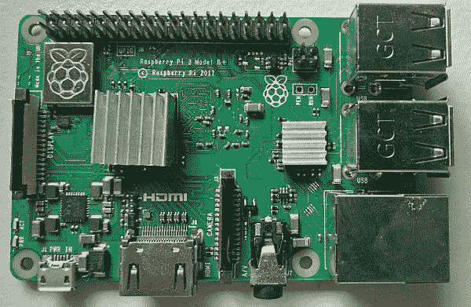
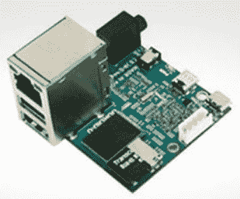

# 第十二章：选择 Kali 设备和硬件

当您几乎完成了这本书，仍有一些重要的细节和组件需要讨论，以确保您已经准备好进行渗透测试之旅。

在本章中，我们将涵盖以下主题：

+   适用于 Kali Linux 的移动硬件

+   外部组件

+   额外的硬件

在本书的过程中，您已经了解了渗透测试领域，特别是使用移动设备对目标系统或网络执行真实世界的模拟攻击和分析。但是，选择适合 Kali Linux 的设备有时可能会有些麻烦。作为学生、安全专业人员、渗透测试人员或者在网络安全领域开始探索道路的人，尤其是在渗透测试方面，您可能会有以下问题：

+   Kali NetHunter 可以在任何移动设备上运行吗？

+   如果我没有兼容的设备，还有其他可以尝试的吗？

+   是否可以创建自己的 Kali NetHunter 的自定义版本？

让我们开始吧！

# 小型计算机

最初，Kali Linux 渗透测试平台是一种操作系统，可以安装在计算机的本地硬盘驱动器（HDD）上，或者从光盘（如数字多用途光盘（DVD））上进行现场引导。多年来，Kali Linux 的开发扩展到了更新和更现代的设备，如智能手机和平板电脑，甚至其他具有高级 RISC 机器（ARM）处理器的设备，如树莓派。

# Gem PDA

与基于安卓的智能手机等现代移动设备相比，Gem PDA 看起来有点“老派”。这款设备结合了智能手机和个人数字助理（PDA）的概念：

您可能想知道这款设备适合 Kali Linux 的原因。Gem PDA 支持多重引导功能，可安装最多三个操作系统。

以下是支持的操作系统列表：

+   安卓

+   Debian

+   Kali Linux

+   旗鱼

Gem PDA 的 Kali Linux 镜像可以在[`www.offensive-security.com/kali-linux-arm-images/`](https://www.offensive-security.com/kali-linux-arm-images/)找到。

# 树莓派 2 和 3

树莓派是一款信用卡大小的单板计算机。可以将其视为没有外围设备（如键盘、鼠标和驱动程序）的计算机。但是，CPU、RAM、输入/输出（I/O）模块和网络适配器都集成在一个单板上，使其成为微型计算机：

树莓派 3 型 B+目前是市场上最新的型号，具有以下整体规格：

+   Cortex-A53（ARMv8）64 位 SoC，主频 1.4GHz

+   1GB SDRAM

+   2.4GHz 和 5GHz IEEE 802.11.b/g/n/ac WLAN

+   蓝牙 v4.2

+   通过 USB 2.0 的千兆以太网

+   5V 2.5A 直流电源输入

+   通过以太网供电（PoE）

+   Micro SD 端口（用于操作系统）

# ODROID U2

ODROID U2 是一款超小型微型计算机，比信用卡还小。该设备配备了 Cortex-A9 四核 1.7 GHz 处理器，2 GB RAM，支持通过 Micro HDMI 进行视频输出，用于网络连接的 10/100 Mbps 以太网，使用 MicroSD 进行存储，并需要 5V 2A 电源适配器：

支持 ARM 的设备列表可以在官方 Kali ARM 文档网站上找到：[`docs.kali.org/category/kali-on-arm`](https://docs.kali.org/category/kali-on-arm)。此外，Kali NetHunter 镜像可以在[`github.com/offensive-security/kali-nethunter/wiki`](https://github.com/offensive-security/kali-nethunter/wiki)找到。

# 移动硬件

选择适合 Kali NetHunter 平台的移动设备并不像看起来那么困难。Offensive Security 团队（[www.offensive-security.com](http://www.offensive-security.com)）为我们创建了自定义镜像，但是也有一个支持设备的列表。最初，Kali NetHunter 是为 Google Nexus 系列设备和 OnePlus 设计的：

+   Nexus 5

+   Nexus 6

+   Nexus 7

+   Nexus 9

+   Nexus 10

+   OnePlus One

Offensive Security 推荐 OnePlus One 作为 Kali NetHunter 平台的首选移动设备。要下载 Nexus 系列和 OnePlus One 设备的官方镜像，请访问[`www.offensive-security.com/kali-linux-nethunter-download/`](https://www.offensive-security.com/kali-linux-nethunter-download/)。

你可能会认为首选设备的数量有很大的限制；幸运的是，还有一个额外的支持设备列表：

如果你使用的设备在上表中列出，你需要为你的设备构建一个自定义版本的 Kali NetHunter。要做到这一点，请参考第一章中的*构建 Kali NetHunter*部分，即《Kali NetHunter 简介》。如果需要更多信息，请参考官方文档：[`github.com/offensive-security/kali-nethunter/wiki/Building-Nethunter`](https://github.com/offensive-security/kali-nethunter/wiki/Building-Nethunter)。

以下是根据它们的代号和 Android 版本给出的支持的 Android 设备列表：

# 外部组件

在本节中，我们将讨论对使用 Kali NetHunter 模拟对目标的攻击的渗透测试人员有用的外部组件。

# 无线适配器

作为渗透测试人员，一个必不可少的硬件是一个外部无线适配器，用于对目标网络执行各种无线攻击。以下是与 Kali NetHunter 内核兼容的支持的无线适配器列表：

一些适配器可能由于各种原因无法工作，比如不兼容的内核和驱动程序 - 适配器可能无法从 Android 设备获得足够的电源；在这种情况下，建议使用带有外部电源的 Y 型电缆。

# OTG 电缆

此外，在使用 Kali NetHunter 时，**on-the-go**（**OTG**）电缆应该是你的组件清单的一部分。OTG 电缆将允许 USB 设备，如外部无线适配器，与 NetHunter 接口。

以下是带有 RT5370 迷你 USB WiFi 适配器的 OTG 电缆的图像：

# 总结

在本章中，我们看了一些支持 Kali Linux 操作系统的微型计算机。这些设备可以让渗透测试人员为目标网络创建自己的网络植入物。在审查编译特定设备的自定义 Kali NetHunter 镜像的方法时，我们涵盖了支持的移动设备列表。最后，渗透测试离不开无线网络适配器，因此提供了已知支持的移动设备的无线适配器列表。

希望本章和本书对你的学习有所帮助，并将在你的网络安全之路上受益。谢谢你的关注！
