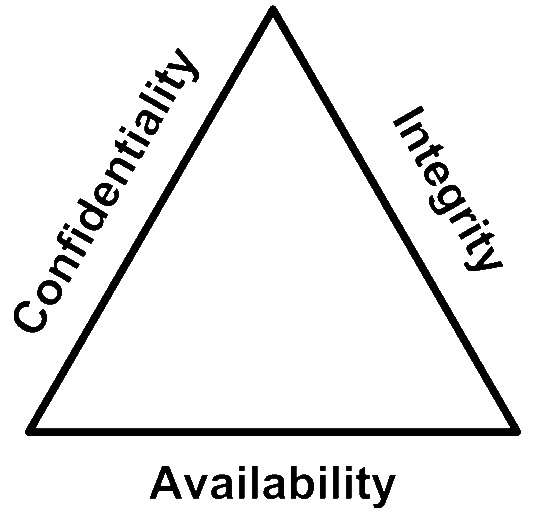
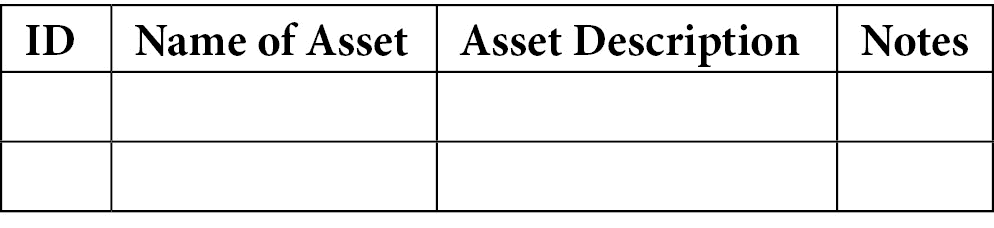
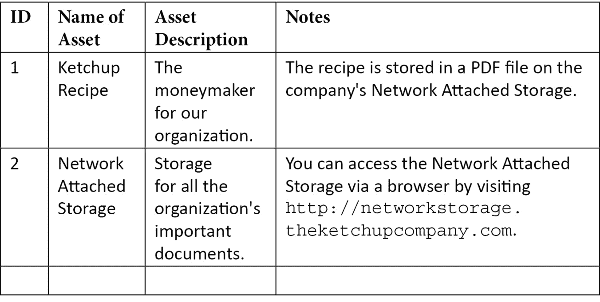
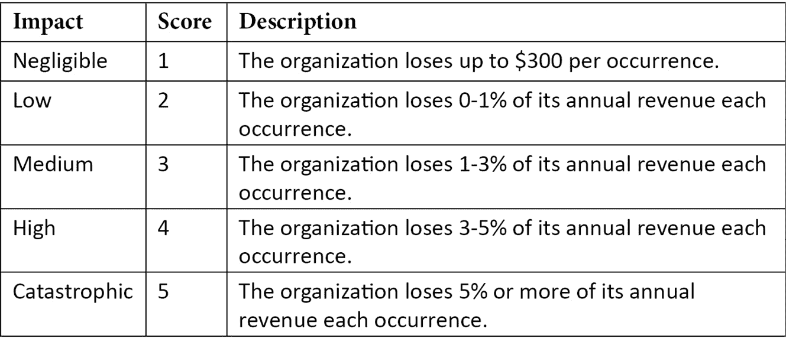
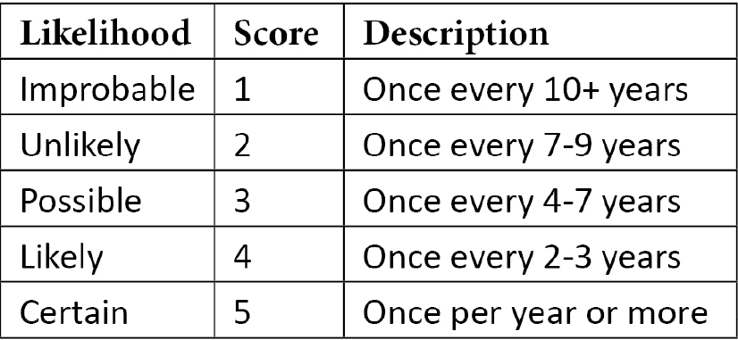
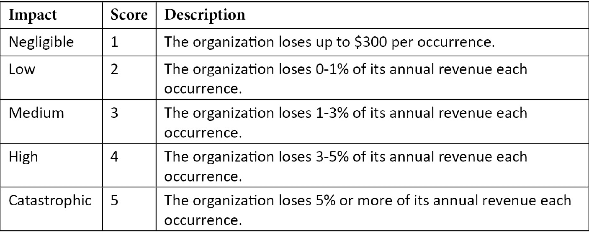
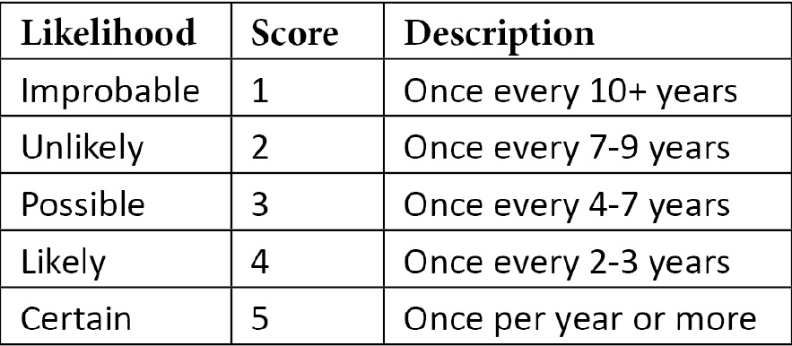
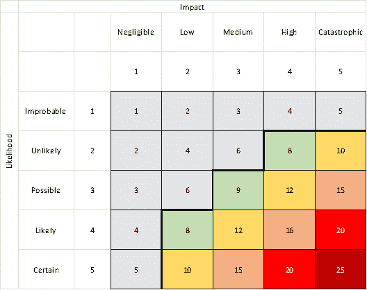

# 第一章：信息安全与风险管理

由于这是本书的第一页，我应该告诉你为什么你可能想购买这本书，而不是其他书籍。如果以下内容符合你，那么本书将帮助你在职业生涯中取得进展：

你可能正在寻求开始（或最近刚开始）从事信息安全工作。也许你一直在参加课程并为行业标准认证（如 CISSP 或 CISM）进行学习，但你希望找到一种方法，将那些概念（以及看似无尽的缩略语）从理论转化为实践，并开始在你所在组织的日常工作中做出改变。

在本书中，我们将帮助你将认证理论转化为可操作的实际变化，以使你的组织更安全，并帮助你在信息安全专业领域取得职业进展。

这有打动你吗？这本书现在已经加入你的购物车了吗？太好了，那我们开始吧。

本章将讨论对信息安全专业人士决策有重大影响的主要主题：风险管理和治理结构。虽然这听起来不像充满激动和兴奋的内容，但如果你能够掌握本章中提到的基本内容，我实际上可以保证你很快就能成为一台高效、运转顺畅的风险管理机器。如果*这*都不能让你继续往下读，那还有什么能呢？

让我们稍微正式一些，列出我们将在本章中讨论的主要主题：

+   基本的网络安全术语

+   理解为什么风险管理如此重要

+   执行基本的风险评估

+   考虑法律法规、调查和合规结构

+   创建策略的验证方法

那么，让我们开始吧！

# 基本的网络安全术语

在深入一些较为复杂的话题之前，我们首先需要建立一个通用的术语集，确保我们讲的是同一种语言，以便简化本书中的思想。否则，本书可能会变得过于复杂，甚至几乎无法解读。我的写作意图是减少模糊性，确保你能与我保持同步。

例如，在第一页，我说过本书将帮助你“在你所在组织的日常工作中做出改变”。在这句话中，我们可以看到一个常见的网络安全术语：**组织**。无论你的信息安全知识是由公司、政府、企业、小型公司、非营利组织、课外团体或其他结构所运用，它们都属于“组织”这一总括术语，而这就是我们在本书中使用的术语。

让我们看看其他一些基本术语。比如**信息**如何定义？信息包括数据，但也可以包括常识或知识产权。例如，经过头脑风暴会议后写在白板上的新公司口号，现在被视为“信息”，即使它不是“数据”（即以二进制形式存储在硬盘上），它也应该受到保护。

这逻辑上引出了**安全**，即*保护状态*。信息可以通过多种方式进行保护，最常见的是一个三角形或“三元组”的概念，称为**CIA 三元组**。你可能从其他信息安全书籍和培训中见过它，但**CIA**代表**机密性**、**完整性**和**可用性**。它们在信息安全的日常操作中非常重要，这就是为什么它们再次被提到：

](img/B16611_01_001.jpg)

图 1.1 – CIA 三元组

**机密性**是指保持信息的秘密性，确保只有被授权的人才能查看它。**完整性**是指确保信息未被未经授权的更改。**可用性**意味着那些有权限的人可以及时访问信息。*CIA 三元组*之所以通常以三角形（如前面的图示）表示，是因为这三个原则作为一个互相联系的系统共同作用，代表了一个资产或一组资产的安全性。

常被忽视的 CIA 三元组中的“N”是**不可否认性**，它的意思是，如果一个实体创建（或更改）了某些信息，那就是权威且不可争议的。这是证明数据来源的能力。

现在我们已经讲解了一些基础内容，我想讨论一下为什么风险管理对你和你的组织很重要。

# 理解为什么风险管理很重要

在本书中，我们将不断提到*风险*。为了确保我们在同一频道，花时间定义并讨论各种*风险管理*话题，以及它们为什么重要，是很值得的。

首先，我们将定义**风险**为*潜在的损失*。构成*风险*的要素有**资产**、**威胁**、**漏洞**、**可能性**和**影响**，我们将在本节中定义并探讨每一个要素，并在本书中不断提及。

暂时来说，**信息安全风险**可以总结如下：

“信息安全风险是潜在的损失，通过威胁利用信息系统资产中的一个或多个漏洞的综合影响和可能性来衡量。”

想象一下，通过理解*威胁*利用*漏洞*的*可能性*，再结合该*威胁*利用该*漏洞*的*影响*，你可以衡量与该**安全事件**相关的*风险*水平。你的组织每天都会面临许多风险，这些风险可能已经有了**风险评分**和年化成本，这些都是通过进行**风险评估**来确定威胁利用漏洞的影响，以及威胁利用该漏洞的可能性。

考虑以下简化公式：

*风险 = 影响 x 可能性*

组织希望通过称为**风险管理**的过程来最小化潜在损失，通过该过程它们识别、评估和优先考虑风险，并实施多层次的缓解控制，减少损失的影响和可能性。

那么，*为什么风险管理对信息安全重要*？风险管理并不是要消除组织面临的所有风险，或者为了形式而增加官僚主义。风险管理为组织的日常运营提供了透明度和问责制，并使组织的风险与其战略目标保持一致。风险管理还帮助组织为可能对其成功产生负面影响的不利事件做好准备。

在现代背景下，信息系统是大多数组织进行业务操作的核心，因此*信息安全风险管理*正成为每个组织整体风险管理重点的更大组成部分。

为了有效地涵盖*风险管理*，首先需要深入探讨几个关键的*风险*主题和定义。让我们开始吧！

## 了解资产

让我们来看看我之前写的那句总结*风险*的长句：

“信息安全风险是指通过威胁利用漏洞在一个或多个信息系统资产中的潜在损失，这个损失是通过威胁的*影响*和*可能性*的结合来衡量的。”

从风险的构成结构来看，我们可以看到，首先，你不能没有**资产**就谈论*风险*。你的组织拥有许多*资产*：数字资产、物理资产，甚至声誉资产。在本书中，我将*资产*定义为*对组织有价值的任何事物*。不同的*资产*有不同的*风险*，因为不同的*资产*有不同的*威胁*、不同的*漏洞*，以及在资产丢失、曝光或修改（或其处理方式）时产生的不同*影响*。

现在，有些公司资产可能与信息安全风险没有显著关联，比如几年前公司聚会上的一箱 T 恤。让我们先专注于将你组织的“皇冠明珠”信息资产记录到*资产登记表*中；随着进展，我们可以随时添加更多资产到登记表里。

**资产登记表**或**资产清单**是列出组织资产的文档。创建这样的文档（并保持更新）将有助于风险管理过程中的各个方面，因为在这个*资产登记表*中，你将开始构建与资产处理相关的各种组织方面，并基于这些资产识别风险。文档中的信息可能包括*资产所有者*、*资产分类*、*资产价值*等。

在我们深入探讨之前，我认为值得展示一下如何为我们的组织创建一个极其简单的*资产登记表*。它最开始可能看起来像这样：

本质上，在这份文档中，我们将为每个资产分配一个 ID、一个简短的名称、一个描述以及与该资产相关的任何备注。我们可以根据需要添加“资产所有者”、“资产分类”或“资产价值”等栏目。这取决于你的需求，以及你希望如何构建本书中将要涉及的各种文档。

如果你正在寻找一些灵感，考虑把哪些资产放入你的*资产登记表*，一些典型的*信息资产*可能包括*信息系统*，例如*服务器、软件、支付终端、路由器或笔记本电脑*。然而，这也可以包括*信息*本身，例如*数据集、图像、蓝图、公式*，或者其他*知识产权或(IP)*，例如。

现在我们已经讨论了资产，让我们继续了解*威胁*。

了解威胁

回顾那个关于风险的长句子，我们可以看到，没有**威胁**就没有风险。*威胁*及其*威胁行为者*（即威胁行为的实施者）可能包括*恶意黑客*窃取公司记录，*不忠员工*将机密卖给*竞争对手*，*严重风暴*摧毁你的办公地点，或会计部门的那位善良女士打开了一个 PDF 文件，从而在整个组织网络中释放了勒索病毒。

每个*资产*可能与多个*威胁*相关联，而且每个*威胁行为者*可能有不同的目标和能力，这意味着他们可以利用不同的攻击方法。随着不同方法的出现，伴随而来的是不同的可能性和不同的缓解控制，因此每个可行的*威胁*应该在一种叫做*威胁建模*的活动中考虑，在这个活动中，我们记录了组织中各个资产所面临的各种威胁和威胁行为者。

首先，从一组默认的*威胁*开始，考虑以下内容：**恶意外部人员**、**恶意内部人员**和**意外的内部人员**有*威胁行为者*，而**环境威胁**则没有。

在思考威胁行为者时，考虑他们的能力、兴趣和战术。以*恶意外部人员*为例，你还可以进一步细化，将他们分为更具体的类别；例如：

+   **单独行为者**可能经验丰富或缺乏经验，但随着主要黑客团体和政府机构发布复杂工具，曾经被称为"脚本小子"的行为者现在也能够访问或更改你的信息，甚至使其无法使用。

+   **团体行为者**是可能的分布式团队，具有资金支持，可能包括黑客激进分子、犯罪组织甚至竞争对手。

+   **国家支持的行为者**拥有时间、国家资助和国家工具，是最复杂的威胁，但他们有特定的利益，这些利益可能与其他两组的利益不同。

让我强调一点，没有明确的“正确方法”来做这件事，因此你需要确保创建适合你组织的内容。如果国家支持的行为者当前对你的组织不是一个相关威胁，你可以在文档中为他们创建一个占位符，并注明他们当前不是相关威胁。将来，如果一个以前不相关的威胁变得相关，你已经有了占位符，可以用新信息进行更新。

这里需要提到的另一点是（显然）**天气模式**，如飓风和洪水没有*威胁行为者*，因此没有利益或战术。然而，它们确实有可能通过可用性中断或数据丢失直接影响信息安全。你可以评估它们发生的可能性，并了解它们是否会影响你的资产。洪水会破坏地下室，这意味着存储在你地下室的信息资产更有可能受到这种*威胁*的影响。

我们将在*第三章*，*设计安全的信息系统*中深入探讨威胁，包括各种威胁行为者类别及其动机，因此让我回到讨论风险基础的内容。

## 理解漏洞

既然我们已经讨论了资产和威胁，接下来我们必须理解的风险要素是**漏洞**。没有*漏洞*，就无法形成风险，原因如下（正如我们之前提到的）：

*“信息安全风险是指可能的损失，通过威胁利用一个或多个信息系统资产中的漏洞的联合影响和可能性来衡量。”*

那么，关于 *漏洞*，我们指的是资产的弱点，威胁可以利用这些弱点。漏洞可以根据资产类别有所不同，硬件资产可能受到过热或磨损的影响，而软件资产可能因为代码缺陷而存在漏洞。本书将更深入地探讨漏洞的构成以及如何缓解它们，因此在深入讨论之前，我将停留在这一简化的定义上。

我们现在已经涵盖了一些风险管理中的关键概念，并了解了作为信息安全专业人士，风险管理为何如此重要。接下来我想讨论的是，如何在实践中进行一个非常基础的风险评估，并且我们如何利用风险评估来了解我们组织面临的风险。

# 执行基本的风险评估

在本节中，我们将简要介绍如何通过利用之前提到的公式 *风险 = 影响 x 可能性* 来实际计算风险得分。通过现在的讲解，我们将在 *第二章*《保护资产安全》中更深入地探讨这一主题，并能够回答以下问题：

*“我们为保护组织的三项最宝贵资产采取了哪些缓解控制措施？”*

然而，从我们目前所讲解的内容来看，我们尚未准备好深入探讨如何将**信息安全管理体系（ISMS）**实施到我们的组织中。话虽如此，我们将在下一章结束时深入讨论！在此之前，值得介绍的是，如何以非常简化的方式评估风险。

设想你被聘为*凯奇普公司*的信息安全官员。凯奇普公司的“皇冠级”资产就是你们的番茄酱秘方。假设凯奇普公司的顶级竞争对手（他们卖的番茄酱非常糟糕）不知怎么的成功获取了你们的秘密配方并偷走了它。这样做的影响会是什么？这种可能性有多大？

我们知道，风险是威胁利用漏洞的影响和可能性的综合结果。通过了解我们的资产、其漏洞以及可能面临的威胁，我们可以开始计算风险。

仅以这个例子为例，我现在可以告诉你，*凯奇普公司*的番茄酱配方存储在该组织的**网络附加存储** (**NAS**)中，可以通过访问域名“[`networkstorage.theketchupcompany.com`](http://networkstorage.theketchupcompany.com)”并通过网页浏览器从外部访问，无需用户名或密码即可访问。此外，我还可以说，竞争对手若能够访问这个秘密配方，每年将导致凯奇普公司损失超过 5%的年收入。

首先，我想借此机会在 The Ketchup Company 的资产登记表中添加两个资产，如下所示：

好的，现在进行一些基本的整理工作。接下来，让我们用这个示例场景进行一个基本的风险评估，并实际涵盖我们迄今为止讲解的一些概念。

## 定义和计算影响

为了计算风险，我们需要定义组织如何看待可能面临的各种*影响*，这些影响可能是由*安全事件*引起的。这些值将依赖于你的组织，并应与具有详细财务和运营了解的相关利益相关者讨论。

对于一个简单的入门示例，可以尝试这个：

如果组织因安全事件失去超过 5%的年收入，则被认为是“灾难性的”，而 3%-5%为“高”，1%-3%为“中等”，0%-1%为“低”，低于 300 美元为“微不足道”。

使用这些定义，我们可以创建一个*影响定义表*，如下所示：

这是一个相当基础且不成熟的示例，说明我们如何定义发生安全事件时可能产生的影响。收入百分比可能不是最好的衡量标准，因此你可以考虑定义的金额范围，或净收入百分比等。这不一定是完美的，但这个示例让我们初步了解风险管理，为本书剩余部分中扩展各种基于风险的主题打下基础。

## 定义和计算可能性

接下来，为了理解*可能性*，我们必须定义组织如何看待各种可能性的等级。对你的组织来说，每年一次是高可能性，还是低可能性？

对于一个简单的入门示例，可以尝试这个例子：

5 的可能性得分被定义为“每年发生一次或更多次”，1 的得分为“每 10 年或更久一次”，中间的年份分别得 2、3 和 4 分。

参考以下表格来查看可能性定义表的示例：

这样，我们成功地定义了为*The Ketchup Company*评分*可能性*的方式。记住，定义影响和可能性的最佳方式取决于你的组织，但正如我们所说，这只是为了为本书剩余部分中扩展各种基于风险的主题打下基础。

## 计算风险

现在，我们可以回到我们的示例，尝试确定竞争对手访问凯丘普公司（The Ketchup Company）秘密番茄酱配方的*可能性*和*影响*评分。根据我之前提供的细节，我们知道配方存储在公司的 NAS 上，并且这个 NAS 可以从外部访问。实际上，我们知道任何访问"[`networkstorage.theketchupcompany.com`](http://networkstorage.theketchupcompany.com)"域名的人都可以访问配方，不需要用户名或密码，我们还知道，竞争对手能够访问这个配方将导致公司损失超过 5%的年收入。

首先，让我们确定这个示例的影响。参考我们为*影响*定义创建的表格，我们可以看到，年收入损失 5%意味着与该事件相关的影响评分是“5”或“灾难性”。

我在这里提供了表格供参考：

现在，*影响*评分已经确定，接下来的步骤是确定该事件发生的*可能性*。您可以通过历史记录来尝试确定可能性。您可以向组织中的利益相关者提出以下问题：

+   这个事件以前发生过吗？

+   这个事件发生的频率是多少？

+   发生的时间是什么时候？

有时，如果您的组织以前没有记录过违规或信息安全事件，或者他们没有足够的可见性来判断事件是否发生，那么就没有历史数据可用。

有时，您的组织会获得一个新资产，伴随着新的漏洞，或者新的威胁出现，从而带来新的风险。

在这些情况下，调查并理解资产、威胁、漏洞以及各种风险事件的影响和可能性非常重要。我们将根据需要经常进行这些工作，以了解组织面临的风险。

让我们来看一下我们的示例系统。实际上，配方的访问可以通过网页浏览器完成。访问配方的 URL 很容易被分享给组织外部的任何人查看。此外，它还可能通过谷歌搜索结果被找到，或者通过自动化系统发现`networkstorage`子域名。任何人都无需用户名或密码即可访问配方。

在这种情况下，假设我们考虑了我们的*威胁行动者*的*动机*（在这种情况下，是一位拥有**糟糕的**番茄酱的竞争对手）和*能力*（有传言称他们曾从芥末公司偷取了他们的芥末配方）。有了这些信息，我们可以确定，考虑到当前的配置，以及目前缺乏任何*安全控制*来保护配方免受未授权访问，我们的竞争对手很可能在*明年内*找到这个配方。

如果我们参考之前创建的*可能性*定义表，并考虑我们之前提供的与可能性相关的信息，我们可以确定这个特定示例的可能性分数是“5”。

请查看下表以获得提醒：

所以，现在我们已经为示例定义了*影响分数*和*可能性分数*。接下来，我们必须计算风险。在此之前，值得展示基于不同*影响*和*可能性*水平的风险分数的可视化表示。如果我们将之前提到的**风险 = 影响 x 可能性**公式以**风险矩阵**的形式呈现，我们将看到类似下面的内容：

图 1.2 – 风险矩阵

让我们解读这个图表：

+   *x*轴表示*影响*，包括我们之前表格中定义的每个影响水平对应的数字“分数”。

+   *y*轴表示*可能性*，包括我们之前表格中定义的每个可能性水平对应的数字“分数”。

+   通过将来自影响轴的一个数字与来自可能性轴的一个数字相乘，你会得到一个风险分数。在本例中，范围是从 1 到 25。

这是我们在本章中多次提到的风险公式的常见说明方式，因为它有助于通过不同的*影响*和*可能性*水平，直观地展示风险水平的递增。

如果我们对我们的示例进行计算，其中我们确定事件的影响得分为“5”，事件的可能性得分为“5”，那么我们该如何操作呢？是的——就像简单地将“5”乘以“5”，得出一个风险分数“25”。

好的，但接下来我们该怎么做呢？这个风险水平可以接受吗？是不可接受的吗？让我们来看看下一步。

## 风险承受度、风险处理和风险接受

由你的组织相关方决定接受的风险水平，这也称为组织的**风险承受度**。

显然，我们需要适当地定义影响和可能性，以反映组织的风险承受度。如果一个风险被确定为具有最高的可能分数，就像我们的示例，但相关方似乎并不介意，这意味着他们对于影响和可能性的定义在我们的表格中没有得到适当反映。

在风险矩阵图中，我们还可能注意到的一件事是那条深黑色的线，它将高于“7”的风险分数与其他分数分开。这就是*风险承受度*或**风险接受水平**，它在风险矩阵中被直观地表示出来。在这种情况下，组织的相关方已经决定，任何风险的*风险分数*超过“7”都被认为是*不可接受的*，并需要进一步的**风险处理**。

**风险处理**是我们选择控制措施来调整风险级别的方式。我们可以“规避”、“降低”、“转移”或“接受”风险。让我们看一下：  

+   **风险规避**是通过完全消除风险的可能性来实现的，通常通过不执行任何会导致风险的行为来达到。  

+   **风险降低**是通过降低影响或可能性级别来实现的，通常通过缓解控制。  

+   **风险转移**是通过将全部或部分风险转移给第三方来实现的，例如通过外包或保险。  

+   **风险接受**发生在组织意识到某个风险不需要进一步缓解，或者进一步缓解该风险不可行时。  

**缓解控制**是我们用来保护每个资产免受威胁的手段。它们可以包括各种方法和工具，但如果我们继续使用“番茄酱公司”的番茄酱配方可以通过网络访问的例子，一种*风险降低*的方式可能是实施一个*缓解控制*，要求输入密码才能访问这个秘密配方。  

一旦采取了缓解控制措施，你的**剩余风险**就是在应用缓解控制后剩下的风险级别，因为缓解控制通过降低威胁能够访问配方的可能性，从而改变了风险。  

一旦*剩余风险*降低到*风险接受水平*以下，我们可以认为*剩余风险*水平是可以接受的，从而实现*风险接受*。

让我们进一步考虑一些漏洞，譬如以下内容：  

+   一个有缺陷的密码输入页面  

+   一个弱密码，"`hunter2`"  

+   一个不需要我们登录的直接链接到配方  

我们需要为这些内容计算风险得分，以了解组织面临的风险。为了记录各种风险，我们可以为组织创建一个**风险登记册**。通过这样做，我们将构建出组织的*信息安全管理体系（ISMS）*。这听起来是不是你经历过的最有趣的事情？  

正如我们在本节开始时所说的，我们将深入探讨如何构建**资产登记册**和**风险登记册**，详见*第二章*《保护资产安全》。现在，继续讨论一个对下一章有用的概念更为合理：信息安全专业人员面临的各种法律法规和合规要求。  

# 考虑法律法规、调查和合规结构  

在信息安全领域，一些行政程序和监管结构可能非常复杂，或让人感到压力山大。考虑到合规性时，无论是监管和法律要求、审计、问卷调查还是责任问题，都可能让人觉得这完全是另一个工作。许多时候，组织内可能没有专门负责这些合规结构的人，因此，你可能需要比任何其他人都更加熟悉如何应对这些挑战。

我想讨论一下这些结构将如何成为你日常责任的一部分，以及我们如何利用预定义的要求来确定组织的可接受风险水平。此外，在本节结束之前，我还想强调持续改进在合规性中的重要性，以及这一要求如何帮助你和你的团队将优化作为重点。

## 合规性结构

我们需要探讨的信息安全团队的职能，主要是理解贵组织信息安全计划的要求。这些要求可能来自政府机关、立法机构或认证机构。以一些标准为例，许多组织负责确保在处理个人数据时遵守**隐私**相关法规和法案。目前全球已有数百条相关法规，而到你阅读本书时，相关法规数量还会增加。以下是一些隐私法规的例子：

+   **通用数据保护条例（欧盟）** (**EU GDPR**)

+   **儿童在线隐私保护法案** (**COPPA**)

+   **健康保险流通与责任法案** (**HIPAA**)

+   **加利福尼亚消费者隐私法案** (**CCPA**)

这些法律和法规被视为法律义务，未能遵守其要求可能会带来巨大的财务和声誉影响。

大多数隐私法规在处理**个人身份信息** (**PII**)或**受保护的健康信息** (**PHI**)时，都会侧重于透明度。有些法规专注于年轻人，而其他则专注于特定法域的人群，如加利福尼亚州、巴西或欧盟。大多数法规要求你为数据主体提供*审查和撤销访问*任何个人数据的能力，同时要求你的组织公开信息的处理方式、地点以及由谁处理。

除了那些政府的合规要求外，还有一些由**国际标准化组织**（**ISO**）等机构提供的标准，旨在创建信息安全的最低可行基准。这些标准可能包括*ISO 27001*，我们之前已简要提到过，主要关注如何管理信息安全，或*ISO 27018*，它专注于为云隐私提供实践规范等等。通常，符合这些标准要求的组织可以通过第三方认证机构进行审计，并且能够获得符合标准要求的认证或资质。

这些认证在客户（包括潜在客户和现有客户）以及合作伙伴公司中被高度重视，尤其是在**企业对企业**（**B2B**）的世界中，作为第三方证明组织已达到最低的安全基准。例如，许多将其 SaaS 销售给其他企业的组织，会展示他们持有来自认证机构如**英国标准协会**（**BSI**）、德勤或类似咨询公司的**ISO 27001**认证。这些不同的标准有不同的目的，适用于不同的组织。

为了跟上所有要求，使用结构化的解决方案来编目组织中的所有要求并快速报告环境的当前合规性是非常有价值的。这些规定的变化可能每天都会发生，并且根据组织的不同，这可能意味着保持最新状态需要一支全球分布的团队，全职工作并将法律要求转化为一个单一的合规要求矩阵，随后由组织内部进行审计。在撰写本文时，来自 750 个监管机构的每日更新已经超过 200 次。

当前有许多软件解决方案由不同供应商提供。基本上，这些软件通过在您的环境中提供自动化和持续的评估扫描，简化了您的合规管理流程，用以监控您的数据保护控制措施，同时为您提供分配任务和记录每个要求进展的功能。这些工具可能会为您提供推荐的操作和如何实施能提升合规状态的控制措施的指导，并将您现有的控制措施映射到不断变化的合规要求中。大型组织持续面临合规风险，这可能意味着每年损失数百万美元/欧元/英镑，因此许多企业愿意为这种工具付费。

## 了解法律和监管要求

许多法规或标准中的要求并不完全是软件解决方案能够自动追踪的类型。比如，软件解决方案怎么知道您在员工离职面谈时是否关闭了所有账户和服务的访问权限？了解您的组织如何实际管理各项合规要求通常需要与组织中的每个团队合作。是的，这包括法律和人力资源团队，并且还需要进行内部审计，确保您的组织言行一致。

所有这些控制措施都与您的信息安全计划相关，应定期记录并审核更新。当我说“定期”时，您可以根据自己的理解来定义，但请牢记贵组织的合规要求。例如，一些标准要求提供年度审查和政策及控制更新的证明。

假设番茄酱公司员工最近有点运气不错，他们成功地将大量的个人身份信息（PII）迁移到云端。一些数据主体是欧盟公民，另一些则位于加利福尼亚，因此这次迁移前的准备工作包括了以下几个方面：

+   正在进行的处理和存储类型

+   处理和存储这些数据的原因

+   他们被允许处理和存储数据的法律依据

+   隐私政策和文档的更新

+   通知数据主体有关变更的情况

大多数数据主体可能会惊讶于他们最喜欢的番茄酱公司竟然持有他们的数据，但在这个数据驱动的社会中，不了解客户的番茄酱公司是不负责任的。

一些数据主体决定不希望其数据由番茄酱公司存储，并提交了**主体访问请求**（番茄酱公司在规定的时间内做出了回应），以及**数据删除请求**（同样，番茄酱公司也在规定的时间内做出了回应）。听起来，番茄酱公司已经顺利有效地运行了其隐私合规要求！

然而，合规性并不仅仅是关于隐私或符合标准认证。正如我们之前提到的，全球范围内有许多不同类型的法规和要求，例如**萨班斯-奥克斯利法案**（**SOX**），该法案要求公司保存财务记录长达 7 年，或**联邦信息安全现代化法案**（**FISMA**），该法案要求所有联邦机构为其信息系统制定保护措施。理解各种框架、标准、法规和法律如何适用于你的组织是信息安全团队的一项重要任务，目的是避免罚款和处罚，同时为应对信息安全风险提供良好的保护基础。

## 响应并进行调查

即使你所在的是一个员工非常少的简单组织，也依然有可能发生某些事件，这些事件可能发生在你的资产上（或与资产有关），需要你自己、你所在组织的其他人，或其他组织进行进一步调查。这可能包括从找出是谁删除了共享驱动器中的文件，到关于内幕交易的法律调查，或将服务器日志交给执法部门进行取证。作为员工，也是一个守法公民，遵守这些请求是在法律允许的范围内的责任。你最不希望的就是被发现妨碍调查；那样做实在是不值得的。

有许多解决方案可以帮助你遵守此类请求，包括将法律保留措施应用于电子邮件收件箱以“冻结”活动、存储快照、或确保像电子邮件或文件这样的项目在员工删除时不会被真正“删除”。借助软件和信息系统，组织比以往任何时候都更加掌控，以确保其员工遵守法律和公司高级管理层制定的政策协议。

当涉及到对未授权访问或某种完整性问题的内部调查时，有时可能需要确保帮助调查的人无法得知调查的对象和内容。这听起来非常棘手，但实际上，存在提供**伪名化**的工具，这使我们能够通过分配别名来追踪用户的活动。这可以防止调查人员产生偏见或与调查对象串通。

信息安全合规领域的另一个有趣的法律方面是**电子发现**（eDiscovery）。电子发现是一种识别和提供可以作为法律证据的信息的方法。通过使用电子发现工具，你可以在邮箱、共享组、Teams/Slack/Skype 聊天、共享驱动器和设备硬盘中查找内容。你可以精确地过滤搜索结果，以便识别、保留并与相关方共享结果，但不包括任何与调查无关的额外数据。在这些事件中，使用电子发现工具可以减少成本、时间和复杂性。如果你参与这个过程，你将与专门从事这项工作的人员合作，并且提供你对你所在环境及其结构的了解可能会成为你的责任。

## 进一步的合规性优化

记住，大多数信息安全标准的一个重要部分是**持续改进**的原则。为了使数字环境中的操作变得安全，我们还有很长的路要走，优化需要不断进行！我们需要将自己置身于工程师的思维模式，带着批判的眼光来看待世界。在本书的接下来的部分，我会不断提醒你*持续改进*的要求，并提供一些示例供你应用于你的环境。

以一个简单的例子为例，我们回到之前提到的例子组织——番茄酱公司。假设你（作为信息安全经理）在应对本地服务器硬盘故障的情况下，执行了一份恢复备份的事故响应手册。过程中，你注意到，备用硬盘在数据从备份恢复后会达到 90%的容量。你还注意到，如果冗余级别比 RAID-0 更高，可能会避免这一问题的发生。

首先，你查看你的*风险登记册*，并注意到你之前忽视了这一点。你将*风险*的详细信息添加到登记册中，并进行*风险评估*，根据*影响*和*可能性*的得分计算出风险分数，结果发现该风险水平超过了番茄酱公司正式定义的*风险接受水平*。

在与团队成员讨论并进行个人思考后，你决定在现有预算下，你可以购买一些硬盘并设置冗余，作为一种缓解措施。你提交了一个支持单，购买足够的硬盘来将容量四倍扩展，另开一个单来将硬盘添加到服务器中，然后将冗余级别提高到 RAID-1。它是完美的解决方案吗？不是；这是一项渐进的优化，能够降低服务器停机的风险，让你的员工能专注于未来的重要任务，而不是为眼前的紧急问题忙碌。

你完成了吗？当然没有。从那次优化活动中，你现在有了资产登记册和风险登记册的一些更新，以及对其他服务器和系统的进一步调查。如果你发现其中一台服务器正在运行 RAID-0，那是否意味着这种情况仅限于这台服务器？还是你将揭开帷幕，发现**番茄酱公司**的任何服务器和备份都没有冗余，现在需要进行高优先级的 IT 操作，以防止灾难性的故障？大概率这种情况介于这两者之间……但是，调查结果将引导你为组织启动一个项目，项目可以分解为小而可实现的目标，这些目标合并后形成的结果大于其各个部分的总和。优化后的解决方案是你可以通过展示组织面临的风险水平来为其争取资金，如果漏洞没有得到有效缓解的话。

一旦项目完成，你将进行一次*风险评估*，看看新的优化冗余水平是否将数据丢失的风险降低到*可接受水平*，记录你的结果，并向相关利益相关者展示项目成果以及改进的经济影响。听起来你正在运用*风险管理*的理念，并持续改善你组织的**风险姿态**——做得好！

# 创建战略的成熟方法

在本节中，我们将介绍一些成熟的方法论，确保创建信息安全战略时能取得高水平的成功。我们将讨论创建信息安全政策、程序和操作手册，以及建立和维护安全意识项目，作为任何信息安全专业人员的职责管理第三方风险，报告和持续改进，作为突出已取得进展的重点，这也是信息安全专业人员必须考虑的内容，尤其是在网络攻击日益增多、数字化依赖度不断增加的时代。考虑到这些话题，你正在为成功奠定基础，并有机会根据长期目标或环境变化来改进和调整战略。首先让我们来谈谈如何创建*ISMS*。

## 创建信息安全政策、程序和操作手册

信息安全政策、标准、基准、指南、程序和操作手册是任何信息安全策略的支柱。我们已经在本章中阐明了这一点。话虽如此，如何制定这些内容呢？一个人如何管理并创建这些充满术语、指导方针和政策的文件，以供像“Ketchup 公司”这样的组织使用呢？

创建**信息安全管理体系（ISMS）**是你和你的组织在信息安全风险方面获得适当可见性的一个重要任务。我将在*第二章*《保护资产安全》中进一步讲解创建 ISMS 的过程。

在那之前，请记住，完成马拉松、爬坡或任何日常工作中的比喻性挑战的关键是一样的：你从迈出第一步开始。每次专注于一个小时，逐步构建适合你组织的结构，将确保更好的可见性和更少的未知因素。当你在日常工作中的交流和经验中遇到与信息安全相关的主题时，记下它们并保持笔记。注意人们说了什么、做了什么以及发生了什么最常见的情况，并利用这些信息来帮助你的*ISMS*项目。

## 建立并维护安全意识、教育和培训项目

信息安全政策需要为组织的所有成员所理解。任何新成员需要立即了解相关要求，之后还需定期提醒。此外，请记住，你需要对关键员工进行整个信息安全项目的培训，而其他员工则需要根据他们的工作角色培训相关要点。你要确保组织在发生任何故障时不会只依赖你（而仅仅是你）。你也希望能享受假期，对吧？更重要的是，你希望即使在你离开后，企业仍然能够作出反应，并且希望员工了解他们在信息安全相关主题和情境中的责任。

因此，你将需要创建培训材料，确保组织成员了解并接受其信息安全要求的教育和培训。对于新成员，取决于你组织的性质和规模，你可以安排几小时介绍自己并讲解组织的信息安全政策，或者你可能需要将这一过程更加正式化，制作文档或培训视频，以便扩展。通常，组织的新成员会签署一份协议，承诺遵守已讲解的政策和实践，该协议会存档并每年更新。

许多人在这个行业中说，员工是组织中最大的漏洞，并暗示如果员工被钓鱼骗局欺骗，那是员工的错。例如，针对这一点，我要说，*"我们怎么能责怪受害者呢？"* 让我们看几个我们可能想要问的问题：

+   是否有充分的培训措施？

+   是否进行了钓鱼模拟测试，以识别处于风险中的员工？

+   在他们的日常工作中，是否有可用的安全方法来执行任务？

信息安全团队的责任很可能是确保组织成员了解他们面临的威胁。有很多有效的方法可以将一个本来可能成为负担的人，转变为你安全策略的拥护者，只需通过展示这个领域有多么有趣，并提供激励。这就是创建引人入胜且有趣的培训材料的价值，这个想法在你的整体信息安全战略中永远不应被忽视。

## 管理第三方风险

说实话，云计算是未来发展的方向。新闻快讯，对吧？即使是最慢、最谨慎的企业也在向云端迁移。银行都在向云端迁移！政府也在向云端迁移！你可以举出任何例子。从**亚马逊 Web 服务**（**AWS**）、**谷歌云平台**（**GCP**）到*微软 Azure* 进行托管，再到*Office 365* 和 *G Suite* 用于文档管理，再到成千上万种不同的 SaaS 产品用于项目管理、源代码库、会计软件、人力资源管理、数据丢失防护、安全信息和事件管理（SIEM）等，现代信息管理解决方案正越来越多地转向共享责任模型，您的组织所面临的部分风险成为了第三方的责任需要缓解。那么，那个第三方云计算会计软件是如何确保其资产安全的？他们是否提供了相关信息？仅仅因为你没有在自己的服务器上托管软件，并不意味着在安全性、合规性、尽职调查和风险降低方面你就可以完全免除所有责任。你的组织的数据正在由第三方控制的资产处理，但它仍然是你责任的一部分，需要考虑。

利用各种**软件即服务**（**SaaS**）、**平台即服务**（**PaaS**）和**基础设施即服务**（**IaaS**）解决方案带来了新的要求：跨越国际边界传输个人身份信息（PII）可能会触犯法律。第三方以明文形式存储贵组织的数据，在内部人员威胁查看这些信息时可能会造成灾难性的后果。将平台托管在一个你并不知情、未打补丁并且容易被网络上已知漏洞攻击的第三方服务器上？这又是一个影响贵组织成功的风险。你如何应对这个问题？难道不应该是**云服务提供商**（**CSP**）的责任来更新他们的系统或加密你的数据吗？除非他们已经同意这样做，否则很可能不是。你如何确保一个组织言行一致，做到言之成行、行之成言？

首先，当你拥有具有法律约束力的**服务水平协议**（**SLAs**）时，你会感到最安心。SLAs 是第三方的承诺，他们将维持一定标准的服务，确保可用性、机密性和完整性等方面的要求。例如，云 IaaS 的 SLA 通常规定，如果因故障导致可用性低于 99.9%（或 99.99%、99.999%）的月度或年度标准，第三方将降低客户的费用。这种情况有时被称为“三个 9”、“四个 9”等等。它是一种帮助贵组织降低可用性风险的方式，通过抵消因可用性损失带来的财务损失。在某种程度上，你的 SLA 是一项具有法律约束力的控制措施，你可以据此报告并确保其有效性。SLA 在销售过程中是可以协商的，有时可能在客户和供应商之间来回谈判，双方可能进行多次修订和反复推敲，直到达成一致。如果你在 CSP 工作，你可能会发现自己是负责谈判 SLA 的那位信息安全专业人士。

除了服务水平协议（SLAs）外，你还可以使用被称为**供应商安全评估问卷**（**VSAQ**）的工具，它可以由当前或潜在的供应商填写。VSAQ 的作用是询问一套标准问题，进行尽职调查和记录保存。这些问卷的回答应在采购阶段考虑，以风险为分析的核心。通常，VSAQ 会涵盖供应商的安全计划、他们为保护自身资产所采取的控制措施、员工的培训和安全意识以及供应商定期进行的审核类型（及审核结果）。VSAQ 是一个记录你支付的公司信息安全负责人意见的方式，该公司负责处理或存储贵组织的机密数据、业务流程以及 PII 或 PHI。

你有责任证明，在将数据处理和存储外包给第三方时，已经在每一个决策中尽到了应有的谨慎和注意。如果第三方发生了安全事件，你需要能够证明你是基于第三方问卷答案的证词做出的明智决策。如果他们没有按照你希望的方式处理特定威胁，要记下这一点，并且可能还需要与他们的信息安全团队讨论。你可能会发现，实际上的改进计划已经列入了发展路线图。

不要担心讨论 SLA 或 VSAQ 时显得麻烦。任何值得你投入时间的供应商，都必须回答过类似的问题，并与其他组织谈判过类似的条款，甚至可能已经准备好了相关答案。如果你在云服务提供商（CSP）工作，并负责亲自回答这些 VSAQ，那么你完全有理由将你对这些问卷的回答进行归档，并创建一个 VSAQ 常见问题（FAQ）。这将为你节省无数重复劳动的痛苦时光。在我之前担任 SaaS 供应商角色时，我准备了一份隐私和安全白皮书，回答了 VSAQ 中提出的所有问题，附带了图示和技术细节，然后我将其传递给每一位潜在客户，让他们浏览并填写自己的问卷。在 GDPR 生效的“开始日期”临近时，这非常有帮助，因为有成千上万的客户急于证明尽职调查和谨慎，自己制定 VSAQ 版本并发送给所有供应商。

Google 的 VSAQ 网页应用程序（[`opensource.google/projects/vsaq`](https://opensource.google/projects/vsaq)）允许供应商通过应用程序填写答案，或者从文件中加载答案，然后提交对标准 VSAQ 问题的回应。不幸的是，我并没有看到足够多的供应商或客户使用这种格式。如果能统一标准，创建“黄金标准”的 VSAQ，并让我们大家继续致力于提升组织安全性，那将节省大量时间。另一种类型的问卷是云安全联盟**共识评估倡议问卷**（**CAIQ**），可以在[`cloudsecurityalliance.org/artifacts/consensus-assessments-initiative-questionnaire-v3-1/`](https://cloudsecurityalliance.org/artifacts/consensus-assessments-initiative-questionnaire-v3-1/)找到。

将这些信息保存在你的信息安全管理体系（ISMS）中非常重要，以备第三方发生安全事件时使用。如前所述，你需要能够展示适当的**谨慎**。如果你能证明风险已经被评估并认为是可以接受的，这有助于证明你并没有疏忽。虽然看起来可能有些多余，但监管机构和利益相关者将希望了解导致决策的细节，因为他们可能需要向董事会成员、利益相关者、客户、监管机构、执法部门或政府机构解释相关问题。

## 持续改进与报告

另一个需要记住的重要事项是持续改进的理念。新的漏洞被发现，新的技术不断浮现，系统也在不断变化。随着新漏洞的出现以及新威胁的产生，你组织中所有已实施的结构和控制措施都需要不断改进，以减少信息安全风险。保持对威胁和漏洞的最新了解非常重要，同时确保你的资产和风险登记表也保持更新。

如果组织中的任何控制措施失败或可以被规避，那你会处于什么位置？如果答案是“完全暴露”，那么你就没有足够的**深度防御**。这是一个需要理解的重要概念：双重锁定。充分的深度防御可能不会减少风险，而是允许某个控制措施失败，但你依然可以将*剩余风险*降到最低。

除了*深度防御*之外，以工程师的视角看待世界对信息安全专业人员也是非常有益的。你可以改进流程和系统，使其更轻便、更快、更自动化、更有效、更具可扩展性、更易访问，并且减少错误。减少某个控制措施的成本可以让你建立更多的深度防御，并减少复杂性，而复杂性是安全的敌人。

为了跟踪你的进展，你可以保留风险登记表的历史版本，可能按财务季度、半年或年度保存。这样，你将获得一个关于在组织中产生的影响的优秀数据集，并且有助于你为过去一年中他们悬而未决的加薪请求提供依据。制作图表，放入 PowerPoint 演示文稿中，定期向组织中的利益相关者更新进展、成功案例和阻碍因素。根据你的组织情况，如果你处于信息安全的顶层职位，你可以将 CIO、CTO、CFO，甚至可能是 CEO 纳入这些对话中。同时，法律和人力资源部门对内部威胁、法律义务及其他合规要求也会感兴趣。不要浪费他们的时间，确保内容保持非技术性和高层次，适合只关心最终结果的 C 级高管：“这花费多少，能节省多少？”你可以通过风险报告来展示你的项目的投资回报。

有时，你会发现一些非常感兴趣的利益相关者，他们对发现的内容印象深刻。其他时候，你会发现一些人根本不在乎，只是因为必须参加才在场。确保让所有观众都有理由关心这个话题。CFO 关心的内容和 CTO 不同，但他们都有自己的理由想保持运营正常，确保资金流入。

# 概述

本章讲解了那些对信息安全专业人员决策产生重大影响的主要话题：风险管理和治理结构。当我介绍这些内容时，我说过这可能听起来不像是一个充满刺激和兴奋的热门话题，但我相信现在你读到这个总结时，你对这个问题的看法已经稍微有所改变。我可以说，只要在掌握本章中的基础知识上多加练习，我对你做出的承诺——你将迅速成为一个高效、运转良好的风险管理机器——定会成真。

在下一章，我们将讨论如何保护资产的安全，这现在已经是一个更为可实现的任务。你已经了解了各种核心概念，我们接下来将利用本章中所覆盖的所有内容，推动建设一个更加成熟的 ISMS（信息安全管理体系），并通过专注于有效的流程，进一步提升你的技能，确保你能在资产生命周期的各个阶段识别和保护组织的资产，同时避免信息安全专业人员常遇到的一些常见陷阱。

让我们开始吧！
