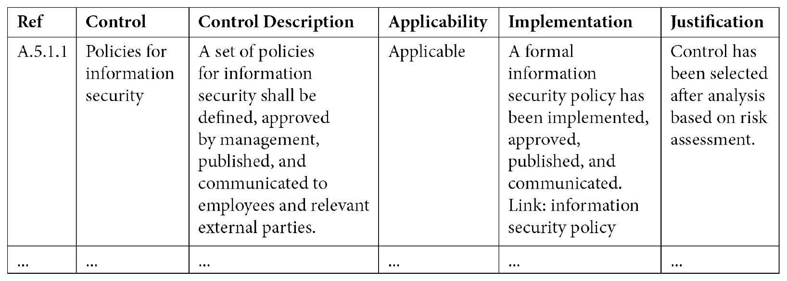
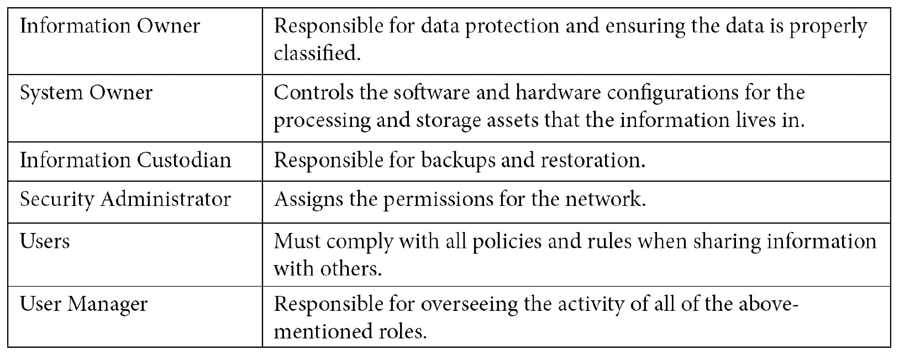

# 第二章：保护资产的安全

本章开始时的原始概念是问你*“如果你不知道组织拥有哪些资产，你怎么保护组织？”*。我们都知道这个问题的答案是*“你无法保护”*，我们之间可能已经被问过一千次这个问题，所以我不打算再问了。相反，我将向你展示如何在你的组织中构建适当的流程，以便发现并保护其资产。

这些不同的流程组合成了我们所说的**信息安全管理体系**（**ISMS**）。我们在*第一章*中讨论了各种关键概念，*信息安全与风险管理*，但总体上，与大多数组织所需的结构相比，这些内容的结构性要少得多。我们希望通过 ISMS 能够恰当地识别和分类组织的资产，并确保通过实施适当的控制措施，考虑到*纵深防御*的原则，保护这些资产的安全，涵盖机密性、完整性和可用性三个方面。

本章将重点讨论这些话题。我们将探讨如何利用有效的流程来实施一个高效的信息安全管理体系（ISMS）。这一体系通过根据业务需求确定的政策和程序，确保风险降到可接受的水平。

以这个目标为前提，我认为按照以下四个阶段的结构进行本章讲解是合理的：

+   如何实施信息安全管理体系（ISMS）

+   识别和分类组织信息资产的适当过程

+   根据资产的价值，通过适当的控制措施来保护这些资产，监控变化并适应这些变化

+   资产处置，无论是通过归档还是销毁

所有这些要点将以一种帮助你避免信息安全专业人员在过程中常见陷阱的方式进行讲解。

现在，基本的准备工作已经完成，请允许我继续讲解实际内容。

# 实施信息安全管理体系（ISMS）

实施信息安全管理体系（ISMS）需要*结构*、*规划*、*果断*和*协作*。存在一个极为重要的问题，*“谁负责什么？”*，这个问题应该被提出并记录。我想简要讨论一下**高层管理**的角色，以及我们如何将我们的发现转化为关于风险的有效沟通，传达给相关受众。改进这一点应该能让你在未来的缓解策略中更加有权威性。

一旦业务目标被转化为 IT 目标，并且获得了适当的支持，我们就可以进入实际的政策制定阶段，这些政策将作为你组织的信息安全“规则”。在能够系统地定义安全的“基线”、组织资产、减少风险并将信息安全要求传达给组织成员时，这一点至关重要。

接下来，我想谈谈评估和改进这一政策，牢记信息安全的经验法则是*持续改进和优化*。在这样一个快速变化的领域，保持对事物的掌控并适应变化将带来回报。

所以，系好安全带！我们要谈论治理和政策！我知道这听起来多么激动人心。

## 高层管理职责

首先，需要记住的是，涉及信息安全的任何事情，最终**高层管理**才是负责的。实际操作中这意味着什么呢？嗯，他们雇佣了你。作为一个听到信息安全责任日益增大的 CEO，雇佣一个信息安全专业人士来委派这些责任是最合乎逻辑的做法。

高层管理在信息安全中的另一个作用是有效地传达组织的战略目标。牢记这些目标，你就能够将所有的信息安全要求与这些目标对齐。

所以，现在你已经被雇佣了，并且决定由你负责理解与特定组织相关的风险，并以易于理解的方式将这些风险传达给 CEO、CIO、CTO 或其他**C 级高管**。这是一种非常正常的情况，但话说回来，我也遇到过一些负责组织安全的人，他们似乎从未向 C 级高管报告自己的发现，然后抱怨公司没有重视安全。是的，当然没有！他们怎么可能重视呢？

现在，责任落在你身上，你需要评估组织面临的风险，并将其转化为一个合理的商业案例，向公司高层管理人员说明，方式要易于理解。记住，这些人是高层管理人员！他们的童年不是在浏览网页，而是在老河边玩棒球、在本地药店喝气泡水。至于他们日常使用“计算机”，也许仅限于电子邮件和（最近）移动设备，对他们来说这一切都显得神奇无比。

我的观点是：你需要*了解你的受众*。与 IT 部门沟通风险时，可以使用更多技术性的参考和讨论，而向其他业务部门展示时，则需要一种更易理解的方式，聚焦于组织影响。

一般来说，根据我的经验，往往花费过多的时间在技术描述上，而不是展示业务面临的可理解风险水平。将 IT 风险发现正确转化为组织影响，最终会为你的职业生涯带来很多价值，因为目前很少有 IT 和信息安全专业人员能够有效做到这一点。

当你向高层展示你的发现时，你可以使用这个例子作为传达风险的模板：

+   你今年可能会失去这么多钱：*£100,000+*

+   除非你保护这个系统：*NAS 服务器*

+   来自此威胁：*外部恶意行为者通过未知的 Web 应用程序漏洞访问系统*

+   采用此缓解措施：*Web 应用防火墙（WAF）*

+   完成它的成本是：*每月 £84.42，或每年 £1,013.04*

+   实施需要这么长时间：*3 天*

现在，考虑到这些沟通内容，我想谈谈我们将要创建的**ISMS**，以及如何在我们的组织中实施结构。然后，我们可以收集前面模板中提到的关键类型信息，以便沟通风险水平，并确保组织资产的安全。

## 开发 ISMS

ISMS 是一个定义明确的处理信息安全的方式。它确保通过系统化的方法，准确发现、衡量、遏制和减轻组织中的信息安全风险，从而确保组织能够有效防范恶意行为者、意外丢失和监管影响，并且将风险作为决策过程的核心。

ISMS 包含了根据业务需求确定的正式文档，例如操作要求、规章制度、保留期限、员工能力和业务解决方案。这些文档定义了您组织在信息安全方面的政策、程序、基线和指导方针。这是实现风险导向、成熟的*信息安全项目*的一个极其重要的步骤。因此，确保该 ISMS 到位并且正常运行是信息安全团队的责任。

本书的其余部分将帮助你开发和补充这些文档的内容，并使其能够实际应用，但结构并不是以任何特定方式固定不变的。你可能希望以一种能够简化符合特定法规要求的方式来构建这些文档。现有许多信息安全框架和标准，按照其中一个或多个标准来构建你的政策将会呈现出一系列逻辑性的要求。例如，一种方法是遵循**ISO/IEC 27001**（ISO 27001）国际标准来构建你的信息安全管理系统（ISMS）。在本章中，我将利用 ISO 27001 标准的要求帮助我们创建文档并定义政策，以构建我们的 ISMS，但请记住，也可以根据你的组织及其背景，利用其他标准和指南。

本质上，我们希望创建一组文档，这些文档将汇集在一起，定义组织的要求，并作为我们的 ISMS。这些文档的主题可以包括以下内容：

+   组织内负责人员如何创建和更新信息安全政策、程序、基准和指导方针

+   组织如何识别、分类、监控和处置信息资产

+   组织内负责人员如何识别和衡量其信息资产所面临的风险，并选择控制措施来减轻这些风险

+   你组织的信息资产所面临的剩余风险和未减轻的风险等级

通常，ISMS 中的文档会在新系统的配置、新员工的入职过程或组织成员的日常工作中被引用。例如，在上一章中，我们讨论了*风险评估方法论、风险处理方法论、风险处理计划和风险评估报告*等可能需要在你的 ISMS 中使用的文档。

为了开始创建这个系统，我们可以从 ISO 27001 标准要求的几个关键文档开始，专门处理以下主题，我将这些主题分为若干小节。请记住，理解你组织的要求，并将文档和流程与这些要求对齐，以确保 ISMS 的有效实施，是你的责任。

### 高级别的信息安全文档

当涉及到信息安全和 ISMS 的高级别政策时，你需要根据组织所需的结构程度，考虑制定几个关键文档。请记住，采用结构化的信息安全处理方法，我们可以更有效地降低组织面临的风险等级。

#### 组织的背景

为了了解如何构建您的 ISMS，您应该能够概述您正在为其构建 ISMS 的组织背景。您还将使用此文档来定义组织对 ISMS 的要求。从组织的需求开始，您正在制定与组织的业务目标一致的政策和程序，这些目标由高层管理层定义。

您可能希望考虑任何可能影响组织 ISMS 目标的内部或外部因素。这些因素可能包括以下内容：

+   组织的性质，即组织参与的工作类型。这些问题（以及其他问题）可能与信息安全风险相关：

    - 组织中是否存在政治性质？

    - 组织提供哪些产品和服务？

    - 组织的增长前景如何？

    - 目前面临哪些威胁？

    - 哪些供应商正在被使用？

    - 组织需要考虑哪些立法？

+   信息或资产，例如定义组织的核心资产。考虑以下因素如何影响您组织的风险和信息安全：

    - 您的组织处理或控制哪些类型的信息？PII、PHI、IP、财务信息，还是其他类型？

    - 当前使用哪些系统来处理和存储信息？

+   人员，包括工作的性质。考虑以下因素如何影响您组织的风险和信息安全：

    - 招聘是如何进行的？

    - 人员是如何培训的？

    - 当人员变动或离开组织时，如何处理？

考虑到这些因素后，您将更有能力设计一个符合您组织需求的信息安全管理系统。

#### ISMS 的范围

无论您是否遵循 ISO 27001 标准，您都可能希望定义您的 ISMS 范围。原因是，您将需要向关键利益相关者（如高层管理人员、组织成员、审计人员，甚至可能是您的客户）沟通哪些业务部分会被 ISMS 涵盖。

如何定义您的 ISMS 范围？您应将其与组织的范围及其任何组织需求对齐。可以问一下*“哪些业务方面将受益于将其纳入 ISMS 范围？”* 与组织中的关键利益相关者就此话题进行沟通，将帮助您理解为什么要（或需要）开始实施这个系统，包括理解风险、法规压力或客户需求。

您还可以考虑定义组织中特定的“超出范围”的过程（或领域），这可以包括贵组织无法控制的外部第三方处理活动——只要您确保第三方的做法符合您的风险承受能力。

一般而言，评估您的信息安全管理体系（ISMS）并决定贵公司是否符合认证要求的认证机构，会更倾向于看到“整个组织”都包含在 ISMS 的范围内，但这并不是硬性要求。只要您“言行一致”——也就是说，贵组织在实践中遵循 ISMS 中设定的要求，且实践符合标准——您就会符合要求。

#### 适用性声明

不需要过多复杂的结构化说明，**适用性声明**是关于贵组织风险与可用控制措施之间关系的总结，并常以表格形式展示，以便将风险评分降至可接受的水平。

考虑到我们是采用基于风险的方法来选择和应用控制措施，在进行相关的风险评估之前，我们无法有效地完成适用性声明。然而，创建文档并列出可用的控制措施将有助于为该过程提供背景信息。

根据 ISO 27001，我们将查看在《附录 A》中涵盖的 14 个类别下的 114 项控制措施，并定义每项控制是否适用于贵组织。控制措施可能是*适用且已实施*、*适用但尚未实施*，或*不适用*。适用性声明文档应包括对所做决策的合理性说明。

本文档中的控制措施包括多种结构化贵组织 ISMS 的方法，并为如何通过政策、程序和定义来降低贵组织的风险提供了极好的见解。利用 ISO 27001 的附录*A*将有助于您开发 ISMS 并增强组织的安全性，但并不会提供如何具体实施这些控制措施的细节。

请参考以下表格，其中包含一个条目，说明如何构建适用性声明表格：

为了清楚地定义贵组织如何采取基于风险的方法处理信息安全，您需要为《附录 A》中的 114 项控制措施每项都添加一个条目。必须决定每项控制是否（或不）适用于贵组织，如果适用，贵组织如何实施（或计划实施）该控制措施。

关于如何实施附录 A 中所列的 114 项控制措施的进一步指导，您可以参考**ISO 27002**，这是 ISO 27001 的补充文件，为这些控制措施的选择、实施和管理提供指南。

#### 信息安全政策

高级信息安全政策文件的逻辑延续将是**信息安全政策**本身。

正如我们在前面的表格中所看到的，我们的适用性声明表，减轻信息安全风险的第一个附录 A 控制措施是定义一套信息安全政策，并由管理层批准、发布，并传达给员工及相关外部方。

信息安全政策的总体目标是定义组织信息安全的目标，包括对组织资产的机密性、完整性和可用性所要求的可衡量要求。因此，确保信息安全政策适用于并与组织相关至关重要。制定无人能遵守或根本不会遵守的文件毫无意义；这些文件存在的唯一目的是降低组织面临的风险水平。

信息安全政策的另一个方面是承诺持续改进的理念，正如我们在*第一章*中提到的，**信息安全和风险管理**，以确保随着技术、流程和威胁的变化，组织能够保持保护状态。

#### 其他关键定义和文件

其他定义和文件，您最好在信息安全管理体系（ISMS）中包含以下内容：

+   *安全角色和职责*的清单，定义谁负责组织中的安全事项。我们希望明确谁将实施控制措施，或者例如数据所有者和数据用户的职责。

+   *法律、监管和合同要求*的清单，特别提到关键文件和网页。如果您的组织必须遵守针对特定客户的*服务水平协议*（SLA），或者组织处理的数据受*欧盟通用数据保护条例（GDPR）*约束，那么在您的信息安全管理体系（ISMS）中以特定方式跟踪和记录这些要求将非常重要。

+   *内部审计*政策和程序，包括内部审计员必须遵循的具体流程，以有效检查组织的信息安全管理体系（ISMS）及已实施控制措施的有效性。

+   *纠正措施*的政策和程序，包括改进组织安全的具体和系统化流程。它应包括如何（以及由谁）发现、报告、记录和处理任何信息安全问题。

此外，我们还需要定义一种方式来存储和呈现以下信息：

+   业务影响分析

+   培训、技能、经验和资格的记录

+   监控和测量结果

+   内部审计结果

+   管理评审结果

+   改正措施结果

+   用户活动、异常情况和安全事件的日志

一旦我们有了这些具体的定义，我们可以继续处理 ISMS 的其他部分，包括资产管理、风险管理和业务连续性及事件响应。我们从资产管理这一关键话题开始。

### 资产管理文档

我从资产管理开始，而不是风险管理，其中一个原因是你可能曾听过的老生常谈：*“如果你不知道组织拥有何种资产，如何保护它们？”*。

这是一个陈词滥调，但这并不意味着它不成立。在你的 ISMS 中，你必须定义一种方法，不仅要了解你组织拥有的信息资产，还要明确如何分类这些信息，以及如何以安全的方式处理这些资产。只有这样，你才会开始充分理解你组织面临的风险，并能够采取控制措施，将风险降低到适当的水平。

通常，管理信息资产的生命周期会遵循以下四个步骤。我已在括号中列出 ISO 27001 的要求：

+   将信息资产添加到资产清单中（A.8.1.1）

+   根据法律要求、资产价值、关键性和敏感性对这些信息进行分类（A.8.2.1）

+   对这些信息进行标记（A.8.2.2）

+   以安全的方式处理这些信息（A.8.2.3）

我将从第一阶段开始，即资产清单。

#### 资产清单

你绝对需要有效地 catalog 并持续更新你组织的**资产清单**。在第一章中，我们讨论了资产可能归类的不同类别，这些定义的目的是确保你考虑到任何对组织有价值的内容，这些内容可以纳入 ISMS 的范围，或者用更通俗的话来说：任何信息，以及存储、处理或访问这些信息的设备或系统。

一旦你为组织列出了资产，你将需要对这些资产进行分类和优先排序，然后为每个资产（或资产组）指定一个**资产所有者**。如何结构化这一过程取决于你和你组织的需求，但请记住，资产所有者是负责（并拥有）保护资产的责任（和权力）的人。这并不意味着资产所有者不能委派日常活动，但最终责任仍在他们身上。

此外，您可能希望为您的资产分配值或关键性*评分*，以简化优先级排序和风险管理过程。资产关键性可以帮助更好地理解潜在风险，并得出更准确的影响评分。因此，这有助于确定应应用哪些控制措施以及应用的顺序。话虽如此，资产关键性并非 ISO 27001 的要求，因此请确保它符合您组织的实际需求，并记住，复杂性是安全的敌人。

在管理您的资产清单时，还需要记住的一点是保持其更新。此清单作为减少组织风险的工具，因此必须不断更新，以反映资产、资产所有者、价值、关键性评分或任何其他对组织完整资产清单至关重要的信息的变化。

本章稍后我们将深入探讨您可能希望如何在组织中对资产或信息进行分类，以及信息资产的角色，所以我们接下来将讨论 ISMS 文档的下一个要求——信息分类政策。

#### 信息分类政策

本政策旨在定义组织内信息资产分类的要求和流程。它是 ISMS 中的关键文档，必须（再次）满足组织的需求，并与组织面临的风险水平成比例。

我们的目标是根据组织的法律要求以及资产的价值、关键性和敏感性对信息资产进行分类。从一般经验来看，我发现大多数组织大约会有四个分类选项，这样既能提供灵活性，又不会过于复杂，但根据组织的不同，分类的范围可能会更广（或更窄）。

ISO 27001 对所需的分类级别没有具体要求，但您可以根据您的地理位置或行业将分类与其他要求或最佳实践对齐。

一个典型的分类等级设置可能包括以下内容：

+   机密

+   限制性

+   内部

+   公开

在您的政策中，您可能会定义资产所有者根据本文档中设定的定义，负责对信息进行适当分类。

#### 基于分类的标签

您的组织可以承诺根据资产的分类对实体和数字信息资产进行标签，并且可以在**信息分类政策**中设定执行此操作的要求。

在本章的后期（以及整本书中），我将介绍我们如何根据信息的分类和风险来对信息进行分类、处理和保护的各种方法，但正如你可能已经注意到的，信息安全管理系统（ISMS）中的一切都应该反映你的组织及其需求，这并没有固定的处理方式。

#### 可接受使用政策

现在我们已经列出了组织的资产，并了解了这些资产如何分类和标记，我们应该明确这些资产应如何被组织成员、承包商和第三方使用，以符合你在 ISMS 中定义的信息安全要求。这个可接受使用政策应作为组织成员信息安全培训和教育的一部分，并且应对所有受其要求约束的成员可访问。

一些可能包括在**可接受使用政策**中的例子包括适用于员工的任何安全规则，例如以下内容：

+   一般使用和资产所有权政策

+   电子邮件安全政策

+   公司资产政策，如笔记本电脑和移动设备

+   使用第三方软件的政策

+   雇佣终止时归还资产的政策

+   可移动媒体（如 USB 驱动器）的处理政策

+   媒体安全处置政策

本文档应根据组织的需求以及组织成员在日常活动中如何与信息系统互动的方式来制定。此外，这些政策应与组织所面临的风险水平相适应。为了确保信息资产的适当处理，应该考虑资产分类，并定义如何处理每种分类的资产的适当政策。

### 风险管理文档

现在我们已经了解了组织的资产，我们可以定义一项政策，规定如何评估、处理和报告这些资产面临的风险。为了确保你的 ISMS 的有效性，这份风险管理文档必须清晰，并且*必须符合你的组织的需求和能力*。如果不符合，你的 ISMS 很可能无法有效地保护你的组织免受面临的威胁。还需要牢记，复杂性是安全的敌人，因此，减少文档和流程中的任何复杂性到最小程度是至关重要的。

我已经在*第一章**信息安全与风险管理*中介绍了重要的风险管理话题，但为了简单回顾我们在上一章所讲的内容，我们需要进行风险评估，以了解组织面临的风险，包括确定这些风险的影响和可能性。我向你保证，我将在整本书中进一步展开这些话题，包括在*第三章*中讨论威胁和控制类型，*设计安全的信息系统*。目前，我们仅仅是在关注文档和流程。

从总体上讲，组织管理风险的流程可以归纳为以下几个步骤：

+   风险识别

+   风险评估（及优先级排序）

+   风险处理，包括存储文档化证据

+   监控和审查风险，包括管理审查

首先，让我们讨论风险识别、评估和处理文档。

#### 风险评估方法和风险处理方法

通过创建**风险评估方法**和**风险处理方法**文档，你能够明确地定义组织进行风险评估的具体方式和时间，谁负责每个步骤，如何计算风险等级，以及如何将任何不可接受的风险降至适当水平。

你可能会决定，为了满足你组织的需求，风险评估需要每年进行一次，或者在发生重大变化时进行。这是我见过的一个相当典型的选择，但它不一定是每个组织的最佳选择。正如我们多次提到的，关键是要根据组织的具体情况定制每一项政策和程序。

如果我们回想起*第一章**信息安全与风险管理*中那句关于风险的长句：

*信息安全风险是通过威胁利用信息系统资产中的一个或多个漏洞而导致损失的潜在可能性，结合了威胁的影响和可能性来衡量。*

我们记得，没有资产和威胁，就无法定义风险。在这些文档中，我们可以定义如何识别和衡量风险，是否根据威胁情景，或者根据与组织相关的每一项信息资产来进行风险评估。你在组织中有一份资产清单，在你的资产清单中，你应该利用这些信息，并在风险管理文档中进行引用。

此外，我们可以在此文档中定义可能性和影响的等级和定义。我在*第一章**信息安全与风险管理*中举了一个如何进行定义的例子，这是你有机会使用该例子，利用其他框架，或者为评估这些等级创建你自己的临时系统。

您可能还想包括风险矩阵，并在上面清晰地显示由高层管理定义的风险承受*水平*。

当我们审视风险处理时，您可能会记得可以进行以下操作：

+   避免风险

+   通过安全控制措施降低风险

+   转移风险

+   接受风险

您可以在文档中描述这些过程，以确保组织的其他成员理解他们何时以及如何选择每种处理方式。请记住，您有一份适用性声明文档，其中列出了适用于您组织的控制措施，并确保在您的风险处理方法中引用该文档。您还可以定义一旦风险水平降低到可接受的程度，您的组织如何接受风险（并记录该接受）。

通过为您的组织定义有效的风险管理流程，并应用持续改进的原则，您通过增加组织面临的风险的可见性，提高了信息安全管理体系（ISMS）的有效性。

#### 风险评估报告

您需要能够计划和优先处理风险，同时将风险评估的结果传达给相关利益相关者。这意味着您应该根据不同的受众群体，基于风险管理活动准备各种报告。

例如，在定期向高层管理汇报时，您可以提供风险评估的高级概览，因为该群体最终负责确保 ISMS 在其组织内的有效实施，但不一定对具体细节感兴趣。您可以包括最重要的资产及其固有风险等级，应用的风险处理措施（或提议的措施），以及处理后的剩余风险。

在更详细的报告中，可能需要提供您组织每个资产的状态，以及适用性声明控制措施及其状态。此外，如果某项控制措施正在实施过程中，您可以报告该实施的进展。

#### 第三方安全文档

在*第一章*，*信息安全与风险管理*中，我们讨论了在组织内管理第三方风险的重要性，因为越来越依赖供应商提供信息系统和云解决方案以进行业务活动。

在我们的第三方安全政策中，我们希望明确规定组织如何处理第三方风险管理，并描述如何监控、审查和审计供应商的安全性。

这可能包括围绕服务级别协议、供应商安全评估和贵组织的尽职调查的定义和方法。

此外，你应该考虑如何对组织中由第三方管理或控制的每个资产进行分类，并且考虑如何调整你的信息安全管理体系（ISMS）和信息安全战略，以适应共享责任模型。

### 事件管理文档

当我们专注于事件管理文档时，我们需要明确在特定类型的事件中需要哪些内容。作为信息安全专业人员，你需要与组织的领导层合作，定义将信息安全事件视为事故所需的阈值，以及适当的响应措施。

记录这些内容的最佳方式是创建一个高层次的事件管理政策，定义适当的角色和责任，并包括任何支持性文档（如操作手册）的引用。事件管理政策应成为任何事件管理活动中的核心文档，且在信息安全事件发生时，任何员工的首要反应应是参考此文档。

考虑到在停机等事件中将需要这些文档，值得注意的是，事件管理政策以及所有其他事件管理和业务连续性文档，应该以一种即使在信息系统的可用性受到影响时也能访问的方式进行存储。如果勒索病毒在你的组织中传播，你无法再访问存储在 NAS 上的文档，那你是否有打印的副本？同样，物理副本也是如此：如果你的打印副本现在被水淹没了，你是否能通过云存储访问这些政策？

在创建高层次的事件管理政策后，两个领域中定义清晰、易于遵循、结构化的信息安全方法极其重要，这两个领域是**事件响应计划（IRPs）**和**业务连续性管理（BCM）**。

在我们已经定义了如何发现和分类资产，以及如何根据资产的重要性进行风险评估后，我们已经完成了将这些过程结构化到组织中的大部分工作。

通过了解资产的重要性以及与你的业务面临的风险相关的威胁，你可以确定并定义业务连续性和事件响应的组织需求。

我们将在*第七章*《拥有安全操作》中深入探讨业务连续性和事件响应的各个方面，因此我将在这里尽量避免重复，并专注于确保组织准备好应对事件所需的文档和规划的高层次要求。

#### 事件响应和业务连续性操作手册

永远记住，在发生信息安全事件时，心跳会加速，双手会出汗，且会有很多人参与到“接下来怎么办？”的讨论中。

事件响应手册应简洁明了，任何人都能轻松跟随，并且准确反映最新的业务流程或版本的变更。这比听起来更难。可以将其视为一本“图画书”，第一页是第一步，第二页是第二步，依此类推。这是一种非常有效的方法，能提高成功响应的可能性。

你可以为各种威胁场景准备手册，例如“我们的服务器已损坏”或“我们的网站正在遭受 DDoS 攻击”等等。所有可行的、需要重复响应的威胁都可以转化为手册形式，这一点不容忽视。

此外，你不能仅仅假设这些手册是有效的。我们不能相信负责执行计划的人能够顺利完成。通过举行事件管理培训、意识提升课程并定期进行**桌面演练**来验证计划的可行性是非常重要的。桌面演练是组织成员在会议室中模拟真实事件的一种方式，讨论各自的职责，并寻找文档计划和程序中的漏洞。桌面演练的优势在于其成本低且易于组织，同时能够衡量各种事件的影响。为了让桌面演练更有趣，作为信息安全专业人员，你应该偶尔加入一些意外情况。当大家开始按部就班且对活动感到无聊时，可以引入一个“卡片被拒绝了，现在怎么办？”的情境。这能保持团队成员的警觉，激发参与感，并模拟现实世界中计划总是无法完全按预期进行的混乱局面。

通过记录和优化响应过程，并应用桌面演练和模拟中的发现，你能够减少诊断事件原因所需的时间，同时减轻响应团队成员的压力。

### IT 管理文档

由于信息技术与信息安全之间的紧密关系，你的 ISMS 很可能包含多个 IT 管理文档的引用，这些文档可能已经在你的组织中存在，或者需要与相关利益相关者共同创建。

本文档可能包括以下内容：

+   IT 管理操作程序

+   安全系统工程政策

+   访问控制政策

+   自带设备及移动设备政策

+   密码政策

+   信息处置与销毁政策

+   维护与审查计划

+   变更管理政策

+   备份政策

+   演练与测试计划

+   信息传输政策

+   在安全区域内工作的程序

+   清理桌面和清理屏幕政策

这些文档必须准确反映你们组织的实际做法，并与确定为可接受的风险水平保持一致，这一点至关重要。

## 教育组织成员

尽管通过一系列文档来定义信息安全管理体系（ISMS）的要求，并利用这些文档实施系统化的流程来保护组织资产是一个很好的开始，但如果推出的解决方案阻止用户以他们习惯的方式工作，而没有任何关于理由的沟通，用户可能会感到被任意限制。

即使是最智能的系统也能被规避或摧毁，而用户可能会被迫寻找方法绕过政策或控制，以便让自己的生活变得更轻松。你的组织需要对用户进行 ISMS 培训，并帮助他们理解 ISMS 对他们角色的影响。帮助他们明白，你的目标是通过消除日常工作中的不确定性来使他们的工作变得更轻松。

正如我们之前所说，这些政策需要得到高层管理的支持，并且对未遵守政策的行为要有相应的后果。你这么做是为了保护他们的组织，因此高层管理需要关心，并且要成为信息安全管理体系的倡导者。尽量让领导团队参与到你通常会自己发送的沟通中。通过让 CEO、MD、CTO、CFO 等高层领导作为支持者，你将能够在员工中树立一个有方法和策略的形象，而不仅仅是你这个孤独的“安全员”在胡乱指责他们不要安装浏览器插件，或随便通过钓鱼测试来捉弄他们。让高层领导来承担重要的工作是提高效果的一个特别重要的概念。

此外，提高所有组织成员的总体信息安全意识也非常重要。一个好的意识提升计划将使用户能够识别各种类型的控制规避，并可能通过报告不合规的情况来防止此类行为。这是确保组织安全得到维护和有效的一个重要方面。

像所有事情一样，优化是关键，接下来让我们来评估你们信息安全管理体系的有效性。

## 评估 ISMS 的有效性

评估信息安全管理体系（ISMS）的有效性，以及它是否符合组织的需求，对于优化组织整体信息安全成熟度至关重要。应设定定期评估 ISMS 有效性的要求，比如每年一次，并根据先前定义的内部审计程序进行内部审计。任何**不符合要求**或**发现的问题**都应根据我们之前定义的纠正措施程序进行处理。

此外，通过每天讨论和对话中所得到的发现，并将它们纳入相同的纠正措施要求，你能够通过定义未来所需的变更来实现持续改进。

如果你的组织需要遵守来自全球机构的多个标准和法规，考虑利用技术解决方案来管理实施过程中的需求是很重要的。有多种工具可以帮助将 ISMS 和安全控制与多个法规对齐，使用这些工具能够提高 ISMS 的覆盖范围和有效性。

## 政策改进

ISMS 的改进阶段是我们识别当前差距并规划下一版本政策的阶段。始终记住，这项政策为你组织的信息安全计划提供了结构框架。它和其他工作一样重要，我之所以从这个（极其不枯燥，反而非常有趣和引人入胜）的话题开始，是有原因的。

我将毫不犹豫地在本书的每一步中提到持续改进的理念。定期衡量风险并应用控制措施以确保组织不暴露于不必要或不可接受的风险水平，是非常关键的。

总结来说，为了实施一个确保适当识别、分类和保护组织信息资产的 ISMS，我们必须从反映组织需求的政策开始，这些需求既包括组织层面的，也包括 IT 层面的。确保组织成员了解 ISMS 是至关重要的，这样可以避免增加未知风险的水平，例如**影子 IT**，这是一个描述未经 IT 部门监督部署的 IT 系统的术语，因此绕过了为确保组织安全而实施的政策、流程和控制措施。

接下来，让我们继续探讨识别和分类信息资产的话题。

# 识别和分类信息资产

在你的资产管理政策中，可能已经定义了你的组织如何根据信息资产的价值、关键性、敏感性和法律义务来识别和分类资产，但未特别讨论从 IT 角度如何执行这一操作。

尽管制定政策并定义这些动机是理解组织在风险承受能力方面总体立场的重要一步，明确什么是组织认为最有价值的信息，但请记住，这仅仅是“规则”，而不是实际进行资产识别和分类或保护这些资产的行动。

在本节中，我想详细说明我们如何构建规则以及信息安全管理体系（ISMS）有效的识别和分类阶段的实际操作部分。

这包括以下主题：

+   构建信息资产分类

+   确定资产的角色

+   识别和保护信息资产

+   保留政策

你即将学习一些关键信息安全原则！准备好了吗！

## 构建信息资产分类

在你的文档中，可能已经定义了信息资产的分类，基于组织确定的价值、关键性、敏感性和法律义务。

你可能已经制定了如下的分类层级：

+   机密

+   限制

+   内部

+   公开

你将如何确保为相关信息资产应用适当的分类，并且如何确保资产得到适当的保护和安全保障？

通常，你需要为每个资产定义特定的角色。这些角色应该在信息资产的识别、保护和处置中承担各种责任。例如，**信息拥有者**可能需要负责确保数据得到适当分类，并按照监管和组织要求应用相应的数据保护措施。

## 确定资产的角色

如果你希望在组织处理信息资产的识别和分类时更加结构化，你必须考虑为每个资产定义下表中列出的角色。像所有事情一样，你创建和实施的结构化程度应当是该组织可接受的。

需要考虑为每个资产记录的一些角色包括：

尽管对于小公司来说，可能没有足够的人力去为每一项任务分配专门的角色，但在大型组织中，这些角色（以及其他多个角色）可能是存在的。此外，你可能会有多种类型的信息拥有者，每个系统也可能有相应的系统拥有者，例如按供应商来划分。

话虽如此，如果可能，使用 KISS 原则，这是软件工程界公认的设计原则，意思是*“保持简单，愚蠢”*。你需要确保在 ISMS 中实现成功时，需要的工作和维护尽可能少。没有额外的复杂性，已经有很多工作要做了。

## 识别和保护信息资产的方法

很好！我们现在已经定义了信息资产分类的类别。一个额外的考虑因素，可能也是最重要的一个问题是*如何*确保信息被正确分类。

手动识别、分类和保护信息资产并不是一个可扩展或可靠的解决方案。这些资产的丧失、修改或泄露可能带来巨大的财务和声誉风险。让非信息安全人员在日常工作中负责适当地识别、分类和保护组织的信息资产是毫无意义的。

幸运的是，存在**数据丢失防护（DLP）**或**信息保护**技术，帮助我们正确识别和分类组织信息的过程。我们可以利用“内建”模型来发现和分类信息，或创建我们自己的规则。

“内建”模型可以自动识别特定类型的信息，无论它存在于何处，或以何种格式。这意味着我们可以配置我们的 DLP 或信息保护解决方案来“找到”在聊天信息中发送的信用卡号，或在公司笔记本电脑硬盘上的 `.jpeg` 文件中检测到的护照号码，仅举几个例子。

除此之外，通过创建我们自己的信息类型模型（或定义），管理员能够使用正则表达式和复杂的过滤器来定位包含特定于组织的信息的文件，例如类似“项目海王星”这样的关键词。

定位到这些数据后，自动的元数据“标签”会应用于信息分类，同时会施加任何适当的访问限制、通过加密进行保护、以及水印或通知，在用户访问信息时能够清晰地看到。操作系统或邮件解决方案甚至可以向用户显示通知，解释为什么他们无法将文件发送到组织外部，并链接到相关培训。

通过自动化发现、分类和保护组织信息资产的过程，我们确保信息只对那些需要访问的人可用，信息只会被获准的人修改，并且这些修改会以可审计的方式进行跟踪和存储。

与 5 年前相比，这种解决方案简直是一个梦想，那时数据丢失防护（DLP）仍然非常过时，根本无法提供如此高水平的自动化。现在，如果用户在他们的笔记本电脑上创建一个讨论敏感话题或包含个人身份信息（PII）的文件，系统会自动为该文档应用标签，这样就会激活加密并限制仅适当的用户组访问。确保自动应用适当分类应该是资产所有者的责任。

系统管理员应该能够看到与每种数据类型相关的用户、位置或程序和服务的度量数据。通过使用技术解决方案来协助这一过程，你可以监控变化，检测新的要求，并根据对组织所有信息资产生命周期的监控结果来衡量政策的有效性。

在数字领域之外，在你的信息分类政策中，你可以（例如）要求在每页物理文档的右上角指明分类，并且在文件封面或封信上也应标明分类。如前所述，政策应适应组织，因此应该有遵循政策要求的流程，并对不遵守这些要求的行为做出相应后果。无论我们是否能够自动化这个过程，确保信息的适当分类和标签通常是资产所有者的责任。

幸运的是，我们已经用通俗的语言定义了一个政策，以帮助那些负责选择、实施和配置监管这些要求的系统的人。通过在信息分类政策中设定这些要求，我们能够选择一种技术，减轻与数据外泄、内部威胁、保存政策违规等相关的风险，符合你们组织的要求。

## 保存政策

我想简要地谈一下保存政策，并在制定和实施信息安全管理体系（ISMS）时考虑它们。许多地区的规定要求在处理任何敏感数据时，数据不得保留超过规定的时间。你问，规定的时间是多少？嗯，不幸的是，这取决于所在的司法管辖区和数据类型。

在我们的政策中，考虑到组织的保存要求，并确保定义了保存政策是非常重要的。通过这些定义，你可以利用现有的技术解决方案来实现以下目标：

+   确保你不会允许用户销毁因特定法规要求而必须保留的信息。

+   确保可以销毁的信息能够及时且合规地被销毁。

你应该定义的一些要求如下：

+   我们应该如何存储和保留数据，以确保在需要时能够方便地访问，且易于搜索和分类呢？这包括音频文件、视频文件等。

+   必须保留哪些数据？业务管理、第三方交易、合作伙伴关系、雇佣记录。这些仅仅是冰山一角。将数据分成不同类别，并考虑一种可以将数据标签化到这些类别中的解决方案（同时进行敏感性标签标记）。

+   数据必须保留多长时间？考虑每个分类或类别，因为它们可能有所不同。

+   我们如何对信息和资产应用所有权？这可以仅通过政策来完成，但如果找到一个可靠的解决方案，自动化会更好，就像几乎所有事情一样。

使用前一节中的相同信息保护技术解决方案，我们能够自动化你组织定义的保留政策，并在 7 年未使用后自动移除文件的访问权限。

# 信息资产的保护

本节内容完全围绕为资产实施适当的信息安全控制措施展开。我一直在思考这一部分，试图理解如何以最佳方式为你解读。

我知道你可能有选择和实施控制措施的经验，我不希望这一章成为整本书的一半，只是单调地讲述不同类型的控制措施或所有那些想要向你推销能解决所有问题的“银弹”的优秀供应商。无论如何，我将在接下来的章节中详细讨论各种控制和理念。

相反，在本章中，我希望确保我们专注于一些有力且有效的理念，以便理解如何选择合适的控制措施，也就是说，资产根据其关键性和分类被认为是“足够安全”的。

控制措施有不同的**类别**，用于区分各种控制类型：

+   **行政/管理控制**是我一直在谈论的政策和程序。它们不像新的软件控制那样“酷”，但它们的存在是为了为像你这样的个人以及你组织中的其他成员提供结构和指导，确保没有人会被罚款或导致泄密。

+   **物理控制**是指通过物理手段限制对系统的访问；例如围栏、闭路电视、狗……以及大家最喜欢的：灭火喷头。

+   **技术/逻辑控制**是指那些限制硬件或软件层面访问的控制措施，例如加密、指纹识别、认证，或**受信平台模块**（**TPM**）。这些控制不像物理控制那样限制对物理系统的访问，而是限制对数据或内容的访问。

+   **操作控制**是指那些涉及人员在日常工作中进行操作的控制措施。举例来说，包括意识培训、资产分类和日志文件审核等。

有很多具体的控制措施，我们无法在本章中逐一讲解。除了 ISO 27001 附录 A 的控制措施外，关于控制措施及其分类的进一步扩展可以在此页面的链接中找到：NIST SP 800-53 Rev 5 ([`csrc.nist.gov/publications/detail/sp/800-53/rev-5/final`](https://csrc.nist.gov/publications/detail/sp/800-53/rev-5/final))，其中包括 ISO 27001 标准与*NIST SP 800-53*之间的控制映射。

我所能讲解的是您可以根据威胁和行业将控制措施分类并应用于风险缓解的类型。

+   **预防控制**旨在阻止某些行为的发生，包括防火墙、围栏和访问权限。

+   **侦测控制**仅在事件发生时或之后被触发，例如视频监控或入侵检测系统。

+   **威慑措施**阻止威胁方试图利用漏洞，例如“看门狗”标志或狗。

+   **纠正控制**能够将某一状态转变为另一状态。这就是处理“故障开放”和“故障关闭”控制的地方。

+   **恢复控制**从损失中恢复某物，例如恢复硬盘。

+   **补偿控制**是那些试图弥补其他控制措施不足的措施，例如定期查看访问日志。这个例子也是侦测控制，但补偿控制可以有各种不同类型。

通常，为了实现充分的纵深防御，您希望按照以下顺序配置您的控制措施：

1.  **威慑**行为者不要试图访问他们不应该接触的东西。

1.  通过预防控制如访问权限或身份验证，**拒绝/阻止访问**。

1.  **侦测**风险，确保记录侦测信息，例如通过端点保护软件。

1.  **延迟**风险再次发生的过程，例如密码输入的“尝试次数过多”功能。

1.  **纠正**此情况，通过响应漏洞，例如采用事件响应计划。

1.  **从受损状态恢复**，例如通过备份发电机恢复服务器的可用性。

此外，在持续改进的过程中，我们还应该监控每个资产的价值变化。原因是，如果资产随着时间的推移或在某些重大事件中变得更加或不再重要，我们可能需要重新思考保护这些资产的控制措施。

此外，作为脚注，在我们研究控制时，我们也应该考虑恢复的因素。我的意思是，我们希望能够从任何不利的情况或资产及其价值的变化中恢复过来。举几个例子，我们讨论的是备份、冗余、恢复流程等。

一个需要牢记的概念，尤其是在云计算时代、SaaS、PaaS、IaaS、第三方解决方案和其他“别人电脑”的所有形式下，就是要确保**服务水平协议**（**SLA**）被明确定义，并且有关于最大允许停机时间的协议，以及未能履行这些协议的处罚。这是补偿性控制的一个例子。

作为第三方解决方案的消费者，你需要争取反映你风险承受能力的 SLA。同时，你还需要考虑到，将这些资产捆绑在一起，会增加可用性的风险。如果其中一个服务无法在线，而你无法执行任务，那就是可用性的丧失。如果你是云服务供应商，你需要考虑你的可用性，以及现实中能提供给客户的服务内容，并从商业角度考虑需要什么。

### 数据安全

当我们专注于数据安全时，数据有三个关键的**状态**，它们各自具有独特的安全要求：传输中的数据、静态数据和使用中的数据。

#### 传输中的数据

**传输中的数据**或称为运动中的数据，是指正在传输的数据，无论是网络内部还是从网络传输到外部，经过物理电缆或无线连接，或者从一个应用程序传输到另一个在同一台计算机上的应用程序，或者任何其他可能发生的数据传输，我就不再继续解释，以免让我们俩的理智崩溃。

还有**传输中的信息**的概念，这就像人们在饮水机旁交谈，或者 USB 驱动器被移动到另一张桌子上……但我们不必为此开玩笑。在这种情况下，我说的是“数据”而不是“信息”，是有原因的。

#### 静态数据

为了简化理解，我们将**静态数据**定义为正在存储但当前未被使用的数据。当你考虑到数据库作为一个不断增长和变化的实体，以及机器学习模型利用数据在一个不断演化的逻辑“变形虫”中时，事情开始变得有些复杂。但正如我所说，让我们保持简单。

#### 使用中的数据

**使用中的数据**是正在被系统或用户处理的数据，通常以非持久性的内存形式（如 CPU 缓存或 RAM）存储和引用。

### 各种状态下的数据加密

**加密**是我们可以讨论的最强有力的控制措施之一，适用于静态数据和传输中的数据。为了有效地保持数据的机密性，采用加密可能是必须的。实际上，为了满足如 PCI-DSS 或 ISO 27001 等标准的要求，它必须被使用。

除了这些要求之外，加密控制作为一种缓解策略极为有用。确保你了解不同类型的加密，这不仅仅意味着理解“对称”与“非对称”加密，还包括不同的加密标准，以及用于保护传输中数据的机制，如*TLS*，与保护静态数据的机制，如 *AES-256*。

**哈希**是一种用于数据完整性的加密函数，它（例如）允许以一种方式存储密码，确保输入与比较的数据相同，但不存储输入的明文。此外，哈希有助于通过使用校验和或消息摘要确保数据未被更改。跟上这些话题的进度应该是你的首要任务，因为随着时间的推移，你会越来越多地使用加密作为一种控制手段。

### 深度防御

你在组织中的一个主要关注点应该是**深度防御**，这是我在上一章中简要提到的一个概念，但在这里我想再次强调。我们不希望有单点故障导致完全丧失机密性、可用性或完整性。如果我们充分保护了我们的资产，这意味着即使一个控制措施失败，我们仍然可以放心，因为我们有其他控制措施来减轻风险（或者至少是其中一部分）。在实际操作中很难实现这一点，因为存在可用性问题、预算限制或选项不足。

作为防御深度如何在特定系统中实施的一个例子，假设你的组织创建了一个允许内部用户登录并在数据库中创建、读取、更新或删除数据的 web 应用程序。你如何确保未经授权的用户无法通过漏洞读取或更新数据？你如何确保应用程序保持在线且数据可用？

让我们来看看我们可能为应用程序实施的一些控制措施：

+   为了防止未经授权的访问，并根据用户类型实施适当的访问级别，你可能希望实施一种具有不同授权级别的身份验证形式。为了防止密码泄露，密码应以加盐哈希的形式存储，使用安全函数创建，并且无法反向转换为明文。

+   为了防止对 web 应用程序源代码的未经授权的更改，可以将代码库存储在源代码控制解决方案中，如 GitHub 或 GitLab。每个开发人员都可以被分配一个唯一的登录名，并要求选择一个强密码并使用双因素认证。

+   为了防止开发人员在源代码中实现后门和常见漏洞，你可以对代码库进行静态代码分析。为了检查应用程序中任何导入软件的漏洞，你还可以运行一个*依赖项扫描器*，以扫描包含的导入项。

+   要在应用程序运行后寻找漏洞，你可以运行漏洞扫描器，扫描常见的缺陷，检查版本、头部信息和输入消毒等问题。

+   为了检测是否发生了安全漏洞，并调查和防止漏洞再次被利用，可以实施日志记录、审计和监控策略及解决方案。

+   你是否知道你的用户是否只会在某个特定环境下访问应用程序，例如从某个特定的 IP 地址访问？你可以实施防火墙规则，将其列入白名单（或仅允许）访问，阻止其他地方的访问。

+   你也可以使用**Web 应用防火墙** *(***WAF***)* 来防护常见的注入攻击和跨站脚本攻击等。

+   如何确保应用程序在需要时可用？你可能需要考虑负载均衡和跨多个位置部署。

所以，这个场景给出了各种不同的技术安全控制示例，并将管理控制作为配置策略。这是一个良好的 Web 应用程序深度防御示例吗？你是否得到了足够的保护？

这取决于风险承受能力！你可能不需要所有这些控制措施，或者根据资产分类、关键性以及组织愿意接受的风险程度，它们可能不足以应对风险。这就是为什么在前两章我们如此重视这一点：如果不了解我们的风险水平，就无法判断我们是否在缓解风险方面投入了过多（或不足够）的时间、精力和资金。

### 监控变化

你应该监控组织的信息*资产*的变化，并根据这些变化进行调整，遵循持续改进的原则。你可能会通过定期的风险评估流程来处理这个问题，例如每年进行一次风险评估，或者在发生重大变化时进行评估。

另一种方式是实施技术解决方案来跟踪配置变化、漏洞和更新，或者主动威胁。我在*第七章*《拥有安全操作》中讲解了安全管理和监控，因此我会让那一章来负责这个主题的深入探讨。

最终，从你的监控活动中，你会发现是时候淘汰一个资产并处理它了，接下来我将谈到这个话题。

# 资产处置

我们在组织中控制着多个不同的物理和数字信息资产，这些资产最终都可能会达到生命周期的终点。

那么，我们如何确保安全销毁这些资产呢？我们可能无法简单地将敏感的财务文件或首席执行官的笔记本电脑丢进垃圾桶，使这些信息资产暴露在没有保护的状态下，等待着**垃圾桶潜伏**的恶意攻击者。

ISO 27001 提到了有关信息销毁的两项控制措施：

+   *“当介质不再需要时，应按照正式程序进行安全销毁。”*（A.8.3.2）。

+   *“所有含有存储介质的设备应经过验证，确保在处置或再使用之前，任何敏感数据和许可软件已被移除或安全覆盖。”*（A.11.2.7）。

因此，为了遵守标准，你应该根据分类定义组织对于信息资产安全销毁的要求，并为组织成员提供具体的流程，以便他们遵循这些要求。此外，你还应保留已安全销毁信息资产的记录。

此外，存储介质或设备的处置或再利用应包括一个确保有效移除设备中任何数据残余的过程。

## 数据残余

**数据残余**是指在系统中删除数据时，系统只是将该空间标记为“可供使用”，而并未实际擦除数据。这些数据非常容易恢复，任何具有基本软件安装知识的人都可以通过商业或开源解决方案轻松恢复。

这种类型的威胁可以通过在组织内部建立某种**可防御销毁**来进行缓解，这是一种通过以下方法之一销毁数据的受控、合规和合法的方式：

+   **覆盖**，即将原始数据替换为新的或随机的数据。美国标准要求至少进行七次覆盖。

+   **消磁**，即去除磁盘驱动器上的磁性印记，从而擦除驱动器。这对于老式的 HDD 驱动器可能非常有用。

+   **加密**不仅是一种保护静态数据和传输数据的方式，还可能通过使用不存储的密钥使数据无法恢复，就像“扔掉密钥”一样。加密销毁（Cryptoshredding）是指加密数据后，再将恢复密钥加密，从而使其永远无法使用。

+   然后，当然是对硬盘的**物理销毁**，通常是通过类似木材切割机的设备进行，就像《冰血暴》中的史蒂夫·布西密（Steve Buscemi）那样。其他销毁方式包括焚烧、切碎、分解和粉碎等。

当我们谈论**数据销毁**时，并不总是意味着要进行可防御的销毁。然而，有时候，在我们销毁数据时，我们会将其存档到长期存储中。我们不会使用这些数据，但如果未来需要，它将被安全存储，通常以最具成本效益的方式来处理。这种方法对于可能在法律诉讼中需要的数据尤其有价值。你所在组织的保留期限和要求必须被理解并考虑到，以便做出合适的决策，确保数据存储方式符合法律法规并保持合规。

# 总结

在这一章中，我们集中讨论了与保护资产安全相关的各种话题。我们被实施信息安全管理体系（ISMS）这一引人入胜的话题深深吸引，它涵盖了从高层管理者的职责到 ISMS 的开发，组织成员的教育，政策有效性的评估，以及如何改进政策以迎接下一个版本的挑战。

然后我们继续讨论了信息资产的识别与分类——从信息资产分类的结构到确定资产的角色、识别和保护信息资产的方法以及保存政策。

我们简要介绍了如何保障信息资产的安全，包括数据安全、加密、防御深度、监控变化等内容，最后讨论了资产和数据残留的销毁问题。

就这样，我们已经完成了这一章。我甚至不确定你是如何吸收所有这些信息的，但不知怎么的，你做到了，而且你因此变得更加优秀。现在让我们继续进入下一章，我们将讨论如何设计安全的信息系统。
