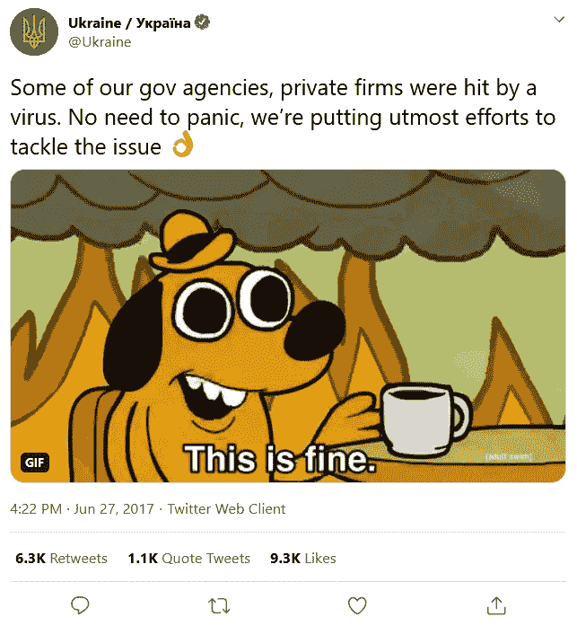

# 第三章：设计安全信息系统

在上一章，我们讨论了如何通过基于风险应用的控制来保护资产，但还有更多可以做的事情。*还能做些什么呢？*你问道，满怀激动。*好吧……*我回答，轻轻地对自己微笑：*如果我们从一开始就考虑安全性来设计系统会怎么样？*你的脸上顿时闪烁着光芒，星星在空中留下轨迹，世界在我们周围旋转。

不——但说真的，我们应该从一开始就考虑安全性来设计我们的系统。这就是本章的主题。顺便说一下，我并不是指像一个男人（他和你一起站在电梯里，仍然骑着赛格威滑板车）所说的“我自己设计的”，尽管他明明在室内还戴着太阳镜，一副非常酷的样子。是的，这事儿曾经发生在我身上。我指的是我们应该以一种方式来规划和**威胁建模**实施，确保它符合目的。

幸运的是，正如你从准备高级网络安全认证时可能已经知道的那样，存在一些**安全设计原则**，这些原则允许我们利用集体的知识来改善系统的整体安全态势，而不会带来额外的开销。到本章结束时，你应该能够运用这些原则，并选择适当的控制措施，有效管理安全信息系统。

此外，还存在**架构漏洞**，可以通过控制来避免或减轻，因此我们也需要讨论这些最佳方法。我的目标是让你能够在确定系统的安全需求时感到舒适，从而应用适当的控制措施。除此之外，你将了解你所使用的特定信息系统的可用安全功能。

此外，还有选择适当控制的实践。在*第二章*中，我们简要提到了这个话题，*资产安全保护*，我谈到了针对开发和运行 Web 应用程序的各个方面的**深度防御**，但我将进一步扩展，并尽力帮助你更舒适地选择和实施控制措施，以管理和减轻 Web 系统、移动系统以及嵌入式设备中的漏洞。

总结一下，在本章中，我们将讨论以下主题：

+   理解你的组织所面临的风险

+   评估和缓解漏洞的最佳实践

+   设计安全信息系统的最佳实践

好了——既然我们在引言中列出了要点，我问：*我们准备好开始了吗？*是的，我们准备好开始了。让我们从我们应该总是开始的地方开始——尝试理解风险。

# 理解你的组织所面临的风险

在本节中，我们将重点关注理解**威胁**、**漏洞**以及如何利用**信息系统**的**方法**的关键概念。这包括我们将要处理的系统类型、**信息安全专业人员**受雇保护这些系统免受的威胁，以及这些威胁如何利用系统中的漏洞。只有在理解了这些关键点后，我们才能进入保护部分（这听起来像是*Schoolhouse Rock!*的歌曲，但别担心——我会保持大体上不涉及音乐的）。

我想强调的是，当我们设计一个新系统时——无论是基于网络的、移动的、嵌入式的，还是其他类型——都有一些流程来确保我们的系统从设计上就具备安全性，并且在这些流程失败时，还会有缓解控制措施提供深度防御。

首先，让我们讨论一下关于*威胁*的一些关键概念。通过理解我们所面临的威胁，我们可以开始将这些知识应用于理解**安全模型**中的关键概念。那么，*“让我们来谈谈威胁吧，宝贝”*。

嘿——我说的是*大体上不涉及音乐的*，而不是*完全不涉及音乐的*。

## 威胁、威胁行为者和动机

对你组织的**威胁**可以是多种多样的，理解这些威胁是一个非常有趣的研究课题。最重要的是，了解这些威胁对于全面有效地保护组织至关重要。记住，我们不能在没有**威胁**和**威胁行为者**，以及资产和漏洞的情况下谈论风险。

随着世界越来越多地转向数字化领域，许多对组织的威胁将以**网络犯罪**的形式浮出水面。网络犯罪与非网络犯罪没有区别，它们都有各种动机，进而导致犯罪行为（前提是威胁行为者有足够的动机）。我使用这一限定词的原因是因为有些威胁是环境性的。没有风暴会有动机去摧毁服务器——这一点我可以非常确定。

现在，这些人类动机因情况而异，有时需要一些创造性的思维和头脑风暴来激发。我要做的，是在这一部分刺激你大脑的思维方式，让你像恶意行为者一样思考。我希望你开始设想，如果你是目标对象，如何会利用你的组织。你能想象人们会从中获得什么吗？人们可能会获得什么利益，又有哪些人会这么做？哪些群体不喜欢你的组织，为什么？也许你在世界上最仁慈的组织工作，且任何理智的人都不会有动机对其进行攻击。在这种情况下，你仍然需要考虑内鬼风险——某人可能会无意间点击一个链接或删除数据库。虽然不是恶意的，但仍然是一个威胁行为者，且该行为者已经具有一定的访问权限。**内鬼风险**在威胁建模时应该始终考虑，无论是恶意的还是非恶意的。

正如你可能想象的那样，我无法详细讨论所有可能的动机，但我可以为你提供一些想法。

你的组织可能面临的一种动机“群体”是那些非财务性或非政治性动机的行为者。它们可能包括*寻求刺激*、*快乐*、*数据囤积*或*精通技术*等。这些动机本质上是基于恶意行为者享受黑客行为本身，或享受黑客攻击的“收获”。有些人更关心的是是否能够成功入侵，或者想看看里面是什么，而不是关注入侵能赚多少钱。也许某个设备或服务器上有图像或视频，攻击者想要查看。也许你的组织有一位在 Twitter 上有百万粉丝的安全发言人，声称你的产品——一款硬件比特币钱包——是“无法破解”的。全球的研究人员非常有兴趣仅仅为了黑客技术本身而进行攻击，尤其是当某个大人物做出类似声明时。他们可能会发现，在被植入 root 后，你的产品并没有清除**随机存取存储器**（**RAM**），这意味着秘密短语和盐值仍然保留在 RAM 中，可以被提取出来，他们可能会在 Twitter 上发布这些信息。这给他们带来了快乐；它磨砺了他们的技艺；它帮助他们展示自己的技术，并证明那个发言人的说法是错的。

此外，还有一些寻求刺激的人，他们热衷于追逐挑战。虽然这可能看起来很奇怪，但*Thycotic Software*在 2014 年于*BlackHat USA*上进行的一项调查发现，51%的受访黑客表示，他们的主要动机是为了乐趣或寻求刺激。他们可能会专注于攻击你的组织，仅仅是为了刺激，而你能做的最好的事情，就是根据其风险级别，充分保护你最重要的资产。

另一个值得讨论的动机群体集中在政治和**网络战争**上，例如 *黑客行动*、*宣传* 和 *破坏*。在在线政治话语成为主流的时代，随着当前事件中的重大问题，包括全球大流行、美国大选以及英国脱欧（这些仅仅是在 2020 年最后几个月的事件），我们正面临这种动机类型的迅速增长。*黑客行动* 和 *破坏* 可以是个人或团体的动机，甚至到**国家支持的行为者**级别，获取（或摧毁）与其对立的账户、系统和资产。我们还有 *宣传* 作为动机，它可以由**单独行为者**或团体发布，甚至是最大的力量，旨在控制合法渠道，以便过滤或推动特定的信息。

进一步进入政治领域，观察外部力量对关键基础设施的攻击时，我们可以解读出*破坏*、*控制*或*威胁*的动机存在。我总是想起乌克兰政府在遭遇重大网络攻击时，回应时发布的 "this is fine" 模因，如下所示：

[`twitter.com/Ukraine/status/879706437169147906`](https://twitter.com/Ukraine/status/879706437169147906)

这是乌克兰政府推文的截图：

图 3.1 – 乌克兰政府的 "This Is Fine" 推文

为什么乌克兰的多个政府机构和私人公司成为攻击目标？我不能像其他人那样自信地说出*谁*在攻击他们，但攻击的性质表明这些攻击符合破坏、控制或威胁动机群体，或者是黑客行动、宣传和破坏动机群体，很可能是一次网络战争行为。

最后，我们可以考虑一个以*金钱利益*为基础的动机。这可以从个人找到方法从加密货币交易所盗取资金，或者一群雇佣黑客在抢劫情境中花费时间和精力，就像*碟中谍*中的一集一样。此外，你还会遇到**企业间谍**，例如*番茄酱公司*在 *第一章* 中开始进行的威胁建模，*信息安全和风险管理*，其中竞争对手试图获得你公司拥有的宝贵**知识产权**。

还有其他一些基于竞争的动机也可能会被考虑，例如试图从非营利组织获取研究信息等。老实说，这个清单可能会继续下去，但正如我之前所说，这不是本节的重点。我的目标是让你思考，谁可能成为你组织的目标，为什么他们会这么做。在这个过程中，我几乎能感受到你脑海中的齿轮转动，所以我觉得我们差不多可以结束了。

最近你可能经常听到的是**高级持续性威胁**，或称**APT**。根据*NIST SP 800-39*，APT 是一种威胁行为者，既具有高度的能力，又具有强烈的动机，并拥有大量资源。这种威胁行为者会在组织的环境中获得并保持访问权限，以便在长时间内窃取信息或操控操作。**国家标准与技术研究院**（**NIST**）表示，他们会适应为缓解这些威胁所做的改变。我对 APT 的看法相对简单，和我读过的某些资料相比算得上是基础。大多数组织目前在保护资产方面正面临困难，尤其是应对那些仅仅是看过一些带有“*如何黑客攻击*”标题的 YouTube 视频的 12 岁小孩，即便在这些视频中，讲解员也会教观众如何做以下事情：

+   获取访问权限。

+   提升权限。

+   保持访问权限。

+   窃取信息或操控操作。

+   保持不被发现。

这里与 YouTube 上的*脚本小子*和 APT 的唯一区别是专业知识和资金。NIST 使用的其他词语只是任何恶意外部人员所采取的基本步骤。我更喜欢以我们在*第一章*、*信息安全与风险管理*中讨论的方式来看待威胁。在 APT 的情况下，我们有的是恶意外部人员，可能是**团体行为者**或**国家支持的行为者**，这意味着我们需要考虑他们获得访问权限并保持不被发现的能力更为复杂。根据你的组织和其资产的不同，这意味着你可能需要缓解不同层次的风险。

我想做的最后一个备注是：*请*确保你的*风险登记册*与适当的威胁和动机保持更新！这不仅仅是为了娱乐；这是为了有效地保护你的组织。

## 漏洞

回顾我们在*第一章*、*信息安全与风险管理*、*第二章*、*资产安全保护*中所讨论的内容，以及到目前为止在本章中的内容，我们可以说我一直在重复强调“*没有资产、威胁、威胁行为者和漏洞就没有风险*”。那么，*什么是*漏洞呢？我们有详细讨论过吗？我是不是理所当然地认为你是一个信息安全百科全书，什么话题都知道？

问题是，如果深入到细节层面，关于“类型”的漏洞列表会越来越长。*Meltdown*、*Thunderclap* 和 *Spoiler* 是一些最近发现的硬件安全漏洞，但解释它们的工作原理会占据本章太多篇幅，而这些内容实在太多了。相反，我们不妨退后几步，从更高的层次来看待漏洞。*ISO/IEC 27005* 指导我们根据漏洞所涉及的资产类别进行分类。这个资产类别可以包括 *硬件、软件、网络、人员、物理和组织* 漏洞，或者你有不同的见解！不要让我或**国际标准化组织**（**ISO**）的严格瑞士标准限制了你的思维——大胆去飞吧！话虽如此，按照他们严格的瑞士标准来做确实更容易。

你可能完全没有头绪。你可能会问：“**Joseph**，这些每一种漏洞有什么样的存在形式？”问题在于，这是一个庞大的话题，而我之所以鼓励你自己动脑筋并考虑各种可能性，部分原因在于已经存在的漏洞数量庞大。如果我开始列出漏洞并加以解释，这本书将会变成 1500 页，且比现在更无趣，我可不想让任何人，尤其是那些花时间阅读我这些胡乱说法的人，受到这样的折磨。

话虽如此，我*想*我可以深入探讨一些漏洞的示例以及如何减轻它们。毕竟，“漏洞”*是*本节的标题。

如果我们以*硬件*资产为例，可以尝试考虑可能存在的各种漏洞，包括以下几种：

**物理威胁**，比如湿气或灰尘；由于磨损导致的故障；或者过热，都是存在的。缺乏通风、湿度控制、冷却、润滑或质量控制等措施，都是可能被威胁行为者利用的漏洞，进而通过破坏、关闭或强制关闭硬件，造成可用性的丧失。

记住——威胁行为者不一定是恶意的人类；它们也可以是环境因素，比如“摩擦”。有效实施“润滑”或“冷却”控制措施（并在实施后进行测试以确保控制措施有效）将有助于减轻这些漏洞。

在涉及尝试访问存储——无论是硬盘还是内存——时，你面临着几种选择。在硬盘存储中缺乏*加密*可能导致攻击者通过物理访问硬盘来获取信息。通过加密硬盘，你能确保一种防御深度，确保即使获得了物理访问，攻击者仍需进一步的利用才能获得访问权限。

如果不保护系统内存不被读取或写入，你面临的风险包括机密性、完整性或可用性的丧失。这是一种被广泛利用的攻击方法，因此，许多现代架构和操作系统中都有内存保护控制，但这些控制有时会被攻破，需要通过对*内核*或*操作系统*的更新和修改来进行缓解。

攻击者可能会试图读取电信号以进行逆向工程或窃听目的。如果他们通过此方法获得访问受保护资源的权限，可能会导致机密性或完整性的丧失。谈到导致窃听电信号的漏洞时，我们已经进入了一个相对复杂的领域，我们应考虑这种类型的攻击的可能性。哪些层级的威胁行为者可能会执行这些攻击？对于更为复杂的威胁行为者，如国家支持的行为者，这种攻击的可能性可能更高。话虽如此，仍然存在对泄漏辐射的缓解措施，如屏蔽磁场、过滤传导信号和掩蔽空间辐射信号。

有时，漏洞是由于硬件的基本功能所致，必须通过措施来减轻风险，例如通过防止物理访问硬件的可能性来实现**安全边界**，尽管这显然缺乏深度防御控制。

*软件*可能会存在漏洞，攻击者可以利用这些漏洞，执行以下操作：

+   找到一种方式访问本不该访问的更多信息，可能是通过不安全的代码或设计缺陷。

+   能够将你的软件用作其恶意软件的传播机制，例如*2020 年 SolarWinds 黑客攻击*

+   利用系统中缺乏审计追踪的漏洞

缺乏输入清洗可能导致信息泄露，或者你的软件被用来通过**注入攻击**传播恶意软件。通常通过静态和动态代码分析，以及自动模糊测试你的软件输入来缓解此漏洞，这些输入可能导致注入攻击，同时还需要定期对你的软件进行*渗透测试*，尤其是在发生重大更改时。

如果你的资产缺少日志记录，可能意味着威胁行为者能够维持访问、进行更改，并从你的组织中窃取数据而不被发现。通过日志记录来缓解这个问题大多是一种*侦测控制*，但通过适当的**安全信息和事件管理**（**SIEM**）配置，以及在**安全运营中心**（**SOC**）中的有能力的分析师，你可能能够实时检测到正在进行的攻击并作出反应。更好的做法是将自动化响应融入其中，这并不像听起来那么难以实现，但确实需要对现有的“正常”操作有相当深入的理解。

*网络* 可能会被威胁行为者利用漏洞，进行以下操作：

+   监听保护不足的通信

+   通过不安全的网络架构获得访问权限

+   通过**单点故障**（**SPF**）导致可用性丧失

从高层次来看，*网络安全*关注的是确保网络可访问资源的可用性，防止未经授权的实体访问，并监控所有网络活动，确保任何违规行为都能得到妥善处理。这是一个需要深入研究的主题，比我们目前讨论的内容要复杂得多，因此我将继续在*第四章*中讨论该话题，*设计和保护网络安全*。

*物理*站点容易受到威胁行为者利用漏洞进行以下操作：

+   中断访问，导致你的员工或系统无法访问

+   绕过访问控制，非法访问你的物理资产

在你查看物理站点并考虑站点安全时，除了考虑访问控制、旋转门、闯入防护门和生物识别技术外，还应该考虑设备或控制的故障所带来的影响。另外，在发生停电或电压下降（包括低电压和电压尖峰）时会发生什么？考虑过度噪音可能带来的复杂性，确保考虑到供暖、通风、湿度控制和冷却方面的要求。正如我们在第一章中提到的，服务器与水源不兼容，但同时，你可能需要适当的防火保护。

根据*NIST SP 800-30*，*组织漏洞*存在以下几种形式：

+   治理结构

+   商业流程

+   企业架构

+   信息安全架构

+   设施

+   设备

+   软件开发生命周期过程

+   供应链活动

+   外部服务提供商

本质上，威胁者可能会发现您组织运作中的逻辑缺陷。他们可能会注意到，您并没有对求职申请者进行适当的*背景调查*，或者您使用外部服务提供商却没有对它们进行*尽职调查*，因此威胁行为者设法利用这一点，将自己置于内部威胁的位置。

此外，在本节中，可能的威胁最大的是，威胁者可能会看到您组织在安全意识方面的缺陷，并通过操纵或欺骗人员，成功地获取对您机构的访问权限，或者让人员为其更改或删除信息，或者向他们披露信息。

对不起，我不得不再次提到*碟中谍*，因为它实在太相关了，不提两次实在对不起自己：我所举的这些通用例子都不错，但我希望您能打破常规。假设自己是伊桑·亨特的*不可能任务特遣队*的成员，并考虑您将要利用的漏洞，以获取对自己机构的访问权限，以及您如何阅读或写入信息以实现您拯救世界的终极目标。如果您还没有看过这些电影，我对您无法理解这个参考的事实毫不感到同情；它们都很精彩（第二部除外）。

总结这一部分，我想说，重要的是要考虑您业务的每个方面，并与了解记录过程及其与实际生活差异的相关人员进行交流。对您自己而言，前进的关键问题是：“*人员是否言行一致？*”。政策和记录的过程仅仅是文档，如果那些文档只是为了取悦审计人员和安全人员而存在，那么您面临的是您的*感知安全性*与*实际安全性*之间的巨大鸿沟。

精彩的是，如果您处理得当并表现得平易近人并且能够进行积极的改变，您将鼓励一种开放、透明和诚实的工作环境，在这种环境中，人们致力于让您参与以确保他们有一个遵循规则的简便途径，并在无法这样做时告知您。这是信息安全专业人员梦寐以求的情景。

## 系统利用方法

我希望能够查看威胁行为者利用您机构中的漏洞进行攻击的一些方法。如果我们深入挖掘并挑选出特定的**键盘记录器**，那么列表会很长，因此我将依次介绍每种攻击方法的“类别”，并简要讨论每种方法。

首先，由于我刚提到键盘记录器，我想看看各种**恶意软件**的类型。

恶意软件是用于邪恶目的的软件。它可以包括各种不同类型的软件，其中许多单独学习起来有相当多的内容，因此我会将恶意软件部分拆开。需要记住的一点是，恶意软件并不总是利用安全漏洞秘密安装在你的终端或区域中，这是我读到的许多定义所描述的。在 1990 年代末或 2000 年代初，我自愿安装了*BonzaiBuddy*，它是一个在屏幕右下角的小紫色猩猩，会唱歌或者在网上搜索东西。它是微软 Clippy 的一个稍微不那么烂的版本。后来，*消费者报告网络监控*将其标记为`bonzi.com`，未经许可，显然这并不是很酷，而且还跟踪用户的各种信息，用这些信息来投放广告。我对此只能说：他们是创新者！现在，几乎每个软件都会这样做，而且这被视为正常。

将恶意软件类别分解为子类别，我们可以开始理解它们是如何工作的，以及威胁行为者可能如何使用它们。

**病毒**在网络安全方面是一个有趣的概念。什么是病毒？你能举出一个例子吗？查看*维基百科*，你可能会看到*计算机病毒*的页面声称病毒是自我复制的。你可能会想：“*我以为那是* *蠕虫*。”在*恶意软件*的*维基百科*页面上，它指出病毒通常是“*隐藏在另一个看似无害的程序中*”，这时你可能会问：“*那不是* *木马* 吗？”

那么，到底什么是病毒呢？似乎社区无法完全达成一致，但*Malwarebytes Labs*试图最终定义计算机病毒为*“附加在另一个程序（例如文档）上的恶意软件，在目标系统上首次执行后可以自我复制并传播，并且需要人类的互动。许多病毒是有害的，可以破坏数据、减缓系统资源、记录按键。”*

现在，*这*很有道理。病毒需要与人类互动和宿主程序，并附着在其他文件上（或完全用自己的副本替代文件）。*木马*（或*特洛伊木马*）可以是病毒；*勒索软件*可以是病毒；但*蠕虫*不是病毒。

**蠕虫**与病毒并没有太大区别，但正如我预测的那样，当你在阅读*计算机病毒*的*维基百科*文章时，可能会想到，蠕虫与病毒的区别在于蠕虫不需要人类的互动就能在系统、网络、区域等中传播。蠕虫是*自我复制*的。

*特洛伊木马*这个名称来源于维吉尔的《埃涅阿斯纪》。在诗中，希腊人奥德修斯想出了一种方法，将他的军队带进特洛伊，一个敌人严密防守的城市。他说：“*兄弟们，我们做一个巨大的木马雕像，把我们藏在里面，放在他们的城门旁作为投降的信号。*”在这一过程中，没有其他的希腊人指出这个计划的问题，这让我感觉他们可能只是害怕奥德修斯的反应。我想说的是：我觉得奥德修斯可能有点儿自恋。不过，特洛伊人发现了这座雕像并将其推进城市，他们心想：“*这座巨大的木马挺不错的，看起来也没什么可疑的地方。*”可能会让你感到震惊，但那天晚上，奥德修斯的士兵从木马上跳出来，推翻了整个城市。

我相信你会很高兴我详细介绍了“*特洛伊木马*”这个术语的整个经典背景故事，因为现在你可以非常清楚地理解，特洛伊木马只是将恶意软件带入你组织的“围城”的一种方式。当人们下载到最新的 PC 游戏的盗版破解版，并且 README 文件告诉他们在运行*keygen*时关闭杀毒软件，因为它会触发*误报*，而他们照做了？他们可能刚刚中了特洛伊木马。判断`keygen.exe`到底是一个真正的特洛伊木马，还是仅仅一个误报，确实很难，因为两者都使用混淆技术来隐藏它们的算法，并且都可能对系统做出一些更改，从而自动触发杀毒软件。

和“*特洛伊木马*”这个术语性质非常相似的是“*后门*”这个术语。后门是指系统中故意（可能是未记录的）入口点。这些后门可能允许恶意软件的投放，或者其他威胁行为者进行恶意活动。后门的问题在于，它们可能是由制造商或任何参与设计和开发阶段的合作伙伴或供应商在软件或硬件中实施的。潜在地，情报机构可能会要求制造商实施后门，以便他们能够方便地进行调查。此外，这些后门还可能由其他类型的恶意软件创建，并通过特洛伊木马传播。你还在跟得上吗？如果这部分内容有些沉重，值得坚持——继续加油。

另一个属于广义恶意软件范畴的部分是**广告软件**。广告软件通常会与其他你安装的软件一起捆绑，但不要把它误认为是特洛伊木马。它通常并不隐藏起来；它可能会在安装过程中显示一个对话框，你可能草草跳过，仿佛你根本没有时间阅读任何内容。

这是一个**Search App by Ask**与 Java 捆绑的例子：

图 3.2 – Ask 广告软件的搜索应用安装对话框

看起来这只是一个无害的页面，你接受它，因为你想尽快完成并安装 Java，但它其实是`Ask.com`。创作者通过向你展示广告和收集营销数据来赚钱。

好吧——算了，你的浏览器中的搜索引擎被更改了——没什么大不了的。人们可能会问：“*我们为什么要担心恶意软件*？”我想接下来的一些内容可能会改变他们的看法。

**勒索软件**是一种恶意软件，它会阻止访问系统或文件。这是一种可用性攻击，通常通过加密技术进行，并且常常像蠕虫一样，通过网络中每个兼容设备传播。受勒索软件影响的组织通常会收到以恶意链接或带有恶意附件的电子邮件形式的**负载**。

一旦感染，受影响的计算机将显示一个对话框，试图勒索受害者。“*如果你将 X 比特币发送到这个地址，我们就会给你解密密钥…*”，类似的内容。

这是 Cryptolocker 比特币支付对话框的截图：

图 3.3 – CryptoLocker 勒索软件与比特币支付选项

**联邦调查局**（**FBI**）建议人们永远不要支付赎金，但像信息安全领域的所有问题一样，我认为*这取决于风险*。如果不支付赎金会造成比赎金本身还要严重的损失，那么你可能会被迫支付赎金。FBI 之所以持这种立场，是因为支付赎金会创造一个市场，而且你不能确定袭击者是否真的会给你解密密钥。

话虽如此，如果其他受害者得知即使支付了赎金也没有解密发生，这将破坏该活动的收入模式，因为其他受害者就不太可能将加密货币发送到攻击者的地址。因此，攻击者的最佳利益是当他们的受害者支付赎金时解密他们的文件，我们都知道，生意兴隆。*网络威胁联盟*在 2015 年提供了证据，显示*CryptoWall 3.0*勒索软件活动背后的犯罪分子已经收到了价值“*数十万美元*”的比特币，并且这些情况从那时起变得越来越严重。一个名为*网络安全风险*的网络犯罪研究组织预测，到 2021 年底，勒索软件攻击将每 11 秒影响一家企业，年损失将达到 200 亿美元。

勒索软件令人害怕，但**间谍软件**更让人毛骨悚然。间谍软件本质上是一种让恶意行为者监控你计算机使用情况、窃取你的密码或支付信息、追踪你在线访问的内容或下载的文件的手段。它可能导致身份盗用或敲诈，甚至可以专门为此写本书。

通常，间谍软件最终会嵌入到操作系统中，可能以木马的形式到达，甚至是你同意安装的东西，类似于我们看到的广告软件。间谍软件通常不会有“卸载”程序，并且你可能不会知道它存在于你的电脑上。它可能是一个**键盘记录器**，这是一种系统监控工具，可以记录按键、系统凭证以及几乎所有其他计算机活动。键盘记录器能够抓取屏幕截图，并通过隐蔽通道将信息传输到远程服务器。

这些类型的恶意软件通常会*利用*设备软件或硬件中的**漏洞**，以获得**提升的权限**。每天都有新的软件和操作系统漏洞被发现，研究人员可能会联系软件或硬件的创作者，*负责任地披露*这些漏洞，以便给他们时间修复缺陷并发布**补丁**，以帮助目前受到影响的用户。有时候，创作者不会采取任何行动，或者会对披露者进行法律威胁，结果研究人员可能决定公开这些信息，试图迫使创作者采取行动。通过引起对一个活动漏洞的关注，甚至提供**概念验证**（**POC**）来展示**利用**漏洞的方式，增加了漏洞被恶意利用的可能性，并可能导致创作者的负面报道或用户的负面反馈。

这个故事的另一面是，研究人员可能会发现一个新的漏洞或探索一个现有的漏洞，并制作一个**利用**工具，然后将其出售给恶意行为者，也许作为一个名为**利用工具包**的软件套件，这使得技术不熟练的恶意行为者能够执行攻击，传播恶意软件或获得访问权限。

你可能听说过**rootkit**，或者类似的**bootkit**——这些都是恶意软件的花哨名称，能够提升未经授权用户的权限（可能达到*管理员*（或“*root*”）账户的级别），或者隐藏其他恶意软件的活动，防止被检测，嵌入到设备的操作系统中。这些可以帮助恶意行为者获得计算机的完全访问权限，进行机密性、完整性和可用性方面的攻击，或利用被攻破的计算机对其他网络、计算机、系统等进行攻击。

以这种方式使用的计算机被称为**僵尸**，而且你可能会发现，这个僵尸只是一个更大**僵尸网络**的一部分，僵尸网络是由一组连接互联网的设备组成，它们会执行同步攻击。这些僵尸网络在**DDoS（分布式拒绝服务）**攻击中特别有用，在这种攻击中，DoS 来源来自大量通常无害的**互联网协议**（**IP**）地址，且没有任何规律。因此，由于这些攻击的分布性，它们很难创建防火墙规则来应对。

**逻辑炸弹**是一种交付机制，它会在满足一定条件时触发恶意软件活动。举个典型的例子，系统管理员设置了一个每天执行的*CronJob*，要求他们输入一个密码短语。假设这个 CronJob 被设置为在网络中的所有文件加密，前提是他们在连续 30 天内没有输入密码短语，暗示他们已经被从公司移除。还有许多其他类型的逻辑炸弹，简单的例子是："*如果这个正在运行的进程被关闭，执行这个操作。*"

你肯定在新闻中读到过**零日漏洞**。这些漏洞是指除了恶意行为者之外，所有人都完全不知道的漏洞，恶意行为者正在利用这些漏洞。术语"*零日*"与漏洞被利用时开发者没有时间响应和创建补丁的事实有关，即开发者没有**零天**的时间来应对漏洞。

所以，从理论上讲，我们可以说：

有一种新的病毒叫做"*TokTik*"，非常有趣。它与最新版的`EssentialProgram`捆绑在一起，最初作为**木马**，仅仅是**浏览器劫持**的**广告软件**，但后来变成了**恶意软件**，以**键盘记录器**、**间谍软件**、**rootkit**的形式传播，并执行**权限提升**的**漏洞利用**，将你的网络中所有其他设备像**蠕虫**一样感染，将每个设备加入到他们的**僵尸网络**中，执行对企业的**DDoS**攻击。如果恶意进程被关闭，另一个进程会加密硬盘，并显示一个对话框解释**勒索软件**解密过程。目前，操作系统的**补丁**正在开发中，但许多漏洞此前是未知的，这些**漏洞**直到现在才被发现，也被称为**零日漏洞**。

然而，如果你*说*这些话，人们可能再也不会和你说话了，因为那听起来实在太奇怪了。

除了通过病毒（如之前提到的恶意软件例子）在你的设备上发生的漏洞利用之外，还有其他类型的漏洞利用，比如组织漏洞的利用（例如缺乏安全意识），或者软件和网络应用程序漏洞的利用。

如果不提到**网络钓鱼**，这一部分就不完整了。提醒一下，网络钓鱼是一种通过电子通信进行的恶意利用方式，攻击者伪装成受信任的一方，通过*社会工程学*引导用户点击链接、打开附件或交出信息与秘密，帮助他们达成目标。它是许多威胁行为者选择的利用机制，因为它不需要技术漏洞才能成功，而是依赖于组织的脆弱性。

通过向公司中可能不如信息安全团队成员那样*注重安全*的人发送电子邮件，制造一些*紧急感和戏剧性*，并引导他们执行恶意负载，攻击者能够通过他们的电子邮件应用轻松渗透你的组织系统，使用勒索软件或间谍软件，或者发起银行转账。这既便宜、又快速，且效果显著。

此外，值得考虑的是我们 IT 系统不断变化的格局。例如，理解云服务类型和部署模型，或者网页应用安全性，在当前的环境下都非常相关。你看，随着我们从本地服务器和在终端设备上安装程序转向**云服务**模式，软件（以及我们的整体资产）越来越多地通过**瘦客户端**访问（这通常意味着它们在我们偏好的浏览器中运行），并转变为我们所说的**网页应用**，作为**软件即服务**（**SaaS**）提供给用户。**SaaS** 应用通常需要支付月费——也就是说，一旦用户需要的功能超出了基本的*免费*层级，就会产生费用。

**云服务提供商**，如**亚马逊 Web 服务**（**AWS**）或微软 Azure，提供类似的**平台即服务**（**PaaS**）和**基础设施即服务**（**IaaS**），允许按月付费使用云计算能力。随着时间的推移，我们越来越多的资产被外包并转向云端，无论是以 PaaS 还是 IaaS 形式。PaaS 通常作为一种简化方式提供，允许用户安装和运行应用而无需进一步配置，从而*外包了维护基础设施和定期更新的责任*。而 IaaS 则是存在于你选择的地区数据中心中的一部分服务器，除了缺乏物理交互，系统的维护和更新*责任*通常仍由客户承担。

这一概念被称为**共享责任模型**，它展示了不同云解决方案之间的差异以及各自的责任划分。

现在，无论你是从自己的*本地*服务器，还是在 PaaS 或 IaaS 上部署你的 Web 应用程序，我们可以看到 Web 应用程序中存在一些漏洞类型，这些漏洞允许恶意行为者危及应用程序的机密性、完整性或可用性。**开放 Web 应用程序安全项目十大**（**OWASP Top 10**）是一个定期更新的 Web 应用程序安全风险排行榜，它很好地解释了每个风险如何被缓解。为了给**应用程序安全**应有的关注，我将在*第八章*，*提高软件安全性*中进一步讨论。此外，不论服务器和计算机目前物理上“位于”何处，网络和资产的设计、治理以及安全运行仍然是你的责任。我们将在*第四章*，*设计和保护网络安全*中探讨网络安全，并在*第七章*，*管理安全运营*中继续讨论。

这将引导我们进入下一步，讨论评估和缓解漏洞的最佳实践。

# 评估和缓解漏洞的最佳实践

对于我们在本章前面讨论的一些漏洞概念，我已经列出了应对这些漏洞的缓解措施。所有这些缓解措施都没有考虑到你自己的组织、其面临的威胁、资产的价值或利用的可能性。我基本上只是列出了你可能看到的其他组织应对这些风险的方式，也许这样能给你一些启发。

在本节中，我希望以这种方式继续讨论，但首先我想强调一点，那就是在降低风险到*可接受的水平*时，应用必要的缓解措施是多么重要。这才是关键！避免在系统并未面临任何威胁，或者对你或威胁行为者并不重要的情况下，花费过多的资金和精力去使系统达到“完全无风险”的状态。

话虽如此，我现在可以回到如何确保我们的系统安全，并选择适当的控制措施的讨论。

我们已经讨论了如何保护 ISO 定义的不同类别的信息资产，这些类别包括硬件、软件、网络、物理资产和组织资产。我只是想花点时间简要回顾一下每个类别，以防有更多需要讨论的内容。

## 硬件安全

当我们回顾硬件资产时，我们讨论了通风、湿度控制、冷却、润滑或质量控制作为从硬件破坏或关闭中实现的可用性丧失的缓解措施。我们回顾了威胁行为者不一定是恶意的人类；它们也可以是环境因素，比如“摩擦”。在那一节中，我提到过一个我想再次提及的内容，那就是**在实施安全控制后进行测试**，以确保控制措施的有效性。

在你作为信息安全专业人员的职业生涯中，你需要确保在选择和实施适当的控制措施后，你首先自己“测试”系统的漏洞，并修补你发现的漏洞。然后（如果资产足够有价值来证明这样做的必要性，请记住），你请外部第三方进行“测试”。这通常被称为**渗透测试**（*pentest*）或**红队演练**，具体取决于评估的复杂性。你还可以执行自动扫描，但这些扫描的效果还无法超越实际进行*pentest*，即支付给一位专家黑客来真正突破你的系统。这是一种既美妙又让人心碎的检查控制措施有效性的方法。你最终会自己想到几件事。首先，你会想：“我居然错过了这个！”，但接着，你会想：“幸好我请了其中一个好人先找到了它。”

你将接受他们的报告，实施适当的控制措施以减轻他们发现的问题，并要求他们重新测试，以确保你的新控制措施有效。这是工作的重要组成部分，并且在管理层或董事会层面的汇报中，当你谈论风险的可能性时，它能提供重要的支持。你现在有了一个实际的例子，展示了某人突破了你的系统，你现在也吸引了那些控制资金的人的注意。

我们也之前回顾了保护存储访问，无论是通过硬盘还是内存。对于内存，我们讨论了系统架构和操作系统中的内存保护控制，这些控制偶尔会被破坏，需要通过对*内核*或*操作系统*的修改来进行缓解。

**数据执行保护**是操作系统对内存的保护，它将内存的某些区域标记为不可执行的。做出这种区分可以通过给出内存访问违规异常来防止代码从这些区域运行，终止进程，并防止缓冲区溢出。

关于硬盘，我简要提到过，通过加密硬盘，你确保了一定的深度防御，确保即使获得了物理访问权限，仍然需要进一步的利用才能获得访问权限。

另一个值得提及的加密方面是本节硬件安全主题中的**受信平台模块**（**TPM**）。TPM 是专用的微控制器，带有集成的加密密钥，帮助保护硬件安全。它们通常包括一个**随机数生成器**（**RNG**），这是硬件基础的；生成加密密钥的能力；以及为完整性目的创建系统配置和硬件的**哈希**的能力。当你使用*BitLocker*加密 Windows 10 笔记本时，最好的方法是使用笔记本的 TPM，它还允许在启动时进行*完整性检查*。

**受信计算基**（**TCB**）的概念源于风险管理，其中 TCB 被定义为在安全性方面具有高影响力的所有系统组件。如果在 TCB 中发现漏洞，整个系统遭受破坏的风险会更高。在风险管理过程中，你可能会确定 TCB，前提是你认为它很重要。你可以强制要求 TCB 中的每个系统都配有 TPM 以验证完整性。

此外，操作系统利用了**参考监视器**的架构概念，后者强制执行一个访问控制策略，用于控制用户和进程尝试读取和写入系统的操作。该设计范式使用了一个首字母缩略词**NEAT**，表示以下内容：

+   **不可绕过**，意味着攻击者无法绕过参考监视器，未经许可读取/写入系统。

+   **可评估**，意味着结果和性能应该能够被分析。

+   **始终调用**，意味着该机制应该始终可用，并且在所有与安全相关的操作中始终被利用。

+   **防篡改**，意味着该机制无法被更改以绕过控制。

所有这些理念在你未来的决策中都非常有价值。我不希望你将内建的控制措施视为“已处理”或与你的角色无关。许多现有的控制措施中包含了如何安全设计*任何*东西的建议，从整个系统到最微小的功能。我们之前在讨论渗透测试时提到了评估。我们在 TPM 的完整性检查中讨论了防篡改问题。从微观和宏观角度看这些范式在选择合适的控制措施来防范对机密性、完整性和可用性的攻击时非常重要。

接下来我们讨论了如何保护电信号免受逆向工程和窃听的侵害。我们查看了防止泄漏辐射的缓解措施，如屏蔽磁场、过滤传导信号以及掩蔽空间辐射信号。我们还简要讨论了限制物理访问硬件，以及这种方法缺乏深度防御的问题。

## 软件安全

接下来我们讨论了软件，这些软件可能存在以下漏洞：

+   给用户访问他们不应该拥有的信息，无论是通过不安全的代码还是设计缺陷

+   作为恶意软件传输机制的能力

+   缺乏审计追踪，导致持续的访问、数据外泄以及无法察觉的变更

我将在*第八章*《提高软件安全性》中进一步讲解这些漏洞，*改进软件安全性*，但现在我们可以说，缓解这些漏洞通常通过代码审查、职责分离、静态和动态代码分析工具以及定期进行软件渗透测试来完成，特别是在发生重大变更时。缺乏审计追踪可以通过实施审计追踪来解决！通过使用日志解决方案，您可以跟踪软件和基于网络的活动，如访问、变更和离开组织的流量。结合 SIEM 和 SOC 中的分析人员，组织能够实时检测持续的攻击，并可能对其进行手动或自动响应。实践和测试这一控制措施是红队的一部分，其中防守方作为**蓝队**进行操作。对蓝队进行测试对于某些组织至关重要，再次强调，是否进行此测试取决于您的组织所面临的风险水平。我将在*第六章*《设计和管理安全测试过程》一章中进一步讲解安全测试。

## 网络安全

接下来我们讨论了*网络*面临的漏洞，这些漏洞可能被威胁行为者利用，无论是通过窃听保护不足的通信，还是通过不安全的网络架构获取访问权限，或导致可用性丧失。从非常高的层次来看，为了控制这些漏洞，我们关注以下方面：

+   加密以保护通信

+   访问控制以控制谁可以访问什么，访问多长时间

+   漏洞管理，用于发现并修补所有网络架构中的漏洞，以及您资产中其他设备的漏洞

+   冗余性保护以防止可用性丧失，（希望）保护*单点故障*

我们将在*第四章*《设计和保护网络安全》一章中深入探讨这个话题，所以我将把如何实施的进一步解释留到该章节中。

## 物理安全

*物理*场所存在漏洞，可能导致您的员工或系统的可用性丧失，或突破访问控制。为了防止未经授权访问您的物理资产，我们应该考虑采取*深度防御*的策略。

转门和人孔是入口控制，旨在防止威胁行为者*搭便车*利用他人的入场凭证，或在他人之后*尾随*进入，卡住门。

生物识别锁，如指纹扫描仪，确保授权人确实是授权人员，而不仅仅是持有钥匙或证件的人。有时，它们并不是有效的控制措施，要么因为它们回应了太多**误报**，把合法人员锁在外面，要么因为它们给出太多**漏报**，让错误的人获得访问权限。在选择这种控制时，这些问题值得考虑，并且应该针对每种使用案例提问：“哪个更糟糕，错误的人进入，还是正确的人无法进入？”

在选择适合您组织及其系统的控制措施时，我们接下来将讨论下一部分内容。

## 选择适当的控制/防御措施来应对黑暗势力

如果我们从讨论基于时间的控制类别开始，我相信您已经知道**预防性控制**和**侦测性控制**之间的区别：它们的名字就能说明问题。前者有助于防止未来攻击的成功，后者则有助于在攻击进行时提醒系统和人员。**纠正性控制**有助于恢复系统并减少*泄露*的影响。

当我们谈论没有时间因素的控制类型时，我们已经讨论了一些每种控制的例子：**物理控制**、**程序控制**和**技术控制**。我们提到过守卫、生物识别读卡器、旋转门等等。此外，**闭路电视**（**CCTV**）、运动传感器、围栏等也被视为物理控制。**程序控制**（或*行政控制*）也比较容易理解，包含培训和意识等过程（或管理）；风险管理过程；招聘政策；灾难恢复计划等等。到目前为止，您已经了解了这一章中的一些技术控制示例，如加密、身份验证、TPM、数据执行防护等。几个**法律和监管控制**（也称为*合规控制*）的例子包括现存的各种隐私法律和信息安全标准，通常对于不遵守者会罚款（例如**通用数据保护条例**（**GDPR**））。

为了充分保护组织的资产免受其面临的威胁，控制措施的选择应基于以下两个因素的组合：

+   资产面临的风险水平，基于威胁利用漏洞的可能性以及该利用所带来的影响

+   您对于根据该资产的威胁向量有效应用各种控制的知识

我们希望应用所需的控制措施，确保我们覆盖了与特定资产和威胁行为者相关的所有威胁向量，但不浪费时间应用那些不相关的控制措施。如果没有必要存在某个控制措施，那么重要的是记住，复杂性是安全的敌人，需要重新考虑在没有减少风险水平方面获益的情况下增加复杂性。

现在我们已经讨论了如何评估和减轻硬件、软件、网络和物理系统中的漏洞，让我们继续下一个主题，专注于设计安全的信息系统。

# 设计安全信息系统的最佳实践

到目前为止，在这一章中我们只是简单地概述了我们已经拥有的所有知识（我相信你已经掌握），关于所有的威胁、威胁行为者、动机、漏洞以及现有的系统利用方法，清晰的问题仍然没有得到回答："*我如何设计安全的信息系统？*"

最后！我们要讨论如何设计安全的信息系统，您将学习如何以最佳方式做到这一点的所有细节。我真的很兴奋，但也许并不是你认为的原因。你看，通过学习威胁、设备和资产以及方法，我真的相信你已经激活了许多设计更安全系统所需的思维过程，并提出了许多必要的问题。

存在许多指南，但由于本书（试图）专注于最佳实践，我将回顾我们已经涵盖的一些问题，并简化为您设计安全系统的过程。

## 安全设计原则

当我们考虑设计系统及其与其他系统和用户的交互适当的方式时，我们希望考虑**最小权限**和**零信任**的原则，以及**默认安全**和**安全设计**原则的思想。

**最小权限原则**专注于确保对系统资源的任何访问都只能用于预期目的，且时间最短。如果用户或资产无意执行某个操作，则不应授予其执行该操作的能力，因此权限可以减少到最小可能的数量。

例如，如果您的网站通过作为管理员用户运行的 Web 服务器软件向互联网提供服务，那么 Web 服务器的 ompromise 可能导致网络中的关键或敏感文件被恶意行为者读取或删除。该 Web 服务器资产是否需要能力来删除文件？它是否需要访问所有敏感文件？不需要，因此将权限减少到最低限度。

作为另一个例子，如果用户（或进程）需要读取某个系统文件夹中的文件，则应只授予该用户（或进程）读取权限，而不是写入权限。此外，他们应该只在需要的时间段内才能访问文件进行读取。这通过**即时访问**方法得到了辅助，这是一种强制实施最小权限原则的系统访问方法。它通过提供一个临时的单次使用帐户来允许访问所请求的资源，并在任务完成后立即撤销该帐户。这是基于风险指示器（如“这是该用户的正常活动吗？”或“该用户是否启用了**多因素认证**（**MFA**）？”等因素）来授予（或不授予）访问权限的。曾经的“管理员”时代已经过去了。原因很简单：通过减少到最小权限并利用即时访问，我们减少了受损账户的影响，并通过权限提升降低了受到攻击的可能性。

**零信任**是一种现代安全概念，集中在几个思想理念上。这些理念包括以下内容：

+   在你的系统中通过即时访问和恰到好处的访问原则，使用最小权限原则，并加密和保护你的静态数据，以防止未经授权的访问。

+   始终验证所有活动，通过基于我们在讨论即时访问风险指示器时提到的所有数据点进行身份验证和授权，这些数据点包括地理位置、设备指标、异常检测等。

+   假设存在漏洞，这是零信任背后的主要思想。通过前面两条所述的方法，限制所有资产的横向移动；通过端到端加密来防止任何窃听；通过日志记录和监控来检测主动威胁；并通过更新、修补和评估系统的实施情况来不断改进。

零信任在这一阶段听起来相当合乎逻辑，在理解当前世界中的威胁、漏洞和方法论之后，但正如我所说，它是一个相对较新的理念，随着时间的推移，越来越受到关注，幸运的是。如果你想要在阅读 NIST 特别出版物时找点乐子，可以参考 *NIST SP 800-207* 进一步阅读。

**安全设计**是我们在所有系统中追求的最终目标，也是本章的主要内容。这是从一开始就构建安全系统的原则。在创建安全设计的系统时，我们必须首先考虑固有的威胁、资产和漏洞，然后考虑我们已经实施的所有安全原则和控制措施，等等！

我只想趁这个机会再强调一下，之后还有大量的进一步调查和学习要做。我们将要对流程和系统进行的持续改进，也会应用到你和你的知识上。随着威胁的出现和变化以及新技术的发展，新的漏洞和缓解措施也会随之出现，而你有责任去调查它们。很抱歉在这本书中不能详细讲解所有内容，但我希望我能帮助你分析控制措施，并确保你为每一个风险选择适当的缓解措施。

回到正题，在这些原则和控制措施中，最佳选择是通过理解架构设计所实施和执行的风险来战略性地选择，以确保整个系统的机密性、完整性、可用性和不可否认性。这总是通过避免**通过模糊性来确保安全**来实现的，因为这最终会在内部风险或知识丰富的威胁者面前失败。我们应该对系统的设计保持开放，因为任何关于系统设计的知识都不应该妥协其安全性，因为它的设计本身就安全，并超越任何已知的攻击方法。

当我们讨论黑客时，我想提到之前在谈论脚本小子和 APT 之间的区别时提到的几点。我提到了黑客的以下顺序：

+   获得访问权限。

+   提升权限。

+   保持访问权限。

+   外泄信息或操控操作。

+   保持不被发现。

在设计你的系统时，你需要考虑如何防止这些步骤的发生。你如何确保恶意行为者无法获得访问权限？恶意行为者如何提升权限或在你的系统中横向移动？他们如何保持访问权限？你能否检测到数据外泄或操作被篡改的情况？我们到目前为止讨论的许多原则在这里都有应用，你可以通过为每个风险实施一套深度防御控制来增强你的系统。

## 著名的控制措施及其缓解方法

我们可能需要从另一个角度来看待这个问题，开始讨论著名的控制措施以及它们可能缓解哪些风险。这可以帮助我们理解事情，并帮助我们分析现有的系统。

例如，**备份**可防止可用性和完整性风险。如果你的系统受到勒索软件的影响，前提是你有一个最近的、未受影响的备份，那么你始终可以使用该数据恢复系统，最大程度地减少干扰和损失。当然，备份并不是防护**勒索软件**的唯一手段。我们之前提到勒索软件通常以蠕虫的形式传播，并利用提升的权限来加密你系统中的数据，因此通过遵循**最小权限原则**，可以降低被攻击账户修改数据的可能性。通过更新系统，你可以降低**恶意软件**利用已知漏洞的可能性。通过在所有兼容系统上安装**防病毒**或**高级威胁防护**软件，你应用了一种*侦测控制*来防止恶意软件的传播，并减轻可能造成的损失。

降低权限也有助于防止**逻辑炸弹**和内部威胁窃取数据，比如知识产权。

**防病毒软件**帮助防护已知威胁，通常通过基于签名的检测，能够帮助检测和清除我之前提到的恶意软件类别中的威胁，例如**间谍软件**、**广告软件**、**Rootkit**和**Bootkit**。

**漏洞管理**和**修补**可以确保各种已知的漏洞不能在你的系统中被利用，因为产品的制造商已发布更新以缓解或消除潜在的安全风险。总会有关于**零日漏洞**的文章和新闻报道，但实际上，大多数组织仍在使用有公开漏洞的过时软件。“Kiss 原则”在这里很有用。专注于风险，高概率的风险（例如如果漏洞已在 GitHub 上公开）会带来更大的威胁。我将在*第七章*，*掌控安全运营*中深入探讨漏洞管理和修补。

在物理安全方面，我们可以提到**不间断电源供应**（**UPS**）用于停电、欠电压和电力波动时的可用性。我们还可以考虑**浪涌保护**，以应对电力尖峰。

我们已经提到过**供热**、**通风**、**湿度控制**和**冷却**作为物理威胁的缓解策略，以及避免水源与信息系统接触。**火灾保护**也是一个值得关注的话题。人命安全是最重要的考量（尽管从我所见的情况来看，我不确定 100%的组织都认同这一点！）。火灾保护是保护员工免受伤害的手段，并且根据你的地区或运营情况，它可能是一个合规要求。

我想在考虑物理安全时提出的一个主要问题是**外包**。我们提到的许多物理安全要求，都是由于服务器和信息系统位于办公室位置，而通过尽可能多地将这些系统外包，利用云服务和**共享责任模型**，你可以将物理安全风险转移给像微软或亚马逊这样的公司，他们拥有具备强大物理安全控制的数据中心，适合各种级别的工业、军事和政府活动。

**背景调查**和**尽职调查**对于新员工和第三方供应商来说，是预防性控制，可以防止威胁利用你组织流程中的漏洞进行攻击。此外，我们还可以通过**安全意识培训**和**钓鱼攻击演练**作为减少组织威胁的缓解措施。通过对员工进行培训并创造一个*安全意识*的环境，你可以降低成功的钓鱼攻击或疏忽行为对组织运营的负面影响。

通过使用适当的**硬件和软件防火墙**、**网络拓扑结构**和**云服务**，你可以减少 DoS 攻击（甚至是 DDoS 攻击）让你的业务离线，或使你的月度云服务账单增加到无法支付的程度的可能性。

通过对所有资产进行主动测试，包括对你的网页应用进行**网页应用测试**，并考虑**OWASP Top 10**，你能够看到当前的漏洞，同时防止新的漏洞被添加到现有的应用和软件解决方案中。通过允许第三方进行**渗透测试**，你让好人找到那些坏人最终会发现的漏洞，这最终成为你组织的**预防性控制**。你的系统注意到渗透测试了吗？如果没有，那说明你没有适当的侦测控制措施，如**日志记录**结合**SIEM**和**SOC**，这是另一个可以外包给具有相应分析能力的专业公司进行的控制。

## 考虑替代设备

在涉及到替代设备时，如移动设备、**物联网**（**IoT**）或**监控控制与数据采集系统**（**SCADA**），需要考虑不同的方面，因为每种设备的性质不同。

从**移动设备**——或更具体地说是*手机*——开始，我们来看一下这里的情况：我们有一种人们随身携带的设备。这些设备可能存储着组织的敏感数据，或可以访问你的资源……而人们偶尔会把它们忘在某个地方。你已经放弃了**物理访问**，那么你究竟需要做些什么，才能确保你只是花钱更换手机，而没有（例如）把你的知识产权交给竞争对手呢？好吧，在本章之前，我们已经讨论过加密硬盘以防止物理访问导致泄露的观点，一旦你加密了设备，你可能会设置一个有密码保护的锁屏……但随着设备的移动，且你可能不知道它最后放在哪儿，你可能需要考虑额外的功能，如**全球定位系统**（**GPS**）的**查找我的手机**或**远程擦除**功能。此外，如果这个设备是用户拥有的，但仍然访问你的资源，你可以设定一个安全基线，在授予它访问权限之前进行检查。这项检查会确认是否已应用最新的补丁，并通常要求安装某种病毒防护解决方案。

当我们谈论物联网或查看那些通常通过互联网访问外部世界的设备时，这些设备可能是由一个不专门制造硬件或软件的厂商生产的，而是生产灯泡、音响系统、吸尘器或监控摄像头，并且可能不会定期修补已报告的漏洞。听起来对你的网络来说有点像噩梦，但别担心——有解决办法。首先，为这些设备创建一个物联网网络。任何属于物联网设备类别的东西都被放入这个隔离的沙盒中，以减轻通过网络可利用的漏洞对网络的影响（也叫做**远程访问漏洞**）。是的，确实发生过… 物联网灯泡曾经为公司网络提供远程访问。实际上，这种事情时常发生，真是相当尴尬。

其他深度防御的缓解措施包括选择那些有良好发布补丁记录的物联网产品，应用最新的补丁，将权限限制到最低程度，同时保留功能性（**最小权限**原则），以及更改容易猜测或（由于它们在每个设备上都是相同的）在网上可以找到的默认密码。

`Shodan.io`，物联网的搜索引擎。如果你还没看过*Shodan.io*，你一定应该去看看（趁你还没看完*碟中谍*电影系列的时候）；它确实很酷。你可以查看世界地图，地图上有红点，显示各种互联网连接的设备、它们的 IP 地址和开放端口，甚至还有你如果跟踪链接并在浏览器中访问设备时看到的网页截图。很棒吧？可是，有时候，*风力涡轮机*或*电力厂*就暴露在互联网中，没有任何防护措施。恶意行为者可能会把一切都关掉，或打开，或者做任何授权用户能做的事！

为了减少高影响功能与过时且不安全的协议、弱（或缺失）身份验证以及无效的安全通过模糊化控制的风险，你需要考虑几个方面。你需要做的第一件事是找出所有连接，并创建你的 SCADA 网络图。然后，如果可能的话，**空气隔离**尽可能多的设备。没有互联网访问；独立的网络；没有与外部世界的连接。然而，这并不能完全保护你免受所有威胁。加强网络中剩余连接的身份验证和授权控制；如果有更新，安装它们；禁用不必要的服务，这些服务会增加你的**攻击面**；进行**渗透测试**和**红队演练**；并确保始终将 SCADA 纳入你的风险管理流程中。

问题是，理想情况下，你应该以这种方式对待你所有的设备！大多数最佳实践适用于保护你的设备、网络和组织，也同样适用于这些“替代设备”和典型设备。我们关注的是风险，我们在设计和改进信息系统时，都会采取措施来缓解这些风险。

当你阅读有关新控制的信息时，考虑一下它们实际上解决了什么风险（而不仅仅是营销材料上所说的内容）。在设计新系统或评估现有系统时，要考虑你的控制措施以及是否存在可能被利用的漏洞，如果存在这样的漏洞，还需要根据你的风险管理政策判断是否应填补该漏洞，前提是该风险水平是否不可接受。

我想提到的关于设计安全系统的另一个要点是：在你设计系统时，请确保能够及时更新系统的最新更新和补丁！我们今天看到的许多问题依然是因为系统在设计时未考虑到能够进行更新，无论是因为遗留软件无法兼容新的操作系统，还是因为由于**气隙**限制了互联网访问。设计一个能够更新所有资产的过程，无论它们是否需要气隙，并制定一个计划，确保你的系统能够运行最新版本。通过你的资产登记册或配置管理工具（我将在*第七章*，*拥有安全运营*中讨论）跟踪系统是否运行的是最新版本，并在你的风险登记册中更新，如果操作系统或软件版本存在已知漏洞。如果你能够预见到这一点，并在设计和实施时考虑到这些计划和过程，那么未来对你组织的安全将是一次巨大的进步。

# 总结

在本章中，我们涉及了大量的信息，我必须像打破的唱片一样重申，本章中的每一个关键术语都可以专门用一本书（或一系列书籍）进行深入探讨。本书的目的是更多地帮助你重新熟悉这些关键点，帮助你以正确的方式看待每一个点，并将高层次的原则应用到你的知识中，以提高你在组织中的工作效率。

从资产及其漏洞，到威胁行为者及其动机，再到这些威胁行为者利用我们资产中的漏洞的方式，我们跨越了信息安全中的几个重大问题，既从战略层面也从操作层面，以便正确理解整体局势。

通过了解整体情况，我们开始应用我们的风险管理原则和有关威胁利用漏洞的影响及可能性的知识，以减轻和控制各种风险。在考虑如何为每个风险选择合适的控制措施、如何分类这些控制措施，以及它们的有效性之后，我们开始探讨如何从一开始就考虑这些风险来设计系统，以确保设计默认更安全，并且看看我们如何在下次关于系统设计的讨论中为改善我们自己组织的系统做出贡献。

既然我们已经完成了这一章，接下来我们将进入我已经提到过几次的下一章。
