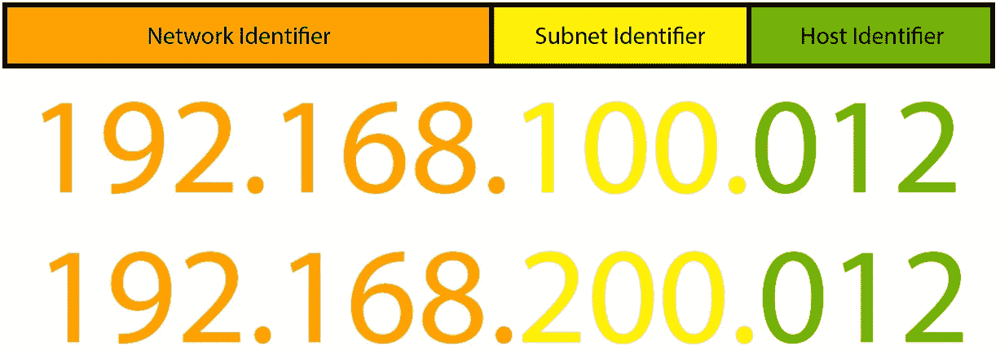

# 第四章：设计与保护网络安全

坦白说，上一章的结尾和本章的开头其实是一个错觉。事实确实是，我们在上一章中学到的知识将在这一章中得以延续，我们将在这一章中大量依赖上一章的内容。之所以如此，是因为上一章已经涵盖了很多内容，我和出版商决定创建一个虚拟的边界，标志着一个话题的结束和另一个话题的开始。我会尽力避免重复自己，除非某个点值得重复。

现在我们已经解决了“模糊和看不见的章节边界”问题，我可以开始本章的整理工作了。本章的目标是学习如何将上一章关于威胁、漏洞和缓解措施的知识与我们对风险管理和治理的理解结合起来，创建“安全设计”网络架构（或者至少是尽可能接近安全设计的架构，同时平衡可用性）。

我们将讨论如何通过设计选择和缓解措施来保护各种网络组件，从而加强组织的网络安全。我还将探讨当这些网络组件不再由我们控制时，如何确保它们的安全。随着我们共同向云端迁移，就像一条数字版的“俄勒冈小道”——不是那款电子游戏——我们将面临新的挑战和控制的减少。当前云迁移与 1830 年代美国人向西迁徙的主要区别在于，向云迁移过程中，死亡人数由于痢疾的原因会大大减少。嗯，至少我希望是这样。

接下来，我们将探讨如何在任何资产和用户的组合之间实现安全通信，包括云与本地的任何组合。

本章将涵盖以下主题：

+   设计安全的网络架构

+   保护网络安全的策略

那么，让我们开始吧！

# 设计安全的网络架构

如果你的信息安全学习路径和我一样，你可能已经花费了大量时间学习网络相关内容。**首席信息安全官**（**CISO**）在日常工作中经常谈论网络吗？嗯，是的……网络通常在 LinkedIn/晚间饮品/公司“社交”活动中提到，但他们很少讨论**TCP/IP**。

这是否意味着你不应该了解网络？或者应该忘记你学过的所有内容？当然不是。通过了解这些话题，并理解威胁利用网络设备或协议中的漏洞的可能性，以及该事件的影响，你将能够做出更明智的缓解决策，这些决策是基于风险管理原则的。

在我看来，无论你当前的目标是什么，学习信息安全的各个方面都是值得的。了解一下当前信息安全领域的动态，或者你所在组织中发生的事情。当你发现自己在投入时间后回报递减时，重新评估这个话题是否是你真正喜欢学习的，还是你需要了解的，或者你是否可以暂时转向其他内容。

当然，网络安全的概念远不止是协议、位、字节以及与数据传输相关的系统，但我们还是快速梳理一下我们必须了解的一些概念和定义，确保我们对这些内容有一致的理解。

## 互联网协议族和 OSI 模型

在本章中，我想提到两个主要模型，帮助你理解用户和应用程序如何与节点和网络设备交互，从而与其他节点和网络进行通信，包括通过互联网进行通信。它们分别是**互联网协议族**和**OSI 模型**。

通过理解这两个模型及其重叠部分，我们可以更好地理解如何对各种设备进行分类，并因此能够更好地保护和管理我们的设备。

### TCP/IP 协议族

**TCP/IP 协议族**或**互联网协议族**是一组通信协议和一个模型，广泛应用于计算机网络和互联网，其在本主题中的重要性不可忽视。该协议栈的开发资金来自**DARPA**，即*美国国防部高级研究计划局*。这是一个有趣的小知识，如果你认为“有趣的小知识”包括类似“哪个军事机构开发了互联网协议族”这样的问题的话。

它被称为**TCP/IP**，因为**传输控制协议**（**TCP**）和**互联网协议**（**IP**）是该模型中两个基础协议，因此也是互联网使用的两个基础协议。

**TCP/IP**为我们提供了端到端的通信，从数据被分包、地址分配、传输、路由，最终接收。在**TCP/IP 模型**中，有四个“层”，将各种协议分为不同的类别，根据它们的作用范围进行分类：

+   数据在单一网络段内传输时的通信方法是在**链路层**或**网络接入层**中完成的。

+   跨越独立网络之间传输数据的通信方法是在**互联网层**中完成的。

+   主机之间的通信是在**传输层**或**主机到主机层**中完成的。

+   进程之间的通信是在**应用层**中完成的。

**TCP/IP 协议族**遵循由互联网工程任务组（IETF）制定并维护的标准。

如果我们想要使用互联网协议套件层来绘制一个图表，展示一个主机的应用程序通过两个路由器发送数据到另一个主机的应用程序，它可能会像这样，**主机 A** 的通信会沿着 TCP/IP 数据流层向下，然后上下经过两个路由器的链路层和互联网层，最后传输到**主机 B** 的应用层：


图 4.1 – TCP/IP 数据流图

现在我们已经回顾了 TCP/IP 协议族，绝对值得从另一种方式深入了解相同的概念，即所谓的*OSI 模型*。

### OSI 模型

另一种标准化计算机系统通信的模型是**开放系统互联**模型，或称**OSI**模型。它是通信功能的标准化，与内部结构或技术无关。OSI 模型有七层，而 TCP/IP 模型有四层：

+   **第一层 – 物理层**：负责将数字位转换为无线电、电气或光学信号，处理电压级别、时序、最大距离、调制、物理连接器、引脚布局和电缆规格等问题。

+   **第二层 – 数据链路层**：处理两个直接通信节点之间的连接。它能够纠正物理层的错误，并能够控制连接状态，例如建立或终止连接，同时控制数据流量。

+   **第三层 – 网络层**：处理两个位于不同网络中的节点之间的连接，可能通过其他节点进行路由。它还可以通过将消息拆分为片段并单独传输，来处理比数据链路层能处理的更大的消息。

+   **第四层 – 传输层**：使我们能够以变长的数据序列的形式在两个节点之间传输消息。它具有错误处理和数据流控制功能，并且可以跟踪成功和失败的消息，允许重新发送失败的片段。通常认为 TCP 和 UDP 协议位于第四层。

+   **第五层 – 会话层**：创建、维护并终止本地和远程应用程序之间的连接，位于第七层下方。通常，第五层是在使用**远程过程调用**（**RPC**）的应用程序中实现的，从而使得位于另一个节点或网络上的程序被当作本地应用程序处理。它在将请求传递到第四层之前，先处理来自第六层的请求。

+   **第 6 层 – 表示层**：在网络格式和应用格式之间进行转换，将前面提到的层中的数据转换为根据目标应用程序可接受的格式。因此，它通常被称为*语法层*。它还可以压缩数据，并且可以直接映射应用程序之间的传输，防止“传递协议栈”到前面提到的层。

+   **第 7 层 – 应用层**：处理与用户交互的软件应用程序的通信。它负责展示用户已经传输的相关数据。

    为了帮助理解 OSI 模型中各层处理的数据类型，我加入了以下图示：


图 4.2 – OSI 模型图

如果我们查看 OSI 模型，看看它是如何在互联网上与应用程序进行交互的，类似于我们查看互联网协议套件的方式，我们可以做出如下图：


图 4.3 – OSI 模型的流程

那么，如果我们要比较这两个模型，也就是互联网协议套件和 OSI 模型，我们会发现什么呢？让我们深入探讨吧！

### 比较互联网协议套件和 OSI 模型

在比较这两个不同的模型时，我们可以看到一些情况：

+   OSI 模型将 TCP/IP 应用层的活动分为应用层、表示层和（部分）会话层。

+   在 TCP/IP 中，主机到主机/传输层由会话层的其余部分以及 OSI 模型中的传输层处理。

+   TCP/IP 的互联网层仅是 OSI 网络层的一部分，而网络层的其余部分，以及 OSI 的整个数据链路层和物理层，归入 TCP/IP 的网络接入层。

如果我们想要制作一张图来比较这两个模型，可能会得出如下所示的图：


图 4.4 – OSI 与 TCP/IP

互联网协议套件和围绕网络的各种概念我们还未涵盖，例如 TCP 是如何工作的，或者 UDP 是什么，端口又是什么。现在让我们稍微了解一下这些内容。

## 网络组件和协议

`HTTP/1.1`和`HTTP/2`是网页应用层协议。最近决定它们的继任者`HTTP/3`将会使用*QUIC 协议*，其核心是**UDP**。

TCP 以其三次握手而闻名，这个过程用于建立连接。假设客户端想要连接到一个有被动开放端口的服务器，连接过程如下：

1.  客户端向服务器发送消息，设置序列号并建立一个“主动打开”的连接，也就是**SYN**，*或同步*。

1.  服务器回复客户端的**SYN**消息并进行确认，将客户端的序列号加 1，并设置自己的序列号，这就是所谓的**SYN-ACK**。

1.  客户端随后回复服务器，发送由服务器增加的序列号，以及自己将序列号加 1 的回复，确认连接已经建立。这就是**ACK**，*或者称为确认*。

现在你已经完全理解了这些，你准备好听一个 TCP/IP 笑话了：


图 4.5 – 埃隆·马斯克讲笑话

要终止 TCP 连接，必须进行*四次握手*，每一方都能够发起终止连接的操作。例如，如果客户端想要终止与服务器的连接，发生的过程是这样的：

1.  客户端发送**FIN**数据包，这是一个优雅地终止连接的标志。

1.  服务器回复一个**ACK**数据包。

1.  服务器发送自己的**FIN**数据包。

1.  客户端回复一个**ACK**数据包。

1.  客户端停止接受新的连接，等待超时，然后最终关闭连接。

Linux 操作系统的处理方式有所不同，发送**RST**数据包而不是**FIN**，这是立即终止连接，而不是优雅地终止**FIN**数据包。

此外，*步骤 2* 和 *步骤 3* 有时可以合并成一个同时发送的**FIN & ACK**数据包。

**用户数据报协议**（**UDP**）是互联网协议套件的一个成员，尽管它不像 TCP 那样出现在协议名称中。UDP 没有确认连接的握手，假设没有必要进行任何错误处理或更正，因此网络接口不需要进行任何处理。数据包可能以与发送顺序不同的顺序接收，数据包也可能丢失，因此它被认为不太可靠，但在速度方面具有优势。这意味着 UDP 比 TCP 更快且更轻量，因此在在线游戏和视频聊天中非常受欢迎。

`.org`、`.com`、`.net`、`.dk`、`.wtf` 等等。

常见的免费 DNS 解析服务包括 Cloudflare（`1.1.1.1` 和 `1.0.0.1`）、Google（`8.8.8.8` 和 `8.8.4.4`）、Quad9（`9.9.9.9` 和 `149.112.112.112`）、OpenDNS（`208.67.222.220` 和 `208.67.222.220`）等。这些服务将发送到特定域名的请求路由到其对应的 IP 地址。

`32` 位，包含四组介于 `0` 和 `255` 之间的数字（也称为字节，或 `8` 位）；例如，从 `0.0.0.0` 到 `255.255.255.255`，以及其中的一切，如 `255.0.0.0`、`0.255.0.0` 或 `108.177.8.63`。

内部 IPv4“块”也已确定：`10.0.0.0`到`10.255.255.255`包含 16,777,216 个地址，这些地址已被保留用于私有网络。同样适用于`172.16.0.0`到`172.31.255.255`和每个人都喜爱的`192.168.0.0`到`192.168.255.255`。

**IPv6**是一个还没有真正普及的大胆设想。到 2074 年，当它真正被使用时，我相信会有一个作者对其细节感兴趣。在此之前，只要它不是你日常工作的一部分，简单了解就可以。它与 IPv4 相似，但拥有更多可能的地址，并且还具有一些帮助优化路由的特性。

**子网**或子网络是 IP 网络的细分。如果你将网络划分为多个网络，那就是子网划分。你可以通过将属于同一网络的计算机分组到同一 IP 地址组中来实现，从而通过将网络地址空间划分为逻辑组来改善你的组织结构。

例如，你可能会为前两个八位组分配一个网络编号，为第三个八位组分配一个子网标识符，为最后一个八位组分配一个主机标识符。你为一个子网分配路由前缀`192.168.100.0/24`，为另一个子网分配路由前缀`192.168.200.0/24`。这定义了前`24`位（3 个八位组）作为网络前缀，最后一个八位组作为主机地址空间。每个子网有 256 个地址，从而为你的网络创建了一个更有组织的结构。

让我们看一下这个概念的可视化分解：



图 4.6 – 子网可视化

在大型组织或其他各种场景中，256 个地址可能不足以满足一个子网的需求，因此我只是用这个作为一个简单的例子。

### 网络端口

网络中的通信端点称为**端口**。操作系统使用逻辑“端口”来识别网络服务进程。TCP 和 UDP 都使用端口号来访问逻辑端点。以下是由**互联网分配号码管理局**（**IANA**）分配的一些常见端口号，值得你记住：

+   **端口 20**：FTP 数据传输

+   **端口 21**：FTP 命令与控制

+   **端口 22**：SSH，一个安全的外壳

+   **端口 23**：Telnet，一种远程登录服务

+   **端口 25**：SMTP，邮件路由

+   **端口 53**：DNS，通常是开放的

+   **端口 80**：HTTP，用于没有 TLS/SSL/HTTPS 的网页

+   **端口 110**：POP3，用于邮件客户端

+   **端口 123**：NTP，用于网络时间

+   **端口 143**：IMAP，邮件传输

+   **端口 161**：SNMP，用于网络设备管理

+   **端口 443**：HTTPS，用于带有 TLS/SSL/HTTPS 的 HTTP 流量

这并不是说这些端口号总是与该类型的协议流量相关。问题在于，你可能会在`8080`、`8081`或`3000`（或者几乎任何其他端口）上有内部 HTTP 流量，这取决于你使用的 Web 应用框架。需要注意的是，端口始终与主机 IP 地址及其使用的协议类型相关。如果你想访问通过 IP 地址`192.168.1.25`并通过端口`8080`提供的内部 Vue.JS Web 应用程序的页面，你可以通过浏览器导航到`192.168.1.25:8080`，这样就会从该端口打开 Web 应用的主页，而不是通过默认的端口`80`或`443`，这通常是浏览器的默认端口。

我的意思是，这些是常见的端口号指定，但它们并不是规则。

通过像 SSH 这样的协议远程访问设备的事实是一个可能需要由你所在组织缓解的风险。你可能会这样做的原因是，因为有自动化工具会不断尝试登录任何面向公众的 IP 地址，然后尝试在端口`22`上进行 SSH 连接。为了节省时间，它们通常会先尝试端口`22`，如果不成功就会转向其他容易攻破的目标。

为了混淆对端口`22`的最常见自动化攻击，你可以决定将服务器上默认的 SSH 端口从`22`更改为其他端口，例如。这样，如果有自动化工具试图通过 SSH 登录到你的服务器，它就必须弄清楚 SSH 所使用的端口。不过，值得注意的是，这并不足以保护免受 SSH 攻击，它显然是*通过模糊化实现安全*，而非真正的缓解措施，但这是*深度防御*方法中可以采取的第一步。

需要注意的另一件事是，网络端口可以在一台服务器上承载多个服务。你可以通过 SSH 登录到服务器，但也可以访问网页并处理电子邮件、DNS、SMTP 等。

接下来，我们将看看我们可以用来进行网络连接的各种硬件设备和应用程序。

## 网络设备和应用程序

网络中有丰富的各种硬件和基于应用程序的外设，值得在这里关注一些与安全相关的设备，以确保我们在同一页。这也有助于为下一部分铺垫，我们将在其中讨论常见的攻击和防御及检测策略。

### 网络交换机

**网络交换机**是一种硬件设备，通常通过以太网连接位于你的设备之间，并将流量转发到适当的设备。它工作在*OSI 模型的第二层*，并使用设备的*MAC 地址*来转发数据到该设备。如果交换机还具备路由功能，它还可以在*OSI 模型的第三层*上工作。这些交换机通常被称为*Layer 3 交换机*。

关于交换机的一个关键要点是，它们仅将数据发送到适当的地址，而不像集线器那样将数据发送到所有连接的地址。

### 路由器

感谢我们已经学习了端口、IP 地址、层级等知识，我们可以快速讨论互联网如何运作。路由器是用于在网络之间转发数据的设备。换句话说，路由器负责引导互联网流量。路由器通过将数据包从一个网络转发到另一个网络进行通信。在这里，网络的路由器接收数据包，读取目标节点地址，并通过使用其路由表，将数据包转发到另一个网络或在自身网络中的目标节点。企业路由器将企业连接到核心路由器、光纤和海底电缆。这些被称为**互联网主干网**：


图 4.7 – 海底电缆和数据中心，也被称为“互联网主干网”

难道不觉得互联网的核心基础设施是躺在海底的电缆很有趣吗？随着支付、电力和供应链对互联网的依赖越来越大，你是否同意确保我们减少任何**单点故障（SPF）**的风险至关重要？当前这一设置有哪些漏洞？

### 负载均衡器

一种可以将处理委派给一系列服务器的服务被称为**负载均衡器**。这种服务有助于提高效率，并防止你过度使用一台服务器，而让另一台执行相同任务的服务器处于低效状态。它有助于提高稳定性并加速速度。

### 代理

**代理**是帮助客户端向服务器发起请求的服务器应用程序或硬件，而不是让客户端直接向服务器发起请求，然后返回响应。代理服务器处理可以包括负载均衡服务或安全流程，简化请求，使其适合服务器处理，或执行错误处理以获取代理的信息响应。

### 防火墙

另一种基于安全规则控制网络流量的系统被称为**防火墙**。这包括入口和出口流量，保护你信任的网络免受与不信任的网络之间的数据传输……例如互联网。

有软件防火墙、硬件防火墙设备和虚拟防火墙设备。软件（或基于主机的）防火墙作为服务或代理安装在终端上，用于控制流量和网络资源。

这是一个经典的防火墙示意图，展示为一堵砖墙：


图 4.8 – 经典防火墙示意图

展示了这些内容后，我还想探讨一下防火墙是如何工作的，从一种类型到另一种类型，并且它们是如何允许流量通过的，像不是一堵砖墙，而更像你永远不能进入的夜店的门卫。

#### 数据包过滤防火墙

作为代理并检查端点之间传输数据的防火墙被称为**数据包过滤防火墙**。它们指的是一种访问控制列表，用来决定检查哪些数据包，以及应该对每个数据包做什么。可以采取的几种操作包括丢弃、转发或向发送方发送*TCP RST*响应并关闭连接。你可以将这些操作看作防火墙规则，可以根据源和目标 IP 地址、端口，或者协议进行过滤。

考虑一下这个好处：你能够控制哪些协议在哪些端口与哪些设备进行通信。这是朝着信息安全姿态迈出的一个重要一步。你现有的资产清单可以包括一些信息，帮助你完全理解需要什么样的通信，哪些通信是不必要的。这非常有力，因为通常情况下，"扁平化网络"会增加你对勒索软件、网络横向渗透和权限提升的暴露。想象一下，你在防火墙中创建了一条规则，阻止了子网之间的所有通信，除了端口`3306`（即*MySQL*）从`192.168.100.25`（假设是应用服务器地址）到`192.168.200.50`（假设是 MySQL 服务器）。

现在，如果一个来自不同应用的命令试图执行，删除 SQL 数据库中的所有数据并不起作用，因为这个命令已经被防火墙过滤掉了。

重要提示

你绝对也应该考虑身份验证、授权，以及防止那些不寻常的行为。这是一种深度防御的形式。

*拒绝所有，先列白名单允许的流量*技术在防止蠕虫在网络中传播以及横向移动方面非常有效。然而，根据我的经验，在拥有复杂网络、并且设备间有组件和应用在通信但这些通信未被记录的组织中，实施起来很困难。阻止这些流量可能会导致停机，并为组织带来成本，因此需要进行充分的准备，以完全理解*状态防火墙*在任何给定时刻的工作情况。

#### 连接追踪防火墙

**连接追踪防火墙**，或称为*有状态防火墙*（或*第二代防火墙*），与第一代代理/数据包过滤防火墙相似，但它通过保持第四层的 IP 地址和端口号来保留端点之间通信的信息。这使得它能够更全面地理解节点之间的交互方式。它不再检查每个数据包，而是利用从之前已打开连接中获取的上下文数据。因此，它们比数据包过滤防火墙具有更好的性能，因为守卫者允许常客直接进入酒吧，而要求不认识的人出示身份证。

有状态防火墙的另一个优点是，它们通过仅在特定的传入数据包需要时才开放端口，从而有效防止端口扫描。

不幸的是，这种强大的功能也意味着攻击者可以通过一些手段欺骗防火墙，让它认为你是一个受信任的方。例如，恶意网站上的 JavaScript 可能会请求从恶意端点获取信息。

#### 应用防火墙

**应用防火墙**（或称为**第 7 层防火墙**）可以根据已配置的策略控制对系统中服务或应用的系统调用。它被称为*第 7 层防火墙*，因为它能够控制从 OSI 模型的第 7 层（即应用层）到更高层的所有内容。它们可以是基于主机的或基于网络的，能够防止使用非标准 IANA 指定端口的应用程序。

**下一代防火墙**在应用层进行深度数据包检测，以启用**入侵防御系统**（**IPS**）功能、*沙箱技术*、*用户身份管理*、*网页过滤*和*网页应用防火墙*工具。

#### 网页应用防火墙

**网页应用防火墙**可以保护您的 Web 应用免受恶意用户攻击。Web 应用防火墙作为反向代理处理 HTTP 流量，拦截到达服务器的流量，检查流量并使用策略过滤活动。这些活动可能包括恶意攻击者常用的常见 Web 应用利用技术，如 CSRF、XSS 和 SQL 注入攻击，启用*速率限制*有助于防止 DoS 和 DDoS 攻击生效。

#### 端点防火墙

**端点防火墙**是保护系统免受未经授权连接的应用层防火墙。它们通常会扫描数据包的进程 ID，并将其与内置的规则集进行比较。它们存在于应用层，但过滤层 7 和以下层之间的连接。它们也可能被称为*套接字过滤器*，因为它们通过主机上的套接字调用过滤连接。

#### 防火墙配置的重要性

正如我在本章前面提到的，错误配置防火墙可能会给组织带来严重问题，而正确配置是至关重要的任务。了解网络中流量的流动方式，并设计出流量**应该**流动的方式，是确保有效防范组织中风险的关键步骤。

有许多工具可用于帮助检查现有流量，帮助你更好地理解流量的具体用途。这些工具通常也会被恶意攻击者在入侵网络后使用，因为它们在正确使用时非常有效。

### 嗅探工具

用于检查网络流量的工具，以便更好地理解通信的性质，被称为**数据包嗅探器**或**数据包捕获**工具。一个非常著名且广泛使用的例子是**Wireshark**，这是一款网络协议分析工具，可以用来理解网络问题或检测入侵，但也可以被用来窃听网络用户，收集敏感信息，进而利用你的网络。其他例子包括在命令行中运行的**tcpdump**和一个安全工具**Ettercap**，它通过中毒目标机器上的 ARP 表，充当**中间人攻击**（Man-in-the-Middle）。我们将在本章后面讨论这些术语以及如何防范这些威胁。

### 网络入侵检测与防御

**入侵检测系统**（**IDS**）是用于监控网络中是否存在政策违规的软件套件或设备。**网络入侵检测系统**（**NIDS**）监控网络流量，而**基于主机的入侵检测系统**（**HIDS**）则监控操作系统活动。

有时，这些工具会利用基于声誉的算法来检测已知的恶意来源和目的地，甚至使用机器学习模型，根据大量数据灵活地进行关联。

**安全信息与事件监控**（**SIEM**）系统会收集来自这些 IDS 和 IPS 的所有事件，并将所有度量数据结合在一起，以关联活动并确定这些活动是否真的恶意或是误报。

**入侵预防系统**（**IPS**）是能够响应已检测到的威胁并防止攻击者执行尝试的操作的设备，方法包括重新配置防火墙规则或修改请求的内容以防止被利用。

### VPN 及其用途

**虚拟**创建一个虚拟边界，使得公网上的用户能够像在私有网络中一样创建、读取、更新和删除数据。想象一下从用户家到公司办公室的隧道。如果用户通过隧道发送请求，响应也会通过隧道返回。一般来说，这种通信通过加密技术受到保护，可以防止任何嗅探。

VPN 通常被企业用来允许分布式团队在共享环境中工作，但也出现了其他用途。例如，如果一个政府阻止其公民的互联网连接访问 Facebook 的 IP 地址，用户可以通过 VPN 连接向其他国家的电脑发送请求（该电脑不属于 Facebook），然后请求并转发 Facebook 服务器上的信息给最终用户。

### 内容分发网络

**内容分发网络**（**CDN**）旨在通过在全球各地地理分布多个代理服务器，为您的服务器数据提供低延迟、高可用性的访问。例如，如果您在澳大利亚的用户，他们将连接到悉尼的最近服务器，该服务器不仅缓存了您主机服务器上大部分内容，还会向您的服务器请求它没有的内容。

您每天请求的大多数网页流量实际上是由 CDN 缓存提供的，只有最新（本地未见过的）内容才会从源主机提供。通常，CDN 提供商会为防御 Web 应用程序利用技巧和拒绝服务攻击提供安全工具，来增强他们的服务。

说到这个，让我们研究一下攻击系统的方法，以及作为信息安全专业人员，我们如何防御这些攻击。

## 攻击、防御与检测

所以，如果你戴上黑客的连帽衫，认真思考一下，你可能能想出几种方式来利用这些系统。你会怎么做呢？当我们查看恶意行为者可能用来危害您组织资产安全的方法时，新的技术持续被采用，但大多数经典技术仍然有效。我将利用这一部分讲解一些最常见的攻击技巧及其缓解措施。

### 中间人攻击

**中间人攻击**（**MITM**）是指恶意行为者秘密地坐在您通讯的“中间”，在潜在地阅读或篡改消息后转发信息。如果中间的恶意行为者在阅读消息，这也被称为*窃听*。

### MITM 防御与检测

在考虑如何减轻 MITM 攻击时，我们需要关注密码学。密码学可以提供认证，数学上证明消息的来源是合法的，同时也能提供完整性证明，数学上证明消息没有被篡改。

为了让这种攻击有效，你需要一种交换密钥或证书的方式，例如我们在 TLS 流量中看到的公钥基础设施。如果无法证明源或目的地的身份有效，连接会被终止，通信也会停止。这个解决方案的弱点在于，如果颁发加密证书的证书颁发机构被攻破，安全性就会丧失。

如果你正在捕获并分析你组织的网络流量，你将能够收集关于每个你网络交互的服务器的信息，比如源 IP 地址、DNS 名称、X.509 证书、证书颁发机构以及其他客户端是否拥有相同的证书。

### DNS 劫持

**DNS 劫持**是通过**恶意 DNS 服务器**执行 DNS 解析的行为。如果你作为攻击者，能够让一台计算机、服务器或路由器将 DNS 查询发送到一个已经被污染或在你控制下的 DNS 服务器，而不是我们之前提到的那些真实的公共 DNS 服务器，我们就可以让它认为它正在与合法服务进行交互。有时候，这种行为被称为**药物攻击（pharming）**，但这个术语并不像**网络钓鱼（phishing）**那样广泛流行。

#### DNS 劫持防御

使用之前提到的 DNS 服务器，比如 Cloudflare、Google 和 OpenDNS 的服务器，端口是 `53`，没有加密，因此并不是端到端加密的，而因为 TLS 可能无法正确实现整个路由，所以它不能保证隐私。

此外，站长可以为自己网站的**DNS 记录**创建某些条目，以防止他们的域名遭到劫持，但这不是一个很具可扩展性的方法，而且还依赖于服务提供商的主动性。

### ARP 欺骗

使用**ARP 欺骗**，会改变**ARP 表**中**MAC 地址**和**IP 地址**之间的映射关系，但表格仍然作为验证器并帮助连接源和目标。**ARP 欺骗**要么是为了执行*拒绝服务（DoS）*攻击，通过将来自多个 IP 的所有流量引导到一个设备的 MAC 地址上，要么是为了执行*中间人（MITM）*攻击，比如修改流量、窃取会话 ID 等等。

有时候，ARP 欺骗会为了冗余目的而使用，以确保在服务器出现故障时，其他服务器能够接替其工作。这个技术的另一个合法用途是在使用交换机时能够调试和分析两台主机之间的流量，因为交换机的流量并不是透明的/不会在网络上所有端点之间复制。

想象一下，有一个用户正在监视**C 主机**。如果他们想要观察从**A 主机**到**B 主机**的流量，他们可以设置**A 主机**的 ARP，将其视为**B 主机**的 MAC 地址，并将**B 主机**设置为将**A 主机**的 MAC 地址视为**C 主机**的实际 MAC 地址，然后允许**C 主机**转发数据包。在这个过程中，他们已经有了一个 MITM（中间人攻击）情况。

通过我的描述，这确实很难想象，我承认。这里有一个图示，应该能帮助你理解：


图 4.9 – ARP 欺骗的示意图

如你所见，欺骗计算机让它们相信一个设备是另一个设备是窃听的一种相当简单的方法，并且需要足够的保护措施。

#### ARP 欺骗防护

你可以为关键服务器和终端设置 ARP 缓存，使其保持*静态*和*只读*，意味着它们不允许进行更新。这是非常简单的，但会增加 IT 部门的负担。它也非常难以扩展，因为每台机器必须进行相应的映射，意味着你需要处理*n²-n*个 ARP 条目，其中 *n* 是网络上的终端数量。如果有 1,000 个终端，你将有 999,000 个 ARP 条目。

另外，你可以使用一个提供 ARP 响应认证的软件解决方案，并将其集成到 DHCP 服务器中，以确保所有 IP 地址（无论是静态还是动态）都得到妥善处理。或者，你可以在 ARP 条目发生变化时发送通知给管理员，但这并不是真正的预防控制措施。

你也可以配置主机操作系统，使其能够优雅地处理 ARP 缓存的未请求更改。

### DNS 欺骗

**DNS 欺骗/DNS 缓存中毒**类似于**ARP 欺骗攻击**，是指一个受信任的信息源被恶意数据污染。在**DNS 欺骗**中，受害者请求从看似合法的来源获取响应（他们总是理所当然地认为这是真实的），该请求进入他们网络的 DNS 缓存。实际上，DNS 服务器的缓存数据已经被恶意行为者污染，且请求被发送到一个不同的目的地，而不是合法的服务。这类攻击属于**欺骗**类别。

#### DNS 欺骗防护

为了避免*DNS 欺骗攻击*，你需要重新考虑组织的信任机制。你需要进行身份验证、验证，并尽可能简化这一过程。像 TLS/HTTPS 和 SSH 这样的加密协议通过验证来源来帮助防止这种活动，而源端口随机化则减少了通过竞争条件漏洞成功实施 DNS 欺骗尝试的可能性。

此外，DNSSEC 或安全 DNS 是一种使用加密签名证书来证明 DNS 数据真实性的方法。所有原始的顶级域（以及许多国家代码顶级域）都支持 DNSSEC。

### 嗅探

**嗅探攻击**，正如我们在本章的*嗅探工具*部分中讨论的，是通过使用嗅探工具，如*Wireshark* 或 *Ettercap*，来捕获网络流量。Wireshark 是 IT 中常用的工具，具有出色的功能，可以诊断连接性或 Web 应用问题。然而，当恶意行为者利用嗅探工具（只要流量未加密）时，网络流量可以轻松地被读取，这可能导致凭证被捕获并被网络滥用。

#### 嗅探防护与检测

当我们面对嗅探攻击或网络监视时，常用的应对方法是使用经过加密保护的适当协议。与其使用 HTTP，不如使用基于 TLS 的 HTTP。与其使用 FTP，不如使用 SFTP。与其使用 Telnet，不如使用 SSH。

如果你不得不使用旧的/不安全的协议，你可能会考虑通过 VPN 将它们路由并包装在加密隧道中。

此外，为了防止恶意行为者能够在你的网络上利用这些工具，你可能需要设置一个预防/通知系统，以便在已知的网络监视器被安装或在系统上执行时进行通知。此外，使用交换机而不是集线器可以防止流量在整个网络上被广播，并减轻非管理员用户设备被攻破的风险。

### DoS 攻击

我们已经覆盖了这些内容吗？我甚至开始搞不清楚了！**DoS** 攻击是通过创建超过系统处理能力的请求来压倒系统或网络的一种方式。它可以通过洪水式的流量攻击或非常巧妙的超时攻击实现。

回想一下我们学到的三向 TCP 连接握手及其工作原理，同时使用埃隆的笑话：

```
You: "Hi, I'd like a beer." (SYN)
Barman: "You would like a beer?" (SYN-ACK)
You: "Yes, I would like a beer." (ACK)
```

那么，在你的初始 `SYN` 之后，如果你从未用 `ACK` 确认服务器的 `SYN-ACK` 响应，而是用第一个 `SYN` 请求再次打开另一个连接呢？然后再次、再次、再次？嗯，服务器会在设定的时间内等待响应，然后关闭连接，最终，你会使服务器填满它们的潜在连接数。这就是所谓的**SYN 洪水**或**半开放攻击**。

有应用层的 DoS 攻击，也有网络层的 DoS 攻击，但通常情况下，只要它能使一个为合法用户提供服务的系统停止服务，那么 DoS 攻击就算成功了。

你可能会因政治目的、混乱原因、勒索、报复、黑客行动，或者因为某个团体认为这很有趣而成为 DoS 攻击的目标，也被称为“**for the lulz**”。

#### DDoS 攻击

**分布式拒绝服务（DDoS）**攻击是来自各种来源的 DoS 攻击，这使得很难分辨哪些流量是合法的，哪些是来自僵尸网络的一部分。

组成 DDoS 而不是 DoS 的节点数量并不像你能否辨别出哪些是合法用户的节点、哪些是对你的网络或系统造成恶意流量的节点那么重要。

之前，GitHub 曾遭受过 1.35 万兆位每秒的 DDoS 攻击，通过从另一项服务（例如运行在多个服务器上的 memcache）“反弹”流量到 GitHub 的目标地址来实现*放大*效果，每个源请求最多创建 51,000 个数据包。为了达到每秒 1.35 万兆位，你需要大约 1.3 亿个数据包。

#### DoS 防御

当我们讨论 DoS 时，通常指的是来自单一来源的请求，因此我们可以采取以下一些措施：

+   过滤来自不需要的来源的流量，比如那些试图对你的系统发起 DoS 攻击的流量。

+   增加服务器能够放入其待处理队列中的请求数量，而不是实时处理它们。

+   减少超时时间，即服务器等待最终 ACK 响应的时间。

+   如果服务器在过载之前无法处理更多的请求，你可以配置它回收最老的未确认请求。

+   你可以增加缓存。

+   你可以利用防火墙。

#### DDoS 防御和检测

类似地，在防御 DoS 攻击时，你需要防止非法的 DDoS 流量一开始就到达你的服务器。在我之前的例子中，GitHub 的 memcache DDoS 攻击可以通过简单地阻止端口`11211`来进行阻挡，`11211`是 memcache 的源端口，这是一个简单的缓解措施。

然而，当流量分布广泛且不是基于某种模式或来自可以轻松封锁的端口时，如何区分合法流量和非法流量呢？

你需要一个能够检测、分类并响应被视为非法的流量请求的系统，无论是通过硬件还是软件解决方案。例如，可以与路由器和交换机一起使用应用前端硬件解决方案，分析数据包并根据见解处理流量。这可能包括更新访问控制列表（ACL）或限制某些来源的流量。你的 IPS/IDS 也能够为你的网络流量提供有价值的洞察，以识别真实流量和非法流量，并以响应性方式通过防火墙规则做出反应。

网络应用防火墙可以基于来自供应商其他客户的见解和情报，识别到你的网站应用程序的合法流量，并根据请求之前是否频繁出现恶意来源、未完成请求的情况进行判断。

你希望避免的是你的云服务在弹性负载均衡下，因流量激增而变得脆弱，从而导致即将到来的云服务提供商账单给你的钱包带来沉重冲击。这也被称为**钱包拒绝服务**攻击。针对这种问题，通常有一些解决方案，通常是由云服务提供商提供的，它们可以成为你深度防御策略的一部分。值得与你的云服务提供商讨论，或查阅他们关于这个话题的文档。

此外，还有一些 DDoS 保护提供商，如 Cloudflare 和 Imperva，提供 CDN 和威胁情报解决方案，帮助你的组织承受更高流量的压力。

### 拼写欺骗

`www.arifrance.com`（注意“air”拼写错误）。

#### 拼写欺骗防御

不幸的是，对抗拼写欺骗（typosquatting）的防御手段有限。您可以预先购买与您的业务相似的域名，以减少恶意行为者购买类似域名并欺骗用户群体的可能性。您还可以向**世界知识产权组织**（**WIPO**）提出投诉，声称您的注册域名与恶意行为者注册的域名相似，且恶意行为者对该域名没有合法利益。这不是理想的解决方案，但就是目前的情况。

# 网络安全保护策略

现在我们已经介绍了 TCP/IP 协议族和 OSI 模型、网络组件和协议、网络设备和应用程序、一些攻击方式以及如何防御和检测这些攻击，我想讨论一些您可以使用的策略，帮助您实际保护网络，并防止恶意行为者在您的网络中为所欲为。

## 制定政策

我们作为最佳实践的目标，是将我们的策略定义为网络安全政策。这是一个描述您组织需要遵守的规则的文档，涉及组织环境的设计、维护、保护、修订和弃用等方面。

这个文档不需要复杂，但可以根据需要详细说明，以确保组织的网络得到有效保护。如果需要，您可以在此政策中包括如何处理密码或电子邮件附件的传输，或者对于各种通信的首选加密方法，如果这些内容对缓解组织固有的风险至关重要。最重要的是，您应当重点说明组织网络的变更控制流程。如果需要进行更改，负责的人员必须遵守此政策。

为了制定此政策，您需要以下几点：

+   高层管理支持。如果没有高层管理的支持，您不可能成功地改变组织内个人的行为，控制他们访问在线服务的权限。如果没有这个支持，任何反对意见都将无法处理。

+   从法规和合规性角度了解您组织的需求，以便有效避免合规风险。

+   了解您组织的网络、信息和服务。如果没有这一点，您怎么能制定有效且相关的政策呢？

+   了解您的用户及其在日常工作中的访问需求。再次强调，您需要使该文档反映您的现实情况；否则，它不过是一张上面写着胡话的纸。

您需要保持此文档的最新状态，并在以下情况发生时更新它：

+   技术变化

+   法规要求的变化

+   术语变化

+   资产影响的变化

+   威胁形势的变化

一旦这些流程和政策建立起来，你就可以执行实施适当控制的计划，以保护你的组织。

## 保持简单

你不希望网络过于复杂，也不希望安全措施变得复杂。你可能有一个混合环境，其中本地和云端资产相互通信，或者有一个网络，其范围对我们人类的大脑来说几乎是无法想象的……这一切都完全没问题，只要你保持尽可能简单。

你需要能够看到你的资产，清晰地了解你的架构和设计，并且对组织的活动有深刻的理解。你需要知道每个资产的核心功能是什么，并且（例如）新防火墙规则如何影响每个资产。这些都应该被文档化，并且优化应持续设计、规划、实施和测试。

## 业务连续性和灾难恢复

正如我们之前讨论过的，拥有一个应对突发情况的计划是非常有价值的。无论你的组织面临何种风险，我敢打赌，在发生中断时，你能够快速有效地恢复业务运营是非常重要的。中断往往会发生在网络层面，因此，考虑到这一点，制定合适的**业务连续性计划**（**BCP**）和**灾难恢复计划**（**DRP**）对你的组织成功至关重要。

## 备份和恢复程序

我们之前也提到过这一点，但它对于保持你的网络运行至关重要：你需要有一个计划和程序来备份、测试和恢复执行关键业务功能的系统，同时专注于风险缓解和提高恢复时间。

## 内部威胁缓解/第三方威胁

内部威胁能够访问你的网络资产，并且比外部威胁更容易提升其权限。为了缓解这些威胁，无论是来自故意还是偶然的来源，我们应该考虑采用零信任方法中的措施。

### 零信任

你不能指望仅仅因为你有了防火墙、隔离的网络，以及针对嗅探、伪造或 DNS 劫持的缓解措施，就认为你的网络能够安全地防御已获得（或自然拥有）内部资源访问权限的威胁。

如果内部用户总是拥有提升的权限，无论上下文如何，落入错误手中的被攻破账户将会带来严重问题。因此，我们可以转向一个*最小权限*模型，只允许用户、设备或账户访问完成指定任务所需的内容。不幸的是，这仍然不能完全缓解管理员账户被攻破的风险。

我们更感兴趣的是**零信任**模型，根据上下文授予特权，比如请求者的身份、设备和位置，以及最小特权访问和及时访问，以减少可能造成的损害。任何提升特权的请求都可以配合*双因素认证 (2FA)*，遵循“*永不信任，始终验证*”的原则。

此外，我们还需要识别并报告可疑行为，并自动采取措施以减少泄露的影响。

与传统的“*城堡与护城河*”式网络边界不同，传统上认为网络内部的任何人都是可信用户，这里的一个主要集中点是我们对设备的看法，网络边界内外的设备应以相同方式对待：采用*零信任*。我们需要证据，而非信任。这是一种理念，而不是技术堆栈，且可以通过一些非常基本的规则来实现。

零信任网络的另一个理念是将你的资产微分割成多个不同的安全“区域”以供特定小组使用。如果某个用户不需要访问某些数据，那么他们就无法访问该区域。这需要了解你组织的数据，以及一个防止访问的技术解决方案。数据丢失防护工具可以与标签结合使用，以保护各种敏感和机密信息不被错误用户访问，通过加密并解析文件数据来检测可能表明文件包含此类信息的已知模式。

零信任学派的另一个口号是“*假设已被攻破*”。本质上，你必须假设你的网络已经被攻破。这就是我们如何通过零信任来应对内部威胁的方式：通过减少被攻破的账户在整个资产中执行全面操作的能力。利用用户权限的分割，以及**双人原则**（需要两个人的批准才能执行操作）和**职务分离**（一个人无法完成从头到尾的单一操作），你能够减少单一行为者悄无声息地对你的网络进行更改的可能性。

这个理念的精彩之处在于，它允许分布式团队，具有较少定义的网络边界，这在现代时代非常相关，因为组织正在处理多云和本地混合环境，结合着在家工作的用户和使用个人设备的情况。

## 软件和固件更新

使用安全更新对系统进行修补将对整个系统的健康状况产生巨大的影响，并将增强您的信息安全性。此外，最新的系统更具灵活性，更擅长处理信息。然而，尽管有这些优势，我所合作过的大多数组织在其遗留系统上都面临着重大问题；它们已经过时，超出了制造商的*生命周期结束*，由于不兼容的软件无法进行更新，或者在更新时存在未知的风险。

因此，定义**资产生命周期**非常重要，包括配置、更新、维护和处置过程。此外，**漏洞管理**也应当被考虑并定义，确保有一个明确的计划来识别、分类、修复和缓解您系统中已知漏洞的风险。这是为了确保，在十年后，您不会拥有*遗留服务器*，其运行的系统相当于今天的 Windows XP 或 Windows Server 2003，这些系统极易受到勒索软件的攻击，且高度不兼容、速度缓慢且脆弱。关于我们如何处理更新和漏洞的更多信息，请参阅*第七章**，拥有安全运营*。

## 确保安全通信

在您的系统与网络之间以及网络内部发生的通信容易受到窃听和篡改的威胁。数据加密是确保您的网络安全并保护组织资产的关键部分。如前所述，*静态数据*可以被加密，但加密*传输中的数据*也应成为安全专业人员的重点，以减轻窃听和篡改的威胁。

*加密*不仅能够通过使数据对未授权实体不可读来保护数据，还能够确认信息的*完整性*，并确认消息发送者和接收者的*身份*。

这样做的缺点是，您需要信任管理加密过程中密钥的实体，例如证书授权机构，确实是安全的。进行**尽职调查**并建立良好的**供应商评估程序**，可以帮助您了解这种风险，并可能促使您重新考虑当前使用的供应商，选择一个安全性更高的供应商。

安全通信的另一个方面是，通信可能发生在你网络之外。你的用户可能通过使用云服务或在移动设备上发送短信与第三方进行沟通，而这些活动很难掌控。通过对组织内员工进行关于这些行为的政策培训，可以减少意外泄露的可能性。对于恶意行为者，你可能需要考虑在你的网络中部署**云应用安全代理**（**CASB**），它能够阻止在云端 Web 应用上执行某些操作。例如，它可以防止某些类型标签的文件被上传到*Dropbox*或*Twitter*。

## 云网络安全

我越来越多地看到向公共云的过渡，这意味着在网络安全的物理（有时是架构）方面放弃了责任。将网络安全外包是否意味着你不再对其负责？那么，谁应该负责呢？

这个问题的答案始终是*高层管理最终负责安全*。正如我们之前所说，他们雇佣你来帮助降低风险，而这一任务的一部分就是理解现有的风险水平，将其与组织的风险承受能力进行比较，并采取措施将风险降到该承受能力以下。

因此，将网络安全的物理和架构方面外包给**云服务提供商**（**CSP**）存在风险和机遇，而了解这些风险和机遇是你的责任。

通常，进行尽职调查和供应商安全评估将帮助你了解你的供应商如何处理外包数据中心的安全事务。除了理解服务提供商所实施的安全控制措施外，你还可以更好地了解服务商提供的产品，如数据加密、监控和日志记录、访问控制、密钥保管等。

理解在云的**共享责任模型**中，哪些责任属于你的组织，而非 CSP，是非常重要的。

能够快速更改云端基础设施意味着可能不考虑变更控制流程，从而导致配置错误。将云纳入网络安全政策的*变更管理*部分至关重要。快速可变的更改有可能使你的网络瘫痪。此外，未经监督的更改可能包括配置错误，从而让恶意行为者轻松入侵。

随着变更管理政策的实施，必须对新基础设施或变更基础设施进行适当的安全控制测试和实施，确保其在投入生产之前得到充分验证。此外，应该包括一个停用程序，以完成实例的生命周期。监控和控制这一过程非常重要，无论是从政策方面还是自动化规则方面，否则你的基础设施将不断扩大，越来越多的不安全实例将出现，旧实例未被正确停用，导致机密信息容易泄露。

## 教育与意识

你可能会发现，教育组织的用户和管理员了解信息如何处理对于成功和风险缓解至关重要。为此，你可以制定一项信息安全意识政策，该政策将规定组织在这一领域的要求。

这些要求并非一成不变，因此你可能希望确保所有访问组织数据的员工都必须完成由组织提供的培训课程，学习如何安全地处理这些数据。

你可能能够教育用户识别钓鱼攻击，并理解什么是**个人身份信息**（**PII**）或**受保护的健康信息**（**PHI**）。你还可能能够培养安全倡导者，正如我们之前提到的那样。

## 安全运营中心

最后，我们有一个**安全运营中心**（**SOC**），它是由安全分析师、工程师和经理组成的团队，负责实时监控网络中的异常和问题，并做出相应反应。

通常情况下，为了做到这一点，他们必须利用 SIEM 系统，将他们能够获得的所有网络硬件和软件信号汇总，以检测故障或入侵。这包括我们在本章（以及上一章）中讨论的关于入侵检测系统（IDS）、入侵防御系统（IPS）、防火墙、CDN、杀毒软件和漏洞管理系统将数据发送到集中的*单一玻璃窗*观察解决方案。

关于安全监控最佳实践的进一步阅读可以参见*第七章**，《安全运营管理》*。

总结

这一章真是个庞然大物！你还好吗？需要休息一下吗？我可能需要……

终于完成了这一章，涵盖了我们所学的内容，真是太好了。在本章开始时，我们讨论了互联网协议套件和 OSI 模型，然后介绍了我们可以用来搭建网络的各种设备和应用，如交换机、路由器、防火墙和 CDN。

接下来，我们了解了一些常见的网络攻击，以及如何防御和检测这些攻击。然后，我们讨论了域名抢注、DNS 劫持和中间人攻击（MITM），这帮助我们从恶意攻击者的角度思考问题。

从那里开始，我们看了保护网络安全的策略，包括制定政策、降低复杂性、业务连续性、应对内部威胁和零信任、更新以及云安全等内容。

接下来，我们将进入一个我确信会引起你兴趣的话题：控制访问和管理身份。让我们开始吧！
