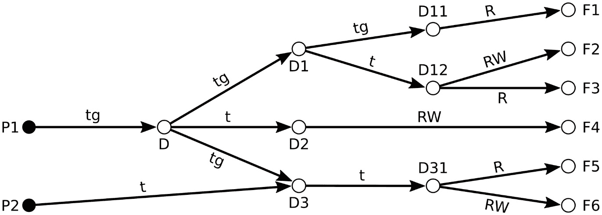
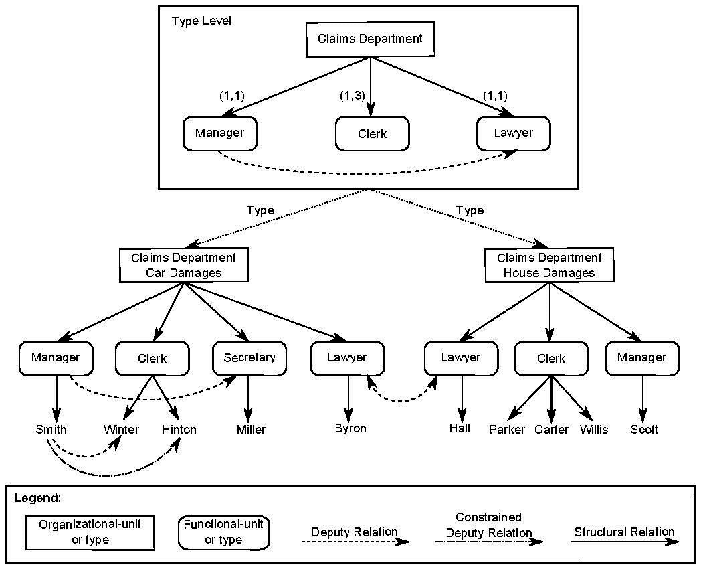
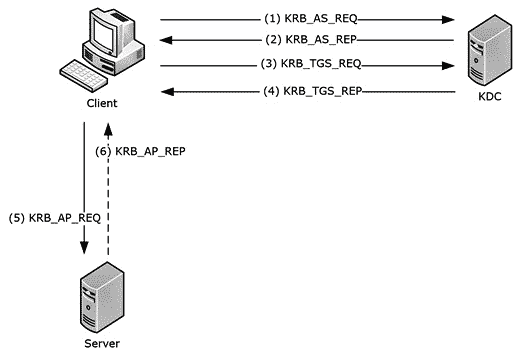

# 第五章：控制访问和管理身份

哦，哦，哦…看谁来了。是你！更不用说你带着对控制访问和管理身份的渴望来到这里。太棒了，这真是一个巧合，因为本章实际上涵盖了这些话题。

**身份与访问管理**，或称**IAM**，有助于理解那些执行所有**CRUD**操作（即**创建、读取、更新和删除**）的人和自动化服务。这听起来很重要，因为它确实很重要。否则你怎么能确保某个实体确实是他们所声称的批准用户呢？

此外，根据前几章，我们已经描述了基于隐私和机密性的不同层级权限，但我们如何在数字环境中以自动化方式执行这些规则呢？你如何走好这条“绳索”——确保适当的访问权限？为用户提供过多的访问权限，你就面临泄露风险，但权限不足则会影响用户的日常工作效率。本章的目的是帮助你为你自己和你的组织回答这些问题。

本章的重点是讨论以下要点：

+   访问控制模型与概念

+   为人员、设备和服务选择并实施身份验证和授权机制

+   身份与访问管理

+   控制对资产的物理访问

我知道这一切对你来说听起来有多兴奋，因为写到这里，我的脖子后面已经起了一层鸡皮疙瘩。所以，话不多说，别再拖延了，开始吧！

# 访问控制模型与概念

当谈到信息安全时，物理安全领域的相同理念也适用；*限制访问*某个位置或资产被称为**访问控制**。当我们说到访问时，我们可能指的是物理进入某个空间，或者是数字上访问一个文件夹。我们可能指的是在办公室阅读一份打印的文档，但我们也可以考虑数字资产中的 CRUD 操作。

经典的（或复古的？）访问控制是**锁和钥匙**。如果某人拥有钥匙，他们就能够访问锁所防止的内容。而如果他们有钥匙，他们就被允许访问，对吧？是这样简单吗？当然不是。我们真正想要的是确保拥有钥匙的人是被授权的人，并尽力确保即使*拥有*钥匙，错误的人也不能（或**未授权**）访问他们不该接触的内容。

在深入讨论模型之前，我想先介绍四个关键定义：

+   **主体**是操作*对象*的用户或程序。主体可以执行操作。

+   **对象**是被*主体*操作的被动数据。对象不能执行操作。

+   **许可**分配给*主体*，决定其访问级别，例如*机密*、*秘密*或*最高机密*。

+   **分类**或**保密/完整性**级别被分配给一个*对象*，根据其性质或敏感性。

既然这些内容已经覆盖，我们开始讨论**状态机模型**吧。

## 状态机模型

**状态机模型**是一种通过持续监控系统状态来防止系统变得不安全的概念。系统的所有潜在*状态*以及从一个状态转换到另一个状态的方式都被定义和规范化，其他任何操作也都包含在内。通过这种方式，系统的当前状态能够被预测和进行比较。

这些概念的写法可能会有点“怪异”，我觉得用图表来帮助概念化它们的用途可能更有意义。本质上，**状态机图**的目的是描绘系统上可以发生的各种操作，以防止滥用：

)

图 5.1 – 状态机模型图

(来源: [`commons.wikimedia.org/wiki/File:Finite_state_machine_example_with_comments.svg`](https://commons.wikimedia.org/wiki/File:Finite_state_machine_example_with_comments.svg))

在这个例子中，我们有一个非常简单的系统，由一个单一的对象——门组成，门有两种状态，开和关。可以发生的*转变*是关门可以被打开，开门可以被关上。这些由*主体*的行为触发。请醒醒，我不能让你现在睡着；这之后还有三章。我们继续吧。

## 信息流模型

与状态机模型类似（并在其基础上扩展）的是**信息流模型**，它由**对象**、**状态转变**和**流政策状态**（或**格状态**）组成。它旨在防止任何不安全或未经授权的通信，不论流动的方向如何。这个模型为后面将要讨论的**Biba**和**贝尔-拉帕杜拉**模型提供了基础。

## 保密模型

从信息流和状态机模型中，我们可以过渡到主要关注保密性的模型。政府对信息进行分类，以简化管理访问的过程，如*绝密*、*机密*、*保密*和*敏感但未分类*等。让我们看看贝尔-拉帕杜拉模型、Take-Grant 模型以及 Brewer 和 Nash 模型如何帮助组织管理信息访问。

### 贝尔-拉帕杜拉模型

通过使用**强制访问控制**（**MAC**）来在多个层次上执行安全策略，你可以根据主体的*需要了解*来管理信息访问，并确保他们满足或超过所需的安全许可。

在考虑贝尔-拉帕杜拉模型时，你应当牢记以下属性：

+   **不可向上读取**：主体无法读取其权限级别以上的更高机密性信息。这个概念很简单易懂。为了保持机密性，防止低权限的人员知道更高级的信息。这是标准的做法，通常被称为 **简单安全属性**。

+   **不可向下写入**：主体无法产生或贡献比其权限级别更低机密性的信息。这样做是为了防止比“更高级别”的信息被“写入”到较低机密性级别的文档中，无论是显式地还是通过推断。

+   **不可向上/下读取和写入**：也称为 *强星属性*，本质上要求为了读取或写入一个对象，主体的权限级别和对象的机密性必须相等。这是贝尔-拉帕杜拉模型的加强版，防止发生向上写入操作。

### Take-Grant 模型

**Take-Grant 模型**，起源于 1976 年，是一种用有向图表示系统的方式，图中包含节点和连接，而不是矩阵，目的是为了能轻松判断系统的安全性，即使它非常复杂。

基本概念如下：

+   *主体* 可以拥有标准的 *读取和写入访问权限*。

+   *主体* 还可以与其相关联的状态转换规则，例如 **take**、**grant**、**create** 和 **remove**。

+   一个拥有 **take** 权限的 *主体* 可以获取另一个 *对象* 或 *主体* 的权限。

+   **grant** 规则允许 *主体* 将自己的权限授予另一个 *对象* 或 *主体*。

+   **create** 规则允许主体创建新的 *对象*。

+   **revoke** 规则允许主体移除它对另一个 *对象* 的权限。

一个 Take-Grant 图示示例如下。请记住，**D** 是 **目录**，**F** 是 **文件**，它们都是 **对象**。

**P1** 和 **P2** 是 **主体**。

你可能从图示中看出，当一个主体或对象拥有某个对象的 **take** 权限（或 **t** 权限）时，它可以获得该对象的所有权限。如果它拥有该对象的 **grant** 权限（或 **g** 权限），它可以将自己的权限传递给该对象。

请参考下图进一步了解，这正是重点所在：

图 5.2 – 来自 https://commons.wikimedia.org/wiki/File:Take-grant_representation.svg 的 Take-Grant 有向图

现在我们来看看 Brewer 和 Nash 模型。

### Brewer 和 Nash 模型

**Brewer 和 Nash**模型，或称为 **中国墙** 模型，侧重于分段。实质上，我们希望通过只允许用户访问他们所需的信息组，而不允许更多的信息访问，从而避免*利益冲突*。该模型的目标是确保没有信息能够流动，从而导致利益冲突的发生。

它最初是为英国金融行业创建的，可以通过想象一个为多个不同公司提供服务的咨询公司来理解。该咨询公司为客户提供服务的员工不应访问其他客户的信息，因为这可能会导致机密性问题。

## 完整性模型

我们之前已经讲过完整性，所以就不再重复。请记住，某些组织可能比起机密性丧失，更关注完整性丧失。

我想深入讲解 Biba 和 Clark-Wilson 模型，它们关注的是完整性问题。

### Biba

Biba，或者更准确地说是 **Biba 模型**，实际上是一个侧重于解决*完整性*问题的访问控制模型。

**Biba 模型**首次发布于 1977 年，是另一个基于*格子*的模型，类似于*Bell-LaPadula*。Biba 模型在访问控制中的定义属性如下：

+   **禁止向下读取**：主体无法读取低于其权限级别的对象。这是 Bell-LaPadula 的 *禁止向上读取* 原则的对立面，Biba 的 *简单完整性属性* 确保高等级的主体不会读取可能被“污染”的错误信息的文档。

+   **禁止向上写入**：主体不能向权限级别更高的对象写入内容。也称为*星*完整性属性，它防止了低权限主体对不应被“污染”的对象造成完整性破坏。

+   **调用属性**：此属性旨在防止一个主体调用另一个具有更高权限的主体。

正如你可能已经发现的那样，Biba 模型并不涉及可用性或机密性，它完全专注于完整性。

### Clark-Wilson

接下来，我们可以谈谈 **Clark-Wilson 模型**，它起源于 1987 年。和大多数 80 年代的事物一样，它的创立基础是商业活动。这个模型像 Biba 一样，关注的是完整性。

Clark-Wilson 访问控制模型的关键要点是职能分离原则，数据必须通过一个允许日志记录的应用程序进行访问，并且对这些日志的审计是必不可少的。

**授权用户**不能以不适当的方式更改（或执行**转换过程**）**受限数据项**。受限数据项的记录状态为*篡改*、*记录*和*一致*。

在 Clark-Wilson 中，用户只能访问其授权级别的数据，不能访问更高或更低的级别，这意味着每个授权级别都有自己完全独立的数据集。

这样，为了防止本节变得过于冗长，我想继续简要讨论这些模型如何应用于现实世界。

## 现实世界的访问控制模型

所以，回到我们之前的定义，从现实世界的角度来看，我们说的是以下内容：

+   *主体*是对系统执行操作的实体。一些系统为*主体*分配**用户 ID**。

+   *对象*是系统上的资源。*主体*可能会访问它们，因此对*对象*的访问应该受到控制。

+   一般来说，我们有两种方式来处理访问控制：**基于能力的模型**和**基于访问控制列表（ACL）的模型**。

在**基于能力的模型**中，拥有对某个对象的**能力**（类似于所有权）的主体是可以访问该对象的主体。它们可以将这种能力转移给其他用户。

在**基于 ACL 的模型**中，主体如果其 ID 在访问该对象的列表上，就能访问该对象。如果不在列表上，那就“他们不在名单上”，然后他们就被扔到街上，一辆出租车把水溅到他们脸上，他们那套酷炫的红色天鹅绒西装完全毁了。

这两种模型都有将**一组主体**视为*主体*的能力。

从这里开始，让我们深入探讨并调查现实世界中我们常见的访问控制模型：

+   **基于身份的访问控制**（**IBAC**）是基于个人的，允许一种更细粒度但更难管理的访问控制方法。

+   **基于格状的访问控制**（**LBAC**）是一种描述访问对象规则或描述主体可以访问哪些对象的规则的方法。例如，在格状方法中，假设你创建了一些规则，规定如下：

    - 如果*对象*的*分类*小于或等于*主体*的*授权*，则允许读取它。

    - 如果*对象*的*分类*小于*主体*的*授权*，那么他们不能写入该对象。

    这就是*Bell-LaPadula*模型的实际应用。我早就知道描述这些模型不会完全浪费时间！不能读，不能写，BOOM！

+   **基于角色的访问控制**（**RBAC**）是根据角色创建授权组并将用户分配到不同角色组中。因此，在访问*对象*时，我们消除了对临时决策的需求。如果你有这个角色，你可以访问该*对象*的*分类*；如果没有，你就不能访问。

+   **基于规则的访问控制**（**RAC**）是将规则与访问关联，例如规定某个*对象*仅在工作日的 09:00 到 17:00 之间可用。

+   **MAC** 是我们到目前为止所描述的内容，因为我们是使用*对象*的*分类*来决定访问权限，而不是让用户决定谁可以访问什么。

+   **自主访问控制** (**DAC**) 是由数据所有者决定哪些主体可以访问特定对象。系统管理员创建具有不同权限的目录结构，并将适当的数据存储在相应的位置。

+   **基于属性的访问控制** (**ABAC**) 是通过检查*主体*和*对象*的属性来通过策略授予*主体*访问权限的方式。

+   **基于图的访问控制** (**GBAC**) 使用图形和查询语言，根据组织图定义访问，这使其与例如 RBAC 区分开来。这个图是不是让你想起了 Take-Grant 定向图？

图 5.3 – 一个 GBAC 组织图（来源：https://commons.wikimedia.org/wiki/File:GBACOrgGraph.pdf）

+   **基于历史的访问控制** (**HBAC**) 是根据评估*主体*的活动来决定访问权限的方式。这可能包括他们在系统中的行为、他们请求访问之间的时间间隔以及请求的内容。

+   **基于存在的访问控制历史** (**HPBAC**) 是一种分析性的访问控制方法，考虑了访问的时机。你可以设置策略，规定如果用户上周访问同一对象四次或更多次，他们就可以访问该对象。老实说，这不是一种流行的选择。

既然这些内容已经涵盖了，我们就深入讨论现实世界的内容，谈谈选择和实施认证与授权机制。

# 选择和实施认证与授权机制

幸运的是，我们实际上之前已经涉及过该主题的部分内容。为了让大家回顾一下，我认为我们应该在继续讨论如何选择和实施各种身份和访问管理（IAM）解决方案之前，简单谈谈认证与授权的区别，以确保我们防止未经授权的用户访问他们不该访问的资源，并确保授权用户能够访问他们需要的内容，继续他们那毫无生气的生活。

## 认证与授权

**认证** 专注于用户的身份，确保他们是*真实的*。不是指他们夸奖你并且真心实意，而是指他们确实是他们所说的那个人。

**授权** 专注于用户在*认证*后被允许做什么（或者被授权做什么）。

用户可以被*认证*，并由于其作为数据分析师的角色，具有*授权*访问他们当前正在处理的记录。他们可能没有*授权*访问公司目前正在原型开发的量子悬浮设备，以制造电影《回到未来 2》中的滑板，因为公司注重保密性。

我们能够将授权权限与组织数据的敏感度标签或分类进行关联，正如我们之前提到的。

授权可以概念化为如下：

*“如果一个文档具有这个分类，那么具有这些权限的用户被授权阅读，但不能修改或删除。”*

当然，这些决策基于你组织的政策，并且根据风险和需求有很大的不同。

如何确认用户的身份？我们将这些属性存储在哪里？我们如何通过计算机系统自动化这个过程？这两个问题引出了接下来的章节。

## 认证与安全

信息安全的一个关键方面是**认证**。它是我们迄今为止在本书中讨论的许多内容的核心。我们希望让已知的人顺利地处理他们需要处理的工作（但不会多做），同时又希望防止未知的人访问他们不应该访问的任何内容。

解决这个问题有很多方法，对于许多解决方案来说，目标可能相同，但应用于网络架构或系统中的不同组件。

让我们来看几个例子。例如，我们可以通过以下方式认证用户：

+   **密码认证**，是“*你知道的东西*”的一个例子。

+   **智能卡认证**，是“*你拥有的东西*”的一个例子。

+   **生物识别认证**，也称为“*你是的东西*”，一个例子是**指纹扫描**。

+   任何前述方法（或其他方法）的组合，称为**多因素认证**（**MFA**）

说到 MFA 时，我们需要记住，输入密码然后是“你第一只狗的名字”并不是*多因素认证*的例子。这只是你知道的两件事。它可能增强认证过程，但并不是真正的 MFA。

### 密码认证

**密码认证**的优势是显而易见的：我们已经在全球范围内训练了人们如何使用密码进行身份认证。这对用户来说很简单（除非是我的岳母）。如果他们忘记了密码（就像我的岳母那样），他们可以通过访问他们的电子邮件账户来简单地重置密码（而我的岳母也忘记了她的电子邮件密码）。

通常，这个密码被存储为**加盐哈希**，并且像**Microsoft Active Directory**这样的服务处理这些凭证的安全存储。

密码本身需要足够难以猜测，而且猜测密码的尝试次数应该*限制速率*或阻止，以防止**字典攻击**或**暴力破解攻击**。

针对这些攻击的另一种缓解措施是**密码复杂性要求**，密码不能包含字典中的单词，必须有一定长度，并且必须包含字母、数字和符号的混合。此外，在多个地方重复使用相同的密码会导致一个服务的安全漏洞，从而影响到其他地方的账户安全……但现在我们正在抵消密码的优点，因为它们应该是容易记住的。**密码管理器**通过自动创建和使用复杂密码来为我们提供技术解决方案，只要输入一个“主密码”，通常会启用多重身份验证（MFA）。

### 智能卡认证

通过使用智能卡，你正在利用认证中的“你拥有的东西”因素。该卡片内置芯片，存储用于识别一个人并验证其信息的密钥。

通常，这些卡片还需要使用 PIN 码才能访问，这提供了第二个“你知道的东西”因素。这有点像我们以前使用 ATM 取现金的方式，那时现金还很流行。通常，PIN 码是一个非常弱的密码，但尝试次数有限，以防止针对复杂度的攻击。PIN 码要求也防止了某人仅仅通过*找到*智能卡来获得访问权限。

### 生物识别认证

另一种*认证*方式是通过**生物识别**。扫描你的视网膜、听你的声音、读取你的指纹或手掌静脉，或者把血滴进女巫的铜碗里，诸如此类。

生物识别的优点在于无需记住密码；你不可能忘记自己的指纹，而且有人拥有与另一个人相同生物特征的可能性非常小——除非你使用像 iPhone 上的 Face ID 这样的技术，它偶尔会出现**假阴性**（当确实是你解锁手机时却无法识别），或者它会解锁一个长得相似的人的屏幕（**假阳性**）。

生物识别的缺点也显而易见：

+   你无法更改你的指纹。

+   如果有人需要你的指纹，他们可能会把你的手指砍下来（在这种情况下，你只能希望这是为了指纹生物识别）。

+   它们的实现成本远高于密码。在手机出现之前，家里没人有指纹扫描仪。

### 单点登录

此外，输入密码是一种令人烦恼的体验，尤其是当你遵循最佳实践并为每项服务使用不同的密码时，但又没有使用密码管理器。

与每次尝试使用不同服务时都要求用户输入密码不同，现在有一些解决方案可以提供更统一的身份验证方式，例如**单点登录**（**SSO**），在这种方式下，用户只需要一次证明身份，然后就可以访问他们需要的所有资源。这通常需要一些配置，但可以减少密码重用的风险，并简化权限撤销等操作。

### 身份验证协议

幸运的是，数字领域的身份验证已经通过几种不同的协议实现了某种程度的标准化。随着时间的推移，这些协议从安全性角度得到了改进，并且其兼容性扩展到了更多的使用案例。

因此，值得深入了解当前全球各组织普遍采用的最常见身份验证方法和协议，如**NTLM**、**Kerberos**和**PKI**。

#### 微软 NTLM（NT LAN Manager）

**NTLM**，即**NT LAN Manager**，是 Windows 身份验证方式的修订版，也是对 LM（即 LAN Manager）的升级，后者仅将（弱哈希的）密码通过网络传送到域控制器，后者存储每个用户的身份验证信息。使用 NTLM 后，哈希密码实际上并不会通过网络发送，而是通过以密码哈希作为密钥加密的消息发送。

它被认为是一种过时的身份验证协议，但由于与**Windows**、**Exchange**、**Active Directory**和**Windows Server**系统的深度关联，仍在 IT 系统中广泛使用。

下面是 NTLM 工作原理的示意图：

)

图 5.4 – NTLM 身份验证示意图

(来源：[`docs.microsoft.com/en-us/openspecs/windows_protocols/ms-apds/5bfd942e-7da5-494d-a640-f269a0e3cc5d`](https://docs.microsoft.com/en-us/openspecs/windows_protocols/ms-apds/5bfd942e-7da5-494d-a640-f269a0e3cc5d))

总结来说，以下是步骤：

1.  用户登录到**客户端** PC，客户端向**服务器**发送请求身份验证的消息。

1.  **服务器**以挑战消息作为回应回复**客户端**。

1.  **客户端**使用密码的 MD4 哈希的 56 位片段加密密码，使用该加密段对服务器的挑战进行加密，并将加密结果作为响应发送回**服务器**。这是该协议的一个弱点。

1.  **服务器**将响应传递给**域控制器**。

1.  **域控制器**检查其记录，查找是否匹配，并通知服务器用户是否可以通过身份验证。

由于 NTLM 的逻辑存在缺陷，出现了各种问题。例如，通过将 NTLM `AUTHENTICATE_MESSAGE`传递到一个带有字典、**彩虹表**（预计算的最流行密码的哈希）或*hashcat*工具的恶意服务器，攻击者能够快速破解用户名/密码组合。目前，像 GTX 1060 这样的现代 GPU 能够在 1 秒钟内破解 7 个字符的 NTLM 密码。

更糟糕的是，恶意行为者可以轻松地嗅探网络中的 NTLM 哈希值，从其他客户端获取，然后**传递哈希**，并以该用户身份进行认证，因为由于缺乏*加盐*，**哈希**相当于**密码**。

此外，启用了 NTLM 并且可以访问 Exchange 和 Active Directory 服务器上的管理账户的机器，可能会遭遇**远程代码执行**（**RCE**）攻击。

不幸的是，NTLM 认证仍然用于本地登录认证，以及任何属于**工作组**的系统。许多应用程序使用 NTLM 进行认证，而不是更现代的**Kerberos**协议（已经 20 年了，大家！快点吧！）。

如果你发现自己需要在公司机器和服务器上保持 NTLM 启用，虽然有一些缓解步骤可以采取，但请记住，每当发现新的漏洞时，你的团队会很忙，这种情况发生得相当频繁。

你可以强制启用**SMB 签名**以防止**NTLM 中继攻击**。

你可以阻止已经无法挽救的**NTLMv1**版本。

你可以强制启用**LDAP/S 签名**和**通道绑定**以防止**LDAP 中继攻击**。

你只能接受启用了**增强认证保护**（**EPA**）的请求，以防止**NTLM 中继攻击**发生在 Web 服务器上。

#### Kerberos

为了修复**NTLM**的许多漏洞，**Kerberos**在**Windows 2000**及之后的版本中引入，用于认证。我们将介绍 Kerberos 的三个部分：**客户端**（通常是用户的 PC）、**服务器**和**密钥分发中心**（**KDC**）。

在我们进入具体过程之前，先来看一下这里的图示：

（来源：[`docs.microsoft.com/en-us/openspecs/windows_protocols/ms-kile/b4af186e-b2ff-43f9-b18e-eedb366abf13`](https://docs.microsoft.com/en-us/openspecs/windows_protocols/ms-kile/b4af186e-b2ff-43f9-b18e-eedb366abf13) ）](img/Figure_5.06_B16611.jpg)

图 5.5 – Kerberos 认证图示

（来源：[`docs.microsoft.com/en-us/openspecs/windows_protocols/ms-kile/b4af186e-b2ff-43f9-b18e-eedb366abf13`](https://docs.microsoft.com/en-us/openspecs/windows_protocols/ms-kile/b4af186e-b2ff-43f9-b18e-eedb366abf13) ）

所以，我们从这张图示中看到的第一件事是，KDC 与服务器完全分离，不像 NTLM 那样有传递认证的过程。

让我们讨论一下发生了什么，以及它为什么是一种安全的认证方法：

+   **Kerberos 身份验证服务交换**：**客户端**向 **KDC** 发送请求，获取 **票证授权票证**（是的，这个名字非常糟糕，我们称其为 **TGT**）。客户端提供其主体名称，并可以提供预身份验证信息。在图示中，这由 **(1) KRB_AS_REQ** 表示。

    **KDC** 返回一个 **TGT** 和一个会话密钥，客户端可以用它来加密和认证与 **KDC** 的通信，以进行 **票证授权服务**（**TGS**）请求，而无需重复使用持久密钥。在图示中，这由 **(2) KRB_AS_REP** 表示。

+   **Kerberos TGS 交换**：**客户端**随后向 **KDC** 发送请求，获取 **server** 的 **票证**。客户端提供 **TGT**、**Kerberos authenticator** 和 **服务主体名称**（**SPN**），即客户端用来标识服务进行身份验证的名称。**Kerberos authenticator** 是客户端 ID 和时间戳，用 **会话密钥** 加密，并帮助服务器通过证明 **authenticator** 是最近构建的来检测 **重放攻击**。在图示中，这由 **(3) KRB_TGS_REQ** 表示。

    **KDC** 验证 **TGT** 和 **authenticator**。如果这些是有效的，**KDC** 会返回一个用 **server** 的 **长期密钥**（已经存储在 **KDC** 中）加密的 **服务票证**，以及一个会话密钥，客户端可以用它来加密与 **server** 的通信。在图示中，这由 **(4) KRB_TGS_REP** 表示。

+   **Kerberos 客户端/服务器身份验证协议交换**：从这里开始，**客户端**可以通过提供 **服务票证** 和新生成的 **authenticator** 请求访问 **server**。**server** 随后使用其长期密钥解密 **服务票证**，检查 **authenticator** 是否有效，并使用授权数据来控制 **客户端** 的访问权限。

为了确保 **server** 的真实性，客户端可以选择请求通过让 **server** 发送从 **authenticator** 中提取的 **客户端时间戳**（该时间戳之前已用会话密钥加密）来进行验证。通过返回时间戳，**客户端** 证明了 **server** 可以解密 **authenticator**。否则，服务器可能只是收集信息，而没有返回任何内容，导致客户端无法得知。

#### PKI 和数字证书

**公钥基础设施**（**PKI**）的一个关键部分是 **数字证书**（或 **公钥证书**），它证明了与身份相关联的 *密钥* 的所有权——无论是用户还是设备的身份。

证书服务用于**TLS 协议**（该协议保护 Web 上的传输数据），以及在电子邮件加密方案如**S/MIME**和数字签名解决方案中。**公钥加密**（或**非对称加密**）的优势在于，依据你使用的两把密钥中的哪一把来加密消息，你能够确保完整性、不可否认性和机密性。

*公钥证书*的最流行标准格式之一叫做**X.509**，由于其广泛的应用范围，该证书被拆分成多个不同的部分。本质上，这个证书驻留在设备上，并在后台默默地为服务器提供身份验证。

使用**X.509 证书**的一个主要优势是，我们不再需要用户名和密码的组合，这在之前已经讨论过其弱点。理想情况下，使用*数字证书*应与其他身份验证因素结合使用，例如在用户手机上使用的 PIN 或**多因素认证应用**（MFA app），该应用需要指纹验证。

通过在你的组织的公钥基础设施（PKI）中充当**证书颁发机构**（**CA**），你的*系统管理员*能够大规模地分发和撤销数字证书，并利用这些证书来满足组织的**访问控制策略**。这与现有的系统（如 Active Directory 或 LDAP）兼容，并提供了一个更加简化的方式来管理组织中的身份验证。

从这里开始，我们进入**授权**的讨论。

## 授权

经常与**身份验证**（authentication）一起使用，**授权**（authorization）是身份验证后赋予**客户端**（client）或**主体**（subject）访问资源的权限级别。授权并不总是访问资源所必需的，例如，在 Google 上搜索时，你无需进行身份验证即可进行搜索（虽然你可以进行身份验证），任何能够在浏览器中访问[google.com](http://google.com)的人都拥有使用该资源的授权。

然而，为了访问你的 Facebook 消息，或者更改你的个人资料照片，你需要先进行*身份验证*，然后你便拥有*授权*，能够创建、读取、更新和删除你拥有的内容。

本质上，计算机系统允许实施*编程决策过程*，该过程根据*身份验证*过程与*定义的安全性和隐私要求*的结合提供授权。

专注于组织中的*授权*是确保将适当的访问权限授予合适人员，并且没有过多权限的关键步骤。是的，我们再次在谈论*最小权限*，而且这背后是有原因的。最小权限是确保组织安全的重要组成部分，虽然有时实施最小权限原则看似工作量大，但其带来的好处通常能很快弥补这些成本。

我们之前讨论了现实世界中的访问控制模型。利用这些模型是最佳实践，能够确保你不会遇到（或完全忽视）在安全漏洞中常见的问题。使用**MAC**、**DAC**、**RBAC**或**ABAC**，或者这些示例的组合，是信息系统中常见的标准做法。

作为一个例子，你可以将 ACL 与 RBAC 结合，为你组织中的每个角色创建一套规则，允许访问与其角色相关的资源，并根据需要可能允许编辑、更新或删除这些资源。

管理这些原则并确保组织中的用户获得他们所需的访问权限——既不过多也不过少——的最佳实践是使用 IAM 工具套件。接下来，我们将深入探讨如何利用这些系统。

# 身份和访问管理（IAM）

当我们审视如何管理本章中所涉及的所有身份验证和授权原则时，我们可以通过利用被称为 IAM 工具的工具来简化流程。这些工具帮助组织在正确的时间为正确的资源提供正确的访问权限，并通过为每个用户提供一个单一身份，帮助进行维护，该身份在用户在组织中的整个生命周期内都被维护和监控。这可能包括员工、客户或第三方。如果用户更换角色或离开，其访问权限也会通过*IAM*进行反映。

一个*集中管理的身份库系统*用于管理身份和调控访问，这能带来更大的灵活性、更好的安全性和更高的生产力，但也需要技术经验丰富的人来管理其行政工作。此外，围绕这些系统的定期管理和审计的政策和程序对于避免停机并确保安全违规不被忽视至关重要。

请记住，当我们查看**HIPAA**、**SOX**、**GDPR**或几乎任何其他信息安全或隐私的合规要求时，我们会看到对于*控制访问*员工和客户信息的要求。IAM 工具提供了一个强有力的解决方案，确保你的组织能够遵守这些要求。

这些系统通常与之前提到的协议和流程兼容，例如 PKI、Kerberos、SSO 和密码验证，并允许各种实施模型，使用户可以在家工作，从移动设备认证到*SaaS*解决方案，以及其他非传统的工作方式。

谈论企业级身份管理而不提及**目录**，比如**Microsoft Active Directory**，是没有意义的。目录与 IAM 工具不同，但是是其运行的关键组成部分。IAM 工具管理来自多个来源的信息，例如 HR 工具或 Active Directory。

实际上，IAM 系统要做的是自动化环绕组织中这些工具管理的业务流程。有新员工加入公司时，HR 软件解决方案会触发在目录中创建新用户的过程，然后根据他们在第一天可能需要的内容触发其他操作。

包括**身份即服务**（**IDaaS**）云订阅在内的第三方身份服务越来越受欢迎，旨在减少开销并改善相关的连接性。

利用可用的自动化功能来减少手动 IT 管理任务，需要一些条件才能正确利用这些服务。让我们看看其中的一些条件。

## 利用身份服务

首先，*你的组织* *必须建立政策和程序*。这是我一直在说的，也是因为它总是正确的。如果你不将规则写下来，如何可能管理像组织的访问控制这样复杂的事物呢？

这些政策和程序将旨在回答以下问题：

+   你的组织将如何处理访问控制？重点是*基于角色的方法*吗？我们是否考虑*MAC*呢？

+   如何*为新员工分配权限*？每位新员工，我们如何定义他们的访问权限？确保他们能在工作的第一天访问所有资源是如何处理的？

+   哪些角色或员工有哪种级别的授权？这可能与你的方法和是否是*RBAC*、*MAC*、*DAC*等有关。

+   当员工*离开组织*时，有什么措施确保他们不再具有访问权限？

+   如果用户需要例外规则，如何进行升级、批准和管理？

+   何时审查访问权限？我们如何确保员工角色变化时对资源的访问权限不会随之增加？

+   自动化可以走多远？我们能自动化*密码重置*吗？关于根据 HR 系统中感知到的变化来撤销权限呢？例如，假设用户提交辞职申请。

+   如果外部顾问加入公司或第三方需要临时访问权限，该如何处理？是否采用*联合身份管理*？

+   哪些服务由*单点登录（SSO）*覆盖？

+   你如何教新用户使用这些系统？是有一份纸质手册吗？一个网页门户？公司里有专人坐下来教他们吗？创建一个正常的入职流程，并尝试通过模拟新员工的体验来测试你的计划。

现在我们已经涵盖了身份和访问管理（IAM）的概念，我想继续讨论作为访问控制一部分的物理访问控制。

# 控制对资产的物理访问

当我们在信息安全中讨论访问控制时，有时我们会忽略物理方面，倾向于关注数字方面。*对硬盘、机器、文件夹或打印文档的物理访问*对恶意行为者来说可能具有高度价值，因此应该加以控制。在这一部分中，我将简要讨论需要考虑的各种**物理安全**概念。

## 物理访问控制

如果我们希望限制对建筑物或房间的访问，并只允许授权人员进入受限区域，可能会考虑以下几种解决方案：

+   **人工访问控制**，例如*保安*、*接待员*或*验票员*。

+   **机械访问控制**，例如*锁具*和*钥匙*。

+   **技术访问控制**，例如*人身陷阱*、*旋转门*、*指纹或视网膜扫描仪*、*基于钥匙扣的访问控制*或*出口障碍*。

+   **围栏或周界障碍**可能防止个人绕过*访问控制*。

访问控制系统可以帮助管理和监控对区域的访问，并记录谁、何时以及在哪里尝试访问，是否被接受。

物理锁和钥匙无法基于时间限制访问，也无法提供任何进入记录。此外，它们几乎无法证明钥匙持有者就是应该拥有钥匙的个人。

此外，在钥匙丢失或被盗的情况下，撤销访问权限非常困难，而且不可能知道钥匙是否被秘密复制。

**电子访问控制**登场了，而且正好是时候。

## 电子访问控制

**电子访问控制**（或**EAC**）的优势在于，我们可以解决一些以前锁和钥匙组合的缺点……或者说组合锁的问题。

对于计算机，我们可以做以下几项：

+   更好地通过时间来限制访问

+   记录进入尝试和成功的情况

+   可以轻松地在细粒度上撤销访问权限，而不需要更换整个锁具

+   获取其他信息以证明个人有授权，而不仅仅是钥匙

在获取其他信息的话题上，我们可以进入多因素认证（MFA），要求用户提供以下两项或更多的身份验证信息：

+   他们知道的某样东西，可能是密码或 PIN 码

+   他们拥有的某样东西，可能是一个电子钥匙扣或智能卡

+   他们的生物特征，可能是视网膜或指纹扫描

如果用户是通过数字方式而非物理方式访问某些内容，我们可以增加另一个“因素”类型，即"*他们所在的位置*"，这是通过 GPS 位置证明用户身处一个被认为能够证明其身份的地方。显然，这种方式不适用于物理安全访问控制。

## 防止利用

在涉及物理安全时，我们可能面临各种风险，例如以下几种：

+   尾随，即未授权的人跟随授权人员进入受限区域，有时甚至是因为礼貌地为其开门。这可以通过人陷阱和旋转门来缓解。

+   破坏行为，例如通过撞车破墙进入，或使用撬棍撬开门。检测到此类活动后，可能需要防御深度缓解措施，如护栏或钢铁门，以确保将风险降低到可接受的水平。

+   技术性攻击，例如克隆智能卡或暴力破解 PIN 码，可以通过多因素认证（MFA）、限速等方式缓解。

除了这些，考虑到与物理访问控制相关的风险并将其添加到风险登记册中也是值得的。

# 总结

哇哦！我们在这一章中涵盖了这么多内容，真该为自己鼓掌。

我们回顾了多种不同的访问控制模型和概念，包括经典的*贝尔-拉帕杜拉*模型和*比巴*模型。然后，在这些概念确立之后，我们探讨了现实世界中的例子，包括*基于角色的访问控制（RBAC）*和*基于自愿访问控制（DAC）*模型，并分析了它们的实际意义。

接着我们讨论了如何为人员、设备和服务选择并实施认证和授权机制。我们讲解了*认证*和*授权*之间的区别，以及它们如何协同工作来提供*访问控制*，确保安全性和隐私。我们还涵盖了*密码*、*智能卡*和*生物识别*，以及一些常用的*认证*协议。

然后我们深入探讨了*IAM*是什么，以及你如何利用组织中的*身份服务*来扩展并确保你的 IT 团队不被繁琐的访问管理任务所压垮。

我们还初步探讨了如何控制*资产的物理访问*，这是在这个话题中经常被忽视的内容。

覆盖了所有这些主题之后，在我看来，你对能够帮助你回答我们在本章开始时提出的问题的思想有了更深入的了解：

+   如何确保某个实体确实是其声称的已批准用户？

+   我们如何在数字环境中以自动化方式执行这些规则？

+   如何确保赋予合适的权限，以促进生产力？

既然我们已经涵盖了这些要点，我可以说我们已经达到了本书的一个重要里程碑！我们已经涵盖了足够的信息安全话题，终于可以进入*第六章*，*设计与管理安全测试过程*。不再拖延，让我们开始吧！
