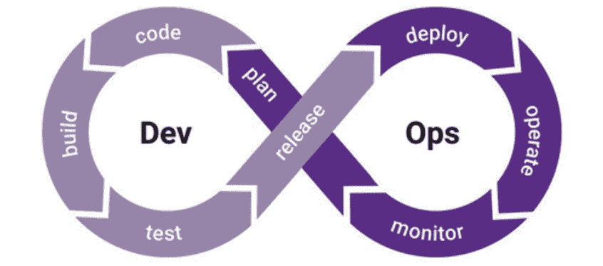
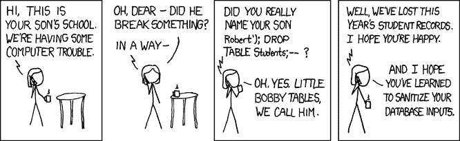
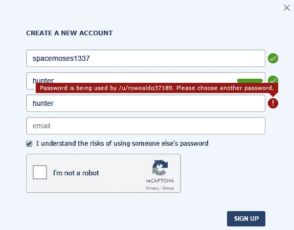

# 第八章：提高软件安全性

软件帮助全球各地的组织将生产力提升到前所未有的效率水平，帮助自动化以前需要人工完成的琐事。通过查看组织的软件资产（并在此过程中更新风险登记册），你会越来越意识到，几乎每一个商业流程都依赖于至少一个软件解决方案，而软件的韧性、安全性和可用性越高，组织获得的收益就越大。

你的一些软件可能是内部开发的，其他软件则是从第三方购买或许可的。这些系统通常存在巨大的攻击面，拥有许多易被利用的活动组件，且由于它们处理机密和敏感信息并存储业务关键数据，未经授权访问（或摧毁）这些系统可能导致关键数据的永久丢失，或者导致知识产权、公司机密和客户数据的机密性或完整性丧失。此外，这些安全漏洞可能导致监管机构的巨额罚款，雪上加霜。

可怕的事情是，即使我刚刚列出了所有关心的理由，各种软件系统的采购、开发和使用通常都没有任何以安全为重点的监督。这正是为什么理解并执行改进的软件安全至关重要，以确保你的组织能够减轻使用软件带来的风险。

在这一章中，我将深入探讨一些能够帮助你确保组织中软件安全标准更高的话题。包括以下几个主题：

+   探索软件安全范式

+   理解安全开发生命周期

+   利用 OWASP 十大主动控制

+   评估软件安全性

总的来说，我们希望从这一章中学到的是，如何为软件建立需求，无论它是由第三方开发还是由内部开发团队开发。我将讨论我们如何理解由供应商开发的软件系统的风险特征，如何减少在组织内部开发活动中出现漏洞和错误的可能性，以及如何针对安全风险采取措施，重点关注 CIA 三元组。

话不多说，让我们继续进入这一章。

# 探索软件安全范式

我想让你回想一下 2014 年 4 月，这在信息安全的历史中是一个重要时刻；全世界都被*CVE-2014-0160*漏洞的披露所震惊，这个漏洞被冠以**Heartbleed**的名字。现在，当我说“*全世界*”时，我是认真的。*Heartbleed* 就像是软件安全大片中的*大白鲨*，它甚至有了自己的网站（heartbleed.com），甚至还有自己的 logo：


图 8.1 – Heartbleed 漏洞的标志

披露的信息中提到，**OpenSSL 加密库**存在一个与**缓冲区过度读取**相关的漏洞，这使得恶意行为者能够访问加密密钥和登录凭证，以及其他各种机密信息。听起来很糟糕，但情况更糟：**OpenSSL 版本的 TLS 协议**中也使用了 OpenSSL 加密库，这种协议广泛用于全球范围内保护数据传输的安全，几乎无处不在。简单来说：全球排名前 100 万的**TLS/HTTPS 保护网站**中超过一半受到了影响，并且容易受到攻击。

尽管在披露的同一天发布了 Heartbleed 漏洞的修复程序，但这并没有阻止设备（如防火墙、安卓手机和其他受信硬件）、软件以及网站在补丁被应用并且更新与最新版本对齐之前，继续处于脆弱状态。

此外，让我们明确一点：这个漏洞自 2011 年起就在代码中存在；我们知道这一点，因为任何愿意查看和阅读源代码的人都能看到它。这是因为 OpenSSL 是一个**开源**开发的程序。开源意味着软件的源代码可以自由阅读、修改和重新发布。*开源软件运动*的一个被认为的优势是透明的软件能够防止通过模糊化安全问题以及源代码中的其他漏洞，因为任何愿意查看的人都会发现这些问题。不幸的是，在 OpenSSL 的加密库的案例中，似乎要么没有人注意到，要么没有人愿意大声呼喊这个漏洞，直到 3 年后。

这听起来有些奇怪，对吧？错了。直到最近，这一直是默认情况。安全性一直是任何寻求开发新功能和推出新产品的组织事后的考虑，但随着时间的推移，随着 Heartbleed 等重磅披露事件进入了普通商业主和 IT 专业人士的词汇中，我们看到了一个向更加重视安全的范式转变。

那么，我们如何确保在组织中避免实施存在漏洞的软件呢？无论是供应商创建的生产力套件，还是开源的加密库，或是为员工开发的内部工具，你不可能发现所有问题，因此重要的是要管理好自己的预期。就像信息安全中的任何问题一样，这关乎风险管理，并且需要制定适当的政策和程序，确保采取了必要的步骤，并与相关资产的价值相一致。

首先，让我们来看一个可以应用于不仅仅是信息安全的概念，而是任何我们购买东西时都能用到的原则。

## 买者自慎

你是否听过*让买家警惕*这个术语？我敢打赌你听过拉丁文版本，*caveat emptor*，对吧？怎样，我们不妨借此机会做个快速的拉丁术语学习，来探讨一下合同法中常见的拉丁术语：

买者自慎，因为他不应对所购买的财产的性质一无所知

它的大致英文翻译如下：

让买家警惕，因为他不应对他从其他方购买的财产的性质一无所知。

说实话，我很惊讶它能够传播得这么广。通常情况下，如果你在背诵格言时需要停顿一下，它就不会长久存在。尽管它相当冗长，这个想法经得起时间的考验，在采购新软件时必须考虑到这一点。

由买方负责对将要在其组织中使用的软件系统进行尽职调查。你有责任确保你的组织已经适当地进行了尽职调查，并将相关信息保存下来，以备将来需要向监管机构或审计员证明已采取适当的预防措施并在过程中履行了必要的谨慎时使用。

"但是怎么做？"你问。"我怎么能确保呢？"

## 法律文档

"哦，太好了，"你在阅读到这一节标题后说，"他接下来会谈论文件工作。"嗯，是的，遗憾的是，我确实会。

事实是，你不能百分百确定你购买的软件是否在安全性上得到了开发。然而，你可以尝试在与供应商的合同协议中加入条款，确保他们理解你的要求，并负责确保他们开发的解决方案是在安全的前提下构建的。

定义*责任*的合同是风险缓解的一种形式。我的意思是，在发生泄露事件，导致你组织的机密信息或与个人相关的敏感信息被泄露时，你是否能够根据你组织面临的罚款和声誉损害的损失程度，要求供应商进行赔偿？

是否接受这些条款取决于多种因素，包括条款的性质、供应商的规模、你组织的规模、你对他们的客户价值等。

有时候，你只需要实施其他类型的缓解措施，并接受供应商在发生泄露事件时不承担责任，无论是否是由于他们一方引入了后门或恶意软件。你有责任将这些协议文件化，并在进行风险评估时，尤其是软件实施前后，引用它们。

此外，本书中我们讨论的关于信息安全理念仍然适用。我们必须允许软件的最小权限访问，我们应该监控软件的活动以及它如何与其他资产互动，并且在软件的整个生命周期内持续审查和评估它的适用性和风险。

说到生命周期，我觉得我们应该讨论一下**安全开发生命周期**（**SDLC**）的概念，因为关于这个话题的知识既涉及第三方开发的软件，也涉及你们组织自行开发软件的工作。

# 理解安全开发生命周期

SDLC 的核心是通过一系列流程将安全性融入软件开发。当你向供应商询问他们的 SDC 时，你需要理解他们在确保他们出售的软件对你的组织足够安全时所采用的方法。

提供*CISSP*认证的同一公司，名为*(ISC)²*，还提供**CSSLP**，即**认证安全软件生命周期专家**，涵盖了八个领域，你需要了解这些领域才能通过考试：

+   安全软件概念

+   安全软件需求

+   安全软件架构与设计

+   安全软件实施

+   安全软件测试

+   安全软件生命周期管理

+   安全软件部署、运营与维护

+   安全软件供应链

显然，深入讨论这些主题会超出我在本章中 30 页的限制，如果我这么做，很多内容会重复我在本书之前提到的概念，包括数据类型的标记或实施最小权限原则、职务分离或深度防御等，但还是值得强调一些与 SDLC 独特相关的关键要点，激发你进一步探究的兴趣。

我们可以将软件开发生命周期（SDLC）大致分为五个阶段，每个阶段都有其子组：

+   确定业务和安全需求

+   设计安全软件

+   安全软件的测试计划

+   安全软件开发

+   测试软件

我们是否可以简要探讨一下这些要点，稍微详细地讨论一下这一过程？我们来讨论，但首先我想处理一个显而易见的问题：*现在已经没有人以这种方式开发代码了*。让我们来谈谈各种*软件开发方法论*，以及它们如何与 SDLC 协同工作。

## 与各种软件开发方法论的兼容性

随着时间的推移，开发软件的最常用方法已经从传统的阶段性、项目管理的“每年发布两次重大更新”的**瀑布式**方法转向了更快速的迭代方法，通常称为**敏捷**方法，在这种方法中，解决方案被拆分为小的周期，试图早期交付一个可工作的产品，并且不断改进和频繁更新。

此外，组织中的开发团队和 IT 运维团队可能存在分隔，或者可能采用更加集成的软件开发和部署方法，比如**DevOps**方法，例如：



图 8.2 – DevOps 生命周期图

无论你的组织使用哪种方法来开发软件（这些方法中有许多不同的风格），SDLC 过程仍然可以作为一种内建的方法来使用。在前面展示的 DevOps 生命周期图中，你会发现它与我之前提到的 SDLC 的五个步骤是对齐的，只要你确保在规划阶段定义了软件的业务和安全需求！

好的，让我们更仔细地看看 SDLC 的五个步骤，从定义业务和安全需求开始。

## 定义业务和安全要求

你看，为了创造出好的软件，需求必须在每次迭代的开始时就被明确界定。虽然这种情况很少发生，但话说回来，软件也很少是我们所认为的“好”软件。在这些需求定义中，除了使用场景和解决方案外，我们还需要确保定义软件的安全性和隐私要求，并且在开发过程中，软件必须针对这些安全性和隐私要求进行测试。

除此之外，我们还需要考虑**滥用案例**或*恶意行为者可能滥用软件的方式*，本质上是进行**威胁建模**，并考虑**攻击面**。根据滥用案例的发现，我们需要确保已采取适当的缓解措施（支出与风险水平相符），以防止或减少这些攻击成功的*可能性*，并找到方法减少如果攻击成功后的*影响*。

我将在*《利用 OWASP 十大积极控制》*部分中更详细地讨论我们如何做到这一点。

## 设计安全软件

有了滥用案例和需求后，我们希望设计软件架构，确保具备适当的控制措施（预防性、侦测性和响应性），并确保应用程序的整体结构及其与其他系统和人员的交互是*从设计上就确保安全*的。

## 安全软件的测试计划

与*单元测试*、*集成测试*、*系统测试*和*验收测试*一起，*安全测试*必须纳入软件开发生命周期（SDLC），通过各种方法，包括自动化和手动流程，发现安全漏洞。

在软件开发之前，我们希望规划并定义必须执行的测试，以确保软件开发过程考虑到这些测试。

**ISO/IEC/IEEE 29119 标准**适用于*软件与系统工程 - 软件测试*，这是一个包含五个不同部分的标准：

+   *第一部分：概念和定义*

+   *第二部分：测试概念*

+   *第三部分：测试文档*

+   *第四部分：测试技术*

+   *第五部分：基于关键字的测试*

对*29119*标准有很多反对意见，多个小组认为标准化测试没有必要。我认为在本章中，这不应该是你的关注点；是否采纳这些理念，取决于你的组织。最重要的是，标准的*第三部分*提供了你的测试计划文档模板示例，如果我们遵循 SDLC，那么依赖这些模板可能比花时间重新发明轮子更为合理。

来自 ISO/IEC/IEEE 29119:-3:2013（是的，我知道，这个名字很长）的模板涵盖了你可能希望使用的组织级、项目级和动态测试文档，包括以下内容：

+   **组织测试过程文档模板**：

    - *测试政策*

    - *组织测试策略*

+   **测试管理过程文档模板**：

    - *测试计划（包括测试策略）*

    - *测试状态*

    - *测试完成*

+   **动态测试过程文档模板**：

    - *测试设计规范*

    - *测试用例规范*

    - *测试过程规范*

    - *测试数据要求*

    - *测试数据准备报告*

    - *测试环境要求*

    - *测试环境准备报告*

    - *实际结果*

    - *测试结果*

    - *测试执行日志*

    - *测试事件报告*

这意味着你将拥有适当的模板集合，帮助你的产品团队和工程团队迅速且系统化地记录和满足软件所需的要求。如果这些过程和文档看起来会妨碍你进行*实际*的工程工作，那你可能是个软件工程师。

话虽如此，我非常清楚在这种情况下开发人员所提出的抱怨和顾虑，尤其是在我们开发进度加快，且更迅速地将变更集成到生产环境中的时候。如果你的组织正在使用这些原则，我不会建议你让团队被一堆文书工作拖慢进度。

作为信息安全专业人员，我们的工作是了解风险并将其降低到可接受的水平。这个过程的一部分是确保开发团队创建的软件适合其用途，并符合定义的要求，展示没有这些过程是多么困难的任务。

根据我提到的来自 ISO/IEC/IEEE 29119 的文档，我们的目标是做到以下几点：

+   **分析软件**，在此过程中我们指定用户、使用案例、使用场景以及解决方案所使用的资源。

+   **设计测试策略**，在此过程中我们定义测试的目标，并估算所需的资源和与测试阶段相关的成本。我们还定义了测试范围和不在范围内的内容。

+   **定义测试标准**，在此过程中我们创建一个流程，定义在失败的情况下何时停止测试，以及什么样的结果构成成功的测试完成。

+   **定义测试环境**，在此过程中我们指定将要进行测试的用户环境和业务环境。

+   **定义进度表**，包括截止日期、每项资源的估算，以及可能妨碍测试完成的任何阻碍或依赖项。

+   **确定测试交付物**，包括测试结果和报告、测试过程文档以及在软件满足测试要求时的发布说明。

所以，这并不是让我让你写*战争与和平*，如果我们遵循*敏捷*过程，每个小的改进都可以为之前列出的六个概念提供一个非常简短的定义，可能紧随**用户故事**之后。用户故事是一种结构化的方式，用来定义软件需求并传达给开发人员：

```
As a <insert role>, I want <insert requirement>, so I can <insert use-case>.
```

这涵盖了第一步的大部分内容，即分析软件，之后我们可以加入我们的测试目标、所需的测试资源、验收标准、测试环境和测试进度表。

如果发现错误，它们可以在同一个迭代或冲刺中迅速而轻松地解决。

那么，你可能如何测试软件，以确保考虑并避免安全漏洞呢？

我将详细讲解这个内容，但首先我想谈谈*确保软件开发安全*，这是软件开发生命周期（SDLC）的下一个阶段。

## 确保软件开发安全

在开发代码的过程中，我们希望确保开发人员遵循与安全代码相关的某些理念。我们可以创建培训和意识提升计划，并提供文档，指导他们如何确保遵循安全软件开发理念，包括但不限于以下内容：

+   **输入和输出的安全处理**，以防止*注入*漏洞和*服务拒绝*攻击，这些漏洞源于恶意或疏忽的用户输入

+   适当的**错误处理**，并确保在发生错误时用户不会被提供过多信息

+   **资源管理**和**并发性**，确保流程是可扩展的

+   **隔离**，确保通过*沙箱*、*虚拟化*、*容器化*及相关技术概念对进程进行隔离。

+   **加密控制**的选择与实施，确保正确实施适当的协议，同时考虑成本效益分析。

+   **访问控制结构**，包括确保*信任区*、*最小权限*和**基于角色的访问控制**（**RBACs**）得到考虑并适当应用。

为了避免重复，我们认为通过深入探讨可能实施的测试类型来检查软件中已知的安全漏洞，并解释如何避免或缓解这些漏洞，可能会更加有用。

## 测试软件

考虑到我们已经定义了适当的测试流程、相关的利益相关者、环境和验收标准，现在是时候执行这些计划了，既要进行自动化过程，也要进行手动过程，以确保对源代码、环境或软件使用所做的任何更改都能有效、效率高且安全。

这并不是说我们在软件开发完成后才进行所有这些测试。如果我们使用的是更快速的开发方法论，我们必须利用更多自动化系统，并为任何需要的手动测试过程创建快速通知，以确保在 SDLC 的测试阶段不会出现瓶颈。通过这种*接近实时*的软件测试方法，能够快速发现问题，并确保开发人员能够快速适应，*快速失败*，及时发现错误并在投入过多时间于错误的方法之前进行修复。通过这样做，我们帮助开发人员快速构建更安全的软件。

回顾我们如何定义测试计划和设计测试流程，一些我们希望在流程中实现的例子，以增加安全性并加速测试过程，包括以下内容：

+   **架构分析**，包括端到端流程和设计检查。

+   **依赖检查**，自动化检查导入的第三方软件依赖项中的漏洞。

+   自动化**SAST**，即**静态应用程序安全测试**，我们在前面章节中提到过。

+   自动化**DAST**，即**动态应用程序安全测试**，我们在前面章节中也提到过。

+   **代码审查**，一个开发人员阅读并批评另一个开发人员的代码。这有助于知识共享，同时也实施了*双人原则*，即两方需要共谋才能实现*后门或恶意软件*。这不是绝对安全的，但它是*深度防御*方法的一部分。

+   **渗透测试**，我们已经多次提到过，可以在重大变更时进行，也可以定期进行。

在这些过程中，至少我们需要检查确保已实施 OWASP Top 10 积极控制（[`owasp.org/www-project-proactive-controls/v3/en/0x04-introduction.html`](https://owasp.org/www-project-proactive-controls/v3/en/0x04-introduction.html)）。这意味着为自动扫描和手动代码审查建立文档化的程序，并且对开发人员进行相关步骤和控制的培训。这对 SDLC 的成功至关重要，因此不要忽视培训、意识、政策和程序！

我接下来将讨论 OWASP 的 Top 10 积极控制。

# 利用 OWASP Top 10 积极控制

让我简要介绍一下 OWASP Top 10 积极控制，用于提高软件安全性。每个控制项都有自己的章节。

## 定义安全要求

正如我们之前讨论过的，能够清晰表达和文档化软件解决方案所需满足的要求，对组织非常有益，原因包括*节省成本*和*提高可用性*，但另一个必须通过软件开发工作或购买/开源软件来满足的业务需求是有关信息安全的要求。

基于最佳实践和行业知识创建标准的安全要求，帮助开发人员和采购人员重用他们从先前迭代中获得的知识，因此强烈建议以统一且经得起时间考验的方式定义这些要求。

在*OWASP Top 10 积极控制*部分关于定义安全要求时，他们提到了**OWASP ASVS**，即**应用程序安全验证标准**，这是一个安全要求的集合，包含了验证这些要求是否已满足的各种标准。作为示例，它包括了用于各种信息安全职能的最佳实践类别，如访问控制、错误处理、身份验证等。这是一个不容忽视的优秀资源。

正如我们之前所讨论的，利用*用户故事*（如在敏捷软件开发过程中看到的）以及*误用用户故事*，可以帮助团队在这些职能中验证安全要求是否已满足。

作为示例，我们可以参考*ASVS*要求，您可以利用这些要求进行身份验证，例如验证是否没有使用默认密码，如此处所示：

验证应用程序框架或应用程序所使用的任何组件（如“admin/password”）中没有使用默认密码。

– ASVS 3.0.1，要求 2.19

将其转化为**用户故事**，使用我之前提到的公式：

```
As a <insert role>, I can <insert requirement>, so I can <insert use-case>.
```

我们来处理一下 ASVS 3.0.1，要求 2.19：

“作为用户，我可以输入我的用户名和密码，从而获得对应用程序的访问权限。”

或：

"作为一个用户，我可以输入最多 1023 个字符的长密码，这样我就可以使用强大且独特的密码。"

**滥用用户故事**是从恶意行为者的角度来描述的：

"作为一个恶意行为者，我希望能够输入发布的默认用户名和密码，这样我就能在未经授权的情况下访问系统。"

是否在用户故事中使用这些内容，由你决定，但要小心，确保开发人员理解这些内容，并且不要将滥用用户故事误读为需求！

## 利用安全框架和库

软件开发有大量在线资源可供利用，从学习各种编程语言的免费在线课程到用于 Web 应用框架的文档，资源繁多，数不胜数。这种文化已经扩展到软件开发中的安全领域，标准、框架、库以及其他高度文档化的资源对任何有兴趣学习的人开放。有时，只需将几个软件包导入到开发项目中，就能轻松应用这些资源。

尽管如此，仍然重要的是要记住一些关键理念，以确保利用第三方资源的风险是安全的：

+   使用有维护记录的可信来源。如果一个框架或资源没有得到积极更新和维护，那么它将面临挑战，并且容易出现漏洞。

+   确保我们在风险管理资产目录中记录所有第三方库和软件。这可能会很困难，但有像 Snyk ([`snyk.io/`](https://snyk.io/)) 这样的服务，可以自动化收集列表并为该列表应用风险评分。

+   确保在软件面临由于缺乏维护而导致的重大变更之前，及时应用更新。除了之前提到的 Snyk，OWASP 还提供了一个名为 **OWASP Dependency-Check** 的工具，可以检查第三方库列表中公开披露的漏洞。NPM 也有类似的服务，其他选项也在不断涌现。

+   确保开发人员始终遵循 *最小权限原则*。允许过多的访问会增加攻击面，从而可能增加风险。

你知道的，整个书中我们一直在强调的基础知识！

## 确保数据库访问安全

当软件与数据存储（如 SQL 数据库）进行交互时，可以遵循一些关键理念，以提高软件的安全性并将风险控制在可接受的水平。例如，我们不希望用户能够向查询中输入任何内容，而这些内容在没有经过解析、检查和清理之前就会被当作命令执行：



图 8.3 – XKCD #327 – 输入清理

理想情况下，我们甚至不允许用户自己输入查询，但这取决于使用场景。通过使用如**查询参数化**等保护措施，你可以创建*安全查询*，减少发生注入攻击的可能性，如 SQL 注入。

阅读更多关于*查询参数化*的内容，参考*OWASP 查询参数化备忘单* ([`cheatsheetseries.owasp.org/cheatsheets/Query_Parameterization_Cheat_Sheet.html`](https://cheatsheetseries.owasp.org/cheatsheets/Query_Parameterization_Cheat_Sheet.html))。

此外，你还需要确保数据库和用于运行数据库的计算平台配置正确，具有**安全配置**，最好利用我们在前面章节中提到的基线配置。

**安全认证**意味着通过多种方式保护认证过程。例如，确保认证通过**安全通道**进行，防止凭证泄露。存储在静态时的凭证必须通过*深度防御*来保护，以应对各种威胁，包括*访问控制和静态加密*，以防止机密性攻击，和*冗余*，以防止可用性攻击。

最后，尽管软件和数据库之间进行着双向通信，但确保通信通过*安全通道*进行是很重要的，利用*传输加密*，并防止用户从错误消息和日志中获取过多信息。

你可以通过阅读 *OWASP 数据库安全备忘单* ([`cheatsheetseries.owasp.org/cheatsheets/Database_Security_Cheat_Sheet.html`](https://cheatsheetseries.owasp.org/cheatsheets/Database_Security_Cheat_Sheet.html))进一步了解数据库安全。

## 编码和转义数据

另一种防止*注入攻击*的方法是使用 `\"`，防止解释器关闭字符串，以降低因不良输入导致解释器或浏览器输出危险内容的风险。

编码输出数据有助于防御**跨站脚本攻击**（**XSS**），以及其他缺陷，如操作系统命令注入或某次有人使用表情符号时导致整个银行系统崩溃的事件（[`www.vice.com/en/article/gv5jgy/iphone-emoji-break-apps`](https://www.vice.com/en/article/gv5jgy/iphone-emoji-break-apps)）。

*编码和转义*可以在接收和输出数据的各个阶段进行，任何时候*用户输入*或其他*不受信任的数据*被解释或动态输出到界面时，都应该考虑这些措施。

您可以阅读更多关于如何防止 XSS 攻击的信息，参考*OWASP 跨站脚本预防备忘单* ([`cheatsheetseries.owasp.org/cheatsheets/Cross_Site_Scripting_Prevention_Cheat_Sheet.html`](https://cheatsheetseries.owasp.org/cheatsheets/Cross_Site_Scripting_Prevention_Cheat_Sheet.html))，以及如何防止注入攻击的信息，参考*OWASP 注入预防备忘单* ([`cheatsheetseries.owasp.org/cheatsheets/Injection_Prevention_Cheat_Sheet.html`](https://cheatsheetseries.owasp.org/cheatsheets/Injection_Prevention_Cheat_Sheet.html))。

## 验证所有输入

与上一点紧密相关的是*验证所有输入*的概念。我们希望确保所有输入在存储或与软件或系统的任何部分交互之前，都经过适当的验证并正确格式化。

这包括经典的语法检查，例如如果用户输入的是信用卡号码，我们需要确保它符合信用卡号码的格式。

这包括防止接受任何黑名单字符或术语，以及在输入仅能为某些特定项时设置白名单。例如，如果输入要求提供美国州的两个字母缩写，我们可以设置一个包含 50 个“批准”输入的白名单，并防止任何其他输入被接受。

这些检查应遵循*深度防御*的理念，并且不应依赖于用户遵循的**理想路径**，因为恶意行为者喜欢寻找绕过前端控制的方法。

利用各种安全库和框架中的验证功能可以简化此过程，但它们应始终经过测试，以确保在您的项目中适用。

将所有输入视为恶意输入是前进的方向，因此让我们达成一致，今后将这一点纳入我们所有的软件开发生命周期（SDLC）政策，好吗？有关输入验证的进一步阅读可以参考*OWASP 输入验证备忘单* ([`cheatsheetseries.owasp.org/cheatsheets/Input_Validation_Cheat_Sheet.html`](https://cheatsheetseries.owasp.org/cheatsheets/Input_Validation_Cheat_Sheet.html))。

## 实施数字身份

我们需要确保我们的每个用户在与软件交互时都被赋予一个 ID，以便在他们的会话期间提供流畅的体验，同时也能为我们提供理解错误和跟踪滥用的能力。

NIST 发布了特别出版物，*800-63B，数字身份指南——认证与生命周期管理* ([`pages.nist.gov/800-63-3/sp800-63b.html`](https://pages.nist.gov/800-63-3/sp800-63b.html))，在实施和利用数字身份的过程中值得参考。

在*NIST 特别出版物 800-63B*中，详细说明了各种控制措施及其正确实施方式。这包括针对不同“级别”应用程序的要求，具体取决于所包含的信息和执行的处理。

例如，*一级*应用程序被认为是低风险的，不包含任何私密数据或个人身份信息（PII）。因此，仅需要密码认证，建议检查常用密码，并建议未使用**多因素认证**（**MFA**）的用户设置至少 10 个字符的*密码长度要求*。强烈建议阅读该出版物以获取进一步的指导。

用户重置*忘记的密码*的过程应包括多因素认证（MFA）方法来证明他们的身份。实现这一点的典型方式是利用侧信道，如电子邮件，向与账户关联的电子邮件地址发送包含唯一链接的密码重置邮件。有关建议流程的更多信息可以参考*OWASP 忘记密码备忘单*（[`cheatsheetseries.owasp.org/cheatsheets/Forgot_Password_Cheat_Sheet.html`](https://cheatsheetseries.owasp.org/cheatsheets/Forgot_Password_Cheat_Sheet.html)）。

当我们谈论会话管理和 cookie 时，可以采取一些步骤来提高用户的安全性。例如，应设置 cookie 的过期时间。为 cookie 设置`HttpOnly`属性可防止该 cookie 在 JavaScript 代码中被引用和使用。任何传输都应通过 TLS 加密来保护，以防止中间人攻击窃取会话 ID，通过设置`Secure`属性来实现。

有关会话管理、网页认证和访问控制的进一步阅读可以参考*OWASP 会话管理备忘单*（[`cheatsheetseries.owasp.org/cheatsheets/Session_Management_Cheat_Sheet.html`](https://cheatsheetseries.owasp.org/cheatsheets/Session_Management_Cheat_Sheet.html)）。

## 强制实施访问控制

与前面提到的数字身份类似，访问控制和授权是关于向用户授予和撤销各种权限或特权。通过利用已知的模型，例如我们在本书中介绍过的 RBAC，通过提前建立强大的访问控制来防止*权限膨胀*等漏洞和缺陷，确保用户只访问他们所需要的内容，既不多也不少。

为了强制执行已实施的访问控制，所有请求必须通过访问控制检查，默认设置应为拒绝。因此，规则不应硬编码，而应基于当前与软件交互的用户的访问级别动态调整。同样，这是深度防御的一部分。

最后，确保通过日志记录跟踪与访问相关的所有事件，并将这些日志传输到安全监控资源中。我们稍后会详细讨论。

进一步阅读可参考*OWASP 访问控制备忘单*（[`cheatsheetseries.owasp.org/cheatsheets/Access_Control_Cheat_Sheet.html`](https://cheatsheetseries.owasp.org/cheatsheets/Access_Control_Cheat_Sheet.html)）。

## 随时保护数据

信息安全行业的基础是确保信息的安全。当我们在应用程序中传输或存储数据时，我们需要确保它得到充分的保护，免受威胁，并基于风险采取控制措施，同时考虑到我们在本书中讨论的最小特权、防御深度等方法。

在数据安全方面，它包括数据分类，我们对每一条数据应用敏感性级别标签，并根据规定、声誉风险承受度以及机密性、完整性和可用性风险承受度，将这些标签映射到您和您的组织所定义的适当控制要求。

在保护数据方面，一个简单有效的办法是对传输中的数据进行加密，通常使用 TLS。这可以防止**中间人攻击**和**侧信道攻击**，这些攻击可能发生在用户与前端应用服务器之间，或者前端应用服务器与后端之间的通信中。

对静态数据进行加密可以降低与机密性丧失相关的风险，但所需的复杂性和技术技能可能稍微增加潜在的误配置风险，从而导致可用性丧失。加密静态数据是一个重要步骤，但必须小心规划和实施才能有效。

利用加密库可能是一个不错的起点，无论我在本章开头提到的恐怖故事是否完全基于由于使用第三方加密库而导致的组织信息安全事件。

像凭证、证书、SQL 密码等秘密信息应该像保护应用程序的“皇冠珠宝”一样进行管理和保护。不要将它们以明文存储在数据库中，不要硬编码这些信息，并在用户离开组织时旋转或撤销与其相关的密钥。像**HashiCorp Vault**这样的*秘密金库*提供了这一过程的自动化简化，但需要具备一定的技术技能。

更多阅读资料请参见以下链接：

+   *OWASP 传输层保护备忘单* ([`cheatsheetseries.owasp.org/cheatsheets/Transport_Layer_Protection_Cheat_Sheet.html`](https://cheatsheetseries.owasp.org/cheatsheets/Transport_Layer_Protection_Cheat_Sheet.html))

+   *OWASP 加密存储备忘单* ([`cheatsheetseries.owasp.org/cheatsheets/Cryptographic_Storage_Cheat_Sheet.html`](https://cheatsheetseries.owasp.org/cheatsheets/Cryptographic_Storage_Cheat_Sheet.html))

+   *OWASP 密码存储备忘单* ([`cheatsheetseries.owasp.org/cheatsheets/Password_Storage_Cheat_Sheet.html`](https://cheatsheetseries.owasp.org/cheatsheets/Password_Storage_Cheat_Sheet.html))

## 实施安全日志记录和监控

正如我们在前几章中谈到的安全监控一样，我不认为我需要深入探讨它如何帮助你的组织。最重要的一点是：更多的信息可以帮助你和你的同事更准确地检测到安全事件，并提高响应速度。

你可以增加你的组织开发的应用程序提供给监控解决方案的信息量，但请记住，PII（个人身份信息）或机密信息有时会包含在诊断和调试信息中，可能需要在传递到监控解决方案之前删除。此外，确保你的时间戳在各节点之间对齐，否则数据将不准确且难以使用。

为了防止日志伪造或注入攻击，你应该考虑我们在列表中的*#4*和*#5*中提到的编码原则和验证练习。另一种防止篡改的保护措施是为你的日志解决方案设置访问控制和授权原则。为了避免可用性的丧失，你的解决方案应该在数据集上采取某种形式的冗余，例如存储在多个位置和备份。

进一步了解如何使用安全日志记录和监控，可以参考*OWASP 日志记录备忘单*（[`cheatsheetseries.owasp.org/cheatsheets/Logging_Cheat_Sheet.html`](https://cheatsheetseries.owasp.org/cheatsheets/Logging_Cheat_Sheet.html)）。

## 处理所有错误和异常

确保你的应用程序具有弹性，能够处理错误和异常，这是确保 CIA 三原则（保密性、完整性和可用性）的一项重要属性。错误处理不当可能导致机密或敏感信息的泄露，应用程序稳定性的中断，甚至是你依赖的用于各种监控目的的重要数据的修改。

错误的错误信息可能会给恶意攻击者提供比可接受范围更多的信息。看看这个我认为应该是玩笑的注册页面，否则我已经失去所有希望：



图 8.4 – 有史以来最愚蠢的注册页面错误信息

我只能猜测，在看到那个错误信息后，用户决定使用`hunter2`作为密码。

在我们创建错误时，确保用户无法获得超出其需求的信息，但要提供足够的信息，让他们自己找到答案或联系支持人员求助。从内部来看，我们希望记录足够的信息，帮助支持团队、测试人员、法医调查人员和事件响应团队。请记住，如果软件开发团队成员与安全、测试和业务团队成员积极合作，将会提高软件的整体质量。

最后，必须创建好的测试，以便在用户发现之前捕捉这些异常。优秀的测试人员，加上一些自动化工具，用于静态和动态地发现错误，将有助于减少支持所需的开销，并减少应用程序丧失一个或多个 CIA 三原则的风险。

更多的阅读内容可以在*OWASP 错误处理备忘单*中找到([`cheatsheetseries.owasp.org/cheatsheets/Error_Handling_Cheat_Sheet.html`](https://cheatsheetseries.owasp.org/cheatsheets/Error_Handling_Cheat_Sheet.html))。

如果你像我一样喜欢这个话题，我认为你可能会对进一步阅读感兴趣，因此我整理了一些框架和流程的链接供你调查。这些对于在 SDLC 中实现安全非常有用：

+   **MS-SDL**，**微软安全开发生命周期**：[`www.microsoft.com/en-us/securityengineering/sdl`](https://www.microsoft.com/en-us/securityengineering/sdl)

+   *NIST 800-160*，*工程可靠安全系统的多学科方法考虑因素*：[`csrc.nist.gov/publications/detail/sp/800-160/vol-1/final`](https://csrc.nist.gov/publications/detail/sp/800-160/vol-1/final)

+   网络安全和基础设施安全局的**CLASP**，或**综合轻量级应用安全流程**：[`us-cert.cisa.gov/bsi/articles/best-practices/requirements-engineering/introduction-to-the-clasp-process`](https://us-cert.cisa.gov/bsi/articles/best-practices/requirements-engineering/introduction-to-the-clasp-process)

好的，我们已经讨论过 SDLC 了，现在可以详细探讨它如何帮助我们评估软件。

# 评估软件安全

接下来，我想讨论我们可能采用的方法，以评估软件的安全性。在之前的章节中，我们探讨了定期测试软件和系统的重要性，包括*渗透测试*和*漏洞扫描*，以及对任何发现进行修复。我提倡实施*配置管理系统*，以帮助保持组织的资产最新，并使用*监控解决方案*来发现性能问题、滥用、错误或恶意活动。我还谈到了*弹性和冗余*，以及每小时组织失去系统访问权限可能造成的高昂费用。

既然我们已经讨论了这些，如果我们要更深入地探讨，我认为将这个话题分为两个部分是相关的，因为方法和方法论会有所不同，这取决于谁拥有软件，并考虑到*云操作模型*以及与使用**软件即服务**（**SaaS**）产品相关的共享责任。

一方面，我们有第三方供应商，他们开发并向公司销售软件。他们的重点是创建对您的组织有价值的工具，如**客户关系管理**（**CRM**）系统、HR 软件、生产力工具、网站分析软件、云存储解决方案等。

另一方面，我们也可以利用内部开发团队为我们的组织创建软件，解决供应商目前未提供的问题，或者根据当前第三方提供的成本节省开支。此外，我们还可以利用外包开发团队来创建我们的内部软件，或利用开源软件的力量和便利。

让我们深入探讨如何提高第三方供应商软件的安全性。

## 降低由第三方供应商开发的软件带来的风险

由于我们已经讨论了可以采取的各种控制措施和流程，以减少软件中代码漏洞的可能性，必须指出，许多您组织的软件解决方案将会是从第三方购买的，或者是从开源软件库（如 GitHub 的公共代码库）中提取的。

需要制定政策和程序，确保无论发生何种情况，都能让你对采购过程有可见性，并对在你公司使用的软件资产进行监督。

问题在于：你能做些什么呢？当我们审视几乎每个组织都在使用的主要软件时，比如微软、Salesforce、Atlassian 等公司开发并销售的软件，如何确保它们为其解决方案采取了适当的控制措施，并且遵循了软件开发生命周期（SDLC）的方法？

### 基于云的软件

在过去十年中，我们见证了向 SaaS 模型的巨大范式转变，这加快了将新软件实施到组织中的步伐，用户很可能通过其网页浏览器访问该解决方案。使用这种软件的模式导致了服务器和数据库的管理责任从客户转移到供应商。

这并不是说我们在涉及到这些 SaaS 应用程序中处理和存储的数据的隐私和安全时可以完全不负责任；事实上，作为客户，确保我们选择的解决方案对我们的组织来说是*足够安全*的，完全是我们的责任。

正如我之前提到的那样，安排对目前由 SaaS 供应商提供的基础设施和软件进行测试可能是困难的。原因很简单：这种测试活动可能会带来供应商认为不可接受的风险，因为你可能会不小心中断他们为数百万其他用户提供的服务。没有许可，你也不能对基础设施进行任何测试，否则你将使自己和组织面临法律责任的风险。

那么，我们该如何询问供应商他们的软件安全性呢？

### 了解第三方软件风险

在本书中，我们之前提到过，从作为信息安全专业人员在软件供应商处工作的角度出发，我们可能会创建一份*信息安全白皮书*，详细说明贵组织所采用的安全范式和控制措施。话虽如此，既然现在你是潜在的客户，你该如何提问，以确保你们组织正在采购的软件足够安全，并且其控制措施符合相应的风险水平？

好吧，我们执行*尽职调查*并制定*法律文档*，明确责任和你们组织与供应商之间的协议。我在前面那部分精彩的内容中已经讲过这些，其中涉及了合同法中的拉丁术语……你怎么可能忘记呢？

在这些协议中，你可能能够安排共享最新进行的渗透测试文档供你审查，或允许你的安全团队作为尽职调查的一部分进行测试。这一切取决于双方愿意达成的协议，以及能够为你提供所需的保障，帮助你满足风险容忍度。正如我们所说，我们必须意识到，渗透测试或甚至漏洞扫描软件解决方案并不总是可行的，但即使你在由第三方开发的软件解决方案中发现了漏洞，你该如何通知供应商，且是否期望他们及时修复这个漏洞？

在你的法律文档中，你可能还想尝试定义*SLA*和漏洞修复的程序，但我们仍然没有讨论如何更好地了解供应商的安全姿态。我们如何知道他们的安全管理方式是否符合我们所认为的可接受标准？

在这种情况下，我们通常会向软件供应商发送一套文件，通常称为**供应商安全评估问卷**（**VSAQ**），让他们在协议签署前填写。大多数组织会发送一些 Excel 表格，其中包含成百上千个问题的行，并配有下拉菜单或自由文本框来填写答案，和/或提供答案的证据和理由。如果你曾在为客户开发软件的组织中担任过安全专业人员，你就必须填写这些评估表格，而且不幸的是，它们从来都不是一样的。谷歌尽力将这些问题标准化，并通过其 GitHub 页面上的开源互动动态解决方案进行共享（[`github.com/google/vsaq`](https://github.com/google/vsaq)），但从我所见，这个解决方案仍然未被广泛采用。如果我们能实现这一目标，它将真正为我们节省大量时间和精力，同时提供高质量的结果。我们能做到这一点吗？

在收到填写完成的 VSAQ 后，我们将记录供应商未能缓解的剩余风险，并评估这些剩余风险是否低于可接受的风险阈值。如果风险超出可接受水平，我们需要决定是缓解风险、接受风险，还是避免风险。我希望，考虑到我们已经接近书的结尾，这些内容现在应该非常熟悉。

一旦你完成了尽职调查并将结果传达给业务决策者，协议达成并最终确定后，软件的实施将开始。它可能是本地安装的软件，也可能是基于云的 SaaS。

### 软件供应商的 SDLC 尽职调查

由于我们已经涵盖了 SDC 的各种步骤和要求，现在你已经了解了基础知识，并掌握了进行适当尽职调查所需的大部分信息，确保你能对他们的开发生命周期进行适当的尽职调查。

首先，重要的是不仅要问供应商是否遵循 SDLC 相关的流程，还要让他们详细说明具体是如何执行的。你还可以要求提供证据作为验证方法。如果他们回答“否”，那么你需要将这款没有遵循 SDLC 开发的软件可能带来的风险，向组织内的相关决策者进行强调。

### 渗透测试和漏洞悬赏

我们或许能够安排对该软件进行渗透测试，但如果是 SaaS（软件即服务），如我们之前所说，不要抱太大希望，因为大多数供应商是不允许的。此外，对所有潜在供应商进行此类深入的技术活动，将很快给你的组织带来高昂的成本。最近，一个新兴的解决方案对供应商和客户都非常有吸引力，那就是实施漏洞奖励计划，供应商将他们的软件开放，接受漏洞赏金猎人进行渗透测试，猎人通过利用安全漏洞获得供应商提供的奖励。像 Bugcrowd（https://www.bugcrowd.com/）和 HackerOne（https://www.hackerone.com/）这样的公司，为像你这样的组织（以及你的供应商）提供了一个机会，让全球的安全专家“黑客”他们的软件。如果你的供应商有漏洞赏金计划，那可能意味着他们在安全方面的表现不错，尤其是如果你能查看已发现的漏洞和当前的开放悬赏。

如果供应商声称自己是安全的，但不愿提供渗透测试报告，并且不参与漏洞赏金计划，你可能需要问他们如何处理和优先处理来自渗透测试的漏洞，或者他们使用哪些工具进行 DAST、SAST 或依赖扫描。利用你对安全形势的了解，判断他们是否知道自己在说什么，并尽可能获得证据。毕竟，最终是你们组织的安全性在承受风险。

### 本地第三方软件

当我们查看安装在公司服务器或终端上的软件时，我们可以采取一些简单的措施，以确保由于该软件中的漏洞不会导致环境安全受到威胁。我们希望通过遵循我们之前提到的最小权限的基本概念，来减少攻击面。

“*抱歉，我们的软件需要以管理员身份运行*，”供应商告诉你。

你回问他们的第一个问题应该是“为什么？”。你已经了解得足够多，不会仅仅被告知这一点而不继续追问。弄清楚软件是做什么的，为什么需要管理员权限，并找出是否有办法减轻这一风险。

此外，我们在之前的章节中已经讨论过你们组织的漏洞扫描，新的本地软件应该包括在范围内。如果通过这些方式发现了漏洞，值得与供应商开始对话，了解漏洞情况并讨论如何修复。尽管他们可能会因此反应不好，但我完全相信，在不久的将来，不仅仅是你会对他们软件中的安全问题提出质疑。我们可以共同努力，迫使供应商开发符合最佳实践的软件。

那么，关于开源的本地软件呢？

#### 开源软件

当我们谈论开源软件时，我们通常指的是**自由开源软件**（**FOSS**）。借助 FOSS，你可以下载已在诸如 GitHub 或 SourceForge 等平台上创建并托管的软件，这些软件允许潜在用户实际查看底层代码。

开源的理念是，我们获得的软件是透明的，经过同行评审的，并且是免费的，开发者希望解决技术（或社会）问题，而没有其他动力，除了出于无私精神并可能展示专业知识。

话虽如此，我们在本章之前讨论过的 Heartbleed 事件，正是源自广泛使用的不安全开源软件。那么，我们如何确保在开发过程中，针对开源工具和代码片段（**snippets**）已实施了适当的缓解措施？这些工具和代码片段目前正在贵组织使用，或者正在考虑使用。

此外，我们需要记住，我们的许多供应商在开发他们的专有软件时，正在利用开源软件。在我们为尽职调查过程开发 VSAQ 时，请牢记这一点。

从积极的一面来看，我们有能力审查代码。我们的信息安全政策中应该有相关要求，确保我们为自己的软件开发所采取的相同安全措施，也适用于我们使用的开源软件。这意味着要进行依赖性检查、SAST、DAST、漏洞扫描等。通常，我们会创建一个安全管道，自动化定义的流程和安全扫描步骤，适用于任何被认为在范围内的代码或软件。

## 提升内部软件的安全性

假设内部软件可以包括由贵组织的内部开发团队或外包开发团队开发的软件，以及贵组织所利用的开源软件。尽管这些开源软件（很可能）是由第三方开发的，但你有能力将其视为内部开发的代码，并将其通过相同的保障流程。

我想讨论一下我们如何将安全控制措施纳入开发环境和部署管道，以确保在代码进入*生产阶段*之前，所有风险都已被识别并采取了相应的措施。

无论是内部开发团队还是外包开发团队，在提高贵组织软件安全性的政策上都应该能够遵循你的指示。有时，外包团队有自己的流程和解决方案来提供与你所要求的相同级别的保障，而其他时候，你可能需要达成协议，以弥补任何差距。

因此，让我们来看看我们如何改善内部软件的安全性。

### 软件开发生命周期

首先，我们希望实施本章之前讨论过的安全 SDLC 控制。这些政策、程序和工具能够确保贵团队高效且安全地开发高质量的软件。你可以根据贵组织的*风险容忍度*和现有流程的特点来设计 SDLC，但保持一致性理念将有助于你达成目标。

由于如此，我认为不有必要再详细讲解本章前面已经覆盖过的所有步骤，因此，我更希望讨论一下我们如何实施实际控制，以实现之前讨论过的高层目标。

### 代码库

贵组织很可能使用代码库解决方案来存储和版本控制任何开发的软件。*代码库*的例子可能包括 GitHub、Bitbucket 或 GitLab 等。

在这些工具中，我们提供了多种可用的功能和控制，确保我们的 SDLC 要求得到满足。例如，**问题跟踪器**允许开发人员、产品团队成员及其他相关方之间对软件缺陷、功能请求、漏洞发现等进行透明讨论。这些问题跟踪器可以帮助团队估算需求、分配优先级，并给每个问题打上复杂度评分，从而帮助组织如何处理它们。

存在所谓的**分支**，允许开发人员在开发环境中积极开发和修改软件，而不会影响主分支（该分支用于生产环境），甚至可能是当前迭代的开发分支。你需要保护这个分支不被随意更改，除非经过各种形式的批准，例如代码审查、测试，并确保合并遵循职责分离和两人原则。

每次对代码的更改都会被记录并归属于相关软件工程师，从而实现透明的审计过程和清晰的审批文档。所有提交都可以通过公钥加密技术进行签名，确保每个工程师对代码库的增量贡献具备不可否认性和完整性。

此外，如果我们考虑到之前讨论过的基础设施即代码的理念，就有可能将贵组织服务器和工具的配置文件存储在代码库中，并对其进行与软件开发同等严格的审查。

### DevSecOps 流水线

**持续集成和持续交付**（**CI/CD**）管道为确保只有符合规定要求的软件才能部署到流程的下一阶段提供了自动化流程，并且通过依赖管道，您能够将开发人员和系统管理员的访问权限限制到最小特权，这意味着他们在没有遵循管道流程并获得适当批准的情况下，无法访问或更改生产系统。

这些管道通常与**DevSecOps**相关，其中我们通过自动化和管道将安全性融入 DevOps 生命周期。

让我们来设想一下这个管道流程，适用于贵组织的软件开发过程：

1.  一名软件开发人员使用他们的 SSH 密钥访问项目的 Git 仓库，从开发代码中创建一个“功能分支”，并将代码克隆到他们的工作站进行本地开发。

1.  它们的**交互式开发环境**（**IDE**）参考安全编码范式，并执行正则表达式检查，以查找明文密码和秘密，立即在发现缺陷时通知开发人员，让他们在将代码提交回代码库并触发管道流程之前进行修复。

1.  开发人员进行更改，并尝试将代码提交回他们创建的 Git 分支。检查他们的访问权限以确保他们被允许这样做，记录他们的更改，并在 Git 解决方案中突出显示差异。

1.  CI 管道运行并执行以下检查：

    - 一个*依赖扫描器*评估任何导入软件的风险概况。

    - *静态代码分析*由*SAST*执行，用于检查代码质量和任何安全风险。

    - 一个*秘密检查器*查找存储在代码中的秘密和密码。

    - 一个*容器审计员*检查定义的*基础设施即代码*中是否存在漏洞。

    - 更新后的软件的短暂版本被部署到测试环境中，*DAST*执行适当的检查，寻找错误、安全漏洞和性能问题。

    - 如果所有自动化系统都通过，另一个开发人员将通过电子邮件或聊天收到通知，并进行*代码审查*。

    - 如果代码审查通过，测试人员将收到通知，功能将由人工进行测试。

    - 如果所有步骤都通过审批，*代码将合并*，并且*CD 管道*将运行以将更改实施到下一个环境中。

这一过程需要精心实施，并为参与的各个团队成员定义过程和期望，但它可能导致一个以自动化为核心的精简、安全的开发过程。

# 摘要

在本章中，我们讨论了提高软件安全性的非常有趣的话题，并重点介绍了我们可以用来确保组织内使用的软件从风险角度来看“足够安全”的各种方法。

在本章开始时，我们讨论了一些通用的软件安全框架，包括 SDLC（软件开发生命周期），以及确保这一过程有效执行所需的步骤。

随后，我们强调了我们在多大程度上依赖第三方开发的软件系统，尤其是当这些系统的开发过程不透明时，比如当我们从供应商处采购软件，而供应商没有披露其安全性策略时。我们深入探讨了如何更好地理解第三方软件所带来的风险，无论是专有解决方案，还是开源模型下的风险。

基于此，我们探讨了如何利用 SDLC 的知识来在公司内部开发更好的软件，将测试和自动化作为解决方案的核心，确保在发现漏洞时具有可扩展性和高效性，这些漏洞可能会导致机密性、完整性或可用性的丧失。

总体而言，本章的学习内容帮助我们理解在制定与软件开发及使用相关的要求、政策和程序时，应关注哪些方面。掌握这些知识后，你就能够准确评估风险，并应对任何超出可接受风险容忍度的残余风险。

至此，你已经完成了本书的阅读。非常感谢你抽出时间阅读！希望你在阅读过程中不仅享受了乐趣，还学到了一些有用的知识。如果我能帮助你提升组织的安全态势，我感到非常高兴。

我想借此机会感谢我的妻子 Helen，在这一路上的支持与关怀。此外，我还要感谢 Packt 团队的所有成员，他们在本书的创作过程中从头到尾给予了我支持。
