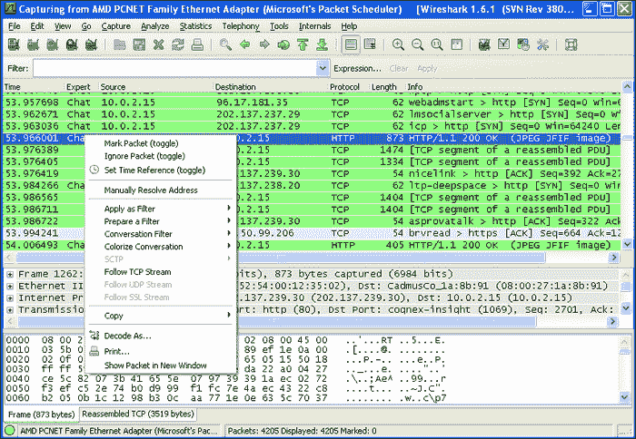
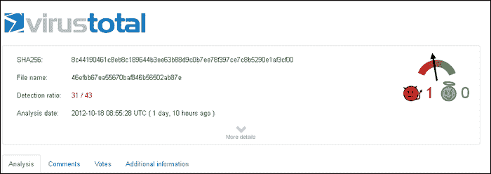

# 一、Wireshark 即时入门

欢迎使用*即时 Wireshark 启动器*。本书专门为您提供设置 Wireshark 和网络分析所需的所有信息。您将学习 Wireshark 的基础知识，开始构建您的第一个课程，并发现一些使用 Wireshark 的提示和技巧。

本书包含以下部分:

*那么，Wireshark 是什么？*告诉您 Wireshark 实际上是什么，您可以用它做什么，以及它为什么如此出色。

*安装*教你如何轻松下载并安装 Wireshark，然后进行设置，这样你就可以在自己喜欢的操作系统上尽快使用它。

*快速入门–您的第一个数据包捕获*向您展示如何执行 Wireshark 的核心任务之一；网络数据包分析。在本节中，我们将介绍 Wireshark 的图形界面和命令行界面。

*您需要了解的 5 大功能*解释了如何使用 Wireshark 最重要的功能执行不同的任务。学完本节后，您将能够:

*   开始处理数据包流
*   了解名称解析和数据包重组
*   分析捕获数据包的统计数据
*   解码捕获的数据
*   导出捕获的数据
*   使用 Wireshark 命令行工具

*Wireshark 活动*展示了 Wireshark 的实时实施，并实施了前面提到的主题。

*您应该认识的人和地方*为您提供了许多有用的项目页面和论坛链接，以及大量有用的文章、教程、博客和 Wireshark 超级贡献者的 Twitter feeds。

# 那么，Wireshark 是什么？

Wireshark 是一款开源的网络数据包分析工具，它可以捕获通过网络传输的数据包，并以可理解的形式呈现出来。Wireshark 可以被视为瑞士军刀，因为它可以在不同的环境下使用，例如网络故障排除、安全操作和学习协议内部机制。这个工具可以轻松完成所有工作。

使用 Wireshark 的一些重要好处是:

*   **多协议支持** : Wireshark 支持多种协议，从 TCP、UDP 和 HTTP 到 AppleTalk 等高级协议。
*   **用户友好界面** : Wireshark 有一个交互式图形界面，有助于分析数据包捕获。它还有几个高级选项，如过滤数据包、导出数据包和名称解析。
*   **实时流量分析** : Wireshark 可以捕获网络上流动的实时数据，并快速生成有关其协议、流媒体、通信通道等信息。
*   **开源项目** : Wireshark 是一个开源项目，它的大部分开发工作都是由全球 500 多名开发人员共同完成的。我们可以编写自己的代码并添加到项目中，以满足我们的特定需求。

Wireshark 的这些多种功能使其成为最受欢迎的开源网络分析器工具之一。在后面的章节中，我们将详细讨论 Wireshark 的这些操作。

## Wireshark 是如何工作的？

下面我们简单介绍一下 Wireshark 的工作流程。

如果接口(网络设备)转换到混杂模式，网络流量嗅探是可能的。这种模式使接口将其接收的所有流量传输到中央处理器，而不是只传递控制器打算接收的帧。混杂模式最初是为虚拟化中的桥接网络开发的。

Wireshark 也以同样的方式工作。通过 Wireshark 进行网络嗅探的整个过程可以分为三个步骤:

1.  **收集** : Wireshark 将网络接口转换到混杂模式，在这种模式下，它可以捕获网络上流动的原始二进制数据。
2.  **转换**:收集的二进制数据块然后被转换成可读的形式。数据包也根据其顺序进行重组。
3.  **分析**:最后一步是对采集和重组的数据进行分析。最初的分析包括识别协议类型、通信信道、端口号等等。在高级层次上，还可以分析不同的协议报头，以便更深入地理解。

这是对 Wireshark 及其工作方法的简要介绍。在下一节中，我们将详细介绍它的安装过程。

# 安装

让我们开始使用 Wireshark 进行网络分析的旅程。首先也是最重要的是在我们的系统上设置 Wireshark 环境。我们将介绍基于 Windows 和基于 Linux 的安装方法，稍后将讨论如何设置 subversion 环境来更新不同的 Wireshark 库和依赖项。因此，让我们从在 Windows 操作系统上设置 Wireshark 开始。

只需三个简单的步骤，您就可以安装 Wireshark 并在您的 Windows 系统上进行设置。

## 第一步——我需要什么？

在安装 Wireshark 之前，您需要检查是否具备所有必需的元素，如下所示:

*   磁盘空间:100 MB 可用空间(分钟)。您将需要更多的可用空间来存储捕获的数据包。
*   内存:256 MB(最小)，1 GB(推荐)。
*   Wireshark 需要一个支持混杂模式的**网络接口卡** ( **网卡**)。
*   帮助数据包捕获和嗅探的 WinPcap 驱动程序。

## 步骤 2–下载 Wireshark

下载 Wireshark for Windows 最简单的方法是从[http://www.wireshark.org/](http://www.wireshark.org/)获得一个压缩包。

我们建议您根据您的 Windows 版本和体系结构(x86 或 x64)下载最新的稳定版本。Windows 用户可以通过右键单击`My Computer`来识别他们的操作系统架构。Linux 用户可以执行`uname –i`命令。

以下屏幕截图显示了 Wireshark 主页:


## 步骤 3 -安装 Wireshark

选择安装程序后，您可以按照屏幕上的说明在您的系统上设置 Wireshark。这是一个标准的安装程序，它会要求您定位安装目录、WinPcap 安装、附加工具等等。


### 注意

Wireshark 与 WinPcap 的最新版本捆绑在一起，因此您不需要手动设置 WinPcap。然而，作为参考，WinPcap 可以从[http://winpcap.org](http://winpcap.org)下载。

## 就这样！

至此，您应该已经安装了 Wireshark，并且可以自由地体验和探索它。

现在让我们继续讨论在 Linux 环境下设置 Wireshark。我们单独讨论在 Linux 上安装 Wireshark 的原因是，Wireshark 项目并不支持所有类型的 Linux。你可以在 Wireshark 位于 http://www.wireshark.org/download.html 的下载页面上找到一份完整的受支持的 Linux 版本列表。

## 从源代码构建 Wireshark

要在 Unix 下从其源文件构建 Wireshark，您可以遵循以下四个步骤:

### 步骤 1–获取源文件

从 Wireshark 下载页面([http://www.wireshark.org/download.html](http://www.wireshark.org/download.html))下载源代码包。

### 第 2 步——拆包

使用以下命令将源代码从其 gzip 压缩的 tar 文件中解包:

```
gzip -dc wireshark-1.9-tar.gz | tar xvf

```

### 第三步——建造

将当前工作目录更改为`wireshark`。

### 步骤 4–安装

现在我们必须使用`make`命令将源文件编译成二进制文件。然后使用`install`命令将二进制文件安装到系统上。

```
root:~/wireshark-1#make
root:~/wireshark-1#make install

```

### 就这样！

您的 Wireshark 现在可以在您的 Linux 环境中运行了。

## 通过二进制文件在 Unix 上安装 Wireshark

通过二进制文件安装 Wireshark 是一个简单的过程。您必须弄清楚您的 Unix 类型才能获得正确的二进制文件。

## 从 RPM 安装

我们可以使用以下命令安装从其网站下载的 Wireshark RPM 二进制文件:

```
rpm -ivh wireshark-1.9.i386.rpm

```

### 从 DEB 安装

要从 DEB 二进制文件安装 Wireshark，请将以下命令传递到终端窗口:

```
apt-get install wireshark

```


### 注意

许多 Linux 版本都附带了 Wireshark 的安装副本。您可以使用`apt-get update`寻找新版本来寻找包更新。

## 设置 subversion 客户端

对于那些想要设置 Wireshark 源环境的人来说，设置 subversion 客户端是一个可选主题。Subversion 可以帮助快速更新代码文件和库。你可以安装任何你选择的 subversion 软件。这里我们以乌龟 SVN 为例，它是一个流行的开源 subversion 客户端。你可以从[http://tortoisesvn.tigris.org/](http://tortoisesvn.tigris.org/)下载设置。一旦你完成了设置，右击任何文件夹将显示 SVN 选项。

要为 Wireshark 设置 subversion，请遵循以下简单步骤:

### 步骤 1–创建目录

创建一个名为 **wireshark** 的新目录/文件夹。右键点击文件夹，移动到 **svn checkout** 。

### 步骤 2–设置 subversion 路径

在资源库的 **Url 下输入 http://anonsvn.wireshark.org/wireshark/trunk/**的**。**

在**检出目录**下，确保它反映了您创建 Wireshark 目录的相同路径。点击**确定**开始更新过程。


### 第三步——结账

一旦 subversion 开始填充您的`wireshark`文件夹，您将看到不同的源目录被创建。


现在你的乌龟客户端已经设置好了，你可以右击`wireshark`文件夹并选择 **SVN 更新**来随时获得源代码的更新副本。这减少了手动下载新更新的开销。

这是在不同环境下设置 Wireshark 的快速指南。在下一节中，我们将了解如何开始使用 Wireshark，并详细分析我们的第一个数据包捕获。

# 快速入门–您的第一个数据包捕获

现在我们已经在我们的系统上设置了 Wireshark，我们可以继续前进，开始试验它的特性。在本节中，我们将介绍一些基本功能和快速提示，它们对于开始使用 Wireshark 捕获数据包至关重要。我们将从 Wireshark 的基础知识开始，简要了解一下它的 GUI，然后我们将进行数据包捕获和捕获数据分析的实验。同时，我们将使用一些常见的网络协议和术语，如 HTTP、TCP 和数据包。熟悉这些术语有助于更好地理解数据包捕获。因此，让我们继续前进，开始我们的 Wireshark 之旅。

## 网络接口选择入门

首先要做的是选择一个您想要捕获数据的网络接口。在我们的系统上设置好 Wireshark 后，我们可以根据您的操作系统从桌面或“开始”菜单或通过命令行启动它。Wireshark 首先会提示选择网络接口。典型的 Wireshark 启动面板将类似于下面的屏幕截图:


如您所见，主窗口的左上方一栏在标题**接口列表**下显示了不同的捕获接口。我们可以选择任何界面开始工作。例如，要捕获流经系统的 LAN 流量，您可以选择系统上安装的默认 LAN 网卡。同样，您可以选择 802.11 以太网适配器，通过局域网等进行无线数据采集。

完成网络接口选择后，我们可以继续进行数据包捕获，但在开始之前，让我们快速浏览一下 Wireshark GUI，了解一些有用菜单项的功能。

## 快速浏览 Wireshark GUI

看前面的截图，可以看到 Wireshark 的主菜单栏包含了一些常见的菜单项，如**文件**、**视图**、**编辑**、**帮助**。其他菜单项如**分析**和**捕获**将在本书的其他章节中讨论。在主菜单栏下面，我们有特定的菜单图标，用于快速启动在数据包捕获和分析期间执行的常见操作。让我们简单看一下其中的一些。


*   **列出可用的捕获接口(1)** :使用数据包捕获时，此菜单图标用于更改或选择新的接口介质。
*   **显示捕获选项(2)** :此图标启动一个迷你面板，以自定义数据捕获设置。可以进行的一些主要定制包括:

    *   更改捕获类型
    *   设置捕获的缓冲区大小
    *   限制捕获数据的大小
    *   管理显示选项和名称解析

*   **开始新的实时捕获(3)** :该图标用于从所选界面启动新的捕获。
*   **停止运行实时采集(4)** :该图标用于停止当前的实时采集，同时将采集的数据保存在缓冲区中，以备进一步处理。
*   **查找数据包(5)** :该图标用于在捕获的数据包中查找特定的文本/字符串/参数。
*   **编辑捕获过滤器(6)** :该图标用于修改应用于数据包的捕获过滤器。我们将在下一节详细介绍这一点。

### 注意

你还会注意到菜单图标下的**过滤器**框。此框用于对捕获的数据包快速应用特定的过滤器。例如，我们可以通过在**过滤器**框中键入`dns`来仅查看 DNS 请求/响应。它还反映了应用于捕获流量的当前显示过滤器。

## Wireshark GUI 面板

现在让我们快速看一下 Wireshark GUI 中的不同面板。通常，我们可以将 GUI 面板分为四个部分:捕获面板、数据包详细信息面板、数据包字节面板，最后是状态面板。我们将逐一讨论这些问题。

## 捕获面板

捕获面板按顺序显示网络数据包的实时捕获。列表中的每一行都反映了一个捕获的数据包。这个智能显示面板将信息分成行和列。每行代表单个数据分组，而每列代表关于该分组的附加信息。


这些列如下所示:

*   **号**:表示唯一标识数据包的数据包序列号
*   **时间**:表示数据包被捕获时的时间戳
*   **源**:表示数据包来自的 IP 地址/设备
*   **目的地**:表示数据包要去的 IP 地址/设备
*   **协议:**表示捕获数据包的协议类型
*   **长度**:表示数据包的大小
*   **Info** :表示关于数据包的快速附加信息

### 注意

在 Wireshark 中，每个协议都使用独特的颜色方案来表示。这使得用户能够容易地区分不同的协议类型。

## 数据包详细信息面板

每当从 capture 面板中选择一个数据包时，其详细信息就会显示在 packet details 面板中。


它在一个可以展开和折叠的树形结构中包含了协议及其不同参数的详细信息。这些信息有助于网络取证。

## 数据包字节面板

数据包字节面板以转储或实际格式显示数据包详细信息面板的信息。它显示了流的字节序列。


这里，信息也分为三列，第一列表示数据偏移，下一列表示十六进制值的数据，最后一列表示信息的 ASCII 表示。

状态面板显示我们操作的当前状态。它反映了诸如捕获状态、数据包计数(捕获、显示和/或标记)以及存储捕获数据包的文件位置等信息。


我们快速浏览了 Wireshark GUI 中的一些重要特性。我们现在将继续我们的数据包捕获工具的一些技术方面。

## 设置过滤器

在这里，我们将涵盖一个最技术性和最有用的数据包捕获的讨论。过滤器在数据包捕获中起着非常重要的作用。在 LAN 上工作或在托管许多服务的服务器上捕获数据包时，我们可能会遇到监控特定协议或服务的问题。为了消除这种开销，我们使用过滤器。可以在两端应用过滤器，即捕获过滤器和显示过滤器。让我们从捕获过滤器开始。

捕获过滤器用于选择性地监控数据包。它将只过滤或捕获由我们分配的流量。为了进行这种选择性捕获，我们必须将`winpcap`命令指令传递给 Wireshark。

点击编辑捕获过滤器菜单图标，可启动**捕获**过滤器选项。或者，也可以通过点击**捕获|选项**来启动。您将看到一个类似于以下屏幕截图的选项窗口:


我们可以通过填写**捕获过滤器**字段来输入过滤器选项。或者，我们也可以点击**捕获过滤器**，并存储我们的捕获过滤器规则以备将来使用。

现在出现的问题是如何编写过滤规则。WinPcap 数据包捕获规则遵循一个明确的模式。编写规则的典型结构如下:

*<协议名称> <方向> <主机> <值> <逻辑运算> <表达式>*

例如，为了在源端口为 443 时捕获 TCP 数据包，我们将编写以下规则:

```
tcp src port 443

```

类似地，要丢弃 ARP 数据包，我们可以使用`not arp.`

为了捕获端口 80 (http)上的入站和出站流量，我们可以使用`port 80`。

要捕获源 IP 为 192.168.56.101 且端口号为 232 的数据包，我们可以使用`src 192.168.56.101`和端口`232`。

通过这种方式，我们可以组合不同的条件来创建我们自己的捕获过滤器，并减少开销。如果没有应用捕获过滤器，则所有流经选定接口的网络数据包都会被 Wireshark 捕获。

下一个过滤器选项是显示过滤器。它用于从捕获的文件中选择特定的数据包。与捕获过滤器不同，显示过滤器甚至可以在数据包被捕获后应用。点击编辑/应用显示过滤器菜单图标，可启动显示过滤器菜单。或者，也可以使用主 GUI 窗口上的过滤栏来应用显示过滤规则。

显示过滤器规则也遵循固定的结构:

*<协议>。<弦 1 >。<第二串>。<比较运算符> <值> <逻辑运算符> <表达式>*

让我们挑选一些实例来实际实现这个规则结构。

要查看在端口 80 上捕获的 TCP 数据包，我们可以使用以下显示过滤器:

```
tcp.port==80

```

在**过滤**栏中输入`!arp`并按下*回车*将会丢弃所有的 ARP 数据包。


过滤器`ip.addr==192.168.56.101`将只显示来自特定 IP 的数据包。

既然我们已经讨论了关于包过滤的困难部分，我们将讨论一种快速简单的方法来执行这两种类型的过滤选项。

## 使用过滤表达式对话框

**过滤器表达式**对话框是一个使 Wireshark 新手用户能够轻松创建、捕获和显示过滤器的功能。点击**表情即可启动...**滤镜**表情栏上的**按钮(参考前面的截图)。


使用它，我们可以轻松地创建显示/捕获过滤器，因为它为我们提供了多个选项以及一些预加载的表达式。要创建表达式，您可以遵循以下简单步骤:

1.  要查看与协议相关的特定标准字段，请单击协议旁边的加号[  ]图标展开该协议。
2.  找到所需的标准后，可以选择关系，如等于(==)或大于(>)。
3.  接下来，您可以提供要比较的值(例如，[google.com](http://google.com)或一个数字)。

如果你注意到前面的截图，选择字段名 **http.request.uri** 来检查它是否等于(Relation)**google.com**(Value)。因此，完整的过滤器表达式变成了`http.request.uri==google.com`。

这是一个使用**过滤器表达式**框的快速演示。在下一节中，我们将开始处理我们的第一个数据包捕获。

## 捕获实时数据

既然我们已经对 Wireshark 有了足够的了解，我们可以从数据包捕获的“Hello World”开始。在本节中，我们将快速了解如何使用 Wireshark 捕获数据包。

要在 Windows 环境中开始捕获数据包，请遵循以下简单步骤:

1.  从开始菜单启动 Wireshark。
2.  应用所需的捕获过滤器。
3.  选择一个网络接口开始捕获流量。

在基于 Linux 的操作系统中启动 Wireshark 也可以重复这些步骤。唯一的区别在于选择网络接口，因为 Linux 显示网络设备而不是网络描述。

选择接口后，您会注意到捕获面板开始填充捕获的数据包。


您可以通过点击**停止**菜单图标随时停止实时拍摄。点击**重启实时捕获**选项，可以开始新的实时捕获。请注意，如果我们选择重新启动选项，当前捕获的数据将被擦除。

您会注意到 Wireshark 使用不同的颜色方案来标记不同的协议。让我们继续向前，快速看一下这个着色方案以及它是如何实现的。

## 了解 Wireshark 着色方案

您可能已经注意到 Wireshark 用来区分不同协议的丰富多彩的方案。事实上，着色方案用于网络中可能出现的坏分组、校验和错误以及其他常见分组错误的情况。

要仔细查看着色方案，点击**编辑着色规则...**来自菜单图标。这将启动一个反映默认颜色方案的菜单框。


您会注意到用于表示协议、错误、失败等的不同默认颜色模式。通过点击**编辑**按钮，也可以将默认方案更改为用户特定方案。


这将为您提供更改不同颜色方案的灵活性，例如背景色、前景色、代表协议的名称和字符串模式。

## 处理捕获的数据包

数据包捕获的主要目的是分析网络活动。使用 Wireshark 可以非常有效地分析捕获的数据包。让我们从之前的讨论继续，我们在讨论中学习了如何执行实时捕获。让我们点击 **Stop live capture** 菜单图标，开始对捕获的数据包进行实验。

## 搜索数据包

通过导航到**编辑** | **查找数据包**或按下 *Ctrl* + *F* 键，可以进行特定信息的搜索。这将启动一个带有三个不同搜索选项的搜索框，即**显示过滤器**、**十六进制值**和**字符串**。


**Display filter** 选项允许我们输入一个基于表达式的过滤器，只查找满足该表达式的数据包。

**十六进制值**搜索选项用于查找特定的十六进制序列。

**字符串**搜索选项允许我们查找特定的字符串。搜索特定字符串激活另一个支持搜索选项，该选项列在表中的**搜索下。要从捕获的数据包列表中搜索特定的字符串，我们可以选择**数据包列表**选项。为了寻找数据包报头信息中可能存在的特定字符串类型，我们可以使用**数据包字节**选项。最后，为了在数据包包含的数据中搜索一个字符串，我们可以使用**数据包细节**选项。**

## 标记数据包

标记重要的数据包有助于快速检索所需的信息。这有助于跟踪大量捕获数据中的重要数据包。要标记任何数据包，右击并选择**标记数据包(切换)**。标记包的背景颜色变为纯黑色，便于视觉识别。


## 保存捕获的数据

要保存捕获的文件，请转到**文件** | **另存为**。在这里，我们可以选择保存所有捕获的数据包，或者在应用一些显示过滤器后，有选择地只保存显示的数据包。Wireshark 支持各种数据包捕获文件格式，如`.pcap`、`.cap`和`.pcapng`。

## 导出并合并数据包

Wireshark 还允许将捕获的数据包导出为不同的格式，如`.txt`、`.csv`和`.xml`。当数据将用于其他操作时，此功能很有用。可以通过**文件** | **导出** | **文件**导出数据包。

Wireshark 还提供了将不同的捕获文件合并成一个文件的功能。要合并捕获文件，请按照下列步骤操作:

1.  打开一个您想要合并的采集文件。
2.  选择**文件** | **合并**，弹出**合并捕获文件**对话框。
3.  选择要合并到已打开文件中的新文件，然后选择用于合并文件的方法。您可以将选定的文件添加到当前打开的文件前面，添加它，或者根据时间戳按时间顺序合并文件。

## 打印数据包

Wireshark 允许将捕获的数据包打印为纯文本、post 脚本或输出文件，具体取决于您的选择。它还允许您为选择性打印提供特定范围的数据包编号。导航到**文件** | **打印**将启动打印框。

这是一个使用捕获的数据包来提高生产率的简短演示。在下一节中，我们将重点介绍 Wireshark 的其他一些鲜为人知的功能，这些功能在数据包取证和网络渗透测试中非常重要。

### Tip

双击任何数据包都会打开一个单独的弹出窗口，显示有关它的信息。

## 输入/输出图形窗口

Wireshark 还提供了一个很酷的功能，可以快速生成我们捕获的数据包的图形概览。这有助于监控网络中的数据流量。图形分析也有助于分析大量数据。要生成捕获文件的图形视图，请转到**统计数据** | **IO 图形**。


使用此图表可以执行不同的操作。

### 图表

我们可以启用五种不同的比较图，并为它们提供不同的颜色方案，以便于查看。

### 过滤器

我们还可以从分析中过滤出数据包，以构建特定的图表。点击**过滤器**将打开与我们之前在*设置过滤器*部分看到的相同的菜单框。

### 风格

样式为我们提供了从我们可以构建的不同图形选项中进行选择的灵活性(线条/脉冲/条纹/点)。

### 图形坐标

图形坐标，即 **X 轴**和 **Y 轴**也可以相应修改。

**X 轴**

*   **滴答间隔**:X 方向的间隔持续(10/1)分钟或(10/1/0.1/0.01/0.001)秒
*   **每节拍像素**:每节拍间隔使用 10/5/2/1 像素
*   **以一天中的时间**查看:提供以一天中的时间而不是从开始拍摄起的秒或分钟来查看 X 方向标签的选项

**Y 轴**

*   **单位**:Y 方向的单位(包/节拍、字节/节拍、比特/节拍、高级)
*   **刻度**:Y 单位的刻度(对数、自动、10、20、50、100 等)

### 注意

您可以单击任何图形区域/间隔来查看在该时间段内流动的数据包流。

## 复制和保存

**复制**选项可用于直接从图表中复制数据包的值，并将其粘贴到 CSV 文件中。典型的 CSV 文件将类似于如下所示:


**保存**选项使我们能够以多种图像格式保存图表，如 JPG、PNG 和 BMP。

## 文件输入/输出

我们已经在*处理捕获的数据包*部分看到了对数据包的几种操作。在这里，我们将介绍各种文件格式和不同的导入/导出技术，这有助于我们详细了解 Wireshark。因此，让我们从打开捕获的数据包的基本讨论开始。

### 打开捕获的数据包

要打开捕获的数据包，移动到**文件** | **打开**。这将启动文件选择面板，从中我们可以选择我们想要打开的文件。


通过这种方式，我们可以打开捕获的数据包并对其执行各种操作，到目前为止我们已经讨论过了。我们已经在前面的章节中讨论了保存和合并不同的捕获文件。这里要讨论的一件重要事情是 Wireshark 支持的不同文件格式。让我们快速浏览一下。

### Wireshark 文件格式

Wireshark 支持多种文件格式来打开或保存数据包。这是 Wireshark 成为最流行的数据包捕获工具的主要原因之一。从其他工具保存的数据包也可以在 Wireshark 中打开，它可以以几种格式保存捕获的数据包，以便其他工具也可以理解和分析它们。在本节中，我们将了解 Wireshark 支持的不同输入和输出格式。

#### 输入文件格式

Wireshark 支持 30 多种不同的工具来无缝打开捕获的文件。其中一些是:

*   Libpcap:这是网络捕获最广泛使用的文件格式。将捕获的网络数据包保存为 libpcap 的产品有 Wireshark、tcpdump、psniff 等
*   微软网络监视器(Netmon):这是微软的一个网络捕获工具
*   Network Associates 基于 Windows 的嗅探器:使用微软嗅探器生成的文件
*   Symbian OS btsnoop 捕获:这些是基于 Symbian 的嗅探工具
*   IBM Series (OS/400) Comm traces:这些是设计用于 IBM 设备的嗅探工具
*   Pcap-ng:这是 libpcap 的后续版本，做了一些修改并增加了一些特性

Wireshark 支持的其他一些供应商包括 Juniper、HP、Toshiba 和 RADCOM。

现在让我们来看看 Wireshark 保存数据包的一些重要文件格式。

*   libpcap、tcpdump 和其他各种使用 tcpdump 捕获格式的工具
*   Microsoft 网络监视器- NetMon (*。cap)
*   网络协会嗅探器(*。cap)
*   Pcap-ng

这是 Wireshark 支持的一些重要文件格式的快速参考。此信息在文件导入和导出过程中可能会有所帮助。让我们继续另一个关于文件输入/输出的重要讨论。

## 专家信息

专家信息是 Wireshark 的另一个强大功能，有助于跟踪数据包捕获中可能出现的任何异常。它保存所有数据包的日志，并提供近似的智能分析。这些信息包括报告、错误、失败、协议和严重性。让我们仔细看看如何利用专家信息的力量。

要启动专家信息对话框，进入**分析** | **专家信息合成**。


您会注意到顶部有五个不同的选项卡。让我们逐一定义它们的用途:

*   **错误**:该选项卡报告数据包捕获过程中可能出现的任何错误
*   **警告**:该专家信息给出诸如分段错误和无序数据包等警告信息
*   **注意事项**:该标签给出了重复数据包、协议问题等情况下的大概信息
*   **chats** : this tab gives us information about communication calls such as TCP get request and application calls

    ### Tip

    We can view the packet at any time by expanding the message and clicking the packet number. The capture window will automatically point to the packet.

前面讨论的每个选项卡都包含一个单独的信息表，显示选项卡中包含的信息。该信息表包含四列，即组、协议、摘要和计数。一些旧版本的 Wireshark 还可能包含名为 Severity 的第五行。让我们简单地给它们下定义。

*   **Group** :这个专家信息告诉我们信息被归类到哪个类别。不同的类别包括校验和、序列和请求/响应代码。
*   **协议**:表示已经上报专家信息的协议。
*   **摘要**:这给出了关于专家信息的简短附加信息。
*   **Count** :表示包在整个文件中的位置。

这是使用专家信息进行更好的网络分析的快速演示。但这并不是 Wireshark 提供专家分析的唯一方式。我们也可以直接在主捕获面板上查看这些信息。要添加到该列，我们必须使用**首选项**选项。让我们在下一节详细讨论这个问题。

## 使用偏好设置

首选项可用于设置我们自己的显示器和监视器选项。这增强了 Wireshark 在默认设置之外的功能，用户可以直接查看那些对他/她的分析很重要的内容。要调出**首选项**框，导航至**编辑** | **首选项…** 。


您可以在此窗口中修改和添加几个不同的视图选项。让我们继续将专家列添加到我们的捕获面板中。

1.  从左侧面板中选择**列**选项。
2.  在**属性**栏(底部中间)点击**添加**按钮。这将创建一个新的列条目。从**字段类型**下拉菜单中，选择**专家信息严重性**。
3.  点击**添加**按钮启用该列视图。您可以通过单击该列并输入您选择的名称来重命名它。

一旦你完成了这三个步骤，你会注意到在你的捕获面板中增加了一个额外的专家信息栏。


这是使用首选项选项根据您的选择更改默认视图的简短描述。您可以通过更改颜色、字体、显示协议等偏好来探索其他可能性。

这些是让您开始使用 Wireshark 和数据包捕获的入门部分。到目前为止，我们已经介绍了大部分基础和一些高级主题，这些主题对于理解 Wireshark 的工作方式至关重要。在本入门指南的下一部分，我们将介绍一些顶级功能，如果您想更深入地了解该工具，这些功能对您的数据包分析非常有帮助。

# 你需要了解的五大特性

当您开始使用 Wireshark 时，您会意识到您可以用它做很多事情。本节将向您介绍 Wireshark 中最常执行的任务和最常用的功能。

## 处理数据包流

在处理网络捕获时，可能会有多个网络活动实例正在进行。考虑一个小例子，您通过浏览器同时浏览多个网站。对于所有这些多个网站，几个 TCP 数据包将流经您的网络。因此跟踪属于特定流或会话的数据包变得有点乏味。这就是**跟随 TCP 流**发挥作用的地方。

现在，当你访问多个网站时，每个网站都有自己的数据包流。通过使用 **Follow TCP stream** 选项，我们可以应用一个过滤器来定位特定于特定流的数据包。

要查看完整的流，请选择您的首选 TCP 数据包(例如，GET 或 POST 请求)。右键单击它将弹出选项**跟随 TCP 流**。



一旦你点击**跟随 TCP 流**，你会注意到一个新的过滤规则被应用到 Wireshark，主捕获窗口反映了所有属于该流的数据包。这有助于弄清楚在特定的网络交互会话中生成了哪些不同的请求/响应。如果您更仔细地观察在您跟随一个流时应用的过滤规则，您将看到一个类似于`tcp.stream eq <Number>`的规则。这里的`Number`反映了获得各种数据包必须遵循的流编号。

这里可以执行的附加操作是保存属于特定流的数据分组。一旦你跟踪了一个特定的流，进入**文件** | **另存为**。然后选择显示的**按钮**，仅保存属于已查看流的数据包。


类似于跟随 TCP 流，我们也可以选择跟随 UDP 和 SSL 流。这两个选项可以通过选择特定的协议类型(UDP 或 SSL)并右键单击它来实现。根据所选协议，特定的跟随选项将被突出显示。


Wireshark 菜单图标还提供了一些快速导航选项，用于在捕获的数据包中进行迁移。这些图标包括:

*   **返回数据包历史记录(1)** :此选项可追溯到上一次分析/选择的数据包。多次点击它会把你推回到你的选择历史。
*   **在数据包历史中前进(2)** :此选项推动您在一系列数据包分析中前进。
*   **转到编号为(3)** 的数据包:该选项在直接转到特定数据包编号时非常有用。
*   **转到第一个数据包(4)** :此选项会将您带到当前显示的捕获窗口中的第一个数据包。
*   **转到最后一个数据包(5)** :此选项将您的选择跳转到您的捕获窗口中的最后一个数据包。

## 解码数据包并导出对象

Wireshark 提供了一个非常强大的功能，可以将捕获的数据包解码为用户指定的格式。Wireshark 的解码功能暂时转移了特定的协议解析。在数据通过多个端口流动或者它不被认为是标准协议的情况下，这个过程会很有帮助。解码功能可用于轻松地将数据包转换为其原始协议。

### 注意

解码功能是临时操作，除非单独保存解码后的数据包，否则更改将会丢失。

右键单击一个数据包会显示选项 **Decode as…** 。点击它将打开一个包含不同选项卡和相关选项的对话框。


您会注意到顶部有三个不同的选项卡。让我们逐一了解。

*   **解码为链路**:选择该选项卡将显示数据链路层的不同协议。选择这些协议中的任何一个，并选择**解码**单选选项，将指定的数据包转换成用户指定的协议。
*   **解码为网络**:该页签包含 TCP、UDP 等不同的网络层协议。它在 IPv4 到 IPv6 的转换中非常有用。
*   **解码为传输**:该选项卡反映了数据包可以解码的不同传输层协议。

您还会注意到**显示当前**按钮，它显示不同的用户指定解码。


点击**清除**将删除用户应用的所有数据包解码。点击**应用**按钮，应用当前解码选项，并保持对话框打开，以便进一步操作。

继续本节的另一个重要讨论，Wireshark 还提供了导出作为数据包流捕获的不同对象的功能。例如，下载的闪存将以数据包的形式出现在捕获窗口中，但是可以使用导出功能将其导出为独立的闪存介质。要查看在 HTTP 流量中捕获的不同对象，请转到**文件** | **导出** | **对象** | **HTTP** 。这将打开作为 HTTP 流量一部分传输的捕获对象列表。


选择任何对象类型并点击**另存为**会将数据包捕获转换为该对象类型。例如，选择图像/JPEG 文件类型并保存它将在我们的本地磁盘上创建一个新的图像文件。这是在数据包捕获期间检索不同文件类型的一种非常有效和快速的方法。

现在让我们继续看 Wireshark 的下一个重要特性，它将有助于快速分析数据捕获。

## 统计捕获的数据包

在本节中，我们将详细了解如何为捕获的数据包生成统计信息，以便对我们的网络活动有一个总体了解。在上一节中，我们已经介绍了 I/O 图。在这里，我们将揭示生成网络捕获的快速统计数据的一些更重要的方面。

Wireshark 的 **Statistics** 菜单选项提供了一些非常酷的统计功能，可用于生成网络活动的概览。在这里，我们将涵盖五个重要的工具，即总结、协议层次、对话、端点和流图。让我们逐一讨论它们。

### 总结

摘要通过反映接口、捕获持续时间以及捕获的数据包数量和大小等关键点，返回有关整个捕获过程的快速报告。它概括地提供了所有的信息。在网络取证过程中，当需要快速了解网络活动时，总结非常有用。


### 协议层级

协议层次结构以节点形式反映了网络分析过程中看到的不同协议的统计信息。它根据协议层排列协议，并以百分比形式表示它们在捕获文件中的存在。


### 对话

Conversation 是另一个非常有趣的数据包统计分析，它显示了不同 IP 之间的通信信息。它还显示了通过 IP 传输的不同协议的会话统计数据。当必须在主机和服务器之间执行端到端分析时，这是最好的统计分析。


### 终点

端点统计类似于会话，因为它反映了进出 IP 地址的流量统计。

### 流程图

流图是基于时间线的通信统计的表示。它们代表基于时间间隔进行的不同对话。点击**流程图**会弹出一个对话框，要求在生成图表前提供一些初始信息。


我们可以指定信息，例如选择数据包、流类型以及图形反映信息的模式。这种统计分析有助于了解网络活动的时间表。它还有助于了解一段时间内的流量负载。

这是使用 Wireshark 提供的不同统计选项的基本演示，以便更好地理解我们的网络捕获。在下一节中，我们将介绍 Wireshark 重组和名称解析技术中涉及的一些技术问题。

## 名称解析和数据包重组

在本节中，我们将了解 Wireshark 的一些更重要的功能，这些功能使我们的网络分析过程更加简单，信息量也更大。我们将从名称解析开始。

### 名称解析

名称解析是将一个识别地址转换成另一个以便更好理解的过程。例如，如果一台计算机的物理地址为 00:16:CD:6C:8B:24，DNS 和 ARP 协议允许我们将可读名称视为 MYPC-01。这种关联使得记住网络上的不同设备变得容易。Wireshark 提供了几种名称解析工具，可以将物理地址转换成相应的可读设备名称。让我们快速看一下 Wireshark 中的一些解析工具。

#### MAC 名称解析

MAC 名称解析使用 ARP/RARP 协议将物理地址(MAC)转换为相应的逻辑地址(IP)。

#### 网络名称解析

网络名称解析进一步将逻辑地址(IP)转换为相应的 DNS 名称，以便更好地理解。例如，173.194.72.101 变成了[google.com](http://google.com)。

#### 传输名称解析

这种名称解析技术根据端口号识别服务。例如，端口 80 托管 http 服务。

要在 Wireshark 中启用名称解析，请选择**捕获** | **捕获选项**。这将启动捕获选项对话框，我们在前面也看到过。该对话框的右下方显示了不同类别的**名称解析**复选框。


您可以根据需要选择不同的复选框。或者，您也可以通过选择**编辑** | **首选项** | **名称解析**来启动**名称解析**对话框。


与前一个相比，这提供了更高级的选项。在这里，我们还可以向 Wireshark 提供一个 GeoIP 数据库，通过帮助 Wireshark 根据其 GeoIP 识别数据包区域，进一步提高 Wireshark 的解析能力。

Wireshark 的这一功能不仅使网络分析变得更加容易，而且增强了 Wireshark 识别不同协议和服务的能力。但是名字解析也有一些缺点需要在这里提一下。

*   在实时采集过程中或打开保存的采集文件时，名称解析可能会失败
*   名称解析会在数据包文件中添加额外的空格字节，从而影响统计图表
*   名称解析增加了数据包处理的额外开销

现在让我们进入本节的下一个重要讨论。

### 数据包重组

数据包重组是通过将大块数据拆分成较小的数据包，然后再将它们组合成完整数据来传输大块数据的过程。为了有效地再现捕获的数据，Wireshark 还实施了自己的数据包重组技术。

Wireshark 收集分段数据的不同数据包块，然后通过数据包字节面板重新组合，以反映完整的文件。


例如，一个 HTTP GET 请求(HTML 页面)可以被分成更小的数据包。传输完成后，Wireshark 重组不同的数据包，并创建一个重组的 HTML 页面。数据包详细信息面板添加了关于不同数据包编号的额外信息(**重组的 TCP 数据段**),这些数据包被重组以形成完整的数据集。


完整的重组数据反映在数据包字节面板的**未压缩实体主体**选项卡下，其十六进制转储反映在**重组 TCP** 选项卡下。

### Tip

Wireshark 中默认启用重组。

这是关于 Wireshark 如何管理大量数据包以及如何有效识别不同协议、服务和设备的简短讨论。在下一节也是最后一节，我们将介绍如何从命令行使用 Wireshark。

## Wireshark 命令行工具

现在，我们已经介绍了 Wireshark 的几乎所有基本实现，我们可以通过介绍 Wireshark 命令行工具来结束本节，这些工具与 GUI 工具一样强大。让我们来分析一下 Windows 命令行中的一些命令。类似的命令也可以在 Linux 终端上使用。

### t shark–终端 Wireshark

Tshark 是从命令行启动 Wireshark 中大多数操作的命令。从 Windows 机器上的命令行开始，找到 Wireshark 安装目录，默认目录是`Program Files\wireshark`。

传递`tshark` help 命令将显示一个巨大的参数列表，我们可以和`tshark`一起传递。让我们执行这个命令并读取它的输出。

```
C:\Program Files\Wireshark>tshark -h
TShark 1.6.1 (SVN Rev 38096 from /trunk-1.6)
Dump and analyze network traffic.
See http://www.wireshark.org for more information.

Copyright 1998-2011 Gerald Combs <gerald@wireshark.org> and contributors.
This is free software; see the source for copying conditions. There is NO
warranty; not even for MERCHANTABILITY or FITNESS FOR A PARTICULAR PURPOSE.

Usage: tshark [options] ...

```

大多数参数细节都是不言自明的，您可以很容易地理解它们的用法。让我们使用`tshark`列出可供我们使用的不同接口。

```
C:\Program Files\Wireshark>tshark -D
1\. \Device\NPF_{730CDBFB-F346-4654-8196-5C20B7A69E12} (AMD PCNET Family Ethernet
 Adapter (Microsoft's Packet Scheduler) )
2\. \Device\NPF_{DD763ED6-6670-4281-8551-A3C651241F95} (AMD PCNET Family Ethernet
 Adapter (Microsoft's Packet Scheduler) )

```

正如您所看到的，已经传递了参数`–D`来列出可用的接口。类似地，我们可以通过使用`–i`参数后跟接口号来开始通过任何接口进行捕获，并且可以使用 `–w`参数将输出存储到一个文件中。我们可以在单个命令下组合不同的参数来执行数据包捕获。让我们以传递给`tshark`的不同参数的查询为例。

```
C:\Program Files\Wireshark>tshark -i 1 -w capture.pcap -p -c 100
Capturing on AMD PCNET Family Ethernet Adapter (Microsoft's Packet Scheduler)
100

C:\Program Files\Wireshark>

```

您可以看到传递给`tshark`命令的不同参数。完整的命令可以用简单的语言解释为:从 1 号接口捕获，用文件名`capture.pcap`保存输出，不捕获是混杂模式(-p)，当包数达到 100 时停止捕获(-c)。

您可以根据需要进一步将其他参数与该命令结合使用。该命令将在当前工作目录下创建一个名为`capture.pcap`的文件，即`/program files/wireshark`。

下一步可以是查看捕获的文件。为此，我们可以使用`–r`参数，后跟输入文件名。

```
C:\Program Files\Wireshark>tshark -r capture.pcap

 0.000000     10.0.2.15 -> 173.194.72.94 TLSv1 91 Application Data
 0.000822  173.194.72.94 -> 10.0.2.15    TCP 60 https > opsmgr [ACK] Seq=1 Ack=
38 Win=65535 Len=0
 0.148540  173.194.72.94 -> 10.0.2.15    TLSv1 91 Application Data
 0.314759     10.0.2.15 -> 173.194.72.94 TCP 54 opsmgr > https [ACK] Seq=38 Ack
=38 Win=62839 Len=0
 0.527277     10.0.2.15 -> 31.13.79.20  TLSv1 606 Application Data
 0.527761   31.13.79.20 -> 10.0.2.15    TCP 60 https > hiq [ACK] Seq=1 Ack=553
Win=65535 Len=0
 1.097436   31.13.79.20 -> 10.0.2.15    TCP 1404 [TCP segment of a reassembled
PDU]
 1.107744   31.13.79.20 -> 10.0.2.15    TLSv1 229 Application Data
 1.107790     10.0.2.15 -> 31.13.79.20  TCP 54 hiq > https [ACK] Seq=553 Ack=15
26 Win=64240 Len=0
 1.127783   31.13.79.20 -> 10.0.2.15    TCP 1404 [TCP segment of a reassembled
PDU]
 1.147908   31.13.79.20 -> 10.0.2.15    TLSv1 1234 Application Data
 1.147942     10.0.2.15 -> 31.13.79.20  TCP 54 hiq > https [ACK] Seq=553 Ack=40
56 Win=64240 Len=0
 1.167471   31.13.79.20 -> 10.0.2.15    TCP 1404 [TCP segment of a reassembled
PDU]

```

您将注意到类似 GUI 的输出，其中反映了诸如捕获时间、源/目的地和协议等信息。这就是我们如何通过命令行利用 Wireshark 的强大功能。让我们研究一些更有趣的命令行工具。

### raw shark–转储和分析流量

Rawshark 用于从捕获的文件中读取数据包流。这个操作类似于**跟随 TCP 流**，我们在*处理包流*一节中提到过。要查看 Rawshark 的可用选项，我们可以使用`rawshark –h`命令。

简单的 Rawshark 命令如下所示:

```
C:\Program Files\Wireshark>rawshark -d proto:http -r capture

```

该命令在指定的文件名中查找 HTTP 协议。

### editcap

`editcap`用于对捕获的文件应用附加操作，如支持数据包、纠错和过滤。使用`editcap –h`命令可以看到它的不同选项。一个简单的`editcap`命令将如下所示:

```
C:\Program Files\Wireshark>editcap -d capture.pcap capture1.pcap 1 100
Add_Selected: 1
Not inclusive ... 1
Add_Selected: 100
Not inclusive ... 100
100 packets seen, 0 packets skipped with duplicate window of 5 packets.

```

该命令会丢弃出现在`capture.pcap`文件中的 1 到 100 个重复数据包，并将剩余的数据包存储在`capture1.pcap`文件下。

### mergecap

`mergecap`用于将两个或多个捕获的文件合并成一个文件。它提供了连接或截断选定捕获文件的选项。连接两个`pcap`文件的简单`mergecap`命令如下:

```
C:\Program Files\Wireshark>mergecap -a -w newcapture.pcap capture.pcap capture1.pcap

```

### text2pcap

`text2pcap`读取 ASCII 十六进制转储文件，并将描述的数据写入一个`libpcap`样式的捕获文件。`text2pcap`可以读取包含多个数据包的十六进制转储，并创建一个包含多个数据包的捕获文件。命令示例如下:

```
C:\Program Files\Wireshark>text2pcap -o h text.txt converted.pcap
Input from: text.txt
Output to: converted.pcap
Wrote packet of 37 bytes at 0
Wrote packet of 37 bytes at 37
Read 2 potential packets, wrote 2 packets

```

这是一些重要的 Wireshark 命令行工具的简单演示。您会注意到类似的特性也出现在 GUI 模式中。

这一节到此结束。在下一节中，我们将执行一次实时捕获，并实施我们在本指南中已经看到的各种数据包分析方法。

# Wireshark 活动

现在，我们已经介绍了 Wireshark 的几乎所有基本功能，在本节中，我们将尝试并实际实现我们在前面章节中学到的技术。本练习将有助于您了解执行网络取证时所遵循的各种流程。我们将举一个例子，一个用户在浏览互联网时访问了一个网站，但几分钟后他注意到他的系统上有一些奇怪的行为。幸运的是，用户捕获了一个`pcap`文件，可以帮助我们分析网络上到底发生了什么。

为了更好地理解，您可以从以下位置下载捕获文件，并继续阅读本节内容:

[https://www . Dropbox . com/s/ykl 6 rhsfstuw 0 FP/wireshark _ starter . pcap](https://www.dropbox.com/s/ykl6rhsfstuw0fp/wireshark_starter.pcap)

在 Wireshark 中打开数据包捕获后，第一步将是查看用户在线时进行的不同 DNS 查询。这将使我们快速查看任何恶意 DNS 请求，这些请求可能是在用户不知情的情况下发出的。如果用户访问的网站中包含某个恶意脚本的隐藏 iframe，就会发生这种情况。

在**过滤器**框中键入`dns`并按下*回车键*将返回通过网络出现的不同 DNS 解析。


你会注意到许多 DNS 域名解析正在进行。要弄清楚这里面有没有可疑的地方，看起来有点困难。接下来，您可以查找在网络活动期间流动的不同 HTTP 流。输入`http`和按*回车*会返回不同的 HTTP 包。您会注意到一些 HTML、JavaScript 和图像流量变得对您可见。仔细看看，您还会发现一些 302 重定向、非 HTTP 流和 Java 归档下载。这可能会引起调查人员的怀疑，即系统可能已经被利用 Java 漏洞感染。为了进一步研究，您可以查看通过机器发出的不同 GET 请求。键入`tcp contains "GET"`将在捕获面板中反映所有的 GET 请求。

您将注意到一个带有不寻常的 URL 模式`?page=<random numbers>`的`GET`请求。

您可以右键单击它并跟随流来查看 GET 请求的原始源代码。


您会注意到页面内容是 gzip 编码的。现在要以纯文本格式查看源代码，您必须将它导出为 HTML 页面，然后查看它的源代码。为此，我们可以去**文件** | **导出** | **对象** | **HTTP** 。

这将打开一个对话框，其中包含数据包流中不同 HTTP 对象的完整列表。


现在你可以选择 HTML 页面并点击**另存为**将其导出到你的磁盘上。然后可以在任何 HTML 编辑器中打开该网页，查看其源代码。仔细查看**导出**对话框，您会注意到应用`/x-msdownload executable file(exe)`也是从 URL 模式`w.php?f=<random>`下载的。这可能是一个危险的可执行文件，可能已经感染了用户的系统。您可以选择对象并将其导出为可执行文件。或者，您可以通过选择**保存所有**来导出所有对象。

回到我们神秘的 HTML 页面，一旦它被导出，你可以通过在任何文本编辑器中打开它来查看它的原始源代码。你会注意到许多随机数字和字母。向下滚动到页面底部会显示一些 JavaScript 混淆，用作那些长的随机文本的解码算法。在谷歌上快速搜索一些 JavaScript 代码，可以发现它们是众所周知的黑洞利用工具包的一部分。


Blackhole 是一个基于 web 的漏洞利用工具包，它通过利用 Java、PDF 和 ActiveX 等应用中的浏览器漏洞来危害用户的系统。一旦用户系统被利用，漏洞工具包就会下载恶意软件和病毒并感染系统。如果您还记得，我们导出的应用文件可能是恶意的恶意软件或病毒，一旦用户的浏览器被漏洞利用工具包利用，就会被下载。为了快速分析样本，可以将样本上传到恶意软件分析网站，如[virustotal.com](http://virustotal.com)，或者可以通过有效的防病毒产品进行扫描。

在[virustotal.com](http://virustotal.com)上传文件显示，43 款杀毒产品中有 33 款将其检测为病毒。



这最终证明，用户的系统被黑洞利用工具包利用，该工具包投放了一种病毒，导致机器出现故障。

这是一个简短的演示，展示了如何在网络取证中使用 Wireshark 来识别网络上的恶意活动。分析的复杂程度可能因情况而异，但基本原则是相同的。

在本书的最后一节中，我们将了解一些有助于您推进 Wireshark 研究的附加信息。

# 你应该认识的人和地方

如果您需要 Wireshark 的帮助，这里有一些人和地方将证明是非常宝贵的。

## 官方网站

*   首页:[http://www.wireshark.org/](http://www.wireshark.org/)
*   手册和文件:[http://www.wireshark.org/docs/](http://www.wireshark.org/docs/)
*   维基:[http://wiki.wireshark.org/](http://wiki.wireshark.org/)
*   博客:[http://blog.wireshark.org/](http://blog.wireshark.org/)
*   源代码:[http://anonsvn.wireshark.org/viewvc/](http://anonsvn.wireshark.org/viewvc/)

## 文章和教程

*   *如何使用 Wireshark 捕获、过滤和检查数据包*:[http://www . How togeek . com/104278/How-to-Use-Wireshark-to-Capture-Filter-and-Inspect-Packets/](http://www.howtogeek.com/104278/how-to-use-wireshark-to-capture-filter-and-inspect-packets/)
*   *充分利用 Wireshark 的 5 个黑仔诡计*:[http://www . how togeek . com/106191/5-killer-Tricks-to-Get-the-Most-Out-of-Wireshark/](http://www.howtogeek.com/106191/5-killer-tricks-to-get-the-most-out-of-wireshark/)
*   *在 Ubuntu 9.10 上使用 Wireshark 进行网络分析*:[http://www . how to forge . com/Network-Analysis-with-Wireshark-On-Ubuntu-9.10](http://www.howtoforge.com/network-analysis-with-wireshark-on-ubuntu-9.10)
*   我希望在职业生涯中早点知道的数据包嗅探技巧和窍门...:[https://learning network . Cisco . com/blogs/network-sheriff/2008/08/25/packet-sniffin-tips-and-tricks-that-I-wish-I-want-I-wanted-begin-have-the-known-early-in-my-career](https://learningnetwork.cisco.com/blogs/network-sheriff/2008/08/25/packet-sniffin-tips-and-tricks-that-i-wished-i-would-have-known-earlier-in-my-career)

## 社区

*   官方邮件列表:[https://www.wireshark.org/mailman/listinfo/wireshark-dev](https://www.wireshark.org/mailman/listinfo/%E2%80%A8wireshark-dev)
*   非官方论坛:[http://www . techsupportforum . com/forums/f139/ethereal-wireshark-131427 . html](http://www.techsupportforum.com/forums/f139/%E2%80%A8ethereal-wireshark-131427.html)
*   官方 IRC 频道:[IRC://IRC . freenode . net/wireshark](http://irc://irc.freenode.net/wireshark)
*   用户常见问题:[http://www.wireshark.org/faq.html](http://www.wireshark.org/faq.html)

## 博客

*   Wireshark 官方博客:[http://blog.wireshark.com/](http://blog.wireshark.com/)
*   思科博客是获取网络嗅探最新信息的一个非常有用的来源:[https://learningnetwork.cisco.com/](https://learningnetwork.cisco.com/)
*   tech republic 博客也是了解 Wireshark 的一个重要来源:[http://www.techrepublic.com/blog/opensource/](http://www.techrepublic.com/blog/opensource/)

## 推特

*   河床科技:[https://twitter.com/riverbed](https://twitter.com/riverbed)
*   阿比纳夫·辛格:[https://twitter.com/abhinavbom](https://twitter.com/abhinavbom)
*   要获得更多的开源信息，请关注 http://twitter.com/#!/packtopensource 的 Packt