# 第一章：网络安全简介

如果你正在阅读这本书，那么你很有可能已经熟悉网络安全。你甚至可能已经有一定的 Linux 经验，或者熟悉 Linux 的 Kali 变种操作系统（**OS**）。这是一款广泛使用的工具，通常由被称为**红队**的人士使用。**进攻性安全**是指用户模拟攻击，以发现组织技术中的潜在漏洞。然而，在进攻的背后，防守也同样重要。在计算机和技术的世界中，负责防守安全的团队通常被称为**蓝队**。如果你对色轮有所了解，你就会知道，当红色与蓝色结合时，会得到紫色。将进攻与防守的工具合并，打包成一个软件应用套件，添加到流行的 Linux 操作系统中，这就是 Kali Purple 的核心理念！

在本章中，我们将涵盖以下主要话题：

+   我们是如何走到这一步的

+   进攻性安全

+   防守性安全

你将简要了解网络安全的历史，特别是它与这类服务的需求以及这些服务如何与 Kali Purple 相关。了解这些将为你理解常见于 Purple 发行版中的工具结构和用途奠定基础。在这个过程中，你将开始认识到这套工具的革命性力量。

已经熟悉 Kali Linux 操作系统的人们，应该对其中包含的一些进攻性网络安全工具有所了解。对于那些不熟悉的人，没关系！虽然有 Linux 经验的人会更容易理解我们将要讨论的一些概念，但我们这些在该领域工作的专业人士可以证明，许多只有 Windows 经验的人也在网络安全领域取得了成功。如果你就是其中之一，放心吧，我们将在*进攻性安全*部分提供一个高层次的概述，这将为你提供足够的基础，使你能够轻松地导航本书的其余部分。如何集成这些进攻性工具将在本书稍后的部分进行讨论。

在 Kali Purple 的介绍部分，我们将重点介绍为这一特定 Linux 发行版添加的蓝队工具。与红队工具一样，我们将在本章一开始就提供一个高层次的概述。你将看到 Kali Purple 的独特性，并能够想象如何利用这一工具建立一个完整的防御性**安全运营中心**（**SOC**）。

到本章结束时，你将对如何使用 Kali Purple 来培训你组织中的分析师有一个全面的认识。你还将开始看到，这个工具如何用于小型企业、家庭办公甚至个人设置，提供一种安全层，这种安全层通常只有通过专业的**托管安全服务** **提供商**（**MSSP**）的订阅才能获得。

# 我们是如何走到今天的

当今世界对一套技术先进的计算机安全工具的需求并不是一夜之间出现的。并不是有两个大学生因为上课无聊而决定磨练他们的编码技巧。不是的——计算机技术的安全概念是随着技术本身的发展而逐渐演变的。

如果你愿意的话，你可能会找到一些历史文献，上面绘有古代象形文字或其他语言，讲述算盘的故事。它可能会详细描述某人在某地通过某种视觉误导艺术欺骗古代美索不达米亚人，引导他们到会计人员那里，然后移动一颗或两颗算盘珠子。我们将让历史学家去确定并讲述这些故事。我们要专注于现代计算机的安全。

在 20 世纪 60 年代和 70 年代，计算机安全主要是传统意义上的物理保护——即安全主要围绕着限制对大型计算机的物理访问展开。它包括诸如键盘和锁住的房间等访问控制。许多时候，这些系统是独立的，它们没有与其他系统联网。当计算机系统的网络化开始展开时，通常是美国政府一个名为**国防高级研究计划局**（**DARPA**）的大型项目的一部分，目的是创建今天我们看到的广泛互联互通。有时，字母 D 被省略，你可能会看到它非正式地被称为**ARPA**。该组织隶属于**国防部**（**DOD**），以从事超级机密且常常在流行文化中戏剧化的有趣项目而闻名。该组织曾领导过一些研究项目，推动了技术的前沿进展。将计算机系统连接起来就是其中的一项成就，最终形成了被称为**ARPANET**的网络。这种安全方式的主要目的是防止未经授权的个人访问并窃取敏感信息。

这一发展始于 1980 年代，伴随着个人计算机的出现和市场推广。尽管 Apple Computer 的创始人史蒂夫·乔布斯、史蒂夫·沃兹尼亚克和罗纳德·韦恩是在 1970 年代诞生的，但他们的苹果公司在 1980 年代初期凭借其传奇的 MacIntosh 个人计算机的商业发布迅速成名。它是第一款采用我们现在所称的**图形用户界面**（**GUI**）和鼠标技术的个人计算机。当时，计算机网络和机器之间的通信能力也开始流行起来。在这一时期，计算机安全的重点从物理访问限制转向了数据传输的安全，确立了安全通信协议和数据加密。这一时期还推出了**数据加密标准**（**DES**）的第一个版本，用于保护数据免受拦截。

苹果计算机——现为苹果公司——是首批成功推广个人计算机产品的公司之一。然而，是微软 Windows 在 1990 年代的崛起主宰了市场，并使个人计算成为家庭日常活动。Windows 诞生于 1980 年代，但正是 1995 年发布的 Windows 95 带来了今天我们仍然享受的许多个人计算机的便利功能。在这一时期，个人计算的急剧普及带来了前所未有的挑战，并催生了我们今天所知道的网络犯罪的根源。**黑客**一词，曾是用来描述对产品进行创新性改进的过程的正面词语，逐渐变成了与恶行相关联的负面词语，指的是那些希望利用技术为恶作剧的恶棍。尽管 1960 年代和 1970 年代也发生过孤立的恶作剧和恶意软件事件，更不用说 1988 年臭名昭著的**莫里斯蠕虫**，但正是在 1990 年代，黑客开始大规模寻找并利用软件应用程序和网络架构中的漏洞。具备编码技能的黑客开始利用其能力创建对他人造成危害、作为麻烦或进行其他不法行为的软件。尽管第一款杀毒软件由约翰·麦卡菲于 1986 年创建，但这也推动了最初版本的杀毒软件的发展，最终成为广泛商业化的产品。防火墙被开发出来，以防止未授权访问端点，并且**安全套接层**（**SSL**）和**传输层安全**（**TLS**）的早期版本也发布了。

随着世界进入 21 世纪，计算机和网络技术的快速发展为电子商务铺平了道路。在线购物和其他商业交易的兴起带来了对安全支付系统的需求。毕竟，如果不法分子能在其他领域制造麻烦，那么任何可能让他们接触到商业或个人财务的东西，都将成为他们的目标！因此，当时的主要信用卡公司开始致力于制定**支付卡行业数据安全标准**（**PCI-DSS**）。这一标准旨在为信用卡和借记卡的相关方提供框架，以防止欺诈行为。1990 年代的 SSL 和 TLS 技术变得更加健壮，并得到了更广泛的接受和使用。这些安全原则旨在加密通信中的数据，并覆盖信息安全三原则中的保密性和完整性方面，这三原则有时被称为**保密性、完整性和可用性**（**CIA**）三原则。如果你不熟悉这个网络安全的基础框架，我们将在本章的*防御性* *安全*部分中进行讨论。

到了 2000 年代中期，网络攻击和数据泄露变得更加频繁，且也更加复杂。这时，真正的挑战开始了。正是这一时期网络犯罪分子的行为，直接推动了《Kali Purple》中的一些技术的发展，这些技术将在本书中进行讲解。实时响应安全事件的需求变得更为迫切。虽然当时已有一些技术用于应对这些问题，但它们充其量也只是初步的。信息安全领域中逐渐崭露头角的概念包括**入侵检测系统**（**IDS**）、**入侵防御系统**（**IPS**）和**安全信息与事件管理**（**SIEM**）系统等。这些概念是 Kali Purple 的一部分，本书将会详细讲解它们。

2010 年代，移动设备和云计算技术取得了巨大的进展。你猜还有什么也在大幅增长？没错，新的安全挑战。希望如果你到现在还没看到趋势的话，开始能看出来了。新兴技术和新兴威胁在网络安全领域之间有着密切的关联。移动设备的安全问题相对简单，主要集中在保护用户数据、防止未经授权的访问以及确保移动应用的安全；这和今天的情况差不多。云计算的安全性则更多地集中在访问控制、数据存储以及保护**虚拟机**（**VM**）上。当你在 Kali Purple 的世界中探索时，你会看到你将学习的工具也在这些领域中发挥着重要作用。

让我们来看一下从主机物理保护到手持设备的过渡：

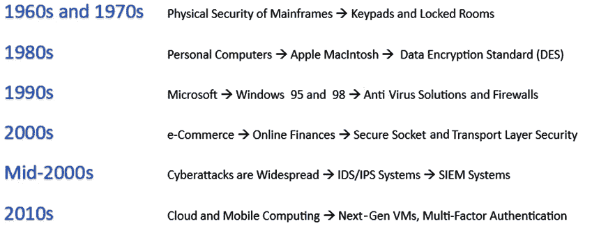

图 1.1 – 现代网络安全的演变

直到这一点，大部分技术世界的安全都是信息技术（**IT**）的一个重点领域。独立的安全专家存在，但比今天要少得多。从 2010 年后的一系列广为人知的网络攻击导致网络安全行业成为一个主流的职业领域。由于 Kali Purple 的整体工具套件是基于保护免受网络攻击的，我们将简要介绍一些更突出的攻击，以便在本书学习这些工具时，可以参考本节，并在头脑中整合出这些工具的价值、需求和 - 最重要的 - 目的。

## Stuxnet

在深入讨论 2010 年后的网络攻击猛烈行动之前，我们将简要讨论有史以来最著名的攻击之一，也被一些圈子认为是网络安全进化为一个自成一派职业领域的催化剂。这是一种涉及外部设备的攻击：USB 驱动器。虽然这种攻击似乎不能通过本书中我们将讨论的工具阻止，但仍需保持警惕和开放思维。不仅 Kali Purple 有识别和帮助阻止这类攻击的工具，Kali 家族的工具也可以创建它们！我们在这里讨论的攻击是著名的 Stuxnet 蠕虫，在 2010 年被发现。

**Stuxnet** 也是政府利用网络技术进行攻击性目的的首批案例之一。一些人认为它是*网络战的原罪*。虽然对于谁是这次攻击的真正责任方没有明确的答案，但网络安全社区普遍一致认为，这很可能是美国和以色列联合对伊朗核计划的一次行动。

复杂的攻击发生在六个阶段：

1.  侦察和情报收集，以发现要被攻击的代码和系统。

1.  Zero-day 和自定义漏洞利用被用来破坏和操纵系统。

1.  编写的代码覆盖所有踪迹，避免检测。

1.  USB 驱动器被武装化，携带恶意载荷并秘密传送/掩盖踪迹。

1.  载荷通过秘密操作人员交付，他们在停车场投放武装化的 USB。

1.  一名毫无戒心的员工发现了其中一个 USB，并将其安装在目标系统上。

西门子是一家跨国创新技术集团公司，生产被称为**可编程逻辑控制器**（**PLC**）的设备，用于管理**工业控制系统**（**ICSs**）。这些系统通常被认为是关键基础设施。它们可以包括城市、城镇和大都市地区的能源、下水道和水系统。在这种情况下，目标是伊朗的核计划，而催化剂是故意破坏用于管理该计划组件的西门子 PLC。

需要指出的是，这次攻击非常复杂，可能涉及到大量的情报收集工作，且由秘密特工执行。它涉及开发针对 Windows 和西门子 PLC 软件的零日漏洞。然后，这些零日恶意漏洞被放置到多个自动运行的 USB 驱动器上。这些驱动器被*意外*丢弃在伊朗核浓缩设施的停车场——我们说*意外*，意思是*故意*——希望某个毫不知情的员工会捡起一个，插入到他们的工作计算机中查看里面的内容——这简直是典型的*好奇心害死猫*。结果成功了。Stuxnet 攻击涉及的漏洞悄悄地修改了西门子 PLC 中高度专业化的代码，这些代码负责管理伊朗核设施中的离心机。这些代码导致离心机以不当的速度运行，从而造成了离心机的物理破坏，严重损害了伊朗的核浓缩能力，同时也大大延迟了伊朗核技术的发展进程。

Stuxnet 成功的部分原因在于其设计者付出了极大的努力，以确保攻击能够保持隐蔽并避开检测。因此，在伊朗的核能力被破坏的同时，最初攻击发生的事实也被掩盖，直到最终攻击方式被发现。由于 Stuxnet 以一个 USB 驱动器中的蠕虫形式呈现，这意味着其中的恶意代码可以自我复制并独立地在网络设备间传播。如果美国和/或以色列对 Stuxnet 的初始释放负责，某些人可能会认为这有些适得其反。原因是，像印度和印尼这样的强大盟国最终也在其环境中感染了这个蠕虫。

由此开始了现代政府将计算机技术武器化的时代。Stuxnet 引发了全球安全人员的深刻反思。然而，对于普通人来说，这还不够个人化，无法引起他们的注意。为了达到这个效果，我们需要让个人公民受到影响。仅仅三年后，这种情况就发生了。

## 2013 年的 Target 网络攻击

也许 21 世纪最具个体影响力的网络攻击之一就是所谓的**2013 年 Target 网络攻击**。Target 是一家总部位于明尼苏达州明尼阿波利斯的大型知名零售连锁公司，主要在美国运营，尽管也有一些国际业务。这家商店因其吉祥物 Bullseye 而闻名，它是一只全白色的美国斗牛梗，眼睛上画着一个字面意义上的靶心。它还因另一件事而闻名：一流的安全性。为了遏制盗窃，Target 花费了多年时间开发出先进的安全系统，这些系统强大到有时会将他们的法医专家和团队借给地方执法部门，协助解决复杂的刑事案件，作为一种社会责任的表现。破解 Target 的安全系统就像是拳击手击败穆罕默德·阿里。因此，当事件发生时，震动了整个行业。

2013 年，Target 的网络防御成功被攻破，成为历史上最大的一个数据泄露事件之一。网络犯罪分子成功访问了数千万条客户记录，包括信用卡和借记卡号码！现在大家都知道，这次数据泄露最终归因于第三方供应商的安全疏忽。然而，完整的背景往往被忽视。这个事件中有很多错误，如果其中任何一个环节不同，这次攻击可能就不会成功了。此网络攻击的一些要素，正是 Kali Purple 工具和培训所针对的内容。

我们不会讨论与这次网络攻击相关的所有问题，或者可能预防这次攻击的每一种解决方法，例如缺乏适当的访问控制和网络分段，导致攻击者能够轻松进行横向移动。虽然这些问题可能通过用于网络和/或用户管理的 Linux 发行版来处理，分析它们也会很有趣，但它们不在 Kali Purple 的范围之内。然而，有一些与 Target 攻击直接相关的问题，恰好与 Purple 的工具集相关。

最重要的之一是基本的威胁监控——这是入侵检测或防御系统所做的工作。据传攻击者成功地在零售巨头的**销售点**（**POS**）系统中安装了木马。这些系统在顾客购买商品的物品被扫描、征税并计算出总价后，会收集和处理借记卡或信用卡信息。即使在没有互联网连接的系统上，它们也会定期抓取扫描到的敏感金融数据，并将其传输到公司网络内的其他设备。这种类型的活动肯定会被今天的 IDS 和 SIEM 技术识别。当然，这只有在分析师相信他们所看到的并采取相应行动时才有价值。这将引出我们下一个场景。

注

在进一步解读这个故事之前，让我们先澄清一个非常重要的事实。Target 的安全性——直到今天依然如此——是行业领先的。这是任何组织都可以拥有的最佳安全防护。该公司在网络安全界是值得尊敬的。成为行业中最优秀之一的一个意外后果就是你会成为一个真正的目标——这并不是在开玩笑——一个靶子会被画在你的背上。这就像微软的 Windows 操作系统更容易成为病毒或其他恶意软件的受害者，而 Mac 或 Linux 系统有时会被错误地认为是*免疫*这种攻击的。任何了解情况的人都知道，Apple 和 Linux 实际上并不是免疫于恶意活动的，包括病毒。那些系统只是没有像 Windows 那样的公众炒作和市场份额。虽然这种情况随着时间的推移在慢慢改变，但当你了解 Kali Purple 提供的优秀网络安全防护时，理解“没有任何东西是真正免疫的”这一点至关重要。任何可以被设计出来的东西，无论是实物还是虚拟的，也都可以被逆向工程……任何东西！请在你的网络安全职业生涯中始终牢记这一关键事实。

话虽如此，让我们继续解析 Target 攻击的理论——关于公司卓越的安全性——并学习 Kali Purple 如何作为一套有效的工具，来保护未来免受此类攻击。一种未经证实的传闻是，Target 当时正在安装一套新的 IDS/IPS 系统，同时运行原有的系统，直到新系统完全投入使用之前，旧系统仍然保持活跃。如果这是真的，那真是太棒了！另一种版本的故事是，备受推崇的安全公司 FireEye 开发了一款恶意软件检测工具，而正是这款工具被部署，而不是新的 IDS/IPS 系统。具体发生了什么尚不清楚。然而，即使将这些假设性答案置于一个假设的情境中，关于 Kali Purple 的经验教训仍然值得我们学习。

在新 IDS/IPS 的首次提议场景中，有人说新系统确实检测到了恶意活动（或 FireEye 的产品），并且确实对此进行了报告——据说这种报告让人感到烦躁！然而，旧系统仍然在运行，且旧系统并未报告此事件。这导致技术人员错误地认为新系统出现了故障，因此他们手动关闭了警报过程，而选择相信旧技术。现在，即使这不是真的，任何曾在 SOC 工作过的人都知道，**警报疲劳**是真实存在的，尤其是在班次即将结束时，技术人员或分析师很容易因此采取不必要的快捷方式。每当你或你所在的组织进行安全防御的升级或改进时，请记住，你之所以升级技术是有原因的。如果新技术发出警报，那就相信它！在使用 Kali Purple 的防御工具时，注意是否有某些烦人的警报出现。如果有，信它！即使前一百次都不正确，也只需要一次准确，不是吗？

另一个从 Target 黑客攻击中得到的启示是提供给系统操作人员的安全培训水平。可以合理假设，适当的培训可能会让那些忽视警报的人意识到，这些警报可能是合法的，而旧技术根本无法捕捉到新技术能够识别的威胁。Kali Purple 的一个重要优势就是其创建实时场景用于测试和概念验证的能力，这些场景可以用来对技术人员和分析师进行直接培训！在任何技术领域，培训都是至关重要的。当你能够加入实际应用和实时示例的元素时，这有助于学习者更好地理解需要传达的概念。

记住，Target 攻击的另外几个特点是数据加密不足和响应速度缓慢。在加密方面，我们稍后将讨论与 Kali Purple 一起提供的某些工具，如 **CyberChef**——这是一款功能强大的加密/解密工具，通常被认为是生存在网络安全世界中的*必备工具*。在事件响应方面，我们可以考虑一些工具，如 **Synapse** 和 **TheHive**。我们将在*第八章*中专门讲解安全事件响应，并探讨 Kali Purple 提供的工具。

21 世纪继续带来大量广泛的高调网络攻击：

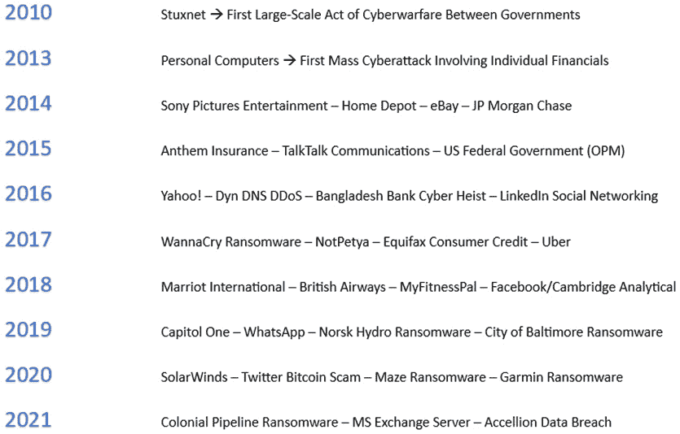

图 1.2 – 自 2010 年以来主要网络攻击的快照

现在，我们已经简要回顾了网络安全领域的历史和事件演变，这些因素造就了如今的网络安全格局。接下来，我们将看看由于这些演变而开发和打磨的部分工具。在下一节中，您将一窥当前使用的一些最强大的进攻性安全（红队）工具。这些工具是 Kali Linux 操作系统的一部分，也就是说，它们是 Kali Purple 的一部分。

# 进攻性安全

进攻性安全方面源自 Purple 家族中的红队部分。由于防御性工具集是 Kali Purple 区别于其他工具的关键，我们将仅突出与使用案例和测试 Purple 防御设置相关的进攻性部分。您需要学习或至少对进攻性安全有基本的了解，才能从 Kali Purple 中获得最强大的回报。您将理解足够的进攻性安全和红队工具及技术，从而能够有效地测试您的防御设置。这也将使您能够开发实时展示和概念验证活动，用于培训他人或自己尝试。这并不是一个详尽的说明或参考，特别是对于那些专门或主要关注进攻性安全的人。它仅仅是为了让您的 Kali Purple 之旅更加完整和顺利。

预计阅读本书的大多数人已经对 Kali Linux 操作系统有一定的了解或至少有一定的基础。然而，并非每个对网络安全感兴趣或从事相关工作的人都花时间去使用并理解 Linux 的全部价值。Kali Purple 的热潮激发了一些本来接触或经验有限的用户对 Linux 的兴趣。正因如此，我们将在本书中为您提供足够的信息，使您即便没有 Linux 经验，也能成功理解和使用 Kali Purple。然而，让我们坦白说——我们这些技术人员确实往往对自己的技术有些上瘾，不是吗？如果您对 Linux 的经验有限，您可能会被诱惑偏离 Kali Purple。虽然这并不影响您对 Purple 的理解，但 Vijay Kumar Velu 已经创作了一部杰作，将满足您的好奇心。您可以在本章的*进一步阅读*部分找到这个宝贵的信息，它将帮助您解渴，提升 Kali Linux 操作系统的技能。

注意

当我们查看 Kali Linux 发行版中的一些红队工具和方法时，必须明确理解这些工具和方法是非常危险的。它们可以造成真实且重大的损害——甚至是犯罪级别的损害。因此，在使用这些工具和/或方法之前，务必确保你拥有执行此类操作的明确授权。当然，如果你在攻击自己的系统后再辩称没有授权自己，那你可能面临更大的问题。开个玩笑，实际上有很多公开的测试网站和应用程序是专门为实践操作而设计的。然而，这些资源在这里不适用，因为我们正在使用这些工具来测试我们自己的防御系统。

Kali Linux 发行版中有一些工具，既被黑客也被安全团队的进攻型操作员使用，包括以下工具：

+   Nmap

+   Metasploit Framework

+   Burp Suite

+   Wireshark

+   Aircrack-ng

+   John the Ripper

+   Hydra

+   SQLmap

+   Maltego

+   **社会工程学** **工具包** (**SET**)

让我们详细了解这些工具。

## Nmap

**Nmap**是**网络映射器**的缩写，它是运营商广泛使用的工具，用于发现任何网络的设置和布局，允许用户在需要时绘制物理网络图。通过映射网络，操作员可以获取一个可视化的图形，用以分析网络，从而检查潜在的漏洞或可利用点。Nmap 通过向目标发送信息包，并根据是否收到响应以及响应的内容做出假设来实现这一目标。以下是一个 Nmap 扫描示例：

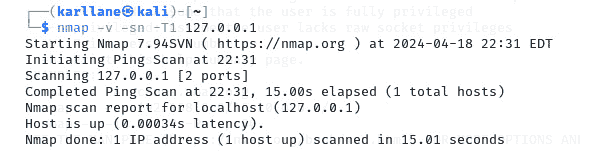

图 1.3 – 示例 Nmap 扫描

Nmap 可用于扫描整个网络或一系列 IP 地址。在这种使用方式下，通常是为了识别网络中任何正在运行的主机。在发送探测包后，Nmap 操作员如果收到任何形式的响应，就可以推断出某个主机在线。这将使任何攻击者能够创建网络拓扑，并列出可供进一步探测和/或利用的潜在目标。

当选择个别主机进行进一步渗透时，Nmap 可以用于执行端口扫描，端口扫描用于确定是否有端口对连接和通信开放。这种技术不仅有助于识别攻击者潜在的入口点，还可以提供设备功能的见解，因为特定的端口号可能揭示出特定类型的活动。例如，端口**80**和**443**开放，可能会告诉用户该设备正在进行网站和安全网站的活动。

通过分析探针的响应，Nmap 还可以帮助攻击者确定主机上活动的操作系统。这将显著减少攻击向量的模糊性，并帮助他们缩小最有可能成功的攻击工具和方法。这一过程被称为**操作系统指纹识别**。

与 Kali Purple 相关，Nmap 活动可以通过**Elasticsearch、Logstash 和 Kibana**（**ELK**）堆栈进行检测和分析，我们将在*第二章*中开始讨论它。它还可以通过流量和日志分析工具如**Arkime**和**Malcolm**，以及入侵检测工具如**Suricata**和**Zeek**进行检测，只要这些工具已配置为执行此操作。所有这些工具都是 Kali Purple 发行版的一部分。

## Metasploit Framework

**Metasploit Framework**是目前最全面的开源漏洞开发平台之一。它很可能默认与任何专注于渗透测试的 Linux 操作系统一起提供，包括 Kali Linux。以下是 Metasploit 控制台：

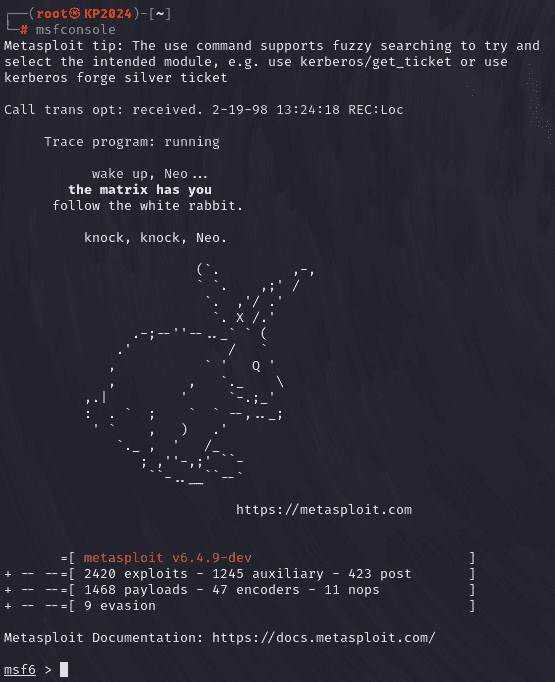

图 1.4 – Metasploit 默认控制台

最初由名为**哈雷·大卫**（**HD**）**摩尔**的专家创建，Metasploit 现在由名为**Rapid7**的公司拥有并维护。该框架包括大量的工具、漏洞和有效载荷。除了可以免费使用的社区版框架外，还有付费的专业版，因此你可以放心，知道你可以获得专业支持，享有先进的自动化和报告功能。

从高层次来看，漏洞利用只是为了利用目标信息系统端点中的漏洞而设计和编写的代码。Metasploit 包括旨在获得未经授权访问、提升特权、建立后门以及投递和远程执行恶意有效载荷的漏洞利用代码。

更好的是，Metasploit Framework 允许创建自定义有效载荷，并提供访问预先构建的有效载荷库的功能。**有效载荷**是指任何被投递到受损系统的应用程序或代码。该框架还包括所谓的**后渗透模块**，这些模块更像是二级漏洞利用或只能在成功执行先前漏洞利用后使用的漏洞利用。这可以帮助操作员继续深入探索系统和网络，获取敏感数据进行外泄或其他恶意目的。

Metasploit 还可以用来发起基于社会工程学的攻击，并生成所采取行动的报告。就像 Nmap 一样，Metasploit 的活动可以通过 Kali Purple 发行版中包含的工具进行检测，尤其是 Suricata 和 Zeek。ELK 堆栈需要一些自定义配置，但在一切完成后，你会明白为什么这是一件好事。

## Burp Suite

**Burp Suite**由一家名为 PortSwigger 的公司开发，是领先的网络安全工具，广泛应用于 web 应用安全（及攻击）。几乎不可能找到一个专业的渗透测试人员在进行 web 应用测试时不使用 Burp Suite。Burp Suite 的安装包含多个独特的组件 – Burp Suite 称之为**模块** – 每个模块设计上可以与其他模块配合使用，前提是用户需要这样做。大多数这些模块可以在该产品的社区版中免费使用。然而，Burp Suite 的一些功能只有在付费的 Pro 版中才能使用。但不要因此就小看这个产品！免费的社区版提供了一个非常有用的强大工具集！下面是 Burp Suite 的大厅：

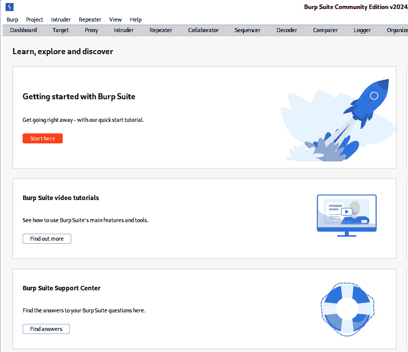

图 1.5 – Burp Suite 的默认大厅

Burp Suite 有一个代理模块，充当 web 浏览器和目标操作之间的中介。这个代理允许进行**中间人攻击**，为操作员提供拦截 HTTP/S 流量并修改其请求和响应的途径。

在付费的 Pro 版中，有一个扫描模块，可以自动化识别目标 web 应用中的安全漏洞。类似于 Nmap 用于 web 应用的功能，这个扫描器通过向目标发送信息来工作。不同之处在于，Nmap 发送的是通信数据包，而 Burp Suite 发送的是攻击载荷到目标 web 应用，并分析这些载荷的响应，以帮助识别潜在的漏洞。扫描器寻找的漏洞包括 SQL 注入、**跨站脚本攻击**（**XSS**）和**服务器端请求伪造**（**SSRF**）。然后，它会突出显示这些潜在的攻击点，以便进一步分析。

曾经想运行一个 web 爬虫或者蜘蛛程序吗？现在你可以了！Burp Suite 的一个模块正是这个功能——蜘蛛。正如你所猜测的，蜘蛛模块将会爬取目标应用，然后尝试映射应用的功能以供进一步调查。蜘蛛的目的是帮助识别那些通过浏览不太容易发现的脆弱区域。

Burp Suite 支持进行被称为**暴力破解攻击**的攻击，即用户尝试所有可能的用户名和密码组合。正如你所想象的，手动进行这一过程可能会耗费大量时间（真的是永远都做不完！）。Burp Suite 自动化了这个过程，并以令人难以想象的速度代表你进行这些攻击。这一操作是在 Intruder 模块中进行的。在这个模块中，用户可以设置暴力破解攻击所使用的参数。

你还可以将一种称为**彩虹列表**的文件导入这个模块。当计算机系统创建密码时，计算机会尝试使用一种假设的单向数学公式对密码进行编码。这意味着理论上计算无法被逆转。事实上，任何可以被设计出来的东西也可以被逆向工程。然而，这些数学过程的目的是尽可能让这种逆向过程变得不切实际。这些单向数学过程的结果被称为**哈希值**。

随着时间的推移，黑客和攻防安全人员收集了已知和常用密码的哈希值，并将其与相应的密码一起存储在文件中。这些文件被称为**彩虹表**或彩虹列表。入侵者模块允许你导入这样的列表，从而尝试应用编码哈希值进行破解。

入侵者模块还可以用于**模糊测试**，这种测试方法在软件测试工程师和参数操控中非常流行。模糊测试，也叫做**模糊处理**，涉及向应用程序或系统注入随机或意外的数据。它可以是一种*盲目射击*或*瞎猫碰死耗子*的方式。它还可以组织成包含随机字符或过大字符输入的预计算数据组。你可以用它来测试 Web 应用如何处理各种输入。这个模块通过允许用户定义自定义列表、有效载荷和其他攻击场景，使这项工作变得简单。入侵者模块的主要目的是帮助操作员通过发现弱密码、注入漏洞，甚至识别**过多信息**（**TMI**）被泄露的地方，进而获得访问权限。

有时，攻击者通过利用一种称为**重放攻击**的方法来实现他们的目标。Burp Suite 提供了一个名为 Repeater 的模块，旨在使这类攻击成为可能。像所有 Burp Suite 模块一样，这个模块也允许自定义，并提供了很大的灵活性。它还允许操作员在重放之前修改现有的 Web 应用响应，以帮助确定任何应用的阈值在哪里。

Sequencer 是 Burp Suite 提供的一个模块，用于分析会话令牌的随机性和质量，以及其他本应不可猜测的数据。它评估了加密算法的强度和目标应用中使用的随机性水平。这个模块不一定会提供直接被 Kali Purple 所包含的工具检测到的活动。然而，操作员从 Sequencer 获得的信息可能会导致基于其发现的弱点的攻击，而这些攻击通常可以通过 ELK 堆栈、Suricata、Zeek 和其他工具被检测到。

现代技术如果没有扩展性又算什么呢？Burp Suite 的最终模块是 Extender。它是一个 API，允许用户开发并将自定义插件集成到 Burp Suite 应用程序中。它使 Burp Suite 用户能够根据组织的需求量身定制该工具，以实现自动化。尽管它不会直接与任何 Kali Purple 发行版交互，但 Burp Suite 社区已经创建了一个大型的插件库，用户提交的任何插件都有可能在 Purple 工具集的检测下产生活动。

Burp Suite 的广度不可低估。像本节提到的所有工具一样，它既可以用于造成损害，也可以用于良性目的，通过测试漏洞来抵御攻击。Burp Suite 专注于 Web 应用程序的黑客攻击，你可以放心地去拉斯维加斯并*孤注一掷*，任何类似活动都将会被 Kali Purple 的防御工具集审查。

## Wireshark

Kali Purple 发行版增加了一些用于流量和日志分析的工具，我们将在本书中介绍这些工具。然而，我们不能忽视所有协议分析工具中的“祖宗”——**Wireshark**。它在 Kali Linux 包中就已包含，甚至在 Purple 版本发布之前就已经有了。Wireshark 是一个开源应用程序，被广泛使用，通常被称为协议分析工具的黄金标准。你会发现它被用于网络故障排除、数据包分析和安全漏洞测试。它通过*捕获*网络流量数据包供操作员审查和分析。以下是一个 Wireshark 数据包捕获的示例：

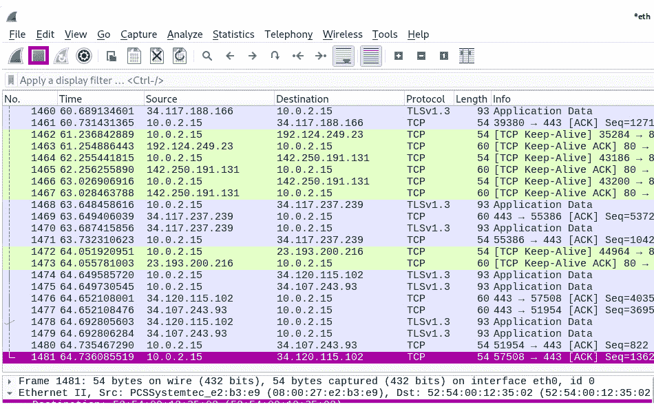

图 1.6 – Wireshark 示例数据包捕获

Wireshark 通过抓取在网络接口上传输的网络数据包来工作。它通常用于捕获和监控符合以太网、TCP/IP、HTTP、DNS、HTTP/S 等协议的流量。通过抓取这些数据包，分析师可以查看头部、有效载荷和其他相关数据，帮助确定是否发生了不希望的活动。

Wireshark 识别并检查正在使用的协议，然后提供非常详细的分析，帮助人类查看并确定各种协议的预期行为和结构。通过检查此工具识别的消息和交互，分析师可以帮助发现异常行为，甚至是简单的安全配置错误。

Wireshark 有时会被恶意行为者用来进行类似于 Nmap 的网络侦察。在这种情况下，操作员可以通过评估数据包中包含的信息来绘制目标网络的图，而不是依赖于设备本身的直接响应——或者没有响应。通过数据包评估，分析人员应该能够识别网络中的主机，检测开放端口，并观察通信中是否有任何异常或不寻常的模式。这将有助于可视化目标网络的实际基础设施。

这种分析方式帮助操作员调查会话中的异常行为。这样，操作员就能看到认证机制并查看是否发生了任何不寻常的活动。总体而言，数据交换或会话管理中的弱点应该是显而易见的。通过这些方法，Wireshark 可以进一步寻找潜在的流量操控区域或通过注入方法、负载修改或网络协议操控等手段进行流量操控的机会，这些手段有时会被恶意行为者用来绕过网络安全措施，例如通过洪泛攻击使保护设备*失效打开*。

与前述工具类似，Wireshark 的活动可以被 Suricata、Zeek 和 ELK 栈等工具检测到，Kali Purple 发行版中也有其他类似工具。由于它在渗透测试者和攻击者中都很受欢迎，我们将在我们的流程中加入它。

## Aircrack -ng

**Aircrack -ng** 是一套通常用于网络安全测试的软件工具。然而，与我们之前提到的其他网络测试工具不同，这套工具专注于无线通信。它最常用于测试 Wi-Fi 加密协议和密码的强度。以下截图展示了一些 Aircrack -ng 的 Wi-Fi 选项：

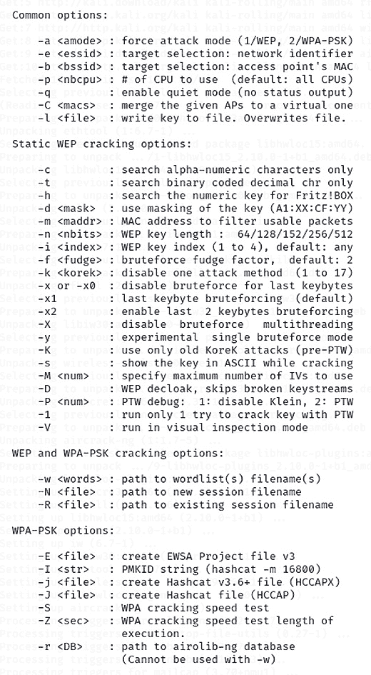

图 1.7 – Aircrack -ng Wi-Fi 选项

**Airodump -ng** 是该套件中的一个工具，其目的是捕获并分析 Wi-Fi 流量，类似于 Wireshark 的工作方式。它的一个独特之处在于，专注于收集附近 Wi-Fi 网络的信息，任何与之关联的接入点，以及在扫描时连接到它们的设备。它还会查找任何使用的加密协议。

套件中的主要工具，即标题应用程序，具有捕获握手数据包的功能，巧妙地用于在离线时进行密码破解。默认情况下，它将使用基于字典的暴力破解方法来实现这一目标。它还具有设计用于恢复 WEP 和 WPA/WPA2 密钥的功能，如果网络加密较弱的话。它通过统计分析和彩虹表——有时被称为预计算表——来完成这一任务。

**Aireplay -ng** 是包内的一款应用程序，用于执行被称为去认证攻击（de-authentication attacks）的操作。它向目标设备发送去关联或去认证的数据包，强制它们与 Wi-Fi 网络断开连接。这样做是为了强制进行重新认证过程，以便捕获握手数据包。

使用这组工具时需要特别小心：这些工具非常容易执行你没有明确要求它们执行的操作！由于许多操作具有非法性质，这可能是非常危险的。所以，在使用 Aircrack -ng 时，务必小心谨慎。与我们之前讨论的其他红队工具不同，这组工具的行为更难被检测到，只有在配置了 Kali Purple 防御工具套件以监控此类活动时，才有可能被捕捉到。

## John the Ripper

经常被认为是 *破解之王*（有时也称作 *Kracking 之王*），**John the Ripper** 如其名字所示，是一款行业领先的开源密码破解系统。在渗透测试中，它用于测试密码的强度，通过尝试破解加密的密码哈希值。*好人* 使用它来评估并全面了解其密码系统和策略的安全性。下面是 John the Ripper 破解密码的示例：

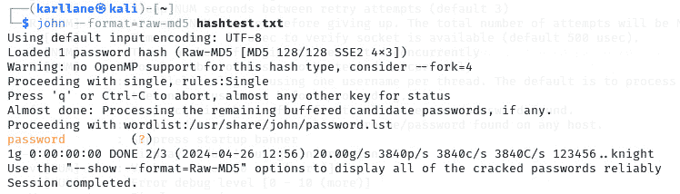

图 1.8 – John the Ripper 破解名为“password”的密码

攻击者尝试获取密码哈希值是常见的做法——尽管在现代社会密码不再常常以 *明文* 存储，但这种情况仍然会发生。John the Ripper 是一款有助于加速查找和抓取密码哈希值的工具，因为这是该应用程序的一个功能。如前所述，密码哈希是存储在系统上的密码的加密值，用于处理并批准或拒绝访问。

一旦获取到哈希值，用户将会尝试识别哈希类型，以便能将 John the Ripper 引导到正确的解密方式。该应用程序首先会尝试自动识别哈希类型。它支持多种密码哈希类型，如 MD5、SHA1、NTLM 等。如果它无法自行识别哈希类型，可以使用另一个流行的应用程序 **CyberChef** 来辅助识别。

注意

CyberChef 是 Kali Purple 套件中包含的一个工具，我们将在下一节和 *第六章*中再次讨论它。它是一个常用来帮助识别包含哈希值的加密类型的工具。如果需要，它也可以在线访问，但如果你在客户相关的警报或事件中远程使用此应用程序，建议小心。数据传输过程中被窃取的任何信息都构成数据泄漏，且受多种不同的监管指令保护。看似简单的操作可能会成为你、你的雇主以及雇主的客户的公关噩梦，甚至可能导致你失去工作。

与其他破解工具一样，John the Ripper 具有内置的支持词库和自定义表格的功能。这些是预生成的潜在密码列表，可能来自多种策略，包括最近泄露的数据库密码、最常用的密码或其他方法。一旦准备好这些词库并识别出哈希值，John the Ripper 将尝试多种不同的破解技术，试图将密码哈希与字典中的代表密码匹配。一旦完成，结果将列出成功破解的密码。

在远程使用时，John the Ripper 活动可以轻松地被 Suricata、ELK 堆栈、Zeek 和 Kali Purple 发行版中的其他工具检测到。

## Hydra

另一个知名的开源密码破解工具是 **Hydra**。与 John the Ripper 专注于基于存储的哈希值破解密码不同，Hydra 更适用于对网络服务进行传统的暴力破解攻击。以下是 Hydra 使用的一个示例：

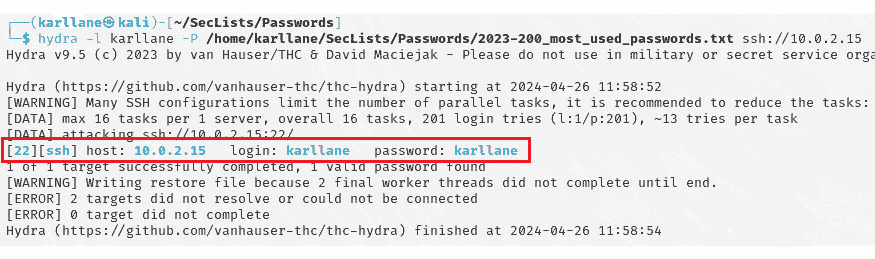

图 1.9 – 使用 Hydra 恢复 SSH 服务器的本地密码

使用 Hydra 的第一步是识别目标系统或网络服务。这通常可以通过我们之前讨论过的一些工具来完成，例如 Nmap 和 Wireshark。

一旦选择了目标，操作员将识别并指定需要测试的认证方法。使用 Hydra 时，目标可以是 SSH、FTP、HTTP/S、Telnet 或数据库服务，如 MySQL 或 PostgreSQL 等。随着信息提供给应用程序，操作员还将包括目标的 IP 地址或主机名和端口号，以及希望使用的协议方法，如密码列表、字典法等。使用 Hydra 时，操作员可以选择自定义创建密码列表，或使用他人已开发的现成列表。

就像其他破解工具一样，一旦输入所有信息并且正确的列表准备好，只需运行程序，它会自动尝试许多不同的密码破解方法。如果设置了，它还会尝试密码喷洒以及用户枚举，这些都是其他破解工具中不一定提供的功能。Hydra 会提供与其他破解工具一样的结果，以便人类读取、验证和确认。它也容易被 Kali Purple 的一套防御工具检测到。

## SQLmap

**SQL** 代表 **结构化查询语言**，它是程序员和软件工程师与数据库交互时常用的语言。它是应用程序在数据库中添加、删除和修改信息的方式。所以，正如你可能已经猜到的，**SQLmap** 是一个开源工具，用于攻击数据库。它尝试检测和利用使用 SQL 数据库的 Web 应用中的 SQL 注入漏洞。它的强大之处在于能够自动化注入攻击。下面是它的启动界面：

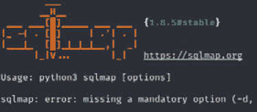

图 1.10 – SQLmap 启动界面，显示可用的命令选项

该应用程序首先扫描 Web 应用程序，以发现潜在的 SQL 注入漏洞。它的工作方式应该现在对你来说很熟悉。它向目标 Web 应用程序发送特制的请求，然后……你猜对了……分析响应。通过这样做，SQLmap 可以确定各种类型的 SQL 注入漏洞，比如基于布尔值的（真假）、基于时间的和/或基于错误的注入。

一旦 SQLmap 发现潜在的 SQL 注入漏洞，它会通过尝试从数据库中提取敏感信息来利用该漏洞。它会尝试检索数据库模式、表格和列，然后如果可能，它会导出整个数据库的内容。通过这些逐步的计算操作，帮助识别已发现漏洞的全部影响及潜在的数据泄露范围。任何一个数据库在一个组织中的成功利用，往往表明同样的操作可以对该组织中的几乎每一个其他数据库进行。

SQLmap 中有一些非常棒的功能。其中之一是它允许用户保存成功的注入攻击状态，以便稍后恢复或与他人共享。这可以被称为一种内建的持久性功能！另一个功能是，像 Metasploit 一样，SQLmap 提供了一种成功后继续进行二次攻击的方式。它有几种内置的技术，可以在仅从数据库中提取信息之后继续攻击。它可以执行任意 SQL 查询、访问底层文件系统（非常强大！），并执行操作系统级别的命令。它甚至可以帮助建立一个反向 shell，用于远程命令执行！

由于 SQLmap 操作的*喧闹*特性，它无疑会被包括 ELK 堆栈、Suricata、Zeek 以及 Kali Purple 分发版中的其他工具轻易检测到。

## Maltego

从破解和漏洞利用的部分转到 **Maltego**，它是一个非常强大的情报收集和数据可视化工具。顾名思义，它的目的就是收集信息、分析数据，然后将其呈现在图形用户界面（GUI）中，帮助操作员进行可视化。与大多数其他工具一样，它寻找漏洞，并帮助提供攻击链的全面侦察。以下是 Maltego 的界面：

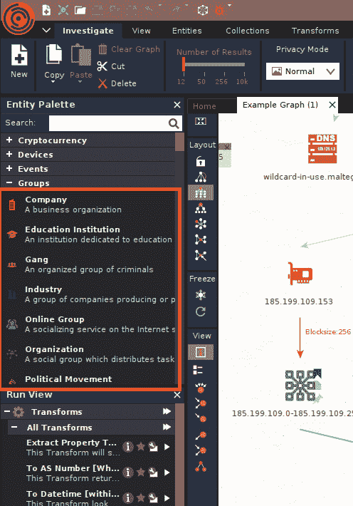

图 1.11 – Maltego 示例

使用 Maltego 的预期方式是识别目标网络、个人或域。我们已经介绍了几种工具来帮助进行这些操作（如果需要的话）。然后，它帮助操作员从各种来源收集信息，比如公共数据库、DNS 记录、社交媒体档案和在线出版物等。它将这些数据进行整合 —— 合并 —— 并生成一个可视化图表，在图表中明确指出不同数据实体之间的关系和连接。

实体可以是 IP 地址、电子邮件地址、姓名或与其指示收集的情报相关的任何独特项目。Maltego 会将这些不同的实体以节点的形式表示，并使用图中的链接或边缘显示它们之间似乎存在的关系。这有助于操作员仔细评估所收集的情报和可视化的元素间连接。这反过来可以帮助操作员拼凑出潜在的攻击路径、漏洞和网络攻击利用阶段的入口点。

Maltego 提供了一种名为自动化数据转换的功能。通过一系列广泛的转换选项 —— 应用程序称之为**转换** —— Maltego 自动化了通过从一个已知实体跳转到另一个实体来尝试检索更多信息的过程，这是因为它已经识别出了这些实体之间的关系。转换可以用来查找额外的域名、DNS 记录、IP 地址和社交媒体档案。这些可能与你已收集的信息有关，例如，但在原始实体组之间的关系被发现之前，它们是未知的。它还可以将这些信息与已知漏洞和攻击的存储库进行比较。

这个极其强大的情报收集工具的另一个好处是其包含的协作和报告功能。Maltego 通过允许将可视化的表示和图表放置在共享工作区内，能够促进多个团队成员之间的实时协作。它还可以通过生成详细的报告，帮助处理这些协作内容，报告中记录了发现、时间线、关系和在过程中收集的证据。这将帮助各个成员实时地向彼此提出问题，从而帮助整个过程高效推进。

如你所见，Maltego 是一款极其强大且实用的工具。它也是这份工具清单中最有效的隐蔽操作工具之一。Maltego 的活动不太可能被网络防御系统检测到，因为 Maltego 既能执行任务，又能隐蔽其行为。如果 Maltego 的某些操作被网络防御系统发现，通常几乎没有任何信息表明这些活动是由于某人使用该应用程序所引起的。这并不意味着它不可能被发现；只是极难被检测到。然而，攻击者因 Maltego 活动所采取的行动，如果是恶意的，则很可能会被检测到。

## 社会工程工具包 (SET)

听起来像是心理学 101 课程里的内容，不是吗？信不信由你，**社会工程工具包** (**SET**) 真的存在；它是一个技术性工具包，包含在 Kali Linux 发行版中。它是一个开源的基于 Python 脚本语言的框架，由一位名叫 David Kennedy 的人创建。它旨在促进和自动化社会工程攻击的技术部分。社会工程是指通过欺骗或心理操控来操纵人们，以获取重要的、甚至敏感的信息或获得本不应有的访问权限。虽然社会工程确实有很强的面对面或实时互动成分，但也有一些技术方面与整体策略相关，而 SET 正是为了简化这些技术方面的内容而存在的。以下是 SET 的界面：

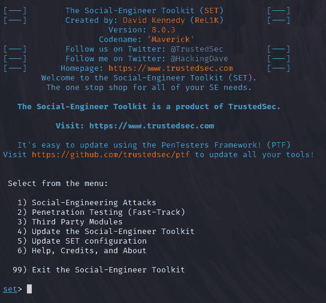

图 1.12 – SET

SET 允许操作员安排钓鱼攻击活动，让目标被欺骗输入他们的凭证，例如用户名和密码，进入一个虚假的登录页面。SET 通过快速复制网站，将其变成一个视觉上与原站点相同的新站点，帮助实现这个目标。这是攻击者用来欺骗用户输入凭证的主要策略之一。用户点击钓鱼邮件，进入了虚假网站，外观与原网站完全相同。然后，他们尝试登录时出错，而虚假网站加载了原始的真实站点，用户再次尝试并成功登录正确的网站。尽管他们在第一次攻击中泄露了凭证，但由于第二次登录了正确的站点，他们并没有察觉。这就是**网站克隆**。

SET 还可以用来生成看似合法的恶意文档。它可以模拟 Microsoft Word 或 PDF 文件，并在文件中隐藏代码，当有人打开文档时，代码会立即执行。这些代码会利用目标系统中的漏洞，可能会执行如安装键盘记录器等操作，键盘记录器会捕捉受害者输入的每个按键，并提供他们在设备上使用的每个页面和/或应用程序的凭证。代码还可以直接感染系统并抓取系统信息，安装后门或反向 shell，允许攻击者直接访问，并可能横向渗透到网络中的其他系统。这类文件被称为**感染性媒介**。

还记得 Metasploit 及其强大和广泛的功能吗？猜猜看，SET 与 Metasploit 集成，这样当攻击阶段需要时，Metasploit 中可用的漏洞就可以无缝地嵌入到社会工程学攻击中。

SET 还可以创建**基于 USB 的攻击**。它可以设置一个 USB 驱动器，使其在插入目标系统后自动执行，并运行预配置的攻击脚本和恶意载荷。还记得 Stuxnet 吗？SET 可以创建类似规模的攻击！虽然它可能需要一些特殊的配置才能完全检测，但 Kali Purple 的防御工具确实能够检测来自 USB 驱动器的异常或可疑行为，比如对自动运行/自动执行活动的警报。

正如在几处所指出的，这些工具如果不以伦理方式使用，可能非常危险，并且会将操作人员送进监狱。这意味着必须获得使用这些工具的许可，并事先确定好，最好是书面的，明确使用范围，且绝对不能越过这些边界！虽然这些工具通常与大多数 Linux 发行版兼容，甚至在某些情况下是预装的，但 Kali Purple 所提供的防御工具却不同，这些工具包括了蓝队的内容。你刚刚简要了解的红队工具都可以在 Kali Linux 中找到，Kali Linux 是支持 Kali Purple 的操作系统。现在，你了解了红队部分的基础知识，让我们来看看蓝队部分。

# 防御性安全

Kali Purple 的独特之处在于它为 Kali Linux 发行版添加了防御工具，供蓝队操作员使用，以便他们可以训练初级分析师或完成其他工作。当然，要完全理解这些工具如何融入组织的安全防护中，了解一些与网络防御相关的术语可能会有所帮助。在这里，我们将介绍一些常用术语，并重点讲解阅读本书时所需了解的网络防御概念。我们将更直接地讨论成为蓝队成员意味着什么，并了解信息安全/CIA 三合一模型、SOC、SOAR、SIEM、IDS/IPS 以及其他相关概念。在此过程中，我们将重点讨论这些概念如何与 Kali Purple 相关。

如果你曾经为技术认证或任何网络安全方面的内容学习过，你很可能接触过信息安全三合一模型，也称为 CIA 三合一模型。三个组成部分——机密性、完整性和可用性——是建立良好安全防护的关键因素。想象一把三条腿的凳子。如果你移除其中一条腿，凳子就会倒下。同样地，如果你从三合一模型中移除一个组成部分，安全防护也会受到影响。信息和资源的机密性、完整性和可用性共同确保了组织系统和数据的适当访问和安全性。

因此，如果三合一模型的一个组成部分损坏，整个基础框架将崩溃：

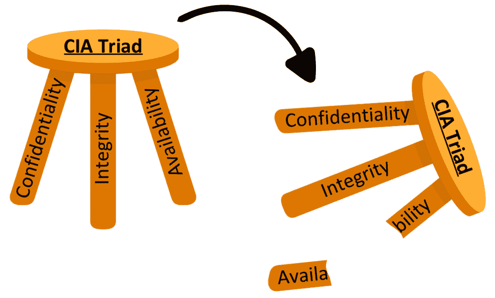

图 1.13 – CIA 三合一模型

让我们按组件来逐一拆解。

## 机密性

这个三合一模型的元素讲述了如何保护信息不受未经授权的访问、暴露或披露。这是通过采取措施防止没有适当授权的个人访问敏感数据来实现的。一些可以采取的措施包括物理访问控制，如键盘、隔离区或生物识别技术，加密数据或建立安全的通信渠道。

## 完整性

这个元素的目的是确保数据在其生命周期的任何部分都不会被未经授权的来源篡改。它旨在确保数据保持原样，准确无误。数据内容本身的准确性是授权创建者和数据处理者的责任。它侧重于防止未经授权的修改、损坏或删除数据。通常，通过使用数字签名、哈希、校验和和数字访问控制等技术来实现这一点。

## 可用性

这个元素的需求是为了在需要时确保组织资源和信息的适当可访问性和可用性。它确保只有授权用户可以访问，访问不会中断，并且访问将包含用户完成任务所需的资源。通常，通过为信息系统增加冗余层（包括物理和/或虚拟的冗余），例如备份数据、建立灾难恢复计划和实施容错机制，来实现这些目标。理想情况下，适当的数据将始终对适当的用户可用。然而，我们生活在一个不完美的世界，有时即使是自然灾害也会对组织的安全状况构成威胁。如果可用性受到干扰，那么三元组的这一元素还包括减轻任何自然中断、服务中断或故障影响的计划。

可用性是网络安全中最常被误解的概念之一。这是因为其他元素的目的是拒绝错误人员的访问和操作，而这个元素的目的是确保允许正确人员的访问！如果最好的安全措施无法让被保护的内容得到利用，那就没有多大意义。这实际上违背了万维网和计算技术的整个目的，不是吗？由于这种抽象，新技术人员和初级分析员有时会在安全性与保持业务运作流畅之间保持适当的平衡时遇到困难。重要的是要意识到，尽管你可以在防火墙上完全阻止所有的.com 域名，但如果你的组织需要互联网来营销或提供产品或服务的支持，这样做也没有多大意义。在你使用 Kali Purple 中的工具时要记住这一点，因为这些工具功能强大，确实在被滥用时可能严重破坏资源的可用性。

现在我们已经掌握了网络安全的核心框架，让我们来看看大多数蓝队人员将使用这个框架的环境。SOC（安全运营中心）是大多数防御性网络安全专业人员工作的环境。实际上，这就是 Kali Purple 的核心所在！有时你会看到 Purple 被称为 *SOC-in-a-Box*，因为这个工具套件包含了建立一个小型 SOC 所需的所有核心工具和功能。

SOC 是组织内部的一个单位，通常是集中的，负责监控和响应安全事件。它已经发展成为更多地与具体的网络或计算机相关的安全事件相关联。然而，一个真正的 SOC 会涵盖所有的安全情况，包括传统的闭路电视和其他监控系统。在当今的世界中，SOC 也常常用来指代在集中安全环境中工作的团队。这可以是防御性的蓝队和/或进攻性的红队。他们负责增强和维护组织信息系统的安全性。

这些团队通常是经过高度培训和教育的网络安全专业人士。然而，一些商业模式允许通过“*火中取栗*”式的培训方式培养网络安全专业人员，前提是这些人表现出对该领域的热情或渴望。Kali Purple 是一个极好的工具，帮助组织为这些人提供实践经验！

SOC 的主要目标或期望是实时识别、保护、检测、响应和恢复网络威胁和事件。这五个术语恰好也是**国家标准与技术研究院网络安全框架**（**NIST CSF**）的五大支柱。与 NIST 对齐意味着你将自己的技能与许多政府机构的要求和运作对接，包括美国国防部以及能源、水利、医疗、交通和金融服务等关键基础设施部门。你还会在许多中小型企业中看到 NIST 合规性。此外，尽管 NIST 是美国商务部下属的一个机构，但你会发现许多跨国和全球运营的组织也遵守其网络安全框架的许多方面。由于 Kali Purple 是专门针对这一框架设计的，它成为了在 SOC 工作或渴望从事网络安全职业的人员的完美操作培训基础。

SOC 的一个主要工具是 SIEM 系统。SIEM 也可以称为标准化或关联系统。它的目的是从组织内部的各种技术来源——端点——收集各种安全事件日志和相关数据。然后，它解释这些数据，将其与其他相关数据进行匹配，这称为数据丰富，并以统一的格式展示。

与 SIEM 相关的是一个被称为**安全编排、自动化和响应**（**SOAR**）的系统。SOAR 旨在补充 SIEM 系统，因为它提供了自动化事件响应的能力，并帮助以结构化、组织化和协调的方式编排安全操作。

由于数据可以来自任何数量的、不兼容的源，例如 Windows、Mac 或 Linux 设备，原始的原始数据可能以无数种语言和/或呈现方式存在。SIEM 接收所有数据，进行必要的解释，并以一致的方式呈现，极大地简化并提高了分析师的工作效率。

通过处理这种规范化，分析师可以专注于最重要的部分：将数据与已知及新兴威胁进行对比，以及评估可能表明潜在未知和新恶意活动的异常行为。反过来，这使得分析师能够迅速缩小攻击面，沟通推荐的更改，或者在授权的情况下直接进行更改，并高效地为高级安全工程师汇总合规报告。

我们将在下一章通过探讨 Kali Purple 引入 Elastic 来介绍这些系统之一；在本书的其余部分，你将继续扩展你对 SIEM 的知识。需要理解的是，Elastic 本身并不是 SIEM，它只是建立 SIEM 的核心组件之一。我们将添加其他组件，创建一个功能完善的 SIEM。

Wazuh SIEM 是建立在 ELK 堆栈之上的：

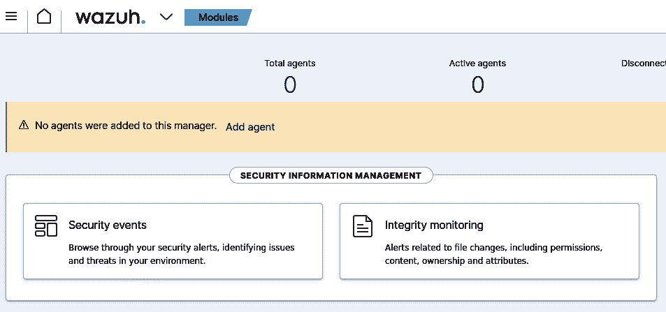

图 1.14 – 新安装后的默认 Wazuh SIEM 仪表盘

你必须了解关于 SIEM 的以下内容：

+   日志收集

+   事件关联

+   警报和通知

+   事件响应

+   合规监控和报告

+   威胁情报集成

让我们详细看看这些内容。

### 日志收集

虽然 SIEM 有许多有用的功能，但日志收集通常是网络安全专业人员在构思这类工具时首先想到的目标。最常见的做法是在每个端点安装*代理*，也就是 SOC 希望 SIEM 监控的个体物理设备或软件应用。这些端点可能包括个人电脑、工作站、服务器，甚至网络设备，如路由器和交换机。它们还可能包括诸如杀毒软件系统或**企业对企业**（**B2B**）协作工具等个体软件应用。

这些代理的复杂性差异很大，但其要点在于它们监控并收集所安装设备的数据，然后简单地将这些数据报告给 SIEM。某些代理可能会报告大量数据，供 SIEM 或分析师自行解析，而其他代理可能会提供一种*预评估*的数据，仅报告那些被认为是异常的数据。最安全的做法是将所有数据都传送过来。然后，所谓的网络安全工程师将在 SIEM 中编写代码，处理任何基于组织或客户需求的自动排序、丰富或丢弃信息。代理收集并发送到 SIEM 的信息被称为日志。每个日志都包含非常有价值的信息，可能包括用户活动、系统事件——即机器或软件指令本身的操作——以及任何明显的安全事件。

### 事件关联

一旦 SIEM 从代理收集了日志，它必须对这些信息进行处理，对吧？这里有许多选项，但最常见的做法是对数据进行分析，并将其与先前收集的或静态输入的数据进行结合。当数据原本被收集时，它被认为是原始数据。与额外的相关信息（通常称为查找表的附加数据表）结合后，就称为**数据丰富化**。举个例子，当 SIEM 收集到一个 IP 地址作为日志的一部分时，它会有一个独立的表格，解释某些 IP 地址或地址范围的位置，从日志中提取 IP 地址，将其与预先存在的查找表匹配，然后告诉分析师日志中的活动发生在哪个地理位置。丰富数据就像是在拼图中添加额外的碎片。它提供了更清晰的视图，帮助理解发生或曾经发生的事件。SIEM 平台随后可以分析丰富后的数据，查找复杂的模式和异常行为。反过来，这使得 SIEM 能够识别、标记并报告潜在的网络攻击。如果没有足够的信息或数据，单个原始数据可能无法识别这种行为。

丰富并分析新丰富的数据被称为**事件关联**，这一过程显著提高了检测恶意行为的几率。事件关联是指 SIEM 将不同的日志（这些日志服务于不同的目的，但有共同的特征）整合在一起，帮助分析师查看是否有其他信息可以支持他们的调查。例如，一个包含身份验证失败的日志（即某人未能登录）与一个包含端口扫描活动的日志相结合，后者发生在或接近身份验证日志的时间点。

这与数据聚合不同。**数据聚合**是指 SIEM 将多个包含相同信息的日志，如所有包含特定 IP 地址的日志，汇总到一个报告中。某些 SIEM 解决方案（**Devo**）将为分析人员提供创建并执行数据聚合操作的机会，然后将结果输出为所选文件格式，如 CSV 电子表格。

### 警报与通知

你能相信即使在数据增强、关联和复杂分析之后，恶意行为有时仍然可能被忽视吗？没错，确实可以！这就是为什么在 SOC（安全运营中心）的多层安全防护中，我们需要加入人类因素。为了利用这一人类因素，SIEM（安全信息与事件管理系统）会将其已关联的数据与由网络安全工程师设定和/或管理的标准进行比对。如果数据符合这些标准或规则，SIEM 就会将这些数据生成一种被称为警报的报告，供人工分析使用；或者如果已经存在相关警报，它会将该事件添加到该警报中。这些警报是供人工分析的，通常由一级网络安全分析师或安全分诊专家处理。SIEM 以统一的格式和语言编写这些警报，使得分析人员只需要学习一种日志分析风格即可。接着，它通常会将新生成或更新的警报放入某种形式的队列中，供网络安全分析师持续监控。

### 事件响应

当一级安全分诊分析师审查警报并判断事件已发生或即将发生时，他们通常会将该警报升级给二级网络安全分析师，通常由事件响应专家处理。在一些组织中，这可能是三级分析师，但主流的网络安全公司通常将三级保留给威胁狩猎专家。一个设置良好的 SIEM 也会为事件响应人员提供有用的信息。这些信息通常以工作流程、行动手册、案例或客户管理功能的形式提供。这不仅为分析人员提供了一个极好的参考点，也有助于培训新聘用或晋升的分析师。SIEM 可用于多种商业模式，其中一些可能包括为没有现场网络安全团队的其他企业提供安全服务。在这种情况下，可能会有数百甚至数千个特定于组织的行动手册，任何单个事件响应人员都不可能记住这些内容。

### 合规性监控与报告

随着网络安全需求的增长，监管也在增加，如法律和政府法规，或者行业标准的制定，如我们之前讨论过的 PCI-DSS。其中一个非常普遍的领域是记录保存和报告。关于如何记录和报告网络安全活动，出现了许多新的规则。一个设计良好的 SIEM 会提供安全事件的可视化，并具备帮助生成符合合规要求报告的功能。即使没有现成的法律或法规，也应该保持对行业标准的合规记录，因为这表明组织经过了充分的研究、组织有序、准备充分、关心并决心处于其产品或服务的前沿。拥有由 SIEM 生成的报告是展示这些原则已落实的方式。

### 威胁情报集成

最先进和最新的 SIEM 技术将能够与外部数据源集成，如威胁情报源。举例来说，包括 AT&T 的 AlienVault **开放威胁交换平台**（**OTX**）、**结构化威胁信息表达**（**STIX**）和 **受信任的自动化指标信息交换**（**TAXII**）。还有一些数据库和其他非实时的情报来源，可能对 SIEM 的访问非常有用。这可以帮助数据的丰富化和关联过程。当外部集成涉及到访问正在发展的或最新的威胁情报时，SIEM 将能够更容易地识别已知的恶意行为者以及新兴的威胁行为者、恶意 IP 地址或域名，以及其他妥协指标。

除了威胁情报源外，还有 **Any.Run** 和 **Cuckoo** 自动沙盒分析工具，技术上它们不是 Kali Purple 的一部分，但你可以将它们与 Purple 的工具集成，以获得更强大的 SOC 体验。以下是 Any.Run 的界面：

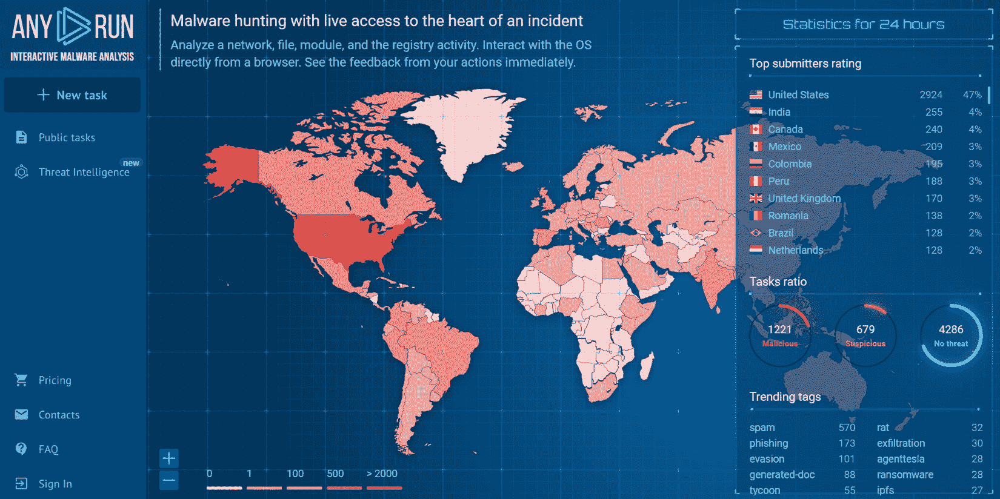

图 1.15 – Any.Run 恶意软件分析主页

虽然 Kali Purple 提供了许多防御安全工具，但 SIEM 似乎最初吸引了大多数人来到这个平台，因为现在用户有了一个单一的系统，在这个系统中，进攻性安全（Kali Linux）和防御性安全可以主动监控和管理真实的安全事件，检测真实的威胁，并开始事件响应的过程——而且他们可以免费获取这一服务。

有时候，你会发现一个 SIEM 系统与 IDS 或 IPS 结合使用。为了有效地导航整个网络安全防御过程，我们在这里不做这种组合。我们已经谈过 Elastic Stack，并且通过添加一些代理等组件，它可以转换成一个完全功能的 SIEM——实际上我们将要这样做。现在，让我们来看一下 Kali Purple 包中的几个 IDS。稍后，我们将从 *进攻性安全* 部分借用一些概念，并将其应用于 Suricata 和/或 Zeek，以提供一个关于网络防御的实战案例。让我们来讨论 Suricata。

#### Suricata

Suricata 是一个开源产品，既可以作为 IDS（入侵检测系统）也可以作为 IPS（入侵防御系统）使用。它们之间有什么区别？很高兴你问了。区别就在于它们的定义本身。IDS 只做一件事——检测异常或潜在的恶意行为。它只负责这一点，不会对这种行为采取任何行动。它只是检测到后通知你。之所以这样做有其原因，我们稍后会讨论。IPS 同样会检测异常或潜在的恶意行为，但它会额外采取主动阻止或对该行为采取其他行动的步骤。

你可能会问：“*为什么我们不希望系统直接阻止这些行为，而是让我们自己去处理额外的工作？*”答案很简单，并不是所有看起来异常或恶意的行为都是恶意的！这些类型的警报被称为误报，在网络安全领域中非常常见。它们如此常见，以至于有一个专门的术语来描述处理这些警报的疲劳感——警报疲劳。一个正确设置的 IPS 会减少警报疲劳。然而，它也可能会阻止或屏蔽一些真实的、无害的活动，这同样是不好的一件事。记得 CIA 三元组吗？记得我们讨论过 *A* 是最容易被误解的部分吗？阻止本应有效的活动可能会对组织的运营造成的损害，甚至比未能阻止恶意活动更大。在某些组织中，这是一个非问题，错误地阻止无害活动几乎不会对它们造成任何影响。因此，IDS 和 IPS 技术同时存在，你需要根据自己的情况选择合适的技术。Suricata 提供了这两种技术。

它是一个非常强大且高度可扩展的工具，用于分析网络流量中的可疑或恶意属性。它采用多线程性能方法，允许并行处理指令，使其能够高效处理高速网络流量。与 Wireshark 一样，Suricata 实时捕获网络数据包。不同的是，Suricata 自动分析这些数据包，包括头部和有效载荷，并根据此分析做出警报判断。默认情况下，它设计用于向用户发出警报，指示符合利用、恶意软件、政策违规以及异常或可疑行为的网络入侵事件。当然，Suricata 还可以执行 Wireshark 的常规协议分析功能，包括 HTTP、DNS、FTP、SMTP 等，这些功能有助于检测可能专门针对特定协议的攻击。

它使用两种主要的检测方式：基于签名和基于异常的检测。通过签名检测，Suricata 将网络流量与预定义的规则或模式（称为签名）进行匹配，以帮助识别已知威胁。通过异常检测，Suricata 首先建立正常网络行为的基准，然后每当有任何偏离该基准的情况发生时，就会发出警报。

Suricata 可以与威胁情报源集成，这是任何值得信赖的 IDS/IPS 解决方案的一个不成文要求。这些情报源可以是外部公共数据流，也可以是内部维护的威胁数据流。这些数据流极大地帮助系统识别新兴威胁，从而整体提升检测能力。

#### Zeek

Zeek（前身为 Bro）不是一个完整的 IDS 产品。然而，它包含了允许其充当 IDS 的特性和功能。默认情况下，Zeek 是一个用于监控和分析网络流量的网络分析框架。就像本章中 *进攻性安全* 和 *防御性安全* 部分提到的其他一些工具一样，Zeek 实时捕获和分析网络数据包，并试图提取关于协议、活动连接和整体行为的有用信息。除了其他工具也提供的协议分析功能外，Zeek 更加关注连接细节和文件传输信息。在功能上，它可能被描述为 Wireshark 和 Suricata 的混合体。

它允许用户使用其脚本语言，赋予他们创建自定义规则和策略的能力，以类似入侵检测系统（IDS）方式进行警报。然而，这比许多现成的*IDS 解决方案*更为繁琐。尽管如此，这可能对那些希望在进入网络安全工程方向之前发展或提升技能的网络安全分析师提供价值。Zeek 的另一个 IDS 特性是其事件驱动模型。事件基于网络活动生成，为监控和分析提供了一个灵活且可定制的框架。

虽然这些检测、预防、日志记录和警报产品是精心设计的 SOC（安全运营中心）的核心工具，但有时分析师需要手动检查特定场景中的流量，以确定警报是否为真正的或误报。这有助于团队微调检测和日志记录规则，从而减少未来不必要的警报，避免警报疲劳。Kali Purple 在其发行版中提供了此类工具。

#### Arkime

Arkime——前身为 Moloch——就是这样一款工具。它是一款端到端流量分析应用，旨在捕获大量的网络数据包信息并将其编入索引，以供分析师手动探索。它提供实时搜索/查询、自定义仪表板以及多种高级数据分析功能。像大多数流量分析工具一样，Arkime 主要用于网络安全监控、事件响应和数据分析。它的特点是处理大量的网络信息。

该应用程序支持多种数据包捕获方法，包括被动监听、**数据包捕获**（**PCAP**）文件导入，甚至通过网络**测试接入点**（**TAPs**）进行直接捕获。PCAP 文件是一种标准化文件格式，广泛被如 Wireshark 等数据包捕获工具所接受。TAP 通常是—但并非总是—一种硬件设备，提供了一种让分析师通过复制经过网络链路的数据来监控网络流量的方式。该功能的软件版本被称为**虚拟 TAP**（**vTAPs**）。这些虚拟 TAP 允许原始流量不受干扰地传输。TAP 通常被放置在交换机和路由器等网络设备之间。虽然 Arkime 本身不提供 vTAP，但它已设置好与此类软件应用程序的集成。

Arkime 还提供了先进的搜索功能，包括跨所有已编索引字段、数据包负载和元数据的搜索，支持正则表达式、范围搜索和上下文查询。

每当一个应用程序提供高级查询功能时，最好还提供方式让用户根据自己的需求以最适合的方式呈现这些信息。这将帮助用户与应用程序建立联系，并自然地形成舒适的使用体验。Arkime 通过允许自定义仪表板来实现这一目标，这样操作员可以个性化显示网络数据，专注于当时对用户最有价值的数据。

Arkime 的架构还支持插件，使其操作员能够扩展其功能。与大多数提供此功能的大型软件应用程序类似——例如 Burp Suite——Arkime 用户社区已经开发了各种插件，支持额外的分析、与外部工具的集成、以及自定义功能，并将这些预构建的插件提供给其他 Arkime 操作员使用。我们将在 *第六章*开始时更详细地探讨这个应用程序。

#### Malcolm

Malcom 是一个类似的流量分析工具，特别专注于网络流量的可视化。除了提供 Arkime 提供的网络监控功能，Malcom 还广泛用于威胁猎杀、文件提取和元数据提取，使其在其他网络分析工具中拥有独特的优势。尽管以简洁著称，Malcom 的亮点在于其从网络流量中提取和分析文件的能力。在 Malcom 中，这是一项自动化功能。

它还通过允许多个用户在同一调查中协作，提供作为协作工具的支持，具备共享和评论捕获数据的功能。这项功能在流量分析工具中并不常见，并为 SOC 团队选择 Malcolm 而非其他流量分析工具提供了有力的理由，因为它支持与事件响应和分析的实时协作。

如你所见，Kali Purple 提供了一整套强大的防御安全工具。它们主要基于 ELK 堆栈构建，我们将在 *第二章*中详细介绍。当集成我们讨论过的 IDS 工具，如 Suricata 或 Zeek 时，整个工具集开始形成支撑我们安全态势的 SOC。这正是 Kali Purple 的全部目的，这也是 Kali Purple 创建的原因！

# 总结

在本章中，我们发现了一套坚实的行动和知识基础，这些为我们今天所见的网络安全阶段奠定了基础。我们能够跟随一段简短的安全发展史和事件，揭示了如今企业所需的保护需求。在此过程中，我们考察了 Stuxnet，这是世界上第一次将现代计算技术用于武器化和网络战争的案例。随后，我们研究了 2013 年 Target 公司遭受的网络攻击，了解了这两次攻击如何推动了本书后续章节中所涉及技术的发展。

在我们浏览了 Kali Purple 分发版中包含的红队和蓝队工具，或可以添加到其中的工具后，我们开始拼凑出一个全面的网络安全系统的完整图景。我们能够开始看到 Kali Purple 的更大潜力，并观察到它逐渐发展成为一个全面的*一站式商店*，能够为商业安全解决方案、分析师培训以及概念验证提供极高的通用性。

现在拥有了扎实的基础知识，我们将在下一章中开始深入探讨这个*SOC 一体化*，稍微了解一下 Kali Linux，并重点关注 Kali Purple 中可能是最受期待和最受欢迎的功能——SIEM。

# 问题

回答以下问题以测试你对本章的理解：

1.  什么是 SOC？

    1.  特殊行动指挥部

    1.  操作行为标准

    1.  安全运营中心

    1.  一块穿在脚上的布

1.  Hydra 和 John the Ripper 的主要区别是什么？

    1.  Hydra 的重点是从哈希列表中破解密码，而 John the Ripper 则专注于通过网络应用进行暴力破解

    1.  John the Ripper 的重点是从哈希列表中破解密码，而 Hydra 则专注于通过网络应用进行暴力破解

    1.  Hydra 有多个头，而 John the Ripper 只有一个

    1.  以上全部

    1.  以上都不是

1.  被认为拥有顶级安全性的缺点是什么？

    1.  你会成为对手的目标，他们试图证明自己的实力

    1.  你的安全预算过高

    1.  你被保护得如此严密，连你自己的母亲都无法联系到你

    1.  每个人都期望你分享你的秘密

1.  哪种口袋大小的工具被用来对伊朗的核浓缩计划进行破坏？

    1.  瑞士军刀

    1.  丁烷打火机

    1.  回形针

    1.  USB 闪存驱动器

1.  当 SIEM 将新获得的数据与现有的数据源结合时，这被称为什么？

    1.  数据损坏

    1.  数据增强

    1.  数据污染

    1.  混乱的局面

1.  CIA 三角理论代表机密性、完整性和 _______________。

    1.  可用性

    1.  可访问性

    1.  责任

    1.  可假设性

1.  哪个操作系统是第一款成功的、与桌面个人计算机一起发布的大众市场操作系统？

    1.  林纳斯·托瓦兹的 Linux

    1.  微软的 Windows

    1.  托普森和里奇的 Unix

    1.  苹果的 MacIntosh

1.  在 Elastic、Arkime 和其他工具中，哪个应用功能允许用户自定义信息的呈现方式？

    1.  图形用户界面 (GUI)

    1.  动态规则集

    1.  仪表盘

    1.  白板

# 深入阅读

要了解本章中涉及的主题，请查看以下资源：

+   **Kali Linux 和 Kali Purple 发布** **页面**: [`www.kali.org/blog/kali-linux-2023-1-release/`](https://www.kali.org/blog/kali-linux-2023-1-release/)

+   **NIST 网络安全** **框架**: [`www.nist.gov/cyberframework`](https://www.nist.gov/cyberframework)

+   **Metasploit Framework 主页** **页面**: [`www.metasploit.com/`](https://www.metasploit.com/)

+   *精通 Kali Linux 高级渗透测试：使用 Metasploit、Nmap、Wireshark 和 Burp Suite 成为网络安全道德黑客专家，第 4 版*，作者：Vijay Kumar Velu: [`www.amazon.com/Mastering-Linux-Advanced-Penetration-Testing/dp/1801819777/ref=nav_custrec_signin?crid=2OKNCSTWE085&keywords=kali+purple&qid=1694494113 &s=books&sprefix=kali+purple%2Cstripbooks%2C134&sr=1-1&`](https://www.amazon.com/Mastering-Linux-Advanced-Penetration-Testing/dp/1801819777/ref=nav_custrec_signin?crid=2OKNCSTWE085&keywords=kali+purple&qid=1694494113&s=books&sprefix=kali+purple%2Cstripbooks%2C134&sr=1-1&)
