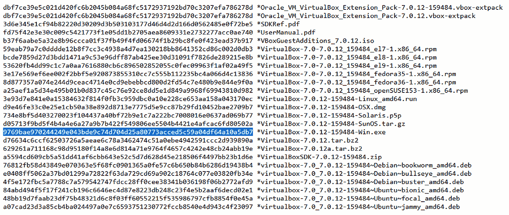
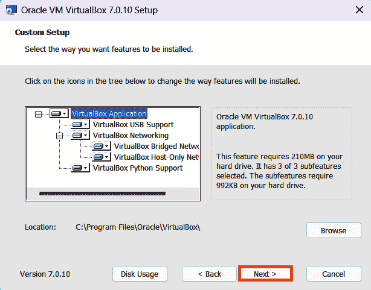
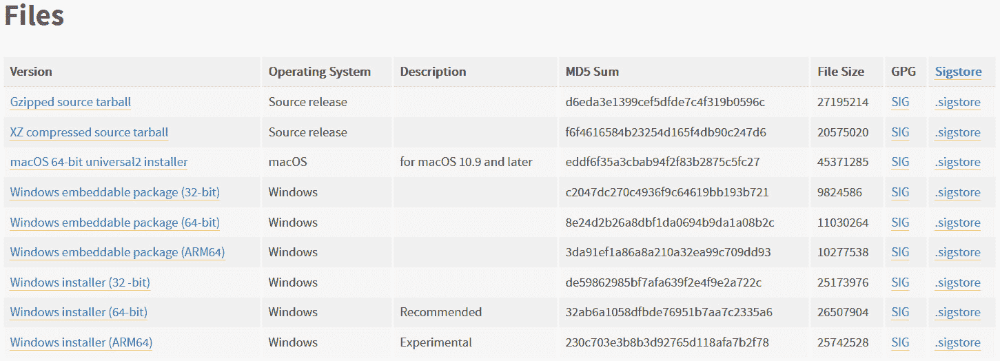
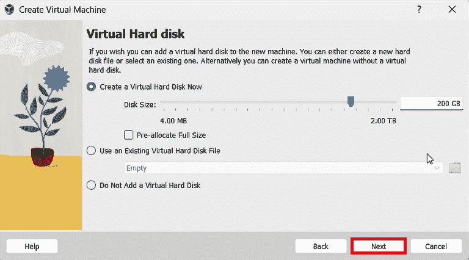
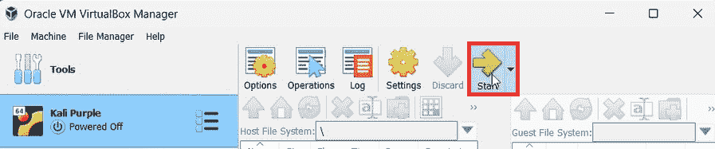
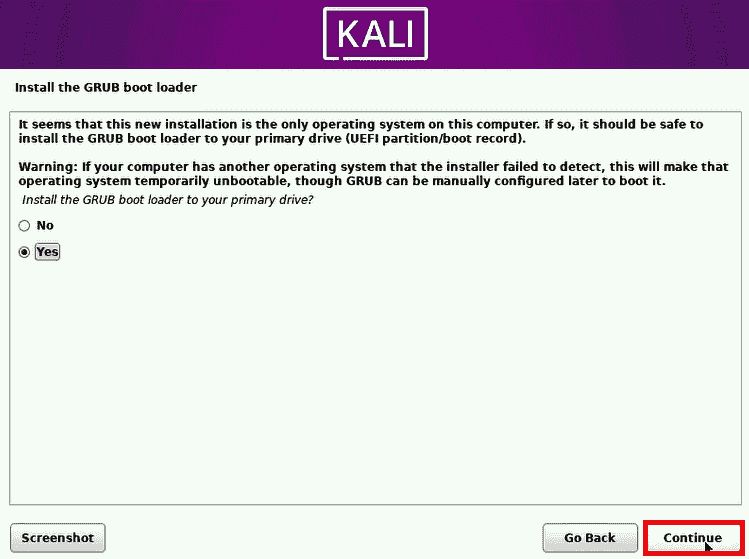
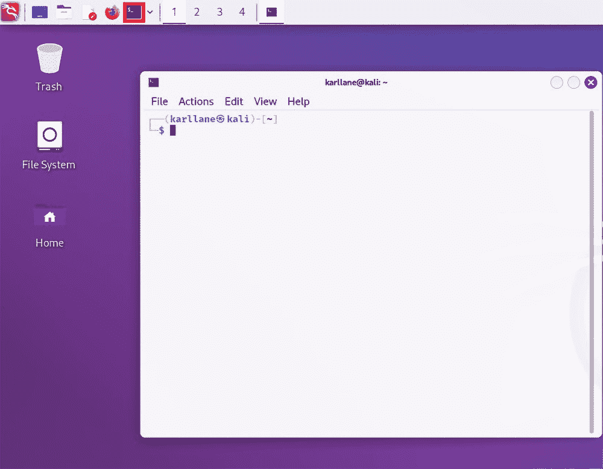

# 第三章：安装 Kali Purple Linux 环境

到目前为止，我们已经了解了世界事件如何影响网络安全概念的演变，导致了 Kali Purple 及其他防御性安全软件包的诞生。我们已经初步接触了 ELK Stack，它作为 SIEM 的核心组件，而 SIEM 又是 SOC 的核心组件，SOC 本身又是 Kali Purple 的核心组成部分。怎么样，我们开始组建我们一直在大肆赞扬的“环境”吧？让我们动手吧！

本章将引导你准备个人技术设备，以托管和运行我们自己的 Kali Purple 实例。虽然我们所涵盖的部分内容看起来可能随意，但它们是按照有目的和战略性的顺序呈现给你的。强烈建议你按照这个顺序操作，以确保顺利准备好你的技术设备。请放心，我们的“疯狂”是有方法的，随着我们操作的进行，过程会一步步解释为什么这样做。我们将在本章中主要涵盖以下部分：

+   获取 Kali Purple 发行版

+   安装**虚拟** **机** (**VM**)

+   安装 Kali Purple

+   安装 Java **软件开发** **工具包** (**SDK**)

由于人们使用各种个人计算设备，我们将覆盖多种情况，为 Windows、Mac 和 Linux 主机提供安装指南。虽然有其他与 Kali Linux 竞争的渗透测试和进攻性安全工具，但在写作时，只有 Kali 提供如此全面的防御性网络安全工具（100 多种），并且这些工具是建立在其进攻性套件之上的。然而，本章仅讨论 Kali Purple 操作系统的获取和安装。根据你使用的操作系统，获取和安装适当应用程序的方式有所不同。如有必要，我们将提供有关用户在设置 Kali Purple 环境过程中可能遇到的常见问题的见解，并在需要时提供解决方案。

了解 Kali Purple 是为了适应网络安全分析师的思维方式，无论是进攻性还是防守性，这一点非常重要。成为任何领域的真正分析师意味着培养独立的研究、思考和解决问题的能力。如果你还不确定自己是否已经达到了这种水平，不用担心！我们将在整个过程中提供指导，并在章节末提供资源来帮助你。

到本章结束时，你应该拥有一个完全功能的 Kali Purple 环境，里面配备了我们已经讨论过的许多工具——以及我们尚未讨论的一堆工具——并且准备好填充本书其余部分讨论的其他功能。如果你愿意，你还可以将这个章节作为参考点，帮助他人设置他们的 Kali Purple 环境。

# 技术要求

本章节的技术要求如下：

+   **最低要求**：应为带有 *amd64 (x86_64/64 位)* 或 *i386 (x86/32 位)* 架构的计算设备。Kali 推荐选择 *amd64* 选项。系统应至少包含 *2 GB* 的内存和 *20 GB* 的硬盘空间。然而，Kali Linux 中的一些工具会占用大量资源；Burp Suite 就是其中之一。Kali 安装页面 [`www.kali.org/docs/installation/hard-disk-install/`](https://www.kali.org/docs/installation/hard-disk-install/) 推荐如果打算使用这些应用程序，内存最好为 *8 GB*。

+   **推荐**：网络安全领域的从业者建议，您应选择 *amd64 (x86_64/64 位)* 架构，内存建议为 *8 GB*——如果可能的话，更多内存更好——以及最多 *200 GB* 的硬盘空间。如果你没有这些资源，也不用担心。只要满足最低要求，学习和体验 Kali Purple 是没问题的。

虽然在某些情况下，Kali Purple 的安装要求可能比这些小，但我们写这本书并不是为了折磨你——推荐的要求将涵盖本书中的大多数场景。和所有技术一样，Kali Purple 的要求实际上是“需求越多，效果越好”。

# 获取 Kali Purple 发行版

设置 Kali Purple 环境的第一步是获取 Kali Purple 本身。如果你已经在 Kali Linux 系统中工作，那么这一部分对你来说不必要。如果适用于你，可以直接跳到*安装 Kali Purple*部分，在那里你可以了解如何在 Kali Linux 环境中获取 Purple 框架。如果不适用，或者你想亲自体验这个过程，继续往下阅读。

首先我们将下载并安装合并版的 Kali Linux 和 Purple 框架。因为一些虚拟机安装，包括我们将作为示例使用的 VirtualBox，会同时安装虚拟机、Kali Linux 和 Purple 框架，这样可以节省大量时间。

在此之前，让我们回顾一下 CIA 三原则。毕竟，Kali Purple 的目的是为了安全！所以，从一开始我们就要养成智能的安全习惯。在这里，我们将使用 CIA 三原则中的“I”——完整性。这里所说的完整性，意味着我们期望的数据从其来源到达我们的设备时没有任何改变。我们可以通过比较哈希值来法医确认这一点。我们下载的应用包会在下载时被分配一个哈希值。我们将演示如何找到该哈希值、记录它，然后在下载后重新计算并与之进行比较。

如果你愿意，可以现在就备份你的系统或创建还原点，或者等到你下载完文件后再进行。无论你选择哪种方式，都要确保在进行任何需要分区或修改系统的安装或活动之前，先进行适当的备份*。

## Linux 备份

Linux 有许多备份选项。由于 Linux 的强大和灵活性体现在命令行上，下面我们将提供相关的命令行操作。首先，你可能需要考虑压缩文件，以节省空间并便于传输到备份介质。

要压缩文件，请输入以下命令：

```
tar -czvf backup.tar.gz /<path_to_file_needing_backup>/
```

压缩后，你可以使用**rsync**来备份文件。输入以下命令：

```
rsync -avzh /<path_to_original_source>/<path_to_backup-medium>/
```

## Windows 备份

决定你希望用什么介质来备份设备。如果是外部硬盘等物理设备，准备好并将其插入设备。你的机器应该能识别设备并通知你设备的位置。如果是网络设备，记下其位置，以便知道在哪里告诉备份软件处理你的请求。多年来，Windows 改变了提供备份选项的方式。通常，你可以打开开始菜单，在搜索栏中输入**备份**和**恢复**。然后按照提示操作。或者，你可以选择**开始** | **设置**，在搜索栏中输入**恢复**，然后选择**创建还原点**。

## macOS 备份

决定你的备份介质。插入你的备份设备并按照屏幕上的提示操作。如果没有提示，你可以使用 Time Machine 来备份你的设备。进入**系统偏好设置**，点击苹果菜单 | **系统偏好设置** | **Time Machine**。进入**Time Machine 偏好设置**面板后，点击**选择备份磁盘**，然后选择你希望备份到的磁盘。确保通过切换开关启用 Time Machine。

让我们开始吧。当第一次下载一个软件包时，最明智的做法是获取最新的稳定版本。例外情况是，如果您是经过培训和/或有经验的测试人员，且拥有受保护的环境（比如沙箱）来部署该应用程序。**沙箱**是您系统中的一个隔离部分，它模拟完整的系统并隔离进程。它限制资源和与底层系统的交互，因此在其虚拟容器中执行的任何恶意或损坏的软件理论上不会对实际机器造成危害。然而，我们并不是在做测试，所以我们还是选择最新的稳定版本。要获取最新稳定的 Kali Purple，请打开您的网页浏览器，输入地址 [`www.kali.org/`](https://www.kali.org/)，当页面加载完成后，选择顶部导航栏中的**Get Kali**，或者如果有的话，选择**Download**链接。这两个链接都在*图 3.1*中被高亮显示，并且都会带您到同一个地方。

选择一个高亮显示的链接以获取 Kali Purple 发行版：


图 3.1 – Kali Linux 主页

当新页面加载完成后，点击后缓慢向下滚动，直到看到标有**Kali Purple**的部分，并找到它下方标有**Recommended**的方块。它应该是左侧的方块，如*图 3.2*所示。

下载方块上有两个操作步骤：


图 3.2 – Kali Purple 下载方块

*图 3.2* 中高亮显示的两个字段是我们需要操作的部分。首先，返回浏览器并点击被高亮的**sum**框。点击后，图像会翻转，并为您提供 Kali Purple 发行版的 SHA-256 哈希值。您需要复制并粘贴此值；或者，将此哈希值记录到一个您可以轻松引用的位置，便于下载 Kali Purple 后使用。

记录下 SHA-256 哈希值，以便在下载后进行对比：


图 3.3 – Kali Purple 下载的 SHA256 哈希值

记住，哈希值是一种单向数学运算。它是一个固定大小的字母数字值，通过从计算机输入（如果你愿意，可以理解为一个*消息*）并应用一种先进的算法来生成，最终得到唯一且固定大小的输出。它的设计目的是，即使是最微小的变化——哪怕是单个 1 或 0——也会导致生成的哈希值与原始值有显著不同。

比如，我们来看以下语句 – *I love* *Packt Publishing.*

那个语句的 SHA-256 哈希值如下：

```
2771187E06ECFAAA0B343D9C6808C503923DAF5323477B8B0BC0F39FEEF74CFA
```

现在，让我们来更改这个字符串，只需将句号替换为感叹号 – *I love* *Packt Publishing!*

该语句的 SHA-256 哈希值变成了以下内容：

```
3491BDDE067911CA8ACE3B1E8319A9A7817356008498C92E195B9B412D5452F2
```

请注意，这两个值看起来完全不同。输出的长度始终是相同的。如果我们仅保留品牌名称 *Packt*，就可以看到这一点。

我们得到了一个新的 SHA-256 哈希值，其长度与其他哈希值完全相同：

```
2D4CCDC3F62901AAD8A6D65B02C1D9F48EA83913209DD41AB5F3EC6F83BECDA9
```

你可以使用其他类型的哈希算法，但如果你从事或希望从事网络安全工作，最应该熟悉的两种哈希算法是我们之前使用的**消息摘要算法 5**（**MD5**）和**安全哈希算法 256**（**SHA-256**）。这两种哈希算法是你在实际操作中最可能遇到的。

注意

哈希值是如此可靠，以至于它们经常作为科学证据出现在美国法律系统中，在法庭程序中用于证明犯罪或非犯罪活动。哈希值可以用于确定证据在审判中的可采性。它也是数字取证中的关键工具，并且在最复杂的网络犯罪调查中发挥重要作用。**联邦调查局**（**FBI**）定期使用哈希值帮助解决犯罪案件。请查看*进一步阅读*部分的链接，了解该机构如何在**隐私影响评估**（**PIA**）、**儿童受害者识别程序**（**CVIP**）和**无辜图像国家倡议**（**IINI**）中使用哈希值。

记录哈希值后，返回浏览器，点击在图块左下角显示的下载图标（在*图 3.2*中红色标出）开始下载 Kali Purple **.iso** 文件。根据你使用的浏览器，你应该能在右上角看到一个弹出框，类似于*图 3.4*中的图像，确认**.iso** 文件正在下载中。

在浏览器的右上角查看活动下载框：


图 3.4 – Kali Purple .iso 镜像下载

在本节中，每当你在文件路径中看到**username**这个词时，你应该假设你需要将这个文本替换为该计算环境中的实际用户名。例如，通过将**username**替换为以下文件路径中用户的实际用户名，**.iso**文件将根据你使用的操作系统，位于以下位置之一：

| **操作系统** | **位置** |
| --- | --- |
| Linux | **/****home/username/Downloads** |
| Mac | **/****Users/username/Downloads** |
| Windows | **C:\Users\username\Downloads** |

表 3.1 – 各操作系统的默认下载文件路径

下载完成后，你有多种选项可以继续操作，但在继续之前，我们首先验证哈希值并将其与我们从网站上记录的哈希值进行对比。我们并不假设你的技术水平，所以我们会保持简单，你可以在自己准备好之后，随时探索快捷方式和其他替代方法。与此同时，我们先打开一个命令行工具，并导航到下载文件所在的文件夹。

## Linux

首先，打开一个终端窗口。从那里，输入**Bash**以打开命令行界面。**Bash**代表**Bourne Again Shell**，是 Linux 用户最常用的命令终端。接着，在命令提示符下输入**cd ~/Downloads**以进入文件夹。**cd**代表**change directory**，键盘左上角的波浪符号（~）表示主目录。这使你能够快速导航到另一个目录，无论当前路径是什么。

你可以通过两种方式确认自己是否在正确的目录中。首先，输入**pwd**，它代表**print working directory**。这将显示绝对路径，在本例中应该是**/home/username/Downloads**。第二种方式是输入**ls**，它代表**list**。你应该能看到一个名为**kali-linux-2023.3-installer-purple-amd64.iso**或类似的文件。如果文件存在，那么输入**sha256sum kali-linux-2023.3-installer-purple-amd64.iso**，如果文件名与这里提供的不一样，记得替换成你的 Kali Purple 下载文件的准确文件名。结果将在下一行显示，应该类似于**e3e977a8f99622be55365cb9c21dc7f6e625827cea85233cea2cc04ac09eee3e**，并且它应该与下载 Kali Purple 时记录的哈希值逐字匹配。

## Mac

打开**应用程序**文件夹，然后打开**实用工具**文件夹。在这里，选择并打开终端窗口。与 Linux 相同，输入**cd ~/Downloads**以进入文件所在位置。您也可以通过输入**pwd**来验证文件路径，但由于这是 Mac，绝对路径的显示方式与 Linux 稍有不同。在这种情况下，它应该是**/Users/username/Downloads**。使用**ls**列出命令可以显示目录内容，在其中查找您下载的**.iso**文件。与 Linux 稍有不同，要获取下载文件的哈希值，输入**shasum -a 256 kali-linux-2023.3-installer-purple-amd64.iso**，如果文件名不同，请替换为实际的文件名。如果在本书印刷后但您阅读之前 Kali Linux 发布了 Kali Purple 的更新版本，则文件名可能不同。与 Linux 一样，结果应该类似于**e3e977a8f99622be55365cb9c21dc7f6e625827cea85233cea2cc04ac09eee3e**，并且应该与您在下载 Kali Purple 之前记录的哈希值一一对应。再次强调，如果发布了更新版本的 Kali Purple，这个值会不同。然而，不变的是，这个值应该与网站下载位置上呈现的哈希值匹配。

## Windows

Windows 提供了两种获取文件哈希值的基本方法。一种是通过命令提示符，另一种是通过一种强大的自动化和脚本工具——PowerShell。PowerShell 的具体细节超出了本书的范围，但作为一名网络安全专业人员，您最终会希望花时间去研究并学习它。微软在他们的学习平台上提供了免费的入门培训，您可以在本章末的*进一步阅读*部分找到该培训的链接。

让我们从命令提示符开始。按下*Windows*键，在弹出的窗口中，在搜索栏输入**cmd**。选择显示的**命令提示符**应用程序。与 Linux 和 Mac 不同，Windows 提供了一个非常方便的小快捷方式，可以直接进入**下载**文件夹，无需知道当前登录的用户名。如果您的**下载**文件夹位于 Windows 默认位置，您可以使用以下命令。只需输入**cd %USERPROFILE%\Downloads**，系统将直接带您进入当前登录用户的**下载**文件夹。进入后，输入**dir**以查看目录内容，并查找您下载的 Kali Purple **.iso**文件。要获取文件的 SHA-256 哈希值，输入**CertUtil -hashfile kali-linux-2023.3-installer-purple-amd64.iso SHA256**并按*Enter*键。哈希值应该返回**e3e977a8f99622be55365cb9c21dc7f6e625827cea85233cea2cc04ac09eee3e**，但关键是，无论返回什么，它都应该与您在下载网站上记录的哈希值一致。

第二种方法涉及前面提到的 PowerShell。要启动 PowerShell，按下*Windows*键并在搜索栏中输入**PowerShell**。然后，点击出现的应用程序，就像命令提示符一样，PowerShell 中也有快捷方式可以直接进入**下载**文件夹。输入**cd $HOME\Downloads**来进入**.iso**文件所在的文件夹。接着，输入**dir**确认所需的文件是否在该文件夹中。要获取文件的哈希值，输入**Get-FileHash -Algorithm SHA256 -Path kali-linux-2023.3-installer-purple-amd64.iso**，这应该返回与之前显示的哈希值相同，或者至少与下载位置提供的值匹配。此外，PowerShell 还提供了在未进入**下载**文件夹的情况下直接获取文件的能力，只要你知道文件路径并记录了要计算哈希的文件名。在这种情况下，你可以在打开 PowerShell 工具后立即输入以下命令——**Get-FileHash -Algorithm SHA256 -Path C:\Users\username\Downloads\kali-linux-2023.3-installer-purple-amd64.iso**。然后，查看是否得到了与前一步相同的结果。

一旦下载的完整性和成功性得到确认，我们需要考虑是否将该文件转移到磁盘或 USB 驱动器上，并且在对 Kali Purple 进行下载或安装虚拟机之前，我们需要先备份设备。我们本可以在下载 Kali Purple 之前就备份设备，但由于我们尚未这么做，而且已经确认了下载的完整性，现在备份设备将保留下载文件，以防我们以后需要恢复到这个状态。

一旦我们的所有数据都已备份，我们可以选择将 Kali Purple 的**.iso**文件复制到 USB 闪存驱动器或外部硬盘驱动器上，以便携带，特别是如果我们有多个设备需要安装操作系统的话。当然，如果我们希望在大型企业网络中使用此系统，也有方法可以推送这样的安装。然而，执行此操作所需的网络知识和技能超出了*Kali Purple 简介*的范围。此外，重要的是要记住，这个发行版包含了高级渗透测试工具，这些工具可能不是在整个组织中广泛分发的最安全的选项。更合理的做法是将这套工具高度限制在组织内一小部分经过培训的专业人士手中。

现在我们已经获取了 Kali Purple 并备份了设备，是时候考虑如何运行它以便正确安装了。需要注意的是，Kali Purple 是一个非常强大的工具套件，如果落入不法分子之手，可能会造成严重甚至犯罪性的损害。我们应当将其严格保护，只在精心管理的环境中运行，以便在必要时能迅速响应。建立这种环境的最佳选择是使用一种伪沙箱类型的虚拟机（VM）。即使主机系统已经是 Linux 系统，建议也在虚拟机中运行 Kali Purple，我们将在下一节中讲解如何建立虚拟机。

# 虚拟机的安装

在这一节中，我们将专注于安全地隔离设备操作系统的一部分，并将其单独设置，只用于运行 Kali Purple。这种隔离将使你能够访问运行 Kali Purple 所需的资源，而不会对底层操作系统造成不良影响，后者我们今后将称之为主机系统。这种隔离通常被称为虚拟机，我们有很多选项可以用来设置虚拟机。

虚拟机有助于提供一个受控的环境，如果我们在任何时候犯错，它可以确保我们能够迅速恢复并重新开始，而不会对主机造成损害。它还可以隔离潜在的网络威胁，如果它们真的发生，防止其他不良后果。虚拟机之所以叫这个名字，是因为它们所创建的独立实例被认为是虚拟的，如果不是迷你版的话，基本上就是主机系统的副本。虚拟机中的一切，都是虚拟机内的事。

虚拟机（VM）是通过虚拟化软件（如 VMware 或 VirtualBox）进行设置和配置的。虽然在设备上安装多个虚拟化软件应用程序不一定是坏事，但它可能会带来一些不必要的挑战，例如竞争计算机资源、兼容性问题和软件冲突。这些问题是我们在开发 Kali Purple 技能时不希望遇到的。因此，我们将花些时间检查系统上是否已经安装了任何虚拟化软件。

如果你当前正在使用 Linux 系统，找到并打开一个命令终端，输入**lsmod | grep kvm**来检查**基于内核的虚拟机**（**KVM**）模块是否已加载。如果有任何输出返回，那么你就知道 KVM 确实已经安装并且可以使用。另一种方法是输入**virt-what**命令，这个命令会检查系统是否存在多种虚拟化技术，如果有的话，会返回这些技术的相关信息。如果你的 Linux 版本属于 Debian 系列（如 Kali Linux），可以输入**dpkg -l | grep virtual**；如果你的版本属于 Red Hat 系列，可以输入**rpm -qa | grep virtual**来搜索与虚拟化相关的包，并显示系统中已成功安装的结果。

如果你是在使用 macOS 体验 Kali Purple，可以直接打开 Finder 中的**应用程序**文件夹，查找**VMware Fusion**、**Parallels Desktop**和**VirtualBox**。虽然还有其他与 Mac 兼容的虚拟化软件平台，但它们并不适合托管 Kali Purple，并且很可能与这三款主要平台所需的资源发生冲突。如果你看到了这三款软件，那么说明你的 Mac 上已经安装了虚拟化软件。

对于 Windows 用户，按下你的*Windows*键并输入**hyper-v manager**。如果搜索结果中出现 Hyper-V 管理器，那么说明你的设备上已经安装了虚拟化软件，这通常是最可能的情况。你还可以搜索**VirtualBox**、**VMWare**、**Parallels**和**QEMU**。

在这些情况下，潜在的虚拟化软件列表只是最常见、最流行和最可能安装的软件的概述。你可以进一步采取额外步骤，打开搜索引擎，进行关于与你特定操作系统和版本兼容的虚拟化软件的搜索/查询。然后，返回并使用我们刚才讨论过的方法深入挖掘。如果你发现设备上已安装虚拟化软件，接下来有几个事项你需要了解才能继续。

首先，你可以搜索相关的说明来移除设备上的软件，然后按照我们提供的示例（由于 VirtualBox 在 Linux、macOS 和 Windows 上具有广泛的兼容性，我们将使用 VirtualBox）安装新的虚拟化软件。请记住，可能已经存在虚拟机，你需要确保在卸载软件之前，不会删除你可能希望保留的内容。

然而，如果你决定保留现有的虚拟化软件，并且仅仅进行一些额外的搜索，了解如何使用现有软件设置新的虚拟机，那也不会太糟糕。很可能，搜索结果会给出足够简单的步骤，帮助你顺利完成设置，如果你选择这个路线的话。否则，我们将继续假设你没有虚拟化软件，并需要第一次获取和安装它。

注意

如果你的设备上没有任何已经建立虚拟化的证据，你需要确保在设备的 BIOS 或 UEFI 设置中启用了虚拟化。为此，你需要进行一次互联网搜索，查找你设备特定品牌和型号的按键信息，看看需要按哪个键才能进入这些设置。通常，它们是*Del*、*F2*、*F10*和*Esc*键中的一个。

一旦知道需要按哪个键，重启你的电脑，并在启动过程中反复按下该键。启动过程应该会暂停，BIOS 或 UEFI 菜单将加载出来。使用键盘上的箭头键浏览各个选项，寻找**CPU 配置**或**高级设置**字段。你也可以在重启之前搜索设备制造商提供的具体操作说明，帮助你顺利进入此过程。

在**CPU 配置**或**高级设置**中，寻找任何提到**虚拟化**、**VT-x**、**AMD-V**、**英特尔虚拟化技术**或类似术语的选项。你也可以在**处理器**、**安全性**和**系统配置**子菜单下寻找这些术语。找到并选择相关字段后，你可以通过按*+*或*-*键，或者有时按*Enter*键来启用或禁用虚拟化。完成后，确保保存设置——按*F10*键，或高亮保存按钮并按*Enter*。然后，退出 BIOS 或 UEFI 界面，允许设备重新启动。此时，虚拟化应已启用。

就像我们在下载 Kali Purple 时所做的一样，我们将首先将浏览器指向合适的下载位置，并获取校验和，即哈希值，之后我们会将其与下载的可执行文件的哈希值进行比较，确保它在下载过程中没有受到任何损害，完整性得以保证。

为此，打开你的浏览器，访问[`www.virtualbox.org/wiki/Downloads`](https://www.virtualbox.org/wiki/Downloads)。当你进入 VirtualBox 网站时，你会看到多种下载 VirtualBox 的选项，如*图 3.5*中的紫色框所示。我们将引导你完成整个过程，涵盖 Windows、macOS 和 Linux 之间的差异。你还可以看到两种获取校验和的选项，分别是 SHA-256 或 MD5 哈希值。由于 SHA-256 更加安全，我们将使用*图 3.5*中红色高亮显示的 SHA-256 哈希值：

VirtualBox 提供 Windows、macOS 和 Linux 的下载：


图 3.5 – VirtualBox 下载和校验和

选择**SHA256 校验和**链接以获取可能的哈希值列表，具体取决于您打算下载的包。虽然我们将覆盖每个 Windows、macOS 和 Linux 的最新稳定版的下载和安装过程，但我们将在此演示中使用 Windows 抓取必要的截图示例。最初虚拟机的核心吸引力之一是为 Windows 用户提供在 Windows 主机环境中运行 Linux 实例的能力。您的情况可能不同。没关系！我们将为每个三大操作系统的用户提供示例。

找到与您下载相对应的哈希值，并将其记录在某处：



图 3.6 – VirtualBox 哈希值

一旦您记录了哈希值，返回到主页，并根据您的操作系统找到适当的 VirtualBox 包。它将是框内突出显示的链接之一，如图 *3**.5* 所示。选择您的产品，并单击开始下载。根据您使用的系统和浏览器，您可能会看到一个进度跟踪器，例如在图 *3**.7* 中显示的 Firefox 浏览器下载跟踪器：


图 3.7 – Firefox 浏览器的下载进度

此条可以告诉您下载的状态和完成时间。如果它没有自动出现，通常可以通过查看浏览器右上角的国际符号来手动调用它。这个符号以向下指的箭头为特征，并在其下方有一条直的水平线。如果没有下载符号，您可能会发现三个水平点，就像 Microsoft 的 Edge 浏览器一样，如果您点击它们，将会出现一个显示下载符号及其后面带有**Downloads**的菜单。或者，您可以简单地等几分钟，然后导航到我们在前一节中讨论过的**Downloads**文件夹，以查找 VirtualBox 可执行文件。这不是一个坏主意，因为在下载完成后，您将想要去那里获取文件的哈希值。

一旦您确信 VirtualBox（或其他虚拟化软件，针对您这些叛逆者）已经完成下载，您将希望验证下载的哈希值与您从网站记录的哈希值匹配。

注意

非常重要的是，您不要让自己受到诱惑，跳过比较和验证此或 Kali Purple 下载和安装过程中的任何其他部分的哈希值的步骤。请记住，您即将安装和配置一套非常强大的安全软件套件，其中包含非常强大的工具。

最后你希望了解的是，在下载过程中，有人能够劫持你的下载并将其替换为一个带有后门的克隆版本，让他们利用你系统的强大工具进行网络犯罪，而所有的证据都指向你！比较哈希值可以防止这种情况发生。如果包中的一位比特信息发生变化，哈希值就会不匹配。

然而，这并不意味着如果你的哈希值不匹配，就有人在针对你。最终下载的产品与原始版本不匹配有很多原因。可能只是因为某个地方的网络连接出现了问题，导致传输的数据被破坏了。

这也是检查哈希值的另一个原因。如果你尝试安装损坏的软件，任何事情都有可能发生。当然，它可能根本无法工作。它也可能在大多数情况下能够运行，但你可能会在投入大量精力配置软件后，发现一个至关重要的功能无法使用。你不希望因此而头痛不已，试图弄清楚问题出在哪里。

## Windows 用户

让我们看一下 Windows 的第一种方法：

1.  打开一个 **cmd** 终端窗口。

1.  输入 **cd %USERPROFILE%\Downloads**。

1.  输入 **dir** 并查找你下载的 VirtualBox 文件。

1.  输入 **CertUtil -hashfile <****filename> SHA256**。

1.  将结果与下载 VirtualBox 前记录的哈希值进行比较。

现在，让我们看一下 Windows 的第二种方法：

1.  打开一个 PowerShell 终端窗口。

1.  输入 **cd $HOME\Downloads**。

1.  输入 **dir** 并查找你下载的 VirtualBox 文件。

1.  输入 **Get-FileHash -Algorithm SHA256 -****Path <filename>**。

或者，按照以下步骤操作：

1.  打开一个 PowerShell 终端窗口。

1.  输入 **Get-FileHash -Algorithm SHA256 -****Path C:\Users\username\Downloads\<filename>**。

1.  将结果与下载 VirtualBox 前记录的哈希值进行比较。

## macOS 用户

让我们看一下 macOS 的步骤：

1.  打开一个终端窗口。

1.  输入 **cd ~/Downloads**。

1.  验证你是否在正确的位置：

    1.  输入 **pwd** 并查找 **/Users/username/Downloads** 文件路径。

    1.  输入 **ls** 并查找你下载的 VirtualBox 文件。

1.  输入 **shasum -a** **256 <filename>**。

1.  将结果与下载 VirtualBox 前记录的哈希值进行比较。

## Linux 用户

让我们看一下 Linux 的步骤：

1.  打开一个终端窗口。

1.  输入 **Bash** 打开命令行。

1.  输入 **cd ~/Downloads**。

1.  验证你是否在正确的位置：

    1.  输入 **pwd** 并查找 **/home/username/Downloads** 文件路径。

    1.  输入 **ls** 并查找你下载的 VirtualBox 文件。

1.  输入 **sha256sum <filename>** 文件路径为

1.  将结果与下载 VirtualBox 前记录的哈希值进行比较。

现在我们已经验证了 VirtualBox 安装程序的完整性，让我们开始安装吧！无论您使用的是哪个操作系统，安装过程通常都是一样的，只是在下载过程中会有一些细微的差异，我们刚刚已经介绍了下载和启动安装的步骤。之后，整个过程在所有系统中都是相同的。

## Linux VirtualBox 安装

您已经研究并确认了适合您特定 Linux 版本的下载文件。现在，您需要返回到命令行，通过 Bash 进入下载文件夹，就像您在验证哈希值时所做的那样。如果您使用的是 Linux，在此过程中，您大概已经知道，文件在执行之前需要赋予执行权限——也就是说，*执行*它们。由于我们已经在 **Downloads** 文件夹中，您可以通过键入 **chmod +x <filename>** 来设置这些权限，然后通过以下方式之一启动包文件：

+   **Debian/Ubuntu Linux**：键入 **sudo ./<filename>**

+   **CentOS/Fedora Linux**：键入 **sudo dnf install ./<filename>** 或 **sudo yum** **install ./<filename>**

+   **默认**：键入 **sudo apt** **install ./<filename>**

**Chmod** 代表 **change mode**，是指更改文件权限的模式。**Sudo** 代表 **superuser do**，基本上可以理解为，“像管理员给您下指令一样做这件事。”

命令行窗口会显示一长串文件正在解压并安装：


图 3.8 – Linux VirtualBox 安装

让我们继续进行 macOS VirtualBox 的安装。

## macOS VirtualBox 安装

在 macOS 中确认您的文件哈希值后，执行它非常简单——甚至比 Linux 更加方便！由于您已经在 **Downloads** 文件夹中，您只需键入文件名并按 *Enter* 键即可启动安装程序。如果您不再在 **Downloads** 文件夹中，仍然可以通过键入 **<filepath>/<filename>** 并按 *Enter* 键来执行文件。如果您是视觉型的人，喜欢通过图形界面启动安装程序，您可以按 **Command + Shift + L** 直接打开 **downloads** 文件夹，然后点击文件以启动它。

或者，您可以采取以下步骤：

1.  打开一个新的 Finder 窗口。

1.  点击左侧边栏中的 **Downloads**，它位于 **Favorites** 下。

1.  查看并点击您的安装文件以启动它。

让我们继续进行 Windows VirtualBox 的安装。

## Windows VirtualBox 安装

由于安装 VirtualBox 的过程几乎与操作系统无关，并且将 Linux 安装在虚拟机中的一个常见用途是运行 Windows 主机，因此我们将继续以这种方式进行剩余的操作步骤。

首先，通过点击任务栏中的图标（如果存在），在任务栏的搜索框中输入**文件资源管理器**，或点击**开始**并在**开始**搜索框中输入**文件资源管理器**来打开文件资源管理器。无论你选择哪种方式，它都会显示出来，你应该点击它，查看左侧窗格中的**下载**文件夹。找到你的 VirtualBox 安装文件并双击以启动安装。

你可能会收到一个弹出框，询问你是否允许该程序对你的设备进行更改。虽然这听起来可能让你感到害怕和有风险，但这是必要的。如果不允许 VirtualBox 对你的设备进行更改，它无法正确安装和运行。因此，选择并点击**是**。

在你允许它对设备进行更改后，**安装向导**将会出现：


图 3.9 – Oracle VirtualBox 安装向导

根据你阅读本文的时间，介绍安装向导的弹出框可能会显示不同版本号的 VirtualBox。这表明安装程序已更新版本，没问题！安装过程应该与之前一样正常。选择**下一步 >**，将呈现自定义设置选项。为了培训和学习目的，我们将接受默认推荐设置。选择**下一步 >**。

经验丰富的用户可以选择自定义安装选项：



图 3.10 – VirtualBox 自定义安装选项菜单

你可能会看到如*图 3.11*所示的某个警告，甚至是两个警告。如果是这样，请记住，这些只是警告，而不是错误。它们是常见的警告，不必过于担心。

**网络接口**警告意味着 VirtualBox 安装程序检测到与你的物理网络通信硬件相关的潜在冲突。如果安装程序发现有现有应用程序使用与 VirtualBox 打算使用的**互联网协议**（**IP**）或**媒体访问控制**（**MAC**）地址相同的地址，就会触发这个警告。在几乎所有情况下，这很可能是另一种类型的虚拟化软件。

虽然解决这些问题很重要，但这并不意味着你需要删除或卸载软件。你只需确保它被禁用，并且在你使用 VirtualBox 时不与其同时运行。为了继续安装，你需要确保任何当前的在线会话、虚拟机（VM）或**虚拟专用网络**（**VPN**）都已断开连接。记得保存好这些服务的登录凭据，并将它们记录在某个地方，因为大多数这些服务都是设置为自动运行和自动登录的。人们往往会忘记这些凭据。

**缺失依赖项 Python 核心** 错误意味着 VirtualBox 无法在系统上找到 Python 解释器。VirtualBox 依赖于 Python 来完成多个任务，例如运行脚本、管理虚拟机配置以及与 VirtualBox **应用程序编程接口** (**API**) 交互。要解决此错误，我们需要首先确认系统上是否已安装 Python，如果没有，则需要下载它。接下来，我们需要确保 Python 可执行文件已包含在系统的 **PATH** 环境变量中。由于修改 PATH 变量通常需要重启系统，因此我们将在本节末尾提供这些说明，以便你能够不中断地继续 VirtualBox 的安装。

即使看到这些错误，只要你记得在运行 VirtualBox 之前解决它们，点击跳过也是可以的：


图 3.11 – 常见的 VirtualBox 安装错误

为了解决此错误，首先查看 Python 如果安装在默认位置时的默认位置。

在 Windows 中，像你找到 VirtualBox 安装程序一样打开 **文件资源管理器**，但这次不是进入 **下载** 文件夹，而是查找 **C:\Python<version>** 文件夹，其中 **<version>** 代表一个版本号，比如 **3.9**。这表示安装的 Python 版本。如果看不到 Python 文件夹，只需在搜索栏中输入 **Python**，或者进入 **开始** 菜单并在该搜索栏中输入 **Python**。自动完成功能应该会告诉你 Python 是否已安装。

对于 macOS，导航到 **/Library/Frameworks/Python.framework/Versions/<version>/bin** 位置 —— 再次强调，**<version>** 代表一个数字值。如果没有找到文件，你可以点击菜单栏右上角的放大镜图标，或者按 *Command* + *Spacebar* 打开 Spotlight 应用程序。在出现的搜索框中输入 **Python**。

在 Linux 中，你很可能会在 **/usr/bin/python** 或 **/usr/local/bin/python** 目录下找到 Python 安装。

对于 macOS 和 Linux，你也可以打开命令终端并输入 **find / -name Python* -print**，其中星号代表通配符。该命令会搜索所有以 Python 开头并且其后跟随任何值的文件：


图 3.12 – 最新的 Python 版本

如果在系统上找不到 Python，你需要下载它。打开浏览器窗口，访问[`www.python.org/`](https://www.python.org/)，然后向下滚动，直到看到**下载**部分。选择最新版本进入下载页面。在下一页，滚动到底部，找到你需要的操作系统版本并记录相应的 MD5 哈希值。然后，下载并安装该产品到前面提到的默认位置。像 Kali Purple 和 VirtualBox 一样验证哈希值，继续此过程直到 Python 完全安装。你可能需要在此过程中中止 VirtualBox 安装并重新启动。

查找你的哈希值，记录下来，然后像安装 Kali Purple 和 VirtualBox 那样下载并安装 Python：



图 3.13 – Python 操作系统下载选项

一旦你找到了 Python 可执行文件的路径，无论是从系统中找到还是重新下载，都需要修改 PATH 环境变量。如果你下载了 Python，下载时会提供一个选项，自动为你设置 PATH 变量！下载并重启后回顾步骤，验证是否已经完成。如果出于某种原因，自动添加 PATH 变量未成功，按照以下说明进行操作。

## 在 Windows 中设置环境 PATH 变量

根据你的操作系统版本，某些项可能不会完全按照这里描述的显示。但请放心，它们仍然存在。你可能需要在显示屏上搜索它们。事件的顺序是一样的：

1.  在**开始**菜单中，右键点击**计算机** | **此电脑**或**系统**，选择**属性**。

1.  点击左侧的**高级系统设置**或在**设备规格**下。

1.  选择**高级**选项卡，点击**环境变量**。

1.  在**系统变量**下，选择**Path**，然后点击**编辑**。

1.  选择**新建**，然后添加 Python 可执行文件的路径。

1.  点击**确定**，然后重启系统。

1.  返回到你的 VirtualBox 安装。

## 在 macOS 或 Linux 中设置环境 PATH 变量

macOS 和 Linux 通常共享以下设置环境变量的指令：

1.  打开一个终端窗口，调用 Bash 或 Zsh。

1.  如果你使用的是 Bash，输入**~/.bashrc**，如果是 Zsh，输入**~/.zshrc**以打开配置文件。

1.  查找**PATH**环境变量——它以**export PATH=**开头，并添加一个冒号。

1.  在冒号后添加一个空格，然后输入 Python 可执行文件的路径（**/path/to/python**）。

1.  保存文件并退出文本编辑器。

1.  输入**source <configuration_file>**以应用更改到当前的终端会话。

1.  重启系统以使更改生效。

1.  返回到你的 VirtualBox 安装。

现在我们已经消除了潜在的通信冲突，安装了 Python 并配置了环境 PATH 变量，我们可以返回到 VirtualBox 的安装过程并重新启动安装。在通过了自定义设置窗口后，我们现在看到最后一个选项。只需点击 **安装** 按钮，安装向导将开始执行它的魔法并开始安装，如 *图 3.14* 所示。安装完成后，确保选中 **安装后启动 Oracle VM VirtualBox <版本号>** 复选框。然后，选择 **完成** 以执行此操作：


图 3.14 – 开始并完成安装 VirtualBox 的机械过程

一旦 VirtualBox 安装完成，我们需要运行它，以便为我们的 Kali Purple 实例建立一个特定的虚拟机。首先，让我们记录设备的总内存、磁盘空间和处理器核心数。在 Windows 中，在搜索栏中输入 **msinfo32** 并选择 **系统信息**。在 macOS 中，点击桌面左上角的 Apple 菜单，从下拉菜单中选择 **关于本机**。在各个标签页之间切换，获取所需的信息。像往常一样，Linux 也有它的独特方式。只需打开一个终端窗口并输入 **hwinfo** 获取内存、存储和 CPU 信息。你还可以输入 **df -h** 获取详细的存储信息，**free -h** 获取详细的内存信息，**lscpu** 获取详细的 CPU 信息。

收集完数据后，像启动其他应用程序一样启动 VirtualBox。要添加一个新的虚拟机，我们将点击 **新建** 按钮。除非你已经在机器上有一个以 **.vbox** 为文件扩展名的虚拟机文件，该文件是通过之前的 VirtualBox 安装或其他虚拟化软件创建的，否则不要点击 **添加** 按钮。我们是从头开始。所以，我们将点击 **新建** 按钮。

选择 **新建** 按钮来创建一个新的虚拟机，或选择 **添加** 按钮来添加一个现有的虚拟机：


图 3.15 – VirtualBox 欢迎界面

在 **创建虚拟机** 窗口中，为虚拟机输入名称，并使用下拉箭头选择你在本章开始时下载的 Kali Purple **.iso** 文件的路径。完成后，选择 **下一步**。操作项如 *图 3.16* 所示：


图 3.16 – 创建新虚拟机的操作项

请记住你之前记录的数值，确定要为此虚拟机保留的 RAM、处理器数量和磁盘存储空间。理解你的主机设备仍然需要一些这些资源来完成其工作。因此，选择你记录的最大值可能会导致性能问题和/或 Kali Purple 安装错误。至少，选择 2 GB 的 RAM，1 个处理器和 20 GB 的磁盘存储。当完成后，在每个屏幕上选择**下一步**。

根据你从设备上记录的数字，分配足够但不过多的资源：



图 3.17 – 为新虚拟机分配资源

VirtualBox 将最终确定你的新虚拟机设置，并呈现一个**总结**屏幕供你检查，如*图 3.18*所示。确保屏幕反映了你选择的设置，然后选择**完成**返回大厅屏幕：


图 3.18 – 为最终用户验收呈现的虚拟机总结屏幕

一旦我们同意并接受最终细节，安装程序将完成其任务并返回到 VirtualBox 大厅，此时我们将看到新创建的虚拟机出现在左侧栏中。Kali Purple 还没有安装。我们将虚拟机命名为**Kali Purple**，所以我们知道在首次安装操作系统后，点击**启动**按钮时操作系统将会加载：



图 3.19 – 显示新虚拟机可用的虚拟机大厅屏幕

我们将在下一个部分开始这一过程。

# 安装 Kali Purple

在我们准备好进行全面的 Kali Purple 实践学习体验时，我们需要考虑潜在需求的全范围。你已经看到有适用于 Windows、Linux 和 Mac 的 Kali Linux 版本。如果你已经跳过这一部分，因为你已经安装了其中的一些，你应该知道 Purple 框架也可以作为选项添加到现有的 Kali Linux 安装中。对于许多阅读本文的人来说，正是这种情况。

我们使用 VirtualBox 为每种场景安装 Kali Purple，以便在另一个 Linux 主机操作系统中使用，但如果主机操作系统本身就是 Kali Linux 呢？这在计算机领域被称为**裸机安装**，在这种情况下不需要虚拟机。当然，你也可以安装虚拟化软件，在现有主机上添加虚拟机安装 Kali，但如果 Kali 是你的底层系统并且你对它很熟悉，你可以直接将 Purple 添加到现有的 Kali Linux 主机中。

通过在命令行中打开一个 Bash 会话并输入**sudo apt-get install purple-protocol-plugins**来完成此操作。运行该命令后，**apt-get** 包管理器（这是大多数基于 Debian 的 Linux 系统原生支持的，如 Kali、Ubuntu 和 Mint）将安装所有必要的包和 Purple 所需的插件，从而将你的裸机操作系统转变为一个完整的 Kali Purple 环境。

对于我们这些普通用户，我们将通过上一节中创建的 VirtualBox 虚拟机来安装 Kali Purple。如果你还没有打开上一节中的 VirtualBox 实例，那么像启动任何其他应用程序一样启动软件，并选择**启动**按钮（如*图 3.19*所示）。当你这样做时，你会短暂看到一个 VirtualBox 图形界面，然后进入你可以在*图 3.20*右侧看到的 Kali Linux 安装屏幕。

使用键盘上的箭头键选择**图形安装**并按*Enter*键：


图 3.20 – 启动 Kali Purple Linux 安装

在这里，你必须使用键盘上的箭头键选择**图形安装**，因为你现在是在虚拟机中，点击虚拟机内部会弹出一个信息性警告，提示你点击虚拟机内可能会捕获主机的鼠标指针和键盘，从而使它们对主机不可用。你可以在*图 3.20*的右上角看到我们的键盘已被自动捕获。这样很好，它允许你使用箭头键并按*Enter*开始图形化安装，接下来你就应该这样做。

你可能会遇到类似于*图 3.21*所示的挂载警告。如果你收到此警告，请确保所有硬件和驱动程序都是最新的。你不需要停止安装。事实上，有时安装过程本身会在一切完成之前解决此类错误。然而，一旦安装完成，你需要确保**/media**目录存在，可以尝试查找或导航到它。如果没有，你可以通过简单地输入**sudo mkdir /media**来创建它。这是一种可能性较多的情况。因此，如果这两种方法都未能解决问题，你需要戴上分析师的帽子，利用你最喜欢的搜索引擎帮助缩小问题的范围。大多数情况下，这些警告不会妨碍你成功操作 Kali Purple，因为它们只是信息性提示，而不是实际的错误：


图 3.21 – 启动 Kali Purple Linux 安装

安装过程将在后台继续进行，直到暂停并要求您输入自定义信息。首先，它会询问您希望以哪种语言进行安装，然后它会询问您所在的国家，以帮助缩小时区范围，稍后会进一步细化。注意右侧栏上的半透明覆盖层。您可以简单地调整安装窗口的大小，使其足够大以消除该覆盖层，然后在您做出选择后，点击每个屏幕右下角的**继续**按钮。

选择您的默认语言和国家，以便安装根据您的需求进行自定义：


图 3.22 – 启动 Kali Purple Linux 安装

下一屏幕将再次要求您选择语言，但如果您仔细观察，您会发现这次它要求选择您希望键盘配置的语言。

选择键盘语言。Kali Purple 在安装过程中通过每个步骤提供状态栏：


图 3.23 – 键盘语言和 Purple 安装指标

在完成几个挂载和安装后，Kali Purple 会要求您帮助完成网络配置的最终步骤。首先，为您的新系统输入一个主机名。确保在选择名称时，名称不超过 63 个字符，并且只使用字母数字字符、数字 0 到 9 或减号（减号不能是第一个或最后一个字符）。减号是唯一允许的特殊字符。您不能使用下划线或空格。如果不严格遵守此命名规则，安装程序会抛出错误，并要求您继续选择可能的主机名，直到符合要求。完成后，点击**继续**：


图 3.24 – 选择主机名

下一步是配置域名。这与主机名不同。主机名在 Kali Linux 中表示时，标识的是您的特定设备。此步骤完全是可选的，目的是帮助在您的网络或通过**域名系统**（**DNS**）服务器进一步识别系统。我们在《Kali Purple 简介》中没有相关计划，因此您可以选择留空或输入一个随机值，例如**.purple**，然后点击**继续**：


图 3.25 – 选择域名

接下来的两个屏幕将要求您输入姓名和用户名。第一个屏幕要求输入您的真实姓名，该姓名将用于显示您的身份信息。第二个屏幕要求您为账户设置用户名。因为此安装仅用于培训目的，并不会在商业环境中使用，我们将使用作者的姓氏和名字，全部小写且没有空格。每个屏幕后选择**继续**。

设置您的真实姓名以供系统显示，并为您的非管理员账户选择一个用户名：


图 3.26 – 设置您的真实姓名和用户名

在设置用户名的同时，也要设置密码。让我们为非管理员账户设置一个密码。长密码是抵御自动破解密码工具的最佳天然武器。密码可以是整句短语。例如，**KarlLaneIsAnIncrediblyTerribleChef** 将是一个极好的密码，它因为长度很难破解，而且容易记住，除非它在本书中被打印出来。当然，也可以使用无特殊符号的多词组合，如**RockLasagnaPlastic**。如果您曾尝试过 Karl 的千层面，您或许认为这三个词确实有某种关系，甚至出于同情想为他买一本 Packt 出版社的食谱书。

由于这是一个用于反复安装和卸载的培训安装，目的是测试您可能遇到的各种条件，我们保持了密码相对简短，因为整个过程本身是暂时的（仅限我们这端；您应保持您的安装）。当您对密码满意时，点击**继续**。

为您的非管理员账户设置一个强密码：


图 3.27 – 设置和确认密码

您选择的国家或地区附近的时区示例可以用来设置虚拟机的时钟，如*图 3.28*所示。点击**继续**以观察 Kali Purple 开始格式化虚拟机的磁盘空间：


图 3.28 – 选择您的时区并观察 Kali Purple 格式化虚拟机驱动器

为了完成磁盘分区过程，安装程序将询问您是否希望选择几种引导式分区选项之一，或者是否想手动进行。您了解自己的技术水平，但由于这是 Kali Purple 的介绍教程，我们将选择**引导式 - 使用整个** **磁盘选项**。

*引导*意味着安装程序将使用预定义的标准分区方案，而不是让你自己配置它。*使用整个磁盘*部分是指虚拟机所看到的磁盘。所以，换句话说，这不是你主机设备的整个磁盘，而是已为虚拟机分配的整个磁盘。根据你阅读这篇文章的时间和最新发布的**.iso**文件版本，你可能仍然需要手动选择分区样式。由于我们无法预测未来，你的操作将取决于你自己的技术能力。如果你对操作系统或硬件不太熟悉，这没关系！有很多*技术达人*并不擅长某些技术领域。只需打开你最喜欢的搜索引擎，搜索**Kali Purple <你的 .iso 版本> 默认分区样式**。你会发现这个社区非常乐意帮助别人享受 Kali Purple，我们都乐意确保每个人都能轻松设置产品。

**LVM**代表**逻辑卷管理**。这是一种磁盘管理技术，比传统的磁盘分区提供了更大的灵活性和更多的高级功能。逻辑磁盘分区或卷可以调整大小和移动，这使得将来管理存储空间变得更加容易。这些高级的磁盘分区策略超出了本书的范围，也不需要使用。当你准备好继续时，点击**继续**：


图 3.29 – 时区选择和安装程序格式化状态栏

现在，到了处理**GRand Unified Bootloader**（**GRUB**）的时候了。它是许多 Linux 发行版的默认引导加载程序，包括 Kali。据报道，在**2024.1** **.iso**版本中，此步骤可能不会出现。如果是这样，也不必担心，继续进行安装过程的其余部分即可。GRUB 负责将操作系统内核——也就是系统的核心或引擎——加载到内存中，并在启动过程中初始化系统（通常称为启动）。

当首次显示 **安装 GRUB 启动加载程序** 屏幕时，第二段中可能会引起你注意的警告之一是，它表示如果你的计算机已经安装了另一个操作系统，而安装程序未能检测到它，继续此安装将导致该操作系统暂时无法启动。这里需要考虑的重要一点是，你是在虚拟机中操作。因此，就 GRUB 启动加载程序安装程序而言，宿主操作系统并不存在。它只引用它所能看到的内容，而它只能看到虚拟机内的内容。你的宿主机不会受到任何影响。因此，可以放心继续。选择 **是** 单选框，然后点击 **继续** 完成 GRUB 启动加载程序的安装：



图 3.30 – GRUB 启动加载程序安装

安装程序会要求你确认 GRUB 启动加载程序安装的位置。它将提供手动输入位置或选择预定的虚拟机驱动器选项。我们不需要自定义位置。所以，选择提供的选项并点击 **继续** 完成过程：


图 3.31 – GRUB 启动加载程序安装

安装程序应该提供我们在整个 Kali Purple 安装过程中一直看到的状态栏，显示 GRUB 正在安装。当完成时，你将看到最后一个操作项，提示你移除任何可能被 VirtualBox 用来获取 Kali Purple **.iso** 文件的媒体设备，如外部硬盘或 USB 驱动器。在这个示例中，我们直接链接到了 Windows **下载** 文件夹中的 **.iso** 文件。一旦你满足了移除任何物理安装媒体的要求，点击 **继续**，即可首次启动你的新 Kali Purple 操作系统。

你可能会在某个阶段被要求选择你想要包含的软件包。我们建议选择属于任何核心 **国家标准与技术研究院**（**NIST**）领域的内容，*识别*、*保护*、*检测*、*响应* 和 *恢复*。有一个第六个 NIST 领域；它仅在 2024 年 2 月被添加到此软件列表中 – *治理* 更加面向高级管理层。我们将在 *第十一章* 中了解一些相关内容。

观察 GRUB 状态栏，当你准备好首次启动操作系统时，选择 **继续**：


图 3.32 – Kali Purple 安装过程中的最后一个操作项

安装程序将进行最后一轮后台清理工作，然后向安装程序发送信号，表明安装已经完成。因此，安装程序应终止其活动，并直接引导我们进入 Kali Purple 启动菜单：


图 3.33 – 一些最后的清理工作和终止命令已发送

Kali Linux 会在询问你之前创建的用户名和密码之前加载启动菜单，如 *图 3.34* 所示。输入你的用户名和密码。然后，点击 **登录**：


图 3.34 – Kali Purple 启动菜单和登录页面

现在，真相时刻到来了。请为我打个鼓……

如果你看到此屏幕，说明你已成功到达 Kali Purple 桌面，并且安装成功：


图 3.35 – Kali Purple 桌面

到目前为止，我们已经带你完成了几个应用程序的下载和安装活动，才到达了这一点。我们按照最合逻辑的顺序展示了这些活动。例如，很多人可能早就安装了 Python，因此让大家一开始就安装 Python 是没有意义的。我们选择先下载 Kali Purple **.iso** 文件再下载 VirtualBox，因为 VirtualBox 的配置需要先有 **.iso** 文件的位置，这样它才能为其配置虚拟机。然后，终于迎来了最重要的步骤——Kali Purple 的安装和配置。

然而，我们还没有完全完成下载和配置 Purple 所需的技术。还有一个关键组件是运行成功的 Purple 实例所必需的，即 Java SDK。我们之所以把这个项目留到最后，是因为安装我们的虚拟机或 Kali Purple 时不需要它。然而，许多软件应用程序（包括我们将在 Purple 环境中使用的应用程序）强烈依赖它。

在下一节中，我们将通过获取和安装 Java 语言支持来处理我们的新操作系统安装。接下来，我们将在 Kali Purple 环境中继续进行本书的所有操作。从现在起，所有的下载和安装都将在 Kali Purple 中完成。所以，请随时准备好你的非管理员帐户凭据。

# 安装 Java SDK

这使我们进入了最后的准备工作——获取和安装 Java SDK。我们将通过下载并安装 Java SDK 来完成这一过程。有时，你会看到它简单地呈现为 **Java 开发工具包**（**JDK**）。它们是同一个东西。Kali Linux 中的某些应用程序需要 JDK 才能正常运行，例如 Burp Suite、Metasploit 和 **Zap 攻击** **代理**（**ZAP**）。

如果你还没有从上一节登录到 Kali Purple，请打开 VirtualBox 应用程序，选择你为 Kali Purple 创建的虚拟机，然后点击*启动*按钮启动操作系统。在提示时，输入你的凭证并点击**登录**，这将把你带回到 Purple 桌面。现在你已经进入 Kali Linux，接下来的步骤将变得更加简单。除非你希望在主机上下载 JDK，否则无需再浏览这篇文本，挑选出与你的主机操作系统相关的部分。然而，我们正在为 Kali Purple 下载 JDK，因此我们可以在 Kali Purple 内完成整个操作。点击屏幕左上方的小黑框（如*图 3.36*所示的方框）打开终端：



图 3.36 – 打开命令终端

一旦终端窗口打开，你将看到类似前面截图中的命令提示符。从现在开始，我们将使用**高级包管理工具**（**APT**）来下载和安装软件包。这个工具非常强大且高效！在大多数情况下，你将不再需要手动检查下载文件的哈希值。APT 设计来自动为你处理这些包的真实性和完整性。实际上，它将为你自动执行文件验证。事实上，APT 会在包验证时更进一步，它会使用多种加密签名和哈希检查来验证包的完整性。它不仅会为你评估校验和，还会通过称为**GNU 隐私保护**（**GPG**）密钥来验证包的真实性。所有这些默认情况下都会在后台完成，每次你调用 APT 命令时都会自动执行。

安装 JDK，请按照以下步骤操作：

1.  输入**sudo** **apt update**。

1.  如果系统提示，输入你之前创建的密码。

1.  等待可用更新列表完成并且命令提示符重新显示出来。

1.  输入**sudo apt upgrade**来安装更新。

1.  在提示时输入**Y**或**Yes**。

1.  输入**sudo apt** **install default-jdk**。

1.  在提示时输入**Y**或**Yes**。

1.  等待下载完成。

1.  输入**javac -version**以确认成功并查看结果。

就这样！如果最后的命令有任何结果输出，这意味着你的下载和安装成功了，而且相比本章开始时的操作，整个过程可能只用了几秒钟。

# 总结

在本章中，我们准备了宿主设备和技术，以提供沉浸式的 Kali Purple 体验。在此过程中，我们回顾了用户在应对组装和安装 Kali Purple 实例所需的所有组成部分的复杂性时，最常遇到的一些错误。通过提供解决方案以及全面的提示，我们提升了网络安全分析师的技能，以帮助应对那些极其罕见的情况。

请记住，作为一名真正的网络安全分析师，你需要学会解决未知的问题。虽然我们已经讨论了一些设置 Kali Purple 环境时最常见的问题，但涵盖所有问题是不切实际的，因为所有问题都是未知的！分析师需要具备的一项最重要的技能是学会如何学习。希望你在本章中获得了一些宝贵的见解，帮助你在这一领域感受到一些成就感。

我们将在*第四章*中继续这些课程，届时我们将开始安装、配置和测试 ELK 堆栈的组件。我们将为最终构建在自建 SOC 环境中的 SIEM 工具集奠定基础。

# 问题

1.  什么是哈希值？

    1.  一道包含咸牛肉和切丁土豆的早餐菜肴。

    1.  用来衡量你恶心感的指标

    1.  一个固定长度的单向数学加密结果。

    1.  一个变长的单向数学加密结果。

1.  为什么我们在配置 VirtualBox 之前需要下载 Kali Purple 的**.iso**文件？

    1.  VirtualBox 依赖于 Kali Purple 来运行。

    1.  配置完新虚拟机后，VirtualBox 可以立即安装 Kali Purple。

    1.  一旦安装，VirtualBox 将出于安全目的阻止所有外部下载。

1.  Kali Purple 需要 Java SDK。对还是错？

    1.  这是正确的——它是保持操作系统功能正常的一个重要组成部分。

    1.  这是错误的——它不是必需的，但 Kali Purple 中的许多应用在没有它的情况下将无法正常运行。

    1.  这是正确的——这不是一个必要的应用，但 Kali Purple 的创建者希望提供它，以防将来有一天它被认为是必需的。

    1.  这是错误的——它不是必需的，但 Kali Purple 中的每个应用都需要它才能运行。

1.  我们应该为任何新虚拟机分配多少内存、CPU 和磁盘空间？

    1.  宿主机总值的约 10%。

    1.  宿主机所有值的总和；我们需要每一份可以获取的电力和存储！

    1.  我们打算运行的应用程序的推荐值，前提是它们不会超过我们合理可用的资源。

    1.  我们打算运行的应用程序所需的最低规格，以保留资源用于未来宿主机的操作。

1.  使用 APT 时，我们不再需要检查哈希值。对还是错？

    1.  一般来说，这是正确的。

    1.  这是错误的——我们总是需要检查哈希值。

    1.  这始终完全正确。

1.  在虚拟机的大厅中，选择**New**和**Add**有什么区别？

    1.  没什么不同——它们是一样的。

    1.  **新建**创建一个新的虚拟机，而**添加**将两个或更多虚拟机合并在一起。

    1.  **添加**将查找一个**.vBox**文件或其他兼容文件，并基于该文件创建一个虚拟机（VM）。

    1.  它们都会创建一个新的虚拟机，但选择**新建**会告诉 VirtualBox 你是一个新用户，需要一个教程引导。

# 进一步阅读

+   **计算哈希** **值**： [`www.fileformat.info/tool/hash.htm`](https://www.fileformat.info/tool/hash.htm)

+   **Kali.org 要求** **数据**： [`www.kali.org/docs/installation/hard-disk-install/`](https://www.kali.org/docs/installation/hard-disk-install/)

+   **Holland & Knight 律师事务所** – *刑事与民事案件中的法医哈希处理*： [`www.hklaw.com/en/insights/publications/2022/05/forensic-hashing-in-criminal-and-civil-discovery`](https://www.hklaw.com/en/insights/publications/2022/05/forensic-hashing-in-criminal-and-civil-discovery)

+   **FBI 使用哈希值进行 PIA、CVIP 和** **IINI**： [`www.fbi.gov/how-we-can-help-you/more-fbi-services-and-information/freedom-of-information-privacy-act/department-of-justice-fbi-privacy-impact-assessments/cvip`](https://www.fbi.gov/how-we-can-help-you/more-fbi-services-and-information/freedom-of-information-privacy-act/department-of-justice-fbi-privacy-impact-assessments/cvip)

+   **来自 Microsoft** **公司**的**免费 PowerShell 培训**： [`learn.microsoft.com/en-us/training/modules/introduction-to-powershell/`](https://learn.microsoft.com/en-us/training/modules/introduction-to-powershell/)
