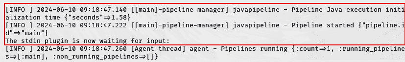

# 第四章：配置 ELK 堆栈

在上一章，你学习了如何在设备上安装 Kali Linux —— 这只是 Kali Purple 工具集的一半。本章将帮助你掌握另一半，即 **ELK 堆栈**。现在 Kali Linux 已经安装完毕，你将使用命令行来安装和配置 Elasticsearch、Logstash 和 Kibana，确保你可以开始开发一个功能完善、强大的 *Purple* 网络安全系统。

注意

我们将稍微改变一下顺序，因为我们会按照与我们提到的顺序不同的方式安装这些工具。Elasticsearch 会先安装。然而，为了从初学者的角度完全理解和利用这个工具，我们将紧接着安装 Kibana，并将二者进行集成。Logstash 将最后安装。在我们谈论整个过程时，你会明白为什么如此。所以，你可以说 ELK 堆栈就是 EKL 堆栈！我们怎么称呼它并不重要，只要确保它们都能正常运行。

正如我们在 *第三章*所做的那样，我们将注入大量的故障排除方法和解决方案，来处理用户在配置 ELK 堆栈时常遇到的问题。由于产品变更和改进是长期的，并且会在本书出版后继续发生，因此不可能预见到每一个可能的问题。因此，我们建议你阅读所有故障排除场景，即使它们与您无关，因为这将帮助你培养和增强分析师思维。

在本章结束时，你将搭建一个基础的 SIEM 技术平台。你还将理解基本 SIEM 技术如何在分析师侧管理数据，以及这些数据如何流动和存储。

本章内容包括：

+   安装 Elasticsearch

+   安装 Kibana 并与 Elasticsearch 集成

+   安装并集成 Logstash

# 技术要求

你应该使用完成 *第三章*的同一设备。然而，Elasticsearch 对设备要求更高。虽然你可以使用比这里列出的更少的内存，但会导致系统变慢。以下是要求：

+   **最低要求**：一台计算设备，架构为 *amd64 (x86_64/64-bit)* 或 *i386 (x86/32-bit)*，至少应该拥有 *8 GB 的 RAM* 和额外的 *10 GB* 硬盘空间。请注意，这些最低要求已知会导致性能问题，因此你应该尽量满足或超过推荐要求，以获得更流畅的体验。

+   **推荐要求**：根据网络安全领域从业人员的反馈，建议使用 *amd64 (x86_64/64-bit)* 架构，配备 *16 GB 的 RAM* —— 更多内存更好 —— 以及最多 *64 GB* 的额外硬盘空间。

# Elasticsearch

我们在*第二章*中学习了 Elasticsearch 的很多功能。特别是，我们发现它是一种增强型数据库，用于丰富 SIEM 信息。现在我们已经在**虚拟机**(**VM**)中设置了 Kali Purple 操作系统，那么怎么样，我们去下载一份这个著名的 Elasticsearch，安装并配置它，好让我们可以开始使用它呢？

如果你需要复习如何启动和登录，可以随时回到*第三章*。否则，首先打开 VirtualBox，选择我们之前创建的 Kali Purple 虚拟机。假设你此后没有进行任何独立的修改，那么现在应该只有这一台虚拟机可以选择。选中它并点击窗口右上角的**启动**按钮。输入在*第三章*中为非管理员账户创建的凭据，并点击**登录**进入 Kali Purple 环境。进入后，选择顶部导航栏上的小黑色方块/矩形图标，打开终端窗口。此时，你应该能看到一个包含你用户名的命令提示符。

首先，输入**sudo apt update**并注意终端显示的可升级软件包数量。你必须执行这一步，因为接下来的步骤中，你需要再次运行这个命令作为质量控制的手段，确保升级成功。第二次运行时，那个数字应该会显著减少，甚至可能为零。

最好的做法是在每次启动 Linux 时更新和升级软件包：


图 4.1 – sudo apt update

请记住，这个命令并不会更新你的软件包，它只是获取一个可用更新的列表。遵循此命令之后，通常应该更新可用的软件包。要执行实际的更新，你必须输入**sudo apt upgrade**。不过，要确保在运行更新命令之后再执行，否则任何新包都不会被找到和更新！第一次执行这个操作时，根据需要升级的软件包数量，这可能需要相当长的时间。如*图 4.1*所示，当时有超过 800 个可升级的软件包！

升级完成后，你需要再次运行原始的 **sudo apt update** 命令。可能仍然会有一些可用的升级包，尤其是当你第一次进行此操作时。因为某些软件团队为其产品开发改进的方式，某些软件团队可能会发布一个仅基于前一个更新的更新，而不是一个完全的升级包。这意味着你必须先安装一个先前的更新，然后才能安装最新的更新。有些软件团队会确保每次升级都是独立的，并且可以在初始安装后应用。除此之外，其他原因主要是各个组织的软件团队采用的开发和打包方法。

反复操作。每当你对整个软件包的升级感到满意时，你将希望确保系统能够识别任何由这些应用程序所做的配置或其他更改。所以，输入 **systemctl daemon-reload**。

这个命令会导致 systemd 重新读取其配置文件并重新加载单元文件。**Systemd** 是一个用于 Linux 操作系统的系统和服务管理器，负责控制和管理操作系统，包括进程、服务和附加设备。每次修改任何配置或单元文件时，都需要运行前述的 **daemon-reload** 命令，以便将这些修改应用到系统中。简而言之，该命令让 systemd 知道这些更改已被做出。养成在安装和/或配置新应用程序或应用程序套件的每个重要步骤后运行此命令的习惯，可以避免在解决冲突或发现某些预期结果未出现时的烦恼。

Elasticsearch 可能已经默认安装，这取决于你是哪个层次的实验者，或者过去是否曾经安装过。如果是这样，只需进行一些配置更改即可。如果没有安装，你可以输入 **sudo apt install elasticsearch**。不过，先尝试以下命令，看看它是否已经安装。如果命令能够执行，那就说明它已经安装。

为了使 Elasticsearch 在启动时自动启动，输入 **sudo systemctl** **enable elasticsearch**。

不让这个服务在启动时自动启动的好处，正如你可能猜到的，是性能和可能加快环境的加载速度。只需记住，如果你选择不启用 Elasticsearch，那么每次启动 Kali Purple 实例时，你都需要手动启动它。你可以通过运行 **sudo systemctl start** **elasticsearch** 命令来做到这一点。

记录初始密码，并记录密码重置和令牌生成的命令：


图 4.2 – 初始 Elasticsearch 配置

如果你在此实例中尚未启动 Elasticsearch，请先启动它，再继续下一步。正如*图 4.2*中所突出显示的，你需要记下默认密码，因为这是唯一一次会提供给你密码的机会。另外，记录下更改密码所需的命令，如果需要的话，还可以获取用于将 Kibana 与 Elasticsearch 集成的令牌。

输入**sudo systemctl status elasticsearch**来查看 Elasticsearch 的状态。

如果它正在运行，状态会显示为**活动**。如果需要，你可以按*Ctrl* + *Z*退出状态界面：


图 4.3 – Elasticsearch 状态

默认情况下，Elasticsearch 会绑定到本地主机（IP 地址**127.0.0.1**）。如果你想远程访问它，你需要配置它绑定到一个不同的 IP 地址。通过打开配置文件使用 nano 文本编辑器来完成此操作。输入**sudo nano /etc/elasticsearch/elasticsearch.yml**，然后查找以**network.host**开头的行，取消注释该行，即删除行首的**#**。你可以使用键盘上的箭头键来导航任何用 nano 文本编辑器打开的文件。尽管我们示例中使用的本地主机 IP**127.0.0.1**是默认值，但手动在**network.host**设置中输入该地址并取消注释仍然是一个良好的实践。这会帮助你养成确保知道在哪里进行调整设置的好习惯。如果你希望该设置绑定到所有接口，可以将其设置为**network.host: 0.0.0.0**，然后在退出编辑器之前保存更改。由于 nano 在你按*Ctrl* + *X*离开编辑器时会提示你保存，这个过程几乎是自动的。由于调整此行会创建新的配置更改，因此你必须输入**sudo systemctl restart elasticsearch**。

打开一个网页浏览器并指向[`localhost:9200`](https://localhost:9200)，特别注意*http*后的*s*。你可以在左上角的菜单中找到 Firefox 浏览器的图标。注意这个细节很重要，因为当你通过 Kibana 界面加载 Elasticsearch 时，稍后将不会包括这个*s*。*s*代表安全，它的存在是因为自 8.0 版本之后，所有的 Elasticsearch 版本默认启用了安全功能。在这种情况下，这意味着**安全套接层**（**SSL**）和**传输安全层**（**TLS**）将是任何 HTTP 协议 – 浏览器 – 通信所必须的。虽然你确实可以关闭安全功能，但我们在这里不讨论这个过程，因为对于我们正在做的事情来说完全没有必要，更不用说它是不推荐的。

如果你提供了正确的 URL，浏览器最初会显示一个安全错误，如*图 4.4*所示；这是因为安全设置已启用。页面左下角会有一个蓝色的**Learn more…**链接，右下角会有一个**Advanced...**按钮，或者两者都有。你应该能选择其中任意一个，并且会看到一个**Accept the Risk and Continue**的选项。如果一个没有这个选项，另一个会有。在这种情况下，接受风险是完全可以的，因为你试图连接的是你自己的系统，除非你大脑里潜藏着某种隐藏人格，否则你应该非常清楚自己不会对自己构成威胁。

选择**Learn more…**或**Advanced…**，然后点击**Accept the Risk and Continue**。登录弹窗将会出现：


图 4.4 – Elasticsearch – 初始网页访问

一旦你接受风险，浏览器将显示一个弹窗，你可以在其中输入 Elasticsearch 超级用户——即**elastic**这个词，以及你在第一次运行 Elasticsearch 时记录的默认密码。如果出于某种原因你忘记了记录该密码，你可以返回命令行终端，通过输入**sudo /usr/share/elasticsearch/bin/elasticsearch-reset-password -u elastic**来请求一个新的密码，其中**-u**指定命令中的下一个词为用户名，**elastic**是超级用户的用户名。系统会要求你输入 sudo 密码，然后才会为你发放新的 Elasticsearch 密码。确保在输入该命令时，你处于默认的主目录。如果你不在主目录，可以输入**cd**返回主目录。你可以输入**pwd**查看当前所在的默认文件系统位置，应该返回类似**/home/<username>**的内容，其中**username**是你为非管理员的 Kali Purple 账户创建的账户名。如果不是，说明你不在主目录。或者，你也可以直接使用**cd**命令导航到**/usr/share/elasticsearch/bin/**目录。到了该目录后，你只需输入**elasticsearch-reset-password -u elastic**即可重置密码。

现在，准备好迎接失望吧。如果你输入了正确的凭证，一个简单的网页将加载，显示你默认的 Elasticsearch 集群，格式为 JSON。如果你仔细观察新界面左上角，你会看到额外的标签，可以以原始格式显示相同的数据，或者查看页面头部。

那么，究竟为什么要让你经历这么多繁琐的步骤，仅仅为了在屏幕上显示几行文本呢？有三个原因：

+   有传闻说，现在将你拉到刑架上是违法的。

+   你将看到一个视觉上的确认，表明你的 Elasticsearch 安装成功。

+   一旦我们安装 Kibana，你会更加欣赏其图形界面。

这样一来，你现在明白了为什么我们要以 EKL 栈的形式安装 ELK 栈。我们将完全无视 ELK 这一缩写，并以我们自己的反叛方式进行操作。首先安装和配置 Elasticsearch 是唯一真正必要的优先顺序，但我们按照这种方式安装这些项目，是为了涵盖每个产品对其他产品的依赖关系。所以，我们的疯狂之中其实有方法。

如果你是那种喜欢冒险的人，决定按照我们这里没有提到的顺序安装项目，做好遇到额外错误和挑战的准备。不过，这并不是告诉你不要这样做。某些工程师性格的人会故意以这种方式做事，因为他们享受通过制造问题来解决问题的学习过程。还有一些人则是天生的反叛者，不喜欢别人告诉他们该做什么。两种类型的人在 Kali Purple 社区中都受到喜爱和欢迎！如果你符合其中之一，我们在此验证你的感受。正是像你这样的人帮助别人学习。请在社区论坛分享你的经验，这将帮助并赋能他人发现和处理那些细节。

然而，这只是一个入门过程，由于这是入门阶段，如果你不愿意，现在不需要过于关注那些细节。这些细节你会随着时间的推移，在使用这些产品时逐渐发现。接下来，让我们继续了解 Kibana！

# Kibana

为了让 Kibana 在这里发挥实际作用，首先安装 Elasticsearch 是至关重要的。正如我们已经讨论过的那样，这是安装和配置 ELK 栈时最重要的操作顺序。假设你已经完成了这一部分，我们将继续进行更新软件包索引的最佳实践。

首先，输入 **sudo apt update**，以获取可用更新的软件包列表。是否执行更新由你决定。执行更新是好习惯，但绝对不是必须的。要执行更新，在前一个命令执行完毕后，输入 **sudo apt upgrade**。

然后，作为最佳实践，你还应该输入 **systemctl daemon-reload**，以养成这个习惯。这将确保你所做的任何配置更改，即使你可能忘记了，也会被 systemd 首先识别到，然后再重新启动服务。接下来，你需要重启自上次安装包以来使用的服务，以应用这些更改。在这种情况下，到目前为止我们唯一操作过的服务是 Elasticsearch。所以，你需要的命令是 **sudo systemctl restart elasticsearch**。命令提示符返回后，别忘了输入 **sudo systemctl status elasticsearch**，以验证 Elasticsearch 是否确实启动并且处于活动状态。

现在，我们可以通过输入 **sudo apt install kibana** 来安装 Kibana。和 Elasticsearch 一样，我们可以通过输入 **sudo systemctl** **enable kibana** 来启用 Kibana 在启动时自动启动。

要启动 Kibana，输入 **sudo systemctl** **start kibana**。

要验证状态并确保 Kibana 正常运行，输入 **sudo systemctl** **status kibana**。

如果 Kibana 已正确安装并启动，它将显示为活动状态：


Figure 4.5 – Kibana 状态与初始登录 URL 和验证代码

如果状态没有及时返回命令提示符，您可以按住 *Ctrl* + *Z* 强制退出状态屏幕。接下来的步骤，如 *Figure 4**.5* 底部所示，是加载浏览器，和我们之前操作 Elasticsearch 时一样。不过这次，我们使用的是不同的端口号，并且也没有在 http 后加上 *s*。

尽管最佳实践建议 Kibana 应该使用安全的 HTTPS 协议，但出于性能考虑，默认配置为使用 HTTP 协议。由于 Kibana 是一个可视化工具，默认情况下会占用大量的 CPU 资源。为了使数据受到威胁，它必须在 Kibana 和 Elasticsearch 之间被拦截，而这两者通常位于同一个内部网络中。与此相对，Elasticsearch 可能会接收来自外部网络的数据，这使得数据更容易受到威胁，因此默认开启安全性措施更加实际和必要。

这种细微的差异常常让第一次使用 ELK 堆栈的用户/安装人员感到困惑。只需记住，在整个过程中，如果您遇到卡住的情况，或者您是喜欢进行实验、超出我们讨论范围的用户，您可以通过使用更改目录命令来检查任何关于 Elasticsearch、Kibana 或 Logstash 的错误消息。为此，通过输入 **cd /var/log/** 来导航到文件夹；然后进入目录后，输入 **ls** 查看可用的日志文件选项。在此之前安装的每个应用程序应该都在该目录下有一个文件列出。要查看某个特定文件，输入 **cat <filename>**。例如，要查看 Kibana 的日志，您可以输入 **cat Kibana**。将 **Kibana** 替换为您希望查看的任何日志文件的文件名，该文件名会在您输入 **ls** 后列出的选项中。

如果你还没有在网页浏览器中加载 Kibana 界面并输入注册令牌，*图 4**.5*底部显示的验证码将不会出现在该屏幕上。该令牌可能是在 Elasticsearch 和/或 Kibana 初始启动期间提供给你的。如果你错过了它，你可以通过进入命令行并键入**sudo /usr/share/elasticsearch/bin/elasticsearch-create-enrollment-token -s kibana**来创建一个新的令牌。一个非常长且难以理解的字母数字代码会显示在你的终端屏幕上。选择并复制该代码，然后将其粘贴到你第一次加载 Kibana 时浏览器中出现的**Enrollment token**框中，如*图 4**.6*所示：


图 4.6 – 第一个 Kibana 浏览器实例请求注册令牌

打开浏览器并将其指向 http://localhost:5601/?code=<VERIFICATION_CODE>，其中**VERIFICATION_CODE**是屏幕上显示的验证码，而不是*图 4**.5*中显示的**754098**，或者直接指向更简单的[`localhost:5601`](http://localhost:5601)；浏览器将提示你手动输入验证码。无论哪种方式，你都会得到相同的结果。如果你忘记了验证码，可以键入**sudo systemctl status kibana**来再次查看它，该验证码将显示在输出的底部。

注

当你在安装并启动 Kibana 后第一次启动浏览器会话时，你可能会遇到计算资源的第一次测试。如果此时或之后的任何时候，你发现虚拟机的性能较慢，您会很高兴地知道，你可以调整在创建虚拟机时分配给虚拟机的内存、CPU 和其他资源。

在 VirtualBox 中，可以通过关闭虚拟机并从 Oracle VM VirtualBox 管理器主屏幕（即启动 VirtualBox 时加载的第一个屏幕）选择**设置**来完成此操作。请记住，**设置**按钮将针对你选择的虚拟机，如果你有多个虚拟机的话。或者，你也可以右键点击你想要的虚拟机，并从该角度选择**设置**。

在出现的左侧列中的两个选项卡，**系统**和**显示**，最有可能与你的性能相关。在这两个区域内，你可以调整处理能力、RAM、视频内存等。务必记住，不要尝试为虚拟机分配超过主机机器可用资源的量，因为还需要考虑虚拟化软件以外的其他应用程序。

我们提供了 VirtualBox 的使用说明，因为本书中我们将使用它。然而，几乎所有虚拟化软件都提供相同的选项。为每种市场上的虚拟化应用程序提供说明是不切实际的。然而，作为安全专业人员，独立研究的能力是必备的。只需简单地在 Google 或其他搜索引擎中查询如何调整资源分配，就足以解决问题。

一旦确认了你的验证码，解决了任何性能和/或虚拟机设置问题，并使用与 Elasticsearch 相同的 Elastic 凭据登录到 Kibana 界面，你将看到一个屏幕，提供**添加集成**或**自行探索**的选项。点击**添加集成**按钮，准备好像在过剩糖果店的富家子弟一样：


图 4.7 – 登录到 Elasticsearch 后 Kibana 的视觉大厅

你将看到超过 350 种可能的 Kibana 集成选项。在左侧的**所有类别**列上方，你会看到**浏览集成**的选项。此选项应以蓝色突出显示，表示你当前在该位置。紧挨着它的右侧，你将看到一个黑色的**已安装集成**选项，用于列出你可能已安装的任何集成。点击**已安装集成**。

Kibana 提供 350 多种稳定的集成 —— 如果你选择**显示 beta** **集成**按钮，则大约有 400 种：


图 4.8 – Kibana 的集成页面

你会看到已经安装了一个名为**Elastic Synthetics**的项目。这是默认安装的核心 Elastic 代理。每次你添加新的集成时，它都会出现在这个列表中。返回到**浏览集成**，花些时间尝试其中的某些或所有选项。

如果由于某些原因你将自己逼入困境，你可以使用以下命令序列来移除 Kibana：

1.  输入**sudo systemctl** **stop kibana**。

1.  输入**sudo systemctl** **disable kibana**。

1.  输入**sudo apt** **remove kibana**。

1.  输入**sudo apt** **purge kibana**。

清除操作将尝试清理任何残留的配置文件，以便在未来的安装中避免出现意外的差异。

如果你决定重新开始安装这些工具，同样的过程也适用于 Elasticsearch 和 Logstash。你只需将之前命令中的应用名称替换为**kibana**即可。如果你感觉自信并且想要尝试，安装和卸载这些工具几次也是个不错的主意，这样你可以更好地了解整个过程。重复是学习之母，而实践是学习之父。在这里，你将同时获得两者。

在你成功安装 Elasticsearch 和 Kibana 后，或许你会注意到，在**浏览集成**部分，你可以选择在 Kibana 环境中安装 Logstash。我们将在下一章讨论这一点，重点讲解如何获取我们将在 ELK 堆栈中处理的数据。通过图形化界面添加 Logstash 时，你还有选择添加 Elastic 代理的选项——这是 Beats 的替代方案。为了保持一致性并培养必要的命令行操作技能，我们将在下一节通过命令行安装 Logstash。我们已经有了一个不错的开局！那么，让我们继续推进，安装 Logstash。

# Logstash

你可能已经这么做了，但因为我们不知道你何时会停下来看书，所以我们将继续养成在每次新安装之前更新软件包列表的最佳实践，就像我们从 Elasticsearch 切换到 Kibana 时做的那样。

首先输入 **sudo apt update**。如果你是第一次在 Linux 环境中工作，你可能已经注意到，即使我们频繁使用这个命令，几乎总有新更新不断推出。如果你还没有遇到这种情况，那意味着你正在快速工作，覆盖的内容也很多。没有什么问题，但不要被这个速度迷惑。当你第一次休息一两天后，再回来运行这个命令时，你会发现有新的软件包更新可用。这就是为什么我们会养成在每次安装软件包后、以及每次登录到 Kali Purple 系统时运行它的习惯。

继续输入 **sudo apt update** 命令，接着输入 **sudo apt upgrade** 来更新你的软件包（如果你愿意的话）。然后输入 **systemctl daemon-reload**。这不是每次登录都必须做的事情，但如果你正在进行一个涉及大量新软件包安装和配置的项目——像我们现在这样时，这个步骤应该成为一种习惯。

Logstash 是我们在 *第三章*中提到的需要 **Java 开发工具包**（**JDK**）的应用。如果你按照那一章的指示操作，说明你已经安装好了 JDK。如果没有，或许你可以返回那一章的结尾部分，赶紧安装一下。过程简单且无痛苦。

输入 **sudo apt install logstash** 开始安装 Logstash。

通过输入 **sudo systemctl enable logstash**，将 Logstash 设置为在系统启动时自动启动。如果您希望调整此前设置为自动启动的任何应用程序的此设置，可以输入 **sudo systemctl disable logstash** – 这是上一节末尾简要介绍过的命令 – 以将其设置为手动启动。这意味着每次启动系统时，您必须手动运行启动命令才能启动它。

输入 **sudo service logstash start** 启动 Logstash 服务。接下来，您需要输入 **sudo systemctl status logstash** 来验证状态，确保 Logstash 正在成功运行。准备好后，如果需要，可以按 *Ctrl* + *Z* 退出状态屏幕。

由于 Logstash 的主要功能之一依赖于数据传输，我们需要进行测试，确保用于此操作的管道正常工作。我们将通过进入 Logstash，创建一个基本的管道，输入一个命令，并检查该命令是否被 Logstash 接收并处理来进行测试。其实比听起来简单。使用 **change directory**（**cd**）命令，导航到 Logstash 安装目录。要到达该目录，输入 **cd /usr/share/logstash**。

如果您不确定自己所在的位置，可以在输入前述命令后，使用 **print working directory**（**pwd**）命令来验证您的位置。输入 **pwd**，它应返回 **/usr/share/logstash**。在尝试打开管道之前，您需要确保您和任何其他尝试访问 Logstash 的应用程序都有访问权限。输入 **sudo chmod -R 777 /usr/share/logstash/data** 来为整个文件路径设置正确的权限。在该位置，输入 **bin/logstash -e 'input { stdin {} } output { stdout {} }'** 来打开 Logstash 应用程序中的管道，特别注意使用单引号和大括号，而不是圆括号。稍等片刻，等待管道打开。您会知道这是成功的，当您的终端显示一些文本，表明主管道或 Java 管道已启动，如 *图 4.9* 中所示：



图 4.9 – Logstash – 基本的 Java 管道

注意

在此过程中，您可能会看到一些警告。如果您完全按照我们的指引操作，可以安全地忽略这些警告。这些警告是有其有效目的的，但计算机无法知道我们是在首次安装和配置这些应用程序。在 ELK 堆栈完全配置并正常运行后，这些警告应该会消失。

返回给你的确切文本可能会根据你安装的 Logstash 版本有所不同，因为该产品正在积极更新，并将在本书出版后继续更新。有时，设置过程需要一段时间才能在后台正确配置。如果你遇到错误，等待几分钟后再输入一次命令。测试人员报告说，通常需要等待并重新输入命令。之前的命令中，**-e** 后面的内容是打开管道的命令。这个 **-e** 告诉 Kali，可以将该命令附加到 Logstash 并在命令行中执行。程序员和软件工程师，尤其是那些有过 C 类语言工作经验的你们，会认识到 **stdin** 和 **stdout** 是用于管理输入和输出的核心功能。它们分别代表 **标准输入** 和 **标准输出**。这个命令基本上是告诉 Logstash 获取即将接收到的输入并将其处理为输出。

现在，让我们通过在终端窗口中输入 **I love Kali Purple** 来测试我们在 Logstash 中打开的这个新管道。如果 Logstash 安装正确、没有错误启动，并且之前步骤中的管道设置正确，那么你应该会看到已添加时间戳，并且输出已经返回给你，如 *图 4.10* 所示：


图 4.10 – Logstash 成功的输入/输出处理

按 *Ctrl* + *D* 退出 Logstash 并返回到命令提示符。你必须完成的最后一项任务是配置 Logstash，使其能够在 Elasticsearch 中索引你的数据。

*“但是 Karl，我没有数据！”* 我理解你。我每天早上也有同样的感受，直到喝到第二或第三杯咖啡为止。在下一章，我们将专注于获取数据并通过 ELK 堆栈使用 Beats 和示例数据集进行处理。不过现在，我们只是为使用工具做准备。

要配置 Logstash 在 Elasticsearch 中索引你的数据，你需要使用 **cd** 命令导航到 Logstash 的主目录。为此，输入 **cd /etc/logstash**。有很多方法可以实现 Elasticsearch 索引目标，但我们无法预测这些应用程序的未来版本。我们也不知道你是否在遛狗时把 Kali Purple 实例完全暴露，任由恶作剧的青少年删除你的文件。因此，我们将首先展示最基础、从零开始、需要努力的、流汗的方法。

为了做到这一点，你需要创建一个管道文件；在该文件中，你必须指定输入来源、任何特殊过滤器（将在下一章介绍），以及输出去向。输入**sudo touch learning-purple.conf**来创建文件，然后使用列表命令 – **ls** – 验证该文件是否存在于目录中。如果文件不存在，很可能是由于输入错误，所以请重试。

创建完成后，我们可以使用 nano 编辑文件。在相同的目录下输入**sudo nano learning-purple.conf**来打开新创建的完全空白的文件。如果你已经不在该目录中，可以导航到该目录，或者在前面的命令前添加**/etc/logstash/**文件路径。如果你不熟悉这个术语，可以将其理解为“添加”。当你添加某物时，意味着你将它放在后面。比如书籍中的附录，意味着你在书的末尾添加了索引。在这个例子中，prepend 意思是将内容添加到某事的开头 – 你是在前面的命令之前添加文件：**sudo nano /etc/logstash/learning-purple.conf**。这是一个额外的知识点，和 Kali Purple 或 ELK 堆栈无关，因为你很可能会在网络安全的职业生涯中再次遇到这个术语。一旦文件打开，插入以下代码：

```
input {
   # We will use input to accept data from Beats
   # We will learn about Beats in Chapter 5
}
filter {
   # We will learn about filters in Chapter 5
   # Filters are a form of data enrichment
}
output {
    elasticsearch {
       hosts => ["localhost:9200"]
       user => "elastic"
       password => "ElasticSuperUserPassword"
    }
}
```

在上述场景中，确保将**ElasticSuperUserPassword**替换为你首次启动 Elasticsearch 时收到的密码和/或你创建的密码。这将是你首次登录 Kibana 时使用的相同密码，帮助 Kibana 与 Elasticsearch 进行集成。

请记住，如果你在任何时候更改了这个密码，你将必须手动检查与 Elasticsearch 集成的每个应用程序，并更新它们的配置文件，否则它们将无法访问 Elasticsearch，无法正常工作！

注意

这种非人工认证通常被称为**服务账户**，在技术领域中是如此。作为一名网络安全分析师，你需要深入了解服务账户，特别是那些知名的服务账户，因为这些知识可以帮助你分析安全警报，判断发生了什么。你很可能经常遇到的一个流行服务账户是**NT AUTHORITY\SYSTEM**。这是一个内置的 Windows 用户账户，具有 Windows 操作系统中最高级别的系统权限。它在 Windows 操作系统初始安装时创建，并用于集成系统内部的服务和进程。这使得它成为恶意攻击者的目标，因此它出现在安全警报中时，值得进行深入分析。

按下*Ctrl* + *X*并选择*Y*，如果系统提示你保存并关闭我们刚才创建的文件。现在，我们的工作还没完全结束。我们想要对我们新创建的文件进行配置验证和语法检查。使用以下命令时，请确保在**--path.config**前面使用两个连字符（减号），但其他地方只用一个。将以下庞大的命令输入到你的终端中，全部在一行内：

```
sudo /usr/share/logstash/bin/logstash –path.settings /etc/logstash -–path.config /etc/logstash -t -f /etc/logstash/learning-purple.conf
```

请耐心等待。这可能需要一两分钟才能完成。

Logstash 内置了一个配置文件验证器和语法检查工具：


图 4.11 – 配置文件通过验证

另一种将 Logstash 设置为将数据报告给 Elasticsearch 进行索引的方法是编辑**logstash-sample.conf**（如果你的产品版本中有该文件）。它可以在我们创建**learning-purple.conf**的同一目录下找到。然而，最佳实践是不要编辑任何技术中的默认示例文件，而是复制它们并编辑副本。这样，如果你犯了错误，始终可以从未修改过的原始文件开始工作。

如果你在同一目录下，复制文件的命令格式是**sudo cp <originalFile><newFileCopy>**。例如，**sudo cp logstash-sample.conf logstash-sample-two.conf**将创建一个名为**logstash-sample-two.conf**的新文件，其内容与**logstash-sample.conf**相同。如果你不在该目录下，那么你必须在命令中为每个文件添加文件路径，例如**sudo cp /etc/logstash/logstash-sample.conf /etc/logstash/logstash-sample-two.conf**。即使你希望文件副本与原文件在同一目录下，也应该这样做（否则，副本将被放置在你当前所在的目录中）。

请记住，你仍然需要编辑新文件并添加 Elastic 服务帐户的凭据。你还需要确保删除用户和密码行前的**#**符号，这样文件才能被读取。否则，**#**符号会告诉 Logstash 忽略该行后面的内容，因为那部分信息仅供人类阅读，而不是机器。这种约定使开发者和应用用户可以读取文件并理解文件内容。添加此类注释被认为是编码和/或脚本编写的最佳实践，并且强烈推荐使用。

ELK 栈并不只限于 Kali Purple。它是跨平台兼容的，并且有多种格式，包括云托管版本。然而，本书主要讲的是 Kali Purple，我们对 ELK 栈的关注将集中在它如何与 Kali Purple 相关联。请记住，这只是整个 Purple 解决方案中的一小部分。一旦我们完成配置 ELK 栈并让它在下一章结束时运行，我们将转向 Kali Purple 的其他工具。那些工具将与 ELK 栈集成，提供完整的 SOC 解决方案。

# 总结

本章我们介绍了如何安装和配置 ELK 栈的三个关键组件。这些组件共同工作，接收、丰富、索引并显示数据分析人员所需的信息。在此过程中，我们还学到了一些相关的有用信息，这些内容可能会在你未来的网络安全职业中反复出现。

然后，我们学习了一些最佳实践，比如在每次系统启动后进行更新和升级，并且在代码和配置文件中添加易于阅读的注释。我们还介绍了如何在启动应用程序后查看其状态，以及一系列操作命令，比如设置应用程序开机自启，以及如何在需要时停止、禁用或删除它们。

这些任务为我们提供了一套强大的技能，能够操作 ELK 栈的组件，使其符合我们的需求。这包括测试我们的配置的经验以及如何使用服务账户集成这些组件。

在下一章，我们将进一步学习 ELK 栈的其他组件，这些组件用于收集我们需要的数据并将其传送给我们。我们将学习如何部署这些端点代理并设置 Logstash 过滤器来丰富数据。我们还将获取一组数据样本，通过我们的新 SIEM 系统进行处理，并最终看到它作为一个完整单元运行！

# 问题

回答以下问题来测试你对本章的理解：

1.  本章介绍的 ELK 栈组件中，依赖我们安装的 JDK 的是哪个？

    1.  Kibana

    1.  Elasticsearch

    1.  Logstash

1.  对或错：可以通过 Kibana GUI 安装 Logstash。

    1.  正确

    1.  错误

1.  在第一次运行 Elasticsearch 时提供的密码有何重要意义？

    1.  它是一个服务账户密码，用于集成 ELK 栈组件。

    1.  它永远不能更改。

    1.  它用于集成 ELK 栈组件，但技术上不是一个服务账户。

    1.  它最多可以更改四次。

1.  服务账户的主要功能是什么？

    1.  它管理运行中的后台服务。

    1.  它是一个非人类账户，用于帮助应用程序之间的集成。

    1.  它让服务对其行为负责。

    1.  它会自动向你发送短信，提醒你汽车需要更换机油。

1.  Elasticsearch 绑定的默认端口是什么？

    1.  **5601**

    1.  **5400**

    1.  **9201**

    1.  **9200**

1.  以下哪个命令用于清理残留的配置文件？

    1.  **sudo apt** **清除 <package>**

    1.  **sudo apt** **移除 <package>**

    1.  **sudo apt** **禁用 <package>**

    1.  **sudo apt** **分解 <package>**

# 进一步阅读

要了解本章中涉及的更多主题，请查看以下资源：

+   **Elasticsearch** **指南**: [`www.elastic.co/guide/en/elasticsearch/reference/current/index.xhtml`](https://www.elastic.co/guide/en/elasticsearch/reference/current/index.xhtml)

+   **Kibana** **指南**: [`www.elastic.co/guide/en/kibana/current/index.xhtml`](https://www.elastic.co/guide/en/kibana/current/index.xhtml)

+   **Logstash** **指南**: [`www.elastic.co/guide/en/logstash/current/index.xhtml`](https://www.elastic.co/guide/en/logstash/current/index.xhtml)
