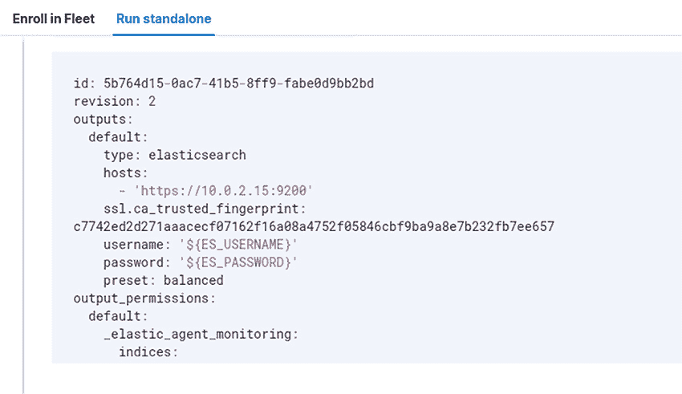

# 第五章：将数据发送到 ELK 堆栈

我们在上一章中介绍了**ELK 堆栈**的三个主要组件。这是一个很好的开始，但没有数据，这些组件是没用的！本章旨在解决这个问题。获取数据的方法有很多种，而探索其中一些方法可能会变得相当复杂。由于这是一本入门手册，我们将采用更简单的方法——在这种情况下是**Beats**——但仍会提供一些更高级方法的概述。这将使那些渴望知识、喜欢独立学习的人能够深入探讨，如果他们愿意的话，同时也为那些喜欢慢慢来的人提供可操作的工具。

获取数据的过程涉及到数据的传输。这有时被称为**数据传输**。在本章中，当我们使用“数据传输”一词时，应该理解为我们在讨论数据的传输。另一个可以安全假设的是，我们在讨论数据传输时，总是包含 Logstash 在我们的数据传输生态系统中。所以，当我们谈到将数据发送到 Elasticsearch 时，这意味着我们要么已经准备好快速切换到 Logstash，要么它应当被视为商业环境中的一种选择，但我们只是将数据发送到 Elasticsearch，以便高效地推进示例。在大多数生产环境中，你会首先将数据发送到 Logstash。如果我们在某些情况下打算跳过 Logstash，直接将数据发送到 Elasticsearch——这是完全可能的——我们会明确指出。

本章所提供的信息将帮助你了解典型的 SIEM 操作是如何工作的。虽然我们在实际操作和示例中使用的是 ELK 堆栈，但你在这里获得的经验和知识通常可以迁移到其他 SIEM 设置中。本章将作为本书第一部分的结尾。在此之后，我们将不再直接与 ELK 堆栈进行操作。然而，当我们学习 Kali Purple 发行版中的其他工具时，你会发现它们是 ELK 堆栈的补充，并会与之集成。随着层次的逐步构建，你将开始看到你的完整 SOC 逐渐成型，这一切都围绕着你到目前为止所完成的工作，包括本章的内容。所以，在这一章中要特别小心，确保在离开本章时，对其中的概念有扎实的理解。

本章包含以下内容：

+   理解数据流动

+   Filebeat

+   Beats 的类型

+   Elastic agent

+   Logstash 和过滤器

# 技术要求

本章需要以下内容：

+   **最低要求**：一台具有*amd64 (x86_64/64 位)* 或 *i386 (x86/32 位)* 架构的计算设备。它应至少包含*8 GB*的内存。

+   **推荐要求**：根据来自网络安全领域从业者的反馈，建议使用 *amd64 (x86_64/64-bit)* 架构，并配备 *16 GB* 内存——更多内存更好——以及最多 *64 GB* 的额外磁盘空间。

# 理解数据流

你可能还记得在 *第一章* 中我们讨论了围绕 Kali Purple 的一项神奇现象——从未使用过 Linux 的人最终决定尝试它。网络安全领域已经发展到一个新的阶段，许多职位不再要求事先具备特定类型的技术经验。尽管拥有这些经验无疑会有所帮助，并且能为你提供优势，但许多组织开始更加重视问题解决能力、在压力下操作的能力，或解决没有现成答案的挑战。一些组织愿意教会员工所需的技术技能，只要他们具备这些能力，并能展现出强烈的职业道德和作为好学生的潜力。这不仅仅局限于 Linux、编程或其他经验。有些人在进入网络安全领域时，缺乏的经验之一是网络技术。我们所说的“网络”并不是指建立一个强大的人脉圈子，而是指电缆、连接和机器之间的数据流动。

在本章中，我们将进入数据流的领域，讨论 ELK 堆栈如何获取信息。然而，在此之前，我们需要准备好我们的连接和数据流。由于潜在的设置方式无穷无尽，且我们无法确定你使用的工具和操作系统，我们将坚持使用我们基础的示例设置，即在 Windows 主机上使用 VirtualBox。但其背后的原理是相同的。如果你使用的是不同的虚拟化工具或主机操作系统，你仍然应该能够从中获取必要的信息。

注意

由于我们不了解每个人的财务状况，而 Kali Purple 的一大魅力在于整个套件是免费的且开源的，因此我们在开发本内容时力求使用最简单的术语，同时仍保留概念验证。事实上，在本书的内容中，我们将从单一设备的角度探索 Kali Purple。在讲解过程中，我们将在一台配备 32 GB 内存和 13 英寸屏幕的小型笔记本电脑上进行复现（是的，真的）。我们希望每个人都能享受到 Kali Purple 的乐趣。

话虽如此，你应该知道，即使在 Kali Purple 之外，也有许多方法可以设置和部署 ELK 堆栈，其中包括基于云的部署。我们完全可以为 ELK 堆栈写一本书——更有可能是一系列书籍。 然而，这本书的主题并不是 ELK 堆栈，而是 Kali Purple，我们将保持与 Kali Purple 的一致性。跟随我们，到最后，你将对 Kali Purple 有一个非常扎实的理解，之后你可以在任何你喜欢的方式上进一步扩展。

以我们的基础示例为例，第一个网络考虑因素是理解我们的**虚拟机**（**VM**）与主机操作系统之间的关系。简而言之，这就像是拥有两台独立运行的个人计算机。它们只是共享相同的物理硬件来运行。这就是我们设置与拥有两台独立设备之间的唯一区别。因此，我们可以将终端工具，如 Beats 数据传输工具或 Elastic Agent，放在主机设备上，让它们将数据报告到托管在 Kali Purple 虚拟机实例中的 ELK 堆栈。这样做将准确模拟客户设备向公司 SOC 内的工具报告数据的过程。更复杂的是，我们希望尽可能地保护虚拟机不受外部恶意行为的干扰。我们将通过利用一些网络概念来实现这一点，使数据传输工具仅通过连接到主机设备来向 SIEM 设置报告，主机设备再将信息传递到虚拟机实例中。虽然我们不需要外部设备来验证 Kali Purple 的概念，但我们仍会触及这一方面，以支持那些希望以这种方式进行实验的朋友。这样做的另一个好处是你只需要一台设备，为教育工作者和培训经理提供了一个额外的途径来培训他们的分析师。

为了确保我们的网络正确建立，我们需要覆盖两个主要领域：我们需要确保你的主机设备和虚拟机能够相互通信。这要求你为主机设备配置一个静态 IP 地址，或者愿意在每次主机设备更新其 IP 地址时，编辑虚拟化软件中的端口转发规则，确保 Kali Purple 虚拟机实例能够继续正常工作。根据互联网服务提供商的业务规则和操作，这可能会或可能不会很麻烦。这就引出了第二个主要领域。尽管我们开发本内容是基于你可以在单个设备上完成所有操作的假设，但如果你曾将自制的 Kali Purple SOC 用于合法目的，你的主机设备必然需要对外界可访问。否则，如何让你的数据传输工具知道将数据发送到哪里呢？

首先，先来看一下你正在处理的 IP 地址类型。在主机上打开命令提示符，输入**ipconfig /all**来获取详细的列表。查看不同的网络接口时，你会注意到一个以太网接口，这代表着*传统的物理网线插入我的设备*。这应该是你的虚拟化软件。由于有些人仍然使用有线电话、相信埃尔维斯还活着，并通过以太网连接访问计算机网络，你需要通过查找**Description**字段来确认这是你的虚拟化软件。该字段的值应该是提到虚拟化软件的文本。例如，在我们的案例中，它是**VirtualBox Host-Only Ethernet Adapter**。你还应该注意到有一个**DHCP Enabled**行，值为**No**——这是好事。这意味着你的虚拟化软件已经将其 IP 地址设置为静态。换句话说，地址不会改变。在同一部分中，你会看到一个**IPv4 Address**字段。记录下该值，因为稍后我们将创建端口转发规则时需要用到它。结果中可能还会有其他字段带有**IPv4 Address**字段。找到那个与虚拟机相关的条目，并记录下该条目的 IPv4 值。它可能是列表中的第一个条目。你可能会在描述中看到与虚拟机相关的内容，如*图 5.1*所示。记录下该值作为主机的 IP 地址。在同一部分中，查找**DHCP Enabled**字段。这个值可能显示为**Yes**，老实说，这是个不太好的信号。这意味着你的互联网服务提供商会定期更新/更改你的 IP 地址。这一点可以通过该部分左列的**Lease Obtained**和**Lease Expired**字段得到进一步确认。如果出于某种原因，**DHCP Enabled**值显示为**No**，就像虚拟化接口那样，那么你可能已经知道了。你会在打开互联网服务提供商的最后一张账单时发现这个信息，那时你会看到应付金额上多了几个零。

查找与虚拟化软件匹配的以太网接口：


图 5.1 – ipconfig /all

如果是这样的话，你就可以了。你可以设置一个完全功能的 Kali Purple SOC，分发数据发送器到远程设备，并在下一步完成端口转发后让它们将数据反馈到你的应用程序。如果不是这样的话，那就意味着你的 IP 地址是动态的，会发生变化。你需要在动手操作我们刚才描述的 SOC 之前，先进行一些独立学习。我们无法为你完成这部分操作的原因是，世界上有无限数量的互联网服务提供商，再加上看似无穷无尽的路由器/交换机品牌。你需要的解决方案是为托管 Kali Purple 实例的设备获取一个静态 IP 地址。

从技术上讲，还有其他一些替代方法可以解决这个问题，因为计算机网络的世界极其复杂。然而，已经了解这些内容的人不太可能阅读本教程。如果你希望以这种方式设置 SOC，我们可以为你指引方向。但在深入之前，请先考虑一下你的迫切需求。如果你只是想学习和/或提升 Kali Purple 的知识，建议只保持主机和虚拟机网络联通。根据你的虚拟化类型和设置，主机 IP 地址可能并不需要才能使两者正常工作。否则，我们建议你查看互联网服务提供商和路由器/交换机品牌的官方网站，了解是否允许为设备设置静态 IP 地址，是否有相关资源可以帮助你设置，是否需要在网关设备和主机之间进行额外的端口转发。

一旦你决定了接下来的操作方式，并解决了主机设备的 IP 问题，你就需要将虚拟机与主机设备进行网络连接。记住，虚拟机就像一个独立的物理计算设备。如果我们希望它与主机设备进行通信，我们需要对其进行相应配置。

让我们将主机和虚拟机实例连接起来，以便模拟数据传输到我们的 ELK 堆栈设置。有几种方法可以使主机和虚拟化软件进行通信。我们将使用一个叫做**端口转发**的概念。如果你没有网络经验，可以将端口想象成你家中的墙上*插座/插口*。你的家代表你的设备。当你的计算机访问互联网时，就像电力通过你家里的电线到达外部，并沿着道路旁的电线传输。当你访问的互联网服务器或计算设备回复你计算机的信息时——即便是简单的显示一个网页——就像电力通过那些电线返回到你家里。

你有没有想过，计算机是如何知道那些返回的信息——即传入数据——应该发送到哪里呢？它是怎么知道传入的数据属于电子邮件客户端、网页浏览器、游戏或其他你正在使用的应用程序的呢？计算机通过使用端口来知道这一点。设备上的不同应用程序会使用不同的端口号。举个例子，你的网页浏览器会通过连接到端口**80**来处理普通流量，或者通过连接到端口**443**来处理加密流量，连接到远程网页服务器设备。在这个过程中，浏览器会从设备上随机选择一个空闲端口，并为接收远程设备的回复保留该端口。它会将包括为回复保留的端口号的信息发送到远程设备。这样，当远程设备发送回复时，它就能告诉你的计算机将回复发送到哪里。你的设备在收到这个回复后，就知道该使用哪个*插座/插件*。因此，它就会知道，任何来自原始远程端口**80**或**443**网页服务器活动的信息，都是与网页浏览器相关的，应该发送到那里。

计算机中的端口——有时也称为**插件**——就像是电流进入你家并到达一个非常特定的*插座*。你家通过送到电气面板的电线来识别这些插件，电气面板中有断路器，并且这些断路器应该有标签。如果你去到你家的电气面板，翻动写着*厨房*的开关，那么理论上，厨房的电力——只会是厨房的电力——应该被关闭。它会关闭厨房中的所有电气*插座*，而不仅仅是一个。你计算机中的端口就像厨房里的一个*插座*。端口转发和镜像就像控制面板中的断路器开关。你将多个*插件*连接到同一个控制面板，以便用一个开关进行操作和控制。当你在设备中创建规则来共享或转发端口时，这就像是你重新布线它们，使它们可以通过相同的开关、相同的开关来工作……可以称之为**虚拟断路器**。

为了让我们的主机和虚拟机在同一个电路断路器上，我们将在 VirtualBox 中使用端口转发。为此，请确保 Kali Purple 虚拟机已关闭。如果虚拟机正在运行，你需要先关闭它，然后才能访问该虚拟机的端口转发功能。虚拟机关闭后，打开 VirtualBox，选择你运行 Kali Purple 的虚拟机。接下来，点击顶部标有**设置**的大齿轮图标。当设置窗口打开时，找到并选择左侧栏中的**网络**选项卡。

虽然有几种方法可以执行下一步操作，但我们将使用一种叫做**网络地址转换**（**NAT**）的方法。我们需要找到一个可用的网络适配器。在主窗口的顶部，应该有四个标签，每个标签上都有适配器的标签。在大多数情况下，第一个标签会预先设置一些信息。如果你看到**启用网络适配器**框已选中，并且在**附加到：**右侧的滚动菜单中已经选择了**NAT**，那么你可以继续使用这个活动标签。否则，你需要继续浏览窗口顶部的标签，直到找到一个可用的网络适配器。如果**启用网络适配器**未被选中，你可以认为它是可用的。你可以在本章末尾的*进一步阅读*部分中阅读更多关于 NAT 以及之前讨论的静态和动态 IP 的信息。如果这些选项不可用或被灰显，可能是你忘记先关闭虚拟机。请仔细检查并确保你已经关闭了正确的虚拟机，然后再试一次。你可能需要关闭并重新启动 VirtualBox 虚拟机。

如果你忘记关闭虚拟机，一些设置可能会被灰显，如下所示：


图 5.2 – 设置面板

当你满意时，点击**高级**旁边的三角形。你应该会看到另一个下拉菜单，标有**适配器类型：**。将其设置为**虚拟化网络（virtio-net）**。

注意事项

上述步骤至关重要。这是虚拟化社区中许多用户感到沮丧的原因，所以，请确保不要跳过这一步骤。如果你使用的不是 VirtualBox 虚拟化产品，标签的名称可能会有所不同。但你应该能够通过推理找到相应的设置。如果你不确定，也可以搜索与你的虚拟化品牌相关的术语，再加上“paravirtualization”一词。

接下来几行，你还应该会看到一个按钮，用于访问**端口转发**功能。点击该按钮打开**端口转发规则**窗口。接下来的几页将为你提供更多详细信息和一个关于端口转发的图示—如*图 5.3*所示。可以随意调整那个小窗口的大小，以便查看所有的列。如果你使用的是不同的虚拟化产品或宿主操作系统，可以尝试搜索如何让你的虚拟化产品和操作系统进行网络连接。你也可以在查询中加入*端口转发*一词。但是，如果你按照这里的步骤操作，即使使用其他产品，这些信息也可能对你有所帮助。所以，我们建议即使你没有使用 VirtualBox，仍然阅读这一部分内容。

既然我们已经到达这里，让我们为 ELK 堆栈的每个组件设置端口转发。虽然 Elasticsearch 和 Kibana 主要使用**传输控制协议**（**TCP**）网络流量，Logstash 则同时支持 TCP 和**用户数据报协议**（**UDP**）。Elasticsearch 还使用一个额外的端口来接收来自管道的信息。我们可能会配置这个端口两次，一次用于每个协议。老实说，将每个组件都设置为 TCP 和 UDP 是一种良好的实践，因为我们无法预知我们的 SOC/SIEM 解决方案的未来。若你有兴趣，可以查看本章末尾的*进一步阅读*部分，里面有关于这些协议的更多学习链接。

在你点击**端口转发**按钮后打开的窗口右上角，应该会有一个带有绿色加号符号的小图标。你可能需要双击某个字段才能获得输入或编辑值的权限。此时你将创建多个端口转发规则。点击带有绿色加号符号的图标来创建你的第一个端口转发规则。在**名称**栏中，输入**Elasticsearch - Localhost**，在右侧的协议栏中，输入**TCP**。在**主机 IP**栏中，你需要输入你想要连接到虚拟机的源的 IP 地址，在我们这个例子中就是主机机器本身。输入**127.0.0.1**，这表示主机机器的本地主机。Elasticsearch 和 Kibana 使用**9200**端口，因此，由于这个规则是为了让主机和虚拟机共享同一个端口，你必须在**主机端口**和**客户机端口**栏中都输入**9200**。对于你正在创建的每个端口转发规则，在**客户机 IP**栏中输入你从虚拟机界面记录的 IP——即你输入**ipconfig /all**时，来自以太网部分的 IP。在我们的例子中，如果参考*图 5.1*，是**192.168.56.1**。我们建议你输入这个 IP 作为一种最佳实践，因为并非所有的端口转发场景都会涉及简单的主机-虚拟机联合。

注

从技术上讲，你可以将**客户机 IP**栏留空。有些用户报告说，当另一端点是本地主机时，若**客户机 IP**有条目会遇到问题。如果你遇到类似问题，可以尝试移除该 IP。无论哪种技术，去掉所有可选设置和输入是一种很好的故障排除习惯。然后，确认技术在去除这些项后能按预期工作，再慢慢地逐项重新添加，测试每一步。若你养成这样的故障排除习惯，你会很快发现，大多数情况下，正是那些可选项导致了最初的问题/故障。

完成第一个端口转发设置后，点击**确定**保存规则，然后对以下每个规则重复此步骤，使用相同的 IP 地址为主机和客户机设置：

+   配置 Elasticsearch – 应用数据使用 **9300** 端口的 TCP

+   配置 Kibana 使用 **5601** 端口的 TCP

+   配置 Logstash 使用 **5044** 端口的 TCP

+   配置 Logstash 使用 **5044** 端口的 UDP

设置 Elasticsearch – 应用数据的规则我们不会使用。这个端口是 Elasticsearch 用于在节点之间进行通信和数据传输的。不过，我们让你设置这个端口是为了培养一个好习惯。随着你不断成长、学习和拓展自己的能力，你可能决定研究并尝试使用多个 Elasticsearch 节点。现在，你已经将大脑编程成记住这个端口的存在，帮助你进行操作。一旦你完成了端口转发规则的设置，它们应该和你在*图 5.3*中看到的类似，这是我们为运行实验示例所设置的规则的截图：


图 5.3 – 端口转发规则

配置网络进行数据传输的最后一步是测试我们的设置。我们将通过尝试从主机机器连接到 Elasticsearch 和 Kibana 来实现这一点。首先，我们需要做一些清理工作。点击 **确定** 关闭 **端口转发规则** 窗口，然后再次点击 **确定** 关闭 **设置** 窗口。现在，启动你的 Kali Purple 虚拟机并等待几分钟让它启动。我们要避免的一件事是过早连接，或者在没有验证 Elasticsearch 和 Kibana 是否在虚拟机启动时正确启动的情况下尝试连接。另外，如果你在安装这些服务时没有选择启用它们的选项，在 *第四章*中，你将需要手动启动它们。如果我们没有启动它们，即使我们的端口转发设置正确，也无法从主机机器连接到它们。虚拟机启动后，登录到实例并打开命令行终端窗口。你还记得我们在安装这些服务时的最佳实践吗？这些是在 *第四章* 中讲解的。

如果没有的话，他们需要输入以下命令：

+   **sudo** **apt update**

+   **sudo apt upgrade** 如果你希望升级更新中呈现的任何选项

+   **sudo systemctl daemon-reload** 重新加载任何遗漏的配置更改

+   **sudo systemctl status elasticsearch** – 如果它正在运行，它会显示 **Active**

+   **sudo systemctl status kibana** – 如果它正在运行，也会显示 **Active**

+   按 *Ctrl* + *Z* 以便在需要时退出状态屏幕

在这种情况下，如果更新返回的任何选项与 Elastic 产品套件相关，你需要确保执行升级。原因是你将在下一节直接从 Elastic 获取 **Filebeat**，如果你获得的版本比你现有的 Elastic 安装版本更新，可能会在设置过程中遇到问题。

一旦确认你的 Kali Purple 和 ELK 实例已成功启动并运行，返回你的主机进行端口转发规则的测试。在主机上，打开你选择的网页浏览器。正如你可能从 *第四章* 中回忆到的，我们通过直接连接来测试 Elasticsearch 设置。在实际操作中，我们只会通过 Kibana 界面访问 Elasticsearch。这只是为了测试并确保我们的端口转发规则按预期工作！在你打开的浏览器的地址栏中，输入 [`localhost:9200`](https://localhost:9200)，特别注意 *http* 后的 *s*。如果你的端口转发按预期工作，你将看到一个提示，要求你输入 Elasticsearch 登录凭证。这些凭证与你从 Kali Purple 环境中登录 Elasticsearch 时使用的是相同的，因为这就是同一个 Elasticsearch！如果你看到一个显示默认 Elasticsearch 集群的 JSON 格式网页，那么恭喜你，这就是成功！你的 **9200** 端口转发规则工作正常。现在我们对 Kibana 做同样的操作。这次，省略 *http* 后的 *s*，在浏览器中输入 http://localhost:5601。你应该会看到你通过虚拟机登录时所获得的相同 Kibana 页面。由于我们不直接连接到 Logstash，因此可以安全地假设此时所有的端口转发都已成功。

恭喜你！你已经赢得了数据传输战斗的一半。设置好你的网络是所有数据传输的核心——这就是我们为什么有互联网，对吧？在下一节中，我们将安装并配置 Beats，使其能够使用此网络方案，将数据从安装设备报告回我们的 ELK 堆栈 SIEM 解决方案。

# Filebeat

很多人会将 Beats 视为 ELK 堆栈的一部分，因为这三个主要的 ELK 组件曾经在很大程度上依赖于 Beats。然而，随着 Elastic agent 的不断改进，以及外部供应商在其独立产品中开发与 Elasticsearch 兼容的功能，Beats 的包含已不再是一个自动的假设。我们也会探索 Elastic agent。不过，Beats 依然简单且轻量，因此它是一个非常自然的过渡步骤。

除了示例数据集——这些是假数据，用于在部署前测试如 ELK 堆栈等系统——外，获取数据的下一种最简单方式是通过一系列代理，称为数据传输工具，统称为 Beats。Beats 并不是单一的代理或软件应用程序，而是一个应用程序家族。通过将数据收集拆分成独立的代理，每个代理都有特定的重点或主题，Beats 可以只部署对特定端点必要且相关的部分。这有助于去除不必要的处理和开销。因此，Beats 被认为是一个轻量级的数据传输解决方案。

与其查看所有可用的不同类型的 Beats，不如选一个深入研究，这样我们可以通过设置它来获得经验，从而了解 Beat 到底是什么以及它是如何工作的。我们将以流行的 Filebeat 作为示例。也许还有其他你可能觉得对我们正在使用的 Windows 主机更有用的 beats。然而，Filebeat 是最具通用性的之一，迄今为止，它是 Beats 生态系统中使用最广泛的 beat。此外，Filebeat 是一个非常流行的数据传输工具，因其专注于日志收集而广泛应用于服务器设备。如果你在商业环境中部署 Beats，Filebeat 很可能是你最常使用的 Beats 之一。

让我们通过在主机上安装 Beats 来模拟在远程端点上安装它。此时，你应该已经配置好了我们实现这一目标所需的网络部分。安装后，我们将让它向我们在 Kali Purple 虚拟机实例中运行的 ELK 堆栈报告数据。虽然这是一台物理设备，但过程与使用两台独立设备时完全相同。这就是虚拟机的魅力。以这种方式操作的另一个好处是，你不需要额外的硬件，也无需承担任何额外成本，因为 Beats 是免费的开源软件。

在你的主机上，打开浏览器地址栏并输入以下网址：[`www.elastic.co/downloads/beats/filebeat`](https://www.elastic.co/downloads/beats/filebeat)。

当页面加载时，选择适合平台的包，并从**选择平台：**下载菜单中选择，但**不要**立即下载。首先，你需要选择包以获取适当的文件哈希值。如果你使用的是 Windows 操作系统，可能会有多个选项。你需要选择非 BETA 版本——即标题中带有 ZIP 的选项。从菜单中选择的包现在应该在菜单下方以蓝色下载链接的形式显示出来。一旦你确认所选包无误，你就可以获取哈希值——这类似于你在*第三章*中做的操作。如果你查看蓝色下载框的右侧，你应该会看到带有国际下载符号的 **sha**，如*图 5.4* 所示。选择该链接，观察哈希值以下载的形式发送。如果你使用的浏览器允许直接打开下载文件，请直接打开。如果不行，请导航到设备的**下载**文件夹并打开哈希文件。将其记录在某个地方，以便与最终下载文件进行比较：


图 5.4 – Filebeat 版本选择和哈希下载

下载完成后，请执行以下操作：

1.  打开 Windows 文件资源管理器并导航到你的**下载**文件夹。

1.  输入 **Get-FileHash -Path <your downloaded filename>** 获取文件哈希值。

1.  如果你使用的是 Mac，请键入 **shasum -a 512 <your downloaded filename>**。

1.  如果你是 Linux 用户，可以输入 **sha512sum <your downloaded filename>**。

1.  右键点击并选择**提取全部**。

1.  在**文件将解压到此文件夹：**部分，删除默认条目。

1.  输入 **C:\Program Files**，然后选择**提取**。

1.  当解压完成后，导航到**C:\Program Files**目录。

1.  右键点击该目录，按下 *F2* 键或选择下拉菜单底部的重命名图标。该图标是带字母 A 的图像。

1.  为了简化，建议将安装目录重命名为简单且容易记住的名称。Elastic 推荐你将其重命名为*Filebeat*。当你稍后输入命令以访问该目录时，你会感谢这一巧妙的操作。

1.  选择 Filebeat 下载并将其解压到**C:\Program Files**：


图 5.5 – Filebeat 下载

现在，打开 Windows 开始菜单，在搜索栏中输入 **PowerShell** 来访问 PowerShell。你可能已经在以前的使用中将其图标固定在任务栏上了。右键点击 PowerShell 图标，选择 **以管理员身份运行**。在弹出窗口中选择 **是**，以授予 PowerShell 所需的权限。你可以通过终端窗口的背景颜色来判断是否以管理员身份运行。如果背景是黑色的，则表示你是正常运行。如果是以管理员身份运行，背景将是蓝色的。我们稍后将提供两者的示例。

我们将把 Filebeat 安装为 Windows 服务。有几个原因我们想要这样做：

+   它确保 Filebeat 在系统启动时自动启动

+   它确保从启动过程开始，甚至在任何系统故障时都能立即收集日志

+   它允许使用标准的 Windows 服务管理工具来管理 Filebeat

+   它提供了与 Windows 操作系统在安全性和权限方面更平滑的集成

要将 Filebeat 安装为服务，首先需要进入你在 PowerShell 命令行中重命名安装文件的目录。进入 **Program Files** 目录。注意该目录名称中的空格，Windows 系统喜欢这样做，而大多数命令行工具对此常常会报错。如果直接输入你看到的路径，可能会遇到错误。为了避免这个问题，先输入 **cd c:\**，然后在不按空格键的情况下，按下键盘上的 *Tab* 键。你会看到路径的其余部分会自动补全。*不要*按下 *Enter* 键，继续按 *Tab* 键，直到 **Program Files** 目录出现。出现后，按 *Enter* 键。此时，你可以输入 **ls** 来确保你进入了正确的目录，并且你的新命名的 Filebeat 安装文件在其中。接着，继续使用 **cd** 进入该目录。

假设你的终端没有因目录路径中的空格而报错，输入 **cd 'C:\Program Files\<new_name_you_picked>'** 来进入该目录。所以，如果你按照 Elastic 的推荐将文件重命名为 **Filebeat**，你需要输入 **cd 'C:\Program Files\Filebeat'**。此时，你可以通过输入 **.\install-service-filebeat.ps1** 将 Filebeat 安装为服务。但是，你很可能会遇到脚本执行被禁用的错误。因此，为了最佳实践，我们建议从一开始就设置 PowerShell 执行策略，将设置策略和安装 Filebeat 的命令合并为一个。输入 **PowerShell.exe – ExecutionPolicy UnRestricted -File .\install-service-filebeat.ps1**；这应该会触发一个安全警告。这个是预期中的并且没有问题。我们建议你输入 **R** 以 *仅运行一次*，然后按 *Enter* 键。你应该会看到确认信息，表示 Filebeat 已成功安装，但默认情况下是关闭的，如 *图 5.6* 所示：


图 5.6 – 通过常规 PowerShell 将 Filebeat 安装为 Windows 服务

既然我们已经将 Filebeat 安装为服务，那么我们可以使用一些很酷的技巧来管理它。以下是前几个示例：要从当前 PowerShell 实例启动 Filebeat，只需输入**Start-Service -Name Filebeat**，然后等待几秒钟，直到命令提示符返回。返回后，不幸的是，我们没有任何反馈来告诉我们是否成功启动了它。然而，我们可以通过输入**Get-Service -Name Filebeat**来检查其状态。此时，它应该会在左侧列中显示**Running**，而之前显示的是**Stopped**。听起来很熟悉，是不是？通过将 Filebeat 安装为 Windows 服务，我们现在可以像在 Kali 中使用 Linux 命令行管理 ELK 堆栈的其他组件一样，使用 PowerShell 来管理应用程序。

## Linux 和 macOS 下载与安装

在编辑配置文件之前，让我们确保 Linux 和 macOS 用户可以下载并安装该产品。这两个系统都有内置的自动哈希检查功能，可以为你节省一些工作。

Linux 用户可以跳过基于浏览器的下载，使用命令行工具内置的自动哈希检查。只需输入**sudo apt-get install filebeat**或**sudo yum install filebeat**，然后导航到**/etc/filebeat**文件夹，在那里输入**ls**来确认**.yml**文件是否存在。使用你喜欢的编辑器编辑**filebeat.yml** —— 对大多数人来说，编辑器是 vim 或 nano。

macOS 用户可以通过输入**brew install elastic/tap/elastic-agent**来使用 Homebrew，然后导航到**/usr/local/etc/filebeat**目录。一旦进入该目录，他们可以输入命令，查找并使用 Linux 中相同的工具（如 vim 或 nano）编辑**filebeat.yml**。

现在我们已经完成了下载和安装过程，让我们调整一些设置，让 Filebeat 能正常工作。毕竟，安装 Filebeat 只是开始。如果我们希望它正常工作，我们需要将它配置为连接到 ELK 堆栈，以便它知道将收集的信息发送到哪里。我们还需要给它一个提示，告诉它我们希望它从哪里收集信息。我们可以使用许多可选的设置来帮助解析它收集并发送的数据。

输入 **ls** 来列出当前目录的内容。你应该仍然在 **C:\Program Files\Filebeat** 目录下。你需要找到 **filebeat.yml**，因为这是你将编辑的文档，用于将数据发送到 ELK 堆栈。在 PowerShell 中编辑文件，输入 **notepad filebeat.yml**；在 Linux 或 macOS 上，输入 **sudo <editor> filebeat.yml**，其中 **editor** 是你选择的编辑器，通常是 nano 或 vim。文件应该会在文本编辑器中打开。如果你没有安装记事本，可以用系统中已安装的任何文本编辑器替代 **notepad**。或者，你也可以最小化当前的 Windows 窗口，然后搜索、下载并安装记事本。如果你收到权限不足的警告，请注意终端窗口的颜色，这通常意味着你在启动 PowerShell 时没有选择 **以管理员身份运行**。在这种情况下，你可以在 PowerShell 中通过输入 **Start-Process powershell -Verb Runas** 来提升权限。

一旦你设置了权限并在文本编辑器中打开了文件，就需要调整文件中的一些设置，才能让我们享受 Filebeat 的好处。我们必须确保这些设置正确，否则 Filebeat 将无法正确运行，或者无法正确报告到 ELK 堆栈。向下滚动，直到找到被一堆等号包围的 **filebeat.inputs:** 部分，如 *图 5.7* 所示。找到标记为 **enabled: false** 的字段，并将其更改为 **enabled: true**。

在 **filebeat.inputs:** 部分中，移除以下字段前的 **#** 符号，不论你称之为井号、磅符号还是井字格符号：

+   **filebeat.inputs:**

+   **-** **type: filestream**

+   **id: my-filestream-id**

+   **enabled: true**

+   **- /****var/log/*.log**

这被称为取消注释字段。在处理包含任何编程代码的文本文件时，取消注释字段是行业最佳实践。

调整 Filebeat 的输入，使其知道在哪里获取信息以及获取什么类型的信息：


图 5.7 – filebeat.yml 配置在 filebeat.inputs: 部分

接下来，向下滚动，找到标记为 **filebeat.config.modules:** 的部分，找到 **reload.enabled: false** 字段，并将其更改为 **reload.enabled: true**。

确保以下字段没有被注释掉：

+   **filebeat.config.modules:**

+   **path: ${path.config}/modules.d/*.yml**

+   **reload.enabled: true**

调整 Filebeat 模块，以便它可以容纳我们稍后将添加的附加功能：


图 5.8 – filebeat.yml 配置在 filebeat.config.modules: 部分

继续滚动查看**filebeat.yml**，直到到达**Dashboards**部分。取消注释**setup.dashboards.enabled: true**，然后转到其后的 Kibana 部分。在这里，您将取消注释**setup.kibana:**并将主机值设置为**localhost:5601**，确保该行也被取消注释。

允许设置仪表板并配置 Filebeat 以便它可以使用 Kibana：


图 5.9 – filebeat.yml 文件的配置仪表板和 Kibana 部分

在**Outputs**部分，您将看到 Elasticsearch 和 Logstash 的选项。这是因为 Filebeat 可以将数据报告到这两个应用程序中。为了演示，我们将同时设置这两个，但目前只使用 Elasticsearch。取消注释**output.elasticsearch**，并将其放置在**output.logstash**之前。这样做将会让 Filebeat 将数据发送到 Elasticsearch，而不会发送到 Logstash。如果您不小心同时取消注释了这两个选项，在下一步中将会出现错误。*因此，请确保在继续下一步之前，Logstash 选项的 # 值已经正确设置。*

接下来，您需要告诉 Filebeat 这些应用程序的位置。删除每个应用程序**hosts**字段前的符号，并将**hosts**值设置为 localhost，端口号保持不变。这是一个简洁的安全技巧，它让 Filebeat 通过我们之前设置的端口转发功能向 ELK 堆栈报告数据。这样做的好处是，任何您在主机网络外设置的 Beats 都可以将数据报告到 ELK 堆栈，而不需要直接访问您托管 Kali Purple 的虚拟机！取消注释**protocol: "https"**字段以保持与 Elasticsearch 的兼容性。

如果您打算将 ELK 堆栈用于商业目的，我们建议您花一些时间研究和设置 SSL 和 TLS。但是，由于我们这里只是设置一个概念验证场景，因此我们将跳过 SSL 和 TLS 的复杂性。为了避免配置和启动错误，我们需要在 Elasticsearch 的**hosts**字段之后添加一行。添加**ssl.verification_mode: none**。

最后，为了让 Filebeat 正常访问 Elasticsearch 实例，您需要提供凭据。这些是我们自从安装 Elasticsearch 以来一直在使用的相同服务账户凭据。确保取消注释用户名和密码字段，并添加必要的凭据。请参考*图 5.10*，以查看如何正确配置的示例。

调整输出设置，以便 Filebeat 知道将数据发送到哪里：


图 5.10 – filebeat.yml 中的 Elasticsearch 和 Logstash 部分

完成后，以任何文本文件的方式保存文件，然后返回终端验证更改。在命令行中，输入 **cat filebeat.yml**。这将以只读格式将 **filebeat.yml** 的内容打印到你的屏幕上。向上滚动以查看文本，并验证你刚刚所做的更改是否显示在 PowerShell 终端屏幕上。

注意

在你配置本书中各种应用程序或将其与其他应用程序集成的过程中，你会注意到许多我们没有讨论的可配置选项。这些选项大多数是这些应用程序的高级用法，通常超出了本书的范围。放心，我们给你提供了足够的信息，使其在实际应用中仍然有效且有用。幸运的是，如果本书中涉及的任何特定应用程序对你更感兴趣，你有更多的信息可以探索，在整个职业生涯中不断提升自己的技能。

将 Filebeat 收集的数据报告到 ELK 堆栈只有在我们有数据可以报告的情况下才会有效，对吧？这里有一个很大的“兔子洞”可以探讨，但对于我们使用案例的概念验证，我们将坚持审查**数据收集模块**。你可以通过在 PowerShell 中输入 **.\filebeat.exe modules list** 或在 Linux 或 macOS 中输入 **./filebeat modules list** 来获取可用数据收集模块的列表。如果你收到输出错误，那意味着*你错过了之前的指示，忘记在添加信息后注释掉 **filebeat.yml** 中的 Logstash 输出*。回去做这一步，然后再返回执行此步骤。在*进一步阅读*部分有一个链接，会带你到 Elastic 网站，在那里你可以研究和了解命令行返回的每个模块的功能。我们将启用其中的三个模块。

现在执行以下操作：

+   **.\filebeat.exe modules** **enable mysql**

+   **.\filebeat.exe modules** **enable threatintel**

+   **.\filebeat.exe** **modules microsoft**

接下来，我们需要为 Filebeat 建立一个授权的*低权限用户*。Elastic 非常重视在启用和启动 Filebeat 之前完成此操作。首先，我们将为用户创建一个角色，然后再建立实际的用户。请双重检查并确保你已经在 Kali Purple 虚拟机中运行了 Elasticsearch 和 Kibana。然后，在主机机器上，打开一个网页浏览器并在地址栏中输入 Kibana 的地址（[`localhost:5601`](http://localhost:5601)），确保 *http* 后面没有 *s*。

Kibana 的主页应该会加载出来。可能需要一两分钟，尤其是在你最近启动了 Kibana 和/或 Elasticsearch 服务时。Kibana 首页左上角的三条横线被我们称为汉堡菜单（因为这些线条看起来像夹在两片面包之间的汉堡）。点击汉堡菜单并向下滚动。点击 **Stack Management**，然后再次向下滚动左侧导航，直到你到达 **Security** 部分。在该部分中，点击 **Roles** 打开 **Roles** 页面。在右上角，你会看到一个标记为 **Create role** 的蓝色框。选择该选项；当页面加载时，你将看到一个输入角色名称的选项，位于 **Role name** 下：


图 5.11 – 使用 Kibana 界面创建 Filebeat 角色

输入一些自解释的内容。在我们的示例中，我们将输入**FB-Default-Role**。

注意

由于时间的推移，你在阅读本文时的体验可能会有所不同。记住，搜索引擎是你的朋友。

如果你在 Beats 角色报告到 Kibana 界面时遇到问题，你可能需要做的一件事是导航到 **kibana.yml** 文件所在的目录 – 它应该在 **/etc/kibana/** 中 – 然后输入 **sudo nano kibana.yml** 来编辑该文件。你可以使用键盘上的箭头键在文件中导航，直到找到 **elasticsearch output** 部分。确保用户名和密码都设置为 **elastic**。这是为了确保应用程序能够正确集成。

另一个需要考虑的事项是确保你的主机和虚拟机已将端口**80**和**443**转发，这样网页浏览器才能进行通信。

然后，返回这里，在后续部分中，点击 **Cluster privileges** 后的下拉菜单。在该字段中，输入 **monitor**，然后按 *Ctrl* + *K* 完成输入，同时允许你添加更多条目。作为附加条目，添加 **read_ilm**、**manage_ilm**、**manage_index_templates** 和 **read_pipeline**，每输入一个条目后按 *Ctrl* + *K*。如果你希望获得更好的体验，还可以添加 **manage_pipeline** 和 **manage_ingest_pipelines**。然而，如果你正在设置生产环境，我们不建议一开始就使用这些选项。在这种情况下，最好从小处开始，逐步添加功能。如果你之前不知道，使用 *Ctrl* + *K* 可以在输入多个电子邮件地址时自动完成字段，或者在大多数需要添加多个数据集的地方都可以使用。这是一个非常实用的快捷键，值得学习！

接下来，向下滚动到 **索引权限** 部分，并点击 **索引** 下拉菜单。如果你没有看到它，开始输入 **filebeat-***，并将该值输入到该字段。就在那个菜单的右边，还有一个名为 **权限** 的菜单。选择这个下拉菜单，并选择或输入 **create_doc** 作为该字段的值。重复此过程，添加 **create_index** 和 **view_index_metadata**。当所有条目都填写完毕时，滚动到页面底部并点击蓝色的 **创建角色** 按钮。页面将返回到默认的 **角色** 页面，你现在应该能在列表顶部看到你新创建的角色！

输入适当的字段，如这里所示，以创建角色：


图 5.12 – 输入角色属性

返回到左侧导航栏的 **Stack Management** | **Security**。不过这次不要选择角色，而是选择 **用户**。与创建角色类似，系统会显示一个 **用户** 页面，页面右上方有一个蓝色的 **创建用户** 按钮。点击该按钮并根据需要填写字段。在我们的例子中，我们将把用户命名为 **FB-Default-User**，以便与我们创建的默认角色匹配。你可以在 **全名** 部分填入任何名字，并填写你想要的电子邮件。在我们的示例中，我们将使用 **tester@testing.te** 作为电子邮件。在生产环境中，你需要使用真实的身份和电子邮件，并且需要设置一个安全的密码。由于我们是在测试且示例将在发布前就被销毁，所以我们只是将 **filebeat** 设置为密码。有趣的部分是，当你点击 **角色** 下拉菜单时，你会看到你刚刚创建的角色作为选项。去选择那个角色，然后点击页面底部的蓝色 **创建用户** 按钮：


图 5.13 – 输入用户属性

你将返回到默认的**用户**页面，在这里你应该看到你刚刚创建的用户，以及刚才为其分配的角色，这些角色会显示在页面顶部。你可以返回到之前编辑的 **filebeat.yml** 文本，并将超级用户凭证替换为刚才创建的凭证，从而将你新创建的具有较少权限的帐户投入使用。

注意

有很多更安全的方法可以做到这一点。在生产环境中，你可能希望使用 Filebeat keystore，它使用 API 密钥和环境变量，而不是用户名和密码。随着你学习并发展 ELK 堆栈的技能，务必关注先进的安全方法。

话虽如此，在设置密钥库时，常常会出现最后一步在设置过程中卡住的情况。在撰写本文时，Elastic 官方并未发布任何已知的修复或解释来解决这个问题。然而，社区成员已经通过回到你刚刚创建的用户档案并在用户档案中的 **Roles** 下拉菜单中添加编辑权限来绕过这个错误。

本书的初步 ELK 堆栈部分即将结束。然而，如果你发现自己对这套网络防御工具产生了浓厚的兴趣，我们将在 *进一步阅读* 部分提供大量有价值的链接，帮助你如果愿意的话，成为一名 ELK 学者。与此同时，让我们启动并运行这个 Beat 吧！

最后一步已经到了。为了使其工作，请确保你的 Kali Purple 虚拟机和 ELK 堆栈组件正在运行。一旦确认它们都在运行，你就可以通过输入 **.\filebeat.exe setup -e**（对于 Linux 和 macOS 输入 **./filebeat setup -e**）来完成 Filebeat 资产的最后设置，并观察终端确认信息。此处可能会出现一些阻碍设置的错误。

如果设置过程中出现类似 *x509 Certificate error* 或 *x509 Certificate signed by unknown authority* 的错误信息，那很可能是因为你漏掉了在 **filebeat.yml** 文件的 **Output** 部分添加 **ssl.verification_mode: none** 这一指令。

如果设置过程中出现错误信息，提示无法连接到任何配置的 Elasticsearch 主机，那么你需要进入虚拟机并启动命令行终端，快速修改 **elasticsearch.yml** 文件。输入 **sudo nano /etc/elasticsearch/elasticsearch.yml**。进入文件后，向下滚动直到找到 **Network** 部分。在该部分中，查找以 **network.host** 开头的行，修改该行，将值设置为 **0.0.0.0** 并取消注释。现在它应该显示为 **network.host: 0.0.0.0**。此命令会指示 Elasticsearch 接受所有连接。按 *Ctrl* + *X* 保存并选择 *Y* 确认。退出编辑器后，需要重新启动 Elasticsearch 以使更改生效。输入 **sudo systemctl restart elasticsearch** 来重新启动。然后，返回主机上的命令行，输入 **.\filebeat.exe setup -e**（如果你使用 PowerShell）或 **./filebeat setup -e**（如果你在 Linux 或 macOS 上）。耐心等待——这个设置过程可能需要一段时间，PowerShell 可能偶尔会挂起，让你以为它被冻结了。我们向你保证，它并没有冻结，而是在努力设置 Filebeat。

当自动设置完成后，命令提示符会返回。如果你已经按照之前的步骤操作，那么它可能已经在运行了；如果没有，现在是启动它的时候了。请在 PowerShell 中输入 **Start-Service -Name Filebeat**，或者在 Linux 或 macOS 上输入 **sudo systemct start filebeat**，然后去你主机上的网页浏览器。

返回到 Kibana 用户界面。你应该已经在这里，如果没有，请在地址栏输入 [`localhost:5601`](http://localhost:5601)。点击汉堡菜单，滚动到**仪表板**链接下的**分析**部分。选择**仪表板**；如果页面加载时有任何条目显示，那么至少说明你的 Filebeat 安装中的 Kibana 仪表板部分已经成功！

再次返回并选择汉堡菜单，滚动到底部，点击 **Stack Management**，然后点击新菜单中加载的 **Index Management**。从这里看主窗口——你会看到一些标签在顶部。点击 **Data Streams**；你应该能看到你的 Filebeat 安装列出。它将是唯一的条目，并且名字中包含 *filebeat*。请跳到 *图 5.15*，该图展示了相同屏幕的可视化，替换为 Elastic agent 数据流而非 Filebeat。

如你所见，Filebeat 的设置需要一些工作，但这些步骤都很简单。Filebeat 非常高效，不会消耗可衡量的计算资源。这使得你能够高效地扩展你的网络安全，尽管过程稍微有些费劲。虽然它是生态系统中最常见的 Beat，但并不是唯一的。接下来的部分将列出其他一些 Beats，以及最常见的 Beats 替代品——Elastic Agent。

# Beats 类型

其他 Beats 包括 **Metricbeat**，它用于捕获基础设施数据，以及 **Winlogbeat**，它用于捕获 Windows 事件日志。Winlogbeat 本来是我们 Windows 主机上更合适的 Beat，但我们希望让你熟悉在实际工作中最常见的 Beat，显然就是 Filebeat。还有 **Heartbeat**，用于捕获设备的运行时间信息，以及 **Auditbeat**，它专注于审计类型的事件。

Elastic 正在大力推动用户转向他们更加全面——但更为庞大的——Elastic Agent，它可以充当一种通用的 beat。然而，在未来一段时间内，你仍然会遇到个别的 beats，并且应该熟悉它们。在我们安装 Elastic Agent 之前，如果你打算将其安装在同一台设备上，你需要卸载 Filebeat，以防止资源冲突。老实说，你不必这么做。你可以尽情享受，将它安装在托管 ELK 堆栈的同一台设备上，甚至可以安装在你的虚拟机上。这样做没有任何害处。只是确保你正确配置了主机的 IP 地址，因为如果你这样做，*localhost*在配置文件中将不起作用。相反，你需要在终端窗口中输入**ifconfig**，从中获取 eth0 的 IP 地址，并将其放入配置文件中。如果你使用的是 VirtualBox，它可能是**10.0.2.15**，但最好检查一下以确保准确无误。

如果你喜欢冒险，Elastic 确实提供了一个教程，讲解如何将现有的 Beats 包升级到 Elastic Agent。我们已经将相关信息添加到*进一步阅读*部分，供你参考。与此同时，当你看到安装 Elastic Agent 的速度和简便性时，准备好感到震惊吧！

# Elastic Agent

虽然 Beats 轻量级数据传输生态系统非常适合小型项目，但随着新的**Elastic Agent**和**Fleet Server**组合的推出，它们迅速走向了消亡。由于我们只处理单个设备，我们将安装 Elastic Agent 作为独立包，并且不会使用 Fleet 服务器。然而，如果你希望将 Elastic Agent 与 ELK 堆栈结合在生产环境中，或者希望在多个设备上使用多个 Elastic Agent，我们建议了解 Elastic 推出的一个新产品——Fleet server。截至目前，Fleet server 并不是原生 Kali Purple 发行版的一部分，但如果不久的将来为软件包管理器添加一个快速安装包，也不令人惊讶。你仍然可以通过 Kibana 仪表板进行设置。如果你想进一步了解，我们已经在*进一步阅读*部分添加了相关链接。

让我们通过将主机机器的 Web 浏览器指向 https://www.elastic.co/downloads/elastic-agent 来获取该产品的最新版本。一个页面将会打开，它几乎与我们下载 Filebeat 时的页面相同。以相同的方式，选择主机机器的适当操作系统，但不要点击**下载**。我们只是在选择它，以便 SHA 链接右侧的蓝色下载框中显示正确的文件哈希。选择 SHA 链接以获取并记录文件哈希。然后，选择并点击蓝色框开始下载 Elastic Agent。

就像我们在 Filebeat 中做的那样，等待下载完成后，打开 Windows 文件资源管理器，导航到 **Downloads** 目录。一旦到达那里，在我们做其他任何事情之前——包括简化文件名——我们需要获取哈希值，并将其与我们从 Elastic 网站上获取的哈希值进行比较，就像第一次那样。输入 **Get-FileHash -Path <your downloaded filename>**。我们不能告诉你具体的哈希值，因为它会因为 Elastic Agent 的定期更新而与你不同。如果你使用的是 Mac，输入 **shasum -a 512 <your downloaded filename>**；如果你是使用 Linux 的“酷小子”，输入 **sha512sum <your downloaded filename>**。哈希值确认后，右键点击并选择 **Extract All**。在 **Files will be extracted to this folder:** 部分，删除默认条目并输入 **C:\Program Files**。

选择 **Extract** 并在解压完成后导航到 **C:\Program Files** 目录。到达那里后，右键点击目录，按 *F2* 或选择下拉菜单底部的重命名图标。那是带有字母 A 的图标。为了简便起见，将安装目录重命名为简单且易于记住的名称，比如 *Elastic-Agent*。在你的主机上打开一个 PowerShell 实例，导航到 **C:\Program Files\Elastic-Agent** 目录，然后输入 **notepad elastic-agent.yml** 来编辑配置文件。记住，你需要管理员权限来编辑此文件。输入 **powershell Start-Process powershell -Verb Runas** 来获得此权限。

在编辑配置文件之前，先确保我们的 Linux 和 macOS 朋友可以下载并安装产品。两个系统都内建了自动哈希检查，以节省你的工作量。

Linux 用户可以跳过基于浏览器的下载，直接使用命令行工具的自动哈希检查功能。输入 **sudo apt-get install elastic-agent** 或 **sudo yum install elastic-agent**，然后导航到 **/etc/elastic-agent** 文件夹，在该文件夹中输入 **ls** 以确认 **.yml** 文件是否存在。使用你最喜欢的编辑器编辑 **elastic-agent.yml** —— 对大多数人来说，它是 vim 或 nano。

macOS 用户可以通过 Homebrew 安装，输入 **brew install elastic/tap/elastic-agent**，然后导航到 **/Library/Elastic/Agent** 目录，在那里可以找到并使用 Linux 中相同的工具（如 vim 或 nano）编辑 **elastic-agent.yml**。

无论你使用什么解决方案，都可以打开 **elastic-agent.yml** 文件进行编辑。为了让我们的体验更加顺利，我们将进行最简化的配置。检查以下内容：

+   **hosts** 字段具有正确的协议——**https** 而不是 **http**

+   **hosts** 字段具有正确的 IP 地址和端口——对于大多数人来说是 **localhost** 和 **9200**。

+   **hosts** 字段具有正确的格式：hosts: **["IP:PORT"]**

+   **api_key** 字段应被注释掉

+   **用户名**和**密码**字段应取消注释

+   正确的凭据应列在用户名和密码之后

+   在**密码**之后添加以下行：**ssl.verification_mode: none**：


图 5.14 – 如果向 Elasticsearch 报告，elastic-agent.yml 配置设置

前面步骤的最后一行是临时禁用 SSL 安全性，用于培训和概念验证，以便我们能快速获得一个用例和结果来查看。或者，如果你使用 Kibana 图形界面安装 Elastic Agent，你可以通过在搜索栏中输入**elastic agent**并按照提示操作，它会给你**ssl.ca_trusted_fingerprint**，你可以按照*图 5.15*中所示进行添加：



图 5.15 – 如果从 Kibana GUI 安装，elastic-agent.yml 配置设置

如果计划在生产环境中部署 Elastic Agent，使用适当的身份验证并正确设置 SSL 是至关重要的。

那么，让我们通过输入**.\Elastic-Agent install**来安装它，如果你在 PowerShell 中，请将**Elastic-Agent**替换为你可能选择的任何其他名称；如果你在 macOS 或 Linux 终端中，请使用**sudo systemctl start elastic-agent**。当系统询问你是否要继续时，选择**Y**；当询问你是否要将此代理加入 Fleet 时，选择**N**。

让我们看看我们的辛勤工作成果吧，好吗？在确保 Elasticsearch、Kibana 和 Elastic Agent 都已开启并正常运行后，打开一个网页浏览器并登录 Kibana。返回并再次选择我们美味的汉堡菜单，向下滚动到底部，然后点击**堆栈管理**：


图 5.16 – 堆栈管理

然后，在加载的新菜单中点击**索引管理**。从这里，查看主窗口窗格；你会看到顶部有几个标签。点击**数据流**。这里是你的 Filebeat 安装位置——如果你没有先卸载 Filebeat，可能它现在仍在这里显示。现在，你将看到来自 Elastic Agent 的大量数据！这证明了你的安装是成功的：


图 5.17 – 索引管理 | 数据流

所以，你现在可以看到，Elastic Agent 的安装相比 Beats 简直简单得多。然而，Elastic Agent 和 Beats 之间存在一定的权衡。Elastic Agent 几乎包含了所有 Beats 的功能，还额外提供了一些功能，所有这些都集中在一个端点代理中。然而，这也带来了性能上的代价。你的端点需要处理更多的内容。Elastic Agent 只是一个软件包。所以，如果你只需要报告日志文件，你仍然需要安装整个代理，包括测量设备正常运行时间或基础设施数据的功能。这样你将会有不必要的开销。也许对你来说这不是问题，但对很多人来说却是。如果你的设备和网络结构有足够的空间，那这不算什么问题，Elastic Agent 将是最简单的数据传输版本。

# Logstash 和过滤器

在结束 Kali Purple 的 ELK 堆栈部分之前，还有一件事需要处理。我们一直在向 Elasticsearch 报告数据，以为你提供一个简单易懂的用例。实际上，你更可能是将数据传输器和端点代理设置为先将数据通过 Logstash 运行，在那里它可以得到更清晰的分析。我们还有两个步骤来使其正常工作。

首先，我们需要回到用于收集数据的进程。在最近的案例中，是 Elastic Agent，但它也可以是 Beats 中的一个或其他我们集成到 ELK 堆栈中的代理。编辑该进程的 **.yml** 或其他配置文件，注释掉与 Elasticsearch 相关的部分，并取消注释 Logstash 的部分，正如你可能从本章之前的内容中记得的那样。在 **elastic-agent.yml** 的情况下，你只需将类型改为 Logstash，编辑 **hosts** 字段，将其设置为 **http** 而非 **https**，并将端口号从 **9200** 改为 **5044**，如 *图 5.18* 所示。对于其他代理，你需要注释掉 **Elasticsearch** 部分并取消注释 **Logstash** 部分，确保将 **https** 改为 **http**，端口改为 **5044** 而不是 **9200**，并注释掉凭证，因为 Logstash 会在你稍后创建的配置文件中处理与 Elasticsearch 的认证：


图 5.18 – 如果报告给 Logstash，elastic-agent.yml 配置设置

其次，你还记得我们在*第四章*中如何为 Logstash 设置配置文件，并让 Logstash 将其输出报告给 Elasticsearch 吗？现在，我们需要返回到该文件并配置它，以便从我们用来发送数据的进程接收数据。在我们的示例中，我们将使用最近设置的 Elastic Agent。我们将在配置文件的输入部分添加相关信息，并指定端口。在你的 Kali Purple 环境中，打开一个终端窗口，导航到 **/etc/logstash/conf.d**，并输入 **ls** 查看 **logstash.conf** 是否存在。如果它不存在，说明你可能没有使用它。如果某个目录在路径中无法访问，记得我们在*第三章*中讲过的 **CHMOD** 命令 – 你可以用这些命令来调整文件夹/目录权限。你可以使用 **chmod 755 <filename>** 来快速修复，但这并不是一个好习惯。你不想给出超出必要的权限。花些时间回顾一下*第三章*中提供的 CHMOD 细节，或者自己做一些独立的研究。这个领域相对容易学习，而且掌握这些技能是很有价值的。

在*第四章*中，你仅创建了一个示例配置文件。在这里，你将创建一个可运行的 Logstash 配置文件。导航到 **/etc/logstash/** 目录。如果该目录存在，使用你喜欢的编辑器打开它；如果没有，输入 **sudo nano logstash.conf** 来编辑它。如果该文件不存在，输入 **touch logstash.conf** 来创建它。然后，使用 **ls** 验证文件是否已创建，并使用你喜欢的编辑器或 **sudo nano logstash.conf** 来编辑它。输入以下信息：

```
input {
 elastic_agent {
   port => 5044
 }
}
filter {
 grok {
   match => {"message" => "%
      {TIMESTAMP_ISO8601:timestamp}%
      {LOGLEVEL:loglevel}\[%
      {DATA:component}\]%
      {GREEDYDATA:log_message}"}
     }
 }
}
output {
  elasticsearch {
   hosts => ["YOUR_ELASTICSEARCH_IP:9200"]
   user => "elastic"
   password => "ElasticSuperUserPassword"
  }
```

编辑完文件后，按 *Ctrl* + *X* 退出。当提示时选择 *Y*，然后输入 **sudo systemctl restart logstash**，并等待几分钟以完成重启。

如前所述，你需要在 **hosts** 字段中替换掉 **YOUR_ELASTICSEARCH_IP** 为你 Elasticsearch 实例的 IP 地址，并在密码字段中替换 **ElasticSuperUserPassword** 为你的 Elastic 凭证。

你会注意到我们在过滤器部分放置了一些奇怪的数据。这是一个基本且非常流行的 Logstash 数据增强过滤器。它帮助识别传入数据的生成时间、重要性和分类，然后将其传递给 Elasticsearch 以便更高效地索引。

如我们在*第四章*中所做的，我们将对新创建的文件执行配置验证和语法检查。输入以下内容：

```
sudo /usr/share/logstash/bin/logstash –path.settings /etc/logstash -–path.config /etc/logstash -t -f /etc/logstash/logstash.conf
```

请耐心等待。正如你可能记得的，这可能需要一到两分钟才能完成。

# 总结

在本章中，我们深入探讨了如何将数据从终端设备移动到我们在前几章中创建的 SIEM 解决方案——ELK 堆栈。我们发现，这一数据传输过程具有巨大的可变配置层次，并且我们了解到，任何想要设置这种环境的人可能需要进行独立研究。我们创建了基础用例，展示了数据流动的过程，并了解如何设置数据传输代理，使其与 ELK 堆栈一起工作。

我们还花了一些时间探讨了不同类型的数据传输工具，特别是 Beats。在这里，代替一个单一的代理，许多较小的代理可以分别单独安装，从而提高效率，允许安全团队仅使用最需要的部分。我们将其与易于安装但功能强大的 Elastic Agent 进行了对比，后者涵盖了更多潜在的安全领域，但也会更依赖设备的资源以及 ELK 堆栈的资源。我们了解了这些代理是如何将数据直接传输到 Elasticsearch，或首先传输到 Logstash 再传送到 Elasticsearch 的。我们提供了一个过滤器的例子，它通过 Logstash 提供数据增强。

现在我们已经了解了如何获取和传输数据，在接下来的章节中，我们将学习需要抓取的数据。在那里，我们将研究不同类型的数据及其可能呈现的不同格式。我们将更深入地理解恶意行为者如何有时通过混淆或恶意篡改数据来隐藏他们的活动或进行不法行为。我们还将学习如何识别这种异常行为，以便当数据进入我们的 SIEM 环境时，我们能够更高效地响应潜在的威胁。

# 问题

回答以下问题以测试你对本章的理解：

1.  什么是端口转发？

    1.  当海上设施将来船重定向到另一个位置时

    1.  一种计算机网络技术，根据通信端口将流量从一台机器重定向到另一台机器

    1.  当用户物理移除**网络接口卡**（**NIC**）并将其放入另一台设备时

1.  正确还是错误：端口转发必须在发送设备和接收设备上使用相同的端口号。

    1.  正确

    1.  错误，它们必须不同

    1.  错误，但它们可能相同

1.  用户在单个设备上可以有多少不同的 Beats？

    1.  用户可以根据需要任意数量，只要它们不在端口或其他资源上发生冲突

    1.  永远只能一次一个

    1.  两个，只要它们不是同一类型的 Beats

1.  **.yml**文件发音为*YAML*，用于哪种类型的操作？

    1.  它们用于为应用程序开发硬编码的附加指令

    1.  它们提供了一种蔬菜的食谱，这种蔬菜通常与绿蛋一起食用

    1.  它们用于配置属于它们的应用程序的可变设置

1.  过滤器是什么？

    1.  它是一段代码，旨在防止你的设备显示冒犯性语言

    1.  它们保持空气流通，通过你的物理设备，保持清洁并无杂物

    1.  它们提供额外的表格，用于解析和丰富传入数据

    1.  一支来自 1990 年代的美国垃圾摇滚乐队

    1.  上述所有内容

# 进一步阅读

要了解本章涵盖的主题，请查看以下资源：

+   **Windows Filebeat** **安装**： [`www.elastic.co/guide/en/beats/filebeat/current/filebeat-installation-configuration.xhtml`](https://www.elastic.co/guide/en/beats/filebeat/current/filebeat-installation-configuration.xhtml)

+   **TCP 和 UDP 协议——通俗易懂的解释** **英语**： [`www.freecodecamp.org/news/tcp-and-udp-protocols/`](https://www.freecodecamp.org/news/tcp-and-udp-protocols/)

+   **什么是计算机网络以及如何真正理解** **它们**： [`www.freecodecamp.org/news/computer-networks-and-how-to-actually-understand-them-c1401908172d/`](https://www.freecodecamp.org/news/computer-networks-and-how-to-actually-understand-them-c1401908172d/)

+   **Filebeat 数据采集** **模块** 列表： [`www.elastic.co/guide/en/beats/filebeat/current/filebeat-modules.xhtml`](https://www.elastic.co/guide/en/beats/filebeat/current/filebeat-modules.xhtml)

+   **添加 Fleet 服务器以管理你的 Elastic** **代理**： [`www.elastic.co/guide/en/fleet/current/add-fleet-server-on-prem.xhtml#add-fleet-server-on-prem-add-server`](https://www.elastic.co/guide/en/fleet/current/add-fleet-server-on-prem.xhtml#add-fleet-server-on-prem-add-server)

+   **Metricbeat**： [`www.elastic.co/guide/en/beats/metricbeat/8.11/metricbeat-installation-configuration.xhtml`](https://www.elastic.co/guide/en/beats/metricbeat/8.11/metricbeat-installation-configuration.xhtml)

+   **Winlogbeat**： [`www.elastic.co/guide/en/beats/winlogbeat/8.11/winlogbeat-installation-configuration.xhtml`](https://www.elastic.co/guide/en/beats/winlogbeat/8.11/winlogbeat-installation-configuration.xhtml)

+   **Heartbeat**： [`www.elastic.co/guide/en/beats/heartbeat/8.11/heartbeat-installation-configuration.xhtml`](https://www.elastic.co/guide/en/beats/heartbeat/8.11/heartbeat-installation-configuration.xhtml)

+   **Auditbeat**： [`www.elastic.co/guide/en/beats/auditbeat/8.11/auditbeat-installation-configuration.xhtml`](https://www.elastic.co/guide/en/beats/auditbeat/8.11/auditbeat-installation-configuration.xhtml)

+   **从 Beats 迁移到 Elastic** **代理**： [`www.elastic.co/guide/en/fleet/current/migrate-beats-to-agent.xhtml`](https://www.elastic.co/guide/en/fleet/current/migrate-beats-to-agent.xhtml)
