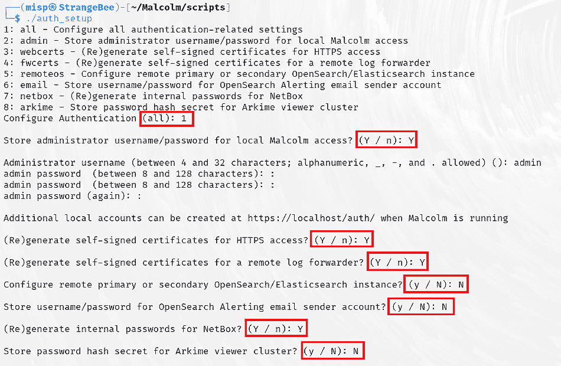
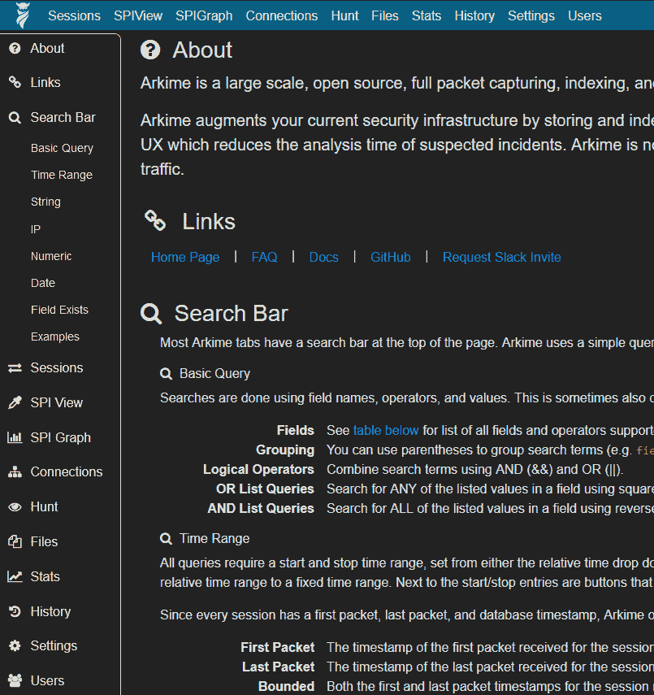

# 第六章：流量与日志分析

现在，我们已经建立了一个基础的 SIEM 解决方案，并了解了如何将流量导向该解决方案，是时候看看 Kali Purple 如何帮助我们理解我们发送的流量了。否则，如果我们无法理解这些流量，发送它们又有什么意义呢？Kali Purple 提供了一些著名的解决方案，每种方法都以不同的方式处理流量分析。我们将重点介绍**Arkime**，前身为 Moloch，以及**Malcolm**，前身为 Bro。

此外，我们还将了解恶意攻击者如何有时故意操控这些流量，以欺骗网络防御系统和人员。即使是最有经验、知识最丰富的人员和系统，也能通过一种叫做混淆的概念来拖慢它们的处理速度。训练有素的恶意攻击者知道混淆无法欺骗经过适当训练和/或经验丰富的防御分析人员，但他们仍会采用这种方法，因为他们知道，至少可以让网络防御人员感到烦恼并拖慢反应速度。这可能会为攻击者赢得更多的时间来完成他们的恶意行为。攻击者认为，训练不足、训练差或完全新手的网络防御人员，也可能为他们提供一次幸运的机会。

许多工具被设计用来解决混淆问题，但任何在网络安全行业有一定经验的人都会告诉你，有一个工具在所有工具中占据主导地位。它叫做**CyberChef**，它也包含在 Kali Purple 发行版中。

本章中，我们将通过以下主题的特点，探讨网络流量、数据包分析和混淆：

+   理解数据包

+   Malcolm

+   Arkime

+   CyberChef 与混淆

# 技术要求

本章的要求如下：

+   **最低要求**：一台计算设备，架构为*amd64 (x86_64/64-bit)* 或 *i386 (x86/32-bit)*，并至少包含 *8 GB* 的内存。

+   **推荐要求**：根据网络安全领域从业人员的反馈，推荐使用 *amd64 (x86_64/64-bit)* 架构，并配备 *16 GB* 内存——内存越大越好——以及最多 *64 GB* 的额外磁盘空间。

你还需要成功安装并运行的 Elasticsearch 实例，用于 Arkime 后台。

# 理解数据包

那些至少有基础网络传输知识的人知道，信息是通过将数据分解成非常小的可度量的块，称为**数据包**，以便更容易地通过互联网传输。这样，如果互联网上出现某种小故障，只有那一小部分数据流需要重新发送，且仅当它通过**传输控制协议**（**TCP**）发送时，接收方才需要尝试按顺序重新组装数据。

**用户数据报协议** (**UDP**)——用于直播流的默认协议——不要求将数据重组，以便数据能够尽可能实时地从发送者传输到接收方。这就是为什么你有时会在观看视频时看到短暂的卡顿。这个卡顿是由于 UDP 丢弃并忽略数据包，认为已经太晚了，节目必须继续。此信息通过终端设备上的物理接口进行发送和接收。这些接口被称为 **网络接口卡** (**NICs**)。

如果你目前使用物理电缆进行互联网连接，你可能已经对 NIC 有所了解。这个术语最初用来描述计算机内部的物理接口，它的外部面板有一个物理端口，你可以将以太网电缆插入其中以连接到设备。随着时间的推移，越来越多的人转向无线互联网连接。无线 NIC 与之类似，它也有发送和接收数据的功能。在某些情况下，这可能是一个带有天线的显著设备。随着技术的进步，尤其是在笔记本电脑设备中，无线 NIC 甚至变得不再显眼。

关于 NIC，有一个有趣的事情是，它们是信息系统中唯一一个网络地址物理上印刻在设备上的元素。这被称为 **媒体访问控制** (**MAC**) 地址。理解数据包、NIC 和 MAC 地址非常重要，因为正是这些信息被网络安全及其他网络防御系统和软件在这些位置收集并进行分析和处理。以这种方式收集数据包被称为数据包捕获。最著名的数据包捕获工具之一就是 **Wireshark**，它来自 Kali Purple 家族的红队工具。我们将在 *第十章*中讨论 Wireshark。现在，我们将专注于 Kali Purple 独有的工具。

# Malcolm

Malcolm 是一个免费的开源工具，专注于数据收集和分析。它是 **爱达荷国家实验室** 与美国 **国土安全部** (**DHS**) 合作的成果。更具体地说，贡献来自有点臭名昭著的 **网络基础设施安全局** (**CISA**)，这是 DHS 下面的一个机构。从这个角度看，你可能会感兴趣地了解到，Malcolm 实际上并不是一款单独的软件，而是许多开源工具的集合，包括本章和下一章中的其余工具！如果你仔细想想，这不正是 Kali Purple 吗？所以，我们有一个工具集合，包含在另一个工具集合中。这应该能给你一个关于 Kali Purple 深度的整体概念。

Malcolm 作为一组工具的概念有时会让人感到困惑，因为其中一些工具是众所周知的。两款工具将在本章后面介绍——Arkime 和 CyberChef。还有两款将在*第七章*中介绍——Suricata 和 Zeek。Zeek 更多与 IDS 系统相关，之前叫 Bro，这有时会让人误以为 Malcolm 曾经是 Bro。其实并非如此。只是因为它是 Malcolm 的核心工具之一。另一款工具——Suricata——也将在下一章介绍。这是一个在开源网络防御社区中非常受欢迎的 IDS 系统。

当我们学习 Kali Purple 发行版中的许多工具时，你会发现其中大多数是互操作的，或者可以与其他工具集成，几乎所有工具都可以与 ELK 堆栈集成——这也是我们首先更详细地介绍这些工具的原因。提到这一点，你会注意到，在 Malcolm 发行版中，有一些 Elastic 的 Elasticsearch 和 Kibana 的替代方案。Malcolm 提供了 OpenSearch，它是 ELK 堆栈工具的同时替代品。

获取 Malcolm 的方式与我们之前的操作有所不同，但它仍然遵循类似的概念。只要记得在运行任何配置脚本之前，先研究一下 Malcolm 提供的自定义选项。

我们将使用一个叫做 Docker 的容器化程序，稍后我们将在*第八章*中详细讨论它。现在，我们会给你答案钥匙，你可以跟着操作：

1.  启动你的 Kali Purple 虚拟机并登录到你的 Purple 实例。

1.  打开终端窗口。

1.  输入**sudo apt update && sudo** **apt upgrade**。

1.  输入**sudo apt install apt-transport-https ca-certificates curl** **gnupg lsb-release**。

1.  输入**sudo apt update && sudo apt install -****y docker.io**。

1.  如果出现错误，输入**sudo apt install -****y docker**。

1.  如果仍然出现错误，输入**sudo** **systemctl daemon-reload**。

    作为最后的手段，在执行每个前面的步骤后重新启动系统。

1.  输入**sudo systemctl enable docker**，然后重新启动系统。

1.  输入**sudo git** **clone** [`github.com/idaholab/Malcolm`](https://github.com/idaholab/Malcolm)。

1.  从根目录输入**sudo chmod -R** **777 /home/<the_name_you_gave_your_system>/Malcolm/config/dashboards.env**。

1.  输入**cd Malcolm**，然后输入**sudo chmod -R** **777 docker-compose.yml**。

1.  输入**cd scripts**，然后输入**sudo ./****configure -d**。

    仔细观察任何错误。如果提示某个操作不被允许，这意味着你需要使用**sudo chmod <value>**来更改文件权限。在本书中，我们一直在使用**sudo chmod -R 777**进行“取巧”，因为我们是在展示如何创建一个快速的概念验证。在生产环境中，你可不想给予超出必要权限的设置。

    在对文件使用**chmod**时，确保包含完整的文件路径。否则，你可能会在文件本身上拥有正确的权限，但指向该文件的目录如果权限较低，依然会阻止 Kali Linux 和/或 Malcolm 成功执行任务。

    如果提示某个操作不被允许，你通常可以认为这是缺少了**sudo**命令。例如，跳过在前面的**./configure**命令中使用**sudo**，如果你还漏掉了命令末尾的**-d**，你可能会经历整个 Malcolm 配置过程，最终才会收到操作不被允许的错误信息。发生这种情况时，你需要从后往前思考——追溯你的步骤，找到第一个你没有加上**sudo**的命令。

1.  输入**./auth_setup**（这次最好不要使用**sudo**），并记录你创建的用户凭证——首次登录 Malcolm 时你需要用到它们。

每当你通过 Kali 命令行进行 Malcolm 设置时，选项会同时展示，并且通过大写字母 Y 或 N 在是/否选项中提供推荐设置，或者将推荐值放在括号中，位于行末，如*图 6.1*所示：



图 6.1 – Malcolm ./auth_setup

到目前为止，你已经安装了 Docker 和核心的 Malcolm 引擎。现在，是时候获取我们将要使用的工具集，并允许 Malcolm 自动为这个工具集设置 Docker Compose 包装器了：

1.  要获取所需的文件，请输入**docker-compose --profile malcolm pull**。你应该能看到各个容器开始下载，如*图 6.2*所示：


图 6.2 – Docker Compose 为 Malcolm 下载容器

1.  你应该会被提示安装**docker-compose**命令。选择*Y*来安装它。

1.  输入**docker images**，确认拉取到的**docker-compose**镜像列表。

现在，剩下的就是启动它并开始使用！要启动 Malcolm，你需要保持在**scripts**目录下并输入**./start**，无需使用**sudo**。如果愿意，你可以输入**ls**查看所有可用的选项。你可以输入**./stop**停止，**./wipe**清除数据库，或者**./restart**重启。快去启动 Malcolm 吧。

如果你希望通过主机访问接口，请确保在虚拟机设置中转发**443**端口。否则，你将需要通过虚拟机内的浏览器操作。无论哪种方式，打开一个网页浏览器并导航至[`localhost`](https://localhost)——无需在 URL 末尾附加端口号，因为*https*中的*s*会告诉浏览器使用**443**端口。默认的 Malcolm 页面应该会加载，如*图 6.3*所示：


图 6.3 – Malcolm 主页在成功设置后的状态

请注意主页上关于 Arkime 和 CyberChef 的模块，它们将在本章中详细讨论。

Malcolm 的主要特点如下：

+   **数据包捕获和存储**：Malcolm 设计用于捕获、存储和分析网络流量。它依赖于诸如 tcpdump 和 Wireshark 等工具——稍后在本书中将讨论——通过捕获数据包的方式，抓取经过定义网络接口的流量，正如我们在本章开始时讨论的那样。无论使用什么介质来捕获数据，它都会将数据存储到磁盘上，同时提供管理员配置存储位置、设置优化和性能的压缩级别，甚至为数据设置保留策略的选项。像几乎所有市面上可用的数据包捕获工具一样，Malcolm 使用**数据包捕获**（**PCAP**）文件格式。这些类型的文件将包含元数据和有效载荷数据，以便分析人员在需要时重建数据并进行详细分析。像 Arkime 一样，Malcolm 可以从数据包中提取元数据，重建会话，建立数据索引并进行搜索。然后，你可以利用我们已经覆盖的任何工具（例如 Elasticsearch 和 Kibana，CyberChef（我们将在下一节讨论），以及我们将在*第七章*中查看的两种 IDS 系统）来提供完整的数据分析，另有**Snort IDS**。Snort 不是 Kali Purple 的一部分，在本文撰写时，技术上也不再是 Kali Linux 的一部分。这在一些专业人士看来是一个罪过，但经验丰富的人员可能依然能将其使用并让它正常工作。另外，像**恶意软件信息共享平台**（**MISP**）这样的威胁信息共享平台也将具有重要价值。

+   **事件后分析**：与 Arkime 不同，Malcolm 并不固有支持实时分析。相反，Malcolm 的优势在于围绕着大量设计为协同工作的工具来分析事件发生后的流量。你可能已经在我们讨论 PCAP 文件的存储与恢复选项的深度时，开始拼凑出这一点。Malcolm 利用元数据提取和通过 IDS 系统收集的信息，如果可能的话，它还会通过威胁流收集的数据显示进行补充。然而，Malcolm 事件后分析的最大优势在于其嵌入式的协作分析设计。通过这种方法，整个安全团队可以通过平台共享结果，共同工作。

+   **协议分析与解析**：你可能已经感受到一个主题。协议分析与解析是 Malcolm 的关键功能，它通过与专门的分析工具集成来实现。所谓工具，就是我们一直在谈论的那些工具，如 IDS/IPS 系统。Malcolm 支持自定义协议分析，这已经成为当今数据分析产品开发中不言而喻的需求。偶尔，协议分析还可能需要 CyberChef 和解码的帮助。不过，你更有可能将该工具与数据负载本身一起使用。

+   **元数据提取与索引**：该平台可以从已捕获的 PCAP 文件中提取丰富的元数据。它提取的数据包括协议特定的细节、负载信息、源与目标 IP 地址、时间戳以及任何其他标准输出数据，具体取决于提取发生的包的大小和类型。提取这些数据为我们刚刚讨论过的事件后分析提供了基础。它为网络通信模式和其他安全类型的事件提供了洞察。

+   **威胁检测与分析**：关于威胁检测与分析，Malcolm 采用了多方面的方法。各种工具集被用来主动识别并应对网络环境中的安全威胁。以下方法是完成此任务的主要手段：

    +   基于规则的检测

    +   模式匹配

    +   异常检测

    +   与威胁情报源的集成——稍后讨论

    +   会话重建和元数据分析

    +   自定义规则创建与调优

    +   与可视化工具的集成

    其中一些方法将在稍后讨论。它们大多与 Arkime 的功能有所重叠。例如，我们之前讨论过基于规则的检测。在这里，当一组预定义标准匹配时，就会触发检测。这些标准通常是由管理员自定义创建的，用于寻找针对组织的特定潜在威胁的特定规则。

    **模式匹配**与基于规则的检测类似，因为它寻求将数据模式与规则进行匹配。不同之处在于，这些规则可能更具通用性，或者由威胁检测引擎提供——我们一直在讨论的 IDS 系统。

    **异常检测**是在威胁检测引擎首先抓取网络行为基准并确定该环境的正常行为后发生的。当网络流量的行为偏离已建立的正常值时，便认为它是异常的，并值得进一步调查。

    **自定义规则创建**与基于规则的检测不同。那是自定义规则创建的字面结果。然而，实际上——虽然这可能听起来有些颠倒，并且让你有点困惑，所以如果你需要重读这一部分以理解它，不要觉得不好意思——它通常用于扩展基于规则的检测。是的，这听起来有点像“鸡下蛋”。我们不能总是控制术语和工具在实际应用中的演变。更直接地说，自定义规则创建是一些威胁检测引擎提供的一个功能，允许分析人员对预先存在的规则进行自定义，这些规则要么由引擎提供，要么是由分析人员在他们所在的环境中由管理员创建的基于规则的检测，然后进行分析人员级别的自定义，以进一步细化规则用于分析。

    如果你曾经使用过完全无害的**Kusto 查询语言**（**KQL**），你可能会理解这一点。KQL 可用于操控显示哪些数据以及如何显示，以便进行更深入的分析，而不实际改变数据本身的存储或值。这不完全等同于自定义规则创建，但有些相似之处。

+   **会话重建和流量分析**：Malcolm 在管理会话重建和流量分析方面非常有效。你已经掌握了使用的组件和方法的基础，因此我们不再深入讨论。组件可以按如下方式分解：

    +   会话重建

    +   元数据提取

    +   协议特定解析

    +   流量分析与数据传输

    +   与分析工具的集成

    +   自定义会话分析插件

    如果你希望强化对这些主题的理解，完全可以花时间回顾本章前面的讨论，无论是与 Malcolm 还是与 Arkime。

+   **数据可视化和报告**：使用 ELK 堆栈，Malcolm 提供了强大的数据可视化和报告功能，您可以使用它来促进全面的分析并描绘网络安全见解。Kibana 与 Malcolm 集成，正如您已经知道的那样，您可以使用图表、图形、时间轴、地图和无数其他方法来显示数据。Malcolm 为 Kibana 提供数据，帮助进行数据流可视化。这将帮助您作为分析师，获取数据传输行为、交易模式和网络会话活动的图形表示，从而更容易发现任何异常行为或异常行为。

    分析人员还可以根据他们处理的数据使用元数据属性和**威胁指标** (**IoCs**) 等多种选项生成报告。生成报告可以节省分析人员大量的时间，用于组织和提供**事后审查** (**AARs**) 的文档、与利益相关者的沟通以及合规记录和报告。

+   **定制和可扩展性**：Malcolm 的另一个关键功能是其定制和可扩展性。这一功能与 Arkime 的提供完全相同，是我们迄今为止讨论的所有内容的结果。如果需要更深入的解释，请随时参考前一部分。总之，这些功能包括：

    +   能够创建捕获插件

    +   与第三方工具集成

    +   自定义仪表板和/或其他可视化选项

    +   基于规则的检测和自定义规则

    +   数据包分析和增强

+   **用户访问控制** (**UAC**) **和协作**：UAC 和协作与 Arkime 采用相同的方法支持。需要注意的重要概念是**基于角色的访问控制** (**RBAC**)。很容易把基于角色的某事物误认为基于规则的某事物。如前所述，基于规则的某事物是基于一组预定义规则的某事物。然而，基于角色的某事物是基于预定权限或权限组的某事物。

    在技术世界中，这些预定权限组称为角色。角色通常是事先根据未知用户设置的。角色设置完成后，可以将用户添加到涵盖这些角色的组中。这意味着管理员在用户入职或获得特定角色的权限时不需要为每个用户单独设置权限。管理员只需将该用户分配到预定义组中，那么所有权限和权利就会自动为该用户提供。当然，管理员可以在个别用户的权利方面进行精细的工作，以获得更细粒度的控制。Malcom 的 UAC 和协作功能包括协作工作区、数据共享、审计跟踪、活动日志以及用户管理和配置。

+   **与安全工具的集成**：除了我们已经提到的 ELK 堆栈和 IDS/IPS 工具外，Malcolm 还与一款叫做**量化统一扩展威胁响应**（**TORQUE**）的网络流量分析工具无缝集成。TORQUE 与其他网络流量分析工具的不同之处在于几个关键特征和独特的或有限供应的特性。

    实时分析已经变得越来越流行，并且不再是独特的，但值得一提的是，TORQUE 是最早提供实时分析结果的流量分析工具之一。正如你已经发现的那样，实时分析意味着分析人员可以在网络活动发生时立即进行检查和响应。

    TORQUE 提供量化分析功能。这使得组织可以对网络流量模式、数据趋势和通信行为进行深入的量化评估。量化分析是一种使用统计学和高等数学对数据进行系统性和结构化检查的方法，以从中提取洞察、识别模式，并得出可操作的结论。它可以涉及计算和深入评估统计指标，如平均值、标准差和频率，以及网络流量数据的分布模式。它还可以研究历史趋势和行为，并与当前趋势进行比较，以识别模式和行为变化。这有助于异常检测。

    风险评估和容量规划是 TORQUE 的重要功能。通过数学方法，管理员可以计算某些威胁的概率和潜在影响，应用公式于流量量、带宽和资源使用/需求。这反过来可以提供性能评估的副产品，帮助管理员和工程师识别需要解决和/或改进的重点领域。

+   **警报和通知**：任何网络安全防御产品最受欢迎的功能之一就是能够接收通知和警报。我们可以使用基于规则和异常检测的警报来开发警报。然而，Malcolm 还支持一些额外类型的警报。

    有阈值警报功能，当网络流量数据中的某个特定指标或行为超过预设阈值时，系统会触发警报。网络工程师（或你自己）可能会发现这种类型的警报非常实用，尤其是在你希望监控和响应网络流量模式异常时，比如流量量的突然激增或终端的 CPU/RAM 使用情况。

    你将能够创建自定义警报，检查不同方式的警报通知传递方式，例如电子邮件、短信，或与其他工具或 SIEM/SOAR 解决方案的集成。这也可以用于针对特定利益相关者发送特定通知，而不是所有通知。这在高警报量的情况下非常有用，因为在 SOC 环境中，可能有很多具有不同专业技能的人在一起工作。因此，你可以根据收件人的角色和职责，以特定方式设置警报通知的传递。这也支持在需要时的升级工作流。

    Malcolm 警报功能可以与流行的通讯工具，如 Microsoft Teams、Slack 以及其他事件响应平台进行集成。与 Malcolm 的所有工具一样，警报和通知也可以发送到 Kibana 或其他可视化平台，帮助用户获取他们正在查看的数据的图形化表示。

现在我们已经在 Malcolm 中安装了 mama 和 papa 系统（尽管我们不能说我们曾遇见过一位叫 Malcolm 的 mama，但嘿，一切皆有可能！），是时候深入了解一下套件中包含的一些惊人工具了。我们将在下一部分开始介绍一款名为 Arkime 的数据包捕获和索引工具。

# Arkime

Arkime 是一款属于数据包捕获和索引类别的工具。像我们从 Kali Purple 覆盖的所有工具一样，它是免费且开源的软件。Arkime 设计时考虑了与大规模部署的高效兼容性。然而，这也带来了资源上的消耗，例如存储和 RAM 容量。你希望部署规模越大，所需的资源也就越多。幸运的是，该组织在其官网提供了一个资源计算器，帮助你做准备。对于那些有宏大目标、可能正在阅读本书的人，我们会在 *进一步阅读* 部分提供该链接。

与 ELK 堆栈一样，Arkime 拥有足够多的功能和自定义选项，足以让一本书只讲述这一款产品。因此，我们仅会重点介绍该产品的功能。作为一名网络安全专业人士，仅凭阅读本书，你已经知道独立研究将始终是你生活的一部分，就像外科医生、律师以及所有其他白领职业一样。欢迎加入这一群体——那些深入研究并 intellectually elite 的人们。

Arkime 组织以其一种称为**全包捕获**（捕获每一个数据包）的数据包捕获方式而自豪，而不是**过滤数据包捕获**（只捕获符合预定标准的数据包）。市面上有许多数据包捕获产品品牌。Arkime 是免费的开源软件；这也是你可能已经意识到的 Kali Purple 发行版的主题。别自欺欺人，虽然它是免费的，但并不意味着它是便宜的。Arkime 是一个强大的工具！它非常稳健，且运行效果非常强大——甚至比任何商业产品更强大。

如果你之前有接触过这一网络或网络安全领域，你可能已经知道 Arkime 的前身是 Moloch。开发人员做了一件我们很多人可能希望更多现代技术公司能做的事情。他们提供了 Arkime 一词的发音！根据他们的网站，它应该读作 Arkime (/ɑːrkɪˈmi/) 或（R Kim Me）。他们提到更名是因为反馈表示 Moloch 这个词可能被用在不太合适的场合。Arkime 这个新名字的灵感来源于传说中的巫师梅林的猫头鹰阿基米德，以及古希腊著名数学家同名的人物。

在我们谈论 Arkime 的功能之前，你可能需要先获取一份该产品。然而，请注意，在本章中，你无需让我们讨论的任何软件在你阅读时正常运行。这里的内容大部分是高层次的概述，因为我们所讨论的每个 Kali Purple 组件都足够强大，值得它们各自的独立出版物。然而，如果你喜欢在项目中全身心投入，直到完全忘记时间，甚至你的妻子威胁说如果你不承认她的存在就会离开你，那么获得和运行它依然是有价值的。等等，这是不是软件工程师手册…

和你的配偶达成和解。然后我们就可以开始了。是时候放下辅助轮，给你一些独立的乐趣来安装 Arkime 了，当然前提是你决定这么做。在你走传统路线之前，或许做几次互联网搜索，看看 Arkime 自本书出版以来是否有更新，或者是否有其他的仓库可用。记得留心查看是否为真实仓库以及文件哈希的可用性，尤其是当你使用的不是我们在 Linux 中使用的 APT 终端方法时。

否则，如果你想要发挥你内在的 Linux 高手潜力，那么你知道该怎么做：

1.  启动 Kali Purple 虚拟机并登录到你的 Purple 实例。

1.  打开一个终端窗口。

1.  输入**sudo apt update && sudo** **apt upgrade**。

1.  输入**cd Malcolm/scripts**。

1.  输入**./ start**，不要使用**sudo**。

1.  输入**docker ps**，以验证 Arkime 是否正在运行，如*图 6.4*所示：


图 6.4 – 使用 docker ps 命令确认 Arkime 正在运行

1.  现在，我们可以打开一个网页浏览器并访问 [`localhost`](https://localhost)。

    记住，URL 后无需附加端口号，因为 *https* 中的 *s* 告诉浏览器使用端口 **443**。

1.  要访问 Arkime，只需点击 Malcolm 首页上的 **Arkime** 瓦片，如 *图 6.5* 中突出显示的那样：


图 6.5 – Malcolm 首页上的 Arkime 瓦片

加载 Arkime 后，最重要的部分就是主页左上角的猫头鹰。点击它查看所有提供的选项。此外，注意顶部横幅上的主导航。这两项将提供你使用产品所需的所有直观链接，如 *图 6.6* 所示：


图 6.6 – Arkime 的默认视图主页

注意

在你继续与 ELK 堆栈之外的 Kali Purple 工具进行交互时，保持一定的耐心至关重要。这些工具中的一些会非常频繁地更新，每次更新时，获取、安装和运行的方式都有可能发生变化——无论是有意为之还是无意的结果。这时，你的分析师思维就派上用场了。在本书内容开发过程中，多个项目在写作过程中被其创作者更新，而在此过程中，获取和/或安装或配置应用程序的方式发生了变化。正因为如此，我们选择了使用 Docker 来处理任何多应用程序设置或具有独立开发依赖项的应用程序。

这是 Arkime 的 **关于** 页面：



图 6.7 – Arkime 的猫头鹰导航和 FAQ 访问

让我们来看看 Arkime 的关键功能：

+   **数据包捕获与存储**：Arkime 通过使用网络接口卡（NIC）来捕获网络数据包，正如我们在第一部分中提到的那样。它通过所谓的 **混杂模式** 来实现。混杂模式下，数据包捕获应用程序会收集通过其所监控的网络部分的所有数据。这意味着它可能会收集并非专门为该设备而发送的数据，这些数据可能会经过该设备，继续传输到网络中其他设备。相反，**非混杂模式** 只捕获被发送到特定设备 MAC 地址的数据包，这个设备即为 Arkime 所监控的设备。

+   **实时流量分析**：顾名思义，实时流量分析是指 Arkime 会从网络接口卡（NIC）捕获数据包，并立即将数据发送到 Elasticsearch 进行索引和存储。它在活动发生时一次性完成这一过程。Arkime 的设计使其能够监控实时网络会话，从而跟踪网络连接的行为，并观察用户行为的发生。通过采用这种方法，Arkime 及其集成的工具能够快速识别异常和潜在的威胁数据流，以便分析人员能迅速做出反应，阻止不法分子的行为。

+   **可扩展性和性能**：可扩展性和性能是 Arkime 相比于类似的竞争性网络监控软件的最大优势。该应用程序被设计为支持分布式架构。这意味着它可以捕获数据包、查询并对其进行索引，然后将其拆分并发送到不同的互联节点，这些节点包括不同的物理计算设备，以便统一处理。正如你可能已经猜到的，这不仅使得工作负载能够高效地分配，而且还支持故障容错，并可以轻松地升级和改善设备。

    故障容错指的是当某个设备或节点出现故障时，系统可以引导其他节点接管工作，直到技术人员修复故障节点。有时，节点需要有意地下线。这可能是为了进行常规维护、升级或更换。这也意味着可以动态添加新的节点，而无需停止或干预正在进行的活动配置。技术人员只需添加新节点，然后调整 Arkime 的规则，以使其识别并利用新增的节点，除了已经存在的节点外。

+   **元数据生成和索引**：当 Arkime 捕获数据包时，它会收集整个数据包。这包括有效负载，即发送设备指示发送的数据，以及头部信息，这是为了帮助网络和路由设备将有效负载以正确的方式发送到正确位置的附加信息，以及关于整个数据包的其他重要信息。在这些数据包中，有一些数据片段显得尤为突出，因为它们对数据成功传输至关重要。这些特别突出的数据片段被称为**元数据**。元数据的例子可能包括源和目标 IP 地址、时间戳、有效负载或总数据包的字节大小，以及其他各种可能性。

    用于传输协议的元数据形式之一包括：

    +   **传输控制协议**（**TCP**）：用于在发送设备和接收设备之间建立通信后传输数据

    +   **用户数据报协议**（**UDP**）：用于在无需先建立连接的情况下传输数据

    +   **超文本传输协议**（**HTTP**）：用于在 web 服务器与客户端（即用户的浏览器）之间传输数据

    +   **超文本传输安全协议**（**HTTPS**）：这与 HTTP 相同，不同之处在于它使用加密进行身份验证和数据传输

    +   **文件传输协议**（**FTP**）：用于将整个文件集从文件服务器传输到用户的设备

+   Arkime 足够慷慨，公开发布了其产品的截图，展示了产品的不同方面，给了我们更多时间和空间来讨论该产品。如果您想获取这些功能的视觉展示，可以在 *进一步阅读* 部分找到指向 Arkime 截图和解释的链接。

    捕获这些数据包并提取元数据后，Arkime 还将利用 Elasticsearch 强大的功能对数据进行索引、存储和检索。Arkime 允许管理员为元数据字段定义自定义索引和映射。这对企业级部署工具尤为重要，因为提取和存储的数据可以以对组织特定需求最有用的方式进行组织。Arkime 允许借助 Elasticsearch 支持的已索引数据轻松进行搜索和从 Arkime 界面中检索。

+   **搜索和查询功能**：通过 Arkime 的用户界面，用户可以执行细粒度的搜索——即详细、特定的搜索——并且能够执行精确查询，定位捕获的网络流量数据中的细节。这是一种允许用户在数据包中定位特定字段或属性的搜索方式。

    Arkime 支持多种搜索方式：

    +   通过逻辑和数学运算符

    +   通过元数据字段

    +   支持全文搜索——包括整个单词、短语和模式

    +   通过正则表达式和复杂模式

    +   通过保存的搜索模板——用户可以为常用搜索创建这些模板

    Arkime 可以与可视化工具集成，将其通过任何这些搜索方法收集的信息以图形格式（如时间线、直方图和图表）呈现。Arkime 还允许用户与同事共享搜索结果，进行团队分析。用户可以导出搜索结果，以便与外部系统或记录一起使用。

+   **数据包重组和会话重建**：Arkime 具有令人惊叹的能力，可以重组数据包并重建会话，这赋予了它强大的能力，能够直接在数据传输的包和会话层面上拼接和分析网络流量数据。这一能力在初始的数据包捕获过程中被使用。软件会识别碎片化或分段的数据包，并智能地对其进行检查，将它们拼接回原始的单一数据包，从而对捕获的数据进行完整和准确的分析。这使分析师能够查看任何场景的完整图景，这也有助于进行根本原因分析。

    进一步提升，Arkime 还可以通过分析数据包并逻辑地将相关数据包归为一组来重建会话，如果它们是相关的并且属于同一数据流。这种做法使分析师能够查看会话的完整交换，从而提供更宏观的场景背景。分析师可以通过查看两个端点之间的数据交换的全貌，采取更加整体的数据分析方法。

+   **威胁检测与分析**：到目前为止我们讨论的所有内容都是 Arkime 的威胁检测与分析的一部分，此外还有更多！以下也是这一关键功能的一部分：

    +   元数据增强

    +   基于规则的检测

    +   协议分析和异常检测

    +   与威胁情报源的集成

    元数据增强与典型的数据增强相同，收集到的数据会与预先存在的相关数据表进行比较，以帮助将信息解析为更清晰的类别。基于规则的检测就是字面意思。管理员可以创建自定义规则来寻找精确的威胁、行为模式和 IoC（入侵迹象）。

    协议分析和异常检测是检查和解读网络流量中使用的通信协议的过程，目的是评估不常见、异常或异常的行为。它涉及对通信数据包的头部、结构和有效载荷进行解剖。然后，将这些信息与使用的协议（如 TCP、UDP、HTTP、HTTPS、DNS 等）进行比较和对比。管理员将寻找通信模式的变化，例如流量量和握手失败。握手是发送和接收设备之间进行身份验证的过程，也是建立两个设备之间连接的过程。

    与威胁情报源的集成是 Arkime 通过订阅或其他方式获取第三方已经汇总的信息的过程，第三方如**AlienVault OTX**（现名为**LevelBlue Labs**）、**FBI InfraGuard**、**Spamhaus**或**Proofpoint**等，并将这些信息导入其自身环境，帮助分析数据。这是一种数据丰富化的形式。第三方信息的例子包括受信任的黑名单、已知的威胁指示符，如目录化的恶意 IP 地址，及其他威胁情报信息。订阅这些情报源可以大大减轻任何组织的工作量，因为你可以获取其他人已经完成并共享的工作成果。

+   **可扩展性和集成**：与威胁情报源集成类似，Arkime 允许通过捕获插件、协议解析器和解码器对自身进行扩展，从而支持更广泛的集成。捕获插件是定制的代码模块，允许 Arkime 从专门或非典型的源中获取网络数据包信息。例如，从**工业控制系统**（**ICS**）获取信息，工业控制系统广泛应用于制造业和关键基础设施，如城市水务和排污厂或核电厂。这些插件*扩展*了 Arkime 的基本实用功能，创造了产品本身的可扩展性。通过捕获插件提供资源和支持，用以解码和解析从非标准源获取的数据，可以进一步增强可扩展性。

    Arkime 还支持查看插件，这些插件通过用户界面增强功能，扩展了产品显示数据的能力。它允许组织创建仅展示与其任务最相关的数据的显示界面。这反过来有助于提高分析效率和生成更详细的报告。

    协议解析器与捕获插件和查看插件的功能类似，它们通过提供定制化的功能来扩展产品的能力。在这种情况下，它是用于解码、解析和分析专用的、罕见的协议，并将协议数据与先前索引的元数据相结合，进行丰富化处理的代码。

+   **用户访问控制和权限**：通过其身份验证和授权机制，Arkime 可以提供高质量的用户访问控制和权限管理。虽然 Arkime 支持基本的用户名/密码身份验证方法，但它还提供与身份提供者的**单点登录**（**SSO**）集成，以及通过**轻量级目录访问协议**（**LDAP**）或**活动目录**（**AD**）的身份验证。通过提供这些集成，拥有现有身份管理基础设施的组织可以认证其尝试访问 Arkime 平台的用户。

    还包括了 RBAC。你在设置 *第五章* 中的 Filebeat 时体验过这一小部分功能。它允许管理员定义具有预设权限集的角色，然后将用户分配到该角色中。这种用户权限管理方式可以提供更精细、颗粒化的控制，定义哪些用户可以访问平台内的特定功能、数据和其他管理权限。

    Arkime 还维护了非常详细的用户活动审计记录。这不仅有助于提供对用户操作和变更的适当可视化，还为在管理层面保留努力提供了一条途径，从而创建审计记录以满足任何合规性要求。

+   **丰富的数据可视化**：Arkime 通过结合可定制的仪表盘、图形化表示和交互式可视化来实现丰富的数据可视化。像大多数基于仪表盘的平台一样，用户可以通过小部件自定义他们的仪表盘。在这种情况下，小部件可以通过诸如流量量、协议分布、威胁警报、数据包捕获统计信息和主要通信者等主题来强调实时或历史数据。用户可以汇总并显示关键指标、趋势和分析结果。它可以利用图表、图形、时间轴、热力图、网络流量模式、异常情况、通信关系和性能指标等图形表示形式。交互式可视化可以发生在用户动态探索和与数据互动时，例如通过缩放、应用筛选器、在时间范围内平移以及深入挖掘更具体的数据元素，从而获得更详细的洞察或更大的情境理解。

虽然 Arkime 主要用于整体流量分析，但当流量以某种方式被编码或混淆时，还有另一种工具可以进一步优化这种分析。该工具也可以通过 Malcolm 图形用户界面访问，它被称为 CyberChef。

# CyberChef 与混淆

你已经看到了一些关于美国政府对网络安全领域贡献的介绍。现在，让我们来看看英国的贡献。CyberChef 是每一个从事网络安全工作的人应该拥有的最重要工具之一。它由英国的**政府通信总部**（**GCHQ**）创建。该组织被认为是三大情报和安全机构之一，负责为英国政府和武装部队提供**信号情报**（**SIGINT**）和信息保障。（另外两个是 MI5 和著名的 MI6，来自詹姆斯·邦德和《碟中谍》流行文化——没错，这些组织是真实存在的。）

GCHQ 开发了 CyberChef，旨在作为一个开源 Web 应用程序，处理各种数据处理、转换和分析任务。它一直旨在满足网络安全专业人士、数字取证专家和数据分析师的需求。它配有一个用户友好的界面，并且由于它是作为开源发布的，组织可以拿它来进行调整并集成到他们的工具中。这是因为将工具在线使用仍然会使其用户与产品之间的数据通信易受到拦截，这本身就是一个安全风险。当作为桌面工具使用或集成到组织的 SIEM 解决方案中时，处理的数据可以被限定在使用它的地方。一个这样的解决方案是 Devo SIEM/SOAR 解决方案，它被认为是下一代云 SIEM。Devo 在其工具箱中嵌入了一个 CyberChef 版本，授权的分析师和组织内的用户可以使用，以便客户的数据不必穿越其初始收集数据的网络防御。Devo 不是 Kali Purple 的一部分，但我们仍然在*进一步阅读*部分提供了一个链接，以满足你的好奇心。

你可能正在想，“*好吧，那 CyberChef 到底有什么大不了的？*”让我们来探讨一下。使用本章中我们讨论的工具时，分析师常常会遇到加密或混淆过的数据。甚至有时候，你可能希望对那些没有加密或编码的数据进行某种形式的加密或编码。所有这些都可以通过 CyberChef 来实现。CyberChef 是一个非常强大的 Web 应用程序，可以与其他网络安全工具集成。正如我们刚刚讨论的，它也可以作为桌面工具下载，或集成到现有工具中。它专门处理原始数据分析，包括加密/解密、编码/解码以及一种称为混淆的编码子形式。它旨在以灵活而用户友好的方式处理各种数据转换任务。CyberChef 被它的创造者 GCHQ 称为*网络瑞士军刀*。

获取 CyberChef 你有很多选择。如果你是那种喜欢走捷径的类型，你可以跳到本章的最后，在*进一步阅读*部分找到一个快速链接。那是获得这个应用程序的最快方式……除非你已经安装了 Malcolm，并且你的 Kali Purple 虚拟机已经运行。*<<在这里插入邪恶笑声>>* 但是，由于我们正在使用 Kali Purple，我们将解释如何在 Purple 环境中获取 CyberChef。

这也非常简单。首先，确保你安装了 Kali Purple 的虚拟机已经启动并正在运行。然后登录到你的 Purple 实例，打开一个终端窗口，并按照我们从 *第三章*开始灌输给你的密集牺牲式操作进行。我们可以总结如下：

1.  启动你的 Kali Purple 虚拟机并登录到你的 Purple 实例。

1.  打开一个终端窗口。

1.  输入 **sudo apt update && sudo** **apt upgrade**。

1.  输入 **cd Malcolm/scripts**。

1.  输入 **./ start**，不要使用 **sudo**。

1.  输入 **docker ps** 来验证 Malcolm 是否启动并正在运行，如 *图 6.8* 所示：


图 6.8 – Malcolm 预包装的 Docker 套件已启动并正在运行

1.  现在，我们可以打开一个浏览器并访问 [`localhost`](https://localhost)。

    再次提醒，无需在 URL 末尾附加端口号，因为 *https* 中的 *s* 会告诉浏览器使用端口 **443**。

1.  要访问 Arkime，只需在 Malcolm 的主页上选择并点击 **Arkime** 磁贴，如 *图 6.9* 所示：


图 6.9 – Malcolm 预包装的 Docker 套件已启动并正在运行

继续选择并点击那个磁贴。它会为你加载 CyberChef 工具。在左上角，你会注意到可以将此工具下载到你的本地设备。让我们来测试一下！将以下代码复制并粘贴到右上角的 **Input** 窗口，如 *图 6.10* 所示：

```
S2FybCBMYW5lIGlzIG15IG1vc3QgZmF2b3JpdGVzdCBhdXRob3I gaW4gdGhlIHdob2xlIHdpZGUgd29ybGQuICBI ZSBoYXMgdGhlIGdvb2Rlc3QgZ3JhbW1pciBhbmQgYmVzdGVzdCBzdHlsZS4=
```

经验将教会你如何识别不同编码方式的样子。作为网络防御者，你最常遇到的两种编码方式是 **Base64** 和 **URL 编码**。我们提供的这段代码示例是 **Base64 编码**。选择左栏中顶部标记为 **Favorites** 的磁贴。当你这样做时，区域会展开，在其中你会看到一个叫做 **From Base64** 的选项。点击并按住它，拖动到中间标为 **Recipe** 的窗口，松开鼠标让它掉在那里，如 *图 6.10* 所示。

你会注意到，还有一个叫做 **To Base64** 的选项。没错 – CyberChef 除了能解码，还能用于编码。继续点击左栏中的所有区域，查看展开的列表。你将看到解码各种信息的选项，包括 **摩尔斯电码**！这有多酷？

然而，你不会看到的是 *错误语法解码器*。考虑到这一点，点击中间列底部的 **Bake** 按钮。如果你已经勾选了 **Auto Bake** 框，查看右下方名为 **Output** 窗口中的结果。奇怪，**Base64** **解码** 后的消息是什么？


图 6.10 – CyberChef 演示

CyberChef 的关键特性如下：

+   **数据转换**：CyberChef 用户可以从内置的操作列表中选择并组合数据操作选项，创建其所称的自定义数据转换配方。该列表包含了处理编码/解码、压缩、加密/解密、哈希、正则表达式等的选项。用户可以从 CyberChef 界面左侧栏选择选项，然后将其拖放到中间窗口。CyberChef 会从上到下处理这些指令。因此，它会首先执行你拖入窗口的第一个选项的计算，接着使用你拖入的下一个指令，将其应用于第一个计算的结果，依此类推。这支持批处理操作。用户可以保存任何重复使用的任务，以便将来方便重用。

+   **加密与解密**：通过 CyberChef 的加密功能，你可以使用对称和非对称加密算法，这对于那些可能负责数据安全工作的你来说非常有用。你可以从左侧栏访问许多内置的加密操作，包括但不限于 AES、DES、RSA、Triple DES、Blowfish 和 XOR。你还可以利用 CyberChef 对十六进制、URL 和 Base64 编码进行编码/解码等操作。考虑到这些选项，你可能猜到该工具可以用于密钥管理和哈希操作（如 MD5、SHA-256 等）。如果你从事加密学相关工作，那么你会高兴地知道，CyberChef 还可以帮助你创建自定义的加密参数，如密钥大小、块大小、填充模式和链式模式。

+   **文件处理**：使用 CyberChef，你可以读取整个文件输入，并将结果输出到整个文件。要获取文件作为输入，请前往**输入**窗口的右上角，选择带有箭头指向文件夹的图标以获取文件输入，如*图 6.11*所示。支持的文件类型包括 JSON、XML、二进制和文本：

图 6.11 – CyberChef – 获取文件作为输入

你还可以使用位运算对二进制文件进行字节级操作。此外，CyberChef 提供了十六进制转储可视化功能，帮助分析这些二进制数据和文件内容。高级用户可以学习如何使用专门针对 JSON、XML、CSV 等特定文件格式定制的操作解析并提取结构化数据。他们还可以执行基于行的处理、元数据提取和批处理操作，以及开发自定义工作流来支持特定的文件操作需求。

+   **正则表达式**：CyberChef 工具提供了简单且专门的操作，用于将正则表达式应用于输入数据。左侧列，有时被称为 CyberChef 的操作列，提供了你的正则表达式操作。用户可以使用它来定义、配置并将正则表达式应用于数据输入。如果你愿意，还可以指定一个正则表达式模式，用于在输入数据中进行搜索和比较。正则表达式操作可以用于匹配模式，并通过这种方式，还可以用来转换和/或替换数据，提取与正则表达式匹配的数据，或者与其他操作（如编码/解码或分析师定义的其他任务）混合使用，以实现快速的模式识别和数据提取。CyberChef 直观的界面帮助为工作增加了可视化元素，使得那些略显晦涩的正则表达式模式更易于解读。

+   **网络和编码**：在与信息的网络编码相关的操作方面，CyberChef 的操作列提供了处理 IP 地址的选项，包括在十进制和二进制表示之间转换、从文本中提取 IP 地址，以及执行 IP 地址操作，如子网划分和 IP 地址验证。你还会看到一些用于剖析和分析网络数据包、解码数据包头和协议特定分析、URL/URI 处理以及 Base64 编码和解码的选项，这些常见于网络信息中。如果你按照我们之前的建议，去探索左侧列，你会看到十六进制操作、编码转换，如 URL 编码和 HTML 实体编码，以及 Unicode 表示。这里有一些有趣的操作供你参考。如果你选择操作中的**数据**格式子标题，你会看到你可以进行盲文转换；如果你继续往下，选择**加密/编码**，你就会找到我们之前提到的**摩尔斯电码**转换。

+   **自定义操作**：我们在本章讨论的每一个工具都有一个非常棒的特点，那就是它们都提供了大量的自定义机会。CyberChef 也不例外。你可以通过在界面中使用 JavaScript 代码开发自定义操作。这是该产品可扩展性的美妙之处。如果你有编码或软件工程背景，你可能已经熟悉 JavaScript；如果没有，我们在*进一步阅读*部分提供了一个链接供你参考。作为一名网络安全专业人员，建议你首先提升 Python 技能，但任何额外的编程语言技能始终是有用的。

+   **数据分析**：到目前为止提供的解释无疑向您展示了数据分析是 CyberChef 的一个关键功能。如果您不确定 CyberChef 在以下数据分析功能中的贡献，请回顾之前的任何主题：

    +   数据转换

    +   加密与解密

    +   正则表达式

    +   文件处理

    +   网络操作

    +   自定义选项

    +   虚拟化

    +   与其他工具的集成

每当您处理流量分析时——这正是网络安全防御方面的核心内容——您将遇到通过编码和加密数据等伎俩来规避防御的尝试。这使得 CyberChef 成为您整个防御工具集中最为关键的工具之一。我们承诺，您可以在 Kali Purple 之外、在 Malcolm 之外快速轻松地访问 CyberChef。准备好了吗？请听鼓声……只需将以下网址粘贴到任何浏览器中，并直接从源站使用：[`gchq.github.io/CyberChef/`](https://gchq.github.io/CyberChef/)。缺点是，数据隐私和数据隐私法等问题使得远程使用 CyberChef 成为一种有风险的选择，因为任何被解码的数据可能是高度受保护的。最安全的做法是下载本地副本或将其集成到您的工具集中，正如我们在 Malcolm 中所做的那样。

# 总结

在这一章节中，我们提供了对将流经我们网络的流量的高层次概述，因此也涵盖了我们的网络防御解决方案。我们考察了 Kali Purple 提供的几款工具，这些工具可以部署并与其他工具集成，以分析这些数据，并在必要时对其进行处理。这些解决方案都广为人知，其中一些，如 Arkime，是由私营部门组织创建的，而其他一些则是由政府组织创建和/或汇编的。更有趣的是，一些政府组织会将私营部门的工具包含在他们的汇编中，例如 Malcolm 和 Arkime。

我们了解到，Arkime 是一个强大的网络数据分析工具，专为大规模组织及预计会快速增长的组织设计。Arkime 的最大优势是其可扩展性。我们还探讨了一套由美国政府机构（来自爱达荷州和联邦的国土安全部）合作开发的工具。

最后，我们介绍了世界著名的 CyberChef，它是每个网络安全专业人士必备的工具。我们了解到，它是由英国情报机构 GCHQ 创建和发布的。我们探讨了 CyberChef 在数据处理和各种加密学元素方面的强大功能。我们还了解到，它可以在线使用，作为桌面产品下载，或集成到我们的独立软件解决方案中。

在深入研究所有这些工具之前，我们简要探索了数据包，以便理解这些工具如何与工作在数据包级别的工具集成。在这个过程中，我们了解了 IPS 和 DPS，这两者将在*第七章*中进行更深入的探讨。

# 问题

请回答以下问题，测试你对本章内容的掌握：

1.  Arkime 是一个网络流量捕获和分析工具，曾被称为什么？

    1.  Malcolm

    1.  莫洛托夫鸡尾酒

    1.  Moloch

1.  当 NIC 以混杂模式操作时，这意味着什么？

    1.  NIC 捕获通过它的所有流量，无论最终目的地是什么

    1.  NIC（网络接口卡）对其通过的数据非常友好

    1.  NIC 仅捕获设备本身是最终目的地的数据

1.  什么是实时流量分析？

    1.  坐在立交桥上，研究经过的不同品牌和型号的汽车

    1.  分析按格里历时间格式标记为 Zulu 时间的网络流量

    1.  分析网络流量的能力，实时发生时进行分析

    1.  检查过去 20 分钟内发生的任何流量

1.  CyberChef 的创始人还将其称为什么？

    1.  网络安全瑞士军刀

    1.  英国顶级厨师

    1.  爱尔兰军队通用工具

    1.  皇家海军工兵铲

1.  在管理员捕获基线并比较未来流量与基线的偏差后，发生了什么类型的威胁检测？

    1.  正则表达式检测

    1.  异常检测

    1.  模式匹配

    1.  异常检测

# 进一步阅读

若要深入了解本章涉及的主题，请查看以下资源：

+   **Arkime 主页和** **文档**: [`arkime.com/index#home`](https://arkime.com/index#home)

+   **Arkime 导航** **资源**: [`arkime.com/index#screenshots`](https://arkime.com/index#screenshots)

+   **Malcolm 网络流量分析** **文档**: [`inl.gov/content/uploads/2023/07/Network-Traffic-Analysis-with-Malcolm.pdf`](https://inl.gov/content/uploads/2023/07/Network-Traffic-Analysis-with-Malcolm.pdf)

+   **CyberChef 跨网远程访问** **版本**: [`gchq.github.io/CyberChef/`](https://gchq.github.io/CyberChef/)

+   **Devo SIEM/SOAR** **解决方案**: [`www.devo.com/experiences/devo-siem-walkthrough/?utm_campaign=2023_next-gen_siem&utm_term=devo%20siem&utm_source=google&utm_medium=cpc&utm_content=644484296347&hsa_src=g&hsa_ver=3&hsa_cam=1423896132&hsa_kw=devo%20siem&hsa_ad=644484296347&hsa_tgt=kwd-652171837431&hsa_mt=b&hsa_acc=4869300310&hsa_grp=59041274115&hsa_net=adwords&gad_source=1&gclid=EAIaIQobChMIkqqlxcrCgwMVw3d_AB0RpgP7EAAYAiAAEgLv2_D_BwE`](https://www.devo.com/experiences/devo-siem-walkthrough/?utm_campaign=2023_next-gen_siem&utm_term=devo%20siem&utm_source=google&utm_medium=cpc&utm_content=644484296347&hsa_src=g&hsa_ver=3&hsa_cam=1423896132&hsa_kw=devo%20siem&hsa_ad=644484296347&hsa_tgt=kw)

+   **学习** **JavaScript**: [`www.w3schools.com/js/default.asp`](https://www.w3schools.com/js/default.asp)

+   **学习** **Python**: [`www.w3schools.com/python/default.asp`](https://www.w3schools.com/python/default.asp)
