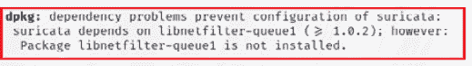
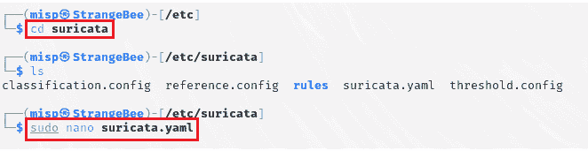
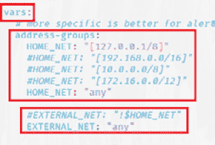
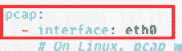
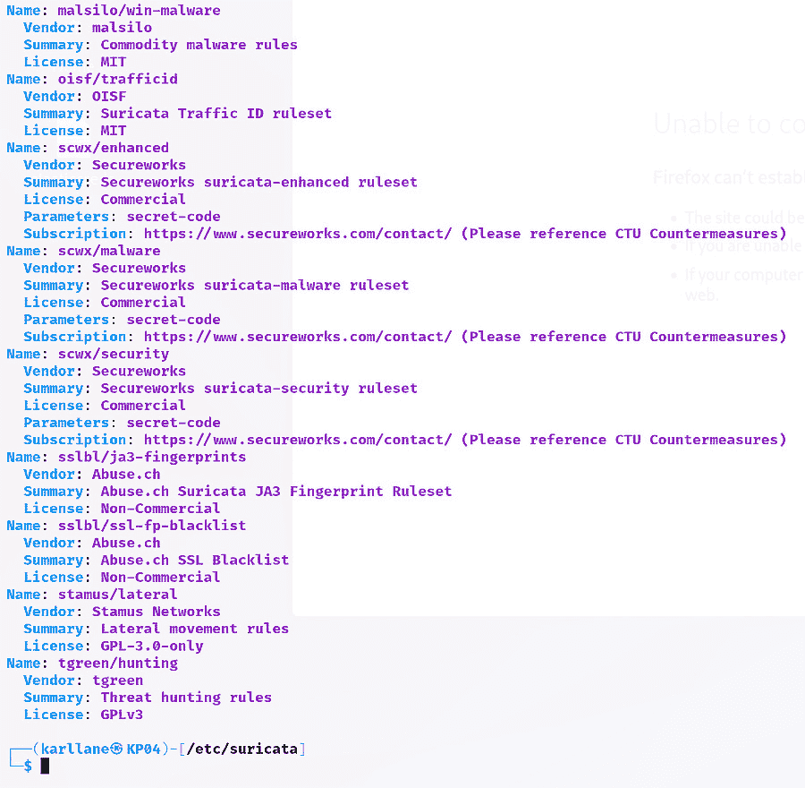
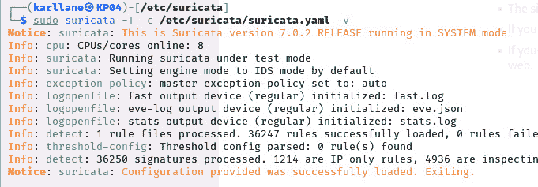
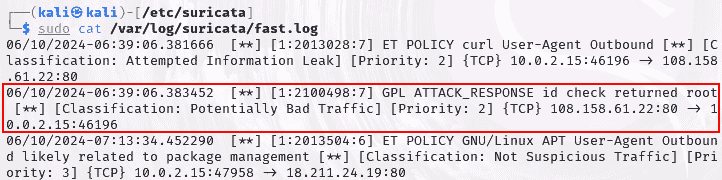
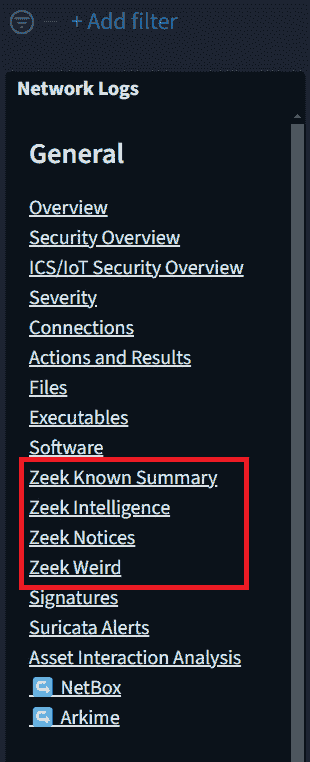
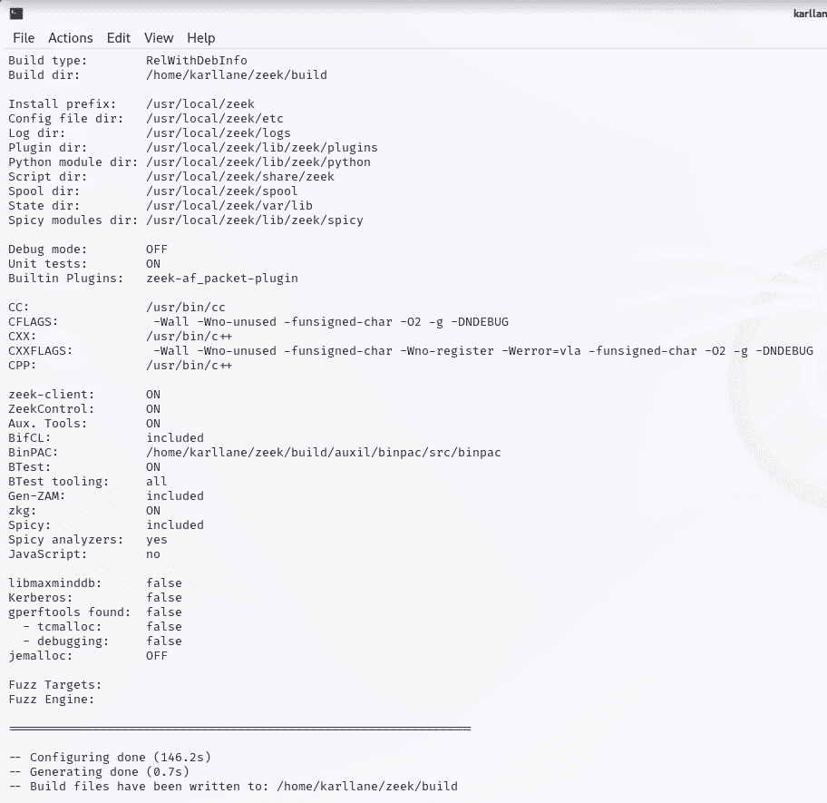

# 第七章：入侵检测与防御系统

Kali Purple 最美妙的一个方面是，组成该软件套件的各种工具被设计来应对几乎所有你可能遇到的网络防御设置。企业——有时甚至是个人——都会有独特的情况来决定他们的需求。这些独特的情况将涉及资金、网络规模、流量大小、技术人员和分析师的可用性，以及个人或组织的计划等因素。

有鉴于此，请注意，这些工具在功能上有很多重叠。因为 Kali Purple 并不是为你安装并整合每个工具之间的所有功能而设计的。相反，提供这些工具是为了给你——也就是 SOC 主工程师——提供尽可能多的选择，以满足你的组织需求。你不太可能需要在 Malcolm 之外部署 Arkime，特别是因为 Malcolm 本身就包含了 Arkime 的副本。同样，你也不太可能需要同时部署 Suricata 和 Zeek。

在阅读本章时，请注意最初让你对 Kali Purple 感兴趣的原因。是个人需求或好奇心吗？是为了发现你的组织可能需要的潜在需求吗？还是出于纯粹的好奇，你可能会想象，如果你的组织或你感兴趣的任何组织决定建立自己的 SOC，你会如何设置？在考虑这些问题时，思考一下哪些工具的组合可能提供最适合你的安全防御水平。

在上一章中，我们讨论了两个功能相似的工具，但它们在不同的商业场景中具有不同的优缺点。在本章中，我们也会做同样的事情。我们将讨论功能强大的 Suricata IDS/IPS 工具，之后再讨论更加朴实且低调的 Zeek IDS 工具。为什么要使用提供较少功能的工具？你是否听过“*少即是多*”这个说法？是否在这里适用，完全取决于网络防御管理员的需求。那就是你！或许其他相关工具提供的更多功能并不适合你的情况，而且可能会不必要地消耗更多计算资源，而你可能更倾向于更好地分配这些资源，或者如果不需要时将它们保持在备用状态。

在这里，我们将通过对比分析这些工具以及 IDS 和 IPS 系统的一般情况，帮助你决定哪个工具更适合你。阅读完本章后，你应该能更清楚地了解这些工具以及前几章提到的工具如何最好地适应你的情况（如果适用的话）。你正在开始写一份属于你自己厨房的网络防御方案。

我们将涵盖以下主题：

+   IDS

+   IPS

+   Suricata IDS/IPS 解决方案

+   Zeek IDS 解决方案

# 技术要求

要求如下：

+   **最低要求**：一台计算设备，架构为*amd64 (x86_64/64 位)*或*i386 (x86/32 位)*。它应至少配备*8 GB*的内存。

+   **推荐要求**：根据网络安全领域从业者的反馈，建议使用*amd64 (x86_64/64 位)*架构，配备*16 GB*内存——更多内存更好——以及最多*64 GB*的额外磁盘空间。

# IDS

IDS 是一种网络安全工具，旨在监控网络或其他技术系统的活动，以发现潜在的恶意活动和/或政策违规行为。它们可以识别未经授权的访问、设备或软件的滥用，以及网络环境中任何地方的潜在安全威胁。IDS 的主要功能是观察和报告安全事件，如未经授权的访问和政策违规，如前所述。一个主动的 IDS 还需要找到并帮助分析员防御恶意软件或其他任何物体，无论是现实的还是虚拟的，以及它们的活动。总之，它们的目的是应对任何可能威胁到网络系统正常运行和期望功能的因素。

IDS 的关键功能和能力如下：

+   流量监控

+   异常检测

+   基于签名的检测

+   实时警报

+   日志和事件分析

+   基于网络和主机的检测

+   为分析员提供响应和缓解的相关信息

+   法规合规性

+   与安全基础设施的集成

## 流量监控

在*第六章*中，我们经常讨论数据包和协议分析。这是因为 Malcolm 携带了我们将在本章讨论的工具，它们都具有 IDS 功能，类似于 Suricata，也可以配置为 IPS。尽管在采取预防措施之前需要检测这些威胁，我们稍后将讨论同时实现两者实际上是不可能的。

IDS 解决方案利用数据包分析，就像在*第六章*中提到的流量分析工具一样。IDS 还会结合以下几节中提到的特征，以及统计和协议分析和事件关联。

## 异常检测

如你所记得，**异常检测**是指一项技术读取当前发生的事情并记录和/或以其他方式度量它。然后，它将其归类为基准，因而视为正常行为。之后，它会将未来的行为与这个基准进行对比；当行为偏离这个常规时，它会认为该行为是异常的。

对此的更清晰的理解可能是，检测系统测量组织网络在一定时间内发生的流量量。入侵检测系统可能会意识到，每天传统的工作结束后，流量显著减少，但并没有完全消失 —— 因为总有人加班补课，对吧？然后，可能在午夜左右，流量几乎减少到几乎没有，但可能还是会有一些数据在此传输 —— 因为总有人在夜班工作，对吧？最后，IDS 可能会认识到在周末和假期活动的显著减少。所有这些都是有道理的，看起来像是正常的业务行为。IDS 会记录这种流量活动模式，并将未来的网络流量量与这个标准进行比较。因此，当在假期的凌晨 2 点突然涌入大量流量时，尤其是如果流量离开公司 —— 表明可能存在数据外泄 —— IDS 就知道这不正常。它不符合基准活动，并且基于这种异常行为发出警报。

## 基于签名的检测

基于签名的检测是我们简要介绍过的内容，但让我们在这里深入了解一下。在野外的任何产品或软件都有独特的特征，就像我们每个人都有独特的指纹，或者斑马有独特的条纹一样。为了识别这些**网络指纹**，需要正确的软件存在。对于恶意软件或恶意代码，需要有人在沙盒环境中仔细检查、捕获并分析它，或者根据研究的深度进行反向工程。

有时候，可以在不接触恶意软件本身的情况下识别出网络指纹，只需识别其展示的独特行为即可。每当一个应用程序表现出独特的行为时，我们通常将该独特行为称为其签名。基于签名的检测恰如其分：我们的 IDS 产品检查行为并将其与恶意行为的已知行为进行比较。当行为匹配时，它会触发警报。重要的是要考虑，行为本身并不一定是坏的；只是独特而已。

如果你仔细想想，我们其实已经学习了一些恶意软件特征的组成部分。任何软件签名中最常见的属性之一就是它的哈希值。**哈希值**是软件的指纹，是整体签名的一个重要组成部分。如果你想深入了解哈希值，可以回顾一下*第三章*。所以，安全系统可能会观察软件的行为，尤其是它是否尝试访问和修改 Windows 注册表。一些良性的程序可能确实需要这么做。这就是为什么它只是整体签名的一个组成部分。另一个因素可能是该软件是否正在与一个已知的恶意或可疑的外部 IP 地址进行通信。以下是一些在确定应用程序签名时可能考虑的独立属性：

+   文件扩展名

+   连接频率

+   不规则的端口访问

+   使用的加密算法

+   载荷内容的类型

+   载荷大小 – 判断数据包是否比典型的要大或小

注意

作为安全分析员，一个相对简单但可能具有毁灭性影响的行为是，当应用程序在精准的时间表上成功进行外部通信时，比如每 20 分钟一次，精确到秒。这种精确的行为可能表明是在进行信号传递——或者与外部**指挥与控制**（**C2**）服务器进行通信。

C2 服务器是一种设置了逻辑炸弹的设备——即一组在精确时间和条件下执行恶意行为的指令。通常，恶意行为者会设置这些服务器来评估与它们进行反向通信的*机器人*数量。这为他们的预期僵尸网络提供了一个实时的大小指标。它们只是在等待僵尸网络足够大，然后最终会将攻击信息和指令插入到 C2 服务器中。这有点像《星际大战》中的 66 号命令。克隆兵（后来成为暴风兵）从一开始就被编程在接收到该命令时攻击绝地武士。直到那时，他们完全服从并无害。它们就像一个伪装成保护共和国军队的特洛伊木马。

恶意行为者将继续通过后门感染设备，直到成千上万台设备被感染，每次感染都会向外发信号，等待指令一起攻击目标。这就是大规模**拒绝服务**（**DoS**）攻击的发生方式。当涉及到多台机器时，这种攻击被认为是工作负载分布在多台设备上的。这个过程就是**分布式拒绝服务**（**DDoS**）攻击。人数越多，力量越大。DDoS 攻击非常猛烈，甚至可以摧毁最坚固的组织网络。

综合来看，所有这些不同的属性将共同作用，以确定应用程序的唯一签名。一旦确定了唯一签名，安全设备将触发警报，供分析员进行审查——以防存在具有相似或——巧合地——相同签名的良性应用程序。

## 实时警报

一旦入侵检测系统（IDS）识别出潜在的入侵或其他异常行为，它将立即触发警报，供分析员审查。大多数 IDS 系统会遵循预定的、已定义的流程来处理实时警报。初始警报将包含有关其检测到的事件的信息，例如入侵或威胁类型、目标或受害系统或网络，以及事件的严重性。IDS 会根据预定义的规则和安全级别对警报进行分类，这有助于它判断警报的严重性。这样，安全分析员可以理解警报的根本性质，从而确定最合适的响应级别和类型。

在初步警报分类之后，IDS 系统将实时通知指定的安全人员和/或响应团队。这些信息是 IDS 系统管理员在安全解决方案中预先确定并配置的内容。大多数 IDS 系统设计时考虑到与多种通知方法的集成，例如短信通知、电子邮件，或者将通知传递给其他安全平台以分发可疑威胁通知。

一些 IDS 解决方案会关联多个警报，以确定它们是否可能是协调攻击的一部分或某种大规模安全事件的表现。这有助于识别广泛的模式，并缩小看似无关的活动。一些 IDS 解决方案可以在内部丰富数据，而其他则可能倾向于将其传递给 Logstash 或其他数据丰富和索引的 SIEM 解决方案。

## 日志和事件分析

在实时告警处理之外，一个好的 IDS 还会同时进行日志和事件分析。这样做有助于发现以前可能被忽视的威胁，或者在 IDS 尚未调整到能够检测它们时发生的威胁，并有助于完善当前告警的细节，还可以协助**事后评审**（**AARs**），识别根本原因，或者仅仅是改善整个事件响应过程。它将从网络设备中获取日志和事件数据，包括服务器、防火墙、终端系统以及各类安全设备，寻找 syslog 消息、系统日志、网络流量日志以及任何由网络节点生成的安全事件日志。它可能会尝试通过将日志转换为通用格式来进行日志规范化。如果没有进行规范化，可能是因为该设备已将 IDS 与其他 SIEM 产品（如 ELK 堆栈）集成，以承担这个任务。一个好的 IDS 将对日志数据进行我们目前讨论的各项功能，如与其他日志数据进行关联、检查签名、寻找异常行为等。

## 网络和主机基础的检测

一个好的 IDS 将同时关注网络和主机基础的检测。那么，这是什么意思呢？简单来说，我们已经涵盖了这些领域的检测内容。因此，它涉及到分类哪个类型的检测应该出现在什么位置。**网络入侵检测系统**（**NIDS**）本质上是一个配置为监控网络流量的 IDS。网络检测通过数据包分析、基于签名的网络数据检测、行为偏离基线（异常行为）、实时网络监控和协议分析等方式进行揭示。相对而言，**主机入侵检测系统**（**HIDS**）是一个配置在个别主机上的 IDS，主机可以是工作站、服务器或其他终端，用于监控该特定主机上的流量。基于主机的检测是指 IDS 通过系统日志筛查、检查文件完整性、监控注册表的变化和访问、应用程序行为、进程监控以及常规终端安全监控（如杀毒软件和防火墙事件）等方式进行。

## 响应和缓解

IDS 通过识别、优先排序和提示分析师响应的基本结构来处理响应和缓解，这些我们之前已经讨论过。更高级的 IDS 解决方案将通过事件关联、数据丰富等方式将这三个步骤提升到更深层次，为管理员提供通过隔离受感染系统实现遏制、数据/证据保存以及事后活动（例如准备审计和合规性报告）的选项。有时，这被称为**事后事件分析与改进**（**PIAR**）。原理是相同的。通过这些活动，管理员可以开发桌面演练，优化检测算法，并更新分析师需遵循的事件响应手册。

## 合规性

IDS 解决方案在帮助组织实现合规性方面非常有益，特别是在记录保存方面。正确配置的 IDS 解决方案永远不会自动丢弃它们收集的任何数据，除非人为干预。所有数据都会被保留，除非人工决定另行处理。大多数 SOC 会根据行业和数据保留法规确定其预算，并包括货币、时间和空间/大小限制。他们将其安全监控和检测能力映射到特定的合规要求和行业标准上，还会使其告警、日志记录和事件响应流程与知名行业法规中的规定对齐，例如**通用数据保护条例**（**GDPR**）、**数据保护与保留**（**DPR**）、**健康保险可携性与责任法案**（**HIPAA**）、**支付卡行业数据安全标准**（**PCI DSS**）等。

## 与安全基础设施的集成

IDS 可以与组织安全基础设施的其他部分集成，如果不这么做就是愚蠢的。例如，本章后面将讨论的两个工具可以与 ELK 堆栈集成。这有助于为流量及其他元数据提供额外的自动化层级和人工安全，特别是 IDS 解决方案正在拦截和解析的内容。大多数现代安全解决方案涉及与 SIEM 或 SOAR 解决方案集成的 IPS。这样做可以让收集的数据得到进一步丰富，并以创新的方式呈现——例如，以图表和图形等视觉方式。这可以帮助分析师发现潜在威胁，超出立即可用信息的范围，比如长期趋势。例如，在图表上看到一个完美间隔的流量峰值，可能会帮助分析师发现信标流量，而如果仅仅通过查看文本日志信息，他们可能会错过。

IDS 解决方案与 IPS 解决方案一样拥有丰富的功能。如果你无法检测到你希望阻止的活动，那你就无法主动阻止它，对吧？这就是为什么你已经了解了本章每个部分的核心内容。现在，让我们继续讨论预防系统，看看其中可能存在的细微差别，从而增强我们的安全解决方案。

# IPS

尽管 IPS 在功能上与 IDS 相似，但它是一个完全不同的安全解决方案。从行为学和软件工程的角度来看，IPS 的核心与 IDS 大致相同，但它的主要功能和操作模式不同。IPS 是一种先进的安全解决方案，它像 IDS 一样检测潜在威胁，但随后会采取额外的步骤，主动阻止或缓解这些威胁。它通过在主机或网络环境中强制执行安全策略和访问控制规则来实现这一点。

虽然这个产品看起来只是一个多了一个步骤的 IDS，但它远比这复杂。因为 IDS 只负责检测，管理员可以*采取更谨慎的态度*，在执行检测规则时可以稍微宽松一些。然而，IPS 没有这种奢侈。由于它是主动响应潜在威胁的，因此不能有任何错误，IPS 检测的规则必须更加严格。否则，合法活动可能会被阻止。

回想一下*第一章*，我们讨论过 CIA 三要素。你可能还记得我们提到过，三要素中的*A*代表**资源的可用性**。如果一个组织的资源遭遇中断，它可能会对组织的利润和/或声誉造成非常严重的后果。一些商业专家甚至会说，网络攻击通常比公司资源的意外中断造成的损害还要小。这是一个值得深思的问题。花点时间好好思考一下这个问题。认真地，深刻地思考这个问题，理解它将对你的网络安全职业生涯产生直接而深远的影响。

因此，IPS 检测潜在威胁的方式将与 IDS 有所不同，并且会更严格。这里的关键要点是要认识到，IDS 和 IPS 不是配置不同的相同系统；而是两个完全不同的系统，具有相似的使命。也就是说，你很快会发现 Suricata 既可以作为 IDS，也可以作为 IPS 使用。请记住，这是该品牌的独特功能。你可以认为，IPS 只有在首先检测到威胁的情况下才有可能——从技术上讲，这是正确的。然而，这是一种完全不同的检测方式。Suricata 不会同时作为传统的 IDS 和 IPS 使用。它需要单独管理。本章讨论的另一种解决方案——Zeek——仅作为 IDS 解决方案。

IPS 与 IDS 共享所有关键功能。以下是一些额外值得注意的功能：

+   实时威胁预防

+   自动响应

+   策略执行

+   内联保护

+   应用层保护

+   性能优化

## 实时威胁预防

IDS 通过应用预定义的流量处理规则来接近实时威胁预防，类似于 IDS，但通常更为详细。由于 IPS 在没有实时人工审批的情况下运行，其规则通常更加精确，响应方式的选项也更多。你可能会认为它和 IDS 一样，能够自动阻止威胁，但实际上不止如此。IPS 会自动响应，但这并不意味着它一定会阻止潜在威胁。如前所述，我们必须小心不要对组织资源产生不利影响。IPS 工具还可以通过丢弃、修改、重定向或隔离流量来响应。这有助于在不明显关闭组织资源的情况下中和或隔离威胁。

## 自动响应

IDS 的整体目的是减轻组织对人工操作员的成本。通过自动化，这样就少了一个需要支付薪水的人——理论上是这样。通常，组织会发现，维护自动化几乎只能覆盖人工值守的成本。然而，自动化响应的另一个好处是，它消除了人为判断错误的可能性。计算机按我们告诉它的方式思考。如果我们为恶意活动创建了自动响应并经过经验丰富的专业人员审核，那么技术就可以在没有任何人类质疑或争论响应是否正确的情况下进行识别和响应。从自动化创建者的角度来看，它是正确的！

## 策略执行

由于 IDS 仅进行检测，因此实际上无法执行任何操作。然而，IPS 可以具有自动化功能和与主机组织政策相匹配的规则，这样就能涵盖任何所需的监管政策以及组织定义的客户政策。这对**首席信息安全官**（**CISO**）和其他高管来说是一个巨大的宽慰，因为意外的政策违规，特别是如果涉及到法律，可能会带来灾难性的后果。依靠 IPS 的黑白分明的自动化脚本可以以这种方式保护组织。

## 内联保护

**内联部署**，也称为**主动监控**，是 IDS 不需要考虑的事情，但对于 IPS 来说，这会带来巨大的价值。那么，这是什么呢？它是适当部署 IPS 的一个非常关键的方面。即 IPS 解决方案本身被放置在网络流量路径的前方，使得任何类型的流量在进出网络之前几乎不可能不经过安全解决方案。可以把它想象成一个交通部门的员工站在高速公路中间读取车牌号（绝对*不推荐*）。

## 应用层保护

尽管 IDS 解决方案在一定程度上可以提供应用层监控，但 IPS 解决方案通常更为擅长检查该层的流量，因为响应和防止威胁通常需要直接访问应用层。这可能包括识别和阻止潜在的恶意活动，如 SQL 注入、跨站脚本攻击、服务器端请求伪造、命令注入、缓冲区溢出和数据外泄活动。这些活动都利用了应用程序中的安全漏洞，而要使 IPS 作出反应，它必须在适当的位置进行识别和处理。

## 性能优化

从技术角度看，IDS 也提供了一定程度的性能优化。然而，我们将它放在这一部分，因为 IPS 解决方案在这方面提供了更高质量、更强大的功能。IPS 解决方案通过更高效的流量检测来提升性能，甚至比 IDS 解决方案更为高效。这意味着什么呢？这只是说，IPS 能够完成工作，而不会像其他解决方案那样让流量检查拖慢网络速度。它们通常被编程为在使用最少的 RAM 和 CPU 资源的情况下执行功能。当然，一个好的 IPS 解决方案不会牺牲工作的质量来换取这种效率。IPS 解决方案通常被设计为能够利用多核 CPU 的设备，使得其功能的不同方面可以通过不同的核心同时处理——这一过程称为多线程。当访问磁盘时，IPS 解决方案会利用异步流量传输方法。因为 IPS 解决方案通常更有可能位于网络的“中间地带”，正如我们之前讨论的那样，开发人员往往更加关注提高操作效率，而其姊妹产品 IDS 解决方案往往被忽视。当然，这并不总是如此。它只是安全解决方案中出现的一个自然趋势，所以在决定使用哪种解决方案时要特别注意。理想情况下，我们建议你不要仅仅根据现在所读内容决定选择哪种解决方案，而是亲自测试不同的解决方案，看看哪个最适合你。

至此，你已经了解了 IPS 解决方案如何在 IDS 解决方案的基础上提供简单的提升，但在部署时，它们所需的思维方式和配置仍然要复杂得多。你已经发现，这需要一种更加精确的思考方式，而且你必须绝对、坚决地考虑 CIA 三元组中的*A*——保护组织资源的可用性至关重要。

# Suricata

Suricata 是一个非常受欢迎的开源网络安全解决方案，可以配置为 IDS、IPS 以及**网络安全监控**（**NSM**）引擎。它的设计目标是具有极快的速度、高效性，并且在检测计算机网络中的入侵和恶意活动方面极为准确。Suricata 能够进行实时流量分析，从而可以在安全威胁发生时及时检测并响应。Suricata 可以用于保护网络免受广泛的威胁，包括恶意软件、漏洞利用、D/DoS 攻击等。

Suricata 提供的功能几乎涵盖了我们刚才讨论的所有 IDS 和 IPS 主题。我们会引导你进行设置。如果你决定将其作为网络流量防御解决方案，你将需要牢记 Suricata 在以下几个领域的优势：

+   基于签名的检测

+   协议分析

+   文件提取

+   SSL/TLS 检查

+   支持多种网络协议

+   多线程和多核处理以提高性能

+   实时流量分析

+   网络入侵检测

+   网络入侵防御

+   网络安全监控

花点时间将这些不同的概念与您的个人和/或组织需求相匹配。然后，如果您想使用 Suricata，请按照以下步骤操作：

1.  启动您的 Kali Purple 虚拟机。

1.  登录到您的 Purple 实例。

1.  打开一个终端窗口。

1.  输入**sudo** **apt update**。

1.  输入**sudo** **apt upgrade**。

1.  输入**sudo apt install suricata**。在安装 Suricata 时请确保注意，因为您可能会遇到依赖性错误，如*图 7.1*所示。您需要做的就是阅读错误信息，它会告诉您如何修复它。在这种情况下，错误信息表示缺少**libnetfilter-queue1**包。那么，我们该如何修复这个问题呢？没错！我们只需输入**sudo apt install libnetfilter-queue1**来安装该包。太简单了：



图 7.1 – Suricata 安装依赖性错误

1.  输入**sudo systemctl** **enable suricata**。

1.  输入**sudo systemctl** **start suricata**。

1.  输入**sudo systemctl** **status suricata**。

1.  按下*Ctrl* + *Z*按需中断。

1.  输入**sudo** **systemctl daemon-reload**。

1.  重启您的 Kali Purple 实例，以确保**daemon-reload**被识别。

Suricata 的配置选项非常庞大，因此我们这里只提供您需要的基础内容，帮助您将其启动、运行并进行测试。如需更高级的选项，您可以参考*进一步阅读*部分中的链接，若您决定将 Suricata 部署为 IDS/IPS 解决方案。

在生产环境中，最常见的将 Suricata 添加到您的网络防御包中的方式是将其放置在您组织网络边界的服务器上。然而，这取决于您打算如何使用该产品。例如，如果您仅希望用它来保护和监控 VPN 流量，那么它应当被放置在 VPN 结构中以确保最佳安全性。在某些情况下，它可以用作 HIDS，这时您应该直接将其放置在您希望保护的主机上。最后，如果您的技术是以云为中心的，您应该根据实际情况，将 Suricata 放置在尽可能靠近云边界的位置。

Suricata 可以作为 IDS 部署，也可以作为 IPS 部署。IDS 被称为**被动部署**，而 IPS 也被称为**内联部署**或**主动部署**。一旦您确定了 Suricata 在网络中的正确位置，接下来您就需要配置它。在我们的案例中，我们是在 Kali Purple 环境中进行配置的。

要配置 Suricata，您需要从您安装它的设备获取一些数据：

1.  打开一个终端窗口。

1.  输入**ifconfig**并记录**eth0**接口的 IP。

1.  或者，输入**ip a s**来获取您网络的完整范围。记录下该范围。

1.  如果你想进入你正在编辑的文件所在的目录，输入**cd /etc/suricata**，然后输入**sudo nano suricata.yaml**。请注意，YAML 文件的扩展名是**.yaml**，而不是我们通常使用的**.yml**。

1.  如果你喜欢远程编辑，可以输入**sudo** **nano /etc/suricata/suricata.yaml**：



图 7.2 – Suricata 文件路径和 YAML 文件访问

无论哪种方式都可以。Suricata 配置文件现在应该已经打开。你需要使用箭头键向下滚动，直到找到**vars:**字段。紧接着该字段的是**address-groups:**，后面跟着一系列**HOME_NET:**字段，如*图 7.3*所示。修改这些字段的值，使其包含你刚刚记录的 IP 地址。通常，地址越具体，解决方案越高效。然而，出于培训目的，使用网络范围和/或取消注释值为**“any”**的行是没有害处的。如果该行不存在，你可以添加一行。

1.  查找**vars:**、**address-groups:**和**HOME_NET:**字段：



图 7.3 – Suricata 配置文件

1.  现在，你需要确保你的主接口列出为 Suricata 执行某些功能的值。如果你按照 VirtualBox VM 中的运行示例进行操作，这个值应该是**eth0**。在使用 nano 编辑这类长文件时，可以通过按*Ctrl* + *W*并输入你要搜索的值来跳到文件中的相关部分。现在试试看，按下*Ctrl* + *W*并输入**af-packet**作为搜索值。当你按下*Enter*键时，它应该会将你带到文件中的**af-packet**字段。确保该字段的值是**eth0**或者你之前记录的主网络接口：


图 7.4 – Suricata af-packet 配置

1.  按下*Ctrl* + *W*并输入**pcap**作为你的搜索词。确保该值也设置为你的主接口值：



图 7.5 – Suricata pcap 配置

1.  按*Ctrl* + *W*并输入**community-id**作为搜索词。将该值设置为**true**：


图 7.6 – Suricata community-id 配置

编辑完配置文件后，你可以按*Ctrl* + *X*保存文件，然后在提示时按*Y*确认保存。

现在，我们来回顾一下 Suricata 设置中的一些有趣选项。首先，让我们确保我们的 Suricata 规则集是最新的。输入 **sudo suricata-update** 并等待直到时间戳显示 **Done**。接下来，要获取规则选项列表，输入 **sudo suricata-update list-sources**；屏幕应显示一个潜在规则的列表，包括原始规则创建者的供应商、规则的摘要、可能适用的任何许可证类型以及有关规则的其他特殊参数或订阅信息，如 *图 7.7* 所示：



图 7.7 – Suricata 内部可选规则集列表

要启用在输入上述命令时返回的任何规则集，请键入 **sudo suricata-update enable-source <source-name>**，其中 **source-name** 是 **Name:** 行后列出的值，如 *图 7.7* 所示。完成此操作后，您需要通过再次输入 **sudo suricata-update** 来更新 Suricata，以便它识别您的规则更改。您应该在屏幕输出中看到更新的反映。

在进行一些有趣的活动之前，让我们快速测试一下配置。要测试 Suricata 配置，请键入 **sudo suricata -T -c /etc/suricata/suricata.yaml -v**；它应该返回类似于 *图 7.8* 所示的结果：



图 7.8 – Suricata 配置测试结果

如果一切正常，且你的配置已经成功测试，请继续进行下一步。如果不行，请返回并进行故障排除，确保你的安装已准备好并通过了前面的测试，然后再尝试继续。否则，是时候释放我们内心的恶魔，模拟一次针对我们的 IDS/IPS 解决方案的攻击了！在命令行中，从终端命令提示符输入 **curl http://testmynids.org/uid/index.xhtml** —— 不是在浏览器中，而是在终端中——来发起一次自我攻击。当你输入这个命令时，应该会在命令提示符中看到类似 **uid=0(root) gid=0(root) groups=0(root)** 的反馈。这个反馈没有太大帮助，对吧？那是因为我们应该查看的地方是在日志中，看看是否有发生过任何事件。请花点时间思考这个问题。什么是 SIEM？SIEM 是做什么的？更广泛地说，大多数安全解决方案做的是什么？它们评估日志数据，对吧？要查看此场景中的日志，输入 **sudo cat /var/log/suricata/fast.log** 并仔细观察结果！屏幕将显示该日志文件的内容。如果你查看 *图 7.9* 的最后一行数据，你会看到 Suricata——在这个例子中作为 IDS 操作——成功检测到了我们刚刚模拟的攻击！如果你得到了相同的结果，恭喜你！你已经成功设置并配置了一个合适的网络防御系统，使用的是 Suricata：



图 7.9 – Suricata 日志检测模拟攻击

如果你没有得到相同的结果，我们强烈建议你回溯你的步骤并重新开始，这次也许可以打开一个文本文档，或者拿支铅笔和纸，在每一步完成后立即记录下你所采取的每个动作。每一步都要仔细检查拼写、空格和文件系统中的位置。完整的文件路径是否已正确设置权限？回顾前面的章节和部分，查阅关于 CHMOD 和 CHOWN 的信息，或者更好的是，去你最喜欢的搜索引擎或 AI 聊天机器人那里搜索。AI 聊天机器人在研究错误时非常有用。如果你需要入门，试试 Google Gemini 或 Microsoft Copilot。

正如你所见，Suricata 是一个非常强大的 IDS/IPS。它在开源软件社区中有着忠实的追随者，并且以高质量著称。然而，它并不是唯一的安全解决方案。接下来的部分，我们将介绍 Zeek，它在写作时仅作为一个 IDS 使用，但得到了来自高学历专业人士的强力支持。

# Zeek

Zeek，前身为 Bro，是一款开源的网络安全监控工具，提供强大的网络流量分析平台。在*第六章*中，我们解释了它是 Malcolm 工具套件的一部分。Zeek 被动监控网络数据包，然后生成高层次的日志，记录网络活动的详细信息。Zeek 仅作为 IDS 解决方案，但不要因此低估它。并非每个人都认为 IPS 解决方案对其业务需求有益，因此，在这方面，Zeek 可能是你或你所在组织的更好选择。它还被设计得非常灵活且可定制。Zeek 允许用户创建自定义脚本和插件以扩展其功能。它还可以分析网络协议，检测并记录安全事件，并提供与 Suricata 同样宝贵的网络行为洞察。请记住，所有这些自定义和扩展性都需要付出更复杂的设置过程作为代价。

像 Suricata 和 Arkime 一样，Zeek 是 Malcolm 套件的一部分。如果你已经按照上一章的内容启动并运行了 Docker Compose 镜像，那么你只需要登录到 Malcolm 仪表板（如果需要复习如何操作，请参考*第六章*）并探索它。特别注意左侧栏中与 Zeek 相关的选项，如 *图 7.10* 中突出显示的内容：



图 7.10 – Malcolm 仪表板突出显示 Zeek 功能

如果你想在 Malcolm 外部操作，没问题！我们将一起展开一场冒险。获取和设置 Zeek 与我们之前讲解的任何内容都大不相同。因为它有几个依赖项，你需要先获取并设置这些依赖项。然后，你将不再安装可执行版本的产品，而是需要获取源代码并自行编译！如果你不熟悉编译应用程序，我们会简要概述这意味着什么。

如果你没有计算机编程和软件开发经验，请知道开发者可以使用不同的编程语言来编写创建他们产品的代码。编程语言种类繁多，成千上万种。它们存在的目的只是帮助程序员以不同的效率和创作逻辑完成工作。实际上，这些语言最终都会在后端以相同的方式运行——即计算机能够读取和理解的端。所有这些不同的编程语言的共同点在于，它们必须从开发者使用的语言翻译成计算机能够理解的通用语言，这被称为**机器语言**。机器语言以二进制代码的形式存在。它就是你在流行文化中听到的“1”和“0”，这些数字代表了技术话题中的基本内容。

将这种代码从开发者使用的语言转化为机器语言的过程被称为编译。这是对该概念的非常简化的理解。编译的完整过程还包括自动化的错误检查，并将开发者创建的代码与预先编写的通用代码（被称为库）进行链接等任务。这些都会发生在我们编译 Zeek 分发版时。如果你仔细观察 Kali Purple 编译 Zeek 的过程，你会在终端窗口的输出中看到这些操作。

目前，获取源代码的一种非常流行的现代方法是访问 GitHub。我们将从那里获取 Zeek 的副本。然而，在那之前，我们需要抓取一些附加应用程序，因为上述提到的依赖项。此外，你可能希望确保文件路径是可用的并且是空的。虽然这对我们来说不太可能成为问题，但作为最佳实践，养成这个习惯是很好的。Zeek 文件结构可能已经在之前的活动中被创建，并可能会影响我们接下来要做的工作。

你需要在这里稍微费点劲。或者，你也可以先尝试安装这些依赖项，并等待查看 Kali Purple 是否会在你克隆 GitHub 目录时通知你任何冲突。否则，如果你是那种谨慎的人，你可以从使用 Linux 文件和目录删除命令开始。此外，现在正是提到 Zeek 提供了一个非常有用且全面的在线手册的好时机。你可以在本章的 *进一步阅读* 部分找到它，以及由明尼苏达大学提供的 Linux 备忘单链接，帮助你处理文件和目录。

当你准备好开始时，启动 Kali Purple 虚拟机实例，登录并打开一个终端窗口。以下命令将为你获取所需的依赖项并编译它们。在这里，**make** 命令告诉 Kali Purple 为你编译这些产品。在此之前，不要尝试安装和运行 Zeek。

输入以下命令来获取必需的依赖项：

```
sudo apt-get install cmake make gcc g++ flex libfl-dev bison libpcap-dev libssl-dev python3 python3-dev swig zlib1g-dev
```

请注意，前面列出的依赖项中的最后一个应用程序名称中有两个竖线字符。第一个 – 在 z 和 i 之间 – 是小写字母 L，第二个 – 在 b 和 g 之间 – 是数字 1。

将 *可选* 和 *依赖项* 放在同一句话中听起来有些傻，但有些依赖项确实被视为可选的。用 C3PO 的话说，“*这太变态了？！*”作为良好的实践，让我们抓取这些依赖项。

输入以下命令来获取可选依赖项：

```
sudo apt-get install python3-git python3-semantic-version
```

现在，是时候召唤真正的“龙”了。我们将从 GitHub 的 Zeek 仓库克隆整个目录。我们只会克隆一次。尽管创建我们自己的 Stormtroopers 军队只为听到 C3PO 说“*这太变态了？！*”会非常激动人心，但我们实际上只需要一个副本。

输入以下命令以从 GitHub 克隆 Zeek 源代码：

```
git clone --recurse-submodules https://github.com/zeek/zeek
```

完成此操作后，你需要找到默认的安装目录。在我们的例子中，它被安装在**/home/karllane/zeek**。然而，你可能会找到它在**/usr/local/zeek**、**/opt/zeek**或**/opt/bro**中。为了简化这个过程，你可以通过输入**locate <filename>**来进行搜索。在这种情况下，使用 Zeek 作为 locate 关键字会返回一个巨大的可能位置列表。你可以通过尝试查找**Makefile**或**configure**文件来缩小范围，这样会返回系统中所有该名称的文件。当你找到一个包含**INSTALL**、**Makefile**、**configure**、**cmake**、**build**以及类似**zeek-path-dev.in**和一堆读文件的目录时，就可以停下来了。那就是你要找的目录！导航到该目录。作为良好的实践，你应该位于编译目录中。为了让你的生活更轻松，你应该启动自动配置脚本。输入**./configure**；这应该会启动该脚本。如果你遇到配置脚本的问题，你需要回到流程的开始，仔细检查每个依赖项是否已安装。如果没有，安装它们，并在每次安装后输入**sudo make**，以确保它们已被单独安装。

否则，一旦配置完成，你将需要编译 Zeek 分发版。输入**sudo make**并准备等待一段时间。幸运的是，你的终端窗口应该会在每行的开头显示一堆百分比，以便你了解编译进度。**make** 只是将代码编译成最终的可执行文件。一旦完成，你仍然需要将可执行文件安装到本地 Kali Purple 系统的目录结构中，才能访问它。为此，输入**sudo make install** ——同样，你可能需要等待一段时间才能完成该过程。

当你完成时，你的终端窗口应类似于*图 7.11*所示，其中会显示你已完成的消息，并提供某些目录的不同文件路径。它还会告诉你构建文件的位置：



图 7.11 – Zeek 的成功编译

我们无法详细讲解 Zeek 安装过程中的所有自定义和可选设置。如果你选择使用该产品而非 Suricata，我们强烈建议你花些时间阅读 Zeek 提供的文档，以解决你独特的需求。

为了帮助你更好地了解，我们来讨论一下 Zeek 与 Suricata 的一些不同之处：

+   **协议分析**：Zeek 更倾向于专注于脚本驱动的协议分析，允许熟练的用户创建自定义脚本进行协议解析、事件生成和元数据提取，而 Suricata 则依赖数字签名，专注于基于规则的协议分析检测。

+   **自定义脚本**：还记得我们刚才谈到的世界上成千上万种编程语言吗？嗯，脚本就是一种编程语言，而 Zeek 有自己独特的脚本语言！它基于其前身 Bro 的脚本语言，并允许直接访问网络协议和流量。这提供了最大的灵活性和定制性，但如果编写脚本的人不是一个称职的开发者，可能会带来损害的风险。Suricata 支持更为知名的 Lua 脚本语言，并依赖我们在讨论编译时提到的外部库。这在一定程度上限制了原创性，但提供了更安全的*更难破解*的安全性。

+   **网络取证**：Zeek 的方法是让你深入挖掘全面的元数据提取和日志分析，以便你能够重建和生成完整的活动生命周期进行审查。另一方面，Suricata 专注于获取现成的信息，以便进行即时的实时响应。这两种风格各有优点。问问自己，是希望立即关闭潜在的坏分子，尽管这样可能会误伤好人，还是希望专注于深入的准确性，以便在未来准备和防御坏行为，但也有可能在你能够阻止他们之前，某个技术高超的坏分子有足够的时间造成损害？两者各有千秋，取决于你自己的视角。

+   **可扩展性**：这是一个比其他方面更具技术性的对比，但仍然值得提及。Zeek 是一个基于集群的 IDS 解决方案。在这方面，它与 Elasticsearch 相似。通过在集群中处理数据，Zeek 可以根据需要水平扩展，从而分配计算能力。请记住，集群可以位于完全不同的物理设备上，如果配置得当，可以允许硬件升级和/或维护在无需关闭软件解决方案的情况下进行！

+   **社区与工具生态系统**：Zeek 与学术界和研究界有着密切的联系。你可以放心地认为，几乎总会有来自教育机构的某种合作和贡献。Zeek 社区尝试专注于扩展性，并提供诸如 JSON 等知名格式。然而，Suricata 更多是由开源社区驱动的。这个社区可能包含学术界，但更多是指任何希望为该项目做出贡献的个人，并不期望获得报酬（除非他们是该组织的正式雇员）。

在这一节中，你了解了虽然 Zeek 的功能不如 Suricata 强大，但它得到了学术界的强力支持，因此它很可能始终保持最新的理念和方法。此外，由于 Zeek 是公开提供的，你还在这一节中获得了一些软件工程的额外知识。

# 总结

在本章中，我们探讨了 IDS 和 IPS 安全解决方案之间的区别，并讨论了每种解决方案应如何配置以便使用。我们首先关注如何检测潜在的恶意活动，因为没有检测，就无法进行预防。我们查看了这些安全解决方案如何从不同角度处理网络数据，并了解到它们不仅仅分析网络中流量的有效载荷。

我们还探讨了如何通过检查大量看似无害的数据，发现可以帮助分析人员识别出可能被人眼忽略的活动的审查模式或其他视觉线索。在这方面，我们讨论了自动化及其带来的好处与风险，例如降低劳动力成本、消除分析中的模糊性，并确保政策—可能是法律—的遵守。

在进一步精炼我们新获得的知识时，我们介绍了 Suricata，一种在开源社区中得到强力支持的广受欢迎的 IDS/IPS 解决方案，并了解了它如何通过保持与现有基于规则的技术概念的兼容性，来减少人为错误。我们学到，虽然 Suricata 提供了一定的定制功能，但 Zeek 提供的定制选项要多得多。

在学习 Zeek 的过程中，我们获得了关于软件构建的额外知识，并且对编程语言以及编译程序的概念有了基本的了解。虽然这些内容与 IDS/IPS 技术并没有直接关系，但我们理解到，掌握这些知识在我们的网络防御职业生涯中可能会带来长期的好处。在这方面，我们了解到，Zeek 允许那些希望深入编程或开发的人，创建与被检查流量相关的深入脚本程序，而这种深度且高度可定制的分析可以作为数字取证的起点。我们将在*第九章*中进一步探讨这一概念。

通过这一点，我们在设置、获取和存储数据方面付出了大量努力，并对其进行异常和/或潜在恶意活动的检查。所以，现在我们应该考虑当我们确认发生不良事件时该怎么做！这正是我们将在*第八章*中讨论的内容，随着我们开始使用 Cortex 和 TheHive 集成进行事件响应。

# 问题

回答以下问题，以测试你对本章的理解：

1.  IDS 和 IPS 有什么区别？

    1.  IPS 主动阻止恶意活动，而 IDS 仅检测它

    1.  IPS 主动阻止恶意活动，而 IDS 仅检测它

    1.  没什么——它们是一样的

    1.  潜在的数千美元的开销成本

1.  网络活动在精确的间隔时间内发生，可能是何种潜在威胁的症状？

    1.  一个极其严格的雇主

    1.  设备上的潜在配置错误

    1.  自动化和脚本编写

    1.  一个正在向外部 C2 服务器发送信号的机器人

1.  将程序员的代码转换为机器语言的过程被称为什么？

    1.  编译

    1.  引人注目

    1.  控制

    1.  小心翻译

1.  什么是 HIDS？

    1.  一个由单一实体资助的 IDS

    1.  一个也可以配置为充当 IPS 的 IDS

    1.  一个放置在单一端点上以保护该设备的 IDS

    1.  以上所有

1.  网络安全职业需要编程/编码或软件开发技能吗？

    1.  毫无疑问，若没有这些知识，你无法有效工作。

    1.  不，但它在提升你的技能并帮助你创建自动化方面具有巨大价值。

    1.  不，完全不。绝对不行。太过分了。别再找我麻烦了！

# 进一步阅读

想要了解更多本章讨论的主题，请查看以下资源：

+   **Suricata 配置** **指南**：[`docs.suricata.io/en/latest/configuration/suricata-yaml.xhtml`](https://docs.suricata.io/en/latest/configuration/suricata-yaml.xhtml)

+   **Zeek 综合在线** **手册**：[`docs.zeek.org/en/v5.1.0/`](https://docs.zeek.org/en/v5.1.0/)

+   **明尼苏达大学 Linux** **备忘单**：[`latisresearch.umn.edu/linux-cheatsheet`](https://latisresearch.umn.edu/linux-cheatsheet)
