# 第八章：安全事件与响应

到目前为止，在网络安全防御领域，我们已经涵盖了大量关于从不同来源获取数据的设置和获取过程，并研究了如何通过各种分析方法传输、组织、存储和评估数据。在讨论这些内容时，您是否曾想过，如果您分析的数据表明实际的网络攻击正在发生或已经发生，应该怎么办？毕竟，如果我们没有应对计划，那么在数据告诉我们发生了坏事时，通过所有这些工作去获取、研究和尝试解读数据，显然是没有太大意义的！

当我们的防御分析表明存在恶意活动时，我们将进入网络安全的新领域。从处理警报到采取正式行动，称为**事件响应**。通常，组织会有专门的工作人员，专注于应对事件，这通常是从入门级的警报处理岗位晋升的一步。

Kali Purple 提供了几种旨在帮助我们响应威胁的工具，甚至进一步通过积极搜索数据来寻找潜在未来威胁或深藏不露的威胁。这被称为从职业角度进行的**威胁狩猎**。在这些活动中，我们将研究一个**安全编排与自动化响应**（**SOAR**）产品，它是来自 StrangeBee 公司开发的伪**人工智能**（**AI**）风格的 SIEM。StrangeBee 还生产了一款名为 **TheHive** 的事件响应平台，我们将在此平台上花费一定时间进行设置。

这两个产品能够与广泛的威胁狩猎和情报源集成。与之前的内容不同，本章的结尾有一个小挑战部分，您可以在其中找到最适合自己兴趣的情报源和集成。并非所有工具都是 Kali Purple 默认生态系统的一部分，但您会惊讶地发现，许多工具与其兼容，并且能够进行集成。部分工具可能包括 **恶意软件信息共享平台**（**MISP**）、**结构化威胁信息表达**（**STIX**）和 **受信自动化交换指标信息**（**TAXII**）。

到本章结束时，您将学习如何安装 Docker 容器，并创建一个包含我们在本章讨论的许多应用程序的 **Docker-compose** YAML 文件。预计您将涵盖以下内容：

+   事件响应

+   Docker

+   Cortex

+   TheHive

+   挑战！

# 技术要求

本章节的技术要求如下：

+   **最低要求**：一台计算设备，需具备*amd64 (x86_64/64 位)* 或 *i386 (x86/32 位)* 架构。设备必须至少配备 *8 GB* 内存。

+   **推荐**：根据网络安全领域从业者的反馈，建议使用 *amd64 (x86_64/64-bit)* 架构，配备 *16 GB* 的内存——更多更好——以及最多 *64 GB* 的额外磁盘空间。

# **事件响应**

有时，尽管我们部署了最好的技术并付出了最大的努力，坏人仍然能够突破我们的安全防线，并以某种方式对我们的信息资源造成损害。这不是我们任何人希望在职期间发生的事情，但事实上，总有一天它会发生。当这种情况发生时，那些对网络安全最有热情的人往往会感到个人受到了影响，而其他人则可能会陷入指责的竞赛中。事实是，这两种心态都没有帮助，而且很可能， breach 的实际根本原因或成功并不与任何特定分析师有关。当发生安全漏洞或其他未经授权的活动时，我们称之为事件。为了保持清醒的头脑并有效地作出有组织的反应，网络安全领域已经发展出了一项名为**安全事件****响应**（**SIR**）的子领域。

SIR 通常由一组专业人员处理，有时被称为**网络安全事件响应团队**（**CSIRT**）或**安全事件响应团队**（**SIRT**）。你会在实际中看到这两种术语。为了简便起见，本章我们将仅使用**事件响应**，简称**IR**。IR 是一种有组织的反应方法，用于应对安全事件。它是一种放下个人情感、集中精力应对和管理已发生的安全漏洞、网络攻击或其他安全事件后果的方式。IR 包括以最准确和高效的方式检测、分析并响应安全威胁，以帮助限制或减轻任何损害。它是帮助从攻击中恢复的路径，并且为防止类似的安全事件发生提供教育机会。

一个好的 IR 框架可能包括以下内容：

+   准备

+   检测

+   **隔离**

+   **根除**

+   恢复

+   事件后分析——也称为**事后行动评审**（**AAR**）或经验教训

当然，彻底防止安全事件的发生是最理想的情况，但我们都知道这既不现实，也不太可能。任何可以制造的东西都可以被拆解，任何可以设计的东西也可以被逆向工程。只要技术存在，就会有那些怀有恶意的人的利用方式。因此，IR（事件响应）的最终实际目标是最小化安全事件的影响，同时改善和维持受影响系统和数据的安全性与完整性。

现在你已经从商业定义的角度大致了解了什么是 IR，让我们首先通过创建一个全新的虚拟机来设置我们的 IR 环境，以避免与之前工作中使用的任何软件发生冲突。如果你需要复习这部分内容，可以回到*第三章*。你会惊讶于自己记得了多少。在接下来的部分，我们将从新虚拟机开始，获取并安装 Docker。

注意

由于我们打包的 Docker 容器将包括**Elasticsearch**，你可能已经安装了它，以及可能与已有软件冲突的其他应用程序——取决于你实验的程度，我们强烈建议你为本章创建一个新的虚拟机。

这样做的原因是，我们在这一章中打包的软件套件可以作为一个独立的 SOC 运行，并且是你之前尝试过的 ELK Stack 配置的替代方案。此外，如果你不将本章内容容器化，你很可能会遇到软件兼容性和通信冲突的问题。

如果你不遵循这个建议，准备好迎接额外的挑战吧！(顺便说一句，如果你不遵循也是完全可以的，因为这正是人们学习的方式。)

# Docker

**Docker**可以被看作是一个网络容器。你有没有去过野餐？你是如何准备、存储和分发/携带食物的？你肯定是把它放进了一个容器里，对吧？也许你带了一个花生酱果冻三明治，或者一些水果，比如苹果或香蕉，也许是一些芹菜或者胡萝卜条，还有一盒果汁或一瓶水。然后，你把这些东西放进了一个单一的容器里。也许你叫它午餐盒，野餐篮，或者别的什么名字。重点是，你把它们都放进了一个容器里。尽管这些物品相关，但它们每个都有独特的目的，彼此协作解决一个统一的需求——你的营养需求；你的饥饿感。然而，容器不只包含这些物品，对吧？它还包含了你依赖的东西，以便顺利享受这些食物。它包括餐具、餐巾纸或湿巾，也许还有一两包调料包。它包含了依赖关系。它包含了你完成任务所需的一切，而不必四处走动去从厨房拿东西或从你最喜欢的快餐店的开放调料区填满口袋。不，容器里有你满足饥饿的所有必需品。

Docker 正是如此。它是一个午餐盒——或野餐篮——里面装着网络物品和它们所需的依赖关系。我们在本章中构建的软件套件将放在一个 Docker 容器内。完成后，它将拥有另一个基础平台，用于作为独立的 SOC，而不依赖于 ELK Stack。然而，这个工具套件确实依赖于 Elasticsearch。此外，我们还将把**Apache Cassandra**和**Minio**包括在内。

当你遇到具有相互依赖的大量软件时，就会遇到常规的独立软件升级，这意味着经常会有兼容性问题。我们将通过将整个套件部署在我们刚刚学习的 Docker 容器内来帮助你避免这些麻烦。

在我们安装 Docker 之前，先确保它的核心依赖项已经到位。在你全新的 Kali Purple 虚拟机中，输入以下内容：

```
sudo apt install apt-transport-https ca-certificates curl gnupg lsb-release
```

这些项目现在还确保你能够使用标准的软件包管理器安装 Docker，而不是我们在本书中迄今为止教你寻找软件的某些过时方法。可以肯定的是，当你与我们完成这段文字之旅时，你将会在未来的许多包映射和安装经历中变得更加全面和有经验。你现在可能会因为我们让你以一种困难的方式做一些事情而感到烦恼，但最终你会感谢我们。与此同时，想象演员道恩·强森（Dwayne Johnson）唱着轻快的旋律歌曲《*You're Welcome!*》。如果你还没听过，去 YouTube 上搜索一下。这正是你谦逊的作者的风格，只不过有更大的肌肉。

根据 [kali.org](http://kali.org)，在你默认安装中可能已经有一个名为 **docker** 的软件包，但它不是容器化版本。由于我们不知道你在阅读本书时运行的 Kali Purple 版本，我们需要对我们的安装计划做出微调。我们将首先尝试安装一个叫做 docker.io 的软件包，如果遇到错误，你可以尝试安装默认的 **docker install**。这比听起来要简单。首先，在命令行输入 **sudo apt update && sudo apt install -y docker.io**，如果你收到警告或错误，或者在下一步之后收到错误，你可以输入 **sudo apt install -y docker**（不需要再次更新，因为你刚刚做过了）。如果你继续收到错误，应该输入 **sudo systemctl daemon-reload**，然后重启，再次尝试以下命令，如果仍然收到错误，可以第三次输入并在命令末尾加上 **--now**。

安装完 Docker 后，你需要将它绑定为在启动或重启虚拟机时自动启动。输入 **sudo systemctl** **enable docker**。

现在，让我们启动它并确保一切按预期工作。到现在为止，你一定已经熟悉这个过程了。输入 **sudo systemctl start docker** 来启动服务。接下来，输入 **sudo systemctl status docker**，它应该显示为活动（运行中），如*图 8.1*所示。你可以按 *Ctrl* + *Z* 来退出状态屏幕：

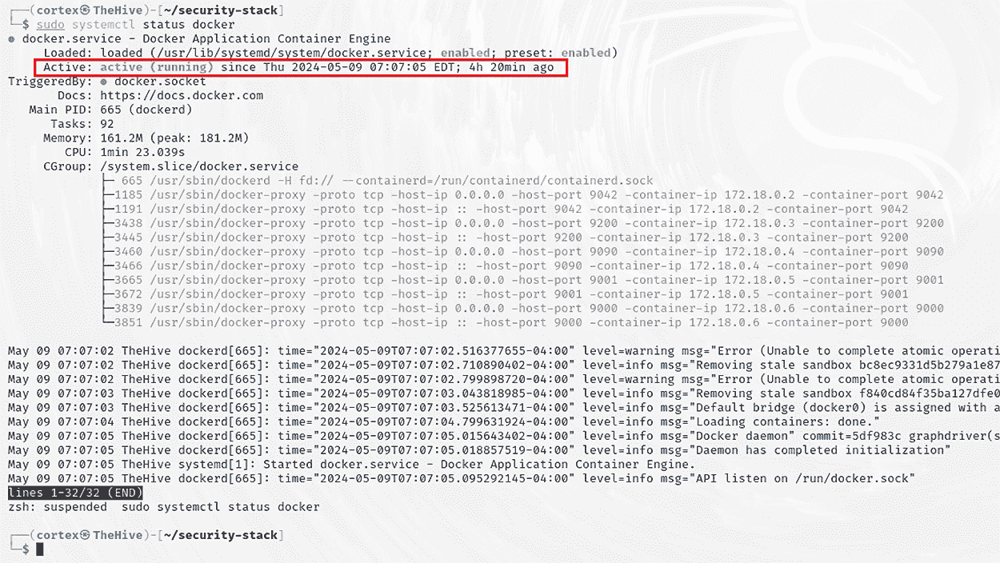

图 8.1 – Docker 状态屏幕

一旦确认 Docker 正常运行，你应该为自己设置一个命令，这样你就可以在每个命令前不再输入 **sudo**，方法是将自己添加到 Docker 组中。输入 **sudo usermod -aG** **docker $USER**。

我们还没完成，但此时我们建议重新启动系统。给系统一点时间完全加载，然后通过输入 **sudo systemctl status docker** 再次检查状态，确保 Docker 已经自动启动。

现在，到了创建 YAML 文件的时候，该文件将拉取并配置我们希望在容器中拥有的资源。首先，让我们创建该文件所在的目录。输入 **mkdir security-stack**，为了简化操作，让我们通过输入 **cd security-stack** 进入该目录。现在，我们将在容器的世界里做一些相当酷的事情。想象一下几分钟前我们提到的午餐盒容器。现在，想象一个这样的午餐盒，里面有多个隔层——一个用于存放冷的和/或湿的物品，另一个用于存放干的物品。这就像在一个大容器内有多个容器一样。

Docker 为我们创建了一个工具来执行相同的操作，称为**Docker Compose**。我们可以通过创建自己的 YAML 文件来定义 Docker Compose 中的内容。这些文件是带有 **.yml** 文件扩展名的文件，你在本书中一直在编辑这些文件，以配置你所使用的应用程序。现在让我们通过输入 **nano docker-compose.yml** 来创建我们的文件。在 Kali Purple 实例中（除非你配置了允许主机与虚拟机之间共享剪切和粘贴），打开一个网页浏览器并访问以下网址：[`docs.strangebee.com/thehive/installation/docker/#quick-start`](https://docs.strangebee.com/thehive/installation/docker/#quick-start)。

确保应用程序之间的兼容性是最新的唯一方法，就是直接从 **StrangeBee** 获取建议的 Docker Compose YAML 文件。这样，无论你在发布之后多久阅读这篇文章，你仍然可以成功运行 Docker Compose。在网页的 **quick start** 部分，复制建议的 **docker compose** 文件数据，并将其粘贴到你最近创建的 **docker-compose.yml** 文件中。数据应与*图 8.2* 中看到的类似，但可能会有细微的差异：

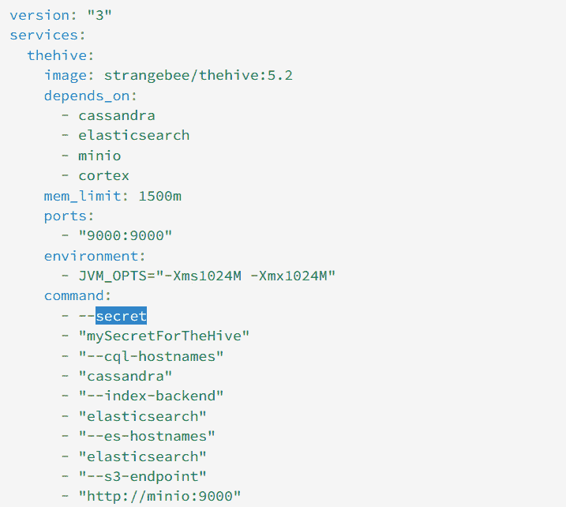

图 8.2 – StrangeBee 的 docker-compose.yml 文件开头

将数据粘贴到 YAML 文件中后，你可以按 *Ctrl* + *X* 退出文件，在提示时选择 *Y* 保存。

返回命令提示符后，我们建议输入 **cat docker-compose.yml**，这将显示该文件内容的只读（不可编辑）视图。与网页上的信息进行核对，然后我们强烈建议再重新启动一次系统。

在重启后，再次确认 Docker 是否正在运行，方法是输入 **systemctl status docker**，然后进入包含 **docker-compose.yml** 文件的目录，输入 **cd security-stack**。现在，是时候启动了！输入 **docker-compose up -d**，并享受在你眼前加载的各个容器，除非你被提示安装 **docker-compose** 命令，在这种情况下，你应该大幅度翻白眼，发出烦躁的哼声，然后按 **y** 安装该命令，再次尝试输入 **docker-compose up -d**。如果你继续遇到问题，请确保你位于包含 **docker-compose.yml** 文件的目录，并且系统已经重启。有时，这些技术协同工作可能需要几分钟的时间。我们发现，在这种情况下，跳起来摇动拳头发泄怒气非常有帮助。那是因为这样通常能够分散你的注意力，足够长的时间让这些技术启动并开始按预期互相通信：

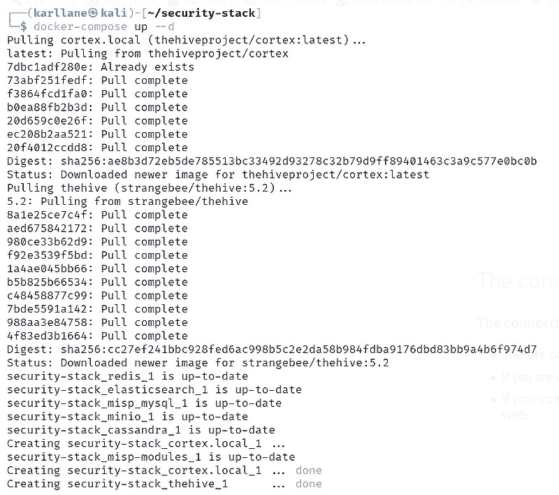

图 8.3 – Docker Compose 容器加载中

容器加载完毕后，你需要了解另外两个命令。它们是 **docker ps** 和 **docker-compose ps**。这两个命令的作用相同，都是显示所有 Docker 容器的状态。然而，它们各有其优势。**docker ps** 命令会在每行的开头提供容器 ID，以便你执行特定容器的命令。这些命令可能是启动、停止、暂停、恢复暂停或查看该容器的日志。然而，这些命令是通过 Docker Compose 执行的。记住，必须进入 security-stack 目录才能执行 Docker Compose 命令：

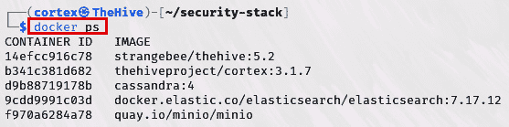

图 8.4 – docker ps 显示容器状态及容器 ID

另一个是：

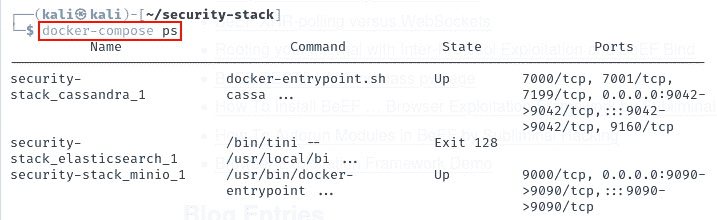

图 8.5 – Docker-compose ps 显示容器状态的总结

在重启后，你可能需要再次运行 **docker-compose up -d** 命令，以便将所有容器重新启动并运行。话虽如此，让我们开始审视这些应用程序，看看它们如何与我们在本章中创建的整体 IR 环境相关。首先是 **Cortex**，它是我们 IR 解决方案的核心部分。

# Cortex

Cortex 是一款安全产品，旨在促进 **安全编排自动化和响应**（**SOAR**）活动。许多人认为 Cortex 是事件响应中最重要的组成部分，因为它充当了一种 IR 操作系统。这是因为它与其他 IR 工具进行集成——如果你愿意，可以说是“结合”——并通过自动化创建了一个简化的 IR 工作流程。因此，Cortex 能够更直接地解决今天 SOC 和 CSIRT 以及专业安全研究人员在威胁情报和数字取证部分的 IR 过程中面临的一些常见挑战。

在安装之前，让我们先看看几个让 Cortex 与众不同的特点：

+   **分析器和响应器集成**：Cortex 提供了一个非常强大的框架，用于集成和执行分析器与响应器。分析器是用于执行安全分析任务的软件工具，例如丰富可观察数据——我们在前四章中谈到了数据丰富，进行恶意软件分析，或执行来自不同数据源的查询/搜索。响应器则帮助启用自动响应操作，如隔离端点、阻止潜在恶意的 IP 地址、处理文件哈希和伪造物，或发送通知。Cortex 具有一种架构，允许集成自定义分析器和响应器，这使得使用该产品的组织能够根据其独特的业务安全需求量身定制 Cortex。

+   **可插拔架构**：可插拔架构是 Cortex 的一部分，设计用于接受自定义的分析器和响应器。这是实现集成的核心。

+   **RESTful API**：Cortex 提供了一个 RESTful API，也常被称为 **REST API**，以支持与外部系统、应用程序和安全工具的无缝集成。这意味着什么？那些曾经从事或正在从事软件开发的人可能已经对这个概念有了透彻的了解。对于其他人来说，让我们稍微解释一下。

    我们已经大致讨论过什么是 API，但它到底做什么呢？**应用程序接口**（**API**）是定义两个不同软件系统如何相互通信的规则。开发人员创建这些规则集，以 API 形式向外部应用程序解释它们应该如何从编程角度与自己的应用程序进行交互。

    **REST**的缩写代表**表现性状态转移**，这是一种提供 API 工作指南的软件架构。它有点像“谁来监管监管者”的情况，*监管者*是设定规则的 API，而*谁*则是 REST。它的创建理念是帮助管理最复杂互联网网络中的应用程序间通信。它因其有助于高性能而著称，这意味着我们这些普通人可以享受更快的应用加载和数据检索。REST 提供了对跨平台可移植性通信、实现和修改的高可见性。它是无状态的，这意味着所有必要的数据必须包含在客户端和服务器之间的通信中，因为服务器不会存储或记录客户端的连接状态。如果你希望深入了解 RESTful API，有很多资源可以参考。我们将在本章末尾的*进一步阅读*部分提供几个链接。

+   **多租户**：Cortex 特别有用的一个原因是它实现了多租户支持。你们中的一些人可能会听到这个术语，并认为它意味着单一实例的 Cortex 可以处理多个组织或客户。是的，这是对的，但它不仅仅是这个意思。多租户还可以指基于组织单元、团队或特定使用场景的更精确的分割。这可以帮助大规模组织管理多个不相关的场景，同时通过人员分工来实施职能分离。职能分离是为了确保没有单个人拥有任何环境中所有的安全和访问权限，从而减少来自内部威胁的潜在损害。请记住，内部威胁并不总是出于恶意。一个超级优秀、诚实且表现出色的员工，如果因为某种简单的错误（可能根本没有他们的错）而造成问题，在网络安全中也被视为内部威胁。这里的关键点是，Cortex 允许在其部署中进行分割。

+   **可扩展性和性能**：我们已经讨论过，当可扩展性应用于技术时，意味着能够在不对组织资源的可用性产生负面影响的情况下，顺畅且可能突然地增加技术的规模和范围。这又是一个软件开发人员考虑**CIA 三元组**中*A*的例子，我们在**第一章**中提到过。Cortex 的设计是为了高效处理大量信息，同时保持高性能和可靠性，以支持安全操作。

+   **与 TheHive 的集成**：Cortex 与 TheHive 紧密集成，我们将在下一节中讨论它。实际上，它是由与 TheHive 相同的团队创建的。简而言之，TheHive 将可观察的安全信息提交给 Cortex，Cortex 通过自动化处理这些信息，然后再返回 TheHive 进行更简化高效的分析，并在必要时进行调查和响应。

现在我们已经概述了 Cortex 是什么，它的主要功能是什么，以及它能做些什么，我们应该去“玩泥巴”了。比起盯着它看，这要有趣得多，不是吗？与之前的章节不同，我们不需要逐步安装本章和下一章中的任何包，因为这些包和它们的依赖项已经通过 Docker Compose 安装好了。所以，现在我们只需要确保一切仍在正常运行——以防你在阅读这一部分后休息过一段时间。请复习本节末尾的截图，查看 **docker-compose ps** 和 **docker ps**。无论是重新启动任何停止的进程，还是通过输入 **docker-compose up -d** 来重启整个组，都可以。非常重要的一点是，您在此过程中需要保持耐心。当你在下一步尝试在浏览器中加载 Cortex 时，如果 Cortex 背景中仍在加载，你可能会遇到错误。只需等待一两分钟，然后再试一次。

你可以通过网页浏览器访问 Cortex。根据你的个人设置，你需要确保在 Kali Purple 虚拟机实例中启用了端口转发，将端口 **9001** 分配给 Cortex 访问。你可以查看 *第五章*，如果你需要复习 **端口转发**。既然如此，我们现在就把所有的端口转发都设置好。这样我们就不需要再回头了。根据 *图 8.6*，转发端口 **80**、**443**、**9000**、**9001**、**9042**、**9090**、**9200** 和 **9300**：

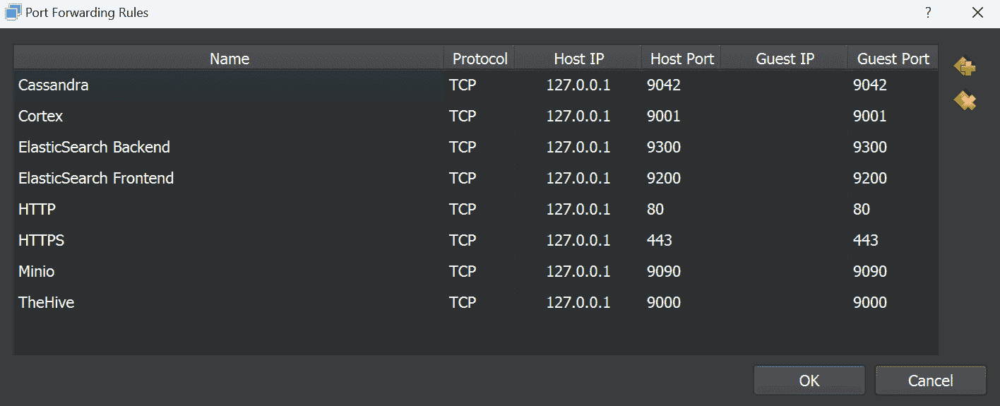

图 8.6 – 此虚拟机实例所需的端口转发

当端口转发设置完成后，打开你喜欢的浏览器（主机或客户操作系统），并将 URL 指向 [`127.0.0.1:9001`](http://127.0.0.1:9001)，此时可能会提示你让 Cortex 更新其数据库，如 *图 8.7* 所示：

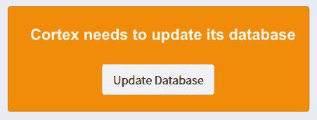

图 8.7 – Cortex 初始访问请求数据库更新

选择**更新数据库**按钮，你将被提示创建管理员帐户，如*图 8.8*所示。为了明确说明，你在**登录**字段中输入的值将成为用户名。在**名称**字段中输入的值仅仅是帐户类型的标识。如你所见，我们将我们的超级管理员命名为**Packt Super Admin**。填写所需的值后，选择**创建**按钮继续：

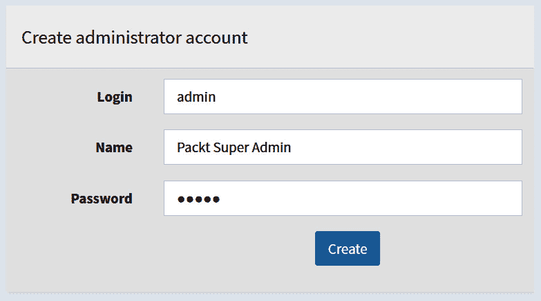

图 8.8 – Cortex 初始管理员帐户创建

你将被重定向到常规登录页面，这是你以后每次访问 Cortex 时看到的页面。现在，你可以使用刚刚创建的凭据进行登录：

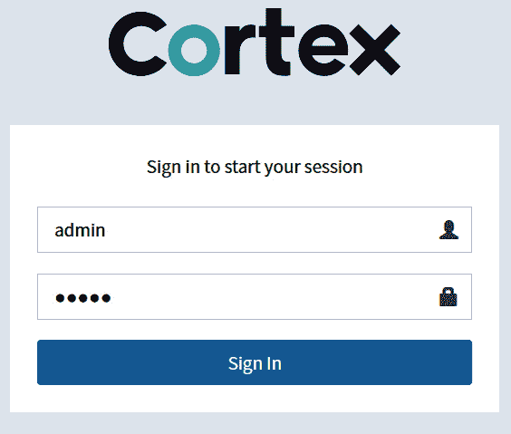

图 8.9 – 初始管理员帐户创建后的默认 Cortex 登录界面

你可能记得我们之前讨论过 Cortex 如何支持多租户功能。也就是说，它支持一种碎片化的设置，在这种设置中，如果用户组之间的任务没有关联，或者不属于同一个公司或团队，那么这些用户组可以彼此隔离。登录后立即加载的页面是我们开始管理这种多租户功能的地方。不要被**Organizations**（组织）标签所误导。它本来也可以被标记为**Segments**（分段）、**Teams**（团队）、**Pods**（小组），或几乎任何描述与其他组隔离的术语。正是在这里，你将创建你的组织，如*图 8.10*所示：

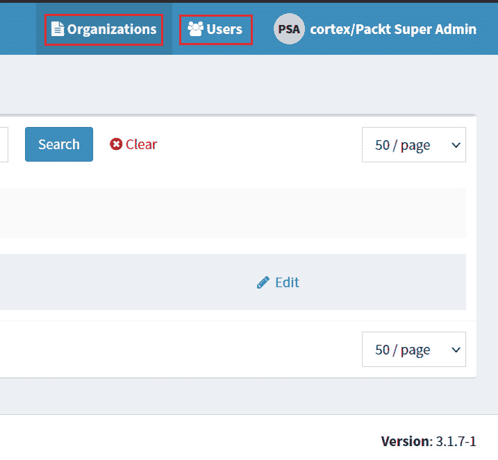

图 8.10 – Cortex 组织和用户标签，用于多租户管理

在前面的截图中，如果你查看右上方的导航栏，在已登录的用户名旁边，你还可以看到一个**Users**（用户）选项。在这里，你可以创建和管理额外的用户，包括分配角色和权限。

选择**Organizations**（组织）标签。在这里，你可以创建新组织并管理现有的组织。继续选择左上角的**+ 添加组织**按钮，创建一个新组织。此时，这一步非常直观。在**名称**字段中输入你的组织名称，在**描述**字段中输入组织的描述。*图 8.11*展示了一个示例。完成后，选择**保存**：

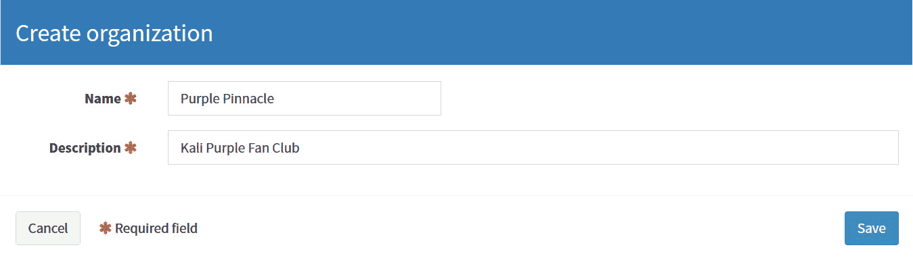

图 8.11 – 在 Cortex 中创建一个组织

现在，让我们创建一个用户并将其添加到该组织中。选择**Users**（用户）标签。在这里，你会注意到我们还有创建 API 密钥进行身份验证或完全锁定帐户的选项。正是通过此功能，你可以将 TheHive 与 Cortex 集成。首先，创建用户。

选择页面左上角的**添加用户**按钮以创建一个新用户：

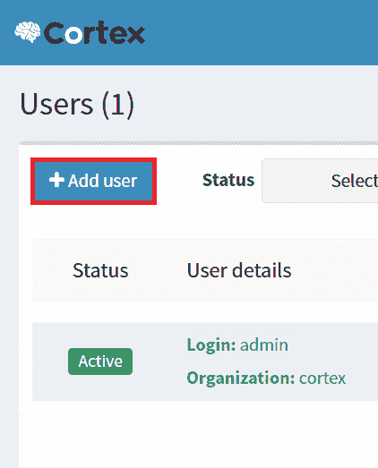

图 8.12 – Cortex 添加用户按钮

你将创建一个名为**TheHive**的用户，根据你组织的设置以及与你的客户组织可能建立的**服务水平协议**（**SLAs**），将原始用户赋予一般管理角色以及阅读和分析权限，可能是一个不错的做法，因为组织的管理员很可能是你为其创建的第一个账户。当然，也有可能你安排的组织没有专门的管理员——如果你或你的组织提供此类服务，而不是让客户自己在你的环境中管理自己的组织：

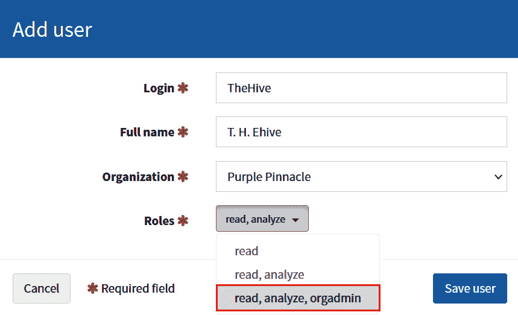

图 8.13 – Cortex 添加用户窗口

你可能已经注意到没有设置密码的选项。这个选项会在你点击**保存用户**并返回到默认的**用户**界面后出现，正如你在*图 8.13*中看到的。你会注意到第一行提供了编辑密码的机会。这就是当密码已存在时所显示的内容。

当需要从头创建密码时，系统会提供创建新密码的选项，正如你在第二行中看到的。为此，请点击**新密码**，此时按钮会被替换为一个输入框。将密码输入该框中并按下键盘上的*Enter*键。之后，你需要刷新页面，按钮显示才会切换为**编辑密码**。

你还会注意到在第二行的最右端，你有一个锁定用户的选项。这将适用于你创建的每个用户，除了默认的超级用户。这个选项应该很容易理解：它会锁定用户并阻止他们访问 Cortex：

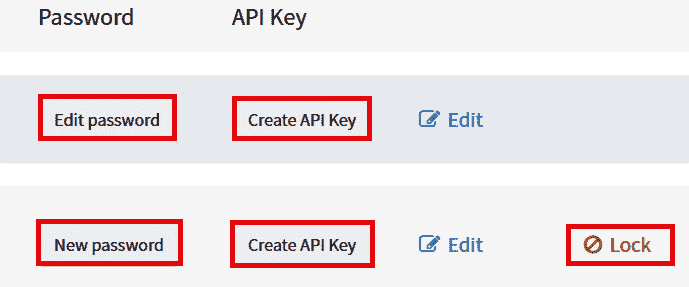

图 8.14 – 编辑密码、新密码、创建 API 密钥和锁定

最后，让我们为用户创建一个 API 密钥。对于你刚刚创建的用户，点击**创建 API 密钥**按钮，它会创建 API 密钥，并将界面变为三个按钮选项——**更新**、**撤销**和**显示**，正如你在*图 8.14*的第一行中看到的。要查看 Cortex 为你创建的 API 密钥，请点击**显示**按钮，会出现一个显示密钥的框，正如你在*图 8.15*的第二行中看到的：

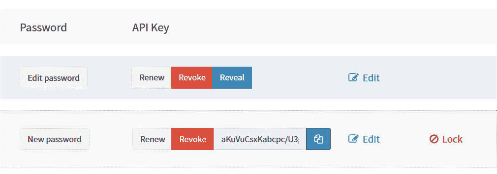

图 8.15 – 创建、更新、撤销并复制 API 密钥

为了节省空间，API 被截断，你只能看到它的开头。没关系，因为像你们这些敏锐的观察者已经注意到，复制内容的国际符号位于截断的 API 密钥字段右侧的小框内。选择这个带有两张纸的图标，将自动复制你的 API 密钥到剪贴板。将该值记录在安全的位置，并在任何时候需要使用这个特定用户将其他工具与 Cortex 集成时进行参考。记得注意这个用户的用途。它们不必是独立的个人；它们可以是服务账户。某些更复杂的设置可能会有多个服务账户，用于与其他工具进行集成。

这个功能是整个部分的核心内容。在完成下一部分后，你应该开始能够想象 IR 工具 TheHive 如何与 SOAR 产品集成，而 SOAR 产品本身又与我们在本书开始时了解的 Elasticsearch 数据库进行集成。

在这一部分中，你了解了 SOAR 用于管理和自动化与整体事件响应过程相关的安全任务，而 Cortex 就是这样的一个产品。你还了解了《Kali Purple 入门》中的各个产品如何设计成协同工作，任何花时间完全实施和集成这些产品的人都能打造一个自建的 SOC。你现在已经安装并配置了 Cortex，以及 TheHive 的一些元素，我们将在下一部分深入探讨这些内容。话虽如此，让我们继续讨论 TheHive，这是一个利用 Cortex 功能并填补一些尚未覆盖的空白的应用程序。

# TheHive  

Kali Purple 提供 TheHive 作为一个开源 **安全事件响应平台** (**SIRP**)。TheHive 现在归 StrangeBee 公司的旗下。StrangeBee 由 Jerome Leonard、Nabil Adouani 和 Thomas Franco 共同创办，他们也是 TheHive 的创造者。StrangeBee 旗下还有一个名为 Cortex 的产品，你应该已经很熟悉，因为我们刚刚在上一部分讨论过它。TheHive 是一个 SIRP，旨在与 Cortex 和广为人知的 MISP 集成。如果你目前从事网络安全工作，很可能已经使用过 MISP。我们将在下一部分中讨论 MISP。

TheHive 是为了简化管理安全事件的过程而构建的。创建者意识到，实现简化的最佳方式是确保每个人都能访问相同的威胁数据，因此与 MISP 的集成应运而生，MISP 是专门为此目的构建的。TheHive 配备了全面的 IR 功能和增强功能。让我们从全局视角来看一下这些功能和增强：

+   **案例管理**：TheHive 提供了一个集中管理安全事件案例的地方。网络安全分析人员可以创建、更新并跟踪各个案例的进展，为事件处理提供一种结构化和有序的方式。事实上，你可以通过输入案例 ID 快速访问，或者像*图 8.16*所示，从 TheHive 的 GUI 顶部工具栏创建一个全新的案例：

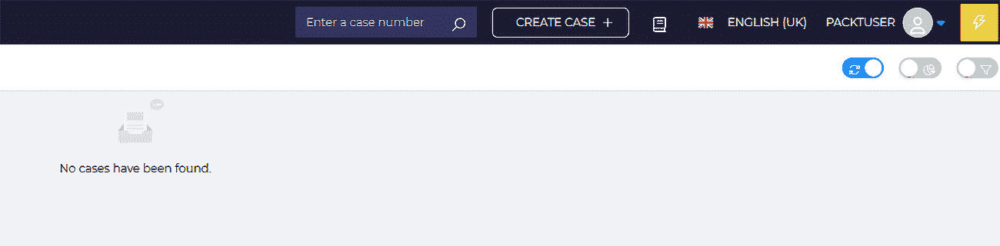

图 8.16 – TheHive 案例创建

+   **任务管理**：该产品允许用户通过赋予他们权限来管理任务，从而精确分配和跟踪与特定事件响应场景相关的任务。这个功能让分析人员之间有了责任感，更进一步促进了协作和协调。

+   **可观察项管理**：可观察项是分析人员可以直接看到的、可能值得单独分类和追踪的项目。这是因为它们可能以某种形式影响多个事件响应案例。进一步解释：想象一下一个 IP 地址，其 OSINT 声誉很差，并且通常被认为是恶意的。通过单独追踪这个 IP 地址，分析人员将能够将恶意活动与多个事件响应场景关联起来，如果该地址发起了一个广泛的恶意攻击活动，如钓鱼攻击，这种事件可能会影响许多不同的组织，并涉及多个事件响应场景。IP 地址是分析人员可以直接看到的，因此它们是可观察的。其他可观察项可能包括域名、URL 和哈希值。在 TheHive 中，分析人员可以分类和追踪这些可观察项，以便更有效地进行事件响应。

+   **报告与分析**：了解我们潜在的弱点对一个成熟的 SOC 至关重要。这个安全解决方案包含报告和分析工具，允许用户生成全面的安全事件报告。他们还可以利用软件报告安全趋势和性能指标。这个功能使组织能够深入了解自身的安全状况以及各自的事件响应能力。

+   **协作**：我们已经讨论过几次了，这一点非常重要，无法过分强调。这个安全解决方案将协作作为一个关键特性，因为它是 TheHive 操作方式的核心价值之一。通过为事件响应者提供共享工作空间，协作得以实现，这样他们就可以一起解决面临的安全事件。这个设置确保了协作能够实时发生，为 IR 人员提供了分享见解、知识和最佳实践的方式，随时应需而生。

+   **剧本自动化**：网络安全分析师可以在 TheHive 中创建和执行自动化的剧本。**剧本**是针对常见事件响应场景的预定义工作流。如果你想象一下你可能在学校时学过或创建过的流程图，工作流大致是同样的东西。它是一步步的纠正行动的可视化流程，用于应对特定的安全事件。剧本就是这些工作流的预先设置，目的是为统一响应服务，通常会自动化，以便为任何重复性的任务创造一种流畅的处理方式，从而确保对安全事件的一致且有效的响应。它还可以节省大量的人力互动时间，并避免人为错误。

+   **集成**：TheHive 提供与各种安全工具和平台的集成，实现无缝的数据共享和事件响应活动的编排。这些集成包括 Cortex、MISP、Active Directory：

    +   **轻量级目录访问协议**（**LDAP**）、**Active Directory 联邦服务**（**ADFS**）、电子邮件服务、其他报告和指标平台、SIEM 和 SOAR 平台、威胁情报源，以及其他协作和沟通工具。这些集成促进了 TheHive 与其他安全解决方案之间的互操作性增强。

+   **自定义**：TheHive 用户可以通过创建个性化的模板、剧本和仪表板，定制符合其组织特定 IR 需求的体验。

+   **可扩展性**：正如你可能已经知道的，可扩展性指的是一个系统、网络或流程处理日益增长的工作量的能力，有时这种增长是迅速且出乎意料的，或者至少具有快速扩展以应对组织增长的潜力。它通常只在讨论软件和技术的上下文中使用。可扩展性这个词本身通常用于指快速适应资源需求增加的需要，而不妥协产品的性能、可靠性或功能。可扩展性被认为是 TheHive 的一个能力。

+   **历史数据保留**：任何安全导向的应用程序都必须具备的一个功能是保存事件发生的历史。我们可以整天讨论为什么这是必要的，包括经验教训、趋势分析、为未来的分析师提供潜在的解决方案线索、法医调查、政府法规、在法律诉讼中作为证明，或者仅仅是为持续的流程改进提供知识。TheHive 保存了历史事件数据，并提供了一个包含过去安全事件及其解决方案的存储库。

当你准备好访问 TheHive 时，打开另一个浏览器标签页，将网址指向 [`127.0.0.1:9000`](http://127.0.0.1:9000)，你将看到登录界面。幸运的是，TheHive 已经为你创建了一个默认的管理员账户，正如 *图 8.17* 所示。你初次登录时将使用该账户。请输入 **admin** 作为用户名，**secret** 作为密码。然后点击 **Let me in** 按钮正式登录：

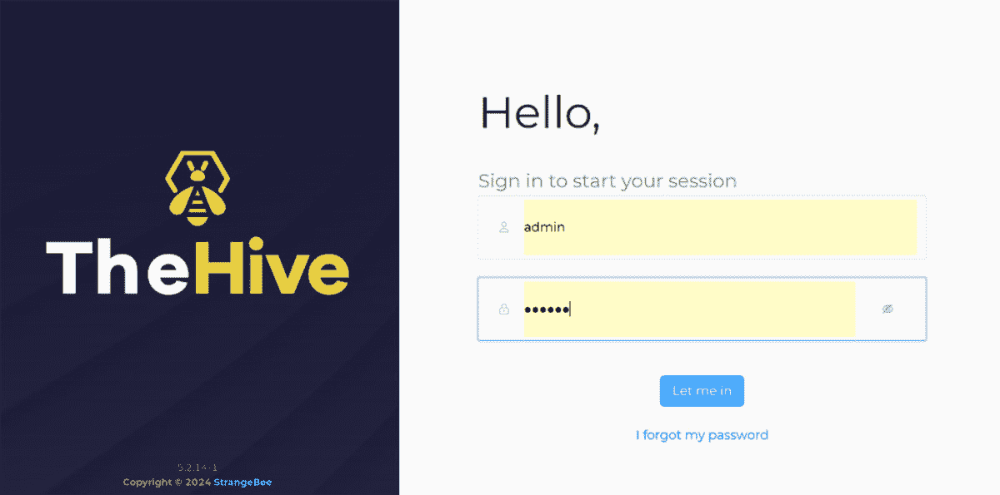

图 8.17 – TheHive 默认登录界面

在你首次登录后，你可能会注意到没有我们之前提到的案例管理和创建案例的功能。这是因为管理员角色用于管理组织和用户，而不是管理案例本身。用户将负责管理案例。因此，你首先需要做的事情是创建一个分配了分析员角色的用户，这样你就可以用这个用户来创建和管理案例了！然而，为了创建一个拥有分析员角色的用户，我们首先需要有一个可以提供该角色的组织。默认的管理员组织不足以创建任何非管理员用户。

由于我们正在首次设置 TheHive，系统中不会已经有符合要求的组织选项。所以，我们需要创建一个。事实上，我们将创建一个与在 Cortex 中创建的完全相同的组织！在默认视图的左侧列中，选择 **Organisations** 字段，如 *图 8.18* 所示，然后选择顶部功能区最左侧的加号图标：

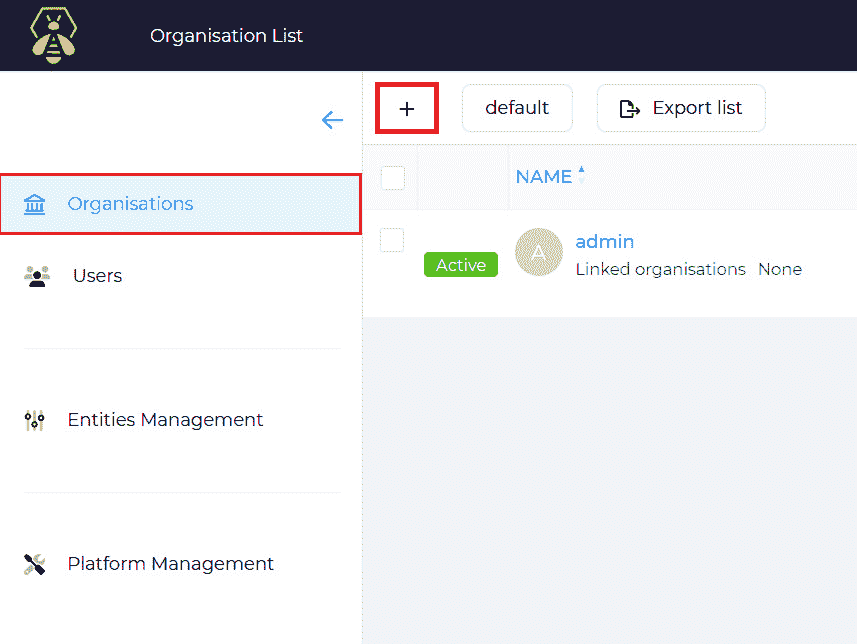

图 8.18 – TheHive – 创建组织

主界面将变灰，你将看到右侧弹出一个窗口，要求你填写要创建的组织的详细信息：


图 8.19 – 创建组织时，TheHive 主界面变灰

继续填写我们在 Cortex 中为 TheHive 组织创建时所使用的所有相同详细信息。目前，将**任务共享规则**和**可观察数据共享规则**设置为**手动**。任务的自动共享是为那些在项目中共同合作的团队准备的。我们现在只会为这个组织创建一个用户。然而，如果我们要为整个团队分配该组织，可能会考虑将**任务共享规则**设置为**自动共享**，这样团队成员就可以平等地了解和参与任务的解决。**可观察数据共享规则**用于共享可观察数据，如**妥协指标**（**IoCs**）或从威胁情报源中获取的信息。将其设置为**自动共享**有助于及时将关键信息传播给相关利益方。点击屏幕右下角的**确认**按钮，完成组织创建：

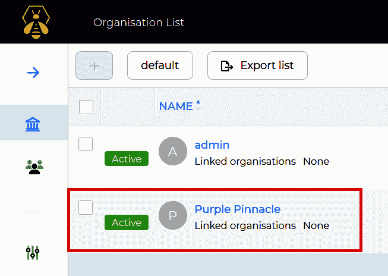

图 8.20 – TheHive – 创建组织页面

弹出窗口将消失。然而，由于它是一个弹出窗口而不是另一个页面，因此您可能需要刷新页面才能让新的组织出现在默认列表中。我们建议您先等待 10 到 20 秒。给应用程序一些时间进行后台操作：

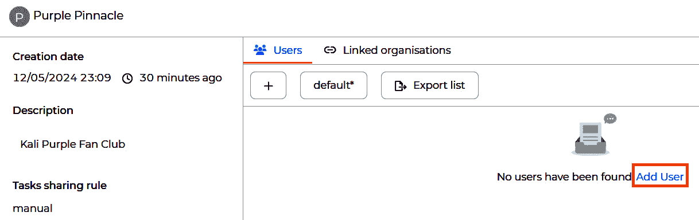

图 8.21 – TheHive 默认组织页面，显示我们新添加的组织

要创建您的第一个用户，该用户将是非管理员用户，您有两个选择。首先，您可以选择刚创建的新组织的名称，然后从主窗口选择**添加用户**，如*图 8.22*所示，接着继续按照接下来的指示完成第三步：

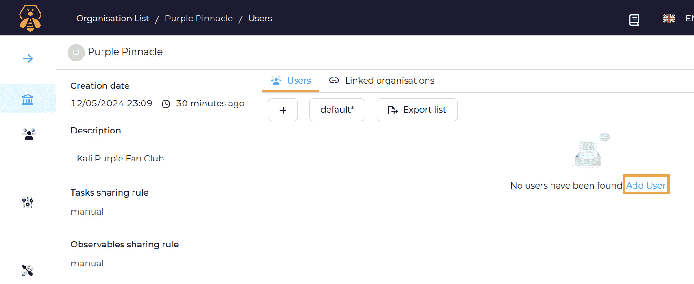

图 8.22 – TheHive 组织详情页面，具有添加新用户的选项

或者，您可以按以下步骤进行操作，这些步骤只有在组织已经创建的情况下有效：

1.  在登录后的默认页面左列中选择并点击显示三个小人图标的按钮。我们将其称为**用户**图标。如果您需要帮助识别图标，可以参考*图 8.23*中的高亮显示。

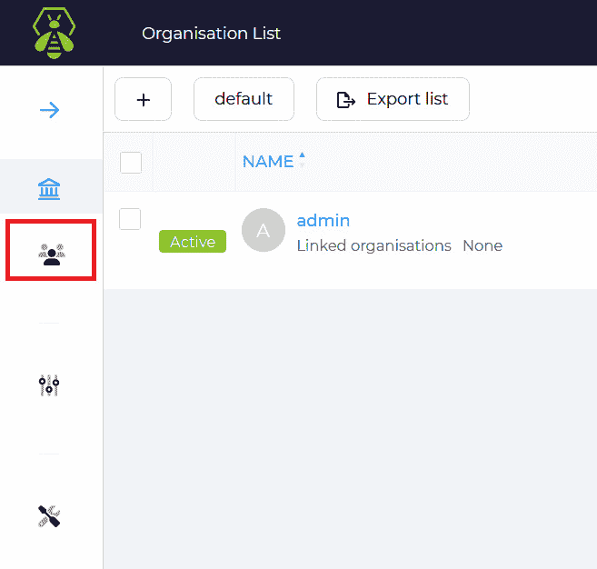

图 8.23 – TheHive 选择左列中的用户图标

1.  然后，在点击人形图标后，选择并点击**用户**页面左上角附近的大加号符号。这一点也在*图 8.24*中有所体现。非常重要的一点是，您必须在首次选择**用户**图标后再执行此操作。否则，加号将不会添加新用户，而是添加新组织！

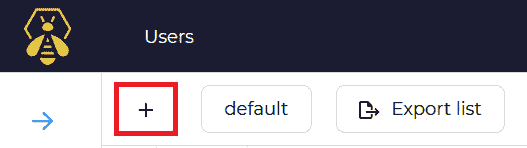

图 8.24 – TheHive 在用户界面选择加号以创建新用户

1.  完成这一步后，页面会变灰，右侧会弹出一个窗口，要求你输入新用户的详细信息：

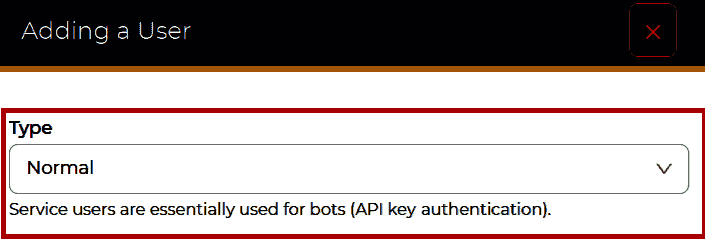

图 8.25 – TheHive 添加用户的弹出窗口，主窗口变灰

1.  在**类型**字段下，值应默认为**普通**，你应该保持默认设置。这个字段用于设置服务账户，我们在*第四章*中简要讨论过。若你需要重新回顾服务账户，参考那一章：

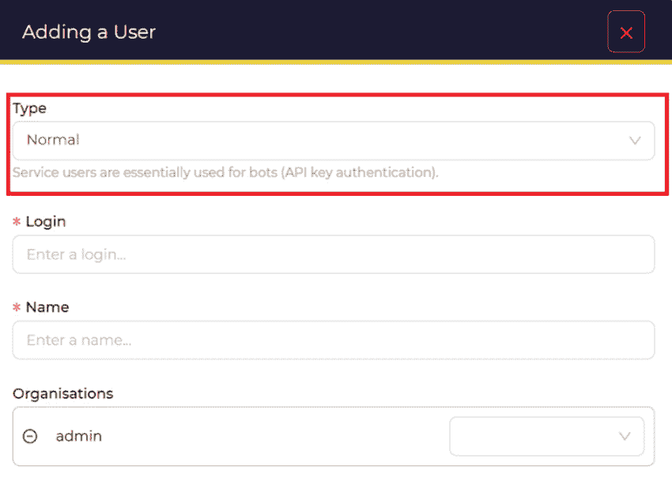

图 8.26 – TheHive 设置新用户类型为普通

1.  在**登录名**字段下，你不需要输入用户名，而是输入登录分类。这允许管理员用户创建一组登录名，在其中预先分配角色。为了简便起见，我们建议输入**thehive@thehive.local**，但你也可以将前部分设置为你想要的任何内容，比如**test@thehive.local**，只要你开始时的内容加上**@thehive.local**即可。登录时，你只需要输入你创建的名称，而不需要输入**@thehive.local**。然后，在**姓名**字段中，你将输入所需的用户名：

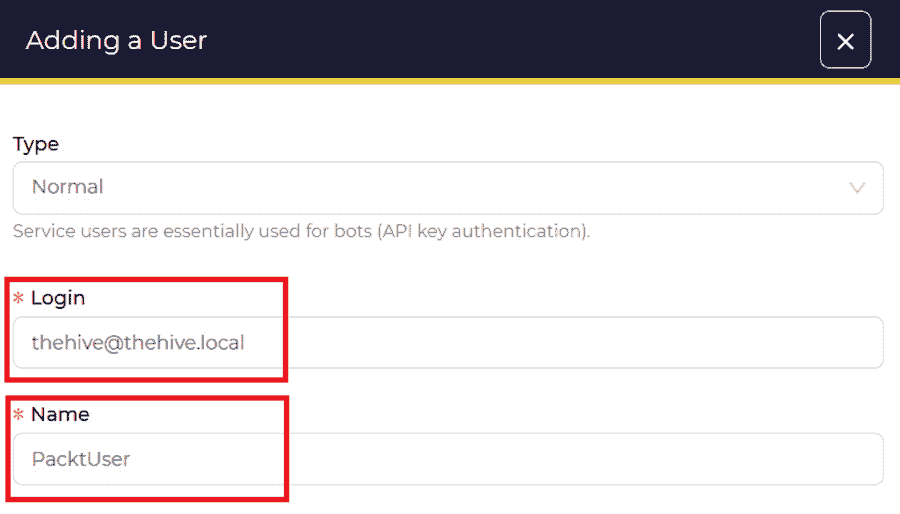

图 8.27 – TheHive 设置新用户的登录名和姓名值

1.  在**组织**字段下，你将决定正在创建的新用户的权限级别。我们已经知道，我们不希望用户是管理员。所以，选择**组织**或**个人资料**下的下拉区域（取决于你通过哪种方式进入该功能），然后选择**分析员**。如果你是通过在你创建的组织的个人资料中添加用户来进入此界面的，那么所有分析员角色都会自动显示在屏幕上。如果每个字段都填写完毕，页面底部会出现一个**确认**按钮。点击该按钮，你就可以创建你的新管理员用户：

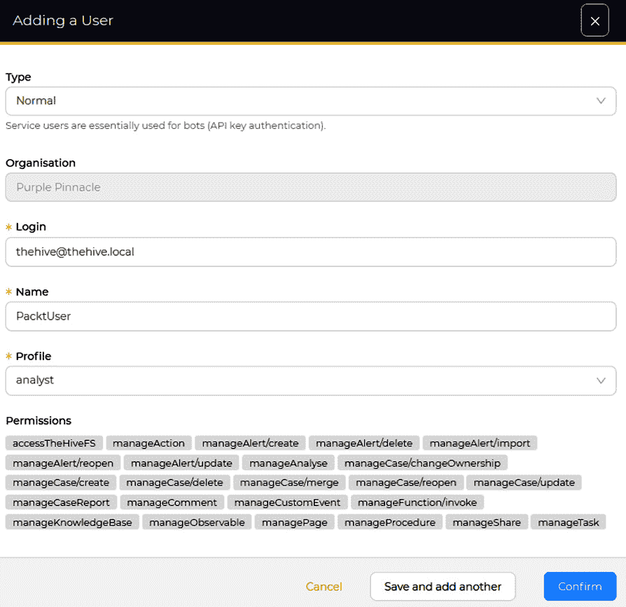

图 8.28 – TheHive 完成的新用户表单

1.  被灰色显示的区域将消失，你的新用户将出现在列表中。在以该用户登录之前，你还有一个非常重要的步骤。类似于设置 Cortex 用户，你需要编辑刚刚创建的用户以设置密码，因为在创建用户时并未提供此选项。然而，操作方式与 Cortex 略有不同。从默认的用户界面中，你需要将鼠标悬停在刚创建的用户的名字上。当你这样做时，**预览**字段会出现在该行中间附近，紧挨着**组织**列下的值。选择该**预览**字段，如*图 8.29*所示：

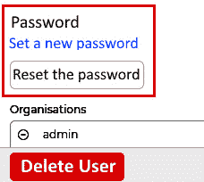

图 8.29 – TheHive 新用户预览按钮用于设置密码

1.  向下滚动，直到看到**密码**部分。你将看到**重置密码**和**编辑密码**的选项。你可以稍后再调整这些设置，但现在，选择**重置密码**或如果你是新用户，则选择**设置新密码**，然后为你正在创建的用户输入所需的密码。完成后，点击屏幕右下角出现的小蓝色**确认**按钮：

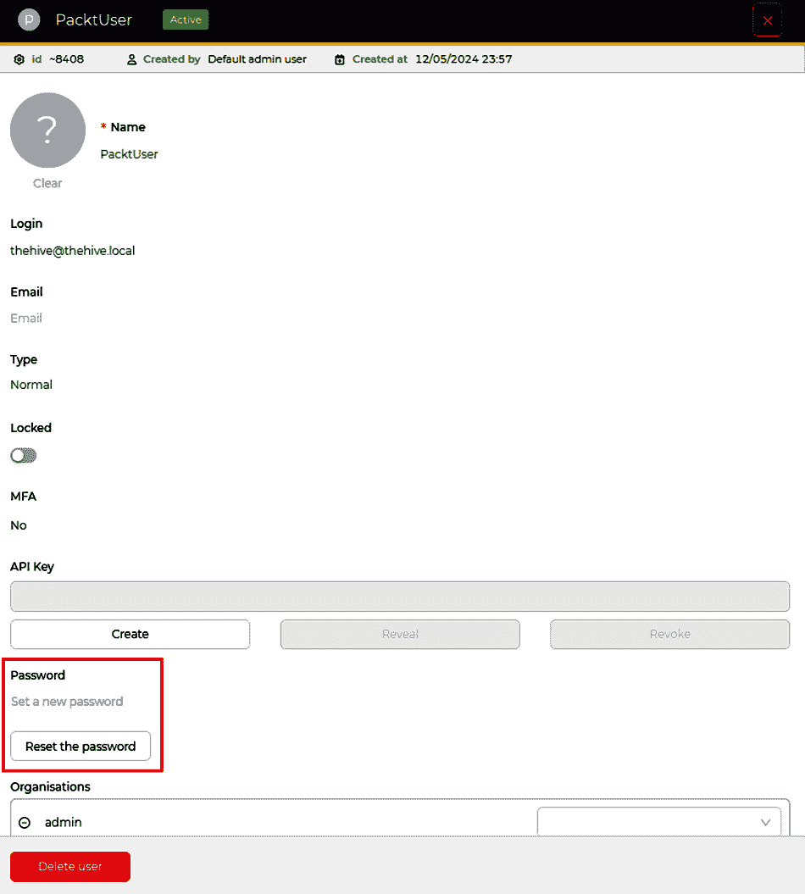

图 8.30 – TheHive 设置新密码并重置密码

1.  完成后，你将在底部看到与第一次创建用户时相同的**确认**按钮。点击该按钮，你就应该设置好了：

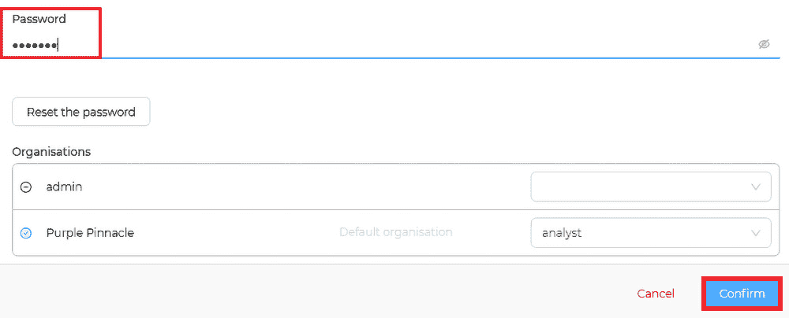

图 8.31 – 确认按钮

1.  你可能会在最左侧的列中看到一个圆圈，允许你在管理员账户和你刚创建的分析员账户之间快速切换。如果没有，请选择右上角的下拉箭头，然后从下拉菜单中选择**注销**，接着输入刚创建的帐户的凭据。

1.  选择**让我进入**以重新登录为普通用户。现在顶部的功能区应该会有一个按案件 ID 搜索的字段，以及创建新案件的选项。

恭喜！安装和设置 Cortex 与 TheHive 可能是一项繁琐且令人困惑的任务。如果你已经做到这一点，给自己一个掌声。我们建议你花足够的时间玩转这些工具，阅读开发者文档，并尽可能多地探索。如果你弄坏了什么，那太棒了！这就是我们学习的方式。这也是我们不断进步的方式。

由于 Cortex 和 TheHive 是 Kali Purple 工具集中的核心组件，你现在拥有一个非常基础的框架来构建。接下来我们将花一些时间让你了解一些威胁情报应用程序，你可以使用它们来支持你已经开始搭建的小型 IR SOC。

# 挑战！

市面上有无数的信息共享平台。你已经在本书中几次简要了解过**MISP**，即**恶意软件信息共享平台**。这是一个开源项目，旨在无私地帮助我们共同努力，阻止恶意行为者的恶意活动。MISP 与许多其他信息共享平台的不同之处在于其**威胁信息交换格式**。MISP 平台支持标准化的威胁信息交换格式，包括两个最著名的格式，即**结构化威胁信息表达**（**STIX**）和**受信自动化指标信息交换**（**TAXII**）。这使得 MISP 在与任何选择采用这些知名标准的安全平台或工具的互操作性和兼容性方面具有很高的水平。

MISP 的其他关键特性包括以下内容：

+   威胁情报共享

+   IOC 管理

+   威胁情报源

+   自动化指标关联

+   协作分析

+   可视化与报告

+   集成框架

你的挑战是进入野外，寻找尽可能多的适用平台源，只要它们与网络安全相关，学习它们，并选择至少一个——但你也可以选择多个——与本章中你已开始构建的迷你 IR SOC 集成。详细记录你的整个过程，使用大量的文字和截图，然后找到一个在线平台——可能是社交媒体，也可能不是——以一种展示你技能并帮助他人学习和成长的方式展示你的成果。

# 总结

在本章中，你已经学习了如何将前几章学到的知识应用于当你之前学会收集、分析和存储的数据揭示可能发生的真实正向事件时。这就是说，你已经开始感受到网络安全防御中的事件响应部分。

在响应事件的过程中，拥有一些工具帮助你尤为重要，尤其是当这些工具包括自动化时。在此过程中，你了解了一个名为 Cortex 的安全编排自动化响应平台。你还了解了一个名为 TheHive 的事件响应案例管理平台，它将数据输入到 Cortex 进行处理，并通过自动化对数据进行多项潜在活动。

你还看到了 MISP。这一开源项目的初衷是无私地帮助我们所有人共同努力，制止恶意行为者的恶意活动。

在下一章中，我们将对恶意软件分析进行更深入的探讨，比我们目前所做的更进一步，甚至还将了解一些关于漏洞开发的知识！

# 问题

1.  Cortex 和 TheHive 是由同一家公司创建的，这家公司叫做…

    1.  BumbleBee

    1.  SweatBee

    1.  StrangeBee

    1.  LeaveMeBee

1.  一系列预定义步骤，用于编排活动模式，通常是可重复的，这是什么？

    1.  IR 电路

    1.  工作流

    1.  容器

    1.  代码库或 **.****dll** 文件

1.  定义两个不同软件系统如何相互通信的规则的东西被称为什么？

    1.  **应用程序编程** **接口** (**API**)

    1.  **国际网络安全通信** **法律** (**ICCL**)

    1.  君主立宪制

    1.  **国际技术安全** **控制** (**ISTSC**)

1.  什么是多租户？

    1.  当两人或更多人在同一台计算机上工作时

    1.  一个能够区分并管理多个客户或组织的应用程序

    1.  类似于多任务处理，但在秘密中执行

    1.  一只章鱼或其他具有超过 2 条胳膊或腿的动物

1.  MISP 促进了关于什么类型技术的信息共享？

    1.  所有已知威胁

    1.  数据库

    1.  数字化

    1.  恶意软件

# 进一步阅读

+   **Cortex** **文档**: [`docs.strangebee.com/cortex/`](https://docs.strangebee.com/cortex/)

+   **REST API 资源编号** **1**: [restapitutorial.com](http://restapitutorial.com)

+   **REST API 资源编号** **2**: [restcookbook.com](http://restcookbook.com)

+   **MISP 项目** **网站**: [`www.misp-project.org/`](https://www.misp-project.org/)

+   **学习 Linux CHMOD** **命令**: [`linuxhandbook.com/chmod-command/`](https://linuxhandbook.com/chmod-command/)

+   **免费 Azure Synapse Analytics 视频** **课程**: [`www.youtube.com/watch?v=lLrjaVdBuM0`](https://www.youtube.com/watch?v=lLrjaVdBuM0)

+   **Synapse Analytics 与 TheHive GitHub** **页面**: [`github.com/TheHive-Project/Synapse`](https://github.com/TheHive-Project/Synapse)

+   **Microsoft Synapse 免费** **试用**: [`azure.microsoft.com/en-us/free/synapse-analytics/`](https://azure.microsoft.com/en-us/free/synapse-analytics/)
