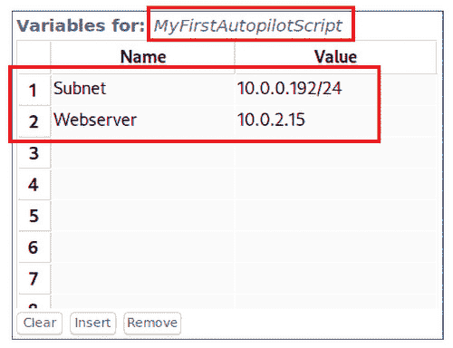

# 第十一章：Autopilot、Python 和 NIST 控制

在深入审视 Kali Purple 家族中的蓝队部分之后，我们在上一章中体验了一些红队方面的内容。这些功能被整合在紫队版本中的原因是，进攻工具用于测试防御工具，并通过渗透测试向网络安全分析师提供高质量的培训以及概念验证。

在这一章中，我们将通过 Kali Linux 提供的工具 **Autopilot** 来了解这些渗透测试工具的自动化方面。正如其名所示，Autopilot 用于自动化攻击，从而提高渗透测试团队的效率。通过 Autopilot，你将对脚本语言有一些微妙的了解——特别是 Python。

我们将简要介绍 Python 脚本语言，但并非以你想象的方式进行。这不是一本学习编程的培训手册，我们并不打算教授你如何编码。然而，如果你对此感兴趣，我们会提供大量参考资料链接。我们将重点讲解你可能在一段 Python 代码中看到的关键组成部分。我们要教你如何识别代码的内容。这将帮助你理解任何软件（无论是好的还是坏的）试图做什么。如果是你有能力编辑的软件，凭借这些知识，你甚至可以更改某些部分，以便测试和调整代码，按照自己的喜好进行修改。

之后，我们将回顾刚刚更新的 **NIST 网络安全框架**（**CSF**），该框架于 2024 年 2 月发布了 2.0 版本，增加了一个新的核心功能——*Govern*，专为高层网络安全管理人员设计，帮助监管其他五个核心功能。

在这一章中，你将学习到以下内容：

+   Kali Autopilot

+   Python

+   NIST 控制

# 技术要求

本章的要求如下：

+   **最低要求**：一台具备 *amd64 (x86_64/64-bit)* 或 *i386 (x86/32-bit)* 架构的计算设备，至少配备 *4 GB* 内存。

+   **推荐要求**：根据网络安全领域从业者的反馈，建议使用 *amd64 (x86_64/64-bit)* 架构，并配备 *8 GB* 内存。

# Autopilot

**Kali Autopilot** 是一个网络安全框架和应用程序，专为红队和紫队演练而设计。其目标是提升进攻和防守安全操作的协同效能。Autopilot 专注于自动化和简化网络安全操作中的各项任务，旨在提高演练的效率和有效性。

Kali Autopilot 的主要功能包括以下几点：

+   **自动化功能**：Kali Autopilot 提供强大的自动化功能，用于执行预定义的攻击场景、安全评估、渗透测试任务和防御措施，在红队和紫队演习中尤为有效。此自动化简化了复杂的流程，为网络安全专业人员节省了时间。

+   **场景创建与执行**：该框架允许用户创建和执行定制的攻击场景、模拟演习和网络安全评估，测试并改善组织的安全防护。这包括模拟现实世界的威胁和战术，以识别漏洞和弱点。

+   **红队操作**：Kali Autopilot 通过提供侦察、利用、权限提升、横向移动和后期利用活动的工具和功能，促进红队操作。它使红队能够模拟复杂的网络攻击，并评估防御措施的有效性。

+   **紫队协作**：该框架通过促进红队和蓝队之间的协作，支持紫队行动。Kali Autopilot 使得进攻性和防御性安全团队可以共同进行演习，模拟攻击、检测威胁、应对事件，并增强整体的安全韧性。

+   **报告与文档**：Kali Autopilot 包含生成详细报告、记录发现和跟踪红队与紫队活动进展的功能。这些报告可以用于合规性检查、风险评估、事件响应规划以及安全改进措施。

+   **工具集成**：该框架集成了广泛的安全工具、脚本和框架，这些工具和框架通常用于红队和紫队任务中。无缝集成增强了网络安全专业人员可用的工具包，并确保了安全评估任务的全面覆盖。

+   **定制化与灵活性**：用户可以定制和微调 Kali Autopilot 的行为、参数和配置设置，以使其符合特定的红队和紫队目标。这种灵活性使得网络安全评估和演习可以采取量身定制的方法。

+   **培训与技能发展**：Kali Autopilot 是一个宝贵的平台，供网络安全专业人员提升其进攻性和防御性安全实践的技能、知识和专长。它提供模拟环境中的实操经验，帮助提高处理网络威胁和漏洞的能力。

+   **可扩展性与企业部署**：该框架设计上具备可扩展性，可以适应不同组织规模、安全环境和操作需求。Kali Autopilot 支持企业级部署，用于大规模管理和协调红队和紫队活动。

+   **社区支持与更新**：Kali Autopilot 受益于一个充满活力的网络安全专业人士、红队成员和紫队成员社区，他们为其开发、改进和支持做出了贡献。用户可以利用社区驱动的资源、更新和合作机会，最大化该框架的有效性。

Kali Autopilot 无需额外的下载、安装或激活。如果你已经安装了 Kali Purple，它应该已经设置好并准备就绪！

要启动 Kali Autopilot，请按照以下步骤操作：

1.  启动并登录到你的 Kali Purple 虚拟机实例

1.  选择屏幕左上角的 Kali Linux 龙图标，位于**文件**字样下方

1.  将光标移动到左侧栏，悬停在**08 -** **利用工具**上

1.  从第二列中选择**Kali Autopilot**，如*图 11.1*所示：


图 11.1 – 从菜单启动 Kali Autopilot

如果由于某种奇怪的原因 Kali Autopilot 未在你的 Kali Purple 实例中安装——这真的不应该发生——那么你可以打开终端窗口，输入**sudo apt install kali-autopilot**，确保包括连字符。

完成上述步骤后，**Kali Autopilot - 自动化攻击生成器**将加载，并显示两行内容。第一行将包含三列。左侧的列是用于管理攻击脚本的窗格，包括添加、删除、导入、导出或保存脚本的选项。中间的列是用于管理所选脚本变量的窗格。右侧的窗格是产品执行任务所需的网络和通信设置。第二行只有一列，跨越整个宽度，包含攻击序列：


图 11.2 – Kali Autopilot 默认图形界面

现在你已经学会了如何通过繁琐的方式启动它，我们还要告诉你，你也可以打开命令终端，直接输入**kali-autopilot**来加载 Autopilot 图形界面。接下来，让我们用 Autopilot 创建第一个自动化攻击脚本。如果你以前从未写过代码或创建过脚本，别担心！Autopilot 会为你完成大部分繁重的工作。我们会一步步引导你完成。

在继续之前，我们先确保你可以使用名为**Dirb**的工具。请通过进入命令行并输入**sudo apt-get install dirb**来确认你已经安装了这个工具。Dirb 常被称为**目录突破工具**或**目录暴力破解工具**，它的作用是通过执行字典攻击来查找网络服务器上隐藏的网页内容、目录和文件。

接下来，我们开始编写攻击脚本。要创建测试脚本，进入 Autopilot 的左上角的**攻击脚本**窗口。在该窗口底部的**脚本**字段中输入**MyFirstAutopilotScript**或任何你喜欢的名称——记得这是你脚本的名称。然后点击**添加**按钮，如*图 11.3*所示：


图 11.3 – 创建你的第一个 Kali Autopilot 脚本

你会注意到中间的窗口会自动填充上你的新脚本名称，如*图 11.6*所示。我们在这里要做的只是创建一个简单的脚本，用来扫描我们的主机系统和一个 Web 服务器，我们现在就开始设置。如果你的系统中已经有它了，那么直接跳过这一步。如果没有，输入**sudo apt install apache2**并按照提示操作。如果你已经安装过，它会显示相关信息。如果没有，它会开始安装。这个过程非常迅速且简单，应该不会造成任何痛苦。如果在安装 Apache Web 服务器时你出现了失血的情况，立刻停止操作，因为你做错了某些非常非常严重的事情。寻求医疗帮助，然后在继续之前找到附近的 Linux 安装专业人员。

当你已经被医治好并且可以重新开始时，输入**sudo systemctl start apache2**启动你刚刚安装的 Web 服务器，然后输入**sudo systemctl status apache2**以确保一切正常。现在，我们要创建两个变量。第一个我们叫**Subnet**，它将用于扫描我们的主机系统。第二个是**Webserver**，它将用于扫描我们刚刚安装的 Web 服务器。我们将把这些变量的值设定为它们各自的 IP 地址。这样，如果这些 IP 地址发生变化，我们无需重写整个脚本，只需回到中间窗口，修改它们的值，再让 Autopilot 重新生成脚本，它会用新的值替换旧的值。

要创建这些变量，我们首先需要获取默认值，即当前的 IP 地址。进入你的主机系统并打开命令终端。如果你不记得如何操作，可以回到*第三章*进行查看。如果你的主机是 Windows，输入**ipconfig**并查找 IPv4 值，如*图 11.4*所示。如果是 macOS 或 Linux，你需要输入**ifconfig**来获取相同的信息：


图 11.4 – Windows 系统 ipconfig 命令

记录下这些信息，然后在 Kali Purple 实例中的终端窗口里输入**ifconfig**，以获取 Web 服务器的信息。你的 Web 服务器托管在 Kali Purple 实例上，你需要获取显示在*图 11.5*中的 eth0 IP 地址：


图 11.5 – VM 系统 ifconfig 命令

返回到你的 Autopilot 应用程序并创建两个变量。

要创建一个变量，你需要将光标放在中间窗口第一列的第一行（在此例中是第 1 行），在**Name**标题下方的空白行中。选中该字段后，直接开始输入你想要输入的内容，然后按*Enter*键。将第一个命名为**Subnet**，第二个命名为**Webserver**。填写你的主机的 IP 地址，并在其后加上斜杠和数字 24，如*图 11.6*所示。使用这个斜杠的方式被称为**无类域间路由**（**CIDR**）表示法。这是一种定义 IP 地址范围的快捷方式，而无需列出每一个单独的地址。如果你想深入研究 CIDR 表示法的原理，我们会在*进一步阅读*部分提供一个链接供你参考。

在这种情况下，你会注意到每个 IP 地址由四组数字组成，且每组数字之间用点分隔。这被称为一个八位字节（octet）—因为点本身是代码的一部分，总共有四个点。最后的点，在每个 IP 地址的末尾，是不可见的。其实它并不是真正消失了，我们只是为了便于书写省略了它。每个非点的八位字节（总共 4 个）是从 0 到 255 的数字，即最大 256 个数字（从 0 到 255）。所以在这里，我们告诉代码，32 位中有 24 位不可用，剩下的 8 位可以使用，这意味着你的变量将扫描最多 256 个 IP 地址，因为这 8 位可以通过 256 种不同的 1 和 0 的组合来操作。这 256 个 IP 地址是**10.0.0.0** – **10.0.0.255**，只有最后的数字八位字节的值会发生变化：



图 11.6 – 在 Autopilot 中设置变量

一旦我们的变量设置完成，我们可以在右上角的窗口中选择为我们的攻击脚本添加一些随机化。为什么我们要这么做呢？如果你问任何一位经验丰富的 SOC 分析师，你会了解到他们会注意到一些模式。比如说，精确的动作在相同的时间间隔内反复发生，这显然是自动化的迹象。自动化几乎总会引起更深入的挖掘，并且攻击被发现的概率非常高。为什么我们要在只进行道德操作时也要关心这个问题呢？因为作为一名渗透测试员或道德黑客的一部分，正是要像真正的网络犯罪分子那样尽可能躲避防御措施。这将帮助我们从漏洞中学习，努力发现或开发新的方式来识别潜在的恶意行为。

在你们这些从事执法工作或有执法背景的人中，可能在某个时候听到过类似于*“如果你想学会如何抓住罪犯，那么你需要学会如何像罪犯一样思考”*的话。这在网络安全行业也是如此。如果你想学会如何抓住黑客，那么你需要学会如何像黑客一样思考。

在**设置**面板中，这几乎是显而易见的。**延迟**的值是你希望脚本在每个动作之间随机延迟的最小毫秒数和最大毫秒数之间的范围。**接口**字段是指你正在进行攻击的网络接口。我们将保持**eth0**不变。我们还将保持 API 端口设置为**80**，因为我们正在对一个 Web 服务器发起攻击：


图 11.7 – 设置窗口允许随机化

我们已经设置了脚本名称、变量和设置。现在，让我们编写实际的攻击脚本。Autopilot 按阶段工作，阶段零是第一阶段。我们不为阶段零编写指令。那是内部的，Autopilot 可以用来设置主要攻击。话虽如此，让我们将指令的开始标识为第一阶段。在**脚本化攻击序列**的第 1 行，在第一列**动作**下写上**STAGE**（全大写）。实际上，写成全大写并不是必须的，这只是为了可读性。在第二列**引用**下，输入数字**1**来表示我们所讨论的阶段。

在第二行和第三行，我们将执行两个扫描动作——一个是针对我们的主机操作系统，另一个是针对我们设置的 Web 服务器。因此，我们会非常精确地命名这些动作，以便反映我们所采取的动作——扫描。 在第二行和第三行的**动作**列下，输入**扫描**。现在我们已经确定了动作，让我们输入实际的命令。

在第二行的**命令**列下，输入**nmap -sn {Subnet}**。大括号表示我们正在输入一个变量。大括号内的值就是变量的名称。在这种情况下，我们输入的是**Subnet**，这是我们在 Autopilot 中创建的第一个变量。因此，**nmap -sn {Subnet}**命令也可以写成**nmap -sn {10.0.0.192/24}**，不过这样做的好处是，如果我们想更改要扫描的范围或 IP 地址，只需在**变量**窗口中更改**Subnet**的值，而不必触及实际的攻击序列代码：


图 11.8 – Autopilot 攻击序列

**–**符号，通常被称为*tack*符号（也可以叫做破折号、连字符或减号，但它作为*“tack”*符号更为流行，这个词来自军事术语），表示这是添加到 Nmap 的附加指令。**s**表示让 Nmap 将此命令中的值应用于扫描活动。这是因为 Nmap 除了扫描外，还有许多其他用途。**n**表示告诉 Nmap 这是一个无端口扫描。它指示 Nmap 执行更广泛的扫描，通过发送 ICMP 回显请求来确定目标的在线或离线状态，而不花时间扫描开放端口。

在第三行的**命令**列中，键入**nmap -PS -sV {Webserver}**。请注意，我们不需要为此命令添加端口号，因为它已经在右上角的**设置**窗口中设置了。在这种情况下，**-PS**告诉 Nmap 执行 TCP SYN Ping 扫描。它告诉 Nmap 通过向目标主机发送 TCP SYN 数据包来执行扫描，以确定它们是否可达。它通过此扫描评估主机是否活动并响应。**-sV**选项启用版本检测。它会尝试确定目标主机上运行的服务的版本。这对于攻击者来说是非常有价值的信息，因为任何特定服务的旧版本可能会有已知的漏洞，这可能会告诉攻击者他们拥有比预期更多的攻击途径。

在第四行，我们将尝试执行枚举，因此**操作**列中的值应为**枚举**。然后，在**命令**列中，键入**dirb http://{Webserver}**。

完成后，点击自动驾驶工具底部的**生成**按钮，它将自动为你生成 Python 攻击脚本。你会看到一个弹窗，显示 Autopilot 放置攻击脚本的位置，如*图 11.9*所示。使用**cd**命令导航到该位置：


图 11.9 – 自动驾驶 Python 脚本生成

在我们的例子中，命令是**cd kali-autopilot/MyFirstAutopilotScript**。接下来，我们将发布一个命令来调用我们的 Python 网络服务器并使其运行。键入**python3 -m http.server**来实现这个目标。你可以按*Ctrl* + *Z*来中断循环，然后键入**ps ux**来查找并确认服务器是否在运行。它将在你活动进程列表的底部附近显示，显示的命令与你输入的完全一致——**python3 -m http.server**——并且出现在最右列，如*图 11.10*所示：


图 11.10 – PS ux 命令显示我们的服务器正在运行

保持终端窗口打开，双击终端图标打开另一个终端窗口，并通过键入与前一步相同的**cd kali-autopilot/MyFirstAutopilotScript**命令来导航到您的 Python 脚本。自然地，如果您将脚本命名为其他名称，则路径将根据您的命名进行调整。进入该目录后，键入**ls**以查看您的脚本是否在该文件夹中——它应该在。键入**./MyFirstAutopilotScript.py**来运行脚本。您可能会遇到缺少模块的错误。若缺少模块，您可以键入**pip install <module name>**来安装该模块。因此，在我们的例子中，我们键入了**pip install paramiko**，如*图 11.11*所示。安装任何缺失的模块后，再次键入**python3 ./<scriptname>**来尝试启动脚本。如果成功，您将看到如*图 11.11*所示的输入：


图 11.11 – 安装缺失的模块并启动 Autopilot 脚本

注意

如果不成功，请仔细阅读任何错误信息。通常，它们会告诉您需要做什么。出现错误的原因有无数种，往往是由于某些特定的技术问题。我们给出的现代建议之一是，当遇到 Linux shell、脚本或编译错误时，您可以将错误信息复制并粘贴到您最喜欢的 AI 聊天机器人中。我们强烈推荐谷歌的 Gemini 用于任何与 Linux 或代码相关的问题。

此时，您的脚本已经启动，但尚未由我们投入使用。它处于零阶段。为了推动它向前，我们将打开一个网页浏览器并访问[`localhost/check`](http://localhost/check)。当您到达该页面时，系统会要求您使用用户名和密码登录。Autopilot 的默认用户名和密码均为**offsec**。然后，当页面加载完毕时，您将看到一个非常简单的文本报告，确认攻击处于零阶段。在这种情况下，它显示的是零阶段中的第一阶段，因为我们在脚本中只设置了一个阶段。如果我们有十二个阶段，它会显示**攻击处于第 0 阶段，共 12 阶段**。您明白了：


图 11.12 – 浏览器确认攻击处于脚本中的第 0 阶段

为了推进我们的攻击，我们将选择浏览器中的**URL**字段，并将地址更改为[`localhost/set?mutex=1`](http://localhost/set?mutex=1)，以将攻击阶段设置为 1。返回到您输入命令以启动脚本的终端窗口，您将看到您的脚本开始工作，如*图 11.13*所示：


图 11.13 – 浏览器确认攻击处于脚本中的第 0 阶段

就是这样！如果你已经做到这一点，恭喜你！你刚刚成功创建并运行了自己的自动化网络攻击脚本！开发人员会使用许多编程语言进行脚本编写。虽然没有硬性规定什么时候使用哪种脚本语言，但例如你很可能会在一个网页开发者的工具箱中找到 JavaScript。在网络安全领域，你会在*nix 家族的操作系统中看到大量的 Bash，这包括 Linux。然而，网络安全并不限于*nix 操作系统。对于网络安全目的来说，最有可能和最通用的脚本语言是 Python。事实上，你在本书中已经多次看到 Python 的依赖。这是因为 Python 非常多才多艺，相比其他语言易于学习，并且拥有非常丰富的库和框架，使其适用于渗透测试、网络安全监控、自动化和一般脚本编写等任务。那么，让我们来看看 Python 脚本语言。

# Python

我们这里的 Python 课程与你迄今为止遇到的任何编程语言课程都不同。课程将非常简短而精炼。因为我们不是要教你如何编写代码，市面上已经有大量的资源可以帮助你学习这一点。虽然学习如何编写自己的代码具有很大的价值，尤其是在网络安全的中高级阶段，但从一开始就知道如何写代码并不是必要的。然而，必要的是能够阅读和理解代码。这要求我们有一个不那么严格的课程计划。

Python 的一个重要方面是知道脚本中的语言何时是代码的一部分，何时又是给人类阅读的程序员指令的一部分。这是通过输入**#**符号来实现的，它告诉任何 Python 编译器忽略该行中**#**符号后面的所有文本。所以，如果你有大量非代码信息要共享，你需要在每一行前加上**#**符号：

```
# This is the
# beginning of a
# multi-line comment
```

任何编程语言的一个优点是能够定义并使用可变的信息。也就是说，这些信息可以随着时间的推移而改变。在 Python 中，这是很简单的。你只需决定你想给变量命名，添加一个等号，然后给它一个默认（初始）值：

```
awesomeSauce = 0
```

这意味着每次你在代码中看到**awesomeSauce**这个词时，它要么是**0**的值，要么是在代码中对它应用数学运算后的新值：

```
print(awesomeSauce + 1)
# This is the same as the computer printing the value of
# awesomeSauce + 1, in other words 0 + 1 which is 1.
```

在这个上下文中，你还注意到如果你希望 Python 代码将某些内容打印到用户的屏幕上，你只需使用**print**这个词。

如果你想让一个变量是一个单词而不是数字呢？这也很简单。你只需要将值放在引号中，以告诉编译器引号内的字符，无论是字母还是数字，都是文本字符而不是数字：

```
awesomeSauce = “Sweet Baby Ray’s”
print("My favorite sauce is: " + awesomeSauce + "!")
# This prints - My favorite sauce is: Sweet Baby Ray's! - to your
# screen. You might someday decide that your favorite sauce has
# changed. So, you simply need to change the variable, leaving the
# rest of the code alone.
awesomeSauce = "Sour Baby Ray's"
print("My favorite sauce is: " + awesomeSauce + "!")
# Now it will print – My favorite sauce is: Sour Baby Ray's!
```

你会注意到，字符串（即文本字符）是通过使用引号来表示的。而数学值和调用变量（如在 **print** 函数中所见）则不使用引号。当一个变量被用在句子中时，你可以使用加号来将不同部分的句子拼接在一起。

你会注意到加号并不是直接加数字，而是在将某些内容组合在一起。它们在将字符串的各部分拼接在一起。放心，当你看到 Python 代码中的常见数学运算符时，它们确实在执行你所期望的数学操作。这些包括：

| **标题** | **符号** | **操作** |
| --- | --- | --- |
| 加号 | **+** | 加法 |
| 减号 | **-** | 减法 |
| 星号 | ***** | 乘法 |
| 斜杠 | **/** | 除法 |
| 百分号 | **%** | 取余（除法的余数） |
| 双星号 | ****** | 指数运算 |

表 11.1 – Python 数学运算符

还有其他运算符，但这只是一个入门课程，帮助你理解 Python 中一段基本代码。沿着这个思路，你还需要熟悉比较运算符。这是指将一组数据与另一组数据进行比较。它们包括以下几种：

| **比较** **运算符名称** | **符号** |
| --- | --- |
| 等于 | a == b |
| 不等于 | a != b |
| 小于 | a < b |
| 小于或等于 | a <= b |
| 大于 | a > b |
| 大于或等于 | a >= b |

表 11.2 – Python 比较运算符

使用这些数学和比较运算符，你可以控制信息的流动。因此，在阅读 Python 代码时，你可以查看如下语句，以便根据已识别的条件了解代码可能会执行的操作：

```
If a < b:
print(a + " is less than " + b)
elif a == b:
print(a + " is equal to " + b)
else:
print(a + " is greater than " + b)
```

在前面的代码中，**elif** 代表 *“如果前一个语句不成立，但如果这个语句成立，那么就执行下一行”*，而 **else** 代表 *“如果前面的语句都不成立，那么不管怎样，都执行下一行”*。

你还可以通过循环控制信息的流动。第一个是 **while** 循环。它意味着，只要某个条件为真，就继续不断地执行接下来的操作，直到条件不再为真。考虑以下代码：

```
morale = 0
while morale < 11:
	if morale == 10:
		print("Morale has improved! The beatings will stop.")
	elif morale < 10:
		print ("The beatings will continue")
	morale += 1
```

你认为上述代码会做什么呢？如果你说它会打印**"The beatings will continue"** 10 次，然后再打印一次**"Morale has improved! The beatings will stop."**，那么你是正确的。这是因为**morale**变量的初始值为**0**，代码的最后一行表示将该变量的值增加**1**，然后重新运行循环。它会继续循环，直到初始条件变为假。发生这种情况时，**morale**的值达到**11**，因为**while**循环明确指出，它只会在值小于**11**时运行。

下一种循环叫做**for**循环。在 Python 中，它与许多其他语言略有不同。它更简单。它差不多意味着*“只要”*，可以用在字符串或数字上：

```
for n in range (20, 60, 5):
	print(x)
# calling the (range) function. 1st number is bottom, 2nd is top, 3rd is
# the value to increment by. In this case, we are counting by fives
# starting at the number 20 and finishing at 55.
money = ["rich", "wealthy", "modest", "struggling", "poor", "broke", "can't even afford to pay attention"]
for m in money:
	if m == "struggling"
		continue
	print(m)
# This for loop will loop through the entire list of text except when # it reaches the word "struggling" which it will skip but then
# continue on with the rest of the list.
```

任何编程语言的核心都是函数。在 Python 中，函数的声明与其他语言几乎相同，只是在语法上有细微的变化。在 Python 中创建函数是通过使用**def**这个关键词来定义的。然后，在同一行中，您需要写出函数的名称，并在圆括号中指定您希望为该函数设置的任何参数。如果您之后希望调用该函数，只需在圆括号中输入您希望传递给它的任何值即可。以下代码将**cname**作为参数，用作任何信息的变量，每当从代码的其他地方调用该函数时，都会传递给它。我们调用函数六次，传递六个不同的文本变量给原始的函数参数**cname**进行处理：

```
def security_clearance(cname):
	print(cname + "** CLASSIFIED **")
security_clearance("Confidential")
security_clearance("Secret")
security_clearance("Top Secret")
security_clearance("Top Secret – White Knight")
security clearance("Top Secret – Black Knight")
security clearance("Top Secret – Night night")
```

上述代码创建了一个名为**security_clearance**的函数，并接受一个名为**cname**的参数。当调用该函数时，它会执行其中的命令。在这个例子中，唯一的命令是接受**cname**参数，该参数会在函数调用时被输入，并将文本**** CLASSIFIED ****附加到它后面。以下六行代码都是调用该函数并将括号中的数据传递给函数的例子，这样它就成为了**cname**变量。所以，对于每一行，它都会获取括号中的值并在其后添加文本**** CLASSIFIED ****。例如，第一行将会输出**"Confidential ** CLASSIFIED **"**到屏幕上。

在阅读 Python 代码时，任何看到**def <sometext>(<value>)**的地方，都可以认为那是在定义一个函数。任何看到**<sometext>(<value>)**的地方，如果前面没有**def**，那就是调用函数的例子，并将括号中的值传递给函数定义中的指令，以告诉程序如何处理您传递给它的信息。

如果你在 Python 脚本中看到以下内容，你可以放心地得出结论，代码正在尝试读取你在文件路径中看到的那个文件。当然，如果你正在尝试打开那个文件，希望你是在 FBI 工作并且想要拯救一些生命。否则，你可能会发现自己身处一个非常糟糕的境地：

```
f = open("D:\\mafiaFiles\hitlist.txt", "r")
print(f.read())
```

你还应该查看 Python 代码是否会创建新文件或写入文件：

```
f = open("hitlistTwo.txt", "a")
f.write("'Joey The Sledgehammer Hoffa")
f.close()
# A good coder will close the file after appending to it
# and then open it using f.read to view it
f = open("hitlistTwo.txt", "r")
print(f.read())
```

如果你看到像以下这样的代码，那就是 Python 正在连接数据库。在这种情况下，它正在连接到 MySQL，这是一个非常流行的数据库，大家都在用：

```
import mysql.connector
myfirstdatabase = mysql.connector.connect(
 host="localhost",
 user="Karllane",
 password="Batman"
)
print(myfirstdatabase)
# You will see words, usually in all caps but not necessarily, like
# SELECT, INSERT, WHERE, DELETE, CREATE, JOIN, LIMIT, ORDER BY,
# and DROP that will indicate database activity is occurring
```

好的，Python 还有更多的内容，功能数量成指数级增长。然而，本节课的目的不是教你 Python，而是教你如何识别 Python 代码的最基本组成部分，这样在浏览他人的 Python 脚本时，你可以大致理解代码的作用。

让我们来运用你新学到的 Python 识别技能。考虑以下代码，它会检查日志文件中的特定关键字，并在找到匹配时触发警报：

```
# Import libraries
import re                  #Regular expressions for pattern matching
#Main function
def check_logs(filename, keywords):
  with open(filename, "r") as f:      #open the log file to check
    for line in f:                    #Read the log file line by line
      for keyword in keywords:        #Check for each keyword
        if re.search(keyword, line):  #If there's a match… do nextline
          print(f"Alert! Found keyword '{keyword}' in log file: {line.strip()}")
# Define the log file path and keywords to search for
log_file = "/path/to/your/log/file.log"
keywords = ["ERROR", "WARNING", "unauthorized access"]
# Call the function to check the logs
check_logs(log_file, keywords)
```

随着我们接近旅程的尾声，我们已经开始涉及自动化，并且查看了 Autopilot 使用的 Python 代码——事实上，Kali Purple 的许多工具也使用了这些代码。现在，我们应该看看引导 Kali Purple 结构的框架。在*第一章*中，我们曾简要介绍过它。它就是 NIST CSF，该框架在 2024 年 2 月 26 日由 NIST 首次更新，版本号为 2.0。

# NIST 控制

当 Kali Purple 被开发出来时，最初作为一个概念验证（后来迅速演变成一个完整的框架和平台），开发者基于五个基本的网络防御阶段来构建它：*识别*、*保护*、*检测*、*响应*和*恢复*。这五个阶段本身是由**国家标准与技术研究院**（**NIST**）开发的。在 2024 年 2 月，NIST 为该框架新增了第六个阶段，*治理*。

NIST 实际上是美国商务部下属的一个机构，成立于 1901 年，当时大多数技术可能还是集中在工厂行业。NIST 创建网络框架的最大讽刺是，它最初是作为一个物理科学实验室成立的。然而，随着多年来的扩展，其覆盖领域也逐渐增加，其在网络安全领域的目的在于制定最佳实践，以提高信息系统的安全性和韧性，并保护敏感数据。NIST 定期开展研究，并提供资源，帮助组织应对网络安全挑战，以保持强大的网络安全态势。

如果你启动 Kali Purple 虚拟机实例并登录桌面，你会看到屏幕左上角有一个图标，位于**文件**字样下方，图标是 Kali Linux 龙的吉祥物，背景为紫色。选择该图标后，你会注意到下拉菜单的组织方式：


图 11.14 – Kali Purple 工具菜单

完整的 NIST 框架由三个主要（或父级）组成部分构成：核心、实施层级和配置文件。针对 Kali Purple 的目的，我们将只关注核心部分。更具体地说，我们将专注于核心的五个主要功能。这些功能包括*识别*、*保护*、*检测*、*响应*和*恢复*。

## 识别

NIST CSF 中的*识别*功能是一个关键组件，专注于发展对组织资产、业务环境、网络安全风险和流程的理解。它通过详细识别和记录以下元素，为有效的网络安全风险管理奠定基础：

+   资产管理

+   业务环境

+   治理

+   风险管理与战略

+   供应链风险管理

+   网络安全角色与责任

你能想到我们已经介绍的哪些工具可能适用于这些领域吗？的确有一些工具大致可以归类于这一类别，但大部分 Kali Purple 的*识别*工具可以在红队——严格意义上的 Kali Linux——这一家庭分支中找到。我们在本章之前提到过其中的几个工具，包括 GVM、Kali Autopilot、Maltego 和 ZAP。

## 保护

NIST CSF 中的*保护*功能专注于实施保障措施，以确保组织资产和基础设施的安全性、完整性和韧性。其目标是制定并实施适当的保障措施，确保敏感数据的保护和隐私，并及时有效地应对网络安全风险。该功能的一些核心方面包括：

+   访问控制

+   意识和培训

+   数据安全

+   信息保护、流程和程序

+   技术维护

+   安全技术配置

我们所介绍的工具无疑有助于这一功能，此外还有一些 Kali Linux 特定的工具。请记住，这些工具的分类可以归属于多个核心功能，而一个工具所属的功能可能是主观的，取决于你的使用方式。在*保护*功能下，你会找到 Suricata 和 Zeek；后者也会归属于*检测*，我们将在接下来的部分讨论。

## 检测

NIST CSF 的*检测*功能涉及对网络安全事件的持续识别、检测和及时响应。它侧重于开发和实施系统、流程和能力，以识别组织环境中的网络安全威胁、未经授权的活动和潜在漏洞的发生。

该功能的主要目标是使组织能够迅速有效地识别和响应可能对其资产、数据和运营构成风险的安全事件、入侵和异常活动。与*检测*功能相关的一些关键组件包括以下内容：

+   持续监控

+   异常检测

+   威胁情报集成

+   事件响应准备

+   漏洞扫描与评估

+   安全事件关联

+   终端检测与响应

+   威胁狩猎与分析

正如你可能已经猜到的那样，我们涵盖的大部分工具确实属于这一类别，比如根据配置和使用方式不同的 ELK Stack，以及我们在上一节讨论过的 IDS 和 IPS 系统——Arkime 和 Zeek。

## 响应

*响应*核心功能涉及开发和实施措施与流程，以迅速有效地响应网络安全事件、泄露和干扰。它强调具备遏制、缓解和从安全事件中恢复的能力，同时确保恢复正常操作并保护关键资产。*响应*功能侧重于协调行动、沟通和战略决策，以应对安全事件的影响并最小化其后果。该功能的核心特点包括以下内容：

+   事件响应规划

+   遏制与消除

+   通信与报告

+   证据保存

+   恢复与修复

+   事件后分析

+   法律和合规性

+   业务连续性与韧性

+   利益相关者协调

我们在*第八章*讨论的工具和话题直接与该功能相关，如 Cortex、MISP 和 TheHive。

## 恢复

NIST CSF 中的*恢复*核心功能聚焦于开发和实施策略与流程，以恢复、修复并重建在网络安全事件、干扰或泄露后的关键能力和服务。其目的是最小化事件的影响，提高响应效率，并促进操作、系统和数据的及时恢复。该功能强调业务正常运营的连续性和恢复，同时解决事件的根本原因，以防止未来的重复发生。关键恢复组件包括以下内容：

+   连续性规划

+   资源恢复

+   数据恢复与完整性

+   基础设施重建

+   韧性与冗余

+   事件后分析与改进

+   利益相关者沟通

+   法律和监管合规

+   供应商和供应链协调

+   业务影响评估

我们介绍的一些工具有助于支持 NIST CSF 的*恢复*功能。然而，重要的是要认识到，Kali Linux 本身提供了超过 600 个预安装的工具，而 Kali Purple（包括默认的 Kali Linux）则增加了大约 100 个额外工具。在本书中，我们介绍了一些最常见、最著名的工具，并补充了一些与之相似或互补的工具。大多数数据收集工具有助于恢复，比如 Elasticsearch、Suricata、Zeek 日志，尤其是 TheHive/Cortex 工具组。

## 治理

NIST CSF 中的*治理*功能在版本 2.0 中加入该框架，该版本于 2024 年 2 月发布。它的设计是为了考虑**首席信息安全官**（**CISO**）的需求。随着网络安全作为一个独立职业的角色扩展，工具、团队和挑战的增加，政策、透明度和管理能力方面的差距也随之增大。*治理*旨在提高透明度，提供组织背景，明确网络安全功能中的角色定义，并推动遵守政策、程序和流程。我们在这里不会深入探讨这一功能，因为本书主要是介绍和理解一系列技术。然而，这些技术是基于其他五个 NIST CSF 功能的，而这五个功能现在被认为都归属于*治理*这一广泛的第六个功能。*治理*建立了组织为了实现其他五个功能所能采取的路径和参数。它帮助 CISO 理解与风险管理、角色、职责、权力和政策相关的整个组织背景。它确实是一个监督功能。我们将在*进一步阅读*中提供 NIST CSF 2.0 的直接链接。

# 概述

真是一段旅程！在《Kali Purple 入门》的最后一章中，你评估了通过设置 Kali Autopilot 并提供简单的扫描脚本来自动化渗透测试的过程。现在，你了解了如何创建自己的自动化攻击脚本的基础。

我们还提供了 Python 脚本语言的高级概述，期望你能识别出大多数 Python 脚本的核心组件。这应该能够帮助你理解任何特定脚本中的内容，甚至让你在不需要真正懂得编写 Python 代码的情况下，编辑脚本以使其符合你的需求！

最后，我们讲解了更新的 NIST CSF 2.0，其中包括新添加的*治理*功能，并对每个 NIST 功能有了基本的理解，包括*治理*。我们了解到 Kali Purple 发行版是根据 NIST CSF 创建的，其理念是对于红队或蓝队的网络安全专业人员来说，拥有一套全面的工具集是最有用的。

当你继续谈判你的网络安全职业生涯时，无论你是蓝队、红队，还是真正的紫队成员，利用来自两者的概念和技术来更好地理解和掌握两者，你都会不断面对新的挑战，以及相应的新解决方案。记住，学习永远不会停止，因为坏人永远不会停止。他们将总是找到新的漏洞，而好人将永远找到解决方案。也许，最终，总有一天我们会拥有一个百分之百安全的世界，坏行为将不再可能。然而，在这样一个世界实现之前，我们总是需要像你和我们这样的人。

我们是一群专业的问题解决者，强调使用“专业”这个词。我们在这里不是为了挑毛病或炫耀自己的自负（嗯...也许有点），而是要互相支持，互相建设，互相赋能，并使用我们的大脑和解决问题的能力创造一个统一、更安全的世界。

我们留给你的最后一条指导是，在你提升你的网络安全职业生涯时：无论你的知识和技能水平如何，始终保持善良、谦逊和好奇心。掌握这三样东西，你的道路余下的部分将会展现在你面前。

# 问题

1.  什么是 Kali 自动驾驶？

    1.  用于黑客无人机的应用程序

    1.  用于自动化渗透测试和模拟网络防御的应用程序。

    1.  一个用于加利福尼亚飞行员的应用程序

1.  如果你想学习如何捕捉一个黑客，那么你需要...

    1.  反复观看《剑鱼》直到理解透彻。

    1.  吃饭像一个黑客；饮食很关键！

    1.  去黑客学校，在那里完成四年的黑客学位

    1.  想像自己是一个黑客

1.  如何区分 Python 代码和面向人类的文本？

    1.  所有数据在**#**符号之后都会被编译器/解释器忽略，只用于人类阅读。

    1.  Python 语句都以**Sssssssssss**结尾...

    1.  所有**#**符号之后的数据都会被编译器/解释器处理，其余的都是为了人类。

    1.  只有**斯莱特林学院**的成员才能阅读 Python。

1.  如何在 Python 中定义一个函数？

    1.  输入**define func**，后跟函数名称

    1.  输入函数名称，然后附加**.py**

    1.  输入单词**def**，后跟函数名称和括号内的函数参数

    1.  在韦氏词典中查找它

1.  自其创建以来，NIST 首次发布了 CSF 的更新。新增的框架中的第六个功能是什么？

    1.  识别

    1.  治理

    1.  规则

    1.  保护

1.  你最喜欢的作者是谁（只有一个正确答案）？

    1.  卡尔·莱恩

    1.  卡尔·莱恩

    1.  卡尔·莱恩

    1.  卡尔·莱恩

    1.  卡尔·莱恩

    1.  卡尔·莱恩

    1.  詹姆斯·帕特森

# 进一步阅读

+   **理解 CIDR** **表示法**: [`www.w3schools.com/training/aws/understanding-cidr-notation.php`](https://www.w3schools.com/training/aws/understanding-cidr-notation.php)

+   **学习编程语言** **Python**: [`www.packtpub.com/search?query=introduction%20to%20python`](https://www.packtpub.com/search?query=introduction%20to%20python)

+   **NIST CSF 2.0** **发布**: [`nvlpubs.nist.gov/nistpubs/CSWP/NIST.CSWP.29.pdf`](https://nvlpubs.nist.gov/nistpubs/CSWP/NIST.CSWP.29.pdf)
