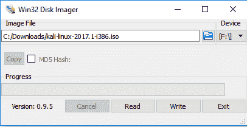

# 第一章：安装 Kali 和实验室设置

在本章中，我们将讨论以下主题：

+   实验室架构和考虑事项

+   安装 VirtualBox

+   在 VirtualBox 上安装 Kali

+   从可启动介质使用 Kali Linux

+   升级 Kali Linux

+   理解 Kali 的高级定制和优化

+   安装 Windows 机器

+   安装 Metasploitable

+   安装 OWASP-BWA

+   了解 hack me 和其他在线资源

# 介绍

为了为本书的其余部分奠定基础，并帮助你复现各个配方及其输出，我强烈建议你创建一个测试环境，在其中运行 Kali Linux 附带的各种工具。本章将重点介绍如何基于免费或低成本的应用程序来构建我们的测试环境，以尽量减少成本。

从安装虚拟化平台 VirtualBox 开始，我们将介绍一些 Kali Linux 的常见安装技巧；你还将学习如何更新和维护你的安装。

# 实验室架构和考虑事项

在本节中，我们将讨论我们的实验室设计，并提供一些信息，帮助你将来扩展实验室。

当我们开始设置实验室时，我们希望花些时间讨论实验室的设置和一些使用实验室时需要考虑的事项。部分考虑事项旨在提高实验室的效率，另一些则用于保护实验室连接的网络。我们还希望让你能够轻松扩展或发展这个网络，随着你掌握随后的 Kali 配方，可以加入更多测试机器。

# 如何操作...

在本节中，我们将讨论一些通用话题，而非具体的配方。

# 虚拟化管理程序选择

如今，市面上有许多不同的虚拟化管理程序，可以让你在一台物理机上运行多个虚拟机。出于特定目的，我们选择在 VirtualBox 中展示如何设置初始实验室，原因有很多。它是免费的，支持多平台，且能够在你的主操作系统内运行。然而，随着我们进入本书的后续章节，我们将转向 VMware ESXi。使用 VirtualBox 和 VMware ESXi 之间的配方不会受到影响。我们更换的主要原因是，在我们专用的实验室中可以获得更多计算资源。我们能够同时运行多个虚拟机，并且可以根据需要在 Kali 实例和测试主机之间插入防火墙等安全设备。我们还拥有创建更复杂环境的灵活性。

如果由于任何原因你需要构建一个更大的测试网络，或者有一个更适合你需求的虚拟化管理程序，可以自由使用它，我们会假设你能够在不同的虚拟化管理程序之间翻译我们的操作指南。

# 虚拟化管理程序的网络配置

在我们的实验室中，我们将在 VirtualBox 中使用两个网络：一个是 NAT 网络，另一个是主机专用网络。我们的 Kali 系统将连接到这两个网络，以便与互联网上的设备通信、下载更新和获取软件包。我们的目标机器只连接到主机专用网络。主机专用网络只能在主机内部及主机专用网络上连接的其他设备之间通信。它不能通过您的以太网或无线网络进行通信。这种设置对我们的测试环境非常关键，因为我们绝不希望将我们的测试主机暴露给外部世界，因为它们非常容易受到攻击。

为了进一步保护您的实验室所连接的网络，我们建议实际上断开连接到 NAT 网络的 Kali 虚拟机的虚拟适配器，除非特别需要按照配方操作。这样，您的网络就可以免受来自 Kali 的任何意外攻击的影响。

# 可能存在漏洞的工作站

经常被问及的一个问题是为什么我们软化机器或使用有漏洞的机器。事实是，一个正确打补丁、正确配置和正确加固的机器是非常难以进入的。渗透测试并不是试图进入加固设备，而是专门寻找那些有漏洞的设备。在典型的测试中，你可能只会找到一两台有漏洞的机器。你可以利用这些机器来进入一个环境，以便入侵其他更加加固的机器。如果你作为渗透测试人员开始进行定期测试，你会惊讶地发现有多少机器可能存在漏洞。这在低成本**物联网**（**IoT**）设备如连接到互联网的摄像头、恒温器、自动化系统和监控方面尤为明显。这些设备通常运行 Linux 类型的嵌入式操作系统，很少打补丁并且经常被忽视。更重要的是，它们通常充满了我们可以利用的漏洞和错误。

# 安装 VirtualBox

为了建立我们实验室的基础，我们将使用 VirtualBox 作为虚拟硬件平台来托管我们的镜像。本文将概述完成此操作所需的步骤。如果您希望使用其他虚拟化平台，同样的基本原则也适用。

当涉及到学习新技能或提升您已有技能时，测试环境的重要性不可高估。必须确保您有测试对系统在已知状态下的系统的手段，以便验证您测试的结果。

一种节省资源（包括物理硬件和计算资源）的方法是利用一个虚拟环境，您可以在其中测试设备。一个非常流行的虚拟化平台示例是 Oracle 的 VirtualBox——这是一个专为 x86 平台设计的虚拟化环境，可以在一台物理计算机上托管许多虚拟机。这允许共享磁盘、RAM、CPU 等资源。此外，由于 VirtualBox 支持导入和导出虚拟设备，资源可以轻松移动和共享等。

# 准备就绪

为了在本书的其余部分中使用 VirtualBox，我们需要确保服务器上有足够的资源来同时运行几个虚拟客户系统。以下表格突出显示了我们打算的每个客户系统所需的资源量：

| Name | Disk required | Memory required | CPU required | Chapters used |
| --- | --- | --- | --- | --- |
| Kali Linux | 80 GB | 8 GB | 2 | 1-10 |
| Metasploitable | 65 GB | 4 GB | 1 | 1,2,4-7,10 |
| Ubuntu 16.4 LTS | 15 GB | 2 Gb | 1 | 1,6,10 |
| Windows XP SP3 | 10 GB | 1 GB | 1 | 1,2,4-7,10 |
| Windows 7 - host 1 | 10 GB (thin) | 2 GB | 1 | 1-7 |
| Windows 7 - host 2 | 10 GB (thin) | 2 GB | 1 | 1-7 |
| Windows 2008 Server | 25 GB (thin) | 2 GB | 1 | 1-7 |
| OWASP-BWA | 10 GB | 1 GB | 1 | 1,9 |
| VulnOS | 32 GB | 1 GB | 1 | 1,7 |

# 如何实现…

在本节中，我们将建立一个环境，让您能够进行安全测试，而无需使用物理硬件：

1.  确保主机机器上除了 VirtualBox 本身所需的资源外，还需要以下资源来支持上述系统组合：

    +   5 CPU

    +   1500+ GB 硬盘空间可用

    +   16 GB 内存空闲

1.  从[www.virtualbox.org](https://www.virtualbox.org/)下载适合您实验环境的 VirtualBox 版本。

也许熟悉一下 VirtualBox 手册中提供的详细选项会很有帮助，该手册可以在[`www.virtualbox.org/manual/ch01.html.`](https://www.virtualbox.org/manual/ch01.html)找到。

1.  下载安装程序后，找到它并开始安装。当应用程序开始安装时，您将看到以下对话框。在撰写本书时，可用版本为 5.1.8。当您看到下图中的对话框时，请选择“下一步”：

 初始安装屏幕

1.  在第一个自定义设置屏幕上获得选项时，请保持默认选项不变，然后选择“下一步”：

 第一个自定义设置屏幕

1.  在下图中看到的第二个自定义设置屏幕上，回顾选项并确定哪些选项符合您的偏好，然后选择“下一步”：

第二个自定义设置屏幕。如果勾选了“注册文件关联”（Register file associations），这将配置你的系统使用 VirtualBox 来自动打开虚拟磁盘镜像。

1.  在基本配置选项决定后，设置将开始对主机计算机进行更改。一个步骤是安装专用的虚拟网络适配器，允许 VirtualBox 提供关于如何使用网络的不同选项。在这些驱动程序安装过程中，你可能会遇到短暂的连接中断；因此，当出现提示时，请选择“是”来确认这一点。

1.  当准备好开始安装时，从下一个对话框中选择“安装”（Install），并等待安装过程完成。

在安装过程中，你将被提示允许安装设备驱动程序。这些驱动程序主要用于虚拟网络设备。你可以选择以后信任由 Oracle 签名的设备驱动程序，或保持此选项不选中。

1.  安装完成后，你将可以选择完成安装，或者选择完成后直接启动 VirtualBox。

根据你未来可能在此实验室中的其他使用场景，现在是安装 VirtualBox 扩展包的好时机，该扩展包包括对 USB 2.0 和 3.0 控制器、主机网络摄像头、RDP 服务和其他功能的支持。建议你在启动 VirtualBox 之前安装这些扩展包。

1.  启动 VirtualBox 后，你需要确认网络连接的设置。你需要找到虚拟机菜单中的“首选项”（Preferences）项，然后选择它。接着，选择顶部的网络选项，你将看到以下窗口：

VirtualBox 首选项对话框 - 网络

1.  默认情况下，NatNetwork 应该已经为你创建好了。如果没有显示，请点击右上角的 + 按钮来添加一个。

在下一部分，我们将创建仅存在于你电脑上的网络。尽管这些网络只会在你的电脑上显示，但我们强烈建议你使用与任何你可能访问的现有网络不冲突的子网。

1.  添加后，通过点击右下角的扳手图标来查看网络的设置，你将看到以下对话框。你可以根据需要修改 IP 子网。确保选中“启用网络”（Enable Network），然后点击“确定”（OK）以继续：

NatNetwork 配置对话框

1.  创建我们的测试网络。选择仅主机网络（Host-only Networks）。默认情况下，未创建任何网络，因此请点击右上角的 + 图标来创建 vboxnet0 网络：

仅主机网络对话框

1.  确保 vboxnet0 接口已被选中，并点击屏幕右下角的扳手图标。IPv4 地址已经为你预填。如果你将其放入现有实验室网络，或者该地址范围在你现有环境中其他地方已被使用，可以根据需要指定不同的网络，因为这将是你的脏网络，用于测试目的：

仅主机网络适配器对话框

1.  让我们通过选择 DHCP 服务器部分进行回顾和修改。默认设置应该没有问题，但你可以根据需要调整。

不要将整个范围用于 DHCP，因为你可能希望为你的脏网络中的服务器静态分配 IP 地址。

1.  一旦完成这些步骤，你的 VirtualBox 环境就准备好进入下一部分。

# 工作原理...

在本节中，我们将下载并安装虚拟计算环境 VirtualBox，以构建我们的测试实验室基础。我们配置了基本的网络设置，并设置了 DHCP 以帮助动态主机网络连接。

# 在 VirtualBox 上安装 Kali

在本节中，我们将在 VirtualBox 环境中为虚拟主机安装 Kali Linux，正如我们在上一节中描述的那样。

Kali Linux（Kali）基于 Debian 操作系统；它是一个自包含的环境，包含了数百个可用于安全审计和测试目的的工具。它提供了一个平台，你可以利用这个平台来提升你的渗透测试技能。它是最广泛使用的渗透测试平台之一。

Kali 提供多种不同版本——我们将使用完整的 Kali 安装，采用 Gnome 窗口管理器，并在 Oracle VirtualBox 环境中运行。然而，Kali 可以安装在任何虚拟化平台上；它可以非破坏性地从 USB 或 CD 驱动器运行，也可以在 Raspberry Pi 或其他类似的单板计算机上运行。它支持在 Intel 和 Arm 处理器上安装。

当你第一次访问 Kali 官网并查看下载部分（[www.kali.org/downloads](http://www.kali.org/downloads)）时，可能会因为各种选项而感到有些不知所措，因此让我们逐一了解这些选项，帮助你理解它们之间的差异。

参考下图，你会注意到前两项，Kali 64 位和 Kali 32 位，是使用 Gnome 窗口管理器的操作系统默认完整安装版本。

接下来的两项由 light 指示，是为一些空间受限的系统提供的最小安装版本，包含 Gnome 窗口管理器。你可以使用此版本，并手动安装仅满足你特定需求的工具。

接下来的四个条目，标注为 e17、Mate、Xfce 和 LXDE，都是 Kali 操作系统的完整安装版本，每个版本都使用不同的图形窗口管理器来处理桌面界面。如果您使用的是较旧的设备，建议使用带有 XFCE 界面的 Kali，因为它比 Gnome 界面占用更少的资源。仅当您熟悉这些界面时，或者不想使用默认的 Gnome 窗口管理器，或出于特定目的（如资源限制）时，才建议使用这些版本。

最后两个条目，armhf 和 armel，分别用于这两种 ARM 架构，其中 armhf 支持旧版的 ARMv4 指令集，armel 支持新版的 ARMv7 指令集。

请注意，sha256 值会显示在此处。这可以帮助您验证是否下载了未被修改的镜像版本：

Kali.org 下载页面，图像部分，截止到 2017 年 5 月

如果您稍微向下滚动页面，您会看到一个部分，允许您下载预先准备好的镜像，这些镜像可以自动运行而无需经过设置过程；此外，它支持各种虚拟机管理程序，或者对于 ARM 架构，提供了适用于流行 ARM 设备（如树莓派等）的镜像和脚本。

我们不会使用这些图像，因为我们希望引导您完成 Kali 的完整安装和设置过程，这样您能更好地理解整个过程。 Kali.org 下载页面，虚拟机和 ARM 部分，截止到 2017 年 5 月

# 准备开始

在安装 Kali Linux 之前，我们需要确保满足最低要求：

+   您的计算机已连接到互联网

+   您的计算机至少需要 4 GB 的内存（推荐 8 GB）

+   您需要至少 25 GB 的硬盘空间（推荐 80 GB，用于第三章，*漏洞分析*）

+   VirtualBox 安装完成并正在运行

+   从[`www.kali.org/downloads/`](https://www.kali.org/downloads/)下载适当的 Kali 镜像文件

对于我们的目的，我们将使用 Kali 64 位版本。更多关于这些选项的细节，请参见配方介绍。

# 如何操作...

让我们开始安装 Kali 的过程：

1.  点击屏幕左上角的“新建”：

VirtualBox 主界面

1.  为虚拟机命名为 `Kali Linux`，选择类型为 Linux，并选择版本为 Linux 2.6 / 3.x / 4.x (64 位)。完成后点击“继续”按钮：

 名称和操作系统选择界面

1.  内存大小：您将看到一个内存大小滑块，也可以手动输入数值：在框中输入 `4096`。4 GB 的内存将提供流畅且响应迅速的 Kali 安装体验。点击“继续”。

1.  硬盘：选择“现在创建虚拟硬盘”并点击“创建”。

您会注意到在此界面上，会提到推荐的硬盘大小为 8 GB。请注意，这不足以进行完整的 Kali 安装，我们将在后续步骤中更改它。

1.  硬盘文件类型：选择默认的 VDI（VirtualBox 磁盘映像）文件类型。点击继续。

如果您希望与其他虚拟化平台的兼容性更好，可以选择其他可用类型。**虚拟硬盘** (**VHD**) 被广泛用于 Windows HyperV。**虚拟机磁盘** (**VMD**) 被广泛用于 VMware 部署。

1.  关于物理硬盘上的存储，保留默认的动态分配并点击继续。

如果您使用的是较旧的旋转磁盘而不是固态硬盘，并且磁盘上有足够的空间，建议选择固定大小。

1.  文件位置和大小：保留默认的名称和位置，调整滑块或直接在框中输入 `25.00` GB。点击创建。

25 GB 是一个不错的大小，适合安装和一些额外内容。如果您的空间要求有限，请参阅本食谱简介部分中的 Kali 镜像和安装选项讨论，获取更多指导。

1.  点击 Kali Linux 以突出显示它；然后点击设置：

VirtualBox 主界面 - 显示 Kali Linux 虚拟机

1.  从这里，我们将选择存储选项。最初在控制器：IDE 下会显示为空。点击突出显示“空”。点击 IDE Secondary Master 右侧的圆形磁盘图标，将弹出一个选项对话框，选择“选择虚拟光盘文件”。这将打开文件管理器对话框，允许您找到并选择之前下载的 Kali 镜像。完成后，您的屏幕应该类似于以下内容：

Kali Linux VirtualBox 设置存储选项

1.  点击网络，并验证适配器 1 是否连接到 NAT 网络，并显示名称为 NatNetwork：

Kali Linux - 网络适配器 1

1.  点击适配器 2，选择附加到主机专用适配器，名称为 vboxnet0，然后点击确定：

Kali Linux - 网络适配器 2

1.  我们将返回主管理界面。点击 Kali Linux 以突出显示它，然后点击启动：

VirtualBox 管理器界面

1.  现在我们将进入 Kali 的主安装界面。点击“图形安装”：

Kali 主安装界面

1.  选择适当的语言；对于我们的使用，选择英语并点击继续：

选择语言界面您可以点击顶部框中的 X（如果有的话），它们仅供参考。

1.  选择适合您所在地区的键盘布局。对于我们来说，我们将选择美式英语。然后，点击继续。虚拟机将开始加载安装程序组件。这应该只需一两分钟，具体取决于您的设备性能。它还将自动检测并连接到您的网络。

1.  您将进入一个屏幕，要求您输入主机名。我们就简单地将安装命名为`Kali`并点击继续：

 Kali 配置网络屏幕

1.  下一个屏幕将要求输入您的域名。我们将留空此项，直接点击继续。

1.  下一屏幕将要求我们输入 root 密码。选择一个强密码，第二次输入以验证它，然后点击继续。安装将继续进行一些后续步骤。

1.  完成后，您将进入一个配置时钟屏幕。选择适当的时区；在我们的示例中，我们选择东部时区，然后点击继续：

 配置时钟屏幕

1.  分区磁盘：为了简便，我们将选择引导式——使用整个磁盘，然后点击继续：

 分区磁盘需要注意的是，在这里的示例中，我们只需保持简单。在实际设置生产测试时，我会使用一台专用笔记本，并使用完全加密的 LVM。当你从沙盒环境转向实际工作时，这是一项推荐的做法；作为渗透测试员，你需要保护你的工作以及客户的信息。在这种情况下，加密是至关重要的。

您可能还需要考虑带有加密笔记本电脑跨境时，边境安全的相关规定。在美国，即便是美国公民，他们也可以要求你提供密码以进入机器，拿走它们并将其没收。您可能需要考虑类似的情况；您可以根据需要将加密笔记本电脑寄送到目的地，或者在离开前完成报告并清除硬盘。请记住，删除文件并不是安全地擦除信息——您可以使用**Darik 的启动和清除工具**（**DBAN**）[`dban.org/`](https://dban.org/)并使用`5220.22-m`擦除方法。

1.  您将进入一个分区磁盘确认屏幕。点击磁盘以高亮显示它，然后点击继续：

 分区磁盘请注意，当你在虚拟机中操作时，提到的磁盘将被擦除；它只是在谈论虚拟分区，而不是你的实际磁盘。如果你决定将此操作系统加载到你的个人电脑上，它将擦除整个硬盘。

1.  选择所有文件在一个分区中（推荐给新用户），然后点击继续：

 分区磁盘 - 屏幕 2

1.  选择完成分区并将更改写入磁盘。点击继续：

分区磁盘 - 屏幕 3

1.  点击“是”以将更改写入磁盘。点击继续：

 分区磁盘 - 屏幕 4 您的系统将开始进一步安装。此过程将持续几分钟，请耐心等待。

1.  安装完成后，系统将询问您是否要使用网络镜像作为软件包管理器。选择“是”并点击继续。

1.  如果需要，您将被要求输入代理服务器信息。请输入所需的信息（对于大多数安装，您可以留空此项）。点击继续。Kali 将继续安装软件包。

1.  选择**是**以安装 GRUB 引导加载程序，然后点击继续。

1.  选择列出的单个驱动器并高亮显示它，然后点击继续。这将完成安装：

安装 GRUB 引导加载程序

1.  稍等片刻，您将回到“完成安装”屏幕。系统将提示您重启计算机，以确保您已移除安装介质。在大多数情况下，当 Kali 完成安装时，VirtualBox 或其他虚拟机管理程序会自动执行磁盘弹出命令，但我们需要确保这一点。此时请不要做任何操作：

 Kali Linux：完成安装

1.  将安装窗口移到一边，露出主 VirtualBox 管理器屏幕。点击以高亮显示 Kali Linux 虚拟机。点击设置，然后点击存储。如果在控制器：IDE 下看不到 Empty，点击所显示的安装介质以高亮显示它。点击最右侧的磁盘图标，选择从虚拟驱动器中移除磁盘。点击确定：

 VirtualBox 管理器

1.  返回 Kali 安装屏幕，点击继续。系统将完成剩余项，并重启虚拟机，带您进入登录界面：

Kali Linux 完成安装记住，当登录系统时，您的用户名是 `root`，密码是您在安装过程中创建的密码。

# 使用 Kali Linux 启动媒体

如您将在后续页面看到的那样，Kali Linux 有很多用途，对于这些用途，通常不适合将设备专门分配给某一特定用途，因为这将是资源的巨大浪费。为了解决这个问题，您可以将前一部分下载的 Kali Linux 安装 ISO 作为 Live CD 使用；或者您可以使用具有持久化的 Live USB 驱动器（支持或不支持 Linux 统一密钥设置加密）。

我们将向您展示如何创建 Live USB（无持久化，无历史记录）。

诸如带持久性的实时 USB、带加密持久性的实时 USB 以及定制版 Kali Linux ISO（可加入可启动 USB 选项）等附加选项可以在 Kali Linux 文档 wiki 上找到，网址为 [`docs.kali.org`](http://docs.kali.org)，位于 02\. Kali Linux Live 部分。

# 准备工作

为了能够成功完成此部分，您将需要以下内容：

+   USB 驱动器（8 GB 或更大）

+   USB 磁盘映像工具（Win32DiskImager）

# 如何操作...

让我们开始创建可启动 Kali Linux USB 设备的过程：

1.  从我们之前在安装 VirtualBox 时下载的 Kali Linux ISO 文件开始，我们将使用 Win32DiskImager ([`sourceforge.net/projects/win32diskimager/`](https://sourceforge.net/projects/win32diskimager/)) 来创建一个可启动的 USB。下载并安装 Win32DiskImager。

1.  安装完成后，启动 Win32DiskImager。

为了格式化 USB 驱动器并写入原始映像，Win32DiskImager 需要管理员权限才能运行。当用户访问控制对话框弹出时，您需要授予其运行权限。

1.  Win32DiskImager 将使用 IMG 文件，但我们将告诉它使用 ISO 文件作为源。在应用程序界面上，点击文件打开（File Open）按钮，当弹出文件打开框时，右下角将文件过滤器更改为 *.*，并导航到 Kali Linux ISO 文件。

1.  选择 USB 设备的驱动器字母，然后点击写入（Write）：

FW32 DiskImager 示例

1.  一旦映像写入 USB 驱动器，您将能够在支持 USB 启动媒体的机器上从该设备启动。在这种配置下，您现在拥有一个可启动的 USB 驱动器，从中将启动 Kali Linux 操作系统，就像它已安装到本地磁盘上一样。在重新启动后，您将丢失任何您可能创建的文档。如果您选择这样做，您可以在 USB 驱动器上创建一个额外的分区，该分区将保持持久性，并保留您可能希望保存的文件和文档。如何扩展此功能的逐步说明可以在 Kali Linux 文档 wiki 上找到，网址是 [`docs.kali.org`](http://docs.kali.org)，位于 02\. Kali Linux Live 部分。

# 升级 Kali Linux

现在我们有了 Kali 的基础安装，让我们执行任何需要的更新和升级。您需要定期执行此操作，以确保您使用的是最新的信息。

# 准备工作

在开始之前，请确保满足以下先决条件：

+   您的计算机已连接到互联网

+   您的 Kali 安装正在运行

+   您已作为 root 用户登录

# 如何操作...

要将现有的 Kali Linux 安装更新到最新版本，您需要执行以下操作：

1.  从主 Kali 桌面上，让我们点击屏幕左上角的终端图标：

Kali Linux 桌面由于我们已经以 root 用户登录，因此不需要使用 `su` 或 `sudo` 命令来提升权限。

1.  在命令提示符下，输入以下内容：

```
 apt-get update
```

Kali Linux 命令提示符安装完成后，这个过程可能需要几分钟才能完成。

1.  完成后，我们将在命令提示符下输入以下内容来实际升级系统：

```
 apt-get upgrade
```

Kali Linux 命令提示符

1.  过一两分钟后，您将看到一个屏幕，解释将升级的内容以及需要安装哪些升级项。准备好继续时，输入`Y`并按*Enter*：

Kali linux 命令提示符该过程将花费相当长的时间，因此请耐心等待，直到您的系统完成升级。

1.  完成后，我们将重启系统，以确保拥有一个全新的运行环境。继续操作时，输入以下内容：

```
 shutdown -r now
```

Kali Linux 命令提示符

# 还有更多...

在升级过程中，您可能会被提示几个项目，如下所示：

# apt-listchanges：新闻部分

您可能会在 apt-listchanges: 新闻部分暂停，底部会显示一个冒号（:）；您可以使用箭头键阅读通知，然后按 *q* 退出并继续。

# 配置 macchanger

您可以设置系统在每次启动时自动更改 MAC 地址。对于我们的测试目的，这不是必需的；但是，如果您在实际环境中进行此操作，可能需要配置它。选择否：

配置 macchanger 对话框

# 服务重启

系统可能会提示您自动重启服务以便简化升级；选择是：


# 理解 Kali 的高级自定义和优化

现在我们已经安装并更新了 Kali Linux 虚拟机，让我们做一些自定义设置。

# 准备工作

在开始之前，请确保以下前提条件：

+   您的计算机已连接到互联网

+   您的 Kali 安装正在运行

+   您已以 root 用户登录

# 如何操作...

我们可以执行几个自定义和高级设置。

# 升级 Linux 内核

为了更新 Linux 内核，您需要执行以下操作：

1.  通过选择左侧工具栏中的图标打开终端窗口，并输入以下内容：

```
 apt-get dist-upgrade
```

1.  按照提示完成安装，安装完成后重启虚拟机。

# 移除不需要的软件包

为了移除不需要的软件包，我们将执行以下操作：

1.  通过选择左侧工具栏中的图标打开终端窗口，并输入以下内容：

```
 apt autoremove 
 exit
```

# 调整或禁用屏幕锁定

在使用本书的过程中，您可能会离开系统运行命令或在章节之间切换。在此期间，屏幕可能会锁定，并迫使您比期望的更频繁地登录。要更改这种行为，请按照以下步骤操作：

1.  在屏幕的右上角点击下拉箭头，它将提供有关当前计算机状态的各种信息。在该框的左下角，点击设置图标：

系统状态框

1.  在“所有设置”屏幕中，点击第一行的紫色隐私图标以显示隐私对话框，然后选择“屏幕锁定”条目：

隐私框

1.  根据需要调整设置；在以下示例中，我将计时器设置为 1 小时：

屏幕锁定

1.  完成后，点击顶部的“X”按钮，直到返回主屏幕。

# 修正以太网接口配置

由于每次只能启用一个接口，我们将按以下方式设置网络：

1.  在屏幕的右上角点击下拉箭头，它将提供有关当前计算机状态的各种信息。在该框的左下角，点击设置图标：

系统状态框

1.  在其中一个接口旁边，选择箭头图标，展开另一级菜单。点击“有线设置”：

系统状态框

1.  从底部选择“添加配置文件”：

网络窗口

1.  在“新建配置文件”窗口中，选择左侧的“身份”，然后在“名称”处输入`Host-Only Network`：

新建配置文件窗口

1.  在左侧列中，点击 IPv4，滚动到底部，勾选“仅将此连接用于其网络上的资源”框，然后点击添加：

新建配置文件窗口

1.  通过点击 eth1 以突出显示它，将 eth1 分配给我们刚刚创建的仅主机网络。点击“仅主机网络”。通过点击 eth1 确认 eth0 已分配给有线连接网络。现在，您应该能够同时启用两个接口：

网络窗口

# 连接和断开以太网接口

Kali Linux 使得通过网络管理器轻松管理网络连接。这就是您将如何连接和断开网络接口：

1.  在屏幕的右上角点击下拉箭头，它将提供有关当前计算机状态的各种信息：

系统状态框

1.  你将看到你的 eth0 和 eth1 接口的条目。如果你按照我们的指南操作，eth0 网络连接到 NAT 网络，可以访问虚拟机外部的互联网和网络。eth1 接口是仅主机网络，连接到你的测试机器。你可以根据需要切换这些接口的开关。

# 安装 Windows 系统

创建一个我们可以安全进行安全测试的实验环境是能够培养可重复技能集的关键。在本节中，我们将介绍 Windows 桌面机器的安装和配置，以及活动目录服务器的设置。

由于 Microsoft Windows 操作系统是最常用的操作系统，我们将在实验室中测试 Windows 平台与 Kali Linux 的配合。

# 准备工作

完成本节内容，你将需要以下资料：

1.  Windows 7 和 Windows Server 2008 的安装媒体。由于许可限制，我们无法提供 Microsoft 软件产品的安装媒体。

这些版本较为适宜，因为它们足够旧，拥有完善的漏洞文档和较低的资源需求。由于 Windows 7 桌面版和 Windows Server 2008 在本书写作时最为常见，我们建议在测试实验室中使用这些版本，并将在本书中作为示例。

1.  如同我们在前面步骤中配置的虚拟机平台，例如 VirtualBox。

1.  从你的 VirtualBox 界面开始，选择左上角的“新建”按钮，创建一个新的虚拟主机以安装 Windows。你需要使用与将要安装的 Windows 版本匹配的系统模板：

创建新的虚拟机

1.  由于此机器仅用于测试，请为其分配 1 或 2 GB 的内存，并通过点击“下一步”直到完成配置部分，使用所有剩余选项的默认值。

1.  一旦初始虚拟主机配置完成，你需要进入设置界面，告知虚拟主机从安装媒体启动。右击你刚创建的虚拟系统，进入设置。进入设置对话框后，从左侧菜单中选择“存储”，高亮显示最上方的控制器设备，点击“添加存储附件”按钮，并选择“添加光驱”。

1.  在下一个对话框中，当询问是否希望留空存储选项时，选择“使用现有”。当系统提示时，导航到你的 Windows 安装媒体并点击“打开”；然后通过点击“确定”完成配置过程。

1.  点击括号内的启动按钮，启动你的新虚拟机。

1.  从这一点开始，您将按照所选 Windows 版本的默认操作系统安装过程进行操作。当给出安装附加服务的选项时，仅使用默认选择的选项。

1.  在安装过程中，我们将给系统起个容易记住的名字。我们将桌面客户端命名为 `Windows Desktop 1` 和 `Windows Desktop 2`，服务器命名为 `AD Server`。

1.  当系统提示您配置 Windows 更新服务时，请确保不要启用 Windows 更新的自动安装：

 取消选择自动 Windows 更新在某些平台上，您可以选择仅下载但不安装更新。如果您选择此选项，这将允许您评估系统的安全性，无论是在安装 Windows 更新之前还是之后。系统可能会要求您为管理员用户创建密码。如果是这种情况，请创建一个容易记住的用户名和密码，方便在后续章节中引用。

1.  完成 Windows 7 安装后，重启机器，并在登录屏幕出现时登录。

1.  登录后，将机器名称更改为 `Win7_Desktop_1`，并重新启动。

1.  进入虚拟主机设置，确保网络适配器已分配到我们在本节中创建的仅主机网络。

1.  现在机器已经正确配置，我们将克隆它以创建第二个 Windows 7 桌面实例。

机器的克隆使得从该镜像创建金像和工作副本变得非常容易。它不同于快照，后者创建的是时间点参考，可以在需要时回滚。

1.  要创建 Windows 桌面机器的克隆，您需要使用“启动”选项启动它。启动后，不要登录机器；而是从桌面视图的顶部菜单栏中选择“机器 | 创建快照...”以启动快照创建过程：

创建快照

1.  在下一个屏幕中，您将有机会为此快照命名并提供关于此快照目的的详细信息。由于我们很可能会频繁返回此状态，请将其命名为 `Initial Installation`，并在描述中注明这是一个干净的 Windows 安装，并且快照是在加入 AD 域之前创建的：

创建 VirtualBox 快照

1.  VirtualBox 将开始生成一个快照。根据系统的不同，这可能需要几分钟。完成后，使用登录屏幕右下角的电源按钮关闭系统——此时不要登录。

1.  现在初始主机已经设置完毕，我们需要创建该设备的克隆。为此，右键点击 Windows 7 Desktop 1，选择下拉菜单中的“克隆...”：

开始克隆过程

1.  当提示时，将其命名为`Windows Desktop 2`，并选择重新初始化所有可用网卡的 MAC 地址的选项。点击“下一步”。

1.  当有选项时，选择“完全克隆”作为克隆类型，然后点击“下一步”。

1.  由于我们将在后续步骤中创建此系统的新快照，因此选择“当前机器状态”作为快照选项，然后点击“下一步”。这将开始克隆过程，可能需要几分钟。

1.  完成后，我们将像启动第一个 Windows 7 桌面 1 时那样启动此主机，但这次我们将在提示时登录。

1.  登录后，你需要将机器名称更改为`Win7_Desktop_2`。允许机器重启。

1.  回到登录界面后，按照之前的描述创建一个快照。

1.  我们将以与配置 Windows 7 桌面相同的方式安装 Windows 2008 服务器，确保设备分配到我们在之前部分中创建的仅主机网络。

1.  选择所有默认选项，安装 Windows 2008，并第一次登录。第一次登录时，你将看到初始配置任务工具。通过此工具，只配置以下内容：

| 设置时区 | 设置为你的时区 |
| --- | --- |

| 配置网络 | 设置 IP 信息如下：IP 地址：`192.168.56.10` |

子网掩码：`255.255.255.0`

网关：`192.168.56.1`

DNS 服务器：`192.268.56.1` |

| 计算机名称和域 | 计算机名称：`AD-Server` 目前保持为工作组 |
| --- | --- |

初始 Windows 服务器配置：

1.  在设置完这些选项后重启服务器并登录。初始配置任务向导将再次打开。向下滚动到“添加角色”部分；在这里我们将向此服务器添加 DNS 和 DHCP 角色。

1.  选择所有默认选项，除了以下内容：

| **页面** | **选项** | **设置** |
| --- | --- | --- |
| 指定 IPv4 DNS 服务器设置 | 上级域 | `kalicookbook.local` |
| 添加或编辑 DHCP 作用域（点击添加） | 作用域名称 | Lab |
|  | 起始 IP 地址 | `192.168.56.100` |
|  | 结束 IP 地址 | `192.168.56.150` |
|  | 默认网关 | `192.168.56.1` |
| 配置 IPv8 无状态模式 | 选择 DHCPv6 无状态模式... | 禁用此服务器的 DHCPv6 无状态模式 |

初始角色配置

1.  完成上述所有步骤后，重启服务器，并登录到每台桌面电脑，确保它们从 AD 服务器获取到 IP 地址，并且你可以通过 IP 地址 ping 通每台主机。我们将在后续步骤中配置 DNS。

1.  在确认主机之间的网络连接正常后，关闭所有打开的窗口，并像之前一样创建一个快照。

1.  创建并使桌面机器正常运行后，你需要在 AD 服务器上启用基本服务。登录到服务器后，初始配置任务向导将再次显示。此时，向下滚动到“自定义此服务器”部分，点击“添加角色”。

1.  在“选择服务器角色”部分，选择并安装以下内容：

    +   文件服务

    +   远程桌面服务

    +   Web 服务器（IIS）

如果系统提示需要包括依赖项，请接受并继续。

1.  在安装过程中，你需要为之前添加的每个角色选择某些选项：

    1.  远程桌面服务：

        +   仅选择远程桌面会话主机，点击“下一步”。

        +   选择“不要求网络级身份验证”

        +   选择“稍后配置”以将远程桌面许可推迟到稍后的日期（最多 120 天）。

        +   允许的用户组：保持管理员不变并继续

    1.  保持所有其他选项为默认，并继续。根据提示重启系统，并再次登录；你将自动返回到添加角色向导。确认安装成功。

1.  返回添加角色向导，选择这次安装活动目录域服务。遇到确认在域控制器上安装时的对话框时，点击“无论如何安装 AD DS”（不推荐），并接受任何可能需要的依赖项。继续安装过程，保持其余默认选项。完成后，选择“关闭”。

1.  在左侧菜单中选择“活动目录域服务”；在右侧窗格中选择“运行活动目录域服务安装向导（dcpromo.exe）”。在向导中选择默认选项，除了以下内容：

    +   选择部署配置：在新林中创建新域

    +   林根域的 FQDN：`kalicookbook.local`

    +   林功能级别：Windows Server 2008 R2

    +   系统提示时，重启并确认没有错误。

1.  现在，你需要登录每台 Windows 7 桌面计算机，并将它们加入到`kalicookbook.local`域。

1.  登录每台计算机，确保禁用 Windows 更新。确保 Windows 防火墙也已禁用。

1.  创建每台计算机的快照，为我们在本书中逐步操作提供基础。快照将允许我们回到预定的时间点。

# 安装 Metasploitable

Metasploitable 是我们测试环境的关键组成部分。它基于 Ubuntu Linux 操作系统，专门为渗透测试目的而设计。此虚拟机不应直接暴露在互联网上，为了我们的目的，我们将使用仅主机网络进行绑定。

# 准备就绪

在开始之前，请确保以下先决条件：

+   VirtualBox 虚拟化程序正在运行

+   Kali Linux 虚拟机已关闭

+   从[`sourceforge.net/projects/metasploitable/files/Metasploitable2/`](https://sourceforge.net/projects/metasploitable/files/Metasploitable2/)下载 Metasploitable 镜像。

+   请注意，默认的用户名和密码均为`msfadmin`。

# 如何操作...

Metasploitable 的安装按照以下方式进行：

1.  首先解压您之前下载的 Metasploitable ZIP 文件（发布时该文件为 `metasploitable-linux-2.0.0.zip`）。

1.  将解压后的目录名称更改为 `metasploitable`。

1.  找到您的主要 VirtualBox 存储位置。

1.  Windows 默认路径：`c:\users\<username>\virtualBox VMs`

1.  Mac 默认路径：`/users/<username>/VirtualBox VMs`

您应该能在主路径下看到之前安装的 Kali Linux 虚拟机的目录。

1.  在该目录中，创建一个名为 `Virtual Disks` 的新文件夹。这将形成以下路径：

`...\VirtualBox VMs\Virtual Disks.`

1.  将您在解压文件时创建的 `metasploitable` 目录移动到您之前创建的 `\Virtual Disks\` 目录下。

1.  打开 VirtualBox 管理器应用程序，并在左上角选择“新建”。为了加速安装，如果我们不是专家模式，请点击底部的“专家模式”。

如果看到底部有“引导模式”选项，则表示您处于专家模式！ 

1.  我们将虚拟机命名为 `Metasploitable`。选择类型为 Linux，版本为 Linux 2.6 / 3.x / 4.x (64-bit)，并为内存大小输入 `2048`。

1.  选择“使用现有虚拟硬盘文件”，点击右侧的文件图标，浏览到上一步中提到的目录下，找到 `metasploitable.vmdk` 文件，然后点击“创建”。

1.  现在我们将返回到 VirtualBox 管理器的主界面。点击 `Metasploitable` 虚拟机以高亮显示它，然后点击“设置”。

1.  点击“网络”，在适配器 1 处选择“仅主机适配器”并将名称设置为 vboxnet0；最后，点击确定：

Metasploitable - 网络对话框

1.  您将返回到 VirtualBox 管理器的主界面。点击 Metasploitable 高亮显示它并点击“启动”。

1.  一旦虚拟机启动，您将看到主登录屏幕：

 Metasploitable 主登录屏幕要关闭此虚拟机，您必须登录并输入命令 `sudo shutdown -h now`。尽管虚拟机本身会关闭，但它不会结束 VirtualBox 会话。您必须选择屏幕顶部的红色 X 按钮，这将弹出一个对话框；选择“关机”单选按钮并点击确定。

# 安装 OWASP-BWA

**开放式 Web 应用安全项目** (**OWASP**) 是一个全球社区，专注于安全意识和安全应用的开发。虽然这可能被认为是一个单一的应用程序或平台，但 OWASP 实际上是一个项目集合，涉及应用程序安全的各个方面。在本节中，我们将专注于 OWASP **破损的 Web 应用** (**BWA**) 项目，为我们提供一个标准化平台，用于后续章节中工具的测试。

# 准备就绪

要安装 OWASP-BWA 映像，我们需要执行以下操作：

+   从 [`sourceforge.net/projects/owaspbwa/`](https://sourceforge.net/projects/owaspbwa/) 下载最新版本的压缩文件 OWASP-BWA。

+   已安装并配置 VirtualBox

# 如何操作...

要将 OWASP-BWA 安装到我们的 VirtualBox 环境中，我们将执行以下操作：

1.  解压包含 OWASP-BWA 文件的 ZIP 文件到您将在接下来的步骤中引用的目录。

1.  在 VirtualBox 的控制台中，点击左上角的“新建”图标开始创建新虚拟机。

1.  我们将新虚拟机命名为 `OWASP-BWA`，并定义为 64 位 Ubuntu Linux 系统：为 OWASP-BWA 创建虚拟机

1.  保留默认内存分配为 1024 MB，点击“下一步”。

1.  现在，您需要选择“使用现有虚拟硬盘”并导航到您解压 OWASP-BWA 的目录。从该目录中，选择以下内容并点击“创建”：

选择 OWASP-BWA 虚拟磁盘

1.  创建完虚拟机后，我们需要确保已指定正确的网络接口。右键点击左侧的新主机，选择“设置”。导航到“网络”，确保适配器 1 连接到“仅主机适配器”，并且其他适配器没有启用：

在 VirtualBox 中为 OWASP-BWA 指定网络适配器

1.  完成后，启动新的虚拟机并确保它能够正常启动。

由于上次运行时间较长，fsck 很可能会在首次启动时运行。您可以允许其完成，以确保没有磁盘损坏问题——这个过程只需要几分钟。

1.  完全启动后，以 `root` 用户登录，密码为 `owaspbwa`。

1.  通过在命令行中执行 `ifconfig eth0`，确保您从 DHCP 获得了 IP 地址。

1.  打开浏览器，导航到 OWASP-BWA 客户机的 IP 地址。确保您能够看到 OWASP-BWA 中的不同项目。如果您能够看到以下网页，说明您已成功配置 OWASP-BWA：

确认 OWASP-BWA 上运行的服务

# 理解 hack me 和其他在线资源

还有其他一些可以在线访问或安装到 VirtualBox 中的资源，您可以利用它们来磨练您的渗透测试技能。以下是一些您可能想要探索的资源，作为本书练习的补充：

| hack.me | 从简单到高级的挑战 | [`hack.me/`](https://hack.me/) |
| --- | --- | --- |
| Hack this site | 从简单到高级的挑战 | [`www.hackthissite.org/`](https://www.hackthissite.org/) |
| Vulnerable by design | 从简单到高级的挑战 | [`www.vulnhub.com/`](https://www.vulnhub.com/) |
| Bee-Box | 易受攻击的免费网站 | [`sourceforge.net/projects/bwapp/files/bee-box/`](https://sourceforge.net/projects/bwapp/files/bee-box/) |
| Moth | 易受攻击的 Web 应用 | [`www.bonsai-sec.com/en/research/moth.php`](http://www.bonsai-sec.com/en/research/moth.php) |
| RasPwn | 易受攻击的树莓派镜像 | [`raspwn.org/`](http://raspwn.org/) |
| OWASP-BWA | OWASP 破损 Web 应用程序 | [`www.owasp.org/index.php/OWASP_Broken_Web_Applications_Project`](https://www.owasp.org/index.php/OWASP_Broken_Web_Applications_Project) |
| Hackfest 2016 Sedna | 中等难度 - root 访问 | [`www.vulnhub.com/entry/hackfest2016-sedna,181/`](https://www.vulnhub.com/entry/hackfest2016-sedna,181/) |
| Hackfest 2016 Quaoar | 易于攻破的机器 | [`www.vulnhub.com/entry/hackfest2016-quaoar,180/`](https://www.vulnhub.com/entry/hackfest2016-quaoar,180/) |
| Pentester Lab: XSS 和 MySQL 文件 | 简单的 SQL 注入示例 | [`www.vulnhub.com/entry/pentester-lab-xss-and-mysql-file,66/`](https://www.vulnhub.com/entry/pentester-lab-xss-and-mysql-file,66/) |
| SQL 注入到 Shell | 中级 - SQL 注入到 Shell | [`www.vulnhub.com/entry/pentester-lab-from-sql-injection-to-shell-ii,69/`](https://www.vulnhub.com/entry/pentester-lab-from-sql-injection-to-shell-ii,69/) |
| Damn vulnerable web application | 易受攻击的 PHP/MySQL 应用 | [`github.com/Hackademic/hackademic`](https://github.com/Hackademic/hackademic) |
| Hackxor | Web 应用黑客游戏 | [`hackxor.sourceforge.net/cgi-bin/index.pl`](http://hackxor.sourceforge.net/cgi-bin/index.pl) |
| WebGoat | 中等难度挑战 | [`www.owasp.org/index.php/Category:OWASP_WebGoat_Project`](https://www.owasp.org/index.php/Category:OWASP_WebGoat_Project) |

# 还有更多...

上述资源将通过多种不同的方法进行安装，这些方法超出了本书的范围。但我会简要提到一些部署选项：

+   可以安装在 VirtualBox 中的虚拟机

+   可在标准 Linux 机器上运行的脚本，用于构建应用程序并使其专门对攻击易感

+   你可以通过互联网攻击的资源

+   完整自包含的黑客环境

请确保在使用这些网站时，仔细阅读服务条款，并理解你正在使用的环境或工具的所有要求和限制。如果你在互联网上远程攻击网站，请特别小心。尽管其中一些选项是为测试提供的，并且这样做可能是合法的，但你的**互联网服务提供商**(**ISP**)可能会将此活动标记为恶意并采取相应措施。
