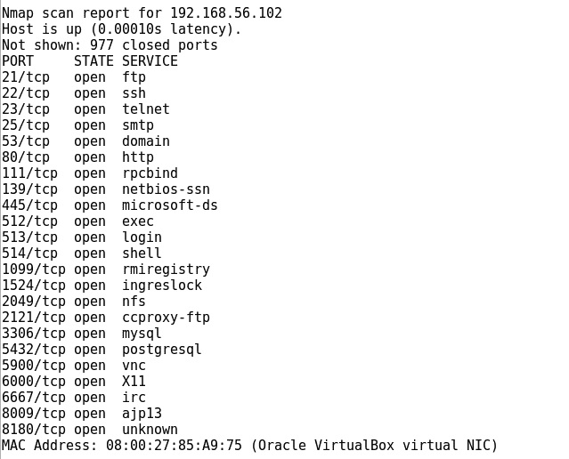
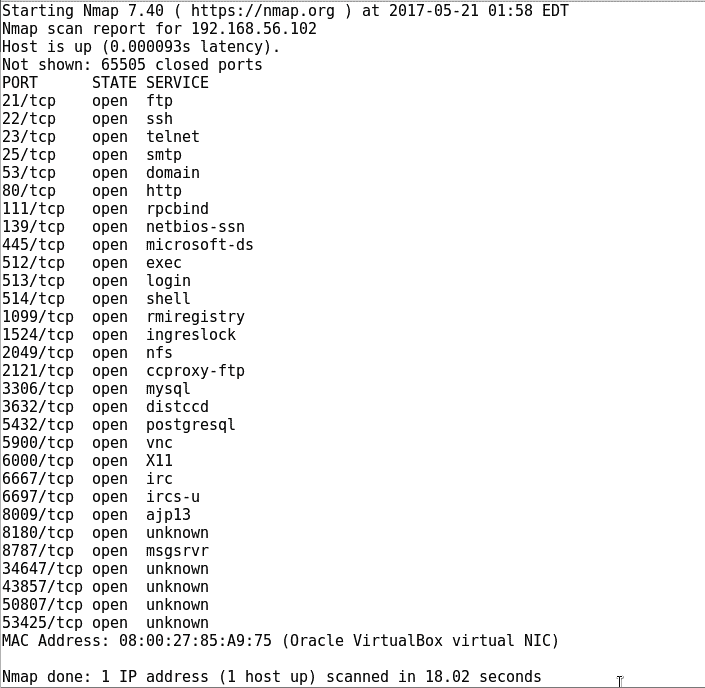
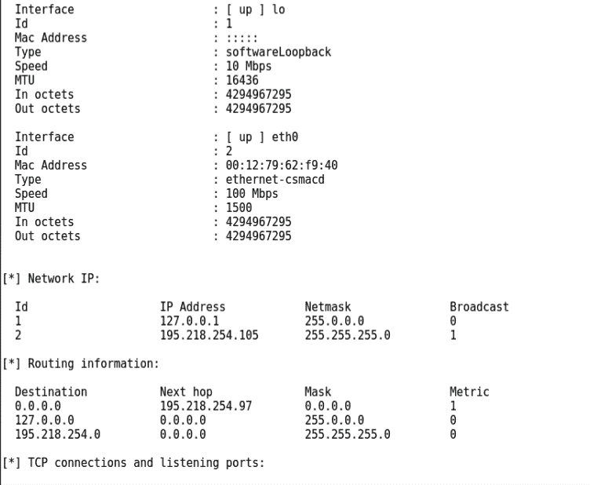

# 第二章：侦察与扫描

在本章中，我们将讨论以下主题：

+   使用 KeepNote 组织我们的数据

+   启动 Maltego CE

+   收集域名信息

+   收集公共 IP 信息

+   收集外部路由信息

+   收集内部路由信息

+   收集云服务信息

+   识别网络主机

+   主机信息分析

+   识别是否存在 Web 应用防火墙

+   使用 SNMP 收集更多信息

# 介绍

在本章中，你将学习如何收集有关目标环境的必要信息。我们将花时间尽可能识别更多的信息。我们收集的越多，潜在的渗透路径就越多，渗透尝试也会更成功。我们将收集域名、IP 子网、主机、路由信息以及其他有用的信息。你还将学习如何跟踪这些数据，以便我们在渗透测试的过程中参考这些信息。

# 使用 KeepNote 组织我们的数据

我们将探索应用程序 KeepNote，以及如何使用它捕捉我们在测试过程中发现的信息。

记录所有信息非常重要，因为这些信息将对后续章节以及为客户创建报告时非常有用。Kali 实际上提供了一些专用的工具来记录你的信息。不要重新发明轮子；如果你已经使用过像 Microsoft OneNote 或 EverNote 这样的记笔记工具，就继续使用它。但如果没有的话，Kali 提供了一款跨平台的记笔记应用 KeepNote，可以在没有特别偏好的情况下使用。但始终记住，作为一名渗透测试员，你收集的信息可能会对客户造成严重危害，因此在选择用于记录数据的工具时，请时刻考虑安全性和隐私问题。

# 准备工作

确保以下前提条件：

+   Kali Linux 正在运行，并且你已经以 root 用户登录

+   验证互联网连接

# 如何操作…

在这个教程中，我们将学习如何使用 KeepNote 来收集和整理我们收集的数据：

1.  点击应用程序。将鼠标滑动到 12 - 报告工具，并点击 KeepNote 图标：


1.  在 KeepNote 的主屏幕中，选择 文件 | 新建笔记本。我们将看到一个文件导航界面。选择`/root/Documents`并输入你的客户名称（例如我们使用 `customer_1`），然后点击 新建：

KeepNote - 新笔记本屏幕

1.  我们要收集的第一条信息是基本的公司详细信息。点击 文件 | 新建页面，命名为 `公司信息`，然后按 *Enter*：

KeepNote - 新建页面屏幕

1.  收集有关目标的所有可能信息。使用谷歌搜索，访问其网站，如果是公共公司，收集其财务和 SEC 文件信息：

KeepNote - 添加信息屏幕

1.  点击“文件”| “新建子页面”，并将其命名为`e-mail addresses`。添加任何您能找到的电子邮件地址：

KeepNote - 新建子页面

1.  要保存笔记本，请点击“文件”| “保存笔记本”。

1.  要退出，请点击“文件”| “退出”，但确保您始终先保存。

您永远不会停止记录信息。无论您找到多么细小的信息，都要记录并保持组织。您可以添加来自运行命令、图像和屏幕截图的输出信息。在进行几次操作后，您可能会发现可以开始使用基本信息模板。您可以创建一个通用模板，其中已经设置了页面和子页面。每当您开始新的工作时，只需复制它。您可以随时修改和调整这些模板，以捕获新的信息类别。

# 更多内容...

探索[KeepNote 应用](http://keepnote.org/)的网站，获取更多信息及其功能。

# 快速入门 Maltego CE

我们将继续使用**maltego community edition**（**Maltego CE**）来完成几个新的操作步骤。本章将带您完成 Maltego 的初始设置。Maltego 是一个用于数据挖掘和发现的工具。它将信息放入知识图谱中，您可以继续构建并从中进行数据透视，以帮助发现和收集信息。这些信息随后可以用来扩展我们的攻击面。

# 准备工作

让我们确保以下先决条件：

+   Kali Linux 正在运行，并且您已作为 root 用户登录

+   验证与互联网的网络连接

+   通过[`www.paterva.com/web7/community/community.php`](https://www.paterva.com/web7/community/community.php)注册 Maltego 社区版账户。

# 如何操作...

在本教程中，我们将注册并设置 Matego - Community Edition：

1.  启动 Maltego CE，方法是打开“应用程序”| 01 - 信息收集。点击 maltegoce：

Kali 应用程序菜单屏幕

1.  欢迎屏幕将显示。点击“下一步”以继续。

1.  现在您将被带到“从以下位置安装变换：”屏幕。确保 Maltego 公共服务器上有一个复选标记，并点击“下一步”。

1.  在“准备好了...开始吧！”屏幕上，选择“走开，我之前已经做过了！”，然后点击“完成”。

1.  点击屏幕左上角的 Maltego CE 图标，然后在底部选择“登录到社区服务器”：

Maltego 图标

1.  使用你在前面的*准备工作*部分创建的凭据登录，然后点击“下一步”：

Maltego 登录界面

1.  屏幕上会显示你在注册时使用的个人信息；点击“完成”。

Maltego 通过你的登录提供的 API 密钥有效期为三天。每三天，你需要重新登录以获取新的 API 密钥。

1.  现在我们完成了所有操作，应该会进入 Transform Hub。首先，让我们点击“刷新 Transform Hub”，以确保我们拥有最新的转换列表。

1.  一旦 Transform Hub 刷新完成，你可以开始安装列出的所有转换。

1.  你可以通过点击它并选择安装来轻松安装转换。

1.  安装好转换后，你可以点击它们查看是否有任何设置需要修改或希望修改。特别是，你可能需要根据需要为其他转换设置凭据，以便使用它们。

转换是一个操作，它会获取一些数据，并将其与预定义的一组特征进行分析，然后将这些信息添加到图表中。稍后，我们将回顾我们的一组转换所组合成的机器。在这里，我们可以通过将多个转换串联在一起执行连续的数据操作。请注意，Maltego 的社区版每次转换最多返回 12 条数据，这可能需要你多次运行某些转换，或者使用较少细节的信息，以便接收所有信息。

# 还有更多...

你可以在[`docs.paterva.com/en/user-guide/`](https://docs.paterva.com/en/user-guide/)上阅读更多关于 Maltego 的信息。Maltego 有许多其他的转换功能，你可以在线搜索。以下是一些可以帮助你入门的链接：

+   [`maltego.shodan.io/`](https://maltego.shodan.io/)

+   [`packetninjas.net/tools/socialnet.html`](http://packetninjas.net/tools/socialnet.html)

+   [`code.google.com/p/recordedfuture/downloads/detail?name=RF_Maltego_Package_1.0.tgz`](https://code.google.com/p/recordedfuture/downloads/detail?name=RF_Maltego_Package_1.0.tgz)

+   [`github.com/allfro/sploitego`](https://github.com/allfro/sploitego)

+   [`github.com/catalyst256/Watcher`](https://github.com/catalyst256/Watcher)

+   [`github.com/digital4rensics/Malformity`](https://github.com/digital4rensics/Malformity)

+   [`www.threatminer.org/maltego.php`](https://www.threatminer.org/maltego.php)

# 收集域名信息

在这个教程中，我们将使用 Maltego CE 来收集互联网域名信息。如果我们主要进行的是外部的互联网渗透测试，这些信息将为我们提供大量关于该网络公开部分的宝贵资料。此工具将从一个域名开始，并扩展到多个不同的公开域名信息。

# 准备工作

确保以下先决条件：

+   Kali Linux 正在运行，你以 root 身份登录

+   验证网络连接到互联网

+   Maltego 正在运行

# 如何操作...

在这个操作中，我们将使用 Maltego CE 收集目标域名的信息：

1.  在左上角，点击新的图表按钮：


1.  在左侧，选择实体调色板。向下滚动到基础设施，点击域名。将其拖到图表中。

1.  将`paterva.com`重命名为`example.com`；`example.com`就足够作为此次测试的目标域名：

Maltego - 新图表页面我们将使用`example.com`进行一些初步测试。`example.com`是一个保留的站点，专门用于文档说明。它背后有一些基础设施。由于基础设施非常简单，因此某些结果可能不完整。你可以使用`example.com`进行测试，或者使用你有权限访问的其他域名。

1.  右键点击`example.com`域名图标，这将展示各种转换选项。我们从获取 whois 信息开始。导航到 Threat Miner | [Threat Miner] 域名到 Whois 详细信息。这将访问并提取该域名的所有公开可用信息。如果此时你双击该域名图标，并从顶部选择属性（14）。然后，你将看到所有信息已被填充：

花一分钟时间熟悉转换界面的操作。右键点击`example.com`打开“运行转换”对话框。在左侧边缘，你可能会注意到一个返回箭头，可以将你带回到转换菜单。根据你所在的位置，你可能需要点击返回几次才能回到根转换屏幕；根据需要进入一些已填充的选项。

1.  继续构建图表并填充名称服务器。右键点击`example.com`，选择 Paterva CTS | DNS 从域名|到 DNS 名称 - NS（名称服务器）。现在你将看到我们的名称服务器被填充：

Maltego - 带有名称服务器的`example.com`图表

# 还有更多...

你可以利用 Maltego 收集大量其他信息。花些时间尝试收集更多关于域名的信息。测试一些不同的转换，即使某个转换无法收集特定类型的数据，另一个转换可能会成功收集到。另外，你还可以使用 Maltego 发现可能与公司相关的其他域名。也许他们有`example.com`和`example.org`，这些域名具有不同的映射，所以花时间探索并收集尽可能多的信息。

我们将继续使用 Maltego 进行更多示例，因此，请在此时保存你的图表，以便稍后返回，或者继续进行其他操作。

# 收集公共 IP 信息

我们现在将使用 Maltego 获取外部主机、IP 地址和一些网段信息。

# 准备工作

我们想从上一部分继续，因此，如果你在一段时间后再次打开这本书，请从收集域名信息配方中打开你保存的 Maltego 图。

# 如何操作...

在这个配方中，我们将使用 Maltego CE 来收集一个公司的公共 IP 信息：

1.  从图形界面开始，右键点击 `example.com` 域图标并选择 Paterva CTAS | DNS 从域名 | 到网站 [快速查找]。现在你会发现 `www.example.com`：

Maltego - 显示 www.example.com 的图形界面针对一个实际的域名，尝试以下转换以进一步传播主机列表。你可能想尝试的一些转换包括：Paterva CTAS | DNS 从域名 | 到 DNS 名称 [使用数据库] 和 Paterva CTAS | DNS 从域名 | 到 DNS 名称 [查找常见的 DNS 名称]。

1.  现在让我们将所有对象的主机名解析为对应的 IP 地址。首先，通过点击并拖动你想选择的多个对象来高亮显示它们。高亮显示这些项后，右键点击并选择 Paterva CTAS | 解析为 IP | 到 IP 地址 [DNS]：

Maltego - 显示 www.example.com 的图形界面

1.  既然我们已经得到了 `www.example.com` 的 IP 地址，现在让我们获取其网段信息。右键点击相关的 IP 地址，选择所有转换 | 到网段 [使用路由信息]：

Maltego - 显示 www.example.com 的图形界面我们将继续使用 Maltego 来进行后续示例，因此，可以在此时保存你的图，以便以后回来，或者继续进行其他操作。

# 收集外部路由信息

现在我们将使用 Maltego 获取外部路由信息。外部路由信息可以为我们提供有价值的信息，比如它们的互联网服务提供商是谁，以及它们的流量如何流动。

# 准备工作

我们想从上一部分的内容继续，因此，如果你在一段时间后再次打开这本书，请从*收集公共 IP 信息配方*中打开你保存的 Maltego 图。

# 如何操作...

我们将使用 Maltego CE 来收集 BGP 自治系统信息：

1.  通过右键点击 IP 网段，我们现在可以通过选择 Paterva CTAS** | ** 到 AS 编号 来获取分配给该网段的 BGP AS 编号：

Maltego - 显示 www.example.com 的图形界面

1.  接下来，我们想找到该 AS 编号的所有者。右键点击 AS 编号并选择所有转换 | 到公司 [所有者]。

我们将继续使用 Maltego 来进行后续示例，因此，可以在此时保存你的图，以便以后回来，或者继续进行其他操作。

# 收集内部路由信息

我们将使用 zenmap 来提供网络的图形化表示。Zenmap 是 nmap 的图形前端。Zenmap 在某些图形输出方面比 nmap 有一定的优势。我们将利用它来提供我们目标网络的可视化展示。通过了解内部网络的布局，我们可以利用这些信息将攻击扩展到本地子网之外。

# 准备工作

让我们确保以下前提条件：

+   Kali Linux 正在运行，你已以 root 用户登录

+   验证与互联网的网络连接

# 如何操作...

我们将使用 zenmap 将我们的网络绘制到一个预定的点：

1.  通过选择应用程序 | 信息收集 - zenmap 打开 zenmap。花一分钟时间查看界面。你可以看到一些预设的扫描配置，也可以创建自己的配置来执行重复的任务。你还会看到几个输出标签页。我们将稍微集中在拓扑部分：

Zenmap - 主界面

1.  首先使用 nmap 路由追踪扫描，使用 ICMP 来绘制我们需要对 `scanme.nmap.org` 进行扫描的路径。在目标屏幕中，输入 `scanme.nmap.org`，然后我们将使用以下选项：`-sn` 进行简单的 ping 扫描，`-PE` 指定 ICMP 协议，`-traceroute` 指示我们需要追踪到目的地的路由信息。完成后，点击拓扑查看网络的图形视图。这个信息可以帮助我们查看其他可能想要扫描的区域：

Zenmap - 外部拓扑扫描

1.  如果我们有对内部网络的访问权限，我们可以尝试使用 RFC1918 地址块对其进行扫描。为了加快速度，我们只扫描了 `192.168.0.0/16` 地址块。正如你所看到的，我们发现了其他值得探索的地址块：

Zenmap - 内部拓扑扫描 这将是一个相当吵闹的扫描，因此，在典型的渗透测试场景中，我们的扫描会更加战术性。我们将通过对一些我们已知的特定目标进行路由追踪：内部 DNS 服务器、域控制器等。我们将利用这些信息，使得扫描更加具体和狭窄。

1.  你可以点击保存图形，将拓扑保存为 PDF 或 PNG 文件，并插入到 KeepNote 中。你也可以通过选择扫描 | 保存扫描以便以后参考，或者继续扩展你对网络主机和主机发现的知识。

# 还有更多内容...

记住，zenmap 提供了所有 nmap 的功能和能力。尝试一些额外的扫描，包括路由追踪，并尝试使用它来构建你自己内部家庭网络或你被授权使用的网络的地图。

另外，获取更多信息，请查看[`nmap.org/book/zenmap.html`](https://nmap.org/book/zenmap.html)

# 收集云服务信息

接下来，我们想要发现目标是否在使用任何基于云的服务。 根据我们找到的 IP 地址，我们可以看到是否有多个不同的域和主机信息与单个 IP 地址相关联，这表明某种形式的云服务。

云服务有几种不同的形式和提供方式。 云服务最初以**软件即服务**（**SaaS**）的形式开始，例如 Office 365 和 Exchange 365，以及**平台即服务**（**PaaS**），例如 AWS 和 Azure。 今天，许多组织依赖于基于云的系统。 有时，这些系统作为数据中心基础设施的一部分进行控制、管理和监控。 在其他情况下，此类使用被视为影子 IT。 影子 IT 指的是在企业 IT 环境和控制之外启动的服务。 通常用于开发目的或实际绕过基于标准企业 IT 政策的限制或延迟。 这些环境可能充满信息; 事实上，一些最近的**个人身份信息**（**PII**）泄露事件是由于未加保护或安全糟糕的测试应用程序造成的，这些应用程序使用了数据库中的真实数据。

# 准备好

我们希望从上一节离开的地方继续，所以如果您一段时间后回到这本书，请打开您保存的 Maltego 图表，从“收集公共 IP 信息”食谱继续。

# 如何做……

现在我们将使用 Maltego CE 获取有关网络块和主机的信息：

1.  右键单击网块可以获得有关它的更多信息，并选择所有转换|到实体（NER）：

Maltego - 图形屏幕，参考 www.example.com

1.  分析信息，看看是否有迹象表明它是云服务提供商；在这种情况下没有机会，但让我们试试其他东西。

1.  以下是另一个域的输出。 在这种情况下，我们看到这个网站（未透露）是由 Weebly 托管的，这是一个流行的 Web 托管公司：

Maltego - 图形屏幕，参考 weeblyRun 函数，针对我们过去处理过的各种域信息中能找到的所有 IP 地址，看看它们是否与已知服务提供商有关。

# 标识网络主机

我们可以使用各种方法来扫描内部或外部网络上的主机。 我们将详细探讨其中一些方法。 我们将在本节中的几个示例中使用 nmap。 TCP 端口扫描在 nmap 中是默认的，因为我们大多数知名服务器使用 TCP 运行。 但从渗透的角度来看，有一些非常有用的 UDP 端口可能是开放的，这些端口可能会为我们提供攻击向量，例如 SNMP。

# 准备好

让我们确保以下先决条件：

+   Kali Linux 正在运行，您以 root 身份登录

+   启动其他测试机器（Metasploitable 和 Windows）

+   验证你计划扫描的网络的网络连接性

# 如何操作...

我们将使用 nmap 和各种命令行选项执行多种不同的扫描：

1.  通过点击终端图标打开终端屏幕：


1.  从主终端屏幕，你应该处于`root@kali:~#`的命令提示符下。

1.  输入`nmap`并按下*回车*。屏幕上应该会显示一个选项列表；简要查看一下选项列表。

# 一个简单的子网扫描

我们将执行一个子网的简单扫描：

对你的实验室网络`192.168.56.0/24`进行简单的子网扫描。请根据在安装 Kali 的 VirtualBox 部分中为你的实验室网络创建的子网进行替换：

```
nmap 192.168.56.0/24 
```

此命令将扫描特定子网范围内所有目标的 1000 个常用端口。查看输出。在我们的 Metasploitable 机器（`192.168.56.102`）中，我们将看到以下输出。从这个输出中，我们可以识别出 IP 地址以及开放端口的数量：



# 扫描主机的所有 TCP 端口

要执行 Metasploitable 机器`192.168.56.102`的完整 TCP 扫描，我们需要添加命令行选项`-p-`。请替换为你 Metasploitable 虚拟机的 IP 地址：

```
nmap -p- 192.168.56.102
```

此命令将扫描目标设备的所有 TCP 端口。以下是我们扫描的输出。你会注意到我们发现了一些新的开放端口：



# 执行 TCP SYN 扫描

TCP SYN 扫描，也称为半开放扫描，由于其特定的扫描方式非常有用；它们通常不会被目标设备记录。这使得你能够在不留下扫描痕迹的情况下扫描主机：

```
nmap -sS -p- 192.168.56.102 
```

扫描主机后，你会注意到我们发现了相同的开放端口。

# 执行 UDP 端口扫描

对目标执行 UDP 扫描为我们提供了额外的攻击向量。我们还将添加一些额外的命令行选项。我们还添加了`-r`选项用于随机化，这有助于避免被 IDS 和 IPS 等安全设备检测到，另外还有`-v`选项用于详细输出，让我们在等待时能更快看到操作进度。这个扫描将需要几分钟，因此在等待时知道它在做什么是非常有用的：

```
nmap -sU -r -v 192.168.56.102 
```

从输出中可以看到，我们确实发现了几个可以稍后探索的 UDP 端口：


# nmap 输出格式

有几种类型的输出格式可供使用，可以用于简单地记录数据、以 XML 格式记录以便可能输入到另一个程序中，或者输出以供 grep 使用：

| `nmap -oN filename.txt` | `N`是标准的默认文本输出格式 |
| --- | --- |
| `nmap -oG filename.txt` | `G`是一个格式，便于你对文件进行 grep 操作 |
| `nmap -oX filename.xml` | `X`表示 XML 格式 |

让我们进行一次简单的扫描，并将结果输出到文件以便使用 grep：

```
nmap -p- -oG 192_168_56_102.txt 192.168.56.102
```

你将在屏幕上看到输出，并且它也会输出到你主目录下的一个 TXT 文件中，你可以将其作为 grep 的目标：


# 主机分析

我们将继续使用 nmap 的一些高级功能，以提供关于特定主机的更多信息。

# 准备工作

让我们确保满足以下前提条件：

+   Kali Linux 正在运行，并且你已以 root 身份登录

+   启动其他测试机器（Metasploitable 和 Windows）

+   验证计划扫描的网络的网络连接

+   网络连接

# 如何操作…

我们现在将针对特定主机进行更有针对性的 nmap 扫描，以获取关于开放端口和协议的进一步信息：

1.  点击左上角的终端图标，打开终端屏幕：


1.  从主终端屏幕来看，你应该处于 `root@kali:~#` 的命令提示符下。

# 操作系统和服务检测

以下命令将对我们的 Metasploitable 主机进行操作系统和服务发现：

```
nmap -A 192.168.56.102
```

你会注意到输出中提供了相当多的信息。从底部开始，你会看到它正确识别了机器以及其他有用的信息：


当我们滚动查看输出时，我们可以看到关于运行服务的相当多的信息。它提供了有关端口上运行的特定服务、版本信息以及其他相关信息。以下是 VNC 端口的一个示例：


# 激进的服务检测

为了对主机进行激进的服务扫描，我们将使用以下命令：

```
nmap -sV --version-intensity 5 192.168.56.102
```

你将看到我们得到了一个整合的输出，包含开放端口、服务和版本信息：


# 还有更多…

如果你有兴趣了解更多关于 nmap 的内容，请查看 [`nmap.org/nmap_doc.html`](https://nmap.org/nmap_doc.html)。此外，对于那些更喜欢使用 nmap 图形界面的用户，还有 zenmap。为什么不打开它并尝试做几个扫描呢？最后，如果你想尝试在互联网上测试 nmap 或 zenmap 的目标，可以尝试 [scanme.nmap.org](http://scanme.nmap.org/)。该网站提供了一个训练工具，你可以在上面进行扫描，只要你不对测试过于激进。

# 确定是否存在 Web 应用防火墙

我们将使用 `wafw00f` 来确定我们与目标网站之间是否存在 Web 应用防火墙。

许多组织会使用**Web 应用防火墙**（**WAF**）来保护网站免受特定的 Web 攻击。理解安全设备位于你和目标之间非常重要。你需要进行混淆并避免被检测到。你必须更加有针对性，并使用特殊技术来渗透网站，即使 WAF 已存在。

# 准备工作

让我们确保以下前提条件：

+   Kali Linux 正在运行，你以 root 身份登录

+   验证互联网连接

# 如何操作...

在这个示例中，我们将使用`wafwoof`查看路径中是否存在 Web 应用防火墙：

1.  点击左上角的终端图标，打开终端屏幕：


1.  从主终端屏幕，你应该看到`root@kali:~#`的命令提示符。

1.  让我们检查一个没有 WAF 的网站：

```
 wafw00f scanme.nmap.org 
```

1.  `wafw00f`将提供结果，显示没有检测到 WAF 保护[scanme.nmap.org](http://scanme.nmap.org/)：

wafwoof 输出 - 没有 WAF

1.  现在，我们可以使用以下命令检查一个带 WAF 的网站：

```
 wafw00f www.example.com
```

1.  在这里，我们将看到一个 WAF 保护网站的迹象：

wafw00f - www.example.com

1.  现在，我们将使用以下命令检查另一个受到 WAF 保护的网站：

```
 wafw00f example.uk 
```

1.  我们注意到触发了不同的指示：

wafw00f - example.uk

# 使用 SNMP 收集更多信息

我们可以使用通过 nmap 识别的具有开放 SNMP 端口或正在运行的服务的主机，尝试收集更多信息。

**简单网络管理协议**（**SNMP**）是一种用于提供各种设备状态和配置的协议，包括服务器、工作站、网络设备、物联网设备和其他主机。该协议提供了只读和读写功能。很多设备默认情况下只提供只读访问。网络管理员通常会为管理目的启用读写访问权限。许多设备的 SNMP 默认密码是 public（只读访问）和 private（读写访问）。SNMP 有三种版本。虽然版本 1 已大多被淘汰，但版本 2 仍然非常常见，版本 3 由于其更好的安全性和身份验证系统，正在逐渐被广泛使用。我们将在本次测试中重点使用版本 2。

# 准备工作

让我们确保以下前提条件：

+   Kali Linux 正在运行，你以 root 身份登录

+   验证互联网连接

+   解析`demo.snmplabs.com`的 IP 地址（在写这本书时，它是`104.236.166.95`）

# 如何操作...

1.  点击左上角的终端图标，打开终端屏幕：


1.  从主终端屏幕，你应该看到`root@kali:~#`的命令提示符。

1.  使用 `snmp-check` 执行对目标设备的简单扫描。默认情况下，许多 SNMP 实现使用 public 和 private 作为默认的 SNMP 密码。如果我们知道密码或者可以猜测出来，我们可以将其替换为以下命令中的默认 `public`：

```
snmp-check -v2c -c public 104.236.166.95
```

1.  从输出中我们可以看到，关于主机显示了大量信息。有网络接口信息、路由信息、正在运行的服务和开放的 TCP/UDP 端口，以及各种系统信息：

snmp-check - 命令输出

1.  如果我们不知道用于 SNMP 的凭证，可以尝试使用字典攻击来猜测凭证，利用 `onesixtyone` 工具：

```
 onesixtyone -c /usr/share/doc/onesixtyone/dict.txt 104.236.166.95
```

1.  你会注意到，命令输出显示主机的公共和私有部分都可以使用。我们使用了内置的字典文件，这个文件是 `onesixtyone` 提供的。需要注意的是，这个字典文件中只有少数几种潜在的密码：

onesixtyone - 命令输出

# 还有更多……

有多种字典文件提供了更完整的密码列表，这些列表能提高你发现目标主机适当密码的机会。查看 [`github.com/danielmiessler/SecLists/tree/master/Miscellaneous`](https://github.com/danielmiessler/SecLists/tree/master/Miscellaneous)。
