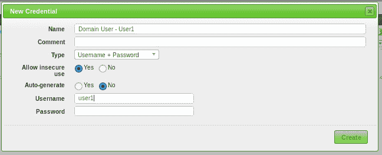
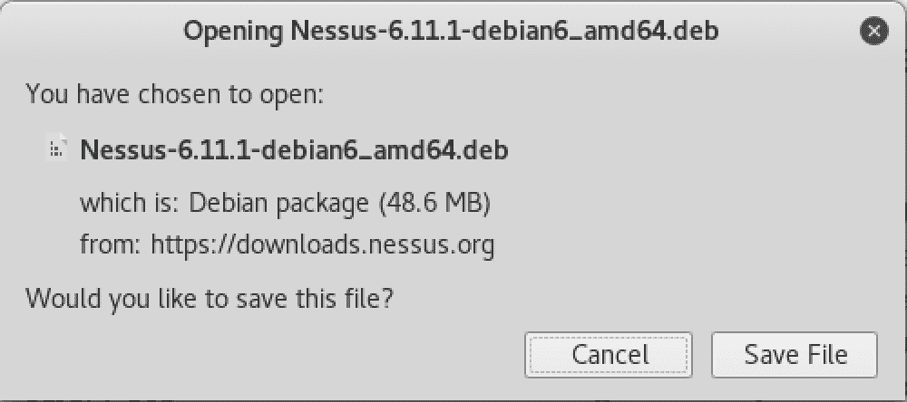
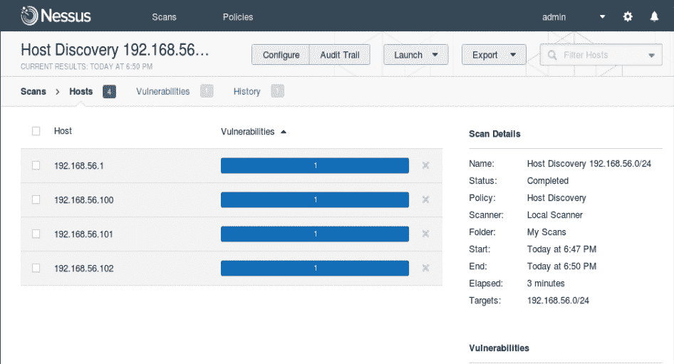
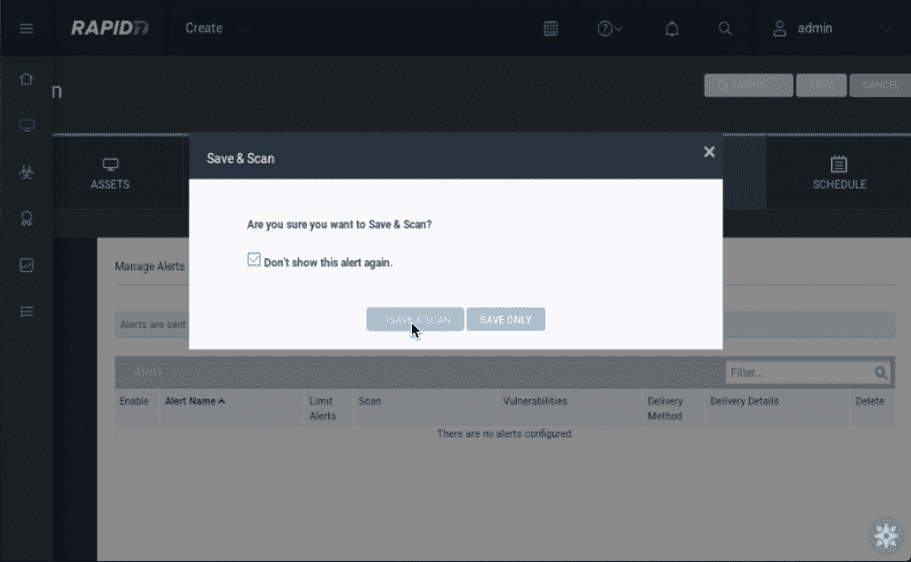
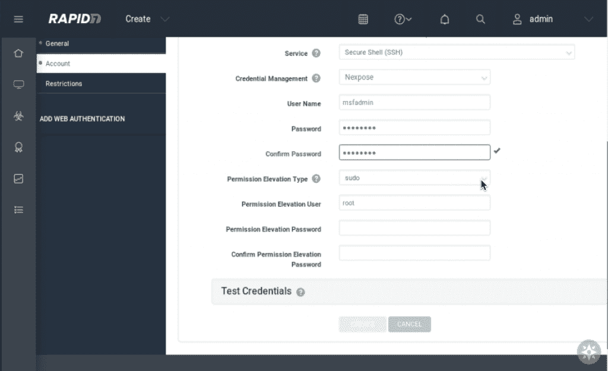

# 第三章：漏洞分析

本章将涵盖以下主题：

+   OpenVAS 的安装与配置

+   使用 OpenVAS 进行基础漏洞扫描

+   使用 OpenVAS 进行高级漏洞扫描

+   Nessus 的安装与配置

+   使用 Nessus 进行基础漏洞扫描

+   使用 Nessus 进行高级漏洞扫描

+   Nexpose 的安装与配置

+   使用 Nexpose 进行基础漏洞扫描

+   使用 Nexpose 进行高级漏洞扫描

# 介绍

一旦访问网络并识别出网络中的系统，下一步是建立立足点和持久性访问。有多个工具可用于帮助识别和利用系统漏洞，但我们将在本章中仅聚焦于其中三个：

+   OpenVAS ([`www.openvas.org`](http://www.openvas.org))

+   Nessus ([`www.tenable.com/products/nessus-vulnerability-scanner`](https://www.tenable.com/products/nessus-vulnerability-scanner))

+   Nexpose ([`www.rapid7.com/info/nexpose-community/`](https://www.rapid7.com/info/nexpose-community/))

# OpenVAS 的安装与配置

由于默认的 Kali Linux 镜像在初始安装时并不包含 OpenVAS，我们需要进行一次完整的新安装。这可以通过控制台或远程连接进行。

OpenVAS 是一个开源漏洞管理平台，它是基于知名的 Nessus 平台开发的分支，Nessus 在 Tenable Network Security 将其转为闭源之后（最初名为 GNessUs）。随着时间的推移，OpenVAS 框架成为了 Greenbone 网络的商业漏洞管理解决方案的一部分。Greenbone 继续为 OpenVAS 做出贡献，确保其始终保持最新且相关。

考虑到 OpenVAS 可以通过网页浏览器以及命令行访问，它是一个非常强大的工具，可以通过命令行或浏览器在本地使用，或者可以部署在中心位置并供网络中的其他设备使用。

# 准备工作

为了能够完成本节内容，您将需要以下内容：

+   控制台访问 Kali Linux 系统

+   访问互联网以下载和安装 OpenVAS 应用程序

# 如何操作...

我们将执行必要的步骤在 Kali 上安装 OpenVAS：

1.  如果您尚未完全更新 Kali Linux 安装，建议现在进行更新。从 root shell 运行以下命令。如果有很多更新，这可能需要一些时间，请耐心等待。更新过程完成后，重启系统，登录，并再次打开 root shell：

```
apt-get update && apt-get dist-upgrade -y
```

1.  从 root shell 使用 `apt-get` 下载并安装 OpenVAS：

```
apt-get install openvas
```

1.  一旦安装完成，运行以下命令从根 shell 启动设置过程。由于需要的数据量较大，即使是在快速连接的情况下，这个过程也可能需要一些时间，所以请准备好耐心等待：

```
openvas-setup
```

1.  在这个过程的最后，你将看到管理员密码显示出来。把它写下来，以便你能够登录到 OpenVAS 门户。

如果你忘记了这个密码，可以通过命令行使用以下命令重置：

**`openvasmd --user=admin --new-password=[your password here]`**

# 使用 OpenVAS 进行基本的漏洞扫描。

一旦安装完成，OpenVAS 提供了一个集中的平台，可以通过任何基于浏览器的系统或命令行进行使用。由于 OpenVAS 是一个安全分析工具，它将会检查该环境中的系统，识别服务和漏洞，因此请确保你已经准备好应对潜在的影响。即便是最小心、影响最小的扫描也可能会影响到服务。

# 准备工作。

为了完成这一部分，你需要完成以下步骤：

+   OpenVAS 已成功安装并配置在你的 Kali Linux 系统上。

+   访问 Kali 系统，无论是从桌面还是浏览器。

+   网络访问到在前面部分的实验室讨论中配置的系统。

+   你需要确认你的实验室网络的 IP 地址，并能够对其上的主机进行 ping 测试。

# 如何操作...

我们将使用 OpenVAS 进行一次基本的漏洞扫描：

1.  通过打开浏览器并导航到 `https://[your Kali IP]:9392`，连接到 Kali Linux 系统上的 OpenVAS 服务；接受证书安全警告，并为无效证书创建例外。

1.  为了准备一个更永久的实现，创建一个唯一属于你的新用户。从仪表板中，导航到 Administration | Users。你将看到已配置用户的列表（在这种情况下，由于这是默认安装，应该只有 Admin）。在管理员用户的 Actions 下，点击 Clone。

1.  克隆后，你将被带到新账户概览页面。点击左上角的编辑用户选项，编辑此用户的详细信息。你可以设置用户名以及权限。为新用户设置一个合适的名字，并将密码重置为你以后练习时能记住的内容。

在较大的环境中，如果有 LDAP 可用，你还可以将 OpenVAS 连接到这些仓库，以利用集中的账户管理。要启用此功能，请导航至 Administration | LDAP 并配置连接信息，以便连接到这些仓库。

1.  连接到 OpenVAS 系统后，点击顶部菜单栏中的 Scans | Tasks 链接。页面加载后，你应该会立即看到初始扫描向导。这个向导将帮助你启动第一次扫描，我们将针对我们的第一个 Windows 7 主机进行扫描。

1.  在任务向导窗口打开后，输入实验室网络的 IP 地址。在这个例子中，添加 `192.168.56.0/24` 到文本框中，并点击开始扫描来启动扫描：

任务向导启动扫描

1.  扫描启动后，您将看到任务列表，其中之一就是我们刚刚创建的扫描任务：

正在运行的任务列表

1.  在扫描运行时，您应该熟悉可用的操作图标，因为它们可以用来存档任务配置以便移动到其他系统、克隆以创建副本等。

1.  一旦扫描完成，您应该看到仪表盘视图发生变化，类似如下所示：

初始扫描后的任务仪表盘

1.  单击扫描日期查看扫描结果：

扫描结果报告

1.  初步报告中有一些需要注意的重要事项。首先，您会看到 OpenVAS 只显示了已识别的 15 个漏洞中的 3 个。虽然这看起来不太寻常，但理解 OpenVAS 如何通过默认过滤器显示结果是必要的。名为**检测质量**（**QoD**）的字段表示该特定扫描结果的可信度。为了演示这一点，单击具有最高 QoD 的漏洞：

漏洞详细信息

1.  如您所见，此检查的 QoD（检测质量）为 95%，这意味着确定主机暴露于该漏洞的能力相当高。在查看检查的详细信息时，您还可以看到这是一个潜在的严重漏洞——该漏洞需要供应商提供的修复补丁，受影响的平台分布非常广泛，成功利用该漏洞会导致**远程代码执行**（**RCE**）。这些因素的结合使得该漏洞的严重性被计算为 9.3（满分 10，属于高危）。

这种特定的漏洞被 WannaCry 勒索病毒攻击利用，该攻击发生在 2017 年 5 月。其他值得关注的领域包括漏洞是如何被发现的，以及获取更多详细信息所需的信息，包括特定供应商的补丁信息以及 CVE/BID/CERT 信息。

1.  使用此报告中的信息将有助于确定系统面临已知漏洞和不安全配置的风险水平。如果您想要更多详细信息，例如识别的漏洞低于默认的 70% QoD，您可以自定义报告屏幕上方的过滤器：

自定义过滤视图

1.  在操作栏的最右侧，你可以看到一些非常有用的选项。添加备注允许你在报告中添加附加说明，以提供背景信息、记录其他或相关发现等。添加覆盖选项允许你覆盖某个特定发现，并提供在哪些主机、覆盖的持续时间以及新的严重性等字段（覆盖常用于指定假阳性严重性）：

每个报告包含已记录的漏洞，这些漏洞可以与其他工具（如 Metasploit）结合使用，从而成功访问目标系统。这些信息必须小心处理。确保 OpenVAS 的安装是安全的，且服务在未使用时不会继续运行。

# 使用 OpenVAS 进行高级漏洞扫描

通过未授权的网络扫描进行漏洞识别是开始收集网络情报的好方法，但其强大之处在于能够进行更频繁、更多目标的扫描，这可能包括能够成功认证目标系统的凭证，以便进行更深入的评估。

使 OpenVAS 更强大的功能包括高度可配置的扫描配置、计划任务、自动报告和警报。

除了 OpenVAS 仪表板中默认的扫描配置外，它还包含一些非常灵活的选项，包括计划扫描和自定义扫描类型。我们将查看自定义扫描配置。

# 准备开始

为了完成这一部分，你需要以下内容：

+   OpenVAS 在你的 Kali Linux 系统上已成功安装并配置

+   通过桌面或浏览器访问 Kali 系统

+   对在早期章节中作为实验讨论一部分配置的系统的网络访问权限。

+   你需要确认桌面`target1.kalicookbook.local`的 IP 地址

+   从 Kali Linux 系统成功 ping 通`target1.kalicookbook.local`

# 如何操作...

让我们开始使用 OpenVAS 进行高级扫描技巧：

1.  为了准备配置更深入的扫描，我们将首先添加我们可能已知的凭证。当凭证已知时，我们将能够进行更深层次的评估。导航到配置 | 凭证。在左上方，点击“新凭证”图标以弹出新凭证对话框。按照以下方式配置，使用你实验域中的域用户：

新凭证对话框当发现新帐户时，应将其添加到此部分，不仅用于身份验证，还用于识别所有使用该帐户的地方——密码重用非常常见。

1.  下一部分我们将配置的是目标选择。导航至配置 | 目标。在此页面上，您将看到一些现有的目标集，包括在快速入门向导中使用的自动生成的目标集。点击新建目标图标以创建新的目标。使用以下配置：

配置新目标

1.  现在目标环境和已知凭据已配置完成，我们将查看实际的扫描配置。导航至配置 | 扫描配置。以下扫描是全新安装的典型配置：

扫描配置列表

1.  你会注意到，扫描可能具有相同数量的 NVTs，但停止服务的可能性高低不同。此外，扫描还可以引用并利用先前运行的数据。为了更好地理解，找到完整扫描和快速扫描的配置，并点击操作栏下的克隆按钮。当新配置显示出来时，点击编辑图标，并为扫描命名一个更有意义的名称。审查设置，以更好地理解扫描的配置方式：

扫描配置快速扫描和完整扫描是我们在上一节中使用的扫描配置。尽管扫描运行速度很快，但它包含了大量的 NVTs，展示了 OpenVAS 的速度。

1.  现在我们将把这三个组件——目标、凭据和扫描配置结合起来，创建一个任务。导航至扫描 | 任务，然后点击新建任务图标。打开后，输入以下信息：

+   +   名称：漏洞扫描

    +   扫描目标：内部网络

    +   点击计划行末的星标，创建新的计划

    +   扫描配置：Kali 烹饪手册

    +   保持所有其他选项为默认设置，然后点击保存


1.  从此时起，将每周进行一次深度漏洞扫描，并生成报告以供审阅。可以根据需要配置多个定期扫描，并在完成后发送电子邮件通知。

# Nessus 的安装和配置

Nessus 是业界最广泛使用的渗透测试平台之一。直到最近的版本，它一直是 Kali 的预安装工具。它是由 Tenable 公司作为商业产品出售的，但我们将使用家庭版，这将允许我们在有限数量的 IP 上进行扫描，并获得充分使用该工具的知识。

# 准备工作

让我们确保以下前提条件：

+   Kali Linux 正在运行，且你已以 root 身份登录

+   验证互联网连接

+   确保你最近已完成 Kali 的更新和升级

# 如何操作...

我们将进行 Nessus 的设置和初始配置：

1.  我们首先需要通过访问以下网站进行注册 [`www.tenable.com/products/nessus-home`](https://www.tenable.com/products/nessus-home) 并注册获取激活码：

Tenable 注册网站

1.  注册完成后，你将看到一个下载链接——点击它：

Tenable nessus 下载界面

1.  选择适合你 Kali 发行版的 Linux 下载版本，在我们这个例子中，我们将下载 64 位版本：

Tenable Nessus 操作系统选择界面

1.  在订阅协议页面，勾选接受服务条款框并点击下载。然后点击保存文件：

Nessus 文件下载界面

1.  打开终端窗口并输入以下命令：

```
cd ~/Downloads <enter>
dpkg -i Nessus-6.11.1-debian6_amd64.deb <enter>
service nessusd start <enter>
```

1.  点击 Firefox 图标启动你的浏览器： 

1.  打开以下页面： `https://localhost:8834`。你会看到一个提示连接不安全的界面。点击高级，选择添加例外，然后点击确认安全例外：

Firefox - 证书警告界面

1.  在欢迎使用 Nessus 界面上，点击继续。

1.  系统会要求你创建一个本地帐户。为了方便起见，我们将使用管理员用户名，选择并设置一个好的密码，然后点击继续：

Nessus - 帐户设置界面

1.  检查你的电子邮件并输入激活码，然后点击继续：

Nessus - 注册界面

1.  你将看到一个 Nessus 欢迎界面，它将开始下载并初始化其他设置功能。

该过程需要几分钟时间，请耐心等待。等待初始化过程完成时，你可以先为 Nessus 创建一个书签。

1.  现在你将被带到主登录界面；输入之前创建的用户名和密码，然后点击登录。

1.  让我们验证 Nessus 是否是最新版本——在主屏幕上，点击齿轮图标并选择它。

1.  从扫描器菜单中选择软件更新，然后点击手动软件更新。

1.  在手动软件更新界面，选择更新所有组件并点击继续：

Nessus - 手动软件更新界面。请等待几分钟，因为更新完成后，界面可能会重启，并且你可能会回到登录界面。

1.  确保启用了自动更新，指定更新频率，然后点击保存：

Nessus - 自动更新屏幕为了节省资源，在不使用 Nessus 时，你可以通过关闭浏览器并选择“应用程序 | 漏洞分析 | Nessus 停止”来停止服务。

# 使用 Nessus 进行基本漏洞扫描

我们将对我们的网络进行一些基本的漏洞扫描，以查看它们是否有任何已知问题或弱点。

# 准备就绪

让我们确保以下前提条件：

+   Kali Linux 正在运行，并且你已以 root 身份登录

+   启动 Metasploitable 虚拟机

+   确保你已完成 Nessus 的设置，Nessus 已经启动，并且你在登录后的主屏幕上。

# 如何操作...

现在，我们将使用 Nessus 进行漏洞扫描：

1.  虽然我们已经有了之前练习中的目标，但我们将先执行一次基本的主机发现。选择“新建扫描”：


1.  从扫描模板屏幕中，选择“主机发现”。

1.  在“名称”字段中，添加一个描述性的名称并指定你的目标。在此案例中，我们将指定我们的测试网络`192.168.56.0/24`，并选择“保存”：

Nessus - 主机发现屏幕

1.  从“我的扫描”屏幕中，选择新创建的扫描任务，并按右侧的启动按钮。扫描过程将持续几分钟。在运行过程中，你将看到一个绿色的圆形图标。

在此扫描运行期间，你可以创建其他扫描并启动它们。所以，你不必等扫描完成后再进行其他操作。

1.  扫描完成后，你将在扫描屏幕上看到一个对勾，点击它以查看结果。从我们的结果来看，你将看到有多个主机正在响应：

Nessus - 主机发现结果

1.  为了对我们的 Metasploitable 虚拟机`192.168.56.101`进行基本扫描，我们将从顶部菜单中选择“扫描” -> “新建扫描”，然后选择“基本网络扫描”。

1.  在“名称”字段中，添加一个描述性的名称；对于目标，使用你的 Metasploitable 机器的 IP 地址。点击“保存”，然后启动扫描：

Nessus - 基本网络扫描

1.  这个扫描将需要几分钟时间完成，但完成后，我们可以选择扫描结果进行查看。你会注意到我们已经发现了几个漏洞：

Nessus - 基本网络扫描结果

1.  若要更详细查看，选择顶部的“漏洞”选项。此处，你将看到按严重性排序的漏洞的详细视图。滚动浏览列表，查看所有呈现的数据：

Nessus - 基本扫描结果 - 漏洞列表

1.  点击 VNC 服务器漏洞，获取更多关于该漏洞的具体信息。这将为我们提供大量可以稍后用来获取远程访问主机的资料：

Nessus - VNC 漏洞详情花些时间浏览几个漏洞，探索提供的信息。此外，尝试对其他有授权的设备进行扫描。这些设备可以是你个人网络中的设备，也可以是你安装的其他测试主机。

# 使用 Nessus 进行高级漏洞扫描

现在，我们将创建一个更深入的扫描，修改一些扫描参数，以便使用 Nessus 进行其他更具针对性的测试。我们希望看到的是目标主机更好且更完整的扫描结果。这将为你提供基础理解，帮助你自定义扫描。

# 准备开始

确保以下先决条件：

+   Kali Linux 正在运行，并且你已经以 root 身份登录

+   启动 Metasploitable 虚拟机

+   确保你已完成 Nessus 的设置，Nessus 已经启动，并且你在登录后已进入主屏幕。

# 如何操作...

让我们开始使用 Nessus 的高级扫描技术：

1.  为了使用 Nessus 进行更高级的扫描，我们将探索几个可用的选项。选择顶部的扫描。选择新建扫描 | 高级扫描。在我们的通用屏幕上，添加描述性名称，并将目标设为你的 Metasploitable 虚拟机的 IP 地址。

1.  花一分钟浏览左侧的基本选项。我们可以执行定期扫描。扫描完成后，我们还可以提供通知。

1.  选择发现 | 主机发现；浏览可用的选项。你会注意到我们可以开启多种发现方法，包括扫描网络打印机。

由于我们已经知道要扫描的具体主机，因此无需在主机发现下选择其他选项。不过，如果你进行子网扫描，这些选项将非常有用。

1.  选择发现 | 端口扫描，并根据以下截图修改以下选项：

Nessus - 高级设置

1.  选择评估 | 一般。勾选执行彻底测试。

1.  选择评估 | 暴力破解。勾选 Oracle 数据库测试和 Hydra。

你可以添加登录和密码文件，针对可能的或常见的用户名和密码进行扫描。

1.  选择评估 | Web 应用程序。勾选跟随动态生成的页面。

1.  在应用程序测试设置下，匹配以下选项：

Nessus - 高级设置

1.  在底部选择保存并启动扫描。此扫描将需要很长时间才能完成（大约 2 小时）。然而，一旦完成，让我们查看以下结果。我们会看到我们已经发现了关于目标主机的增量信息和漏洞：

Nessus - 扫描结果界面

1.  点击结果，你将看到我们显著增加了高级漏洞的数量。这些信息在后续利用目标时非常有用。

记得保存并记录所有信息，以便在后续操作中使用。

# Nexpose 的安装和配置

Nexpose 是 Rapid7 的一款商业产品。最近，似乎它被重命名为 InsightVM；并且曾尝试取消 Nexpose 的社区版。然而，Rapid7 已重新考虑并再次提供社区版，许可证有效期为一年。

我们将在此安装 Nexpose 的社区版。

# 准备就绪

让我们确保满足以下前提条件：

+   首先对你的虚拟机进行快照

+   Kali Linux 正在运行，你已以 root 用户登录

+   断开主机专用网络，仅使用 NAT 网络

Nexpose 的安装和操作可能会让人困惑，因为有多个界面和多个连接。对于这一点，以及所有涉及 Nexpose 的配方，我们将在 NAT 网络上进行操作。在完成涉及 Nexpose 的所有步骤后，你可能想恢复到安装前的快照。

# 如何操作...

现在我们将在 Kali 机器上安装并配置 Nexpose：

1.  首先，我们必须在 Rapid7 网站上注册，获取许可证密钥并下载代码。点击图标打开 Firefox。

1.  访问以下网站，[`www.rapid7.com/info/nexpose-community/`](https://www.rapid7.com/info/nexpose-community/)，并填写注册信息。几分钟后，你将收到一封包含许可证密钥的邮件，同时可以下载相应的软件。将文件保存在 `Downloads` 目录中：

Nexpose 注册网站

1.  现在，让我们通过打开终端窗口并输入以下命令来准备安装 Nexpose：

```
cd <enter>
cd Downloads <enter>
chmod 770 Rapid7Setup-Linux64.bin <enter>
./Rapid7Setup-linux64.bin <enter>
```

1.  一旦出现欢迎界面，点击“Next”：

Nexpose 安装界面

1.  选择标记为“Security Console with local Scan Engine”的单选按钮。接受默认的目标目录设置，然后点击“Next”。如果出现与磁盘空间不足相关的错误，只需点击“Continue”。

1.  在系统设置界面，点击“Next”：

Nexpose 安装界面 - 设置比较

1.  在账户详情页面输入你的信息，然后点击“Next”：

Nexpose 安装界面 - 用户信息

1.  在下一个屏幕上，选择 **Initialize and start after installation**（安装后初始化并启动），然后点击 **Next**（下一步）。它将进行安装过程，完成后，您将看到以下屏幕：

Nexpose 安装程序屏幕 - 完成

1.  点击 **Finish**（完成）以关闭它。

正如所述，初始化和启动可能需要几分钟。我的建议是让它静置 30 分钟，然后重启虚拟机。虚拟机重新启动后，登录并等几分钟再尝试访问网站。

1.  通过点击图标打开 Firefox，，然后在地址栏中输入以下地址：`https://localhost:3780`。如果弹出安全屏幕，请点击 **Advanced**（高级），然后选择 **Add Exception**（添加例外）：

Firefox 安全屏幕

1.  点击 **Confirm Security Exception**（确认安全例外）：

Firefox 安全例外屏幕

1.  一旦 Nexpose 安装完成，您将进入登录屏幕。使用您提供的凭据登录：

Nexpose 登录屏幕

1.  几乎立刻，您将看到要求您输入产品密钥的屏幕。请找回包含该密钥的电子邮件。输入密钥并点击 **ACTIVATE WITH KEY**（使用密钥激活）：

Nexpose 输入产品密钥屏幕

1.  一旦激活成功，您将收到一个确认屏幕：

Nexpose 激活成功屏幕

1.  现在，让我们点击 **intro screen**（介绍屏幕），然后选择 **Dismiss**（忽略）：

欢迎来到 Nexpose 屏幕

1.  更新将在启动后自动安装。

我们建议直接进入下一个食谱，*使用 Nexpose 进行基本漏洞扫描*。

# 使用 Nexpose 进行基本漏洞扫描

现在我们将使用 Nexpose 扫描我们的 NAT 网络，以获取关于易受攻击的设备和服务的信息。Nexpose 的社区版限制最多支持 32 个 IP 地址，但其他功能完全可用。

# 正在准备中

让我们确保以下先决条件：

+   Kali Linux 正在运行，您已以 root 用户登录

+   断开主机专用网络，并在所有虚拟机上使用 NAT 网络

+   启动 Metasploitable 和您的 Windows XP 机器，并连接到 NAT 网络

Nexpose 的安装和操作可能会因多个界面和多个连接而令人困惑。对于这一步骤以及所有涉及 Nexpose 的操作，我们将都在 NAT 网络上进行。在完成所有涉及 Nexpose 的操作后，您可能需要恢复到安装前的快照。

# 如何操作……

使用 Nexpose，我们现在将执行一次基本的漏洞扫描：

1.  通过点击图标  打开 Firefox，浏览至 `https://localhost:3780`。

1.  使用之前的凭据登录。

1.  点击左侧的 Assets 按钮，然后点击 CREATE SITE。

1.  为你的网站命名，随意；在我的案例中，它是 `Lab`：

Nexpose 网站创建

1.  接下来，点击顶部的 ASSETS；将你的机器 IP 地址添加到网络中；在我的案例中，Metasploitable 虚拟机的 IP 地址是 `10.0.2.5`，Windows XP 虚拟机的 IP 地址是 `10.0.2.6`：

Nexpose 资产界面

1.  现在，点击 TEMPLATES，你将看到可以使用的各种扫描模板。我们将使用默认模板，即没有 Web Spider 的完整审计。花一分钟浏览可用的扫描模板：

Nexpose 模板界面

1.  现在，从右上角选择 SAVE & SCAN，当系统询问验证时，随意勾选“不要再显示此警告”，然后点击 SAVE & SCAN 按钮：

Nexpose 网站保存和扫描确认界面

1.  你可以监控扫描进度，并在扫描状态中查看是否显示 “成功完成”：

Nexpose 扫描状态界面

1.  如果继续向下滚动，你将看到已识别的主机、IP 地址、操作系统，最重要的是漏洞的数量：

Nexpose 设备列表

1.  让我们点击 Metasploitable 机器，查看已收集到的信息。你将注意到各种信息，以及风险评分：

Nexpose 主机详细信息

1.  继续向下滚动，你将看到漏洞、服务、已安装的软件、指纹和用户的列表：

Nexpose 主机漏洞信息

1.  点击其中一个漏洞以获取更多信息：

Nexpose 主机漏洞详细信息

1.  向下滚动列表，你将看到有关修复步骤的信息，这些步骤能为你提供关于如何利用漏洞的关键资料。

1.  继续探索界面，完成后点击左侧的主页按钮返回主页。 

我们建议直接进入下一个步骤，使用 Nexpose 进行高级漏洞扫描。

# 使用 Nexpose 进行高级漏洞扫描

现在，我们将使用 Nexpose 对我们的 NAT 网络执行更高级、深入的扫描。我们将以更加激进的方式使用 Nexpose 对目标机器进行扫描。

# 准备工作

让我们确保以下前提条件：

+   Kali Linux 正在运行，且你已以 root 用户登录

+   断开主机仅网络，所有虚拟机都使用 NAT 网络

+   启动 Metasploitable 和你的 Windows XP 机器，并连接 NAT 网络

Nexpose 的安装和操作可能会让人困惑，因为它涉及多个接口和多个连接。对于涉及 Nexpose 的所有食谱，我们将使用 NAT 网络。在完成涉及 Nexpose 的所有食谱后，您可能想要恢复到安装前的快照。

# 如何操作...

让我们开始使用 Nexpose 进行高级扫描技术：

1.  通过点击图标打开 Firefox ，然后浏览到`https://localhost:3780`。

1.  使用你之前使用的凭据进行登录。

1.  向下滚动到**SITES**部分，点击实验室站点。

1.  点击顶部的**TEMPLATES**，然后向下滚动选择渗透测试的单选按钮。接着，点击顶部的**SAVE & SCAN**：

Nexpose 网站模板屏幕

1.  扫描完成后，你会注意到我们发现的漏洞数量比原始扫描结果更多。在继续之前，我们将向我们的网站添加一些附加信息，并再次进行扫描。

1.  点击左侧的主页按钮返回到主屏幕。

1.  向下滚动到**SITES**部分，点击实验室站点。

1.  现在，点击顶部的**AUTHENTICATION**。在左侧，选择**ADD CREDENTIALS**并输入`msfadmin`作为名称；然后点击**CREATE**：

Nexpose 添加凭据屏幕

1.  现在，在左侧选择**ACCOUNT**并添加以下信息：

+   +   服务：安全外壳（SSH）

    +   凭据管理：Nexpose

    +   用户名：`msfadmin`

    +   密码：`msfadmin`

    +   确认密码：`msfadmin`

    +   提升权限类型：`sudo`

    +   提升权限用户：`` `msfadmin` ``

    +   提升权限密码：`msfadmin`

    +   确认提升权限密码：`msfadmin`

Nexpose 账户信息

1.  现在，选择**CREATE**。

1.  点击顶部的**TEMPLATES**，选择**Exhaustive**，然后选择**SAVE & SCAN**：

Nexpose 模板屏幕此扫描可能需要一些时间，请耐心等待。

1.  扫描完成后，向下滚动到**COMPLETED ASSETS**部分，点击 Metasploitable 机器。

1.  现在你可以向下滚动到**VULNERABILITIES**部分，查看更大的漏洞列表。花一些时间浏览界面并查看发现的漏洞：

Nexpose 主机漏洞信息
