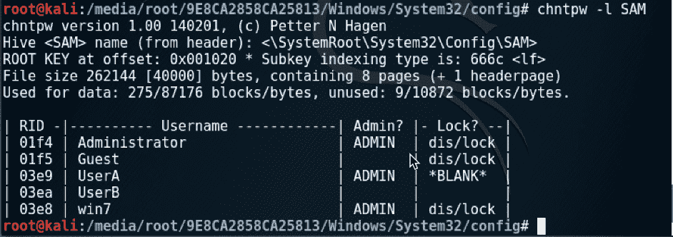
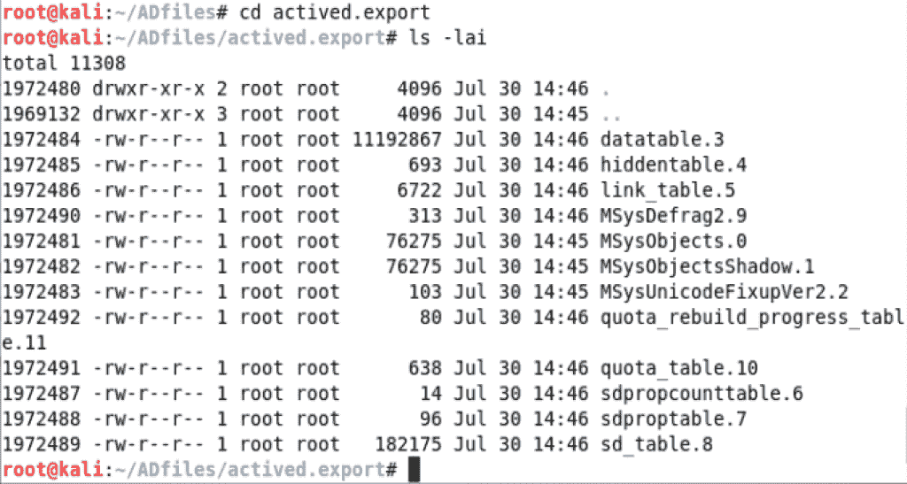
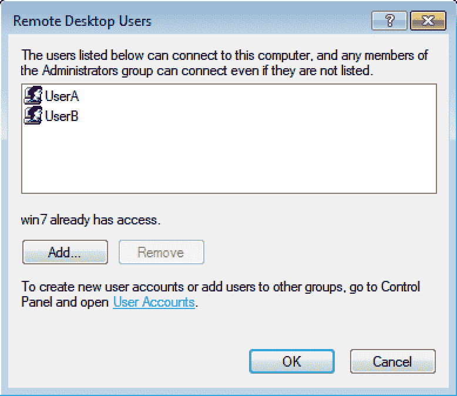

# 第六章：密码破解

本章将涉及以下主题：

+   重置本地 Windows 机器密码

+   破解远程 Windows 机器密码

+   Windows 域密码攻击

+   破解本地 Linux 密码哈希

+   使用字典破解密码哈希

+   暴力破解密码哈希

+   破解 FTP 密码

+   破解 Telnet 和 SSH 密码

+   破解 RDP 和 VNC 密码

+   破解 ZIP 文件密码

# 介绍

密码破解有其特定用途，通常情况下，你可以访问并恢复加密的密码数据库，或者在某些情况下，为了提升权限或获取访问权限，你可能需要使用密码攻击。

# 重置本地 Windows 机器密码

在这个教程中，我们将通过直接访问计算机来破解本地 Windows 机器密码。

在这个教程中，我们还将模拟从 CD-ROM 启动，以便重置本地密码。

# 准备工作

让我们确保以下前提条件：

+   你的 Windows 工作站已关闭

+   你最近已下载 Kali ISO

+   在 Windows 工作站上有一个本地标准用户并且设置了密码

# 如何操作...

现在我们将使用 Kali 启动介质重置 Windows 密码：

1.  在 Windows 机器关闭的情况下，首先进入 VirtualBox，点击 Windows 虚拟机，然后点击设置：

VirtualBox 机器屏幕

1.  从设置菜单中点击存储。点击 CD-ROM 驱动器并选择你最近下载的 Kali ISO 文件。然后点击确定：

VirtualBox 机器存储设置

1.  现在启动你的 Windows 虚拟机，它应该会自动加载 Kali CD。 从主菜单中选择 Live（取证模式）。

根据你使用的操作系统，小心观察屏幕，可能会要求你从 CD 启动。Kali 启动屏幕

1.  Kali 运行后，打开你的终端屏幕。

1.  你必须切换到你挂载的 Windows 卷的目录。你的驱动器 ID 可能与我的不同，但请按照以下步骤找到它：

```
cd /media/root
ls
```

1.  在列出的目录内容中，你可能只有一个驱动器——使用 `cd` 命令将其设为活动驱动器。进入该目录后，使用以下命令：

```
cd Windows/System32/config
chntpw -l SAM
```

Kali SAM 输出

1.  你现在会看到一个用户列表，以及他们是否是管理员。我们将重置 `UserA` 密码并将其设为系统管理员：

```
chnt -u UserA SAM
```

1.  你将进入配置屏幕。选择 1，然后选择 3，接着在被要求时选择 `Y`。然后按 `q` 退出并选择 `y` 以写回注册表文件：

chnt 用户修改屏幕

1.  为了验证，输入以下命令，你会注意到 `UserA` 现在是 `ADMIN` 并且密码是 `*BLANK*`：

```
chntpw -l SAM 
```

chnt 显示 SAM 屏幕

1.  这时关闭虚拟机并移除光驱中的 ISO 镜像。最后，启动虚拟机。这次它应该直接进入 Windows。点击你的用户账号，你将直接进入，无需输入密码：

Windows 7 主登录界面

1.  如果你进入并检查你的用户账户，你会发现`UserA`现在是管理员：

Windows 7 用户管理界面

# 破解远程 Windows 机器密码

在这个教程中，我们将破解远程 Windows 机器的密码。在本案例中，我们假设已经通过 Armitage 发起了攻击并收集了所需的哈希值。如果需要，请参考第四章，*查找目标中的漏洞*和*使用 Armitage 进行高级攻击*教程。

# 准备就绪

让我们确保以下前提条件：

+   你的 Kali 机器已开机

+   你已经启动了 Armitage 并且它正在运行

+   你已经从远程机器收集了所需的哈希值

# 如何操作...

现在我们将破解 Windows 机器的密码哈希值：

1.  在 Armitage 界面中选择控制台|凭证。请注意，在我们之前的攻击中，我们已经获取了从 Windows XP 机器上提取的哈希值：

Armitage 界面

1.  在底部选择“破解密码”。

1.  在那里，你将看到一个选项对话框。浏览一下，查看可用的选项。无需进行任何更改，直接点击“启动”：

Armitage 中的 John the Ripper 实现

1.  这需要几分钟时间，但最终你应该会看到如下图所示的密码：

Armitage 输出界面

# 还有更多内容...

这个攻击使用 John the Ripper 来提取密码。如果由于某些原因它未能在这次运行中破解密码，我们将讨论更高级的技术和各种选项，以提高 John the Ripper 的效果。我们将在继续本章时进一步探讨。

# Windows 域密码攻击

在本教程中，我们将尝试破解 Windows 域控制器上的活动目录数据库。我们假设你已经通过其他攻击手段从计算机上恢复了所需的文件，包括系统文件和`NTDS.dit`文件。

# 准备就绪

让我们确保以下前提条件：

+   你的 Kali 机器已开机

+   你的域控制器上有一些示例账户

+   你已经通过其他方式收集了系统文件和`NTDS.dit`文件

# 如何操作...

现在我们将从 Windows 域控制器恢复密码：

1.  点击终端图标打开终端。 

1.  我们需要安装一些软件包来帮助我们破解 **Active Directory**（**AD**）域。具体来说，这些包是 `libexedb` 和 `ntdsxtract`。

1.  如果你还没有 GitHub 登录，打开浏览器并访问 `www.github.com` 注册为用户。

1.  要下载 `libexedb`，请输入以下命令：

```
 cd 
 apt install autoconf automake autopoint libtool pkg-config 
 git clone https://www.github.com/libyal/libesedb.git 
 cd libesedb 
 ./synclibs.sh
 ./autogen.sh
 ./configure
 make install
```

有关详细的安装说明或问题，请参考以下网站：[`github.com/libyal/libesedb/wiki/Building`](https://github.com/libyal/libesedb/wiki/Building)。

1.  现在让我们获取 `ntdsxtract` 脚本：

```
cd 
git clone https://www.github.com/csababarta/ntdsxtract.git
```

1.  让我们切换到包含我们从域控制器获取的文件的目录。在我的例子中是 AD 文件，从这里我们将使用 `esedbexport` 来解析并提取 `ntds.dit` 文件：

```
cd ~/ADfiles
esedbexport -t ./actived ./ntds.dit 
ls -lai 
```

目录列表

1.  现在让我们看看新 `actived.export` 目录中的文件：

```
cd actived.export 
ls -lai 
```

目录列表

1.  现在我们可以提取哈希值和其他数据输出表格，然后可以将其与 John the Ripper 一起使用：

```
python ~/ntdsxtract/dsusers.py ./datatable.3 ./link_table.5 ~/temp --passwordhashes --lmoutfile lm.out --ntoutfile nt.out --pwdformat john --syshive ~/ADfiles/SYSTEM 
```

哈希值提取

1.  现在，如果我们查看 `temp` 目录，我们将看到几个文件，包括我们指定的两个输出文件 `lm.out` 和 `nt.out`：

```
ls -lai ~/temp 
```

目录列表

1.  现在让我们准备好使用 `john`。我们需要做的第一件事是确保 `rockyou` 密码文件已解压。然后我们将运行 `john` 并查看输出：

```
cd ~/temp 
john nt.out 
john --show nt.out 
```

破解密码输出尝试使用以下命令行开关运行 `john`

`--format=LM` 并使用 `lm.out` 文件。

# 破解本地 Linux 密码哈希

在这个教程中，我们将使用 John the Ripper 破解 Linux 密码。

在本教程中，我们还将模拟从 CD-ROM 启动，以便使用 John the Ripper 破解密码。

# 准备就绪

让我们确保以下先决条件：

+   你的 Kali 机器已启动

+   你的 Linux 机器上设置了一些示例用户和密码

# 如何操作...

现在我们将使用 John the Ripper 破解 Linux 密码：

1.  在你的 Windows 机器关闭时，首先进入 VirtualBox，点击 Linux 虚拟机，然后点击设置：

VirtualBox 虚拟机屏幕

1.  从设置菜单中点击存储。点击 CD-ROM 驱动器并选择你最近下载的 Kali ISO 文件。然后点击确定：

VirtualBox 虚拟机存储设置

1.  现在启动你的 Linux 虚拟机，它应该会自动加载 Kali CD。在主菜单中选择 Live（取证模式）。

认真观察屏幕，根据你使用的操作系统，可能会要求你从 CD 启动。 Kali 启动屏幕

1.  让我们使用以下方法查找 Linux 卷：点击“位置”|“计算机”|“+ 其他位置”，然后双击我们的 Linux 卷。接着可以关闭“位置”窗口：

Kali 屏幕

1.  现在打开你的终端屏幕。 

1.  你必须切换到挂载的 Linux 卷目录。你的驱动器 ID 会与我的不同，但请按照以下步骤查找它：

```
cd /media/root 
ls 
```

1.  从列出的目录内容来看，你可能只有一个驱动器 - `cd` 进入该驱动器目录：

目录列表

1.  现在让我们使用 `shadow` 文件和 John the Ripper 尝试破解密码。我们将使用 John the Ripper 的默认设置。你会从输出中看到我们破解了一些密码：

```
cd etc/ 
john shadow 
```

John the Ripper 输出屏幕

# 还有更多...

尽管我们是在本地对 `shadow` 文件进行攻击，但如果是远程攻击，过程是完全相同的，只需通过漏洞从 Linux 机器获取 `shadow` 文件即可。

# 使用字典文件破解密码哈希

在这个配方中，我们将使用 John the Ripper 和密码列表破解哈希值。我们还将使用来自 Linux 机器的本地 `shadow` 文件，并尝试通过字典列表恢复密码。

# 准备工作

让我们确保以下先决条件：

+   你的 Kali 机器已经开机

+   你已经在 Linux 机器上设置了一些示例用户和密码

+   你已将 `shadow` 文件复制到 Kali 的 `root` 目录

# 如何操作...

我们现在将尝试使用预定义的字典文件破解密码：

1.  确认你已经将 `shadow` 文件复制到 `root` 目录：

目录列表

1.  让我们提取 `rockyou` 密码列表：

```
gunzip /usr/share/wordlists/rockyou.txt.gz
```

1.  让我们使用刚才提取的密码文件和 `shadow` 文件来使用 John the Ripper。你会注意到我们恢复了一些看起来非常简单的密码：

```
cd 
john --rules -w=/usr/share/wordlists/rockyou.txt shadow 
john --show shadow
```

John the Ripper 输出屏幕 注意，我们恢复的所有密码实际上并不是字典中的单词，而是一些非常简单的组合。

# 使用暴力破解密码哈希

在这个配方中，我们将使用 John the Ripper 的暴力破解模式来破解哈希值。我们将使用来自 Linux 机器的本地 `shadow` 文件，并尝试通过暴力破解恢复密码。

# 准备工作

让我们确保以下先决条件：

+   你的 Kali 机器已经开机

+   你已经在 Linux 机器上设置了一些示例用户和密码，现在请再添加一些，并创建几个随机 4 个字符的密码账户。

+   你已将 `shadow` 文件复制到 Kali 的 `root` 目录

# 如何操作...

我们将使用暴力破解方法攻击密码哈希：

1.  确认你已经将 `shadow` 文件复制到 `root` 目录：

目录列表

1.  要对我们的`shadow`文件进行暴力破解，我们可以使用以下命令。此命令将花费很长时间来破解任何密码，因此它被视为最后的手段：

```
cd
john -incremental:lanman shadow
```

John the Ripper 进度屏幕你可以随时按空格键，查看密码破解的进展。此外，`-incremental`后还有几个选项可以加速破解过程，由于我知道我的密码全是小写字母，所以我使用了`-incremental:lower`。

1.  几小时后，我成功获得了 Amy 和 Sheldon 的密码：

John the Ripper 输出屏幕

# 破解 FTP 密码

在这个操作中，我们将尝试破解 FTP 密码。

破解 FTP 密码是访问系统通过 FTP 的一个好方法，同时可以获取其他系统和服务的用户名和密码。对于这个操作，我们将使用 hydra 来测试系统。

# 准备就绪

让我们确保以下前提条件：

+   你的 Kali 机器已经启动

+   你的 Metasploitable 机器已经启动

+   验证 Metasploitable 机器的 IP 地址

# 如何操作...

我们尝试破解 FTP 服务器的密码：

1.  我们先登录到 Metasploitable 机器，并创建几个用户进行测试：

```
cd
sudo useradd raj -p cinnamon -m 
sudo useradd penny -p monkey -m
sudo useradd leonard -p penny -m 
```

1.  验证 Metasploitable 机器的 IP 地址——在我的情况下是`192.168.56.104`。

# 你有一个用户名，但没有密码

在这一部分，我们将使用已知用户名，但密码未知的情况：

1.  在 Kali 中打开一个终端窗口，点击图标。

1.  我们将使用 hydra 通过密码字典来寻找密码。你会发现，很快我们就得到了为我们添加的用户找到的密码：

```
hydra -l penny -P /usr/share/wordlists/rockyou.txt ftp://192.168.56.104/
```

Hydra 输出屏幕

# 你有一个用户列表

在这个操作中，我们使用了一个已定义的实际或潜在用户名列表，这些用户名存在于服务器上：

1.  在 Kali 中打开一个终端窗口，点击图标。

1.  我们将使用 hydra 通过密码字典和预定义的用户名集来寻找密码。让我们来构建我们的用户名列表：

```
cd 
touch usernames 
echo 'penny' >> usernames 
echo 'leonard' >> usernames 
echo 'raj' >> usernames 
```

1.  现在让我们使用我们的用户名列表和密码字典运行 hydra。你会注意到这确实需要一些时间，但最终你会得到密码：

```
hydra -L ~/usernames -P /usr/share/wordlists/rockyou.txt ftp://192.168.56.104/
```

Hydra 输出屏幕

# 破解 Telnet 和 SSH 密码

在这个操作中，我们将尝试破解 Telnet 和 SSH 密码。

破解 Telnet 和 SSH 密码不仅可以用于系统，还可以用于基础设施。通过这种方法，你可以尝试渗透交换机、防火墙、路由器，几乎所有网络设备，而且大多数 Linux 机器都会启用这种访问方式。

# 准备就绪

让我们确保以下前提条件：

+   你的 Kali 机器已经启动

+   你的 Metasploitable 机器已经启动

+   验证 Metasploitable 机器的 IP 地址

# 如何操作...

我们将尝试破解 Telnet 和 SSH 密码：

1.  让我们首先登录到 Metasploitable 机器，创建几个用户来进行测试：

```
cd 
sudo useradd johndoe -p ketchup -m 
sudo useradd janedoe -p mustard -m 
sudo useradd kiddoe -p monkey -m

```

1.  验证 Metasploitable 机器的 IP 地址——在我的案例中是 `192.168.56.104`。

# 使用用户名列表破解 Telnet 密码

在这个教程中，我们将尝试根据已知或潜在的用户名列表破解 Telnet 密码：

1.  通过点击图标在 Kali 中打开终端窗口。 

1.  我们将使用 Hydra 来通过单词列表和预定义的用户名集合进行密码破解。让我们来构建用户名列表：

```
cd 
touch usernames2 
echo 'kiddoe' >> usernames2 
echo 'janedoe' >> usernames2 
echo 'johndoe' >> usernames2

```

1.  现在，让我们使用我们的用户名列表和单词列表运行 Hydra。你会注意到这需要一些时间，但最终你会获得密码：

```
hydra -L ~/usernames2 -P /usr/share/wordlists/rockyou.txt telnet://192.168.56.104 
```

Hydra 输出屏幕，Telnet 可能需要很长时间并且结果不可靠。然而，由于它在遗留网络中的普遍性，它仍然是一种很好的攻击方法。

# 使用已知用户名破解 SSH 密码

在这个教程中，我们将使用已知用户名破解 SSH 密码：

1.  通过点击图标在 Kali 中打开终端窗口。 

1.  现在让我们使用已知用户名和单词列表运行 Hydra。你会注意到这需要一些时间，但最终你会获得密码：

```
**hydra -t 4 -l kiddoe -P /usr/share/wordlists/rockyou.txt ssh://192.168.56.104** 
```

Hydra 输出屏幕，`-t 4` 会减慢进程的数量，以防止其过载或触发某些 SSL 实例的保护机制。

# 破解 RDP 和 VNC 密码

在这个教程中，我们将尝试破解 Windows 机器上的 RDP 和 VNC 密码。

破解 RDP 或 VNC 密码是一种非常强大的方式来访问任何系统。虽然 RDP 仅限于 Windows 系统，但 VNC 是一个跨平台的远程控制工具，支持 Windows、Mac 和 Linux。你可以使用之前的扫描结果查找 Windows 机器上开放的 VNC 端口。

# 准备工作

让我们确保以下前提条件：

+   你的 Kali 机器已经开机

+   你的 Windows 机器已经开机并连接到 NAT 网络

+   验证互联网连接

+   系统中有一些有效用户并且启用了 RDP

# 如何操作...

我们现在将尝试破解远程访问密码：

1.  让我们从登录 Windows 机器开始，验证是否有可用账户，并下载和安装 VNC。

1.  打开 Internet Explorer 浏览器并访问 `www.uvnc.com`。点击顶部的 Downloads，选择软件的最新版本并下载。

1.  通过双击下载位置的图标来安装 `UltraVNC`：

目录列表

1.  当出现提示时，点击运行，并在 UAC 对话框出现时选择“是”。选择适当的语言，点击单选按钮接受协议，然后点击下一步。在发布说明信息屏幕上点击下一步。验证安装目录，然后点击下一步。验证正在安装的组件——完全安装，并确认是否已选择 UltraVNC Server，然后点击下一步。在快捷方式名称屏幕上，接受默认设置并点击下一步。

1.  在选择附加任务的屏幕上，选择所有复选框并点击下一步：


1.  最后，点击安装。

1.  完成后，根据需要点击完成剩余的屏幕。

1.  关闭你的 Windows 机器—将其切换回仅主机模式—启动 Windows 虚拟机。

1.  为了进行此测试，我们假设你知道如何通过控制面板的用户帐户选项卡添加用户。添加两个用户：

    +   用户名 - `UserA`，密码 - `franks`

    +   用户名 - `UserB`，密码 - `beans`

1.  如果你设置这些用户为标准用户而非管理员，请确保允许他们访问 RDP 服务。要在 Windows 7 上执行此操作，右键点击我的电脑，然后点击属性：


1.  在左上角，点击远程设置。

1.  在系统属性屏幕上，请确保已选择允许来自任何版本的远程桌面（较不安全）计算机的连接。然后点击选择用户...：


1.  从选择用户对话框中，添加`UserA`和`UserB`并点击确定：



1.  关闭所有剩余的对话框。

1.  验证你的 Windows 机器的 IP 地址；对我来说，我使用的是`192.168.56.105`。

1.  在 Kali 中点击图标打开终端窗口。 

1.  现在让我们使用已知的用户名和词典文件运行 hydra。你会注意到这确实需要一些时间，但最终你会得到密码：

```
hydra -t 4 -W 1 -l UserA -P /usr/share/wordlists/rockyou.txt rdp://192.168.56.105
```

Hydra 输出屏幕

1.  要对 VNC 执行相同操作，只需将 RDP 替换为 VNC：

```
hydra -t 4 -W 1 -l UserA -P /usr/share/wordlists/rockyou.txt vnc://192.168.56.105
```

# 破解 ZIP 文件密码

在本教程中，我们将尝试破解一个 ZIP 文件的密码。

有时你会遇到带有密码的 ZIP 文件。通常，你可以通过简单的字典攻击轻松破解这些密码。

# 准备就绪

让我们确保以下先决条件：

+   你的 Kali 机器已开机

# 如何操作...

现在，我们将破解 ZIP 文件的密码并恢复其内容：

1.  在 Kali 中点击图标打开终端窗口。 

1.  输入以下命令来创建加密的 ZIP 文件：

```
cd 
mkdir 6.10 
cd 6.10
touch one two three 
zip -e numbers.zip one two three
```

1.  当要求输入密码时，我们可以使用一个简单的密码，例如`password`。

1.  我们将使用来自以前教程的`rockyou.txt`字典文件与`fcrackzip`：

```
fcrackzip -u -D -p '/usr/share/wordlists/rockyou.txt' numbers.zip
```

fcrackzip 输出
