# 第一章：Kali - 介绍

在本章中，我们将涵盖以下内容：

+   配置 Kali Linux

+   配置 Xfce 环境

+   配置 Mate 环境

+   配置 LXDE 环境

+   配置 e17 环境

+   配置 KDE 环境

+   使用自定义工具进行准备

+   渗透测试 VPN 的 ike-scan

+   设置 proxychains

+   使用 Routerhunter 进行狩猎

# 介绍

Kali 于 2012 年首次推出，采用全新的架构。这个基于 Debian 的发行版发布时带有 300 多个专门用于渗透测试和数字取证的工具。它由 Offensive Security Ltd 维护和资助，核心开发人员是 Mati Aharoni、Devon Kearns 和 Raphael Hertzog。

Kali 2.0 于 2016 年推出，带来了大量新的更新和新的桌面环境，如 KDE、Mate、LXDE、e17 和 Xfce 版本。

虽然 Kali 已经预装了数百种令人惊叹的工具和实用程序，以帮助全球的渗透测试人员高效地完成工作，但在本章中，我们主要将介绍一些自定义调整，以便用户可以更好地进行渗透测试体验。

# 配置 Kali Linux

我们将使用 Offensive Security 提供的官方 Kali Linux ISO 来安装和配置不同的桌面环境，如 Mate、e17、Xfce、LXDE 和 KDE 桌面。

# 准备就绪

要开始这个教程，我们将使用 Offensive Security 网站上列出的 64 位 Kali Linux ISO：

[`www.kali.org/downloads/`](https://www.kali.org/downloads/)

对于希望在虚拟机中配置 Kali 的用户，如 VMware、VirtualBox 等，可以从[`www.offensive-security.com/kali-linux-vmware-virtualbox-image-download/`](https://www.offensive-security.com/kali-linux-vmware-virtualbox-image-download/)下载 Linux 的预构建镜像。

在本章中，我们将使用虚拟镜像，并使用一些额外的工具进行定制。

# 如何操作...

您可以按照给定的步骤配置 Kali：

1.  双击 VirtualBox 镜像，它应该会在 VirtualBox 中打开：

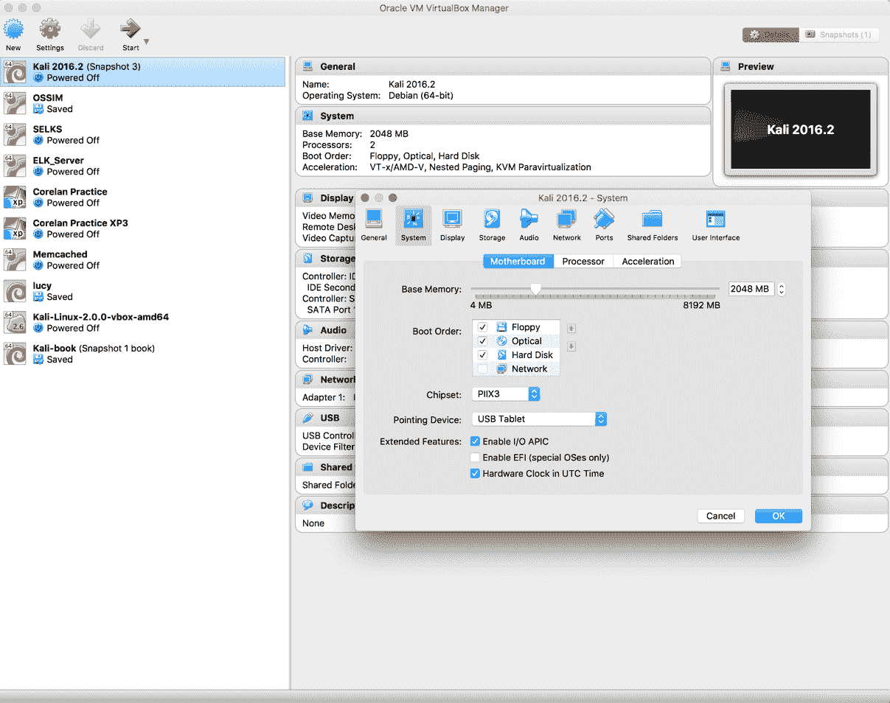

1.  点击导入：

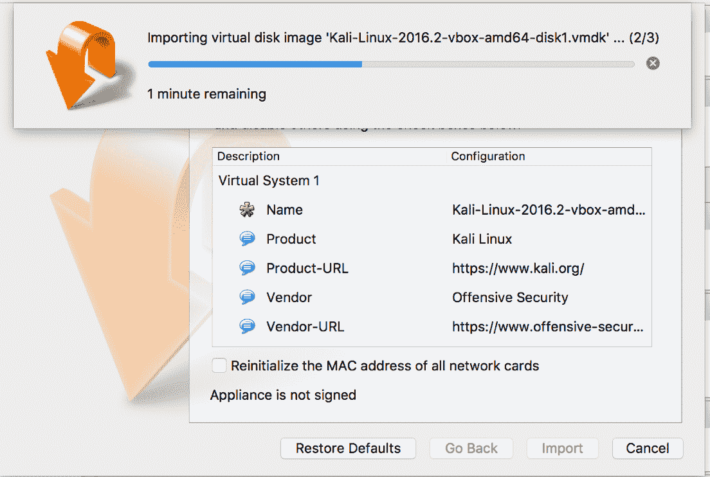

1.  启动机器并输入密码`toor`：

1.  现在，Kali 已启动，默认配置为 GNOME 桌面环境：

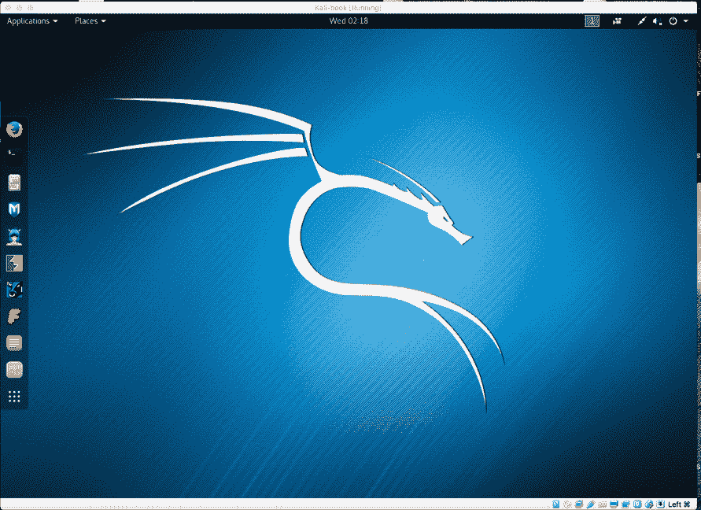

# 它是如何工作的...

使用预构建的镜像，您无需担心安装过程。您可以将其视为即插即用的解决方案。只需点击运行，虚拟机将启动 Linux，就像普通机器一样。

# 配置 Xfce 环境

Xfce 是 Unix 和类 Unix 平台的免费、快速和轻量级桌面环境。它由 Olivier Fourdan 于 1996 年开始。**Xfce**最初代表**XForms Common Environment**，但自那时起，Xfce 已经重写两次，不再使用 XForms 工具包。

# 如何操作...

要配置 Xfce 环境，请按照以下步骤进行操作：

1.  我们首先使用以下命令安装 Xfce 以及所有插件和好东西：

```
 apt-get install kali-defaults kali-root desktop-base xfce4
        xfce4-places-plugin xfce4-goodies
```

以下截图显示了前面的命令：


1.  在要求确认额外空间需求时键入`Y`。

1.  在出现的对话框上选择确定。

1.  我们选择 lightdm 作为默认的桌面管理器，并按下*Enter*键。

1.  安装完成后，我们打开一个终端窗口并输入以下命令：

```
 update-alternatives --config x-session-manager 
```

以下截图显示了前面命令的输出：

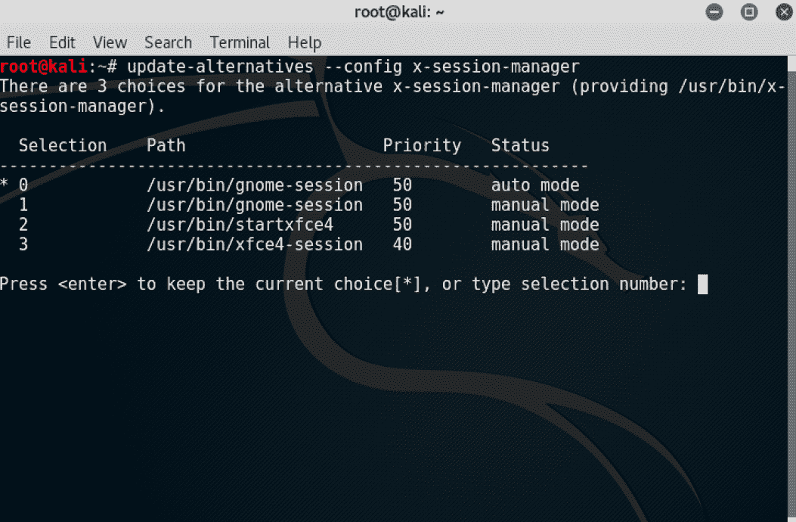

1.  选择选项`xfce4-session`（在我们的案例中是`3`）并按下*Enter*键。

1.  注销并重新登录，或者您可以重新启动机器，我们将看到 Xfce 环境：


# 配置 Mate 环境

Mate 桌面环境是在 GNOME 2 的基础上构建的。它于 2011 年首次发布。

# 如何操作...

要配置 Mate 环境，请按照以下步骤进行：

1.  我们首先使用以下命令来安装 Mate 环境：

```
 apt-get install desktop-base mate-desktop-environment 
```

以下截图显示了上述命令：


1.  当它要求确认额外的空间需求时，输入`Y`。

1.  安装完成后，我们将使用以下命令将 Mate 设置为我们的默认环境：

```
 update-alternatives --config x-session-manager
```

1.  选择选项`mate-session`（在我们的情况下是`2`）并按下*Enter*键：

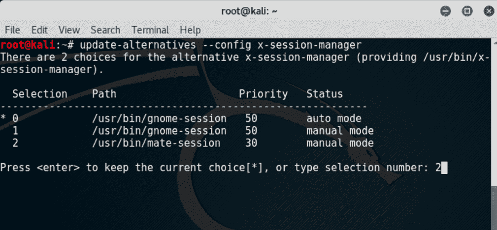

1.  注销并重新登录或重新启动，我们将看到 Mate 环境：


# 配置 LXDE 环境

LXDE 是用 C 编写的自由开源环境，使用 GTK+工具包用于 Unix 和其他 POSIX 平台。**轻量级 X11 桌面环境**（**LXDE**）是许多操作系统的默认环境，如 Knoppix、Raspbian、Lubuntu 等。

# 如何做...

要配置 LXDE 环境，请按照以下步骤进行：

1.  我们首先使用以下命令来安装 LXDE：

```
 apt-get install lxde-core lxde
```

1.  当它要求确认额外的空间需求时，输入`Y`。

1.  安装完成后，我们打开一个终端窗口并输入以下命令：

```
 update-alternatives --config x-session-manager
```

以下截图显示了上述命令的输出：

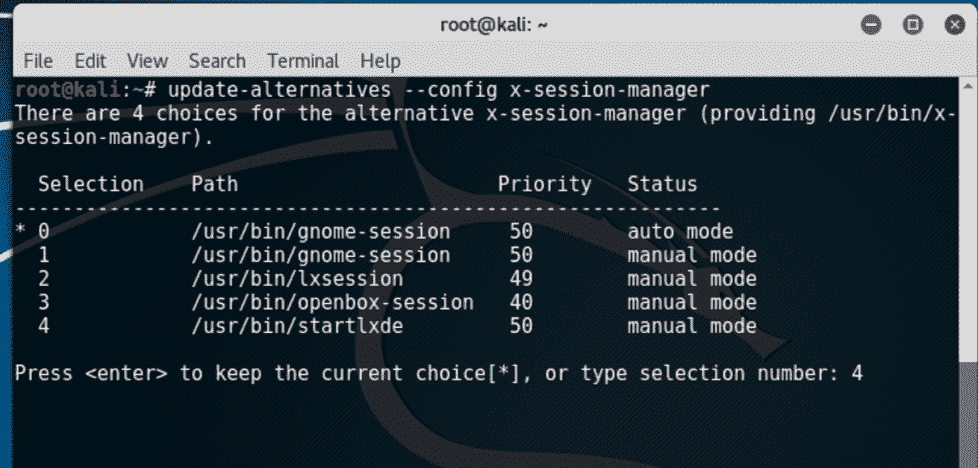

1.  选择选项`lxsession`（在我们的情况下是`4`）并按*Enter*。

1.  注销并重新登录，我们将看到 LXDE 环境：

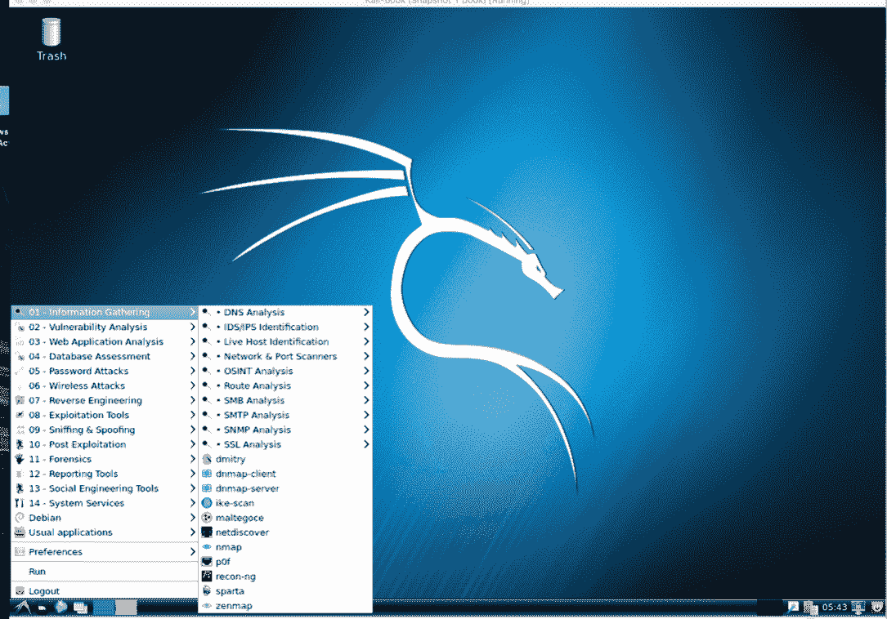

# 配置 e17 环境

**Enlightenment**，或者称为**E**，是 X Windows 系统的窗口管理器。它于 1997 年首次发布。它有很多功能，比如 engage、虚拟桌面、平铺等等。

# 如何做...

由于兼容性问题和依赖关系的麻烦，最好将 Kali 环境设置为不同的机器。这个 ISO 镜像（Kali 64 位 e17）已经在 Kali Linux 官方网站上提供，并可以从以下 URL 下载：

[`www.kali.org/downloads/`](https://www.kali.org/downloads/)。

# 配置 KDE 环境

KDE 是一个自由软件的国际社区。Plasma 桌面是 KDE 最受欢迎的项目之一；它是许多 Linux 发行版的默认桌面环境。它由 Matthias Ettrich 于 1996 年创立。

# 如何做...

要配置 KDE 环境，请按照以下步骤进行：

1.  我们使用以下命令来安装 KDE：

```
 apt-get install kali-defaults kali-root-login desktop-base
        kde-plasma-desktop 
```

以下截图显示了上述命令的输出：


1.  当它要求确认额外的空间需求时，输入`Y`。

1.  在弹出的两个窗口上点击 OK。

1.  安装完成后，我们打开一个终端窗口并输入以下命令：

```
 update-alternatives --config x-session-manager 
```

以下截图显示了上述命令的输出：


1.  选择 KDE 会话选项（在我们的情况下是`2`）并按*Enter*。

1.  注销并重新登录，我们将看到 KDE 环境：


Kali 已经提供了不同桌面环境的预构建镜像。这些可以从这里下载：[`www.kali.org/downloads/`](https://www.kali.org/downloads/)。

# 准备使用自定义工具

你将安装的这些工具都是在 GitHub 上开源的。它们更快，包含了人们在自己的渗透测试经验中在一段时间内包含的不同调整的集合。

# 准备工作

这是一些工具的列表，在我们深入渗透测试之前你需要的。不用担心，你将在接下来的几章中学习它们的用法，并且会有一些真实的例子。然而，如果你仍然希望在早期阶段学习基础知识，可以简单地用简单的命令完成：

+   `toolname -help`

+   `toolname -h`

# 如何做...

一些工具列在以下部分。

# Dnscan

Dnscan 是一个使用单词列表解析有效子域的 Python 工具。要了解有关 Dnscan 的信息，请按照给定的步骤进行：

1.  我们将使用一个简单的命令来克隆 git 存储库：

```
 git clone https://github.com/rbsec/dnscan.git
```

以下屏幕截图显示了上述命令：


1.  您还可以从[`github.com/rbsec/dnscan`](https://github.com/rbsec/dnscan)下载并保存它。

1.  接下来我们进入下载 Dnscan 的目录。

1.  使用以下命令运行 Dnscan：

```
 ./dnscan.py -h
```

以下屏幕截图显示了上述命令的输出：


# Subbrute

接下来我们将安装 subbrute。它非常快速，并提供了额外的匿名层，因为它使用公共解析器来暴力破解子域：

1.  这里的命令再次很简单：

```
 git clone https://github.com/TheRook/subbrute.git
```

以下屏幕截图显示了上述命令：


1.  或者您可以从[`github.com/TheRook/subbrute`](https://github.com/TheRook/subbrute)下载并保存它。

1.  安装完成后，我们将需要一个单词列表来运行它，我们可以下载 dnspop 的列表。这个列表也可以在之前的配方中使用：[`github.com/bitquark/dnspop/tree/master/results`](https://github.com/bitquark/dnspop/tree/master/results)。

1.  一旦两者都设置好，我们就进入 subbrute 的目录，并使用以下命令运行它：

```
 ./subbrute.py
```

1.  要针对我们的单词列表扫描域名，使用以下命令：

```
 ./subbrute.py -s /path/to/wordlist hostname.com
```

# Dirsearch

我们下一个工具是 dirsearch。顾名思义，它是一个简单的命令行工具，可用于暴力破解目录。它比传统的 DIRB 要快得多：

1.  安装的命令是：

```
 git clone https://github.com/maurosoria/dirsearch.git
```

1.  或者您可以从[`github.com/maurosoria/dirsearch`](https://github.com/maurosoria/dirsearch)下载并保存它。以下屏幕截图显示了上述命令：


1.  一旦克隆完成，就浏览到目录并使用以下命令运行工具：

```
 ./dirsearch.py -u hostname.com -e aspx,php
```

以下屏幕截图显示了上述命令的输出：


# 渗透测试 VPN 的 ike-scan

在渗透测试期间，我们可能会遇到 VPN 端点。但是，发现这些端点的漏洞并利用它们并不是一种众所周知的方法。VPN 端点使用**Internet Key Exchange**（**IKE**）协议在多个客户端之间建立*安全关联*以建立 VPN 隧道。

IKE 有两个阶段，*第 1 阶段*负责建立和建立安全认证通道，*第 2 阶段*加密和传输数据。

我们的兴趣重点将是*第 1 阶段*；它使用两种交换密钥的方法：

+   主模式

+   激进模式

我们将寻找使用 PSK 身份验证的激进模式启用的 VPN 端点。

# 准备工作

对于这个配方，我们将使用工具`ike-scan`和`ikeprobe`。首先，通过克隆 git 存储库来安装`ike-scan`：

```
git clone https://github.com/royhills/ike-scan.git
```

或者您可以使用以下 URL 从[`github.com/royhills/ike-scan`](https://github.com/royhills/ike-scan)下载它。

# 如何做...

要配置`ike-scan`，请按照给定的步骤进行：

1.  浏览到安装了`ike-scan`的目录。

1.  通过运行以下命令安装`autoconf`：

```
 apt-get install autoconf
```

1.  运行`autoreconf --install`来生成`.configure`文件。

1.  运行`./configure`。

1.  运行`make`来构建项目。

1.  运行`make check`来验证构建阶段。

1.  运行`make install`来安装`ike-scan`。

1.  要扫描主机进行激进模式握手，请使用以下命令：

```
 ike-scan x.x.x.x -M -A
```

以下屏幕截图显示了上述命令的输出：


1.  有时，我们会在提供有效组名（vpn）后看到响应：

```
 ike-scan x.x.x.x -M -A id=vpn
```

以下屏幕截图显示了上述命令的示例：

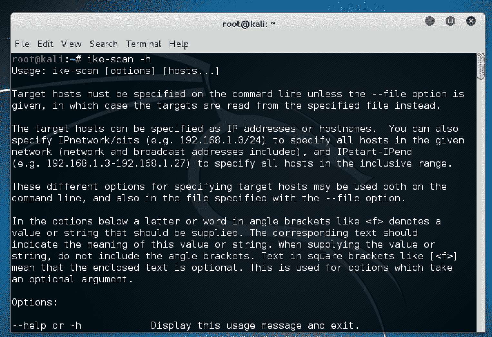

我们甚至可以使用以下脚本来暴力破解组名：

[`github.com/SpiderLabs/groupenum`](https://github.com/SpiderLabs/groupenum). [](https://github.com/SpiderLabs/groupenum)

命令：

`./dt_group_enum.sh x.x.x.x groupnames.dic`

# 破解 PSK

要了解如何破解 PSK，请按照给定的步骤进行：

1.  在`ike-scan`命令中添加`-P`标志，它将显示捕获的哈希的响应。

1.  要保存哈希，我们提供一个带有`-P`标志的文件名。

1.  接下来，我们可以使用以下命令使用`psk-crack`：

```
 psk-crack -b 5 /path/to/pskkey
```

1.  其中`-b`是暴力破解模式，长度为`5`。

1.  要使用基于字典的攻击，我们使用以下命令：

```
 psk-crack -d /path/to/dictionary /path/to/pskkey 
```

以下屏幕截图显示了上述命令的输出：


# 它是如何工作的...

在侵略模式下，认证哈希作为对试图建立连接隧道（IPSEC）的 VPN 客户端的数据包的响应进行传输。该哈希未加密，因此允许我们捕获哈希并对其进行暴力攻击以恢复我们的 PSK。

这在主模式下是不可能的，因为它使用加密哈希以及六路握手，而侵略模式只使用三路握手。

# 设置 proxychains

有时，在执行渗透测试活动时，我们需要保持匿名。Proxychains 通过允许我们使用中间系统来帮助我们，其 IP 可以留在系统日志中，而不必担心追溯到我们。

Proxychains 是一种工具，允许任何应用程序通过代理（如 SOCKS5、Tor 等）进行连接。

# 如何做到...

Kali 中已经安装了 Proxychains。但是，我们需要将代理列表添加到其配置文件中，以便使用：

1.  为此，我们使用以下命令在文本编辑器中打开 proxychains 的配置文件：

```
 leafpad /etc/proxychains.conf
```

以下屏幕截图显示了上述命令的输出：

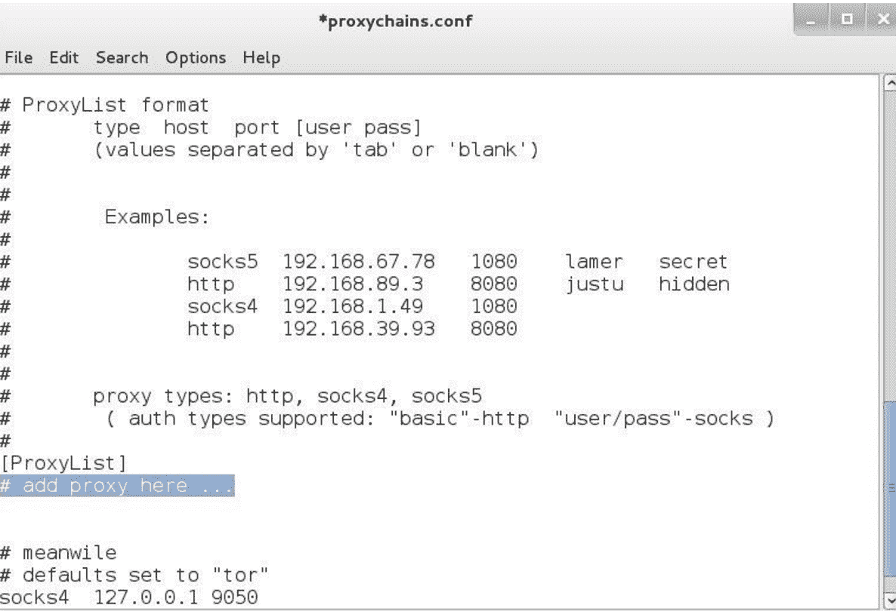

我们可以在上述突出显示的区域中添加所有我们想要的代理，然后保存。

Proxychains 还允许我们在连接到代理服务器时使用动态链或随机链。

1.  在配置文件中取消注释**dynamic_chain**或**random_chain**：


# 使用 tor 的 proxychains

要了解`tor`，请按照给定的步骤进行：

1.  要使用 proxychains 与 tor，我们首先需要使用以下命令安装 tor：

```
 apt-get install tor
```

1.  安装完成后，我们通过在终端中输入`tor`来运行 tor。

1.  然后我们打开另一个终端，并输入以下命令以通过 proxychains 使用应用程序：

```
 proxychains toolname -arguments
```

以下屏幕截图显示了上述命令的示例：

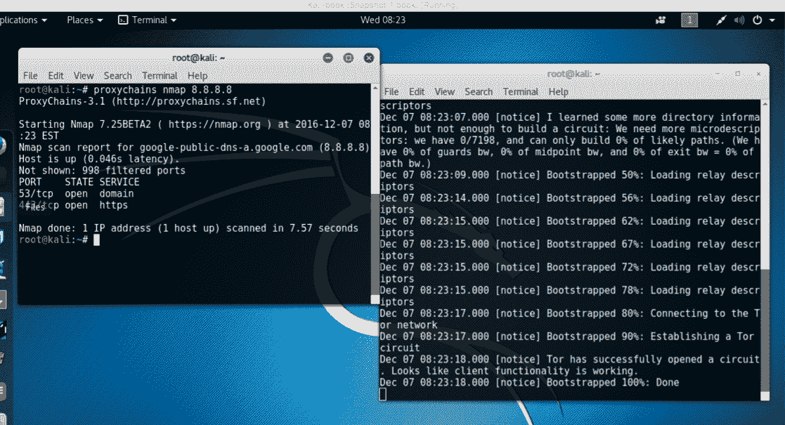

# 使用 Routerhunter 进行狩猎

Routerhunter 是一种工具，用于在网络上查找易受攻击的路由器并对其进行各种攻击，以利用 DNSChanger 漏洞。该漏洞允许攻击者更改路由器的 DNS 服务器，从而将所有流量定向到所需的网站。

# 准备工作

对于这个教程，您需要再次克隆一个 git 存储库。

我们将使用以下命令：

```
git clone https://github.com/jh00nbr/RouterHunterBR.git
```

# 如何做到...

执行`RouterHunterBR.php`，按照给定的步骤进行：

1.  文件克隆后，进入目录。

1.  运行以下命令：

```
 php RouterHunterBR.php -h
```

以下屏幕截图显示了上述命令的输出：

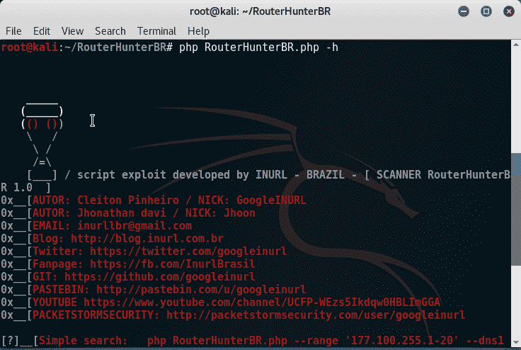

1.  我们可以为 Routerhunter 提供 IP 范围、DNS 服务器 IP 等。
