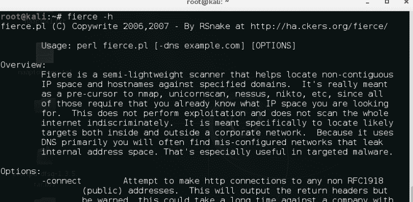
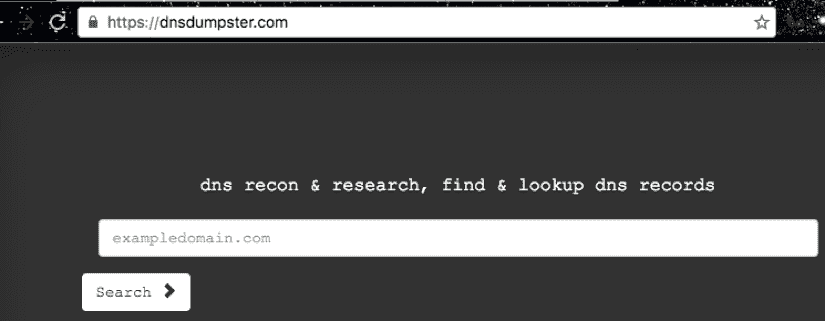
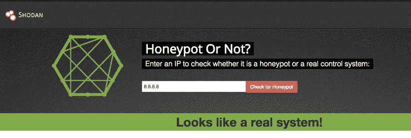
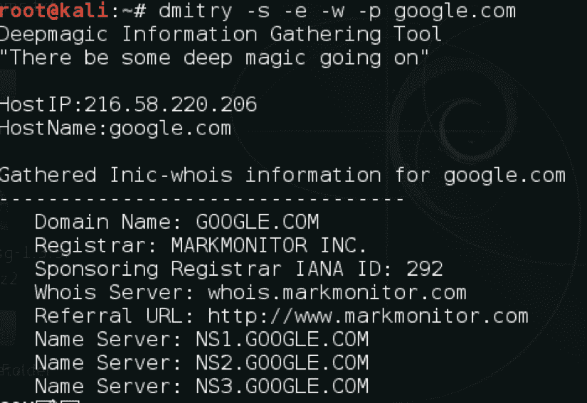
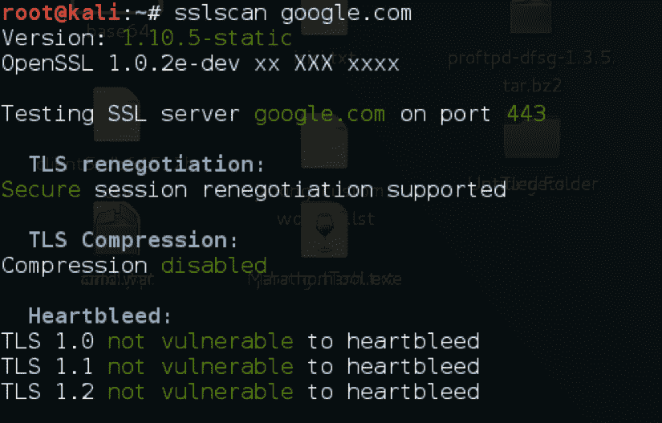
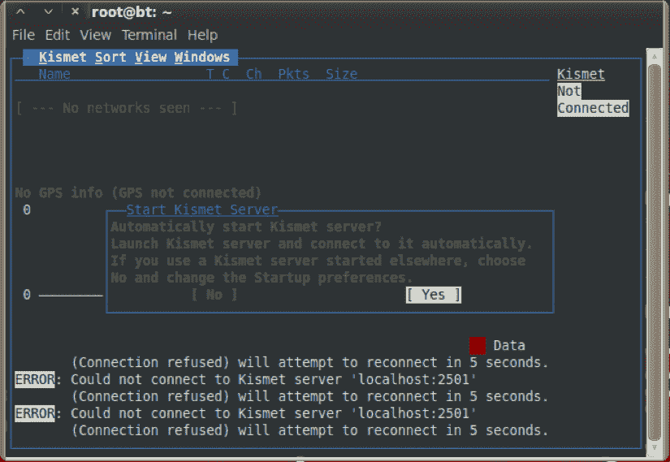

# 第二章：收集情报和规划攻击策略

在本章中，我们将介绍以下配方：

+   获取子域列表

+   使用 Shodan 进行娱乐和盈利

+   Shodan Honeyscore

+   Shodan 插件

+   使用 Nmap 查找开放端口

+   使用 Nmap 绕过防火墙

+   搜索开放目录

+   使用 DMitry 进行深度探测

+   寻找 SSL 漏洞

+   使用 intrace 探索连接

+   深入挖掘使用 theharvester

+   查找 Web 应用程序背后的技术

+   使用 masscan 扫描 IP

+   使用 Kismet 进行嗅探

+   使用 firewalk 测试路由器

# 介绍

在上一章中，我们学习了狩猎子域的基础知识。在本章中，我们将深入一点，看看其他可用于收集目标情报的不同工具。我们首先使用 Kali Linux 中臭名昭著的工具。

收集信息是进行渗透测试的一个非常关键的阶段，因为在此阶段收集的所有信息将完全决定我们在接下来的每一步。因此，在进入利用阶段之前，我们尽可能多地收集信息非常重要。

# 获取子域列表

我们并不总是处于客户已经定义了需要进行渗透测试的详细范围的情况。因此，我们将使用以下提到的配方尽可能多地收集信息，以进行渗透测试。

# Fierce

我们首先跳转到 Kali 的终端，使用第一个和最常用的工具`fierce`。

# 如何做...

以下步骤演示了如何使用`fierce`：

1.  要启动 fierce，我们输入`fierce -h`来查看帮助菜单：



1.  执行子域扫描我们使用以下命令：

```
 fierce -dns host.com -threads 10
```

以下截图显示了前述命令的输出：


# DNSdumpster

这是 Hacker Target 的一个免费项目，用于查找子域。它依赖于[`scans.io/`](https://scans.io/)来获取结果。它也可以用于获取网站的子域。我们应该始终倾向于使用多个工具进行子域枚举，因为我们可能会从其他工具中得到第一个工具未能捕获的信息。

# 如何做...

使用起来非常简单。我们输入要获取子域的域名，它会显示结果：



# 使用 Shodan 进行娱乐和盈利

Shodan 是世界上第一个搜索连接到互联网的设备的搜索引擎。它由 John Matherly 于 2009 年推出。Shodan 可用于查找网络摄像头、数据库、工业系统、视频游戏等。Shodan 主要收集运行的最流行的网络服务的数据，如 HTTP、HTTPS、MongoDB、FTP 等等。

# 做好准备

要使用 Shodan，我们需要在 Shodan 上创建一个帐户。

# 如何做...

要了解 Shodan，请按照给定的步骤进行：

1.  打开浏览器，访问[`www.shodan.io`](https://www.shodan.io)：


1.  我们首先执行一个简单的搜索，查找正在运行的 FTP 服务。为此，我们可以使用以下 Shodan dorks：`port:"21"`。以下截图显示了搜索结果：


1.  可以通过指定特定的国家/组织来使此搜索更加具体：`port:"21" country:"IN"`。以下截图显示了搜索结果：


1.  现在我们可以看到所有在印度运行的 FTP 服务器；我们还可以看到允许匿名登录的服务器以及它们正在运行的 FTP 服务器的版本。

1.  接下来，我们尝试组织过滤器。可以通过输入`port:"21" country:"IN" org:"BSNL"`来完成，如下截图所示：


Shodan 还有其他标签，可以用来进行高级搜索，比如：

+   `net`：扫描 IP 范围

+   `city`：按城市过滤

更多详细信息可以在[`www.shodan.io/explore`](https://www.shodan.io/explore)找到。

# Shodan Honeyscore

Shodan Honeyscore 是另一个出色的 Python 项目。它帮助我们确定我们拥有的 IP 地址是蜜罐还是真实系统。

# 如何做...

以下步骤演示了如何使用 Shodan Honeyscore：

1.  要使用 Shodan Honeyscore，我们访问[`honeyscore.shodan.io/`](https://honeyscore.shodan.io/)：


1.  输入我们要检查的 IP 地址，就这样！



# Shodan 插件

为了使我们的生活更加轻松，Shodan 还为 Chrome 和 Firefox 提供了插件，可以用来在我们访问的网站上检查开放端口！

# 如何做...

我们可以从[`www.shodan.io/`](https://www.shodan.io/)下载并安装插件。浏览任何网站，我们会发现通过点击插件，我们可以看到开放的端口：


# 另请参阅

+   来自第一章的*Dnscan*步骤，*Kali – An Introduction*

+   使用 theharvester 深入挖掘的步骤

# 使用 Nmap 查找开放端口

网络映射器（Nmap）是由 Gordon Lyon 编写的安全扫描程序。它用于在网络中查找主机和服务。它最早是在 1997 年 9 月发布的。Nmap 具有各种功能以及用于执行各种测试的脚本，例如查找操作系统、服务版本、暴力破解默认登录等。

一些最常见的扫描类型是：

+   TCP `connect()`扫描

+   SYN 隐秘扫描

+   UDP 扫描

+   Ping 扫描

+   空闲扫描

# 如何做...

以下是使用 Nmap 的步骤：

1.  Nmap 已经安装在 Kali Linux 中。我们可以输入以下命令来启动它并查看所有可用的选项：

```
 nmap -h
```

以下屏幕截图显示了前面命令的输出：


1.  要执行基本扫描，我们使用以下命令：

```
 nmap -sV -Pn x.x.x.x
```

以下屏幕截图显示了前面命令的输出：


1.  `-Pn`表示我们不通过首先执行 ping 请求来检查主机是否正常。`-sV`参数是列出在找到的开放端口上运行的所有服务。

1.  我们可以使用的另一个标志是`-A`，它会自动执行操作系统检测、版本检测、脚本扫描和跟踪路由。命令是：

```
 nmap -A -Pn x.x.x.x
```

1.  要扫描 IP 范围或多个 IP，我们可以使用以下命令：

```
 nmap -A -Pn x.x.x.0/24
```

# 使用脚本

Nmap 脚本引擎（NSE）允许用户创建自己的脚本，以便在运行扫描时并行执行这些脚本来执行不同的任务。它们可用于执行更有效的版本检测、利用漏洞等。使用脚本的命令是：

```
nmap -Pn -sV host.com --script dns-brute
```


前面命令的输出如下：


这里的脚本`dns-brute`尝试通过针对一组常见子域名名称进行暴力破解来获取可用的子域名。

# 另请参阅

+   使用 Shodan 进行娱乐和盈利的步骤

+   有关脚本的更多信息可以在官方 NSE 文档中找到[`nmap.org/nsedoc/`](https://nmap.org/nsedoc/)

# 使用 Nmap 绕过防火墙

在渗透测试期间，我们通常会遇到受防火墙或入侵检测系统（IDS）保护的系统。Nmap 提供了不同的方法来绕过这些 IDS/防火墙，执行对网络的端口扫描。在这个步骤中，我们将学习一些绕过防火墙的方法。

# TCP ACK 扫描

ACK 扫描（`-sA`）发送确认包而不是 SYN 包，防火墙不会创建 ACK 包的日志，因为它会将 ACK 包视为对 SYN 包的响应。它主要用于映射防火墙的类型。

# 如何做...

ACK 扫描是为了显示未经过滤和经过滤的端口，而不是打开的端口。

ACK 扫描的命令是：

```
nmap -sA x.x.x.x
```

让我们看看正常扫描与 ACK 扫描的比较：


在这里，我们看到正常扫描和 ACK 扫描之间的区别：


# 它是如何工作的...

过滤和未过滤端口的扫描结果取决于使用的防火墙是有状态的还是无状态的。有状态防火墙检查传入的 ACK 数据包是否是现有连接的一部分。如果数据包不是任何请求连接的一部分，它将被阻止。因此，在扫描期间，端口将显示为已过滤。

而在无状态防火墙的情况下，它不会阻止 ACK 数据包，端口将显示为未过滤。

# TCP 窗口扫描

窗口扫描（`-sW`）几乎与 ACK 扫描相同，只是显示打开和关闭的端口。

# 如何做到...

让我们看看正常扫描和 TCP 扫描之间的区别：

1.  运行的命令是：

```
 nmap -sW x.x.x.x
```

1.  让我们看看正常扫描与 TCP 窗口扫描的比较：


1.  我们可以在以下屏幕截图中看到两种扫描之间的区别：


# 空闲扫描

空闲扫描是一种高级技术，其中没有发送到目标的数据包可以追溯到攻击者的机器。它需要指定一个僵尸主机。

# 如何做到...

执行空闲扫描的命令是：

```
nmap -sI zombiehost.com domain.com
```

# 它是如何工作的...

空闲扫描基于可预测的僵尸主机的 IPID 或 IP 分段 ID。首先检查僵尸主机的 IPID，然后欺骗性地从该主机向目标主机发送连接请求。如果端口是打开的，将向僵尸主机发送确认，这将重置连接，因为它没有打开这样的连接的历史记录。接下来，攻击者再次检查僵尸上的 IPID；如果它改变了一步，这意味着从目标接收到了 RST。但如果 IPID 改变了两步，这意味着从目标主机接收到了一个数据包，并且在僵尸主机上有一个 RST，这意味着端口是打开的。

# 搜索打开的目录

在上一篇文章中，我们讨论了如何在网络 IP 或域名上找到开放的端口。我们经常看到开发人员在不同的端口上运行 Web 服务器。有时开发人员也可能会留下错误配置的目录，其中可能包含对我们有用的信息。我们已经在上一章中介绍了 dirsearch；在这里，我们将看看其他选择。

# dirb 工具

`dirb`工具是一个众所周知的工具，可以用来暴力破解打开的目录。虽然它通常速度较慢，不支持多线程，但仍然是发现可能由于错误配置而留下的目录/子目录的好方法。

# 如何做到...

键入以下命令启动工具：

```
    dirb https://domain.com
```

以下屏幕截图显示了上述命令的输出：


# 还有更多...

`dirb`中还有其他选项，也很方便：

+   `-a`：指定用户代理

+   `-c`：指定 cookie

+   `-H`：输入自定义标头

+   `-X`：指定文件扩展名

# 另请参阅

+   来自第一章的*Dirsearch*食谱，*Kali-简介*

# 使用 DMitry 进行深度魔法

**Deepmagic 信息收集工具**（**DMitry**）是一个用 C 编写的命令行工具开源应用程序。它具有收集有关目标的子域、电子邮件地址、whois 信息等能力。

# 如何做到...

要了解 DMitry，请按照以下步骤：

1.  我们使用一个简单的命令：

```
        dmitry -h
```

以下屏幕截图显示了上述命令的输出：


1.  接下来，我们尝试执行电子邮件、whois、TCP 端口扫描和子域搜索，使用以下命令：

```
        dmitry -s -e -w -p domain.com
```

以下屏幕截图显示了上述命令的输出：



# 寻找 SSL 漏洞

今天大多数 Web 应用程序都使用 SSL 与服务器通信。`sslscan`是一个很好的工具，用于检查 SSL 是否存在漏洞或配置错误。

# 如何做...

要了解`sslscan`，请按照以下步骤：

1.  我们将查看帮助手册，以了解该工具具有的各种选项：

```
        sslscan -h    
```

以下截图显示了上述命令的输出：


1.  要对主机运行该工具，我们输入以下内容：

```
        sslscan host.com:port 
```

以下截图显示了上述命令的输出：



# 另请参阅

+   来自第五章的*一个流血的故事*教程，*当前利用的网络利用*

TLSSLed 也是我们可以在 Kali 中使用的替代工具，用于对 SSL 进行检查。

# 使用 intrace 探索连接

`intrace`工具是一个枚举现有 TCP 连接上的 IP 跳数的好工具。它对于防火墙绕过和收集有关网络的更多信息可能是有用的。

# 如何做...

运行以下命令：

```
    intrace -h hostname.com -p port -s sizeofpacket
```

以下截图显示了上述命令的输出：


# 深入挖掘 theharvester

`theharvester`工具是一个很好的渗透测试工具，因为它可以帮助我们找到有关公司的大量信息。它可以用于查找电子邮件帐户、子域等。在这个教程中，我们将学习如何使用它来发现数据。

# 如何做...

命令非常简单：

```
    theharvester -d domain/name -l 20 -b all    
```

以下截图显示了上述命令的输出：


# 它是如何工作的...

在前面的教程中，`-d`是域名或我们想要搜索的关键字，`-l`是限制搜索结果的数量，`-b`是我们希望工具在收集信息时使用的来源。该工具支持 Google、Google CSE、Bing、Bing API、PGP、LinkedIn、Google Profiles、people123、Jigsaw、Twitter 和 Google Plus 来源。

# 查找 Web 应用程序背后的技术

在不知道 Web 应用程序的实际技术的情况下开始对 Web 应用程序进行渗透测试是没有意义的。例如，当技术实际上是 ASP.NET 时，运行 dirsearch 查找扩展名为`.php`的文件将是完全无用的。因此，在这个教程中，我们将学习使用一个简单的工具`whatweb`来了解 Web 应用程序背后的技术。它在 Kali 中默认安装。

它也可以从以下网址手动安装[`github.com/urbanadventurer/WhatWeb`](https://github.com/urbanadventurer/WhatWeb)。

# 如何做...

使用`whatweb`可以这样做：

1.  可以使用以下命令启动该工具：

```
        whatweb  
```

以下截图显示了上述命令的输出：


1.  域名可以作为参数给出，也可以使用`--input-file`参数输入多个域名：

```
        whatweb hostname.com  
```

以下截图显示了上述命令的输出：


# 使用 masscan 扫描 IP

`masscan`工具是一个了不起的工具；它是最快的端口扫描工具。当以每秒 1000 万个数据包的速度传输时，它被认为是扫描整个互联网。当我们确切地知道我们在网络中寻找哪些端口时，它是 Nmap 的一个很好的替代品。

它类似于 Nmap，但不支持默认端口扫描，所有端口必须使用`-p`指定。

# 如何做...

`masscan`工具使用简单。我们可以使用以下命令开始对网络的扫描：

```
    masscan 192.168.1.0/24 -p 80,443,23   
```

以下截图显示了上述命令的输出：


我们还可以使用`--max-rate`指定数据包速率。默认情况下，速率是每秒 100 个数据包。不建议使用它，因为它会给网络设备带来很大的负载。

# 使用 Kismet 进行侦听

Kismet 是一个二层无线网络探测器。它非常方便，因为在企业环境中进行渗透测试时，我们可能也需要查找无线网络。Kismet 可以嗅探 802.11a/b/g/n 流量。它适用于支持原始监控模式的任何无线网卡。

在这个步骤中，我们将学习如何使用 Kismet 来监视 Wi-Fi 网络。

# 如何做...

要了解 Kismet，请按照以下步骤进行：

1.  我们使用以下命令启动 Kismet：

```
        kismet  
```

以下截图显示了上述命令的输出：


1.  一旦 GUI 启动，它将要求我们启动服务器，我们选择“是”：



1.  接下来，我们需要指定一个源接口，在我们的情况下是`wlan0`，所以我们输入那个。确保在 Kismet 中初始化之前，接口处于监视模式：


1.  现在我们将看到我们周围所有无线网络的列表：


1.  默认情况下，Kismet 会监听所有频道，因此我们可以通过从 Kismet 菜单中选择“配置频道...”来指定特定频道：


1.  我们可以在这里选择频道号：


1.  Kismet 还允许我们查看信噪比。我们可以通过在 Windows 菜单中选择“通道详情...”来查看：


1.  在无线侦察时，这种信噪比非常有用：


# 使用 firewalk 测试路由器

`firewalk`工具是一个网络安全侦察工具，可以帮助我们弄清楚我们的路由器是否真的在做它们应该做的工作。它尝试找出路由器/防火墙允许什么协议，以及它将阻止什么。

这个工具在渗透测试中非常有用，可以验证企业环境中的防火墙策略。

# 如何做...

以下是使用`firewalk`的步骤：

1.  如果找不到`firewalk`，我们可以使用以下命令进行安装：

```
        apt install firewalk
```

1.  我们可以使用以下命令运行 firewalk：

```
        firewalk -S1-23 -i eth0 192.168.1.1 192.168.10.1   
```

以下截图显示了上述命令的输出：


# 工作原理...

在上述命令中，`-i`用于指定网络接口，`-S`用于指定我们要测试的端口号，接下来的两个是路由器的 IP 地址和我们要检查与我们的路由器相对的主机的 IP 地址。

Nmap 还包括一个执行 firewalk 的脚本。更多信息可以在[`nmap.org/nsedoc/`](https://nmap.org/nsedoc/)找到。
